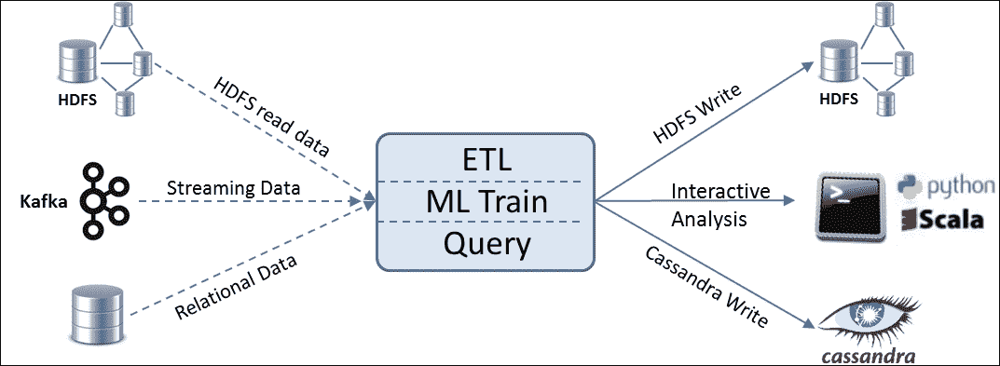
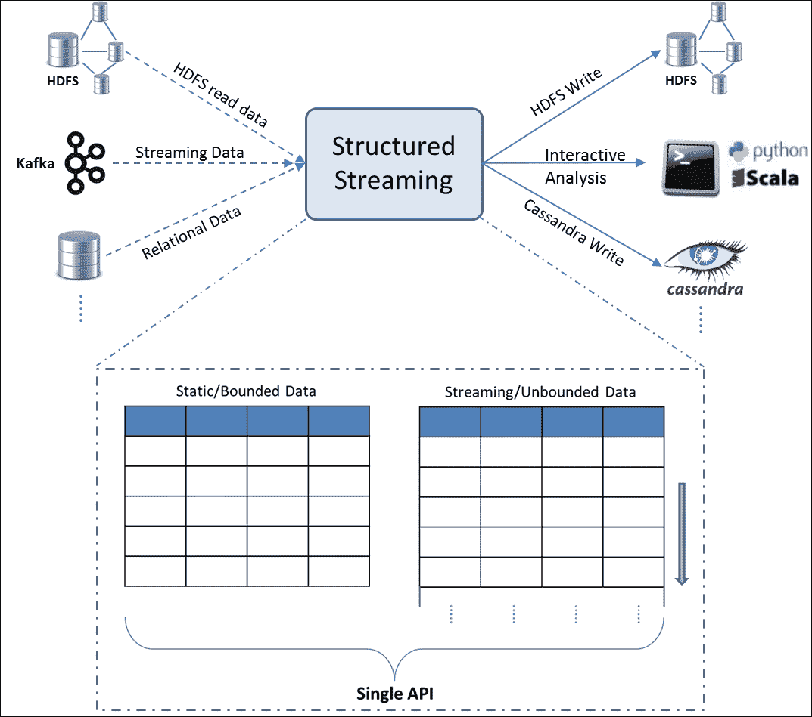
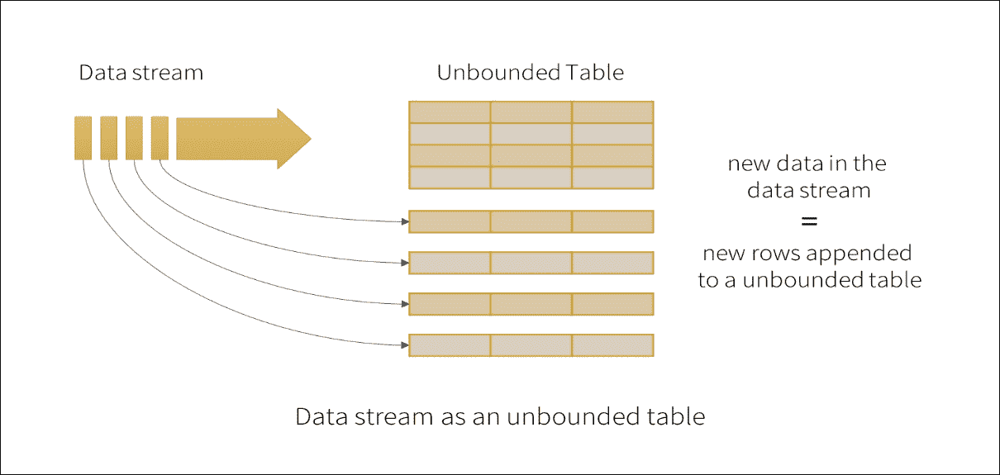
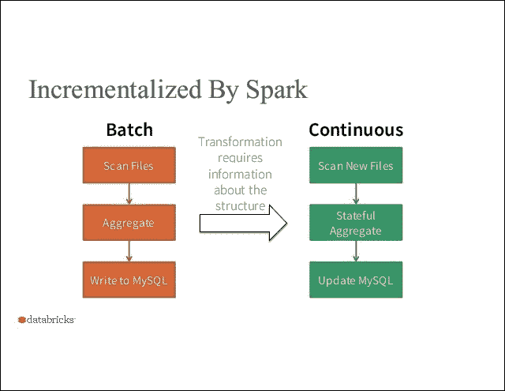
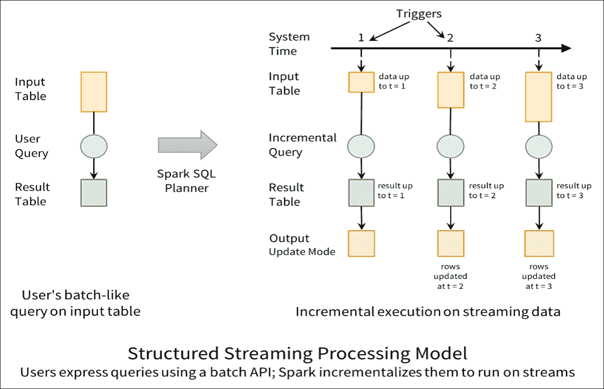
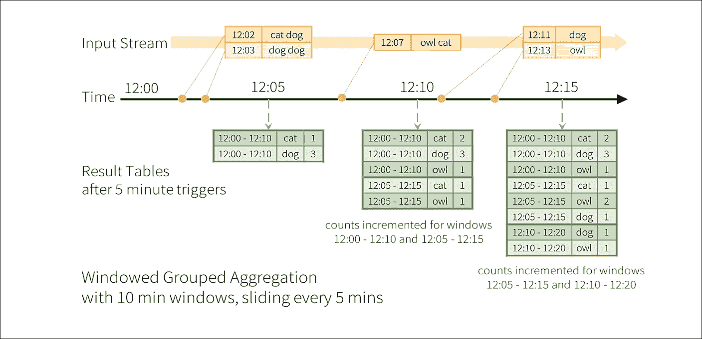
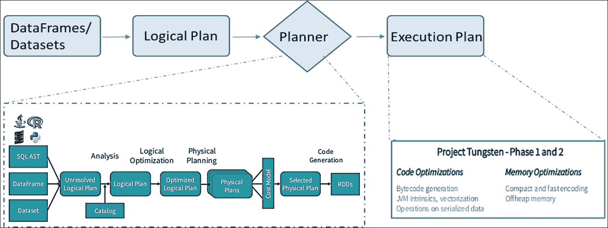
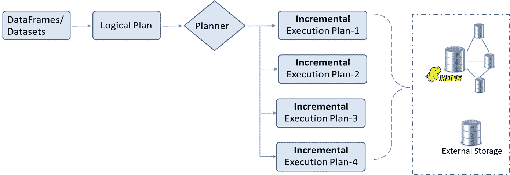
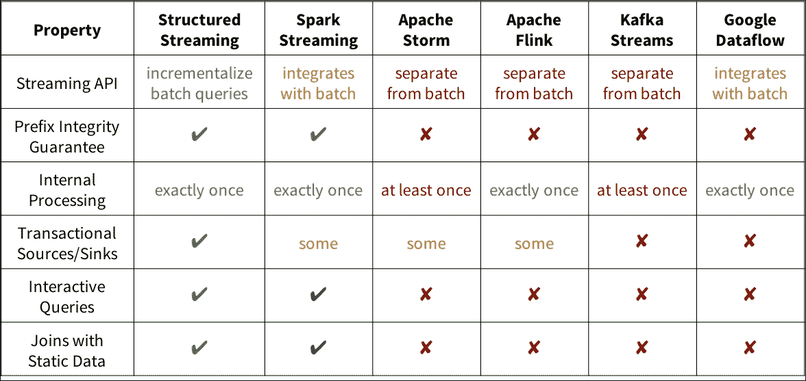
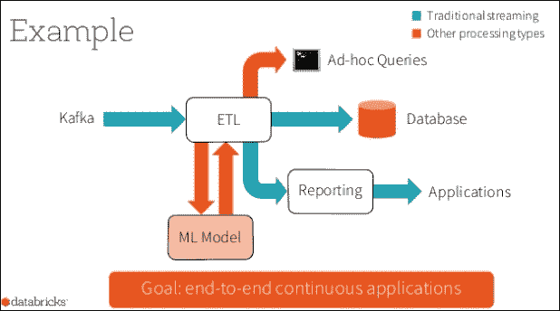

# 第四章：统一数据访问

来自不同数据源的数据集成一直是一项艰巨的任务。大数据的三个 V 和不断缩短的处理时间框架使这项任务变得更加具有挑战性。在几乎实时地提供清晰的精心策划的数据对于业务来说非常重要。然而，实时策划的数据以及在统一方式中执行 ETL、临时查询和机器学习等不同操作的能力正在成为关键的业务差异化因素。

Apache Spark 的创建是为了提供一个可以处理各种数据源数据并支持各种不同操作的单一通用引擎。Spark 使开发人员能够在单个工作流中结合 SQL、流式处理、图形和机器学习算法！

在前几章中，我们讨论了**弹性分布式数据集**（**RDDs**）以及数据框架。在第三章中，*数据框架简介*，我们介绍了 Spark SQL 和 Catalyst 优化器。本章将在此基础上深入探讨这些主题，帮助您认识到统一数据访问的真正本质。我们将介绍新的构造，如数据集和结构化流。具体来说，我们将讨论以下内容：

+   Apache Spark 中的数据抽象

+   数据集

+   使用数据集

+   数据集 API 的限制

+   Spark SQL

+   SQL 操作

+   底层

+   结构化流

+   Spark 流式编程模型

+   底层

+   与其他流处理引擎的比较

+   连续应用

+   总结

# Apache Spark 中的数据抽象

在过去的十年中，MapReduce 框架及其流行的开源实现 Hadoop 得到了广泛的应用。然而，迭代算法和交互式临时查询得到的支持并不好。作业或算法内部阶段之间的任何数据共享都是通过磁盘读写进行的，而不是通过内存数据共享。因此，逻辑上的下一步将是有一种机制，可以在多个作业之间重复使用中间结果。RDD 是一个通用的数据抽象，旨在解决这一需求。

RDD 是 Apache Spark 中的核心抽象。它是一个不可变的、容错的分布式集合，通常存储在内存中，其中包含静态类型的对象。RDD API 提供了简单的操作，如 map、reduce 和 filter，可以以任意方式组合。

数据框架抽象建立在 RDD 之上，并添加了“命名”列。因此，Spark 数据框架具有类似关系数据库表和 R 和 Python（pandas）中的数据框架的命名列行。这种熟悉的高级抽象使开发工作变得更加容易，因为它让您可以像处理 SQL 表或 Excel 文件一样处理数据。此外，底层的 Catalyst 优化器编译操作并生成 JVM 字节码以进行高效执行。然而，命名列方法也带来了一个新问题。编译器不再具有静态类型信息，因此我们失去了编译时类型安全的优势。

数据集 API 被引入，以结合 RDD 和数据框架的最佳特性，以及一些自己的特性。数据集提供了类似数据框架的行和列数据抽象，但在其之上定义了一种结构。这种结构可以由 Scala 中的 case 类或 Java 中的类定义。它们提供了类型安全和类似 RDD 的 lambda 函数。因此，它们支持诸如`map`和`groupByKey`之类的类型化方法，也支持诸如`select`和`groupBy`之类的无类型方法。除了 Catalyst 优化器外，数据集还利用了 Tungsten 执行引擎提供的内存编码，进一步提高了性能。

到目前为止引入的数据抽象形成了核心抽象。还有一些更专门的数据抽象是在这些抽象之上工作的。引入了流式 API 来处理来自各种来源（如 Flume 和 Kafka）的实时流数据。这些 API 共同工作，为数据工程师提供了一个统一的、连续的 DataFrame 抽象，可用于交互式和批量查询。另一个专门的数据抽象的例子是 GraphFrame。这使开发人员能够分析社交网络和任何其他图形，以及类似 Excel 的二维数据。

现在，考虑到现有数据抽象的基础知识，让我们了解一下我们所说的统一数据访问平台到底是什么：



统一平台背后的意图是它不仅可以让您将静态和流式数据结合在一起，还可以以统一的方式对数据进行各种不同类型的操作！从开发人员的角度来看，数据集是与之一起工作的核心抽象，而 Spark SQL 是与 Spark 功能交互的主要接口。与 SQL 声明式编程接口相结合的二维数据结构一直是处理数据的一种熟悉方式，从而缩短了数据工程师的学习曲线。因此，理解统一平台意味着理解数据集和 Spark SQL。

# 数据集

Apache Spark 的**数据集**是 DataFrame API 的扩展，提供了一种类型安全的面向对象的编程接口。这个 API 首次在 1.6 版本中引入。Spark 2.0 版本带来了 DataFrame 和 Dataset API 的统一。DataFrame 变成了一个通用的、无类型的数据集；或者说数据集是一个带有附加结构的 DataFrame。在这个上下文中，“结构”指的是底层数据的模式或组织，更像是 RDBMS 术语中的表模式。结构对可以在底层数据中表达或包含的内容施加了限制。这反过来使得内存组织和物理执行的优化更好。编译时类型检查导致在运行时之前捕获错误。例如，在 SQL 比较中的类型不匹配直到运行时才被捕获，而如果它被表达为对数据集的一系列操作，它将在编译时被捕获。然而，Python 和 R 的固有动态特性意味着没有编译时类型安全，因此数据集的概念不适用于这些语言。数据集和 DataFrame 的统一仅适用于 Scala 和 Java API。

数据集抽象的核心是**编码器**。这些编码器在 JVM 对象和 Spark 内部 Tungsten 二进制格式之间进行转换。这种内部表示绕过了 JVM 的内存管理和垃圾回收。Spark 有自己的 C 风格内存访问，专门用于解决它支持的工作流类型。由此产生的内部表示占用更少的内存，并具有高效的内存管理。紧凑的内存表示导致在洗牌操作期间减少网络负载。编码器生成紧凑的字节码，直接在序列化对象上操作，而无需反序列化，从而提高性能。早期了解模式会导致在缓存数据集时内存布局更加优化。

## 使用数据集

在这一部分，我们将创建数据集并执行转换和操作，就像 DataFrame 和 RDD 一样。

示例 1-从简单集合创建数据集：

**Scala:**

```scala
//Create a Dataset from a simple collection 
scala> val ds1 = List.range(1,5).toDS() 
ds1: org.apache.spark.sql.Dataset[Int] = [value: int] 
//Perform an action 
scala> ds1.collect() 
res3: Array[Int] = Array(1, 2, 3, 4) 

//Create from an RDD 
scala> val colors = List("red","orange","blue","green","yellow") 
scala> val color_ds = sc.parallelize(colors).map(x => 
     (x,x.length)).toDS() 
//Add a case class 
case class Color(var color: String, var len: Int) 
val color_ds = sc.parallelize(colors).map(x => 
     Color(x,x.length)).toDS() 

```

正如在前面的代码中的最后一个示例中所示，`case class`添加了结构信息。Spark 使用这个结构来创建最佳的数据布局和编码。以下代码向我们展示了结构和执行计划：

**Scala:**

```scala
//Examine the structure 
scala> color_ds.dtypes 
res26: Array[(String, String)] = Array((color,StringType), (len,IntegerType)) 
scala> color_ds.schema 
res25: org.apache.spark.sql.types.StructType = StructType(StructField(color,StringType,true), 
StructField(len,IntegerType,false)) 
//Examine the execution plan 
scala> color_ds.explain() 
== Physical Plan == 
Scan ExistingRDD[color#57,len#58] 

```

前面的例子显示了预期的结构和实现物理计划。如果您想获得更详细的执行计划，您必须传递 explain（true），这将打印扩展信息，包括逻辑计划。

我们已经从简单集合和 RDD 中创建了数据集。我们已经讨论过 DataFrame 只是无类型数据集。以下示例显示了数据集和 DataFrame 之间的转换。

示例 2-将数据集转换为 DataFrame

**Scala:**

```scala
//Convert the dataset to a DataFrame 
scala> val color_df = color_ds.toDF() 
color_df: org.apache.spark.sql.DataFrame = [color: string, len: int] 

scala> color_df.show() 
+------+---+ 
| color|len| 
+------+---+ 
|   red|  3| 
|orange|  6| 
|  blue|  4| 
| green|  5| 
|yellow|  6| 
+------+---+ 

```

这个例子看起来非常像我们在第三章中看到的例子，*DataFrame 简介*。这些转换在现实世界中非常方便。考虑向不完整的数据添加结构（也称为案例类）。您可以首先将数据读入 DataFrame，进行清洗，然后将其转换为数据集。另一个用例可能是，您希望基于某些运行时信息（例如`user_id`）仅公开数据的子集（行和列）。您可以将数据读入 DataFrame，将其注册为临时表，应用条件，并将子集公开为数据集。以下示例首先创建一个`DataFrame`，然后将其转换为`Dataset`。请注意，DataFrame 列名必须与案例类匹配。

示例 3-将 DataFrame 转换为数据集

```scala
//Construct a DataFrame first 
scala> val color_df = sc.parallelize(colors).map(x => 
           (x,x.length)).toDF("color","len") 
color_df: org.apache.spark.sql.DataFrame = [color: string, len: int] 
//Convert the DataFrame to a Dataset with a given structure 
scala> val ds_from_df = color_df.as[Color] 
ds_from_df: org.apache.spark.sql.Dataset[Color] = [color: string, len: int] 
//Check the execution plan 
scala> ds_from_df.explain 
== Physical Plan == 
WholeStageCodegen 
:  +- Project [_1#102 AS color#105,_2#103 AS len#106] 
:     +- INPUT 
+- Scan ExistingRDD[_1#102,_2#103] 

```

解释命令的响应显示`WholeStageCodegen`，它将多个操作融合为单个 Java 函数调用。这通过减少多个虚拟函数调用来增强性能。自 1.1 以来，代码生成一直存在于 Spark 引擎中，但当时它仅限于表达式评估和一小部分操作，如过滤。相比之下，Tungsten 的整个阶段代码生成为整个查询计划生成代码。

### 从 JSON 创建数据集

数据集可以像 DataFrame 一样从 JSON 文件中创建。请注意，JSON 文件可能包含多个记录，但每个记录必须在一行上。如果您的源 JSON 有换行符，您必须以编程方式将其删除。JSON 记录可能包含数组并且可能是嵌套的。它们不需要具有统一的模式。以下示例文件包含具有附加标记和数据数组的 JSON 记录。

示例 4-从 JSON 创建数据集

**Scala:**

```scala
//Set filepath 
scala> val file_path = <Your path> 
file_path: String = ./authors.json 
//Create case class to match schema 
scala> case class Auth(first_name: String, last_name: String,books: Array[String]) 
defined class Auth 

//Create dataset from json using case class 
//Note that the json document should have one record per line 
scala> val auth = spark.read.json(file_path).as[Auth] 
auth: org.apache.spark.sql.Dataset[Auth] = [books: array<string>, firstName: string ... 1 more field] 

//Look at the data 
scala> auth.show() 
+--------------------+----------+---------+ 
|               books|first_name|last_name| 
+--------------------+----------+---------+ 
|                null|      Mark|    Twain| 
|                null|   Charles|  Dickens| 
|[Jude the Obscure...|    Thomas|    Hardy| 
+--------------------+----------+---------+ 

//Try explode to see array contents on separate lines 

scala> auth.select(explode($"books") as "book", 
            $"first_name",$"last_name").show(2,false) 
+------------------------+----------+---------+ 
|book                    |first_name|last_name| 
+------------------------+----------+---------+ 
|Jude the Obscure        |Thomas    |Hardy    | 
|The Return of the Native|Thomas    |Hardy    | 
+------------------------+----------+---------+ 

```

## 数据集 API 的限制

尽管数据集 API 是使用 RDD 和 DataFrame 的最佳部分创建的，但在当前开发阶段仍存在一些限制：

+   在查询数据集时，所选字段应该具有与案例类相同的特定数据类型，否则输出将变为 DataFrame。例如`auth.select(col("first_name").as[String])`。

+   Python 和 R 在本质上是动态的，因此类型化的数据集不适合。

# Spark SQL

**Spark SQL**是 Spark 1.0 引入的用于结构化数据处理的 Spark 模块。该模块是一个与核心 Spark API 紧密集成的关系引擎。它使数据工程师能够编写应用程序，从不同来源加载结构化数据，并将它们作为统一的、可能连续的类似 Excel 的数据框进行连接；然后他们可以实现复杂的 ETL 工作流和高级分析。

Spark 2.0 版本带来了 API 的显著统一和扩展的 SQL 功能，包括对子查询的支持。数据集 API 和 DataFrame API 现在是统一的，DataFrame 是数据集的一种“类型”。统一的 API 为 Spark 的未来奠定了基础，跨越所有库。开发人员可以将“结构”强加到其数据上，并可以使用高级声明性 API，从而提高性能和生产率。性能增益是由底层优化层带来的。数据框，数据集和 SQL 共享相同的优化和执行管道。

## SQL 操作

SQL 操作是用于数据操作的最广泛使用的构造。一些最常用的操作是，选择所有或一些列，基于一个或多个条件进行过滤，排序和分组操作，以及计算`average`等汇总函数。多个数据源上的`JOIN`操作和`set`操作，如`union`，`intersect`和`minus`，是广泛执行的其他操作。此外，数据框被注册为临时表，并传递传统的 SQL 语句来执行上述操作。**用户定义的函数**（**UDF**）被定义并用于注册和不注册。我们将专注于窗口操作，这是在 Spark 2.0 中刚刚引入的。它们处理滑动窗口操作。例如，如果您想要报告过去七天内每天的平均最高温度，那么您正在操作一个直到今天的七天滑动窗口。这是一个示例，计算过去三个月每月的平均销售额。数据文件包含 24 个观测值，显示了两种产品 P1 和 P2 的月销售额。

示例 5-使用移动平均计算的窗口示例

**Scala:**

```scala
scala> import org.apache.spark.sql.expressions.Window 
import org.apache.spark.sql.expressions.Window 
//Create a DataFrame containing monthly sales data for two products 
scala> val monthlySales = spark.read.options(Map({"header"->"true"},{"inferSchema" -> "true"})). 
                            csv("<Your Path>/MonthlySales.csv") 
monthlySales: org.apache.spark.sql.DataFrame = [Product: string, Month: int ... 1 more field] 

//Prepare WindowSpec to create a 3 month sliding window for a product 
//Negative subscript denotes rows above current row 
scala> val w = Window.partitionBy(monthlySales("Product")).orderBy(monthlySales("Month")).rangeBetween(-2,0) 
w: org.apache.spark.sql.expressions.WindowSpec = org.apache.spark.sql.expressions.WindowSpec@3cc2f15 

//Define compute on the sliding window, a moving average in this case 
scala> val f = avg(monthlySales("Sales")).over(w) 
f: org.apache.spark.sql.Column = avg(Sales) OVER (PARTITION BY Product ORDER BY Month ASC RANGE BETWEEN 2 PRECEDING AND CURRENT ROW) 
//Apply the sliding window and compute. Examine the results 
scala> monthlySales.select($"Product",$"Sales",$"Month", bround(f,2).alias("MovingAvg")). 
                    orderBy($"Product",$"Month").show(6) 
+-------+-----+-----+---------+                                                  
|Product|Sales|Month|MovingAvg| 
+-------+-----+-----+---------+ 
|     P1|   66|    1|     66.0| 
|     P1|   24|    2|     45.0| 
|     P1|   54|    3|     48.0| 
|     P1|    0|    4|     26.0| 
|     P1|   56|    5|    36.67| 
|     P1|   34|    6|     30.0| 
+-------+-----+-----+---------+ 

```

**Python:**

```scala
    >>> from pyspark.sql import Window
    >>> import pyspark.sql.functions as func
    //Create a DataFrame containing monthly sales data for two products
    >> file_path = <Your path>/MonthlySales.csv"
    >>> monthlySales = spark.read.csv(file_path,header=True, inferSchema=True)

    //Prepare WindowSpec to create a 3 month sliding window for a product
    //Negative subscript denotes rows above current row
    >>> w = Window.partitionBy(monthlySales["Product"]).orderBy(monthlySales["Month"]).rangeBetween(-2,0)
    >>> w
    <pyspark.sql.window.WindowSpec object at 0x7fdc33774a50>
    >>>
    //Define compute on the sliding window, a moving average in this case
    >>> f = func.avg(monthlySales["Sales"]).over(w)
    >>> f
    Column<avg(Sales) OVER (PARTITION BY Product ORDER BY Month ASC RANGE BETWEEN 2 PRECEDING AND CURRENT ROW)>
    >>>
    //Apply the sliding window and compute. Examine the results
    >>> monthlySales.select(monthlySales.Product,monthlySales.Sales,monthlySales.Month,
                          func.bround(f,2).alias("MovingAvg")).orderBy(
                          monthlySales.Product,monthlySales.Month).show(6)
    +-------+-----+-----+---------+                                                 
    |Product|Sales|Month|MovingAvg|
    +-------+-----+-----+---------+
    |     P1|   66|    1|     66.0|
    |     P1|   24|    2|     45.0|
    |     P1|   54|    3|     48.0|
    |     P1|    0|    4|     26.0|
    |     P1|   56|    5|    36.67|
    |     P1|   34|    6|     30.0|
    +-------+-----+-----+---------+

```

## 在幕后

当开发人员使用 RDD API 编写程序时，高效执行手头的工作负载是他/她的责任。数据类型和计算对于 Spark 来说是不可用的。相比之下，当开发人员使用 DataFrames 和 Spark SQL 时，底层引擎具有关于模式和操作的信息。在这种情况下，开发人员可以编写更少的代码，而优化器会做所有的艰苦工作。

Catalyst 优化器包含用于表示树和应用规则以转换树的库。这些树转换被应用于创建最优化的逻辑和物理执行计划。在最后阶段，它使用 Scala 语言的一个特殊功能**quasiquotes**生成 Java 字节码。优化器还使外部开发人员能够通过添加数据源特定规则来扩展优化器，这些规则导致将操作推送到外部系统，或支持新的数据类型。

Catalyst 优化器得出了最优化的计划来执行手头的操作。实际的执行和相关的改进由 Tungsten 引擎提供。Tungsten 的目标是提高 Spark 后端执行的内存和 CPU 效率。以下是该引擎的一些显着特点：

+   通过绕过（堆外）Java 内存管理来减少内存占用和消除垃圾收集开销。

+   代码生成在多个操作符之间融合，避免了过多的虚拟函数调用。生成的代码看起来像手动优化的代码。

+   内存布局是以列为基础的，内存中的 parquet 格式，因为这样可以实现矢量化处理，并且更接近通常的数据访问操作。

+   使用编码器进行内存编码。编码器使用运行时代码生成来构建自定义字节码，以实现更快和更紧凑的序列化和反序列化。许多操作可以在原地执行，而无需反序列化，因为它们已经处于 Tungsten 二进制格式中。

# 结构化流处理

流处理似乎是一个广泛的话题！如果您仔细观察现实世界的问题，企业不仅希望流处理引擎实时做出决策。一直以来，都需要集成批处理栈和流处理栈，并与外部存储系统和应用程序集成。此外，解决方案应该能够适应业务逻辑的动态变化，以满足新的和不断变化的业务需求。

Apache Spark 2.0 具有称为**结构化流**引擎的高级流处理 API 的第一个版本。这个可扩展和容错的引擎依赖于 Spark SQL API 来简化实时连续的大数据应用程序的开发。这可能是统一批处理和流处理计算的第一次成功尝试。

在技术层面上，结构化流依赖于 Spark SQL API，它扩展了数据框/数据集，我们在前面的部分已经讨论过。Spark 2.0 让您以统一的方式执行根本不同的活动，例如：

+   构建 ML 模型并将其应用于流数据

+   将流数据与其他静态数据结合

+   执行临时、交互和批量查询

+   在运行时更改查询

+   聚合数据流并使用 Spark SQL JDBC 提供服务

与其他流式引擎不同，Spark 允许您将实时**流数据**与**静态数据**结合，并执行前述操作。



从根本上讲，结构化流由 Spark SQL 的 Catalyst 优化器赋予了能力。因此，它使开发人员不必担心处理静态或实时数据流时使查询更有效的底层管道。

截至目前，Spark 2.0 的结构化流主要集中在 ETL 上，以后的版本将具有更多的操作符和库。

让我们看一个简单的例子。以下示例监听 Linux 上本地机器上的**系统活动报告**（**sar**）并计算平均空闲内存。系统活动报告提供系统活动统计信息，当前示例收集内存使用情况，以 2 秒的间隔报告 20 次。Spark 流读取这个流式输出并计算平均内存。我们使用一个方便的网络实用工具**netcat**（**nc**）将`sar`输出重定向到给定端口。选项`l`和`k`指定`nc`应该监听传入连接，并且在当前连接完成后，它必须继续监听另一个连接。

**Scala:**

示例 6-流式示例

```scala
//Run the following command from one terminal window 
sar -r 2 20 | nc -lk 9999 

//In spark-shell window, do the following 
//Read stream 
scala> val myStream = spark.readStream.format("socket"). 
                       option("host","localhost"). 
                       option("port",9999).load() 
myStream: org.apache.spark.sql.DataFrame = [value: string] 

//Filter out unwanted lines and then extract free memory part as a float 
//Drop missing values, if any 
scala> val myDF = myStream.filter($"value".contains("IST")). 
               select(substring($"value",15,9).cast("float").as("memFree")). 
               na.drop().select($"memFree") 
myDF: org.apache.spark.sql.DataFrame = [memFree: float] 

//Define an aggregate function 
scala> val avgMemFree = myDF.select(avg("memFree")) 
avgMemFree: org.apache.spark.sql.DataFrame = [avg(memFree): double] 

//Create StreamingQuery handle that writes on to the console 
scala> val query = avgMemFree.writeStream. 
          outputMode("complete"). 
          format("console"). 
          start() 
query: org.apache.spark.sql.streaming.StreamingQuery = Streaming Query - query-0 [state = ACTIVE] 

Batch: 0 
------------------------------------------- 
+-----------------+ 
|     avg(memFree)| 
+-----------------+ 
|4116531.380952381| 
+-----------------+ 
.... 

```

**Python:**

```scala
    //Run the following command from one terminal window
     sar -r 2 20 | nc -lk 9999

    //In another window, open pyspark shell and do the following
    >>> import pyspark.sql.functions as func
    //Read stream
    >>> myStream = spark.readStream.format("socket"). \
                           option("host","localhost"). \
                           option("port",9999).load()
    myStream: org.apache.spark.sql.DataFrame = [value: string]

    //Filter out unwanted lines and then extract free memory part as a float
    //Drop missing values, if any
    >>> myDF = myStream.filter("value rlike 'IST'"). \
               select(func.substring("value",15,9).cast("float"). \
               alias("memFree")).na.drop().select("memFree")

    //Define an aggregate function
    >>> avgMemFree = myDF.select(func.avg("memFree"))

    //Create StreamingQuery handle that writes on to the console
    >>> query = avgMemFree.writeStream. \
              outputMode("complete"). \
              format("console"). \
              start()
    Batch: 0
    -------------------------------------------
    +------------+
    |avg(memFree)|
    +------------+
    |   4042749.2|
    +------------+
    .....

```

前面的示例定义了一个连续的数据框（也称为流）来监听特定端口，执行一些转换和聚合，并显示连续的输出。

## Spark 流式编程模型

正如本章前面所示，只需使用单个 API 来处理静态和流数据。其想法是将实时数据流视为不断追加的表，如下图所示：



因此，无论是静态数据还是流数据，您只需像在静态数据表上那样启动类似批处理的查询，Spark 会将其作为无界输入表上的增量查询运行，如下图所示：



因此，开发人员以相同的方式在输入表上定义查询，无论是静态有界表还是动态无界表。让我们了解整个过程的各种技术术语，以了解它是如何工作的：

+   **输入：**来自源的追加表的数据

+   **触发器：**何时检查输入以获取新数据

+   **查询：**对数据执行的操作，例如过滤、分组等

+   **结果：**每个触发间隔的结果表

+   **输出：**选择在每个触发后写入数据接收器的结果的哪一部分

现在让我们看看 Spark SQL 规划器如何处理整个过程：



提供：Databricks

前面的屏幕截图在官方 Apache Spark 网站的结构化编程指南中有非常简单的解释，如*参考*部分所示。



在这一点上，我们需要了解支持的输出模式。每次更新结果表时，更改都需要写入外部系统，如 HDFS、S3 或任何其他数据库。我们通常倾向于增量写入输出。为此，结构化流提供了三种输出模式：

+   **Append:**在外部存储中，自上次触发以来追加到结果表的新行将被写入。这仅适用于查询，其中结果表中的现有行不会更改（例如，对输入流的映射）。

+   **Complete:**在外部存储中，整个更新的结果表将按原样写入。

+   **更新：**在外部存储中，自上次触发以来在结果表中更新的行将被更改。此模式适用于可以就地更新的输出接收器，例如 MySQL 表。

在我们的示例中，我们使用了完整模式，直接写入控制台。您可能希望将数据写入一些外部文件，如 Parquet，以便更好地理解。

## 底层原理

如果您查看在**DataFrames/Datasets**上执行的操作的“幕后”执行机制，它将如下图所示：



请注意，**Planner**事先知道如何将流式**Logical Plan**转换为一系列**Incremental Execution Plans**。这可以用以下图表示：



**Planner**可以轮询数据源以便以优化的方式规划执行。

## 与其他流式引擎的比较

我们已经讨论了结构化流的许多独特特性。现在让我们与其他可用的流式引擎进行比较：



提供：Databricks

# 连续应用程序

我们讨论了 Spark 如何赋予统一数据访问的能力。它让您以多种方式处理数据，通过启用各种分析工作负载来构建端到端的连续应用程序，例如 ETL 处理、adhoc 查询、在线机器学习建模，或生成必要的报告...所有这些都可以通过让您使用高级的、类似 SQL 的 API 来处理静态和流式数据的方式来统一进行，从而大大简化了实时连续应用程序的开发和维护。



提供：Databricks

# 摘要

在本章中，我们讨论了统一数据访问的真正含义以及 Spark 如何实现这一目的。我们仔细研究了 Datasets API 以及实时流如何通过它得到增强。我们了解了 Datasets 的优势以及它们的局限性。我们还研究了连续应用程序背后的基本原理。

在下一章中，我们将探讨利用 Spark 平台进行规模化数据分析操作的各种方法。

# 参考文献

+   [`people.csail.mit.edu/matei/papers/2015/sigmod_spark_sql.pdf`](http://people.csail.mit.edu/matei/papers/2015/sigmod_spark_sql.pdf)：Spark SQL：Spark 中的关系数据处理

+   [`databricks.com/blog/2016/07/14/a-tale-of-three-apache-spark-apis-rdds-dataframes-and-datasets.html`](https://databricks.com/blog/2016/07/14/a-tale-of-three-apache-spark-apis-rdds-dataframes-and-datasets.html)：三种 Apache Spark API 的故事：RDDs、DataFrames 和 Datasets-何时使用它们以及为什么

+   [`databricks.com/blog/2016/01/04/introducing-apache-spark-datasets.html`](https://databricks.com/blog/2016/01/04/introducing-apache-spark-datasets.html)：介绍 Apache Spark Datasets

+   [`databricks.com/blog/2015/04/13/deep-dive-into-spark-sqls-catalyst-optimizer.html`](https://databricks.com/blog/2015/04/13/deep-dive-into-spark-sqls-catalyst-optimizer.html)：深入了解 Spark SQL 的 Catalyst 优化器

+   [`databricks.com/blog/2016/05/23/apache-spark-as-a-compiler-joining-a-billion-rows-per-second-on-a-laptop.html`](https://databricks.com/blog/2016/05/23/apache-spark-as-a-compiler-joining-a-billion-rows-per-second-on-a-laptop.html) : Apache Spark 作为编译器：在笔记本电脑上每秒连接十亿行

+   [`databricks.com/blog/2015/04/28/project-tungsten-bringing-spark-closer-to-bare-metal.html`](https://databricks.com/blog/2015/04/28/project-tungsten-bringing-spark-closer-to-bare-metal.html) : 将 Spark 靠近裸金属

+   [`databricks.com/blog/2016/07/28/structured-streaming-in-apache-spark.html`](https://databricks.com/blog/2016/07/28/structured-streaming-in-apache-spark.html) : Apache Spark 中的结构化流 API 详细信息

+   [`spark.apache.org/docs/latest/structured-streaming-programming-guide.html`](https://spark.apache.org/docs/latest/structured-streaming-programming-guide.html) : Spark 结构化流编程指南

+   [`spark-summit.org/east-2016/events/structuring-spark-dataframes-datasets-and-streaming/`](https://spark-summit.org/east-2016/events/structuring-spark-dataframes-datasets-and-streaming/): Michael Armbrust 介绍 Apache Spark SQL，DataFrames，Datasets 和 Streaming

+   [`databricks.com/blog/2016/06/22/apache-spark-key-terms-explained.html`](https://databricks.com/blog/2016/06/22/apache-spark-key-terms-explained.html): Apache Spark 关键术语解释
