# 第五章：Spark 上的数据分析

大规模数据分析领域一直在不断发展。为数据分析开发了各种库和工具，具有丰富的算法集。与此同时，分布式计算技术也在不断发展，以便规模化处理大型数据集。这两种特征必须融合，这是开发 Spark 的主要意图。

前两章概述了数据科学的技术方面。它涵盖了 DataFrame API、数据集、流数据的一些基础知识，以及它如何通过数据框架来表示数据，这是 R 和 Python 用户熟悉的。在介绍了这个 API 之后，我们看到操作数据集变得比以往更容易。我们还看到 Spark SQL 如何在支持 DataFrame API 时发挥了后台作用，具有其强大的功能和优化技术。在本章中，我们将涵盖大数据分析的科学方面，并学习可以在 Spark 上执行的各种数据分析技术。

作为本章的先决条件，对 DataFrame API 和统计基础的基本理解是有益的。然而，我们已经尽量简化内容，并详细介绍了一些重要的基础知识，以便任何人都可以开始使用 Spark 进行统计分析。本章涵盖的主题如下：

+   数据分析生命周期

+   数据获取

+   数据准备

+   数据整合

+   数据清洗

+   数据转换

+   统计基础

+   抽样

+   数据分布

+   描述性统计

+   位置测量

+   传播测量

+   总结统计

+   图形技术

+   推断统计

+   离散概率分布

+   连续概率分布

+   标准误差

+   置信水平

+   误差边界和置信区间

+   总体变异性

+   估计样本大小

+   假设检验

+   卡方检验

+   F 检验

+   相关性

# 数据分析生命周期

对于大多数现实项目，需要遵循一定的步骤顺序。然而，对于数据分析和数据科学，没有普遍认可的定义或界限。一般来说，“数据分析”这个术语包括检查数据、发现有用见解和传达这些见解所涉及的技术和过程。术语“数据科学”可以最好地被视为一个跨学科领域，涵盖*统计学*、*计算机科学*和*数学*。这两个术语都涉及处理原始数据以获取知识或见解，通常是迭代的过程，有些人将它们互换使用。

根据不同的业务需求，有不同的解决问题的方式，但没有一个适合所有可能情况的唯一标准流程。典型的流程工作流程可以总结为制定问题、探索、假设、验证假设、分析结果，并重新开始的循环。这在下图中用粗箭头表示。从数据角度看，工作流程包括数据获取、预处理、数据探索、建模和传达结果。这在图中显示为圆圈。分析和可视化发生在每个阶段，从数据收集到结果传达。数据分析工作流程包括两个视图中显示的所有活动：

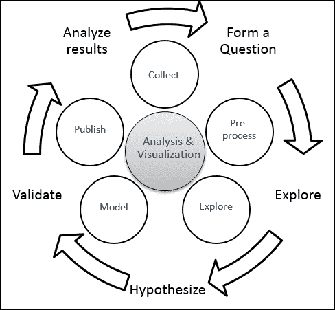

整个生命周期中最重要的是提出的问题。可能包含答案（相关数据！）的数据紧随其后。根据问题，第一个任务是根据需要从一个或多个数据源收集正确的数据。组织通常维护**数据湖**，这是数据以其原始格式存储的巨大存储库。

下一步是清洗/转换数据到所需的格式。数据清洗也称为数据整理、数据处理或数据清理。这包括在评估手头数据的质量后进行的活动，如处理缺失值和异常值。你可能还需要对数据进行聚合/绘图以更好地理解。这个制定最终数据矩阵以便处理的过程被吹捧为最耗时的步骤。这也是一个被低估的组成部分，被认为是预处理的一部分，还有其他活动，比如特征提取和数据转换。

数据科学的核心，即训练模型和提取模式，接下来就要进行，这需要大量使用统计学和机器学习。最后一步是发布结果。

本章的其余部分将更深入地探讨每个步骤以及如何使用 Spark 实现这些步骤。还包括一些统计学的基础知识，以便读者能够轻松地跟随代码片段。

# 数据获取

数据获取，或者说数据收集，是任何数据科学项目中的第一步。通常情况下，你不会在一个地方找到所有所需的完整数据集，因为它分布在**业务线**（**LOB**）应用程序和系统中。

本节的大部分内容已经在上一章中涵盖了，概述了如何从不同的数据源获取数据并将数据存储在 DataFrames 中以便进行更轻松的分析。Spark 中有一种内置机制，可以从一些常见的数据源中获取数据，并为那些不受 Spark 支持的数据源提供*数据源 API*。

为了更好地理解数据获取和准备阶段，让我们假设一个场景，并尝试用示例代码片段解决所有涉及的步骤。假设员工数据分布在本地 RDD、JSON 文件和 SQL 服务器上。那么，让我们看看如何将它们转换为 Spark DataFrames：

**Python**

```scala
// From RDD: Create an RDD and convert to DataFrame
>>> employees = sc.parallelize([(1, "John", 25), (2, "Ray", 35), (3, "Mike", 24), (4, "Jane", 28), (5, "Kevin", 26), (6, "Vincent", 35), (7, "James", 38), (8, "Shane", 32), (9, "Larry", 29), (10, "Kimberly", 29), (11, "Alex", 28), (12, "Garry", 25), (13, "Max", 31)]).toDF(["emp_id","name","age"])
>>>

// From JSON: reading a JSON file
>>> salary = sqlContext.read.json("./salary.json")
>>> designation = sqlContext.read.json("./designation.json")
```

**Scala**

```scala
// From RDD: Create an RDD and convert to DataFrame
scala> val employees = sc.parallelize(List((1, "John", 25), (2, "Ray", 35), (3, "Mike", 24), (4, "Jane", 28), (5, "Kevin", 26), (6, "Vincent", 35), (7, "James", 38), (8, "Shane", 32), (9, "Larry", 29), (10, "Kimberly", 29), (11, "Alex", 28), (12, "Garry", 25), (13, "Max", 31))).toDF("emp_id","name","age")
employees: org.apache.spark.sql.DataFrame = [emp_id: int, name: string ... 1 more field]
scala> // From JSON: reading a JSON file
scala> val salary = spark.read.json("./salary.json")
salary: org.apache.spark.sql.DataFrame = [e_id: bigint, salary: bigint]
scala> val designation = spark.read.json("./designation.json")
designation: org.apache.spark.sql.DataFrame = [id: bigint, role: string]
```

# 数据准备

数据质量一直是行业中普遍存在的问题。不正确或不一致的数据可能会产生你分析的误导性结果。如果数据没有经过清洗和准备，按照要求，实施更好的算法或构建更好的模型也不会有太大帮助。有一个行业术语叫做**数据工程**，指的是数据的获取和准备。这通常由数据科学家完成，在一些组织中，还有专门的团队负责这个目的。然而，在准备数据时，通常需要科学的视角来做正确的处理。例如，你可能不只是进行*均值替换*来处理缺失值，还要查看数据分布以找到更合适的替代值。另一个例子是，你可能不只是查看箱线图或散点图来寻找异常值，因为可能存在多变量异常值，如果你只绘制一个变量，是看不到的。有不同的方法，比如**高斯混合模型**（**GMMs**）和**期望最大化**（**EM**）算法，使用**马哈拉诺比斯距离**来寻找多变量异常值。

数据准备阶段是一个非常重要的阶段，不仅是为了算法能够正常工作，也是为了让你更好地理解你的数据，以便在实施算法时采取正确的方法。

一旦数据从不同的来源获取到，下一步就是将它们整合起来，以便对数据作为一个整体进行清洗、格式化和转换，以满足你的分析需求。请注意，根据情况，你可能需要从这些来源中取样数据，然后准备数据进行进一步分析。本章后面将讨论可以使用的各种取样技术。

## 数据整合

在本节中，我们将看看如何合并从各种数据源获取的数据：

**Python**

```scala
// Creating the final data matrix using the join operation
>>> final_data = employees.join(salary, employees.emp_id == salary.e_id).join(designation, employees.emp_id == designation.id).select("emp_id", "name", "age", "role", "salary")
>>> final_data.show(5)
+------+-----+---+---------+------+
|emp_id| name|age|     role|salary|
+------+-----+---+---------+------+
|     1| John| 25|Associate| 10000|
|     2|  Ray| 35|  Manager| 12000|
|     3| Mike| 24|  Manager| 12000|
|     4| Jane| 28|Associate|  null|
|     5|Kevin| 26|  Manager|   120|
+------+-----+---+---------+------+
only showing top 5 rows
```

**Scala**

```scala
// Creating the final data matrix using the join operation
scala> val final_data = employees.join(salary, $"emp_id" === $"e_id").join(designation, $"emp_id" === $"id").select("emp_id", "name", "age", "role", "salary")
final_data: org.apache.spark.sql.DataFrame = [emp_id: int, name: string ... 3 more fields]
```

从这些来源整合数据后，最终数据集（在本例中是`final_data`）应该是以下格式（只是示例数据）：

| **emp_id** | **name** | **age** | **role** | **salary** |
| --- | --- | --- | --- | --- |
| 1 | John | 25 | 职员 | 10,000 美元 |
| 2 | Ray | 35 | 经理 | 12,000 美元 |
| 3 | Mike | 24 | 经理 | 12,000 美元 |
| 4 | Jane | 28 | 职员 | null |
| 5 | Kevin | 26 | 经理 | 12,000 美元 |
| 6 | Vincent | 35 | 高级经理 | 22,000 美元 |
| 7 | James | 38 | 高级经理 | 20,000 美元 |
| 8 | Shane | 32 | 经理 | 12,000 美元 |
| 9 | Larry | 29 | 经理 | 10,000 美元 |
| 10 | Kimberly | 29 | 职员 | 8,000 美元 |
| 11 | Alex | 28 | 经理 | 12,000 美元 |
| 12 | Garry | 25 | 经理 | 12,000 美元 |
| 13 | Max | 31 | 经理 | 12,000 美元 |

## 数据清洗

一旦您将数据整合到一个地方，非常重要的是在分析之前花足够的时间和精力对其进行清理。这是一个迭代的过程，因为您必须验证对数据所采取的操作，并持续进行，直到对数据质量感到满意。建议您花时间分析您在数据中检测到的异常的原因。

任何数据集中通常都存在一定程度的不纯度。数据可能存在各种问题，但我们将解决一些常见情况，例如缺失值、重复值、转换或格式化（向数字添加或删除数字，将一列拆分为两列，将两列合并为一列）。

### 缺失值处理

处理缺失值的方法有很多种。一种方法是删除包含缺失值的行。即使单个列有缺失值，我们可能也想删除一行，或者对不同的列采取不同的策略。只要该行中的缺失值总数低于阈值，我们可能希望保留该行。另一种方法可能是用常量值替换空值，比如在数值变量的情况下用平均值替换空值。

在本节中，我们将不会提供 Scala 和 Python 的一些示例，并尝试涵盖各种情景，以便给您更广泛的视角。

**Python**

```scala
// Dropping rows with missing value(s)
>>> clean_data = final_data.na.drop()
>>> 
// Replacing missing value by mean
>>> import math
>>> from pyspark.sql import functions as F
>>> mean_salary = math.floor(salary.select(F.mean('salary')).collect()[0][0])
>>> clean_data = final_data.na.fill({'salary' : mean_salary})
>>> 
//Another example for missing value treatment
>>> authors = [['Thomas','Hardy','June 2, 1840'],
       ['Charles','Dickens','7 February 1812'],
        ['Mark','Twain',None],
        ['Jane','Austen','16 December 1775'],
      ['Emily',None,None]]
>>> df1 = sc.parallelize(authors).toDF(
       ["FirstName","LastName","Dob"])
>>> df1.show()
+---------+--------+----------------+
|FirstName|LastName|             Dob|
+---------+--------+----------------+
|   Thomas|   Hardy|    June 2, 1840|
|  Charles| Dickens| 7 February 1812|
|     Mark|   Twain|            null|
|     Jane|  Austen|16 December 1775|
|    Emily|    null|            null|
+---------+--------+----------------+

// Drop rows with missing values
>>> df1.na.drop().show()
+---------+--------+----------------+
|FirstName|LastName|             Dob|
+---------+--------+----------------+
|   Thomas|   Hardy|    June 2, 1840|
|  Charles| Dickens| 7 February 1812|
|     Jane|  Austen|16 December 1775|
+---------+--------+----------------+

// Drop rows with at least 2 missing values
>>> df1.na.drop(thresh=2).show()
+---------+--------+----------------+
|FirstName|LastName|             Dob|
+---------+--------+----------------+
|   Thomas|   Hardy|    June 2, 1840|
|  Charles| Dickens| 7 February 1812|
|     Mark|   Twain|            null|
|     Jane|  Austen|16 December 1775|
+---------+--------+----------------+

// Fill all missing values with a given string
>>> df1.na.fill('Unknown').show()
+---------+--------+----------------+
|FirstName|LastName|             Dob|
+---------+--------+----------------+
|   Thomas|   Hardy|    June 2, 1840|
|  Charles| Dickens| 7 February 1812|
|     Mark|   Twain|         Unknown|
|     Jane|  Austen|16 December 1775|
|    Emily| Unknown|         Unknown|
+---------+--------+----------------+

// Fill missing values in each column with a given string
>>> df1.na.fill({'LastName':'--','Dob':'Unknown'}).show()
+---------+--------+----------------+
|FirstName|LastName|             Dob|
+---------+--------+----------------+
|   Thomas|   Hardy|    June 2, 1840|
|  Charles| Dickens| 7 February 1812|
|     Mark|   Twain|         Unknown|
|     Jane|  Austen|16 December 1775|
|    Emily|      --|         Unknown|
+---------+--------+----------------+
```

**Scala**

```scala
//Missing value treatment
// Dropping rows with missing value(s)
scala> var clean_data = final_data.na.drop() //Note the var declaration instead of val
clean_data: org.apache.spark.sql.DataFrame = [emp_id: int, name: string ... 3 more fields]
scala>

// Replacing missing value by mean
scal> val mean_salary = final_data.select(floor(avg("salary"))).
            first()(0).toString.toDouble
mean_salary: Double = 20843.0
scal> clean_data = final_data.na.fill(Map("salary" -> mean_salary)) 

//Reassigning clean_data
clean_data: org.apache.spark.sql.DataFrame = [emp_id: int, name: string ... 3 more fields]
scala>

//Another example for missing value treatment
scala> case class Author (FirstName: String, LastName: String, Dob: String)
defined class Author
scala> val authors = Seq(
        Author("Thomas","Hardy","June 2, 1840"),
        Author("Charles","Dickens","7 February 1812"),
        Author("Mark","Twain",null),
        Author("Emily",null,null))
authors: Seq[Author] = List(Author(Thomas,Hardy,June 2, 1840),
   Author(Charles,Dickens,7 February 1812), Author(Mark,Twain,null),
   Author(Emily,null,null))
scala> val ds1 = sc.parallelize(authors).toDS()
ds1: org.apache.spark.sql.Dataset[Author] = [FirstName: string, LastName: string ... 1 more field]
scala> ds1.show()
+---------+--------+---------------+
|FirstName|LastName|            Dob|
+---------+--------+---------------+
|   Thomas|   Hardy|   June 2, 1840|
|  Charles| Dickens|7 February 1812|
|     Mark|   Twain|           null|
|    Emily|    null|           null|
+---------+--------+---------------+
scala>

// Drop rows with missing values
scala> ds1.na.drop().show()
+---------+--------+---------------+
|FirstName|LastName|            Dob|
+---------+--------+---------------+
|   Thomas|   Hardy|   June 2, 1840|
|  Charles| Dickens|7 February 1812|
+---------+--------+---------------+
scala>

//Drop rows with at least 2 missing values
//Note that there is no direct scala function to drop rows with at least n missing values
//However, you can drop rows containing under specified non nulls
//Use that function to achieve the same result
scala> ds1.na.drop(minNonNulls = df1.columns.length - 1).show()
//Fill all missing values with a given string
scala> ds1.na.fill("Unknown").show()
+---------+--------+---------------+
|FirstName|LastName|            Dob|
+---------+--------+---------------+
|   Thomas|   Hardy|   June 2, 1840|
|  Charles| Dickens|7 February 1812|
|     Mark|   Twain|        Unknown|
|    Emily| Unknown|        Unknown|
+---------+--------+---------------+
scala>

//Fill missing values in each column with a given string
scala> ds1.na.fill(Map("LastName"->"--",
                    "Dob"->"Unknown")).show()
+---------+--------+---------------+
|FirstName|LastName|            Dob|
+---------+--------+---------------+
|   Thomas|   Hardy|   June 2, 1840|
|  Charles| Dickens|7 February 1812|
|     Mark|   Twain|        Unknown|
|    Emily|      --|        Unknown|
+---------+--------+---------------+
```

### 异常值处理

了解异常值是什么也很重要，以便妥善处理。简而言之，异常值是一个数据点，它与其他数据点不具有相同的特征。例如：如果您有一个学童数据集，并且有一些年龄值在 30-40 范围内，那么它们可能是异常值。现在让我们看一个不同的例子：如果您有一个数据集，其中一个变量只能在两个范围内具有数据点，比如在 10-20 或 80-90 范围内，那么在这两个范围之间具有值的数据点（比如 40 或 55）也可能是异常值。在这个例子中，40 或 55 既不属于 10-20 范围，也不属于 80-90 范围，是异常值。

此外，可能存在单变量异常值，也可能存在多变量异常值。出于简单起见，我们将专注于本书中的单变量异常值，因为在撰写本书时，Spark MLlib 可能没有所有所需的算法。

为了处理异常值，您必须首先查看是否存在异常值。有不同的方法，例如摘要统计和绘图技术，来查找异常值。您可以使用内置的库函数，例如 Python 的`matplotlib`来可视化您的数据。您可以通过连接到 Spark 通过笔记本（例如 Jupyter）来执行此操作，以便生成可视化效果，这在命令行上可能不可能。

一旦找到异常值，您可以删除包含异常值的行，或者在异常值的位置上填充平均值，或者根据您的情况进行更相关的操作。让我们在这里看一下平均替换方法：

**Python**

```scala
// Identify outliers and replace them with mean
//The following example reuses the clean_data dataset and mean_salary computed in previous examples
>>> mean_salary
20843.0
>>> 
//Compute deviation for each row
>>> devs = final_data.select(((final_data.salary - mean_salary) ** 2).alias("deviation"))

//Compute standard deviation
>>> stddev = math.floor(math.sqrt(devs.groupBy().
          avg("deviation").first()[0]))

//check standard deviation value
>>> round(stddev,2)
30351.0
>>> 
//Replace outliers beyond 2 standard deviations with the mean salary
>>> no_outlier = final_data.select(final_data.emp_id, final_data.name, final_data.age, final_data.salary, final_data.role, F.when(final_data.salary.between(mean_salary-(2*stddev), mean_salary+(2*stddev)), final_data.salary).otherwise(mean_salary).alias("updated_salary"))
>>> 
//Observe modified values
>>> no_outlier.filter(no_outlier.salary != no_outlier.updated_salary).show()
+------+----+---+------+-------+--------------+
|emp_id|name|age|salary|   role|updated_salary|
+------+----+---+------+-------+--------------+
|    13| Max| 31|120000|Manager|       20843.0|
+------+----+---+------+-------+--------------+
>>>

```

**Scala**

```scala
// Identify outliers and replace them with mean
//The following example reuses the clean_data dataset and mean_salary computed in previous examples
//Compute deviation for each row
scala> val devs = clean_data.select(((clean_data("salary") - mean_salary) *
        (clean_data("salary") - mean_salary)).alias("deviation"))
devs: org.apache.spark.sql.DataFrame = [deviation: double]

//Compute standard deviation
scala> val stddev = devs.select(sqrt(avg("deviation"))).
            first().getDouble(0)
stddev: Double = 29160.932595617614

//If you want to round the stddev value, use BigDecimal as shown
scala> scala.math.BigDecimal(stddev).setScale(2,
             BigDecimal.RoundingMode.HALF_UP)
res14: scala.math.BigDecimal = 29160.93
scala>

//Replace outliers beyond 2 standard deviations with the mean salary
scala> val outlierfunc = udf((value: Long, mean: Double) => {if (value > mean+(2*stddev)
            || value < mean-(2*stddev)) mean else value})

//Use the UDF to compute updated_salary
//Note the usage of lit() to wrap a literal as a column
scala> val no_outlier = clean_data.withColumn("updated_salary",
            outlierfunc(col("salary"),lit(mean_salary)))

//Observe modified values
scala> no_outlier.filter(no_outlier("salary") =!=  //Not !=
             no_outlier("updated_salary")).show()
+------+----+---+-------+------+--------------+
|emp_id|name|age|   role|salary|updated_salary|
+------+----+---+-------+------+--------------+
|    13| Max| 31|Manager|120000|       20843.0|
+------+----+---+-------+------+--------------+
```

### 重复值处理

有不同的方法来处理数据集中的重复记录。我们将在以下代码片段中演示这些方法：

**Python**

```scala
// Deleting the duplicate rows
>>> authors = [['Thomas','Hardy','June 2,1840'],
    ['Thomas','Hardy','June 2,1840'],
    ['Thomas','H',None],
    ['Jane','Austen','16 December 1775'],
    ['Emily',None,None]]
>>> df1 = sc.parallelize(authors).toDF(
      ["FirstName","LastName","Dob"])
>>> df1.show()
+---------+--------+----------------+
|FirstName|LastName|             Dob|
+---------+--------+----------------+
|   Thomas|   Hardy|    June 2, 1840|
|   Thomas|   Hardy|    June 2, 1840|
|   Thomas|       H|            null|
|     Jane|  Austen|16 December 1775|
|    Emily|    null|            null|
+---------+--------+----------------+

// Drop duplicated rows
>>> df1.dropDuplicates().show()
+---------+--------+----------------+
|FirstName|LastName|             Dob|
+---------+--------+----------------+
|    Emily|    null|            null|
|     Jane|  Austen|16 December 1775|
|   Thomas|       H|            null|
|   Thomas|   Hardy|    June 2, 1840|
+---------+--------+----------------+

// Drop duplicates based on a sub set of columns
>>> df1.dropDuplicates(subset=["FirstName"]).show()
+---------+--------+----------------+
|FirstName|LastName|             Dob|
+---------+--------+----------------+
|    Emily|    null|            null|
|   Thomas|   Hardy|    June 2, 1840|
|     Jane|  Austen|16 December 1775|
+---------+--------+----------------+
>>> 
```

**Scala:**

```scala
//Duplicate values treatment
// Reusing the Author case class
// Deleting the duplicate rows
scala> val authors = Seq(
            Author("Thomas","Hardy","June 2,1840"),
            Author("Thomas","Hardy","June 2,1840"),
            Author("Thomas","H",null),
            Author("Jane","Austen","16 December 1775"),
            Author("Emily",null,null))
authors: Seq[Author] = List(Author(Thomas,Hardy,June 2,1840), Author(Thomas,Hardy,June 2,1840), Author(Thomas,H,null), Author(Jane,Austen,16 December 1775), Author(Emily,null,null))
scala> val ds1 = sc.parallelize(authors).toDS()
ds1: org.apache.spark.sql.Dataset[Author] = [FirstName: string, LastName: string ... 1 more field]
scala> ds1.show()
+---------+--------+----------------+
|FirstName|LastName|             Dob|
+---------+--------+----------------+
|   Thomas|   Hardy|     June 2,1840|
|   Thomas|   Hardy|     June 2,1840|
|   Thomas|       H|            null|
|     Jane|  Austen|16 December 1775|
|    Emily|    null|            null|
+---------+--------+----------------+
scala>

// Drop duplicated rows
scala> ds1.dropDuplicates().show()
+---------+--------+----------------+                                          
|FirstName|LastName|             Dob|
+---------+--------+----------------+
|     Jane|  Austen|16 December 1775|
|    Emily|    null|            null|
|   Thomas|   Hardy|     June 2,1840|
|   Thomas|       H|            null|
+---------+--------+----------------+
scala>

// Drop duplicates based on a sub set of columns
scala> ds1.dropDuplicates("FirstName").show()
+---------+--------+----------------+                                           
|FirstName|LastName|             Dob|
+---------+--------+----------------+
|    Emily|    null|            null|
|     Jane|  Austen|16 December 1775|
|   Thomas|   Hardy|     June 2,1840|
+---------+--------+----------------+
```

## 数据转换

可能会有各种各样的数据转换需求，每种情况大多是独一无二的。我们将涵盖一些基本类型的转换，如下所示：

+   将两列合并为一列

+   向现有字符/数字添加字符/数字

+   从现有的字符/数字中删除或替换字符/数字

+   更改日期格式

**Python**

```scala
// Merging columns
//Create a udf to concatenate two column values
>>> import pyspark.sql.functions
>>> concat_func = pyspark.sql.functions.udf(lambda name, age: name + "_" + str(age))

//Apply the udf to create merged column
>>> concat_df = final_data.withColumn("name_age", concat_func(final_data.name, final_data.age))
>>> concat_df.show(4)
+------+----+---+---------+------+--------+
|emp_id|name|age|     role|salary|name_age|
+------+----+---+---------+------+--------+
|     1|John| 25|Associate| 10000| John_25|
|     2| Ray| 35|  Manager| 12000|  Ray_35|
|     3|Mike| 24|  Manager| 12000| Mike_24|
|     4|Jane| 28|Associate|  null| Jane_28|
+------+----+---+---------+------+--------+
only showing top 4 rows
// Adding constant to data
>>> data_new = concat_df.withColumn("age_incremented",concat_df.age + 10)
>>> data_new.show(4)
+------+----+---+---------+------+--------+---------------+
|emp_id|name|age|     role|salary|name_age|age_incremented|
+------+----+---+---------+------+--------+---------------+
|     1|John| 25|Associate| 10000| John_25|             35|
|     2| Ray| 35|  Manager| 12000|  Ray_35|             45|
|     3|Mike| 24|  Manager| 12000| Mike_24|             34|
|     4|Jane| 28|Associate|  null| Jane_28|             38|
+------+----+---+---------+------+--------+---------------+
only showing top 4 rows
>>> 

//Replace values in a column
>>> df1.replace('Emily','Charlotte','FirstName').show()
+---------+--------+----------------+
|FirstName|LastName|             Dob|
+---------+--------+----------------+
|   Thomas|   Hardy|    June 2, 1840|
|  Charles| Dickens| 7 February 1812|
|     Mark|   Twain|            null|
|     Jane|  Austen|16 December 1775|
|Charlotte|    null|            null|
+---------+--------+----------------+

// If the column name argument is omitted in replace, then replacement is applicable to all columns
//Append new columns based on existing values in a column
//Give 'LastName' instead of 'Initial' if you want to overwrite
>>> df1.withColumn('Initial',df1.LastName.substr(1,1)).show()
+---------+--------+----------------+-------+
|FirstName|LastName|             Dob|Initial|
+---------+--------+----------------+-------+
|   Thomas|   Hardy|    June 2, 1840|      H|
|  Charles| Dickens| 7 February 1812|      D|
|     Mark|   Twain|            null|      T|
|     Jane|  Austen|16 December 1775|      A|
|    Emily|    null|            null|   null|
+---------+--------+----------------+-------+
```

**Scala:**

```scala
// Merging columns
//Create a udf to concatenate two column values
scala> val concatfunc = udf((name: String, age: Integer) =>
                           {name + "_" + age})
concatfunc: org.apache.spark.sql.expressions.UserDefinedFunction = UserDefinedFunction(<function2>,StringType,Some(List(StringType, IntegerType)))
scala>

//Apply the udf to create merged column
scala> val concat_df = final_data.withColumn("name_age",
                         concatfunc($"name", $"age"))
concat_df: org.apache.spark.sql.DataFrame =
         [emp_id: int, name: string ... 4 more fields]
scala> concat_df.show(4)
+------+----+---+---------+------+--------+
|emp_id|name|age|     role|salary|name_age|
+------+----+---+---------+------+--------+
|     1|John| 25|Associate| 10000| John_25|
|     2| Ray| 35|  Manager| 12000|  Ray_35|
|     3|Mike| 24|  Manager| 12000| Mike_24|
|     4|Jane| 28|Associate|  null| Jane_28|
+------+----+---+---------+------+--------+
only showing top 4 rows
scala>

// Adding constant to data
scala> val addconst = udf((age: Integer) => {age + 10})
addconst: org.apache.spark.sql.expressions.UserDefinedFunction =
      UserDefinedFunction(<function1>,IntegerType,Some(List(IntegerType)))
scala> val data_new = concat_df.withColumn("age_incremented",
                 addconst(col("age")))
data_new: org.apache.spark.sql.DataFrame =
     [emp_id: int, name: string ... 5 more fields]
scala> data_new.show(4)
+------+----+---+---------+------+--------+---------------+
|emp_id|name|age|     role|salary|name_age|age_incremented|
+------+----+---+---------+------+--------+---------------+
|     1|John| 25|Associate| 10000| John_25|             35|
|     2| Ray| 35|  Manager| 12000|  Ray_35|             45|
|     3|Mike| 24|  Manager| 12000| Mike_24|             34|
|     4|Jane| 28|Associate|  null| Jane_28|             38|
+------+----+---+---------+------+--------+---------------+
only showing top 4 rows

// Replace values in a column
//Note: As of Spark 2.0.0, there is no replace on DataFrame/ Dataset does not work so .na. is a work around
scala> ds1.na.replace("FirstName",Map("Emily" -> "Charlotte")).show()
+---------+--------+---------------+
|FirstName|LastName|            Dob|
+---------+--------+---------------+
|   Thomas|   Hardy|   June 2, 1840|
|  Charles| Dickens|7 February 1812|
|     Mark|   Twain|           null|
|Charlotte|    null|           null|
+---------+--------+---------------+
scala>

// If the column name argument is "*" in replace, then replacement is applicable to all columns
//Append new columns based on existing values in a column
//Give "LastName" instead of "Initial" if you want to overwrite
scala> ds1.withColumn("Initial",ds1("LastName").substr(1,1)).show()
+---------+--------+---------------+-------+
|FirstName|LastName|            Dob|Initial|
+---------+--------+---------------+-------+
|   Thomas|   Hardy|   June 2, 1840|      H|
|  Charles| Dickens|7 February 1812|      D|
|     Mark|   Twain|           null|      T|
|    Emily|    null|           null|   null|
+---------+--------+---------------+-------+
```

现在我们已经熟悉了基本示例，让我们来看一个稍微复杂的例子。您可能已经注意到作者数据中的日期列具有不同的日期格式。在某些情况下，月份后面跟着日期，反之亦然。这种异常在现实世界中很常见，数据可能来自不同的来源。在这里，我们正在研究一个情况，即日期列具有许多不同日期格式的数据点。我们需要将所有不同的日期格式标准化为一个格式。为此，我们首先必须创建一个**用户定义的函数**（**udf**），该函数可以处理不同的格式并将其转换为一个通用格式。

```scala
// Date conversions
//Create udf for date conversion that converts incoming string to YYYY-MM-DD format
// The function assumes month is full month name and year is always 4 digits
// Separator is always a space or comma
// Month, date and year may come in any order
//Reusing authors data
>>> authors = [['Thomas','Hardy','June 2, 1840'],
        ['Charles','Dickens','7 February 1812'],
        ['Mark','Twain',None],
        ['Jane','Austen','16 December 1775'],
        ['Emily',None,None]]
>>> df1 = sc.parallelize(authors).toDF(
      ["FirstName","LastName","Dob"])
>>> 

// Define udf
//Note: You may create this in a script file and execute with execfile(filename.py)
>>> def toDate(s):
 import re
 year = month = day = ""
 if not s:
  return None
 mn = [0,'January','February','March','April','May',
  'June','July','August','September',
  'October','November','December']

 //Split the string and remove empty tokens
 l = [tok for tok in re.split(",| ",s) if tok]

//Assign token to year, month or day
 for a in l:
  if a in mn:
   month = "{:0>2d}".format(mn.index(a))
  elif len(a) == 4:
   year = a
  elif len(a) == 1:
   day = '0' + a
  else:
   day = a
 return year + '-' + month + '-' + day
>>> 

//Register the udf
>>> from pyspark.sql.functions import udf
>>> from pyspark.sql.types import StringType
>>> toDateUDF = udf(toDate, StringType())

//Apply udf
>>> df1.withColumn("Dob",toDateUDF("Dob")).show()
+---------+--------+----------+
|FirstName|LastName|       Dob|
+---------+--------+----------+
|   Thomas|   Hardy|1840-06-02|
|  Charles| Dickens|1812-02-07|
|     Mark|   Twain|      null|
|     Jane|  Austen|1775-12-16|
|    Emily|    null|      null|
+---------+--------+----------+
>>> 
```

**Scala**

```scala
//Date conversions
//Create udf for date conversion that converts incoming string to YYYY-MM-DD format
// The function assumes month is full month name and year is always 4 digits
// Separator is always a space or comma
// Month, date and year may come in any order
//Reusing authors case class and data
>>> val authors = Seq(
        Author("Thomas","Hardy","June 2, 1840"),
        Author("Charles","Dickens","7 February 1812"),
        Author("Mark","Twain",null),
        Author("Jane","Austen","16 December 1775"),
        Author("Emily",null,null))
authors: Seq[Author] = List(Author(Thomas,Hardy,June 2, 1840), Author(Charles,Dickens,7 February 1812), Author(Mark,Twain,null), Author(Jane,Austen,16 December 1775), Author(Emily,null,null))
scala> val ds1 = sc.parallelize(authors).toDS()
ds1: org.apache.spark.sql.Dataset[Author] = [FirstName: string, LastName: string ... 1 more field]
scala>

// Define udf
//Note: You can type :paste on REPL to paste  multiline code. CTRL + D signals end of paste mode
def toDateUDF = udf((s: String) => {
    var (year, month, day) = ("","","")
    val mn = List("","January","February","March","April","May",
        "June","July","August","September",
        "October","November","December")
    //Tokenize the date string and remove trailing comma, if any
    if(s != null) {
      for (x <- s.split(" ")) {
        val token = x.stripSuffix(",")
        token match {
        case "" =>
        case x if (mn.contains(token)) =>
            month = "%02d".format(mn.indexOf(token))
        case x if (token.length() == 4) =>
            year = token
        case x =>
            day = token
        }
     }   //End of token processing for
     year + "-" + month + "-" + day=
   } else {
       null
   }
})
toDateUDF: org.apache.spark.sql.expressions.UserDefinedFunction
scala>

//Apply udf and convert date strings to standard form YYYY-MM-DD
scala> ds1.withColumn("Dob",toDateUDF(ds1("Dob"))).show()
+---------+--------+----------+
|FirstName|LastName|       Dob|
+---------+--------+----------+
|   Thomas|   Hardy| 1840-06-2|
|  Charles| Dickens| 1812-02-7|
|     Mark|   Twain|      null|
|     Jane|  Austen|1775-12-16|
|    Emily|    null|      null|
+---------+--------+----------+
```

这样就整齐地排列了出生日期字符串。随着我们遇到更多日期格式的变化，我们可以不断调整 udf。

在进行数据分析之前，非常重要的一点是，在从开始数据采集到清理和转换的过程中，您应该暂停一下，重新评估您所采取的行动。有很多情况下，由于分析和建模的数据不正确，导致了大量的时间和精力投入的项目失败。这些案例成为了著名的计算机格言“垃圾进，垃圾出”（**GIGO**）的完美例子。

# 统计学基础

统计学领域主要是关于使用数学程序以某种有意义的方式对数据集的原始事实和数字进行总结，以便您能够理解。这包括但不限于：收集数据，分析数据，解释数据和表示数据。

统计学领域的存在主要是因为通常不可能收集整个人口的数据。因此，使用统计技术，我们通过处理不确定性，利用样本统计来估计总体参数。

在本节中，我们将介绍一些基本的统计和分析技术，这些技术将帮助我们全面理解本书涵盖的概念。

统计学的研究可以大致分为两个主要分支：

+   描述性统计

+   推断统计

以下图表描述了这两个术语，并展示了我们如何从样本中估计总体参数：

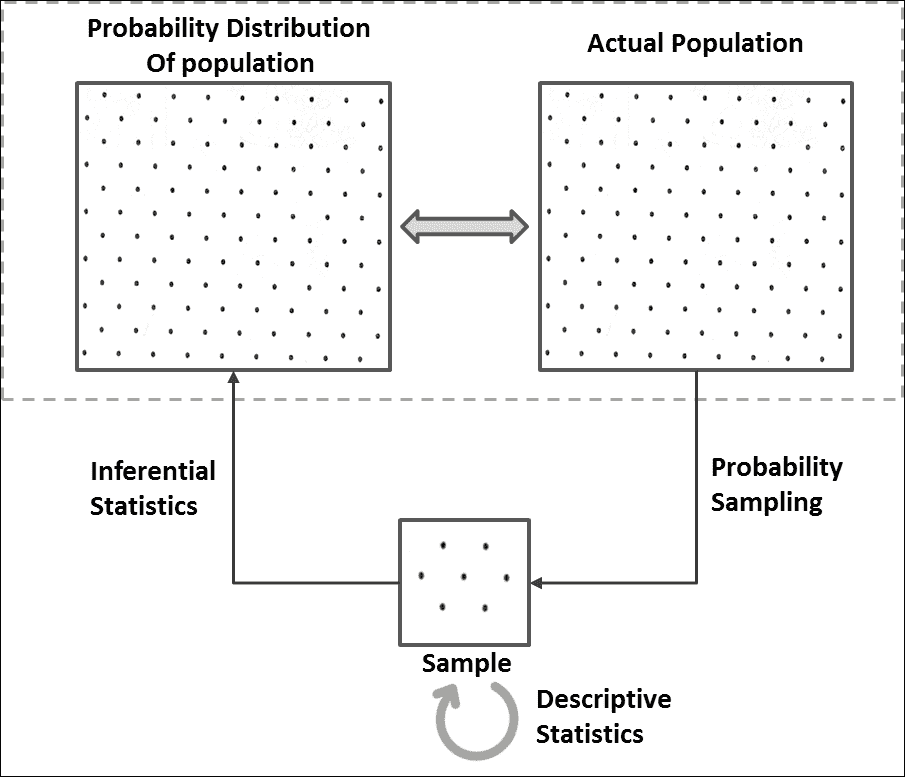

在开始这些工作之前，重要的是要对抽样和分布有一些了解。

## 抽样

通过抽样技术，我们只需取一部分人口数据集并对其进行处理：

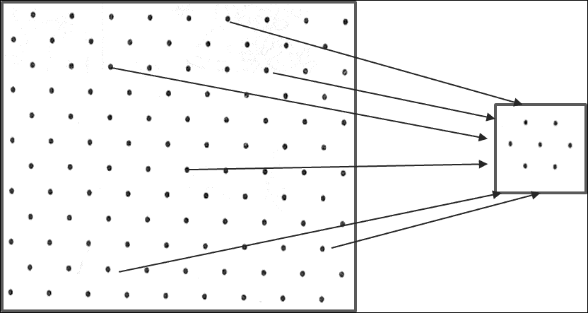

但是为什么要抽样？以下是抽样的各种原因：

+   难以获取整个人口的数据；例如，任何国家的公民身高。

+   难以处理整个数据集。当我们谈论像 Spark 这样的大数据计算平台时，这个挑战的范围几乎消失了。然而，可能会出现这样的情况，您必须将整个数据视为样本，并将您的分析结果推广到未来的时间或更大的人口。

+   难以绘制大量数据以进行可视化。这可能会有技术上的限制。

+   用于验证分析或验证预测模型 - 尤其是当您使用小数据集并且必须依赖交叉验证时。

为了有效抽样，有两个重要的限制：一个是确定样本量，另一个是选择抽样技术。样本量极大地影响了对总体参数的估计。在涵盖了一些先决基础知识后，我们将在本章后面涵盖这一方面。在本节中，我们将专注于抽样技术。

有各种基于概率的（每个样本被选中的概率已知）和非概率的（每个样本被选中的概率未知）抽样技术可用，但我们将把讨论限制在仅基于概率的技术上。

### 简单随机抽样

**简单随机抽样**（**SRS**）是最基本的概率抽样方法，其中每个元素被选择的概率相同。这意味着每个可能的*n*元素样本被选择的机会是相等的。

### 系统抽样

系统抽样可能是所有基于概率的抽样技术中最简单的，其中总体的每个*k*元素被抽样。因此，这又被称为间隔抽样。它从随机选择的固定起始点开始，然后估计一个间隔（第*k*个元素，其中*k =（总体大小）/（样本大小）*）。在这里，当达到末尾时，通过元素的进展循环开始，直到达到样本大小。

### 分层抽样

当总体内的子群体或子群体变化时，这种抽样技术是首选，因为其他抽样技术可能无法帮助提取一个良好代表总体的样本。通过分层抽样，总体被划分为同质子群体称为**分层**，然后从这些分层中随机选择样本，比例与总体相同。因此，样本中的分层大小与总体大小的比率也得到了维持：

**Python**

```scala
/* ”Sample” function is defined for DataFrames (not RDDs) which takes three parameters:
withReplacement - Sample with replacement or not (input: True/False)
fraction - Fraction of rows to generate (input: any number between 0 and 1 as per your requirement of sample size)
seed - Seed for sampling (input: Any random seed)
*/
>>> sample1 = data_new.sample(False, 0.6) //With random seed as no seed value specified
>>> sample2 = data_new.sample(False, 0.6, 10000) //With specific seed value of 10000
```

**Scala**：

```scala
scala> val sample1 = data_new.sample(false, 0.6) //With random seed as no seed value specified
sample1: org.apache.spark.sql.Dataset[org.apache.spark.sql.Row] = [emp_id: int, name: string ... 5 more fields]
scala> val sample2 = data_new.sample(false, 0.6, 10000) //With specific seed value of 10000
sample2: org.apache.spark.sql.Dataset[org.apache.spark.sql.Row] = [emp_id: int, name: string ... 5 more fields]
```

### 注意

我们只研究了 DataFrame 上的抽样；还有 MLlib 库函数，如`sampleByKey`和`sampleByKeyExact`，可以对键值对的 RDD 进行分层抽样。查看`spark.util.random`包，了解伯努利、泊松或随机抽样器。

## 数据分布

了解数据的分布是您需要执行的主要任务之一，以将数据转化为信息。分析变量的分布有助于检测异常值，可视化数据中的趋势，并且还可以塑造您对手头数据的理解。这有助于正确思考并采取正确的方法来解决业务问题。绘制分布使其在视觉上更直观，我们将在*描述性统计*部分中涵盖这一方面。

### 频率分布

频率分布解释了变量取值和它们出现的频率。通常用一个表格表示，其中包含每个可能的值及其相应的出现次数。

让我们考虑一个例子，我们掷一个六面骰子 100 次，并观察以下频率：

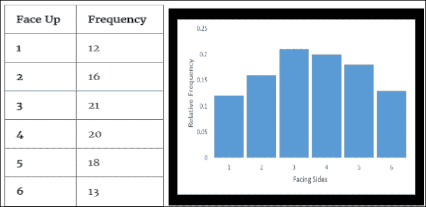

频率表

同样，您可能会观察到每组 100 次掷骰子的不同分布，因为这将取决于机会。

有时，您可能对发生的比例感兴趣，而不仅仅是发生的次数。在前面的掷骰子示例中，我们总共掷了 100 次骰子，因此比例分布或**相对频率分布**将如下所示：

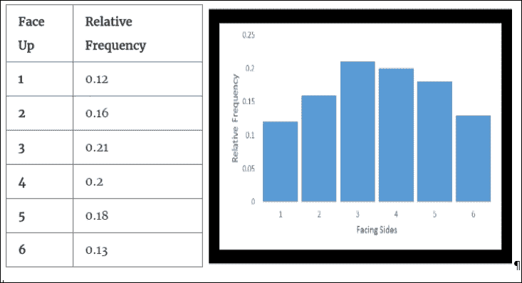

相对频率表

### 概率分布

在掷骰子的相同例子中，我们知道总概率为 1 分布在骰子的所有面上。这意味着 1/6（约 0.167）的概率与面 1 到面 6 相关联。无论你掷骰子的次数多少（一个公平的骰子！），1/6 的相同概率将均匀分布在骰子的所有面上。因此，如果你绘制这个分布，它将如下所示：

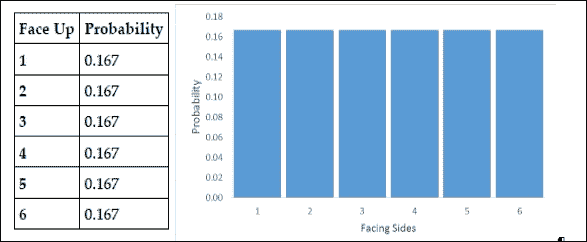

概率分布

我们在这里看了三种分布 - 频率分布、相对频率分布和概率分布。

这个概率分布实际上是人口的分布。在现实世界中，有时我们对人口分布有先验知识（在我们的例子中，是一个公平骰子的六个面上的概率为 0.167），有时我们没有。在我们没有人口分布的情况下，找到人口分布本身成为推断统计的一部分。此外，与公平骰子的例子不同，其中所有面都与相同的概率相关联，变量可以取的值可能与不同的概率相关联，并且它们也可能遵循特定类型的分布。

现在是时候揭示秘密了！相对频率分布与概率分布之间的关系是统计推断的基础。相对频率分布也称为基于我们观察到的样本的经验分布（在这里，是 100 个样本）。正如前面讨论的那样，每 100 次掷骰子的经验分布会因机会而异。现在，掷骰子的次数越多，相对频率分布就会越接近概率分布。因此，无限次掷骰子的相对频率就是概率分布，而概率分布又是人口分布。

有各种各样的概率分布，再次根据变量的类型分为两类 - 分类或连续。我们将在本章的后续部分详细介绍这些分布。然而，我们应该知道这些类别意味着什么！分类变量只能有几个类别；例如，通过/不通过，零/一，癌症/恶性是具有两个类别的分类变量的例子。同样，分类变量可以有更多的类别，例如红/绿/蓝，类型 1/类型 2/类型 3/类型 4 等。连续变量可以在给定范围内取任何值，并且在连续比例上进行测量，例如年龄、身高、工资等。理论上，连续变量的任何两个值之间可能有无限多个可能的值。例如，在 5'6"和 6'4"之间的身高值（英尺和英寸刻度），可能有许多分数值。在以厘米为单位的刻度上测量时也是如此。

# 描述性统计

在前一节中，我们学习了分布是如何形成的。在本节中，我们将学习如何通过描述性统计来描述它们。分布的两个重要组成部分可以帮助描述它，即其位置和其传播。

## 位置测量

位置测量是描述数据中心位置的单个值。位置的三个最常见的测量是平均值、中位数和众数。

### 平均值

到目前为止，最常见和广泛使用的集中趋势度量是**平均值**，也就是平均值。无论是样本还是人口，平均值或平均值都是所有元素的总和除以元素的总数。

### 中位数

**中位数**是数据系列中的中间值，当按任何顺序排序时，使得一半数据大于中位数，另一半数据小于中位数。当存在两个中间值（数据项数量为偶数时），中位数是这两个中间值的平均值。当数据存在异常值（极端值）时，中位数是更好的位置测量。

### 模式

**模式**是最频繁的数据项。它可以确定定性和定量数据。

Python

//重复使用在重复值处理中创建的 data_new

```scala
>>> mean_age = data_new.agg({'age': 'mean'}).first()[0]
>>> age_counts = data_new.groupBy("age").agg({"age": "count"}).alias("freq")
>>> mode_age = age_counts.sort(age_counts["COUNT(age)"].desc(), age_counts.age.asc()).first()[0]
>>> print(mean_age, mode_age)
(29.615384615384617, 25)
>>> age_counts.sort("count(age)",ascending=False).show(2)
+---+----------+                                                               
|age|count(age)|
+---+----------+
| 28|         3|
| 29|         2|
+---+----------+
only showing top 2 rows
```

Scala

```scala
//Reusing data_new created 
scala> val mean_age = data_new.select(floor(avg("age"))).first().getLong(0)
mean_age: Long = 29
scala> val mode_age = data_new.groupBy($"age").agg(count($"age")).
                 sort($"count(age)".desc, $"age").first().getInt(0)
mode_age: Int = 28
scala> val age_counts = data_new.groupBy("age").agg(count($"age") as "freq")
age_counts: org.apache.spark.sql.DataFrame = [age: int, freq: bigint]
scala> age_counts.sort($"freq".desc).show(2)
+---+----+                                                                     
|age|freq|
+---+----+
| 35|   2|
| 28|   2|
+---+----+
```

## 传播措施

传播措施描述了特定变量或数据项的数据是多么接近或分散。

### 范围

范围是变量的最小值和最大值之间的差异。它的一个缺点是它没有考虑数据中的每个值。

### 方差

要找到数据集中的变异性，我们可以从平均值中减去每个值，将它们平方以消除负号（也扩大幅度），然后将它们全部相加并除以总值的数量：

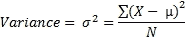

如果数据更分散，方差将是一个很大的数字。它的一个缺点是它给异常值赋予了不应有的权重。

### 标准差

与方差类似，标准差也是数据内部分散的一种度量。方差的局限性在于数据的单位也被平方，因此很难将方差与数据集中的值联系起来。因此，标准差被计算为方差的平方根：

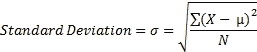

Python

```scala
//Reusing data_new created before
import math
>>> range_salary = data_new.agg({'salary': 'max'}).first()[0] - data_new.agg({'salary': 'min'}).first()[0]
>>> mean_salary = data_new.agg({'salary': 'mean'}).first()[0]
>>> salary_deviations = data_new.select(((data_new.salary - mean_salary) *
       (data_new.salary - mean_salary)).alias("deviation"))
>>> stddev_salary = math.sqrt(salary_deviations.agg({'deviation' : 
'avg'}).first()[0])
>>> variance_salary = salary_deviations.groupBy().avg("deviation").first()[0]
>>> print(round(range_salary,2), round(mean_salary,2),
      round(variance_salary,2), round(stddev_salary,2))
(119880.0, 20843.33, 921223322.22, 30351.66)
>>> 
```

Scala

```scala
//Reusing data_new created before
scala> val range_salary = data_new.select(max("salary")).first().
          getLong(0) - data_new.select(min("salary")).first().getLong(0)
range_salary: Long = 119880
scala> val mean_salary = data_new.select(floor(avg("salary"))).first().getLong(0)
mean_salary: Long = 20843
scala> val salary_deviations = data_new.select(((data_new("salary") - mean_salary)
                     * (data_new("salary") - mean_salary)).alias("deviation"))
salary_deviations: org.apache.spark.sql.DataFrame = [deviation: bigint]
scala> val variance_salary = { salary_deviations.select(avg("deviation"))
                                       .first().getDouble(0) }
variance_salary: Double = 9.212233223333334E8
scala> val stddev_salary = { salary_deviations
                    .select(sqrt(avg("deviation")))
                    .first().getDouble(0) }
stddev_salary: Double = 30351.660948510435
```

## 摘要统计

数据集的摘要统计是极其有用的信息，它可以让我们快速了解手头的数据。使用统计中可用的`colStats`函数，我们可以获得包含列最大值、最小值、平均值、方差、非零数和总计数的`RDD[Vector]`的多变量统计摘要。让我们通过一些代码示例来探索这一点：

Python

```scala
>>> import numpy
>>> from pyspark.mllib.stat import Statistics
// Create an RDD of number vectors
//This example creates an RDD with 5 rows with 5 elements each
>>> observations = sc.parallelize(numpy.random.random_integers(0,100,(5,5)))
// Compute column summary statistics.
//Note that the results may vary because of random numbers
>>> summary = Statistics.colStats(observations)
>>> print(summary.mean())       // mean value for each column
>>> print(summary.variance())  // column-wise variance
>>> print(summary.numNonzeros())// number of nonzeros in each column
```

Scala

```scala
scala> import org.apache.spark.mllib.linalg.Vectors
import org.apache.spark.mllib.linalg.Vectors
scala> import org.apache.spark.mllib.stat.{
          MultivariateStatisticalSummary, Statistics}
import org.apache.spark.mllib.stat.{MultivariateStatisticalSummary, Statistics}
// Create an RDD of number vectors
//This example creates an RDD with 5 rows with 5 elements each
scala> val observations = sc.parallelize(Seq.fill(5)(Vectors.dense(Array.fill(5)(
                    scala.util.Random.nextDouble))))
observations: org.apache.spark.rdd.RDD[org.apache.spark.mllib.linalg.Vector] = ParallelCollectionRDD[43] at parallelize at <console>:27
scala>
// Compute column summary statistics.
//Note that the results may vary because of random numbers
scala> val summary = Statistics.colStats(observations)
summary: org.apache.spark.mllib.stat.MultivariateStatisticalSummary = org.apache.spark.mllib.stat.MultivariateOnlineSummarizer@36836161
scala> println(summary.mean)  // mean value for each column
[0.5782406967737089,0.5903954680966121,0.4892908815930067,0.45680701799234835,0.6611492334819364]
scala> println(summary.variance)    // column-wise variance
[0.11893608153330748,0.07673977181967367,0.023169197889513014,0.08882605965192601,0.08360159585590332]
scala> println(summary.numNonzeros) // number of nonzeros in each column
[5.0,5.0,5.0,5.0,5.0]
```

### 提示

Apache Spark MLlib 基于 RDD 的 API 在 Spark 2.0 开始处于维护模式。它们预计将在 2.2+中被弃用，并在 Spark 3.0 中移除。

## 图形技术

要了解数据点的行为，您可能需要绘制它们并查看。但是，您需要一个平台来以*箱线图*、*散点图*或*直方图*等形式可视化您的数据。iPython/Jupyter 笔记本或 Spark 支持的任何其他第三方笔记本都可以用于在浏览器中可视化数据。Databricks 提供了他们自己的笔记本。可视化在其自己的章节中进行了介绍，本章重点介绍完整的生命周期。但是，Spark 提供了直方图数据准备，以便将桶范围和频率传输到客户端机器，而不是完整的数据集。以下示例显示了相同的内容。

Python

```scala
//Histogram
>>>from random import randint
>>> numRDD = sc.parallelize([randint(0,9) for x in xrange(1,1001)])
// Generate histogram data for given bucket count
>>> numRDD.histogram(5)
([0.0, 1.8, 3.6, 5.4, 7.2, 9], [202, 213, 215, 188, 182])
//Alternatively, specify ranges
>>> numRDD.histogram([0,3,6,10])
([0, 3, 6, 10], [319, 311, 370])
```

Scala：

```scala
//Histogram
scala> val numRDD = sc.parallelize(Seq.fill(1000)(
                    scala.util.Random.nextInt(10)))
numRDD: org.apache.spark.rdd.RDD[Int] =
     ParallelCollectionRDD[0] at parallelize at <console>:24
// Generate histogram data for given bucket count
scala> numRDD.histogram(5)
res10: (Array[Double], Array[Long]) = (Array(0.0, 1.8, 3.6, 5.4, 7.2, 9.0),Array(194, 209, 215, 195, 187))
scala>
//Alternatively, specify ranges
scala> numRDD.histogram(Array(0,3.0,6,10))
res13: Array[Long] = Array(293, 325, 382)
```

# 推断统计

我们看到描述性统计在描述和展示数据方面非常有用，但它们没有提供一种使用样本统计来推断人口参数或验证我们可能提出的任何假设的方法。因此，推断统计技术出现以满足这些要求。推断统计的一些重要用途包括：

+   人口参数的估计

+   假设检验

请注意，样本永远不能完美地代表一个群体，因为每次抽样都会自然地产生抽样误差，因此需要推断统计！让我们花一些时间了解各种类型的概率分布，这些分布可以帮助推断人口参数。

## 离散概率分布

离散概率分布用于对离散性数据进行建模，这意味着数据只能取特定的值，如整数。与分类变量不同，离散变量只能取数值数据，尤其是来自一组不同整数值的计数数据。此外，随机变量所有可能值的概率之和为 1。离散概率分布是用概率质量函数描述的。可以有各种类型的离散概率分布。以下是一些例子。

### 伯努利分布

伯努利分布是一种描述只有两种可能结果的试验的分布，例如成功/失败，正面/反面，六面骰子的点数是 4 或不是，发送的消息是否被接收等。伯努利分布可以推广到具有两种或更多可能结果的任何分类变量。

让我们以“考试通过率”为例，其中 0.6（60％）是学生通过考试的概率**P**，0.4（40％）是学生考试不及格的概率（**1-P**）。让我们将不及格表示为**0**，及格表示为**1**：

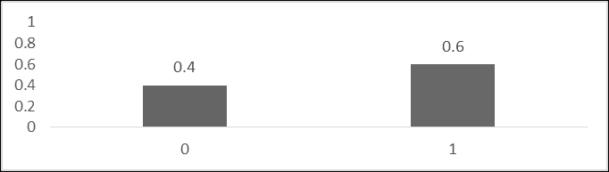

这种分布无法回答诸如学生的预期通过率之类的问题，因为预期值（μ）将是该分布无法取得的某个分数。它只能意味着如果你抽取 1,000 名学生，那么有 600 名会通过，400 名会不及格。

### 二项分布

该分布可以描述一系列伯努利试验（每次只有两种可能结果）。此外，它假设一次试验的结果不会影响后续试验，并且任何事件发生的概率在每次试验中都是相同的。二项分布的一个例子是抛硬币五次。在这里，第一次抛硬币的结果不会影响第二次抛硬币的结果，并且与每个结果相关的概率在所有抛硬币中都是相同的。

如果*n*是试验次数，*p*是每次试验中成功的概率，则该二项分布的均值（μ）为：

*μ = n * p*

方差（σ2x）由以下公式给出：

*σ2x = n*p*(1-p).*

通常，遵循参数为*n*和*p*的二项分布的随机变量*X*，我们可以写为*X ~ B(n, p)*。对于这种分布，可以通过概率质量函数描述在*n*次试验中获得恰好*k*次成功的概率，如下所示：

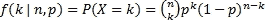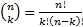

在这里，k = 0, 1, 2, ..., n

#### 样本问题

让我们假设一个假设情景。假设一个城市中有 24％的公司宣布他们将作为企业社会责任活动的一部分，为受海啸影响地区提供支持。在随机选择的 20 家公司样本中，找出宣布他们将帮助受海啸影响地区的公司数量的概率：

+   恰好三个

+   少于三

+   三个或更多

**解决方案**：

样本大小 = *n* = 20。

随机选择一家公司宣布将提供帮助的概率 = *P = 0.24*。

a) P(x = 3) = ²⁰C[3] (0.24)³ (0.76) ¹⁷ = 0.15

b) P(x < 3) = P(0) + P(1) + P(2)

= (0.76) ²⁰ + ²⁰C[1] (0.24) (0.76)¹⁹ + ²⁰C[2] (0.24)² (0.76)¹⁸

= 0.0041 + 0.0261 + 0.0783 = 0.11

c) P(x >= 3) = 1 - P(x <= 2) = 1- 0.11 = 0.89

请注意，二项分布广泛用于模拟从大小为*N*的总体中抽取大小为*n*的样本的成功率。如果是无放回抽样，则抽取将不再是独立的，因此将不再正确地遵循二项分布。然而，这样的情况确实存在，并且可以使用不同类型的分布进行建模，例如超几何分布。

### 泊松分布

泊松分布可以描述在固定时间或空间间隔内以已知平均速率发生的独立事件的概率。请注意，事件应该只有二进制结果，例如成功或失败，例如，您每天收到的电话数量或每小时通过信号的汽车数量。您需要仔细观察这些例子。请注意，这里您没有这些信息的相反一半，也就是说，您每天没有收到多少电话或者多少辆汽车没有通过那个信号。这些数据点没有另一半的信息。相反，如果我说 50 名学生中有 30 名通过了考试，您可以轻松推断出 20 名学生失败了！您有这些信息的另一半。

如果*µ*是发生的事件的平均数量（固定时间或空间间隔内的已知平均速率），则在同一间隔内发生*k*个事件的概率可以用概率质量函数描述：

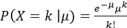

这里，*k* = 0, 1, 2, 3...

前面的方程描述了泊松分布。

对于泊松分布，均值和方差是相同的。此外，泊松分布在其均值或方差增加时更趋于对称。

#### 示例问题

假设你知道工作日向消防站打电话的平均次数是 8。在给定的工作日中有 11 通电话的概率是多少？这个问题可以使用基于泊松分布的以下公式来解决：

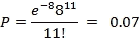

## 连续概率分布

连续概率分布用于建模连续性数据，这意味着数据只能在指定范围内取任何值。因此，我们处理与区间相关的概率，而不是与任何特定值相关的概率，因为它为零。连续概率分布是实验的理论模型；它是由无限数量的观察构建的相对频率分布。这意味着当你缩小区间时，观察数量增加，随着观察数量的不断增加并接近无穷大，它形成了一个连续概率分布。曲线下的总面积为 1，要找到与任何特定范围相关的概率，我们必须找到曲线下的面积。因此，连续分布通常用**概率密度函数**（**PDF**）来描述，其类型如下：

P(a ≤ X ≤ b) = a∫^b f(x) dx

可以有各种类型的连续概率分布。以下部分是一些示例。

### 正态分布

正态分布是一种简单、直接，但非常重要的连续概率分布。它也被称为高斯分布或**钟形曲线**，因为它的外观。此外，对于完美的正态分布，均值、中位数和众数都是相同的。

许多自然现象遵循正态分布（它们也可能遵循不同的分布！），例如人的身高、测量误差等。然而，正态分布不适合模拟高度倾斜或固有为正的变量（例如股价或学生的测试分数，其中难度水平很低）。这些变量可能更适合用不同的分布或数据转换后的正态分布（如对数转换）来描述。

正态分布可以用两个描述符来描述：均值表示中心位置，标准差表示扩散（高度和宽度）。代表正态分布的概率密度函数如下：

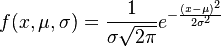

正态分布之所以成为最受欢迎的分布之一，其中一个原因是**中心极限定理**（**CLT**）。它规定，无论人口分布如何，从同一人口分布独立抽取的样本均值几乎呈正态分布，随着样本量的增加，这种正态性会越来越明显。这种行为实际上是统计假设检验的基础。

此外，每个正态分布，无论其均值和标准差如何，都遵循经验法则（68-95-99.7 法则），该法则规定曲线下约 68％的面积落在均值的一个标准差内，曲线下约 95％的面积落在均值的两个标准差内，曲线下约 99.7％的面积落在均值的三个标准差内。

现在，要找到事件的概率，可以使用积分微积分，也可以将分布转换为标准正态分布，如下一节所述。

### 标准正态分布

标准正态分布是一种均值为 *0*，标准差为 *1* 的正态分布。这种分布很少自然存在。它主要设计用于找到正态分布曲线下的面积（而不是使用微积分进行积分）或者对数据点进行标准化。

假设随机变量 *X* 正态分布，均值（*μ*）和标准差（*σ*），那么随机变量 *Z* 将具有均值 *0* 和标准差 *1* 的标准正态分布。可以找到 *Z* 的值如下：

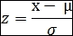

由于数据可以以这种方式标准化，因此数据点可以表示为在分布中与均值相差多少个标准差，并且可以进行解释。这有助于比较两个具有不同尺度的分布。

您可以在以下场景中找到正态分布的应用，其中一个想要找到落在指定范围内的百分比 - 假设分布近似正态。

考虑以下例子：

如果店主在某一天经营店铺的时间遵循均值为 *8* 小时和标准差为 *0.5* 小时的正态分布，那么他在店里待的时间少于 7.5 小时的概率是多少？

概率分布如下：

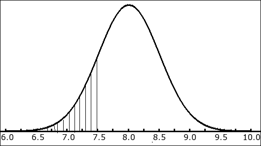

数据分布

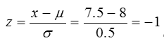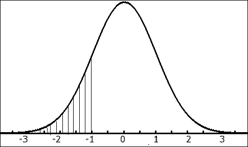

标准正态分布

因此，店主在店里待的时间少于 7.5 小时的概率为：

*P(z = -1) = 0.1587 = 15.87*

### 注意

这是使用 Z-表找出的。

请注意，数据集中的正态性大多是一种近似。您首先需要检查数据的正态性，然后如果您的分析基于数据的正态性假设，可以进一步进行。有各种不同的检查正态性的方法：您可以选择直方图（使用数据的均值和标准差拟合的曲线）、正态概率图或 QQ 图。

### 卡方分布

卡方分布是统计推断中最广泛使用的分布之一。它是伽玛分布的特例，用于对不是负数的变量的偏斜分布进行建模。它规定，如果随机变量 *X* 正态分布，*Z* 是其标准正态变量之一，则 *Z[2]* 将具有一个自由度的 X[²] 分布。同样，如果我们从相同分布中取出许多这样的随机独立标准正态变量，对它们进行平方并相加，那么结果也将遵循 X[²] 分布，如下所示：

*Z[12] + Z[22] + ... + Z[k2]* 将具有 *k* 自由度的 X[2] 分布。

卡方分布主要用于推断给定样本方差或标准差的总体方差或总体标准差。这是因为 X[2]分布是用另一种方式定义的，即以样本方差与总体方差的比率来定义。

为了证明这一点，让我们从方差为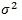的正态分布中随机抽取一个样本（*x[1]*, *x[2]*,...,*xn*）。

样本均值由以下公式给出：

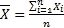

然而，样本方差由以下公式给出：


考虑到前面提到的事实，我们可以定义卡方统计量如下：

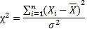

（记住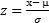和*Z[2]*将具有 X[2]分布。）

所以，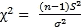

因此，卡方统计量的抽样分布将遵循自由度为*(n-1)*的卡方分布。

具有自由度为*n*和伽玛函数*Г*的卡方分布的概率密度函数如下：

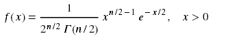

对于自由度为*k*的*χ2*分布，均值（*µ*）= *k*，方差（*σ2*）= *2k*。

请注意，卡方分布呈正偏态，但偏斜度随着自由度的增加而减小，并趋近于正态分布。

#### 样本问题

找到方差和标准差的 90%置信区间，以美元表示成成年人单张电影票的价格。给定的数据代表全国电影院的选定样本。假设变量服从正态分布。

给定样本（以美元计）：10, 08, 07, 11, 12, 06, 05, 09, 15, 12

解：

*N* = *10*

样本均值：


样本的方差：


样本的标准差：

S = sqrt(9.61)

自由度：

10-1 = 9

现在我们需要找到 90%的置信区间，这意味着数据的 10%将留在尾部。

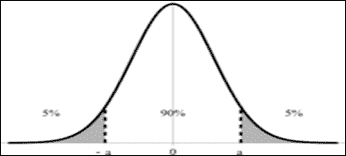

现在，让我们使用公式：

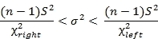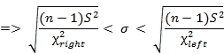

然后我们可以使用表格或计算机程序找到卡方值。

为了找到中间 90%的置信区间，我们可以考虑左边的 95%和右边的 5%。

因此，代入数字后，我们得到：

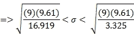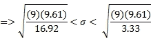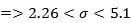

因此，我们可以得出结论，我们有 90%的把握，认为全国电影票价格的标准差在 2.26 美元和 5.10 美元之间，基于对 10 个全国电影票价格的样本。

### 学生 t 分布

学生 t 分布用于估计正态分布总体的均值，当总体标准差未知或样本量太小时。在这种情况下，*μ*和*σ*都是未知的，人口参数只能通过样本估计。

这个分布是钟形的，对称的，就像正态分布，但尾部更重。当样本量大时，t 分布变成正态分布。

让我们从均值为*μ*，方差为*σ2*的正态分布中随机抽取一个样本（*x1*, *x2*,...,*xn*）。

样本均值将是和样本方差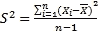

考虑到上述事实，t 统计量可以定义为：

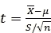

t 统计量的抽样分布将遵循具有*(n-1)*自由度(**df**)的 t 分布。自由度越高，t 分布将越接近标准正态分布。

t 分布的均值（*μ*）= *0*，方差（*σ2）= df/df-2

现在，为了更清楚地说明问题，让我们回顾一下并考虑一下当总体*σ*已知时的情况。当总体正态分布时，样本均值*x̄*大多数情况下也是正态分布的，无论样本大小和*x̄*的任何线性变换，如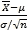也会遵循正态分布。

如果总体不是正态分布呢？即使在这种情况下，当样本量足够大时，*x̄*（即抽样分布）或的分布也会遵循中心极限定理的正态分布！

另一种情况是总体*σ*未知。在这种情况下，如果总体正态分布，样本均值*x̄*大多数情况下也是正态分布的，但随机变量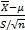不会遵循正态分布；它遵循具有*(n-1)*自由度的 t 分布。原因是因为分母中*S*的随机性，对于不同的样本是不同的。

在上述情况下，如果总体不是正态分布，当样本量足够大时，的分布将遵循中心极限定理的正态分布（而不是在样本量较小的情况下！）。因此，样本量足够大时，的分布遵循正态分布，可以安全地假设它遵循 t 分布，因为 t 分布随着样本量的增加而接近正态分布。

### F 分布

在统计推断中，F 分布用于研究两个正态分布总体的方差。它表明来自两个独立正态分布总体的样本方差的抽样分布具有相同总体方差，遵循 F 分布。

如果样本 1 的样本方差为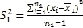，如果样本 2 的样本方差为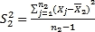，那么，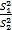将具有 F 分布（*σ12 = σ22*）。

从上述事实中，我们也可以说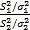也将遵循 F 分布。

在前面的卡方分布部分，我们也可以说

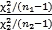也将具有*n1-1*和*n2-1*自由度的 F 分布。对于这些自由度的每种组合，都会有不同的 F 分布。

## 标准误差

统计量（如均值或方差）的抽样分布的标准差称为**标准误差**（**SE**），是一种变异性度量。换句话说，**均值的标准误差**（**SEM**）可以定义为样本均值对总体均值的估计的标准差。

随着样本量的增加，样本均值的抽样分布变得越来越正态，标准差变得越来越小。已经证明：

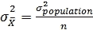

（*n*为样本量）

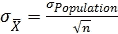

标准误差越小，样本对整体总体的代表性就越高。此外，样本量越大，标准误差就越小。

标准误差在统计推断的其他测量中非常重要，例如误差边界和置信区间。

## 置信水平

这是一个衡量你希望在通过样本统计估计总体参数时有多大把握（概率），以便期望值落入所需范围或置信区间的度量。它通过从显著水平（*α*）中减去*1*（即*置信水平=1-α*）来计算。因此，如果*α=0.05*，置信水平将是*1-0.05=0.95*。

通常情况下，置信水平越高，所需的样本量就越大。然而，通常会有权衡，你必须决定你希望有多大的把握，以便你可以估计所需的置信水平下的样本量。

## 误差范围和置信区间

正如前面讨论的，由于样本永远不能完全代表总体，通过推断估计总体参数总会因抽样误差而产生一定的误差范围。通常情况下，样本量越大，误差范围越小。然而，你必须决定允许多少误差，并且估计所需的适当样本量将取决于这一点。

因此，基于误差范围的样本统计值下方和上方的值范围被称为**置信区间**。换句话说，置信区间是我们相信真实总体参数在其中落入一定百分比时间内的一系列数字（置信水平）。

请注意，像“我有 95%的把握置信区间包含真实值”这样的陈述可能会误导！正确的陈述方式可能是“*如果我取相同大小的无限数量样本，那么 95%的时间置信区间将包含真实值*”。

例如，当你将置信水平设为 95%，置信区间设为 4%时，对于样本统计值 58（这里，58 可以是任何样本统计值，如均值、方差或标准差），你可以说你有 95%的把握，真实的总体百分比在 58-4=54%和 58+4=62%之间。

## 总体的变异性

总体的变异性是我们在推断统计中应该考虑的最重要因素之一。它在估计样本量中起着重要作用。无论你选择什么样的抽样算法来最好地代表总体，样本量仍然起着至关重要的作用-这是显而易见的！

如果总体变异性更大，那么所需的样本量也会更多。

## 估计样本量

我们已经在前面的部分中涵盖了抽样技术。在本节中，我们将讨论如何估计样本量。假设你需要证明一个概念或评估某些行动的结果，那么你会获取一些相关数据并试图证明你的观点。然而，你如何确保你有足够的数据？太大的样本浪费时间和资源，而太小的样本可能导致误导性的结果。估计样本量主要取决于误差范围或置信区间、置信水平和总体的变异性等因素。

考虑以下例子：

学院院长要求统计老师估计学院学生的平均年龄。需要多大的样本？统计老师希望有 99%的把握，估计应该在 1 年内准确。根据以前的研究，年龄的标准差已知为 3 年。

解决方案：

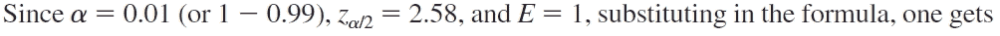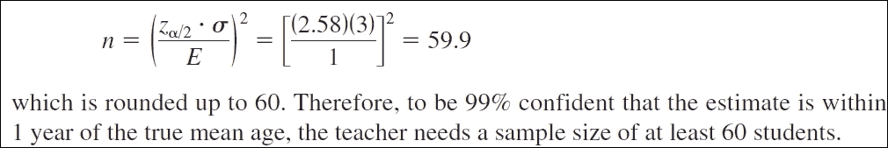

## 假设检验

假设检验是关于检验对总体参数所做的假设。这有助于确定一个结果是否具有统计学意义或是偶然发生的。这是统计研究中最重要的工具。我们将讨论一些测试，以查看总体中变量之间的关系。

### 零假设和备择假设

零假设（表示为 H0）通常是关于总体参数的初始声明，大多数情况下表明*没有影响*或*没有关系*。在我们的假设检验中，我们的目标是否定和拒绝零假设，以便接受备择假设（表示为 H1）。备择假设表明实验中的某种影响。在实验中，请注意，您要么拒绝零假设，要么未能拒绝零假设。如果您成功地拒绝了零假设，那么备择假设将被考虑，如果您未能拒绝零假设，则将被考虑零假设（尽管可能不是真的）。

因此，我们通常希望获得非常小的 P 值（低于定义的显著性水平α），以便拒绝零假设。如果 P 值大于α，则未能拒绝零假设。

### 卡方检验

大多数统计推断技术用于估计总体参数或使用样本统计量（如*均值*）来检验假设。然而，卡方统计量采用完全不同的方法，通过检查整个分布或两个分布之间的关系。在推断统计领域，许多检验统计量类似于卡方分布。使用该分布的最常见检验是适合度卡方检验（单向表）和独立性卡方检验（双向表）。*适合度*检验用于确定样本数据是否遵循总体中的相同分布，*独立性*检验用于确定两个分类变量在总体中是否相关。

输入数据类型决定是否进行*适合度*或*独立性*检验，而无需明确指定它们作为开关。因此，如果您提供向量作为输入，则进行*适合度*检验，如果您提供矩阵作为输入，则进行*独立性*检验。在任何情况下，都需要提供作为输入的事件频率向量或列联表，您需要首先计算它们。让我们通过示例来探讨这些问题：

Python

```scala
 //Chi-Square test
>>> from pyspark.mllib.linalg import Vectors, Matrices
>>> from pyspark.mllib.stat import Statistics
>>> import random
>>> 
//Make a vector of frequencies of events
>>> vec = Vectors.dense( random.sample(xrange(1,101),10))
>>> vec
DenseVector([45.0, 40.0, 93.0, 66.0, 56.0, 82.0, 36.0, 30.0, 85.0, 15.0])
// Get Goodnesss of fit test results
>>> GFT_Result = Statistics.chiSqTest(vec)
// Here the ‘goodness of fit test’ is conducted because your input is a vector
//Make a contingency matrix
>>> mat = Matrices.dense(5,6,random.sample(xrange(1,101),30))\
//Get independense test results\\
>>> IT_Result = Statistics.chiSqTest(mat)
// Here the ‘independence test’ is conducted because your input is a vector
//Examine the independence test results
>>> print(IT_Result)
Chi squared test summary:
method: pearson
degrees of freedom = 20
statistic = 285.9423808343265
pValue = 0.0
Very strong presumption against null hypothesis: the occurrence of the outcomes is statistically independent..
```

**Scala**

```scala
scala> import org.apache.spark.mllib.linalg.{Vectors, Matrices}
import org.apache.spark.mllib.linalg.{Vectors, Matrices} 

scala> import org.apache.spark.mllib.stat.Statistics 

scala> val vec = Vectors.dense( Array.fill(10)(               scala.util.Random.nextDouble))vec: org.apache.spark.mllib.linalg.Vector = [0.4925741159101148,....] 

scala> val GFT_Result = Statistics.chiSqTest(vec)GFT_Result: org.apache.spark.mllib.stat.test.ChiSqTestResult =Chi squared test summary:
method: pearson
degrees of freedom = 9
statistic = 1.9350768763253192
pValue = 0.9924531181394086
No presumption against null hypothesis: observed follows the same distribution as expected..
// Here the ‘goodness of fit test’ is conducted because your input is a vector
scala> val mat = Matrices.dense(5,6, Array.fill(30)(scala.util.Random.nextDouble)) // a contingency matrix
mat: org.apache.spark.mllib.linalg.Matrix =..... 
scala> val IT_Result = Statistics.chiSqTest(mat)
IT_Result: org.apache.spark.mllib.stat.test.ChiSqTestResult =Chi squared test summary:
method: pearson
degrees of freedom = 20
statistic = 2.5401190679900663
pValue = 0.9999990459111089
No presumption against null hypothesis: the occurrence of the outcomes is statistically independent..
// Here the ‘independence test’ is conducted because your input is a vector

```

### F 检验

我们已经在前面的部分中介绍了如何计算 F 统计量。现在我们将解决一个样本问题。

#### 问题：

您想要测试的信念是，硕士学位持有者的收入变异性大于学士学位持有者的收入。抽取了 21 名毕业生的随机样本和 30 名硕士的随机样本。毕业生样本的标准偏差为 180 美元，硕士样本的标准偏差为 112 美元。

解决方案：

零假设是：*H[0] : σ[1]² =σ[2]²*

给定*S[1] = $180*，*n[1] = 21*，*S[2] = $112*，*n[2] = 30*

考虑显著性水平为*α = 0.05*

*F = S[1]² /S[2]² = 180²/112² = 2.58*

根据显著性水平为 0.05 的 F 表，df1=20 和 df2=29，我们可以看到 F 值为 1.94。

由于计算出的 F 值大于 F 表中的临界值，我们可以拒绝零假设，并得出结论*σ[1]² >σ[2]* ^(*2*) 。

### 相关性

相关性提供了一种衡量两个数值型随机变量之间的统计依赖性的方法。这显示了两个变量彼此变化的程度。基本上有两种相关性测量方法：Pearson 和 Spearman。Pearson 更适合间隔尺度数据，如温度、身高等。Spearman 更适合顺序尺度，如满意度调查，其中 1 表示不满意，5 表示最满意。此外，Pearson 是基于真实值计算的，有助于找到线性关系，而 Spearman 是基于秩次的，有助于找到单调关系。单调关系意味着变量确实一起变化，但变化速率不是恒定的。请注意，这两种相关性测量只能测量线性或单调关系，不能描绘其他类型的关系，如非线性关系。

在 Spark 中，这两种都受支持。如果您输入两个`RDD[Double]`，输出是*Double*，如果您输入一个`RDD[Vector]`，输出是*相关矩阵*。在 Scala 和 Python 的实现中，如果您没有提供相关性的类型作为输入，那么默认考虑的始终是 Pearson。

**Python**

```scala
>>> from pyspark.mllib.stat import Statistics
>>> import random 
// Define two series
//Number of partitions and cardinality of both Ser_1 and Ser_2 should be the same
>>> Ser_1 = sc.parallelize(random.sample(xrange(1,101),10))       
// Define Series_1>>> Ser_2 = sc.parallelize(random.sample(xrange(1,101),10))       
// Define Series_2 
>>> correlation = Statistics.corr(Ser_1, Ser_2, method = "pearson") 
//if you are interested in Spearman method, use “spearman” switch instead
>>> round(correlation,2)-0.14
>>> correlation = Statistics.corr(Ser_1, Ser_2, method ="spearman")
>>> round(correlation,2)-0.19//Check on matrix//The following statement creates 100 rows of 5 elements each
>>> data = sc.parallelize([random.sample(xrange(1,51),5) for x in range(100)])
>>> correlMatrix = Statistics.corr(data, method = "pearson") 
//method may be spearman as per you requirement
>>> correlMatrix
array([[ 1.        ,  0.09889342, -0.14634881,  0.00178334,  0.08389984],       [ 0.09889342,  1.        , -0.07068631, -0.02212963, -0.1058252 ],       [-0.14634881, -0.07068631,  1.        , -0.22425991,  0.11063062],       [ 0.00178334, -0.02212963, -0.22425991,  1.        , -0.04864668],       [ 0.08389984, -0.1058252 ,  0.11063062, -0.04864668,  1.        
]])
>>> 

```

**Scala**

```scala
scala> val correlation = Statistics.corr(Ser_1, Ser_2, "pearson")correlation: Double = 0.43217145308272087 
//if you are interested in Spearman method, use “spearman” switch instead
scala> val correlation = Statistics.corr(Ser_1, Ser_2, "spearman")correlation: Double = 0.4181818181818179 
scala>
//Check on matrix
//The following statement creates 100 rows of 5 element Vectors
scala> val data = sc.parallelize(Seq.fill(100)(Vectors.dense(Array.fill(5)(              scala.util.Random.nextDouble))))
data: org.apache.spark.rdd.RDD[org.apache.spark.mllib.linalg.Vector] = ParallelCollectionRDD[37] at parallelize at <console>:27 
scala> val correlMatrix = Statistics.corr(data, method="pearson") 
//method may be spearman as per you requirement
correlMatrix: org.apache.spark.mllib.linalg.Matrix =1.0                    -0.05478051936343809  ... (5 total)-0.05478051936343809   1.0                   ..........
```

# 摘要

在本章中，我们简要介绍了数据科学生命周期中涉及的步骤，如数据获取、数据准备和通过描述性统计进行数据探索。我们还学会了使用一些流行的工具和技术通过样本统计来估计总体参数。

我们从理论和实践两方面解释了统计学的基础知识，通过深入研究一些领域的基础知识，以解决业务问题。最后，我们学习了一些关于如何在 Apache Spark 上执行统计分析的示例，利用了基本上是本章的目标的开箱即用的功能。

在下一章中，我们将讨论数据科学中机器学习部分的更多细节，因为我们已经在本章中建立了统计理解。从本章的学习应该有助于以更明智的方式连接到机器学习算法。

# 参考资料

Spark 支持的统计信息：

[`spark.apache.org/docs/latest/mllib-statistics.html`](http://spark.apache.org/docs/latest/mllib-statistics.html)

Databricks 的特性绘图：

[`docs.cloud.databricks.com/docs/latest/databricks_guide/04%20Visualizations/4%20Matplotlib%20and%20GGPlot.html`](https://docs.cloud.databricks.com/docs/latest/databricks_guide/04%20Visualizations/4%20Matplotlib%20and%20GGPlot.html)

MLLIB 统计的 OOTB 库函数的详细信息：

[`spark.apache.org/docs/latest/api/scala/index.html#org.apache.spark.mllib.stat.Statistics$`](http://spark.apache.org/docs/latest/api/scala/index.html#org.apache.spark.mllib.stat.Statistics%24)
