# 第六章：机器学习

我们每天都在使用机器学习，无论我们是否注意到。例如，谷歌等电子邮件提供商会自动将一些收件箱中的邮件推送到“垃圾邮件”文件夹中，亚马逊等在线购物网站或 Facebook 等社交网络网站会提供出人意料的有用的推荐。那么，是什么使这些软件产品能够重新连接失散已久的朋友呢？这些只是机器学习在实际中的一些例子。

从形式上讲，机器学习是**人工智能**（**AI**）的一部分，它处理一类可以从数据中学习并进行预测的算法。这些技术和基本概念来自统计学领域。机器学习存在于计算机科学和统计学的交叉点，被认为是数据科学中最重要的组成部分之一。它已经存在了一段时间，但随着数据量和可扩展性要求的增加，其复杂性也在增加。机器学习算法往往需要大量资源，并且具有迭代性质，这使它们不适合 MapReduce 范式。MapReduce 非常适用于单次遍历算法，但对于多次遍历的算法并不那么适用。Spark 研究项目正是为了解决这一挑战而启动的。Apache Spark 在其 MLlib 库中配备了高效的算法，即使在迭代计算需求下也能表现良好。

上一章概述了数据分析的生命周期及其各个组成部分，如数据清洗、数据转换、抽样技术和可视化数据的图形技术，以及涵盖描述性统计和推断统计的概念。我们还研究了一些可以在 Spark 平台上执行的统计测试。在上一章中建立的基础上，我们将在本章中涵盖大部分机器学习算法以及如何使用它们在 Spark 上构建模型。

作为本章的先决条件，对机器学习算法和计算机科学基础的基本理解是很有帮助的。然而，我们已经涵盖了一些算法的理论基础，并配以一套合适的实际例子，使这些更易于理解和实施。本章涵盖的主题有：

+   机器学习介绍

+   演变

+   监督学习

+   无监督学习

+   MLlib 和 Pipeline API

+   MLlib

+   ML 管道

+   机器学习介绍

+   参数方法

+   非参数方法

+   回归方法

+   线性回归

+   回归正则化

+   分类方法

+   逻辑回归

+   线性支持向量机（SVM）

+   决策树

+   不纯度度量

+   停止规则

+   分裂候选

+   决策树的优势

+   例子

+   集成

+   随机森林

+   梯度提升树

+   多层感知器分类器

+   聚类技术

+   K 均值聚类

+   总结

# 介绍

机器学习就是通过示例数据进行学习的过程；这些示例为给定输入产生特定输出。机器学习有各种各样的商业用例。让我们看一些例子，以了解它到底是什么：

+   推荐引擎，推荐用户可能感兴趣的购买商品

+   客户细分（将具有相似特征的客户分组）用于营销活动

+   癌症的疾病分类-恶性/良性

+   预测建模，例如，销售预测，天气预测

+   绘制业务推论，例如，了解产品价格变化对销售的影响

## 演变

统计学习的概念甚至在第一台计算机系统出现之前就已存在。在 19 世纪，最小二乘法（现在称为线性回归）已经被发展出来。对于分类问题，费舍尔提出了**线性判别分析**（**LDA**）。大约在 20 世纪 40 年代，LDA 的替代方案，即**逻辑回归**，被提出，所有这些方法不仅随着时间的推移得到改进，而且还激发了其他新算法的发展。

在那些时代，计算是一个大问题，因为它是用纸和笔完成的。因此，拟合非线性方程并不太可行，因为它需要大量的计算。20 世纪 80 年代后，随着技术的改进和计算机系统的引入，分类/回归树被引入。随着技术和计算系统的进一步发展，统计学习在某种程度上与现在所称的机器学习融合在一起。

## 监督学习

如前一节所讨论的，机器学习完全是基于示例数据的学习。根据算法如何理解数据并对其进行训练，它们大致分为两类：**监督学习**和**无监督学习**。

监督统计学习涉及基于一个或多个输入构建模型以获得特定输出。这意味着我们获得的输出可以根据我们提供的输入监督我们的分析。换句话说，对于预测变量的每个观察（例如年龄、教育和费用变量），都有一个相关的结果变量的响应测量（例如工资）。参考以下表格，以了解我们正在尝试根据**年龄**、**教育**和**费用**变量预测**工资**的示例数据集：

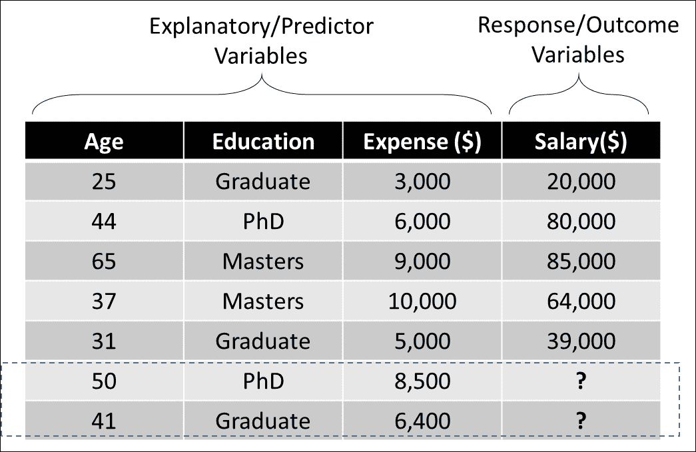

监督算法可用于预测、估计、分类和其他类似要求，我们将在以下部分进行介绍。

## 无监督学习

无监督统计学习涉及基于一个或多个输入构建模型，但没有产生特定输出的意图。这意味着没有明确的响应/输出变量需要预测；但输出通常是共享某些相似特征的数据点的组。与监督学习不同，您不知道要将数据点分类到哪些组/标签中，而是让算法自行决定。

在这里，没有“训练”数据集的概念，该数据集用于通过构建模型将结果变量与“预测”变量相关联，然后使用“测试”数据集验证模型。无监督算法的输出不能监督您基于您提供的输入进行分析。这样的算法可以从数据中学习关系和结构。*聚类*和*关联规则学习*是无监督学习技术的例子。

以下图像描述了聚类如何用于将共享某些相似特征的数据项分组：

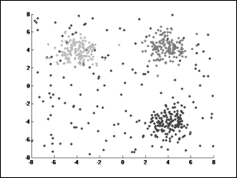

# MLlib 和管道 API

让我们首先学习一些 Spark 基础知识，以便能够在其上执行机器学习操作。我们将在本节讨论 MLlib 和管道 API。

## MLlib

MLlib 是建立在 Apache Spark 之上的机器学习库，其中包含大多数可以大规模实施的算法。MLlib 与 GraphX、SQL 和 Streaming 等其他组件的无缝集成为开发人员提供了一个相对容易地组装复杂、可扩展和高效的工作流的机会。MLlib 库包括常见的学习算法和实用程序，包括分类、回归、聚类、协同过滤和降维。

MLlib 与`spark.ml`包配合使用，后者提供了高级 Pipeline API。这两个包之间的基本区别在于 MLlib（`spark.mllib`）在 RDD 之上工作，而 ML（`spark.ml`）包在 DataFrame 之上工作，并支持 ML Pipeline。目前，Spark 支持这两个包，但建议使用`spark.ml`包。

此库中的基本数据类型是向量和矩阵。向量是本地的，可以是密集的或稀疏的。密集向量存储为值数组。稀疏向量存储为两个数组；第一个数组存储非零值索引，第二个数组存储实际值。所有元素值都存储为双精度浮点数，索引存储为从零开始的整数。了解基本结构对于有效使用库非常重要，它应该有助于从头开始编写任何新算法。让我们看一些示例代码，以更好地理解这两种向量表示：

**Scala**

```scala
//Create vectors
scala> import org.apache.spark.ml.linalg.{Vector, Vectors}
import org.apache.spark.ml.linalg.{Vector, Vectors}

//Create dense vector
scala> val dense_v: Vector = Vectors.dense(10.0,0.0,20.0,30.0,0.0)
dense_v: org.apache.spark.ml.linalg.Vector = [10.0,0.0,20.0,30.0,0.0]
scala>

//Create sparse vector: pass size, position index array and value array
scala> val sparse_v1: Vector = Vectors.sparse(5,Array(0,2,3),
       Array(10.0,20.0,30.0))
sparse_v1: org.apache.spark.ml.linalg.Vector = (5,[0,2,3],[10.0,20.0,30.0])
scala>

//Another way to create sparse vector with position, value tuples
scala> val sparse_v2: Vector = Vectors.sparse(5,
        Seq((0,10.0),(2,20.0),(3,30.0)))
sparse_v2: org.apache.spark.ml.linalg.Vector = (5,[0,2,3],[10.0,20.0,30.0])
scala>  
 Compare vectors 
--------------- cala> sparse_v1 == sparse_v2
res0: Boolean = true
scala> sparse_v1 == dense_v
res1: Boolean = true      //All three objects are equal but...
scala> dense_v.toString()
res2: String = [10.0,0.0,20.0,30.0,0.0]
scala> sparse_v2.toString()
res3: String = (5,[0,2,3],[10.0,20.0,30.0]) //..internal representation
differs
scala> sparse_v2.toArray
res4: Array[Double] = Array(10.0, 0.0, 20.0, 30.0, 0.0)

Interchangeable ---------------
scala> dense_v.toSparse
res5: org.apache.spark.mllib.linalg.SparseVector = (5,[0,2,3]
[10.0,20.0,30.0])
scala> sparse_v1.toDense
res6: org.apache.spark.mllib.linalg.DenseVector = [10.0,0.0,20.0,30.0,0.0]
scala>

A common operation ------------------
scala> Vectors.sqdist(sparse_v1,
        Vectors.dense(1.0,2.0,3.0,4.0,5.0))
res7: Double = 1075.0
```

Python:

```scala
//Create vectors
>>> from pyspark.ml.linalg import Vector, Vectors
//Create vectors
>>> dense_v = Vectors.dense(10.0,0.0,20.0,30.0,0.0)
//Pass size, position index array and value array
>>> sparse_v1 = Vectors.sparse(5,[0,2,3],
                    [10.0,20.0,30.0])
>>> 

//Another way to create sparse vector with position, value tuples
>>> sparse_v2 = Vectors.sparse(5,
                  [[0,10.0],[2,20.0],[3,30.0]])
>>> 

Compare vectors 
--------------- >>> sparse_v1 == sparse_v2
True
>>> sparse_v1 == dense_v
True      //All three objects are equal but...
>>> dense_v
DenseVector([10.0, 0.0, 20.0, 30.0, 0.0])
>>> sparse_v1
SparseVector(5, {0: 10.0, 2: 20.0, 3: 30.0}) //..internal representation
differs
>>> sparse_v2
SparseVector(5, {0: 10.0, 2: 20.0, 3: 30.0})

Interchangeable 
---------------- //Note: as of Spark 2.0.0, toDense and toSparse are not available in pyspark
 A common operation 
------------------- >>> Vectors.squared_distance(sparse_v1,
        Vectors.dense(1.0,2.0,3.0,4.0,5.0))
1075.0
```

矩阵可以是本地的或分布式的，密集的或稀疏的。本地矩阵存储在单个机器上作为一维数组。密集本地矩阵按列主序存储（列成员是连续的），而稀疏矩阵值以**压缩稀疏列**（**CSC**）格式按列主序存储。在这种格式中，矩阵以三个数组的形式存储。第一个数组包含非零值的行索引，第二个数组包含每列的起始值索引，第三个数组是所有非零值的数组。索引的类型为从零开始的整数。第一个数组包含从零到行数减一的值。第三个数组的元素类型为双精度浮点数。第二个数组需要一些解释。该数组中的每个条目对应于每列中第一个非零元素的索引。例如，假设在一个 3 乘 3 的矩阵中每列只有一个非零元素。那么第二个数组的元素将包含 0,1,2。第一个数组包含行位置，第三个数组包含三个值。如果某列中的元素都不是非零的，你会注意到第二个数组中重复相同的索引。让我们看一些示例代码：

**Scala:**

```scala
scala> import org.apache.spark.ml.linalg.{Matrix,Matrices}
import org.apache.spark.ml.linalg.{Matrix, Matrices}

Create dense matrix 
------------------- //Values in column major order
Matrices.dense(3,2,Array(9.0,0,0,0,8.0,6))
res38: org.apache.spark.mllib.linalg.Matrix =
9.0  0.0
0.0  8.0
0.0  6.0
 Create sparse matrix 
-------------------- //1.0 0.0 4.0
0.0 3.0 5.0
2.0 0.0 6.0//
val sm: Matrix = Matrices.sparse(3,3,
        Array(0,2,3,6), Array(0,2,1,0,1,2),
        Array(1.0,2.0,3.0,4.0,5.0,6.0))
sm: org.apache.spark.mllib.linalg.Matrix =
3 x 3 CSCMatrix
(0,0) 1.0
(2,0) 2.0
(1,1) 3.0
(0,2) 4.0
(1,2) 5.0
(2,2) 6.0
 Sparse matrix, a column of all zeros 
------------------------------------ //third column all zeros
Matrices.sparse(3,4,Array(0,2,3,3,6),
    Array(0,2,1,0,1,2),values).toArray
res85: Array[Double] = Array(1.0, 0.0, 2.0, 0.0, 3.0, 0.0, 0.0, 0.0, 0.0,
4.0, 5.0, 6.0)

```

**Python:**

```scala
//Create dense matrix
>>> from pyspark.ml.linalg import Matrix, Matrices

//Values in column major order
>>> Matrices.dense(3,2,[9.0,0,0,0,8.0,6])
DenseMatrix(3, 2, [9.0, 0.0, 0.0, 0.0, 8.0, 6.0], False)
>>> 

//Create sparse matrix
//1.0 0.0 4.0
0.0 3.0 5.0
2.0 0.0 6.0//
>>> sm = Matrices.sparse(3,3,
        [0,2,3,6], [0,2,1,0,1,2],
        [1.0,2.0,3.0,4.0,5.0,6.0])
>>> 

//Sparse matrix, a column of all zeros
//third column all zeros
>>> Matrices.sparse(3,4,[0,2,3,3,6],
        [0,2,1,0,1,2],
    values=[1.0,2.0,3.0,4.0,5.0,6.0]).toArray()
array([[ 1.,  0.,  0.,  4.],
       [ 0.,  3.,  0.,  5.],
       [ 2.,  0.,  0.,  6.]])
>>> 
```

分布式矩阵是最复杂的，选择正确的分布式矩阵类型非常重要。分布式矩阵由一个或多个 RDD 支持。行和列的索引类型为`long`，以支持非常大的矩阵。分布式矩阵的基本类型是`RowMatrix`，它简单地由其行的 RDD 支持。

每一行依次是一个本地向量。当列数非常低时，这是合适的。记住，我们需要传递 RDD 来创建分布式矩阵，不像本地矩阵。让我们看一个例子：

**Scala:**

```scala
scala> import org.apache.spark.mllib.linalg.{Vector,Vectors}
import org.apache.spark.mllib.linalg.{Vector, Vectors}
scala> import org.apache.spark.mllib.linalg.distributed.RowMatrix
import org.apache.spark.mllib.linalg.distributed.RowMatrix

scala>val dense_vlist: Array[Vector] = Array(
    Vectors.dense(11.0,12,13,14),
    Vectors.dense(21.0,22,23,24),
    Vectors.dense(31.0,32,33,34))
dense_vlist: Array[org.apache.spark.mllib.linalg.Vector] =
Array([11.0,12.0,13.0,14.0], [21.0,22.0,23.0,24.0], [31.0,32.0,33.0,34.0])
scala>

//Distribute the vector list
scala> val rows  = sc.parallelize(dense_vlist)
rows: org.apache.spark.rdd.RDD[org.apache.spark.mllib.linalg.Vector] =
ParallelCollectionRDD[0] at parallelize at <console>:29
scala> val m: RowMatrix = new RowMatrix(rows)
m: org.apache.spark.mllib.linalg.distributed.RowMatrix =
org.apache.spark.mllib.linalg.distributed.RowMatrix@5c5043fe
scala> print("Matrix size is " + m.numRows()+"X"+m.numCols())
Matrix size is 3X4
scala>
```

**Python:**

```scala
>>> from pyspark.mllib.linalg import Vector,Vectors
>>> from pyspark.mllib.linalg.distributed import RowMatrix

>>> dense_vlist = [Vectors.dense(11.0,12,13,14),
         Vectors.dense(21.0,22,23,24), Vectors.dense(31.0,32,33,34)]
>>> rows  = sc.parallelize(dense_vlist)
>>> m = RowMatrix(rows)
>>> "Matrix size is {0} X {1}".format(m.numRows(), m.numCols())
'Matrix size is 3 X 4'
```

`IndexedRowMatrix`将行索引前缀到行条目中。这在执行连接时非常有用。您需要传递`IndexedRow`对象来创建`IndexedRowMatrix`。`IndexedRow`对象是一个包装器，带有长`Index`和一组行元素的`Vector`。

`CoordinatedMatrix`将数据存储为行、列索引和元素值的元组。`BlockMatrix`表示分布式矩阵，以本地矩阵块的形式存储。提供了从一种类型转换为另一种类型的方法，但这些是昂贵的操作，应谨慎使用。

## ML pipeline

现实生活中的机器学习工作流程是数据提取、数据清洗、预处理、探索、特征提取、模型拟合和评估的迭代循环。Spark 上的 ML Pipeline 是用户设置复杂 ML 工作流的简单 API。它旨在解决一些痛点，如参数调整，或基于数据不同拆分（交叉验证）或不同参数集训练多个模型。编写脚本来自动化整个过程不再是必需的，可以在 Pipeline API 中处理。

Pipeline API 由一系列流水线阶段（实现为*transformers*和*estimators*等抽象）组成，以按所需顺序执行。

在 ML Pipeline 中，您可以调用前一章中讨论的数据清洗/转换函数，并调用 MLlib 中可用的机器学习算法。这可以以迭代的方式进行，直到获得所需的模型性能。

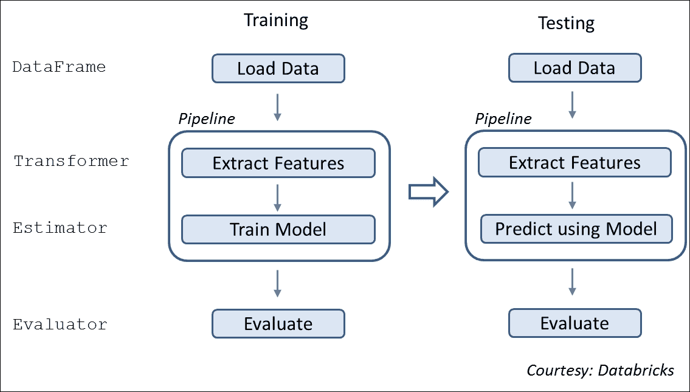

### Transformer

Transformer 是一个抽象，实现`transform()`方法将一个 DataFrame 转换为另一个。如果该方法是特征转换器，则生成的 DataFrame 可能包含基于您执行的操作的一些额外转换列。但是，如果该方法是学习模型，则生成的 DataFrame 将包含一个带有预测结果的额外列。

### Estimator

Estimator 是一个抽象，可以是任何实现`fit()`方法以在 DataFrame 上进行训练以生成模型的学习算法。从技术上讲，该模型是给定 DataFrame 的 transformer。

示例：逻辑回归是一种学习算法，因此是一个 estimator。调用`fit()`训练逻辑回归模型，这是一个结果模型，因此是一个 transformer，可以生成包含预测列的 DataFrame。

以下示例演示了一个简单的单阶段流水线。

**Scala:**

```scala
//Pipeline example with single stage to illustrate syntax
scala> import org.apache.spark.ml.Pipeline
import org.apache.spark.ml.Pipeline
scala> import org.apache.spark.ml.feature._
import org.apache.spark.ml.feature._

//Create source data frame
scala> val df = spark.createDataFrame(Seq(
         ("Oliver Twist","Charles Dickens"),
        ("Adventures of Tom Sawyer","Mark Twain"))).toDF(
        "Title","Author")

//Split the Title to tokens
scala> val tok = new Tokenizer().setInputCol("Title").
          setOutputCol("words")
tok: org.apache.spark.ml.feature.Tokenizer = tok_2b2757a3aa5f

//Define a pipeline with a single stage
scala> val p = new Pipeline().setStages(Array(tok))
p: org.apache.spark.ml.Pipeline = pipeline_f5e0de400666

//Run an Estimator (fit) using the pipeline
scala> val model = p.fit(df)
model: org.apache.spark.ml.PipelineModel = pipeline_d00989625bb2

//Examine stages
scala> p.getStages   //Returns a list of stage objects
res1: Array[org.apache.spark.ml.PipelineStage] = Array(tok_55af0061af6d)

// Examine the results
scala> val m = model.transform(df).select("Title","words")
m: org.apache.spark.sql.DataFrame = [Title: string, words: array<string>]
scala> m.select("words").collect().foreach(println)
[WrappedArray(oliver, twist)]
[WrappedArray(adventures, of, tom, sawyer)]
```

**Python:**

```scala
//Pipeline example with single stage to illustrate syntax
//Create source data frame
>>> from pyspark.ml.pipeline import Pipeline
>>> from pyspark.ml.feature import Tokenizer
>>>  df = sqlContext.createDataFrame([
    ("Oliver Twist","Charles Dickens"),
    ("Adventures of Tom Sawyer","Mark Twain")]).toDF("Title","Author")
>>> 

//Split the Title to tokens
>>> tok = Tokenizer(inputCol="Title",outputCol="words")

//Define a pipeline with a single stage
>>> p = Pipeline(stages=[tok])

//Run an Estimator (fit) using the pipeline
>>> model = p.fit(df)

//Examine stages
>>> p.getStages()  //Returns a list of stage objects
[Tokenizer_4f35909c4c504637a263]

// Examine the results
>>> m = model.transform(df).select("Title","words")
>>> [x[0] for x in m.select("words").collect()]
[[u'oliver', u'twist'], [u'adventures', u'of', u'tom', u'sawyer']]
>>> 
```

上面的示例展示了流水线的创建和执行，尽管只有一个阶段，在这种情况下是一个分词器。Spark 提供了几种“特征转换器”作为开箱即用的功能。这些特征转换器在数据清洗和数据准备阶段非常方便。

以下示例展示了将原始文本转换为特征向量的真实示例。如果您对 TF-IDF 不熟悉，请阅读来自[`www.tfidf.com`](http://www.tfidf.com)的简短教程。

**Scala:**

```scala
scala> import org.apache.spark.ml.Pipeline
import org.apache.spark.ml.Pipeline
scala> import org.apache.spark.ml.feature._
import org.apache.spark.ml.feature._
scala> 

//Create a dataframe
scala> val df2 = spark.createDataset(Array(
         (1,"Here is some text to illustrate pipeline"),
         (2, "and tfidf, which stands for term frequency inverse document
frequency"
         ))).toDF("LineNo","Text")

//Define feature transformations, which are the pipeline stages
// Tokenizer splits text into tokens
scala> val tok = new Tokenizer().setInputCol("Text").
             setOutputCol("Words")
tok: org.apache.spark.ml.feature.Tokenizer = tok_399dbfe012f8

// HashingTF maps a sequence of words to their term frequencies using hashing
// Larger value of numFeatures reduces hashing collision possibility
scala> val tf = new HashingTF().setInputCol("Words").setOutputCol("tf").setNumFeatures(100)
tf: org.apache.spark.ml.feature.HashingTF = hashingTF_e6ad936536ea
// IDF, Inverse Docuemnt Frequency is a statistical weight that reduces weightage of commonly occuring words
scala> val idf = new IDF().setInputCol("tf").setOutputCol("tf_idf")
idf: org.apache.spark.ml.feature.IDF = idf_8af1fecad60a
// VectorAssembler merges multiple columns into a single vector column
scala> val va = new VectorAssembler().setInputCols(Array("tf_idf")).setOutputCol("features")
va: org.apache.spark.ml.feature.VectorAssembler = vecAssembler_23205c3f92c8
//Define pipeline
scala> val tfidf_pipeline = new Pipeline().setStages(Array(tok,tf,idf,va))
val tfidf_pipeline = new Pipeline().setStages(Array(tok,tf,idf,va))
scala> tfidf_pipeline.getStages
res2: Array[org.apache.spark.ml.PipelineStage] = Array(tok_399dbfe012f8, hashingTF_e6ad936536ea, idf_8af1fecad60a, vecAssembler_23205c3f92c8)
scala>

//Now execute the pipeline
scala> val result = tfidf_pipeline.fit(df2).transform(df2).select("words","features").first()
result: org.apache.spark.sql.Row = [WrappedArray(here, is, some, text, to, illustrate, pipeline),(100,[0,3,35,37,69,81],[0.4054651081081644,0.4054651081081644,0.4054651081081644,0.4054651081081644,0.4054651081081644,0.4054651081081644])]
```

**Python:**

```scala
//A realistic, multi-step pipeline that converts text to TF_ID
>>> from pyspark.ml.pipeline import Pipeline
>>> from pyspark.ml.feature import Tokenizer, HashingTF, IDF, VectorAssembler, \
               StringIndexer, VectorIndexer

//Create a dataframe
>>> df2 = sqlContext.createDataFrame([
    [1,"Here is some text to illustrate pipeline"],
    [2,"and tfidf, which stands for term frequency inverse document
frequency"
    ]]).toDF("LineNo","Text")

//Define feature transformations, which are the pipeline stages
//Tokenizer splits text into tokens
>>> tok = Tokenizer(inputCol="Text",outputCol="words")

// HashingTF maps a sequence of words to their term frequencies using
hashing

// Larger the numFeatures, lower the hashing collision possibility
>>> tf = HashingTF(inputCol="words", outputCol="tf",numFeatures=1000)

// IDF, Inverse Docuemnt Frequency is a statistical weight that reduces
weightage of commonly occuring words
>>> idf = IDF(inputCol = "tf",outputCol="tf_idf")

// VectorAssembler merges multiple columns into a single vector column
>>> va = VectorAssembler(inputCols=["tf_idf"],outputCol="features")

//Define pipeline
>>> tfidf_pipeline = Pipeline(stages=[tok,tf,idf,va])
>>> tfidf_pipeline.getStages()
[Tokenizer_4f5fbfb6c2a9cf5725d6, HashingTF_4088a47d38e72b70464f, IDF_41ddb3891541821c6613, VectorAssembler_49ae83b800679ac2fa0e]
>>>

//Now execute the pipeline
>>> result = tfidf_pipeline.fit(df2).transform(df2).select("words","features").collect()
>>> [(x[0],x[1]) for x in result]
[([u'here', u'is', u'some', u'text', u'to', u'illustrate', u'pipeline'], SparseVector(1000, {135: 0.4055, 169: 0.4055, 281: 0.4055, 388: 0.4055, 400: 0.4055, 603: 0.4055, 937: 0.4055})), ([u'and', u'tfidf,', u'which', u'stands', u'for', u'term', u'frequency', u'inverse', u'document', u'frequency'], SparseVector(1000, {36: 0.4055, 188: 0.4055, 333: 0.4055, 378: 0.4055, 538: 0.4055, 597: 0.4055, 727: 0.4055, 820: 0.4055, 960: 0.8109}))]
>>> 
```

此示例已创建并执行了一个多阶段流水线，将文本转换为可以由机器学习算法处理的特征向量。在我们继续之前，让我们看看更多功能。

**Scala:**

```scala
scala> import org.apache.spark.ml.feature._
import org.apache.spark.ml.feature._
scala>

//Basic examples illustrating features usage
//Look at model examples for more feature examples
//Binarizer converts continuous value variable to two discrete values based on given threshold
scala> import scala.util.Random
import scala.util.Random
scala> val nums = Seq.fill(10)(Random.nextDouble*100)
...
scala> val numdf = spark.createDataFrame(nums.map(Tuple1.apply)).toDF("raw_nums")
numdf: org.apache.spark.sql.DataFrame = [raw_nums: double]
scala> val binarizer = new Binarizer().setInputCol("raw_nums").
            setOutputCol("binary_vals").setThreshold(50.0)
binarizer: org.apache.spark.ml.feature.Binarizer = binarizer_538e392f56db
scala> binarizer.transform(numdf).select("raw_nums","binary_vals").show(2)
+------------------+-----------+
|          raw_nums|binary_vals|
+------------------+-----------+
|55.209245003482884|        1.0|
| 33.46202184060426|        0.0|
+------------------+-----------+
scala>

//Bucketizer to convert continuous value variables to desired set of discrete values
scala> val split_vals:Array[Double] = Array(0,20,50,80,100) //define intervals
split_vals: Array[Double] = Array(0.0, 20.0, 50.0, 80.0, 100.0)
scala> val b = new Bucketizer().
           setInputCol("raw_nums").
           setOutputCol("binned_nums").
           setSplits(split_vals)
b: org.apache.spark.ml.feature.Bucketizer = bucketizer_a4dd599e5977
scala> b.transform(numdf).select("raw_nums","binned_nums").show(2)
+------------------+-----------+
|          raw_nums|binned_nums|
+------------------+-----------+
|55.209245003482884|        2.0|
| 33.46202184060426|        1.0|
+------------------+-----------+
scala>

//Bucketizer is effectively equal to binarizer if only two intervals are
given 
scala> new Bucketizer().setInputCol("raw_nums").
        setOutputCol("binned_nums").setSplits(Array(0,50.0,100.0)).
        transform(numdf).select("raw_nums","binned_nums").show(2)
+------------------+-----------+
|          raw_nums|binned_nums|
+------------------+-----------+
|55.209245003482884|        1.0|
| 33.46202184060426|        0.0|
+------------------+-----------+
scala>
```

**Python:**

```scala
//Some more features
>>> from pyspark.ml import feature, pipeline
>>> 

//Basic examples illustrating features usage
//Look at model examples for more examples
//Binarizer converts continuous value variable to two discrete values based on given threshold
>>> import random
>>> nums = [random.random()*100 for x in range(1,11)]
>>> numdf = sqlContext.createDataFrame(
             [[x] for x in nums]).toDF("raw_nums")
>>> binarizer = feature.Binarizer(threshold= 50,
       inputCol="raw_nums", outputCol="binary_vals")
>>> binarizer.transform(numdf).select("raw_nums","binary_vals").show(2)
+------------------+-----------+
|          raw_nums|binary_vals|
+------------------+-----------+
| 95.41304359504672|        1.0|
|41.906045589243405|        0.0|
+------------------+-----------+
>>> 

//Bucketizer to convert continuous value variables to desired set of discrete values
>>> split_vals = [0,20,50,80,100] //define intervals
>>> b =
feature.Bucketizer(inputCol="raw_nums",outputCol="binned_nums",splits=split
vals)
>>> b.transform(numdf).select("raw_nums","binned_nums").show(2)
+------------------+-----------+
|          raw_nums|binned_nums|
+------------------+-----------+
| 95.41304359504672|        3.0|
|41.906045589243405|        1.0|
+------------------+-----------+

//Bucketizer is effectively equal to binarizer if only two intervals are
given 
>>> feature.Bucketizer(inputCol="raw_nums",outputCol="binned_nums",                  
                       splits=[0,50.0,100.0]).transform(numdf).select(
                       "raw_nums","binned_nums").show(2)
+------------------+-----------+
|          raw_nums|binned_nums|
+------------------+-----------+
| 95.41304359504672|        1.0|
|41.906045589243405|        0.0|
+------------------+-----------+
>>> 
```

# 机器学习简介

在本书的前几节中，我们学习了响应/结果变量如何与预测变量相关联，通常在监督学习环境中。这些类型的变量人们现在使用各种不同的名称。让我们看看它们的一些同义词，并在书中交替使用它们：

+   **输入变量（X）**：特征，预测变量，解释变量，自变量

+   **输出变量（Y）**：响应变量，因变量

如果*Y*与*X*之间存在关系，其中*X=X[1], X[2], X[3],..., X[n]*（n 个不同的预测变量），则可以写成如下形式：

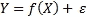

这里是一个表示*X*描述*Y*且未知的函数！这是我们使用手头观察到的数据点来找出的。术语


是一个均值为零且与*X*无关的随机误差项。

与这样一个方程相关的基本上有两种类型的错误 - 可减少的错误和不可减少的错误。顾名思义，可减少的错误与函数相关，可以通过提高准确性来最小化

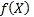

通过使用更好的学习算法或调整相同的算法。由于*Y*也是一个函数

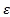

，这是独立于*X*的，仍然会有一些与之相关的错误，无法解决。这被称为不可减少的错误（


）。总是有一些因素影响结果变量，但在建模时未考虑（因为大多数情况下它们是未知的），并且导致不可减少的错误项。因此，我们在本书中讨论的方法只关注最小化可减少的错误。

我们构建的大多数机器学习模型可以用于预测或推断，或者两者结合。对于一些算法，函数


可以表示为一个方程，告诉我们因变量*Y*如何与自变量（*X1*，*X2*，...，*Xn*）相关。在这种情况下，我们既可以进行推断，也可以进行预测。然而，一些算法是黑匣子，我们只能进行预测，无法进行推断，因为*Y*与*X*的关系是未知的。

请注意，线性机器学习模型可能更适合推断设置，因为它们对业务用户更具可解释性。然而，在预测设置中，可能有更好的算法提供更准确的预测，但它们的可解释性较差。当推断是目标时，我们应该更喜欢使用诸如线性回归之类的限制性模型，以获得更好的可解释性，而当只有预测是目标时，我们可以选择使用高度灵活的模型，例如**支持向量机**（**SVM**），这些模型不太可解释，但更准确（然而，这在所有情况下可能并不成立）。在选择算法时，您需要根据业务需求来权衡可解释性和准确性之间的权衡。让我们深入了解这些概念背后的基本原理。

基本上，我们需要一组数据点（训练数据）来构建一个模型来估计


*(X)*，以便*Y =*


*(X)*。广义上说，这样的学习方法可以是参数化的，也可以是非参数化的。

## 参数方法

参数方法遵循两步过程。在第一步中，您假设


*()*。例如，*X*与*Y*呈线性关系，因此*X*的函数，即


*(X)*，可以用下面显示的线性方程表示：

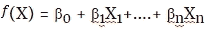

模型选择后，第二步是通过使用手头的数据点来训练模型来估计参数*β0*，*β1*，...，*βn*，以便：

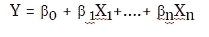

这种参数化方法的一个缺点是我们对于 *()* 在现实生活中的情况下可能不成立。

## 非参数方法

我们不对*Y*和*X*之间的线性关系以及变量的数据分布做任何假设，因此


*()* 在非参数化中。因为它不假设任何形式的


*()*，通过与数据点很好地拟合，可以产生更好的结果，这可能是一个优势。

因此，与参数方法相比，非参数方法需要更多的数据点来估计


*()*准确。但是请注意，如果处理不当，它可能会导致过度拟合问题。随着我们的进展，我们将更多地讨论这个问题。

# 回归方法

回归方法是一种监督学习的类型。如果响应变量是定量/连续的（取数值，如年龄、工资、身高等），则无论解释变量的类型如何，问题都可以称为回归问题。有各种建模技术来解决回归问题。在本节中，我们将重点放在线性回归技术和一些不同的变体上。

回归方法可用于预测任何实值结果。以下是一些例子：

+   根据教育水平、地点、工作类型等预测员工的工资

+   预测股票价格

+   预测客户的购买潜力

+   预测机器故障前需要的时间

## 线性回归

在前一节*参数方法*中讨论的内容之后，假设线性是


*(X)*，我们需要训练数据来拟合一个描述解释变量（表示为*X*）和响应变量（表示为*Y*）之间关系的模型。当只有一个解释变量时，称为简单线性回归，当有多个解释变量时，称为多元线性回归。简单线性回归就是在二维设置中拟合一条直线，当有两个预测变量时，它将在三维设置中拟合一个平面，以此类推，当有两个以上的变量时，它将在更高维的设置中拟合一个平面。

线性回归方程的通常形式可以表示为：

Y' =


(X) +


这里*Y'*代表了预测的结果变量。

只有一个预测变量的线性回归方程可以表示为：

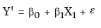

具有多个预测变量的线性回归方程可以表示为：

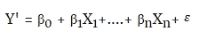

这里是与*X*无关的不可减小的误差项，均值为零。我们无法控制它，但我们可以努力优化


*(X)*。由于没有任何模型可以达到 100%的准确性，总会有一些与之相关的误差，因为不可减小的误差组成部分(


)。

拟合线性回归最常见的方法称为**最小二乘法**，也称为**普通最小二乘法**（**OLS**）方法。该方法通过最小化每个数据点到回归线的垂直偏差的平方和来找到最适合观察数据点的回归线。为了更好地理解线性回归的工作原理，让我们现在看一个简单线性回归的形式：

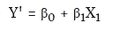

其中，*β0*是回归线的 Y 截距，*β1*定义了线的斜率。这意味着*β1*是*X*每变化一个单位时*Y*的平均变化。让我们举个*X*和*Y*的例子：

| **X** | **Y** |
| --- | --- |
| **1** | 12 |
| 2 20 |
| **3** | 13 |
| **4** | 38 |
| **5** | 27 |

如果我们通过前面表格中显示的数据点拟合一条线性回归线，那么它将如下所示：

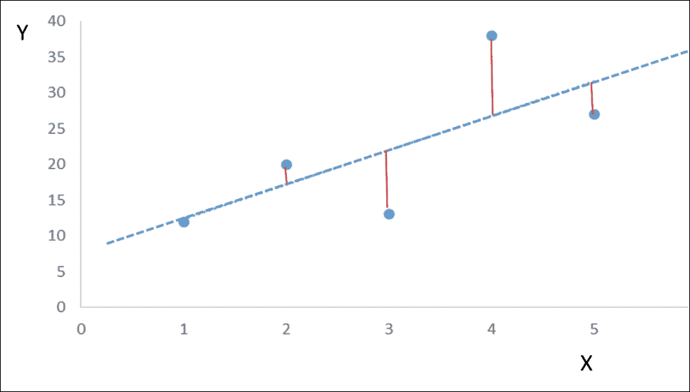

上图中的红色垂直线表示预测误差，可以定义为实际 Y 值与预测 Y'值之间的差异。如果平方这些差异并将它们相加，就称为残差平方和(SSE)，这是用于找到最佳拟合线的最常用的度量。下表显示了如何计算 SSE：

| **X** | **Y** | **Y'** | **Y-Y'** | **(Y-Y') 2** |
| --- | --- | --- | --- | --- |
| **1** | 12 | 12.4 | 0.4 | 0.16 |
| **2** | 20 | 17.2 | 2.8 | 7.84 |
| **3** | 13 | 22 | -9 | 81 |
| **4** | 38 | 26.8 | 11.2 | 125.44 |
| **5** | 27 | 31.6 | -4.6 | 21.16 |
| | | | 总和 | 235.6 |

在上表中，术语(Y-Y')称为残差。残差平方和(RSS)可以表示为：

*RSS = 残差[1]² + 残差[2]² + 残差[3]² + ......+ 残差[n]²*

请注意，回归对异常值非常敏感，如果在应用回归之前不加以处理，可能会引入巨大的 RSS 误差。

在观察到的数据点中拟合回归线后，应该通过将它们在 Y 轴上绘制出来，并将解释变量放在 X 轴上来检查残差。如果图表几乎是一条直线，那么你对线性关系的假设是有效的，否则可能表明存在某种非线性关系。在存在非线性关系的情况下，可能需要考虑非线性。其中一种技术是将高阶多项式添加到方程中。

我们看到 RSS 是拟合回归线时的一个重要特征（在构建模型时）。现在，为了评估回归拟合的好坏（一旦模型建立好），你需要另外两个统计量 - 残差标准误差(RSE)和 R²统计量。

我们讨论了不可减小的误差组件ε，因此即使你的方程完全拟合数据点并且正确估计了系数，你的回归仍然会有一定水平的误差。RSE 是ε的标准差的估计，可以定义如下：

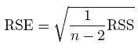

这意味着实际值与真实回归线的偏差平均为 RSE 的因素。

由于 RSE 实际上是以 Y 的单位来衡量的（参考我们在上一节中如何计算 RSS），很难说它是模型准确性的唯一最佳统计量。

因此，引入了一种另类方法，称为 R²统计量（也称为决定系数）。计算 R²的公式如下：

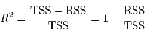

总平方和(TSS)可以计算如下：

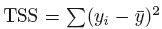

在这里要注意，TSS 测量了在执行回归预测 Y 之前 Y 中固有的总方差。注意它里面没有 Y'。相反，RSS 代表了回归后未能解释的 Y 中的变异性。这意味着(TSS - RSS)能够解释回归后响应的变异性。

R²统计量通常在 0 到 1 之间，但如果拟合比拟合水平线更差，可能会是负数，但这种情况很少见。接近 1 的值表示回归方程可以解释响应变量中大部分的变异性，是一个很好的拟合。相反，接近 0 的值表示回归没有解释响应变量中的大部分方差，不是一个很好的拟合。例如，R²为 0.25 意味着 25%的 Y 的方差由 X 解释，并且表明需要调整模型以改进。

现在让我们讨论如何通过回归来处理数据集中的非线性。正如前面讨论的，当发现非线性关系时，需要妥善处理。为了使用相同的线性回归技术建模非线性方程，您必须创建更高阶的特征，这些特征将被回归技术视为另一个变量。例如，如果*薪水*是一个特征/变量，用于预测*购买潜力*，并且我们发现它们之间存在非线性关系，那么我们可能会创建一个名为（*salary3*）的特征，具体取决于需要解决多少非线性。请注意，当您创建这些更高阶特征时，您还必须保留基本特征。在这个例子中，您必须在回归方程中同时使用（*salary*）和（*salary3*）。

到目前为止，我们有点假设所有的预测变量都是连续的。如果有分类预测变量怎么办？在这种情况下，我们必须对这些变量进行虚拟编码（比如男性为 1，女性为 0），以便回归技术生成两个方程，一个用于性别=男性（方程将包含性别变量），另一个用于性别=女性（方程将不包含性别变量，因为它将被编码为 0）。有时，对于非常少的分类变量，根据分类变量的级别划分数据集并为其构建单独的模型可能是一个好主意。

最小二乘线性回归的一个主要优势是它解释了结果变量与预测变量的关系。这使得它非常可解释，并且可以用于推断以及预测。

### 损失函数

许多机器学习问题可以被制定为凸优化问题。这个问题的目标是找到使平方损失最小的系数值。这个目标函数基本上有两个组成部分 - 正则化器和损失函数。正则化器用于控制模型的复杂性（以防止过拟合），损失函数用于估计回归函数的系数，使得平方损失（RSS）最小。

最小二乘法使用的损失函数称为**平方损失**，如下所示：

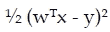

这里*Y*是响应变量（实值），*W*是权重向量（系数的值），*X*是特征向量。所以

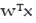

给出了预测值，我们将其与实际值*Y*相等，以找到需要最小化的平方损失。

用于估计系数的算法称为**梯度下降**。不同类型的损失函数和优化算法适用于不同类型的机器学习算法，我们将根据需要进行介绍。

### 优化

最终，线性方法必须优化损失函数。在幕后，线性方法使用凸优化方法来优化目标函数。MLlib 支持**随机梯度下降**（**SGD**）和**有限内存 - Broyden-Fletcher-Goldfarb-Shanno**（**L-BFGS**）。目前，大多数算法 API 支持 SGD，少数支持 L-BFGS。

SGD 是一种适用于大规模数据和分布式计算环境的一阶优化技术。目标函数（损失函数）被写成求和形式的优化问题最适合使用 SGD 来解决。

L-BFGS 是一种在拟牛顿方法家族中的优化算法，用于解决优化问题。与 SGD 等一阶优化技术相比，L-BFGS 通常能够实现更快的收敛。

MLlib 中提供的一些线性方法都支持 SGD 和 L-BFGS。您应该根据所考虑的目标函数选择其中一种。一般来说，L-BFGS 比 SGD 更快地收敛，但您需要根据需求进行仔细评估。

## 回归的正则化

具有较大权重（系数值）时，容易过拟合模型。正则化是一种主要用于通过控制模型复杂性来消除过拟合问题的技术。通常在看到模型在训练数据和测试数据上的性能差异时进行。如果训练性能高于测试数据，可能是过拟合（高方差）的情况。

为了解决这个问题，引入了一种会对损失函数进行惩罚的正则化技术。在训练数据观测数量较少时，通常建议使用任何一种正则化技术。

在进一步讨论正则化技术之前，我们必须了解在监督学习环境中，“偏差”和“方差”是什么意思，以及为什么总是存在相关的权衡。虽然两者都与错误有关，“偏差”模型意味着它偏向于某些错误的假设，并且可能在一定程度上忽略预测变量和响应变量之间的关系。这是欠拟合的情况！另一方面，“高方差”模型意味着它试图触及每个数据点，并最终对数据集中存在的随机噪声进行建模。这代表了过拟合的情况。

带有 L2 惩罚（L2 正则化）的线性回归称为**岭回归**，带有 L1 惩罚（L1 正则化）的线性回归称为**套索回归**。当同时使用 L1 和 L2 惩罚时，称为**弹性网络回归**。我们将在下一节依次讨论它们。

与 L1 正则化问题相比，L2 正则化问题通常更容易解决，因为它更加平滑，但 L1 正则化问题可能导致权重的稀疏性，从而导致更小且更可解释的模型。因此，套索有时用于特征选择。

### 岭回归

当我们在最小二乘损失函数中加入 L2 惩罚（也称为**收缩惩罚**）时，就变成了岭回归，如下所示：

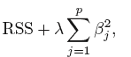

这里*λ*（大于 0）是一个单独确定的调整参数。在前述方程的第二项被称为收缩惩罚，只有当系数（*β0*，*β1*...等等）很小时并且接近 0 时，它才会很小。当*λ=0*时，岭回归变为最小二乘法。当 lambda 趋近于无穷大时，回归系数趋近于零（但永远不会为零）。

岭回归为每个*λ*值生成不同的系数值集。因此，需要使用交叉验证来谨慎选择 lambda 值。随着 lambda 值的增加，回归线的灵活性减少，从而减少方差并增加偏差。

请注意，收缩惩罚适用于除截距项*β0*之外的所有解释变量。

当训练数据较少或者预测变量或特征的数量超过观测数量时，岭回归效果非常好。此外，岭回归所需的计算几乎与最小二乘法相同。

由于岭回归不会将任何系数值减少到零，所有变量都将出现在模型中，这可能会使模型在变量数量较多时变得不太可解释。

### 套索回归

套索回归是在岭回归之后引入的。当我们在最小二乘损失函数中加入 L1 惩罚时，就变成了套索回归，如下所示：

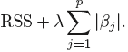

这里的区别在于，它不是取平方系数，而是取系数的模。与岭回归不同，它可以强制一些系数为零，这可能导致一些变量的消除。因此，Lasso 也可以用于变量选择！

Lasso 为每个 lambda 值生成不同的系数值集。因此需要使用交叉验证来谨慎选择 lambda 值。与岭回归一样，随着 lambda 的增加，方差减小，偏差增加。

Lasso 相对于岭回归产生更好的可解释模型，因为它通常只有总变量数的子集。当存在许多分类变量时，建议选择 Lasso 而不是岭回归。

实际上，岭回归和 Lasso 并不总是一个比另一个更好。Lasso 通常在具有实质性系数的少量预测变量和其余具有非常小系数的情况下表现良好。当存在许多预测变量且几乎所有预测变量具有实质性但相似的系数大小时，岭回归通常表现更好。

岭回归适用于分组选择，也可以解决多重共线性问题。另一方面，Lasso 不能进行分组选择，倾向于只选择一个预测变量。此外，如果一组预测变量彼此高度相关，Lasso 倾向于只选择其中一个，并将其他收缩为零。

### 弹性网络回归

当我们在最小二乘的损失函数中同时添加 L1 和 L2 惩罚时，它就成为了弹性网络回归，如下所示：

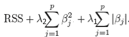

以下是弹性网络回归的优点：

+   强制稀疏性并帮助去除最不有效的变量

+   鼓励分组效应

+   结合了岭回归和 Lasso 的优点

Naive 版本的弹性网络回归存在双收缩问题，导致增加偏差和较差的预测准确性。为了解决这个问题，一种方法是通过将估计系数乘以(*1+ λ2*)来重新缩放它们：

**Scala**

```scala
import org.apache.spark.mllib.linalg.Vectors
import org.apache.spark.mllib.regression.LabeledPoint
import org.apache.spark.mllib.regression.LinearRegressionModel
import org.apache.spark.mllib.regression.LinearRegressionWithSGD
scala> import org.apache.spark.ml.regression.{LinearRegression,LinearRegressionModel}
import org.apache.spark.ml.regression.{LinearRegression,LinearRegressionModel}
// Load the data
scala> val data = spark.read.format("libsvm").load("data/mllib/sample_linear_regression_data.txt")
data: org.apache.spark.sql.DataFrame = [label: double, features: vector]

// Build the model
scala> val lrModel = new LinearRegression().fit(data)

//Note: You can change ElasticNetParam, MaxIter and RegParam
// Defaults are 0.0, 100 and 0.0
lrModel: org.apache.spark.ml.regression.LinearRegressionModel = linReg_aa788bcebc42

//Check Root Mean Squared Error
scala> println("Root Mean Squared Error = " + lrModel.summary.rootMeanSquaredError)
Root Mean Squared Error = 10.16309157133015
```

**Python**：

```scala
>>> from pyspark.ml.regression import LinearRegression, LinearRegressionModel
>>>

// Load the data
>>> data = spark.read.format("libsvm").load("data/mllib/sample_linear_regression_data.txt")
>>> 

// Build the model
>>> lrModel = LinearRegression().fit(data)

//Note: You can change ElasticNetParam, MaxIter and RegParam
// Defaults are 0.0, 100 and 0.0
//Check Root Mean Squared Error
>>> print "Root Mean Squared Error = ", lrModel.summary.rootMeanSquaredError
Root Mean Squared Error = 10.16309157133015
>>> 
```

# 分类方法

如果响应变量是定性/分类的（取诸如性别、贷款违约、婚姻状况等分类值），那么问题可以被称为分类问题，而不管解释变量的类型。有各种类型的分类方法，但在本节中我们将专注于逻辑回归和支持向量机。

以下是一些分类方法的一些含义的例子：

+   一个顾客购买产品或不购买产品

+   一个人是否患有糖尿病

+   一个申请贷款的个人是否违约

+   一个电子邮件接收者是否阅读电子邮件

## 逻辑回归

逻辑回归衡量了解释变量和分类响应变量之间的关系。我们不使用线性回归来处理分类响应变量，因为响应变量不是在连续尺度上，因此误差项不是正态分布的。

因此，逻辑回归是一种分类算法。逻辑回归不直接对响应变量*Y*建模，而是对*Y*属于特定类别的概率分布*P(Y*|*X)*进行建模。条件分布(*Y*|*X*)是伯努利分布，而不是高斯分布。逻辑回归方程可以表示如下：

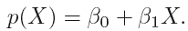

对于二分类，模型的输出应该限制为两个类中的一个（比如 0 或 1）。由于逻辑回归预测的是概率而不是直接的类，我们使用逻辑函数（也称为*sigmoid 函数*）来将输出限制为单个类：

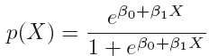

解决上述方程得到以下结果：

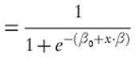

可以进一步简化为：

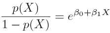

左边的数量 *P(X)/1-P(X)* 被称为 *赔率*。赔率的值范围从 0 到无穷大。接近 0 的值表示概率很低，而数字较大的值表示高概率。有时根据情况直接使用赔率而不是概率。

如果我们取赔率的对数，它就变成了对数赔率或 logit，可以表示如下：

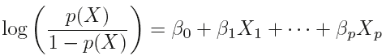

从前面的方程可以看出，logit 与 *X* 线性相关。

在有两个类别 1 和 0 的情况下，如果 *p >= 0.5* 则预测 *Y = 1*，如果 *p < 0.5* 则预测 *Y = 0*。因此，逻辑回归实际上是一个决策边界在 *p = 0.5* 处的线性分类器。在某些业务案例中，*p* 并不是默认设置为 0.5，您可能需要使用一些数学技术来找出正确的值。

一种称为最大似然的方法用于通过计算回归系数来拟合模型，算法可以是梯度下降，就像在线性回归设置中一样。

在逻辑回归中，损失函数应该解决误分类率。因此，逻辑回归使用的损失函数称为 *逻辑损失*，如下所示：

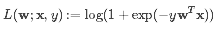

### 注意

请注意，当您使用高阶多项式更好地拟合模型时，逻辑回归也容易过拟合。为了解决这个问题，您可以像在线性回归中那样使用正则化项。截至目前，Spark 不支持正则化的逻辑回归，因此我们暂时跳过这部分。 

# 线性支持向量机（SVM）

**支持向量机**（**SVM**）是一种监督式机器学习算法，可用于分类和回归。但是，它在解决分类问题方面更受欢迎，由于 Spark 将其作为 SVM 分类器提供，因此我们将仅限于讨论分类设置。在用作分类器时，与逻辑回归不同，它是一种非概率分类器。

SVM 已经从一个称为**最大间隔分类器**的简单分类器发展而来。由于最大间隔分类器要求类别可由线性边界分开，因此它无法应用于许多数据集。因此，它被扩展为一个称为**支持向量分类器**的改进版本，可以处理类别重叠且类别之间没有明显分离的情况。支持向量分类器进一步扩展为我们所说的 SVM，以适应非线性类边界。让我们逐步讨论 SVM 的演变，以便更清楚地了解它的工作原理。

如果数据集中有 *p* 个维度（特征），那么我们在 p 维空间中拟合一个超平面，其方程可以定义如下：

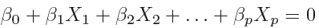

这个超平面被称为形成决策边界的分离超平面。结果将根据结果进行分类；如果大于 0，则在一侧，如果小于 0，则在另一侧，如下图所示：

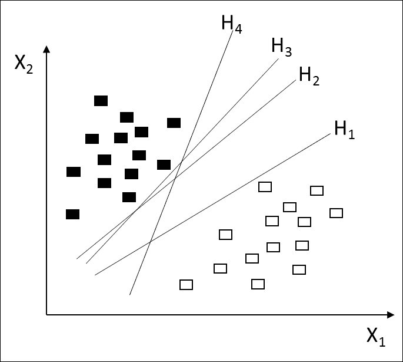

观察前面的图表，可以有多个超平面（它们可以是无限的）。应该有一个合理的方法来选择最佳的超平面。这就是我们选择最大间隔超平面的地方。如果计算所有数据点到分离超平面的垂直距离，那么最小距离将被称为间隔。因此，对于最大间隔分类器，超平面应具有最大间隔。

距离分隔超平面接近但等距离的训练观测被称为支持向量。对支持向量进行微小改变会导致超平面重新定位。这些支持向量实际上定义了边缘。那么，如果考虑的两个类别是不可分的呢？我们可能希望有一个分类器，它不完全分离两个类别，并且具有一个更柔和的边界，允许一定程度的误分类。这一要求导致了支持向量分类器的引入（也称为软边界分类器）。

从数学上讲，正是方程中的松弛变量允许了误分类。此外，在支持向量分类器中有一个调节参数，应该使用交叉验证来选择。这个调节参数是在偏差和方差之间进行权衡的参数，应该小心处理。当它很大时，边缘会更宽，包含许多支持向量，具有低方差和高偏差。如果它很小，那么边缘将有更少的支持向量，分类器将具有低偏差但高方差。

SVM 的损失函数可以表示如下：

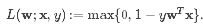

截至目前，Spark 仅支持线性 SVM。默认情况下，线性 SVM 使用 L2 正则化进行训练。Spark 还支持替代的 L1 正则化。

到目前为止一切顺利！但是当类别之间存在非线性边界时，支持向量分类器会如何工作呢，就像下面的图片所示的那样：

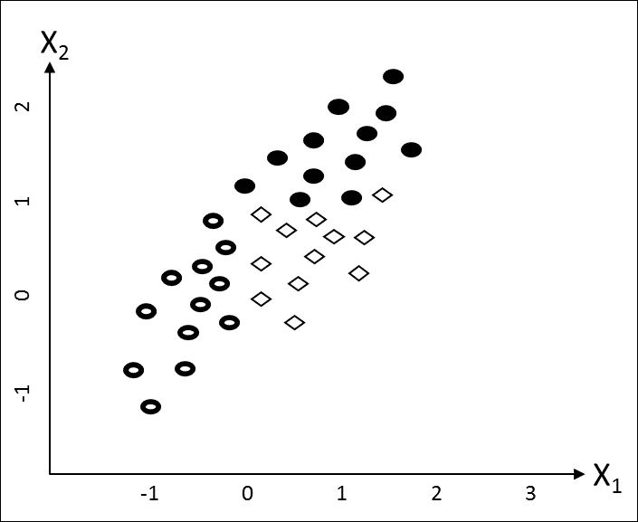

任何线性分类器，比如支持向量分类器，在前述情况下表现都非常糟糕。如果它通过数据点画一条直线，那么类别就无法正确分离。这是非线性类边界的情况。解决这个问题的方法是支持向量机（SVM）。换句话说，当支持向量分类器与非线性核融合时，它就成为了 SVM。

与我们在回归方程中引入高阶多项式项以解决非线性问题的方式类似，在 SVM 的情境下也可以做一些处理。SVM 使用称为核的东西来处理数据集中不同类型的非线性；不同类型的非线性需要不同的核。核方法将数据映射到更高维的空间，这样做可能会使数据得到更好的分离。同时，它也使得区分不同类别变得更容易。让我们讨论一下一些重要的核，以便能够选择合适的核。

## 线性核

这是最基本类型的核之一，它允许我们只选择线或超平面。它相当于支持向量分类器。如果数据集中存在非线性，它就无法解决。

## 多项式核

这允许我们在多项式阶数的范围内解决一定程度的非线性。当训练数据被归一化时，这种方法效果很好。这个核通常有更多的超参数，因此增加了模型的复杂性。

## 径向基函数核

当你不确定使用哪种核时，径向基函数（RBF）可能是一个不错的默认选择。它允许你选择甚至是圆或超球体。尽管这通常比线性或多项式核表现更好，但当特征数量很大时，它的表现就不那么好了。

## Sigmoid 核

Sigmoid 核源自神经网络。因此，具有 Sigmoid 核的 SVM 等效于具有两层感知器的神经网络。

# 训练 SVM

在训练 SVM 时，建模者需要做出一些决策：

+   如何预处理数据（转换和缩放）。分类变量应通过虚拟化转换为数值变量。此外，需要对数值进行缩放（0 到 1 或-1 到+1）。

+   要使用哪种核（如果无法可视化数据和/或对其进行结论，则使用交叉验证进行检查）。

+   SVM 的参数设置：惩罚参数和核参数（使用交叉验证或网格搜索进行查找）

如果需要，可以使用基于熵的特征选择来在模型中仅包括重要特征。

**Scala**：

```scala
scala> import org.apache.spark.mllib.classification.{SVMModel, SVMWithSGD}
import org.apache.spark.mllib.classification.{SVMModel, SVMWithSGD}
scala> import org.apache.spark.mllib.evaluation.BinaryClassificationMetrics
import org.apache.spark.mllib.evaluation.BinaryClassificationMetrics
scala> import org.apache.spark.mllib.util.MLUtils
import org.apache.spark.mllib.util.MLUtils
scala>

// Load training data in LIBSVM format.
scala> val data = MLUtils.loadLibSVMFile(sc, "data/mllib/sample_libsvm_data.txt")
data: org.apache.spark.rdd.RDD[org.apache.spark.mllib.regression.LabeledPoint] = MapPartitionsRDD[6] at map at MLUtils.scala:84
scala>

// Split data into training (60%) and test (40%).
scala> val splits = data.randomSplit(Array(0.6, 0.4), seed = 11L)
splits: Array[org.apache.spark.rdd.RDD[org.apache.spark.mllib.regression.LabeledPoint]] = Array(MapPartitionsRDD[7] at randomSplit at <console>:29, MapPartitionsRDD[8] at randomSplit at <console>:29)
scala> val training = splits(0).cache()
training: org.apache.spark.rdd.RDD[org.apache.spark.mllib.regression.LabeledPoint] = MapPartitionsRDD[7] at randomSplit at <console>:29
scala> val test = splits(1)
test: org.apache.spark.rdd.RDD[org.apache.spark.mllib.regression.LabeledPoint] = MapPartitionsRDD[8] at randomSplit at <console>:29
scala>

// Run training algorithm to build the model
scala> val model = SVMWithSGD.train(training, numIterations=100)
model: org.apache.spark.mllib.classification.SVMModel = org.apache.spark.mllib.classification.SVMModel: intercept = 0.0, numFeatures = 692, numClasses = 2, threshold = 0.0
scala>

// Clear the default threshold.
scala> model.clearThreshold()
res1: model.type = org.apache.spark.mllib.classification.SVMModel: intercept =
0.0, numFeatures = 692, numClasses = 2, threshold = None
scala>

// Compute raw scores on the test set.
scala> val scoreAndLabels = test.map { point =>
       val score = model.predict(point.features)
      (score, point.label)
      }
scoreAndLabels: org.apache.spark.rdd.RDD[(Double, Double)] =
MapPartitionsRDD[213] at map at <console>:37
scala>

// Get evaluation metrics.
scala> val metrics = new BinaryClassificationMetrics(scoreAndLabels)
metrics: org.apache.spark.mllib.evaluation.BinaryClassificationMetrics = org.apache.spark.mllib.evaluation.BinaryClassificationMetrics@3106aebb
scala> println("Area under ROC = " + metrics.areaUnderROC())
Area under ROC = 1.0
scala>
```

### 注意

`mllib`已经进入维护模式，SVM 在 ml 下仍不可用，因此仅提供 Scala 代码以供说明。

# 决策树

决策树是一种非参数的监督学习算法，可用于分类和回归。决策树就像倒置的树，根节点在顶部，叶节点向下形成。有不同的算法将数据集分割成类似分支的段。每个叶节点分配给代表最合适目标值的类。

决策树不需要对数据集进行任何缩放或转换，并且可以处理分类和连续特征，还可以处理数据集中的非线性。在其核心，决策树是一种贪婪算法（它考虑当前的最佳分割，并不考虑未来的情况），它对特征空间进行递归二元分区。分割是基于每个节点的信息增益进行的，因为信息增益衡量了给定属性如何根据目标类别或值分隔训练示例。第一个分割发生在生成最大信息增益的特征上，并成为根节点。

节点的信息增益是父节点不纯度与两个子节点不纯度加权和之间的差异。为了估计信息增益，Spark 目前针对分类问题有两种不纯度度量，针对回归问题有一种不纯度度量，如下所述。

## 不纯度度量

不纯度是同质性的度量，也是递归分区的最佳标准。通过计算不纯度，决定最佳的分割候选。大多数不纯度度量都是基于概率的：

*类的概率=该类的观察次数/总观察次数*

让我们花一些时间来了解 Spark 支持的不同类型的重要不纯度度量。

### 基尼指数

基尼指数主要用于数据集中的连续属性或特征。如果不是，它将假定所有属性和特征都是连续的。分割使得子节点比父节点更*纯净*。基尼倾向于找到最大的类 - 响应变量的类别，其观察次数最多。可以定义如下：

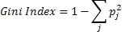

如果响应的所有观察属于单个类，则该类的概率*P*，即(*Pj*)，将为 1，因为只有一个类，*(Pj)2*也将为 1。这使得基尼指数为零。

### 熵

熵主要用于数据集中的分类属性或特征。可以定义如下：

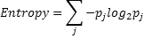

如果响应的所有观察属于单个类，则该类的概率(*Pj*)将为 1，*log(P)*将为零。这使得熵为零。

以下图表描述了公平硬币抛掷的概率：

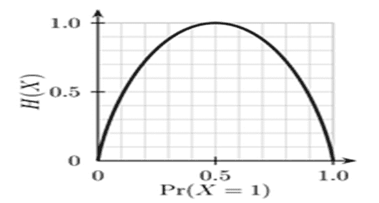

仅为了解释前面的图表，如果抛掷一个公平硬币，正面或反面的概率将为 0.5，因此在概率为 0.5 时观察次数最多。

如果数据样本完全同质，则熵将为零，如果样本可以平均分为两部分，则熵将为一。

与 Gini 相比，计算速度稍慢，因为它还必须计算对数。

### 方差

与基尼指数和熵不同，方差用于计算回归问题的信息增益。方差可以定义为：

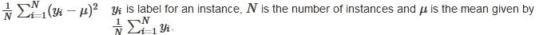

## 停止规则

当满足以下条件之一时，递归树构造停止在一个节点上：

+   节点深度等于`maxDepth`训练参数

+   没有分裂候选者导致信息增益大于`minInfoGain`

+   没有分裂候选者产生子节点，每个子节点至少有一个`minInstancesPerNode`训练实例

## 分裂候选者

数据集通常包含混合的分类和连续特征。我们应该了解特征如何进一步分裂为分裂候选者，因为有时我们需要一定程度的控制来构建更好的模型。

### 分类特征

对于具有*M*个可能值（类别）的分类特征，可以提出*2(M-ˆ’1)-ˆ’1*个分裂候选者。无论是二元分类还是回归，通过按平均标签对分类特征值进行排序，可以将分裂候选者的数量减少到*M-ˆ’1*。

例如，考虑一个具有三个类别 A、B 和 C 的分类特征的二元分类（0/1）问题，它们对应的标签-1 响应变量的比例分别为 0.2、0.6 和 0.4。在这种情况下，分类特征可以被排序为 A、C、B。因此，两个分裂候选者（*M-1* = *3-1* = *2*）可以是*A | (C, B)*和*A, (C | B)*，其中“|”表示分裂。

### 连续特征

对于连续特征变量，可能存在没有两个相同值的情况（至少我们可以假设如此）。如果有*n*个观察结果，那么*n*个分裂候选者可能不是一个好主意，特别是在大数据环境中。

在 Spark 中，通过对数据样本进行分位数计算，并相应地对数据进行分箱来实现。您仍然可以通过使用`maxBins`参数来控制允许的最大箱数。`maxBins`的最大默认值为`32`。

## 决策树的优势

+   它们易于理解和解释，因此易于向业务用户解释

+   它们适用于分类和回归

+   在构建决策树时，可以容纳定性和定量数据

决策树中的信息增益偏向于具有更多级别的属性。

## 决策树的缺点

+   它们对于连续结果变量的有效性不是很好

+   当类别很多且数据集很小时，性能较差。

+   轴平行分裂降低了准确性

+   它们因试图拟合几乎所有数据点而遭受高方差

## 例子

实现方面，在分类和回归树之间没有主要区别。让我们在 Spark 上实际实现它。

**Scala:**

```scala
//Assuming ml.Pipeline and ml.features are already imported
scala> import org.apache.spark.ml.classification.{
        DecisionTreeClassifier, DecisionTreeClassificationModel}
import org.apache.spark.ml.classification.{DecisionTreeClassifier,
DecisionTreeClassificationModel}
scala>
/prepare train data
scala> val f:String = "<Your path>/simple_file1.csv"
f: String = <your path>/simple_file1.csv
scala> val trainDF = spark.read.options(Map("header"->"true",
            "inferSchema"->"true")).csv(f)
trainDF: org.apache.spark.sql.DataFrame = [Text: string, Label: int]

scala>

 //define DecisionTree pipeline
//StringIndexer maps labels(String or numeric) to label indices
//Maximum occurrence label becomes 0 and so on
scala> val lblIdx = new StringIndexer().
                setInputCol("Label").
                setOutputCol("indexedLabel")
lblIdx: org.apache.spark.ml.feature.StringIndexer = strIdx_3a7bc9c1ed0d
scala>

// Create labels list to decode predictions
scala> val labels = lblIdx.fit(trainDF).labels
labels: Array[String] = Array(2, 1, 3)
scala>

//Define Text column indexing stage
scala> val fIdx = new StringIndexer().
                setInputCol("Text").
              setOutputCol("indexedText")
fIdx: org.apache.spark.ml.feature.StringIndexer = strIdx_49253a83c717

// VectorAssembler
scala> val va = new VectorAssembler().
              setInputCols(Array("indexedText")).
              setOutputCol("features")
va: org.apache.spark.ml.feature.VectorAssembler = vecAssembler_764720c39a85

//Define Decision Tree classifier. Set label and features vector
scala> val dt = new DecisionTreeClassifier().
            setLabelCol("indexedLabel").
            setFeaturesCol("features")
dt: org.apache.spark.ml.classification.DecisionTreeClassifier = dtc_84d87d778792

//Define label converter to convert prediction index back to string
scala> val lc = new IndexToString().
                setInputCol("prediction").
                setOutputCol("predictedLabel").
                setLabels(labels)
lc: org.apache.spark.ml.feature.IndexToString = idxToStr_e2f4fa023665
scala>

//String the stages together to form a pipeline
scala> val dt_pipeline = new Pipeline().setStages(
          Array(lblIdx,fIdx,va,dt,lc))
dt_pipeline: org.apache.spark.ml.Pipeline = pipeline_d4b0e884dcbf
scala>
//Apply pipeline to the train data
scala> val resultDF = dt_pipeline.fit(trainDF).transform(trainDF)

//Check results. Watch Label and predictedLabel column values match
resultDF: org.apache.spark.sql.DataFrame = [Text: string, Label: int ... 6 more
fields]
scala>
resultDF.select("Text","Label","features","prediction","predictedLabel").show()
+----+-----+--------+----------+--------------+
|Text|Label|features|prediction|predictedLabel|
+----+-----+--------+----------+--------------+
|   A|    1|   [1.0]|       1.0|             1|
|   B|    2|   [0.0]|       0.0|             2|
|   C|    3|   [2.0]|       2.0|             3|
|   A|    1|   [1.0]|       1.0|             1|
|   B|    2|   [0.0]|       0.0|             2|
+----+-----+--------+----------+--------------+
scala>

//Prepare evaluation data
scala> val eval:String = "€œ<Your path>/simple_file2.csv"
eval: String = <Your path>/simple_file2.csv
scala> val evalDF = spark.read.options(Map("header"->"true",
            "inferSchema"->"true")).csv(eval)
evalDF: org.apache.spark.sql.DataFrame = [Text: string, Label: int]
scala>

//Apply the same pipeline to the evaluation data
scala> val eval_resultDF = dt_pipeline.fit(evalDF).transform(evalDF)
eval_resultDF: org.apache.spark.sql.DataFrame = [Text: string, Label: int ... 7
more fields]

//Check evaluation results
scala>
eval_resultDF.select("Text","Label","features","prediction","predictedLabel").sh
w()
+----+-----+--------+----------+--------------+
|Text|Label|features|prediction|predictedLabel|
+----+-----+--------+----------+--------------+
|   A|    1|   [0.0]|       1.0|             1|
|   A|    1|   [0.0]|       1.0|             1|
|   A|    2|   [0.0]|       1.0|             1|
|   B|    2|   [1.0]|       0.0|             2|
|   C|    3|   [2.0]|       2.0|             3|
+----+-----+--------+----------+--------------+
//Note that predicted label for the third row is 1 as against Label(2) as
expected

Python:

//Model training example
>>> from pyspark.ml.pipeline import Pipeline
>>> from pyspark.ml.feature import StringIndexer, VectorIndexer, VectorAssembler,
IndexToString
>>> from pyspark.ml.classification import DecisionTreeClassifier,
DecisionTreeClassificationModel
>>> 

//prepare train data
>>> file_location = "../work/simple_file1.csv"
>>> trainDF = spark.read.csv(file_location,header=True,inferSchema=True)

 //Read file
>>>

//define DecisionTree pipeline
//StringIndexer maps labels(String or numeric) to label indices
//Maximum occurrence label becomes 0 and so on
>>> lblIdx = StringIndexer(inputCol = "Label",outputCol = "indexedLabel")

// Create labels list to decode predictions
>>> labels = lblIdx.fit(trainDF).labels
>>> labels
[u'2', u'1', u'3']
>>> 

//Define Text column indexing stage
>>> fidx = StringIndexer(inputCol="Text",outputCol="indexedText")

// Vector assembler
>>> va = VectorAssembler(inputCols=["indexedText"],outputCol="features")

//Define Decision Tree classifier. Set label and features vector
>>> dt = DecisionTreeClassifier(labelCol="indexedLabel",featuresCol="features")

//Define label converter to convert prediction index back to string
>>> lc = IndexToString(inputCol="prediction",outputCol="predictedLabel",
                       labels=labels)

//String the stages together to form a pipeline
>>> dt_pipeline = Pipeline(stages=[lblIdx,fidx,va,dt,lc])
>>>
>>> 

//Apply decision tree pipeline
>>> dtModel = dt_pipeline.fit(trainDF)
>>> dtDF = dtModel.transform(trainDF)
>>> dtDF.columns
['Text', 'Label', 'indexedLabel', 'indexedText', 'features', 'rawPrediction',
'probability', 'prediction', 'predictedLabel']
>>> dtDF.select("Text","Label","indexedLabel","prediction",
"predictedLabel").show()
+----+-----+------------+----------+--------------+
|Text|Label|indexedLabel|prediction|predictedLabel|
+----+-----+------------+----------+--------------+
|   A|    1|         1.0|       1.0|             1|
|   B|    2|         0.0|       0.0|             2|
|   C|    3|         2.0|       2.0|             3|
|   A|    1|         1.0|       1.0|             1|
|   B|    2|         0.0|       0.0|             2|
+----+-----+------------+----------+--------------+

>>>

>>> //prepare evaluation dataframe
>>> eval_file_path = "../work/simple_file2.csv"
>>> evalDF = spark.read.csv(eval_file_path,header=True, inferSchema=True) 

//Read eval file
>>> eval_resultDF = dt_pipeline.fit(evalDF).transform(evalDF)
>>> eval_resultDF.columns
['Text', 'Label', 'indexedLabel', 'indexedText', 'features', 'rawPrediction', 'probability', 'prediction', 'predictedLabel']
>>> eval_resultDF.select("Text","Label","indexedLabel","prediction",
"predictedLabel").show()
+----+-----+------------+----------+--------------+
|Text|Label|indexedLabel|prediction|predictedLabel|
+----+-----+------------+----------+--------------+
|   A|    1|         1.0|       1.0|             1|
|   A|    1|         1.0|       1.0|             1|
|   A|    2|         0.0|       1.0|             1|
|   B|    2|         0.0|       0.0|             2|
|   C|    3|         2.0|       2.0|             3|
+----+-----+------------+----------+--------------+
>>> 

Accompanying data files:
simple_file1.csv Text,Label
A,1
B,2
C,3
A,1
B,2simple_file2.csv Text,Label
A,1
A,1
A,2
B,2
C,3
```

# 集成

正如其名称所示，集成方法使用多个学习算法来获得更准确的模型，通常这些技术需要更多的计算能力，并使模型更复杂，这使得难以解释。让我们讨论 Spark 上可用的各种类型的集成技术。

## 随机森林

随机森林是决策树的集成技术。在我们讨论随机森林之前，让我们看看它是如何发展的。我们知道决策树通常存在高方差问题，并且倾向于过度拟合模型。为了解决这个问题，引入了一个称为*bagging*（也称为自举聚合）的概念。对于决策树，想法是从数据集中获取多个训练集（自举训练集），并从中创建单独的决策树，然后对回归树进行平均。对于分类树，我们可以从所有树中获取多数投票或最常出现的类。这些树生长深入，并且根本没有被修剪。这确实减少了方差，尽管单个树可能具有高方差。

纯粹的 bagging 方法的一个问题是，对于大多数自举训练集，强预测变量占据了顶部分裂的位置，这几乎使得袋装树看起来相似。这意味着预测也看起来相似，如果你对它们进行平均，那么它并没有像预期的那样减少方差。为了解决这个问题，需要一种技术，它将采用与袋装树类似的方法，但消除树之间的相关性，因此产生了*随机森林*。

在这种方法中，您构建自举训练样本以创建决策树，但唯一的区别是每次发生分裂时，从总共 K 个预测变量中选择 P 个预测变量的随机样本。这就是随机森林向这种方法注入随机性的方式。作为一个经验法则，我们可以将 P 取为 Q 的平方根。

就像在 bagging 的情况下，如果你的目标是回归，你也会平均预测结果，如果目标是分类，你会采取多数投票。Spark 提供了一些调整参数来调整这个模型，如下所示：

+   `numTrees`：您可以指定在随机森林中考虑的树的数量。如果数字很高，那么预测的方差会较小，但所需的时间会更长。

+   `maxDepth`：您可以指定每棵树的最大深度。增加深度会使树在预测准确度方面更加强大。尽管它们倾向于过度拟合单独的树，但总体输出仍然很好，因为我们无论如何都会平均结果，从而减少方差。

+   `subsamplingRate`：这个参数主要用于加速训练。它用于设置自举训练样本的大小。小于 1.0 的值可以加快性能。

+   `featureSubsetStrategy`：这个参数也可以帮助加快执行。它用于设置每个节点用作分裂候选的特征数。它应该谨慎设置，因为太低或太高的值可能会影响模型的准确性。

### 随机森林的优势

+   它们运行速度更快，因为执行是并行进行的

+   它们不太容易过度拟合

+   它们易于调整

+   与树或袋装树相比，预测准确度更高

+   它们即使在预测变量是分类和连续特征的混合时也能很好地工作，并且不需要缩放

## 梯度提升树

与随机森林一样，**梯度提升树**（**GBTs**）也是一种树的集成。它们可以应用于分类和回归问题。与袋装树或随机森林不同，树是顺序构建的。每棵树都是使用先前生长树的结果来生长的。请注意，GBT 不适用于自举样本。

在每次迭代中，GBT 使用当前集成来预测训练实例的标签，并将它们与真实标签进行比较，并估计错误。预测准确度较差的训练实例将被重新标记，以便基于先前错误的错误率在下一次迭代中纠正决策树。

找到错误率并重新标记实例的机制是基于损失函数的。GBT 旨在减少每次迭代的损失函数。Spark 支持以下类型的损失函数：

+   **对数损失**：这用于分类问题。

+   **平方误差（L2 损失）**：这用于回归问题，并且默认设置。它是所有观察值的实际值和预测输出之间的平方差异的总和。对于这种损失函数，异常值应该得到很好的处理才能表现良好。

+   **绝对误差（L1 损失）**：这也用于回归问题。它是所有观察值的实际值和预测输出之间的绝对差异的总和。与平方误差相比，它对异常值更具鲁棒性。

Spark 提供了一些调整参数来调整此模型，如下所示：

+   `loss`：您可以根据前面讨论的数据集和您打算进行分类或回归的意图，传递一个损失函数。

+   `numIterations`：每次迭代只生成一棵树！如果将此设置得很高，那么执行所需的时间也会很长，因为操作将是顺序的，并且还可能导致过拟合。应该谨慎设置以获得更好的性能和准确性。

+   `learningRate`：这实际上不是一个调整参数。如果算法的行为不稳定，那么减小这个值可以帮助稳定模型。

+   `algo`：*分类*或*回归*是根据您的需求设置的。

GBT 可能会过度拟合具有更多树的模型，因此 Spark 提供了`runWithValidation`方法来防止过拟合。

### 提示

截至目前，Spark 上的 GBT 尚不支持多类分类。

让我们看一个示例来说明 GBT 的工作原理。示例数据集包含二十名学生的平均分和出勤情况。数据还包含结果为通过或失败，遵循一组标准。然而，一对学生（id 为 1009 和 1020）被“授予”通过状态，尽管他们实际上并没有资格。现在我们的任务是检查模型是否选择了这两名学生。

通过标准如下：

+   分数应至少为 40，出勤应至少为“足够”

+   如果分数在 40 到 60 之间，则出勤应为“全勤”才能通过

以下示例还强调了在多个模型中重复使用管道阶段。因此，我们首先构建一个 DecisionTree 分类器，然后构建一个 GBT。我们构建了两个共享阶段的不同管道。

**输入**：

```scala
// Marks < 40 = Fail
// Attendence == Poor => Fail
// Marks >40 and attendence Full => Pass
// Marks > 60 and attendence Enough or Full => Pass
// Two exceptions were studentId 1009 and 1020 who were granted Pass
//This example also emphasizes the reuse of pipeline stages
// Initially the code trains a DecisionTreeClassifier
// Then, same stages are reused to train a GBT classifier
```

**Scala：**

```scala
scala> import org.apache.spark.ml.feature._
scala> import org.apache.spark.ml.Pipeline
scala> import org.apache.spark.ml.classification.{DecisionTreeClassifier,
                                   DecisionTreeClassificationModel}
scala> case class StResult(StudentId:String, Avg_Marks:Double,
        Attendance:String, Result:String)
scala> val file_path = "../work/StudentsPassFail.csv"
scala> val source_ds = spark.read.options(Map("header"->"true",
            "inferSchema"->"true")).csv(file_path).as[StResult]
source_ds: org.apache.spark.sql.Dataset[StResult] = [StudentId: int, Avg_Marks:
double ... 2 more fields]
scala>
//Examine source data
scala> source_ds.show(4)
+---------+---------+----------+------+
|StudentId|Avg_Marks|Attendance|Result|
+---------+---------+----------+------+
|     1001|     48.0|      Full|  Pass|
|     1002|     21.0|    Enough|  Fail|
|     1003|     24.0|    Enough|  Fail|
|     1004|      4.0|      Poor|  Fail|
+---------+---------+----------+------+

scala>           
//Define preparation pipeline
scala> val marks_bkt = new Bucketizer().setInputCol("Avg_Marks").
        setOutputCol("Mark_bins").setSplits(Array(0,40.0,60.0,100.0))
marks_bkt: org.apache.spark.ml.feature.Bucketizer = bucketizer_5299d2fbd1b2
scala> val att_idx = new StringIndexer().setInputCol("Attendance").
        setOutputCol("Att_idx")
att_idx: org.apache.spark.ml.feature.StringIndexer = strIdx_2db54ba5200a
scala> val label_idx = new StringIndexer().setInputCol("Result").
        setOutputCol("Label")
label_idx: org.apache.spark.ml.feature.StringIndexer = strIdx_20f4316d6232
scala>

//Create labels list to decode predictions
scala> val resultLabels = label_idx.fit(source_ds).labels
resultLabels: Array[String] = Array(Fail, Pass)
scala> val va = new VectorAssembler().setInputCols(Array("Mark_bins","Att_idx")).
                  setOutputCol("features")
va: org.apache.spark.ml.feature.VectorAssembler = vecAssembler_5dc2dbbef48c
scala> val dt = new DecisionTreeClassifier().setLabelCol("Label").
         setFeaturesCol("features")
dt: org.apache.spark.ml.classification.DecisionTreeClassifier = dtc_e8343ae1a9eb
scala> val lc = new IndexToString().setInputCol("prediction").
             setOutputCol("predictedLabel").setLabels(resultLabels)
lc: org.apache.spark.ml.feature.IndexToString = idxToStr_90b6693d4313
scala>

//Define pipeline
scala>val dt_pipeline = new
Pipeline().setStages(Array(marks_bkt,att_idx,label_idx,va,dt,lc))
dt_pipeline: org.apache.spark.ml.Pipeline = pipeline_95876bb6c969
scala> val dtModel = dt_pipeline.fit(source_ds)
dtModel: org.apache.spark.ml.PipelineModel = pipeline_95876bb6c969
scala> val resultDF = dtModel.transform(source_ds)
resultDF: org.apache.spark.sql.DataFrame = [StudentId: int, Avg_Marks: double ...
10 more fields]
scala> resultDF.filter("Label != prediction").select("StudentId","Label","prediction","Result","predictedLabel").show()
+---------+-----+----------+------+--------------+
|StudentId|Label|prediction|Result|predictedLabel|
+---------+-----+----------+------+--------------+\
|     1009|  1.0|       0.0|  Pass|          Fail|
|     1020|  1.0|       0.0|  Pass|          Fail|
+---------+-----+----------+------+--------------+

//Note that the difference is in the student ids that were granted pass

//Same example using Gradient boosted tree classifier, reusing the pipeline stages
scala> import org.apache.spark.ml.classification.GBTClassifier
import org.apache.spark.ml.classification.GBTClassifier
scala> val gbt = new GBTClassifier().setLabelCol("Label").
              setFeaturesCol("features").setMaxIter(10)
gbt: org.apache.spark.ml.classification.GBTClassifier = gbtc_cb55ae2174a1
scala> val gbt_pipeline = new
Pipeline().setStages(Array(marks_bkt,att_idx,label_idx,va,gbt,lc))
gbt_pipeline: org.apache.spark.ml.Pipeline = pipeline_dfd42cd89403
scala> val gbtResultDF = gbt_pipeline.fit(source_ds).transform(source_ds)
gbtResultDF: org.apache.spark.sql.DataFrame = [StudentId: int, Avg_Marks: double ... 8 more fields]
scala> gbtResultDF.filter("Label !=
prediction").select("StudentId","Label","Result","prediction","predictedLabel").show()
+---------+-----+------+----------+--------------+
|StudentId|Label|Result|prediction|predictedLabel|
+---------+-----+------+----------+--------------+
|     1009|  1.0|  Pass|       0.0|          Fail|
|     1020|  1.0|  Pass|       0.0|          Fail|
+---------+-----+------+----------+--------------+
```

**Python：**

```scala
>>> from pyspark.ml.pipeline import Pipeline
>>> from pyspark.ml.feature import Bucketizer, StringIndexer, VectorAssembler, IndexToString
>>> from pyspark.ml.classification import DecisionTreeClassifier,
DecisionTreeClassificationModel
>>> 

//Get source file
>>> file_path = "../work/StudentsPassFail.csv"
>>> source_df = spark.read.csv(file_path,header=True,inferSchema=True)
>>> 

//Examine source data
>>> source_df.show(4)
+---------+---------+----------+------+
|StudentId|Avg_Marks|Attendance|Result|
+---------+---------+----------+------+
|     1001|     48.0|      Full|  Pass|
|     1002|     21.0|    Enough|  Fail|
|     1003|     24.0|    Enough|  Fail|
|     1004|      4.0|      Poor|  Fail|
+---------+---------+----------+------+

//Define preparation pipeline
>>> marks_bkt = Bucketizer(inputCol="Avg_Marks",
        outputCol="Mark_bins", splits=[0,40.0,60.0,100.0])
>>> att_idx = StringIndexer(inputCol = "Attendance",
        outputCol="Att_idx")
>>> label_idx = StringIndexer(inputCol="Result",
                   outputCol="Label")
>>> 

//Create labels list to decode predictions
>>> resultLabels = label_idx.fit(source_df).labels
>>> resultLabels
[u'Fail', u'Pass']
>>> 
>>> va = VectorAssembler(inputCols=["Mark_bins","Att_idx"],
                         outputCol="features")
>>> dt = DecisionTreeClassifier(labelCol="Label", featuresCol="features")
>>> lc = IndexToString(inputCol="prediction",outputCol="predictedLabel",
             labels=resultLabels)
>>> dt_pipeline = Pipeline(stages=[marks_bkt, att_idx, label_idx,va,dt,lc])
>>> dtModel = dt_pipeline.fit(source_df)
>>> resultDF = dtModel.transform(source_df)
>>>

//Look for obervatiuons where prediction did not match
>>> resultDF.filter("Label != prediction").select(
         "StudentId","Label","prediction","Result","predictedLabel").show()
+---------+-----+----------+------+--------------+
|StudentId|Label|prediction|Result|predictedLabel|
+---------+-----+----------+------+--------------+
|     1009|  1.0|       0.0|  Pass|          Fail|
|     1020|  1.0|       0.0|  Pass|          Fail|
+---------+-----+----------+------+--------------+

//Note that the difference is in the student ids that were granted pass
>>> 
//Same example using Gradient boosted tree classifier, reusing the pipeline
stages
>>> from pyspark.ml.classification import GBTClassifier
>>> gbt = GBTClassifier(labelCol="Label", featuresCol="features",maxIter=10)
>>> gbt_pipeline = Pipeline(stages=[marks_bkt,att_idx,label_idx,va,gbt,lc])
>>> gbtResultDF = gbt_pipeline.fit(source_df).transform(source_df)
>>> gbtResultDF.columns
['StudentId', 'Avg_Marks', 'Attendance', 'Result', 'Mark_bins', 'Att_idx',
'Label', 'features', 'prediction', 'predictedLabel']
>>> gbtResultDF.filter("Label !=
prediction").select("StudentId","Label","Result","prediction","predictedLabel").show()
+---------+-----+------+----------+--------------+
|StudentId|Label|Result|prediction|predictedLabel|
+---------+-----+------+----------+--------------+
|     1009|  1.0|  Pass|       0.0|          Fail|
|     1020|  1.0|  Pass|       0.0|          Fail|
+---------+-----+------+----------+--------------+
```

# 多层感知器分类器

**多层感知器分类器**（**MLPC**）是一种前馈人工神经网络，具有多层节点以有向方式相互连接。它使用一种称为*反向传播*的监督学习技术来训练网络。

中间层的节点使用 sigmoid 函数将输出限制在 0 和 1 之间，输出层的节点使用`softmax`函数，这是 sigmoid 函数的广义版本。

**Scala：**

```scala
scala> import org.apache.spark.ml.classification.MultilayerPerceptronClassifier
import org.apache.spark.ml.classification.MultilayerPerceptronClassifier
scala> import org.apache.spark.ml.evaluation.MulticlassClassificationEvaluator
import org.apache.spark.ml.evaluation.MulticlassClassificationEvaluator
scala> import org.apache.spark.mllib.util.MLUtils
import org.apache.spark.mllib.util.MLUtils

// Load training data
scala> val data = MLUtils.loadLibSVMFile(sc,
"data/mllib/sample_multiclass_classification_data.txt").toDF()
data: org.apache.spark.sql.DataFrame = [label: double, features: vector]

//Convert mllib vectors to ml Vectors for spark 2.0+. Retain data for previous versions
scala> val data2 = MLUtils.convertVectorColumnsToML(data)
data2: org.apache.spark.sql.Dataset[org.apache.spark.sql.Row] = [label: double, features: vector]

// Split the data into train and test
scala> val splits = data2.randomSplit(Array(0.6, 0.4), seed = 1234L)
splits: Array[org.apache.spark.sql.Dataset[org.apache.spark.sql.Row]] = Array([label: double, features: vector], [label: double, features: vector])
scala> val train = splits(0)
train: org.apache.spark.sql.Dataset[org.apache.spark.sql.Row] = [label: double, features: vector]
scala> val test = splits(1)
test: org.apache.spark.sql.Dataset[org.apache.spark.sql.Row] = [label: double, features: vector]

// specify layers for the neural network:
// input layer of size 4 (features), two intermediate of size 5 and 4 and output of size 3 (classes)
scala> val layers = ArrayInt
layers: Array[Int] = Array(4, 5, 4, 3)

// create the trainer and set its parameters
scala> val trainer = new MultilayerPerceptronClassifier().
           setLayers(layers).setBlockSize(128).
           setSeed(1234L).setMaxIter(100)
trainer: org.apache.spark.ml.classification.MultilayerPerceptronClassifier = mlpc_edfa49fbae3c

// train the model
scala> val model = trainer.fit(train)
model: org.apache.spark.ml.classification.MultilayerPerceptronClassificationModel = mlpc_edfa49fbae3c

// compute accuracy on the test set
scala> val result = model.transform(test)
result: org.apache.spark.sql.DataFrame = [label: double, features: vector ... 1 more field]
scala> val predictionAndLabels = result.select("prediction", "label")
predictionAndLabels: org.apache.spark.sql.DataFrame = [prediction: double, label: double]
scala> val evaluator = new MulticlassClassificationEvaluator().setMetricName("accuracy")
evaluator: org.apache.spark.ml.evaluation.MulticlassClassificationEvaluator = mcEval_a4f43d85f261
scala> println("Accuracy:" + evaluator.evaluate(predictionAndLabels))
Accuracy:0.9444444444444444

Python: >>> from pyspark.ml.classification import MultilayerPerceptronClassifier
>>> from pyspark.ml.evaluation import MulticlassClassificationEvaluator
>>> from pyspark.mllib.util import MLUtils
>>>

  //Load training data
>>> data = spark.read.format("libsvm").load(      "data/mllib/sample_multiclass_classification_data.txt")

//Convert mllib vectors to ml Vectors for spark 2.0+. Retain data for previous versions
>>> data2 = MLUtils.convertVectorColumnsToML(data)
>>>

 // Split the data into train and test
>>> splits = data2.randomSplit([0.6, 0.4], seed = 1234L)
>>> train, test = splits[0], splits[1]
>>>

 // specify layers for the neural network:
 // input layer of size 4 (features), two intermediate of size 5 and 4 and output of size 3 (classes)
>>> layers = [4,5,4,3] 

// create the trainer and set its parameters
>>> trainer = MultilayerPerceptronClassifier(layers=layers, blockSize=128,
                 seed=1234L, maxIter=100)
// train the model
>>> model = trainer.fit(train)
>>>

// compute accuracy on the test set
>>> result = model.transform(test)
>>> predictionAndLabels = result.select("prediction", "label")
>>> evaluator = MulticlassClassificationEvaluator().setMetricName("accuracy")
>>> print "Accuracy:",evaluator.evaluate(predictionAndLabels)
Accuracy: 0.901960784314
>>> 
```

# 聚类技术

聚类是一种无监督学习技术，其中没有响应变量来监督模型。其思想是对具有某种相似性水平的数据点进行聚类。除了探索性数据分析外，它还可作为监督管道的一部分，其中可以在不同的簇上构建分类器或回归器。有许多聚类技术可用。让我们看一下由 Spark 支持的一些重要技术。

## K-means 聚类

K-means 是最常见的聚类技术之一。k-means 问题是找到最小化簇内方差的簇中心，即，从要进行聚类的每个数据点到其簇中心（最接近它的中心）的平方距离之和。您必须预先指定数据集中要使用的簇的数量。

由于它使用欧几里得距离度量来找到数据点之间的差异，因此在使用 k-means 之前，需要将特征缩放到可比较的单位。欧几里得距离可以用图形方式更好地解释如下：

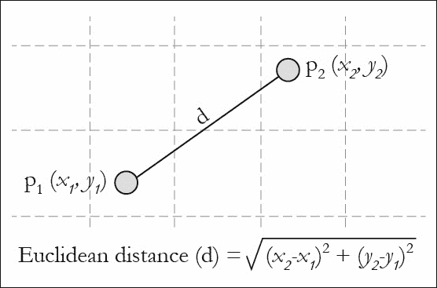

给定一组数据点（*x1*，*x2*，...，*xn*），具有与变量数量相同的维度，k-means 聚类旨在将 n 个观察结果分成 k（小于*n*）个集合，其中*S = {S1，S2，...，Sk}*，以最小化**簇内平方和**（**WCSS**）。换句话说，它的目标是找到：

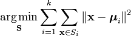

Spark 需要将以下参数传递给此算法：

+   `k`：这是所需簇的数量。

+   `maxIterations`：这是运行的最大迭代次数。

+   `initializationMode`：这指定随机初始化或通过 k-means||初始化。

+   `runs`：这是运行 k-means 算法的次数（k-means 不能保证找到全局最优解，当在给定数据集上运行多次时，算法返回最佳的聚类结果）。

+   `initializationSteps`：这确定 k-means||算法中的步数。

+   `epsilon`：这确定我们认为 k-means 已经收敛的距离阈值。

+   `initialModel`：这是用于初始化的一组可选的聚类中心。如果提供了此参数，将只执行一次运行。

### k-means 的缺点

+   它只适用于数值特征

+   在实施算法之前需要进行缩放

+   它容易受到局部最优解的影响（解决方法是 k-means++）

### 示例

让我们在相同的学生数据上运行 k-means 聚类。

```scala
scala> import org.apache.spark.ml.clustering.{KMeans, KMeansModel}
import org.apache.spark.ml.clustering.{KMeans, KMeansModel}
scala> import org.apache.spark.ml.linalg.Vectors
import org.apache.spark.ml.linalg.Vectors
scala>

//Define pipeline for kmeans. Reuse the previous stages in ENSEMBLES
scala> val km = new KMeans()
km: org.apache.spark.ml.clustering.KMeans = kmeans_b34da02bd7c8
scala> val kmeans_pipeline = new
Pipeline().setStages(Array(marks_bkt,att_idx,label_idx,va,km,lc))
kmeans_pipeline: org.apache.spark.ml.Pipeline = pipeline_0cd64aa93a88

//Train and transform
scala> val kmeansDF = kmeans_pipeline.fit(source_ds).transform(source_ds)
kmeansDF: org.apache.spark.sql.DataFrame = [StudentId: int, Avg_Marks: double ... 8 more fields]

//Examine results
scala> kmeansDF.filter("Label != prediction").count()
res17: Long = 13

```

**Python**：

```scala
>>> from pyspark.ml.clustering import KMeans, KMeansModel
>>> from pyspark.ml.linalg import Vectors
>>> 

//Define pipeline for kmeans. Reuse the previous stages in ENSEMBLES
>>> km = KMeans()
>>> kmeans_pipeline = Pipeline(stages = [marks_bkt, att_idx, label_idx,va,km,lc])

//Train and transform
>>> kmeansDF = kmeans_pipeline.fit(source_df).transform(source_df)
>>> kmeansDF.columns
['StudentId', 'Avg_Marks', 'Attendance', 'Result', 'Mark_bins', 'Att_idx', 'Label', 'features', 'prediction', 'predictedLabel']
>>> kmeansDF.filter("Label != prediction").count()
4
```

# 总结

在本章中，我们解释了各种机器学习算法，以及它们在 MLlib 库中的实现方式，以及如何在管道 API 中使用它们进行流畅的执行。这些概念通过 Python 和 Scala 代码示例进行了解释，以供参考。

在下一章中，我们将讨论 Spark 如何支持 R 编程语言，重点关注一些算法及其执行，类似于我们在本章中涵盖的内容。

# 参考资料

MLlib 中支持的算法：

+   [`spark.apache.org/docs/latest/mllib-guide.html`](http://spark.apache.org/docs/latest/mllib-guide.html)

+   [`spark.apache.org/docs/latest/mllib-decision-tree.html`](http://spark.apache.org/docs/latest/mllib-decision-tree.html)

Spark ML 编程指南：

+   [`spark.apache.org/docs/latest/ml-guide.html`](http://spark.apache.org/docs/latest/ml-guide.html)

2015 年 6 月峰会幻灯片中的高级数据科学在 spark.pdf 中：

+   [`databricks.com/blog/2015/07/29/new-features-in-machine-learning-pipelines-in-spark-1-4.html`](https://databricks.com/blog/2015/07/29/new-features-in-machine-learning-pipelines-in-spark-1-4.html)

+   [`databricks.com/blog/2015/06/02/statistical-and-mathematical-functions-with-dataframes-in-spark.html`](https://databricks.com/blog/2015/06/02/statistical-and-mathematical-functions-with-dataframes-in-spark.html)

+   [`databricks.com/blog/2015/01/07/ml-pipelines-a-new-high-level-api-for-mllib.html`](https://databricks.com/blog/2015/01/07/ml-pipelines-a-new-high-level-api-for-mllib.html)
