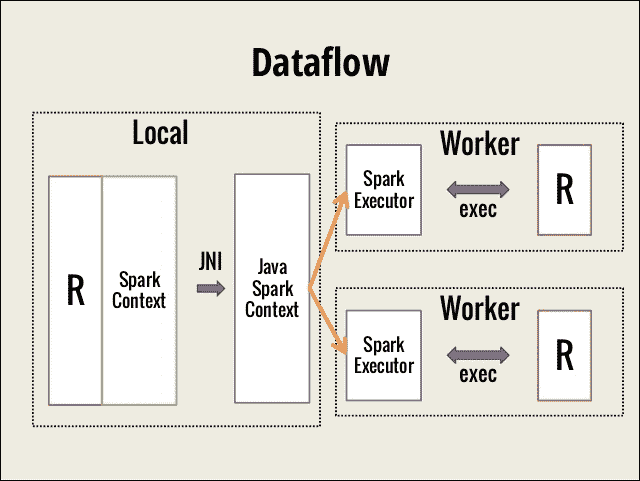

# 第七章：使用 SparkR 扩展 Spark

统计学家和数据科学家一直在几乎所有领域使用 R 解决具有挑战性的问题，从生物信息学到选举活动。他们喜欢 R 是因为它具有强大的可视化能力、强大的社区以及丰富的统计和机器学习包生态系统。世界各地的许多学术机构使用 R 语言教授数据科学和统计学。

R 最初是在 1990 年代中期由统计学家创建的，目标是提供更好、更用户友好的数据分析方式。R 最初用于学术和研究。随着企业越来越意识到数据科学在业务增长中的作用，企业部门使用 R 的数据分析师数量也在增长。在存在了 20 年后，R 语言用户基数被认为超过 200 万。

所有这一切成功背后的推动因素之一是，R 旨在使分析师的生活更轻松，而不是计算机的生活。R 本质上是单线程的，它只能处理完全适合单台计算机内存的数据集。但如今，R 用户正在处理越来越大的数据集。现代分布式处理能力与成熟的 R 语言的无缝集成，使数据科学家能够充分利用两者的优势。他们可以满足不断增长的业务需求，并继续从他们喜爱的 R 语言的灵活性中受益。

本章介绍了 SparkR，这是一个面向 R 程序员的 R API，使他们可以利用 Spark 的强大功能，而无需学习一种新语言。由于已经假定具有 R、R Studio 和数据分析技能的先验知识，因此本章不试图介绍 R。提供了 Spark 计算引擎的非常简要的概述作为快速回顾。读者应该阅读本书的前三章，以更深入地了解 Spark 编程模型和 DataFrames。这些知识非常重要，因为开发人员必须了解他的代码的哪一部分在本地 R 环境中执行，哪一部分由 Spark 计算引擎处理。本章涵盖的主题如下：

+   SparkR 基础知识

+   R 与 Spark 的优势及其局限性

+   使用 SparkR 进行编程

+   SparkR DataFrames

+   机器学习

# SparkR 基础知识

R 是一种用于统计计算和图形的语言和环境。SparkR 是一个 R 包，提供了一个轻量级的前端，以便从 R 中访问 Apache Spark。SparkR 的目标是结合 R 环境提供的灵活性和易用性，以及 Spark 计算引擎提供的可伸缩性和容错性。在讨论 SparkR 如何实现其目标之前，让我们回顾一下 Spark 的架构。

Apache Spark 是一个快速、通用、容错的框架，用于大规模分布式数据集的交互式和迭代计算。它支持各种数据源和存储层。它提供统一的数据访问，可以结合不同的数据格式、流数据，并使用高级、可组合的操作定义复杂的操作。您可以使用 Scala、Python 或 R shell（或没有 shell 的 Java）交互式地开发应用程序。您可以将其部署在家用台式机上，也可以在成千上万个节点的大型集群上运行，处理 PB 级数据。

### 注意

SparkR 起源于 AMPLab（[`amplab.cs.berkeley.edu/`](https://amplab.cs.berkeley.edu/)），旨在探索将 R 的易用性与 Spark 的可伸缩性相结合的不同技术。它作为 Apache Spark 1.4 中的一个 alpha 组件发布，该版本于 2015 年 6 月发布。Spark 1.5 版本改进了 R 的可用性，并引入了带有**广义线性模型**（**GLMs**）的 MLlib 机器学习包。2016 年 1 月发布的 Spark 1.6 版本增加了一些功能，例如模型摘要和特征交互。2016 年 7 月发布的 Spark 2.0 版本带来了一些重要功能，例如 UDF，改进的模型覆盖范围，DataFrames 窗口函数 API 等。

## 从 R 环境访问 SparkR

您可以从 R shell 或 R Studio 启动 SparkR。SparkR 的入口点是 SparkSession 对象，它表示与 Spark 集群的连接。运行 R 的节点成为驱动程序。由 R 程序创建的任何对象都驻留在此驱动程序上。通过 SparkSession 创建的任何对象都将创建在集群中的工作节点上。以下图表描述了 R 与运行在集群上的 Spark 的运行时视图。请注意，R 解释器存在于集群中的每个工作节点上。以下图表不显示集群管理器，也不显示存储层。您可以使用任何集群管理器（例如 Yarn 或 Mesos）和任何存储选项，例如 HDFS、Cassandra 或 Amazon S3：



来源：http://www.slideshare.net/Hadoop_Summit/w-145p210-avenkataraman。

通过传递应用程序名称、内存、核心数和要连接的集群管理器等信息来创建 SparkSession 对象。与 Spark 引擎的任何交互都是通过此 SparkSession 对象启动的。如果使用 SparkR shell，则已为您创建了 SparkSession 对象。否则，您必须显式创建它。此对象替换了 Spark 1.x 版本中存在的 SparkContext 和 SQLContext 对象。这些对象仍然存在以确保向后兼容性。即使前面的图表显示了 SparkContext，您也应该将其视为 Spark 2.0 之后的 SparkSession。

现在我们已经了解了如何从 R 环境访问 Spark，让我们来看看 Spark 引擎提供的核心数据抽象。

## RDD 和 DataFrames

在 Spark 引擎的核心是其主要数据抽象，称为**弹性分布式数据集**（**RDD**）。RDD 由一个或多个数据源组成，并由用户定义为对一个或多个稳定（具体）数据源的一系列转换（也称为血统）。每个 RDD 或 RDD 分区都知道如何使用血统图在失败时重新创建自己，从而提供容错性。RDD 是不可变的数据结构，这意味着它可以在线程之间共享而无需同步开销，因此适合并行化。RDD 上的操作要么是转换，要么是动作。转换是血统中的单个步骤。换句话说，它们是创建 RDD 的操作，因为每个转换都是从稳定数据源获取数据或转换不可变 RDD 并创建另一个 RDD。转换只是声明；直到对该 RDD 应用*动作*操作之前，它们才会被评估。动作是利用 RDD 的操作。

Spark 根据手头的动作优化 RDD 计算。例如，如果动作是读取第一行，只计算一个分区，跳过其余部分。它会自动执行内存计算，并在内存不足时将其溢出到磁盘，并在所有核心上分布处理。如果在程序逻辑中频繁访问 RDD，则可以对其进行缓存，从而避免重新计算开销。

R 语言提供了一个称为*DataFrame*的二维数据结构，使数据操作变得方便。Apache Spark 带有自己的 DataFrames，受到了 R 和 Python（通过 Pandas）中的 DataFrame 的启发。Spark DataFrame 是一种专门的数据结构，建立在 RDD 数据结构抽象之上。它提供了分布式 DataFrame 实现，从开发者的角度看，它看起来非常类似于 R DataFrame，同时可以支持非常大的数据集。Spark 数据集 API 为 DataFrame 添加了结构，这种结构在底层提供了更多的优化信息。

## 入门

现在我们已经了解了底层数据结构和运行时视图，是时候运行一些命令了。在本节中，我们假设您已经成功安装了 R 和 Spark，并将其添加到了路径中。我们还假设`SPARK_HOME`环境变量已设置。让我们看看如何从 R shell 或 R Studio 访问 SparkR：

```scala
> R  // Start R shell  
> Sys.getenv("SPARK_HOME") //Confirm SPARK_HOME is set 
  <Your SPARK_HOME path> 
> library(SparkR, lib.loc = 
    c(file.path(Sys.getenv("SPARK_HOME"), "R", "lib"))) 

Attaching package: 'SparkR' 
The following objects are masked from 'package:stats': 

    cov, filter, lag, na.omit, predict, sd, var, window 

The following objects are masked from 'package:base': 

    as.data.frame, colnames, colnames<-, drop, endsWith, intersect, 
    rank, rbind, sample, startsWith, subset, summary, transform, union 
> 

> //Try help(package=SparkR) if you want to more information 
//initialize SparkSession object 
>  sparkR.session()  
Java ref type org.apache.spark.sql.SparkSession id 1  
> 
Alternatively, you may launch sparkR shell which comes with predefined SparkSession. 

> bin/sparkR  // Start SparkR shell  
>      // For simplicity sake, no Log messages are shown here 
> //Try help(package=SparkR) if you want to more information 
> 

```

这就是您从 R 环境中访问 Spark DataFrames 的全部内容。

# 优势和限制

R 语言长期以来一直是数据科学家的通用语言。它简单易懂的 DataFrame 抽象、表达丰富的 API 和充满活力的包生态系统正是分析师所需要的。主要挑战在于可扩展性。SparkR 通过提供分布式内存中的 DataFrame 来弥合这一差距，而不会离开 R 生态系统。这种共生关系使用户能够获得以下好处：

+   分析师无需学习新语言

+   SparkR 的 API 与 R 的 API 类似

+   您可以从 R Studio 访问 SparkR，还可以使用自动完成功能

+   大规模数据集的交互式探索性分析不再受内存限制或长时间的等待时间的限制

+   从不同类型的数据源访问数据变得更加容易。大多数以前必须是命令式的任务现在已经变成了声明式的。查看[第四章](http://Chapter%204)，*统一数据访问*，了解更多信息

+   您可以自由混合 dplyr、Spark 函数、SQL 和仍未在 Spark 中可用的 R 库

尽管结合两者最好的优势令人兴奋，但这种组合仍然存在一些限制。这些限制可能不会影响每种用例，但我们无论如何都需要意识到它们：

+   R 的固有动态特性限制了可用于催化剂优化器的信息。与静态类型语言（如 Scala）相比，我们可能无法充分利用优化，例如谓词推回。

+   SparkR 不支持所有已经在其他 API（如 Scala API）中可用的机器学习算法。

总之，在数据预处理方面使用 Spark，而在分析和可视化方面使用 R 似乎是未来最好的方法。

# 使用 SparkR 进行编程

到目前为止，我们已经了解了 SparkR 的运行时模型和提供容错性和可扩展性的基本数据抽象。我们已经了解了如何从 R shell 或 R Studio 访问 Spark API。现在是时候尝试一些基本和熟悉的操作了：

```scala
> 
> //Open the shell 
> 
> //Try help(package=SparkR) if you want to more information 
> 
> df <- createDataFrame(iris) //Create a Spark DataFrame 
> df    //Check the type. Notice the column renaming using underscore 
SparkDataFrame[Sepal_Length:double, Sepal_Width:double, Petal_Length:double, Petal_Width:double, Species:string] 
> 
> showDF(df,4) //Print the contents of the Spark DataFrame 
+------------+-----------+------------+-----------+-------+ 
|Sepal_Length|Sepal_Width|Petal_Length|Petal_Width|Species| 
+------------+-----------+------------+-----------+-------+ 
|         5.1|        3.5|         1.4|        0.2| setosa| 
|         4.9|        3.0|         1.4|        0.2| setosa| 
|         4.7|        3.2|         1.3|        0.2| setosa| 
|         4.6|        3.1|         1.5|        0.2| setosa| 
+------------+-----------+------------+-----------+-------+ 
>  
> head(df,2)  //Returns an R data.frame. Default 6 rows 
  Sepal_Length Sepal_Width Petal_Length Petal_Width Species 
1          5.1         3.5          1.4         0.2  setosa 
2          4.9         3.0          1.4         0.2  setosa 
> //You can use take(df,2) to get the same results 
//Check the dimensions 
> nrow(df) [1] 150 > ncol(df) [1] 5 

```

操作看起来与 R DataFrame 函数非常相似，因为 Spark DataFrames 是基于 R DataFrames 和 Python（Pandas）DataFrames 建模的。但是，如果不小心，这种相似性可能会引起混淆。您可能会在 R 的`data.frame`上运行计算密集型函数，以为负载会被分布，从而意外地使本地机器崩溃。例如，intersect 函数在两个包中具有相同的签名。您需要注意对象是`SparkDataFrame`（Spark DataFrame）还是`data.frame`（R DataFrame）。您还需要尽量减少本地 R `data.frame`对象和 Spark DataFrame 对象之间的来回转换。让我们通过尝试一些示例来感受这种区别：

```scala
> 
> //Open the SparkR shell 
> df <- createDataFrame(iris) //Create a Spark DataFrame 
> class(df) [1] "SparkDataFrame" attr(,"package") [1] "SparkR" 
> df2 <- head(df,2) //Create an R data frame 
> class(df2) 
 [1] "data.frame" 
> //Now try running some R command on both data frames 
> unique(df2$Species)   //Works fine as expected [1] "setosa" > unique(df$Species)    //Should fail Error in unique.default(df$Species) : unique() applies only to vectors > class(df$Species)   //Each column is a Spark's Column class [1] "Column" attr(,"package") [1] "SparkR" > class(df2$Species) [1] "character" 

```

## 函数名称屏蔽

现在我们已经尝试了一些基本操作，让我们稍微偏离一下。我们必须了解当加载的库具有与基本包或已加载的其他包重叠的函数名称时会发生什么。有时这被称为函数名称重叠、函数屏蔽或名称冲突。您可能已经注意到在加载 SparkR 包时提到了被屏蔽的对象的消息。这对于加载到 R 环境中的任何包都很常见，不仅仅是 SparkR。如果 R 环境已经包含与要加载的包中的函数同名的函数，那么对该函数的任何后续调用都会表现出最新加载的包中函数的行为。如果您想访问以前的函数而不是`SparkR`函数，您需要显式使用其包名称作为前缀，如下所示：

```scala
//First try in R environment, without loading sparkR 
//Try sampling from a column in an R data.frame 
>sample(iris$Sepal.Length,6,FALSE) //Returns any n elements [1] 5.1 4.9 4.7 4.6 5.0 5.4 >sample(head(iris),3,FALSE) //Returns any 3 columns 
//Try sampling from an R data.frame 
//The Boolean argument is for with_replacement 
> sample(head 
> head(sample(iris,3,TRUE)) //Returns any 3 columns
  Species Species.1 Petal.Width
1  setosa    setosa         0.2 
2  setosa    setosa         0.2 
3  setosa    setosa         0.2 
4  setosa    setosa         0.2 
5  setosa    setosa         0.2 
6  setosa    setosa         0.4 

//Load sparkR, initialize sparkSession and then execute this  
> df <- createDataFrame(iris) //Create a Spark DataFrame 
> sample_df <- sample(df,TRUE,0.3) //Different signature 
> dim(sample_df)  //Different behavior [1] 44  5 
> //Returned 30% of the original data frame and all columns 
> //Try with base prefix 
> head(base::sample(iris),3,FALSE)  //Call base package's sample
  Species Petal.Width Petal.Length 
1  setosa         0.2          1.4
2  setosa         0.2          1.4 
3  setosa         0.2          1.3 
4  setosa         0.2          1.5 
5  setosa         0.2          1.4 
6  setosa         0.4          1.7 

```

## 子集数据

R DataFrame 上的子集操作非常灵活，SparkR 试图保留这些操作或类似的等价操作。我们已经在前面的示例中看到了一些操作，但本节以有序的方式呈现它们：

```scala
//Subsetting data examples 
> b1 <- createDataFrame(beaver1) 
//Get one column 
> b1$temp 
Column temp    //Column class and not a vector 
> //Select some columns. You may use positions too 
> select(b1, c("day","temp")) 
SparkDataFrame[day:double, temp:double] 
>//Row subset based on conditions 
> head(subset(b1,b1$temp>37,select= c(2,3))) 
  time  temp 
1 1730 37.07 
2 1740 37.05 
3 1940 37.01 
4 1950 37.10 
5 2000 37.09 
6 2010 37.02 
> //Multiple conditions with AND and OR 
> head(subset(b1, between(b1$temp,c(36.0,37.0)) |  
        b1$time %in% 900 & b1$activ == 1,c(2:4)),2) 
 time  temp activ 
1  840 36.33     0 
2  850 36.34     0 

```

### 提示

在撰写本书时（Apache Spark 2.0 发布），基于行索引的切片不可用。您将无法使用`df[n,]`或`df[m:n,]`语法获取特定行或行范围。

```scala
//For example, try on a normal R data.frame 
> beaver1[2:4,] 
  day time  temp activ 
2 346  850 36.34     0 
3 346  900 36.35     0 
4 346  910 36.42     0 
//Now, try on Spark Data frame 
> b1[2:4,] //Throws error 
Expressions other than filtering predicates are not supported in the first parameter of extract operator [ or subset() method. 
> 

```

## 列函数

您可能已经注意到在子集数据部分中的列函数`between`。这些函数在`Column`类上操作。正如名称所示，这些函数一次在单个列上操作，并且通常用于子集 DataFrame。除了在列内的值上工作之外，您还可以将列附加到 DataFrame 或从 DataFrame 中删除一个或多个列。负列下标可以用于省略列，类似于 R。以下示例展示了在子集操作中使用`Column`类函数，然后添加和删除列：

```scala
> //subset using Column operation using airquality dataset as df 
> head(subset(df,isNull(df$Ozone)),2) 
  Ozone Solar_R Wind Temp Month Day 
1    NA      NA 14.3   56     5   5 
2    NA     194  8.6   69     5  10 
> 
> //Add column and drop column examples 
> b1 <- createDataFrame(beaver1) 

//Add new column 
> b1$inRetreat <- otherwise(when(b1$activ == 0,"No"),"Yes") 
 head(b1,2) 
  day time  temp activ inRetreat 
1 346  840 36.33     0        No 
2 346  850 36.34     0        No 
> 
//Drop a column.  
> b1$day <- NULL 
> b1  // Example assumes b1$inRetreat does not exist 
SparkDataFrame[time:double, temp:double, activ:double] 
> //Drop columns using negative subscripts 
> b2 <- b1[,-c(1,4)]  > head(b2) 
   time  temp 
1  840 36.33 
2  850 36.34 
3  900 36.35 
4  910 36.42 
5  920 36.55 
6  930 36.69 
>  

```

## 分组数据

DataFrame 数据可以使用`group_by`函数进行分组，类似于 SQL。执行此类操作的多种方式。我们在本节中介绍了一个稍微复杂的示例。此外，我们使用了`magrittr`库提供的`%>%`，也称为前向管道运算符，它提供了一个链接命令的机制：

```scala
> //GroupedData example using iris data as df 
> //Open SparkR shell and create df using iris dataset  
> groupBy(df,"Species") 
GroupedData    //Returns GroupedData object 
> library(magrittr)  //Load the required library 
//Get group wise average sepal length 
//Report results sorted by species name 
>df2 <- df %>% groupBy("Species") %>%  
          avg("Sepal_Length") %>%  
          withColumnRenamed("avg(Sepal_Length)","avg_sepal_len") %>% 
          orderBy ("Species") 
//Format the computed double column 
df2$avg_sepal_len <- format_number(df2$avg_sepal_len,2) 
showDF(df2) 
+----------+-------------+ 
|   Species|avg_sepal_len| 
+----------+-------------+ 
|    setosa|         5.01| 
|versicolor|         5.94| 
| virginica|         6.59| 
+----------+-------------+ 

```

您可以继续使用前向管道运算符链接操作。仔细查看代码中的列重命名部分。列名参数是前面操作的输出，在此操作开始之前已经完成，因此您可以安全地假定`avg(sepal_len)`列已经存在。`format_number`按预期工作，这是另一个方便的`Column`操作。

下一节有一个类似的示例，使用`GroupedData`及其等效的`dplyr`实现。

# SparkR DataFrames

在本节中，我们尝试一些有用的常用操作。首先，我们尝试传统的 R/`dplyr`操作，然后展示使用 SparkR API 的等效操作：

```scala
> //Open the R shell and NOT SparkR shell  
> library(dplyr,warn.conflicts=FALSE)  //Load dplyr first 
//Perform a common, useful operation  
> iris %>%               
+   group_by(Species) %>% +   summarise(avg_length = mean(Sepal.Length),  
+             avg_width = mean(Sepal.Width)) %>% +   arrange(desc(avg_length)) 
Source: local data frame [3 x 3] 
     Species avg_length avg_width 
      (fctr)      (dbl)     (dbl) 
1  virginica      6.588     2.974 
2 versicolor      5.936     2.770 
3     setosa      5.006     3.428 

//Remove from R environment 
> detach("package:dplyr",unload=TRUE) 

```

此操作与 SQL 分组非常相似，并且后跟排序。它在 SparkR 中的等效实现也与`dplyr`示例非常相似。查看以下示例。注意方法名称并将其与前面的`dplyr`示例进行比较：

```scala
> //Open SparkR shell and create df using iris dataset  
> collect(arrange(summarize(groupBy(df,df$Species),  +     avg_sepal_length = avg(df$Sepal_Length), +     avg_sepal_width = avg(df$Sepal_Width)), +     "avg_sepal_length", decreasing = TRUE))  
     Species avg_sepal_length avg_sepal_width 
1     setosa            5.006           3.428 
2 versicolor            5.936           2.770 
3  virginica            6.588           2.974 

```

SparkR 旨在尽可能接近现有的 R API。因此，方法名称看起来与`dplyr`方法非常相似。例如，看看具有`groupBy`的示例，而`dplyr`具有`group_by`。SparkR 支持冗余函数名称。例如，它有`group_by`以及`groupBy`，以满足来自不同编程环境的开发人员。`dplyr`和 SparkR 中的方法名称再次非常接近 SQL 关键字`GROUP BY`。但是这些方法调用的顺序不同。示例还显示了将 Spark DataFrame 转换为 R `data.frame`的附加步骤，使用`collect`。这些方法是从内到外排列的，意思是首先对数据进行分组，然后进行汇总，然后进行排列。这是可以理解的，因为在 SparkR 中，内部方法中创建的 DataFrame 成为其直接前任的参数，依此类推。

## SQL 操作

如果您对前面示例中的语法不太满意，您可能希望尝试编写一个 SQL 字符串，如所示，它与前面的示例完全相同，但使用了传统的 SQL 语法：

```scala
> //Register the Spark DataFrame as a table/View 
> createOrReplaceTempView(df,"iris_vw")  
//Look at the table structure and some rows
> collect(sql(sqlContext, "SELECT * FROM iris_tbl LIMIT 5"))
    Sepal_Length Sepal_Width Petal_Length Petal_Width Species 
1          5.1         3.5          1.4         0.2  setosa 
2          4.9         3.0          1.4         0.2  setosa 
3          4.7         3.2          1.3         0.2  setosa 
4          4.6         3.1          1.5         0.2  setosa 
5          5.0         3.6          1.4         0.2  setosa 
> //Try out the above example using SQL syntax 
> collect(sql(sqlContext, "SELECT Species,       avg(Sepal_Length) avg_sepal_length,      avg(Sepal_Width) avg_sepal_width       FROM iris_tbl        GROUP BY Species       ORDER BY avg_sepal_length desc")) 

  Species avg_sepal_length avg_sepal_width 

1  virginica            6.588           2.974 
2 versicolor            5.936           2.770 
3     setosa            5.006           3.428 

```

如果您习惯从 RDBMS 表中获取数据，前面的示例看起来像是实现手头操作的最自然方式。但我们是如何做到这一点的呢？第一条语句告诉 Spark 注册一个临时表（或者，如其名称所示，一个视图，表的逻辑抽象）。这并不完全等同于数据库表。它是临时的，意味着在销毁 SparkSession 对象时会被销毁。您并没有将数据明确写入任何 RDBMS 数据存储（您必须使用`SaveAsTable`）。但是一旦您将 Spark DataFrame 注册为临时表，就可以自由地使用 SQL 语法对该 DataFrame 进行操作。下一条语句是一个基本的`SELECT`语句，显示列名，然后是五行，由`LIMIT`关键字指定。下一个 SQL 语句创建了一个包含 Species 列的 Spark DataFrame，后跟两个平均列，按平均萼片长度排序。然后，通过使用 collect 将此 DataFrame 作为 R `data.frame`收集。最终结果与前面的示例完全相同。您可以自由选择使用任何语法。有关更多信息和示例，请查看[第四章](http://chapter%204)中的 SQL 部分，*统一数据访问*。

## 集合操作

SparkR 中可以直接使用常见的集合操作，如`union`、`intersection`和`minus`。实际上，当加载 SparkR 时，警告消息显示`intersect`作为其中一个屏蔽函数。以下示例基于`beaver`数据集：

```scala
> //Create b1 and b2 DataFrames using beaver1 and beaver2 datasets 
> b1 <- createDataFrame(beaver1) 
> b2 <- createDataFrame(beaver2) 
//Get individual and total counts 
> > c(nrow(b1), nrow(b2), nrow(b1) + nrow(b2)) 
[1] 114 100 214 
//Try adding both data frames using union operation 
> nrow(unionAll(b1,b2)) 
[1] 214     //Sum of two datsets 
> //intersect example 
//Remove the first column (day) and find intersection 
showDF(intersect(b1[,-c(1)],b2[,-c(1)])) 

+------+-----+-----+ 
|  time| temp|activ| 
+------+-----+-----+ 
|1100.0|36.89|  0.0| 
+------+-----+-----+ 
> //except (minus or A-B) is covered in machine learning examples   

```

## 合并 DataFrame

下一个示例说明了使用`merge`命令连接两个 DataFrame。示例的第一部分显示了 R 的实现，下一部分显示了 SparkR 的实现：

```scala
> //Example illustrating data frames merging using R (Not SparkR) 
> //Create two data frames with a matching column 
//Products df with two rows and two columns 
> products_df <- data.frame(rbind(c(101,"Product 1"), 
                    c(102,"Product 2"))) 
> names(products_df) <- c("Prod_Id","Product") 
> products_df 
 Prod_Id   Product 
1     101 Product 1 
2     102 Product 2 

//Sales df with sales for each product and month 24x3 
> sales_df <- data.frame(cbind(rep(101:102,each=12), month.abb, 
                    sample(1:10,24,replace=T)*10)) 
> names(sales_df) <- c("Prod_Id","Month","Sales") 

//Look at first 2 and last 2 rows in the sales_df 
> sales_df[c(1,2,23,24),] 
   Prod_Id Month Sales 
1      101   Jan    60 
2      101   Feb    40 
23     102   Nov    20 
24     102   Dec   100 

> //merge the data frames and examine the data 
> total_df <- merge(products_df,sales_df) 
//Look at the column names 
> colnames(total_df) 
> [1] "Prod_Id" "Product" "Month"   "Sales" 

//Look at first 2 and last 2 rows in the total_df 
> total_df[c(1,2,23,24),]     
   Prod_Id   Product Month Sales 
1      101 Product 1   Jan    10 
2      101 Product 1   Feb    20 
23     102 Product 2   Nov    60 
24     102 Product 2   Dec    10 

```

上述代码完全依赖于 R 的基本包。为简单起见，我们在两个 DataFrame 中使用了相同的连接列名称。下一段代码演示了使用 SparkR 的相同示例。它看起来与前面的代码类似，因此请仔细查看其中的区别：

```scala
> //Example illustrating data frames merging using SparkR 
> //Create an R data frame first and then pass it on to Spark 
> //Watch out the base prefix for masked rbind function 
> products_df <- createDataFrame(data.frame( 
    base::rbind(c(101,"Product 1"), 
    c(102,"Product 2")))) 
> names(products_df) <- c("Prod_Id","Product") 
>showDF(products_df) 
+-------+---------+ 
|Prod_Id|  Product| 
+-------+---------+ 
|    101|Product 1| 
|    102|Product 2| 
+-------+---------+ 
> //Create Sales data frame 
> //Notice the as.data.frame similar to other R functions 
> //No cbind in SparkR so no need for base:: prefix 
> sales_df <- as.DataFrame(data.frame(cbind( 
             "Prod_Id" = rep(101:102,each=12), 
"Month" = month.abb, 
"Sales" = base::sample(1:10,24,replace=T)*10))) 
> //Check sales dataframe dimensions and some random rows  
> dim(sales_df) 
[1] 24  3 
> collect(sample(sales_df,FALSE,0.20)) 
  Prod_Id Month Sales 
1     101   Sep    50 
2     101   Nov    80 
3     102   Jan    90 
4     102   Jul   100 
5     102   Nov    20 
6     102   Dec    50 
> //Merge the data frames. The following merge is from SparkR library 
> total_df <- merge(products_df,sales_df) 
// You may try join function for the same purpose 
//Look at the columns in total_df 
> total_df 
SparkDataFrame[Prod_Id_x:string, Product:string, Prod_Id_y:string, Month:string, Sales:string] 
//Drop duplicate column 
> total_df$Prod_Id_y <- NULL    
> head(total_df) 
  Prod_Id_x   Product Month Sales 
1       101 Product 1   Jan    40 
2       101 Product 1   Feb    10 
3       101 Product 1   Mar    90 
4       101 Product 1   Apr    10 
5       101 Product 1   May    50 
6       101 Product 1   Jun    70 
> //Note: As of Spark 2.0 version, SparkR does not support 
    row sub-setting  

```

您可能想尝试不同类型的连接，例如左外连接和右外连接，或不同的列名，以更好地理解此函数。

# 机器学习

SparkR 提供了现有 MLLib 函数的包装器。R 公式被实现为 MLLib 特征转换器。转换器是一个 ML 管道（`spark.ml`）阶段，它以 DataFrame 作为输入并产生另一个 DataFrame 作为输出，通常包含一些附加列。特征转换器是一种将输入列转换为特征向量的转换器，这些特征向量被附加到源 DataFrame。例如，在线性回归中，字符串输入列被独热编码，数值被转换为双精度数。标签列将被附加（如果数据框中没有的话）作为响应变量的副本。

在这一部分，我们涵盖了朴素贝叶斯和高斯 GLM 模型的示例代码。我们不解释模型本身或它们产生的摘要。相反，我们直接讨论如何使用 SparkR 来完成这些操作。

## 朴素贝叶斯模型

朴素贝叶斯模型是一个直观简单的模型，适用于分类数据。我们将使用朴素贝叶斯模型训练一个样本数据集。我们不会解释模型的工作原理，而是直接使用 SparkR 来训练模型。如果您想要更多信息，请参考第六章 *机器学习*。

这个例子使用了一个包含二十名学生的平均分数和出勤情况的数据集。实际上，这个数据集已经在[第六章](http://Chapter%206) *机器学习*中被引入，用于训练集成。然而，让我们重新审视一下它的内容。

学生根据一组明确定义的规则被授予`及格`或`不及格`。两名 ID 为`1009`和`1020`的学生被授予`及格`，即使在其他情况下他们本来会不及格。尽管我们没有向模型提供实际规则，但我们期望模型预测这两名学生的结果为`不及格`。以下是`及格`/`不及格`的标准：

+   分数 < 40 => 不及格

+   出勤不足 => 不及格

+   分数超过 40 且出勤全 => 及格

+   分数 > 60 且至少出勤足够 => 及格以下是训练朴素贝叶斯模型的示例：

```scala
//Example to train Naïve Bayes model 

//Read file 
> myFile <- read.csv("../work/StudentsPassFail.csv") //R data.frame 
> df <- createDataFrame(myFile) //sparkDataFrame 
//Look at the data 
> showDF(df,4) 
+---------+---------+----------+------+ 
|StudentId|Avg_Marks|Attendance|Result| 
+---------+---------+----------+------+ 
|     1001|     48.0|      Full|  Pass| 
|     1002|     21.0|    Enough|  Fail| 
|     1003|     24.0|    Enough|  Fail| 
|     1004|      4.0|      Poor|  Fail| 
+---------+---------+----------+------+ 

//Make three buckets out of Avg_marks 
// A >60; 40 < B < 60; C > 60 
> df$marks_bkt <- otherwise(when(df$Avg_marks < 40, "C"), 
                           when(df$Avg_marks > 60, "A")) 
> df$marks_bkt <- otherwise(when(df$Avg_marks < 40, "C"), 
                           when(df$Avg_marks > 60, "A")) 
> df <- fillna(df,"B",cols="marks_bkt") 
//Split train and test 
> trainDF <- sample(df,TRUE,0.7) 
> testDF <- except(df, trainDF) 

//Build model by supplying RFormula, training data 
> model <- spark.naiveBayes(Result ~ Attendance + marks_bkt, data = trainDF) 
> summary(model) 
$apriori 
          Fail      Pass 
[1,] 0.6956522 0.3043478 

$tables 
     Attendance_Poor Attendance_Full marks_bkt_C marks_bkt_B 
Fail 0.5882353       0.1764706       0.5882353   0.2941176   
Pass 0.125           0.875           0.125       0.625       

//Run predictions on test data 
> predictions <- predict(model, newData= testDF) 
//Examine results 
> showDF(predictions[predictions$Result != predictions$prediction, 
     c("StudentId","Attendance","Avg_Marks","marks_bkt", "Result","prediction")]) 
+---------+----------+---------+---------+------+----------+                     
|StudentId|Attendance|Avg_Marks|marks_bkt|Result|prediction| 
+---------+----------+---------+---------+------+----------+ 
|     1010|      Full|     19.0|        C|  Fail|      Pass| 
|     1019|    Enough|     45.0|        B|  Fail|      Pass| 
|     1014|      Full|     12.0|        C|  Fail|      Pass| 
+---------+----------+---------+---------+------+----------+ 
//Note that the predictions are not exactly what we anticipate but models are usually not 100% accurate 

```

## 高斯 GLM 模型

在这个例子中，我们尝试根据臭氧、太阳辐射和风的值来预测温度：

```scala
> //Example illustrating Gaussian GLM model using SparkR 
> a <- createDataFrame(airquality) 
//Remove rows with missing values 
> b <- na.omit(a) 
> //Inspect the dropped rows with missing values 
> head(except(a,b),2)    //MINUS set operation 
  Ozone Solar_R Wind Temp Month Day 
1    NA     186  9.2   84     6   4 
2    NA     291 14.9   91     7  14 

> //Prepare train data and test data 
traindata <- sample(b,FALSE,0.8) //Not base::sample 
testdata <- except(b,traindata) 

> //Build model 
> model <- glm(Temp ~ Ozone + Solar_R + Wind,  
          data = traindata, family = "gaussian") 
> // Get predictions 
> predictions <- predict(model, newData = testdata) 
> head(predictions[,c(predictions$Temp, predictions$prediction)], 
                 5) 
  Temp prediction 
1   90   81.84338 
2   79   80.99255 
3   88   85.25601 
4   87   76.99957 
5   76   71.75683 

```

# 总结

到目前为止，SparkR 不支持 Spark 中所有可用的算法，但正在积极开发以弥合差距。Spark 2.0 版本已经改进了算法覆盖范围，包括朴素贝叶斯、k 均值聚类和生存回归。查看最新的支持算法文档。在将来，我们将继续努力推出 SparkR 的 CRAN 版本，更好地与 R 包和 Spark 包集成，并提供更好的 RFormula 支持。

# 参考资料

+   *SparkR: 过去、现在和未来* 作者 *Shivaram Venkataraman: *[`shivaram.org/talks/sparkr-summit-2015.pdf`](http://shivaram.org/talks/sparkr-summit-2015.pdf)

+   *通过 Spark 和 R 实现探索性数据科学* 作者 *Shivaram Venkataraman* 和 *Hossein Falaki:*[`www.slideshare.net/databricks/enabling-exploratory-data-science-with-spark-and-r`](http://www.slideshare.net/databricks/enabling-exploratory-data-science-with-spark-and-r)

+   *SparkR: 用 Spark 扩展 R 程序* 作者 *Shivaram Venkataraman* 和其他人: [`shivaram.org/publications/sparkr-sigmod.pdf`](http://shivaram.org/publications/sparkr-sigmod.pdf)

+   *SparkR 的最新发展* 作者 *Xiangrui Meng*: [`files.meetup.com/4439192/Recent%20Development%20in%20SparkR%20for%20Advanced%20Analytics.pdf`](http://files.meetup.com/4439192/Recent%20Development%20in%20SparkR%20for%20Advanced%20Analytics.pdf)

+   要了解 RFormula，请尝试以下链接：

+   [`stat.ethz.ch/R-manual/R-devel/library/stats/html/formula.html`](https://stat.ethz.ch/R-manual/R-devel/library/stats/html/formula.html)

+   [`spark.apache.org/docs/latest/ml-features.html#rformula`](http://spark.apache.org/docs/latest/ml-features.html#rformula)
