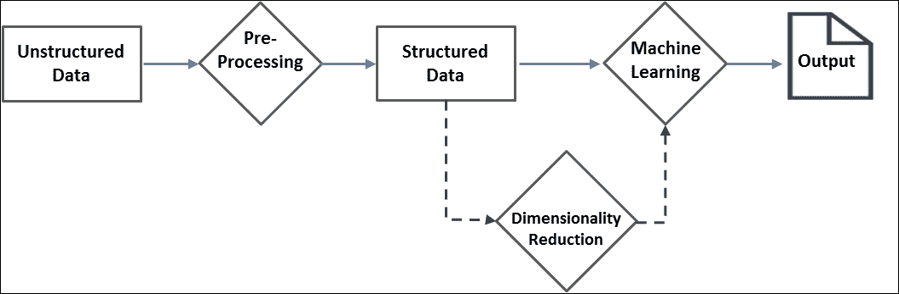

# 第八章：分析非结构化数据

在这个大数据时代，非结构化数据的激增是令人震惊的。存在许多方法，如数据挖掘、自然语言处理（NLP）、信息检索等，用于分析非结构化数据。由于各种业务中非结构化数据的快速增长，可扩展的解决方案已成为当务之急。Apache Spark 配备了用于文本分析的开箱即用算法，并支持自定义开发默认情况下不可用的算法。

在上一章中，我们已经展示了 SparkR 如何利用 Spark 的 R API 来发挥其强大功能，而无需学习一种新语言。在本章中，我们将步入一个全新的维度，探索利用 Spark 从非结构化数据中提取信息的算法和技术。

作为本章的先决条件，对 Python 或 Scala 编程的基本理解以及对文本分析和机器学习的整体理解是很有帮助的。然而，我们已经涵盖了一些理论基础，并提供了一套实际示例，使其更易于理解和实施。本章涵盖的主题包括：

+   非结构化数据的来源

+   处理非结构化数据

+   计数向量化器

+   TF-IDF

+   停用词去除

+   归一化/缩放

+   Word2Vec

+   n-gram 建模

+   文本分类

+   朴素贝叶斯分类器

+   文本聚类

+   K 均值

+   降维

+   奇异值分解

+   主成分分析

+   总结

# 非结构化数据的来源

自上世纪八九十年代的电子表格和商业智能工具以来，数据分析已经取得了长足的进步。计算能力的巨大提升、复杂算法和开源文化的推动，促成了数据分析以及其他领域的前所未有的增长。这些技术的进步为新的机遇和新的挑战铺平了道路。企业开始着眼于从以往难以处理的数据源中生成见解，如内部备忘录、电子邮件、客户满意度调查等。数据分析现在包括这种非结构化的、通常是基于文本的数据，以及传统的行和列数据。在关系型数据库管理系统表中存储的高度结构化数据和完全非结构化的纯文本之间，我们有 NoSQL 数据存储、XML 或 JSON 文档以及图形或网络数据源等半结构化数据源。根据目前的估计，非结构化数据约占企业数据的 80%，并且正在迅速增长。卫星图像、大气数据、社交网络、博客和其他网页、患者记录和医生笔记、公司内部通信等等 - 所有这些组合只是非结构化数据源的一个子集。

我们已经看到了成功利用非结构化数据和结构化数据的数据产品。一些公司利用社交网络的力量为他们的客户提供可操作的见解。新兴领域，如情感分析和多媒体分析，正在从非结构化数据中获取见解。然而，分析非结构化数据仍然是一项艰巨的任务。例如，当代文本分析工具和技术无法识别讽刺。然而，潜在的好处无疑超过了局限性。

# 处理非结构化数据

非结构化数据不适用于大多数编程任务。它必须以各种不同的方式进行处理，以便作为任何机器学习算法的输入或进行可视化分析。广义上，非结构化数据分析可以被视为以下图表所示的一系列步骤：



数据预处理是任何非结构化数据分析中最关键的步骤。幸运的是，随着时间的积累，已经积累了几种被证明有效的技术，这些技术非常有用。Spark 通过`ml.features`包提供了大部分这些技术。大多数技术旨在将文本数据转换为简洁的数字向量，这些向量可以轻松地被机器学习算法消化。开发人员应该了解其组织的具体要求，以确定最佳的预处理工作流程。请记住，更好、相关的数据是产生更好洞察的关键。

让我们探讨一些处理原始文本并将其转换为数据框的示例。第一个示例将一些文本作为输入并提取所有类似日期的字符串，而第二个示例从 twitter 文本中提取标签。第一个示例只是一个热身，使用简单的正则表达式分词器特征转换器，而不使用任何特定于 spark 的库。它还引起了您对可能的误解的注意。例如，形式为 1-11-1111 的产品代码可能被解释为日期。第二个示例说明了一个非平凡的、多步骤的提取过程，最终只得到了所需的标签。**用户定义的函数**（**udf**）和 ML 管道在开发这种多步骤的提取过程中非常有用。本节的其余部分描述了 apache Spark 中提供的一些更方便的工具。

**示例-1：** **从文本中提取类似日期的字符串**

**Scala**：

```scala
scala> import org.apache.spark.ml.feature.RegexTokenizer
import org.apache.spark.ml.feature.RegexTokenizer
scala> val date_pattern: String = "\\d{1,4}[/ -]\\d{1,4}[/ -]\\d{1,4}"
date_pattern: String = \d{1,4}[/ -]\d{1,4}[/ -]\d{1,4}
scala> val textDF  = spark.createDataFrame(Seq(
    (1, "Hello 1996-12-12 this 1-21-1111 is a 18-9-96 text "),
    (2, "string with dates in different 01/02/89 formats"))).
    toDF("LineNo","Text")
textDF: org.apache.spark.sql.DataFrame = [LineNo: int, Text: string]
scala> val date_regex = new RegexTokenizer().
        setInputCol("Text").setOutputCol("dateStr").
        setPattern(date_pattern).setGaps(false)
date_regex: org.apache.spark.ml.feature.RegexTokenizer = regexTok_acdbca6d1c4c
scala> date_regex.transform(textDF).select("dateStr").show(false)
+--------------------------------+
|dateStr                         |
+--------------------------------+
|[1996-12-12, 1-21-1111, 18-9-96]|
|[01/02/89]                      |
+--------------------------------+
```

**Python**：

```scala
// Example-1: Extract date like strings from text
>>> from pyspark.ml.feature import RegexTokenizer
>>> date_pattern = "\\d{1,4}[/ -]\\d{1,4}[/ -]\\d{1,4}"
>>> textDF  = spark.createDataFrame([
        [1, "Hello 1996-12-12 this 1-21-1111 is a 18-9-96 text "],
        [2, "string with dates in different 01/02/89 formats"]]).toDF(
        "LineNo","Text")
>>> date_regex = RegexTokenizer(inputCol="Text",outputCol="dateStr",
            gaps=False, pattern=date_pattern)
>>> date_regex.transform(textDF).select("dateStr").show(5,False)
+--------------------------------+
|dateStr                         |
+--------------------------------+
|[1996-12-12, 1-21-1111, 18-9-96]|
|[01/02/89]                      |
+--------------------------------+
```

前面的例子定义了一个正则表达式模式，用于识别日期字符串。正则表达式模式和示例文本 DataFrame 被传递给`RegexTokenizer`以提取匹配的日期字符串。`gaps=False`选项选择匹配的字符串，`False`的值将使用给定的模式作为分隔符。请注意，显然不是日期的`1-21-1111`也被选中。

下一个示例从 twitter 文本中提取标签并识别最流行的标签。您也可以使用相同的方法收集哈希（`#`）标签。

此示例使用内置函数`explode`，它将单个具有值数组的行转换为多个行，每个数组元素一个值。

**示例-2：从 twitter“文本”中提取标签**

**Scala**：

```scala
//Step1: Load text containing @ from source file
scala> val path = "<Your path>/tweets.json"
path: String = <Your path>/tweets.json
scala> val raw_df = spark.read.text(path).filter($"value".contains("@"))
raw_df: org.apache.spark.sql.Dataset[org.apache.spark.sql.Row] = [value: string]
//Step2: Split the text to words and filter out non-tag words
scala> val df1 = raw_df.select(explode(split('value, " ")).as("word")).
        filter($"word".startsWith("@"))
df1: org.apache.spark.sql.Dataset[org.apache.spark.sql.Row] = [word: string]
//Step3: compute tag-wise counts and report top 5
scala> df1.groupBy($"word").agg(count($"word")).
        orderBy($"count(word)".desc).show(5)
+------------+-----------+
+                                                     
|        word|count(word)|
+------------+-----------+
|@ApacheSpark|         15|
|    @SSKapci|          9|
|@databricks:|          4|
|     @hadoop|          4|
| @ApacheApex|          4|
+------------+-----------+
```

**Python**：

```scala
>> from pyspark.sql.functions import explode, split
//Step1: Load text containing @ from source file
>>> path ="<Your path>/tweets.json"
>>> raw_df1 = spark.read.text(path)
>>> raw_df = raw_df1.where("value like '%@%'")
>>> 
//Step2: Split the text to words and filter out non-tag words
>>> df = raw_df.select(explode(split("value"," ")))
>>> df1 = df.where("col like '@%'").toDF("word")
>>> 
//Step3: compute tag-wise counts and report top 5
>>> df1.groupBy("word").count().sort(
     "count",ascending=False).show(5)
+------------+-----+
+                                                        
|        word|count|
+------------+-----+
|@ApacheSpark|   15|
|    @SSKapci|    9|
|@databricks:|    4|
| @ApacheApex|    4|
|     @hadoop|    4|
+------------+-----+

```

## 计数向量化器

计数向量化器从文档中提取词汇（标记）并在没有字典的情况下生成`CountVectorizerModel`模型。正如其名称所示，文本文档被转换为标记和计数的向量。该模型生成文档对词汇的稀疏表示。

您可以微调行为以限制词汇量大小、最小标记计数等，使其适用于您的业务案例。

//示例 3：计数向量化器示例

**Scala**

```scala
scala> import org.apache.spark.ml.feature.{CountVectorizer, CountVectorizerModel}
import org.apache.spark.ml.feature.{CountVectorizer, CountVectorizerModel}
scala> import org.apache.spark.sql.DataFrame
import org.apache.spark.sql.DataFrame
scala> import org.apache.spark.ml.linalg.Vector
import org.apache.spark.ml.linalg.Vector
scala> val df: DataFrame = spark.createDataFrame(Seq(
  (0, Array("ant", "bat", "cat", "dog", "eel")),
  (1, Array("dog","bat", "ant", "bat", "cat"))
)).toDF("id", "words")
df: org.apache.spark.sql.DataFrame = [id: int, words: array<string>]
scala>
// Fit a CountVectorizerModel from the corpus 
// Minimum occurrences (DF) is 2 and pick 10 top words(vocabsize) only scala> val cvModel: CountVectorizerModel = new CountVectorizer().
        setInputCol("words").setOutputCol("features").
        setMinDF(2).setVocabSize(10).fit(df)
cvModel: org.apache.spark.ml.feature.CountVectorizerModel = cntVec_7e79157ba561
// Check vocabulary. Words are arranged as per frequency 
// eel is dropped because it is below minDF = 2 scala> cvModel.vocabulary
res6: Array[String] = Array(bat, dog, cat, ant)
//Apply the model on document
scala> val cvDF: DataFrame = cvModel.transform(df)
cvDF: org.apache.spark.sql.DataFrame = [id: int, words: array<string> ... 1 more field]
//Check the word count scala> cvDF.select("features").collect().foreach(row =>
println(row(0).asInstanceOf[Vector].toDense))

[1.0,1.0,1.0,1.0]
[2.0,1.0,1.0,1.0]
```

**Python**：

```scala
>>> from pyspark.ml.feature import CountVectorizer,CountVectorizerModel
>>> from pyspark.ml.linalg import Vector
>>> 
// Define source DataFrame
>>> df = spark.createDataFrame([
    [0, ["ant", "bat", "cat", "dog", "eel"]],
    [1, ["dog","bat", "ant", "bat", "cat"]]
  ]).toDF("id", "words")
>>> 
// Fit a CountVectorizerModel from the corpus
// Minimum occorrences (DF) is 2 and pick 10 top words(vocabsize) only
>>> cvModel = CountVectorizer(inputCol="words", outputCol="features",
        minDF = 2, vocabSize = 10).fit(df)
>>> 
// Check vocabulary. Words are arranged as per frequency
// eel is dropped because it is below minDF = 2
>>> cvModel.vocabulary
[u'bat', u'ant', u'cat', u'dog']
//Apply the model on document
>>> cvDF = cvModel.transform(df)
//Check the word count
>>> cvDF.show(2,False)
+---+-------------------------+-------------------------------+
|id |words                    |features                       |
+---+-------------------------+-------------------------------+
|0  |[ant, bat, cat, dog, eel]|(4,[0,1,2,3],[1.0,1.0,1.0,1.0])|
|1  |[dog, bat, ant, bat, cat]|(4,[0,1,2,3],[2.0,1.0,1.0,1.0])|
+---+-------------------------+-------------------------------+
```

**输入**：

```scala
 |id | text                  
 +---+-------------------------+-------------------------------+
 |0  | "ant", "bat", "cat", "dog", "eel"     
 |1  | "dog","bat", "ant", "bat", "cat"
```

**输出**：

```scala
id| text                               | Vector 
--|------------------------------------|-------------------- 
0 | "ant", "bat", "cat", "dog", "eel" |[1.0,1.0,1.0,1.0] 
1 | "dog","bat", "ant", "bat", "cat"   |[2.0,1.0,1.0,1.0]

```

前面的例子演示了`CountVectorizer`作为估计器的工作原理，用于提取词汇并生成`CountVectorizerModel`。请注意，特征向量的顺序对应于词汇而不是输入序列。让我们也看看如何通过预先构建字典来实现相同的效果。但是，请记住它们有自己的用例。

示例 4：使用先验词汇定义 CountVectorizerModel

**Scala**：

```scala
// Example 4: define CountVectorizerModel with a-priori vocabulary
scala> val cvm: CountVectorizerModel = new CountVectorizerModel(
        Array("ant", "bat", "cat")).
        setInputCol("words").setOutputCol("features")
cvm: org.apache.spark.ml.feature.CountVectorizerModel = cntVecModel_ecbb8e1778d5

//Apply on the same data. Feature order corresponds to a-priory vocabulary order scala> cvm.transform(df).select("features").collect().foreach(row =>
        println(row(0).asInstanceOf[Vector].toDense))
[1.0,1.0,1.0]
[1.0,2.0,1.0]
```

**Python**：

截至 Spark 2.0.0 尚不可用

## TF-IDF

**词频-逆文档频率**（**TF-IDF**）可能是文本分析中最流行的度量之一。这个度量指示了给定术语在一组文档中的重要性。它包括两个度量，**词频**（**TF**）和**逆文档频率**（**IDF**）。让我们逐一讨论它们，然后看看它们的综合效果。

TF 是一个词在文档中相对重要性的度量，通常是该词频率除以文档中的词数。假设一个文本文档包含 100 个单词，其中单词*apple*出现了八次。*apple*的 TF 将是*TF = (8 / 100) = 0.08*。因此，一个词在文档中出现的频率越高，其 TF 系数就越大。

IDF 是一个词在整个文档集合中的重要性的度量，也就是说，这个词在所有文档中出现的频率有多低。一个词的重要性与其频率成反比。Spark 提供了两种单独的方法来执行这些任务。假设我们有 600 万个文档，单词*apple*出现在其中的 6000 个文档中。那么，IDF 被计算为*IDF = Log(6,000,000 / 6,000) = 3*。如果你仔细观察这个例子，分母越小，IDF 值就越大。这意味着包含特定词的文档数量越少，它的重要性就越高。

因此，TF-IDF 得分将是*TF * IDF = 0.08 * 3 = 0.24*。请注意，它会惩罚在文档中更频繁出现且不重要的词，比如*the*、*this*、*a*等，并赋予更重要的词更大的权重。

在 Spark 中，TF 被实现为 HashingTF。它接受一系列术语（通常是分词器的输出）并产生一个固定长度的特征向量。它执行特征哈希将术语转换为固定长度的索引。然后 IDF 接受这些特征向量（HashingTF 的输出）作为输入，并根据文档集中的词频进行缩放。上一章有一个这种转换的示例。

## 停用词移除

常见的词如*is*、*was*和*the*被称为停用词。它们通常不会增加分析的价值，并且在数据准备阶段应该被删除。Spark 提供了`StopWordsRemover`转换器，它可以做到这一点。它接受一系列标记作为字符串输入的序列，比如分词器的输出，并移除所有的停用词。Spark 默认有一个停用词列表，你可以通过提供自己的停用词列表来覆盖它。你可以选择打开默认关闭的`caseSensitive`匹配。

示例 5：停用词移除

**Scala:**

```scala
scala> import org.apache.spark.ml.feature.StopWordsRemover
import org.apache.spark.ml.feature.StopWordsRemover
scala> import org.apache.spark.sql.DataFrame
import org.apache.spark.sql.DataFrame
scala> import org.apache.spark.ml.linalg.Vector
import org.apache.spark.ml.linalg.Vector
scala> val rawdataDF = spark.createDataFrame(Seq(
        (0, Array("I", "ate", "the", "cake")),
        (1, Array("John ", "had", "a", " tennis", "racquet")))).
        toDF("id","raw_text")
rawdataDF: org.apache.spark.sql.DataFrame = [id: int, raw_text: array<string>]
scala> val remover = new StopWordsRemover().setInputCol("raw_text").
                setOutputCol("processed_text")
remover: org.apache.spark.ml.feature.StopWordsRemover = stopWords_55edbac88edb
scala> remover.transform(rawdataDF).show(truncate=false)
+---+---------------------------------+-------------------------+
|id |raw_text                         |processed_text           |
+---+---------------------------------+-------------------------+
|0  |[I, ate, the, cake]              |[ate, cake]              |
|1  |[John , had, a,  tennis, racquet]|[John ,  tennis, racquet]|
+---+---------------------------------+-------------------------+
```

**Python:**

```scala
>>> from pyspark.ml.feature import StopWordsRemover
>>> RawData = sqlContext.createDataFrame([
    (0, ["I", "ate", "the", "cake"]),
    (1, ["John ", "had", "a", " tennis", "racquet"])
    ], ["id", "raw_text"])
>>> 
>>> remover = StopWordsRemover(inputCol="raw_text",
        outputCol="processed_text")
>>> remover.transform(RawData).show(truncate=False)
+---+---------------------------------+-------------------------+
|id |raw_text                         |processed_text           |
+---+---------------------------------+-------------------------+
|0  |[I, ate, the, cake]              |[ate, cake]              |
|1  |[John , had, a,  tennis, racquet]|[John ,  tennis, racquet]|
+---+---------------------------------+-------------------------+
```

假设我们有以下带有`id`和`raw_text`列的 DataFrame：

```scala
 id | raw_text 
----|---------- 
 0  | [I, ate, the, cake] 
 1  | [John, had, a, tennis, racquet] 

```

在对前面的示例应用`StopWordsRemover`，将`raw_text`作为输入列，`processed_text`作为输出列后，我们应该得到以下输出：

```scala

 id | raw_text                       | processed_text 
----|--------------------------------|-------------------- 
 0  | [I, ate, the, cake]            |  [ate, cake] 
 1  |[John, had, a, tennis, racquet] |[John, tennis, racquet] 

```

## 归一化/缩放

归一化是数据准备中常见的预处理步骤。大多数机器学习算法在所有特征处于相同尺度时效果更好。例如，如果有两个特征，其中一个的值大约是另一个的 100 倍，将它们调整到相同的尺度可以反映出两个变量之间有意义的相对活动。任何非数值的值，比如高、中、低，最好都转换为适当的数值量化作为最佳实践。然而，在这样做时需要小心，因为可能需要领域专业知识。例如，如果你为高、中、低分别分配 3、2 和 1，那么应该检查这三个单位是否相互等距。

特征归一化的常见方法包括*缩放*、*均值减法*和*特征标准化*，仅举几例。在缩放中，每个数值特征向量被重新缩放，使其值范围在*-1*到*+1*或*0*到*1*或类似的范围内。在均值减法中，你计算数值特征向量的均值，并从每个值中减去该均值。我们对相对于均值的相对偏差感兴趣，而绝对值可能并不重要。特征标准化是指将数据设置为零均值和单位（1）方差。

Spark 提供了`Normalizer`特征转换器，将每个向量归一化为单位范数；`StandardScaler`将单位范数和零均值；`MinMaxScaler`将每个特征重新缩放到特定范围的值。默认情况下，最小值和最大值为 0 和 1，但您可以根据数据要求自行设置值参数。

## Word2Vec

Word2Vec 是一种 PCA（您很快会了解更多）的类型，它接受一系列单词并生成一个映射（字符串，向量）。字符串是单词，向量是一个独特的固定大小的向量。生成的单词向量表示在许多机器学习和自然语言处理应用中非常有用，比如命名实体识别和标记。让我们看一个例子。

**示例 6：Word2Vec**

**Scala**

```scala
scala> import org.apache.spark.ml.feature.Word2Vec
import org.apache.spark.ml.feature.Word2Vec

//Step1: Load text file and split to words scala> val path = "<Your path>/RobertFrost.txt"
path: String = <Your path>/RobertFrost.txt
scala> val raw_text = spark.read.text(path).select(
        split('value, " ") as "words")
raw_text: org.apache.spark.sql.DataFrame = [words: array<string>]

//Step2: Prepare features vector of size 4 scala> val resultDF = new Word2Vec().setInputCol("words").
        setOutputCol("features").setVectorSize(4).
        setMinCount(2).fit(raw_text).transform(raw_text)
resultDF: org.apache.spark.sql.DataFrame = [words: array<string>, features: vector]

//Examine results scala> resultDF.show(5)
+--------------------+--------------------+
|               words|            features|
+--------------------+--------------------+
|[Whose, woods, th...|[-0.0209098898340...|
|[His, house, is, ...|[-0.0013444167044...|
|[He, will, not, s...|[-0.0058525378408...|
|[To, watch, his, ...|[-0.0189630933296...|
|[My, little, hors...|[-0.0084691265597...|
+--------------------+--------------------+
```

**Python:**

```scala
>>> from pyspark.ml.feature import Word2Vec
>>> from pyspark.sql.functions import explode, split
>>>

//Step1: Load text file and split to words >>> path = "<Your path>/RobertFrost.txt"
>>> raw_text = spark.read.text(path).select(
        split("value"," ")).toDF("words")

//Step2: Prepare features vector of size 4 >>> resultDF = Word2Vec(inputCol="words",outputCol="features",
                 vectorSize=4, minCount=2).fit(
                 raw_text).transform(raw_text)

//Examine results scala> resultDF.show(5)
+--------------------+--------------------+
|               words|            features|
+--------------------+--------------------+
|[Whose, woods, th...|[-0.0209098898340...|
|[His, house, is, ...|[-0.0013444167044...|
|[He, will, not, s...|[-0.0058525378408...|
|[To, watch, his, ...|[-0.0189630933296...|
|[My, little, hors...|[-0.0084691265597...|
+--------------------+--------------------+
```

## n-gram 建模

n-gram 是给定文本或语音序列中*n*个项目的连续序列。大小为*1*的 n-gram 称为*unigram*，大小为*2*的称为*bigram*，大小为*3*的称为*trigram*。或者，它们可以根据*n*的值来命名，例如 four-gram，five-gram 等。让我们看一个例子来理解这个模型可能的结果：

```scala

 input |1-gram sequence  | 2-gram sequence | 3-gram sequence 
-------|-----------------|-----------------|--------------- 
 apple | a,p,p,l,e       |  ap,pp,pl,le    |  app,ppl,ple 

```

这是一个单词到 n-gram 字母的例子。对于句子（或标记化的单词）到 n-gram 单词也是一样的。例如，句子*Kids love to eat chocolates*的 2-gram 等效于：

'Kids love', 'love to', 'to eat', 'eat chocolates'.

n-gram 建模在文本挖掘和自然语言处理中有各种应用。其中一个例子是预测每个单词在先前上下文中出现的概率（条件概率）。

在 Spark 中，`NGram`是一个特征转换器，它将字符串的输入数组（例如，分词器的输出）转换为 n-gram 的数组。默认情况下，输入数组中的空值将被忽略。它返回一个 n-gram 的数组，其中每个 n-gram 由一个用空格分隔的单词字符串表示。

**示例 7：NGram**

**Scala**

```scala
scala> import org.apache.spark.ml.feature.NGram
import org.apache.spark.ml.feature.NGram
scala> val wordDF = spark.createDataFrame(Seq(
        (0, Array("Hi", "I", "am", "a", "Scientist")),
        (1, Array("I", "am", "just", "learning", "Spark")),
        (2, Array("Coding", "in", "Scala", "is", "easy"))
        )).toDF("label", "words")

//Create an ngram model with 3 words length (default is 2) scala> val ngramModel = new NGram().setInputCol(
                "words").setOutputCol("ngrams").setN(3)
ngramModel: org.apache.spark.ml.feature.NGram = ngram_dc50209cf693

//Apply on input data frame scala> ngramModel.transform(wordDF).select("ngrams").show(false)
+--------------------------------------------------+
|ngrams                                            |
+--------------------------------------------------+
|[Hi I am, I am a, am a Scientist]                 |
|[I am just, am just learning, just learning Spark]|
|[Coding in Scala, in Scala is, Scala is easy]     |
+--------------------------------------------------+

//Apply the model on another dataframe, Word2Vec raw_text scala>ngramModel.transform(raw_text).select("ngrams").take(1).foreach(println)
[WrappedArray(Whose woods these, woods these are, these are I, are I think, I think I, think I know.)]
```

**Python:**

```scala
>>> from pyspark.ml.feature import NGram
>>> wordDF = spark.createDataFrame([
         [0, ["Hi", "I", "am", "a", "Scientist"]],
         [1, ["I", "am", "just", "learning", "Spark"]],
         [2, ["Coding", "in", "Scala", "is", "easy"]]
         ]).toDF("label", "words")

//Create an ngram model with 3 words length (default is 2) >>> ngramModel = NGram(inputCol="words", outputCol= "ngrams",n=3)
>>> 

//Apply on input data frame >>> ngramModel.transform(wordDF).select("ngrams").show(4,False)
+--------------------------------------------------+
|ngrams                                            |
+--------------------------------------------------+
|[Hi I am, I am a, am a Scientist]                 |
|[I am just, am just learning, just learning Spark]|
|[Coding in Scala, in Scala is, Scala is easy]     |
+--------------------------------------------------+

//Apply the model on another dataframe from Word2Vec example >>> ngramModel.transform(resultDF).select("ngrams").take(1)
[Row(ngrams=[u'Whose woods these', u'woods these are', u'these are I', u'are I think', u'I think I', u'think I know.'])]
```

# 文本分类

文本分类是指将主题、主题类别、流派或类似内容分配给文本块。例如，垃圾邮件过滤器将垃圾邮件或非垃圾邮件分配给电子邮件。

Apache Spark 通过 MLlib 和 ML 包支持各种分类器。SVM 分类器和朴素贝叶斯分类器是流行的分类器，前者已经在前一章中介绍过。现在让我们来看看后者。

## 朴素贝叶斯分类器

**朴素贝叶斯**（**NB**）分类器是一种多类概率分类器，是最好的分类算法之一。它假设每对特征之间有很强的独立性。它计算每个特征和给定标签的条件概率分布，然后应用贝叶斯定理来计算给定观察结果的标签的条件概率。在文档分类方面，观察结果是要分类到某个类别的文档。尽管它对数据有很强的假设，但它非常受欢迎。它可以处理少量的训练数据-无论是真实的还是离散的。它非常高效，因为它只需一次通过训练数据；一个约束是特征向量必须是非负的。默认情况下，ML 包支持多项式 NB。但是，如果需要伯努利 NB，可以将参数`modelType`设置为`Bernoulli`。

**拉普拉斯平滑**技术可以通过指定平滑参数来应用，并且在您想要为罕见的单词或新单词分配一个小的非零概率以使后验概率不会突然降为零的情况下非常有用。

Spark 还提供了一些其他超参数，如`thresholds`，以获得细粒度控制。以下是一个将 Twitter 文本分类的示例。此示例包含一些手工编码的规则，将类别分配给训练数据。如果文本包含相应的单词，则分配特定的类别。例如，如果文本包含"survey"或"poll"，则类别为"survey"。该模型是基于此训练数据进行训练的，并且在不同时间收集的不同文本样本上进行评估。

**示例 8：朴素贝叶斯**

Scala：

```scala
// Step 1: Define a udf to assign a category // One or more similar words are treated as one category (eg survey, poll)
// If input list contains any of the words in a category list, it is assigned to that category
// "General" is assigned if none of the categories matched
scala> import scala.collection.mutable.WrappedArray
import scala.collection.mutable.WrappedArray
scala> val findCategory = udf ((words: WrappedArray[String]) =>
    { var idx = 0; var category : String = ""
    val categories : List[Array[String]] =  List(
     Array("Python"), Array("Hadoop","hadoop"),
     Array("survey","poll"),
      Array("event","training", "Meetup", "summit",
          "talk", "talks", "Setting","sessions", "workshop"),
     Array("resource","Guide","newsletter", "Blog"))
    while(idx < categories.length && category.isEmpty ) {
        if (!words.intersect(categories(idx)).isEmpty) {
         category = categories(idx)(0) }  //First word in the category list
     idx += 1 }
    if (category.isEmpty) {
    category = "General"  }
    category
  })
findCategory: org.apache.spark.sql.expressions.UserDefinedFunction = UserDefinedFunction(<function1>,StringType,Some(List(ArrayType(StringType,true))))

//UDF to convert category to a numerical label scala> val idxCategory = udf ((category: String) =>
        {val catgMap = Map({"General"->1},{"event"->2},{"Hadoop"->3},
                             {"Python"->4},{"resource"->5})
         catgMap(category)})
idxCategory: org.apache.spark.sql.expressions.UserDefinedFunction =
UserDefinedFunction(<function1>,IntegerType,Some(List(StringType)))
scala> val labels = Array("General","event","Hadoop","Python","resource")
 //Step 2: Prepare train data 
//Step 2a: Extract "text" data and split to words scala> val path = "<Your path>/tweets_train.txt"
path: String = <Your path>../work/tweets_train.txt
scala> val pattern = ""text":"
pattern: String = "text":
scala> val raw_text = spark.read.text(path).filter($"value".contains(pattern)).
               select(split('value, " ") as "words")
raw_text: org.apache.spark.sql.DataFrame = [words: array<string>]
scala>

//Step 2b: Assign a category to each line scala> val train_cat_df = raw_text.withColumn("category",

findCategory(raw_text("words"))).withColumn("label",idxCategory($"category"))
train_cat_df: org.apache.spark.sql.DataFrame = [words: array<string>, category:
string ... 1 more field]

//Step 2c: Examine categories scala> train_cat_df.groupBy($"category").agg(count("category")).show()
+--------+---------------+                                                     
|category|count(category)|
+--------+---------------+
| General|            146|
|resource|              1|
|  Python|              2|
|   event|             10|
|  Hadoop|              6|
+--------+---------------+ 

//Step 3: Build pipeline scala> import org.apache.spark.ml.Pipeline
import org.apache.spark.ml.Pipeline
scala> import org.apache.spark.ml.feature.{StopWordsRemover, CountVectorizer,
                  IndexToString}
import org.apache.spark.ml.feature.{StopWordsRemover, CountVectorizer,
StringIndexer, IndexToString}
scala> import org.apache.spark.ml.classification.NaiveBayes
import org.apache.spark.ml.classification.NaiveBayes
scala>

//Step 3a: Define pipeline stages 
//Stop words should be removed first scala> val stopw = new StopWordsRemover().setInputCol("words").
                setOutputCol("processed_words")
stopw: org.apache.spark.ml.feature.StopWordsRemover = stopWords_2fb707daa92e
//Terms to term frequency converter scala> val cv = new CountVectorizer().setInputCol("processed_words").
             setOutputCol("features")
cv: org.apache.spark.ml.feature.CountVectorizer = cntVec_def4911aa0bf
//Define model scala> val model = new NaiveBayes().
                setFeaturesCol("features").
                setLabelCol("label")
model: org.apache.spark.ml.classification.NaiveBayes = nb_f2b6c423f12c
//Numerical prediction label to category converter scala> val lc = new IndexToString().setInputCol("prediction").
              setOutputCol("predictedCategory").
              setLabels(labels)
lc: org.apache.spark.ml.feature.IndexToString = idxToStr_3d71be25382c
 //Step 3b: Build pipeline with desired stages scala> val p = new Pipeline().setStages(Array(stopw,cv,model,lc))
p: org.apache.spark.ml.Pipeline = pipeline_956942e70b3f
 //Step 4: Process train data and get predictions 
//Step 4a: Execute pipeline with train data scala> val resultsDF = p.fit(train_cat_df).transform(train_cat_df)
resultsDF: org.apache.spark.sql.DataFrame = [words: array<string>, category:
string ... 7 more fields]

//Step 4b: Examine results scala> resultsDF.select("category","predictedCategory").show(3)
+--------+-----------------+
|category|predictedCategory|
+--------+-----------------+
|   event|            event|
|   event|            event|
| General|          General|
+--------+-----------------+
 //Step 4c: Look for prediction mismatches scala> resultsDF.filter("category != predictedCategory").select(
         "category","predictedCategory").show(3)
+--------+-----------------+
|category|predictedCategory|
+--------+-----------------+
| General|            event|
| General|           Hadoop|
|resource|           Hadoop|
+--------+-----------------+
 //Step 5: Evaluate model using test data 
//Step5a: Prepare test data scala> val path = "<Your path> /tweets.json"
path: String = <Your path>/tweets.json
scala> val raw_test_df =
spark.read.text(path).filter($"value".contains(pattern)).
               select(split('value, " ") as "words"

raw_test_df: org.apache.spark.sql.DataFrame = [words: array<string>]
scala> val test_cat_df = raw_test_df.withColumn("category",

findCategory(raw_test_df("words")))withColumn("label",idxCategory($"category"))
test_cat_df: org.apache.spark.sql.DataFrame = [words: array<string>, category:
string ... 1 more field]
scala> test_cat_df.groupBy($"category").agg(count("category")).show()
+--------+---------------+                                                     
|category|count(category)|
+--------+---------------+
| General|              6|
|   event|             11|
+--------+---------------+
 //Step 5b: Run predictions on test data scala> val testResultsDF = p.fit(test_cat_df).transform(test_cat_df)
testResultsDF: org.apache.spark.sql.DataFrame = [words: array<string>,
category: string ... 7 more fields]
//Step 5c:: Examine results
scala> testResultsDF.select("category","predictedCategory").show(3)
+--------+-----------------+
|category|predictedCategory|
+--------+-----------------+
| General|            event|
|   event|          General|
|   event|          General|
+--------+-----------------+

//Step 5d: Look for prediction mismatches scala> testResultsDF.filter("category != predictedCategory").select(
         "category","predictedCategory").show()
+--------+-----------------+
|category|predictedCategory|
+--------+-----------------+
|   event|          General|
|   event|          General|
+--------+-----------------+
```

Python：

```scala
// Step 1: Initialization 
//Step1a: Define a udfs to assign a category // One or more similar words are treated as one category (eg survey, poll)
// If input list contains any of the words in a category list, it is assigned to that category
// "General" is assigned if none of the categories matched
>>> def findCategory(words):
        idx = 0; category  = ""
        categories = [["Python"], ["Hadoop","hadoop"],
          ["survey","poll"],["event","training", "Meetup", "summit",
          "talk", "talks", "Setting","sessions", "workshop"],
          ["resource","Guide","newsletter", "Blog"]]
        while(not category and idx < len(categories)):
          if len(set(words).intersection(categories[idx])) > 0:
             category = categories[idx][0] #First word in the category list
          else:
             idx+=1
        if not category:   #No match found
          category = "General"
        return category
>>> 
//Step 1b: Define udf to convert string category to a numerical label >>> def idxCategory(category):
       catgDict = {"General" :1, "event" :2, "Hadoop" :2,
             "Python": 4, "resource" : 5}
       return catgDict[category]
>>> 
//Step 1c: Register UDFs >>> from pyspark.sql.functions import udf
>>> from pyspark.sql.types import StringType, IntegerType
>>> findCategoryUDF = udf(findCategory, StringType())
>>> idxCategoryUDF = udf(idxCategory, IntegerType())

//Step 1d: List categories >>> categories =["General","event","Hadoop","Python","resource"]
//Step 2: Prepare train data 
//Step 2a: Extract "text" data and split to words >>> from pyspark.sql.functions import split
>>> path = "../work/tweets_train.txt"
>>> raw_df1 = spark.read.text(path)
>>> raw_df = raw_df1.where("value like '%"text":%'").select(
             split("value", " ")).toDF("words")

//Step 2b: Assign a category to each line >>> train_cat_df = raw_df.withColumn("category",\
        findCategoryUDF("words")).withColumn(
        "label",idxCategoryUDF("category"))

//Step 2c: Examine categories scala> train_cat_df.groupBy("category").count().show()
+--------+---------------+                                                     
|category|count(category)|
+--------+---------------+
| General|            146|
|resource|              1|
|  Python|              2|
|   event|             10|
|  Hadoop|              6|
+--------+---------------+

//Step 3: Build pipeline >>> from pyspark.ml import Pipeline
>>> from pyspark.ml.feature import StopWordsRemover, CountVectorizer,
IndexToString
>>> from pyspark.ml.classification import NaiveBayes
>>>

//Step 3a: Define pipeline stages 
//Stop words should be removed first >>> stopw = StopWordsRemover(inputCol = "words",
                  outputCol = "processed_words")
//Terms to term frequency converter >>> cv = CountVectorizer(inputCol = "processed_words",
             outputCol = "features")
//Define model >>> model = NaiveBayes(featuresCol="features",
                   labelCol = "label")
//Numerical prediction label to category converter >>> lc = IndexToString(inputCol = "prediction",
           outputCol = "predictedCategory",
           labels = categories)
>>> 

//Step 3b: Build pipeline with desired stages >>> p = Pipeline(stages = [stopw,cv,model,lc])
>>> 
 //Step 4: Process train data and get predictions 
//Step 4a: Execute pipeline with train data >>> resultsDF = p.fit(train_cat_df).transform(train_cat_df)

//Step 4b: Examine results >>> resultsDF.select("category","predictedCategory").show(3)
+--------+-----------------+
|category|predictedCategory|
+--------+-----------------+
|   event|            event|
|   event|            event|
| General|          General|
+--------+-----------------+
 //Step 4c: Look for prediction mismatches >>> resultsDF.filter("category != predictedCategory").select(
         "category","predictedCategory").show(3)
+--------+-----------------+
|category|predictedCategory|
+--------+-----------------+
|  Python|           Hadoop|
|  Python|           Hadoop|
|  Hadoop|            event|
+--------+-----------------+
 //Step 5: Evaluate model using test data 
//Step5a: Prepare test data >>> path = "<Your path>/tweets.json">>> raw_df1 = spark.read.text(path)
>>> raw_test_df = raw_df1.where("va
ue like '%"text":%'").select(
               split("value", " ")).toDF("words")
>>> test_cat_df = raw_test_df.withColumn("category",
        findCategoryUDF("words")).withColumn(
        "label",idxCategoryUDF("category"))
>>> test_cat_df.groupBy("category").count().show()
+--------+---------------+                                                     
|category|count(category)|
+--------+---------------+
| General|              6|
|   event|             11|
+--------+---------------+
 //Step 5b: Run predictions on test data >>> testResultsDF = p.fit(test_cat_df).transform(test_cat_df)
//Step 5c:: Examine results >>> testResultsDF.select("category","predictedCategory").show(3)
+--------+-----------------+
|category|predictedCategory|
+--------+-----------------+
| General|          General|
|   event|            event|
|   event|            event|
+--------+-----------------+
//Step 5d: Look for prediction mismatches >>> testResultsDF.filter("category != predictedCategory").select(
         "category","predictedCategory").show()
+--------+-----------------+
|category|predictedCategory|
+--------+-----------------+
|   event|          General|
|   event|          General|
+--------+-----------------+
```

完成后，可以使用此步骤的输出训练模型，该模型可以对文本块或文件进行分类。

# 文本聚类

聚类是一种无监督学习技术。直观地，聚类将对象分成不相交的集合。我们不知道数据中存在多少组，或者这些组（簇）之间可能存在什么共性。

文本聚类有几个应用。例如，组织实体可能希望根据某种相似度度量将其内部文档组织成相似的簇。相似性或距离的概念对聚类过程至关重要。常用的度量包括 TF-IDF 和余弦相似度。余弦相似度或余弦距离是两个文档的词频向量的余弦乘积。Spark 提供了各种聚类算法，可以有效地用于文本分析。

## K-means

也许 K-means 是所有聚类算法中最直观的。其想法是根据某种相似度度量（如余弦距离或欧几里得距离）将数据点分隔为*K*个不同的簇。该算法从*K*个随机单点簇开始，然后将其余数据点分配到最近的簇。然后重新计算簇中心，并且算法再次循环遍历数据点。这个过程迭代地继续，直到没有重新分配或达到预定义的迭代次数为止。

如何确定簇的数量（*K*）并不明显。确定初始簇中心也不明显。有时业务需求可能决定簇的数量；例如，将所有现有文档分成 10 个不同的部分。但在大多数真实世界的场景中，我们需要通过试错找到*K*。一种方法是逐渐增加*K*值并计算簇质量，例如簇方差。在某个*K*值之后，质量停止显着改善，这可能是您理想的*K*。还有其他各种技术，如肘部法，**阿卡奇信息准则**（**AIC**）和**贝叶斯信息准则**（**BIC**）。

同样，从不同的起始点开始，直到簇的质量令人满意。然后您可能希望使用 Silhouette Score 等技术验证您的结果。但是，这些活动需要大量计算。

Spark 提供了来自 MLlib 和 ml 包的 K-means。您可以指定最大迭代次数或收敛容差来微调算法性能。

# 降维

想象一个有许多行和列的大矩阵。在许多矩阵应用中，这个大矩阵可以由一些窄矩阵代表，这些窄矩阵具有少量行和列，但仍代表原始矩阵。然后处理这个较小的矩阵可能会产生与原始矩阵相似的结果。这可能是计算效率高的。

降维是关于找到那个小矩阵的。MLLib 支持 RowMatrix 类的两种算法，SVD 和 PCA，用于降维。这两种算法都允许我们指定我们感兴趣的保留维度的数量。让我们先看一个例子，然后深入研究其中的理论。

**示例 9：降维**

Scala：

```scala
scala> import scala.util.Random
import scala.util.Random
scala> import org.apache.spark.mllib.linalg.{Vector, Vectors}
import org.apache.spark.mllib.linalg.{Vector, Vectors}
scala> import org.apache.spark.mllib.linalg.distributed.RowMatrix
import org.apache.spark.mllib.linalg.distributed.RowMatrix

//Create a RowMatrix of 6 rows and 5 columns scala> var vlist: Array[Vector] = Array()
vlist: Array[org.apache.spark.mllib.linalg.Vector] = Array()
scala> for (i <- 1 to 6) vlist = vlist :+ Vectors.dense(
       Array.fill(5)(Random.nextInt*1.0))
scala> val rows_RDD = sc.parallelize(vlist)
rows_RDD: org.apache.spark.rdd.RDD[org.apache.spark.mllib.linalg.Vector] =
ParallelCollectionRDD[0] at parallelize at <console>:29
scala> val row_matrix = new RowMatrix(rows_RDD)
row_matrix: org.apache.spark.mllib.linalg.distributed.RowMatrix = org.apache.spark.mllib.linalg.distributed.RowMatrix@348a6639
 //SVD example for top 3 singular values scala> val SVD_result = row_matrix.computeSVD(3)
SVD_result:
org.apache.spark.mllib.linalg.SingularValueDecomposition[org.apache.spark.mlli
.linalg.distributed.RowMatrix,org.apache.spark.mllib.linalg.Matrix] =
SingularValueDecomposition(null,
[4.933482776606544E9,3.290744495921952E9,2.971558550447048E9],
-0.678871347405378    0.054158900880961904  -0.23905281217240534
0.2278187940802       -0.6393277579229861   0.078663353163388
0.48824560481341733   0.3139021297613471    -0.7800061948839081
-0.4970903877201546   2.366428606359744E-4  -0.3665502780139027
0.041829015676406664  0.6998515759330556    0.4403374382132576    )

scala> SVD_result.s   //Show the singular values (strengths)
res1: org.apache.spark.mllib.linalg.Vector =
[4.933482776606544E9,3.290744495921952E9,2.971558550447048E9]

//PCA example to compute top 2 principal components scala> val PCA_result = row_matrix.computePrincipalComponents(2)
PCA_result: org.apache.spark.mllib.linalg.Matrix =
-0.663822435334425    0.24038790854106118
0.3119085619707716    -0.30195355896094916
0.47440026368044447   0.8539858509513869
-0.48429601343640094  0.32543904517535094
-0.0495437635382354   -0.12583837216152594
```

Python：

截至 Spark 2.0.0，Python 中不可用。

# 奇异值分解

**奇异值分解**（**SVD**）是线性代数的重要组成部分之一，广泛用于许多实际建模需求。它提供了一种将矩阵分解为更简单、更小的矩阵的便捷方法。这导致了高维矩阵的低维表示。它帮助我们消除矩阵中不太重要的部分，以产生一个近似表示。这种技术在降维和数据压缩中非常有用。

设*M*是一个大小为 m 行 n 列的矩阵。矩阵的秩是线性无关的行数。如果一行至少有一个非零元素，并且不是一个或多个行的线性组合，则该行被认为是独立的。如果我们考虑列而不是行，那么将得到相同的秩 - 就像在线性代数中一样。

如果一行的元素是两行的和，则该行不是独立的。因此，作为 SVD 的结果，我们找到了满足以下方程的三个矩阵*U*、*∑*和*V*：

*M = U∑VT*

这三个矩阵具有以下特性：

+   **U**：这是一个具有 m 行和 r 列的列正交矩阵。正交矩阵意味着每个列都是单位向量，并且任意两列之间的点积为 0。

+   **V**：这是一个具有*n*行和*r*列的列正交矩阵。

+   **∑**：这是一个*r* x *r*对角矩阵，其主对角线值为非负实数，按降序排列。在对角矩阵中，除了主对角线上的元素外，其他元素都是零。

*∑*矩阵中的主对角线值被称为奇异值。它们被认为是连接矩阵的行和列的基本*概念*或*组件*。它们的大小代表了相应组件的强度。例如，想象一下，前面例子中的矩阵包含了六个读者对五本书的评分。SVD 允许我们将它们分成三个矩阵：*∑*包含奇异值，代表了基本主题的*强度*；*U*将人连接到概念；*V*将概念连接到书籍。

在一个大矩阵中，我们可以将较低幅度的奇异值替换为零，从而减少剩余两个矩阵中的相应行。请注意，如果我们在右侧重新计算矩阵乘积，并将其与左侧的原始矩阵进行比较，它们将几乎相似。我们可以使用这种技术来保留所需的维度。

## 主成分分析

**主成分分析**（**PCA**）是一种将 n 维数据点投影到具有最小信息损失的较小（更少维度）子空间的技术。在高维空间中，一组数据点找到了这些元组最佳排列的方向。换句话说，我们需要找到一个旋转，使得第一个坐标具有可能的最大方差，然后依次每个坐标具有可能的最大方差。这个想法是将元组集合视为矩阵*M*，并找到 MMT 的特征向量。

如果*A*是一个方阵，*e*是一个列矩阵，行数与*A*相同，*λ*是一个常数，使得*Me = λe*，那么*e*被称为*M*的特征向量，*λ*被称为*M*的特征值。在 n 维平面上，特征向量是方向，特征值是沿着该方向的方差的度量。我们可以丢弃特征值较低的维度，从而找到一个更小的子空间，而不会丢失信息。

# 总结

在本章中，我们研究了非结构化数据的来源以及分析非结构化数据背后的动机。我们解释了预处理非结构化数据所需的各种技术，以及 Spark 如何提供大部分这些工具。我们还介绍了 Spark 支持的一些可用于文本分析的算法。

在下一章中，我们将介绍不同类型的可视化技术，这些技术在数据分析生命周期的不同阶段都具有洞察力。

# 参考资料：

以下是参考资料：

+   [`totoharyanto.staff.ipb.ac.id/files/2012/10/Building-Machine-Learning-Systems-with-Python-Richert-Coelho.pdf`](http://totoharyanto.staff.ipb.ac.id/files/2012/10/Building-Machine-Learning-Systems-with-Python-Richert-Coelho.pdf)

+   [`www.cs.nyu.edu/web/Research/Theses/borthwick_andrew.pdf`](https://www.cs.nyu.edu/web/Research/Theses/borthwick_andrew.pdf)

+   [`web.stanford.edu/class/cs124/lec/naivebayes.pdf`](https://web.stanford.edu/class/cs124/lec/naivebayes.pdf)

+   [`nlp.stanford.edu/IR-book/html/htmledition/naive-bayes-text-classification-1.html`](http://nlp.stanford.edu/IR-book/html/htmledition/naive-bayes-text-classification-1.html)

+   [`www.mmds.org/`](http://www.mmds.org/)

+   [`sebastianraschka.com/Articles/2014_pca_step_by_step.html`](http://sebastianraschka.com/Articles/2014_pca_step_by_step.html)

+   [`arxiv.org/pdf/1404.1100.pdf`](http://arxiv.org/pdf/1404.1100.pdf)

+   [`spark.apache.org/docs/latest/mllib-dimensionality-reduction.html`](http://spark.apache.org/docs/latest/mllib-dimensionality-reduction.html)

计数向量化器：

+   [`spark.apache.org/docs/1.6.1/api/java/org/apache/spark/ml/feature/CountVectorizer.html`](https://spark.apache.org/docs/1.6.1/api/java/org/apache/spark/ml/feature/CountVectorizer.html)

n-gram 建模：

+   [`en.wikipedia.org/wiki/N-gram`](https://en.wikipedia.org/wiki/N-gram)
