# 第九章：可视化大数据

适当的数据可视化在过去解决了许多业务问题，而没有涉及太多统计学或机器学习。即使在今天，随着技术的不断进步、应用统计学和机器学习，适当的可视化仍然是业务用户消化信息或某些分析的最终交付物。以正确的格式传达正确的信息是数据科学家渴望的，有效的可视化价值连城。此外，以一种易于业务消化的方式表示生成的模型和见解也非常重要。尽管如此，通过可视化探索大数据是非常繁琐和具有挑战性的。由于 Spark 是为大数据处理而设计的，它也支持大数据可视化。已经在 Spark 上为此目的构建了许多工具和技术。

前几章概述了如何对结构化和非结构化数据进行建模，并从中生成见解。在本章中，我们将从两个广泛的视角来看数据可视化——一个是从数据科学家的视角，可视化是探索和有效理解数据的基本需求，另一个是从业务用户的视角，其中可视化是业务的最终交付物，必须易于理解。我们将探索各种数据可视化工具，如*IPythonNotebook*和*Zeppelin*，可以在 Apache Spark 上使用。

作为本章的先决条件，对 SQL 和 Python、Scala 或其他类似框架的编程有基本的了解是很有帮助的。本章涵盖的主题如下：

+   为什么要可视化数据？

+   数据工程师的视角

+   数据科学家的视角

+   业务用户的视角

+   数据可视化工具

+   IPython 笔记本

+   Apache Zeppelin

+   第三方工具

+   数据可视化技术

+   总结和可视化

+   子集和可视化

+   抽样和可视化

+   建模和可视化

# 为什么要可视化数据？

数据可视化涉及以视觉形式表示数据，以便使人们能够理解其中的模式和趋势。地理地图，十七世纪的条形图和折线图，是早期数据可视化的一些例子。Excel 可能是我们大多数人已经使用过的熟悉的数据可视化工具。所有数据分析工具都配备了复杂的交互式数据可视化仪表板。然而，大数据、流式数据和实时分析的最近激增一直在推动这些工具的边界，它们似乎已经到了极限。其想法是使可视化看起来简单、准确和相关，同时隐藏所有复杂性。根据业务需求，任何可视化解决方案理想上应具有以下特点：

+   互动性

+   可重现性

+   对细节的控制

除此之外，如果解决方案允许用户在可视化或报告上进行协作并相互分享，那么这将构成一个端到端的可视化解决方案。

特别是大数据可视化本身就存在着自己的挑战，因为我们可能会得到比屏幕上的像素更多的数据。处理大量数据通常需要内存和 CPU 密集型处理，并可能具有较长的延迟。将实时或流式数据添加到混合中，问题变得更加具有挑战性。Apache Spark 是从头开始设计的，专门用于通过并行化 CPU 和内存使用来解决这种延迟。在探索可视化和处理大数据的工具和技术之前，让我们首先了解数据工程师、数据科学家和业务用户的可视化需求。

## 数据工程师的视角

数据工程师在几乎每一个数据驱动的需求中扮演着至关重要的角色：从不同数据源获取数据，整合它们，清洗和预处理它们，分析它们，然后通过可视化和仪表板进行最终报告。他们的活动可以广泛地陈述如下：

+   可视化来自不同来源的数据，以便将其集成和 consolida te 成一个单一的数据矩阵

+   可视化并发现数据中的各种异常，如缺失值、异常值等（这可能是在抓取、获取、ETL 等过程中），并将其修复

+   就数据集的属性和特征向数据科学家提供建议

+   探索可视化数据的各种可能方式，并最终确定根据业务需求更具信息量和直观性的方式

请注意，数据工程师不仅在获取和准备数据方面起着关键作用，还会根据商业用户的需求选择最合适的可视化输出。他们通常也与业务密切合作，以对业务需求和手头的具体问题有非常清晰的理解。

## 数据科学家的视角

数据科学家对可视化数据的需求与数据工程师不同。请注意，在一些企业中，有一些专业人员既扮演数据工程师又扮演数据科学家的双重角色。

数据科学家需要可视化数据，以便在进行统计分析时做出正确的决策，并确保分析项目的正确执行。他们希望以各种可能的方式切分数据，以找到隐藏的见解。让我们看一些数据科学家可能需要可视化数据的示例要求：

+   查看各个变量的数据分布

+   可视化数据中的异常值

+   可视化数据集中所有变量的缺失数据百分比

+   绘制相关矩阵以找到相关的变量

+   绘制回归后残差的行为

+   在数据清洗或转换活动之后，重新绘制变量并观察其行为

请注意，刚才提到的一些事情与数据工程师的情况非常相似。然而，数据科学家可能在这些分析背后有更科学/统计的意图。例如，数据科学家可能从不同的角度看待异常值并进行统计处理，而数据工程师可能会考虑触发这种异常的各种选项。

## 商业用户的视角

一个商业用户的视角与数据工程师或数据科学家完全不同。商业用户通常是信息的消费者！他们希望从数据中提取更多信息，为此，正确的可视化起着关键作用。此外，大多数商业问题如今更加复杂和因果关系。老式报告已经不再足够。让我们看一些商业用户希望从报告、可视化和仪表板中提取的示例查询：

+   在某个地区，高价值客户是谁？

+   这些客户的共同特征是什么？

+   预测新客户是否会是高价值客户

+   在哪种媒体上做广告会带来最大的投资回报？

+   如果我不在报纸上做广告会怎样？

+   影响客户购买行为的因素是什么？

# 数据可视化工具

在许多不同的可视化选项中，选择合适的可视化取决于具体的需求。同样，选择可视化工具取决于目标受众和业务需求。

数据科学家或数据工程师更倾向于一个更具交互性的控制台进行快速而肮脏的分析。他们使用的可视化通常不是为业务用户而设计的。他们希望以各种可能的方式剖析数据，以获得更有意义的见解。因此，他们通常更喜欢支持这些活动的笔记本类型界面。笔记本是一个交互式的计算环境，他们可以在其中组合代码块和绘制数据进行探索。有一些可用选项，如**IPython**/**Jupyter**或**DataBricks**等笔记本。

业务用户更倾向于更直观和信息丰富的可视化，他们可以分享给彼此或用来生成报告。他们期望通过可视化收到最终结果。有数以百计的工具，包括一些流行的工具如**Tableau**，企业使用；但很多时候，开发人员必须根据一些独特的需求定制特定类型，并通过 Web 应用程序公开它们。微软的**PowerBI**和**Zeppelin**等开源解决方案就是其中的几个例子。

## IPython 笔记本

在 Spark 的**PySpark** API 之上的 IPython/Jupyter 笔记本是数据科学家探索和可视化数据的绝佳组合。笔记本内部会启动一个新的 PySpark 内核实例。还有其他可用的内核；例如，Apache **Toree**内核可以用于支持 Scala。

对于许多数据科学家来说，它是默认选择，因为它能够在一个 JSON 文档文件中集成文本、代码、公式和图形。IPython 笔记本支持`matplotlib`，这是一个可以生成高质量可视化的 2D 可视化库。生成图表、直方图、散点图、图表等变得简单而容易。它还支持`seaborn`库，实际上是建立在 matplotlib 之上的，但易于使用，因为它提供了更高级的抽象并隐藏了底层复杂性。

## Apache Zeppelin

Apache Zeppelin 是建立在 JVM 之上的，并与 Apache Spark 很好地集成在一起。它是一个基于浏览器或前端的开源工具，具有自己的笔记本。它支持 Scala、Python、R、SQL 和其他图形模块，不仅为业务用户提供可视化解决方案，也为数据科学家提供支持。在下面关于可视化技术的部分，我们将看看 Zeppelin 如何支持 Apache Spark 代码生成有趣的可视化。您需要下载 Zeppelin（[`zeppelin.apache.org/`](https://zeppelin.apache.org/)）来尝试这些示例。

## 第三方工具

有许多产品支持 Apache Spark 作为底层数据处理引擎，并且构建以适应组织的大数据生态系统。在利用 Spark 的处理能力的同时，它们提供了支持各种交互式可视化的可视化界面，它们还支持协作。Tableau 就是一个利用 Spark 的工具的例子。

# 数据可视化技术

数据可视化是数据分析生命周期的每个阶段的核心。它对于探索性分析和沟通结果尤为重要。在任何情况下，目标都是将数据转换为人类消费的高效格式。将转换委托给客户端库的方法无法扩展到大型数据集。转换必须在服务器端进行，仅将相关数据发送到客户端进行渲染。大多数常见的转换在 Apache Spark 中都是开箱即用的。让我们更仔细地看看这些转换。

## 总结和可视化

**总结和可视化**是许多**商业智能**（**BI**）工具使用的技术。由于总结将是一个简洁的数据集，无论底层数据集的大小如何，图表看起来都足够简单且易于呈现。有各种各样的数据总结方法，例如聚合、透视等。如果呈现工具支持交互性并具有钻取功能，用户可以从完整数据中探索感兴趣的子集。我们将展示如何通过 Zeppelin 笔记本快速和交互式地使用 Spark 进行总结。

下面的图片显示了带有源代码和分组条形图的 Zeppelin 笔记本。数据集包含 24 个观测值，其中包含两种产品**P1**和**P2**的 12 个月销售信息。第一个单元格包含读取文本文件并将数据注册为临时表的代码。这个单元格使用默认的 Spark 解释器使用 Scala。第二个单元格使用了 SQL 解释器，该解释器支持开箱即用的可视化选项。您可以通过点击右侧图标切换图表类型。请注意，无论是 Scala 还是 Python 还是 R 解释器，可视化都是相似的。

总结示例如下：

1.  读取数据并注册为 SQL 视图的源代码：

**Scala（默认）**：

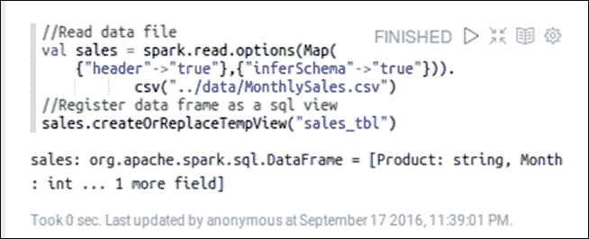

**PySpark**：

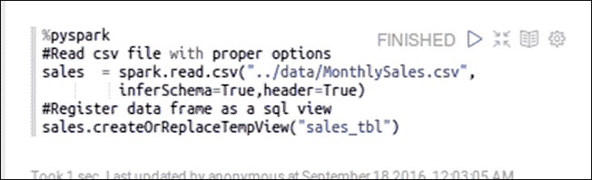

**R**：

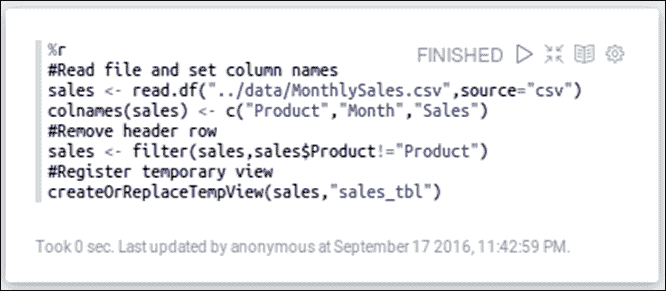

所有三个都是读取数据文件并将其注册为临时 SQL 视图。请注意，在前面的三个脚本中存在一些细微差异。例如，我们需要删除 R 的标题行并设置列名。下一步是生成可视化，它可以从`%sql`解释器中工作。下面的第一张图片显示了生成每种产品季度销售额的脚本。它还显示了开箱即用的图表类型，然后是设置及其选择。在进行选择后，您可以折叠设置。您甚至可以利用 Zeppelin 内置的动态表单，比如在运行时接受一个产品。第二张图片显示了实际输出。

1.  用于生成两种产品季度销售额的脚本：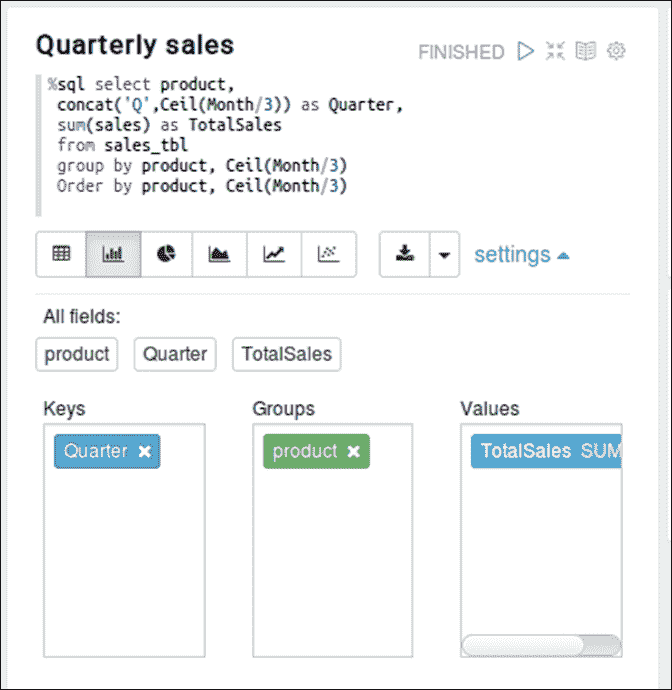

1.  生成的输出：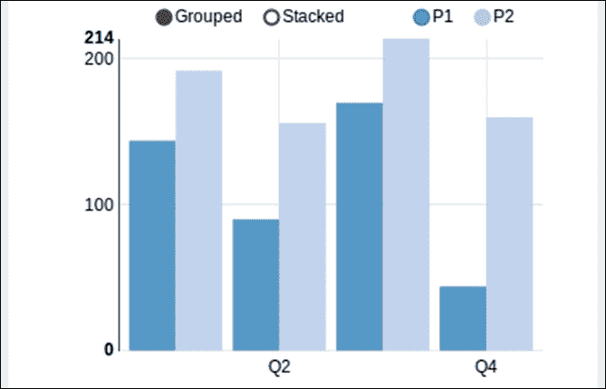

我们在前面的例子中已经看到了 Zeppelin 内置的可视化。但是我们也可以使用其他绘图库。我们的下一个例子利用了 PySpark 解释器和 Zeppelin 中的 matplotlib 来绘制直方图。这个例子的代码使用 RDD 的直方图函数计算箱子间隔和箱子计数，并将这些总结数据带到驱动节点。在绘制箱子时，频率被作为权重提供，以便给出与普通直方图相同的视觉理解，但数据传输非常低。

直方图示例如下：

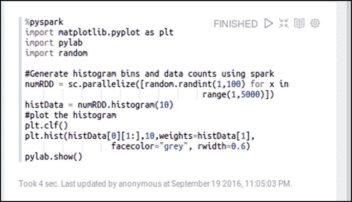

这是生成的输出（可能会显示为单独的窗口）：

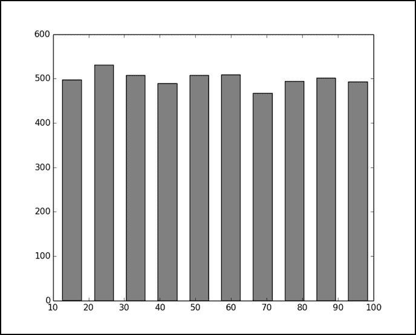

在前面的直方图准备示例中，请注意可以使用内置的动态表单支持来参数化桶计数。

## 子集和可视化

有时，我们可能有一个大型数据集，但我们可能只对其中的一个子集感兴趣。分而治之是一种方法，我们可以一次探索一小部分数据。Spark 允许使用类似 SQL 的过滤器和聚合在行列数据集以及图形数据上对数据进行子集化。让我们先进行 SQL 子集化，然后进行一个 GraphX 示例。

以下示例获取了 Zeppelin 提供的银行数据，并提取了与仅经理相关的几列数据。它使用了`google 可视化库`来绘制气泡图。数据是使用 PySpark 读取的。数据子集和可视化是使用 R 进行的。请注意，我们可以选择任何解释器来执行这些任务，这里的选择只是任意的。

使用 SQL 进行数据子集示例如下：

1.  读取数据并注册 SQL 视图：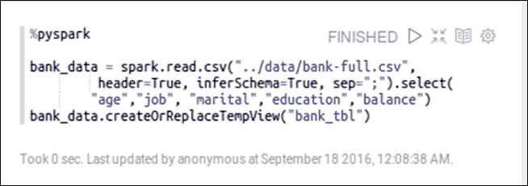

1.  子集经理的数据并显示气泡图：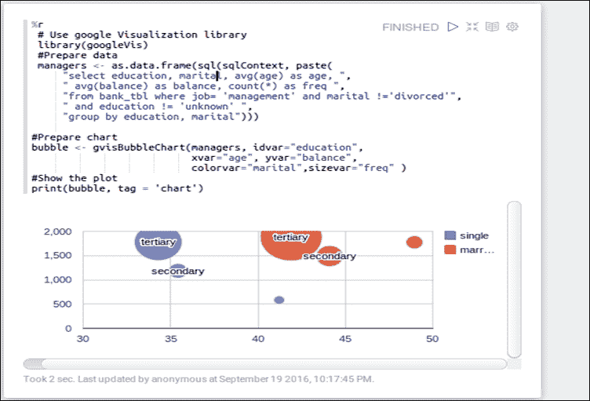

下一个示例演示了使用**Stanford Network Analysis Project** (**SNAP**)提供的数据进行的一些 GraphX 处理。脚本提取了覆盖给定节点集的子图。在这里，每个节点代表一个 Facebook ID，边代表两个节点（或人）之间的连接。此外，脚本识别了给定节点（id: 144）的直接连接。这些是级别 1 节点。然后它识别了这些*级别 1 节点*的直接连接，这些连接形成了给定节点的*级别 2 节点*。即使第二级联系可能连接到多个第一级联系，但它只显示一次，从而形成一个没有交叉边的连接树。由于连接树可能有太多的节点，脚本限制了级别 1 和级别 2 的连接，因此在给定根节点下只显示 12 个节点（一个根+三个级别 1 节点+每个级别 2 节点三个）。

**Scala**

```scala
//Subset and visualize 
//GraphX subset example 
//Datasource: http://snap.stanford.edu/data/egonets-Facebook.html  
import org.apache.spark.graphx._ 
import org.apache.spark.graphx.util.GraphGenerators 
//Load edge file and create base graph 
val base_dir = "../data/facebook" 
val graph = GraphLoader.edgeListFile(sc,base_dir + "/0.edges") 

//Explore subgraph of a given set of nodes 
val circle = "155  99  327  140  116  147  144  150  270".split("\t").map( 
       x=> x.toInt) 
val subgraph = graph.subgraph(vpred = (id,name) 
     => circle.contains(id)) 
println("Edges: " + subgraph.edges.count +  
       " Vertices: " + subgraph.vertices.count) 

//Create a two level contact tree for a given node  
//Step1: Get all edges for a given source id 
val subgraph_level1 = graph.subgraph(epred= (ed) =>  
    ed.srcId == 144) 

//Step2: Extract Level 1 contacts 
import scala.collection.mutable.ArrayBuffer 
val lvl1_nodes : ArrayBuffer[Long] = ArrayBuffer() 
subgraph_level1.edges.collect().foreach(x=> lvl1_nodes+= x.dstId) 

//Step3: Extract Level 2 contacts, 3 each for 3 lvl1_nodes 
import scala.collection.mutable.Map 
val linkMap:Map[Long, ArrayBuffer[Long]] = Map() //parent,[Child] 
val lvl2_nodes : ArrayBuffer[Long] = ArrayBuffer() //1D Array 
var n : ArrayBuffer[Long] = ArrayBuffer() 
for (i <- lvl1_nodes.take(3)) {    //Limit to 3 
    n = ArrayBuffer() 
    graph.subgraph(epred = (ed) => ed.srcId == i && 
        !(lvl2_nodes contains ed.dstId)).edges.collect(). 
             foreach(x=> n+=x.dstId) 
    lvl2_nodes++=n.take(3)    //Append to 1D array. Limit to 3 
  linkMap(i) = n.take(3)  //Assign child nodes to its parent 
 } 

 //Print output and examine the nodes 
 println("Level1 nodes :" + lvl1_nodes) 
 println("Level2 nodes :" + lvl2_nodes) 
 println("Link map :" + linkMap) 

 //Copy headNode to access from another cell 
 z.put("headNode",144) 
 //Make a DataFrame out of lvl2_nodes and register as a view 
 val nodeDF = sc.parallelize(linkMap.toSeq).toDF("parentNode","childNodes") 
 nodeDF.createOrReplaceTempView("node_tbl") 

```

### 注意

请注意`z.put`和`z.get`的使用。这是在 Zeppelin 中在单元格/解释器之间交换数据的机制。

现在我们已经创建了一个包含级别 1 联系人及其直接联系人的数据框，我们已经准备好绘制树了。以下脚本使用了图形可视化库 igraph 和 Spark R。

提取节点和边。绘制树：

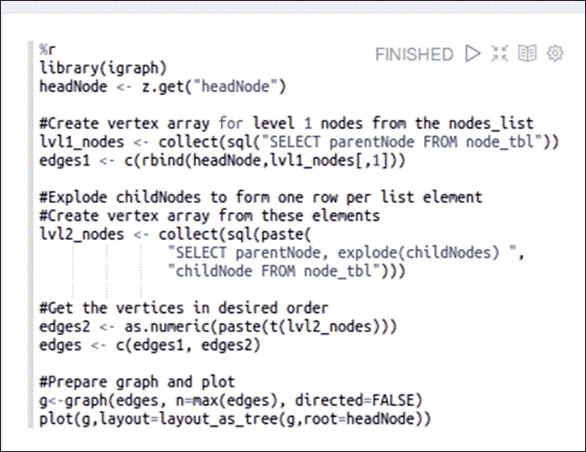

前面的脚本从节点表中获取父节点，这些父节点是级别 2 节点的父节点，也是给定头节点的直接连接。创建头节点和级别 1 节点的有序对，并分配给`edges1`。下一步将级别 2 节点的数组展开，形成每个数组元素一行。因此获得的数据框被转置并粘贴在一起形成边对。由于粘贴将数据转换为字符串，因此它们被重新转换为数字。这些是级别 2 的边。级别 1 和级别 2 的边被连接在一起形成一个边的单个列表。这些被用来形成下面显示的图形。请注意，`headNode`中的模糊是 144，尽管在下图中看不到：

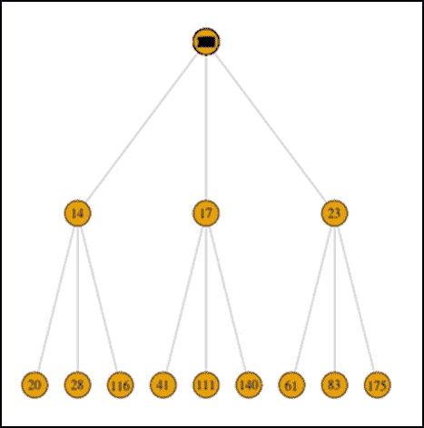

给定节点的连接树

## 抽样和可视化

抽样和可视化长期以来一直被统计学家使用。通过抽样技术，我们可以取得数据集的一部分并对其进行处理。我们将展示 Spark 如何支持不同的抽样技术，如**随机抽样**、**分层抽样**和**sampleByKey**等。以下示例是使用 Jupyter 笔记本、PySpark 内核和`seaborn`库创建的。数据文件是 Zeppelin 提供的银行数据集。第一个图显示了每个教育类别的余额。颜色表示婚姻状况。

读取数据并随机抽样 5%：

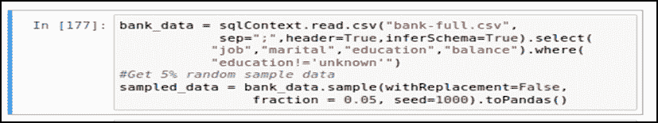

使用`stripplot`渲染数据：

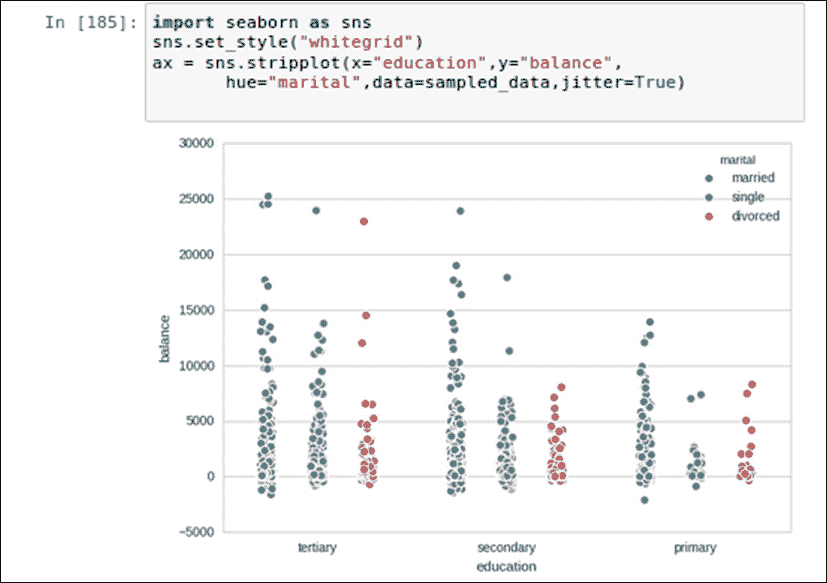

前面的示例展示了可用数据的随机样本，这比完全绘制总体要好得多。但是，如果感兴趣的分类变量（在本例中是`education`）的级别太多，那么这个图就会变得难以阅读。例如，如果我们想要绘制`job`的余额而不是`education`，那么会有太多的条带，使图片看起来凌乱。相反，我们可以只取所需分类级别的所需样本，然后检查数据。请注意，这与子集不同，因为我们无法使用 SQL 的`WHERE`子句来指定正常子集中的样本比例。我们需要使用`sampleByKey`来做到这一点，如下所示。以下示例仅采用两种工作和特定的抽样比例：

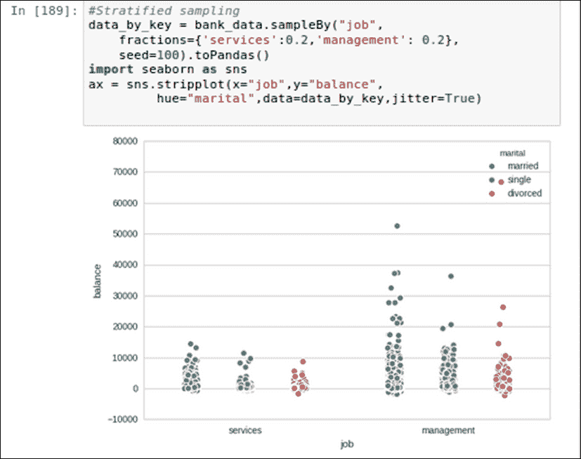

分层抽样

## 建模和可视化

建模和可视化是可能的，使用 Spark 的**MLLib**和**ML**模块。Spark 的统一编程模型和多样的编程接口使得将这些技术结合到一个单一的环境中以从数据中获得洞察成为可能。我们已经在前几章中涵盖了大部分建模技术。然而，以下是一些示例供您参考：

+   **聚类**：K 均值，高斯混合建模

+   **分类和回归**：线性模型，决策树，朴素贝叶斯，支持向量机

+   **降维**：奇异值分解，主成分分析

+   **协同过滤**

+   **统计测试**：相关性，假设检验

以下示例来自第七章，*用 SparkR 扩展 Spark*，它尝试使用朴素贝叶斯模型预测学生的及格或不及格结果。这个想法是利用 Zeppelin 提供的开箱即用的功能，并检查模型的行为。因此，我们加载数据，进行数据准备，构建模型，并运行预测。然后我们将预测注册为 SQL 视图，以便利用内置的可视化：

```scala
//Model visualization example using zeppelin visualization  
 Prepare Model and predictions 

```

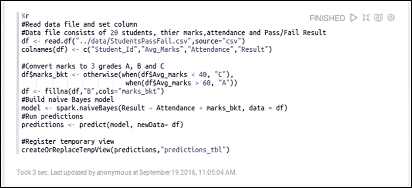

下一步是编写所需的 SQL 查询并定义适当的设置。请注意 SQL 中 UNION 运算符的使用以及匹配列的定义方式。

定义 SQL 以查看模型性能：

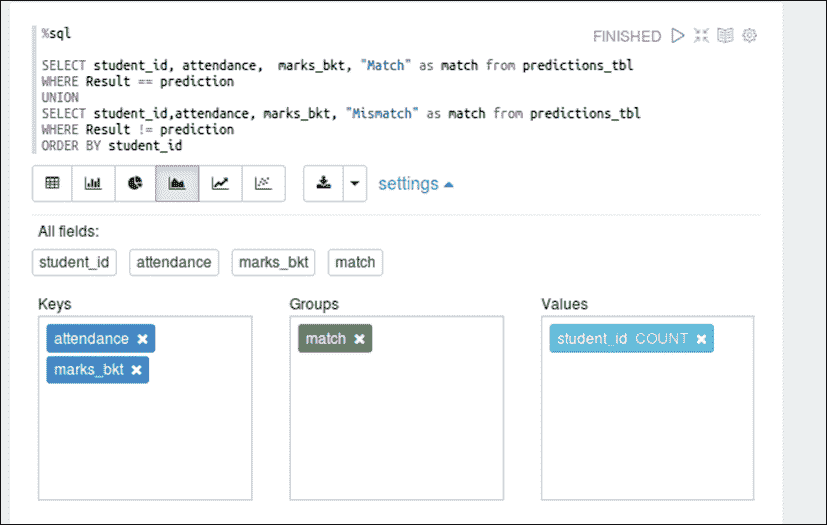

以下图片帮助我们理解模型预测与实际数据的偏差。这样的可视化有助于接受业务用户的输入，因为他们不需要任何数据科学的先验知识来理解：

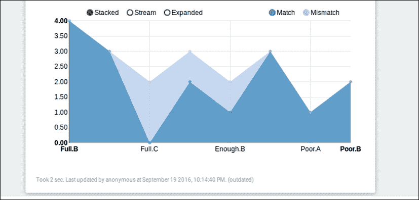

可视化模型性能

我们通常使用误差度量来评估统计模型，但是将它们以图形方式可视化而不是看到数字，使它们更直观，因为通常更容易理解图表而不是表中的数字。例如，前面的可视化也可以被数据科学社区之外的人轻松理解。

# 总结

在本章中，我们探讨了在大数据设置中支持的大多数常用可视化工具和技术。我们通过代码片段解释了一些技术，以更好地理解数据分析生命周期不同阶段的可视化需求。我们还看到了如何通过适当的可视化技术满足业务需求，以解决大数据的挑战。

下一章是到目前为止解释的所有概念的高潮。我们将通过一个示例数据集走完完整的数据分析生命周期。

# 参考

+   21 个必备的数据可视化工具：[`www.kdnuggets.com/2015/05/21-essential-data-visualization-tools.html`](http://www.kdnuggets.com/2015/05/21-essential-data-visualization-tools.html)

+   Apache Zeppelin 笔记本主页：[`zeppelin.apache.org/`](https://zeppelin.apache.org/)

+   Jupyter 笔记本主页：[`jupyter.org/`](https://jupyter.org/)

+   使用 Apache Spark 的 IPython Notebook：[`hortonworks.com/hadoop-tutorial/using-ipython-notebook-with-apache-spark/`](http://hortonworks.com/hadoop-tutorial/using-ipython-notebook-with-apache-spark/)

+   Apache Toree，可在应用程序和 Spark 集群之间进行交互式工作负载。可与 jupyter 一起使用以运行 Scala 代码：[`toree.incubator.apache.org/`](https://toree.incubator.apache.org/)

+   使用 R 的 GoogleVis 软件包：[`cran.rproject.org/web/packages/googleVis/vignettes/googleVis_examples.html`](https://cran.rproject.org/web/packages/googleVis/vignettes/googleVis_examples.html)

+   GraphX 编程指南：[`spark.apache.org/docs/latest/graphx-programming-guide.html`](http://spark.apache.org/docs/latest/graphx-programming-guide.html)

+   使用 R 的 igraph 软件包进行病毒式传播：[`www.r-bloggers.com/going-viral-with-rs-igraph-package/`](https://www.r-bloggers.com/going-viral-with-rs-igraph-package/)

+   使用分类数据绘图：[`stanford.edu/~mwaskom/software/seaborn/tutorial/categorical.html#categorical-tutorial`](https://stanford.edu/~mwaskom/software/seaborn/tutorial/categorical.html#categorical-tutorial)

## 数据来源引用

**银行数据来源（引用）**

+   [Moro 等人，2011] S. Moro，R. Laureano 和 P. Cortez。使用数据挖掘进行银行直接营销：CRISP-DM 方法论的应用

+   在 P. Novais 等人（编），欧洲模拟与建模会议 - ESM'2011 论文集，第 117-121 页，葡萄牙吉马良斯，2011 年 10 月。EUROSIS

+   可在[pdf] [`hdl.handle.net/1822/14838`](http://hdl.handle.net/1822/14838)找到

+   [bib] http://www3.dsi.uminho.pt/pcortez/bib/2011-esm-1.txt

**Facebook 数据来源（引用）**

+   J. McAuley 和 J. Leskovec。学习在自我网络中发现社交圈。NIPS，2012 年。
