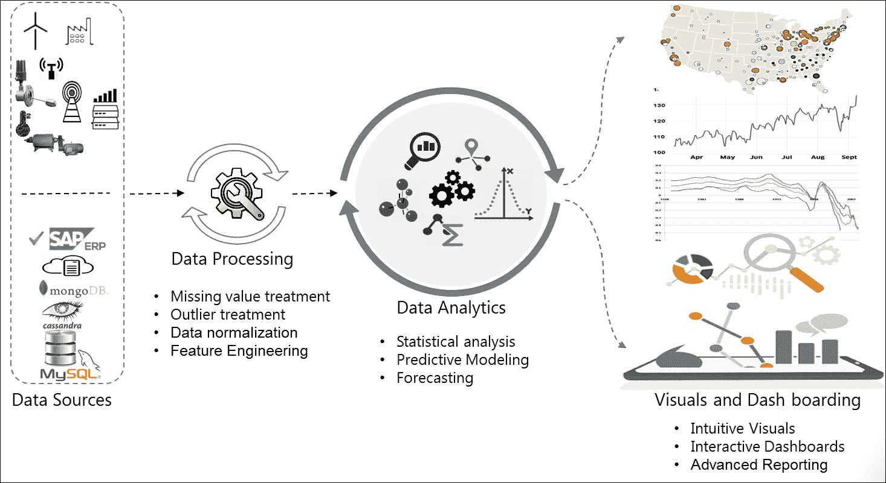
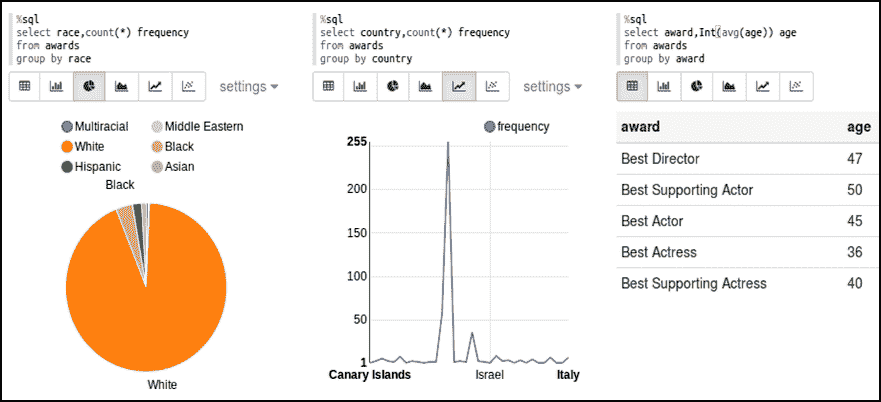

# 第十章：将所有内容整合在一起

大数据分析正在改变企业经营的方式，并为许多此前无法想象的机会铺平了道路。几乎每个企业、个人研究人员或调查记者都有大量数据需要处理。我们需要一种简洁的方法，从原始数据开始，根据手头的问题得出有意义的见解。

我们在先前的章节中使用 Apache Spark 涵盖了数据科学的各个方面。我们开始讨论大数据分析需求以及 Apache Spark 的适用性。逐渐地，我们深入研究了 Spark 编程模型、RDD 和 DataFrame 抽象，并学习了 Spark 数据集实现的统一数据访问以及连续应用的流式方面。然后，我们涵盖了使用 Apache Spark 进行整个数据分析生命周期，随后是机器学习。我们学习了 Spark 上的结构化和非结构化数据分析，并探索了数据工程师和科学家以及业务用户的可视化方面。

所有先前讨论的章节都帮助我们理解每个章节中的一个简洁方面。我们现在已经具备了遍历整个数据科学生命周期的能力。在本章中，我们将进行一个端到端的案例研究，并应用到目前为止学到的所有知识。我们不会介绍任何新概念；这将有助于应用到目前为止所获得的知识，并加强我们的理解。但是，我们已经重申了一些概念，而没有过多地详细介绍，以使本章内容自成一体。本章涵盖的主题与数据分析生命周期中的步骤大致相同：

+   快速回顾

+   引入案例研究

+   构建业务问题

+   数据获取和数据清洗

+   制定假设

+   数据探索

+   数据准备

+   模型构建

+   数据可视化

+   将结果传达给业务用户

+   总结

# 快速回顾

我们已经在不同的章节中详细讨论了典型数据科学项目中涉及的各种步骤。让我们快速浏览一下我们已经涵盖的内容，并触及一些重要方面。所涉步骤的高级概述可能如下图所示：



在前面的图示中，我们试图解释了涉及数据科学项目的步骤，大部分是通用于许多数据科学任务的。实际上，在每个阶段都存在许多子步骤，但可能因项目而异。

对于数据科学家来说，很难在开始时找到最佳方法和步骤。通常，数据科学项目没有像**软件开发生命周期**（**SDLC**）那样定义明确的生命周期。通常情况下，数据科学项目会因为生命周期中的大多数步骤都是迭代的而陷入交付延迟。此外，团队之间可能存在循环依赖，增加了复杂性并导致执行延迟。然而，在处理大数据分析项目时，对数据科学家来说，遵循明确定义的数据科学工作流程是重要且有利的，无论不同的业务案例如何。这不仅有助于组织执行，还有助于我们专注于目标，因为在大多数情况下，数据科学项目本质上是敏捷的。此外，建议您计划对任何给定项目的数据、领域和算法进行一定程度的研究。

在本章中，我们可能无法在单个流程中容纳所有细粒度步骤，但将讨论重要领域，以便提前了解。我们将尝试查看一些在先前章节中未涵盖的不同编码示例。

# 引入案例研究

在本章中，我们将探讨奥斯卡奖的人口统计学。你可以从 GitHub 仓库下载数据[`www.crowdflower.com/wp-content/uploads/2016/03/Oscars-demographics-DFE.csv`](https://www.crowdflower.com/wp-content/uploads/2016/03/Oscars-demographics-DFE.csv)。

这个数据集是基于[`www.crowdflower.com/data-for-everyone`](http://www.crowdflower.com/data-for-everyone)提供的数据。它包含人口统计学细节，如种族、出生地和年龄。行数大约为 400，可以在普通家用电脑上轻松处理，因此你可以在 Spark 上执行数据科学项目的**概念验证**（**POC**）。

从下载文件并检查数据开始。数据可能看起来不错，但当你仔细查看时，你会注意到它并不是“干净”的。例如，出生日期列的格式不一致。有些年份是两位数格式，而有些是四位数格式。出生地没有美国境内地点的国家信息。

同样，你也会注意到数据看起来有偏差，美国有更多“白人”种族的人。但你可能会感觉到趋势在后来的年份有所改变。到目前为止，你还没有使用任何工具或技术，只是快速浏览了一下数据。在数据科学的现实世界中，这种看似琐碎的活动在生命周期的后期可能会非常有帮助。你可以对手头的数据产生一种感觉，并同时对数据进行假设。这将带你进入工作流程的第一步。

# 业务问题

正如之前所述，任何数据科学项目最重要的方面是所面临的问题。对于*我们试图解决什么问题？*有清晰的理解至关重要。这对项目的成功至关重要。它还决定了什么是相关数据，什么不是。例如，在当前案例研究中，如果我们想要研究的是人口统计学，那么电影名称和人名就是无关的。有时候，手头上没有具体的问题！*那么呢？*即使没有具体的问题，业务可能仍然有一些目标，或者数据科学家和领域专家可以共同努力找到要处理的业务领域。为了理解业务、功能、问题陈述或数据，数据科学家从“质疑”开始。这不仅有助于定义工作流程，还有助于获取正确的数据。

例如，如果业务重点是人口统计信息，一个正式的业务问题陈述可以被定义为：

*种族和出生国家在奥斯卡奖得主中的影响是什么？*

在现实世界中，这一步并不会如此直接。提出正确的问题是数据科学家、战略团队、领域专家和项目所有者的共同责任。如果不符合目的，整个练习就是徒劳的，数据科学家必须咨询所有利益相关者，并尽可能从他们那里获取尽可能多的信息。然而，他们可能最终得到宝贵的见解或“直觉”。所有这些结合起来构成了最初的假设的核心，并帮助数据科学家了解他们应该寻找什么。

在业务没有明确问题需要寻找答案的情况下，处理起来更有趣，但在执行上可能更复杂！

# 数据获取和数据清洗

**数据获取**是下一个逻辑步骤。它可能只是从单个电子表格中选择数据，也可能是一个独立的几个月的项目。数据科学家必须收集尽可能多的相关数据。这里的关键词是“相关”。记住，更相关的数据胜过聪明的算法。

我们已经介绍了如何从异构数据源获取数据并 consoli，以形成单个数据矩阵，因此我们将不在这里重复相同的基础知识。相反，我们从单一来源获取数据并提取其子集。

现在是时候查看数据并开始清理了。本章中呈现的脚本往往比以前的示例要长，但仍然不是生产质量的。现实世界的工作需要更多的异常检查和性能调优：

**Scala**

```scala
//Load tab delimited file 
scala> val fp = "<YourPath>/Oscars.txt" 
scala> val init_data = spark.read.options(Map("header"->"true", "sep" -> "\t","inferSchema"->"true")).csv(fp) 
//Select columns of interest and ignore the rest 
>>> val awards = init_data.select("birthplace", "date_of_birth", 
        "race_ethnicity","year_of_award","award").toDF( 
         "birthplace","date_of_birth","race","award_year","award") 
awards: org.apache.spark.sql.DataFrame = [birthplace: string, date_of_birth: string ... 3 more fields] 
//register temporary view of this dataset 
scala> awards.createOrReplaceTempView("awards") 

//Explore data 
>>> awards.select("award").distinct().show(10,false) //False => do not truncate 
+-----------------------+                                                        
|award                  | 
+-----------------------+ 
|Best Supporting Actress| 
|Best Director          | 
|Best Actress           | 
|Best Actor             | 
|Best Supporting Actor  | 
+-----------------------+ 
//Check DOB quality. Note that length varies based on month name 
scala> spark.sql("SELECT distinct(length(date_of_birth)) FROM awards ").show() 
+---------------------+                                                          
|length(date_of_birth)| 
+---------------------+ 
|                   15| 
|                    9| 
|                    4| 
|                    8| 
|                   10| 
|                   11| 
+---------------------+ 

//Look at the value with unexpected length 4 Why cant we show values for each of the length type ?  
scala> spark.sql("SELECT date_of_birth FROM awards WHERE length(date_of_birth) = 4").show() 
+-------------+ 
|date_of_birth| 
+-------------+ 
|         1972| 
+-------------+ 
//This is an invalid date. We can either drop this record or give some meaningful value like 01-01-1972 

```

**Python**

```scala
    //Load tab delimited file
    >>> init_data = spark.read.csv("<YOURPATH>/Oscars.txt",sep="\t",header=True)
    //Select columns of interest and ignore the rest
    >>> awards = init_data.select("birthplace", "date_of_birth",
            "race_ethnicity","year_of_award","award").toDF(
             "birthplace","date_of_birth","race","award_year","award")
    //register temporary view of this dataset
    >>> awards.createOrReplaceTempView("awards")
    scala>
    //Explore data
    >>> awards.select("award").distinct().show(10,False) //False => do not truncate
    +-----------------------+                                                       
    |award                  |
    +-----------------------+
    |Best Supporting Actress|
    |Best Director          |
    |Best Actress           |
    |Best Actor             |
    |Best Supporting Actor  |
    +-----------------------+
    //Check DOB quality
    >>> spark.sql("SELECT distinct(length(date_of_birth)) FROM awards ").show()
    +---------------------+                                                         
    |length(date_of_birth)|
    +---------------------+
    |                   15|
    |                    9|
    |                    4|
    |                    8|
    |                   10|
    |                   11|
    +---------------------+
    //Look at the value with unexpected length 4\. Note that length varies based on month name
    >>> spark.sql("SELECT date_of_birth FROM awards WHERE length(date_of_birth) = 4").show()
    +-------------+
    |date_of_birth|
    +-------------+
    |         1972|
    +-------------+
    //This is an invalid date. We can either drop this record or give some meaningful value like 01-01-1972

Most of the datasets contain a date field and unless they come from a single, controlled data source, it is highly likely that they will differ in their formats and are almost always a candidate for cleaning.
```

对于手头的数据集，您可能还注意到`date_of_birth`和`birthplace`需要大量清理。以下代码显示了分别清理`date_of_birth`和`birthplace`的两个**用户定义函数**（**UDFs**）。这些 UDFs 一次处理一个数据元素，它们只是普通的 Scala/Python 函数。这些用户定义函数应该被注册，以便它们可以从 SQL 语句中使用。最后一步是创建一个经过清理的数据框，以便参与进一步的分析。

注意清理`birthplace`的逻辑。这是一个薄弱的逻辑，因为我们假设任何以两个字符结尾的字符串都是美国州。我们必须将它们与有效缩写列表进行比较。同样，假设两位数年份总是来自二十世纪是另一个容易出错的假设。根据使用情况，数据科学家/数据工程师必须决定保留更多行是否重要，或者只应包含质量数据。所有这些决定都应该被清晰地记录以供参考：

**Scala:**

```scala
//UDF to clean date 
//This function takes 2 digit year and makes it 4 digit 
// Any exception returns an empty string 
scala> def fncleanDate(s:String) : String = {  
  var cleanedDate = "" 
  val dateArray: Array[String] = s.split("-") 
  try{    //Adjust year 
     var yr = dateArray(2).toInt 
     if (yr < 100) {yr = yr + 1900 } //make it 4 digit 
     cleanedDate = "%02d-%s-%04d".format(dateArray(0).toInt, 
                dateArray(1),yr) 
     } catch { case e: Exception => None } 
     cleanedDate } 
fncleanDate: (s: String)String 

```

**Python:**

```scala
    //This function takes 2 digit year and makes it 4 digit
    // Any exception returns an empty string
    >>> def fncleanDate(s):
          cleanedDate = ""
          dateArray = s.split("-")
          try:    //Adjust year
             yr = int(dateArray[2])
             if (yr < 100):
                  yr = yr + 1900 //make it 4 digit
             cleanedDate = "{0}-{1}-{2}".format(int(dateArray[0]),
                      dateArray[1],yr)
          except :
              None
          return cleanedDate

```

清理日期的 UDF 接受一个连字符日期字符串并拆分它。如果最后一个组件，即年份，是两位数长，则假定它是二十世纪的日期，并添加 1900 以将其转换为四位数格式。

以下 UDF 附加了国家作为美国，如果国家字符串是纽约市或最后一个组件为两个字符长，那么假定它是美国的一个州：

```scala
//UDF to clean birthplace 
// Data explorartion showed that  
// A. Country is omitted for USA 
// B. New York City does not have State code as well 
//This function appends country as USA if 
// A. the string contains New York City  (OR) 
// B. if the last component is of length 2 (eg CA, MA) 
scala> def fncleanBirthplace(s: String) : String = { 
        var cleanedBirthplace = "" 
        var strArray : Array[String] =  s.split(" ") 
        if (s == "New York City") 
           strArray = strArray ++ Array ("USA") 
        //Append country if last element length is 2 
        else if (strArray(strArray.length-1).length == 2) 
            strArray = strArray ++ Array("USA") 
        cleanedBirthplace = strArray.mkString(" ") 
        cleanedBirthplace } 

```

Python:

```scala
    >>> def fncleanBirthplace(s):
            cleanedBirthplace = ""
            strArray = s.split(" ")
            if (s == "New York City"):
                strArray += ["USA"]  //Append USA
            //Append country if last element length is 2
            elif (len(strArray[len(strArray)-1]) == 2):
                strArray += ["USA"]
            cleanedBirthplace = " ".join(strArray)
            return cleanedBirthplace

```

如果要从 SELECT 字符串中访问 UDFs，则应注册 UDFs：

**Scala:**

```scala
//Register UDFs 
scala> spark.udf.register("fncleanDate",fncleanDate(_:String)) 
res10: org.apache.spark.sql.expressions.UserDefinedFunction = UserDefinedFunction(<function1>,StringType,Some(List(StringType))) 
scala> spark.udf.register("fncleanBirthplace", fncleanBirthplace(_:String)) 
res11: org.apache.spark.sql.expressions.UserDefinedFunction = UserDefinedFunction(<function1>,StringType,Some(List(StringType))) 

```

**Python:**

```scala
    >>> from pyspark.sql.types import StringType
    >>> sqlContext.registerFunction("cleanDateUDF",fncleanDate, StringType())
    >>> sqlContext.registerFunction( "cleanBirthplaceUDF",fncleanBirthplace, StringType())

```

使用 UDFs 清理数据框。执行以下清理操作：

1.  调用 UDFs `fncleanDate`和`fncleanBirthplace`来修复出生地和国家。

1.  从`award_year`中减去出生年份以获得获奖时的`age`。

1.  保留`race`和`award`。

**Scala:**

```scala
//Create cleaned data frame 
scala> var cleaned_df = spark.sql ( 
            """SELECT fncleanDate (date_of_birth) dob, 
               fncleanBirthplace(birthplace) birthplace, 
               substring_index(fncleanBirthplace(birthplace),' ',-1)  
                               country, 
               (award_year - substring_index(fncleanDate( date_of_birth),'-',-1)) age, race, award FROM awards""") 
cleaned_df: org.apache.spark.sql.DataFrame = [dob: string, birthplace: string ... 4 more fields] 

```

**Python:**

```scala
//Create cleaned data frame 
>>> from pyspark.sql.functions import substring_index>>> cleaned_df = spark.sql (            """SELECT cleanDateUDF (date_of_birth) dob,               cleanBirthplaceUDF(birthplace) birthplace,               substring_index(cleanBirthplaceUDF(birthplace),' ',-1) country,               (award_year - substring_index(cleanDateUDF( date_of_birth),               '-',-1)) age, race, award FROM awards""")
```

最后一行需要一些解释。UDFs 类似于 SQL 函数，并且表达式被别名为有意义的名称。我们添加了一个计算列`age`，因为我们也想验证年龄的影响。`substring_index`函数搜索第一个参数的第二个参数。`-1`表示从右边查找第一次出现。

# 制定假设

假设是关于结果的最佳猜测。您根据问题、与利益相关者的对话以及查看数据形成初始假设。对于给定的问题，您可能会形成一个或多个假设。这个初始假设作为指导您进行探索性分析的路线图。制定假设对于统计上批准或不批准一个陈述非常重要，而不仅仅是通过查看数据作为数据矩阵或甚至通过视觉来进行。这是因为我们仅仅通过查看数据建立的认知可能是不正确的，有时甚至是具有欺骗性的。

现在你知道你的最终结果可能证明假设是正确的，也可能不是。来到我们为这节课考虑的案例研究，我们得出以下初始假设：

+   获奖者大多是白人

+   大多数获奖者来自美国

+   最佳男演员和女演员往往比最佳导演年轻

现在我们已经明确了我们的假设，我们已经准备好继续进行生命周期的下一步了。

# 数据探索

现在我们有了一个包含相关数据和初始假设的干净数据框架，是时候真正探索我们拥有的东西了。数据框架抽象提供了`group by`等函数，供您随时查看。您可以将清理后的数据框架注册为表，并运行经过时间考验的 SQL 语句来执行相同的操作。

现在也是绘制一些图表的时候了。这个可视化阶段是数据可视化章节中提到的探索性分析。这次探索的目标受到您从业务利益相关者和假设中获得的初始信息的极大影响。换句话说，您与利益相关者的讨论帮助您知道要寻找什么。

有一些通用准则适用于几乎所有数据科学任务，但又因不同的使用情况而异。让我们看一些通用的准则：

+   查找缺失数据并处理它。我们已经讨论了在第五章*Spark 上的数据分析*中执行此操作的各种方法。

+   查找数据集中的异常值并处理它们。我们也讨论了这个方面。请注意，有些情况下，我们认为是异常值和正常数据点的界限可能会根据使用情况而改变。

+   进行单变量分析，其中您单独探索数据集中的每个变量。频率分布或百分位数分布是相当常见的。也许绘制一些图表以获得更好的想法。这也将帮助您在进行数据建模之前准备数据。

+   验证您的初始假设。

+   检查数值数据的最小值和最大值。如果任何列中的变化太大，那可能是数据归一化或缩放的候选项。

+   检查分类数据（如城市名称等字符串值）中的不同值及其频率。如果任何列中有太多不同的值（也称为级别），则可能需要寻找减少级别数量的方法。如果一个级别几乎总是出现，那么该列对模型区分可能结果没有帮助。这样的列很可能被移除。在探索阶段，您只需找出这样的候选列，让数据准备阶段来处理实际操作。

在我们当前的数据集中，我们没有任何缺失数据，也没有任何可能造成挑战的数值数据。但是，当处理无效日期时，可能会出现一些缺失值。因此，以下代码涵盖了剩余的操作项目。此代码假定`cleaned_df`已经创建：

**Scala/Python:**

```scala
cleaned_df = cleaned_df.na.drop //Drop rows with missing values 
cleaned_df.groupBy("award","country").count().sort("country","award","count").show(4,False) 
+-----------------------+---------+-----+                                        
|award                  |country  |count| 
+-----------------------+---------+-----+ 
|Best Actor             |Australia|1    | 
|Best Actress           |Australia|1    | 
|Best Supporting Actor  |Australia|1    | 
|Best Supporting Actress|Australia|1    | 
+-----------------------+---------+-----+ 
//Re-register data as table 
cleaned_df.createOrReplaceTempView("awards") 
//Find out levels (distinct values) in each categorical variable 
spark.sql("SELECT count(distinct country) country_count, count(distinct race) race_count, count(distinct award) award_count from awards").show() 
+-------------+----------+-----------+                                           
|country_count|race_count|award_count| 
+-------------+----------+-----------+ 
|           34|         6|          5| 
+-------------+----------+-----------+ 

```

以下可视化与初始假设相对应。请注意，我们发现两个假设是正确的，但第三个假设不正确。这些可视化是使用 zeppelin 创建的：



请注意，并非所有假设都可以通过可视化来验证，因为它们有时可能具有欺骗性。因此，需要根据适用情况执行适当的统计检验，如 t 检验、ANOVA、卡方检验、相关性检验等。我们不会在本节详细介绍。有关详细信息，请参阅第五章*Spark 上的数据分析*。

# 数据准备

数据探索阶段帮助我们确定了在进入建模阶段之前需要修复的所有问题。每个单独的问题都需要仔细思考和审议，以选择最佳的修复方法。以下是一些常见问题和可能的修复方法。最佳修复取决于手头的问题和/或业务背景。

## 分类变量中的太多级别

这是我们面临的最常见问题之一。解决此问题取决于多个因素：

+   如果列几乎总是唯一的，例如，它是一个交易 ID 或时间戳，那么它在建模过程中不参与，除非你正在从中派生新特征。您可以安全地删除该列而不会丢失任何信息内容。通常在数据清洗阶段就会删除它。

+   如果可能用粗粒度级别（例如，州或国家而不是城市）替换级别，这在当前情境下通常是解决此问题的最佳方式。

+   您可能希望为每个不同级别添加具有 0 或 1 值的虚拟列。例如，如果单个列中有 100 个级别，则添加 100 个列。最多，一个观察（行）中将有一个列具有 1。这称为**独热编码**，Spark 通过`ml.features`包提供了这个功能。

+   另一个选择是保留最频繁的级别。您甚至可以将这些级别中的每一个附加到某个被认为与该级别“更接近”的主导级别中。此外，您可以将其余级别捆绑到一个单一的桶中，例如`Others`。

+   没有绝对限制级别的硬性规定。这取决于您对每个单独特征所需的粒度以及性能约束。

当前数据集在分类变量`country`中有太多级别。我们选择保留最频繁的级别，并将其余级别捆绑到`Others`中：

**Scala:**

```scala
//Country has too many values. Retain top ones and bundle the rest 
//Check out top 6 countries with most awards. 
scala> val top_countries_df = spark.sql("SELECT country, count(*) freq FROM awards GROUP BY country ORDER BY freq DESC LIMIT 6") 
top_countries_df: org.apache.spark.sql.DataFrame = [country: string, freq: bigint] 
scala> top_countries_df.show() 
+-------+----+                                                                   
|country|freq| 
+-------+----+ 
|    USA| 289| 
|England|  57| 
| France|   9| 
| Canada|   8| 
|  Italy|   7| 
|Austria|   7| 
+-------+----+ 
//Prepare top_countries list 
scala> val top_countries = top_countries_df.select("country").collect().map(x => x(0).toString) 
top_countries: Array[String] = Array(USA, England, New York City, France, Canada, Italy) 
//UDF to fix country. Retain top 6 and bundle the rest into "Others" 
scala> import org.apache.spark.sql.functions.udf 
import org.apache.spark.sql.functions.udf 
scala > val setCountry = udf ((s: String) => 
        { if (top_countries.contains(s)) {s} else {"Others"}}) 
setCountry: org.apache.spark.sql.expressions.UserDefinedFunction = UserDefinedFunction(<function1>,StringType,Some(List(StringType))) 
//Apply udf to overwrite country 
scala> cleaned_df = cleaned_df.withColumn("country", setCountry(cleaned_df("country"))) 
cleaned_df: org.apache.spark.sql.DataFrame = [dob: string, birthplace: string ... 4 more fields] 

```

**Python:**

```scala
    //Check out top 6 countries with most awards.
    >>> top_countries_df = spark.sql("SELECT country, count(*) freq FROM awards GROUP BY country ORDER BY freq DESC LIMIT 6")
    >>> top_countries_df.show()
    +-------+----+                                                                  
    |country|freq|
    +-------+----+
    |    USA| 289|
    |England|  57|
    | France|   9|
    | Canada|   8|
    |  Italy|   7|
    |Austria|   7|
    +-------+----+
    >>> top_countries = [x[0] for x in top_countries_df.select("country").collect()]
    //UDF to fix country. Retain top 6 and bundle the rest into "Others"
    >>> from pyspark.sql.functions import udf
    >>> from pyspark.sql.types import StringType
    >>> setCountry = udf(lambda s: s if s in top_countries else "Others", StringType())
    //Apply UDF
    >>> cleaned_df = cleaned_df.withColumn("country", setCountry(cleaned_df["country"]))

```

## 具有太多变化的数值变量

有时，数值数据值可能相差几个数量级。例如，如果您正在查看个人的年收入，它可能会有很大变化。Z 分数标准化（标准化）和最小-最大缩放是处理这种数据的两种常用选择。Spark 在`ml.features`包中提供了这两种转换。

我们当前的数据集没有这样的变量。我们唯一的数值变量是年龄，其值均匀为两位数。这是一个问题少了一个问题。

请注意，并非总是需要对此类数据进行标准化。如果您正在比较两个不同规模的变量，或者如果您正在使用聚类算法或 SVM 分类器，或者任何其他真正需要对数据进行标准化的情况，您可以对数据进行标准化。

### 缺失数据

这是一个重要的关注领域。任何目标本身缺失的观察应该从训练数据中删除。根据要求，剩下的观察可以保留一些填充值或删除。在填充缺失值时，您应该非常小心；否则可能会导致误导性的输出！看起来很容易只需继续并在连续变量的空白单元格中替换平均值，但这可能不是正确的方法。

我们当前的案例研究没有任何缺失数据，因此没有处理的余地。不过，让我们看一个例子。

假设您正在处理一个学生数据集，其中包含从一年级到五年级的数据。如果有一些缺失的`Age`值，您只需找到整个列的平均值并替换，那么这将成为一个异常值，并可能导致模糊的结果。您可以选择仅找到学生所在班级的平均值，然后填充该值。这至少是一个更好的方法，但可能不是完美的方法。在大多数情况下，您还必须给其他变量赋予权重。如果这样做，您可能会建立一个预测模型来查找缺失的值，这可能是一个很好的方法！

### 连续数据

数值数据通常是连续的，必须离散化，因为这是一些算法的先决条件。它通常被分成不同的桶或值的范围。然而，可能存在这样的情况，你不仅仅是根据数据的范围均匀地分桶，你可能需要考虑方差或标准差或任何其他适用的原因来正确地分桶。现在，决定桶的数量也取决于数据科学家的判断，但这也需要仔细分析。太少的桶会降低粒度，而太多的桶与拥有太多的分类级别几乎是一样的。在我们的案例研究中，“年龄”就是这样的数据的一个例子，我们需要将其离散化。我们将其分成不同的桶。例如，看看这个管道阶段，它将“年龄”转换为 10 个桶：

**Scala:**

```scala
scala> val splits = Array(Double.NegativeInfinity, 35.0, 45.0, 55.0, 
          Double.PositiveInfinity) 
splits: Array[Double] = Array(-Infinity, 35.0, 45.0, 55.0, Infinity) 
scala> val bucketizer = new Bucketizer().setSplits(splits). 
                 setInputCol("age").setOutputCol("age_buckets") 
bucketizer: org.apache.spark.ml.feature.Bucketizer = bucketizer_a25c5d90ac14 

```

**Python:**

```scala
    >>> splits = [-float("inf"), 35.0, 45.0, 55.0,
                   float("inf")]
    >>> bucketizer = Bucketizer(splits = splits, inputCol = "age",
                        outputCol = "age_buckets")

```

### 分类数据

我们已经讨论了将连续数据离散化并转换为类别或桶的需要。我们还讨论了引入虚拟变量，每个分类变量的每个不同值都有一个。还有一个常见的数据准备做法，即将分类级别转换为数值（离散）数据。这是因为许多机器学习算法使用数值数据、整数和实值数字，或者其他情况可能需要。因此，我们需要将分类数据转换为数值数据。

这种方法可能存在缺点。在本质上无序的数据中引入顺序有时可能是不合逻辑的。例如，将数字 0、1、2、3 分配给颜色“红色”、“绿色”、“蓝色”和“黑色”是没有意义的。这是因为我们不能说红色距离“绿色”一单位，绿色距离“蓝色”也是如此！如果适用，在许多这种情况下引入虚拟变量更有意义。

### 准备数据

在讨论了常见问题和可能的修复方法之后，让我们看看如何准备我们当前的数据集。我们已经涵盖了与太多级别问题相关的代码修复。以下示例显示了其余部分。它将所有特征转换为单个特征列。它还将一些数据设置为测试模型。这段代码严重依赖于`ml.features`包，该包旨在支持数据准备阶段。请注意，这段代码只是定义了需要做什么。转换尚未进行。这些将成为随后定义的管道中的阶段。执行被尽可能地推迟，直到实际模型建立。Catalyst 优化器找到了实施管道的最佳路径：

**Scala:**

```scala
//Define pipeline to convert categorical labels to numerical labels 
scala> import org.apache.spark.ml.feature.{StringIndexer, Bucketizer, VectorAssembler} 
import org.apache.spark.ml.feature.{StringIndexer, Bucketizer, VectorAssembler} 
scala> import org.apache.spark.ml.Pipeline 
import org.apache.spark.ml.Pipeline 
//Race 
scala> val raceIdxer = new StringIndexer(). 
           setInputCol("race").setOutputCol("raceIdx") 
raceIdxer: org.apache.spark.ml.feature.StringIndexer = strIdx_80eddaa022e6 
//Award (prediction target) 
scala> val awardIdxer = new StringIndexer(). 
         setInputCol("award").setOutputCol("awardIdx") 
awardIdxer: org.apache.spark.ml.feature.StringIndexer = strIdx_256fe36d1436 
//Country 
scala> val countryIdxer = new StringIndexer(). 
         setInputCol("country").setOutputCol("countryIdx") 
countryIdxer: org.apache.spark.ml.feature.StringIndexer = strIdx_c73a073553a2 

//Convert continuous variable age to buckets 
scala> val splits = Array(Double.NegativeInfinity, 35.0, 45.0, 55.0, 
          Double.PositiveInfinity) 
splits: Array[Double] = Array(-Infinity, 35.0, 45.0, 55.0, Infinity) 

scala> val bucketizer = new Bucketizer().setSplits(splits). 
                 setInputCol("age").setOutputCol("age_buckets") 
bucketizer: org.apache.spark.ml.feature.Bucketizer = bucketizer_a25c5d90ac14 

//Prepare numerical feature vector by clubbing all individual features 
scala> val assembler = new VectorAssembler().setInputCols(Array("raceIdx", 
          "age_buckets","countryIdx")).setOutputCol("features") 
assembler: org.apache.spark.ml.feature.VectorAssembler = vecAssembler_8cf17ee0cd60 

//Define data preparation pipeline 
scala> val dp_pipeline = new Pipeline().setStages( 
          Array(raceIdxer,awardIdxer, countryIdxer, bucketizer, assembler)) 
dp_pipeline: org.apache.spark.ml.Pipeline = pipeline_06717d17140b 
//Transform dataset 
scala> cleaned_df = dp_pipeline.fit(cleaned_df).transform(cleaned_df) 
cleaned_df: org.apache.spark.sql.DataFrame = [dob: string, birthplace: string ... 9 more fields] 
//Split data into train and test datasets 
scala> val Array(trainData, testData) = 
        cleaned_df.randomSplit(Array(0.7, 0.3)) 
trainData: org.apache.spark.sql.Dataset[org.apache.spark.sql.Row] = [dob: string, birthplace: string ... 9 more fields] 
testData: org.apache.spark.sql.Dataset[org.apache.spark.sql.Row] = [dob: string, birthplace: string ... 9 more fields] 

```

**Python:**

```scala
    //Define pipeline to convert categorical labels to numcerical labels
    >>> from pyspark.ml.feature import StringIndexer, Bucketizer, VectorAssembler
    >>> from pyspark.ml import Pipelin
    //Race
    >>> raceIdxer = StringIndexer(inputCol= "race", outputCol="raceIdx")
    //Award (prediction target)
    >>> awardIdxer = StringIndexer(inputCol = "award", outputCol="awardIdx")
    //Country
    >>> countryIdxer = StringIndexer(inputCol = "country", outputCol = "countryIdx")

    //Convert continuous variable age to buckets
    >>> splits = [-float("inf"), 35.0, 45.0, 55.0,
                   float("inf")]
    >>> bucketizer = Bucketizer(splits = splits, inputCol = "age",
                        outputCol = "age_buckets")
    >>>
    //Prepare numerical feature vector by clubbing all individual features
    >>> assembler = VectorAssembler(inputCols = ["raceIdx", 
              "age_buckets","countryIdx"], outputCol = "features")

    //Define data preparation pipeline
    >>> dp_pipeline = Pipeline(stages = [raceIdxer,
             awardIdxer, countryIdxer, bucketizer, assembler])
    //Transform dataset
    >>> cleaned_df = dp_pipeline.fit(cleaned_df).transform(cleaned_df)
    >>> cleaned_df.columns
    ['dob', 'birthplace', 'country', 'age', 'race', 'award', 'raceIdx', 'awardIdx', 'countryIdx', 'age_buckets', 'features']

    //Split data into train and test datasets
    >>> trainData, testData = cleaned_df.randomSplit([0.7, 0.3])

```

在进行所有数据准备活动之后，您将得到一个完全数字化的数据，没有缺失值，并且每个属性中的级别是可管理的。您可能已经删除了可能对手头的分析没有太大价值的任何属性。这就是我们所说的**最终数据矩阵**。现在您已经准备好开始对数据进行建模了。因此，首先将源数据分成训练数据和测试数据。模型使用训练数据进行“训练”，并使用测试数据进行“测试”。请注意，拆分是随机的，如果重新进行拆分，您可能会得到不同的训练和测试分区。

# 模型构建

模型是事物的表现，现实的描述或描述。就像物理建筑的模型一样，数据科学模型试图理解现实；在这种情况下，现实是特征和预测变量之间的基本关系。它们可能不是 100%准确，但仍然非常有用，可以根据数据为我们的业务空间提供一些深刻的见解。

有几种机器学习算法可以帮助我们对数据进行建模，Spark 提供了其中许多。然而，要构建哪种模型仍然是一个价值百万的问题。这取决于各种因素，比如解释性和准确性的权衡、手头有多少数据、分类或数值变量、时间和内存限制等等。在下面的代码示例中，我们随机训练了一些模型，以展示如何完成这些步骤。

我们将根据种族、年龄和国家来预测奖项类型。我们将使用 DecisionTreeClassifier、RandomForestClassifier 和 OneVsRest 算法。这三个是任意选择的。它们都适用于多类标签，并且易于理解。我们使用了`ml`包提供的以下评估指标：

+   **准确性**：正确预测的观察比例。

+   **加权精确度**：精确度是正确的正例观察值与所有正例观察值的比率。加权精确度考虑了各个类别的频率。

+   **加权召回率**：召回率是正例与实际正例的比率。实际正例是真正例和假负例的总和。加权召回率考虑了各个类别的频率。

+   **F1**：默认的评估指标。这是精确度和召回率的加权平均值。

**Scala：**

```scala
scala> import org.apache.spark.ml.Pipeline 
import org.apache.spark.ml.Pipeline 
scala> import org.apache.spark.ml.classification.DecisionTreeClassifier 
import org.apache.spark.ml.classification.DecisionTreeClassifier 

//Use Decision tree classifier 
scala> val dtreeModel = new DecisionTreeClassifier(). 
           setLabelCol("awardIdx").setFeaturesCol("features"). 
           fit(trainData) 
dtreeModel: org.apache.spark.ml.classification.DecisionTreeClassificationModel = DecisionTreeClassificationModel (uid=dtc_76c9e80680a7) of depth 5 with 39 nodes 

//Run predictions using testData 
scala> val dtree_predictions = dtreeModel.transform(testData) 
dtree_predictions: org.apache.spark.sql.DataFrame = [dob: string, birthplace: string ... 12 more fields] 

//Examine results. Your results may vary due to randomSplit 
scala> dtree_predictions.select("award","awardIdx","prediction").show(4) 
+--------------------+--------+----------+ 
|               award|awardIdx|prediction| 
+--------------------+--------+----------+ 
|       Best Director|     1.0|       1.0| 
|        Best Actress|     0.0|       0.0| 
|        Best Actress|     0.0|       0.0| 
|Best Supporting A...|     4.0|       3.0| 
+--------------------+--------+----------+ 

//Compute prediction mismatch count 
scala> dtree_predictions.filter(dtree_predictions("awardIdx") =!= dtree_predictions("prediction")).count() 
res10: Long = 88 
scala> testData.count 
res11: Long = 126 
//Predictions match with DecisionTreeClassifier model is about 30% ((126-88)*100/126) 

//Train Random forest 
scala> import org.apache.spark.ml.classification.RandomForestClassifier 
import org.apache.spark.ml.classification.RandomForestClassifier 
scala> import org.apache.spark.ml.classification.RandomForestClassificationModel 
import org.apache.spark.ml.classification.RandomForestClassificationModel 
scala> import org.apache.spark.ml.feature.{StringIndexer, IndexToString, VectorIndexer} 
import org.apache.spark.ml.feature.{StringIndexer, IndexToString, VectorIndexer} 

//Build model 
scala> val RFmodel = new RandomForestClassifier(). 
        setLabelCol("awardIdx"). 
        setFeaturesCol("features"). 
        setNumTrees(6).fit(trainData) 
RFmodel: org.apache.spark.ml.classification.RandomForestClassificationModel = RandomForestClassificationModel (uid=rfc_c6fb8d764ade) with 6 trees 
//Run predictions on the same test data using Random Forest model 
scala> val RF_predictions = RFmodel.transform(testData) 
RF_predictions: org.apache.spark.sql.DataFrame = [dob: string, birthplace: string ... 12 more fields] 
//Check results 
scala> RF_predictions.filter(RF_predictions("awardIdx") =!= RF_predictions("prediction")).count() 
res29: Long = 87 //Roughly the same as DecisionTreeClassifier 

//Try OneVsRest Logistic regression technique 
scala> import org.apache.spark.ml.classification.{LogisticRegression, OneVsRest} 
import org.apache.spark.ml.classification.{LogisticRegression, OneVsRest} 
//This model requires a base classifier 
scala> val classifier = new LogisticRegression(). 
            setLabelCol("awardIdx"). 
            setFeaturesCol("features"). 
            setMaxIter(30). 
            setTol(1E-6). 
            setFitIntercept(true) 
classifier: org.apache.spark.ml.classification.LogisticRegression = logreg_82cd24368c87 

//Fit OneVsRest model 
scala> val ovrModel = new OneVsRest(). 
           setClassifier(classifier). 
           setLabelCol("awardIdx"). 
           setFeaturesCol("features"). 
           fit(trainData) 
ovrModel: org.apache.spark.ml.classification.OneVsRestModel = oneVsRest_e696c41c0bcf 
//Run predictions 
scala> val OVR_predictions = ovrModel.transform(testData) 
predictions: org.apache.spark.sql.DataFrame = [dob: string, birthplace: string ... 10 more fields] 
//Check results 
scala> OVR_predictions.filter(OVR_predictions("awardIdx") =!= OVR_predictions("prediction")).count()          
res32: Long = 86 //Roughly the same as other models 

```

**Python：**

```scala
    >>> from pyspark.ml import Pipeline
    >>> from pyspark.ml.classification import DecisionTreeClassifier

    //Use Decision tree classifier
    >>> dtreeModel = DecisionTreeClassifier(labelCol = "awardIdx", featuresCol="features").fit(trainData)

    //Run predictions using testData
    >>> dtree_predictions = dtreeModel.transform(testData)

    //Examine results. Your results may vary due to randomSplit
    >>> dtree_predictions.select("award","awardIdx","prediction").show(4)
    +--------------------+--------+----------+
    |               award|awardIdx|prediction|
    +--------------------+--------+----------+
    |       Best Director|     1.0|       4.0|
    |       Best Director|     1.0|       1.0|
    |       Best Director|     1.0|       1.0|
    |Best Supporting A...|     4.0|       3.0|
    +--------------------+--------+----------+

    >>> dtree_predictions.filter(dtree_predictions["awardIdx"] != dtree_predictions["prediction"]).count()
    92
    >>> testData.count()
    137
    >>>
    //Predictions match with DecisionTreeClassifier model is about 31% ((133-92)*100/133)

    //Train Random forest
    >>> from pyspark.ml.classification import RandomForestClassifier, RandomForestClassificationModel
    >>> from pyspark.ml.feature import StringIndexer, IndexToString, VectorIndexer
    >>> from pyspark.ml.evaluation import MulticlassClassificationEvaluator

    //Build model
    >>> RFmodel = RandomForestClassifier(labelCol = "awardIdx", featuresCol = "features", numTrees=6).fit(trainData)

    //Run predictions on the same test data using Random Forest model
    >>> RF_predictions = RFmodel.transform(testData)
    //Check results
    >>> RF_predictions.filter(RF_predictions["awardIdx"] != RF_predictions["prediction"]).count()
    94     //Roughly the same as DecisionTreeClassifier

    //Try OneVsRest Logistic regression technique
    >>> from pyspark.ml.classification import LogisticRegression, OneVsRest

    //This model requires a base classifier
    >>> classifier = LogisticRegression(labelCol = "awardIdx", featuresCol="features",
                  maxIter = 30, tol=1E-6, fitIntercept = True)
    //Fit OneVsRest model
    >>> ovrModel = OneVsRest(classifier = classifier, labelCol = "awardIdx",
                    featuresCol = "features").fit(trainData)
    //Run predictions
    >>> OVR_predictions = ovrModel.transform(testData)
    //Check results
    >>> OVR_predictions.filter(OVR_predictions["awardIdx"] != OVR_predictions["prediction"]).count()
    90  //Roughly the same as other models

```

到目前为止，我们尝试了一些模型，并发现它们大致表现相同。还有其他各种验证模型性能的方法。这再次取决于你使用的算法、业务背景和产生的结果。让我们看看`spark.ml.evaluation`包中提供的一些开箱即用的指标：

**Scala：**

```scala
scala> import org.apache.spark.ml.evaluation.MulticlassClassificationEvaluator 
import org.apache.spark.ml.evaluation.MulticlassClassificationEvaluator 
//F1 
scala> val f1_eval = new MulticlassClassificationEvaluator(). 
                     setLabelCol("awardIdx") //Default metric is F1 
f1_eval: org.apache.spark.ml.evaluation.MulticlassClassificationEvaluator = mcEval_e855a949bb0e 

//WeightedPrecision 
scala> val wp_eval = new MulticlassClassificationEvaluator(). 
                     setMetricName("weightedPrecision").setLabelCol("awardIdx") 
wp_eval: org.apache.spark.ml.evaluation.MulticlassClassificationEvaluator = mcEval_44fd64e29d0a 

//WeightedRecall 
scala> val wr_eval = new MulticlassClassificationEvaluator(). 
                     setMetricName("weightedRecall").setLabelCol("awardIdx") 
wr_eval: org.apache.spark.ml.evaluation.MulticlassClassificationEvaluator = mcEval_aa341966305a 
//Compute measures for all models 
scala> val f1_eval_list = List (dtree_predictions, RF_predictions, OVR_predictions) map ( 
           x => f1_eval.evaluate(x)) 
f1_eval_list: List[Double] = List(0.2330854098674473, 0.2330854098674473, 0.2330854098674473) 
scala> val wp_eval_list = List (dtree_predictions, RF_predictions, OVR_predictions) map ( 
           x => wp_eval.evaluate(x)) 
wp_eval_list: List[Double] = List(0.2661599224979506, 0.2661599224979506, 0.2661599224979506) 

scala> val wr_eval_list = List (dtree_predictions, RF_predictions, OVR_predictions) map ( 
           x => wr_eval.evaluate(x)) 
wr_eval_list: List[Double] = List(0.31746031746031744, 0.31746031746031744, 0.31746031746031744) 

```

**Python：**

```scala
    >>> from pyspark.ml.evaluation import MulticlassClassificationEvaluator

    //F1
    >>> f1_eval = MulticlassClassificationEvaluator(labelCol="awardIdx") //Default metric is F1
    //WeightedPrecision
    >>> wp_eval = MulticlassClassificationEvaluator(labelCol="awardIdx", metricName="weightedPrecision")
    //WeightedRecall
    >>> wr_eval = MulticlassClassificationEvaluator(labelCol="awardIdx", metricName="weightedRecall")
    //Accuracy
    >>> acc_eval = MulticlassClassificationEvaluator(labelCol="awardIdx", metricName="Accuracy")
    //Compute measures for all models
    >>> f1_eval_list = [ f1_eval.evaluate(x) for x in [dtree_predictions, RF_predictions, OVR_predictions]]
    >>> wp_eval_list = [ wp_eval.evaluate(x) for x in [dtree_predictions, RF_predictions, OVR_predictions]]
    >>> wr_eval_list = [ wr_eval.evaluate(x) for x in [dtree_predictions, RF_predictions, OVR_predictions]]
    //Print results for DecisionTree, Random Forest and OneVsRest
    >>> f1_eval_list
    [0.2957949866055487, 0.2645186821042419, 0.2564967990214734]
    >>> wp_eval_list
    [0.3265407181548341, 0.31914852065228005, 0.25295826631254753]
    >>> wr_eval_list
    [0.3082706766917293, 0.2932330827067669, 0.3233082706766917]

```

**输出：**

|  | **决策树** | **随机森林** | **OneVsRest** |
| --- | --- | --- | --- |
| F1 | 0.29579 | 0.26451 | 0.25649 |
| 加权精确度 | 0.32654 | 0.26451 | 0.25295 |
| 加权召回率 | 0.30827 | 0.29323 | 0.32330 |

在验证模型性能后，你将不得不尽可能调整模型。现在，调整可以在数据级别和算法级别两种方式进行。提供算法期望的正确数据非常重要。问题在于，无论你提供什么数据，算法可能仍然会给出一些输出-它从不抱怨！因此，除了通过处理缺失值、处理一元和多元异常值等来正确清理数据之外，你还可以创建更多相关的特征。这种特征工程通常被视为数据科学中最重要的方面。具有良好的领域专业知识有助于构建更好的特征。现在，来到调整的算法方面，总是有优化我们传递给算法的参数的空间。你可以选择使用网格搜索来找到最佳参数。此外，数据科学家应该质疑自己要使用哪种损失函数以及为什么，以及在 GD、SGD、L-BFGS 等中，要使用哪种算法来优化损失函数以及为什么。

请注意，前面的方法仅用于演示如何在 Spark 上执行这些步骤。仅仅通过准确性水平来选择一种算法可能不是最佳方式。选择算法取决于你处理的数据类型、结果变量、业务问题/需求、计算挑战、可解释性等等。

# 数据可视化

**数据可视化**是在从事数据科学任务时经常需要的东西。在构建任何模型之前，最好是要可视化每个变量，以了解它们的分布，理解它们的特征，并找到异常值，以便进行处理。散点图、箱线图、条形图等简单工具是用于这些目的的一些多功能、方便的工具。此外，您将不得不在大多数步骤中使用可视化工具，以确保您朝着正确的方向前进。

每次您想与业务用户或利益相关者合作时，通过可视化传达您的分析总是一个很好的做法。可视化可以更有意义地容纳更多的数据，并且本质上是直观的。

请注意，大多数数据科学任务的结果最好通过可视化和仪表板向业务用户呈现。我们已经有了一个专门讨论这个主题的章节，所以我们不会深入讨论。

# 向业务用户传达结果

在现实生活中，通常情况下，您必须不断与业务进行沟通。在最终确定生产就绪模型之前，您可能必须构建多个模型，并将结果传达给业务。

可实施的模型并不总是取决于准确性；您可能需要引入其他措施，如灵敏度、特异性或 ROC 曲线，并通过可视化来表示您的结果，比如增益/提升图表或具有统计显著性的 K-S 测试的输出。请注意，这些技术需要业务用户的输入。这种输入通常指导您构建模型或设置阈值的方式。让我们看一些例子，以更好地理解它是如何工作的：

+   如果一个回归器预测事件发生的概率，那么盲目地将阈值设置为 0.5，并假设大于 0.5 的为 1，小于 0.5 的为 0 可能不是最佳方式！您可以使用 ROC 曲线，并做出更科学或更合乎逻辑的决定。

+   对于癌症测试的假阴性预测可能根本不可取！这是一种极端的生命风险。

+   与寄送硬拷贝相比，电子邮件营销成本更低。因此，企业可能决定向预测概率低于 0.5（比如 0.35）的收件人发送电子邮件。

请注意，前述决策受到业务用户或问题所有者的严重影响，数据科学家与他们密切合作，以在这些情况下做出决策。

正如前面已经讨论过的，正确的可视化是向业务传达结果的最佳方式。

# 摘要

在本章中，我们进行了一个案例研究，并完成了数据分析的整个生命周期。在构建数据产品的过程中，我们应用了之前章节中所学到的知识。我们提出了一个业务问题，形成了一个初始假设，获取了数据，并准备好了模型构建。我们尝试构建多个模型，并找到了一个合适的模型。

在下一章，也是最后一章中，我们将讨论使用 Spark 构建真实世界的应用程序。

# 参考文献

[`www2.sas.com/proceedings/forum2007/073-2007.pdf`](http://www2.sas.com/proceedings/forum2007/073-2007.pdf)。

[`azure.microsoft.com/en-in/documentation/articles/machine-learning-algorithm-choice/`](https://azure.microsoft.com/en-in/documentation/articles/machine-learning-algorithm-choice/)。

[`www.cs.cornell.edu/courses/cs578/2003fa/performance_measures.pdf`](http://www.cs.cornell.edu/courses/cs578/2003fa/performance_measures.pdf)。
