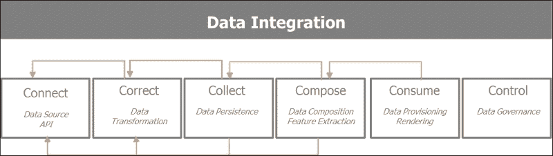

# 第一章：设置 Spark 虚拟环境

在本章中，我们将为开发目的构建一个隔离的虚拟环境。该环境将由 Spark 和 Python Anaconda 发行版提供的 PyData 库驱动。这些库包括 Pandas、Scikit-Learn、Blaze、Matplotlib、Seaborn 和 Bokeh。我们将执行以下活动：

+   使用 Anaconda Python 发行版设置开发环境。这将包括启用由 PySpark 驱动的 IPython Notebook 环境，用于我们的数据探索任务。

+   安装和启用 Spark，以及 Pandas、Scikit-Learn、Blaze、Matplotlib 和 Bokeh 等 PyData 库。

+   构建一个“单词计数”示例应用程序，以确保一切正常运行。

过去十年见证了像亚马逊、谷歌、Twitter、LinkedIn 和 Facebook 这样的数据驱动巨头的崛起和主导地位。这些公司通过播种、分享或披露他们的基础设施概念、软件实践和数据处理框架，培育了一个充满活力的开源软件社区。这已经改变了企业技术、系统和软件架构。

这包括利用虚拟化、云技术和软件定义网络的新基础设施和 DevOps（开发和运维）概念。

为了处理千兆字节的数据，Hadoop 被开发并开源，它从**Google 文件系统**（**GFS**）和相邻的分布式计算框架 MapReduce 中汲取了灵感。克服了扩展的复杂性，同时控制成本也导致了新数据存储的大量出现。最近的数据库技术示例包括列数据库 Cassandra、文档数据库 MongoDB 和图数据库 Neo4J。

由于其处理大型数据集的能力，Hadoop 已经培育出一个庞大的生态系统，可以使用 Pig、Hive、Impala 和 Tez 更迭地和交互地查询数据。Hadoop 在使用 MapReduce 时只能以批处理模式运行，因此它很繁琐。Spark 通过针对磁盘输入输出和带宽密集型 MapReduce 作业的缺点，正在为分析和数据处理领域带来革命。

Spark 是用 Scala 编写的，因此与由**Java 虚拟机**（**JVM**）驱动的生态系统本地集成。Spark 早期提供了 Python API 和绑定，通过启用 PySpark。Spark 架构和生态系统本质上是多语言的，显然有着 Java 主导系统的强大存在。

本书将专注于 PySpark 和 PyData 生态系统。Python 是学术和科学界进行数据密集处理的首选语言之一。Python 在数据处理方面发展了丰富的库和工具生态系统，包括 Pandas 和 Blaze 的数据操作、Scikit-Learn 的机器学习以及 Matplotlib、Seaborn 和 Bokeh 的数据可视化。因此，本书的目标是构建一个由 Spark 和 Python 驱动的数据密集型应用程序的端到端架构。为了将这些概念付诸实践，我们将分析 Twitter、GitHub 和 Meetup 等社交网络。我们将关注 Spark 和开源软件社区的活动和社交互动，通过 GitHub、Twitter 和 Meetup 进行调查。

构建数据密集型应用程序需要高度可扩展的基础架构、多语言存储、无缝数据集成、多范式分析处理和高效的可视化。下一段描述了我们将在整本书中采用的数据密集型应用程序架构蓝图。这是本书的骨干。我们将在更广泛的 PyData 生态系统的背景下发现 Spark。

### 提示

**下载示例代码**

您可以从您在[`www.packtpub.com`](http://www.packtpub.com)购买的所有 Packt 图书的帐户中下载示例代码文件。如果您在其他地方购买了这本书，您可以访问[`www.packtpub.com/support`](http://www.packtpub.com/support)并注册，以便文件直接通过电子邮件发送给您。

# 理解数据密集型应用程序的架构

为了理解数据密集型应用程序的架构，使用以下概念框架。架构设计在以下五个层次上：

+   基础设施层

+   持久层

+   集成层

+   分析层

+   参与层

以下屏幕截图描述了**数据密集型应用程序框架**的五个层次：


从下到上，让我们逐层介绍它们的主要目的。

## 基础设施层

基础设施层主要涉及虚拟化，可扩展性和持续集成。在实际操作和虚拟化方面，我们将通过在 VirtualBox 中构建我们自己的开发环境，并使用 Spark 和 Python 的 Anaconda 发行版来驱动虚拟机。如果我们希望从那里扩展，我们可以在云中创建类似的环境。创建一个分隔的开发环境并移动到测试和生产部署的实践可以自动化，并且可以成为由 DevOps 工具（如**Vagrant**，**Chef**，**Puppet**和**Docker**）驱动的持续集成周期的一部分。 Docker 是一个非常受欢迎的开源项目，它简化了新环境的安装和部署。本书将仅限于使用 VirtualBox 构建虚拟机。从数据密集型应用程序架构的角度来看，我们通过提及可扩展性和持续集成来描述基础设施层的基本步骤。

## 持久层

持久层根据数据需求和形状管理各种存储库。它确保设置和管理多语言数据存储。它包括关系数据库管理系统，如**MySQL**和**PostgreSQL**；键值数据存储，如**Hadoop**，**Riak**和**Redis**；列数据库，如**HBase**和**Cassandra**；文档数据库，如**MongoDB**和**Couchbase**；以及图数据库，如**Neo4j**。持久层管理 Hadoop 的 HDFS 等各种文件系统。它与从本地硬盘到 Amazon S3 的各种存储系统进行交互。它管理各种文件存储格式，如`csv`，`json`和`parquet`，这是一种面向列的格式。

## 集成层

集成层专注于数据获取、转换、质量、持久性、消费和治理。它基本上由以下五个 C 驱动：*连接*，*收集*，*校正*，*组合*和*消费*。

这五个步骤描述了数据的生命周期。它们关注如何获取感兴趣的数据集，探索它，迭代地完善和丰富收集的信息，并准备好供使用。因此，这些步骤执行以下操作：

+   **连接**：针对从各种数据源获取数据的最佳方式，这些数据源提供的 API，输入格式，如果存在的话，输入模式，数据收集速率和提供者的限制

+   **校正**：专注于转换数据以进行进一步处理，并确保所接收的数据的质量和一致性得到维护

+   **收集**：查看存储哪些数据以及以何种格式，以便在后期阶段轻松进行数据组合和使用

+   **组合**：集中关注如何混合收集的各种数据集，并丰富信息以构建引人注目的数据驱动产品

+   消费：负责数据供应和呈现，以及确保正确的数据在正确的时间到达正确的个人

+   控制：随着数据、组织和参与者的增长，迟早会需要这第六个额外步骤，它关乎确保数据治理

以下图表描述了数据获取和精炼的迭代过程，以供使用：



## 分析层

分析层是 Spark 处理数据的地方，使用各种模型、算法和机器学习管道来获取洞察力。在本书中，分析层由 Spark 提供支持。我们将在随后的章节中更深入地探讨 Spark 的优点。简而言之，它之所以如此强大，是因为它允许在单一统一平台上进行多种分析处理范式。它允许批处理、流处理和交互式分析。在具有较长延迟周期的大型数据集上进行批处理允许我们提取模式和洞察力，这些可以用于流处理模式中的实时事件。交互式和迭代式分析更适合数据探索。Spark 提供了 Python 和 R 的绑定和 API。通过其 SparkSQL 模块和 Spark Dataframe，它提供了一个非常熟悉的分析接口。

## 参与层

参与层与最终用户进行交互，并提供仪表板、交互式可视化和警报。我们将重点关注 PyData 生态系统提供的工具，如 Matplotlib、Seaborn 和 Bokeh。

# 理解 Spark

Hadoop 随着数据增长而水平扩展。Hadoop 在廉价硬件上运行，因此具有成本效益。可扩展的分布式处理框架使得机构能够在大型廉价集群上分析 PB 级数据。Hadoop 是 map-reduce 的第一个开源实现。Hadoop 依赖于称为 HDFS（Hadoop 分布式文件系统）的分布式存储框架。Hadoop 在批处理作业中运行 map-reduce 任务。Hadoop 需要在每个 map、shuffle 和 reduce 过程步骤中将数据持久化到磁盘上。这种批处理作业的开销和延迟对性能产生不利影响。

Spark 是一个快速的、分布式的大规模数据处理通用分析计算引擎。与 Hadoop 的主要突破之处在于，Spark 允许数据在处理步骤之间通过内存处理进行共享。

Spark 独特之处在于它允许四种不同的数据分析和处理样式。Spark 可用于：

+   批处理：此模式用于操作大型数据集，通常执行大型 map-reduce 作业

+   流处理：此模式用于近实时处理传入信息

+   迭代式：这种模式适用于机器学习算法，例如梯度下降，其中数据被重复访问以达到收敛

+   交互式：此模式用于数据探索，因为大量数据在内存中，并且由于 Spark 的非常快的响应时间

以下图表突出了前面四种处理样式：


Spark 有三种模式：单一模式，在单台机器上独立运行；两种分布式模式，在机器集群上运行——在 Hadoop 分布式资源管理器 Yarn 上，或者在与 Spark 同时开发的开源集群管理器 Mesos 上：


Spark 提供了 Scala、Java、Python 和 R 的多语言接口。

## Spark 库

Spark 自带一些强大的库：

+   SparkSQL：提供类似 SQL 的能力来查询结构化数据并交互式地探索大型数据集

+   SparkMLLIB：为机器学习提供主要算法和管道框架

+   **Spark Streaming**：用于对数据进行近实时分析，使用微批处理和滑动窗口处理传入的数据流

+   **Spark GraphX**：用于图处理和复杂连接实体和关系的计算

### PySpark 的实际应用

Spark 是用 Scala 编写的。整个 Spark 生态系统自然地利用了 JVM 环境，并充分利用了 HDFS。 Hadoop HDFS 是 Spark 支持的许多数据存储之一。Spark 是不可知的，并且从一开始就与多个数据源、类型和格式进行交互。

PySpark 不是 Spark 在支持 Java 的 Python 方言（如 Jython）上的抄写版本。PySpark 提供了围绕 Spark 的集成 API 绑定，并允许在集群的所有节点中完全使用 Python 生态系统，使用 pickle Python 序列化，并更重要的是，提供对 Python 的丰富生态系统的访问，如 Scikit-Learn 等机器学习库或数据处理库，如 Pandas。

当我们初始化一个 Spark 程序时，Spark 程序必须做的第一件事是创建一个`SparkContext`对象。它告诉 Spark 如何访问集群。Python 程序创建一个`PySparkContext`。Py4J 是将 Python 程序绑定到 Spark JVM `SparkContext`的网关。JVM `SparkContext`序列化应用程序代码和闭包，并将它们发送到集群进行执行。集群管理器分配资源并安排，并将闭包发送到集群中的 Spark 工作程序，根据需要激活 Python 虚拟机。在每台机器上，Spark Worker 由控制计算、存储和缓存的执行者管理。

以下是 Spark 驱动程序如何管理 PySpark 上下文和 Spark 上下文以及其与集群管理器通过本地文件系统和与 Spark 工作程序的交互的示例：


### 弹性分布式数据集

Spark 应用程序由驱动程序组成，驱动程序运行用户的主要函数，在集群上创建分布式数据集，并对这些数据集执行各种并行操作（转换和操作）。

Spark 应用程序作为一组独立的进程运行，由驱动程序中的`SparkContext`协调。

`SparkContext`将从**集群管理器**分配系统资源（机器、内存、CPU）。

`SparkContext`管理执行者，执行者管理集群中的工作节点。驱动程序具有需要运行的 Spark 作业。作业被拆分为任务，提交给执行者完成。执行者负责在每台机器上进行计算、存储和缓存。

Spark 中的关键构建块是**RDD**（**弹性分布式数据集**）。数据集是元素的集合。分布式意味着数据集可以在集群中的任何节点上。弹性意味着数据集可能会丢失或部分丢失，而不会对正在进行的计算造成重大伤害，因为 Spark 将从内存中的数据血统重新计算，也称为操作的**DAG**（**有向无环图**）。基本上，Spark 将在缓存中快照 RDD 的状态。如果在操作过程中其中一台计算机崩溃，Spark 将从缓存的 RDD 和操作的 DAG 重新构建 RDD。RDD 可以从节点故障中恢复。

RDD 上有两种操作类型：

+   **转换**：转换获取现有的 RDD，并导致新转换的 RDD 的指针。RDD 是不可变的。一旦创建，就无法更改。每个转换都会创建一个新的 RDD。转换是惰性评估的。转换只有在发生操作时才会执行。在失败的情况下，转换的数据血统会重建 RDD。

+   **操作**：对 RDD 的操作会触发一个 Spark 作业并产生一个值。操作操作会导致 Spark 执行（懒惰的）转换操作，这些操作是计算由操作返回的 RDD 所需的。操作会导致一系列操作的 DAG。DAG 被编译成阶段，每个阶段都作为一系列任务执行。任务是工作的基本单位。

以下是关于 RDD 的一些有用信息：

+   RDD 是从数据源（如 HDFS 文件或数据库查询）创建的。有三种方法可以创建 RDD：

+   从数据存储中读取

+   转换现有的 RDD

+   使用内存集合

+   RDD 可以通过`map`或`filter`等函数进行转换，产生新的 RDD。

+   对 RDD 进行的操作，比如 first、take、collect 或 count，会将结果传递到 Spark 驱动程序。Spark 驱动程序是用户与 Spark 集群交互的客户端。

以下图示了 RDD 的转换和操作：


# 了解 Anaconda

Anaconda 是一个广泛使用的免费 Python 发行版，由**Continuum**维护（[`www.continuum.io/`](https://www.continuum.io/)）。我们将使用 Anaconda 提供的主流软件堆栈来生成我们的应用程序。在本书中，我们将使用 PySpark 和 PyData 生态系统。PyData 生态系统由**Continuum**推广、支持和维护，并由**Anaconda** Python 发行版提供支持。Anaconda Python 发行版在安装 Python 环境方面节省了时间和烦恼；我们将与 Spark 一起使用它。Anaconda 有自己的软件包管理，补充了传统的`pip` `install`和`easy-install`。Anaconda 自带了一些最重要的软件包，比如 Pandas、Scikit-Learn、Blaze、Matplotlib 和 Bokeh。对已安装库的升级只需在控制台上输入一个简单的命令：

```py
$ conda update

```

可以使用以下命令获取我们环境中安装的库的列表：

```py
$ conda list

```

堆栈的关键组件如下：

+   **Anaconda**：这是一个免费的 Python 发行版，几乎包含了 200 个用于科学、数学、工程和数据分析的 Python 软件包。

+   **Conda**：这是一个软件包管理器，负责安装复杂软件堆栈的所有依赖项。它不仅限于 Python，还管理 R 和其他语言的安装过程。

+   **Numba**：它提供了在 Python 中加速代码的能力，具有高性能函数和即时编译。

+   **Blaze**：它通过提供统一和可适应的接口来访问各种数据提供程序（包括流式 Python、Pandas、SQLAlchemy 和 Spark），实现了大规模数据分析。

+   **Bokeh**：它为大型和流式数据集提供交互式数据可视化。

+   **Wakari**：这允许我们在托管环境中共享和部署 IPython Notebooks 和其他应用程序。

下图显示了 Anaconda 堆栈的组件：


# 建立由 Spark 驱动的环境

在本节中，我们将学习如何设置 Spark：

+   在运行 Ubuntu 14.04 的虚拟机中创建一个独立的开发环境，以便不会干扰任何现有系统。

+   安装 Spark 1.3.0 及其依赖项，即。

+   安装 Anaconda Python 2.7 环境以及所有必需的库，比如 Pandas、Scikit-Learn、Blaze 和 Bokeh，并启用 PySpark，以便可以通过 IPython Notebooks 访问。

+   设置我们环境的后端或数据存储。我们将使用 MySQL 作为关系数据库，MongoDB 作为文档存储，Cassandra 作为列式数据库。

每个存储后端根据要处理的数据的性质提供特定的用途。MySQL RDBMs 用于可以使用 SQL 轻松查询的标准表格处理信息。由于我们将从各种 API 处理大量 JSON 类型数据，因此将它们存储在文档中是最简单的方式。对于实时和时间序列相关信息，Cassandra 最适合作为列式数据库。

以下图表显示了我们将在整本书中构建和使用的环境：


## 在 Ubuntu 上设置 Oracle VirtualBox

在 Ubuntu 14.04 上设置一个干净的新 VirtualBox 环境是创建一个开发环境的最安全方式，它不会与现有的库发生冲突，并且可以在云中使用类似的命令列表进行复制。

为了建立一个带有 Anaconda 和 Spark 的环境，我们将创建一个运行 Ubuntu 14.04 的 VirtualBox 虚拟机。

让我们来看看在 Ubuntu 上使用 VirtualBox 的步骤：

1.  Oracle VirtualBox VM 是免费的，可以从[`www.virtualbox.org/wiki/Downloads`](https://www.virtualbox.org/wiki/Downloads)下载。安装非常简单。

1.  安装 VirtualBox 后，让我们打开 Oracle VM VirtualBox Manager 并单击**新建**按钮。

1.  我们将为新的虚拟机命名，并选择类型**Linux**和版本**Ubuntu（64 位）**。

1.  您需要从 Ubuntu 网站下载 ISO 并分配足够的 RAM（建议 4GB）和磁盘空间（建议 20GB）。我们将使用 Ubuntu 14.04.1 LTS 版本，可以在这里找到：[`www.ubuntu.com/download/desktop`](http://www.ubuntu.com/download/desktop)。

1.  安装完成后，建议通过转到（从新的虚拟机运行的 VirtualBox 菜单）**设备** | **插入增强功能光盘映像**来安装 VirtualBox 增强功能。在 Windows 主机中未提供增强功能会导致用户界面非常有限，窗口大小减小。

1.  安装完成后，重新启动虚拟机，它将准备好使用。通过选择虚拟机并单击**设置**，然后转到**常规** | **高级** | **共享剪贴板**并单击**双向**，可以启用共享剪贴板。

## 安装带有 Python 2.7 的 Anaconda

PySpark 目前仅在 Python 2.7 上运行。（社区要求升级到 Python 3.3。）要安装 Anaconda，请按照以下步骤进行：

1.  从[`continuum.io/downloads#all`](http://continuum.io/downloads#all)下载 Linux 64 位 Python 2.7 的 Anaconda 安装程序。

1.  下载 Anaconda 安装程序后，打开终端并导航到安装程序保存的目录或文件夹。然后运行以下命令，将命令中的`2.x.x`替换为下载安装程序文件的版本号：

```py
# install anaconda 2.x.x
bash Anaconda-2.x.x-Linux-x86[_64].sh

```

1.  接受许可条款后，您将被要求指定安装位置（默认为~/anaconda）。

1.  自解压完成后，您应该将 anaconda 二进制目录添加到您的 PATH 环境变量中：

```py
# add anaconda to PATH
bash Anaconda-2.x.x-Linux-x86[_64].sh

```

## 安装 Java 8

Spark 在 JVM 上运行，并且需要 Java **SDK**（软件开发工具包）而不是**JRE**（Java 运行环境），因为我们将使用 Spark 构建应用程序。推荐的版本是 Java 版本 7 或更高版本。Java 8 是最合适的，因为它包括许多 Scala 和 Python 可用的函数式编程技术。

要安装 Java 8，请按照以下步骤进行：

1.  使用以下命令安装 Oracle Java 8：

```py
# install oracle java 8
$ sudo apt-get install software-properties-common
$ sudo add-apt-repository ppa:webupd8team/java
$ sudo apt-get update
$ sudo apt-get install oracle-java8-installer

```

1.  设置`JAVA_HOME`环境变量，并确保 Java 程序在您的 PATH 上。

1.  检查`JAVA_HOME`是否正确安装：

```py
# 
$ echo JAVA_HOME

```

## 安装 Spark

转到 Spark 下载页面[`spark.apache.org/downloads.html`](http://spark.apache.org/downloads.html)。

Spark 下载页面提供了下载早期版本的 Spark 和不同的软件包和下载类型的可能性。我们将选择最新版本，为 Hadoop 2.6 及更高版本预构建。安装 Spark 的最简单方法是使用为 Hadoop 2.6 及更高版本预构建的 Spark 软件包，而不是从源代码构建。将文件移动到根目录下的`~/spark`目录中。

下载最新版本的 Spark—2015 年 11 月 9 日发布的 Spark 1.5.2：

1.  选择 Spark 版本**1.5.2（2015 年 11 月 9 日发布）**，

1.  选择软件包类型**为 Hadoop 2.6 及更高版本预构建**，

1.  选择下载类型**直接下载**，

1.  下载 Spark：**spark-1.5.2-bin-hadoop2.6.tgz**，

1.  使用 1.3.0 签名和校验和验证此版本，

这也可以通过运行以下命令来完成：

```py
# download spark
$ wget http://d3kbcqa49mib13.cloudfront.net/spark-1.5.2-bin-hadoop2.6.tgz

```

接下来，我们将提取文件并清理：

```py
# extract, clean up, move the unzipped files under the spark directory
$ tar -xf spark-1.5.2-bin-hadoop2.6.tgz
$ rm spark-1.5.2-bin-hadoop2.6.tgz
$ sudo mv spark-* spark

```

现在，我们可以运行 Spark Python 解释器：

```py
# run spark
$ cd ~/spark
./bin/pyspark

```

您应该看到类似于这样的东西：

```py
Welcome to
 ____              __
 / __/__  ___ _____/ /__
 _\ \/ _ \/ _ `/ __/  '_/
 /__ / .__/\_,_/_/ /_/\_\   version 1.5.2
 /_/
Using Python version 2.7.6 (default, Mar 22 2014 22:59:56)
SparkContext available as sc.
>>> 

```

解释器将已经为我们提供了一个 Spark 上下文对象`sc`，我们可以通过运行来查看：

```py
>>> print(sc)
<pyspark.context.SparkContext object at 0x7f34b61c4e50>

```

## 启用 IPython 笔记本

我们将使用 IPython Notebook 以获得比控制台更友好的用户体验。

您可以使用以下命令启动 IPython Notebook：

```py
$ IPYTHON_OPTS="notebook --pylab inline"  ./bin/pyspark

```

在存储 Jupyter 或 IPython 笔记本的`examples/AN_Spark`目录中使用`IPYNB`启动 PySpark：

```py
# cd to  /home/an/spark/spark-1.5.0-bin-hadoop2.6/examples/AN_Spark
# launch command using python 2.7 and the spark-csv package:
$ IPYTHON_OPTS='notebook' /home/an/spark/spark-1.5.0-bin-hadoop2.6/bin/pyspark --packages com.databricks:spark-csv_2.11:1.2.0

# launch command using python 3.4 and the spark-csv package:
$ IPYTHON_OPTS='notebook' PYSPARK_PYTHON=python3
 /home/an/spark/spark-1.5.0-bin-hadoop2.6/bin/pyspark --packages com.databricks:spark-csv_2.11:1.2.0

```

# 使用 PySpark 构建我们的第一个应用程序

我们现在准备检查一切是否正常工作。在处理本书第一章的单词计数时，将对其进行测试。

我们将要运行的代码在这里列出：

```py
# Word count on 1st Chapter of the Book using PySpark

# import regex module
import re
# import add from operator module
from operator import add

# read input file
file_in = sc.textFile('/home/an/Documents/A00_Documents/Spark4Py 20150315')

# count lines
print('number of lines in file: %s' % file_in.count())

# add up lengths of each line
chars = file_in.map(lambda s: len(s)).reduce(add)
print('number of characters in file: %s' % chars)

# Get words from the input file
words =file_in.flatMap(lambda line: re.split('\W+', line.lower().strip()))
# words of more than 3 characters
words = words.filter(lambda x: len(x) > 3)
# set count 1 per word
words = words.map(lambda w: (w,1))
# reduce phase - sum count all the words
words = words.reduceByKey(add)
```

在此程序中，我们首先从目录`/home/an/Documents/A00_Documents/Spark4Py 20150315`中读取文件到`file_in`中。

然后通过计算每行的行数和每行的字符数来审查文件。

我们将输入文件拆分为单词并将它们转换为小写。为了避免较短和更频繁的单词（如*the*、*and*、*for*）对计数产生偏向，我们选择长度超过三个字符的单词进行单词计数。通常，它们被认为是停用词，并且应该在任何语言处理任务中被过滤掉。

在这个阶段，我们准备进行 MapReduce 步骤。对于每个单词，我们将映射一个值`1`并通过对所有唯一单词求和来减少它。

以下是 IPython Notebook 中代码的示例。前 10 个单元格是对数据集上的单词计数进行预处理，该数据集是从本地文件目录中检索的。


交换元组中的单词计数格式`(count, word)`，以便按`count`排序，这现在是元组的主键：

```py
# create tuple (count, word) and sort in descending
words = words.map(lambda x: (x[1], x[0])).sortByKey(False)

# take top 20 words by frequency
words.take(20)
```

为了显示我们的结果，我们创建元组`(count, word)`并按降序显示前 20 个最常用的单词：


让我们创建一个直方图函数：

```py
# create function for histogram of most frequent words

% matplotlib inline
import matplotlib.pyplot as plt
#

def histogram(words):
    count = map(lambda x: x[1], words)
    word = map(lambda x: x[0], words)
    plt.barh(range(len(count)), count,color = 'grey')
    plt.yticks(range(len(count)), word)

# Change order of tuple (word, count) from (count, word) 
words = words.map(lambda x:(x[1], x[0]))
words.take(25)

# display histogram
histogram(words.take(25))
```

在这里，我们通过在条形图中绘制它们来可视化最常用的单词。我们首先将元组从原始的`(count, word)`交换为`(word, count)`：


因此，您现在拥有的是：第一章中最常用的单词是**Spark**，其次是**Data**和**Anaconda**。

# 使用 Vagrant 虚拟化环境

为了创建一个可以轻松共享和克隆的便携式 Python 和 Spark 环境，可以使用`vagrantfile`构建开发环境。

我们将指向由*伯克利大学和 Databricks*提供的**大规模在线开放课程**（**MOOCs**）：

+   *Anthony D. Joseph 教授的 Apache Spark 大数据介绍*可在[`www.edx.org/course/introduction-big-data-apache-spark-uc-berkeleyx-cs100-1x`](https://www.edx.org/course/introduction-big-data-apache-spark-uc-berkeleyx-cs100-1x)找到

+   *可扩展机器学习，教授* *Ameet Talwalkar* 可以在[`www.edx.org/course/scalable-machine-learning-uc-berkeleyx-cs190-1x`](https://www.edx.org/course/scalable-machine-learning-uc-berkeleyx-cs190-1x)找到

课程实验室是在由 PySpark 提供动力的 IPython 笔记本上执行的。它们可以在以下 GitHub 存储库中找到：[`github.com/spark-mooc/mooc-setup/`](https://github.com/spark-mooc/mooc-setup/)。

一旦在您的机器上设置了 Vagrant，请按照以下说明开始：[`docs.vagrantup.com/v2/getting-started/index.html`](https://docs.vagrantup.com/v2/getting-started/index.html)。

在您的工作目录中克隆`spark-mooc/mooc-setup/ github`存储库，并在克隆的目录中启动命令`$ vagrant up`：

请注意，由于`vagrantfile`可能不是最新的，Spark 的版本可能已过时。

您将看到类似于这样的输出：

```py
C:\Programs\spark\edx1001\mooc-setup-master>vagrant up
Bringing machine 'sparkvm' up with 'virtualbox' provider...
==> sparkvm: Checking if box 'sparkmooc/base' is up to date...
==> sparkvm: Clearing any previously set forwarded ports...
==> sparkvm: Clearing any previously set network interfaces...
==> sparkvm: Preparing network interfaces based on configuration...
 sparkvm: Adapter 1: nat
==> sparkvm: Forwarding ports...
 sparkvm: 8001 => 8001 (adapter 1)
 sparkvm: 4040 => 4040 (adapter 1)
 sparkvm: 22 => 2222 (adapter 1)
==> sparkvm: Booting VM...
==> sparkvm: Waiting for machine to boot. This may take a few minutes...
 sparkvm: SSH address: 127.0.0.1:2222
 sparkvm: SSH username: vagrant
 sparkvm: SSH auth method: private key
 sparkvm: Warning: Connection timeout. Retrying...
 sparkvm: Warning: Remote connection disconnect. Retrying...
==> sparkvm: Machine booted and ready!
==> sparkvm: Checking for guest additions in VM...
==> sparkvm: Setting hostname...
==> sparkvm: Mounting shared folders...
 sparkvm: /vagrant => C:/Programs/spark/edx1001/mooc-setup-master
==> sparkvm: Machine already provisioned. Run `vagrant provision` or use the `--provision`
==> sparkvm: to force provisioning. Provisioners marked to run always will still run.

C:\Programs\spark\edx1001\mooc-setup-master>

```

这将在`localhost:8001`上启动由 PySpark 提供动力的 IPython 笔记本：


# 转移到云端

由于我们正在处理分布式系统，运行在单个笔记本电脑上的虚拟机上的环境对于探索和学习是有限的。我们可以转移到云端，以体验 Spark 分布式框架的强大和可扩展性。

## 在 Amazon Web Services 中部署应用程序

一旦我们准备好扩展我们的应用程序，我们可以将开发环境迁移到**Amazon** **Web Services** (**AWS**)。

如何在 EC2 上运行 Spark 在以下页面中清楚地描述：[`spark.apache.org/docs/latest/ec2-scripts.html`](https://spark.apache.org/docs/latest/ec2-scripts.html)。

我们强调在设置 AWS Spark 环境时的五个关键步骤：

1.  通过 AWS 控制台创建 AWS EC2 密钥对[`aws.amazon.com/console/`](http://aws.amazon.com/console/)。

1.  将您的密钥对导出到您的环境中：

```py
export AWS_ACCESS_KEY_ID=accesskeyid
export AWS_SECRET_ACCESS_KEY=secretaccesskey

```

1.  启动您的集群：

```py
~$ cd $SPARK_HOME/ec2
ec2$ ./spark-ec2 -k <keypair> -i <key-file> -s <num-slaves> launch <cluster-name>

```

1.  SSH 进入集群运行 Spark 作业：

```py
ec2$ ./spark-ec2 -k <keypair> -i <key-file> login <cluster-name>

```

1.  在使用后销毁您的集群：

```py
ec2$ ./spark-ec2 destroy <cluster-name>

```

## 使用 Docker 虚拟化环境

为了创建一个可以轻松共享和克隆的便携式 Python 和 Spark 环境，开发环境可以在 Docker 容器中构建。

我们希望利用 Docker 的两个主要功能：

+   创建可以轻松部署在不同操作系统或云中的隔离容器。

+   使用 DockerHub 允许轻松共享开发环境镜像及其所有依赖项。DockerHub 类似于 GitHub。它允许轻松克隆和版本控制。配置环境的快照图像可以作为进一步增强的基线。

以下图表说明了一个具有 Spark、Anaconda 和数据库服务器及其各自数据卷的 Docker 启用环境。


Docker 提供了从 Dockerfile 克隆和部署环境的能力。

您可以在以下地址找到一个带有 PySpark 和 Anaconda 设置的示例 Dockerfile：[`hub.docker.com/r/thisgokeboysef/pyspark-docker/~/dockerfile/`](https://hub.docker.com/r/thisgokeboysef/pyspark-docker/~/dockerfile/)。

按照以下链接提供的说明安装 Docker：

+   [`docs.docker.com/mac/started/`](http://docs.docker.com/mac/started/) 如果您使用的是 Mac OS X

+   [`docs.docker.com/linux/started/`](http://docs.docker.com/linux/started/) 如果你在 Linux 上

+   [`docs.docker.com/windows/started/`](http://docs.docker.com/windows/started/) 如果您使用的是 Windows

使用以下命令安装提供的 Dockerfile 的 docker 容器：

```py
$ docker pull thisgokeboysef/pyspark-docker

```

关于如何*dockerize*您的环境的其他重要信息源可以在 Lab41 中找到。GitHub 存储库包含必要的代码：

[`github.com/Lab41/ipython-spark-docker`](https://github.com/Lab41/ipython-spark-docker)

支持的博客文章中包含了构建 docker 环境所涉及的思维过程丰富的信息：[`lab41.github.io/blog/2015/04/13/ipython-on-spark-on-docker/`](http://lab41.github.io/blog/2015/04/13/ipython-on-spark-on-docker/)。

# 摘要

我们通过描述围绕基础设施、持久性、集成、分析和参与层的整体架构来设定构建数据密集型应用的背景。我们还讨论了 Spark 和 Anaconda 以及它们各自的构建模块。我们在 VirtualBox 中使用 Anaconda 和 Spark 设置了一个环境，并演示了使用第一章的文本内容作为输入的词频统计应用程序。

在下一章中，我们将更深入地探讨数据密集型应用的架构蓝图，并利用 Twitter、GitHub 和 Meetup 的 API 来感受我们将使用 Spark 进行挖掘的数据。
