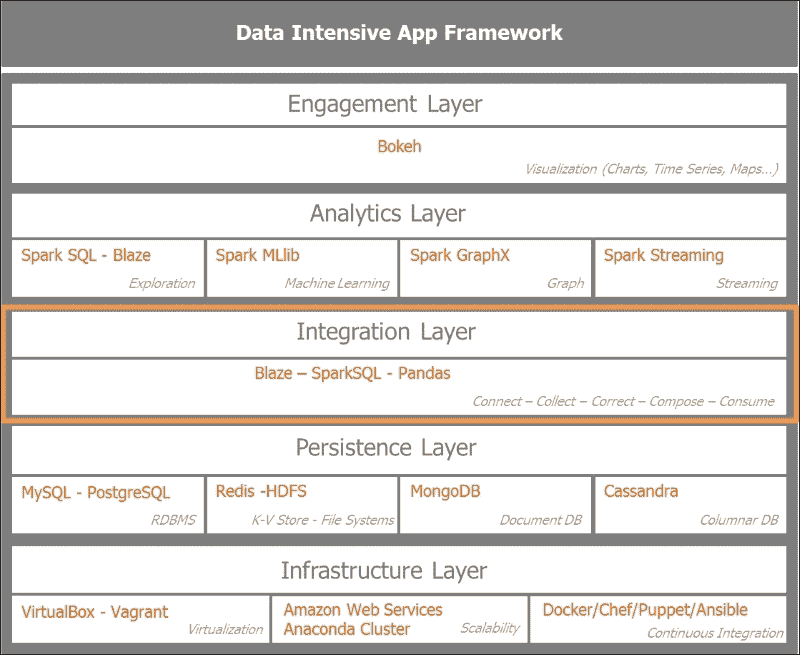
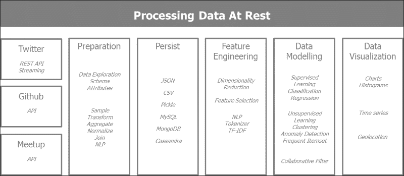
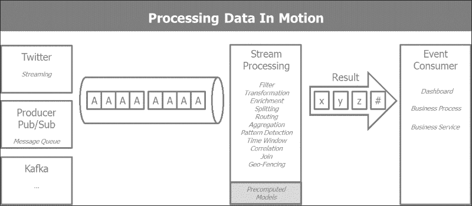
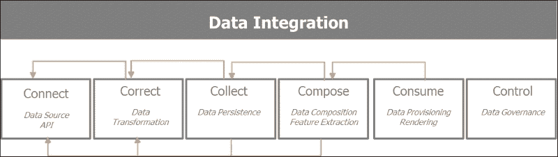
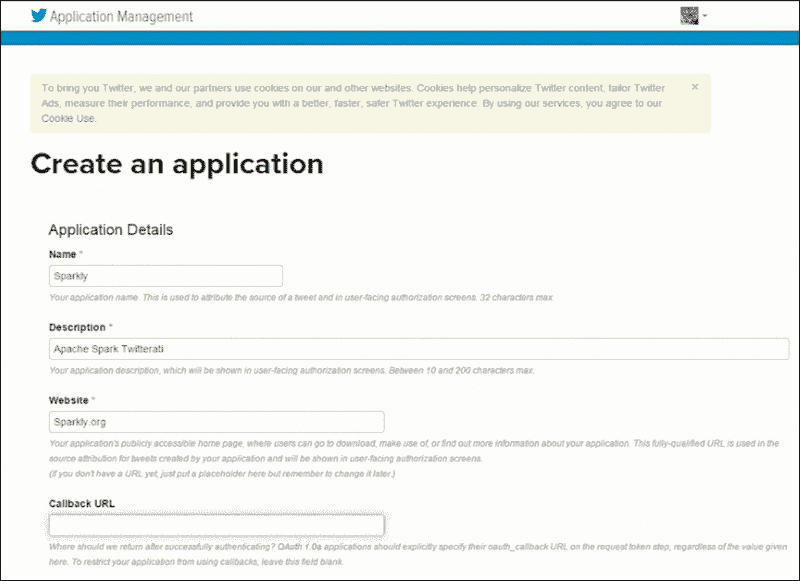
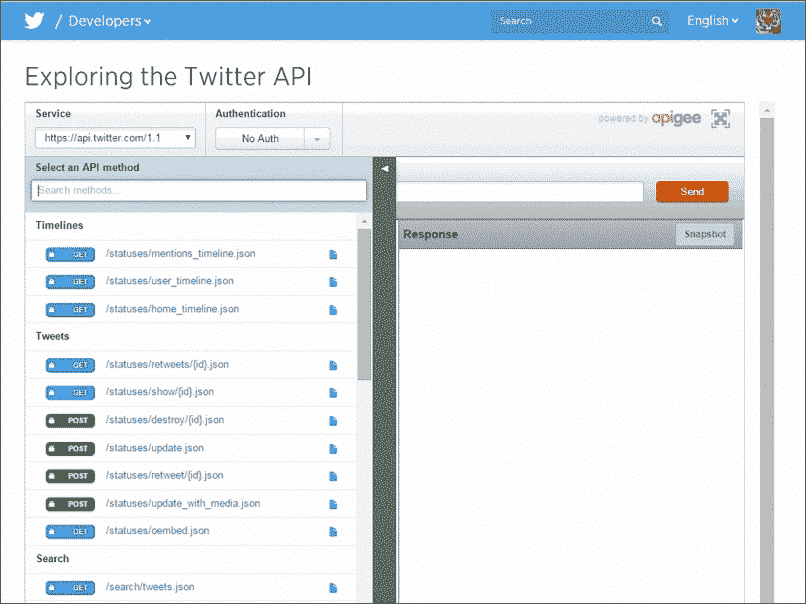
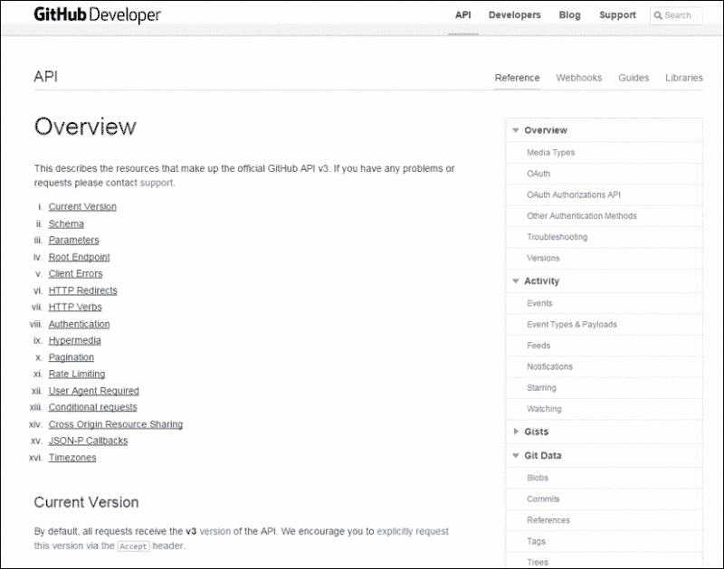
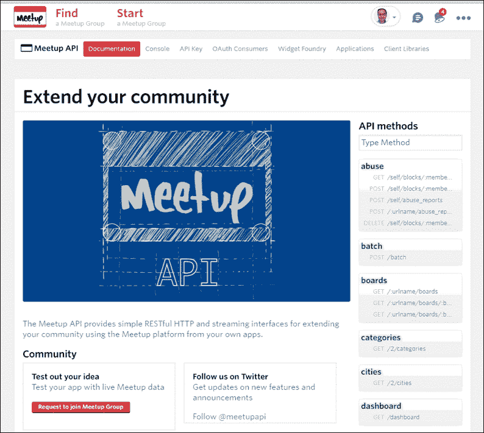
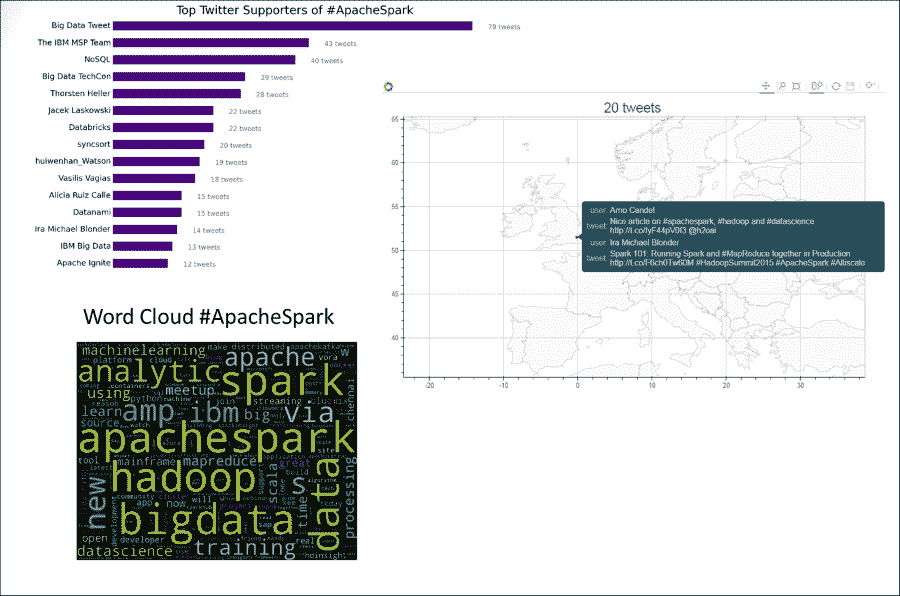

# 第二章：使用 Spark 构建批处理和流处理应用

本书的目标是通过构建一个应用程序来分析社交网络上 Spark 社区的互动，教会你关于 PySpark 和 PyData 库。我们将从 GitHub 收集有关 Apache Spark 的信息，在 Twitter 上检查相关的推文，并通过 Meetup 感受 Spark 在更广泛的开源软件社区中的热度。

在本章中，我们将概述各种数据和信息来源。我们将了解它们的结构。我们将概述从收集到批处理和流处理的数据处理流程。

在这一部分，我们将涵盖以下要点：

+   从收集到批处理和流处理的数据处理流程，有效地描述我们计划构建的应用程序的架构。

+   查看各种数据来源（GitHub、Twitter 和 Meetup）、它们的数据结构（JSON、结构化信息、非结构化文本、地理位置、时间序列数据等）以及它们的复杂性。我们还讨论了连接三种不同 API 的工具，这样你就可以构建自己的数据混搭。本书将在接下来的章节中重点关注 Twitter。

# 架构数据密集型应用

我们在上一章中定义了数据密集型应用框架架构蓝图。让我们重新将我们原始框架中将在整本书中使用的各种软件组件放回到上下文中。以下是数据密集型架构框架中映射的各种软件组件的示意图：



Spark 是一个非常高效的分布式计算框架。为了充分利用其功能，我们需要相应地设计我们的解决方案。出于性能原因，整体解决方案还需要考虑其在 CPU、存储和网络方面的使用情况。

这些要求驱动我们解决方案的架构：

+   **延迟**：这种架构结合了慢速和快速处理。慢速处理是在批处理模式下对历史数据进行处理。这也被称为静态数据。这个阶段构建了将由快速处理部分在实时连续数据输入系统后使用的预先计算的模型和数据模式。数据的快速处理或实时分析是指处理运动中的数据。静态数据实际上是以批处理模式处理数据，具有较长的延迟。运动中的数据是指实时摄取的数据的流式计算。

+   **可扩展性**：Spark 通过其分布式内存计算框架本身具有线性可扩展性。与 Spark 交互的数据库和数据存储也需要能够随着数据量的增长而线性扩展。

+   **容错性**：当由于硬件、软件或网络原因发生故障时，架构应具有足够的弹性，并始终提供可用性。

+   **灵活性**：在这种架构中建立的数据流程可以根据用例迅速进行调整和改装。

Spark 独特之处在于它允许在同一统一平台上进行批处理和流式分析。

我们将考虑两种数据处理流程：

+   第一个处理静态数据，并专注于构建批量分析数据的流程。

+   第二个流程是处理运动中的数据，目标是实时数据摄取和基于预先计算的模型和数据模式提供洞察力

## 处理静态数据

让我们了解一下静态数据或批处理流程。这个流程的目标是从 Twitter、GitHub 和 Meetup 中摄取各种数据集；为 Spark MLlib 准备数据，这是机器学习引擎；并推导出将在批处理模式或实时模式下应用的基本模型。

以下图表说明了数据流程，以便处理静态数据：



## 处理运动中的数据

处理运动数据引入了新的复杂性，因为我们引入了新的失败可能性。如果我们想要扩展，我们需要考虑引入分布式消息队列系统，如 Kafka。我们将专门讨论理解流式分析的后续章节。

以下图表描述了用于处理运动数据的数据管道：



## 交互式地探索数据

构建数据密集型应用程序并不像将数据库暴露给 Web 界面那样简单。在静态数据和运动数据处理的设置过程中，我们将利用 Spark 分析数据的能力，以交互方式分析和细化所需的机器学习和流处理活动所需的数据丰富性和质量。在这里，我们将进行数据收集、细化和调查的迭代循环，以获取我们应用程序感兴趣的数据集。

# 连接到社交网络

让我们深入探讨数据密集型应用程序架构集成层的第一步。我们将专注于收集数据，确保其完整性，并为 Spark 在下一阶段的批处理和流处理数据做准备。这个阶段描述了五个处理步骤：*连接*，*校正*，*收集*，*组合*和*消费*。这些是数据探索的迭代步骤，将使我们熟悉数据，并帮助我们为进一步处理调整数据结构。

以下图表描述了用于消费的数据采集和细化的迭代过程：



我们连接到感兴趣的社交网络：Twitter、GitHub 和 Meetup。我们将讨论如何访问**APIs**（应用程序编程接口）的方式，以及如何与这些服务创建 RESTful 连接，同时尊重社交网络施加的速率限制。**REST**（表示状态转移）是互联网上最广泛采用的架构风格，以实现可扩展的 Web 服务。它依赖于主要以**JSON**（JavaScript 对象表示）交换消息。RESTful APIs 和 Web 服务实现了四种最常见的动词`GET`，`PUT`，`POST`和`DELETE`。`GET`用于从给定的`URI`检索元素或集合。`PUT`使用新的集合更新一个集合。`POST`允许创建新条目，而`DELETE`则删除一个集合。

## 获取 Twitter 数据

Twitter 允许注册用户访问其搜索和流式推文服务，使用名为 OAuth 的授权协议，允许 API 应用程序安全地代表用户进行操作。为了创建连接，第一步是在 Twitter 上创建一个应用程序，网址为[`apps.twitter.com/app/new`](https://apps.twitter.com/app/new)。



应用程序创建后，Twitter 将发出四个代码，允许其接入 Twitter 的数据流：

```py
CONSUMER_KEY = 'GetYourKey@Twitter'
CONSUMER_SECRET = ' GetYourKey@Twitter'
OAUTH_TOKEN = ' GetYourToken@Twitter'
OAUTH_TOKEN_SECRET = ' GetYourToken@Twitter'
```

如果您想了解提供的各种 RESTful 查询，可以在开发控制台上探索 Twitter API，网址为[`dev.twitter.com/rest/tools/console`](https://dev.twitter.com/rest/tools/console)：



我们将使用以下代码在 Twitter 上进行程序化连接，这将激活我们的 OAuth 访问，并允许我们在速率限制下接入 Twitter API。在流模式下，限制是针对 GET 请求的。

## 获取 GitHub 数据

GitHub 使用类似的身份验证流程来 Twitter。前往开发者网站，在[`developer.github.com/v3/`](https://developer.github.com/v3/)上注册 GitHub 后，检索您的凭据：



## 获取 Meetup 数据

可以使用在 Meetup.com 成员的开发资源中发行的令牌来访问 Meetup。可以在他们的开发者网站上获取 Meetup API 访问所需的令牌或 OAuth 凭据：[`secure.meetup.com/meetup_api`](https://secure.meetup.com/meetup_api)。



# 分析数据

让我们首先感受一下从每个社交网络中提取的数据，并了解来自这些来源的数据结构。

## 发现推文的结构

在本节中，我们将建立与 Twitter API 的连接。Twitter 提供两种连接模式：REST API，允许我们搜索给定搜索词或标签的历史推文，以及流 API，它在限制速率下提供实时推文。

为了更好地了解如何操作 Twitter API，我们将按照以下步骤进行：

1.  安装 Twitter Python 库。

1.  通过 OAuth 以编程方式建立连接，这是 Twitter 所需的身份验证。

1.  搜索查询*Apache Spark*的最新推文并探索所获得的结果。

1.  决定感兴趣的关键属性，并从 JSON 输出中检索信息。

让我们一步一步地进行这个过程：

1.  安装 Python Twitter 库。为了安装它，您需要从命令行中编写`pip install twitter`：

```py
$ pip install twitter

```

1.  创建 Python Twitter API 类及其用于身份验证、搜索和解析结果的基本方法。`self.auth`从 Twitter 获取凭据。然后创建一个注册的 API 作为`self.api`。我们实现了两种方法：第一种是使用给定的查询搜索 Twitter，第二种是解析输出以检索相关信息，如推文 ID、推文文本和推文作者。代码如下：

```py
import twitter
import urlparse
from pprint import pprint as pp

class TwitterAPI(object):
    """
    TwitterAPI class allows the Connection to Twitter via OAuth
    once you have registered with Twitter and receive the 
    necessary credentiials 
    """

# initialize and get the twitter credentials
     def __init__(self): 
        consumer_key = 'Provide your credentials'
        consumer_secret = 'Provide your credentials'
        access_token = 'Provide your credentials'
        access_secret = 'Provide your credentials'

        self.consumer_key = consumer_key
        self.consumer_secret = consumer_secret
        self.access_token = access_token
        self.access_secret = access_secret

#
# authenticate credentials with Twitter using OAuth
        self.auth = twitter.oauth.OAuth(access_token, access_secret, consumer_key, consumer_secret)
    # creates registered Twitter API
        self.api = twitter.Twitter(auth=self.auth)
#
# search Twitter with query q (i.e. "ApacheSpark") and max. result
    def searchTwitter(self, q, max_res=10,**kwargs):
        search_results = self.api.search.tweets(q=q, count=10, **kwargs)
        statuses = search_results['statuses']
        max_results = min(1000, max_res)

        for _ in range(10): 
            try:
                next_results = search_results['search_metadata']['next_results']
            except KeyError as e: 
                break

            next_results = urlparse.parse_qsl(next_results[1:])
            kwargs = dict(next_results)
            search_results = self.api.search.tweets(**kwargs)
            statuses += search_results['statuses']

            if len(statuses) > max_results: 
                break
        return statuses
#
# parse tweets as it is collected to extract id, creation 
# date, user id, tweet text
    def parseTweets(self, statuses):
        return [ (status['id'], 
                  status['created_at'], 
                  status['user']['id'],
                  status['user']['name'], 
                  status['text'], url['expanded_url']) 
                        for status in statuses 
                            for url in status['entities']['urls'] ]
```

1.  用所需的身份验证实例化类：

```py
t= TwitterAPI()
```

1.  在查询词*Apache Spark*上运行搜索：

```py
q="ApacheSpark"
tsearch = t.searchTwitter(q)
```

1.  分析 JSON 输出：

```py
pp(tsearch[1])

{u'contributors': None,
 u'coordinates': None,
 u'created_at': u'Sat Apr 25 14:50:57 +0000 2015',
 u'entities': {u'hashtags': [{u'indices': [74, 86], u'text': u'sparksummit'}],
               u'media': [{u'display_url': u'pic.twitter.com/WKUMRXxIWZ',
                           u'expanded_url': u'http://twitter.com/bigdata/status/591976255831969792/photo/1',
                           u'id': 591976255156715520,
                           u'id_str': u'591976255156715520',
                           u'indices': [143, 144],
                           u'media_url': 
...(snip)... 
 u'text': u'RT @bigdata: Enjoyed catching up with @ApacheSpark users &amp; leaders at #sparksummit NYC: video clips are out http://t.co/qrqpP6cG9s http://t\u2026',
 u'truncated': False,
 u'user': {u'contributors_enabled': False,
           u'created_at': u'Sat Apr 04 14:44:31 +0000 2015',
           u'default_profile': True,
           u'default_profile_image': True,
           u'description': u'',
           u'entities': {u'description': {u'urls': []}},
           u'favourites_count': 0,
           u'follow_request_sent': False,
           u'followers_count': 586,
           u'following': False,
           u'friends_count': 2,
           u'geo_enabled': False,
           u'id': 3139047660,
           u'id_str': u'3139047660',
           u'is_translation_enabled': False,
           u'is_translator': False,
           u'lang': u'zh-cn',
           u'listed_count': 749,
           u'location': u'',
           u'name': u'Mega Data Mama',
           u'notifications': False,
           u'profile_background_color': u'C0DEED',
           u'profile_background_image_url': u'http://abs.twimg.com/images/themes/theme1/bg.png',
           u'profile_background_image_url_https': u'https://abs.twimg.com/images/themes/theme1/bg.png',
           ...(snip)... 
           u'screen_name': u'MegaDataMama',
           u'statuses_count': 26673,
           u'time_zone': None,
           u'url': None,
           u'utc_offset': None,
           u'verified': False}}
```

1.  解析 Twitter 输出以检索感兴趣的关键信息：

```py
tparsed = t.parseTweets(tsearch)
pp(tparsed)

[(591980327784046592,
  u'Sat Apr 25 15:01:23 +0000 2015',
  63407360,
  u'Jos\xe9 Carlos Baquero',
  u'Big Data systems are making a difference in the fight against cancer. #BigData #ApacheSpark http://t.co/pnOLmsKdL9',
  u'http://tmblr.co/ZqTggs1jHytN0'),
 (591977704464875520,
  u'Sat Apr 25 14:50:57 +0000 2015',
  3139047660,
  u'Mega Data Mama',
  u'RT @bigdata: Enjoyed catching up with @ApacheSpark users &amp; leaders at #sparksummit NYC: video clips are out http://t.co/qrqpP6cG9s http://t\u2026',
  u'http://goo.gl/eF5xwK'),
 (591977172589539328,
  u'Sat Apr 25 14:48:51 +0000 2015',
  2997608763,
  u'Emma Clark',
  u'RT @bigdata: Enjoyed catching up with @ApacheSpark users &amp; leaders at #sparksummit NYC: video clips are out http://t.co/qrqpP6cG9s http://t\u2026',
  u'http://goo.gl/eF5xwK'),
 ... (snip)...  
 (591879098349268992,
  u'Sat Apr 25 08:19:08 +0000 2015',
  331263208,
  u'Mario Molina',
  u'#ApacheSpark speeds up big data decision-making http://t.co/8hdEXreNfN',
  u'http://www.computerweekly.com/feature/Apache-Spark-speeds-up-big-data-decision-making')]
```

# 探索 GitHub 世界

为了更好地了解如何操作 GitHub API，我们将按照以下步骤进行：

1.  安装 GitHub Python 库。

1.  通过使用在开发者网站上注册时提供的令牌来访问 API。

1.  检索有关托管 spark 存储库的 Apache 基金会的一些关键事实。

让我们一步一步地进行这个过程：

1.  安装 Python PyGithub 库。为了安装它，您需要从命令行中`pip install PyGithub`：

```py
pip install PyGithub
```

1.  通过编程方式创建客户端来实例化 GitHub API：

```py
from github import Github

# Get your own access token

ACCESS_TOKEN = 'Get_Your_Own_Access_Token'

# We are focusing our attention to User = apache and Repo = spark

USER = 'apache'
REPO = 'spark'

g = Github(ACCESS_TOKEN, per_page=100)
user = g.get_user(USER)
repo = user.get_repo(REPO)
```

1.  从 Apache 用户检索关键事实。GitHub 中有 640 个活跃的 Apache 存储库：

```py
repos_apache = [repo.name for repo in g.get_user('apache').get_repos()]
len(repos_apache)
640
```

1.  从 Spark 存储库检索关键事实，Spark 存储库中使用的编程语言在此处给出：

```py
pp(repo.get_languages())

{u'C': 1493,
 u'CSS': 4472,
 u'Groff': 5379,
 u'Java': 1054894,
 u'JavaScript': 21569,
 u'Makefile': 7771,
 u'Python': 1091048,
 u'R': 339201,
 u'Scala': 10249122,
 u'Shell': 172244}
```

1.  检索广泛的 Spark GitHub 存储库网络中的一些关键参与者。在撰写本文时，Apache Spark 存储库中有 3,738 名关注者。这个网络是巨大的。第一个关注者是*Matei Zaharia*，他在伯克利读博士期间是 Spark 项目的联合创始人。

```py
stargazers = [ s for s in repo.get_stargazers() ]
print "Number of stargazers", len(stargazers)
Number of stargazers 3738

[stargazers[i].login for i in range (0,20)]
[u'mateiz',
 u'beyang',
 u'abo',
 u'CodingCat',
 u'andy327',
 u'CrazyJvm',
 u'jyotiska',
 u'BaiGang',
 u'sundstei',
 u'dianacarroll',
 u'ybotco',
 u'xelax',
 u'prabeesh',
 u'invkrh',
 u'bedla',
 u'nadesai',
 u'pcpratts',
 u'narkisr',
 u'Honghe',
 u'Jacke']
```

## 通过 Meetup 了解社区

为了更好地了解如何操作 Meetup API，我们将按照以下步骤进行：

1.  创建一个 Python 程序，使用身份验证令牌调用 Meetup API。

1.  检索 Meetup 小组的过去事件信息，例如*London Data Science*。

1.  检索 Meetup 成员的个人资料，以分析他们参与类似 Meetup 小组的情况。

让我们一步一步地进行这个过程：

1.  由于没有可靠的 Meetup API Python 库，我们将通过编程方式创建一个客户端来实例化 Meetup API：

```py
import json
import mimeparse
import requests
import urllib
from pprint import pprint as pp

MEETUP_API_HOST = 'https://api.meetup.com'
EVENTS_URL = MEETUP_API_HOST + '/2/events.json'
MEMBERS_URL = MEETUP_API_HOST + '/2/members.json'
GROUPS_URL = MEETUP_API_HOST + '/2/groups.json'
RSVPS_URL = MEETUP_API_HOST + '/2/rsvps.json'
PHOTOS_URL = MEETUP_API_HOST + '/2/photos.json'
GROUP_URLNAME = 'London-Machine-Learning-Meetup'
# GROUP_URLNAME = 'London-Machine-Learning-Meetup' # 'Data-Science-London'

class Mee
tupAPI(object):
    """
    Retrieves information about meetup.com
    """
    def __init__(self, api_key, num_past_events=10, http_timeout=1,
                 http_retries=2):
        """
        Create a new instance of MeetupAPI
        """
        self._api_key = api_key
        self._http_timeout = http_timeout
        self._http_retries = http_retries
        self._num_past_events = num_past_events

    def get_past_events(self):
        """
        Get past meetup events for a given meetup group
        """
        params = {'key': self._api_key,
                  'group_urlname': GROUP_URLNAME,
                  'status': 'past',
                  'desc': 'true'}
        if self._num_past_events:
            params['page'] = str(self._num_past_events)

        query = urllib.urlencode(params)
        url = '{0}?{1}'.format(EVENTS_URL, query)
        response = requests.get(url, timeout=self._http_timeout)
        data = response.json()['results']
        return data

    def get_members(self):
        """
        Get meetup members for a given meetup group
        """
        params = {'key': self._api_key,
                  'group_urlname': GROUP_URLNAME,
                  'offset': '0',
                  'format': 'json',
                  'page': '100',
                  'order': 'name'}
        query = urllib.urlencode(params)
        url = '{0}?{1}'.format(MEMBERS_URL, query)
        response = requests.get(url, timeout=self._http_timeout)
        data = response.json()['results']
        return data

    def get_groups_by_member(self, member_id='38680722'):
        """
        Get meetup groups for a given meetup member
        """
        params = {'key': self._api_key,
                  'member_id': member_id,
                  'offset': '0',
                  'format': 'json',
                  'page': '100',
                  'order': 'id'}
        query = urllib.urlencode(params)
        url = '{0}?{1}'.format(GROUPS_URL, query)
        response = requests.get(url, timeout=self._http_timeout)
        data = response.json()['results']
        return data
```

1.  然后，我们将从给定的 Meetup 小组中检索过去的事件：

```py
m = MeetupAPI(api_key='Get_Your_Own_Key')
last_meetups = m.get_past_events()
pp(last_meetups[5])

{u'created': 1401809093000,
 u'description': u"<p>We are hosting a joint meetup between Spark London and Machine Learning London. Given the excitement in the machine learning community around Spark at the moment a joint meetup is in order!</p> <p>Michael Armbrust from the Apache Spark core team will be flying over from the States to give us a talk in person.\xa0Thanks to our sponsors, Cloudera, MapR and Databricks for helping make this happen.</p> <p>The first part of the talk will be about MLlib, the machine learning library for Spark,\xa0and the second part, on\xa0Spark SQL.</p> <p>Don't sign up if you have already signed up on the Spark London page though!</p> <p>\n\n\nAbstract for part one:</p> <p>In this talk, we\u2019ll introduce Spark and show how to use it to build fast, end-to-end machine learning workflows. Using Spark\u2019s high-level API, we can process raw data with familiar libraries in Java, Scala or Python (e.g. NumPy) to extract the features for machine learning. Then, using MLlib, its built-in machine learning library, we can run scalable versions of popular algorithms. We\u2019ll also cover upcoming development work including new built-in algorithms and R bindings.</p> <p>\n\n\n\nAbstract for part two:\xa0</p> <p>In this talk, we'll examine Spark SQL, a new Alpha component that is part of the Apache Spark 1.0 release. Spark SQL lets developers natively query data stored in both existing RDDs and external sources such as Apache Hive. A key feature of Spark SQL is the ability to blur the lines between relational tables and RDDs, making it easy for developers to intermix SQL commands that query external data with complex analytics. In addition to Spark SQL, we'll explore the Catalyst optimizer framework, which allows Spark SQL to automatically rewrite query plans to execute more efficiently.</p>",
 u'event_url': u'http://www.meetup.com/London-Machine-Learning-Meetup/events/186883262/',
 u'group': {u'created': 1322826414000,
            u'group_lat': 51.52000045776367,
            u'group_lon': -0.18000000715255737,
            u'id': 2894492,
            u'join_mode': u'open',
            u'name': u'London Machine Learning Meetup',
            u'urlname': u'London-Machine-Learning-Meetup',
            u'who': u'Machine Learning Enthusiasts'},
 u'headcount': 0,
 u'id': u'186883262',
 u'maybe_rsvp_count': 0,
 u'name': u'Joint Spark London and Machine Learning Meetup',
 u'rating': {u'average': 4.800000190734863, u'count': 5},
 u'rsvp_limit': 70,
 u'status': u'past',
 u'time': 1403200800000,
 u'updated': 1403450844000,
 u'utc_offset': 3600000,
 u'venue': {u'address_1': u'12 Errol St, London',
            u'city': u'EC1Y 8LX',
            u'country': u'gb',
            u'id': 19504802,
            u'lat': 51.522533,
            u'lon': -0.090934,
            u'name': u'Royal Statistical Society',
            u'repinned': False},
 u'visibility': u'public',
 u'waitlist_count': 84,
 u'yes_rsvp_count': 70}
```

1.  获取有关 Meetup 成员的信息：

```py
members = m.get_members()

{u'city': u'London',
  u'country': u'gb',
  u'hometown': u'London',
  u'id': 11337881,
  u'joined': 1421418896000,
  u'lat': 51.53,
  u'link': u'http://www.meetup.com/members/11337881',
  u'lon': -0.09,
  u'name': u'Abhishek Shivkumar',
  u'other_services': {u'twitter': {u'identifier': u'@abhisemweb'}},
  u'photo': {u'highres_link': u'http://photos3.meetupstatic.com/photos/member/9/6/f/3/highres_10898643.jpeg',
             u'photo_id': 10898643,
             u'photo_link': u'http://photos3.meetupstatic.com/photos/member/9/6/f/3/member_10898643.jpeg',
             u'thumb_link': u'http://photos3.meetupstatic.com/photos/member/9/6/f/3/thumb_10898643.jpeg'},
  u'self': {u'common': {}},
  u'state': u'17',
  u'status': u'active',
  u'topics': [{u'id': 1372, u'name': u'Semantic Web', u'urlkey': u'semweb'},
              {u'id': 1512, u'name': u'XML', u'urlkey': u'xml'},
              {u'id': 49585,
               u'name': u'Semantic Social Networks',
               u'urlkey': u'semantic-social-networks'},
              {u'id': 24553,
               u'name': u'Natural Language Processing',
...(snip)...
               u'name': u'Android Development',
               u'urlkey': u'android-developers'}],
  u'visited': 1429281599000}
```

# 预览我们的应用程序

我们的挑战是理解从这些社交网络中检索到的数据，找到关键关系并得出见解。一些感兴趣的元素如下：

+   可视化顶级影响者：发现社区中的顶级影响者：

+   *Apache Spark*上的重度 Twitter 用户

+   GitHub 的提交者

+   领先的 Meetup 演示

+   了解网络：GitHub 提交者、观察者和星标用户的网络图

+   确定热门位置：定位 Spark 最活跃的位置

以下截图提供了我们应用程序的预览：



# 总结

在本章中，我们阐述了我们应用程序的总体架构。我们解释了处理数据的两种主要范例：批处理，也称为静态数据，和流式分析，也称为动态数据。我们继续建立与三个感兴趣的社交网络的连接：Twitter、GitHub 和 Meetup。我们对数据进行了抽样，并提供了我们的构建目标的预览。本书的其余部分将专注于 Twitter 数据集。我们在这里提供了访问三个社交网络的工具和 API，这样你就可以在以后创建自己的数据混搭。我们现在准备调查收集的数据，这将是下一章的主题。

在下一章中，我们将深入研究数据分析，提取我们感兴趣的关键属性，并管理批处理和流处理的信息存储。
