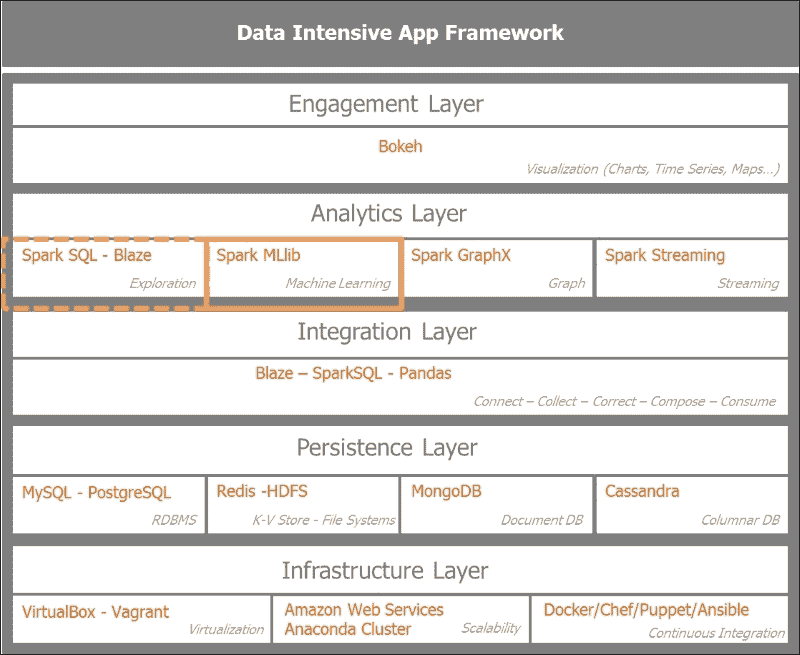
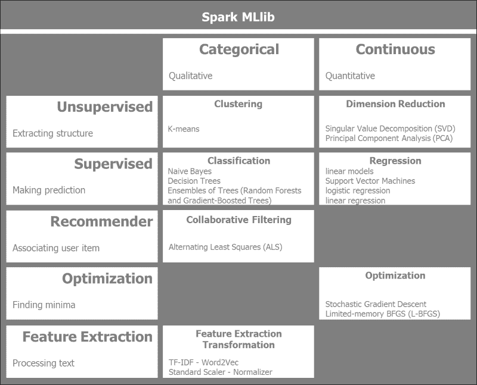
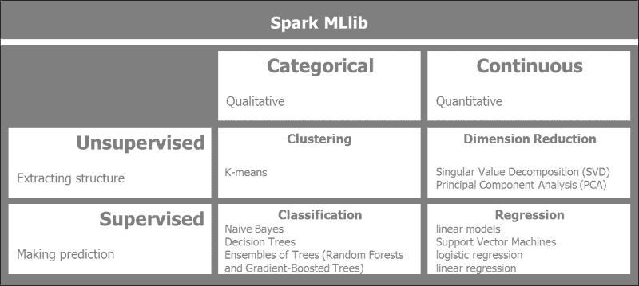
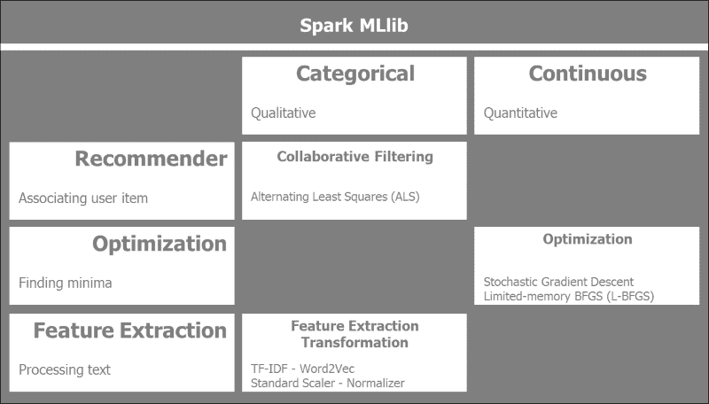
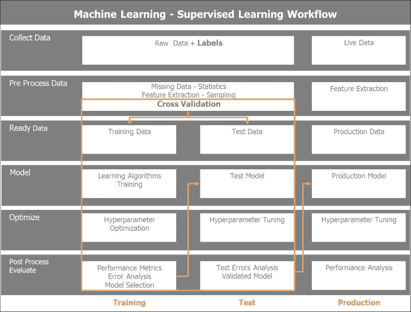
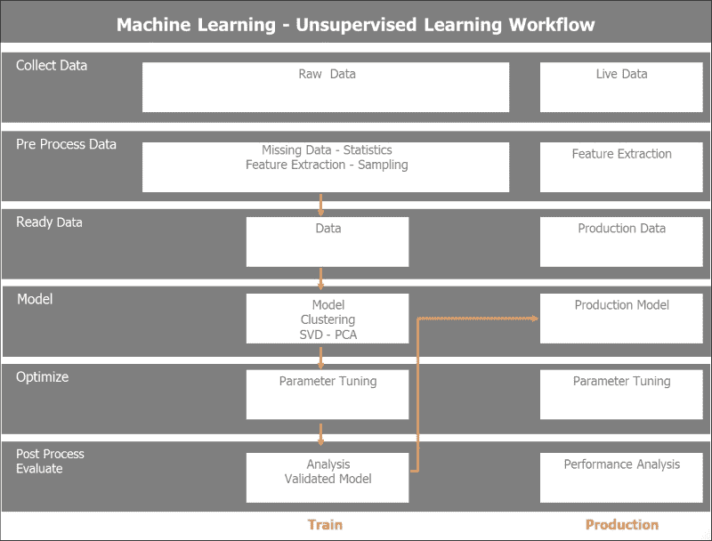
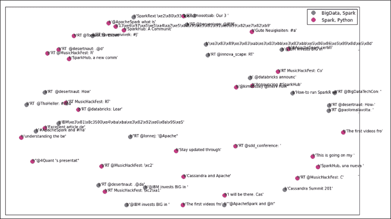
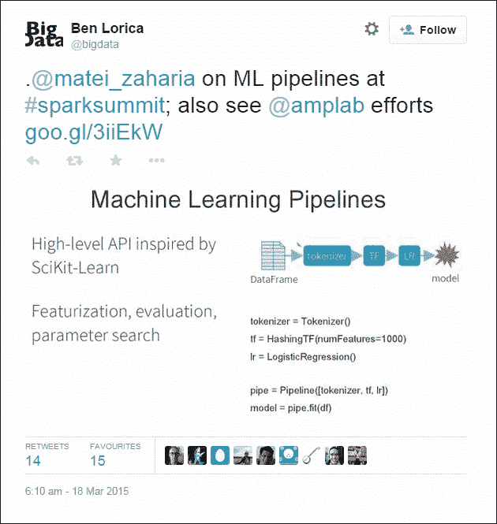

# 第四章：使用 Spark 从数据中学习

在上一章中，我们已经为数据的收集奠定了基础，现在我们准备从数据中学习。机器学习是关于从数据中获取见解。我们的目标是概述 Spark MLlib（简称机器学习库）并将适当的算法应用于我们的数据集，以便得出见解。从 Twitter 数据集中，我们将应用无监督的聚类算法，以区分 Apache Spark 相关的推文和其他推文。我们首先需要预处理数据，以提取相关特征，然后将机器学习算法应用于我们的数据集，最后评估模型的结果和性能。

在本章中，我们将涵盖以下内容：

+   提供 Spark MLlib 模块及其算法以及典型的机器学习工作流程的概述。

+   预处理 Twitter 收集的数据集，以提取相关特征，应用无监督的聚类算法来识别 Apache Spark 相关的推文。然后，评估模型和获得的结果。

+   描述 Spark 机器学习管道。

# 在应用架构中定位 Spark MLlib

让我们首先将本章的重点放在数据密集型应用架构上。我们将集中精力放在分析层，更确切地说是机器学习上。这将为流应用提供基础，因为我们希望将从数据的批处理中学到的知识应用于流分析的推理规则。

以下图表设置了本章重点的上下文，突出了分析层内的机器学习模块，同时使用了探索性数据分析、Spark SQL 和 Pandas 工具。



# 对 Spark MLlib 算法进行分类

Spark MLlib 是 Spark 的一个快速发展模块，每次 Spark 发布都会添加新的算法。

以下图表提供了 Spark MLlib 算法的高级概述，分为传统的广义机器学习技术和数据的分类或连续性特性：



我们将 Spark MLlib 算法分为两列，根据数据类型分为分类或连续。我们区分分类或更具有定性特征的数据与连续数据，后者是定量的。定性数据的一个例子是预测天气；给定大气压、温度和云的存在和类型，天气将是晴天、干燥、多雨或阴天。这些是离散值。另一方面，假设我们想要预测房价，给定位置、平方米和床的数量；可以使用线性回归来预测房地产价值。在这种情况下，我们谈论的是连续或定量值。

水平分组反映了所使用的机器学习方法的类型。无监督与监督机器学习技术取决于训练数据是否带有标签。在无监督学习挑战中，学习算法没有标签。目标是找到输入中的隐藏结构。在监督学习的情况下，数据是有标签的。重点是使用回归进行预测，如果数据是连续的，或者使用分类，如果数据是分类的。

机器学习的一个重要类别是推荐系统，它利用协同过滤技术。亚马逊网店和 Netflix 拥有非常强大的推荐系统来支持他们的推荐。

随机梯度下降是一种适合 Spark 分布式计算的机器学习优化技术之一。

对于处理大量文本，Spark 提供了关键的特征提取和转换库，如**TF-IDF**（**词项频率-逆文档频率**），Word2Vec，标准缩放器和归一化器。

## 监督和无监督学习

我们在这里更深入地探讨了 Spark MLlib 提供的传统机器学习算法。我们根据数据是否有标签来区分监督学习和无监督学习。我们根据数据是离散的还是连续的来区分分类或连续。

以下图表解释了 Spark MLlib 监督和无监督机器学习算法以及预处理技术：



以下监督和无监督的 MLlib 算法和预处理技术目前在 Spark 中可用：

+   **聚类**：这是一种无监督的机器学习技术，其中数据没有标记。目的是从数据中提取结构：

+   **K 均值**：这将数据分区为 K 个不同的簇

+   **高斯混合**：根据组件的最大后验概率分配簇

+   **幂迭代聚类（PIC）**：这基于图的顶点之间的成对边相似性进行分组

+   **潜在狄利克雷分配**（**LDA**）：这用于将文本文档集合分组成主题

+   **流式 K 均值**：这意味着使用传入数据的窗口函数动态地对流式数据进行聚类

+   **降维**：这旨在减少考虑的特征数量。基本上，这减少了数据中的噪音，并专注于关键特征：

+   **奇异值分解**（**SVD**）：这将包含数据的矩阵分解为更简单的有意义的部分。它将初始矩阵分解为三个矩阵。

+   **主成分分析**（**PCA**）：这将高维数据集近似为低维子空间。

+   **回归和分类**：回归使用标记的训练数据预测输出值，而分类将结果分组成类别。分类具有分类或无序的因变量，而回归具有连续和有序的因变量：

+   **线性回归模型**（线性回归，逻辑回归和支持向量机）：线性回归算法可以表示为旨在最小化基于权重变量向量的目标函数的凸优化问题。目标函数通过函数的正则化部分和损失函数控制模型的复杂性和模型的误差。

+   **朴素贝叶斯**：这基于给定观察的标签的条件概率分布进行预测。它假设特征之间是相互独立的。

+   **决策树**：这执行特征空间的递归二元分区。在树节点级别上最大化信息增益，以确定分区的最佳拆分。

+   **树的集成**（随机森林和梯度提升树）：树集成算法将基本决策树模型组合在一起，以构建一个高性能的模型。它们对于分类和回归任务非常直观和成功。

+   **保序回归**：这最小化给定数据和观察响应之间的均方误差。

## 附加学习算法

Spark MLlib 提供的算法比监督和无监督学习算法更多。我们还有三种额外类型的机器学习方法：推荐系统，优化算法和特征提取。



以下附加的 MLlib 算法目前在 Spark 中可用：

+   **协同过滤**：这是推荐系统的基础。它创建一个用户-项目关联矩阵，并旨在填补空白。基于其他用户和项目以及它们的评分，它推荐目标用户尚未评分的项目。在分布式计算中，最成功的算法之一是**ALS**（**交替最小二乘法**的缩写）：

+   **交替最小二乘法**：这种矩阵分解技术结合了隐式反馈、时间效应和置信水平。它将大型用户项目矩阵分解为较低维度的用户和项目因子。它通过交替固定其因子来最小化二次损失函数。

+   **特征提取和转换**：这些是大型文本文档处理的基本技术。它包括以下技术：

+   **词频**：搜索引擎使用 TF-IDF 对大量语料库中的文档相关性进行评分和排名。它还用于机器学习，以确定文档或语料库中单词的重要性。词频统计上确定了术语相对于语料库中的频率的权重。单独的词频可能会产生误导，因为它过分强调了诸如*the*、*of*或*and*这样提供很少信息的词语。逆文档频率提供了特定性或术语在语料库中所有文档中是罕见还是常见的度量。

+   **Word2Vec**：这包括两种模型，**Skip-Gram**和**连续词袋**。Skip-Gram 根据单词的滑动窗口预测给定单词的相邻单词，而连续词袋根据相邻单词预测当前单词。

+   **标准缩放器**：作为预处理的一部分，数据集通常必须通过均值去除和方差缩放进行标准化。我们计算训练数据的均值和标准差，并将相同的转换应用于测试数据。

+   **标准化器**：我们将样本缩放为单位范数。它对于二次形式（如点积或核方法）非常有用。

+   **特征选择**：通过选择模型中最相关的特征来减少向量空间的维度。

+   **卡方选择器**：这是一种衡量两个事件独立性的统计方法。

+   **优化**：这些特定的 Spark MLlib 优化算法专注于梯度下降的各种技术。Spark 提供了非常高效的梯度下降实现，可以在分布式机器集群上进行。它通过迭代沿着最陡的下降方向寻找局部最小值。由于需要迭代处理所有可用数据，因此计算密集型：

+   **随机梯度下降**：我们最小化一个可微函数的总和。随机梯度下降仅使用训练数据的样本来更新特定迭代中的参数。它用于大规模和稀疏的机器学习问题，如文本分类。

+   **有限内存 BFGS**（**L-BFGS**）：顾名思义，L-BFGS 使用有限内存，适用于 Spark MLlib 的分布式优化算法实现。

# Spark MLlib 数据类型

MLlib 支持四种基本数据类型：**本地向量**、**标记点**、**本地矩阵**和**分布式矩阵**。这些数据类型在 Spark MLlib 算法中被广泛使用：

+   **本地向量**：这存在于单个机器中。它可以是密集的或稀疏的：

+   密集向量是传统的双精度数组。密集向量的一个示例是`[5.0, 0.0, 1.0, 7.0]`。

+   稀疏向量使用整数索引和双精度值。因此，向量`[5.0, 0.0, 1.0, 7.0]`的稀疏表示将是`(4, [0, 2, 3], [5.0, 1.0, 7.0])`，其中表示向量的维度。

以下是 PySpark 中本地向量的示例：

```py
import numpy as np
import scipy.sparse as sps
from pyspark.mllib.linalg import Vectors

# NumPy array for dense vector.
dvect1 = np.array([5.0, 0.0, 1.0, 7.0])
# Python list for dense vector.
dvect2 = [5.0, 0.0, 1.0, 7.0]
# SparseVector creation
svect1 = Vectors.sparse(4, [0, 2, 3], [5.0, 1.0, 7.0])
# Sparse vector using a single-column SciPy csc_matrix
svect2 = sps.csc_matrix((np.array([5.0, 1.0, 7.0]), np.array([0, 2, 3])), shape = (4, 1))
```

+   **标记点**。标记点是在监督学习中使用的带有标签的稠密或稀疏向量。在二元标签的情况下，0.0 表示负标签，而 1.0 表示正值。

这是 PySpark 中标记点的一个示例：

```py
from pyspark.mllib.linalg import SparseVector
from pyspark.mllib.regression import LabeledPoint

# Labeled point with a positive label and a dense feature vector.
lp_pos = LabeledPoint(1.0, [5.0, 0.0, 1.0, 7.0])

# Labeled point with a negative label and a sparse feature vector.
lp_neg = LabeledPoint(0.0, SparseVector(4, [0, 2, 3], [5.0, 1.0, 7.0]))
```

+   **本地矩阵**：这个本地矩阵位于单个机器上，具有整数类型的索引和双精度类型的值。

这是 PySpark 中本地矩阵的一个示例：

```py
from pyspark.mllib.linalg import Matrix, Matrices

# Dense matrix ((1.0, 2.0, 3.0), (4.0, 5.0, 6.0))
dMatrix = Matrices.dense(2, 3, [1, 2, 3, 4, 5, 6])

# Sparse matrix ((9.0, 0.0), (0.0, 8.0), (0.0, 6.0))
sMatrix = Matrices.sparse(3, 2, [0, 1, 3], [0, 2, 1], [9, 6, 8])
```

+   **分布式矩阵**：利用 RDD 的分布式特性，分布式矩阵可以在一组机器的集群中共享。我们区分四种分布式矩阵类型：`RowMatrix`、`IndexedRowMatrix`、`CoordinateMatrix`和`BlockMatrix`。

+   `RowMatrix`：这需要一个向量的 RDD，并从向量的 RDD 创建一个带有无意义索引的行的分布式矩阵，称为`RowMatrix`。

+   `IndexedRowMatrix`：在这种情况下，行索引是有意义的。首先，我们使用`IndexedRow`类创建索引行的 RDD，然后创建`IndexedRowMatrix`。

+   `CoordinateMatrix`：这对于表示非常大和非常稀疏的矩阵很有用。`CoordinateMatrix`是从`MatrixEntry`点的 RDD 创建的，由(long, long, float)类型的元组表示。

+   `BlockMatrix`：这些是从子矩阵块的 RDD 创建的，其中子矩阵块是`((blockRowIndex, blockColIndex), sub-matrix)`。

# 机器学习工作流程和数据流程

除了算法，机器学习还涉及到流程。我们将讨论监督和无监督机器学习的典型工作流程和数据流程。

## 监督机器学习工作流程

在监督机器学习中，输入训练数据集是有标签的。一个关键的数据实践是将输入数据分为训练集和测试集，并相应地验证模型。

在监督学习中，我们通常会经历一个六步的流程：

+   **收集数据**：这一步基本上与前一章相关，并确保我们收集正确数量和粒度的数据，以使机器学习算法能够提供可靠的答案。

+   **预处理数据**：这一步是关于通过抽样检查数据质量，填补缺失值（如果有的话），对数据进行缩放和归一化。我们还定义特征提取过程。通常，在大型基于文本的数据集的情况下，我们应用标记化、停用词去除、词干提取和 TF-IDF。

在监督学习中，我们将输入数据分为训练集和测试集。我们还可以实施各种采样和数据集拆分策略，以进行交叉验证。

+   **准备数据**：在这一步中，我们将数据格式化或转换为算法所期望的格式或数据类型。在 Spark MLlib 中，这包括本地向量、稠密或稀疏向量、标记点、本地矩阵、带有行矩阵、索引行矩阵、坐标矩阵和块矩阵的分布式矩阵。

+   **模型**：在这一步中，我们应用适合问题的算法，并获得评估步骤中最适合算法的结果。我们可能有多个适合问题的算法；它们在评估步骤中的性能将被评分以选择最佳的性能。我们可以实施模型的集成或组合，以达到最佳结果。

+   **优化**：我们可能需要对某些算法的最佳参数进行网格搜索。这些参数在训练期间确定，并在测试和生产阶段进行微调。

+   **评估**：最终我们对模型进行评分，并选择在准确性、性能、可靠性和可扩展性方面最好的模型。我们将最佳性能的模型移至测试集，以确定模型的预测准确性。一旦对经过微调的模型满意，我们将其移至生产环境以处理实时数据。

监督机器学习的工作流程和数据流程如下图所示：



## 无监督机器学习工作流

与监督学习相反，在无监督学习的情况下，我们的初始数据没有标签，这在现实生活中是最常见的情况。我们将使用聚类或降维算法从数据中提取结构。在无监督学习的情况下，我们不会将数据分为训练和测试，因为我们无法进行任何预测，因为数据没有标签。我们将对数据进行六个步骤的训练，类似于监督学习。一旦模型训练完成，我们将评估结果并微调模型，然后将其投入生产。

无监督学习可以作为监督学习的初步步骤。换句话说，我们在进入学习阶段之前看一下如何降低数据的维度。

无监督机器学习工作流和数据流如下所示：



# 对 Twitter 数据集进行聚类

让我们先从 Twitter 中提取的数据中了解一下，并了解数据结构，以便准备并通过 K-Means 聚类算法运行。我们的攻击计划使用了前面描述的无监督学习的过程和数据流。步骤如下：

1.  将所有推文文件合并为单个数据框。

1.  解析推文，删除停用词，提取表情符号，提取 URL，最后规范化单词（例如，将它们映射为小写并删除标点和数字）。

1.  特征提取包括以下内容：

+   **标记化**：这将解析推文文本为单个单词或标记

+   **TF-IDF**：这将应用 TF-IDF 算法从标记化的推文文本中创建特征向量

+   **哈希 TF-IDF**：这将对标记向量应用哈希函数

1.  运行 K-Means 聚类算法。

1.  评估 K-Means 聚类的结果：

+   识别推文归属于聚类

+   使用多维缩放或主成分分析算法将维度降低到两个维度

+   绘制聚类

1.  管道：

+   微调相关聚类 K 的数量

+   测量模型成本

+   选择最佳模型

## 在 Twitter 数据集上应用 Scikit-Learn

Python 自带的 Scikit-Learn 机器学习库是最可靠、直观和强大的工具之一。在使用 Pandas 和 Scikit-Learn 进行预处理和无监督学习之前，通常有利于使用 Scikit-Learn 探索数据的样本。在使用 Spark MLlib 分离聚类之前，我们经常使用 Scikit-Learn 探索数据的样本。

我们有一袋杂货的 7540 条推文。它包含与 Apache Spark、Python、即将到来的总统选举以及 Lady Gaga 和 Justin Bieber 相关的时尚和音乐推文。我们正在使用 Python Scikit-Learn 对 Twitter 数据集进行 K-Means 聚类算法。我们首先将样本数据加载到 Pandas 数据框中：

```py
import pandas as pd

csv_in = 'C:\\Users\\Amit\\Documents\\IPython Notebooks\\AN00_Data\\unq_tweetstxt.csv'
twts_df01 = pd.read_csv(csv_in, sep =';', encoding='utf-8')

In [24]:

twts_df01.count()
Out[24]:
Unnamed: 0    7540
id            7540
created_at    7540
user_id       7540
user_name     7538
tweet_text    7540
dtype: int64

#
# Introspecting the tweets text
#
In [82]:

twtstxt_ls01[6910:6920]
Out[82]:
['RT @deroach_Ismoke: I am NOT voting for #hilaryclinton http://t.co/jaZZpcHkkJ',
 'RT @AnimalRightsJen: #HilaryClinton What do Bernie Sanders and Donald Trump Have in Common?: He has so far been th... http://t.co/t2YRcGCh6…',
 'I understand why Bill was out banging other chicks........I mean look at what he is married to.....\n@HilaryClinton',
 '#HilaryClinton What do Bernie Sanders and Donald Trump Have in Common?: He has so far been th... http://t.co/t2YRcGCh67 #Tcot #UniteBlue']
```

我们首先从推文文本中进行特征提取。我们使用具有 10,000 个特征和英语停用词的 TF-IDF 向量化器对数据集应用稀疏矢量化器：

```py
In [37]:

print("Extracting features from the training dataset using a sparse vectorizer")
t0 = time()
Extracting features from the training dataset using a sparse vectorizer
In [38]:

vectorizer = TfidfVectorizer(max_df=0.5, max_features=10000,
                                 min_df=2, stop_words='english',
                                 use_idf=True)
X = vectorizer.fit_transform(twtstxt_ls01)
#
# Output of the TFIDF Feature vectorizer
#
print("done in %fs" % (time() - t0))
print("n_samples: %d, n_features: %d" % X.shape)
print()
done in 5.232165s
n_samples: 7540, n_features: 6638
```

由于数据集现在被分成了 7540 个样本，每个样本有 6638 个特征向量，我们准备将这个稀疏矩阵输入 K-Means 聚类算法。我们最初选择七个聚类和 100 次最大迭代：

```py
In [47]:

km = KMeans(n_clusters=7, init='k-means++', max_iter=100, n_init=1,
            verbose=1)

print("Clustering sparse data with %s" % km)
t0 = time()
km.fit(X)
print("done in %0.3fs" % (time() - t0))

Clustering sparse data with KMeans(copy_x=True, init='k-means++', max_iter=100, n_clusters=7, n_init=1,
    n_jobs=1, precompute_distances='auto', random_state=None, tol=0.0001,
    verbose=1)
Initialization complete
Iteration  0, inertia 13635.141
Iteration  1, inertia 6943.485
Iteration  2, inertia 6924.093
Iteration  3, inertia 6915.004
Iteration  4, inertia 6909.212
Iteration  5, inertia 6903.848
Iteration  6, inertia 6888.606
Iteration  7, inertia 6863.226
Iteration  8, inertia 6860.026
Iteration  9, inertia 6859.338
Iteration 10, inertia 6859.213
Iteration 11, inertia 6859.102
Iteration 12, inertia 6859.080
Iteration 13, inertia 6859.060
Iteration 14, inertia 6859.047
Iteration 15, inertia 6859.039
Iteration 16, inertia 6859.032
Iteration 17, inertia 6859.031
Iteration 18, inertia 6859.029
Converged at iteration 18
done in 1.701s
```

K-Means 聚类算法在 18 次迭代后收敛。在以下结果中，我们看到了七个聚类及其各自的关键词。聚类`0`和`6`是关于贾斯汀·比伯和 Lady Gaga 相关推文的音乐和时尚。聚类`1`和`5`与美国总统选举有关，包括唐纳德·特朗普和希拉里·克林顿相关的推文。聚类`2`和`3`是我们感兴趣的，因为它们涉及 Apache Spark 和 Python。聚类`4`包含泰国相关的推文：

```py
#
# Introspect top terms per cluster
#

In [49]:

print("Top terms per cluster:")
order_centroids = km.cluster_centers_.argsort()[:, ::-1]
terms = vectorizer.get_feature_names()
for i in range(7):
    print("Cluster %d:" % i, end='')
    for ind in order_centroids[i, :20]:
        print(' %s' % terms[ind], end='')
    print()
Top terms per cluster:
Cluster 0: justinbieber love mean rt follow thank hi https whatdoyoumean video wanna hear whatdoyoumeanviral rorykramer happy lol making person dream justin
Cluster 1: donaldtrump hilaryclinton rt https trump2016 realdonaldtrump trump gop amp justinbieber president clinton emails oy8ltkstze tcot like berniesanders hilary people email
Cluster 2: bigdata apachespark hadoop analytics rt spark training chennai ibm datascience apache processing cloudera mapreduce data sap https vora transforming development
Cluster 3: apachespark python https rt spark data amp databricks using new learn hadoop ibm big apache continuumio bluemix learning join open
Cluster 4: ernestsgantt simbata3 jdhm2015 elsahel12 phuketdailynews dreamintentions beyhiveinfrance almtorta18 civipartnership 9_a_6 25whu72ep0 k7erhvu7wn fdmxxxcm3h osxuh2fxnt 5o5rmb0xhp jnbgkqn0dj ovap57ujdh dtzsz3lb6x sunnysai12345 sdcvulih6g
Cluster 5: trump donald donaldtrump starbucks trumpquote trumpforpresident oy8ltkstze https zfns7pxysx silly goy stump trump2016 news jeremy coffee corbyn ok7vc8aetz rt tonight
Cluster 6: ladygaga gaga lady rt https love follow horror cd story ahshotel american japan hotel human trafficking music fashion diet queen ahs
```

我们将通过绘制聚类来可视化结果。我们有 7,540 个样本，6,638 个特征。不可能可视化那么多维度。我们将使用**多维缩放**（**MDS**）算法将聚类的多维特征降低到两个可处理的维度，以便能够将它们呈现出来：

```py
import matplotlib.pyplot as plt
import matplotlib as mpl
from sklearn.manifold import MDS

MDS()

#
# Bring down the MDS to two dimensions (components) as we will plot 
# the clusters
#
mds = MDS(n_components=2, dissimilarity="precomputed", random_state=1)

pos = mds.fit_transform(dist)  # shape (n_components, n_samples)

xs, ys = pos[:, 0], pos[:, 1]

In [67]:

#
# Set up colors per clusters using a dict
#
cluster_colors = {0: '#1b9e77', 1: '#d95f02', 2: '#7570b3', 3: '#e7298a', 4: '#66a61e', 5: '#9990b3', 6: '#e8888a'}

#
#set up cluster names using a dict
#
cluster_names = {0: 'Music, Pop', 
                 1: 'USA Politics, Election', 
                 2: 'BigData, Spark', 
                 3: 'Spark, Python',
                 4: 'Thailand', 
                 5: 'USA Politics, Election', 
                 6: 'Music, Pop'}
In [115]:
#
# ipython magic to show the matplotlib plots inline
#
%matplotlib inline 

#
# Create data frame which includes MDS results, cluster numbers and tweet texts to be displayed
#
df = pd.DataFrame(dict(x=xs, y=ys, label=clusters, txt=twtstxt_ls02_utf8))
ix_start = 2000
ix_stop  = 2050
df01 = df[ix_start:ix_stop]

print(df01[['label','txt']])
print(len(df01))
print()

# Group by cluster

groups = df.groupby('label')
groups01 = df01.groupby('label')

# Set up the plot

fig, ax = plt.subplots(figsize=(17, 10)) 
ax.margins(0.05) 

#
# Build the plot object
#
for name, group in groups01:
    ax.plot(group.x, group.y, marker='o', linestyle='', ms=12, 
            label=cluster_names[name], color=cluster_colors[name], 
            mec='none')
    ax.set_aspect('auto')
    ax.tick_params(\
        axis= 'x',         # settings for x-axis
        which='both',      # 
        bottom='off',      # 
        top='off',         # 
        labelbottom='off')
    ax.tick_params(\
        axis= 'y',         # settings for y-axis
        which='both',      # 
        left='off',        # 
        top='off',         # 
        labelleft='off')

ax.legend(numpoints=1)     #
#
# Add label in x,y position with tweet text
#
for i in range(ix_start, ix_stop):
    ax.text(df01.ix[i]['x'], df01.ix[i]['y'], df01.ix[i]['txt'], size=10)  

plt.show()                 # Display the plot

      label       text
2000      2       b'RT @BigDataTechCon: '
2001      3       b"@4Quant 's presentat"
2002      2       b'Cassandra Summit 201'
```

这是聚类`2`的绘图，*大数据*和*Spark*用蓝色点表示，聚类`3`的*Spark*和*Python*用红色点表示，以及一些与各自聚类相关的示例推文：



通过对 Scikit-Learn 进行探索和处理，我们对数据获得了一些有益的见解。现在我们将把注意力集中在 Spark MLlib 上，并在 Twitter 数据集上进行尝试。

## 预处理数据集

现在，我们将专注于特征提取和工程，以准备数据进行聚类算法运行。我们实例化 Spark 上下文，并将 Twitter 数据集读入 Spark 数据框。然后我们将逐步对推文文本数据进行标记化，对标记应用哈希词频算法，最后应用逆文档频率算法并重新调整数据。代码如下：

```py
In [3]:
#
# Read csv in a Panda DF
#
#
import pandas as pd
csv_in = '/home/an/spark/spark-1.5.0-bin-hadoop2.6/examples/AN_Spark/data/unq_tweetstxt.csv'
pddf_in = pd.read_csv(csv_in, index_col=None, header=0, sep=';', encoding='utf-8')

In [4]:

sqlContext = SQLContext(sc)

In [5]:

#
# Convert a Panda DF to a Spark DF
#
#

spdf_02 = sqlContext.createDataFrame(pddf_in[['id', 'user_id', 'user_name', 'tweet_text']])

In [8]:

spdf_02.show()

In [7]:

spdf_02.take(3)

Out[7]:

[Row(id=638830426971181057, user_id=3276255125, user_name=u'True Equality', tweet_text=u'ernestsgantt: BeyHiveInFrance: 9_A_6: dreamintentions: elsahel12: simbata3: JDHM2015: almtorta18: dreamintentions:\u2026 http://t.co/VpD7FoqMr0'),
 Row(id=638830426727911424, user_id=3276255125, user_name=u'True Equality', tweet_text=u'ernestsgantt: BeyHiveInFrance: PhuketDailyNews: dreamintentions: elsahel12: simbata3: JDHM2015: almtorta18: CiviPa\u2026 http://t.co/VpD7FoqMr0'),
 Row(id=638830425402556417, user_id=3276255125, user_name=u'True Equality', tweet_text=u'ernestsgantt: BeyHiveInFrance: 9_A_6: ernestsgantt: elsahel12: simbata3: JDHM2015: almtorta18: CiviPartnership: dr\u2026 http://t.co/EMDOn8chPK')]

In [9]:

from pyspark.ml.feature import HashingTF, IDF, Tokenizer

In [10]:

#
# Tokenize the tweet_text 
#
tokenizer = Tokenizer(inputCol="tweet_text", outputCol="tokens")
tokensData = tokenizer.transform(spdf_02)

In [11]:

tokensData.take(1)

Out[11]:

[Row(id=638830426971181057, user_id=3276255125, user_name=u'True Equality', tweet_text=u'ernestsgantt: BeyHiveInFrance: 9_A_6: dreamintentions: elsahel12: simbata3: JDHM2015: almtorta18: dreamintentions:\u2026 http://t.co/VpD7FoqMr0', tokens=[u'ernestsgantt:', u'beyhiveinfrance:', u'9_a_6:', u'dreamintentions:', u'elsahel12:', u'simbata3:', u'jdhm2015:', u'almtorta18:', u'dreamintentions:\u2026', u'http://t.co/vpd7foqmr0'])]

In [14]:

#
# Apply Hashing TF to the tokens
#
hashingTF = HashingTF(inputCol="tokens", outputCol="rawFeatures", numFeatures=2000)
featuresData = hashingTF.transform(tokensData)

In [15]:

featuresData.take(1)

Out[15]:

[Row(id=638830426971181057, user_id=3276255125, user_name=u'True Equality', tweet_text=u'ernestsgantt: BeyHiveInFrance: 9_A_6: dreamintentions: elsahel12: simbata3: JDHM2015: almtorta18: dreamintentions:\u2026 http://t.co/VpD7FoqMr0', tokens=[u'ernestsgantt:', u'beyhiveinfrance:', u'9_a_6:', u'dreamintentions:', u'elsahel12:', u'simbata3:', u'jdhm2015:', u'almtorta18:', u'dreamintentions:\u2026', u'http://t.co/vpd7foqmr0'], rawFeatures=SparseVector(2000, {74: 1.0, 97: 1.0, 100: 1.0, 160: 1.0, 185: 1.0, 742: 1.0, 856: 1.0, 991: 1.0, 1383: 1.0, 1620: 1.0}))]

In [16]:

#
# Apply IDF to the raw features and rescale the data
#
idf = IDF(inputCol="rawFeatures", outputCol="features")
idfModel = idf.fit(featuresData)
rescaledData = idfModel.transform(featuresData)

for features in rescaledData.select("features").take(3):
  print(features)

In [17]:

rescaledData.take(2)

Out[17]:

[Row(id=638830426971181057, user_id=3276255125, user_name=u'True Equality', tweet_text=u'ernestsgantt: BeyHiveInFrance: 9_A_6: dreamintentions: elsahel12: simbata3: JDHM2015: almtorta18: dreamintentions:\u2026 http://t.co/VpD7FoqMr0', tokens=[u'ernestsgantt:', u'beyhiveinfrance:', u'9_a_6:', u'dreamintentions:', u'elsahel12:', u'simbata3:', u'jdhm2015:', u'almtorta18:', u'dreamintentions:\u2026', u'http://t.co/vpd7foqmr0'], rawFeatures=SparseVector(2000, {74: 1.0, 97: 1.0, 100: 1.0, 160: 1.0, 185: 1.0, 742: 1.0, 856: 1.0, 991: 1.0, 1383: 1.0, 1620: 1.0}), features=SparseVector(2000, {74: 2.6762, 97: 1.8625, 100: 2.6384, 160: 2.9985, 185: 2.7481, 742: 5.5269, 856: 4.1406, 991: 2.9518, 1383: 4.694, 1620: 3.073})),
 Row(id=638830426727911424, user_id=3276255125, user_name=u'True Equality', tweet_text=u'ernestsgantt: BeyHiveInFrance: PhuketDailyNews: dreamintentions: elsahel12: simbata3: JDHM2015: almtorta18: CiviPa\u2026 http://t.co/VpD7FoqMr0', tokens=[u'ernestsgantt:', u'beyhiveinfrance:', u'phuketdailynews:', u'dreamintentions:', u'elsahel12:', u'simbata3:', u'jdhm2015:', u'almtorta18:', u'civipa\u2026', u'http://t.co/vpd7foqmr0'], rawFeatures=SparseVector(2000, {74: 1.0, 97: 1.0, 100: 1.0, 160: 1.0, 185: 1.0, 460: 1.0, 987: 1.0, 991: 1.0, 1383: 1.0, 1620: 1.0}), features=SparseVector(2000, {74: 2.6762, 97: 1.8625, 100: 2.6384, 160: 2.9985, 185: 2.7481, 460: 6.4432, 987: 2.9959, 991: 2.9518, 1383: 4.694, 1620: 3.073}))]

In [21]:

rs_pddf = rescaledData.toPandas()

In [22]:

rs_pddf.count()

Out[22]:

id             7540
user_id        7540
user_name      7540
tweet_text     7540
tokens         7540
rawFeatures    7540
features       7540
dtype: int64

In [27]:

feat_lst = rs_pddf.features.tolist()

In [28]:

feat_lst[:2]

Out[28]:

[SparseVector(2000, {74: 2.6762, 97: 1.8625, 100: 2.6384, 160: 2.9985, 185: 2.7481, 742: 5.5269, 856: 4.1406, 991: 2.9518, 1383: 4.694, 1620: 3.073}),
 SparseVector(2000, {74: 2.6762, 97: 1.8625, 100: 2.6384, 160: 2.9985, 185: 2.7481, 460: 6.4432, 987: 2.9959, 991: 2.9518, 1383: 4.694, 1620: 3.073})]
```

## 运行聚类算法

我们将使用 K-Means 算法对 Twitter 数据集进行处理。作为一个未标记和洗牌的推文包，我们想看看*Apache Spark*的推文是否被分组到一个单独的聚类中。从之前的步骤中，TF-IDF 稀疏特征向量被转换为将成为 Spark MLlib 程序输入的 RDD。我们用 5 个聚类、10 次迭代和 10 次运行来初始化 K-Means 模型：

```py
In [32]:

from pyspark.mllib.clustering import KMeans, KMeansModel
from numpy import array
from math import sqrt

In [34]:

# Load and parse the data

in_Data = sc.parallelize(feat_lst)

In [35]:

in_Data.take(3)

Out[35]:

[SparseVector(2000, {74: 2.6762, 97: 1.8625, 100: 2.6384, 160: 2.9985, 185: 2.7481, 742: 5.5269, 856: 4.1406, 991: 2.9518, 1383: 4.694, 1620: 3.073}),
 SparseVector(2000, {74: 2.6762, 97: 1.8625, 100: 2.6384, 160: 2.9985, 185: 2.7481, 460: 6.4432, 987: 2.9959, 991: 2.9518, 1383: 4.694, 1620: 3.073}),
 SparseVector(2000, {20: 4.3534, 74: 2.6762, 97: 1.8625, 100: 5.2768, 185: 2.7481, 856: 4.1406, 991: 2.9518, 1039: 3.073, 1620: 3.073, 1864: 4.6377})]

In [37]:

in_Data.count()

Out[37]:

7540

In [38]:

# Build the model (cluster the data)

clusters = KMeans.train(in_Data, 5, maxIterations=10,
        runs=10, initializationMode="random")

In [53]:

# Evaluate clustering by computing Within Set Sum of Squared Errors

def error(point):
    center = clusters.centers[clusters.predict(point)]
    return sqrt(sum([x**2 for x in (point - center)]))

WSSSE = in_Data.map(lambda point: error(point)).reduce(lambda x, y: x + y)
print("Within Set Sum of Squared Error = " + str(WSSSE))
```

## 评估模型和结果

微调聚类算法的一种方法是改变聚类的数量并验证输出。让我们检查一下聚类，并对迄今为止的聚类结果有所了解：

```py
In [43]:

cluster_membership = in_Data.map(lambda x: clusters.predict(x))

In [54]:

cluster_idx = cluster_membership.zipWithIndex()

In [55]:

type(cluster_idx)

Out[55]:

pyspark.rdd.PipelinedRDD

In [58]:

cluster_idx.take(20)

Out[58]:

[(3, 0),
 (3, 1),
 (3, 2),
 (3, 3),
 (3, 4),
 (3, 5),
 (1, 6),
 (3, 7),
 (3, 8),
 (3, 9),
 (3, 10),
 (3, 11),
 (3, 12),
 (3, 13),
 (3, 14),
 (1, 15),
 (3, 16),
 (3, 17),
 (1, 18),
 (1, 19)]

In [59]:

cluster_df = cluster_idx.toDF()

In [65]:

pddf_with_cluster = pd.concat([pddf_in, cluster_pddf],axis=1)

In [76]:

pddf_with_cluster._1.unique()

Out[76]:

array([3, 1, 4, 0, 2])

In [79]:

pddf_with_cluster[pddf_with_cluster['_1'] == 0].head(10)

Out[79]:
  Unnamed: 0   id   created_at   user_id   user_name   tweet_text   _1   _2
6227   3   642418116819988480   Fri Sep 11 19:23:09 +0000 2015   49693598   Ajinkya Kale   RT @bigdata: Distributed Matrix Computations i...   0   6227
6257   45   642391207205859328   Fri Sep 11 17:36:13 +0000 2015   937467860   Angela Bassa   [Auto] I'm reading ""Distributed Matrix Comput...   0   6257
6297   119   642348577147064320   Fri Sep 11 14:46:49 +0000 2015   18318677   Ben Lorica   Distributed Matrix Computations in @ApacheSpar...   0   6297
In [80]:

pddf_with_cluster[pddf_with_cluster['_1'] == 1].head(10)

Out[80]:
  Unnamed: 0   id   created_at   user_id   user_name   tweet_text   _1   _2
6   6   638830419090079746   Tue Sep 01 21:46:55 +0000 2015   2241040634   Massimo Carrisi   Python:Python: Removing \xa0 from string? - I ...   1   6
15   17   638830380578045953   Tue Sep 01 21:46:46 +0000 2015   57699376   Rafael Monnerat   RT @ramalhoorg: Noite de autógrafos do Fluent ...   1   15
18   41   638830280988426250   Tue Sep 01 21:46:22 +0000 2015   951081582   Jack Baldwin   RT @cloudaus: We are 3/4 full! 2-day @swcarpen...   1   18
19   42   638830276626399232   Tue Sep 01 21:46:21 +0000 2015   6525302   Masayoshi Nakamura   PynamoDB #AWS #DynamoDB #Python http://...   1   19
20   43   638830213288235008   Tue Sep 01 21:46:06 +0000 2015   3153874869   Baltimore Python   Flexx: Python UI tookit based on web technolog...   1   20
21   44   638830117645516800   Tue Sep 01 21:45:43 +0000 2015   48474625   Radio Free Denali   Hmm, emerge --depclean wants to remove somethi...   1   21
22   46   638829977014636544   Tue Sep 01 21:45:10 +0000 2015   154915461   Luciano Ramalho   Noite de autógrafos do Fluent Python no Garoa ...   1   22
23   47   638829882928070656   Tue Sep 01 21:44:47 +0000 2015   917320920   bsbafflesbrains   @DanSWright Harper channeling Monty Python. "...   1   23
24   48   638829868679954432   Tue Sep 01 21:44:44 +0000 2015   134280898   Lannick Technology   RT @SergeyKalnish: I am #hiring: Senior Back e...   1   24
25   49   638829707484508161   Tue Sep 01 21:44:05 +0000 2015   2839203454   Joshua Jones   RT @LindseyPelas: Surviving Monty Python in Fl...   1   25
In [81]:

pddf_with_cluster[pddf_with_cluster['_1'] == 2].head(10)

Out[81]:
  Unnamed: 0   id   created_at   user_id   user_name   tweet_text   _1   _2
7280   688   639056941592014848   Wed Sep 02 12:47:02 +0000 2015   2735137484   Chris   A true gay icon when will @ladygaga @Madonna @...   2   7280
In [82]:

pddf_with_cluster[pddf_with_cluster['_1'] == 3].head(10)

Out[82]:
  Unnamed: 0   id   created_at   user_id   user_name   tweet_text   _1   _2
0   0   638830426971181057   Tue Sep 01 21:46:57 +0000 2015   3276255125   True Equality   ernestsgantt: BeyHiveInFrance: 9_A_6: dreamint...   3   0
1   1   638830426727911424   Tue Sep 01 21:46:57 +0000 2015   3276255125   True Equality   ernestsgantt: BeyHiveInFrance: PhuketDailyNews...   3   1
2   2   638830425402556417   Tue Sep 01 21:46:56 +0000 2015   3276255125   True Equality   ernestsgantt: BeyHiveInFrance: 9_A_6: ernestsg...   3   2
3   3   638830424563716097   Tue Sep 01 21:46:56 +0000 2015   3276255125   True Equality   ernestsgantt: BeyHiveInFrance: PhuketDailyNews...   3   3
4   4   638830422256816132   Tue Sep 01 21:46:56 +0000 2015   3276255125   True Equality   ernestsgantt: elsahel12: 9_A_6: dreamintention...   3   4
5   5   638830420159655936   Tue Sep 01 21:46:55 +0000 2015   3276255125   True Equality   ernestsgantt: BeyHiveInFrance: PhuketDailyNews...   3   5
7   7   638830418330980352   Tue Sep 01 21:46:55 +0000 2015   3276255125   True Equality   ernestsgantt: elsahel12: 9_A_6: dreamintention...   3   7
8   8   638830397648822272   Tue Sep 01 21:46:50 +0000 2015   3276255125   True Equality   ernestsgantt: BeyHiveInFrance: PhuketDailyNews...   3   8
9   9   638830395375529984   Tue Sep 01 21:46:49 +0000 2015   3276255125   True Equality   ernestsgantt: elsahel12: 9_A_6: dreamintention...   3   9
10   10   638830392389177344   Tue Sep 01 21:46:49 +0000 2015   3276255125   True Equality   ernestsgantt: BeyHiveInFrance: PhuketDailyNews...   3   10
In [83]:

pddf_with_cluster[pddf_with_cluster['_1'] == 4].head(10)

Out[83]:
  Unnamed: 0   id   created_at   user_id   user_name   tweet_text   _1   _2
1361   882   642648214454317056   Sat Sep 12 10:37:28 +0000 2015   27415756   Raymond Enisuoh   LA Chosen For US 2024 Olympic Bid - LA2016 See...   4   1361
1363   885   642647848744583168   Sat Sep 12 10:36:01 +0000 2015   27415756   Raymond Enisuoh   Prison See: https://t.co/x3EKAExeFi … … … … … ...   4   1363
5412   11   640480770369286144   Sun Sep 06 11:04:49 +0000 2015   3242403023   Donald Trump 2016   " igiboooy! @ Starbucks https://t.co/97wdL...   4   5412
5428   27   640477140660518912   Sun Sep 06 10:50:24 +0000 2015   3242403023   Donald Trump 2016   "  @ Starbucks https://t.co/wsEYFIefk7 " - D...   4   5428
5455   61   640469542272110592   Sun Sep 06 10:20:12 +0000 2015   3242403023   Donald Trump 2016   " starbucks @ Starbucks Mam Plaza https://t.co...   4   5455
5456   62   640469541370372096   Sun Sep 06 10:20:12 +0000 2015   3242403023   Donald Trump 2016   " Aaahhh the pumpkin spice latte is back, fall...   4   5456
5457   63   640469539524898817   Sun Sep 06 10:20:12 +0000 2015   3242403023   Donald Trump 2016   " RT kayyleighferry: Oh my goddd Harry Potter ...   4   5457
5458   64   640469537176031232   Sun Sep 06 10:20:11 +0000 2015   3242403023   Donald Trump 2016   " Starbucks https://t.co/3xYYXlwNkf " - Donald...   4   5458
5459   65   640469536119070720   Sun Sep 06 10:20:11 +0000 2015   3242403023   Donald Trump 2016   " A Starbucks is under construction in my neig...   4   5459
5460   66   640469530435813376   Sun Sep 06 10:20:10 +0000 2015   3242403023   Donald Trump 2016   " Babam starbucks'tan fotogtaf atıyor bende du...   4   5460
```

我们用一些示例推文对`5`个聚类进行了映射。聚类`0`是关于 Spark 的。聚类`1`是关于 Python 的。聚类`2`是关于 Lady Gaga 的。聚类`3`是关于泰国普吉岛新闻的。聚类`4`是关于唐纳德·特朗普的。

# 构建机器学习管道

我们希望在优化最佳调整参数的同时，组合特征提取、准备活动、训练、测试和预测活动，以获得最佳性能模型。

以下推文完美地捕捉了在 Spark MLlib 中实现的强大机器学习管道的五行代码：



Spark ML 管道受 Python 的 Scikit-Learn 启发，并创建了一个简洁的、声明性的语句，用于对数据进行连续转换，以快速交付可调整的模型。

# 摘要

在本章中，我们概述了 Spark MLlib 不断扩展的算法库。我们讨论了监督学习和无监督学习、推荐系统、优化和特征提取算法。然后，我们将从 Twitter 中收集的数据放入机器学习过程、算法和评估中，以从数据中获取见解。我们通过 Python Scikit-Learn 和 Spark MLlib 的 K-means 聚类对 Twitter 收集的数据集进行了处理，以将与*Apache Spark*相关的推文分离出来。我们还评估了模型的性能。

这让我们为下一章做好准备，下一章将涵盖使用 Spark 进行流式分析。让我们马上开始吧。
