# 第五章：使用 Spark 进行实时数据流

在本章中，我们将专注于流入 Spark 并进行处理的实时流数据。到目前为止，我们已经讨论了批处理的机器学习和数据挖掘。现在我们正在处理持续流动的数据，并在飞行中检测事实和模式。我们正在从湖泊转向河流。

我们将首先调查在这样一个动态和不断变化的环境中出现的挑战。在奠定流应用的先决条件的基础上，我们将调查使用实时数据源（如 TCP 套接字到 Twitter firehose）进行各种实现，并建立一个低延迟、高吞吐量和可扩展的数据管道，结合 Spark、Kafka 和 Flume。

在本章中，我们将涵盖以下几点：

+   分析流应用的架构挑战、约束和要求

+   使用 Spark Streaming 从 TCP 套接字处理实时数据

+   直接连接到 Twitter firehose 以准实时解析推文

+   建立一个可靠、容错、可扩展、高吞吐量、低延迟的集成应用，使用 Spark、Kafka 和 Flume

+   关于 Lambda 和 Kappa 架构范式的结束语

# 奠定流架构的基础

按照惯例，让我们首先回到我们最初的数据密集型应用架构蓝图，并突出 Spark Streaming 模块，这将是我们感兴趣的主题。

以下图表通过突出 Spark Streaming 模块及其与整体数据密集型应用框架中的 Spark SQL 和 Spark MLlib 的交互来设定上下文。

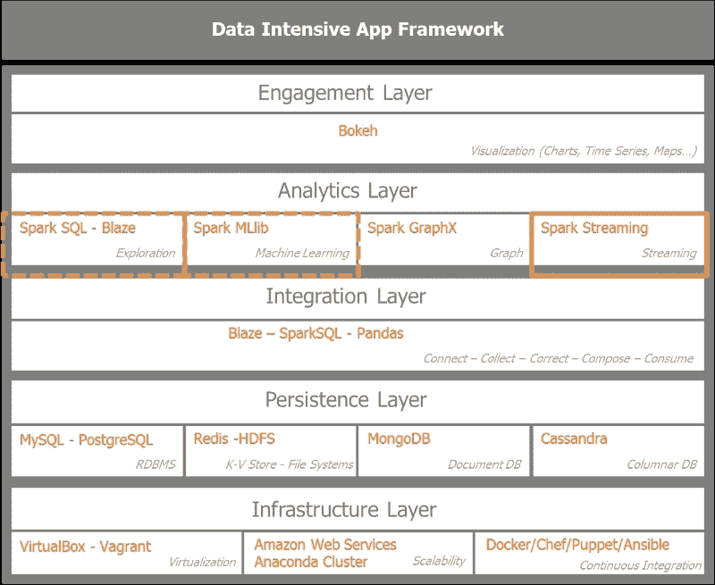

数据来自股市时间序列、企业交易、互动、事件、网站流量、点击流和传感器。所有事件都是时间戳数据且紧急。这适用于欺诈检测和预防、移动交叉销售和升级，或者交通警报。这些数据流需要立即处理以进行监控，例如检测异常、异常值、垃圾邮件、欺诈和入侵；同时也需要提供基本统计数据、见解、趋势和建议。在某些情况下，汇总的聚合信息足以存储以供以后使用。从架构范式的角度来看，我们正在从面向服务的架构转向事件驱动的架构。

有两种模型用于处理数据流：

+   按照记录的实时到达一个接一个地处理记录。在处理之前，我们不会将传入的记录缓冲在容器中。这是 Twitter 的 Storm、Yahoo 的 S4 和 Google 的 MillWheel 的情况。

+   微批处理或在小时间间隔上进行批处理计算，如 Spark Streaming 和 Storm Trident 所执行的。在这种情况下，我们根据微批处理设置中规定的时间窗口将传入的记录缓冲在一个容器中。

Spark Streaming 经常与 Storm 进行比较。它们是两种不同的流数据模型。Spark Streaming 基于微批处理。Storm 基于处理记录的实时到达。Storm 还提供了微批处理选项，即其 Storm Trident 选项。

流应用中的驱动因素是延迟。延迟范围从**RPC**（远程过程调用的缩写）的毫秒级到微批处理解决方案（如 Spark Streaming）的几秒或几分钟。

RPC 允许请求程序之间的同步操作，等待远程服务器过程的结果。线程允许对服务器进行多个 RPC 调用的并发。

实现分布式 RPC 模型的软件示例是 Apache Storm。

Storm 使用拓扑结构或有向无环图来实现无界元组的无状态亚毫秒延迟处理，结合了作为数据流源的喷口和用于过滤、连接、聚合和转换等操作的螺栓。Storm 还实现了一个称为**Trident**的更高级抽象，类似于 Spark，可以处理微批次数据流。

因此，从亚毫秒到秒的延迟连续性来看，Storm 是一个很好的选择。对于秒到分钟的规模，Spark Streaming 和 Storm Trident 都是很好的选择。对于几分钟以上的范围，Spark 和诸如 Cassandra 或 HBase 的 NoSQL 数据库都是合适的解决方案。对于超过一小时且数据量大的范围，Hadoop 是理想的竞争者。

尽管吞吐量与延迟相关，但它并不是简单的反比线性关系。如果处理一条消息需要 2 毫秒，这决定了延迟，那么人们会认为吞吐量受限于每秒 500 条消息。如果我们允许消息缓冲 8 毫秒，批处理消息可以实现更高的吞吐量。在延迟为 10 毫秒的情况下，系统可以缓冲高达 10,000 条消息。通过容忍可接受的延迟增加，我们大大提高了吞吐量。这就是 Spark Streaming 利用的微批处理的魔力。

## Spark Streaming 内部工作

Spark Streaming 架构利用了 Spark 核心架构。它在**SparkContext**上叠加了一个**StreamingContext**作为流功能的入口点。集群管理器将至少一个工作节点指定为接收器，这将是一个执行器，具有处理传入流的*长任务*。执行器从输入数据流创建离散化流或 DStreams，并默认情况下将 DStream 复制到另一个工作节点的缓存中。一个接收器服务于一个输入数据流。多个接收器提高了并行性，并生成多个 Spark 可以合并或连接的离散分布式数据集（RDD）。

下图概述了 Spark Streaming 的内部工作。客户端通过集群管理器与 Spark 集群交互，而 Spark Streaming 有一个专用的工作节点，运行长时间的任务，摄取输入数据流并将其转换为离散化流或 DStreams。数据由接收器收集、缓冲和复制，然后推送到一系列 RDD 的流中。

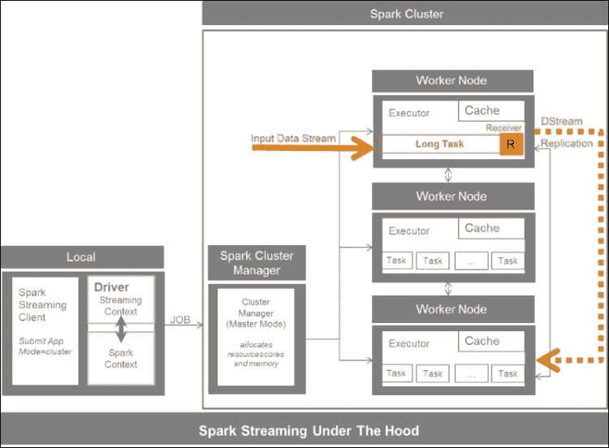

Spark 接收器可以从许多来源获取数据。核心输入来源包括 TCP 套接字和 HDFS/Amazon S3 到 Akka Actors。其他来源包括 Apache Kafka、Apache Flume、Amazon Kinesis、ZeroMQ、Twitter 和自定义或用户定义的接收器。

我们区分了可靠的资源，它们确认接收到数据并进行复制以便可能的重发，与不确认消息接收的不可靠接收者。Spark 在工作节点、分区和接收者方面进行了扩展。

下图概述了 Spark Streaming 的内部工作，以及可能的来源和持久性选项：

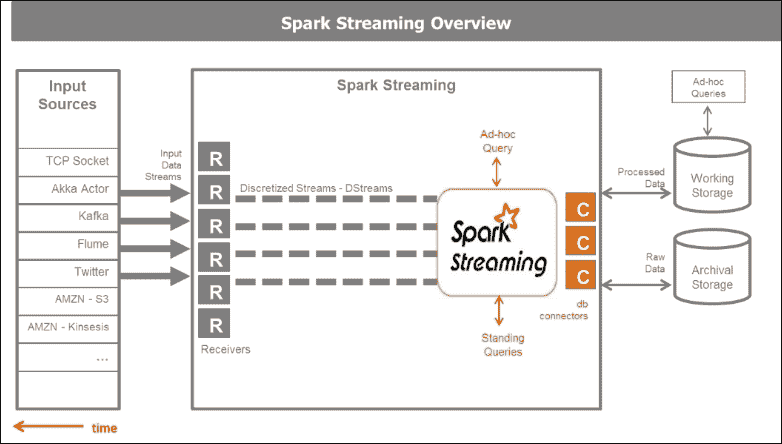

## 深入了解 Spark Streaming

Spark Streaming 由接收器组成，并由离散化流和用于持久性的 Spark 连接器提供支持。

至于 Spark Core，其基本数据结构是 RDD，而 Spark Streaming 的基本编程抽象是离散化流或 DStream。

下图说明了离散化流作为 RDD 的连续序列。DStream 的批次间隔是可配置的。

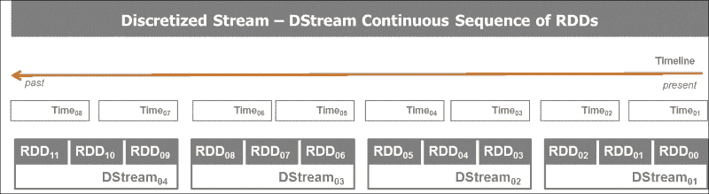

DStreams 在批次间隔中快照传入的数据。这些时间步骤通常在 500 毫秒到几秒之间。DStream 的基本结构是 RDD。

DStream 本质上是一系列连续的 RDD。这很强大，因为它允许我们利用 Spark Streaming 中所有传统的函数、转换和 Spark Core 中可用的操作，并允许我们与 Spark SQL 对话，对传入的数据流执行 SQL 查询，并使用 Spark MLlib。类似于通用和键值对 RDD 上的转换是适用的。DStreams 受益于内部 RDD 的谱系和容错性。离散流操作还存在其他转换和输出操作。大多数 DStream 上的通用操作是**transform**和**foreachRDD**。

以下图表概述了 DStreams 的生命周期。从创建消息的微批处理到应用`transformation`函数和触发 Spark 作业的 RDD。分解图表中的步骤，我们从上到下阅读图表：

1.  在输入流中，传入的消息根据微批处理的时间窗口分配在容器中进行缓冲。

1.  在离散化流步骤中，缓冲的微批处理被转换为 DStream RDD。

1.  映射的 DStream 步骤是通过将转换函数应用于原始 DStream 而获得的。这前三个步骤构成了在预定义时间窗口中接收到的原始数据的转换。由于底层数据结构是 RDD，我们保留了转换的数据谱系。

1.  最后一步是对 RDD 的操作。它触发 Spark 作业。

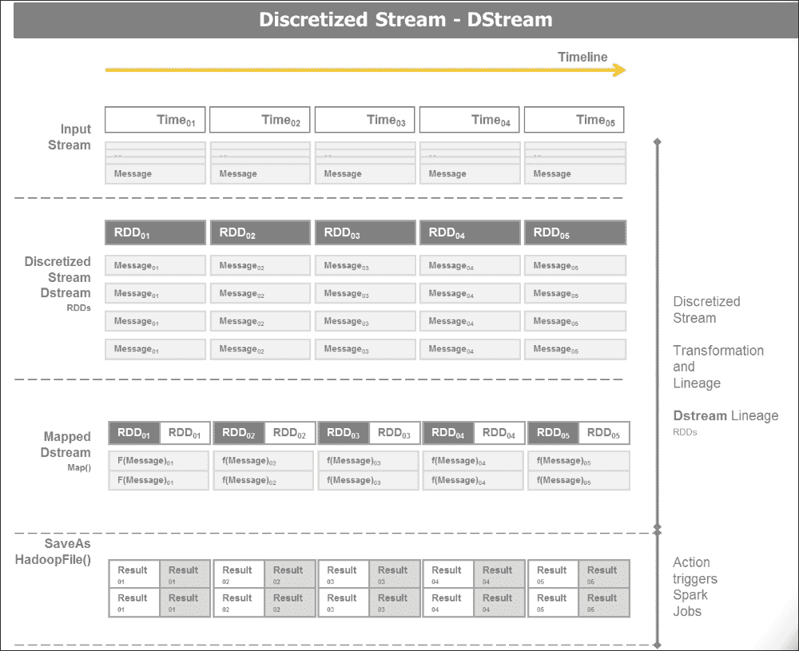

转换可以是无状态的或有状态的。*无状态*意味着程序不维护状态，而*有状态*意味着程序保持状态，这种情况下，先前的事务被记住并可能影响当前事务。有状态操作修改或需要系统的某些状态，而无状态操作则不需要。

无状态转换一次处理 DStream 中的每个批处理。有状态转换处理多个批次以获得结果。有状态转换需要配置检查点目录。检查点是 Spark Streaming 中容错的主要机制，用于定期保存有关应用程序的数据和元数据。

Spark Streaming 有两种类型的有状态转换：`updateStateByKey`和窗口转换。

`updateStateByKey`是维护流中每个键的状态的转换。它返回一个新的*state* DStream，其中每个键的状态都通过将给定函数应用于键的先前状态和每个键的新值来更新。一个示例是在推文流中给定标签的运行计数。

窗口转换在滑动窗口中跨多个批次进行。窗口具有指定的长度或持续时间，以时间单位指定。它必须是 DStream 批处理间隔的倍数。它定义了窗口转换中包括多少批次。

窗口具有指定的滑动间隔或滑动持续时间。它必须是 DStream 批处理间隔的倍数。它定义了滑动窗口或计算窗口转换的频率。

以下模式描述了在 DStreams 上进行窗口操作，以获得具有给定长度和滑动间隔的窗口 DStreams：

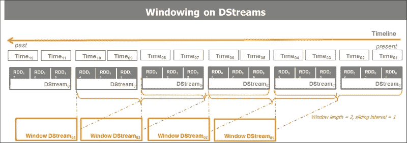

一个示例函数是`countByWindow`（`windowLength`，`slideInterval`）。它返回一个新的 DStream，其中每个 RDD 都有一个由计算此 DStream 上的滑动窗口中的元素数量生成的单个元素。在这种情况下，一个示例是在推文流中每 60 秒对给定标签的运行计数。窗口时间范围是指定的。

分钟级窗口长度是合理的。小时级窗口长度不建议，因为它会消耗大量计算和内存。更方便的做法是在诸如 Cassandra 或 HBase 之类的数据库中聚合数据。

窗口转换根据窗口长度和窗口滑动间隔计算结果。Spark 的性能主要受窗口长度、窗口滑动间隔和持久性的影响。

## 建立容错

实时流处理系统必须 24/7 运行。它们需要对系统中的各种故障具有弹性。Spark 及其 RDD 抽象设计成无缝处理集群中任何工作节点的故障。

主要的 Spark Streaming 容错机制是检查点、自动驱动程序重启和自动故障转移。Spark 通过检查点实现了从驱动程序故障中恢复，从而保留了应用程序状态。

写前日志、可靠的接收器和文件流保证了从 Spark 版本 1.2 开始的零数据丢失。写前日志代表了一个容错的存储接收到的数据。

故障需要重新计算结果。DStream 操作具有精确一次的语义。转换可以多次重新计算，但结果将是相同的。DStream 输出操作具有至少一次的语义。输出操作可能会被执行多次。

# 使用 TCP 套接字处理实时数据

作为对流操作整体理解的一个基础，我们将首先尝试使用 TCP 套接字进行实验。TCP 套接字在客户端和服务器之间建立双向通信，可以通过已建立的连接交换数据。WebSocket 连接是长期存在的，不像典型的 HTTP 连接。HTTP 不适用于保持从服务器到 Web 浏览器的开放连接以持续推送数据。因此，大多数 Web 应用程序通过频繁的**异步 JavaScript**（**AJAX**）和 XML 请求采用了长轮询。WebSocket 在 HTML5 中标准化和实现，正在超越 Web 浏览器，成为客户端和服务器之间实时通信的跨平台标准。

## 设置 TCP 套接字

我们通过运行`netcat`创建一个 TCP 套接字服务器，`netcat`是大多数 Linux 系统中的一个小型实用程序，作为数据服务器使用命令`> nc -lk 9999`，其中`9999`是我们发送数据的端口：

```py
#
# Socket Server
#
an@an-VB:~$ nc -lk 9999
hello world
how are you
hello  world
cool it works
```

一旦 netcat 运行起来，我们将打开第二个控制台，使用我们的 Spark Streaming 客户端接收和处理数据。一旦 Spark Streaming 客户端控制台开始监听，我们就开始输入要处理的单词，即`hello world`。

## 处理实时数据

我们将使用 Spark 捆绑包中提供的 Spark Streaming 示例程序`network_wordcount.py`。它可以在 GitHub 存储库[`github.com/apache/spark/blob/master/examples/src/main/python/streaming/network_wordcount.py`](https://github.com/apache/spark/blob/master/examples/src/main/python/streaming/network_wordcount.py)中找到。代码如下：

```py
"""
 Counts words in UTF8 encoded, '\n' delimited text received from the network every second.
 Usage: network_wordcount.py <hostname> <port>
   <hostname> and <port> describe the TCP server that Spark Streaming would connect to receive data.
 To run this on your local machine, you need to first run a Netcat server
    `$ nc -lk 9999`
 and then run the example
    `$ bin/spark-submit examples/src/main/python/streaming/network_wordcount.py localhost 9999`
"""
from __future__ import print_function

import sys

from pyspark import SparkContext
from pyspark.streaming import StreamingContext

if __name__ == "__main__":
    if len(sys.argv) != 3:
        print("Usage: network_wordcount.py <hostname> <port>", file=sys.stderr)
        exit(-1)
    sc = SparkContext(appName="PythonStreamingNetworkWordCount")
    ssc = StreamingContext(sc, 1)

    lines = ssc.socketTextStream(sys.argv[1], int(sys.argv[2]))
    counts = lines.flatMap(lambda line: line.split(" "))\
                  .map(lambda word: (word, 1))\
                  .reduceByKey(lambda a, b: a+b)
    counts.pprint()

    ssc.start()
    ssc.awaitTermination()
```

在这里，我们解释了程序的步骤：

1.  代码首先使用以下命令初始化 Spark Streaming 上下文：

```py
ssc = StreamingContext(sc, 1)

```

1.  接下来，设置流计算。

1.  定义了一个或多个接收数据的 DStream 对象，以连接到本地主机或`127.0.0.1`上的`端口 9999`：

```py
stream = ssc.socketTextStream("127.0.0.1", 9999)

```

1.  已定义 DStream 计算：转换和输出操作：

```py
stream.map(x: lambda (x,1))
.reduce(a+b)
.print()
```

1.  计算已经开始：

```py
ssc.start()

```

1.  程序终止等待手动或错误处理完成：

```py
ssc.awaitTermination()

```

1.  手动完成是一个选项，当已知完成条件时：

```py
ssc.stop()

```

我们可以通过访问 Spark 监控主页`localhost:4040`来监视 Spark Streaming 应用程序。

这是运行程序并在`netcat`服务器控制台上输入单词的结果：

```py
#
# Socket Client
# an@an-VB:~/spark/spark-1.5.0-bin-hadoop2.6$ ./bin/spark-submit examples/src/main/python/streaming/network_wordcount.py localhost 9999
```

通过连接到`端口 9999`上的本地主机运行 Spark Streaming `network_count`程序：

```py
an@an-VB:~/spark/spark-1.5.0-bin-hadoop2.6$ ./bin/spark-submit examples/src/main/python/streaming/network_wordcount.py localhost 9999
-------------------------------------------
Time: 2015-10-18 20:06:06
-------------------------------------------
(u'world', 1)
(u'hello', 1)

-------------------------------------------
Time: 2015-10-18 20:06:07
-------------------------------------------
. . .
-------------------------------------------
Time: 2015-10-18 20:06:17
-------------------------------------------
(u'you', 1)
(u'how', 1)
(u'are', 1)

-------------------------------------------
Time: 2015-10-18 20:06:18
-------------------------------------------

. . .

-------------------------------------------
Time: 2015-10-18 20:06:26
-------------------------------------------
(u'', 1)
(u'world', 1)
(u'hello', 1)

-------------------------------------------
Time: 2015-10-18 20:06:27
-------------------------------------------
. . .
-------------------------------------------
Time: 2015-10-18 20:06:37
-------------------------------------------
(u'works', 1)
(u'it', 1)
(u'cool', 1)

-------------------------------------------
Time: 2015-10-18 20:06:38
-------------------------------------------

```

因此，我们已经通过`端口 9999`上的套接字建立了连接，流式传输了`netcat`服务器发送的数据，并对发送的消息进行了字数统计。

# 实时操作 Twitter 数据

Twitter 提供两种 API。一种是搜索 API，基本上允许我们根据搜索词检索过去的 tweets。这就是我们在本书的前几章中从 Twitter 收集数据的方式。有趣的是，对于我们当前的目的，Twitter 提供了一个实时流 API，允许我们摄取博客圈中发布的 tweets。

## 实时处理来自 Twitter firehose 的 Tweets

以下程序连接到 Twitter firehose 并处理传入的 tweets，排除已删除或无效的 tweets，并实时解析只提取`screen name`，实际 tweet 或`tweet text`，`retweet`计数，`geo-location`信息。处理后的 tweets 由 Spark Streaming 收集到 RDD 队列中，然后以一秒的间隔显示在控制台上：

```py
"""
Twitter Streaming API Spark Streaming into an RDD-Queue to process tweets live

 Create a queue of RDDs that will be mapped/reduced one at a time in
 1 second intervals.

 To run this example use
    '$ bin/spark-submit examples/AN_Spark/AN_Spark_Code/s07_twitterstreaming.py'

"""
#
import time
from pyspark import SparkContext
from pyspark.streaming import StreamingContext
import twitter
import dateutil.parser
import json

# Connecting Streaming Twitter with Streaming Spark via Queue
class Tweet(dict):
    def __init__(self, tweet_in):
        super(Tweet, self).__init__(self)
        if tweet_in and 'delete' not in tweet_in:
            self['timestamp'] = dateutil.parser.parse(tweet_in[u'created_at']
                                ).replace(tzinfo=None).isoformat()
            self['text'] = tweet_in['text'].encode('utf-8')
            #self['text'] = tweet_in['text']
            self['hashtags'] = [x['text'].encode('utf-8') for x in tweet_in['entities']['hashtags']]
            #self['hashtags'] = [x['text'] for x in tweet_in['entities']['hashtags']]
            self['geo'] = tweet_in['geo']['coordinates'] if tweet_in['geo'] else None
            self['id'] = tweet_in['id']
            self['screen_name'] = tweet_in['user']['screen_name'].encode('utf-8')
            #self['screen_name'] = tweet_in['user']['screen_name']
            self['user_id'] = tweet_in['user']['id']

def connect_twitter():
    twitter_stream = twitter.TwitterStream(auth=twitter.OAuth(
        token = "get_your_own_credentials",
        token_secret = "get_your_own_credentials",
        consumer_key = "get_your_own_credentials",
        consumer_secret = "get_your_own_credentials"))
    return twitter_stream

def get_next_tweet(twitter_stream):
    stream = twitter_stream.statuses.sample(block=True)
    tweet_in = None
    while not tweet_in or 'delete' in tweet_in:
        tweet_in = stream.next()
        tweet_parsed = Tweet(tweet_in)
    return json.dumps(tweet_parsed)

def process_rdd_queue(twitter_stream):
    # Create the queue through which RDDs can be pushed to
    # a QueueInputDStream
    rddQueue = []
    for i in range(3):
        rddQueue += [ssc.sparkContext.parallelize([get_next_tweet(twitter_stream)], 5)]

    lines = ssc.queueStream(rddQueue)
    lines.pprint()

if __name__ == "__main__":
    sc = SparkContext(appName="PythonStreamingQueueStream")
    ssc = StreamingContext(sc, 1)

    # Instantiate the twitter_stream
    twitter_stream = connect_twitter()
    # Get RDD queue of the streams json or parsed
    process_rdd_queue(twitter_stream)

    ssc.start()
    time.sleep(2)
    ssc.stop(stopSparkContext=True, stopGraceFully=True)
```

当我们运行这个程序时，它会产生以下输出：

```py
an@an-VB:~/spark/spark-1.5.0-bin-hadoop2.6$ bin/spark-submit examples/AN_Spark/AN_Spark_Code/s07_twitterstreaming.py
-------------------------------------------
Time: 2015-11-03 21:53:14
-------------------------------------------
{"user_id": 3242732207, "screen_name": "cypuqygoducu", "timestamp": "2015-11-03T20:53:04", "hashtags": [], "text": "RT @VIralBuzzNewss: Our Distinctive Edition Holiday break Challenge Is In this article! Hooray!... -  https://t.co/9d8wumrd5v https://t.co/\u2026", "geo": null, "id": 661647303678259200}

-------------------------------------------
Time: 2015-11-03 21:53:15
-------------------------------------------
{"user_id": 352673159, "screen_name": "melly_boo_orig", "timestamp": "2015-11-03T20:53:05", "hashtags": ["eminem"], "text": "#eminem https://t.co/GlEjPJnwxy", "geo": null, "id": 661647307847409668}

-------------------------------------------
Time: 2015-11-03 21:53:16
-------------------------------------------
{"user_id": 500620889, "screen_name": "NBAtheist", "timestamp": "2015-11-03T20:53:06", "hashtags": ["tehInterwebbies", "Nutters"], "text": "See? That didn't take long or any actual effort. This is #tehInterwebbies ... #Nutters Abound! https://t.co/QS8gLStYFO", "geo": null, "id": 661647312062709761}

```

因此，我们得到了使用 Spark 流处理实时 tweets 并实时处理它们的示例。

# 构建可靠且可扩展的流媒体应用程序

摄取数据是从各种来源获取数据并立即或以后进行处理的过程。数据消费系统分散并且可能在物理上和架构上远离来源。数据摄取通常使用脚本和基本自动化手段手动实现。实际上需要像 Flume 和 Kafka 这样的更高级框架。

数据摄取的挑战在于数据来源分散且瞬息万变，这使得集成变得脆弱。天气、交通、社交媒体、网络活动、车间传感器、安全和监控的数据生产是持续不断的。不断增加的数据量和速率，再加上不断变化的数据结构和语义，使得数据摄取变得临时性和容易出错。

目标是变得更加敏捷、可靠和可扩展。数据摄取的敏捷性、可靠性和可扩展性决定了管道的整体健康状况。敏捷性意味着随着新来源的出现进行集成，并根据需要对现有来源进行更改。为了确保安全性和可靠性，我们需要保护基础设施免受数据丢失的影响，并防止数据入口处对下游应用程序造成静默数据损坏。可扩展性可以避免摄取瓶颈，同时保持成本可控。

| 摄取模式 | 描述 | 示例 |
| --- | --- | --- |
| 手动或脚本 | 使用命令行界面或图形界面进行文件复制 | HDFS 客户端，Cloudera Hue |
| 批量数据传输 | 使用工具进行批量数据传输 | DistCp，Sqoop |
| 微批处理 | 小批量数据传输 | Sqoop，Sqoop2Storm |
| 流水线 | 流式事件传输 | Flume Scribe |
| 消息队列 | 发布订阅事件总线 | Kafka，Kinesis |

为了实现能够摄取多个数据流、在飞行中处理数据并理解所有内容以做出快速决策的事件驱动业务，统一日志是关键驱动因素。

统一日志是一个集中的企业结构化日志，可供实时订阅。所有组织的数据都放在一个中央日志中进行订阅。记录按照它们被写入的顺序从零开始编号。它也被称为提交日志或日志。*统一日志*的概念是 Kappa 架构的核心原则。

统一日志的属性如下：

+   **统一的**：整个组织只有一个部署

+   **仅追加的**：事件是不可变的并且是追加的

+   **有序的**：每个事件在分片内具有唯一的偏移量

+   **分布式的**：为了容错目的，统一日志在计算机集群上进行冗余分布

+   **快速的**：系统每秒摄取数千条消息

## 设置 Kafka

为了将数据的下游特定消费与数据的上游发射隔离开来，我们需要将数据的提供者与数据的接收者或消费者解耦。 由于它们生活在两个不同的世界，具有不同的周期和约束条件，Kafka 解耦了数据管道。

Apache Kafka 是一个经过重新构想的分布式发布订阅消息系统，被重新构想为分布式提交日志。 消息按主题存储。

Apache Kafka 具有以下属性。 它支持：

+   高吞吐量，适用于大量事件源

+   实时处理新的和派生的数据源

+   大数据积压和离线消费的持久性

+   低延迟作为企业范围的消息传递系统

+   由于其分布式性质，具有容错能力

消息存储在具有唯一顺序 ID 的分区中，称为“偏移量”。 消费者通过元组（“偏移量”，“分区”，“主题”）跟踪它们的指针。

让我们深入了解 Kafka 的结构。

Kafka 基本上有三个组件：*生产者*，*消费者*和*代理*。 生产者将数据推送并写入代理。 消费者从代理中拉取和读取数据。 代理不会将消息推送给消费者。 消费者从代理中拉取消息。 设置是由 Apache Zookeeper 分布和协调的。

代理在主题中管理和存储数据。 主题分为复制分区。 数据在代理中持久存在，但在消费之前不会被删除，而是在保留期间。 如果消费者失败，它可以随时返回代理以获取数据。

Kafka 需要 Apache ZooKeeper。 ZooKeeper 是分布式应用程序的高性能协调服务。 它集中管理配置，注册表或命名服务，组成员资格，锁定以及服务器之间的协调同步。 它提供具有元数据，监视统计信息和集群状态的分层命名空间。 ZooKeeper 可以动态引入代理和消费者，然后重新平衡集群。

Kafka 生产者不需要 ZooKeeper。 Kafka 代理使用 ZooKeeper 提供一般状态信息，并在故障时选举领导者。 Kafka 消费者使用 ZooKeeper 跟踪消息偏移量。 较新版本的 Kafka 将保存消费者通过 ZooKeeper 并可以检索 Kafka 特殊主题信息。 Kafka 为生产者提供自动负载平衡。

以下图表概述了 Kafka 的设置：

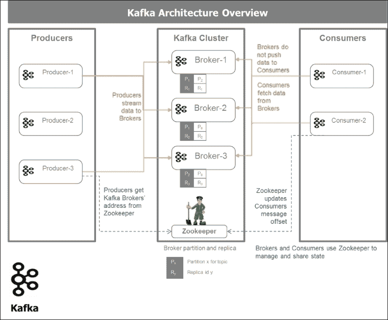

### 安装和测试 Kafka

我们将从专用网页[`kafka.apache.org/downloads.html`](http://kafka.apache.org/downloads.html)下载 Apache Kafka 二进制文件，并使用以下步骤在我们的机器上安装软件：

1.  下载代码。

1.  下载 0.8.2.0 版本并“解压”它：

```py
> tar -xzf kafka_2.10-0.8.2.0.tgz
> cd kafka_2.10-0.8.2.0

```

1.  启动`zooeeper`。 Kafka 使用 ZooKeeper，因此我们需要首先启动 ZooKeeper 服务器。 我们将使用 Kafka 打包的便利脚本来获取单节点 ZooKeeper 实例。

```py
> bin/zookeeper-server-start.sh config/zookeeper.properties
an@an-VB:~/kafka/kafka_2.10-0.8.2.0$ bin/zookeeper-server-start.sh config/zookeeper.properties

[2015-10-31 22:49:14,808] INFO Reading configuration from: config/zookeeper.properties (org.apache.zookeeper.server.quorum.QuorumPeerConfig)
[2015-10-31 22:49:14,816] INFO autopurge.snapRetainCount set to 3 (org.apache.zookeeper.server.DatadirCleanupManager)...

```

1.  现在启动 Kafka 服务器：

```py
> bin/kafka-server-start.sh config/server.properties

an@an-VB:~/kafka/kafka_2.10-0.8.2.0$ bin/kafka-server-start.sh config/server.properties
[2015-10-31 22:52:04,643] INFO Verifying properties (kafka.utils.VerifiableProperties)
[2015-10-31 22:52:04,714] INFO Property broker.id is overridden to 0 (kafka.utils.VerifiableProperties)
[2015-10-31 22:52:04,715] INFO Property log.cleaner.enable is overridden to false (kafka.utils.VerifiableProperties)
[2015-10-31 22:52:04,715] INFO Property log.dirs is overridden to /tmp/kafka-logs (kafka.utils.VerifiableProperties) [2013-04-22 15:01:47,051] INFO Property socket.send.buffer.bytes is overridden to 1048576 (kafka.utils.VerifiableProperties)

```

1.  创建一个主题。 让我们创建一个名为 test 的主题，其中只有一个分区和一个副本：

```py
> bin/kafka-topics.sh --create --zookeeper localhost:2181 --replication-factor 1 --partitions 1 --topic test

```

1.  如果我们运行`list`主题命令，我们现在可以看到该主题：

```py
> bin/kafka-topics.sh --list --zookeeper localhost:2181
Test
an@an-VB:~/kafka/kafka_2.10-0.8.2.0$ bin/kafka-topics.sh --create --zookeeper localhost:2181 --replication-factor 1 --partitions 1 --topic test
Created topic "test".
an@an-VB:~/kafka/kafka_2.10-0.8.2.0$ bin/kafka-topics.sh --list --zookeeper localhost:2181
test

```

1.  通过创建生产者和消费者来检查 Kafka 安装。 我们首先启动一个“生产者”并在控制台中输入消息：

```py
an@an-VB:~/kafka/kafka_2.10-0.8.2.0$ bin/kafka-console-producer.sh --broker-list localhost:9092 --topic test
[2015-10-31 22:54:43,698] WARN Property topic is not valid (kafka.utils.VerifiableProperties)
This is a message
This is another message

```

1.  然后我们启动一个消费者来检查我们是否收到消息：

```py
an@an-VB:~$ cd kafka/
an@an-VB:~/kafka$ cd kafka_2.10-0.8.2.0/
an@an-VB:~/kafka/kafka_2.10-0.8.2.0$ bin/kafka-console-consumer.sh --zookeeper localhost:2181 --topic test --from-beginning
This is a message
This is another message

```

消息已被消费者正确接收：

1.  检查 Kafka 和 Spark Streaming 消费者。 我们将使用 Spark 捆绑包中提供的 Spark Streaming Kafka 单词计数示例。 警告：当我们提交 Spark 作业时，我们必须绑定 Kafka 软件包`--packages org.apache.spark:spark-streaming-kafka_2.10:1.5.0`。 命令如下：

```py
./bin/spark-submit --packages org.apache.spark:spark-streaming-kafka_2.10:1.5.0 \ examples/src/main/python/streaming/kafka_wordcount.py \

localhost:2181 test

```

1.  当我们使用 Kafka 启动 Spark Streaming 单词计数程序时，我们会得到以下输出：

```py
an@an-VB:~/spark/spark-1.5.0-bin-hadoop2.6$ ./bin/spark-submit --packages org.apache.spark:spark-streaming-kafka_2.10:1.5.0 examples/src/main/python/streaming/kafka_wordcount.py 
localhost:2181 test

-------------------------------------------
Time: 2015-10-31 23:46:33
-------------------------------------------
(u'', 1)
(u'from', 2)
(u'Hello', 2)
(u'Kafka', 2)

-------------------------------------------
Time: 2015-10-31 23:46:34
-------------------------------------------

-------------------------------------------
Time: 2015-10-31 23:46:35
-------------------------------------------

```

1.  安装 Kafka Python 驱动程序，以便能够以编程方式开发生产者和消费者，并使用 Python 与 Kafka 和 Spark 进行交互。我们将使用 David Arthur 的经过测试的库，也就是 GitHub 上的 Mumrah（[`github.com/mumrah`](https://github.com/mumrah)）。我们可以使用 pip 进行安装，如下所示：

```py
> pip install kafka-python
an@an-VB:~$ pip install kafka-python
Collecting kafka-python
 Downloading kafka-python-0.9.4.tar.gz (63kB)
...
Successfully installed kafka-python-0.9.4

```

### 开发生产者

以下程序创建了一个简单的 Kafka 生产者，它将发送消息*this is a message sent from the Kafka producer:*五次，然后每秒跟一个时间戳：

```py
#
# kafka producer
#
#
import time
from kafka.common import LeaderNotAvailableError
from kafka.client import KafkaClient
from kafka.producer import SimpleProducer
from datetime import datetime

def print_response(response=None):
    if response:
        print('Error: {0}'.format(response[0].error))
        print('Offset: {0}'.format(response[0].offset))

def main():
    kafka = KafkaClient("localhost:9092")
    producer = SimpleProducer(kafka)
    try:
        time.sleep(5)
        topic = 'test'
        for i in range(5):
            time.sleep(1)
            msg = 'This is a message sent from the kafka producer: ' \
                  + str(datetime.now().time()) + ' -- '\
                  + str(datetime.now().strftime("%A, %d %B %Y %I:%M%p"))
            print_response(producer.send_messages(topic, msg))
    except LeaderNotAvailableError:
        # https://github.com/mumrah/kafka-python/issues/249
        time.sleep(1)
        print_response(producer.send_messages(topic, msg))

    kafka.close()

if __name__ == "__main__":
    main()
```

当我们运行此程序时，会生成以下输出：

```py
an@an-VB:~/spark/spark-1.5.0-bin-hadoop2.6/examples/AN_Spark/AN_Spark_Code$ python s08_kafka_producer_01.py
Error: 0
Offset: 13
Error: 0
Offset: 14
Error: 0
Offset: 15
Error: 0
Offset: 16
Error: 0
Offset: 17
an@an-VB:~/spark/spark-1.5.0-bin-hadoop2.6/examples/AN_Spark/AN_Spark_Code$

```

它告诉我们没有错误，并给出了 Kafka 代理给出的消息的偏移量。

### 开发消费者

为了从 Kafka 代理获取消息，我们开发了一个 Kafka 消费者：

```py
# kafka consumer
# consumes messages from "test" topic and writes them to console.
#
from kafka.client import KafkaClient
from kafka.consumer import SimpleConsumer

def main():
  kafka = KafkaClient("localhost:9092")
  print("Consumer established connection to kafka")
  consumer = SimpleConsumer(kafka, "my-group", "test")
  for message in consumer:
    # This will wait and print messages as they become available
    print(message)

if __name__ == "__main__":
    main()
```

当我们运行此程序时，我们有效地确认消费者接收了所有消息：

```py
an@an-VB:~$ cd ~/spark/spark-1.5.0-bin-hadoop2.6/examples/AN_Spark/AN_Spark_Code/
an@an-VB:~/spark/spark-1.5.0-bin-hadoop2.6/examples/AN_Spark/AN_Spark_Code$ python s08_kafka_consumer_01.py
Consumer established connection to kafka
OffsetAndMessage(offset=13, message=Message(magic=0, attributes=0, key=None, value='This is a message sent from the kafka producer: 11:50:17.867309Sunday, 01 November 2015 11:50AM'))
...
OffsetAndMessage(offset=17, message=Message(magic=0, attributes=0, key=None, value='This is a message sent from the kafka producer: 11:50:22.051423Sunday, 01 November 2015 11:50AM'))

```

### 为 Kafka 开发 Spark Streaming 消费者

根据 Spark Streaming 包中提供的示例代码，我们将为 Kafka 创建一个 Spark Streaming 消费者，并对存储在代理中的消息进行词频统计：

```py
#
# Kafka Spark Streaming Consumer    
#
from __future__ import print_function

import sys

from pyspark import SparkContext
from pyspark.streaming import StreamingContext
from pyspark.streaming.kafka import KafkaUtils

if __name__ == "__main__":
    if len(sys.argv) != 3:
        print("Usage: kafka_spark_consumer_01.py <zk> <topic>", file=sys.stderr)
        exit(-1)

    sc = SparkContext(appName="PythonStreamingKafkaWordCount")
    ssc = StreamingContext(sc, 1)

    zkQuorum, topic = sys.argv[1:]
    kvs = KafkaUtils.createStream(ssc, zkQuorum, "spark-streaming-consumer", {topic: 1})
    lines = kvs.map(lambda x: x[1])
    counts = lines.flatMap(lambda line: line.split(" ")) \
        .map(lambda word: (word, 1)) \
        .reduceByKey(lambda a, b: a+b)
    counts.pprint()

    ssc.start()
    ssc.awaitTermination()
```

使用以下 Spark 提交命令运行此程序：

```py
./bin/spark-submit --packages org.apache.spark:spark-streaming-kafka_2.10:1.5.0 examples/AN_Spark/AN_Spark_Code/s08_kafka_spark_consumer_01.py localhost:2181 test
```

我们得到以下输出：

```py
an@an-VB:~$ cd spark/spark-1.5.0-bin-hadoop2.6/
an@an-VB:~/spark/spark-1.5.0-bin-hadoop2.6$ ./bin/spark-submit \
>     --packages org.apache.spark:spark-streaming-kafka_2.10:1.5.0 \
>     examples/AN_Spark/AN_Spark_Code/s08_kafka_spark_consumer_01.py localhost:2181 test
...
:: retrieving :: org.apache.spark#spark-submit-parent
  confs: [default]
  0 artifacts copied, 10 already retrieved (0kB/18ms)
-------------------------------------------
Time: 2015-11-01 12:13:16
-------------------------------------------

-------------------------------------------
Time: 2015-11-01 12:13:17
-------------------------------------------

-------------------------------------------
Time: 2015-11-01 12:13:18
-------------------------------------------

-------------------------------------------
Time: 2015-11-01 12:13:19
-------------------------------------------
(u'a', 5)
(u'the', 5)
(u'11:50AM', 5)
(u'from', 5)
(u'This', 5)
(u'11:50:21.044374Sunday,', 1)
(u'message', 5)
(u'11:50:20.036422Sunday,', 1)
(u'11:50:22.051423Sunday,', 1)
(u'11:50:17.867309Sunday,', 1)
...

-------------------------------------------
Time: 2015-11-01 12:13:20
-------------------------------------------

-------------------------------------------
Time: 2015-11-01 12:13:21
-------------------------------------------
```

## 探索 flume

Flume 是一个持续的摄入系统。最初设计为日志聚合系统，但它发展到处理任何类型的流式事件数据。

Flume 是一个分布式、可靠、可扩展和可用的管道系统，用于高效地收集、聚合和传输大量数据。它内置支持上下文路由、过滤复制和多路复用。它是强大且容错的，具有可调节的可靠性机制和许多故障转移和恢复机制。它使用简单可扩展的数据模型，允许实时分析应用。

Flume 提供以下内容：

+   保证交付语义

+   低延迟可靠数据传输

+   无需编码的声明性配置

+   可扩展和可定制的设置

+   与最常用的端点集成

Flume 的结构包括以下元素：

+   **Event**：事件是由 Flume 从源到目的地传输的基本数据单元。它类似于一个带有字节数组有效负载的消息，对 Flume 不透明，并且可选的标头用于上下文路由。

+   **Client**：客户端生成并传输事件。客户端将 Flume 与数据消费者解耦。它是生成事件并将其发送到一个或多个代理的实体。自定义客户端或 Flume log4J 附加程序或嵌入式应用代理可以是客户端。

+   **Agent**：代理是承载源、通道、sink 和其他元素的容器，使事件从一个地方传输到另一个地方。它为托管组件提供配置、生命周期管理和监控。代理是运行 Flume 的物理 Java 虚拟机。

+   **Source**：源是 Flume 接收事件的实体。源至少需要一个通道才能工作，以主动轮询数据或被动等待数据传递给它们。各种源允许收集数据，例如 log4j 日志和 syslogs。

+   **Sink**：Sink 是从通道中排出数据并将其传递到下一个目的地的实体。各种不同的 sink 允许数据流向各种目的地。Sink 支持序列化为用户的格式。一个例子是将事件写入 HDFS 的 HDFS sink。

+   **通道**：通道是源和汇之间的导管，缓冲传入事件，直到被汇耗尽。源将事件馈送到通道，而汇则耗尽通道。通道解耦了上游和下游系统的阻抗。上游的数据突发通过通道被抑制。下游的故障被通道透明地吸收。调整通道容量以应对这些事件是实现这些好处的关键。通道提供两种持久性级别：内存通道，如果 JVM 崩溃则是易失性的，或者由预写日志支持的文件通道，将信息存储到磁盘上。通道是完全事务性的。

让我们说明所有这些概念：

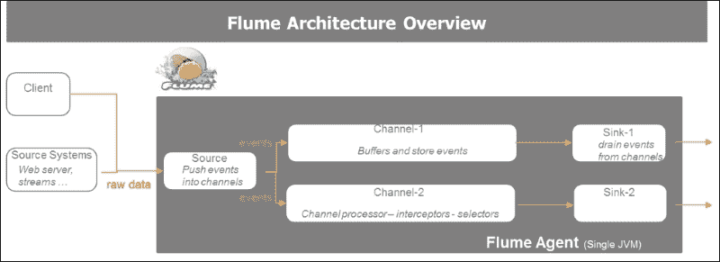

## 使用 Flume、Kafka 和 Spark 开发数据管道

构建具有弹性的数据管道利用了前几节的经验。我们正在使用 Flume 将数据摄取和传输，使用 Kafka 作为可靠和复杂的发布和订阅消息系统进行数据经纪，最后使用 Spark Streaming 进行实时处理计算。

以下图示了流数据管道的组成，作为*connect*、*collect*、*conduct*、*compose*、*consume*、*consign*和*control*活动的序列。这些活动根据用例进行配置：

+   连接建立与流式 API 的绑定。

+   收集创建收集线程。

+   Conduct 通过创建缓冲队列或发布-订阅机制将数据生产者与消费者解耦。

+   Compose 专注于处理数据。

+   Consume 为消费系统提供处理后的数据。Consign 负责数据持久性。

+   控制满足系统、数据和应用程序的治理和监控。

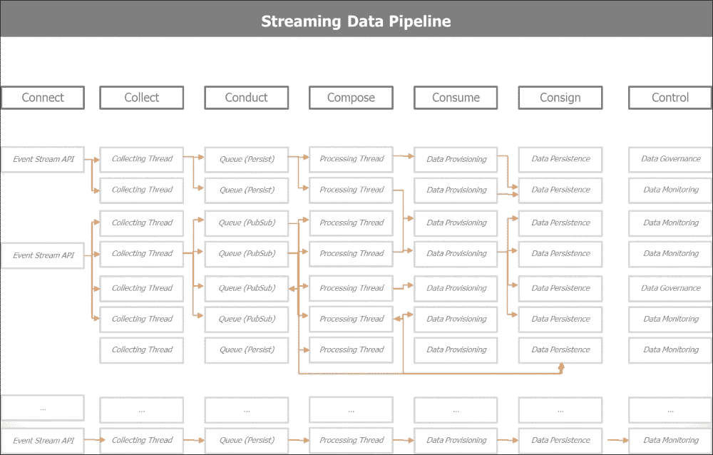

以下图示了流数据管道的概念及其关键组件：Spark Streaming、Kafka、Flume 和低延迟数据库。在消费或控制应用程序中，我们正在实时监控我们的系统（由监视器表示），或者在某些阈值被突破时发送实时警报（由红灯表示）。

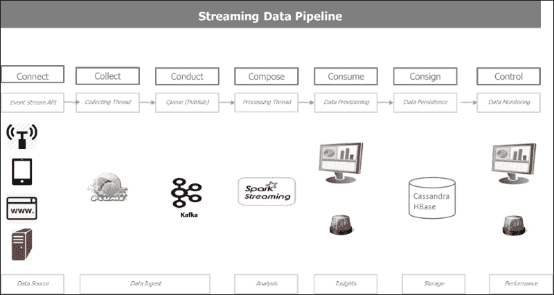

以下图示了 Spark 在单一平台上处理运动数据和静态数据的独特能力，同时根据用例要求与多个持久性数据存储无缝接口。

这张图将到目前为止讨论的所有概念统一在一起。顶部描述了流处理管道，底部描述了批处理管道。它们都在图中间共享一个持久性层，描述了各种持久性和序列化模式。

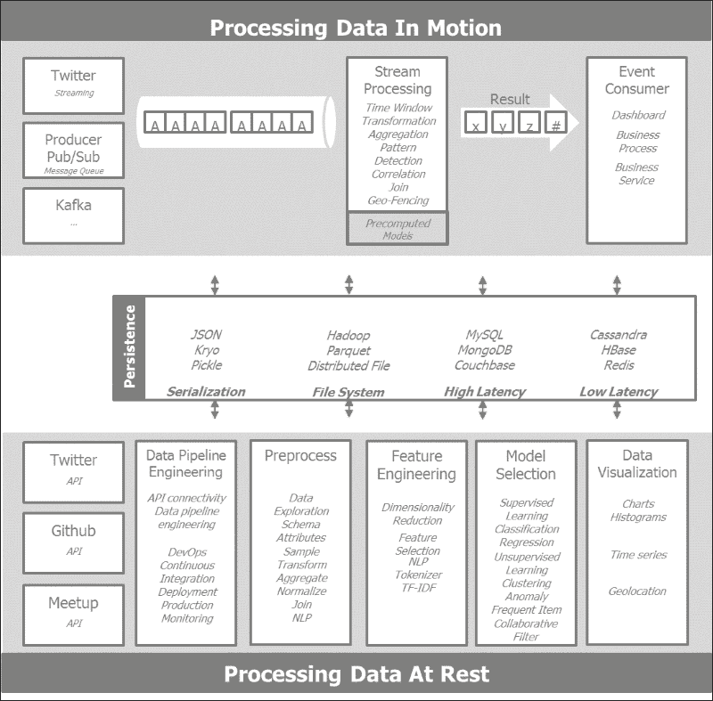

# 关于 Lambda 和 Kappa 架构的结束语

目前流行的有两种架构范式：Lambda 和 Kappa 架构。

Lambda 是 Storm 的创始人和主要贡献者 Nathan Marz 的心血结晶。它基本上主张在所有数据上构建一个功能架构。该架构有两个分支。第一个是批处理分支，旨在由 Hadoop 提供动力，其中历史、高延迟、高吞吐量的数据被预处理并准备好供消费。实时分支旨在由 Storm 提供动力，它处理增量流数据，实时推导见解，并将聚合信息反馈到批处理存储。

Kappa 是 Kafka 的主要贡献者之一 Jay Kreps 及其在 Confluent（以前在 LinkedIn）的同事的心血结晶。它主张一个完整的流水线，有效地在企业级别实现了前几页中所述的统一日志。

## 理解 Lambda 架构

Lambda 架构将批处理和流式数据结合，以提供对所有可用数据的统一查询机制。Lambda 架构设想了三个层次：批处理层存储预先计算的信息，速度层处理实时增量信息作为数据流，最后是服务层，将批处理和实时视图合并用于自由查询。以下图表概述了 Lambda 架构：

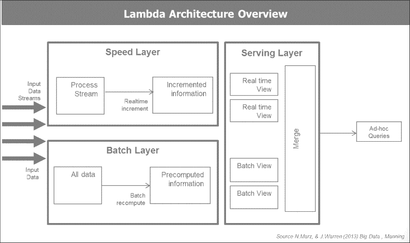

## 理解 Kappa 架构

Kappa 架构提议以流式模式驱动整个企业。Kappa 架构起源于 LinkedIn 的 Jay Kreps 及其同事的批评。自那时起，他们转移并创建了以 Apache Kafka 为主要支持者的 Confluent，以实现 Kappa 架构愿景。其基本原则是以统一日志作为企业信息架构的主要支撑，在全流式模式下运行。

统一日志是一个集中的企业结构化日志，可供实时订阅。所有组织的数据都放在一个中央日志中进行订阅。记录从零开始编号，以便写入。它也被称为提交日志或日志。统一日志的概念是 Kappa 架构的核心原则。

统一日志的属性如下：

+   **统一的**：整个组织只有一个部署

+   **仅追加**：事件是不可变的，会被追加

+   **有序的**：每个事件在一个分片内有唯一的偏移量

+   **分布式**：为了容错目的，统一日志在计算机集群上进行冗余分布

+   **快速的**：系统每秒摄入数千条消息

以下截图捕捉了 Jay Kreps 对 Lambda 架构的保留意见。他对 Lambda 架构的主要保留意见是在两个不同的系统 Hadoop 和 Storm 中实现相同的作业，每个系统都有其特定的特点，并伴随着所有相关的复杂性。Kappa 架构在由 Apache Kafka 提供支持的同一框架中处理实时数据并重新处理历史数据。


# 总结

在本章中，我们阐述了流式架构应用程序的基础，并描述了它们的挑战、约束和好处。我们深入探讨了 Spark Streaming 的内部工作方式，以及它如何与 Spark Core 对话，并与 Spark SQL 和 Spark MLlib 配合。我们通过 TCP 套接字、直播推文摄入以及直接从 Twitter firehose 处理的方式来阐述流式概念。我们讨论了使用 Kafka 将上游数据发布与下游数据订阅和消费解耦的概念，以最大程度地提高整体流式架构的弹性。我们还讨论了 Flume——一个可靠、灵活和可扩展的数据摄入和传输管道系统。Flume、Kafka 和 Spark 的结合在不断变化的环境中提供了无与伦比的稳健性、速度和灵活性。我们在本章中还对两种流式架构范式——Lambda 和 Kappa 架构进行了一些评论和观察。

Lambda 架构将批处理和流式数据结合在一个通用的查询前端。最初它是以 Hadoop 和 Storm 为目标构想的。Spark 具有自己的批处理和流式范例，并提供了一个共同的代码库的单一环境，有效地将这种架构范式实现。

Kappa 架构宣扬了统一日志的概念，它创建了一个面向事件的架构，企业中的所有事件都被导入到一个中央提交日志中，并且实时提供给所有消费系统。

现在我们准备对迄今为止收集和处理的数据进行可视化。
