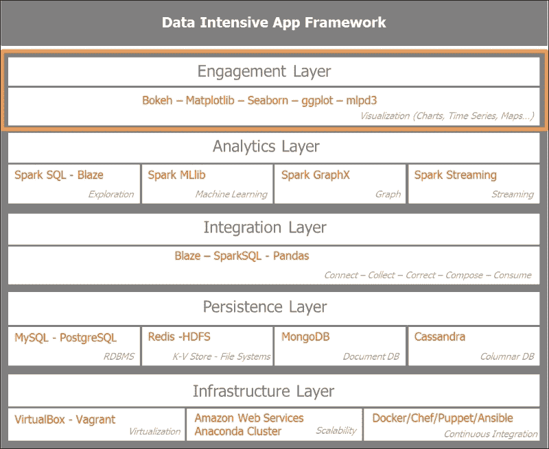
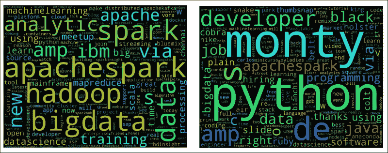
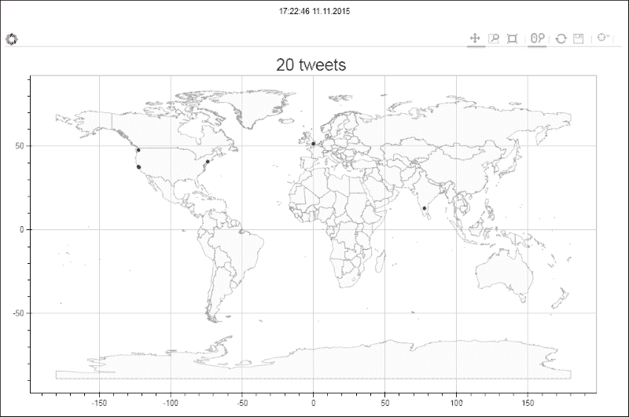
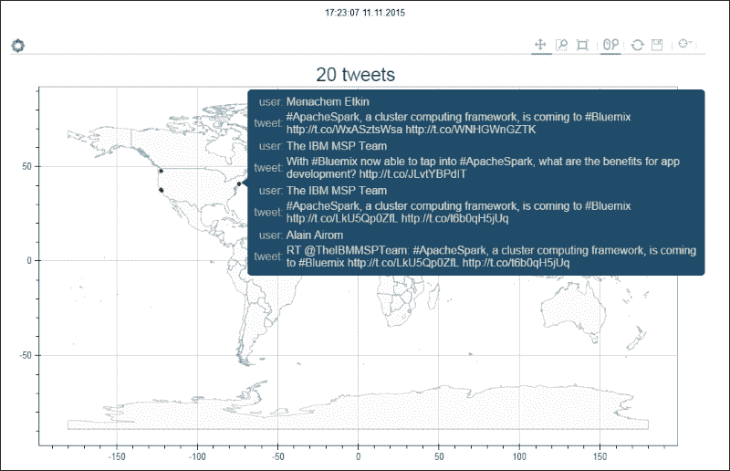
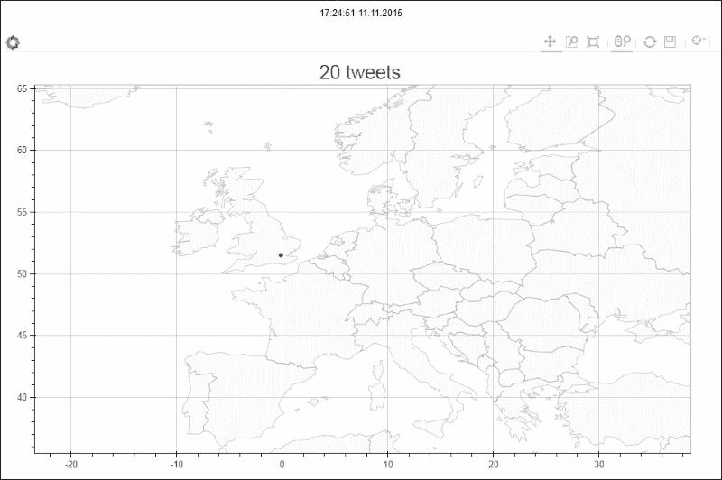
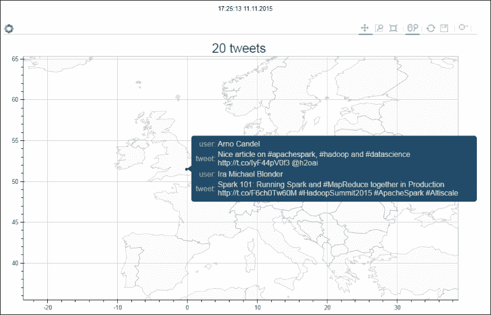
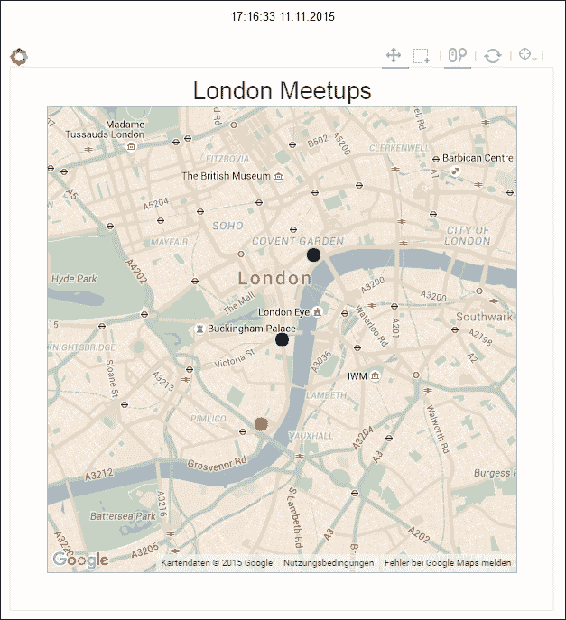
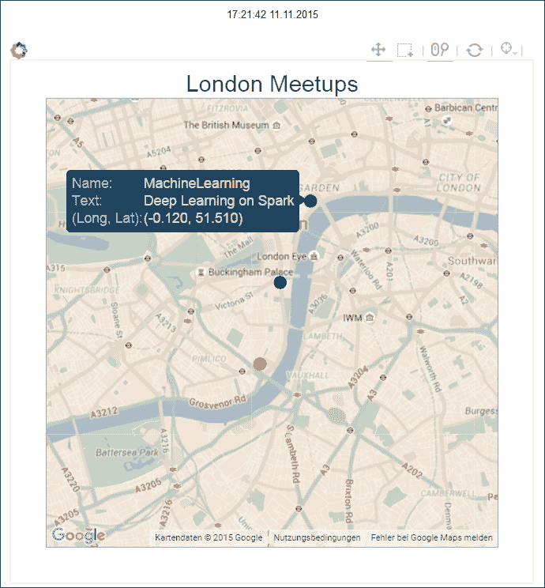
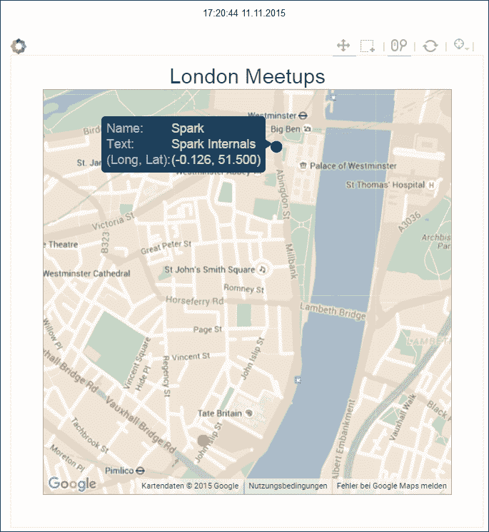

# 第六章：可视化见解和趋势

到目前为止，我们已经专注于从 Twitter 收集、分析和处理数据。我们已经为使用我们的数据进行可视化呈现和提取见解和趋势做好了准备。我们将简要介绍 Python 生态系统中的可视化工具。我们将强调 Bokeh 作为渲染和查看大型数据集的强大工具。Bokeh 是 Python Anaconda Distribution 生态系统的一部分。

在本章中，我们将涵盖以下几点：

+   通过图表和词云来衡量社交网络社区中的关键词和模因

+   映射最活跃的地点，社区围绕特定主题或话题增长

# 重新审视数据密集型应用架构

我们已经达到了数据密集型应用架构的最终层：参与层。这一层关注如何综合、强调和可视化数据消费者的关键上下文相关信息。在控制台中的一堆数字不足以吸引最终用户。将大量信息以快速、易消化和有吸引力的方式呈现是至关重要的。

以下图表设置了本章重点的背景，突出了参与层。



对于 Python 绘图和可视化，我们有很多工具和库。对于我们的目的，最有趣和相关的是以下几个：

+   **Matplotlib** 是 Python 绘图库的鼻祖。Matplotlib 最初是 *John Hunter* 的创意，他是开源软件的支持者，并将 Matplotlib 建立为学术界和数据科学界最流行的绘图库之一。Matplotlib 允许生成图表、直方图、功率谱、条形图、误差图、散点图等。示例可以在 Matplotlib 专用网站 [`matplotlib.org/examples/index.html`](http://matplotlib.org/examples/index.html) 上找到。

+   **Seaborn**，由 *Michael Waskom* 开发，是一个快速可视化统计信息的优秀库。它建立在 Matplotlib 之上，并与 Pandas 和 Python 数据堆栈（包括 Numpy）无缝集成。Seaborn 的图库展示了该库的潜力，网址为 [`stanford.edu/~mwaskom/software/seaborn/examples/index.html`](http://stanford.edu/~mwaskom/software/seaborn/examples/index.html)。

+   **ggplot** 相对较新，旨在为 Python 数据处理者提供 R 生态系统中著名的 ggplot2 的等价物。它具有与 ggplot2 相同的外观和感觉，并使用 Hadley Wickham 阐述的相同图形语法。ggplot 的 Python 版本由 `yhat` 团队开发。更多信息可以在 [`ggplot.yhathq.com`](http://ggplot.yhathq.com) 找到。

+   **D3.js** 是由 *Mike Bostock* 开发的非常流行的 JavaScript 库。**D3** 代表 **数据驱动文档**，利用 HTML、SVG 和 CSS 在任何现代浏览器上为数据赋予生命。它通过操作 DOM（文档对象模型）提供动态、强大、交互式的可视化效果。Python 社区迫不及待地想要将 D3 与 Matplotlib 集成。在 Jake Vanderplas 的推动下，mpld3 被创建，旨在将 `matplotlib` 带到浏览器中。示例图形托管在以下地址：[`mpld3.github.io/index.html`](http://mpld3.github.io/index.html)。

+   **Bokeh**旨在在非常大或流式数据集上提供高性能的交互性，同时利用`D3.js`的许多概念，而不需要编写一些令人生畏的`javascript`和`css`代码。Bokeh 在浏览器上提供动态可视化，无论是否有服务器。它与 Matplotlib、Seaborn 和 ggplot 无缝集成，并在 IPython 笔记本或 Jupyter 笔记本中呈现出色。Bokeh 由 Continuum.io 团队积极开发，并是 Anaconda Python 数据堆栈的一个重要组成部分。

Bokeh 服务器提供了一个完整的、动态的绘图引擎，可以从 JSON 中实现一个反应式场景图。它使用 Web 套接字来保持状态，并使用 Backbone.js 和 Coffee-script 更新 HTML5 画布。由于 Bokeh 是由 JSON 中的数据驱动的，因此它为其他语言（如 R、Scala 和 Julia）创建了简单的绑定。

这提供了主要绘图和可视化库的高级概述。这并不是详尽无遗的。让我们转向可视化的具体示例。

# 为可视化预处理数据

在进行可视化之前，我们将对收集到的数据进行一些准备工作：

```py
In [16]:
# Read harvested data stored in csv in a Panda DF
import pandas as pd
csv_in = '/home/an/spark/spark-1.5.0-bin-hadoop2.6/examples/AN_Spark/data/unq_tweetstxt.csv'
pddf_in = pd.read_csv(csv_in, index_col=None, header=0, sep=';', encoding='utf-8')
In [20]:
print('tweets pandas dataframe - count:', pddf_in.count())
print('tweets pandas dataframe - shape:', pddf_in.shape)
print('tweets pandas dataframe - colns:', pddf_in.columns)
('tweets pandas dataframe - count:', Unnamed: 0    7540
id            7540
created_at    7540
user_id       7540
user_name     7538
tweet_text    7540
dtype: int64)
('tweets pandas dataframe - shape:', (7540, 6))
('tweets pandas dataframe - colns:', Index([u'Unnamed: 0', u'id', u'created_at', u'user_id', u'user_name', u'tweet_text'], dtype='object'))
```

为了进行我们的可视化活动，我们将使用一组包含 7,540 条推文的数据集。关键信息存储在`tweet_text`列中。我们通过在数据框上调用`head()`函数来预览存储在数据框中的数据：

```py
In [21]:
pddf_in.head()
Out[21]:
  Unnamed: 0   id   created_at   user_id   user_name   tweet_text
0   0   638830426971181057   Tue Sep 01 21:46:57 +0000 2015   3276255125   True Equality   ernestsgantt: BeyHiveInFrance: 9_A_6: dreamint...
1   1   638830426727911424   Tue Sep 01 21:46:57 +0000 2015   3276255125   True Equality   ernestsgantt: BeyHiveInFrance: PhuketDailyNews...
2   2   638830425402556417   Tue Sep 01 21:46:56 +0000 2015   3276255125   True Equality   ernestsgantt: BeyHiveInFrance: 9_A_6: ernestsg...
3   3   638830424563716097   Tue Sep 01 21:46:56 +0000 2015   3276255125   True Equality   ernestsgantt: BeyHiveInFrance: PhuketDailyNews...
4   4   638830422256816132   Tue Sep 01 21:46:56 +0000 2015   3276255125   True Equality   ernestsgantt: elsahel12: 9_A_6: dreamintention...
```

我们现在将创建一些实用程序函数来清理推文文本并解析推特日期。首先，我们导入 Python 正则表达式 regex 库`re`和时间库来解析日期和时间：

```py
In [72]:
import re
import time
```

我们创建一个正则表达式的字典，将对其进行编译，然后作为函数传递：

+   **RT**：带有关键字`RT`的第一个正则表达式在推文文本开头寻找关键字`RT`：

```py
re.compile(r'^RT'),
```

+   **ALNUM**：第二个带有关键字`ALNUM`的正则表达式寻找包括字母数字字符和下划线符号在内的单词，这些单词前面有`@`符号在推文文本中：

```py
re.compile(r'(@[a-zA-Z0-9_]+)'),
```

+   **HASHTAG**：带有关键字`HASHTAG`的第三个正则表达式在推文文本中寻找包括`#`符号在内的单词：

```py
re.compile(r'(#[\w\d]+)'),
```

+   **SPACES**：带有关键字`SPACES`的第四个正则表达式在推文文本中寻找空格或换行符：

```py
re.compile(r'\s+'), 
```

+   **URL**：带有关键字`URL`的第五个正则表达式在推文文本中寻找包括以`https://`或`http://`标记开头的`url`地址：

```py
re.compile(r'([https://|http://]?[a-zA-Z\d\/]+[\.]+[a-zA-Z\d\/\.]+)')
In [24]:
regexp = {"RT": "^RT", "ALNUM": r"(@[a-zA-Z0-9_]+)",
          "HASHTAG": r"(#[\w\d]+)", "URL": r"([https://|http://]?[a-zA-Z\d\/]+[\.]+[a-zA-Z\d\/\.]+)",
          "SPACES":r"\s+"}
regexp = dict((key, re.compile(value)) for key, value in regexp.items())
In [25]:
regexp
Out[25]:
{'ALNUM': re.compile(r'(@[a-zA-Z0-9_]+)'),
 'HASHTAG': re.compile(r'(#[\w\d]+)'),
 'RT': re.compile(r'^RT'),
 'SPACES': re.compile(r'\s+'),
 'URL': re.compile(r'([https://|http://]?[a-zA-Z\d\/]+[\.]+[a-zA-Z\d\/\.]+)')}
```

我们创建一个实用程序函数来识别推文是转发还是原始推文：

```py
In [77]:
def getAttributeRT(tweet):
    """ see if tweet is a RT """
    return re.search(regexp["RT"], tweet.strip()) != None
```

然后，我们提取推文中的所有用户句柄：

```py
def getUserHandles(tweet):
    """ given a tweet we try and extract all user handles"""
    return re.findall(regexp["ALNUM"], tweet)
```

我们还提取推文中的所有标签：

```py
def getHashtags(tweet):
    """ return all hashtags"""
    return re.findall(regexp["HASHTAG"], tweet)
```

提取推文中的所有 URL 链接如下：

```py
def getURLs(tweet):
    """ URL : [http://]?[\w\.?/]+"""
    return re.findall(regexp["URL"], tweet)
```

我们剥离推文文本中以`@`符号开头的所有 URL 链接和用户句柄。这个函数将成为我们即将构建的词云的基础：

```py
def getTextNoURLsUsers(tweet):
    """ return parsed text terms stripped of URLs and User Names in tweet text
        ' '.join(re.sub("(@[A-Za-z0-9]+)|([⁰-9A-Za-z \t])|(\w+:\/\/\S+)"," ",x).split()) """
    return ' '.join(re.sub("(@[A-Za-z0-9]+)|([⁰-9A-Za-z \t])|(\w+:\/\/\S+)|(RT)"," ", tweet).lower().split())
```

我们对数据进行标记，以便我们可以创建词云的数据集组：

```py
def setTag(tweet):
    """ set tags to tweet_text based on search terms from tags_list"""
    tags_list = ['spark', 'python', 'clinton', 'trump', 'gaga', 'bieber']
    lower_text = tweet.lower()
    return filter(lambda x:x.lower() in lower_text,tags_list)
```

我们以`yyyy-mm-dd hh:mm:ss`格式解析推特日期：

```py
def decode_date(s):
    """ parse Twitter date into format yyyy-mm-dd hh:mm:ss"""
    return time.strftime('%Y-%m-%d %H:%M:%S', time.strptime(s,'%a %b %d %H:%M:%S +0000 %Y'))
```

我们在处理之前预览数据：

```py
In [43]:
pddf_in.columns
Out[43]:
Index([u'Unnamed: 0', u'id', u'created_at', u'user_id', u'user_name', u'tweet_text'], dtype='object')
In [45]:
# df.drop([Column Name or list],inplace=True,axis=1)
pddf_in.drop(['Unnamed: 0'], inplace=True, axis=1)
In [46]:
pddf_in.head()
Out[46]:
  id   created_at   user_id   user_name   tweet_text
0   638830426971181057   Tue Sep 01 21:46:57 +0000 2015   3276255125   True Equality   ernestsgantt: BeyHiveInFrance: 9_A_6: dreamint...
1   638830426727911424   Tue Sep 01 21:46:57 +0000 2015   3276255125   True Equality   ernestsgantt: BeyHiveInFrance: PhuketDailyNews...
2   638830425402556417   Tue Sep 01 21:46:56 +0000 2015   3276255125   True Equality   ernestsgantt: BeyHiveInFrance: 9_A_6: ernestsg...
3   638830424563716097   Tue Sep 01 21:46:56 +0000 2015   3276255125   True Equality   ernestsgantt: BeyHiveInFrance: PhuketDailyNews...
4   638830422256816132   Tue Sep 01 21:46:56 +0000 2015   3276255125   True Equality   ernestsgantt: elsahel12: 9_A_6: dreamintention...
```

我们通过应用所描述的实用程序函数来创建新的数据框列。我们为`htag`、用户句柄、URL、从 URL 中剥离的文本术语和不需要的字符以及标签创建一个新列。最后我们解析日期：

```py
In [82]:
pddf_in['htag'] = pddf_in.tweet_text.apply(getHashtags)
pddf_in['user_handles'] = pddf_in.tweet_text.apply(getUserHandles)
pddf_in['urls'] = pddf_in.tweet_text.apply(getURLs)
pddf_in['txt_terms'] = pddf_in.tweet_text.apply(getTextNoURLsUsers)
pddf_in['search_grp'] = pddf_in.tweet_text.apply(setTag)
pddf_in['date'] = pddf_in.created_at.apply(decode_date)
```

以下代码快速展示了新生成的数据框的情况：

```py
In [83]:
pddf_in[2200:2210]
Out[83]:
  id   created_at   user_id   user_name   tweet_text   htag   urls   ptxt   tgrp   date   user_handles   txt_terms   search_grp
2200   638242693374681088   Mon Aug 31 06:51:30 +0000 2015   19525954   CENATIC   El impacto de @ApacheSpark en el procesamiento...   [#sparkSpecial]   [://t.co/4PQmJNuEJB]   el impacto de en el procesamiento de datos y e...   [spark]   2015-08-31 06:51:30   [@ApacheSpark]   el impacto de en el procesamiento de datos y e...   [spark]
2201   638238014695575552   Mon Aug 31 06:32:55 +0000 2015   51115854   Nawfal   Real Time Streaming with Apache Spark\nhttp://...   [#IoT, #SmartMelboune, #BigData, #Apachespark]   [://t.co/GW5PaqwVab]   real time streaming with apache spark iot smar...   [spark]   2015-08-31 06:32:55   []   real time streaming with apache spark iot smar...   [spark]
2202   638236084124516352   Mon Aug 31 06:25:14 +0000 2015   62885987   Mithun Katti   RT @differentsachin: Spark the flame of digita...   [#IBMHackathon, #SparkHackathon, #ISLconnectIN...   []   spark the flame of digital india ibmhackathon ...   [spark]   2015-08-31 06:25:14   [@differentsachin, @ApacheSpark]   spark the flame of digital india ibmhackathon ...   [spark]
2203   638234734649176064   Mon Aug 31 06:19:53 +0000 2015   140462395   solaimurugan v   Installing @ApacheMahout with @ApacheSpark 1.4...   []   [1.4.1, ://t.co/3c5dGbfaZe.]   installing with 1 4 1 got many more issue whil...   [spark]   2015-08-31 06:19:53   [@ApacheMahout, @ApacheSpark]   installing with 1 4 1 got many more issue whil...   [spark]
2204   638233517307072512   Mon Aug 31 06:15:02 +0000 2015   2428473836   Ralf Heineke   RT @RomeoKienzler: Join me @velocityconf on #m...   [#machinelearning, #devOps, #Bl]   [://t.co/U5xL7pYEmF]   join me on machinelearning based devops operat...   [spark]   2015-08-31 06:15:02   [@RomeoKienzler, @velocityconf, @ApacheSpark]   join me on machinelearning based devops operat...   [spark]
2205   638230184848687106   Mon Aug 31 06:01:48 +0000 2015   289355748   Akim Boyko   RT @databricks: Watch live today at 10am PT is...   []   [1.5, ://t.co/16cix6ASti]   watch live today at 10am pt is 1 5 presented b...   [spark]   2015-08-31 06:01:48   [@databricks, @ApacheSpark, @databricks, @pwen...   watch live today at 10am pt is 1 5 presented b...   [spark]
2206   638227830443110400   Mon Aug 31 05:52:27 +0000 2015   145001241   sachin aggarwal   Spark the flame of digital India @ #IBMHackath...   [#IBMHackathon, #SparkHackathon, #ISLconnectIN...   [://t.co/C1AO3uNexe]   spark the flame of digital india ibmhackathon ...   [spark]   2015-08-31 05:52:27   [@ApacheSpark]   spark the flame of digital india ibmhackathon ...   [spark]
2207   638227031268810752   Mon Aug 31 05:49:16 +0000 2015   145001241   sachin aggarwal   RT @pravin_gadakh: Imagine, innovate and Igni...   [#IBMHackathon, #ISLconnectIN2015]   []   gadakh imagine innovate and ignite digital ind...   [spark]   2015-08-31 05:49:16   [@pravin_gadakh, @ApacheSpark]   gadakh imagine innovate and ignite digital ind...   [spark]
2208   638224591920336896   Mon Aug 31 05:39:35 +0000 2015   494725634   IBM Asia Pacific   RT @sachinparmar: Passionate about Spark?? Hav...   [#IBMHackathon, #ISLconnectIN]   [India..]   passionate about spark have dreams of clean sa...   [spark]   2015-08-31 05:39:35   [@sachinparmar]   passionate about spark have dreams of clean sa...   [spark]
2209   638223327467692032   Mon Aug 31 05:34:33 +0000 2015   3158070968   Open Source India   "Game Changer" #ApacheSpark speeds up #bigdata...   [#ApacheSpark, #bigdata]   [://t.co/ieTQ9ocMim]   game changer apachespark speeds up bigdata pro...   [spark]   2015-08-31 05:34:33   []   game changer apachespark speeds up bigdata pro...   [spark]
```

我们以 CSV 格式保存处理过的信息。我们有 7,540 条记录和 13 列。在您的情况下，输出将根据您选择的数据集而有所不同：

```py
In [84]:
f_name = '/home/an/spark/spark-1.5.0-bin-hadoop2.6/examples/AN_Spark/data/unq_tweets_processed.csv'
pddf_in.to_csv(f_name, sep=';', encoding='utf-8', index=False)
In [85]:
pddf_in.shape
Out[85]:
(7540, 13)
```

# 一瞥词语、情绪和迷因

我们现在准备构建词云，这将让我们了解这些推文中携带的重要词语。我们将为收集的数据集创建词云。词云提取单词列表中的前几个词，并创建单词的散点图，其中单词的大小与其频率相关。数据集中单词的频率越高，词云呈现的字体大小就越大。它们包括三个非常不同的主题和两个竞争或类似的实体。我们的第一个主题显然是数据处理和分析，其中 Apache Spark 和 Python 是我们的实体。我们的第二个主题是 2016 年总统竞选活动，有两位竞争者：希拉里·克林顿和唐纳德·特朗普。我们最后的主题是流行音乐界，贾斯汀·比伯和 Lady Gaga 是两位代表。

## 设置词云

我们将通过分析与 Spark 相关的推文来说明编程步骤。我们加载数据并预览数据框：

```py
In [21]:
import pandas as pd
csv_in = '/home/an/spark/spark-1.5.0-bin-hadoop2.6/examples/AN_Spark/data/spark_tweets.csv'
tspark_df = pd.read_csv(csv_in, index_col=None, header=0, sep=',', encoding='utf-8')
In [3]:
tspark_df.head(3)
Out[3]:
  id   created_at   user_id   user_name   tweet_text   htag   urls   ptxt   tgrp   date   user_handles   txt_terms   search_grp
0   638818911773856000   Tue Sep 01 21:01:11 +0000 2015   2511247075   Noor Din   RT @kdnuggets: R leads RapidMiner, Python catc...   [#KDN]   [://t.co/3bsaTT7eUs]   r leads rapidminer python catches up big data ...   [spark, python]   2015-09-01 21:01:11   [@kdnuggets]   r leads rapidminer python catches up big data ...   [spark, python]
1   622142176768737000   Fri Jul 17 20:33:48 +0000 2015   24537879   IBM Cloudant   Be one of the first to sign-up for IBM Analyti...   [#ApacheSpark, #SparkInsight]   [://t.co/C5TZpetVA6, ://t.co/R1L29DePaQ]   be one of the first to sign up for ibm analyti...   [spark]   2015-07-17 20:33:48   []   be one of the first to sign up for ibm analyti...   [spark]
2   622140453069169000   Fri Jul 17 20:26:57 +0000 2015   515145898   Arno Candel   Nice article on #apachespark, #hadoop and #dat...   [#apachespark, #hadoop, #datascience]   [://t.co/IyF44pV0f3]   nice article on apachespark hadoop and datasci...   [spark]   2015-07-17 20:26:57   [@h2oai]   nice article on apachespark hadoop and datasci...   [spark]
```

### 注意

我们将使用的词云库是由 Andreas Mueller 开发的，并托管在他的 GitHub 帐户上[`github.com/amueller/word_cloud`](https://github.com/amueller/word_cloud)。

该库需要**PIL**（即**Python Imaging Library**的缩写）。PIL 可以通过调用`conda install pil`轻松安装。PIL 是一个复杂的库，尚未移植到 Python 3.4，因此我们需要运行 Python 2.7+环境才能看到我们的词云：

```py
#
# Install PIL (does not work with Python 3.4)
#
an@an-VB:~$ conda install pil

Fetching package metadata: ....
Solving package specifications: ..................
Package plan for installation in environment /home/an/anaconda:
```

将下载以下软件包：

```py
    package                    |            build
    ---------------------------|-----------------
    libpng-1.6.17              |                0         214 KB
    freetype-2.5.5             |                0         2.2 MB
    conda-env-2.4.4            |           py27_0          24 KB
    pil-1.1.7                  |           py27_2         650 KB
    ------------------------------------------------------------
                                           Total:         3.0 MB
```

将更新以下软件包：

```py
    conda-env: 2.4.2-py27_0 --> 2.4.4-py27_0
    freetype:  2.5.2-0      --> 2.5.5-0     
    libpng:    1.5.13-1     --> 1.6.17-0    
    pil:       1.1.7-py27_1 --> 1.1.7-py27_2

Proceed ([y]/n)? y
```

接下来，我们安装词云库：

```py
#
# Install wordcloud
# Andreas Mueller
# https://github.com/amueller/word_cloud/blob/master/wordcloud/wordcloud.py
#

an@an-VB:~$ pip install wordcloud
Collecting wordcloud
  Downloading wordcloud-1.1.3.tar.gz (163kB)
    100% |████████████████████████████████| 163kB 548kB/s 
Building wheels for collected packages: wordcloud
  Running setup.py bdist_wheel for wordcloud
  Stored in directory: /home/an/.cache/pip/wheels/32/a9/74/58e379e5dc614bfd9dd9832d67608faac9b2bc6c194d6f6df5
Successfully built wordcloud
Installing collected packages: wordcloud
Successfully installed wordcloud-1.1.3
```

## 创建词云

在这个阶段，我们准备使用推文文本生成的术语列表调用词云程序。

让我们通过首先调用`％matplotlib` inline 来开始词云程序，以在我们的笔记本中显示词云：

```py
In [4]:
%matplotlib inline
In [11]:
```

我们将数据框`txt_terms`列转换为单词列表。我们确保将其全部转换为`str`类型，以避免任何意外，并检查列表的前四条记录：

```py
len(tspark_df['txt_terms'].tolist())
Out[11]:
2024
In [22]:
tspark_ls_str = [str(t) for t in tspark_df['txt_terms'].tolist()]
In [14]:
len(tspark_ls_str)
Out[14]:
2024
In [15]:
tspark_ls_str[:4]
Out[15]:
['r leads rapidminer python catches up big data tools grow spark ignites kdn',
 'be one of the first to sign up for ibm analytics for apachespark today sparkinsight',
 'nice article on apachespark hadoop and datascience',
 'spark 101 running spark and mapreduce together in production hadoopsummit2015 apachespark altiscale']
```

我们首先调用 Matplotlib 和词云库：

```py
import matplotlib.pyplot as plt
from wordcloud import WordCloud, STOPWORDS
```

从输入的术语列表中，我们创建一个由空格分隔的术语统一字符串作为词云程序的输入。词云程序会删除停用词：

```py
# join tweets to a single string
words = ' '.join(tspark_ls_str)

# create wordcloud 
wordcloud = WordCloud(
                      # remove stopwords
                      stopwords=STOPWORDS,
                      background_color='black',
                      width=1800,
                      height=1400
                     ).generate(words)

# render wordcloud image
plt.imshow(wordcloud)
plt.axis('off')

# save wordcloud image on disk
plt.savefig('./spark_tweets_wordcloud_1.png', dpi=300)

# display image in Jupyter notebook
plt.show()
```

在这里，我们可以看到 Apache Spark 和 Python 的词云。显然，在 Spark 的情况下，“Hadoop”、“大数据”和“分析”是主题词，而 Python 则回顾了其名称 Monty Python 的根源，专注于“开发人员”、“apache spark”和一些涉及到 java 和 ruby 的编程。



我们还可以从以下词云中看到北美 2016 年总统候选人希拉里·克林顿和唐纳德·特朗普所关注的词语。看起来希拉里·克林顿被她的对手唐纳德·特朗普和伯尼·桑德斯所掩盖，而特朗普则只关注自己：


有趣的是，在贾斯汀·比伯和 Lady Gaga 的情况下，出现了“爱”这个词。在比伯的情况下，“关注”和“belieber”是关键词，而在 Lady Gaga 的情况下，“节食”、“减肥”和“时尚”是她的关注点。


# 地理定位推文和标记聚会

现在，我们将深入使用 Bokeh 创建交互地图。首先，我们创建一个世界地图，在地图上标出样本推文的地理位置，当我们的鼠标移动到这些位置时，我们可以在悬停框中看到用户及其相应的推文。

第二张地图专注于标记伦敦即将举行的聚会。它可以是一个交互式地图，作为特定城市即将举行的聚会的日期、时间和地点的提醒。

## 地理定位推文

目标是在地图上创建重要推文位置的世界地图散点图，悬停在这些点上可以显示推文和作者。我们将通过三个步骤来构建这个交互式可视化：

1.  首先通过加载包含各个世界国家边界的字典，定义它们的经度和纬度，创建背景世界地图。

1.  加载我们希望通过其相应坐标和作者进行地理定位的重要推文。

1.  最后，在世界地图上绘制推文坐标的散点图，并激活悬停工具，以交互方式可视化地图上突出点的推文和作者。

在第一步中，我们创建了一个名为 data 的 Python 列表，其中包含所有世界国家边界及其相应的纬度和经度：

```py
In [4]:
#
# This module exposes geometry data for World Country Boundaries.
#
import csv
import codecs
import gzip
import xml.etree.cElementTree as et
import os
from os.path import dirname, join

nan = float('NaN')
__file__ = os.getcwd()

data = {}
with gzip.open(join(dirname(__file__), 'AN_Spark/data/World_Country_Boundaries.csv.gz')) as f:
    decoded = codecs.iterdecode(f, "utf-8")
    next(decoded)
    reader = csv.reader(decoded, delimiter=',', quotechar='"')
    for row in reader:
        geometry, code, name = row
        xml = et.fromstring(geometry)
        lats = []
        lons = []
        for i, poly in enumerate(xml.findall('.//outerBoundaryIs/LinearRing/coordinates')):
            if i > 0:
                lats.append(nan)
                lons.append(nan)
            coords = (c.split(',')[:2] for c in poly.text.split())
            lat, lon = list(zip(*[(float(lat), float(lon)) for lon, lat in
                coords]))
            lats.extend(lat)
            lons.extend(lon)
        data[code] = {
            'name'   : name,
            'lats'   : lats,
            'lons'   : lons,
        }
In [5]:
len(data)
Out[5]:
235
```

在第二步中，我们加载了一组希望可视化的重要推文样本及其相应的地理位置信息：

```py
In [69]:
# data
#
#
In [8]:
import pandas as pd
csv_in = '/home/an/spark/spark-1.5.0-bin-hadoop2.6/examples/AN_Spark/data/spark_tweets_20.csv'
t20_df = pd.read_csv(csv_in, index_col=None, header=0, sep=',', encoding='utf-8')
In [9]:
t20_df.head(3)
Out[9]:
    id  created_at  user_id     user_name   tweet_text  htag    urls    ptxt    tgrp    date    user_handles    txt_terms   search_grp  lat     lon
0   638818911773856000  Tue Sep 01 21:01:11 +0000 2015  2511247075  Noor Din    RT @kdnuggets: R leads RapidMiner, Python catc...   [#KDN]  [://t.co/3bsaTT7eUs]    r leads rapidminer python catches up big data ...   [spark, python]     2015-09-01 21:01:11     [@kdnuggets]    r leads rapidminer python catches up big data ...   [spark, python]     37.279518   -121.867905
1   622142176768737000  Fri Jul 17 20:33:48 +0000 2015  24537879    IBM Cloudant    Be one of the first to sign-up for IBM Analyti...   [#ApacheSpark, #SparkInsight]   [://t.co/C5TZpetVA6, ://t.co/R1L29DePaQ]    be one of the first to sign up for ibm analyti...   [spark]     2015-07-17 20:33:48     []  be one of the first to sign up for ibm analyti...   [spark]     37.774930   -122.419420
2   622140453069169000  Fri Jul 17 20:26:57 +0000 2015  515145898   Arno Candel     Nice article on #apachespark, #hadoop and #dat...   [#apachespark, #hadoop, #datascience]   [://t.co/IyF44pV0f3]    nice article on apachespark hadoop and datasci...   [spark]     2015-07-17 20:26:57     [@h2oai]    nice article on apachespark hadoop and datasci...   [spark]     51.500130   -0.126305
In [98]:
len(t20_df.user_id.unique())
Out[98]:
19
In [17]:
t20_geo = t20_df[['date', 'lat', 'lon', 'user_name', 'tweet_text']]
In [24]:
# 
t20_geo.rename(columns={'user_name':'user', 'tweet_text':'text' }, inplace=True)
In [25]:
t20_geo.head(4)
Out[25]:
    date    lat     lon     user    text
0   2015-09-01 21:01:11     37.279518   -121.867905     Noor Din    RT @kdnuggets: R leads RapidMiner, Python catc...
1   2015-07-17 20:33:48     37.774930   -122.419420     IBM Cloudant    Be one of the first to sign-up for IBM Analyti...
2   2015-07-17 20:26:57     51.500130   -0.126305   Arno Candel     Nice article on #apachespark, #hadoop and #dat...
3   2015-07-17 19:35:31     51.500130   -0.126305   Ira Michael Blonder     Spark 101: Running Spark and #MapReduce togeth...
In [22]:
df = t20_geo
#
```

在第三步中，我们首先导入了所有必要的 Bokeh 库。我们将在 Jupyter Notebook 中实例化输出。我们加载了世界各国的边界信息。我们获取了地理定位的推文数据。我们实例化了 Bokeh 交互工具，如滚动和框选放大，以及悬停工具。

```py
In [29]:
#
# Bokeh Visualization of tweets on world map
#
from bokeh.plotting import *
from bokeh.models import HoverTool, ColumnDataSource
from collections import OrderedDict

# Output in Jupiter Notebook
output_notebook()

# Get the world map
world_countries = data.copy()

# Get the tweet data
tweets_source = ColumnDataSource(df)

# Create world map 
countries_source = ColumnDataSource(data= dict(
    countries_xs=[world_countries[code]['lons'] for code in world_countries],
    countries_ys=[world_countries[code]['lats'] for code in world_countries],
    country = [world_countries[code]['name'] for code in world_countries],
))

# Instantiate the bokeh interactive tools 
TOOLS="pan,wheel_zoom,box_zoom,reset,resize,hover,save"
```

现在，我们已经准备好将收集到的各种元素层叠到一个名为**p**的对象图中。定义**p**的标题、宽度和高度。附加工具。通过具有浅色背景和边界的补丁创建世界地图背景。根据其相应的地理坐标绘制推文的散点图。然后，激活悬停工具，显示用户及其相应的推文。最后，在浏览器上渲染图片。代码如下：

```py
# Instantiante the figure object
p = figure(
    title="%s tweets " %(str(len(df.index))),
    title_text_font_size="20pt",
    plot_width=1000,
    plot_height=600,
    tools=TOOLS)

# Create world patches background
p.patches(xs="countries_xs", ys="countries_ys", source = countries_source, fill_color="#F1EEF6", fill_alpha=0.3,
        line_color="#999999", line_width=0.5)

# Scatter plots by longitude and latitude
p.scatter(x="lon", y="lat", source=tweets_source, fill_color="#FF0000", line_color="#FF0000")
# 

# Activate hover tool with user and corresponding tweet information
hover = p.select(dict(type=HoverTool))
hover.point_policy = "follow_mouse"
hover.tooltips = OrderedDict([
    ("user", "@user"),
   ("tweet", "@text"),
])

# Render the figure on the browser
show(p)
BokehJS successfully loaded.

inspect

#
#
```

以下代码概述了世界地图，红点代表推文来源的位置：



我们可以悬停在特定的点上，以显示该位置的推文：



我们可以放大到特定位置：



最后，我们可以在给定的放大位置中显示推文：



## 在 Google 地图上显示即将举行的聚会

现在，我们的目标是专注于伦敦即将举行的聚会。我们正在对**Data Science London**、**Apache Spark**和**Machine Learning**三次聚会进行地图绘制。我们在 Bokeh 可视化中嵌入了 Google 地图，并根据它们的坐标进行地理定位，并使用悬停工具获取每次聚会的名称等信息。

首先，导入所有必要的 Bokeh 库：

```py
In [ ]:
#
# Bokeh Google Map Visualization of London with hover on specific points
#
#
from __future__ import print_function

from bokeh.browserlib import view
from bokeh.document import Document
from bokeh.embed import file_html
from bokeh.models.glyphs import Circle
from bokeh.models import (
    GMapPlot, Range1d, ColumnDataSource,
    PanTool, WheelZoomTool, BoxSelectTool,
    HoverTool, ResetTool,
    BoxSelectionOverlay, GMapOptions)
from bokeh.resources import INLINE

x_range = Range1d()
y_range = Range1d()
```

我们将实例化 Google 地图，它将作为我们的 Bokeh 可视化的基础：

```py
# JSON style string taken from: https://snazzymaps.com/style/1/pale-dawn
map_options = GMapOptions(lat=51.50013, lng=-0.126305, map_type="roadmap", zoom=13, styles="""
[{"featureType":"administrative","elementType":"all","stylers":[{"visibility":"on"},{"lightness":33}]},
 {"featureType":"landscape","elementType":"all","stylers":[{"color":"#f2e5d4"}]},
 {"featureType":"poi.park","elementType":"geometry","stylers":[{"color":"#c5dac6"}]},
 {"featureType":"poi.park","elementType":"labels","stylers":[{"visibility":"on"},{"lightness":20}]},
 {"featureType":"road","elementType":"all","stylers":[{"lightness":20}]},
 {"featureType":"road.highway","elementType":"geometry","stylers":[{"color":"#c5c6c6"}]},
 {"featureType":"road.arterial","elementType":"geometry","stylers":[{"color":"#e4d7c6"}]},
 {"featureType":"road.local","elementType":"geometry","stylers":[{"color":"#fbfaf7"}]},
 {"featureType":"water","elementType":"all","stylers":[{"visibility":"on"},{"color":"#acbcc9"}]}]
""")
```

从上一步的类`GMapPlot`中实例化 Bokeh 对象绘图，使用先前步骤的尺寸和地图选项：

```py
# Instantiate Google Map Plot
plot = GMapPlot(
    x_range=x_range, y_range=y_range,
    map_options=map_options,
    title="London Meetups"
)
```

引入我们希望绘制的三次聚会的信息，并通过悬停在相应坐标上获取信息：

```py
source = ColumnDataSource(
    data=dict(
        lat=[51.49013, 51.50013, 51.51013],
        lon=[-0.130305, -0.126305, -0.120305],
        fill=['orange', 'blue', 'green'],
        name=['LondonDataScience', 'Spark', 'MachineLearning'],
        text=['Graph Data & Algorithms','Spark Internals','Deep Learning on Spark']
    )
)
```

定义要在 Google 地图上绘制的点：

```py
circle = Circle(x="lon", y="lat", size=15, fill_color="fill", line_color=None)
plot.add_glyph(source, circle)
```

定义要在此可视化中使用的 Bokeh 工具的字符串：

```py
# TOOLS="pan,wheel_zoom,box_zoom,reset,hover,save"
pan = PanTool()
wheel_zoom = WheelZoomTool()
box_select = BoxSelectTool()
reset = ResetTool()
hover = HoverTool()
# save = SaveTool()

plot.add_tools(pan, wheel_zoom, box_select, reset, hover)
overlay = BoxSelectionOverlay(tool=box_select)
plot.add_layout(overlay)
```

激活`hover`工具，并携带信息：

```py
hover = plot.select(dict(type=HoverTool))
hover.point_policy = "follow_mouse"
hover.tooltips = OrderedDict([
    ("Name", "@name"),
    ("Text", "@text"),
    ("(Long, Lat)", "(@lon, @lat)"),
])

show(plot)
```

渲染给出伦敦相当不错的视图的绘图：



一旦我们悬停在突出显示的点上，我们就可以获取给定聚会的信息：



完整的平滑缩放功能得到保留，如下面的截图所示：



# 总结

在本章中，我们专注于一些可视化技术。我们看到了如何构建词云及其直观的力量，一眼就可以揭示成千上万条推文中的关键词、情绪和流行词。

然后我们讨论了使用 Bokeh 进行交互式地图可视化。我们从零开始构建了一张世界地图，并创建了一个关键推文的散点图。一旦地图在浏览器上呈现出来，我们就可以交互式地从一个点悬停到另一个点，并显示来自世界各地不同地区的推文。

我们最终的可视化重点是在 Spark、数据科学和机器学习上映射伦敦即将举行的聚会，以及它们各自的主题，使用实际的谷歌地图制作了一个美丽的交互式可视化。
