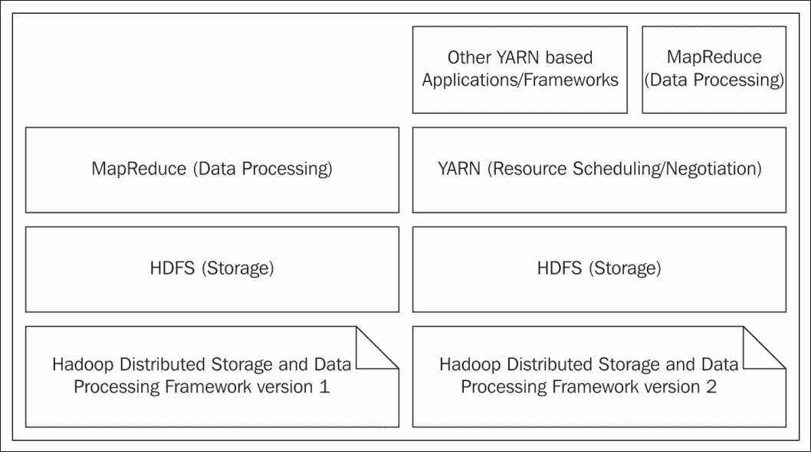
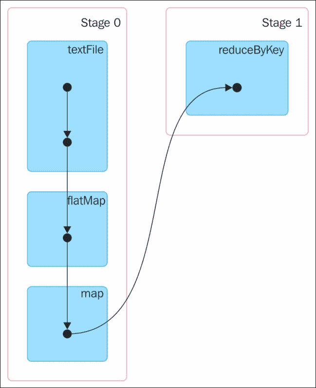
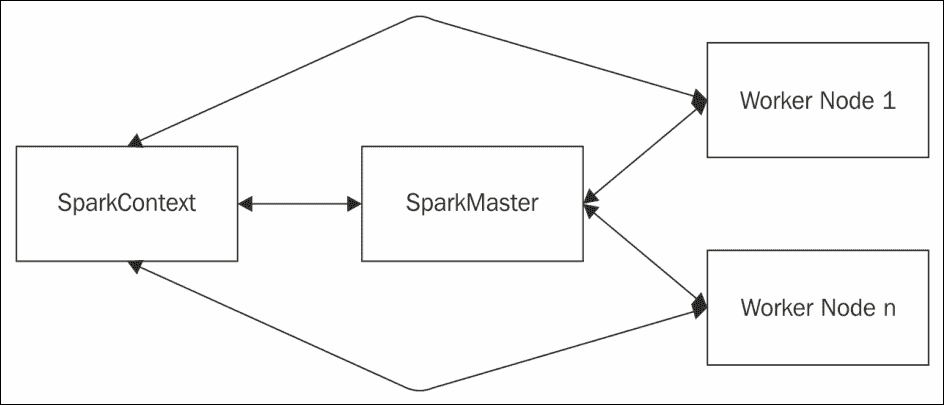
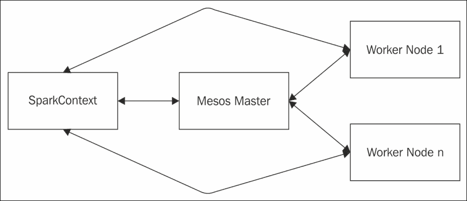
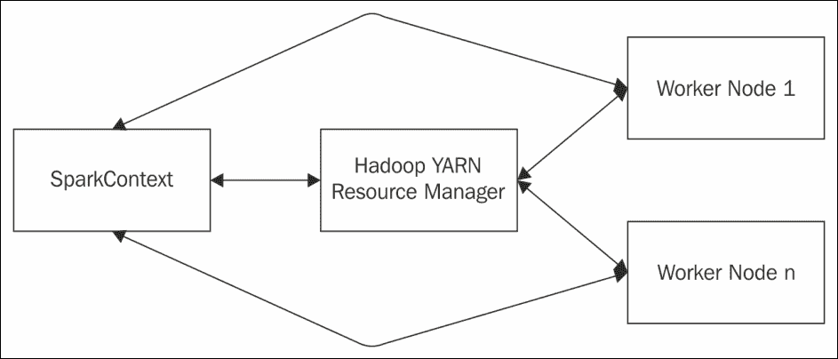
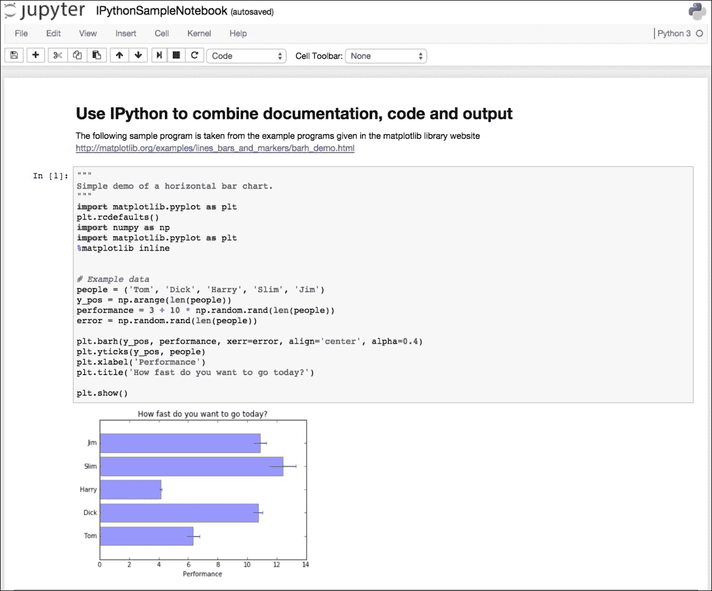
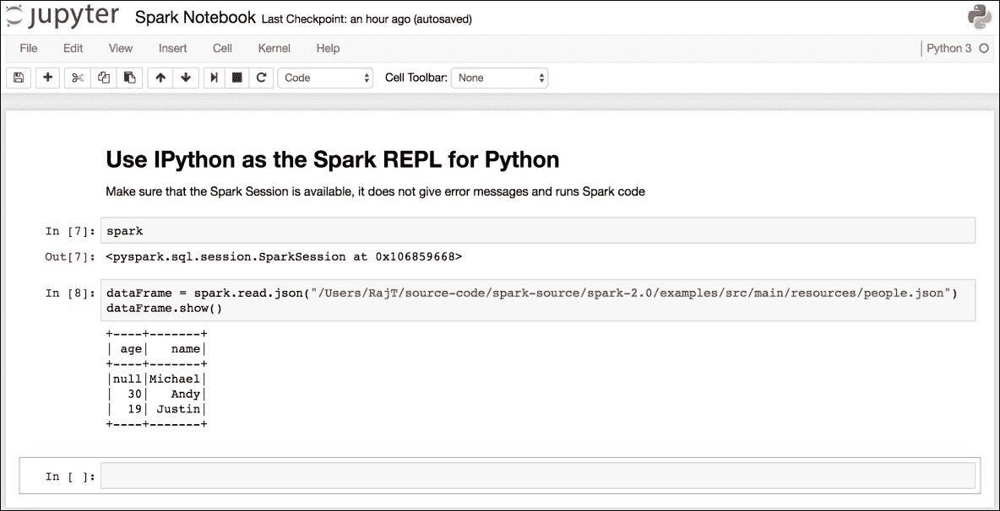
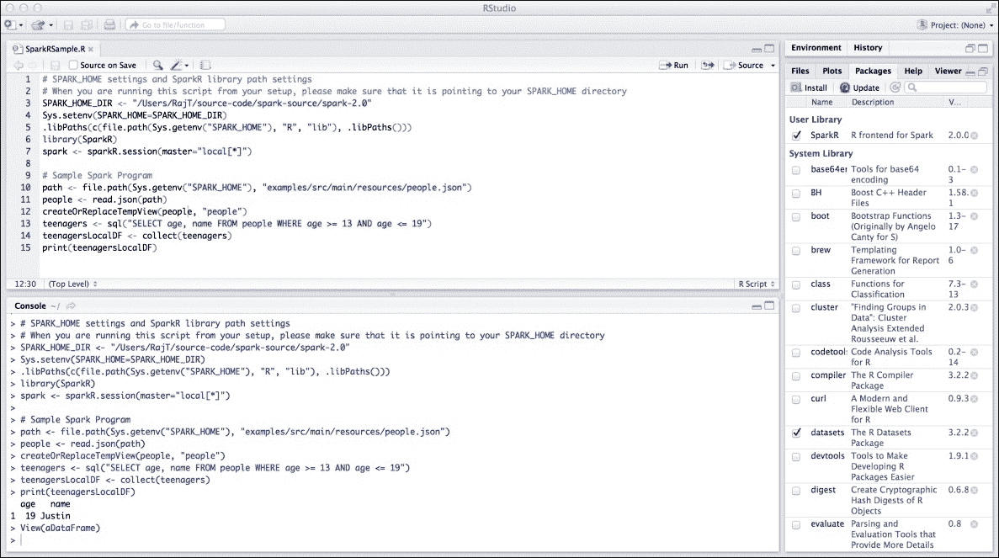

# 第一章：Spark 基础

数据是任何组织最重要的资产之一。组织中收集和使用的数据规模正以超出想象的速度增长。数据摄取的速度、使用的数据类型多样性以及处理和存储的数据量每时每刻都在打破历史记录。如今，即使在小型组织中，数据从千兆字节增长到太字节再到拍字节也变得非常普遍。因此，处理需求也在增长，要求能够处理静态数据以及移动中的数据。

以任何组织为例，其成功取决于领导者所做的决策，而为了做出明智的决策，你需要依赖于处理数据产生的良好数据和信息。这给如何及时且成本效益高地处理数据提出了巨大挑战，以便做出正确决策。自计算机早期以来，数据处理技术已经发展。无数的数据处理产品和框架进入市场，又随着时间的推移而消失。这些数据处理产品和框架大多数并非通用性质。大多数组织依赖于定制的应用程序来满足其数据处理需求，以孤岛方式或与特定产品结合使用。

大规模互联网应用，俗称**物联网**（**IoT**）应用，预示着对开放框架的共同需求，以高速处理各种类型的大量数据。大型网站、媒体流应用以及组织的大规模批处理需求使得这一需求更加迫切。开源社区也随着互联网的发展而显著壮大，提供由知名软件公司支持的生产级软件。众多公司开始采用开源软件，并将其部署到生产环境中。

从技术角度看，数据处理需求正面临巨大挑战。数据量从单机溢出到大量机器集群。单个 CPU 的处理能力达到瓶颈，现代计算机开始将它们组合起来以获取更多处理能力，即所谓的多核计算机。应用程序并未设计成充分利用多核计算机中的所有处理器，导致现代计算机中大量处理能力被浪费。

### 注意

本书中，*节点*、*主机*和*机器*这些术语指的是在独立模式或集群中运行的计算机。

在此背景下，理想的数据处理框架应具备哪些特质？

+   它应能处理分布在计算机集群中的数据块

+   它应该能够以并行方式处理数据，以便将大型数据处理任务分解为多个并行处理的子任务，从而显著减少处理时间

+   它应该能够利用计算机中所有核心或处理器的处理能力

+   它应该能够利用集群中所有可用的计算机

+   它应该能够在商品硬件上运行

有两个开源数据处理框架值得提及，它们满足所有这些要求。第一个是 Apache Hadoop，第二个是 Apache Spark。

本章我们将涵盖以下主题：

+   Apache Hadoop

+   Apache Spark

+   安装 Spark 2.0

# Apache Hadoop 概览

Apache Hadoop 是一个开源软件框架，从零开始设计用于在计算机集群上进行分布式数据存储，并对分布在集群计算机上的数据进行分布式数据处理。该框架配备了一个分布式文件系统用于数据存储，即**Hadoop 分布式文件系统**（**HDFS**），以及一个数据处理框架，即 MapReduce。HDFS 的创建灵感来自 Google 的研究论文《The Google File System》，而 MapReduce 则基于 Google 的研究论文《MapReduce: Simplified Data Processing on Large Clusters》。

Hadoop 被组织大规模采用，通过实施庞大的 Hadoop 集群进行数据处理。从 Hadoop MapReduce 版本 1（MRv1）到 Hadoop MapReduce 版本 2（MRv2），它经历了巨大的增长。从纯粹的数据处理角度来看，MRv1 由 HDFS 和 MapReduce 作为核心组件组成。许多应用程序，通常称为 SQL-on-Hadoop 应用程序，如 Hive 和 Pig，都建立在 MapReduce 框架之上。尽管这些类型的应用程序是独立的 Apache 项目，但作为一套，许多此类项目提供了巨大的价值，这种情况非常常见。

**Yet Another Resource Negotiator**（**YARN**）项目随着非 MapReduce 类型的计算框架在 Hadoop 生态系统中运行而崭露头角。随着 YARN 的引入，位于 HDFS 之上，从组件架构分层的角度看，位于 MapReduce 之下，用户可以编写自己的应用程序，这些应用程序可以在 YARN 和 HDFS 上运行，以利用 Hadoop 生态系统的分布式数据存储和数据处理能力。换句话说，经过全面改造的 MapReduce 版本 2（MRv2）成为了位于 HDFS 和 YARN 之上的应用程序框架之一。

*图 1*简要介绍了这些组件以及它们如何堆叠在一起：



图 1

MapReduce 是一种通用数据处理模型。数据处理经过两个步骤，即*映射*步骤和*归约*步骤。在第一步中，输入数据被分割成许多较小的部分，以便每个部分可以独立处理。一旦*映射*步骤完成，其输出被整合，最终结果在*归约*步骤中生成。在典型的词频统计示例中，以每个单词为键，值为 1 创建键值对是*映射*步骤。基于键对这些对进行排序，对具有相同键的对的值进行求和属于中间*合并*步骤。生成包含唯一单词及其出现次数的对是*归约*步骤。

从应用程序编程的角度来看，一个过度简化的 MapReduce 应用程序的基本要素如下：

+   输入位置

+   输出位置

+   MapReduce 库中适当的接口和类实现了数据处理所需的`Map`函数。

+   MapReduce 库中适当的接口和类实现了数据处理所需的`Reduce`函数。

将 MapReduce 作业提交给 Hadoop 运行，一旦作业完成，可以从指定的输出位置获取输出。

将`MapReduce`数据处理作业分为*映射*和*归约*任务的两个步骤过程非常有效，并且证明是许多批量数据处理用例的完美匹配。在整个过程中，有许多与磁盘的输入/输出（I/O）操作在幕后发生。即使在 MapReduce 作业的中间步骤中，如果内部数据结构充满数据或当任务完成超过一定百分比时，写入磁盘也会发生。因此，MapReduce 作业的后续步骤必须从磁盘读取。

然后，当有多个 MapReduce 作业需要以链式方式完成时，另一个最大的挑战出现了。换句话说，如果一项大数据处理工作是通过两个 MapReduce 作业完成的，使得第一个 MapReduce 作业的输出成为第二个 MapReduce 作业的输入。在这种情况下，无论第一个 MapReduce 作业的输出大小如何，它都必须写入磁盘，然后第二个 MapReduce 作业才能将其用作输入。因此，在这种情况下，存在一个明确且*不必要的*写操作。

在许多批量数据处理的用例中，这些 I/O 操作并不是大问题。如果结果高度可靠，对于许多批量数据处理用例来说，延迟是可以容忍的。但最大的挑战出现在进行实时数据处理时。MapReduce 作业中涉及的大量 I/O 操作使其不适合以最低可能延迟进行实时数据处理。

# 理解 Apache Spark

Spark 是一个基于**Java 虚拟机**（**JVM**）的分布式数据处理引擎，具有可扩展性，且速度远超许多其他数据处理框架。Spark 起源于*加州大学伯克利分校*，后来成为 Apache 的顶级项目之一。研究论文《Mesos：数据中心细粒度资源共享平台》阐述了 Spark 设计背后的理念。论文指出：

> *"为了验证简单专用框架的价值，我们识别出实验室机器学习研究人员发现运行不佳的一类作业：迭代作业，其中数据集在多次迭代中被重复使用。我们构建了一个专为这些工作负载优化的框架，名为 Spark。"*

Spark 关于速度的最大宣称是，它能在内存中*“运行程序比 Hadoop MapReduce 快 100 倍，或在磁盘上快 10 倍”*。Spark 之所以能做出这一宣称，是因为它在工作者节点的主内存中进行处理，避免了*不必要*的磁盘 I/O 操作。Spark 的另一优势是，即使在应用程序编程级别，也能链式执行任务，完全不写入磁盘或最小化磁盘写入次数。

Spark 相较于 MapReduce，为何在数据处理上如此高效？这得益于其先进的**有向无环图**（**DAG**）数据处理引擎。这意味着每个 Spark 作业都会创建一个任务 DAG 供引擎执行。在数学术语中，DAG 由一组顶点和连接它们的定向边组成。任务按照 DAG 布局执行。而在 MapReduce 中，DAG 仅包含两个顶点，一个用于*映射*任务，另一个用于*归约*任务，边从*映射*顶点指向*归约*顶点。内存数据处理与基于 DAG 的数据处理引擎相结合，使得 Spark 极为高效。在 Spark 中，任务的 DAG 可以非常复杂。幸运的是，Spark 提供了实用工具，能够出色地可视化任何运行中的 Spark 作业的 DAG。以词频统计为例，Spark 的 Scala 代码将类似于以下代码片段。这些编程细节将在后续章节中详细介绍：

```scala
val textFile = sc.textFile("README.md") 
val wordCounts = textFile.flatMap(line => line.split(" ")).map(word => 
 (word, 1)).reduceByKey((a, b) => a + b) 
wordCounts.collect()

```

随 Spark 提供的 Web 应用程序能够监控工作者和应用程序。前述 Spark 作业实时生成的 DAG 将呈现为*图 2*，如图所示：



图 2

Spark 编程范式非常强大，提供了一个统一的编程模型，支持使用多种编程语言进行应用程序开发。尽管在所有支持的编程语言之间没有功能对等性，但 Spark 支持 Scala、Java、Python 和 R 的编程。除了使用这些编程语言编写 Spark 应用程序外，Spark 还为 Scala、Python 和 R 提供了具有**读取、评估、打印和循环**（**REPL**）功能的交互式 Shell。目前，Spark 中没有为 Java 提供 REPL 支持。Spark REPL 是一个非常多功能的工具，可用于以交互方式尝试和测试 Spark 应用程序代码。Spark REPL 便于原型设计、调试等。

-   除了核心数据处理引擎外，Spark 还配备了一个强大的特定领域库栈，这些库使用核心 Spark 库并提供各种功能，以满足各种大数据处理需求。下表列出了支持的库：

| **库** | **用途** | **支持的语言** |
| --- | --- | --- |
| Spark SQL | 使在 Spark 应用程序中使用 SQL 语句或 DataFrame API 成为可能 | Scala, Java, Python, 和 R |
| Spark Streaming | 使处理实时数据流成为可能 | Scala, Java, 和 Python |
| Spark MLlib | 使机器学习应用程序的开发成为可能 | Scala, Java, Python, 和 R |
| Spark GraphX | 启用图形处理并支持不断增长的图形算法库 | Scala |

Spark 可以在各种平台上部署。Spark 运行在**操作系统**（**OS**）Windows 和 UNIX（如 Linux 和 Mac OS）上。Spark 可以在具有支持 OS 的单个节点上以独立模式部署。Spark 也可以在 Hadoop YARN 和 Apache Mesos 的集群节点上部署。Spark 还可以在 Amazon EC2 云上部署。Spark 可以从各种数据存储中访问数据，其中一些最受欢迎的包括 HDFS、Apache Cassandra、Hbase、Hive 等。除了前面列出的数据存储外，如果有驱动程序或连接器程序可用，Spark 几乎可以从任何数据源访问数据。

### Tip

-   本书中使用的所有示例均在 Mac OS X Version 10.9.5 计算机上开发、测试和运行。除 Windows 外，相同的指令适用于所有其他平台。在 Windows 上，对应于所有 UNIX 命令，都有一个带有`.cmd`扩展名的文件，必须使用该文件。例如，对于 UNIX 中的`spark-shell`，Windows 中有`spark-shell.cmd`。程序行为和结果应在所有支持的操作系统上保持一致。

在任何分布式应用中，通常都有一个控制执行的主程序和多个工作节点。主程序将任务分配给相应的工作节点。即使在 Spark 独立模式下也是如此。对于 Spark 应用，其**SparkContext**对象即为主程序，它与相应的集群管理器通信以运行任务。Spark 核心库中的 Spark 主节点、Mesos 主节点和 Hadoop YARN 资源管理器都是 Spark 支持的一些集群管理器。在 Hadoop YARN 部署的 Spark 情况下，Spark 驱动程序在 Hadoop YARN 应用主进程内运行，或者作为 Hadoop YARN 的客户端运行。*图 3*描述了 Spark 的独立部署：



图 3

在 Spark 的 Mesos 部署模式下，集群管理器将是**Mesos 主节点**。*图 4*描述了 Spark 的 Mesos 部署：



图 4

在 Spark 的 Hadoop YARN 部署模式下，集群管理器将是 Hadoop 资源管理器，其地址将从 Hadoop 配置中获取。换句话说，在提交 Spark 作业时，无需给出明确的 master URL，它将从 Hadoop 配置中获取集群管理器的详细信息。*图 5*描述了 Spark 的 Hadoop YARN 部署：



图 5

Spark 也运行在云端。在 Spark 部署在 Amazon EC2 的情况下，除了从常规支持的数据源访问数据外，Spark 还可以从 Amazon S3 访问数据，这是亚马逊提供的在线数据存储服务。

# 在您的机器上安装 Spark

Spark 支持使用 Scala、Java、Python 和 R 进行应用开发。本书中使用了 Scala、Python 和 R。以下是本书示例选择这些语言的原因。Spark 交互式 shell，或 REPL，允许用户像在终端提示符下输入操作系统命令一样即时执行程序，并且仅适用于 Scala、Python 和 R 语言。REPL 是在将代码组合到文件中并作为应用程序运行之前尝试 Spark 代码的最佳方式。REPL 甚至可以帮助经验丰富的程序员尝试和测试代码，从而促进快速原型设计。因此，特别是对于初学者，使用 REPL 是开始使用 Spark 的最佳方式。

作为安装 Spark 和使用 Python 和 R 进行 Spark 编程的前提条件，必须在安装 Spark 之前安装 Python 和 R。

## 安装 Python

访问[`www.python.org`](https://www.python.org/)以下载并安装适用于您计算机的 Python。安装完成后，确保所需的二进制文件位于操作系统搜索路径中，且 Python 交互式 shell 能正常启动。shell 应显示类似以下内容：

```scala
$ python 
Python 3.5.0 (v3.5.0:374f501f4567, Sep 12 2015, 11:00:19)  
[GCC 4.2.1 (Apple Inc. build 5666) (dot 3)] on darwin 
Type "help", "copyright", "credits" or "license" for more information. 
>>> 

```

图表和绘图使用的是`matplotlib`库。

### 注意

Python 版本 3.5.0 被选为 Python 的版本。尽管 Spark 支持 Python 2.7 版本进行编程，但为了面向未来，我们采用了最新且最稳定的 Python 版本。此外，大多数重要库也正在迁移至 Python 3.x 版本。

访问[`matplotlib.org`](http://matplotlib.org/)以下载并安装该库。为确保库已正确安装且图表和图形能正常显示，请访问[`matplotlib.org/examples/index.html`](http://matplotlib.org/examples/index.html)页面，获取一些示例代码，并确认您的计算机具备图表和绘图所需的所有资源和组件。在尝试运行这些图表和绘图示例时，如果 Python 代码中引入了库，可能会出现缺少 locale 的错误。此时，请在相应的用户配置文件中设置以下环境变量以消除错误信息：

```scala
export LC_ALL=en_US.UTF-8 
export LANG=en_US.UTF-8

```

## R 安装

访问[`www.r-project.org`](https://www.r-project.org/)以下载并安装适用于您计算机的 R。安装完成后，确保所需的二进制文件位于操作系统搜索路径中，且 R 交互式 shell 能正常启动。shell 应显示类似以下内容：

```scala
$ r 
R version 3.2.2 (2015-08-14) -- "Fire Safety" 
Copyright (C) 2015 The R Foundation for Statistical Computing 
Platform: x86_64-apple-darwin13.4.0 (64-bit) 
R is free software and comes with ABSOLUTELY NO WARRANTY. 
You are welcome to redistribute it under certain conditions. 
Type 'license()' or 'licence()' for distribution details. 
  Natural language support but running in an English locale 
R is a collaborative project with many contributors. 
Type 'contributors()' for more information and 
'citation()' on how to cite R or R packages in publications. 
Type 'demo()' for some demos, 'help()' for on-line help, or 
'help.start()' for an HTML browser interface to help. 
Type 'q()' to quit R. 
[Previously saved workspace restored] 
>

```

### 注意

R 版本 3.2.2 是 R 的选择。

## Spark 安装

Spark 安装有多种方式。Spark 安装最重要的前提是系统中已安装 Java 1.8 JDK，并且`JAVA_HOME`环境变量指向 Java 1.8 JDK 的安装目录。访问[`spark.apache.org/downloads.html`](http://spark.apache.org/downloads.html)以了解、选择并下载适合您计算机的安装类型。Spark 版本 2.0.0 是本书示例所选用的版本。对于有兴趣从源代码构建和使用 Spark 的用户，应访问：[`spark.apache.org/docs/latest/building-spark.html`](http://spark.apache.org/docs/latest/building-spark.html)以获取指导。默认情况下，从源代码构建 Spark 时不会构建 Spark 的 R 库。为此，需要构建 SparkR 库，并在从源代码构建 Spark 时包含适当的配置文件。以下命令展示了如何包含构建 SparkR 库所需的配置文件：

```scala
$ mvn -DskipTests -Psparkr clean package

```

一旦 Spark 安装完成，在适当的用户配置文件中定义以下环境变量：

```scala
export SPARK_HOME=<the Spark installation directory> 
export PATH=$SPARK_HOME/bin:$PATH

```

如果系统中有多个版本的 Python 可执行文件，那么最好在以下环境变量设置中明确指定 Spark 要使用的 Python 可执行文件：

```scala
export PYSPARK_PYTHON=/usr/bin/python

```

在`$SPARK_HOME/bin/pyspark`脚本中，有一段代码用于确定 Spark 要使用的 Python 可执行文件：

```scala
# Determine the Python executable to use if PYSPARK_PYTHON or PYSPARK_DRIVER_PYTHON isn't set: 
if hash python2.7 2>/dev/null; then 
  # Attempt to use Python 2.7, if installed: 
  DEFAULT_PYTHON="python2.7" 
else 
  DEFAULT_PYTHON="python" 
fi

```

因此，即使系统中只有一个版本的 Python，也最好明确设置 Spark 的 Python 可执行文件。这是为了防止将来安装其他版本的 Python 时出现意外行为的安全措施。

一旦完成所有前面的步骤并成功，确保所有语言（Scala、Python 和 R）的 Spark shell 都能正常工作。在操作系统终端提示符下运行以下命令，并确保没有错误，且显示内容与以下类似。以下命令集用于启动 Spark 的 Scala REPL：

```scala
$ cd $SPARK_HOME 
$ ./bin/spark-shellUsing Spark's default log4j profile: org/apache/spark/log4j-defaults.properties 
Setting default log level to "WARN". 
To adjust logging level use sc.setLogLevel(newLevel). 
16/06/28 20:53:48 WARN NativeCodeLoader: Unable to load native-hadoop library for your platform... using builtin-java classes where applicable 
16/06/28 20:53:49 WARN SparkContext: Use an existing SparkContext, some configuration may not take effect. 
Spark context Web UI available at http://192.168.1.6:4040 
Spark context available as 'sc' (master = local[*], app id = local-1467143629623). 
Spark session available as 'spark'. 
Welcome to 
      ____              __ 
     / __/__  ___ _____/ /__ 
    _\ \/ _ \/ _ `/ __/  '_/ 
   /___/ .__/\_,_/_/ /_/\_\   version 2.0.1 
      /_/ 

Using Scala version 2.11.8 (Java HotSpot(TM) 64-Bit Server VM, Java 1.8.0_66) 
Type in expressions to have them evaluated. 
Type :help for more information. 
scala> 
scala>exit 

```

在前述显示中，验证 JDK 版本、Scala 版本和 Spark 版本是否与安装 Spark 的计算机中的设置相符。最重要的是验证没有错误消息显示。

以下命令集用于启动 Spark 的 Python REPL：

```scala
$ cd $SPARK_HOME 
$ ./bin/pyspark 
Python 3.5.0 (v3.5.0:374f501f4567, Sep 12 2015, 11:00:19)  
[GCC 4.2.1 (Apple Inc. build 5666) (dot 3)] on darwin 
Type "help", "copyright", "credits" or "license" for more information. 
Using Spark's default log4j profile: org/apache/spark/log4j-defaults.properties 
Setting default log level to "WARN". 
To adjust logging level use sc.setLogLevel(newLevel). 
16/06/28 20:58:04 WARN NativeCodeLoader: Unable to load native-hadoop library for your platform... using builtin-java classes where applicable 
Welcome to 
      ____              __ 
     / __/__  ___ _____/ /__ 
    _\ \/ _ \/ _ `/ __/  '_/ 
   /__ / .__/\_,_/_/ /_/\_\   version 2.0.1 
      /_/ 

Using Python version 3.5.0 (v3.5.0:374f501f4567, Sep 12 2015 11:00:19) 
SparkSession available as 'spark'. 
>>>exit() 

```

在前述显示中，验证 Python 版本和 Spark 版本是否与安装 Spark 的计算机中的设置相符。最重要的是验证没有错误消息显示。

以下命令集用于启动 Spark 的 R REPL：

```scala
$ cd $SPARK_HOME 
$ ./bin/sparkR 
R version 3.2.2 (2015-08-14) -- "Fire Safety" 
Copyright (C) 2015 The R Foundation for Statistical Computing 
Platform: x86_64-apple-darwin13.4.0 (64-bit) 

R is free software and comes with ABSOLUTELY NO WARRANTY. 
You are welcome to redistribute it under certain conditions. 
Type 'license()' or 'licence()' for distribution details. 

  Natural language support but running in an English locale 

R is a collaborative project with many contributors. 
Type 'contributors()' for more information and 
'citation()' on how to cite R or R packages in publications. 

Type 'demo()' for some demos, 'help()' for on-line help, or 
'help.start()' for an HTML browser interface to help. 
Type 'q()' to quit R. 

[Previously saved workspace restored] 

Launching java with spark-submit command /Users/RajT/source-code/spark-source/spark-2.0/bin/spark-submit   "sparkr-shell" /var/folders/nf/trtmyt9534z03kq8p8zgbnxh0000gn/T//RtmphPJkkF/backend_port59418b49bb6  
Using Spark's default log4j profile: org/apache/spark/log4j-defaults.properties 
Setting default log level to "WARN". 
To adjust logging level use sc.setLogLevel(newLevel). 
16/06/28 21:00:35 WARN NativeCodeLoader: Unable to load native-hadoop library for your platform... using builtin-java classes where applicable 

 Welcome to 
    ____              __  
   / __/__  ___ _____/ /__  
  _\ \/ _ \/ _ `/ __/  '_/  
 /___/ .__/\_,_/_/ /_/\_\   version  2.0.1 
    /_/  

 Spark context is available as sc, SQL context is available as sqlContext 
During startup - Warning messages: 
1: 'SparkR::sparkR.init' is deprecated. 
Use 'sparkR.session' instead. 
See help("Deprecated")  
2: 'SparkR::sparkRSQL.init' is deprecated. 
Use 'sparkR.session' instead. 
See help("Deprecated")  
>q() 

```

在前述显示中，验证 R 版本和 Spark 版本是否与安装 Spark 的计算机中的设置相符。最重要的是验证没有错误消息显示。

如果 Scala、Python 和 R 的所有 REPL 都运行良好，那么几乎可以肯定 Spark 安装是良好的。作为最终测试，运行一些随 Spark 附带的示例程序，并确保它们给出的结果与命令下方所示结果相近，且不在控制台抛出任何错误消息。当运行这些示例程序时，除了命令下方显示的输出外，控制台还会显示许多其他消息。为了专注于结果，这些消息被省略了：

```scala
$ cd $SPARK_HOME 
$ ./bin/run-example SparkPi 
Pi is roughly 3.1484 
$ ./bin/spark-submit examples/src/main/python/pi.py 
Pi is roughly 3.138680 
$ ./bin/spark-submit examples/src/main/r/dataframe.R 
root 
 |-- name: string (nullable = true) 
 |-- age: double (nullable = true) 
root 
 |-- age: long (nullable = true) 
 |-- name: string (nullable = true) 
    name 
1 Justin 

```

## 开发工具安装

本书中将要讨论的大部分代码都可以在相应的 REPL 中尝试和测试。但没有一些基本的构建工具，就无法进行适当的 Spark 应用程序开发。作为最低要求，对于使用 Scala 开发和构建 Spark 应用程序，**Scala 构建工具**（**sbt**）是必需的。访问[`www.scala-sbt.org`](http://www.scala-sbt.org/)以下载和安装 sbt。

Maven 是构建 Java 应用程序的首选构建工具。本书虽不涉及 Java 中的 Spark 应用程序开发，但系统中安装 Maven 也是有益的。如果需要从源代码构建 Spark，Maven 将派上用场。访问[`maven.apache.org`](https://maven.apache.org/)以下载并安装 Maven。

有许多**集成开发环境**（**IDEs**）适用于 Scala 和 Java。这是个人选择，开发者可以根据自己开发 Spark 应用程序所用的语言选择工具。

## 可选软件安装

Spark REPL for Scala 是开始进行代码片段原型设计和测试的好方法。但当需要开发、构建和打包 Scala 中的 Spark 应用程序时，拥有基于 sbt 的 Scala 项目并在支持的 IDE（包括但不限于 Eclipse 或 IntelliJ IDEA）中开发它们是明智的。访问相应的网站以下载并安装首选的 Scala IDE。

笔记本式应用程序开发工具在数据分析师和研究人员中非常普遍。这类似于实验室笔记本。在典型的实验室笔记本中，会有指导、详细描述和步骤，以进行实验。然后进行实验。一旦实验完成，结果将被记录在笔记本中。如果将所有这些构造结合起来，并将其置于软件程序的上下文中，以实验室笔记本格式建模，将会有文档、代码、输入和运行代码产生的输出。这将产生非常好的效果，特别是如果程序生成大量图表和绘图。

### 提示

对于不熟悉笔记本式应用程序开发 IDE 的人，有一篇很好的文章名为*交互式笔记本：共享代码*，可从[`www.nature.com/news/interactive-notebooks-sharing-the-code-1.16261`](http://www.nature.com/news/interactive-notebooks-sharing-the-code-1.16261)阅读。作为 Python 的可选软件开发 IDE，IPython 笔记本将在下一节中描述。安装后，请先熟悉该工具，再进行严肃的开发。

### IPython

在 Python 中开发 Spark 应用程序时，IPython 提供了一个出色的笔记本式开发工具，它是 Jupyter 的 Python 语言内核。Spark 可以与 IPython 集成，以便当调用 Python 的 Spark REPL 时，它将启动 IPython 笔记本。然后，创建一个笔记本并在其中编写代码，就像在 Python 的 Spark REPL 中给出命令一样。访问[`ipython.org`](http://ipython.org/)下载并安装 IPython 笔记本。安装完成后，调用 IPython 笔记本界面，并确保一些示例 Python 代码运行正常。从存储笔记本的目录或将要存储笔记本的目录调用命令。这里，IPython 笔记本是从临时目录启动的。当调用以下命令时，它将打开 Web 界面，从中通过点击“新建”下拉框并选择适当的 Python 版本来创建新笔记本。

下图展示了如何在 IPython 笔记本中将 Markdown 风格的文档、Python 程序以及生成的输出结合起来：

```scala
$ cd /Users/RajT/temp 
$ ipython notebook 

```



*图 6*

*图 6*展示了如何使用 IPython 笔记本编写简单的 Python 程序。IPython 笔记本可以配置为 Spark 的首选 Shell，当调用 Python 的 Spark REPL 时，它将启动 IPython 笔记本，从而可以使用 IPython 笔记本进行 Spark 应用程序开发。为此，需要在适当的用户配置文件中定义以下环境变量：

```scala
export PYSPARK_DRIVER_PYTHON=ipython 
export PYSPARK_DRIVER_PYTHON_OPTS='notebook' 

```

现在，不是从命令提示符调用 IPython 笔记本，而是调用 Python 的 Spark REPL。就像之前所做的那样，创建一个新的 IPython 笔记本并在其中编写 Spark 代码：

```scala
$ cd /Users/RajT/temp 
$ pyspark 

```

请看下面的截图：



*图 7*

### 提示

在任何语言的标准 Spark REPL 中，都可以通过相对路径引用本地文件系统中的文件。当使用 IPython 笔记本时，需要通过完整路径引用本地文件。

### RStudio

在 R 用户社区中，首选的 IDE 是 RStudio。RStudio 也可用于开发 R 中的 Spark 应用程序。访问[`www.rstudio.com`](https://www.rstudio.com/)下载并安装 RStudio。安装完成后，在运行任何 Spark R 代码之前，必须包含`SparkR`库并设置一些变量，以确保从 RStudio 顺利运行 Spark R 程序。以下代码片段实现了这一点：

```scala
SPARK_HOME_DIR <- "/Users/RajT/source-code/spark-source/spark-2.0" 
Sys.setenv(SPARK_HOME=SPARK_HOME_DIR) 
.libPaths(c(file.path(Sys.getenv("SPARK_HOME"), "R", "lib"), .libPaths())) 
library(SparkR) 
spark <- sparkR.session(master="local[*]")

```

在前述 R 代码中，将`SPARK_HOME_DIR`变量定义更改为指向 Spark 安装目录。*图 8*展示了从 RStudio 运行 Spark R 代码的示例：



*图 8*

一旦所有必需的软件安装、配置并按先前所述正常运行，便可以开始在 Scala、Python 和 R 中进行 Spark 应用程序开发。

### 提示

Jupyter 笔记本通过为各种语言定制内核实现策略支持多种语言。Jupyter 有一个原生的 R 内核，即 IRkernel，可以作为 R 包安装。

### Apache Zeppelin

Apache Zeppelin 是另一个目前正处于孵化阶段的有前景的项目。它是一个基于 Web 的笔记本，类似于 Jupyter，但通过其解释器策略支持多种语言、Shell 和技术，从而内在地支持 Spark 应用程序开发。目前它还处于初期阶段，但有很大的潜力成为最佳的基于笔记本的应用程序开发平台之一。Zeppelin 利用笔记本中编写的程序生成的数据，具备非常强大的内置图表和绘图功能。

Zeppelin 具有高度的可扩展性，能够通过其解释器框架插入多种类型的解释器。终端用户，就像使用任何其他基于笔记本的系统一样，在笔记本界面中输入各种命令。这些命令需要由某个解释器处理以生成输出。与许多其他笔记本风格的系统不同，Zeppelin 开箱即支持大量解释器或后端，如 Spark、Spark SQL、Shell、Markdown 等。在前端方面，它同样采用可插拔架构，即**Helium 框架**。后端生成的数据由前端组件（如 Angular JS）显示。有多种选项可以显示数据，包括表格格式、解释器生成的原始格式、图表和绘图。由于后端、前端以及能够插入各种组件的架构分离关注点，它是一种选择异构组件以适应不同任务的绝佳方式。同时，它能够很好地集成，提供一个和谐的用户友好型数据处理生态系统。尽管 Zeppelin 为各种组件提供了可插拔架构能力，但其可视化选项有限。换句话说，Zeppelin 开箱即用提供的图表和绘图选项并不多。一旦笔记本正常工作并产生预期结果，通常会将笔记本共享给其他人，为此，笔记本需要被持久化。Zeppelin 在这方面再次与众不同，它拥有一个高度灵活的笔记本存储系统。笔记本可以持久化到文件系统、Amazon S3 或 Git，并且如有需要，还可以添加其他存储目标。

**平台即服务**（**PaaS**）自云计算作为应用开发和部署平台以来，在过去几年中经历了巨大的创新和发展。对于软件开发者而言，通过云提供的众多 PaaS 平台消除了他们拥有自己的应用开发栈的需求。Databricks 推出了一款基于云的大数据平台，用户可以访问基于笔记本的 Spark 应用开发界面，并与微集群基础设施相结合，以便提交 Spark 应用。此外，还有一个社区版，服务于更广泛的开发社区。该 PaaS 平台最大的优势在于它是一个基于浏览器的界面，用户可以在多个版本的 Spark 和不同类型的集群上运行代码。

# 参考文献

更多信息请参考以下链接：

+   [`static.googleusercontent.com/media/research.google.com/en//archive/gfs-sosp2003.pdf`](http://static.googleusercontent.com/media/research.google.com/en//archive/gfs-sosp2003.pdf)

+   [`static.googleusercontent.com/media/research.google.com/en//archive/mapreduce-osdi04.pdf`](http://static.googleusercontent.com/media/research.google.com/en//archive/mapreduce-osdi04.pdf)

+   [`www.cs.berkeley.edu/~alig/papers/mesos.pdf`](https://www.cs.berkeley.edu/~alig/papers/mesos.pdf)

+   [`spark.apache.org/`](http://spark.apache.org/)

+   [`jupyter.org/`](https://jupyter.org/)

+   [`github.com/IRkernel/IRkernel`](https://github.com/IRkernel/IRkernel)

+   [`zeppelin.incubator.apache.org/`](https://zeppelin.incubator.apache.org/)

+   [`community.cloud.databricks.com/`](https://community.cloud.databricks.com/)

# 摘要

Spark 是一个功能强大的数据处理平台，支持统一的编程模型。它支持 Scala、Java、Python 和 R 中的应用程序开发，提供了一系列高度互操作的库，用于满足各种数据处理需求，以及大量利用 Spark 生态系统的第三方库，涵盖了其他各种数据处理用例。本章简要介绍了 Spark，并为本书后续章节将要介绍的 Spark 应用程序开发设置了开发环境。

下一章将讨论 Spark 编程模型、基本抽象和术语、Spark 转换和 Spark 操作，结合实际用例进行阐述。
