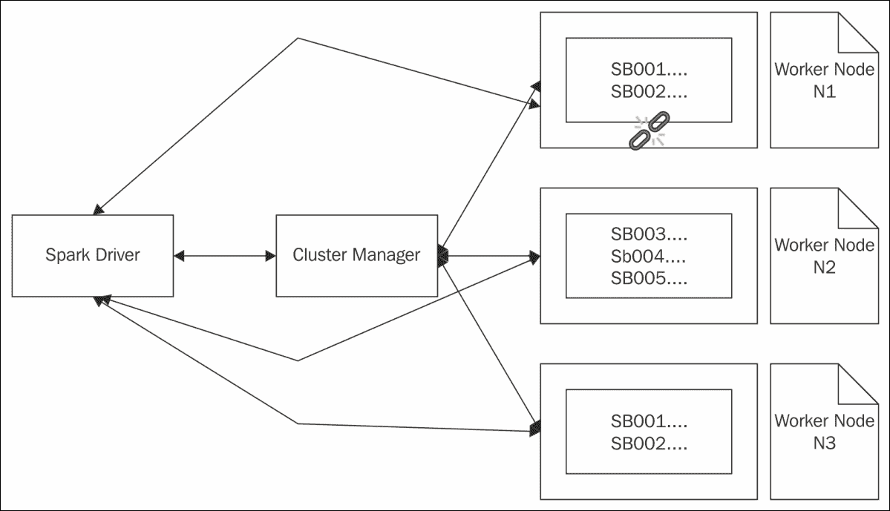
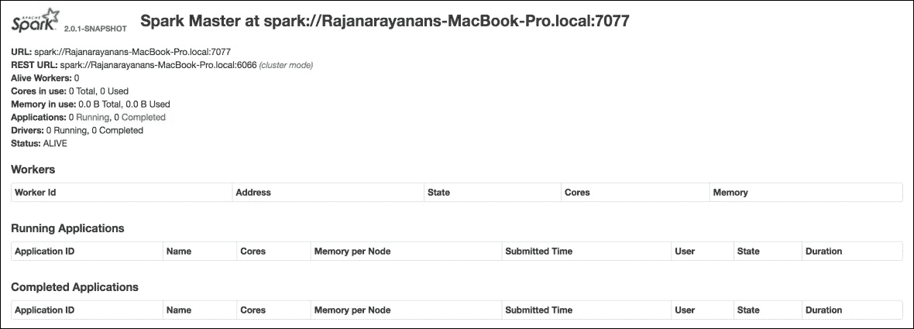
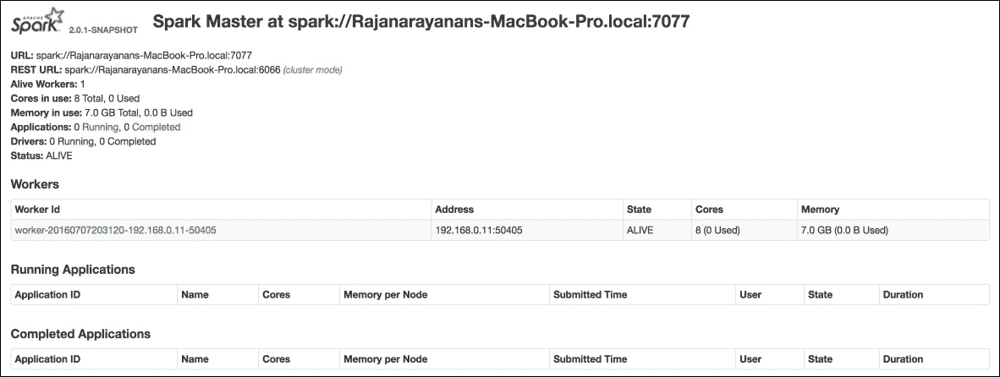
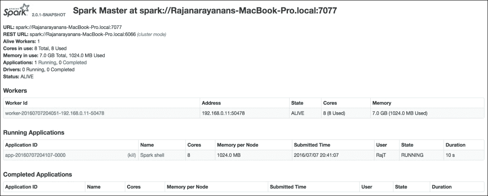
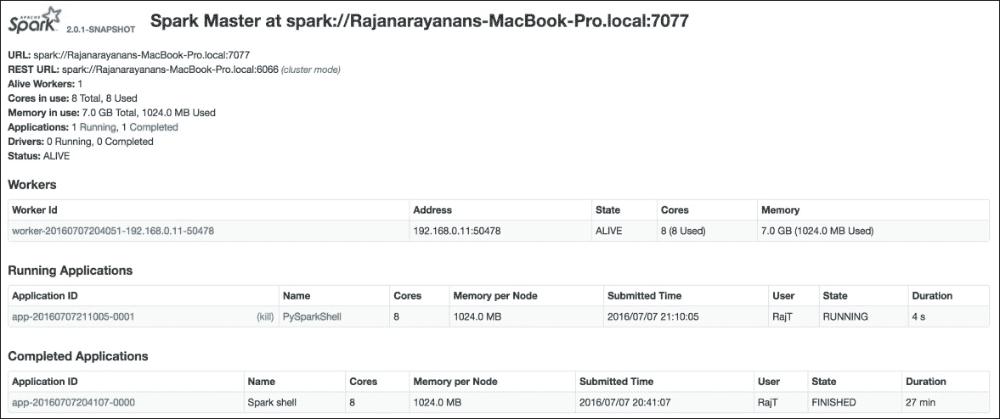
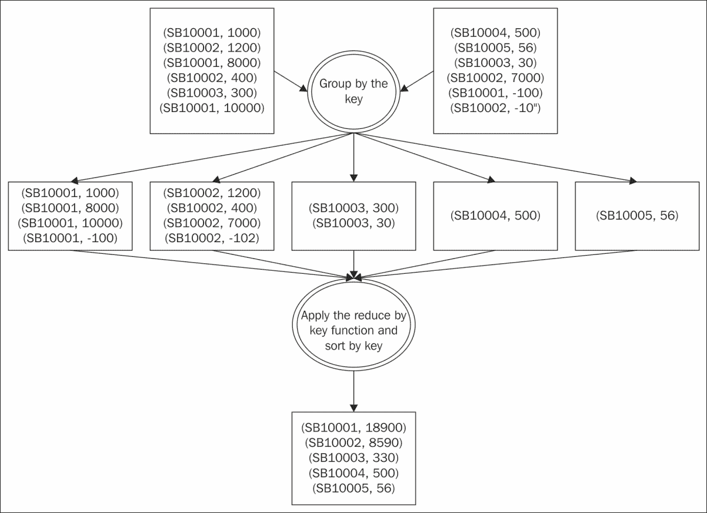
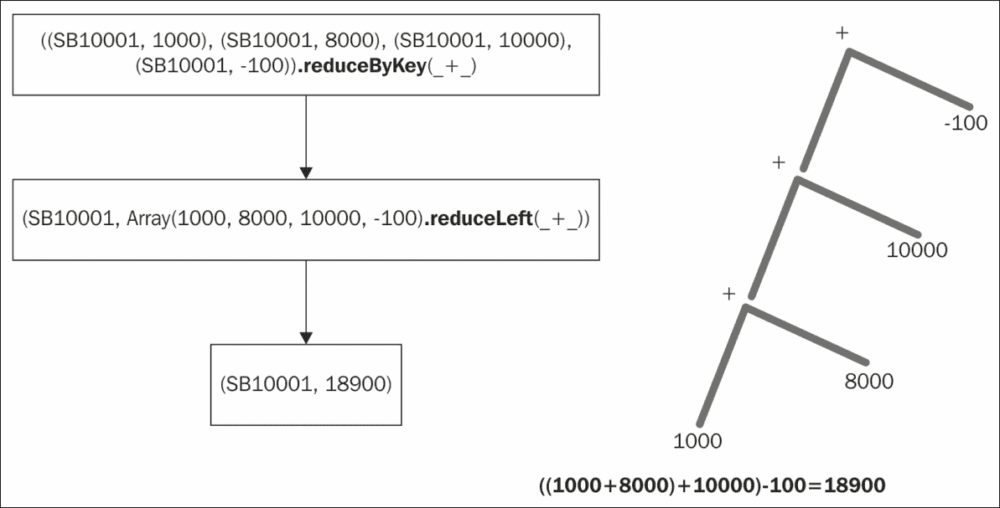
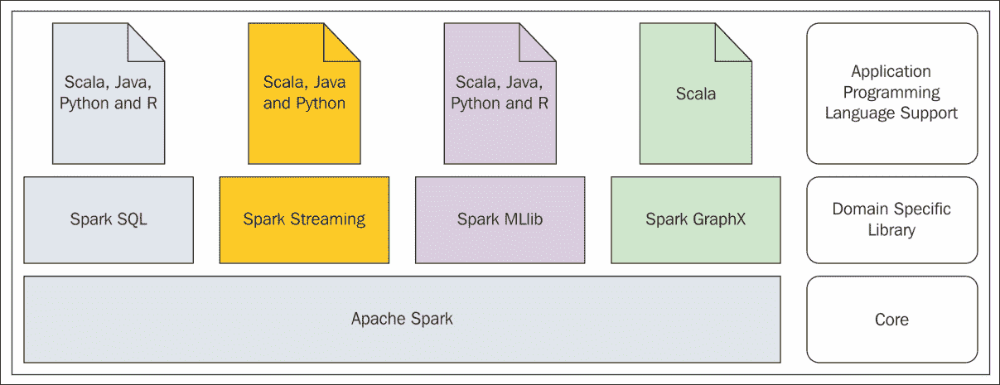

# 第二章：Spark 编程模型

**提取**、**转换**和**加载**（**ETL**）工具随着组织中数据的增长，大量涌现。将数据从一个源移动到一个或多个目的地，并在到达目的地之前对其进行实时处理，这些都是当时的需求。大多数情况下，这些 ETL 工具仅支持少数类型的数据，少数类型的数据源和目的地，并且对扩展以支持新数据类型和新源和目的地持封闭态度。由于这些工具的严格限制，有时甚至一个步骤的转换过程也必须分多个步骤完成。这些复杂的方法要求在人力以及其他计算资源方面产生不必要的浪费。商业 ETL 供应商的主要论点始终如一，那就是“一刀切”并不适用。因此，请使用*我们*的工具套件，而不是市场上可用的单一产品。许多组织因处理数据的迫切需求而陷入供应商锁定。几乎所有在 2005 年之前推出的工具，如果它们支持在商品硬件上运行，都没有充分利用计算机多核架构的真正力量。因此，简单但大量的数据处理任务使用这些工具需要数小时甚至数天才能完成。

Spark 因其处理大量数据类型以及不断增长的数据源和数据目的地的能力而在市场上迅速走红。Spark 提供的最重要的基本数据抽象是**弹性分布式数据集**（**RDD**）。如前一章所述，Spark 支持在节点集群上进行分布式处理。一旦有了节点集群，在数据处理过程中，某些节点可能会死亡。当此类故障发生时，框架应能够从中恢复。Spark 的设计就是为了做到这一点，这就是 RDD 中*弹性*部分的含义。如果有大量数据要处理，并且集群中有可用节点，框架应具备将大数据集分割成小块并在集群中多个节点上并行处理的能力。Spark 能够做到这一点，这就是 RDD 中*分布式*部分的含义。换句话说，Spark 从一开始就设计其基本数据集抽象能够确定性地分割成小块，并在集群中多个节点上并行处理，同时优雅地处理节点故障。

本章我们将涵盖以下主题：

+   使用 Spark 进行函数式编程

+   Spark RDD

+   数据转换与操作

+   Spark 监控

+   Spark 编程基础

+   从文件创建 RDD

+   Spark 库

# 使用 Spark 进行函数式编程

运行时对象的变异，以及由于程序逻辑产生的副作用而无法从程序或函数中获得一致的结果，使得许多应用程序变得非常复杂。如果编程语言中的函数开始表现得完全像数学函数一样，即函数的输出仅依赖于输入，那么这为应用程序提供了大量的可预测性。计算机编程范式强调构建这种函数和其他元素的过程，并使用这些函数就像使用任何其他数据类型一样，这种范式被称为函数式编程范式。在基于 JVM 的编程语言中，Scala 是最重要的语言之一，它具有非常强大的函数式编程能力，同时不失面向对象的特性。Spark 主要使用 Scala 编写。正因为如此，Spark 从 Scala 中借鉴了许多优秀的概念。

# 理解 Spark RDD

Spark 从 Scala 中借鉴的最重要特性是能够将函数作为参数传递给 Spark 转换和 Spark 操作。通常情况下，Spark 中的 RDD 表现得就像 Scala 中的集合对象一样。因此，Scala 集合中的一些数据转换方法名称在 Spark RDD 中被用来执行相同的操作。这是一种非常简洁的方法，熟悉 Scala 的开发者会发现使用 RDD 编程非常容易。我们将在后续章节中看到一些重要的特性。

## Spark RDD 是不可变的

创建 RDD 有一些严格的规则。一旦 RDD 被创建，无论是故意还是无意，它都不能被更改。这为我们理解 RDD 的构造提供了另一个视角。正因为如此，当处理 RDD 某部分的节点崩溃时，驱动程序可以重新创建这些部分，并将处理任务分配给另一个节点，最终成功完成数据处理工作。

由于 RDD 是不可变的，因此可以将大型 RDD 分割成小块，分发到各个工作节点进行处理，并最终编译结果以生成最终结果，而无需担心底层数据被更改。

## Spark RDD 是可分布的

如果 Spark 在集群模式下运行，其中有多台工作节点可以接收任务，所有这些节点将具有不同的执行上下文。各个任务被分发并在不同的 JVM 上运行。所有这些活动，如大型 RDD 被分割成小块，被分发到工作节点进行处理，最后将结果重新组装，对用户是完全隐藏的。

Spark 拥有自己的机制来从系统故障和其他数据处理过程中发生的错误中恢复，因此这种数据抽象具有极高的弹性。

## Spark RDD 存储在内存中

Spark 尽可能将所有 RDD 保留在内存中。仅在极少数情况下，如 Spark 内存不足或数据量增长超出容量时，数据才会被写入磁盘。RDD 的大部分处理都在内存中进行，这也是 Spark 能够以极快速度处理数据的原因。

## Spark RDD 是强类型的

Spark RDD 可以使用任何受支持的数据类型创建。这些数据类型可以是 Scala/Java 支持的固有数据类型，也可以是自定义创建的数据类型，如您自己的类。这一设计决策带来的最大优势是避免了运行时错误。如果因数据类型问题导致程序崩溃，它将在编译时崩溃。

下表描述了包含零售银行账户数据元组的 RDD 结构。其类型为 RDD[(string, string, string, double)]：

| **账户号** | **名字** | **姓氏** | **账户余额** |
| --- | --- | --- | --- |
| SB001 | John | Mathew | 250.00 |
| SB002 | Tracy | Mason | 450.00 |
| SB003 | Paul | Thomson | 560.00 |
| SB004 | Samantha | Grisham | 650.00 |
| SB005 | John | Grove | 1000.00 |

假设此 RDD 正在一个包含三个节点 N1、N2 和 N3 的集群中进行处理，以计算所有这些账户的总金额；它可以被分割并分配，例如用于并行数据处理。下表包含了分配给节点 N1 进行处理的 RDD[(string, string, string, double)]的元素：

| **账户号** | **名字** | **姓氏** | **账户余额** |
| --- | --- | --- | --- |
| SB001 | John | Mathew | 250.00 |
| SB002 | Tracy | Mason | 450.00 |

下表包含了分配给节点 N2 进行处理的 RDD[(string, string, string, double)]的元素：

| **账户号** | **名字** | **姓氏** | **账户余额** |
| --- | --- | --- | --- |
| SB003 | Paul | Thomson | 560.00 |
| SB004 | Samantha | Grisham | 650.00 |
| SB005 | John | Grove | 1000.00 |

在节点 N1 上，求和过程发生并将结果返回给 Spark 驱动程序。同样，在节点 N2 上，求和过程发生，结果返回给 Spark 驱动程序，并计算最终结果。

Spark 在将大型 RDD 分割成小块并分配给各个节点方面有非常确定的规则，因此，即使某个节点如 N1 出现问题，Spark 也知道如何精确地重新创建丢失的块，并通过将相同的负载发送到节点 N3 来继续数据处理操作。

图 1 捕捉了该过程的本质：



图 1

### 提示

Spark 在其驱动内存和集群节点的执行器内存中进行大量处理。Spark 有多种可配置和微调的参数，以确保在处理开始前所需的资源已就绪。

# 使用 RDD 进行数据转换和操作

Spark 使用 RDD 进行数据处理。从相关的数据源（如文本文件和 NoSQL 数据存储）读取数据以形成 RDD。对这样的 RDD 执行各种数据转换，并最终收集结果。确切地说，Spark 提供了作用于 RDD 的 Spark 转换和 Spark 动作。让我们以捕获零售银行业务交易列表的以下 RDD 为例，其类型为 RDD[(string, string, double)]：

| **账户号** | **交易号** | **交易金额** |
| --- | --- | --- |
| SB001 | TR001 | 250.00 |
| SB002 | TR004 | 450.00 |
| SB003 | TR010 | 120.00 |
| SB001 | TR012 | -120.00 |
| SB001 | TR015 | -10.00 |
| SB003 | TR020 | 100.00 |

从形式为`(AccountNo,TranNo,TranAmount)`的 RDD 计算账户级交易摘要：

1.  首先需要将其转换为键值对形式`(AccountNo,TranAmount)`，其中`AccountNo`是键，但会有多个具有相同键的元素。

1.  在此键上对`TranAmount`执行求和操作，生成另一个 RDD，形式为(AccountNo,TotalAmount)，其中每个 AccountNo 只有一个元素，TotalAmount 是给定 AccountNo 的所有 TranAmount 的总和。

1.  现在按`AccountNo`对键值对进行排序并存储输出。

在整个描述的过程中，除了存储输出结果外，其余均为 Spark 转换操作。存储输出结果是一项**Spark 动作**。Spark 根据需要执行这些操作。当应用 Spark 转换时，Spark 不会立即执行。真正的执行发生在链中的第一个 Spark 动作被调用时。然后它会按顺序勤奋地应用所有先前的 Spark 转换，并执行遇到的第一个 Spark 动作。这是基于**惰性求值**的概念。

### 注意

在编程语言中声明和使用变量的上下文中，*惰性求值*意味着变量只在程序中首次使用时才进行求值。

除了将输出存储到磁盘的动作外，还有许多其他可能的 Spark 动作，包括但不限于以下列表中的一些：

+   将结果 RDD 中的所有内容收集到驱动程序中的数组

+   计算 RDD 中元素的数量

+   计算 RDD 元素中每个键的元素数量

+   获取 RDD 中的第一个元素

+   从常用的 RDD 中取出指定数量的元素用于生成 Top N 报告

+   从 RDD 中抽取元素样本

+   遍历 RDD 中的所有元素

在此示例中，对各种 RDD 进行了多次转换，这些 RDD 是在流程完成过程中动态创建的。换句话说，每当对 RDD 进行转换时，都会创建一个新的 RDD。这是因为 RDD 本质上是不可变的。在每个转换结束时创建的这些 RDD 可以保存以供将来参考，或者它们最终会超出作用域。

总结来说，创建一个或多个 RDD 并对它们应用转换和操作的过程是 Spark 应用程序中非常普遍的使用模式。

### 注意

前面数据转换示例中提到的表包含一个类型为 RDD[(string, string, double)]的 RDD 中的值。在这个 RDD 中，有多个元素，每个元素都是一个类型为(string, string, double)的元组。为了便于参考和传达思想，程序员和用户社区通常使用术语`记录`来指代 RDD 中的一个元素。在 Spark RDD 中，没有记录、行和列的概念。换句话说，术语`记录`被错误地用作 RDD 中元素的同义词，这可能是一个复杂的数据类型，如元组或非标量数据类型。在本书中，我们尽量避免使用这种做法，而是使用正确的术语。

Spark 提供了大量的 Spark 转换。这些转换非常强大，因为大多数转换都以函数作为输入参数来进行转换。换句话说，这些转换根据用户定义和提供的函数作用于 RDD。Spark 的统一编程模型使得这一点更加强大。无论选择的编程语言是 Scala、Java、Python 还是 R，使用 Spark 转换和 Spark 操作的方式都是相似的。这使得组织可以选择他们偏好的编程语言。

Spark 中虽然 Spark 操作的数量有限，但它们非常强大，如果需要，用户可以编写自己的 Spark 操作。市场上有许多 Spark 连接器程序，主要用于从各种数据存储中读取和写写数据。这些连接器程序由用户社区或数据存储供应商设计和开发，以实现与 Spark 的连接。除了现有的 Spark 操作外，它们可能还会定义自己的操作来补充现有的 Spark 操作集合。例如，Spark Cassandra 连接器用于从 Spark 连接到 Cassandra，它有一个操作`saveToCassandra`。

# Spark 监控

前一章节详细介绍了使用 Spark 开发和运行数据处理应用程序所需的安装和开发工具设置。在大多数现实世界的应用中，Spark 应用程序可能会变得非常复杂，涉及一个庞大的**有向无环图**(**DAG**)，其中包含 Spark 转换和 Spark 操作。Spark 自带了非常强大的监控工具，用于监控特定 Spark 生态系统中运行的作业。但监控不会自动启动。

### 提示

请注意，这是运行 Spark 应用程序的一个完全可选步骤。如果启用，它将提供关于 Spark 应用程序运行方式的深刻见解。在生产环境中启用此功能需谨慎，因为它可能会影响应用程序的响应时间。

首先，需要进行一些配置更改。事件日志机制应开启。为此，请执行以下步骤：

```scala
$ cd $SPARK_HOME 
$ cd conf 
$ cp spark-defaults.conf.template spark-defaults.conf

```

完成前述步骤后，编辑新创建的`spark-defaults.conf`文件，使其包含以下属性：

```scala
spark.eventLog.enabled           true 
spark.eventLog.dir               <give a log directory location> 

```

### 提示

完成前述步骤后，确保之前使用的日志目录存在于文件系统中。

除了上述配置文件的更改外，该配置文件中还有许多属性可以更改以微调 Spark 运行时。其中最常用且最重要的是 Spark 驱动程序内存。如果应用程序处理大量数据，将此属性`spark.driver.memory`设置为较高值是个好主意。然后运行以下命令以启动 Spark 主节点：

```scala
$ cd $SPARK_HOME 
$ ./sbin/start-master.sh

```

完成前述步骤后，确保通过访问`http://localhost:8080/`启动 Spark Web **用户界面** (**UI**)。这里假设`8080`端口上没有其他应用程序运行。如果出于某种原因，需要在不同的端口上运行此应用程序，可以在启动 Web 用户界面的脚本中使用命令行选项`--webui-port <PORT>`。

Web UI 应该类似于图 2 所示：



图 2

前述图中最重要的信息是完整的 Spark 主 URL（不是 REST URL）。它将在本书中讨论的许多实践练习中反复使用。该 URL 可能因系统而异，并受 DNS 设置影响。还要注意，本书中所有实践练习均使用 Spark 独立部署，这是在单台计算机上开始部署最简单的方式。

### 提示

现在给出这些 Spark 应用程序监控步骤，是为了让读者熟悉 Spark 提供的工具集。熟悉这些工具或对应用程序行为非常自信的人可能不需要这些工具的帮助。但为了理解概念、调试以及一些过程的可视化，这些工具无疑提供了巨大的帮助。

从图 2 所示的 Spark Web UI 中可以看出，没有可用于执行任何任务的工作节点，也没有正在运行的应用程序。以下步骤记录了启动工作节点的指令。注意在启动工作节点时如何使用 Spark 主 URL：

```scala
$ cd $SPARK_HOME 
$ ./sbin/start-slave.sh spark://Rajanarayanans-MacBook-Pro.local:7077

```

一旦 worker 节点启动，在 Spark Web UI 中，新启动的 worker 节点将被显示。`$SPARK_HOME/conf/slaves.template`模板捕获了默认的 worker 节点，这些节点将在执行上述命令时启动。

### 注意

如果需要额外的 worker 节点，将`slaves.template`文件复制并重命名为 slaves，并在其中捕获条目。当启动 spark-shell、pyspark 或 sparkR 时，可以给出指令让其使用特定的 Spark master。这在需要远程 Spark 集群或针对特定 Spark master 运行 Spark 应用程序或语句时非常有用。如果没有给出任何内容，Spark 应用程序将在本地模式下运行。

```scala
$ cd $SPARK_HOME 
$ ./bin/spark-shell --master spark://Rajanarayanans-MacBook-Pro.local:7077 

```

Spark Web UI 在成功启动 worker 节点后将类似于图 3 所示。之后，如果使用上述 Spark master URL 运行应用程序，该应用程序的详细信息也会显示在 Spark Web UI 中。本章后续将详细介绍应用程序。使用以下脚本停止 worker 和 master 进程：

```scala
$ cd $SPARK_HOME 
$ ./sbin/stop-all.sh

```



图 3

# Spark 编程基础

Spark 编程围绕 RDD 展开。在任何 Spark 应用程序中，待处理的数据被用来创建适当的 RDD。首先，从创建 RDD 的最基本方式开始，即从一个列表开始。用于这种`hello world`类型应用程序的输入数据是一小部分零售银行交易。为了解释核心概念，只选取了一些非常基础的数据项。交易记录包含账户号和交易金额。

### 提示

在本书的所有用例中，如果使用术语“记录”，那将是在业务或用例的上下文中。

以下是用于阐释 Spark 转换和 Spark 动作的用例：

1.  交易记录以逗号分隔的值形式传入。

1.  从列表中筛选出仅包含良好交易记录的部分。账户号应以`SB`开头，且交易金额应大于零。

1.  查找所有交易金额大于 1000 的高价值交易记录。

1.  查找所有账户号有问题的交易记录。

1.  查找所有交易金额小于或等于零的交易记录。

1.  查找所有不良交易记录的合并列表。

1.  计算所有交易金额的总和。

1.  找出所有交易金额的最大值。

1.  找出所有交易金额的最小值。

1.  查找所有良好账户号。

本书中将遵循的方法是，对于任何将要开发的应用程序，都从适用于相应语言的 Spark REPL 开始。启动 Scala REPL 以使用 Spark，并确保它无错误启动且可以看到提示符。对于此应用程序，我们将启用监控以学习如何操作，并在开发过程中使用它。除了显式启动 Spark 主节点和从节点外，Spark 还提供了一个脚本，该脚本将使用单个脚本同时启动这两个节点。然后，使用 Spark 主 URL 启动 Scala REPL：

```scala
$ cd $SPARK_HOME 
$ ./sbin/start-all.sh 
$ ./bin/spark-shell --master spark://Rajanarayanans-MacBook-Pro.local:7077 

```

在 Scala REPL 提示符下，尝试以下语句。语句的输出以粗体显示。请注意，`scala>`是 Scala REPL 提示符：

```scala
scala> val acTransList = Array("SB10001,1000", "SB10002,1200", "SB10003,8000", "SB10004,400", "SB10005,300", "SB10006,10000", "SB10007,500", "SB10008,56", "SB10009,30","SB10010,7000", "CR10001,7000", "SB10002,-10") 
acTransList: Array[String] = Array(SB10001,1000, SB10002,1200, SB10003,8000, SB10004,400, SB10005,300, SB10006,10000, SB10007,500, SB10008,56, SB10009,30, SB10010,7000, CR10001,7000, SB10002,-10) 
scala> val acTransRDD = sc.parallelize(acTransList) 
acTransRDD: org.apache.spark.rdd.RDD[String] = ParallelCollectionRDD[0] at parallelize at <console>:23 
scala> val goodTransRecords = acTransRDD.filter(_.split(",")(1).toDouble > 0).filter(_.split(",")(0).startsWith("SB")) 
goodTransRecords: org.apache.spark.rdd.RDD[String] = MapPartitionsRDD[2] at filter at <console>:25 
scala> val highValueTransRecords = goodTransRecords.filter(_.split(",")(1).toDouble > 1000) 
highValueTransRecords: org.apache.spark.rdd.RDD[String] = MapPartitionsRDD[3] at filter at <console>:27 
scala> val badAmountLambda = (trans: String) => trans.split(",")(1).toDouble <= 0 
badAmountLambda: String => Boolean = <function1> 
scala> val badAcNoLambda = (trans: String) => trans.split(",")(0).startsWith("SB") == false 
badAcNoLambda: String => Boolean = <function1> 
scala> val badAmountRecords = acTransRDD.filter(badAmountLambda) 
badAmountRecords: org.apache.spark.rdd.RDD[String] = MapPartitionsRDD[4] at filter at <console>:27 
scala> val badAccountRecords = acTransRDD.filter(badAcNoLambda) 
badAccountRecords: org.apache.spark.rdd.RDD[String] = MapPartitionsRDD[5] at filter at <console>:27 
scala> val badTransRecords  = badAmountRecords.union(badAccountRecords) 
badTransRecords: org.apache.spark.rdd.RDD[String] = UnionRDD[6] at union at <console>:33

```

除第一个 RDD 创建和两个函数值定义外，所有先前的语句都属于一类，即 Spark 转换。以下是迄今为止所做操作的逐步详细说明：

+   值`acTransList`是包含逗号分隔交易记录的数组。

+   值`acTransRDD`是从数组创建的 RDD，其中`sc`是 Spark 上下文或 Spark 驱动程序，RDD 以并行化方式创建，使得 RDD 元素能够形成分布式数据集。换句话说，向 Spark 驱动程序发出指令，以从给定值集合形成并行集合或 RDD。

+   值`goodTransRecords`是从`acTransRDD`创建的 RDD，经过过滤条件筛选，交易金额大于 0 且账户号码以`SB`开头。

+   值`highValueTransRecords`是从`goodTransRecords`创建的 RDD，经过过滤条件筛选，交易金额大于 1000。

+   接下来的两条语句将函数定义存储在 Scala 值中，以便稍后轻松引用。

+   值`badAmountRecords`和`badAccountRecords`是从`acTransRDD`创建的 RDD，分别用于过滤包含错误交易金额和无效账户号码的不良记录。

+   值`badTransRecords`包含`badAmountRecords`和`badAccountRecords`两个 RDD 元素的并集。

到目前为止，此应用程序的 Spark Web UI 将不会显示任何内容，因为仅执行了 Spark 转换。真正的活动将在执行第一个 Spark 动作后开始。

以下语句是已执行语句的延续：

```scala
scala> acTransRDD.collect() 
res0: Array[String] = Array(SB10001,1000, SB10002,1200, SB10003,8000, SB10004,400, SB10005,300, SB10006,10000, SB10007,500, SB10008,56, SB10009,30, SB10010,7000, CR10001,7000, SB10002,-10) 
scala> goodTransRecords.collect() 
res1: Array[String] = Array(SB10001,1000, SB10002,1200, SB10003,8000, SB10004,400, SB10005,300, SB10006,10000, SB10007,500, SB10008,56, SB10009,30, SB10010,7000) 
scala> highValueTransRecords.collect() 
res2: Array[String] = Array(SB10002,1200, SB10003,8000, SB10006,10000, SB10010,7000) 
scala> badAccountRecords.collect() 
res3: Array[String] = Array(CR10001,7000) 
scala> badAmountRecords.collect() 
res4: Array[String] = Array(SB10002,-10) 
scala> badTransRecords.collect() 
res5: Array[String] = Array(SB10002,-10, CR10001,7000) 

```

所有先前的语句执行了一项操作，即对之前*定义*的 RDD 执行 Spark 动作。只有在 RDD 上触发 Spark 动作时，才会对 RDD 进行评估。以下语句正在对 RDD 进行一些计算：

```scala
scala> val sumAmount = goodTransRecords.map(trans => trans.split(",")(1).toDouble).reduce(_ + _) 
sumAmount: Double = 28486.0 
scala> val maxAmount = goodTransRecords.map(trans => trans.split(",")(1).toDouble).reduce((a, b) => if (a > b) a else b) 
maxAmount: Double = 10000.0 
scala> val minAmount = goodTransRecords.map(trans => trans.split(",")(1).toDouble).reduce((a, b) => if (a < b) a else b) 
minAmount: Double = 30.0

```

前述数字计算了来自良好记录的所有交易金额的总和、最大值和最小值。在前述所有转换中，交易记录一次处理一条。从这些记录中，提取账户号和交易金额并进行处理。这样做是因为用例需求如此。现在，每个交易记录中的逗号分隔值将被分割，而不考虑它是账户号还是交易金额。结果 RDD 将包含一个集合，其中所有这些混合在一起。从中提取以`SB`开头的元素，将得到良好的账户号码。以下语句将执行此操作：

```scala
scala> val combineAllElements = acTransRDD.flatMap(trans => trans.split(",")) 
combineAllElements: org.apache.spark.rdd.RDD[String] = MapPartitionsRDD[10] at flatMap at <console>:25 
scala> val allGoodAccountNos = combineAllElements.filter(_.startsWith("SB")) 
allGoodAccountNos: org.apache.spark.rdd.RDD[String] = MapPartitionsRDD[11] at filter at <console>:27 
scala> combineAllElements.collect() 
res10: Array[String] = Array(SB10001, 1000, SB10002, 1200, SB10003, 8000, SB10004, 400, SB10005, 300, SB10006, 10000, SB10007, 500, SB10008, 56, SB10009, 30, SB10010, 7000, CR10001, 7000, SB10002, -10) 
scala> allGoodAccountNos.distinct().collect() 
res14: Array[String] = Array(SB10006, SB10010, SB10007, SB10008, SB10009, SB10001, SB10002, SB10003, SB10004, SB10005)

```

此时，如果打开 Spark Web UI，与图 3 不同，可以注意到一个差异。由于已经执行了一些 Spark 操作，将显示一个应用程序条目。由于 Spark 的 Scala REPL 仍在运行，它显示在仍在运行的应用程序列表中。图 4 捕捉了这一点：



图 4

点击应用程序 ID 进行导航，以查看与运行中的应用程序相关的所有指标，包括 DAG 可视化图表等更多内容。

这些语句涵盖了讨论过的所有用例，值得回顾迄今为止介绍的 Spark 转换。以下是一些基本但非常重要的转换，它们将在大多数应用程序中反复使用：

| **Spark 转换** | **功能描述** |
| --- | --- |
| `filter(fn)` | **遍历 RDD 中的所有元素，应用传入的函数，并选取函数评估为真的元素。** |
| `map(fn)` | 遍历 RDD 中的所有元素，应用传入的函数，并选取函数返回的输出。 |
| `flatMap(fn)` | 遍历 RDD 中的所有元素，应用传入的函数，并选取函数返回的输出。与 Spark 转换`map(fn)`的主要区别在于，该函数作用于单个元素并返回一个扁平的元素集合。例如，它将一条银行交易记录拆分为多个字段，从单个元素生成一个集合。 |
| `union(other)` | 获取此 RDD 和另一个 RDD 的所有元素的并集。 |

同样值得回顾迄今为止介绍的 Spark 动作。这些是一些基本动作，但后续将介绍更多动作。

| **Spark 动作** | **功能描述** |
| --- | --- |
| `collect()` | **将 RDD 中的所有元素收集到 Spark 驱动程序中的数组中。** |
| `reduce(fn)` | 对 RDD 的所有元素应用函数 fn，并根据函数定义计算最终结果。该函数应接受两个参数并返回一个结果，且具有交换性和结合性。 |
| `foreach(fn)` | 对 RDD 的所有元素应用函数 fn。这主要用于产生副作用。Spark 转换`map(fn)`将函数应用于 RDD 的所有元素并返回另一个 RDD。但`foreach(fn)` Spark 转换不返回 RDD。例如，`foreach(println)`将从 RDD 中取出每个元素并将其打印到控制台。尽管这里未涉及的用例中未使用它，但值得一提。 |

学习 Spark 的下一步是尝试在 Python REPL 中执行语句，覆盖完全相同的用例。变量定义在两种语言中尽可能保持相似，以便轻松吸收概念。与 Scala 方式相比，这里使用的方式可能会有细微差别；从概念上讲，它与所选语言无关。

启动 Spark 的 Python REPL，并确保它无错误启动且能看到提示符。在尝试 Scala 代码时，监控已启用。现在使用 Spark 主 URL 启动 Python REPL：

```scala
$ cd $SPARK_HOME 
$ ./bin/pyspark --master spark://Rajanarayanans-MacBook-Pro.local:7077 

```

在 Python REPL 提示符下，尝试以下语句。语句的输出以粗体显示。请注意，`>>>`是 Python REPL 提示符：

```scala
>>> from decimal import Decimal 
>>> acTransList = ["SB10001,1000", "SB10002,1200", "SB10003,8000", "SB10004,400", "SB10005,300", "SB10006,10000", "SB10007,500", "SB10008,56", "SB10009,30","SB10010,7000", "CR10001,7000", "SB10002,-10"] 
>>> acTransRDD = sc.parallelize(acTransList) 
>>> goodTransRecords = acTransRDD.filter(lambda trans: Decimal(trans.split(",")[1]) > 0).filter(lambda trans: (trans.split(",")[0]).startswith('SB') == True) 
>>> highValueTransRecords = goodTransRecords.filter(lambda trans: Decimal(trans.split(",")[1]) > 1000) 
>>> badAmountLambda = lambda trans: Decimal(trans.split(",")[1]) <= 0 
>>> badAcNoLambda = lambda trans: (trans.split(",")[0]).startswith('SB') == False 
>>> badAmountRecords = acTransRDD.filter(badAmountLambda) 
>>> badAccountRecords = acTransRDD.filter(badAcNoLambda) 
>>> badTransRecords  = badAmountRecords.union(badAccountRecords) 
>>> acTransRDD.collect() 
['SB10001,1000', 'SB10002,1200', 'SB10003,8000', 'SB10004,400', 'SB10005,300', 'SB10006,10000', 'SB10007,500', 'SB10008,56', 'SB10009,30', 'SB10010,7000', 'CR10001,7000', 'SB10002,-10'] 
>>> goodTransRecords.collect() 
['SB10001,1000', 'SB10002,1200', 'SB10003,8000', 'SB10004,400', 'SB10005,300', 'SB10006,10000', 'SB10007,500', 'SB10008,56', 'SB10009,30', 'SB10010,7000'] 
>>> highValueTransRecords.collect() 
['SB10002,1200', 'SB10003,8000', 'SB10006,10000', 'SB10010,7000'] 
>>> badAccountRecords.collect() 
['CR10001,7000'] 
>>> badAmountRecords.collect() 
['SB10002,-10'] 
>>> badTransRecords.collect() 
['SB10002,-10', 'CR10001,7000'] 
>>> sumAmounts = goodTransRecords.map(lambda trans: Decimal(trans.split(",")[1])).reduce(lambda a,b : a+b) 
>>> sumAmounts 
Decimal('28486') 
>>> maxAmount = goodTransRecords.map(lambda trans: Decimal(trans.split(",")[1])).reduce(lambda a,b : a if a > b else b) 
>>> maxAmount 
Decimal('10000') 
>>> minAmount = goodTransRecords.map(lambda trans: Decimal(trans.split(",")[1])).reduce(lambda a,b : a if a < b else b) 
>>> minAmount 
Decimal('30') 
>>> combineAllElements = acTransRDD.flatMap(lambda trans: trans.split(",")) 
>>> combineAllElements.collect() 
['SB10001', '1000', 'SB10002', '1200', 'SB10003', '8000', 'SB10004', '400', 'SB10005', '300', 'SB10006', '10000', 'SB10007', '500', 'SB10008', '56', 'SB10009', '30', 'SB10010', '7000', 'CR10001', '7000', 'SB10002', '-10'] 
>>> allGoodAccountNos = combineAllElements.filter(lambda trans: trans.startswith('SB') == True) 
>>> allGoodAccountNos.distinct().collect() 
['SB10005', 'SB10006', 'SB10008', 'SB10002', 'SB10003', 'SB10009', 'SB10010', 'SB10004', 'SB10001', 'SB10007']

```

如果比较 Scala 和 Python 代码集，Spark 统一编程模型的真正力量就非常明显。Spark 转换和 Spark 操作在两种语言实现中都是相同的。由于编程语言语法的差异，函数传递给这些操作的方式不同。

在运行 Spark 的 Python REPL 之前，有意关闭了 Scala REPL。然后，Spark Web UI 应类似于图 5 所示。由于 Scala REPL 已关闭，它被列在已完成应用程序列表中。由于 Python REPL 仍在运行，它被列在运行中的应用程序列表中。请注意 Spark Web UI 中 Scala REPL 和 Python REPL 的应用程序名称。这些都是标准名称。当从文件运行自定义应用程序时，可以在定义 Spark 上下文对象时指定自定义名称，以便于监控应用程序和日志记录。这些细节将在本章后面介绍。

花时间熟悉 Spark Web UI 是个好主意，了解所有捕获的指标以及如何在 UI 中呈现 DAG 可视化。这将大大有助于调试复杂的 Spark 应用程序。



图 5

## MapReduce

自 Spark 诞生之日起，它就被定位为 Hadoop MapReduce 程序的替代品。通常，如果一个数据处理任务可以分解为多个子任务，并且这些子任务能够并行执行，且最终结果可以在收集所有这些分布式片段的结果后计算得出，那么该任务就会采用 MapReduce 风格。与 Hadoop MapReduce 不同，即使活动的有向无环图（DAG）超过两个阶段（如 Map 和 Reduce），Spark 也能完成这一过程。Spark 正是为此而设计，这也是 Spark 强调的最大价值主张之一。

本节将继续探讨同一零售银行应用程序，并选取一些适合 MapReduce 类型数据处理的理想用例。

此处为阐明 MapReduce 类型数据处理所选用的用例如下：

1.  零售银行交易记录带有以逗号分隔的账户号码和交易金额字符串。

1.  将交易配对成键/值对，例如(`AccNo`, `TranAmount`)。

1.  查找所有交易的账户级别汇总，以获取账户余额。

在 Scala REPL 提示符下，尝试以下语句：

```scala
scala> val acTransList = Array("SB10001,1000", "SB10002,1200", "SB10001,8000", "SB10002,400", "SB10003,300", "SB10001,10000", "SB10004,500", "SB10005,56", "SB10003,30","SB10002,7000", "SB10001,-100", "SB10002,-10") 
acTransList: Array[String] = Array(SB10001,1000, SB10002,1200, SB10001,8000, SB10002,400, SB10003,300, SB10001,10000, SB10004,500, SB10005,56, SB10003,30, SB10002,7000, SB10001,-100, SB10002,-10) 
scala> val acTransRDD = sc.parallelize(acTransList) 
acTransRDD: org.apache.spark.rdd.RDD[String] = ParallelCollectionRDD[0] at parallelize at <console>:23 
scala> val acKeyVal = acTransRDD.map(trans => (trans.split(",")(0), trans.split(",")(1).toDouble)) 
acKeyVal: org.apache.spark.rdd.RDD[(String, Double)] = MapPartitionsRDD[1] at map at <console>:25 
scala> val accSummary = acKeyVal.reduceByKey(_ + _).sortByKey() 
accSummary: org.apache.spark.rdd.RDD[(String, Double)] = ShuffledRDD[5] at sortByKey at <console>:27 
scala> accSummary.collect() 
res0: Array[(String, Double)] = Array((SB10001,18900.0), (SB10002,8590.0), (SB10003,330.0), (SB10004,500.0), (SB10005,56.0)) 

```

以下是迄今为止所做工作的详细步骤记录：

1.  值`acTransList`是包含逗号分隔交易记录的数组。

1.  值`acTransRDD`是由数组创建的 RDD，其中 sc 是 Spark 上下文或 Spark 驱动程序，RDD 以并行化方式创建，以便 RDD 元素可以形成分布式数据集。

1.  将`acTransRDD`转换为`acKeyVal`，以拥有形式为(K,V)的键值对，其中选择账户号码作为键。在此 RDD 的元素集合中，将存在多个具有相同键的元素。

1.  下一步，将键值对按键分组，并传递一个缩减函数，该函数会将交易金额累加，形成包含特定键的一个元素以及同一键下所有金额总和的键值对。然后在生成最终结果前，根据键对元素进行排序。

1.  在驱动程序级别收集元素到数组中。

假设 RDD `acKeyVal`被分为两部分并分布到集群进行处理，图 6 捕捉了处理的核心：



图 6

下表概述了本用例中引入的 Spark 操作：

| **Spark 操作** | **其作用是什么？** |
| --- | --- |
| `reduceByKey(fn,[noOfTasks])` | **对形式为(K,V)的 RDD 应用函数 fn，并通过减少重复键并应用作为参数传递的函数来在键级别对值进行操作，从而实现缩减。** |
| `sortByKey([ascending], [numTasks])` | 如果 RDD 为形式(K,V)，则根据其键 K 对 RDD 元素进行排序 |

`reduceByKey`操作值得特别提及。在图 6 中，按键对元素进行分组是一个众所周知的操作。但在下一步中，对于相同的键，作为参数传递的函数接受两个参数并返回一个。要正确理解这一点并不直观，你可能会疑惑在遍历每个键的(K,V)对值时，这两个输入从何而来。这种行为借鉴了 Scala 集合方法`reduceLeft`的概念。下图 7 展示了键**SB10001**执行`reduceByKey(_ + _)`操作的情况，旨在解释这一概念。这只是为了阐明此示例的目的，实际的 Spark 实现可能有所不同：



图 7

在图 7 的右侧，展示了 Scala 集合方法中的`reduceLeft`操作。这是为了提供一些关于`reduceLeft`函数两个参数来源的见解。事实上，Spark RDD 上使用的许多转换都是从 Scala 集合方法改编而来的。

在 Python REPL 提示符下，尝试以下语句：

```scala
>>> from decimal import Decimal 
>>> acTransList = ["SB10001,1000", "SB10002,1200", "SB10001,8000", "SB10002,400", "SB10003,300", "SB10001,10000", "SB10004,500", "SB10005,56", "SB10003,30","SB10002,7000", "SB10001,-100", "SB10002,-10"] 
>>> acTransRDD = sc.parallelize(acTransList) 
>>> acKeyVal = acTransRDD.map(lambda trans: (trans.split(",")[0],Decimal(trans.split(",")[1]))) 
>>> accSummary = acKeyVal.reduceByKey(lambda a,b : a+b).sortByKey() 
>>> accSummary.collect() 
[('SB10001', Decimal('18900')), ('SB10002', Decimal('8590')), ('SB10003', Decimal('330')), ('SB10004', Decimal('500')), ('SB10005', Decimal('56'))] 

```

`reduceByKey`接受一个输入参数，即一个函数。与此类似，还有一种转换以略有不同的方式执行基于键的操作，即`groupByKey()`。它将给定键的所有值聚集起来，形成来自所有单独元素的值列表。

如果需要对每个键的相同值元素集合进行多级处理，这种转换是合适的。换句话说，如果有许多(K,V)对，此转换将为每个键返回(K, Iterable<V>)。

### 提示

开发者唯一需要注意的是，确保此类(K,V)对的数量不会过于庞大，以免操作引发性能问题。并没有严格的规则来确定这一点，它更多取决于具体用例。

在前述所有代码片段中，为了从逗号分隔的交易记录中提取账号或其他字段，`map()`转换过程中多次使用了`split(`,`)`。这是为了展示在`map()`或其他转换或方法中使用数组元素的用法。更佳的做法是将交易记录字段转换为包含所需字段的元组，然后从元组中提取字段，用于后续代码片段。这样，就无需为每个字段提取重复调用`split(`,`)`。

## 连接

在**关系型数据库管理系统**（**RDBMS**）领域，基于键连接多个表的行是一种非常常见的做法。而在 NoSQL 数据存储中，多表连接成为一个真正的问题，因为许多 NoSQL 数据存储不支持表连接。在 NoSQL 世界中，允许冗余。无论技术是否支持表连接，业务用例始终要求基于键连接数据集。因此，在许多用例中，批量执行连接是至关重要的。

Spark 提供了基于键连接多个 RDD 的转换。这支持了许多用例。如今，许多 NoSQL 数据存储都有与 Spark 通信的连接器。当与这些数据存储一起工作时，从多个表构建 RDD、通过 Spark 执行连接并将结果以批量模式甚至近实时模式存储回数据存储变得非常简单。Spark 转换支持左外连接、右外连接以及全外连接。

以下是用于阐明使用键连接多个数据集的用例。

第一个数据集包含零售银行主记录摘要，包括账户号、名字和姓氏。第二个数据集包含零售银行账户余额，包括账户号和余额金额。两个数据集的关键字都是账户号。将这两个数据集连接起来，创建一个包含账户号、全名和余额金额的数据集。

在 Scala REPL 提示符下，尝试以下语句：

```scala
scala> val acMasterList = Array("SB10001,Roger,Federer", "SB10002,Pete,Sampras", "SB10003,Rafael,Nadal", "SB10004,Boris,Becker", "SB10005,Ivan,Lendl") 
acMasterList: Array[String] = Array(SB10001,Roger,Federer, SB10002,Pete,Sampras, SB10003,Rafel,Nadal, SB10004,Boris,Becker, SB10005,Ivan,Lendl) 
scala> val acBalList = Array("SB10001,50000", "SB10002,12000", "SB10003,3000", "SB10004,8500", "SB10005,5000") 
acBalList: Array[String] = Array(SB10001,50000, SB10002,12000, SB10003,3000, SB10004,8500, SB10005,5000) 
scala> val acMasterRDD = sc.parallelize(acMasterList) 
acMasterRDD: org.apache.spark.rdd.RDD[String] = ParallelCollectionRDD[0] at parallelize at <console>:23 
scala> val acBalRDD = sc.parallelize(acBalList) 
acBalRDD: org.apache.spark.rdd.RDD[String] = ParallelCollectionRDD[1] at parallelize at <console>:23 
scala> val acMasterTuples = acMasterRDD.map(master => master.split(",")).map(masterList => (masterList(0), masterList(1) + " " + masterList(2))) 
acMasterTuples: org.apache.spark.rdd.RDD[(String, String)] = MapPartitionsRDD[3] at map at <console>:25 
scala> val acBalTuples = acBalRDD.map(trans => trans.split(",")).map(transList => (transList(0), transList(1))) 
acBalTuples: org.apache.spark.rdd.RDD[(String, String)] = MapPartitionsRDD[5] at map at <console>:25 
scala> val acJoinTuples = acMasterTuples.join(acBalTuples).sortByKey().map{case (accno, (name, amount)) => (accno, name,amount)} 
acJoinTuples: org.apache.spark.rdd.RDD[(String, String, String)] = MapPartitionsRDD[12] at map at <console>:33 
scala> acJoinTuples.collect() 
res0: Array[(String, String, String)] = Array((SB10001,Roger Federer,50000), (SB10002,Pete Sampras,12000), (SB10003,Rafael Nadal,3000), (SB10004,Boris Becker,8500), (SB10005,Ivan Lendl,5000)) 

```

除了 Spark 转换连接之外，之前给出的所有语句现在应该都很熟悉了。类似地，`leftOuterJoin`、`rightOuterJoin`和`fullOuterJoin`也以相同的用法模式提供：

| **Spark 转换** | **功能** |
| --- | --- |
| `join(other, [numTasks])` | **将此 RDD 与另一个 RDD 连接，元素基于键进行连接。假设原始 RDD 的形式为(K,V1)，第二个 RDD 的形式为(K,V2)，则连接操作将生成形式为(K, (V1,V2))的元组，包含每个键的所有配对。** |

在 Python REPL 提示符下，尝试以下语句：

```scala
>>> acMasterList = ["SB10001,Roger,Federer", "SB10002,Pete,Sampras", "SB10003,Rafael,Nadal", "SB10004,Boris,Becker", "SB10005,Ivan,Lendl"] 
>>> acBalList = ["SB10001,50000", "SB10002,12000", "SB10003,3000", "SB10004,8500", "SB10005,5000"] 
>>> acMasterRDD = sc.parallelize(acMasterList) 
>>> acBalRDD = sc.parallelize(acBalList) 
>>> acMasterTuples = acMasterRDD.map(lambda master: master.split(",")).map(lambda masterList: (masterList[0], masterList[1] + " " + masterList[2])) 
>>> acBalTuples = acBalRDD.map(lambda trans: trans.split(",")).map(lambda transList: (transList[0], transList[1])) 
>>> acJoinTuples = acMasterTuples.join(acBalTuples).sortByKey().map(lambda tran: (tran[0], tran[1][0],tran[1][1])) 
>>> acJoinTuples.collect() 
[('SB10001', 'Roger Federer', '50000'), ('SB10002', 'Pete Sampras', '12000'), ('SB10003', 'Rafael Nadal', '3000'), ('SB10004', 'Boris Becker', '8500'), ('SB10005', 'Ivan Lendl', '5000')] 

```

## 更多动作

到目前为止，重点主要放在 Spark 转换上。Spark 动作同样重要。为了深入了解一些更重要的 Spark 动作，请继续从上一节用例停止的地方开始，考虑以下用例：

+   从包含账户号、姓名和账户余额的列表中，获取余额最高的账户

+   从包含账户号、姓名和账户余额的列表中，获取余额最高的前三个账户

+   统计账户级别上的余额交易记录数量

+   统计余额交易记录的总数

+   打印所有账户的姓名和账户余额

+   计算账户余额总额

### 提示

遍历集合中的元素，对每个元素进行一些数学计算，并在最后使用结果，这是一个非常常见的需求。RDD 被分区并分布在 worker 节点上。如果在遍历 RDD 元素时使用普通变量存储累积结果，可能无法得到正确的结果。在这种情况下，不要使用常规变量，而是使用 Spark 提供的累加器。

在 Scala REPL 提示符下，尝试以下语句：

```scala
scala> val acNameAndBalance = acJoinTuples.map{case (accno, name,amount) => (name,amount)} 
acNameAndBalance: org.apache.spark.rdd.RDD[(String, String)] = MapPartitionsRDD[46] at map at <console>:35 
scala> val acTuplesByAmount = acBalTuples.map{case (accno, amount) => (amount.toDouble, accno)}.sortByKey(false) 
acTuplesByAmount: org.apache.spark.rdd.RDD[(Double, String)] = ShuffledRDD[50] at sortByKey at <console>:27 
scala> acTuplesByAmount.first() 
res19: (Double, String) = (50000.0,SB10001) 
scala> acTuplesByAmount.take(3) 
res20: Array[(Double, String)] = Array((50000.0,SB10001), (12000.0,SB10002), (8500.0,SB10004)) 
scala> acBalTuples.countByKey() 
res21: scala.collection.Map[String,Long] = Map(SB10001 -> 1, SB10005 -> 1, SB10004 -> 1, SB10002 -> 1, SB10003 -> 1) 
scala> acBalTuples.count() 
res22: Long = 5 
scala> acNameAndBalance.foreach(println) 
(Boris Becker,8500) 
(Rafel Nadal,3000) 
(Roger Federer,50000) 
(Pete Sampras,12000) 
(Ivan Lendl,5000) 
scala> val balanceTotal = sc.accumulator(0.0, "Account Balance Total") 
balanceTotal: org.apache.spark.Accumulator[Double] = 0.0 
scala> acBalTuples.map{case (accno, amount) => amount.toDouble}.foreach(bal => balanceTotal += bal) 
scala> balanceTotal.value 
res8: Double = 78500.0) 

```

下表概述了本用例中引入的 Spark 行动：

| **触发行动** | **其作用** |
| --- | --- |
| `first()` | **返回 RDD 的第一个元素。** |
| `take(n)` | 返回 RDD 的前`n`个元素的数组。 |
| `countByKey()` | 按键返回元素计数。如果 RDD 包含(K,V)对，这将返回一个字典`(K, numOfValues)`。 |
| `count()` | 返回 RDD 中的元素数量。 |
| `foreach(fn)` | 将函数 fn 应用于 RDD 中的每个元素。在前述用例中，使用`foreach(fn)`与 Spark Accumulator。 |

在 Python REPL 提示符下，尝试以下语句：

```scala
>>> acNameAndBalance = acJoinTuples.map(lambda tran: (tran[1],tran[2])) 
>>> acTuplesByAmount = acBalTuples.map(lambda tran: (Decimal(tran[1]), tran[0])).sortByKey(False) 
>>> acTuplesByAmount.first() 
(Decimal('50000'), 'SB10001') 
>>> acTuplesByAmount.take(3) 
[(Decimal('50000'), 'SB10001'), (Decimal('12000'), 'SB10002'), (Decimal('8500'), 'SB10004')] 
>>> acBalTuples.countByKey() 
defaultdict(<class 'int'>, {'SB10005': 1, 'SB10002': 1, 'SB10003': 1, 'SB10004': 1, 'SB10001': 1}) 
>>> acBalTuples.count() 
5 
>>> acNameAndBalance.foreach(print) 
('Pete Sampras', '12000') 
('Roger Federer', '50000') 
('Rafael Nadal', '3000') 
('Boris Becker', '8500') 
('Ivan Lendl', '5000') 
>>> balanceTotal = sc.accumulator(0.0) 
>>> balanceTotal.value0.0>>> acBalTuples.foreach(lambda bals: balanceTotal.add(float(bals[1]))) 
>>> balanceTotal.value 
78500.0

```

# 从文件创建 RDD

到目前为止，讨论的重点是 RDD 功能和使用 RDD 编程。在前述所有用例中，RDD 的创建都是从集合对象开始的。但在现实世界的用例中，数据将来自存储在本地文件系统、HDFS 中的文件。数据通常来自 Cassandra 等 NoSQL 数据存储。可以通过从这些数据源读取内容来创建 RDD。一旦创建了 RDD，所有操作都是统一的，如前述用例所示。来自文件系统的数据文件可能是固定宽度、逗号分隔或其他格式。但读取此类数据文件的常用模式是逐行读取数据，并将行分割以获得必要的数据项分离。对于来自其他来源的数据，应使用适当的 Spark 连接器程序和读取数据的适当 API。

有许多第三方库可用于从各种类型的文本文件读取内容。例如，GitHub 上提供的 Spark CSV 库对于从 CSV 文件创建 RDD 非常有用。

下表概述了从各种来源（如本地文件系统、HDFS 等）读取文本文件的方式。如前所述，文本文件的处理取决于用例需求：

| **文件位置** | **RDD 创建** | **其作用** |
| --- | --- | --- |
| 本地文件系统 | `val textFile = sc.textFile("README.md")` | **通过读取目录中名为`README.md`的文件内容创建 RDD，该目录是 Spark shell 被调用的位置。这里，RDD 的类型为 RDD[string]，元素将是文件中的行。** |
| HDFS | `val textFile = sc.textFile("hdfs://<location in HDFS>")` | 通过读取 HDFS URL 中指定的文件内容创建 RDD |

从本地文件系统读取文件时，最重要的是该文件应位于所有 Spark 工作节点上。除了上表中给出的这两个文件位置外，还可以使用任何支持的文件系统 URI。

就像从各种文件系统中读取文件内容一样，也可以使用`saveAsTextFile`(path) Spark 操作将 RDD 写入文件。

### 提示

本文讨论的所有 Spark 应用案例均在 Spark 相应语言的 REPL 上运行。编写应用程序时，它们将被编写到适当的源代码文件中。对于 Scala 和 Java，应用程序代码文件需要编译、打包，并在适当的库依赖项下运行，通常使用 maven 或 sbt 构建。本书最后一章设计数据处理应用程序时，将详细介绍这一点。

# 理解 Spark 库栈

Spark 自带一个核心数据处理引擎以及一系列在核心引擎之上的库。理解在核心框架之上堆叠库的概念非常重要。

所有这些利用核心框架提供的服务的库都支持核心框架提供的数据抽象，以及更多。在 Spark 进入市场之前，有很多独立的开放源代码产品在做这里讨论的库栈现在所做的事情。这些点产品最大的缺点是它们的互操作性。它们不能很好地堆叠在一起。它们是用不同的编程语言实现的。这些产品支持的编程语言选择，以及这些产品暴露的 API 缺乏统一性，对于使用两个或更多此类产品完成一个应用程序来说确实具有挑战性。这就是在 Spark 之上工作的库栈的相关性。它们都使用相同的编程模型协同工作。这有助于组织在没有供应商锁定的情况下标准化数据处理工具集。

Spark 附带了以下一系列特定领域的库，图 8 为开发者提供了一个全面的生态系统概览：

+   **Spark SQL**

+   **Spark Streaming**

+   **Spark MLlib**

+   **Spark GraphX**



图 8

在任何组织中，结构化数据仍然被广泛使用。最普遍的结构化数据访问机制是 SQL。Spark SQL 提供了在称为 DataFrame API 的结构化数据抽象之上编写类似 SQL 查询的能力。DataFrame 和 SQL 非常契合，支持来自各种来源的数据，如 Hive、Avro、Parquet、JSON 等。一旦数据加载到 Spark 上下文中，它们就可以被操作，就像它们都来自同一来源一样。换句话说，如果需要，可以使用类似 SQL 的查询来连接来自不同来源的数据，例如 Hive 和 JSON。Spark SQL 和 DataFrame API 带给开发者的另一个巨大优势是易于使用，无需了解函数式编程方法，而这是使用 RDD 编程的要求。

### 提示

使用 Spark SQL 和 DataFrame API，可以从各种数据源读取数据并处理，就像它们都来自统一来源一样。Spark 转换和 Spark 操作支持统一的编程接口。因此，数据源的统一、API 的统一以及能够使用多种编程语言编写数据处理应用程序，帮助组织标准化一个数据处理框架。

组织数据池中的数据摄取量每天都在增加。同时，数据被摄取的速度也在加快。Spark Streaming 提供了处理来自各种来源的高速摄取数据的库。

过去，数据科学家面临的挑战是在他们选择的编程语言中构建自己的机器学习算法和实用程序实现。通常，这些编程语言与组织的数据处理工具集不兼容。Spark MLlib 提供了统一过程，它自带了许多在 Spark 数据处理引擎之上工作的机器学习算法和实用程序。

物联网应用，特别是社交媒体应用，要求具备将数据处理成类似图结构的能力。例如，LinkedIn 中的连接、Facebook 中朋友之间的关系、工作流应用以及许多此类用例，都广泛使用了图抽象。使用图进行各种计算需要非常高的数据处理能力和复杂的算法。Spark GraphX 库提供了一个图 API，并利用了 Spark 的并行计算范式。

### 提示

有许多由社区为各种目的开发的 Spark 库。许多这样的第三方库包都在网站[`spark-packages.org/`](http://spark-packages.org/)上有所介绍。随着 Spark 用户社区的增长，这些包的数量也在日益增长。在开发 Spark 数据处理应用程序时，如果需要一个特定领域的库，首先检查这个网站看看是否已经有人开发了它，这将是一个好主意。

# 参考

更多信息请访问：[`github.com/databricks/spark-csv`](https://github.com/databricks/spark-csv)

# 总结

本章讨论了 Spark 的基本编程模型及其主要数据集抽象 RDDs。从各种数据源创建 RDDs，以及使用 Spark 转换和 Spark 操作处理 RDDs 中的数据，这些内容都通过 Scala 和 Python API 进行了介绍。所有 Spark 编程模型的重要特性都通过真实世界的用例进行了讲解。本章还讨论了随 Spark 一起提供的库栈以及每个库的功能。总之，Spark 提供了一个非常用户友好的编程模型，并因此提供了一个非常强大的数据处理工具集。

下一章将讨论数据集 API 和数据帧 API。数据集 API 将成为使用 Spark 编程的新方式，而数据帧 API 则处理更结构化的数据。Spark SQL 也被引入，用于操作结构化数据，并展示如何将其与任何 Spark 数据处理应用程序混合使用。
