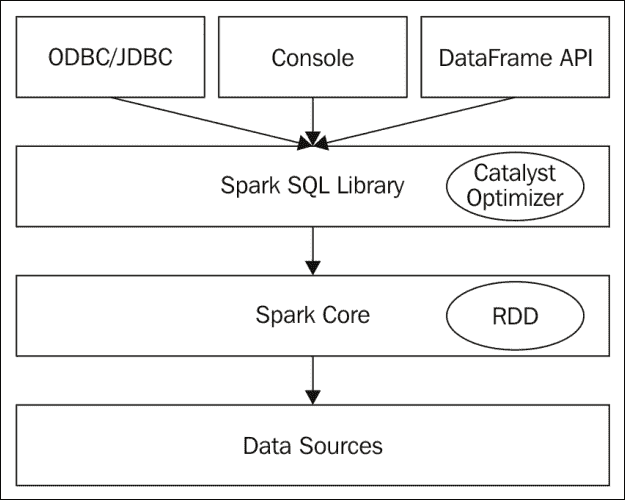
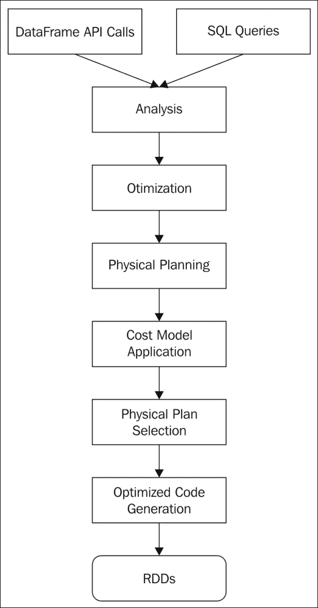
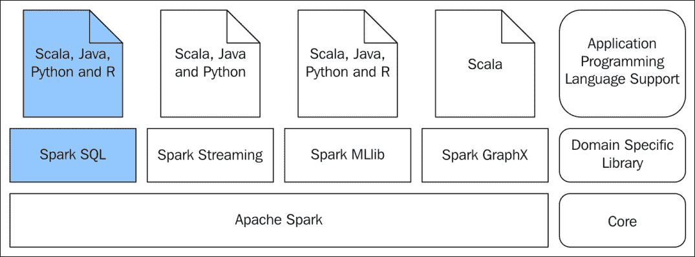

# 第三章：Spark SQL

大多数企业始终处理着大量的结构化数据。尽管处理非结构化数据的方法众多，但许多应用场景仍需依赖结构化数据。处理结构化数据与非结构化数据的主要区别是什么？如果数据源是结构化的，且数据处理引擎事先知晓数据结构，那么该引擎在处理数据时可以进行大量优化，甚至提前进行。当数据处理量巨大且周转时间极为关键时，这一点尤为重要。

企业数据的激增要求赋予终端用户通过简单易用的应用程序用户界面查询和处理数据的能力。关系型数据库管理系统供应商联合起来，**结构化查询语言**（**SQL**）应运而生，成为解决这一问题的方案。在过去几十年里，所有与数据打交道的人，即使不是高级用户，也熟悉了 SQL。

社交网络和微博等大规模互联网应用产生的数据超出了许多传统数据处理工具的消耗能力。面对如此海量的数据，从中挑选并选择正确的数据变得更为重要。Spark 是一个广泛使用的数据处理平台，其基于 RDD 的编程模型相比 Hadoop MapReduce 数据处理框架减少了数据处理的工作量。然而，Spark 早期基于 RDD 的编程模型对于终端用户（如数据科学家、数据分析师和业务分析师）来说使用起来并不直观。主要原因是它需要一定程度的功能编程知识。解决这一问题的方案是 Spark SQL。Spark SQL 是建立在 Spark 之上的一个库，它提供了 SQL 接口和 DataFrame API。DataFrame API 支持 Scala、Java、Python 和 R 等编程语言。

如果事先知道数据的结构，如果数据符合行和列的模型，那么数据来自哪里并不重要，Spark SQL 可以将所有数据整合在一起处理，仿佛所有数据都来自单一来源。此外，查询语言是普遍使用的 SQL。

本章我们将涵盖以下主题：

+   数据结构

+   Spark SQL

+   聚合

+   多数据源连接

+   数据集

+   数据目录

# 理解数据结构

此处讨论的数据结构需要进一步阐明。我们所说的数据结构是什么意思？存储在 RDBMS 中的数据以行/列或记录/字段的方式存储。每个字段都有数据类型，每个记录是相同或不同数据类型的字段集合。在 RDBMS 早期，字段的数据类型是标量的，而在近期版本中，它扩展到包括集合数据类型或复合数据类型。因此，无论记录包含标量数据类型还是复合数据类型，重要的是要注意底层数据具有结构。许多数据处理范式已采用在内存中镜像 RDBMS 或其他存储中持久化的底层数据结构的概念，以简化数据处理。

换言之，如果 RDBMS 表中的数据正被数据处理应用程序处理，且内存中存在与该表类似的数据结构供程序、最终用户和程序员使用，那么建模应用程序和查询数据就变得容易了。例如，假设有一组逗号分隔的数据项，每行具有固定数量的值，且每个特定位置的值都有特定的数据类型。这是一个结构化数据文件，类似于 RDBMS 表。

在 R 等编程语言中，使用数据框抽象在内存中存储数据表。Python 数据分析库 Pandas 也有类似的数据框概念。一旦该数据结构在内存中可用，程序就可以根据需要提取数据并进行切片和切块。同样的数据表概念被扩展到 Spark，称为 DataFrame，建立在 RDD 之上，并且有一个非常全面的 API，即 Spark SQL 中的 DataFrame API，用于处理 DataFrame 中的数据。还开发了一种类似 SQL 的查询语言，以满足最终用户查询和处理底层结构化数据的需求。总之，DataFrame 是一个分布式数据表，按行和列组织，并为每个列命名。

Spark SQL 库建立在 Spark 之上，是基于题为*“Spark SQL：Spark 中的关系数据处理”*的研究论文开发的。它提出了 Spark SQL 的四个目标，并如下所述：

+   支持在 Spark 程序内部（基于原生 RDD）以及使用程序员友好 API 的外部数据源上进行关系处理

+   利用成熟的 DBMS 技术提供高性能

+   轻松支持新的数据源，包括半结构化数据和易于查询联合的外部数据库

+   支持扩展高级分析算法，如图形处理和机器学习

DataFrame 存储结构化数据，并且是分布式的。它允许进行数据的选择、过滤和聚合。听起来与 RDD 非常相似吗？RDD 和 DataFrame 的关键区别在于，DataFrame 存储了关于数据结构的更多信息，如数据类型和列名，这使得 DataFrame 在处理优化上比基于 RDD 的 Spark 转换和操作更为有效。另一个需要提及的重要方面是，Spark 支持的所有编程语言都可以用来开发使用 Spark SQL 的 DataFrame API 的应用程序。实际上，Spark SQL 是一个分布式的 SQL 引擎。

### 提示

那些在 Spark 1.3 之前工作过的人一定对 SchemaRDD 很熟悉，而 DataFrame 的概念正是建立在 SchemaRDD 之上，并保持了 API 级别的兼容性。

# 为何选择 Spark SQL？

毫无疑问，SQL 是进行数据分析的通用语言，而 Spark SQL 则是 Spark 工具集家族对此的回应。那么，它提供了什么？它提供了在 Spark 之上运行 SQL 的能力。无论数据来自 CSV、Avro、Parquet、Hive、NoSQL 数据存储如 Cassandra，甚至是 RDBMS，Spark SQL 都能用于分析数据，并与 Spark 程序混合使用。这里提到的许多数据源都由 Spark SQL 内在支持，而其他许多则由外部包支持。这里最值得强调的是 Spark SQL 处理来自极其多样数据源的数据的能力。一旦数据作为 DataFrame 在 Spark 中可用，Spark SQL 就能以完全分布式的方式处理数据，将来自不同数据源的 DataFrames 组合起来进行处理和查询，仿佛整个数据集都来自单一源。

在前一章中，详细讨论了 RDD 并将其引入为 Spark 编程模型。Spark SQL 中的 DataFrames API 和 SQL 方言的使用是否正在取代基于 RDD 的编程模型？绝对不是！基于 RDD 的编程模型是 Spark 中通用且基本的数据处理模型。基于 RDD 的编程需要使用实际的编程技术。Spark 转换和 Spark 操作使用了许多函数式编程结构。尽管与 Hadoop MapReduce 或其他范式相比，基于 RDD 的编程模型所需的代码量较少，但仍需要编写一定量的函数式代码。这对于许多数据科学家、数据分析师和业务分析师来说是一个障碍，他们可能主要进行探索性的数据分析或对数据进行一些原型设计。Spark SQL 完全消除了这些限制。简单易用的**领域特定语言**（**DSL**）方法，用于从数据源读取和写入数据，类似 SQL 的语言用于选择、过滤和聚合，以及从各种数据源读取数据的能力，使得任何了解数据结构的人都可以轻松使用它。

### 注意

何时使用 RDD，何时使用 Spark SQL 的最佳用例是什么？答案很简单。如果数据是结构化的，可以排列在表格中，并且可以为每一列命名，那么使用 Spark SQL。这并不意味着 RDD 和 DataFrame 是两个截然不同的实体。它们互操作得非常好。从 RDD 到 DataFrame 以及反之的转换都是完全可能的。许多通常应用于 RDD 的 Spark 转换和 Spark 操作也可以应用于 DataFrames。

通常，在应用程序设计阶段，业务分析师通常使用 SQL 对应用程序数据进行大量分析，这些分析结果被用于应用程序需求和测试工件。在设计大数据应用程序时，同样需要这样做，在这种情况下，除了业务分析师之外，数据科学家也将成为团队的一部分。在基于 Hadoop 的生态系统中，Hive 广泛用于使用大数据进行数据分析。现在，Spark SQL 将这种能力带到了任何支持大量数据源的平台。如果商品硬件上有一个独立的 Spark 安装，可以进行大量此类活动来分析数据。在商品硬件上以独立模式部署的基本 Spark 安装足以处理大量数据。

SQL-on-Hadoop 策略引入了许多应用程序，例如 Hive 和 Impala 等，为存储在 **Hadoop 分布式文件系统** (**HDFS**) 中的底层大数据提供类似 SQL 的接口。Spark SQL 在这个领域中处于什么位置？在深入探讨之前，了解一下 Hive 和 Impala 是个好主意。Hive 是一种基于 MapReduce 的数据仓库技术，由于使用 MapReduce 处理查询，Hive 查询在完成之前需要进行大量的 I/O 操作。Impala 通过进行内存处理并利用描述数据的 Hive 元存储提出了一个出色的解决方案。Spark SQL 使用 SQLContext 执行所有数据操作。但它也可以使用 HiveContext，后者比 SQLContext 功能更丰富、更高级。HiveContext 可以执行 SQLContext 所能做的一切，并且在此基础上，它可以读取 Hive 元存储和表，还可以访问 Hive 用户定义的函数。使用 HiveContext 的唯一要求显然是应该有一个现成的 Hive 设置。这样，Spark SQL 就可以轻松地与 Hive 共存。

### 注意

从 Spark 2.0 开始，SparkSession 是基于 Spark SQL 的应用程序的新起点，它是 SQLContext 和 HiveContext 的组合，同时支持与 SQLContext 和 HiveContext 的向后兼容性。

Spark SQL 处理来自 Hive 表的数据比使用 Hive 查询语言的 Hive 更快。Spark SQL 的另一个非常有趣的功能是它能够从不同版本的 Hive 读取数据，这是一个很好的功能，可以实现数据处理的数据源整合。

### 注意

提供 Spark SQL 和 DataFrame API 的库提供了可以通过 JDBC/ODBC 访问的接口。这为数据分析开辟了一个全新的世界。例如，使用 JDBC/ODBC 连接到数据源的 **商业智能** (**BI**) 工具可以使用 Spark SQL 支持的大量数据源。此外，BI 工具可以将处理器密集型的连接聚合操作推送到 Spark 基础设施中的大量工作节点上。

# Spark SQL 剖析

与 Spark SQL 库的交互主要通过两种方法进行。一种是通过类似 SQL 的查询，另一种是通过 DataFrame API。在深入了解基于 DataFrame 的程序如何工作之前，了解一下基于 RDD 的程序如何工作是个好主意。

Spark 转换和 Spark 操作被转换为 Java 函数，并在 RDD 之上执行，RDD 本质上就是作用于数据的 Java 对象。由于 RDD 是纯粹的 Java 对象，因此在编译时或运行时都无法预知将要处理的数据。执行引擎事先没有可用的元数据来优化 Spark 转换或 Spark 操作。没有提前准备的多条执行路径或查询计划来处理这些数据，因此无法评估各种执行路径的有效性。

这里没有执行优化的查询计划，因为没有与数据关联的架构。在 DataFrame 的情况下，结构是事先已知的。因此，可以对查询进行优化并在事先构建数据缓存。

以下*图 1*展示了相关内容：



图 1

针对 DataFrame 的类似 SQL 的查询和 DataFrame API 调用被转换为与语言无关的表达式。与 SQL 查询或 DataFrame API 对应的与语言无关的表达式称为未解析的逻辑计划。

未解析的逻辑计划通过验证 DataFrame 元数据中的列名来转换为逻辑计划。逻辑计划通过应用标准规则（如表达式简化、表达式求值和其他优化规则）进一步优化，形成优化的逻辑计划。优化的逻辑计划被转换为多个物理计划。物理计划是通过在逻辑计划中使用 Spark 特定的操作符创建的。选择最佳物理计划，并将生成的查询推送到 RDD 以作用于数据。由于 SQL 查询和 DataFrame API 调用被转换为与语言无关的查询表达式，因此这些查询在所有支持的语言中的性能是一致的。这也是 DataFrame API 被所有 Spark 支持的语言（如 Scala、Java、Python 和 R）支持的原因。未来，由于这个原因，很可能会有更多语言支持 DataFrame API 和 Spark SQL。

Spark SQL 的查询规划和优化也值得一提。通过 SQL 查询或 DataFrame API 对 DataFrame 执行的任何查询操作在物理应用于底层基本 RDD 之前都经过了高度优化。在 RDD 上实际操作发生之前，存在许多中间过程。

*图 2* 提供了关于整个查询优化过程的一些见解：



图 2

针对 DataFrame，可以调用两种类型的查询：SQL 查询或 DataFrame API 调用。它们经过适当的分析，生成逻辑查询执行计划。随后，对逻辑查询计划进行优化，以得到优化的逻辑查询计划。从最终的优化逻辑查询计划出发，制定一个或多个物理查询计划。对于每个物理查询计划，都会计算成本模型，并根据最优成本选择合适的物理查询计划，生成高度优化的代码，并针对 RDDs 运行。这就是 DataFrame 上任何类型查询性能一致的原因。这也是为什么从 Scala、Java、Python 和 R 等不同语言调用 DataFrame API 都能获得一致性能的原因。

让我们再次回顾*图 3*所示的大局，以设定背景，了解当前讨论的内容，然后再深入探讨并处理这些用例：



图 3

接下来要讨论的使用案例将展示如何将 SQL 查询与 Spark 程序结合。我们将选择多个数据源，使用 DataFrame 从这些源读取数据，并展示统一的数据访问。演示使用的编程语言仍然是 Scala 和 Python。本书议程中还包括使用 R 操作 DataFrame，并为此专门设立了一章。

# DataFrame 编程

以下是用于阐释使用 DataFrame 进行 Spark SQL 编程方式的用例：

+   交易记录以逗号分隔的值形式呈现。

+   从列表中筛选出仅包含良好交易记录的部分。账户号码应以`SB`开头，且交易金额应大于零。

+   查找所有交易金额大于 1000 的高价值交易记录。

+   查找所有账户号码异常的交易记录。

+   查找所有交易金额小于或等于零的交易记录。

+   查找所有不良交易记录的合并列表。

+   计算所有交易金额的总和。

+   查找所有交易金额的最大值。

+   查找所有交易金额的最小值。

+   查找所有良好账户号码。

这正是上一章中使用的同一组用例，但这里的编程模型完全不同。通过这组用例，我们展示了两种编程模型：一种是使用 SQL 查询，另一种是使用 DataFrame API。

## 使用 SQL 编程

在 Scala REPL 提示符下，尝试以下语句：

```scala
scala> // Define the case classes for using in conjunction with DataFrames 
scala> case class Trans(accNo: String, tranAmount: Double) 
defined class Trans 
scala> // Functions to convert the sequence of strings to objects defined by the case classes 
scala> def toTrans =  (trans: Seq[String]) => Trans(trans(0), trans(1).trim.toDouble) 
toTrans: Seq[String] => Trans 
scala> // Creation of the list from where the RDD is going to be created 
scala> val acTransList = Array("SB10001,1000", "SB10002,1200", "SB10003,8000", "SB10004,400", "SB10005,300", "SB10006,10000", "SB10007,500", "SB10008,56", "SB10009,30","SB10010,7000", "CR10001,7000", "SB10002,-10") 
acTransList: Array[String] = Array(SB10001,1000, SB10002,1200, SB10003,8000, SB10004,400, SB10005,300, SB10006,10000, SB10007,500, SB10008,56, SB10009,30, SB10010,7000, CR10001,7000, SB10002,-10) 
scala> // Create the RDD 
scala> val acTransRDD = sc.parallelize(acTransList).map(_.split(",")).map(toTrans(_)) 
acTransRDD: org.apache.spark.rdd.RDD[Trans] = MapPartitionsRDD[2] at map at <console>:30 
scala> // Convert RDD to DataFrame 
scala> val acTransDF = spark.createDataFrame(acTransRDD) 
acTransDF: org.apache.spark.sql.DataFrame = [accNo: string, tranAmount: double] 
scala> // Register temporary view in the DataFrame for using it in SQL 
scala> acTransDF.createOrReplaceTempView("trans") 
scala> // Print the structure of the DataFrame 
scala> acTransDF.printSchema 
root 
 |-- accNo: string (nullable = true) 
 |-- tranAmount: double (nullable = false) 
scala> // Show the first few records of the DataFrame 
scala> acTransDF.show 
+-------+----------+ 
|  accNo|tranAmount| 
+-------+----------+ 
|SB10001|    1000.0| 
|SB10002|    1200.0| 
|SB10003|    8000.0| 
|SB10004|     400.0| 
|SB10005|     300.0| 
|SB10006|   10000.0| 
|SB10007|     500.0| 
|SB10008|      56.0| 
|SB10009|      30.0| 
|SB10010|    7000.0| 
|CR10001|    7000.0| 
|SB10002|     -10.0| 
+-------+----------+ 
scala> // Use SQL to create another DataFrame containing the good transaction records 
scala> val goodTransRecords = spark.sql("SELECT accNo, tranAmount FROM trans WHERE accNo like 'SB%' AND tranAmount > 0") 
goodTransRecords: org.apache.spark.sql.DataFrame = [accNo: string, tranAmount: double] 
scala> // Register temporary view in the DataFrame for using it in SQL 
scala> goodTransRecords.createOrReplaceTempView("goodtrans") 
scala> // Show the first few records of the DataFrame 
scala> goodTransRecords.show 
+-------+----------+ 
|  accNo|tranAmount| 
+-------+----------+ 
|SB10001|    1000.0| 
|SB10002|    1200.0| 
|SB10003|    8000.0| 
|SB10004|     400.0| 
|SB10005|     300.0| 
|SB10006|   10000.0| 
|SB10007|     500.0| 
|SB10008|      56.0| 
|SB10009|      30.0| 
|SB10010|    7000.0| 
+-------+----------+ 
scala> // Use SQL to create another DataFrame containing the high value transaction records 
scala> val highValueTransRecords = spark.sql("SELECT accNo, tranAmount FROM goodtrans WHERE tranAmount > 1000") 
highValueTransRecords: org.apache.spark.sql.DataFrame = [accNo: string, tranAmount: double] 
scala> // Show the first few records of the DataFrame 
scala> highValueTransRecords.show 
+-------+----------+ 
|  accNo|tranAmount| 
+-------+----------+ 
|SB10002|    1200.0| 
|SB10003|    8000.0| 
|SB10006|   10000.0| 
|SB10010|    7000.0| 
+-------+----------+ 
scala> // Use SQL to create another DataFrame containing the bad account records 
scala> val badAccountRecords = spark.sql("SELECT accNo, tranAmount FROM trans WHERE accNo NOT like 'SB%'") 
badAccountRecords: org.apache.spark.sql.DataFrame = [accNo: string, tranAmount: double] 
scala> // Show the first few records of the DataFrame 
scala> badAccountRecords.show 
+-------+----------+ 
|  accNo|tranAmount| 
+-------+----------+ 
|CR10001|    7000.0| 
+-------+----------+ 
scala> // Use SQL to create another DataFrame containing the bad amount records 
scala> val badAmountRecords = spark.sql("SELECT accNo, tranAmount FROM trans WHERE tranAmount < 0") 
badAmountRecords: org.apache.spark.sql.DataFrame = [accNo: string, tranAmount: double] 
scala> // Show the first few records of the DataFrame 
scala> badAmountRecords.show 
+-------+----------+ 
|  accNo|tranAmount| 
+-------+----------+ 
|SB10002|     -10.0| 
+-------+----------+ 
scala> // Do the union of two DataFrames and create another DataFrame 
scala> val badTransRecords = badAccountRecords.union(badAmountRecords) 
badTransRecords: org.apache.spark.sql.Dataset[org.apache.spark.sql.Row] = [accNo: string, tranAmount: double] 
scala> // Show the first few records of the DataFrame 
scala> badTransRecords.show 
+-------+----------+ 
|  accNo|tranAmount| 
+-------+----------+ 
|CR10001|    7000.0| 
|SB10002|     -10.0| 
+-------+----------+ 
scala> // Calculate the sum 
scala> val sumAmount = spark.sql("SELECT sum(tranAmount) as sum FROM goodtrans") 
sumAmount: org.apache.spark.sql.DataFrame = [sum: double] 
scala> // Show the first few records of the DataFrame 
scala> sumAmount.show 
+-------+ 
|    sum| 
+-------+ 
|28486.0| 
+-------+ 
scala> // Calculate the maximum 
scala> val maxAmount = spark.sql("SELECT max(tranAmount) as max FROM goodtrans") 
maxAmount: org.apache.spark.sql.DataFrame = [max: double] 
scala> // Show the first few records of the DataFrame 
scala> maxAmount.show 
+-------+ 
|    max| 
+-------+ 
|10000.0| 
+-------+ 
scala> // Calculate the minimum 
scala> val minAmount = spark.sql("SELECT min(tranAmount) as min FROM goodtrans") 
minAmount: org.apache.spark.sql.DataFrame = [min: double] 
scala> // Show the first few records of the DataFrame 
scala> minAmount.show 
+----+ 
| min| 
+----+ 
|30.0| 
+----+ 
scala> // Use SQL to create another DataFrame containing the good account numbers 
scala> val goodAccNos = spark.sql("SELECT DISTINCT accNo FROM trans WHERE accNo like 'SB%' ORDER BY accNo") 
goodAccNos: org.apache.spark.sql.DataFrame = [accNo: string] 
scala> // Show the first few records of the DataFrame 
scala> goodAccNos.show 
+-------+ 
|  accNo| 
+-------+ 
|SB10001| 
|SB10002| 
|SB10003| 
|SB10004| 
|SB10005| 
|SB10006| 
|SB10007| 
|SB10008| 
|SB10009| 
|SB10010| 
+-------+ 
scala> // Calculate the aggregates using mixing of DataFrame and RDD like operations 
scala> val sumAmountByMixing = goodTransRecords.map(trans => trans.getAsDouble).reduce(_ + _) 
sumAmountByMixing: Double = 28486.0 
scala> val maxAmountByMixing = goodTransRecords.map(trans => trans.getAsDouble).reduce((a, b) => if (a > b) a else b) 
maxAmountByMixing: Double = 10000.0 
scala> val minAmountByMixing = goodTransRecords.map(trans => trans.getAsDouble).reduce((a, b) => if (a < b) a else b) 
minAmountByMixing: Double = 30.0 

```

零售银行业务的交易记录包含账户号码和交易金额，通过 SparkSQL 处理以获得用例所需的结果。以下是上述脚本执行的概要：

+   Scala case 类被定义以描述将要输入 DataFrame 的交易记录的结构。

+   定义了一个包含必要交易记录的数组。

+   RDD 由数组生成，分割逗号分隔的值，映射以使用 Scala 脚本中定义的第一个步骤中的 case 类创建对象，并将 RDD 转换为 DataFrame。这是 RDD 与 DataFrame 之间互操作性的一个用例。

+   使用一个名称将表注册到 DataFrame。该注册表的名称可以在 SQL 语句中使用。

+   然后，所有其他活动只是使用 `spark.sql` 方法发出 SQL 语句。这里的 spark 对象是 SparkSession 类型。

+   所有这些 SQL 语句的结果存储为 DataFrames，并且就像 RDD 的 `collect` 操作一样，使用 DataFrame 的 show 方法将值提取到 Spark 驱动程序中。

+   聚合值的计算以两种不同的方式进行。一种是使用 SQL 语句的方式，这是最简单的方式。另一种是使用常规的 RDD 风格的 Spark 转换和 Spark 操作。这是为了展示即使 DataFrame 也可以像 RDD 一样操作，并且可以在 DataFrame 上应用 Spark 转换和 Spark 操作。

+   有时，通过使用函数的功能样式操作进行一些数据操作活动很容易。因此，这里有一个灵活性，可以混合使用 SQL、RDD 和 DataFrame，以拥有一个非常方便的数据处理编程模型。

+   DataFrame 内容以表格格式使用 DataFrame 的 `show` 方法显示。

+   使用 `printSchema` 方法展示 DataFrame 结构的详细视图。这类似于数据库表的 `describe` 命令。

在 Python REPL 提示符下，尝试以下语句：

```scala
>>> from pyspark.sql import Row 
>>> # Creation of the list from where the RDD is going to be created 
>>> acTransList = ["SB10001,1000", "SB10002,1200", "SB10003,8000", "SB10004,400", "SB10005,300", "SB10006,10000", "SB10007,500", "SB10008,56", "SB10009,30","SB10010,7000", "CR10001,7000", "SB10002,-10"] 
>>> # Create the DataFrame 
>>> acTransDF = sc.parallelize(acTransList).map(lambda trans: trans.split(",")).map(lambda p: Row(accNo=p[0], tranAmount=float(p[1]))).toDF() 
>>> # Register temporary view in the DataFrame for using it in SQL 
>>> acTransDF.createOrReplaceTempView("trans") 
>>> # Print the structure of the DataFrame 
>>> acTransDF.printSchema() 
root 
 |-- accNo: string (nullable = true) 
 |-- tranAmount: double (nullable = true) 
>>> # Show the first few records of the DataFrame 
>>> acTransDF.show() 
+-------+----------+ 
|  accNo|tranAmount| 
+-------+----------+ 
|SB10001|    1000.0| 
|SB10002|    1200.0| 
|SB10003|    8000.0| 
|SB10004|     400.0| 
|SB10005|     300.0| 
|SB10006|   10000.0| 
|SB10007|     500.0| 
|SB10008|      56.0| 
|SB10009|      30.0| 
|SB10010|    7000.0| 
|CR10001|    7000.0| 
|SB10002|     -10.0| 
+-------+----------+ 
>>> # Use SQL to create another DataFrame containing the good transaction records 
>>> goodTransRecords = spark.sql("SELECT accNo, tranAmount FROM trans WHERE accNo like 'SB%' AND tranAmount > 0") 
>>> # Register temporary table in the DataFrame for using it in SQL 
>>> goodTransRecords.createOrReplaceTempView("goodtrans") 
>>> # Show the first few records of the DataFrame 
>>> goodTransRecords.show() 
+-------+----------+ 
|  accNo|tranAmount| 
+-------+----------+ 
|SB10001|    1000.0| 
|SB10002|    1200.0| 
|SB10003|    8000.0| 
|SB10004|     400.0| 
|SB10005|     300.0| 
|SB10006|   10000.0| 
|SB10007|     500.0| 
|SB10008|      56.0| 
|SB10009|      30.0| 
|SB10010|    7000.0| 
+-------+----------+ 
>>> # Use SQL to create another DataFrame containing the high value transaction records 
>>> highValueTransRecords = spark.sql("SELECT accNo, tranAmount FROM goodtrans WHERE tranAmount > 1000") 
>>> # Show the first few records of the DataFrame 
>>> highValueTransRecords.show() 
+-------+----------+ 
|  accNo|tranAmount| 
+-------+----------+ 
|SB10002|    1200.0| 
|SB10003|    8000.0| 
|SB10006|   10000.0| 
|SB10010|    7000.0| 
+-------+----------+ 
>>> # Use SQL to create another DataFrame containing the bad account records 
>>> badAccountRecords = spark.sql("SELECT accNo, tranAmount FROM trans WHERE accNo NOT like 'SB%'") 
>>> # Show the first few records of the DataFrame 
>>> badAccountRecords.show() 
+-------+----------+ 
|  accNo|tranAmount| 
+-------+----------+ 
|CR10001|    7000.0| 
+-------+----------+ 
>>> # Use SQL to create another DataFrame containing the bad amount records 
>>> badAmountRecords = spark.sql("SELECT accNo, tranAmount FROM trans WHERE tranAmount < 0") 
>>> # Show the first few records of the DataFrame 
>>> badAmountRecords.show() 
+-------+----------+ 
|  accNo|tranAmount| 
+-------+----------+ 
|SB10002|     -10.0| 
+-------+----------+ 
>>> # Do the union of two DataFrames and create another DataFrame 
>>> badTransRecords = badAccountRecords.union(badAmountRecords) 
>>> # Show the first few records of the DataFrame 
>>> badTransRecords.show() 
+-------+----------+ 
|  accNo|tranAmount| 
+-------+----------+ 
|CR10001|    7000.0| 
|SB10002|     -10.0| 
+-------+----------+ 
>>> # Calculate the sum 
>>> sumAmount = spark.sql("SELECT sum(tranAmount)as sum FROM goodtrans") 
>>> # Show the first few records of the DataFrame 
>>> sumAmount.show() 
+-------+ 
|    sum| 
+-------+ 
|28486.0| 
+-------+ 
>>> # Calculate the maximum 
>>> maxAmount = spark.sql("SELECT max(tranAmount) as max FROM goodtrans") 
>>> # Show the first few records of the DataFrame 
>>> maxAmount.show() 
+-------+ 
|    max| 
+-------+ 
|10000.0| 
+-------+ 
>>> # Calculate the minimum 
>>> minAmount = spark.sql("SELECT min(tranAmount)as min FROM goodtrans") 
>>> # Show the first few records of the DataFrame 
>>> minAmount.show() 
+----+ 
| min| 
+----+ 
|30.0| 
+----+ 
>>> # Use SQL to create another DataFrame containing the good account numbers 
>>> goodAccNos = spark.sql("SELECT DISTINCT accNo FROM trans WHERE accNo like 'SB%' ORDER BY accNo") 
>>> # Show the first few records of the DataFrame 
>>> goodAccNos.show() 
+-------+ 
|  accNo| 
+-------+ 
|SB10001| 
|SB10002| 
|SB10003| 
|SB10004| 
|SB10005| 
|SB10006| 
|SB10007| 
|SB10008| 
|SB10009| 
|SB10010| 
+-------+ 
>>> # Calculate the sum using mixing of DataFrame and RDD like operations 
>>> sumAmountByMixing = goodTransRecords.rdd.map(lambda trans: trans.tranAmount).reduce(lambda a,b : a+b) 
>>> sumAmountByMixing 
28486.0 
>>> # Calculate the maximum using mixing of DataFrame and RDD like operations 
>>> maxAmountByMixing = goodTransRecords.rdd.map(lambda trans: trans.tranAmount).reduce(lambda a,b : a if a > b else b) 
>>> maxAmountByMixing 
10000.0 
>>> # Calculate the minimum using mixing of DataFrame and RDD like operations 
>>> minAmountByMixing = goodTransRecords.rdd.map(lambda trans: trans.tranAmount).reduce(lambda a,b : a if a < b else b) 
>>> minAmountByMixing 
30.0 

```

在前面的 Python 代码片段中，除了一些特定于语言的构造（如导入库和定义 lambda 函数）之外，编程风格几乎与 Scala 代码相同。这是 Spark 统一编程模型的优势。如前所述，当业务分析师或数据分析师提供数据访问的 SQL 时，很容易将其与 Spark 中的数据处理代码集成。这种统一的编程风格对于组织使用他们选择的语言在 Spark 中开发数据处理应用程序非常有用。

### 提示

在 DataFrame 上，如果应用了适用的 Spark 转换，则会返回一个 Dataset 而不是 DataFrame。Dataset 的概念在本章末尾引入。DataFrame 和 Dataset 之间有着非常紧密的联系，这在涵盖 Datasets 的部分中有所解释。在开发应用程序时，必须在这种情况下谨慎行事。例如，在前面的代码片段中，如果在 Scala REPL 中尝试以下转换，它将返回一个数据集：`val amount = goodTransRecords.map(trans => trans.getAsDouble)amount: org.apache.spark.sql.Dataset[Double] = [value: double]`

## 使用 DataFrame API 编程

在本节中，代码片段将在适当的语言 REPL 中运行，作为前一节的延续，以便数据设置和其他初始化不会重复。与前面的代码片段一样，最初给出了一些 DataFrame 特定的基本命令。这些命令通常用于查看内容并对 DataFrame 及其内容进行一些合理性测试。这些是在数据分析的探索阶段经常使用的命令，通常用于更深入地了解底层数据的结构和内容。

在 Scala REPL 提示符下，尝试以下语句：

```scala
scala> acTransDF.show 
+-------+----------+ 
|  accNo|tranAmount| 
+-------+----------+ 
|SB10001|    1000.0| 
|SB10002|    1200.0| 
|SB10003|    8000.0| 
|SB10004|     400.0| 
|SB10005|     300.0| 
|SB10006|   10000.0| 
|SB10007|     500.0| 
|SB10008|      56.0| 
|SB10009|      30.0| 
|SB10010|    7000.0| 
|CR10001|    7000.0| 
|SB10002|     -10.0| 
+-------+----------+ 
scala> // Create the DataFrame using API for the good transaction records 
scala> val goodTransRecords = acTransDF.filter("accNo like 'SB%'").filter("tranAmount > 0") 
goodTransRecords: org.apache.spark.sql.Dataset[org.apache.spark.sql.Row] = [accNo: string, tranAmount: double] 
scala> // Show the first few records of the DataFrame 
scala> goodTransRecords.show 
+-------+----------+ 
|  accNo|tranAmount| 
+-------+----------+ 
|SB10001|    1000.0| 
|SB10002|    1200.0| 
|SB10003|    8000.0| 
|SB10004|     400.0| 
|SB10005|     300.0| 
|SB10006|   10000.0| 
|SB10007|     500.0| 
|SB10008|      56.0| 
|SB10009|      30.0| 
|SB10010|    7000.0| 
+-------+----------+ 
scala> // Create the DataFrame using API for the high value transaction records 
scala> val highValueTransRecords = goodTransRecords.filter("tranAmount > 1000") 
highValueTransRecords: org.apache.spark.sql.Dataset[org.apache.spark.sql.Row] = [accNo: string, tranAmount: double] 
scala> // Show the first few records of the DataFrame 
scala> highValueTransRecords.show 
+-------+----------+ 
|  accNo|tranAmount| 
+-------+----------+ 
|SB10002|    1200.0| 
|SB10003|    8000.0| 
|SB10006|   10000.0| 
|SB10010|    7000.0| 
+-------+----------+ 
scala> // Create the DataFrame using API for the bad account records 
scala> val badAccountRecords = acTransDF.filter("accNo NOT like 'SB%'") 
badAccountRecords: org.apache.spark.sql.Dataset[org.apache.spark.sql.Row] = [accNo: string, tranAmount: double] 
scala> // Show the first few records of the DataFrame 
scala> badAccountRecords.show 
+-------+----------+ 
|  accNo|tranAmount| 
+-------+----------+ 
|CR10001|    7000.0| 
+-------+----------+ 
scala> // Create the DataFrame using API for the bad amount records 
scala> val badAmountRecords = acTransDF.filter("tranAmount < 0") 
badAmountRecords: org.apache.spark.sql.Dataset[org.apache.spark.sql.Row] = [accNo: string, tranAmount: double] 
scala> // Show the first few records of the DataFrame 
scala> badAmountRecords.show 
+-------+----------+ 
|  accNo|tranAmount| 
+-------+----------+ 
|SB10002|     -10.0| 
+-------+----------+ 
scala> // Do the union of two DataFrames 
scala> val badTransRecords = badAccountRecords.union(badAmountRecords) 
badTransRecords: org.apache.spark.sql.Dataset[org.apache.spark.sql.Row] = [accNo: string, tranAmount: double] 
scala> // Show the first few records of the DataFrame 
scala> badTransRecords.show 
+-------+----------+ 
|  accNo|tranAmount| 
+-------+----------+ 
|CR10001|    7000.0| 
|SB10002|     -10.0| 
+-------+----------+ 
scala> // Calculate the aggregates in one shot 
scala> val aggregates = goodTransRecords.agg(sum("tranAmount"), max("tranAmount"), min("tranAmount")) 
aggregates: org.apache.spark.sql.DataFrame = [sum(tranAmount): double, max(tranAmount): double ... 1 more field] 
scala> // Show the first few records of the DataFrame 
scala> aggregates.show 
+---------------+---------------+---------------+ 
|sum(tranAmount)|max(tranAmount)|min(tranAmount)| 
+---------------+---------------+---------------+ 
|        28486.0|        10000.0|           30.0| 
+---------------+---------------+---------------+ 
scala> // Use DataFrame using API for creating the good account numbers 
scala> val goodAccNos = acTransDF.filter("accNo like 'SB%'").select("accNo").distinct().orderBy("accNo") 
goodAccNos: org.apache.spark.sql.Dataset[org.apache.spark.sql.Row] = [accNo: string] 
scala> // Show the first few records of the DataFrame 
scala> goodAccNos.show 
+-------+ 
|  accNo| 
+-------+ 
|SB10001| 
|SB10002| 
|SB10003| 
|SB10004| 
|SB10005| 
|SB10006| 
|SB10007| 
|SB10008| 
|SB10009| 
|SB10010| 
+-------+ 
scala> // Persist the data of the DataFrame into a Parquet file 
scala> acTransDF.write.parquet("scala.trans.parquet") 
scala> // Read the data into a DataFrame from the Parquet file 
scala> val acTransDFfromParquet = spark.read.parquet("scala.trans.parquet") 
acTransDFfromParquet: org.apache.spark.sql.DataFrame = [accNo: string, tranAmount: double] 
scala> // Show the first few records of the DataFrame 
scala> acTransDFfromParquet.show 
+-------+----------+ 
|  accNo|tranAmount| 
+-------+----------+ 
|SB10002|    1200.0| 
|SB10003|    8000.0| 
|SB10005|     300.0| 
|SB10006|   10000.0| 
|SB10008|      56.0| 
|SB10009|      30.0| 
|CR10001|    7000.0| 
|SB10002|     -10.0| 
|SB10001|    1000.0| 
|SB10004|     400.0| 
|SB10007|     500.0| 
|SB10010|    7000.0| 
+-------+----------+

```

从 DataFrame API 的角度来看，这里是前面脚本的总结：

+   包含前一部分所用数据超集的 DataFrame 在此处被使用。

+   接下来演示记录的过滤。这里，最重要的是要注意过滤谓词必须像 SQL 语句中的谓词一样给出。过滤器可以链式使用。

+   聚合方法作为结果 DataFrame 中的三列一次性计算。

+   本组中的最终语句在一个单一的链式语句中完成了选择、过滤、选择不同的记录以及排序。

+   最后，交易记录以 Parquet 格式持久化，从 Parquet 存储中读取并创建一个 DataFrame。关于持久化格式的更多细节将在接下来的部分中介绍。

+   在此代码片段中，Parquet 格式的数据存储在当前目录中，从该目录调用相应的 REPL。当作为 Spark 程序运行时，目录再次将是调用 Spark 提交的当前目录。

在 Python REPL 提示符下，尝试以下语句：

```scala
>>> acTransDF.show() 
+-------+----------+ 
|  accNo|tranAmount| 
+-------+----------+ 
|SB10001|    1000.0| 
|SB10002|    1200.0| 
|SB10003|    8000.0| 
|SB10004|     400.0| 
|SB10005|     300.0| 
|SB10006|   10000.0| 
|SB10007|     500.0| 
|SB10008|      56.0| 
|SB10009|      30.0| 
|SB10010|    7000.0| 
|CR10001|    7000.0| 
|SB10002|     -10.0| 
+-------+----------+ 
>>> # Print the structure of the DataFrame 
>>> acTransDF.printSchema() 
root 
 |-- accNo: string (nullable = true) 
 |-- tranAmount: double (nullable = true) 
>>> # Create the DataFrame using API for the good transaction records 
>>> goodTransRecords = acTransDF.filter("accNo like 'SB%'").filter("tranAmount > 0") 
>>> # Show the first few records of the DataFrame 
>>> goodTransRecords.show() 
+-------+----------+ 
|  accNo|tranAmount| 
+-------+----------+ 
|SB10001|    1000.0| 
|SB10002|    1200.0| 
|SB10003|    8000.0| 
|SB10004|     400.0| 
|SB10005|     300.0| 
|SB10006|   10000.0| 
|SB10007|     500.0| 
|SB10008|      56.0| 
|SB10009|      30.0| 
|SB10010|    7000.0| 
+-------+----------+ 
>>> # Create the DataFrame using API for the high value transaction records 
>>> highValueTransRecords = goodTransRecords.filter("tranAmount > 1000") 
>>> # Show the first few records of the DataFrame 
>>> highValueTransRecords.show() 
+-------+----------+ 
|  accNo|tranAmount| 
+-------+----------+ 
|SB10002|    1200.0| 
|SB10003|    8000.0| 
|SB10006|   10000.0| 
|SB10010|    7000.0| 
+-------+----------+ 
>>> # Create the DataFrame using API for the bad account records 
>>> badAccountRecords = acTransDF.filter("accNo NOT like 'SB%'") 
>>> # Show the first few records of the DataFrame 
>>> badAccountRecords.show() 
+-------+----------+ 
|  accNo|tranAmount| 
+-------+----------+ 
|CR10001|    7000.0| 
+-------+----------+ 
>>> # Create the DataFrame using API for the bad amount records 
>>> badAmountRecords = acTransDF.filter("tranAmount < 0") 
>>> # Show the first few records of the DataFrame 
>>> badAmountRecords.show() 
+-------+----------+ 
|  accNo|tranAmount| 
+-------+----------+ 
|SB10002|     -10.0| 
+-------+----------+ 
>>> # Do the union of two DataFrames and create another DataFrame 
>>> badTransRecords = badAccountRecords.union(badAmountRecords) 
>>> # Show the first few records of the DataFrame 
>>> badTransRecords.show() 
+-------+----------+ 
|  accNo|tranAmount| 
+-------+----------+ 
|CR10001|    7000.0| 
|SB10002|     -10.0| 
+-------+----------+ 
>>> # Calculate the sum 
>>> sumAmount = goodTransRecords.agg({"tranAmount": "sum"}) 
>>> # Show the first few records of the DataFrame 
>>> sumAmount.show() 
+---------------+ 
|sum(tranAmount)| 
+---------------+ 
|        28486.0| 
+---------------+ 
>>> # Calculate the maximum 
>>> maxAmount = goodTransRecords.agg({"tranAmount": "max"}) 
>>> # Show the first few records of the DataFrame 
>>> maxAmount.show() 
+---------------+ 
|max(tranAmount)| 
+---------------+ 
|        10000.0| 
+---------------+ 
>>> # Calculate the minimum 
>>> minAmount = goodTransRecords.agg({"tranAmount": "min"}) 
>>> # Show the first few records of the DataFrame 
>>> minAmount.show() 
+---------------+ 
|min(tranAmount)| 
+---------------+ 
|           30.0| 
+---------------+ 
>>> # Create the DataFrame using API for the good account numbers 
>>> goodAccNos = acTransDF.filter("accNo like 'SB%'").select("accNo").distinct().orderBy("accNo") 
>>> # Show the first few records of the DataFrame 
>>> goodAccNos.show() 
+-------+ 
|  accNo| 
+-------+ 
|SB10001| 
|SB10002| 
|SB10003| 
|SB10004| 
|SB10005| 
|SB10006| 
|SB10007| 
|SB10008| 
|SB10009| 
|SB10010| 
+-------+ 
>>> # Persist the data of the DataFrame into a Parquet file 
>>> acTransDF.write.parquet("python.trans.parquet") 
>>> # Read the data into a DataFrame from the Parquet file 
>>> acTransDFfromParquet = spark.read.parquet("python.trans.parquet") 
>>> # Show the first few records of the DataFrame 
>>> acTransDFfromParquet.show() 
+-------+----------+ 
|  accNo|tranAmount| 
+-------+----------+ 
|SB10002|    1200.0| 
|SB10003|    8000.0| 
|SB10005|     300.0| 
|SB10006|   10000.0| 
|SB10008|      56.0| 
|SB10009|      30.0| 
|CR10001|    7000.0| 
|SB10002|     -10.0| 
|SB10001|    1000.0| 
|SB10004|     400.0| 
|SB10007|     500.0| 
|SB10010|    7000.0| 
+-------+----------+ 

```

在前面的 Python 代码片段中，除了聚合计算的极少数变化外，编程结构几乎与其 Scala 对应部分相似。

前述 Scala 和 Python 部分最后几条语句涉及将 DataFrame 内容持久化到媒体中。在任何数据处理操作中，写入和读取操作都非常必要，但大多数工具并没有统一的写入和读取方式。Spark SQL 则不同。DataFrame API 配备了一套丰富的持久化机制。将 DataFrame 内容写入多种支持的持久化存储非常简便。所有这些写入和读取操作都具有非常简单的 DSL 风格接口。以下是 DataFrame 可以写入和读取的一些内置格式。

除此之外，还有许多其他外部数据源通过第三方包得到支持：

+   JSON

+   Parquet

+   Hive

+   MySQL

+   PostgreSQL

+   HDFS

+   纯文本

+   亚马逊 S3

+   ORC

+   JDBC

在前述代码片段中已演示了将 DataFrame 写入和读取自 Parquet。所有这些内置支持的数据存储都具有非常简单的 DSL 风格语法用于持久化和读取，这使得编程风格再次统一。DataFrame API 参考资料是了解处理这些数据存储细节的绝佳资源。

本章中的示例代码将数据持久化在 Parquet 和 JSON 格式中。所选数据存储位置名称如`python.trans.parquet`、`scala.trans.parquet`等。这仅是为了表明使用哪种编程语言以及数据格式是什么。这不是正式约定，而是一种便利。当程序运行一次后，这些目录将被创建。下次运行同一程序时，它将尝试创建相同的目录，这将导致错误。解决方法是手动删除这些目录，在后续运行之前进行，然后继续。适当的错误处理机制和其他精细编程的细微差别会分散注意力，因此故意未在此书中涉及。

# 理解 Spark SQL 中的聚合

SQL 中的数据聚合非常灵活。Spark SQL 亦是如此。Spark SQL 并非在单机上的单一数据源上运行 SQL 语句，而是可以在分布式数据源上执行相同操作。在前一章中，讨论了一个 MapReduce 用例以进行数据聚合，此处同样使用该用例来展示 Spark SQL 的聚合能力。本节中，用例既采用 SQL 查询方式，也采用 DataFrame API 方式进行处理。

此处为阐明 MapReduce 类型数据处理而选取的用例如下：

+   零售银行业务交易记录包含以逗号分隔的账户号和交易金额

+   查找所有交易的账户级别汇总以获取账户余额

在 Scala REPL 提示符下，尝试以下语句：

```scala
scala> // Define the case classes for using in conjunction with DataFrames 
scala> case class Trans(accNo: String, tranAmount: Double) 
defined class Trans 
scala> // Functions to convert the sequence of strings to objects defined by the case classes 
scala> def toTrans =  (trans: Seq[String]) => Trans(trans(0), trans(1).trim.toDouble) 
toTrans: Seq[String] => Trans 
scala> // Creation of the list from where the RDD is going to be created 
scala> val acTransList = Array("SB10001,1000", "SB10002,1200","SB10001,8000", "SB10002,400", "SB10003,300", "SB10001,10000","SB10004,500","SB10005,56", "SB10003,30","SB10002,7000","SB10001,-100", "SB10002,-10") 
acTransList: Array[String] = Array(SB10001,1000, SB10002,1200, SB10001,8000, SB10002,400, SB10003,300, SB10001,10000, SB10004,500, SB10005,56, SB10003,30, SB10002,7000, SB10001,-100, SB10002,-10) 
scala> // Create the DataFrame 
scala> val acTransDF = sc.parallelize(acTransList).map(_.split(",")).map(toTrans(_)).toDF() 
acTransDF: org.apache.spark.sql.DataFrame = [accNo: string, tranAmount: double] 
scala> // Show the first few records of the DataFrame 
scala> acTransDF.show 
+-------+----------+ 
|  accNo|tranAmount| 
+-------+----------+ 
|SB10001|    1000.0| 
|SB10002|    1200.0| 
|SB10001|    8000.0| 
|SB10002|     400.0| 
|SB10003|     300.0| 
|SB10001|   10000.0| 
|SB10004|     500.0| 
|SB10005|      56.0| 
|SB10003|      30.0| 
|SB10002|    7000.0| 
|SB10001|    -100.0| 
|SB10002|     -10.0| 
+-------+----------+ 
scala> // Register temporary view in the DataFrame for using it in SQL 
scala> acTransDF.createOrReplaceTempView("trans") 
scala> // Use SQL to create another DataFrame containing the account summary records 
scala> val acSummary = spark.sql("SELECT accNo, sum(tranAmount) as TransTotal FROM trans GROUP BY accNo") 
acSummary: org.apache.spark.sql.DataFrame = [accNo: string, TransTotal: double] 
scala> // Show the first few records of the DataFrame 
scala> acSummary.show 
+-------+----------+ 
|  accNo|TransTotal| 
+-------+----------+ 
|SB10005|      56.0| 
|SB10004|     500.0| 
|SB10003|     330.0| 
|SB10002|    8590.0| 
|SB10001|   18900.0| 
+-------+----------+ 
scala> // Create the DataFrame using API for the account summary records 
scala> val acSummaryViaDFAPI = acTransDF.groupBy("accNo").agg(sum("tranAmount") as "TransTotal") 
acSummaryViaDFAPI: org.apache.spark.sql.DataFrame = [accNo: string, TransTotal: double] 
scala> // Show the first few records of the DataFrame 
scala> acSummaryViaDFAPI.show 
+-------+----------+ 
|  accNo|TransTotal| 
+-------+----------+ 
|SB10005|      56.0| 
|SB10004|     500.0| 
|SB10003|     330.0| 
|SB10002|    8590.0| 
|SB10001|   18900.0| 
+-------+----------+

```

在本代码片段中，与前述章节的代码非常相似。唯一的区别是，这里在 SQL 查询和 DataFrame API 中都使用了聚合。

在 Python REPL 提示符下，尝试以下语句：

```scala
>>> from pyspark.sql import Row 
>>> # Creation of the list from where the RDD is going to be created 
>>> acTransList = ["SB10001,1000", "SB10002,1200", "SB10001,8000","SB10002,400", "SB10003,300", "SB10001,10000","SB10004,500","SB10005,56","SB10003,30","SB10002,7000", "SB10001,-100","SB10002,-10"] 
>>> # Create the DataFrame 
>>> acTransDF = sc.parallelize(acTransList).map(lambda trans: trans.split(",")).map(lambda p: Row(accNo=p[0], tranAmount=float(p[1]))).toDF() 
>>> # Register temporary view in the DataFrame for using it in SQL 
>>> acTransDF.createOrReplaceTempView("trans") 
>>> # Use SQL to create another DataFrame containing the account summary records 
>>> acSummary = spark.sql("SELECT accNo, sum(tranAmount) as transTotal FROM trans GROUP BY accNo") 
>>> # Show the first few records of the DataFrame 
>>> acSummary.show()     
+-------+----------+ 
|  accNo|transTotal| 
+-------+----------+ 
|SB10005|      56.0| 
|SB10004|     500.0| 
|SB10003|     330.0| 
|SB10002|    8590.0| 
|SB10001|   18900.0| 
+-------+----------+ 
>>> # Create the DataFrame using API for the account summary records 
>>> acSummaryViaDFAPI = acTransDF.groupBy("accNo").agg({"tranAmount": "sum"}).selectExpr("accNo", "`sum(tranAmount)` as transTotal") 
>>> # Show the first few records of the DataFrame 
>>> acSummaryViaDFAPI.show() 
+-------+----------+ 
|  accNo|transTotal| 
+-------+----------+ 
|SB10005|      56.0| 
|SB10004|     500.0| 
|SB10003|     330.0| 
|SB10002|    8590.0| 
|SB10001|   18900.0| 
+-------+----------+

```

在 Python 的 DataFrame API 中，与 Scala 版本相比，存在一些细微的语法差异。

# 理解 SparkSQL 中的多数据源合并

在上一章节中，讨论了基于键合并多个 RDD 的情况。本节中，将使用 Spark SQL 实现相同的用例。以下是用于阐明基于键合并多个数据集的用例。

第一个数据集包含零售银行业务主记录摘要，包括账号、名字和姓氏。第二个数据集包含零售银行账户余额，包括账号和余额金额。两个数据集的关键字段都是账号。将这两个数据集合并，创建一个包含账号、名字、姓氏和余额金额的数据集。从这份报告中，挑选出余额金额排名前三的账户。

本节还演示了从多个数据源合并数据的概念。首先，从两个数组创建 DataFrame，并以 Parquet 和 JSON 格式持久化。然后从磁盘读取它们以形成 DataFrame，并将它们合并在一起。

在 Scala REPL 提示符下，尝试以下语句：

```scala
scala> // Define the case classes for using in conjunction with DataFrames 
scala> case class AcMaster(accNo: String, firstName: String, lastName: String) 
defined class AcMaster 
scala> case class AcBal(accNo: String, balanceAmount: Double) 
defined class AcBal 
scala> // Functions to convert the sequence of strings to objects defined by the case classes 
scala> def toAcMaster =  (master: Seq[String]) => AcMaster(master(0), master(1), master(2)) 
toAcMaster: Seq[String] => AcMaster 
scala> def toAcBal =  (bal: Seq[String]) => AcBal(bal(0), bal(1).trim.toDouble) 
toAcBal: Seq[String] => AcBal 
scala> // Creation of the list from where the RDD is going to be created 
scala> val acMasterList = Array("SB10001,Roger,Federer","SB10002,Pete,Sampras", "SB10003,Rafael,Nadal","SB10004,Boris,Becker", "SB10005,Ivan,Lendl") 
acMasterList: Array[String] = Array(SB10001,Roger,Federer, SB10002,Pete,Sampras, SB10003,Rafael,Nadal, SB10004,Boris,Becker, SB10005,Ivan,Lendl) 
scala> // Creation of the list from where the RDD is going to be created 
scala> val acBalList = Array("SB10001,50000", "SB10002,12000","SB10003,3000", "SB10004,8500", "SB10005,5000") 
acBalList: Array[String] = Array(SB10001,50000, SB10002,12000, SB10003,3000, SB10004,8500, SB10005,5000) 
scala> // Create the DataFrame 
scala> val acMasterDF = sc.parallelize(acMasterList).map(_.split(",")).map(toAcMaster(_)).toDF() 
acMasterDF: org.apache.spark.sql.DataFrame = [accNo: string, firstName: string ... 1 more field] 
scala> // Create the DataFrame 
scala> val acBalDF = sc.parallelize(acBalList).map(_.split(",")).map(toAcBal(_)).toDF() 
acBalDF: org.apache.spark.sql.DataFrame = [accNo: string, balanceAmount: double] 
scala> // Persist the data of the DataFrame into a Parquet file 
scala> acMasterDF.write.parquet("scala.master.parquet") 
scala> // Persist the data of the DataFrame into a JSON file 
scala> acBalDF.write.json("scalaMaster.json") 
scala> // Read the data into a DataFrame from the Parquet file 
scala> val acMasterDFFromFile = spark.read.parquet("scala.master.parquet") 
acMasterDFFromFile: org.apache.spark.sql.DataFrame = [accNo: string, firstName: string ... 1 more field] 
scala> // Register temporary view in the DataFrame for using it in SQL 
scala> acMasterDFFromFile.createOrReplaceTempView("master") 
scala> // Read the data into a DataFrame from the JSON file 
scala> val acBalDFFromFile = spark.read.json("scalaMaster.json") 
acBalDFFromFile: org.apache.spark.sql.DataFrame = [accNo: string, balanceAmount: double] 
scala> // Register temporary view in the DataFrame for using it in SQL 
scala> acBalDFFromFile.createOrReplaceTempView("balance") 
scala> // Show the first few records of the DataFrame 
scala> acMasterDFFromFile.show 
+-------+---------+--------+ 
|  accNo|firstName|lastName| 
+-------+---------+--------+ 
|SB10001|    Roger| Federer| 
|SB10002|     Pete| Sampras| 
|SB10003|   Rafael|   Nadal| 
|SB10004|    Boris|  Becker| 
|SB10005|     Ivan|   Lendl| 
+-------+---------+--------+ 
scala> acBalDFFromFile.show 
+-------+-------------+ 
|  accNo|balanceAmount| 
+-------+-------------+ 
|SB10001|      50000.0| 
|SB10002|      12000.0| 
|SB10003|       3000.0| 
|SB10004|       8500.0| 
|SB10005|       5000.0| 
+-------+-------------+ 
scala> // Use SQL to create another DataFrame containing the account detail records 
scala> val acDetail = spark.sql("SELECT master.accNo, firstName, lastName, balanceAmount FROM master, balance WHERE master.accNo = balance.accNo ORDER BY balanceAmount DESC") 
acDetail: org.apache.spark.sql.DataFrame = [accNo: string, firstName: string ... 2 more fields] 
scala> // Show the first few records of the DataFrame 
scala> acDetail.show 
+-------+---------+--------+-------------+ 
|  accNo|firstName|lastName|balanceAmount| 
+-------+---------+--------+-------------+ 
|SB10001|    Roger| Federer|      50000.0| 
|SB10002|     Pete| Sampras|      12000.0| 
|SB10004|    Boris|  Becker|       8500.0| 
|SB10005|     Ivan|   Lendl|       5000.0| 
|SB10003|   Rafael|   Nadal|       3000.0| 
+-------+---------+--------+-------------+

```

在同一 Scala REPL 会话中继续，以下代码行通过 DataFrame API 获得相同结果：

```scala
scala> // Create the DataFrame using API for the account detail records 
scala> val acDetailFromAPI = acMasterDFFromFile.join(acBalDFFromFile, acMasterDFFromFile("accNo") === acBalDFFromFile("accNo"), "inner").sort($"balanceAmount".desc).select(acMasterDFFromFile("accNo"), acMasterDFFromFile("firstName"), acMasterDFFromFile("lastName"), acBalDFFromFile("balanceAmount")) 
acDetailFromAPI: org.apache.spark.sql.DataFrame = [accNo: string, firstName: string ... 2 more fields] 
scala> // Show the first few records of the DataFrame 
scala> acDetailFromAPI.show 
+-------+---------+--------+-------------+ 
|  accNo|firstName|lastName|balanceAmount| 
+-------+---------+--------+-------------+ 
|SB10001|    Roger| Federer|      50000.0| 
|SB10002|     Pete| Sampras|      12000.0| 
|SB10004|    Boris|  Becker|       8500.0| 
|SB10005|     Ivan|   Lendl|       5000.0| 
|SB10003|   Rafael|   Nadal|       3000.0| 
+-------+---------+--------+-------------+ 
scala> // Use SQL to create another DataFrame containing the top 3 account detail records 
scala> val acDetailTop3 = spark.sql("SELECT master.accNo, firstName, lastName, balanceAmount FROM master, balance WHERE master.accNo = balance.accNo ORDER BY balanceAmount DESC").limit(3) 
acDetailTop3: org.apache.spark.sql.Dataset[org.apache.spark.sql.Row] = [accNo: string, firstName: string ... 2 more fields] 
scala> // Show the first few records of the DataFrame 
scala> acDetailTop3.show 
+-------+---------+--------+-------------+ 
|  accNo|firstName|lastName|balanceAmount| 
+-------+---------+--------+-------------+ 
|SB10001|    Roger| Federer|      50000.0| 
|SB10002|     Pete| Sampras|      12000.0| 
|SB10004|    Boris|  Becker|       8500.0| 
+-------+---------+--------+-------------+

```

在前述代码段中选择的连接类型是内连接。实际上，可以通过 SQL 查询方式或 DataFrame API 方式使用其他任何类型的连接。在这个特定用例中，可以发现 DataFrame API 显得有些笨拙，而 SQL 查询则非常直接。关键在于，根据情况，在应用程序代码中，可以将 SQL 查询方式与 DataFrame API 方式混合使用，以产生期望的结果。以下脚本中给出的 DataFrame `acDetailTop3`就是一个例子。

在 Python REPL 提示符下，尝试以下语句：

```scala
>>> from pyspark.sql import Row 
>>> # Creation of the list from where the RDD is going to be created 
>>> AcMaster = Row('accNo', 'firstName', 'lastName') 
>>> AcBal = Row('accNo', 'balanceAmount') 
>>> acMasterList = ["SB10001,Roger,Federer","SB10002,Pete,Sampras", "SB10003,Rafael,Nadal","SB10004,Boris,Becker", "SB10005,Ivan,Lendl"] 
>>> acBalList = ["SB10001,50000", "SB10002,12000","SB10003,3000", "SB10004,8500", "SB10005,5000"] 
>>> # Create the DataFrame 
>>> acMasterDF = sc.parallelize(acMasterList).map(lambda trans: trans.split(",")).map(lambda r: AcMaster(*r)).toDF() 
>>> acBalDF = sc.parallelize(acBalList).map(lambda trans: trans.split(",")).map(lambda r: AcBal(r[0], float(r[1]))).toDF() 
>>> # Persist the data of the DataFrame into a Parquet file 
>>> acMasterDF.write.parquet("python.master.parquet") 
>>> # Persist the data of the DataFrame into a JSON file 
>>> acBalDF.write.json("pythonMaster.json") 
>>> # Read the data into a DataFrame from the Parquet file 
>>> acMasterDFFromFile = spark.read.parquet("python.master.parquet") 
>>> # Register temporary table in the DataFrame for using it in SQL 
>>> acMasterDFFromFile.createOrReplaceTempView("master") 
>>> # Register temporary table in the DataFrame for using it in SQL 
>>> acBalDFFromFile = spark.read.json("pythonMaster.json") 
>>> # Register temporary table in the DataFrame for using it in SQL 
>>> acBalDFFromFile.createOrReplaceTempView("balance") 
>>> # Show the first few records of the DataFrame 
>>> acMasterDFFromFile.show() 
+-------+---------+--------+ 
|  accNo|firstName|lastName| 
+-------+---------+--------+ 
|SB10001|    Roger| Federer| 
|SB10002|     Pete| Sampras| 
|SB10003|   Rafael|   Nadal| 
|SB10004|    Boris|  Becker| 
|SB10005|     Ivan|   Lendl| 
+-------+---------+--------+ 
>>> # Show the first few records of the DataFrame 
>>> acBalDFFromFile.show() 
+-------+-------------+ 
|  accNo|balanceAmount| 
+-------+-------------+ 
|SB10001|      50000.0| 
|SB10002|      12000.0| 
|SB10003|       3000.0| 
|SB10004|       8500.0| 
|SB10005|       5000.0| 
+-------+-------------+ 
>>> # Use SQL to create another DataFrame containing the account detail records 
>>> acDetail = spark.sql("SELECT master.accNo, firstName, lastName, balanceAmount FROM master, balance WHERE master.accNo = balance.accNo ORDER BY balanceAmount DESC") 
>>> # Show the first few records of the DataFrame 
>>> acDetail.show() 
+-------+---------+--------+-------------+ 
|  accNo|firstName|lastName|balanceAmount| 
+-------+---------+--------+-------------+ 
|SB10001|    Roger| Federer|      50000.0| 
|SB10002|     Pete| Sampras|      12000.0| 
|SB10004|    Boris|  Becker|       8500.0| 
|SB10005|     Ivan|   Lendl|       5000.0| 
|SB10003|   Rafael|   Nadal|       3000.0| 
+-------+---------+--------+-------------+ 
>>> # Create the DataFrame using API for the account detail records 
>>> acDetailFromAPI = acMasterDFFromFile.join(acBalDFFromFile, acMasterDFFromFile.accNo == acBalDFFromFile.accNo).sort(acBalDFFromFile.balanceAmount, ascending=False).select(acMasterDFFromFile.accNo, acMasterDFFromFile.firstName, acMasterDFFromFile.lastName, acBalDFFromFile.balanceAmount) 
>>> # Show the first few records of the DataFrame 
>>> acDetailFromAPI.show() 
+-------+---------+--------+-------------+ 
|  accNo|firstName|lastName|balanceAmount| 
+-------+---------+--------+-------------+ 
|SB10001|    Roger| Federer|      50000.0| 
|SB10002|     Pete| Sampras|      12000.0| 
|SB10004|    Boris|  Becker|       8500.0| 
|SB10005|     Ivan|   Lendl|       5000.0| 
|SB10003|   Rafael|   Nadal|       3000.0| 
+-------+---------+--------+-------------+ 
>>> # Use SQL to create another DataFrame containing the top 3 account detail records 
>>> acDetailTop3 = spark.sql("SELECT master.accNo, firstName, lastName, balanceAmount FROM master, balance WHERE master.accNo = balance.accNo ORDER BY balanceAmount DESC").limit(3) 
>>> # Show the first few records of the DataFrame 
>>> acDetailTop3.show() 
+-------+---------+--------+-------------+ 
|  accNo|firstName|lastName|balanceAmount| 
+-------+---------+--------+-------------+ 
|SB10001|    Roger| Federer|      50000.0| 
|SB10002|     Pete| Sampras|      12000.0| 
|SB10004|    Boris|  Becker|       8500.0| 
+-------+---------+--------+-------------+ 

```

在前述章节中，已展示了在 DataFrame 上应用 RDD 操作的情况。这表明了 Spark SQL 与 RDD 之间互操作的能力。同样地，SQL 查询和 DataFrame API 可以混合使用，以便在解决应用程序中的实际用例时，能够灵活地采用最简便的计算方法。

# 引入数据集

Spark 编程范式在开发数据处理应用时提供了多种抽象选择。Spark 编程的基础始于 RDD，它能轻松处理非结构化、半结构化和结构化数据。Spark SQL 库在处理结构化数据时展现出高度优化的性能，使得基本 RDD 在性能上显得逊色。为了弥补这一差距，自 Spark 1.6 起，引入了一种名为 Dataset 的新抽象，它补充了基于 RDD 的 Spark 编程模型。在 Spark 转换和 Spark 操作方面，Dataset 的工作方式与 RDD 大致相同，同时它也像 Spark SQL 一样高度优化。Dataset API 在编写程序时提供了强大的编译时类型安全，因此，Dataset API 仅在 Scala 和 Java 中可用。

本章讨论的 Spark 编程模型中的交易银行业务用例在此再次被提及，以阐明基于 Dataset 的编程模型，因为这种编程模型与基于 RDD 的编程非常相似。该用例主要处理一组银行交易记录以及对这些记录进行的各种处理，以从中提取各种信息。用例描述在此不再重复，通过查看注释和代码不难理解。

以下代码片段展示了创建 Dataset 的方法及其使用、RDD 到 DataFrame 的转换以及 DataFrame 到 Dataset 的转换。RDD 到 DataFrame 的转换已经讨论过，但在此再次捕捉，以保持概念的上下文。这主要是为了证明 Spark 中的各种编程模型和数据抽象具有高度的互操作性。

在 Scala REPL 提示符下，尝试以下语句：

```scala
scala> // Define the case classes for using in conjunction with DataFrames and Dataset 
scala> case class Trans(accNo: String, tranAmount: Double)  
defined class Trans 
scala> // Creation of the list from where the Dataset is going to be created using a case class. 
scala> val acTransList = Seq(Trans("SB10001", 1000), Trans("SB10002",1200), Trans("SB10003", 8000), Trans("SB10004",400), Trans("SB10005",300), Trans("SB10006",10000), Trans("SB10007",500), Trans("SB10008",56), Trans("SB10009",30),Trans("SB10010",7000), Trans("CR10001",7000), Trans("SB10002",-10)) 
acTransList: Seq[Trans] = List(Trans(SB10001,1000.0), Trans(SB10002,1200.0), Trans(SB10003,8000.0), Trans(SB10004,400.0), Trans(SB10005,300.0), Trans(SB10006,10000.0), Trans(SB10007,500.0), Trans(SB10008,56.0), Trans(SB10009,30.0), Trans(SB10010,7000.0), Trans(CR10001,7000.0), Trans(SB10002,-10.0)) 
scala> // Create the Dataset 
scala> val acTransDS = acTransList.toDS() 
acTransDS: org.apache.spark.sql.Dataset[Trans] = [accNo: string, tranAmount: double] 
scala> acTransDS.show() 
+-------+----------+ 
|  accNo|tranAmount| 
+-------+----------+ 
|SB10001|    1000.0| 
|SB10002|    1200.0| 
|SB10003|    8000.0| 
|SB10004|     400.0| 
|SB10005|     300.0| 
|SB10006|   10000.0| 
|SB10007|     500.0| 
|SB10008|      56.0| 
|SB10009|      30.0| 
|SB10010|    7000.0| 
|CR10001|    7000.0| 
|SB10002|     -10.0| 
+-------+----------+ 
scala> // Apply filter and create another Dataset of good transaction records 
scala> val goodTransRecords = acTransDS.filter(_.tranAmount > 0).filter(_.accNo.startsWith("SB")) 
goodTransRecords: org.apache.spark.sql.Dataset[Trans] = [accNo: string, tranAmount: double] 
scala> goodTransRecords.show() 
+-------+----------+ 
|  accNo|tranAmount| 
+-------+----------+ 
|SB10001|    1000.0| 
|SB10002|    1200.0| 
|SB10003|    8000.0| 
|SB10004|     400.0| 
|SB10005|     300.0| 
|SB10006|   10000.0| 
|SB10007|     500.0| 
|SB10008|      56.0| 
|SB10009|      30.0| 
|SB10010|    7000.0| 
+-------+----------+ 
scala> // Apply filter and create another Dataset of high value transaction records 
scala> val highValueTransRecords = goodTransRecords.filter(_.tranAmount > 1000) 
highValueTransRecords: org.apache.spark.sql.Dataset[Trans] = [accNo: string, tranAmount: double] 
scala> highValueTransRecords.show() 
+-------+----------+ 
|  accNo|tranAmount| 
+-------+----------+ 
|SB10002|    1200.0| 
|SB10003|    8000.0| 
|SB10006|   10000.0| 
|SB10010|    7000.0| 
+-------+----------+ 
scala> // The function that identifies the bad amounts 
scala> val badAmountLambda = (trans: Trans) => trans.tranAmount <= 0 
badAmountLambda: Trans => Boolean = <function1> 
scala> // The function that identifies bad accounts 
scala> val badAcNoLambda = (trans: Trans) => trans.accNo.startsWith("SB") == false 
badAcNoLambda: Trans => Boolean = <function1> 
scala> // Apply filter and create another Dataset of bad amount records 
scala> val badAmountRecords = acTransDS.filter(badAmountLambda) 
badAmountRecords: org.apache.spark.sql.Dataset[Trans] = [accNo: string, tranAmount: double] 
scala> badAmountRecords.show() 
+-------+----------+ 
|  accNo|tranAmount| 
+-------+----------+ 
|SB10002|     -10.0| 
+-------+----------+ 
scala> // Apply filter and create another Dataset of bad account records 
scala> val badAccountRecords = acTransDS.filter(badAcNoLambda) 
badAccountRecords: org.apache.spark.sql.Dataset[Trans] = [accNo: string, tranAmount: double] 
scala> badAccountRecords.show() 
+-------+----------+ 
|  accNo|tranAmount| 
+-------+----------+ 
|CR10001|    7000.0| 
+-------+----------+ 
scala> // Do the union of two Dataset and create another Dataset 
scala> val badTransRecords  = badAmountRecords.union(badAccountRecords) 
badTransRecords: org.apache.spark.sql.Dataset[Trans] = [accNo: string, tranAmount: double] 
scala> badTransRecords.show() 
+-------+----------+ 
|  accNo|tranAmount| 
+-------+----------+ 
|SB10002|     -10.0| 
|CR10001|    7000.0| 
+-------+----------+ 
scala> // Calculate the sum 
scala> val sumAmount = goodTransRecords.map(trans => trans.tranAmount).reduce(_ + _) 
sumAmount: Double = 28486.0 
scala> // Calculate the maximum 
scala> val maxAmount = goodTransRecords.map(trans => trans.tranAmount).reduce((a, b) => if (a > b) a else b) 
maxAmount: Double = 10000.0 
scala> // Calculate the minimum 
scala> val minAmount = goodTransRecords.map(trans => trans.tranAmount).reduce((a, b) => if (a < b) a else b) 
minAmount: Double = 30.0 
scala> // Convert the Dataset to DataFrame 
scala> val acTransDF = acTransDS.toDF() 
acTransDF: org.apache.spark.sql.DataFrame = [accNo: string, tranAmount: double] 
scala> acTransDF.show() 
+-------+----------+ 
|  accNo|tranAmount| 
+-------+----------+ 
|SB10001|    1000.0| 
|SB10002|    1200.0| 
|SB10003|    8000.0| 
|SB10004|     400.0| 
|SB10005|     300.0| 
|SB10006|   10000.0| 
|SB10007|     500.0| 
|SB10008|      56.0| 
|SB10009|      30.0| 
|SB10010|    7000.0| 
|CR10001|    7000.0| 
|SB10002|     -10.0| 
+-------+----------+ 
scala> // Use Spark SQL to find out invalid transaction records 
scala> acTransDF.createOrReplaceTempView("trans") 
scala> val invalidTransactions = spark.sql("SELECT accNo, tranAmount FROM trans WHERE (accNo NOT LIKE 'SB%') OR tranAmount <= 0") 
invalidTransactions: org.apache.spark.sql.DataFrame = [accNo: string, tranAmount: double] 
scala> invalidTransactions.show() 
+-------+----------+ 
|  accNo|tranAmount| 
+-------+----------+ 
|CR10001|    7000.0| 
|SB10002|     -10.0| 
+-------+----------+ 
scala> // Interoperability of RDD, DataFrame and Dataset 
scala> // Create RDD 
scala> val acTransRDD = sc.parallelize(acTransList) 
acTransRDD: org.apache.spark.rdd.RDD[Trans] = ParallelCollectionRDD[206] at parallelize at <console>:28 
scala> // Convert RDD to DataFrame 
scala> val acTransRDDtoDF = acTransRDD.toDF() 
acTransRDDtoDF: org.apache.spark.sql.DataFrame = [accNo: string, tranAmount: double] 
scala> // Convert the DataFrame to Dataset with the type checking 
scala> val acTransDFtoDS = acTransRDDtoDF.as[Trans] 
acTransDFtoDS: org.apache.spark.sql.Dataset[Trans] = [accNo: string, tranAmount: double] 
scala> acTransDFtoDS.show() 
+-------+----------+ 
|  accNo|tranAmount| 
+-------+----------+ 
|SB10001|    1000.0| 
|SB10002|    1200.0| 
|SB10003|    8000.0| 
|SB10004|     400.0| 
|SB10005|     300.0| 
|SB10006|   10000.0| 
|SB10007|     500.0| 
|SB10008|      56.0| 
|SB10009|      30.0| 
|SB10010|    7000.0| 
|CR10001|    7000.0| 
|SB10002|     -10.0| 
+-------+----------+

```

很明显，基于 Dataset 的编程在许多数据处理用例中具有良好的适用性；同时，它与 Spark 内部的其他数据处理抽象具有高度的互操作性。

### 提示

在前述代码片段中，DataFrame 通过类型指定`acTransRDDToDF.as[Trans]`转换为 Dataset。当从外部数据源（如 JSON、Avro 或 Parquet 文件）读取数据时，这种转换是真正需要的，此时需要强类型检查。通常，结构化数据被读入 DataFrame，然后可以像这样一次性转换为具有强类型安全检查的 DataSet：`spark.read.json("/transaction.json").as[Trans]`

如果本章中的 Scala 代码片段被仔细检查，当某些方法被调用在一个 DataFrame 上时，返回的不是一个 DataFrame 对象，而是一个类型为`org.apache.spark.sql.Dataset[org.apache.spark.sql.Row]`的对象。这是 DataFrame 与 dataset 之间的重要关系。换句话说，DataFrame 是一个类型为`org.apache.spark.sql.Row`的 dataset。如果需要，这个类型为`org.apache.spark.sql.Dataset[org.apache.spark.sql.Row]`的对象可以显式地使用`toDF()`方法转换为 DataFrame。

过多的选择让所有人困惑。在 Spark 编程模型中，同样的问题也存在。但这并不像许多其他编程范式那样令人困惑。每当需要处理任何类型的数据，并且对数据处理要求具有极高的灵活性，以及拥有最低级别的 API 控制，如库开发时，基于 RDD 的编程模型是理想选择。每当需要处理结构化数据，并且需要跨所有支持的编程语言灵活访问和处理数据，同时优化性能时，基于 DataFrame 的 Spark SQL 编程模型是理想选择。

每当需要处理非结构化数据，同时要求优化性能和编译时类型安全，但不需要非常复杂的 Spark 转换和 Spark 操作使用要求时，基于 dataset 的编程模型是理想选择。在数据处理应用开发层面，如果所选编程语言允许，使用 dataset 和 DataFrame 会获得更好的性能。

# 理解数据目录

本章前几节介绍了使用 DataFrames 和 datasets 的编程模型。这两种编程模型都能处理结构化数据。结构化数据自带元数据，即描述数据结构的数据。Spark SQL 提供了一个极简的 API，称为 Catalog API，供数据处理应用查询和使用应用中的元数据。Catalog API 展示了一个包含多个数据库的目录抽象。对于常规的 SparkSession，它只有一个数据库，即默认数据库。但如果 Spark 与 Hive 一起使用，那么整个 Hive 元数据存储将通过 Catalog API 可用。以下代码片段展示了在 Scala 和 Python 中使用 Catalog API 的示例。

继续在同一个 Scala REPL 提示符下，尝试以下语句：

```scala
scala> // Get the catalog object from the SparkSession object
scala> val catalog = spark.catalog
catalog: org.apache.spark.sql.catalog.Catalog = org.apache.spark.sql.internal.CatalogImpl@14b8a751
scala> // Get the list of databases
scala> val dbList = catalog.listDatabases()
dbList: org.apache.spark.sql.Dataset[org.apache.spark.sql.catalog.Database] = [name: string, description: string ... 1 more field]
scala> // Display the details of the databases
scala> dbList.select("name", "description", "locationUri").show()**+-------+----------------+--------------------+**
**| name| description| locationUri|**
**+-------+----------------+--------------------+**
**|default|default database|file:/Users/RajT/...|**
**+-------+----------------+--------------------+**
scala> // Display the details of the tables in the database
scala> val tableList = catalog.listTables()
tableList: org.apache.spark.sql.Dataset[org.apache.spark.sql.catalog.Table] = [name: string, database: string ... 3 more fields]
scala> tableList.show()**+-----+--------+-----------+---------+-----------+**
 **| name|database|description|tableType|isTemporary|**
**+-----+--------+-----------+---------+-----------+**
**|trans| null| null|TEMPORARY| true|**
**+-----+--------+-----------+---------+-----------+**
scala> // The above list contains the temporary view that was created in the Dataset use case discussed in the previous section
// The views created in the applications can be removed from the database using the Catalog APIscala> catalog.dropTempView("trans")
// List the available tables after dropping the temporary viewscala> val latestTableList = catalog.listTables()
latestTableList: org.apache.spark.sql.Dataset[org.apache.spark.sql.catalog.Table] = [name: string, database: string ... 3 more fields]
scala> latestTableList.show()**+----+--------+-----------+---------+-----------+**
**|name|database|description|tableType|isTemporary|**
**+----+--------+-----------+---------+-----------+**
**+----+--------+-----------+---------+-----------+** 

```

同样，Catalog API 也可以从 Python 代码中使用。由于 dataset 示例在 Python 中不适用，表列表将为空。在 Python REPL 提示符下，尝试以下语句：

```scala
>>> #Get the catalog object from the SparkSession object
>>> catalog = spark.catalog
>>> #Get the list of databases and their details.
>>> catalog.listDatabases()   [Database(name='default', description='default database', locationUri='file:/Users/RajT/source-code/spark-source/spark-2.0/spark-warehouse')]
// Display the details of the tables in the database
>>> catalog.listTables()
>>> []

```

Catalog API 在编写能够根据元数据存储内容动态处理数据的数据处理应用时非常方便，尤其是在与 Hive 结合使用时。

# 参考资料

更多信息，请参考：

+   [Spark SQL 在 SIGMOD 2015 上的论文](https://amplab.cs.berkeley.edu/wp-content/uploads/2015/03/SparkSQLSigmod2015.pdf)

+   [Pandas 数据分析库](http://pandas.pydata.org/)

# 总结

Spark SQL 是建立在 Spark 核心基础设施之上的一个极其有用的库。该库使得 Spark 编程对更广泛的熟悉命令式编程风格的程序员更加包容，尽管他们在函数式编程方面可能不那么熟练。此外，Spark SQL 是 Spark 数据处理库家族中处理结构化数据的最佳库。基于 Spark SQL 的数据处理应用程序可以使用类似 SQL 的查询或 DataFrame API 的 DSL 风格命令式程序编写。本章还展示了混合 RDD 和 DataFrames、混合类似 SQL 的查询和 DataFrame API 的各种策略。这为应用程序开发人员提供了极大的灵活性，使他们能够以最舒适的方式或更适合用例的方式编写数据处理程序，同时不牺牲性能。

Dataset API 作为基于 Spark 中数据集的下一代编程模型，提供了优化的性能和编译时的类型安全。

目录 API 作为一个非常便捷的工具，可根据元数据存储的内容动态处理数据。

R 是数据科学家的语言。在 Spark SQL 支持 R 作为编程语言之前，对他们来说，进行大规模分布式数据处理并不容易。现在，使用 R 作为首选语言，他们可以无缝地编写分布式数据处理应用程序，就像使用个人机器上的 R 数据框一样。下一章将讨论在 Spark SQL 中使用 R 进行数据处理。
