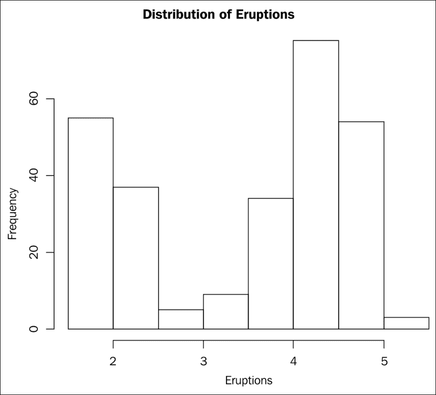
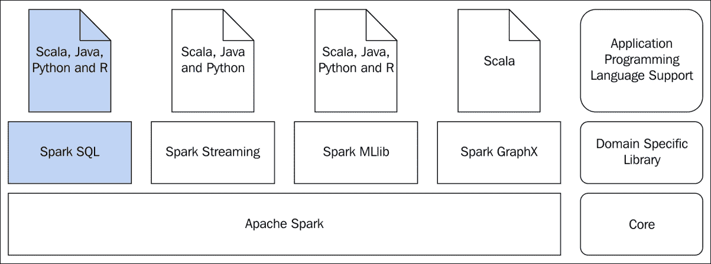

# 第四章：Spark 编程与 R

R 是一种流行的统计计算编程语言，被许多人使用，并根据**通用公共许可证**（**GNU**）免费提供。R 源自 John Chambers 创建的编程语言 S。R 由 Ross Ihaka 和 Robert Gentleman 开发。许多数据科学家使用 R 来满足他们的计算需求。R 内置支持许多统计函数和许多标量数据类型，并具有向量、矩阵、数据框等复合数据结构，用于统计计算。R 高度可扩展，因此可以创建外部包。一旦创建了外部包，就必须安装并加载它，以便任何程序都可以使用它。目录下的一组此类包构成一个 R 库。换句话说，R 附带了一组基本包和附加包，可以安装在它上面，以形成满足所需计算需求的库。除了函数之外，数据集也可以打包在 R 包中。

本章我们将涵盖以下主题：

+   对 SparkR 的需求

+   R 基础

+   数据框

+   聚合

+   使用 SparkR 进行多数据源连接

# 对 SparkR 的需求

**SparkR** 包使得基础 R 安装能够与 Spark 交互，它提供了 R 与 Spark 生态系统对话所需的所有对象和函数。与 Scala、Java 和 Python 相比，R 中的 Spark 编程有所不同，SparkR 包主要提供基于 DataFrame 的 Spark SQL 编程的 R API。目前，R 无法直接操作 Spark 的 RDD。因此，实际上，R 的 Spark API 只能访问 Spark SQL 抽象。由于 Spark **MLlib** 使用 DataFrames，因此也可以使用 R 进行编程。

SparkR 如何帮助数据科学家进行更好的数据处理？基础 R 安装要求所有数据都必须存储（或可访问）在安装了 R 的计算机上。数据处理发生在安装了 R 的单台计算机上。此外，如果数据大小超过了计算机上的主内存，R 将无法执行所需的加工。通过 SparkR 包，可以访问一个全新的集群节点世界，用于数据存储和数据处理。借助 SparkR 包，R 可以访问 Spark DataFrames 和 R DataFrames。

了解 R Dataframes 和 Spark Dataframes 这两种数据框之间的区别非常重要。R DataFrame 是完全本地的，是 R 语言的数据结构。Spark DataFrame 是由 Spark 基础设施管理的结构化数据的并行集合。

R DataFrame 可以转换为 Spark DataFrame，Spark DataFrame 也可以转换为 R DataFrame。

当 Spark DataFrame 转换为 R DataFrame 时，它应该能适配到计算机的可用内存中。这种转换是一个很好的特性，也是有必要的。通过将 R DataFrame 转换为 Spark DataFrame，数据可以分布并并行处理。通过将 Spark DataFrame 转换为 R DataFrame，可以使用其他 R 函数进行大量计算、制图和绘图。简而言之，SparkR 包为 R 带来了分布式和并行计算的能力。

通常，在使用 R 进行数据处理时，由于数据量巨大且需要将其适配到计算机的主内存中，数据处理会分多个批次进行，并将结果汇总以计算最终结果。如果使用 Spark 与 R 来处理数据，这种多批次处理完全可以避免。

通常，报告、制图和绘图都是基于汇总和概述的原始数据进行的。原始数据量可能非常庞大，无需适配到一台计算机上。在这种情况下，可以使用 Spark 与 R 来处理整个原始数据，最终，汇总和概述的数据可用于生成报告、图表或绘图。

由于 R 无法处理大量数据以及进行数据分析，很多时候，ETL 工具被用来进行原始数据的预处理或转换，只有在最后阶段才使用 R 进行数据分析。由于 Spark 能够大规模处理数据，Spark 与 R 可以取代整个 ETL 流程，并用 R 进行所需的数据分析。

许多 R 用户使用**dplyr** R 包来操作 R 中的数据集。该包提供了快速的数据操作功能，支持 R DataFrames。就像操作本地 R DataFrames 一样，它也可以访问某些 RDBMS 表中的数据。除了这些基本的数据操作功能外，它缺乏 Spark 中提供的许多数据处理特性。因此，Spark 与 R 是诸如 dplyr 等包的良好替代品。

SparkR 包是另一个 R 包，但这并不妨碍任何人继续使用已有的任何 R 包。同时，它通过利用 Spark 强大的数据处理能力，极大地增强了 R 的数据处理功能。

# R 语言基础

这并非 R 编程的指南。但是，为了帮助不熟悉 R 的人理解本章所涵盖的内容，简要介绍 R 语言的基础知识是很重要的。这里涵盖了语言特性的非常基本的介绍。

R 自带了几种内置数据类型来存储数值、字符和布尔值。还有复合数据结构，其中最重要的是向量、列表、矩阵和数据框。向量是由给定类型的有序值集合组成。列表是有序的元素集合，这些元素可以是不同类型。例如，一个列表可以包含两个向量，其中一个向量包含数值，另一个向量包含布尔值。矩阵是二维数据结构，按行和列存储数值。数据框是二维数据结构，包含行和列，其中列可以有不同的数据类型，但单个列不能包含不同的数据类型。

以下代码示例展示了使用变量（向量的特殊情况）、数值向量、字符向量、列表、矩阵、数据框以及为数据框分配列名的方法。变量名尽可能自描述，以便读者无需额外解释即可理解。以下代码片段在常规 R REPL 上运行，展示了 R 的数据结构：

```scala
$ r 
R version 3.2.2 (2015-08-14) -- "Fire Safety" 
Copyright (C) 2015 The R Foundation for Statistical Computing 
Platform: x86_64-apple-darwin13.4.0 (64-bit) 

R is free software and comes with ABSOLUTELY NO WARRANTY. 
You are welcome to redistribute it under certain conditions. 
Type 'license()' or 'licence()' for distribution details. 

  Natural language support but running in an English locale 

R is a collaborative project with many contributors. 
Type 'contributors()' for more information and 
'citation()' on how to cite R or R packages in publications. 

Type 'demo()' for some demos, 'help()' for on-line help, or 
'help.start()' for an HTML browser interface to help. 
Type 'q()' to quit R. 

Warning: namespace 'SparkR' is not available and has been replaced 
by .GlobalEnv when processing object 'goodTransRecords' 
[Previously saved workspace restored] 
> 
> x <- 5 
> x 
[1] 5 
> aNumericVector <- c(10,10.5,31.2,100) 
> aNumericVector 
[1]  10.0  10.5  31.2 100.0 
> aCharVector <- c("apple", "orange", "mango") 
> aCharVector 
[1] "apple"  "orange" "mango"  
> aBooleanVector <- c(TRUE, FALSE, TRUE, FALSE, FALSE) 
> aBooleanVector 
[1]  TRUE FALSE  TRUE FALSE FALSE 
> aList <- list(aNumericVector, aCharVector) 
> aList 
[[1]] 
[1]  10.0  10.5  31.2 100.0 
[[2]] 
[1] "apple"  "orange" "mango" 
> aMatrix <- matrix(c(100, 210, 76, 65, 34, 45),nrow=3,ncol=2,byrow = TRUE) 
> aMatrix 
     [,1] [,2] 
[1,]  100  210 
[2,]   76   65 
[3,]   34   45 
> bMatrix <- matrix(c(100, 210, 76, 65, 34, 45),nrow=3,ncol=2,byrow = FALSE) 
> bMatrix 
     [,1] [,2] 
[1,]  100   65 
[2,]  210   34 
[3,]   76   45 
> ageVector <- c(21, 35, 52)  
> nameVector <- c("Thomas", "Mathew", "John")  
> marriedVector <- c(FALSE, TRUE, TRUE)  
> aDataFrame <- data.frame(ageVector, nameVector, marriedVector)  
> aDataFrame 
  ageVector nameVector marriedVector 
1        21     Thomas         FALSE 
2        35     Mathew          TRUE 
3        52       John          TRUE 
> colnames(aDataFrame) <- c("Age","Name", "Married") 
> aDataFrame 
  Age   Name Married 
1  21 Thomas   FALSE 
2  35 Mathew    TRUE 
3  52   John    TRUE 

```

这里讨论的主要话题将围绕数据框展开。以下展示了与数据框常用的一些函数。所有这些命令都应在常规 R REPL 中执行，作为执行前述代码片段的会话的延续：

```scala
> # Returns the first part of the data frame and return two rows 
> head(aDataFrame,2) 
  Age   Name Married 
1  21 Thomas   FALSE 
2  35 Mathew    TRUE 

> # Returns the last part of the data frame and return two rows 
> tail(aDataFrame,2) 
  Age   Name Married  
2  35 Mathew    TRUE 
3  52   John    TRUE 
> # Number of rows in a data frame 
> nrow(aDataFrame) 
[1] 3 
> # Number of columns in a data frame 
> ncol(aDataFrame) 
[1] 3 
> # Returns the first column of the data frame. The return value is a data frame 
> aDataFrame[1] 
  Age 
1  21 
2  35 
3  52 
> # Returns the second column of the data frame. The return value is a data frame 
> aDataFrame[2] 
    Name 
1 Thomas 
2 Mathew 
3   John 
> # Returns the named columns of the data frame. The return value is a data frame 
> aDataFrame[c("Age", "Name")] 
  Age   Name 
1  21 Thomas 
2  35 Mathew 
3  52   John 
> # Returns the contents of the second column of the data frame as a vector.  
> aDataFrame[[2]] 
[1] Thomas Mathew John   
Levels: John Mathew Thomas 
> # Returns the slice of the data frame by a row 
> aDataFrame[2,] 
  Age   Name Married 
2  35 Mathew    TRUE 
> # Returns the slice of the data frame by multiple rows 
> aDataFrame[c(1,2),] 
  Age   Name Married 
1  21 Thomas   FALSE 
2  35 Mathew    TRUE 

```

# R 与 Spark 中的数据框

在使用 R 操作 Spark 时，很容易对 DataFrame 数据结构感到困惑。如前所述，R 和 Spark SQL 中都存在 DataFrame。下面的代码片段涉及将 R 数据框转换为 Spark 数据框以及反向转换。当使用 R 编程 Spark 时，这将是一种非常常见的操作。以下代码片段应在 Spark 的 R REPL 中执行。从现在开始，所有对 R REPL 的引用都是指 Spark 的 R REPL：

```scala
$ cd $SPARK_HOME 
$ ./bin/sparkR 

R version 3.2.2 (2015-08-14) -- "Fire Safety" 
Copyright (C) 2015 The R Foundation for Statistical Computing 
Platform: x86_64-apple-darwin13.4.0 (64-bit) 

R is free software and comes with ABSOLUTELY NO WARRANTY. 
You are welcome to redistribute it under certain conditions. 
Type 'license()' or 'licence()' for distribution details. 

  Natural language support but running in an English locale 

R is a collaborative project with many contributors. 
Type 'contributors()' for more information and 
'citation()' on how to cite R or R packages in publications. 

Type 'demo()' for some demos, 'help()' for on-line help, or 
'help.start()' for an HTML browser interface to help. 
Type 'q()' to quit R. 

[Previously saved workspace restored] 

Launching java with spark-submit command /Users/RajT/source-code/spark-source/spark-2.0/bin/spark-submit   "sparkr-shell" /var/folders/nf/trtmyt9534z03kq8p8zgbnxh0000gn/T//RtmpmuRsTC/backend_port2d121acef4  
Using Spark's default log4j profile: org/apache/spark/log4j-defaults.properties 
Setting default log level to "WARN". 
To adjust logging level use sc.setLogLevel(newLevel). 
16/07/16 21:08:50 WARN NativeCodeLoader: Unable to load native-hadoop library for your platform... using builtin-java classes where applicable 

 Welcome to 
    ____              __  
   / __/__  ___ _____/ /__  
  _\ \/ _ \/ _ `/ __/  '_/  
 /___/ .__/\_,_/_/ /_/\_\   version  2.0.1-SNAPSHOT  
    /_/  

 Spark context is available as sc, SQL context is available as sqlContext 
During startup - Warning messages: 
1: 'SparkR::sparkR.init' is deprecated. 
Use 'sparkR.session' instead. 
See help("Deprecated")  
2: 'SparkR::sparkRSQL.init' is deprecated. 
Use 'sparkR.session' instead. 
See help("Deprecated")  
> 
> # faithful is a data set and the data frame that comes with base R 
> # Obviously it is an R DataFrame 
> head(faithful) 
  eruptions waiting 
1     3.600      79 
2     1.800      54 
3     3.333      74 
4     2.283      62 
5     4.533      85 
6     2.883      55 
> tail(faithful) 
    eruptions waiting 
267     4.750      75 
268     4.117      81 
269     2.150      46 
270     4.417      90 
271     1.817      46 
272     4.467      74 
> # Convert R DataFrame to Spark DataFrame  
> sparkFaithful <- createDataFrame(faithful) 
> head(sparkFaithful) 
  eruptions waiting 
1     3.600      79 
2     1.800      54 
3     3.333      74 
4     2.283      62 
5     4.533      85 
6     2.883      55 
> showDF(sparkFaithful) 
+---------+-------+ 
|eruptions|waiting| 
+---------+-------+ 
|      3.6|   79.0| 
|      1.8|   54.0| 
|    3.333|   74.0| 
|    2.283|   62.0| 
|    4.533|   85.0| 
|    2.883|   55.0| 
|      4.7|   88.0| 
|      3.6|   85.0| 
|     1.95|   51.0| 
|     4.35|   85.0| 
|    1.833|   54.0| 
|    3.917|   84.0| 
|      4.2|   78.0| 
|     1.75|   47.0| 
|      4.7|   83.0| 
|    2.167|   52.0| 
|     1.75|   62.0| 
|      4.8|   84.0| 
|      1.6|   52.0| 
|     4.25|   79.0| 
+---------+-------+ 
only showing top 20 rows 
> # Try calling a SparkR function showDF() on an R DataFrame. The following error message will be shown 
> showDF(faithful) 
Error in (function (classes, fdef, mtable)  :  
  unable to find an inherited method for function 'showDF' for signature '"data.frame"' 
> # Convert the Spark DataFrame to an R DataFrame 
> rFaithful <- collect(sparkFaithful) 
> head(rFaithful) 
  eruptions waiting 
1     3.600      79 
2     1.800      54 
3     3.333      74 
4     2.283      62 
5     4.533      85 
6     2.883      55 

```

在支持的函数方面，R 数据框与 Spark 数据框之间没有完全的兼容性和互操作性。

### 提示

为了区分两种不同类型的数据框，在 R 程序中最好按照约定俗成的规则为 R 数据框和 Spark 数据框命名。并非所有 R 数据框支持的函数都适用于 Spark 数据框，反之亦然。务必参考正确的 R API 版本以使用 Spark。

对于经常使用图表和绘图的人来说，在处理 R DataFrames 与 Spark DataFrames 结合时必须格外小心。R 的图表和绘图功能仅适用于 R DataFrames。如果需要使用 Spark 处理的数据并将其呈现在 Spark DataFrame 中的图表或绘图中，则必须将其转换为 R DataFrame 才能继续进行图表和绘图。以下代码片段将对此有所启示。我们将在 Spark 的 R REPL 中再次使用 faithful 数据集进行说明：

```scala
head(faithful) 
  eruptions waiting 
1     3.600      79 
2     1.800      54 
3     3.333      74 
4     2.283      62 
5     4.533      85 
6     2.883      55 
> # Convert the faithful R DataFrame to Spark DataFrame   
> sparkFaithful <- createDataFrame(faithful) 
> # The Spark DataFrame sparkFaithful NOT producing a histogram 
> hist(sparkFaithful$eruptions,main="Distribution of Eruptions",xlab="Eruptions") 
Error in hist.default(sparkFaithful$eruptions, main = "Distribution of Eruptions",  :  
  'x' must be numeric 
> # The R DataFrame faithful producing a histogram 
> hist(faithful$eruptions,main="Distribution of Eruptions",xlab="Eruptions")

```

此处数字仅用于演示，说明 Spark DataFrame 不能用于制图，而必须使用 R DataFrame 进行相同的操作：



图 1

当图表和绘图库与 Spark DataFrame 一起使用时，由于数据类型不兼容，出现了错误。

### 提示

需要记住的最重要的一点是，R DataFrame 是一种内存驻留数据结构，而 Spark DataFrame 是一种跨集群节点分布的并行数据集集合。因此，所有使用 R DataFrames 的功能不一定适用于 Spark DataFrames，反之亦然。

让我们再次回顾一下大局，如*图 2*所示，以便设定背景并了解正在讨论的内容，然后再深入探讨并处理这些用例。在前一章中，同一主题是通过使用 Scala 和 Python 编程语言引入的。在本章中，将使用 R 实现 Spark SQL 编程中使用的同一组用例：



图 2

此处将要讨论的用例将展示在 R 中混合使用 SQL 查询和 Spark 程序的能力。将选择多个数据源，使用 DataFrame 从这些源读取数据，并演示统一的数据访问。

# Spark DataFrame 编程与 R

以下是用于阐明使用 DataFrame 进行 Spark SQL 编程的用例：

+   交易记录是以逗号分隔的值。

+   从列表中筛选出仅包含良好交易记录的记录。账户号码应以`SB`开头，且交易金额应大于零。

+   找出所有交易金额大于 1000 的高价值交易记录。

+   找出所有账户号码不良的交易记录。

+   找出所有交易金额小于或等于零的交易记录。

+   找出所有不良交易记录的合并列表。

+   找出所有交易金额的总和。

+   找出所有交易金额的最大值。

+   找出所有交易金额的最小值。

+   找出所有良好账户号码。

这正是上一章中使用的一组用例，但在这里，编程模型完全不同。此处，编程采用 R 语言。通过这组用例，展示了两种编程模型：一种是使用 SQL 查询，另一种是使用 DataFrame API。

### 提示

运行以下代码片段所需的数据文件可从保存 R 代码的同一目录中获取。

在以下代码片段中，数据从文件系统中的文件读取。由于所有这些代码片段都在 Spark 的 R REPL 中执行，因此所有数据文件都应保存在`$SPARK_HOME`目录中。

## 使用 SQL 编程

在 R REPL 提示符下，尝试以下语句：

```scala
> # TODO - Change the data directory location to the right location in the system in which this program is being run 
> DATA_DIR <- "/Users/RajT/Documents/CodeAndData/R/" 
> # Read data from a JSON file to create DataFrame 
>  
> acTransDF <- read.json(paste(DATA_DIR, "TransList1.json", sep = "")) 
> # Print the structure of the DataFrame 
> print(acTransDF) 
SparkDataFrame[AccNo:string, TranAmount:bigint] 
> # Show sample records from the DataFrame 
> showDF(acTransDF) 
+-------+----------+ 
|  AccNo|TranAmount| 
+-------+----------+ 
|SB10001|      1000| 
|SB10002|      1200| 
|SB10003|      8000| 
|SB10004|       400| 
|SB10005|       300| 
|SB10006|     10000| 
|SB10007|       500| 
|SB10008|        56| 
|SB10009|        30| 
|SB10010|      7000| 
|CR10001|      7000| 
|SB10002|       -10| 
+-------+----------+ 
> # Register temporary view definition in the DataFrame for SQL queries 
> createOrReplaceTempView(acTransDF, "trans") 
> # DataFrame containing good transaction records using SQL 
> goodTransRecords <- sql("SELECT AccNo, TranAmount FROM trans WHERE AccNo like 'SB%' AND TranAmount > 0") 
> # Register temporary table definition in the DataFrame for SQL queries 

> createOrReplaceTempView(goodTransRecords, "goodtrans") 
> # Show sample records from the DataFrame 
> showDF(goodTransRecords) 
+-------+----------+ 
|  AccNo|TranAmount| 
+-------+----------+ 
|SB10001|      1000| 
|SB10002|      1200| 
|SB10003|      8000| 
|SB10004|       400| 
|SB10005|       300| 
|SB10006|     10000| 
|SB10007|       500| 
|SB10008|        56| 
|SB10009|        30| 
|SB10010|      7000| 
+-------+----------+ 
> # DataFrame containing high value transaction records using SQL 
> highValueTransRecords <- sql("SELECT AccNo, TranAmount FROM goodtrans WHERE TranAmount > 1000") 
> # Show sample records from the DataFrame 
> showDF(highValueTransRecords) 
+-------+----------+ 
|  AccNo|TranAmount| 
+-------+----------+ 
|SB10002|      1200| 
|SB10003|      8000| 
|SB10006|     10000| 
|SB10010|      7000| 
+-------+----------+ 
> # DataFrame containing bad account records using SQL 
> badAccountRecords <- sql("SELECT AccNo, TranAmount FROM trans WHERE AccNo NOT like 'SB%'") 
> # Show sample records from the DataFrame 
> showDF(badAccountRecords) 
+-------+----------+ 
|  AccNo|TranAmount| 
+-------+----------+ 
|CR10001|      7000| 
+-------+----------+ 
> # DataFrame containing bad amount records using SQL 
> badAmountRecords <- sql("SELECT AccNo, TranAmount FROM trans WHERE TranAmount < 0") 
> # Show sample records from the DataFrame 
> showDF(badAmountRecords) 
+-------+----------+ 
|  AccNo|TranAmount| 
+-------+----------+ 
|SB10002|       -10| 
+-------+----------+ 
> # Create a DataFrame by taking the union of two DataFrames 
> badTransRecords <- union(badAccountRecords, badAmountRecords) 
> # Show sample records from the DataFrame 
> showDF(badTransRecords) 
+-------+----------+ 
|  AccNo|TranAmount| 
+-------+----------+ 
|CR10001|      7000| 
|SB10002|       -10| 
+-------+----------+ 
> # DataFrame containing sum amount using SQL 
> sumAmount <- sql("SELECT sum(TranAmount) as sum FROM goodtrans") 
> # Show sample records from the DataFrame 
> showDF(sumAmount) 
+-----+ 
|  sum| 
+-----+ 
|28486| 
+-----+ 
> # DataFrame containing maximum amount using SQL 
> maxAmount <- sql("SELECT max(TranAmount) as max FROM goodtrans") 
> # Show sample records from the DataFrame 
> showDF(maxAmount) 
+-----+ 
|  max| 
+-----+ 
|10000| 
+-----+ 
> # DataFrame containing minimum amount using SQL 
> minAmount <- sql("SELECT min(TranAmount)as min FROM goodtrans") 
> # Show sample records from the DataFrame 
> showDF(minAmount) 
+---+ 
|min| 
+---+ 
| 30| 
+---+ 
> # DataFrame containing good account number records using SQL 
> goodAccNos <- sql("SELECT DISTINCT AccNo FROM trans WHERE AccNo like 'SB%' ORDER BY AccNo") 
> # Show sample records from the DataFrame 
> showDF(goodAccNos) 
+-------+ 
|  AccNo| 
+-------+ 
|SB10001| 
|SB10002| 
|SB10003| 
|SB10004| 
|SB10005| 
|SB10006| 
|SB10007| 
|SB10008| 
|SB10009| 
|SB10010| 
+-------+

```

零售银行交易记录包含账号、交易金额，通过 SparkSQL 处理以获得用例所需的预期结果。以下是前述脚本所做工作的概述：

+   与其他支持 Spark 的编程语言不同，R 不具备 RDD 编程能力。因此，不采用从集合构建 RDD 的方式，而是从包含交易记录的 JSON 文件中读取数据。

+   从 JSON 文件创建了一个 Spark DataFrame。

+   通过给 DataFrame 注册一个名称，该名称可用于 SQL 语句中。

+   然后，所有其他活动都是通过 SparkR 包中的 SQL 函数发出 SQL 语句。

+   所有这些 SQL 语句的结果都存储为 Spark DataFrames，并使用`showDF`函数将值提取到调用的 R 程序中。

+   通过 SQL 语句也进行了聚合值的计算。

+   使用 SparkR 的`showDF`函数，DataFrame 内容以表格形式显示。

+   使用 print 函数显示 DataFrame 结构的详细视图。这类似于数据库表的 describe 命令。

在前述的 R 代码中，编程风格与 Scala 代码相比有所不同，这是因为它是 R 程序。通过使用 SparkR 库，正在使用 Spark 特性。但函数和其他抽象并没有采用截然不同的风格。

### 注意

本章中，将多次涉及 DataFrames 的使用。很容易混淆哪个是 R DataFrame，哪个是 Spark DataFrame。因此，特别注意通过限定 DataFrame 来明确指出，例如 R DataFrame 和 Spark DataFrame。

## 使用 R DataFrame API 编程

在本节中，代码片段将在同一 R REPL 中运行。与前述代码片段类似，最初会给出一些 DataFrame 特定的基本命令。这些命令常用于查看内容并对 DataFrame 及其内容进行一些基本测试。这些命令在数据分析的探索阶段经常使用，以深入了解底层数据的结构和内容。

在 R REPL 提示符下，尝试以下语句：

```scala
> # Read data from a JSON file to create DataFrame 
> acTransDF <- read.json(paste(DATA_DIR, "TransList1.json", sep = "")) 
> print(acTransDF) 
SparkDataFrame[AccNo:string, TranAmount:bigint] 
> # Show sample records from the DataFrame 
> showDF(acTransDF) 
+-------+----------+ 
|  AccNo|TranAmount| 
+-------+----------+ 
|SB10001|      1000| 
|SB10002|      1200| 
|SB10003|      8000| 
|SB10004|       400| 
|SB10005|       300| 
|SB10006|     10000| 
|SB10007|       500| 
|SB10008|        56| 
|SB10009|        30| 
|SB10010|      7000| 
|CR10001|      7000| 
|SB10002|       -10| 
+-------+----------+ 
> # DataFrame containing good transaction records using API 
> goodTransRecordsFromAPI <- filter(acTransDF, "AccNo like 'SB%' AND TranAmount > 0") 
> # Show sample records from the DataFrame 
> showDF(goodTransRecordsFromAPI) 
+-------+----------+ 
|  AccNo|TranAmount| 
+-------+----------+ 
|SB10001|      1000| 
|SB10002|      1200| 
|SB10003|      8000| 
|SB10004|       400| 
|SB10005|       300| 
|SB10006|     10000| 
|SB10007|       500| 
|SB10008|        56| 
|SB10009|        30| 
|SB10010|      7000| 
+-------+----------+ 
> # DataFrame containing high value transaction records using API 
> highValueTransRecordsFromAPI = filter(goodTransRecordsFromAPI, "TranAmount > 1000") 
> # Show sample records from the DataFrame 
> showDF(highValueTransRecordsFromAPI) 
+-------+----------+ 
|  AccNo|TranAmount| 
+-------+----------+ 
|SB10002|      1200| 
|SB10003|      8000| 
|SB10006|     10000| 
|SB10010|      7000| 
+-------+----------+ 
> # DataFrame containing bad account records using API 
> badAccountRecordsFromAPI <- filter(acTransDF, "AccNo NOT like 'SB%'") 
> # Show sample records from the DataFrame 
> showDF(badAccountRecordsFromAPI) 
+-------+----------+ 
|  AccNo|TranAmount| 
+-------+----------+ 
|CR10001|      7000| 
+-------+----------+ 
> # DataFrame containing bad amount records using API 
> badAmountRecordsFromAPI <- filter(acTransDF, "TranAmount < 0") 
> # Show sample records from the DataFrame 
> showDF(badAmountRecordsFromAPI) 
+-------+----------+ 
|  AccNo|TranAmount| 
+-------+----------+ 
|SB10002|       -10| 
+-------+----------+ 
> # Create a DataFrame by taking the union of two DataFrames 
> badTransRecordsFromAPI <- union(badAccountRecordsFromAPI, badAmountRecordsFromAPI) 
> # Show sample records from the DataFrame 
> showDF(badTransRecordsFromAPI) 
+-------+----------+ 
|  AccNo|TranAmount| 
+-------+----------+ 
|CR10001|      7000| 
|SB10002|       -10| 
+-------+----------+ 
> # DataFrame containing sum amount using API 
> sumAmountFromAPI <- agg(goodTransRecordsFromAPI, sumAmount = sum(goodTransRecordsFromAPI$TranAmount)) 
> # Show sample records from the DataFrame 
> showDF(sumAmountFromAPI) 
+---------+ 
|sumAmount| 
+---------+ 
|    28486| 
+---------+ 
> # DataFrame containing maximum amount using API 
> maxAmountFromAPI <- agg(goodTransRecordsFromAPI, maxAmount = max(goodTransRecordsFromAPI$TranAmount)) 
> # Show sample records from the DataFrame 
> showDF(maxAmountFromAPI) 
+---------+ 
|maxAmount| 
+---------+ 
|    10000| 
+---------+ 
> # DataFrame containing minimum amount using API 
> minAmountFromAPI <- agg(goodTransRecordsFromAPI, minAmount = min(goodTransRecordsFromAPI$TranAmount))  
> # Show sample records from the DataFrame 
> showDF(minAmountFromAPI) 
+---------+ 
|minAmount| 
+---------+ 
|       30| 
+---------+ 
> # DataFrame containing good account number records using API 
> filteredTransRecordsFromAPI <- filter(goodTransRecordsFromAPI, "AccNo like 'SB%'") 
> accNosFromAPI <- select(filteredTransRecordsFromAPI, "AccNo") 
> distinctAccNoFromAPI <- distinct(accNosFromAPI) 
> sortedAccNoFromAPI <- arrange(distinctAccNoFromAPI, "AccNo") 
> # Show sample records from the DataFrame 
> showDF(sortedAccNoFromAPI) 
+-------+ 
|  AccNo| 
+-------+ 
|SB10001| 
|SB10002| 
|SB10003| 
|SB10004| 
|SB10005| 
|SB10006| 
|SB10007| 
|SB10008| 
|SB10009| 
|SB10010| 
+-------+ 
> # Persist the DataFrame into a Parquet file  
> write.parquet(acTransDF, "r.trans.parquet") 
> # Read the data from the Parquet file 
> acTransDFFromFile <- read.parquet("r.trans.parquet")  
> # Show sample records from the DataFrame 
> showDF(acTransDFFromFile) 
+-------+----------+ 
|  AccNo|TranAmount| 
+-------+----------+ 
|SB10007|       500| 
|SB10008|        56| 
|SB10009|        30| 
|SB10010|      7000| 
|CR10001|      7000| 
|SB10002|       -10| 
|SB10001|      1000| 
|SB10002|      1200| 
|SB10003|      8000| 
|SB10004|       400| 
|SB10005|       300| 
|SB10006|     10000| 
+-------+----------+ 

```

以下是从 DataFrame API 角度对前面脚本所做操作的概述：

+   在前一节中使用的包含所有数据的 DataFrame 在此处被使用。

+   接下来演示记录的筛选。这里需注意的最重要一点是，筛选条件必须与 SQL 语句中的谓词完全一致。无法链式应用过滤器。

+   接下来计算聚合方法。

+   本组中的最终语句执行选择、筛选、选择唯一记录和排序。

+   最后，交易记录以 Parquet 格式持久化，从 Parquet 存储中读取，并创建了一个 Spark DataFrame。关于持久化格式的更多细节已在上一章中涵盖，概念保持不变。仅 DataFrame API 语法有所不同。

+   在此代码片段中，Parquet 格式的数据存储在当前目录，从该目录调用相应的 REPL。当作为 Spark 程序运行时，目录再次成为从该处调用 Spark 提交的当前目录。

最后几条语句涉及将 DataFrame 内容持久化到介质中。若与前一章中 Scala 和 Python 的持久化机制相比较，此处也以类似方式实现。

# 理解 Spark R 中的聚合

在 SQL 中，数据聚合非常灵活。Spark SQL 中亦是如此。与在单机上的单一数据源运行 SQL 语句不同，Spark SQL 能够在分布式数据源上执行相同操作。在涵盖 RDD 编程的章节中，讨论了一个用于数据聚合的 MapReduce 用例，这里同样使用该用例来展示 Spark SQL 的聚合能力。本节中，用例既通过 SQL 查询方式处理，也通过 DataFrame API 方式处理。

此处给出了用于阐明 MapReduce 类型数据处理的选定用例：

+   零售银行业务交易记录以逗号分隔的字符串形式包含账户号和交易金额

+   查找所有交易的账户级别汇总以获取账户余额

在 R REPL 提示符下，尝试以下语句：

```scala
> # Read data from a JSON file to create DataFrame 
> acTransDFForAgg <- read.json(paste(DATA_DIR, "TransList2.json", sep = "")) 
> # Register temporary view definition in the DataFrame for SQL queries 
> createOrReplaceTempView(acTransDFForAgg, "transnew") 
> # Show sample records from the DataFrame 
> showDF(acTransDFForAgg) 
+-------+----------+ 
|  AccNo|TranAmount| 
+-------+----------+ 
|SB10001|      1000| 
|SB10002|      1200| 
|SB10001|      8000| 
|SB10002|       400| 
|SB10003|       300| 
|SB10001|     10000| 
|SB10004|       500| 
|SB10005|        56| 
|SB10003|        30| 
|SB10002|      7000| 
|SB10001|      -100| 
|SB10002|       -10| 
+-------+----------+ 
> # DataFrame containing account summary records using SQL 
> acSummary <- sql("SELECT AccNo, sum(TranAmount) as TransTotal FROM transnew GROUP BY AccNo") 
> # Show sample records from the DataFrame 
> showDF(acSummary) 
+-------+----------+ 
|  AccNo|TransTotal| 
+-------+----------+ 
|SB10001|     18900| 
|SB10002|      8590| 
|SB10003|       330| 
|SB10004|       500| 
|SB10005|        56| 
+-------+----------+ 
> # DataFrame containing account summary records using API 
> acSummaryFromAPI <- agg(groupBy(acTransDFForAgg, "AccNo"), TranAmount="sum") 
> # Show sample records from the DataFrame 
> showDF(acSummaryFromAPI) 
+-------+---------------+ 
|  AccNo|sum(TranAmount)| 
+-------+---------------+ 
|SB10001|          18900| 
|SB10002|           8590| 
|SB10003|            330| 
|SB10004|            500| 
|SB10005|             56| 
+-------+---------------+ 

```

在 R DataFrame API 中，与 Scala 或 Python 版本相比，存在一些语法差异，主要是因为这是一种纯粹基于 API 的编程模型。

# 理解 SparkR 中的多数据源连接

在前一章中，基于键合并多个 DataFrame 的内容已进行讨论。本节中，同一用例通过 Spark SQL 的 R API 实现。以下部分给出了用于阐明基于键合并多个数据集的选定用例。

第一个数据集包含零售银行业务主记录摘要，包括账号、名字和姓氏。第二个数据集包含零售银行账户余额，包括账号和余额金额。两个数据集的关键字段均为账号。将两个数据集连接，创建一个包含账号、名字、姓氏和余额金额的数据集。从此报告中，挑选出余额金额排名前三的账户。

Spark DataFrames 由持久化的 JSON 文件创建。除 JSON 文件外，还可使用任何支持的数据文件。随后，这些文件从磁盘读取以形成 DataFrames，并进行连接。

在 R REPL 提示符下，尝试以下语句：

```scala
> # Read data from JSON file 
> acMasterDF <- read.json(paste(DATA_DIR, "MasterList.json", sep = "")) 
> # Show sample records from the DataFrame 
> showDF(acMasterDF) 
+-------+---------+--------+ 
|  AccNo|FirstName|LastName| 
+-------+---------+--------+ 
|SB10001|    Roger| Federer| 
|SB10002|     Pete| Sampras| 
|SB10003|   Rafael|   Nadal| 
|SB10004|    Boris|  Becker| 
|SB10005|     Ivan|   Lendl| 
+-------+---------+--------+ 
> # Register temporary view definition in the DataFrame for SQL queries 
> createOrReplaceTempView(acMasterDF, "master")  
> acBalDF <- read.json(paste(DATA_DIR, "BalList.json", sep = "")) 
> # Show sample records from the DataFrame 
> showDF(acBalDF) 
+-------+---------+ 
|  AccNo|BalAmount| 
+-------+---------+ 
|SB10001|    50000| 
|SB10002|    12000| 
|SB10003|     3000| 
|SB10004|     8500| 
|SB10005|     5000| 
+-------+---------+ 

> # Register temporary view definition in the DataFrame for SQL queries 
> createOrReplaceTempView(acBalDF, "balance") 
> # DataFrame containing account detail records using SQL by joining multiple DataFrame contents 
> acDetail <- sql("SELECT master.AccNo, FirstName, LastName, BalAmount FROM master, balance WHERE master.AccNo = balance.AccNo ORDER BY BalAmount DESC") 
> # Show sample records from the DataFrame 
> showDF(acDetail) 
+-------+---------+--------+---------+ 
|  AccNo|FirstName|LastName|BalAmount| 
+-------+---------+--------+---------+ 
|SB10001|    Roger| Federer|    50000| 
|SB10002|     Pete| Sampras|    12000| 
|SB10004|    Boris|  Becker|     8500| 
|SB10005|     Ivan|   Lendl|     5000| 
|SB10003|   Rafael|   Nadal|     3000| 
+-------+---------+--------+---------+ 

> # Persist data in the DataFrame into Parquet file 
> write.parquet(acDetail, "r.acdetails.parquet") 
> # Read data into a DataFrame by reading the contents from a Parquet file 

> acDetailFromFile <- read.parquet("r.acdetails.parquet") 
> # Show sample records from the DataFrame 
> showDF(acDetailFromFile) 
+-------+---------+--------+---------+ 
|  AccNo|FirstName|LastName|BalAmount| 
+-------+---------+--------+---------+ 
|SB10002|     Pete| Sampras|    12000| 
|SB10003|   Rafael|   Nadal|     3000| 
|SB10005|     Ivan|   Lendl|     5000| 
|SB10001|    Roger| Federer|    50000| 
|SB10004|    Boris|  Becker|     8500| 
+-------+---------+--------+---------+ 

```

在同一 R REPL 会话中，以下代码行通过 DataFrame API 获得相同结果：

```scala
> # Change the column names 
> acBalDFWithDiffColName <- selectExpr(acBalDF, "AccNo as AccNoBal", "BalAmount") 
> # Show sample records from the DataFrame 
> showDF(acBalDFWithDiffColName) 
+--------+---------+ 
|AccNoBal|BalAmount| 
+--------+---------+ 
| SB10001|    50000| 
| SB10002|    12000| 
| SB10003|     3000| 
| SB10004|     8500| 
| SB10005|     5000| 
+--------+---------+ 
> # DataFrame containing account detail records using API by joining multiple DataFrame contents 
> acDetailFromAPI <- join(acMasterDF, acBalDFWithDiffColName, acMasterDF$AccNo == acBalDFWithDiffColName$AccNoBal) 
> # Show sample records from the DataFrame 
> showDF(acDetailFromAPI) 
+-------+---------+--------+--------+---------+ 
|  AccNo|FirstName|LastName|AccNoBal|BalAmount| 
+-------+---------+--------+--------+---------+ 
|SB10001|    Roger| Federer| SB10001|    50000| 
|SB10002|     Pete| Sampras| SB10002|    12000| 
|SB10003|   Rafael|   Nadal| SB10003|     3000| 
|SB10004|    Boris|  Becker| SB10004|     8500| 
|SB10005|     Ivan|   Lendl| SB10005|     5000| 
+-------+---------+--------+--------+---------+ 
> # DataFrame containing account detail records using SQL by selecting specific fields 
> acDetailFromAPIRequiredFields <- select(acDetailFromAPI, "AccNo", "FirstName", "LastName", "BalAmount") 
> # Show sample records from the DataFrame 
> showDF(acDetailFromAPIRequiredFields) 
+-------+---------+--------+---------+ 
|  AccNo|FirstName|LastName|BalAmount| 
+-------+---------+--------+---------+ 
|SB10001|    Roger| Federer|    50000| 
|SB10002|     Pete| Sampras|    12000| 
|SB10003|   Rafael|   Nadal|     3000| 
|SB10004|    Boris|  Becker|     8500| 
|SB10005|     Ivan|   Lendl|     5000| 
+-------+---------+--------+---------+ 

```

前述代码段中选择的连接类型为内连接。实际上，可通过 SQL 查询方式或 DataFrame API 方式使用其他任何类型的连接。在使用 DataFrame API 进行连接前，需注意两个 Spark DataFrame 的列名必须不同，以避免结果 DataFrame 中的歧义。在此特定用例中，可以看出 DataFrame API 处理起来略显复杂，而 SQL 查询方式则显得非常直接。

在前述章节中，已涵盖 Spark SQL 的 R API。通常，若可能，应尽可能使用 SQL 查询方式编写代码。DataFrame API 正在改进，但与其他语言（如 Scala 或 Python）相比，其灵活性仍显不足。

与本书其他章节不同，本章是专为 R 程序员介绍 Spark 的独立章节。本章讨论的所有用例均在 Spark 的 R REPL 中运行。但在实际应用中，这种方法并不理想。R 命令需组织在脚本文件中，并提交至 Spark 集群运行。最简便的方法是使用现有的`$SPARK_HOME/bin/spark-submit <path to the R script file>`脚本，其中 R 文件名需相对于命令调用时的当前目录给出完整路径。

# 参考资料

更多信息，请参考：[`spark.apache.org/docs/latest/api/R/index.html`](https://spark.apache.org/docs/latest/api/R/index.html)

# 总结

本章涵盖了对 R 语言的快速概览，随后特别提到了需要明确理解 R DataFrame 与 Spark DataFrame 之间的区别。接着，使用与前几章相同的用例介绍了基本的 Spark 编程与 R。涵盖了 Spark 的 R API，并通过 SQL 查询方式和 DataFrame API 方式实现了用例。本章帮助数据科学家理解 Spark 的强大功能，并将其应用于他们的 R 应用程序中，使用随 Spark 附带的 SparkR 包。这为使用 Spark 与 R 处理结构化数据的大数据处理打开了大门。

关于基于 Spark 的数据处理在多种语言中的主题已经讨论过，现在是时候专注于一些数据分析以及图表和绘图了。Python 自带了许多能够生成出版质量图片的图表和绘图库。下一章将讨论使用 Spark 处理的数据进行图表和绘图。
