# 第五章：Spark 与 Python 的数据分析

处理数据的最终目标是利用结果回答业务问题。理解用于回答业务问题的数据至关重要。为了更好地理解数据，采用了各种制表方法、图表和绘图技术。数据的可视化表示强化了对底层数据的理解。因此，数据可视化在数据分析中得到了广泛应用。

在各种出版物中，用于表示分析数据以回答业务问题的术语各不相同。数据分析、数据分析和商业智能是一些普遍存在的术语。本章不会深入讨论这些术语的含义、相似之处或差异。相反，重点将放在如何弥合数据科学家或数据分析师通常执行的两个主要活动之间的差距。第一个是数据处理。第二个是利用处理过的数据借助图表和绘图进行分析。数据分析是数据分析师和数据科学家的专长。本章将重点介绍使用 Spark 和 Python 处理数据，并生成图表和图形。

在许多数据分析用例中，处理一个超集数据，并将缩减后的结果数据集用于数据分析。在大数据分析中，这一点尤为正确，其中一小部分处理过的数据用于分析。根据用例，针对各种数据分析需求，作为前提条件进行适当的数据处理。本章将要涵盖的大多数用例都属于这种模式，其中第一步涉及必要的数据处理，第二步涉及数据分析所需的图表和绘图。

在典型的数据分析用例中，活动链涉及一个广泛且多阶段的**提取**、**转换**和**加载**（**ETL**）管道，最终形成一个数据分析平台或应用程序。这一系列活动链的最终结果包括但不限于汇总数据表以及以图表和图形形式呈现的各种数据可视化。由于 Spark 能非常有效地处理来自异构分布式数据源的数据，因此在传统数据分析应用中存在的庞大 ETL 管道可以整合为自包含的应用程序，进行数据处理和数据分析。

本章我们将探讨以下主题：

+   图表和绘图库

+   设置数据集

+   捕捉数据分析用例的高层次细节

+   各种图表和图形

# 图表和绘图库

Python 是当今数据分析师和数据科学家广泛使用的编程语言。有众多科学和统计数据处理库，以及图表和绘图库，可在 Python 程序中使用。Python 也广泛用于开发 Spark 中的数据处理应用程序。这为使用 Spark、Python 及其库实现统一的数据处理和分析框架提供了极大的灵活性，使我们能够进行科学和统计处理，以及图表和绘图。有许多与 Python 兼容的此类库。其中，**NumPy**和**SciPy**库在此用于数值、统计和科学数据处理。**matplotlib**库在此用于生成 2D 图像的图表和绘图。

### 提示

确保**NumPy**、**SciPy**和**matplotlib** Python 库与 Python 安装正常工作非常重要，然后再尝试本章给出的代码示例。这需要在将其用于 Spark 应用程序之前进行测试和验证。

如图*图 1*所示的框图给出了应用程序堆栈的整体结构：

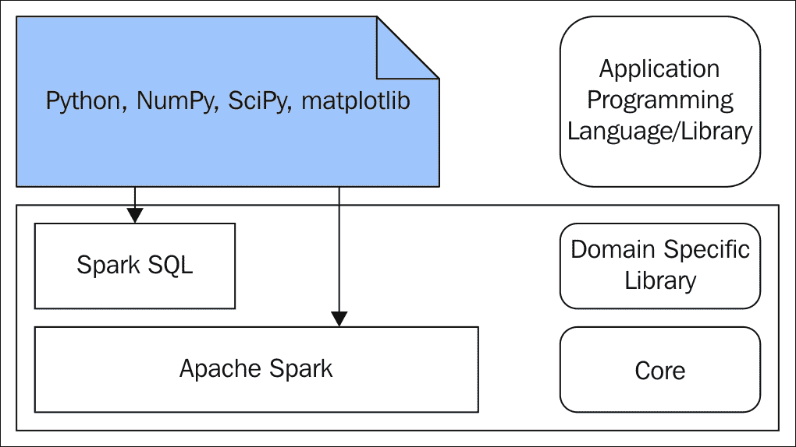

图 1

# 设置数据集

有许多公共数据集可供公众用于教育、研究和开发目的。MovieLens 网站允许用户对电影进行评分并个性化推荐。GroupLens Research 发布了来自 MovieLens 的评分数据集。这些数据集可从其网站[`grouplens.org/datasets/movielens/`](http://grouplens.org/datasets/movielens/)下载。本章使用 MovieLens 100K 数据集来演示如何结合 Python、NumPy、SciPy 和 matplotlib 使用 Spark 进行分布式数据处理。

### 提示

在 GroupLens Research 网站上，除了上述数据集外，还有更多庞大的数据集可供下载，如 MovieLens 1M 数据集、MovieLens 10M 数据集、MovieLens 20M 数据集以及 MovieLens 最新数据集。一旦读者对程序相当熟悉，并在处理数据时达到足够的舒适度，就可以利用这些额外数据集进行自己的分析工作，以巩固本章所获得的知识。

MovieLens 100K 数据集包含多个文件中的数据。以下是本章数据分析用例中将使用的文件：

+   `u.user`：关于对电影进行评分的用户的用户人口统计信息。数据集的结构如下所示，与数据集附带的 README 文件中复制的相同：

    +   用户 ID

    +   年龄

    +   性别

    +   职业

    +   邮政编码

+   `u.item`：关于用户评分的电影信息。数据集的结构如下所示，从随数据集提供的 README 文件中复制而来：

    +   电影 ID

    +   电影标题

    +   发行日期

    +   视频发行日期

    +   IMDb 链接

    +   未知类型

    +   动作片

    +   冒险片

    +   动画片

    +   儿童片

    +   喜剧片

    +   犯罪片

    +   纪录片

    +   剧情片

    +   奇幻片

    +   黑色电影

    +   恐怖片

    +   音乐片

    +   悬疑片

    +   爱情片

    +   科幻片

    +   惊悚片

    +   战争片

    +   西部片

# 数据分析用例

以下列表捕捉了数据分析用例的高级细节。大多数用例都围绕创建各种图表和图形展开：

+   使用直方图绘制对电影进行评分的用户的年龄分布。

+   使用与直方图相同的数据，绘制用户的年龄概率密度图。

+   绘制年龄分布数据的摘要，以找到用户的最低年龄、第 25 百分位数、中位数、第 75 百分位数和最高年龄。

+   在同一图上绘制多个图表或图形，以便对数据进行并排比较。

+   创建一个条形图，捕捉对电影进行评分的用户数量最多的前 10 个职业。

+   创建一个堆叠条形图，按职业显示对电影进行评分的男性和女性用户数量。

+   创建一个饼图，捕捉对电影进行评分的用户数量最少的 10 个职业。

+   创建一个圆环图，捕捉对电影进行评分的用户数量最多的前 10 个邮政编码。

+   使用三个职业类别，创建箱线图，捕捉对电影进行评分的用户的汇总统计信息。所有三个箱线图都必须在单个图上绘制，以便进行比较。

+   创建一个条形图，按电影类型捕捉电影数量。

+   创建一个散点图，捕捉每年发行电影数量最多的前 10 年。

+   创建一个散点图，捕捉每年发行电影数量最多的前 10 年。在这个图中，不是用点来表示，而是创建与该年发行电影数量成比例的圆形区域。

+   创建一条折线图，包含两个数据集，一个数据集是过去 10 年发行的动作片数量，另一个数据集是过去 10 年发行的剧情片数量，以便进行比较。

### 提示

在前述所有用例中，当涉及实施时，Spark 用于处理数据并准备所需的数据集。一旦所需的已处理数据在 Spark DataFrame 中可用，它就会被收集到驱动程序中。换句话说，数据从 Spark 的分布式集合转移到本地集合，在 Python 程序中作为元组，用于制图和绘图。对于制图和绘图，Python 需要本地数据。它不能直接使用 Spark DataFrames 进行制图和绘图。

# 图表和图形

本节将重点介绍创建各种图表和图形，以直观地表示与前述部分描述的用例相关的 MovieLens 100K 数据集的各个方面。本章描述的图表和图形绘制过程遵循一种模式。以下是该活动模式中的重要步骤：

1.  使用 Spark 从数据文件读取数据。

1.  使数据在 Spark DataFrame 中可用。

1.  使用 DataFrame API 应用必要的数据处理。

1.  处理主要是为了仅提供制图和绘图所需的最小和必要数据。

1.  将处理后的数据从 Spark DataFrame 传输到 Spark 驱动程序中的本地 Python 集合对象。

1.  使用图表和绘图库，利用 Python 集合对象中的数据生成图形。

## 直方图

直方图通常用于展示给定数值数据集在连续且不重叠的等宽区间上的分布情况。区间或箱宽的选择基于数据集。箱或区间代表数据的范围。在此用例中，数据集包含用户的年龄。在这种情况下，设置 100 的箱宽没有意义，因为只会得到一个箱，整个数据集都会落入其中。代表箱的条形的高度表示该箱或区间内数据项的频率。

以下命令集用于启动 Spark 的 Python REPL，随后是进行数据处理、制图和绘图的程序：

```scala
$ cd $SPARK_HOME
$ ./bin/pyspark
>>> # Import all the required libraries 
>>> from pyspark.sql import Row
>>> import matplotlib.pyplot as plt
>>> import numpy as np
>>> import matplotlib.pyplot as plt
>>> import pylab as P
>>> plt.rcdefaults()
>>> # TODO - The following location has to be changed to the appropriate data file location
>>> dataDir = "/Users/RajT/Documents/Writing/SparkForBeginners/SparkDataAnalysisWithPython/Data/ml-100k/">>> # Create the DataFrame of the user dataset
>>> lines = sc.textFile(dataDir + "u.user")
>>> splitLines = lines.map(lambda l: l.split("|"))
>>> usersRDD = splitLines.map(lambda p: Row(id=p[0], age=int(p[1]), gender=p[2], occupation=p[3], zipcode=p[4]))
>>> usersDF = spark.createDataFrame(usersRDD)
>>> usersDF.createOrReplaceTempView("users")
>>> usersDF.show()
      +---+------+---+-------------+-------+

      |age|gender| id|   occupation|zipcode|

      +---+------+---+-------------+-------+

      | 24|     M|  1|   technician|  85711|

      | 53|     F|  2|        other|  94043|

      | 23|     M|  3|       writer|  32067|

      | 24|     M|  4|   technician|  43537|

      | 33|     F|  5|        other|  15213|

      | 42|     M|  6|    executive|  98101|

      | 57|     M|  7|administrator|  91344|

      | 36|     M|  8|administrator|  05201|

      | 29|     M|  9|      student|  01002|

      | 53|     M| 10|       lawyer|  90703|

      | 39|     F| 11|        other|  30329|

      | 28|     F| 12|        other|  06405|

      | 47|     M| 13|     educator|  29206|

      | 45|     M| 14|    scientist|  55106|

      | 49|     F| 15|     educator|  97301|

      | 21|     M| 16|entertainment|  10309|

      | 30|     M| 17|   programmer|  06355|

      | 35|     F| 18|        other|  37212|

      | 40|     M| 19|    librarian|  02138|

      | 42|     F| 20|    homemaker|  95660|

      +---+------+---+-------------+-------+

      only showing top 20 rows
    >>> # Create the DataFrame of the user dataset with only one column age
	>>> ageDF = spark.sql("SELECT age FROM users")
	>>> ageList = ageDF.rdd.map(lambda p: p.age).collect()
	>>> ageDF.describe().show()
      +-------+------------------+

      |summary|               age|

      +-------+------------------+

      |  count|               943|

      |   mean| 34.05196182396607|

      | stddev|12.186273150937206|

      |    min|                 7|

      |    max|                73|

      +-------+------------------+
 >>> # Age distribution of the users
 >>> plt.hist(ageList)
 >>> plt.title("Age distribution of the users\n")
 >>> plt.xlabel("Age")
 >>> plt.ylabel("Number of users")
 >>> plt.show(block=False)

```

在前述部分，用户数据集被逐行读取以形成 RDD。从 RDD 创建了一个 Spark DataFrame。使用 Spark SQL，创建了另一个仅包含年龄列的 Spark DataFrame。显示了该 Spark DataFrame 的摘要，以展示内容的摘要统计信息；内容被收集到本地 Python 集合对象中。使用收集的数据，绘制了年龄列的直方图，如*图 2*所示：

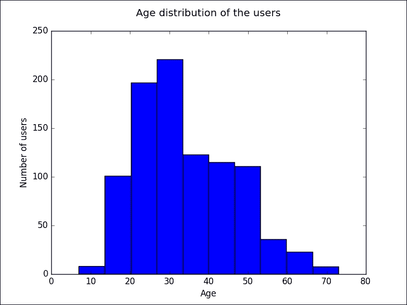

图 2

## 密度图

还有一种图表与直方图非常接近，那就是密度图。每当有有限的数据样本需要估计随机变量的概率密度函数时，密度图被广泛使用。直方图无法显示数据何时平滑或数据点何时连续。为此，使用密度图。

### 注意

由于直方图和密度图用于类似目的，但对相同数据表现出不同行为，通常，直方图和密度图在很多应用中并排使用。

*图 3*是为绘制直方图的同一数据集绘制的密度图。

在同一 Spark 的 Python REPL 中继续运行以下命令：

```scala
>>> # Draw a density plot
>>> from scipy.stats import gaussian_kde
>>> density = gaussian_kde(ageList)
>>> xAxisValues = np.linspace(0,100,1000)
>>> density.covariance_factor = lambda : .5
>>> density._compute_covariance()
>>> plt.title("Age density plot of the users\n")
>>> plt.xlabel("Age")
>>> plt.ylabel("Density")
>>> plt.plot(xAxisValues, density(xAxisValues))
>>> plt.show(block=False)

```

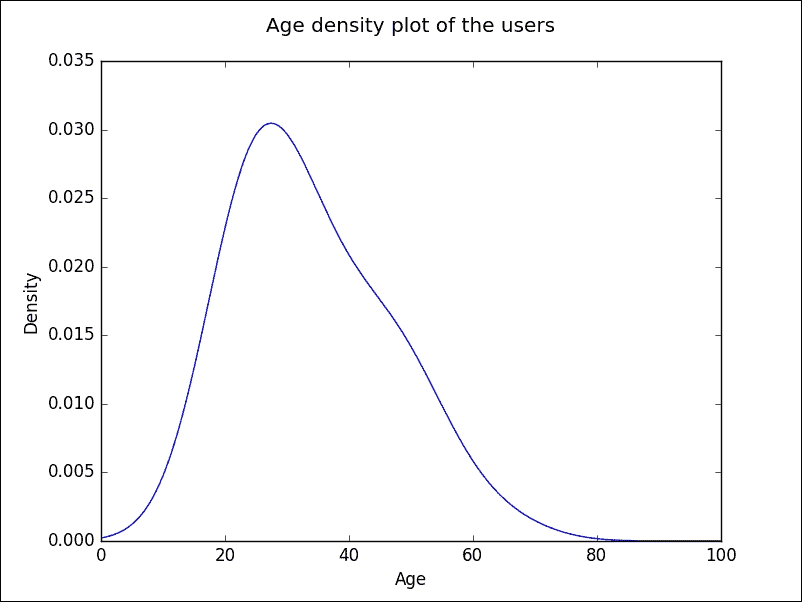

图 3

在前一节中，使用了仅包含年龄列的同一 Spark DataFrame，并将内容收集到本地 Python 集合对象中。利用收集的数据，绘制了年龄列的密度图，如*图 3*所示，其中 0 到 100 的线间距代表年龄。

如果需要并排查看多个图表或图，**matplotlib**库提供了实现这一目的的方法。图 4 展示了并排的直方图和箱线图。

作为同一 Python REPL 的 Spark 的延续，运行以下命令：

```scala
>>> # The following example demonstrates the creation of multiple diagrams
        in one figure
		>>> # There are two plots on one row
		>>> # The first one is the histogram of the distribution 
		>>> # The second one is the boxplot containing the summary of the 
        distribution
		>>> plt.subplot(121)
		>>> plt.hist(ageList)
		>>> plt.title("Age distribution of the users\n")
		>>> plt.xlabel("Age")
		>>> plt.ylabel("Number of users")
		>>> plt.subplot(122)
		>>> plt.title("Summary of distribution\n")
		>>> plt.xlabel("Age")
		>>> plt.boxplot(ageList, vert=False)
		>>> plt.show(block=False)

```

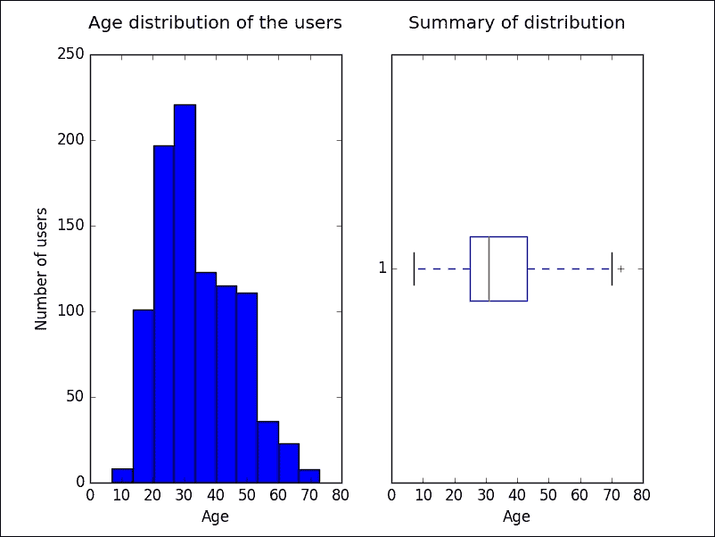

图 4

在前一节中，使用了仅包含年龄列的同一 Spark DataFrame，并将内容收集到本地 Python 集合对象中。利用收集的数据，绘制了年龄列的直方图以及包含最小值、第 25 百分位数、中位数、第 75 百分位数和最大值指示器的箱线图，如*图 4*所示。当在同一图形中绘制多个图表或图时，为了控制布局，请查看方法调用`plt.subplot(121)`。这是关于一行两列布局中图表选择的讨论，并选择了第一个。同样，`plt.subplot(122)`讨论了一行两列布局中的图表选择，并选择了第二个。

## 条形图

条形图可以以不同方式绘制。最常见的是条形垂直于*X*轴站立。另一种变体是条形绘制在*Y*轴上，条形水平排列。*图 5*展示了一个水平条形图。

### 注意

人们常常混淆直方图和条形图。重要的区别在于，直方图用于绘制连续但有限的数值，而条形图用于表示分类数据。

作为同一 Python REPL 的 Spark 的延续，运行以下命令：

```scala
>>> occupationsTop10 = spark.sql("SELECT occupation, count(occupation) as usercount FROM users GROUP BY occupation ORDER BY usercount DESC LIMIT 10")
>>> occupationsTop10.show()
      +-------------+---------+

      |   occupation|usercount|

      +-------------+---------+

      |      student|      196|

      |        other|      105|

      |     educator|       95|

      |administrator|       79|

      |     engineer|       67|

      |   programmer|       66|

      |    librarian|       51|

      |       writer|       45|

      |    executive|       32|

      |    scientist|       31|

      +-------------+---------+
	  >>> occupationsTop10Tuple = occupationsTop10.rdd.map(lambda p:
	  (p.occupation,p.usercount)).collect()
	  >>> occupationsTop10List, countTop10List = zip(*occupationsTop10Tuple)
	  >>> occupationsTop10Tuple
	  >>> # Top 10 occupations in terms of the number of users having that
	  occupation who have rated movies
	  >>> y_pos = np.arange(len(occupationsTop10List))
	  >>> plt.barh(y_pos, countTop10List, align='center', alpha=0.4)
	  >>> plt.yticks(y_pos, occupationsTop10List)
	  >>> plt.xlabel('Number of users')
	  >>> plt.title('Top 10 user types\n')
	  >>> plt.gcf().subplots_adjust(left=0.15)
	  >>> plt.show(block=False)

```

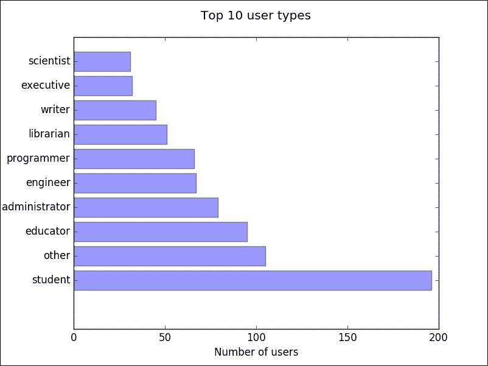

图 5

在前一节中，创建了一个 Spark DataFrame，其中包含按用户评分电影数量排名的前 10 种职业。数据被收集到一个 Python 集合对象中，用于绘制条形图。

### 堆叠条形图

在前一节中绘制的条形图展示了按用户数量排名的前 10 种用户职业。但这并未提供关于该数字如何按用户性别构成的详细信息。在这种情况下，使用堆叠条形图是很好的选择，每个条形图显示按性别统计的数量。*图 6*展示了一个堆叠条形图。

作为同一 Python REPL 的 Spark 的延续，运行以下命令：

```scala
>>> occupationsGender = spark.sql("SELECT occupation, gender FROM users")>>> occupationsGender.show()
      +-------------+------+

      |   occupation|gender|

      +-------------+------+

      |   technician|     M|

      |        other|     F|

      |       writer|     M|

      |   technician|     M|

      |        other|     F|

      |    executive|     M|

      |administrator|     M|

      |administrator|     M|

      |      student|     M|

      |       lawyer|     M|

      |        other|     F|

      |        other|     F|

      |     educator|     M|

      |    scientist|     M|

      |     educator|     F|

      |entertainment|     M|

      |   programmer|     M|

      |        other|     F|

      |    librarian|     M|

      |    homemaker|     F|

      +-------------+------+

      only showing top 20 rows
    >>> occCrossTab = occupationsGender.stat.crosstab("occupation", "gender")>>> occCrossTab.show()
      +-----------------+---+---+

      |occupation_gender|  M|  F|

      +-----------------+---+---+

      |        scientist| 28|  3|

      |          student|136| 60|

      |           writer| 26| 19|

      |         salesman|  9|  3|

      |          retired| 13|  1|

      |    administrator| 43| 36|

      |       programmer| 60|  6|

      |           doctor|  7|  0|

      |        homemaker|  1|  6|

      |        executive| 29|  3|

      |         engineer| 65|  2|

      |    entertainment| 16|  2|

      |        marketing| 16| 10|

      |       technician| 26|  1|

      |           artist| 15| 13|

      |        librarian| 22| 29|

      |           lawyer| 10|  2|

      |         educator| 69| 26|

      |       healthcare|  5| 11|

      |             none|  5|  4|

      +-----------------+---+---+

      only showing top 20 rows
      >>> occupationsCrossTuple = occCrossTab.rdd.map(lambda p:
	 (p.occupation_gender,p.M, p.F)).collect()
	 >>> occList, mList, fList = zip(*occupationsCrossTuple)
	 >>> N = len(occList)
	 >>> ind = np.arange(N) # the x locations for the groups
	 >>> width = 0.75 # the width of the bars
	 >>> p1 = plt.bar(ind, mList, width, color='r')
	 >>> p2 = plt.bar(ind, fList, width, color='y', bottom=mList)
	 >>> plt.ylabel('Count')
	 >>> plt.title('Gender distribution by occupation\n')
	 >>> plt.xticks(ind + width/2., occList, rotation=90)
	 >>> plt.legend((p1[0], p2[0]), ('Male', 'Female'))
	 >>> plt.gcf().subplots_adjust(bottom=0.25)
	 >>> plt.show(block=False)

```

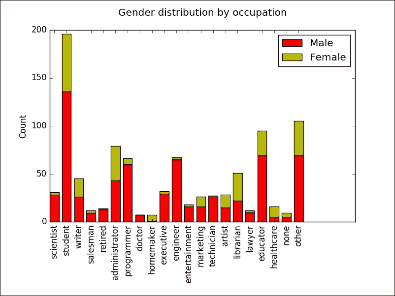

图 6

在前述部分中，创建了一个仅包含职业和性别列的 Spark DataFrame。对其实施了交叉表操作，生成了另一个 Spark DataFrame，该 DataFrame 包含了职业、男性用户数和女性用户数列。在最初的 Spark DataFrame 中，职业和性别列均为非数值列，因此基于这些数据绘制图表或图形并无意义。但若对这两列的值进行交叉表操作，针对每个不同的职业字段，性别列的值计数将得以呈现。如此一来，职业字段便成为了一个分类变量，此时绘制条形图便合乎逻辑。鉴于数据中仅有两种性别值，采用堆叠条形图既能显示总数，又能展示各职业类别中男女用户数的比例，显得合情合理。

在 Spark DataFrame 中，有许多统计和数学函数可供使用。在这种情境下，交叉表操作显得尤为便捷。对于庞大的数据集，交叉表操作可能会非常耗费处理器资源和时间，但 Spark 的分布式处理能力在此类情况下提供了极大的帮助。

Spark SQL 具备丰富的数学和统计数据处理功能。前述部分使用了`SparkDataFrame`对象上的`describe().show()`方法。在这些 Spark DataFrames 中，该方法作用于现有的数值列。在存在多个数值列的情况下，该方法能够选择所需的列以获取汇总统计信息。同样，也有方法可以计算来自 Spark DataFrame 的数据的协方差、相关性等。以下代码片段展示了这些方法：

```scala
>>> occCrossTab.describe('M', 'F').show()
      +-------+------------------+------------------+

      |summary|                 M|                 F|

      +-------+------------------+------------------+

      |  count|                21|                21|

      |   mean|31.904761904761905|              13.0|

      | stddev|31.595516200735347|15.491933384829668|

      |    min|                 1|                 0|

      |    max|               136|                60|

      +-------+------------------+------------------+
    >>> occCrossTab.stat.cov('M', 'F')
      381.15
    >>> occCrossTab.stat.corr('M', 'F')
      0.7416099517313641 

```

## 饼图

若需通过视觉手段展示数据集以阐明整体与部分的关系，饼图是常用的选择。*图 7*展示了一个饼图。

在同一 Python REPL 的 Spark 会话中，执行以下命令：

```scala
>>> occupationsBottom10 = spark.sql("SELECT occupation, count(occupation) as usercount FROM users GROUP BY occupation ORDER BY usercount LIMIT 10")
>>> occupationsBottom10.show()
      +-------------+---------+

      |   occupation|usercount|

      +-------------+---------+

      |    homemaker|        7|

      |       doctor|        7|

      |         none|        9|

      |     salesman|       12|

      |       lawyer|       12|

      |      retired|       14|

      |   healthcare|       16|

      |entertainment|       18|

      |    marketing|       26|

      |   technician|       27|

      +-------------+---------+
    >>> occupationsBottom10Tuple = occupationsBottom10.rdd.map(lambda p: (p.occupation,p.usercount)).collect()
	>>> occupationsBottom10List, countBottom10List = zip(*occupationsBottom10Tuple)
	>>> # Bottom 10 occupations in terms of the number of users having that occupation who have rated movies
	>>> explode = (0, 0, 0, 0,0.1,0,0,0,0,0.1)
	>>> plt.pie(countBottom10List, explode=explode, labels=occupationsBottom10List, autopct='%1.1f%%', shadow=True, startangle=90)
	>>> plt.title('Bottom 10 user types\n')
	>>> plt.show(block=False)

```

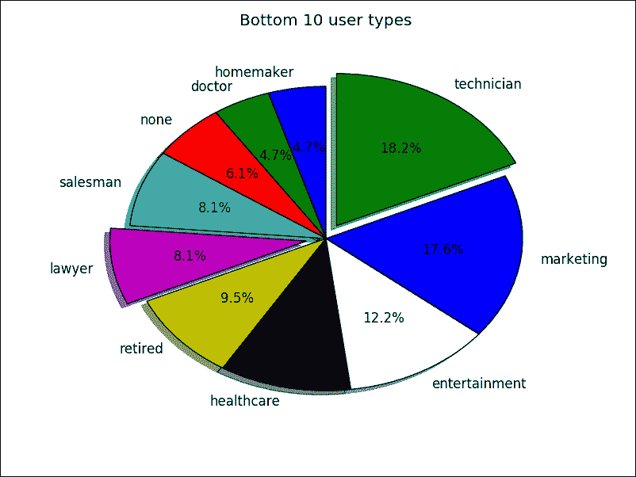

*图 7*

在前述部分中，创建了一个 Spark DataFrame，其中包含了用户按评分电影数量排名的底部 10 种职业。数据被收集到一个 Python 集合对象中，以便绘制饼图。

### 环形图

饼图可以有多种绘制形式。其中一种形式，即环形图，近年来颇受欢迎。*图 8*展示了这种饼图的环形图变体。

在同一 Python REPL 的 Spark 会话中，执行以下命令：

```scala
>>> zipTop10 = spark.sql("SELECT zipcode, count(zipcode) as usercount FROM users GROUP BY zipcode ORDER BY usercount DESC LIMIT 10")
>>> zipTop10.show()
      +-------+---------+

      |zipcode|usercount|

      +-------+---------+

      |  55414|        9|

      |  55105|        6|

      |  20009|        5|

      |  55337|        5|

      |  10003|        5|

      |  55454|        4|

      |  55408|        4|

      |  27514|        4|

      |  11217|        3|

      |  14216|        3|

      +-------+---------+
    >>> zipTop10Tuple = zipTop10.rdd.map(lambda p: (p.zipcode,p.usercount)).collect()
	>>> zipTop10List, countTop10List = zip(*zipTop10Tuple)
	>>> # Top 10 zipcodes in terms of the number of users living in that zipcode who have rated movies>>> explode = (0.1, 0, 0, 0,0,0,0,0,0,0)  # explode a slice if required
	>>> plt.pie(countTop10List, explode=explode, labels=zipTop10List, autopct='%1.1f%%', shadow=True)
	>>> #Draw a circle at the center of pie to make it look like a donut
	>>> centre_circle = plt.Circle((0,0),0.75,color='black', fc='white',linewidth=1.25)
	>>> fig = plt.gcf()
	>>> fig.gca().add_artist(centre_circle)
	>>> # The aspect ratio is to be made equal. This is to make sure that pie chart is coming perfectly as a circle.
	>>> plt.axis('equal')
	>>> plt.text(- 0.25,0,'Top 10 zip codes')
	>>> plt.show(block=False)

```

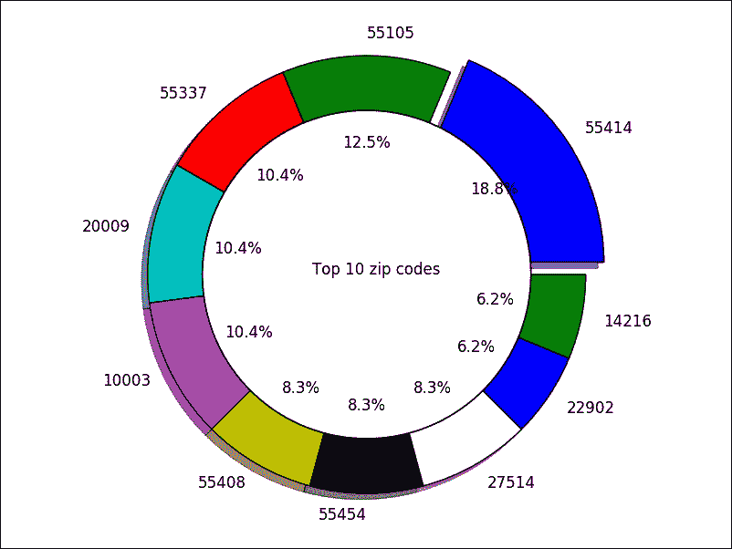

*图 8*

在前面的部分中，创建了一个包含用户居住地区和评价电影的用户数量最多的前 10 个邮政编码的 Spark DataFrame。数据被收集到一个 Python 集合对象中以绘制圆环图。

### 提示

与其他图表相比，*图 8*的标题位于中间。这是使用`text()`方法而不是`title()`方法完成的。此方法可用于在图表和绘图上打印水印文本。

## 箱形图

在单个图表中比较不同数据集的汇总统计信息是一个常见需求。箱形图是一种常用的图表，用于直观地捕捉数据集的汇总统计信息。接下来的部分正是这样做的，*图 9*展示了单个图表上的多个箱形图。

在同一 Python REPL 的 Spark 中继续，运行以下命令：

```scala
>>> ages = spark.sql("SELECT occupation, age FROM users WHERE occupation ='administrator' ORDER BY age")
>>> adminAges = ages.rdd.map(lambda p: p.age).collect()
>>> ages.describe().show()
      +-------+------------------+

      |summary|               age|

      +-------+------------------+

      |  count|                79|

      |   mean| 38.74683544303797|

      | stddev|11.052771408491363|

      |    min|                21|

      |    max|                70|

      +-------+------------------+
    >>> ages = spark.sql("SELECT occupation, age FROM users WHERE occupation ='engineer' ORDER BY age")>>> engAges = ages.rdd.map(lambda p: p.age).collect()
	>>> ages.describe().show()
      +-------+------------------+

      |summary|               age|

      +-------+------------------+

      |  count|                67|

      |   mean| 36.38805970149254|

      | stddev|11.115345348003853|

      |    min|                22|

      |    max|                70|

      +-------+------------------+
    >>> ages = spark.sql("SELECT occupation, age FROM users WHERE occupation ='programmer' ORDER BY age")>>> progAges = ages.rdd.map(lambda p: p.age).collect()
	>>> ages.describe().show()
      +-------+------------------+

      |summary|               age|

      +-------+------------------+

      |  count|                66|

      |   mean|33.121212121212125|

      | stddev| 9.551320948648684|

      |    min|                20|

      |    max|                63|

      +-------+------------------+
 >>> # Box plots of the ages by profession
 >>> boxPlotAges = [adminAges, engAges, progAges]
 >>> boxPlotLabels = ['administrator','engineer', 'programmer' ]
 >>> x = np.arange(len(boxPlotLabels))
 >>> plt.figure()
 >>> plt.boxplot(boxPlotAges)
 >>> plt.title('Age summary statistics\n')
 >>> plt.ylabel("Age")
 >>> plt.xticks(x + 1, boxPlotLabels, rotation=0)
 >>> plt.show(block=False)

```

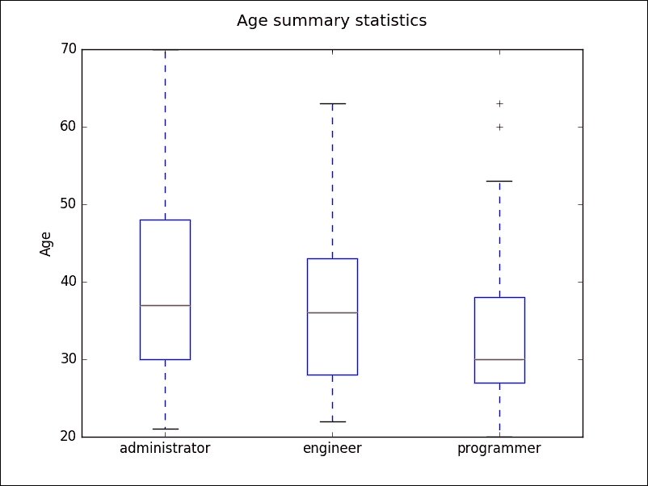

图 9

在前面的部分中，使用职业和年龄列为管理员、工程师和程序员三种职业创建了一个 Spark DataFrame。在一张图上为每个数据集创建了箱形图，该图包含每个数据集的最小值、第 25 百分位数、中位数、第 75 百分位数、最大值和异常值的指示器，以便于比较。程序员职业的箱形图显示了两个由`+`符号表示的值点。它们是异常值。

## 垂直条形图

在前面的部分中，用于引出各种图表和绘图用例的主要数据集是用户数据。接下来要处理的数据集是电影数据集。在许多数据集中，为了制作各种图表和绘图，需要对数据进行适当的处理以适应相应的图表。Spark 提供了丰富的功能来进行数据处理。

下面的用例展示了通过应用一些聚合并使用 Spark SQL 来准备数据，为包含按类型统计电影数量的经典条形图准备了所需的数据集。*图 10*展示了在电影数据上应用聚合操作后的条形图。

在同一 Python REPL 的 Spark 中继续，运行以下命令：

```scala
>>> movieLines = sc.textFile(dataDir + "u.item")
>>> splitMovieLines = movieLines.map(lambda l: l.split("|"))
>>> moviesRDD = splitMovieLines.map(lambda p: Row(id=p[0], title=p[1], releaseDate=p[2], videoReleaseDate=p[3], url=p[4], unknown=int(p[5]),action=int(p[6]),adventure=int(p[7]),animation=int(p[8]),childrens=int(p[9]),comedy=int(p[10]),crime=int(p[11]),documentary=int(p[12]),drama=int(p[13]),fantasy=int(p[14]),filmNoir=int(p[15]),horror=int(p[16]),musical=int(p[17]),mystery=int(p[18]),romance=int(p[19]),sciFi=int(p[20]),thriller=int(p[21]),war=int(p[22]),western=int(p[23])))
>>> moviesDF = spark.createDataFrame(moviesRDD)
>>> moviesDF.createOrReplaceTempView("movies")
>>> genreDF = spark.sql("SELECT sum(unknown) as unknown, sum(action) as action,sum(adventure) as adventure,sum(animation) as animation, sum(childrens) as childrens,sum(comedy) as comedy,sum(crime) as crime,sum(documentary) as documentary,sum(drama) as drama,sum(fantasy) as fantasy,sum(filmNoir) as filmNoir,sum(horror) as horror,sum(musical) as musical,sum(mystery) as mystery,sum(romance) as romance,sum(sciFi) as sciFi,sum(thriller) as thriller,sum(war) as war,sum(western) as western FROM movies")
>>> genreList = genreDF.collect()
>>> genreDict = genreList[0].asDict()
>>> labelValues = list(genreDict.keys())
>>> countList = list(genreDict.values())
>>> genreDict
      {'animation': 42, 'adventure': 135, 'romance': 247, 'unknown': 2, 'musical': 56, 'western': 27, 'comedy': 505, 'drama': 725, 'war': 71, 'horror': 92, 'mystery': 61, 'fantasy': 22, 'childrens': 122, 'sciFi': 101, 'filmNoir': 24, 'action': 251, 'documentary': 50, 'crime': 109, 'thriller': 251}
    >>> # Movie types and the counts
	>>> x = np.arange(len(labelValues))
	>>> plt.title('Movie types\n')
	>>> plt.ylabel("Count")
	>>> plt.bar(x, countList)
	>>> plt.xticks(x + 0.5, labelValues, rotation=90)
	>>> plt.gcf().subplots_adjust(bottom=0.20)
	>>> plt.show(block=False)

```

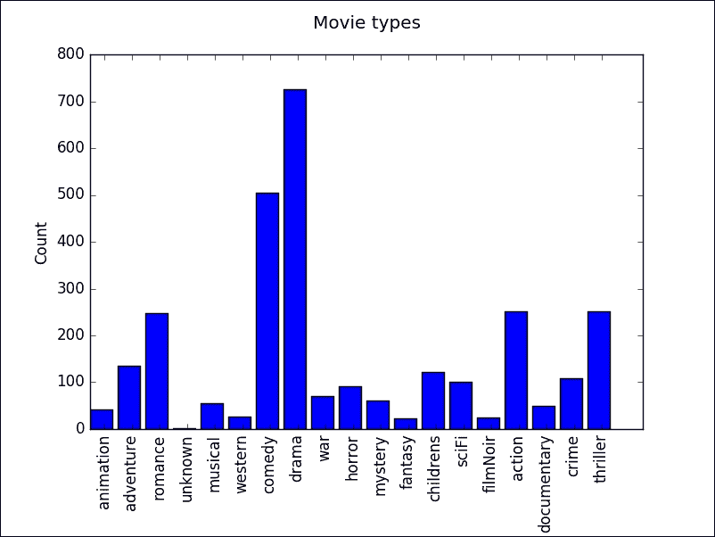

图 10

在前面的部分中，使用电影数据集创建了一个 `SparkDataFrame`。电影类型被捕获在单独的列中。在整个数据集中，使用 Spark SQL 进行了聚合，创建了一个新的 `SparkDataFrame` 摘要，并将数据值收集到一个 Python 集合对象中。由于数据集中列太多，使用了一个 Python 函数将这种数据结构转换为包含列名作为键和选定单行值作为键值的词典对象。从该词典中，创建了两个数据集，并绘制了一个条形图。

### 提示

在使用 Spark 进行数据分析应用开发时，Python 几乎肯定会用到许多图表和图形。与其尝试在本章中给出的所有代码示例在 Spark 的 Python REPL 中运行，不如使用 IPython 笔记本作为 IDE，以便代码和结果可以一起查看。本书的下载部分包含一个包含所有这些代码和结果的 IPython 笔记本。读者可以直接开始使用它。

## 散点图

散点图常用于绘制具有两个变量的值，例如笛卡尔空间中的一个点，它具有`X`值和`Y`值。在本电影数据集中，某一年发布的电影数量就表现出这种特性。在散点图中，通常`X`坐标和`Y`坐标的交点处表示的值是点。由于近期技术的发展和高级图形包的可用性，许多人使用不同的形状和颜色来表示这些点。在下面的散点图中，如*图 11*所示，使用了具有统一面积和随机颜色的小圆圈来表示这些值。当采用这些直观且巧妙的技术在散点图中表示点时，必须确保它不会违背散点图的初衷，也不会失去散点图传达数据行为所提供的简洁性。简单而优雅的形状，不会使笛卡尔空间显得杂乱，是这种非点表示值的理想选择。

在同一 Python REPL 中继续使用 Spark，运行以下命令：

```scala
>>> yearDF = spark.sql("SELECT substring(releaseDate,8,4) as releaseYear, count(*) as movieCount FROM movies GROUP BY substring(releaseDate,8,4) ORDER BY movieCount DESC LIMIT 10")
>>> yearDF.show()
      +-----------+----------+

      |releaseYear|movieCount|

      +-----------+----------+

      |       1996|       355|

      |       1997|       286|

      |       1995|       219|

      |       1994|       214|

      |       1993|       126|

      |       1998|        65|

      |       1992|        37|

      |       1990|        24|

      |       1991|        22|

      |       1986|        15|

      +-----------+----------+
    >>> yearMovieCountTuple = yearDF.rdd.map(lambda p: (int(p.releaseYear),p.movieCount)).collect()
	>>> yearList,movieCountList = zip(*yearMovieCountTuple)
	>>> countArea = yearDF.rdd.map(lambda p: np.pi * (p.movieCount/15)**2).collect()
	>>> plt.title('Top 10 movie release by year\n')
	>>> plt.xlabel("Year")
	>>> plt.ylabel("Number of movies released")
	>>> plt.ylim([0,max(movieCountList) + 20])
	>>> colors = np.random.rand(10)
	>>> plt.scatter(yearList, movieCountList,c=colors)
	>>> plt.show(block=False)

```

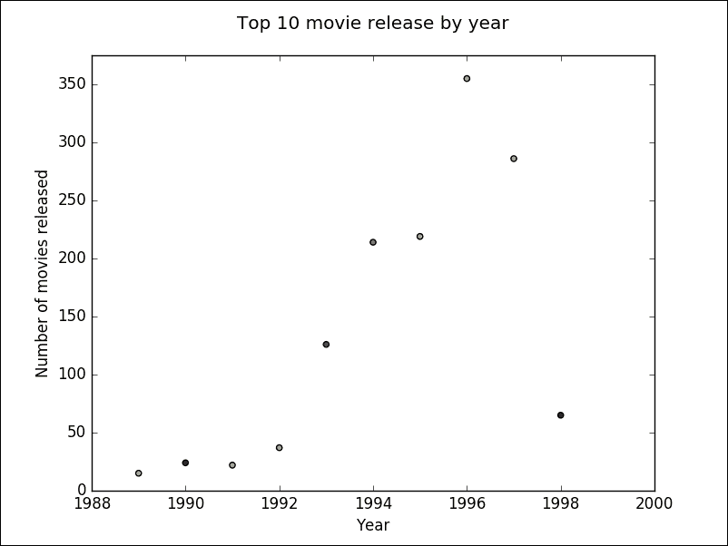

图 11

在前一节中，使用了一个`SparkDataFrame`来收集按电影发布数量排名的前 10 年，并将这些值收集到一个 Python 集合对象中，并绘制了一个散点图。

### 增强型散点图

*图 11*是一个非常简单而优雅的散点图，但它并没有真正传达出与同一空间中其他值相比，给定绘制值的比较行为。为此，与其将点表示为固定半径的圆，不如将点绘制为面积与值成比例的圆，这将提供一个不同的视角。图 12 将展示具有相同数据但用面积与值成比例的圆来表示点的散点图。

在同一 Python REPL 中继续使用 Spark，运行以下命令：

```scala
>>> # Top 10 years where the most number of movies have been released
>>> plt.title('Top 10 movie release by year\n')
>>> plt.xlabel("Year")
>>> plt.ylabel("Number of movies released")
>>> plt.ylim([0,max(movieCountList) + 100])
>>> colors = np.random.rand(10)
>>> plt.scatter(yearList, movieCountList,c=colors, s=countArea)
>>> plt.show(block=False)

```

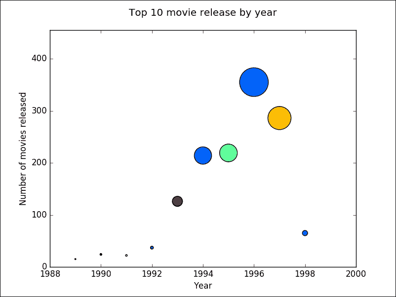

图 12

在前一节中，使用相同的数据集为*图 11*绘制了相同的散点图。与使用统一面积的圆圈绘制点不同，这些点是用面积与值成比例的圆圈绘制的。

### 提示

在这些代码示例中，图表和图形都是通过 show 方法展示的。matplotlib 中有方法可以将生成的图表和图形保存到磁盘，这些图表和图形可用于电子邮件发送、发布到仪表板等。

## 折线图

散点图与折线图之间存在相似之处。散点图非常适合表示单个数据点，但将所有点放在一起可以显示趋势。折线图也代表单个数据点，但这些点是相连的。这对于观察从一个点到另一个点的过渡非常理想。在一张图中，可以绘制多个折线图，便于比较两个数据集。前面的用例使用散点图来表示几年内发行的电影数量。这些数字只是绘制在一张图上的离散数据点。如果需要查看多年来电影发行的趋势，折线图是理想的选择。同样，如果需要比较两个不同类型电影的发行情况，则可以为每个类型使用一条线，并将两者都绘制在单个折线图上。*图 13*是一个包含多个数据集的折线图。

作为同一 Python REPL 会话中 Spark 的延续，运行以下命令：

```scala
>>> yearActionDF = spark.sql("SELECT substring(releaseDate,8,4) as actionReleaseYear, count(*) as actionMovieCount FROM movies WHERE action = 1 GROUP BY substring(releaseDate,8,4) ORDER BY actionReleaseYear DESC LIMIT 10")
>>> yearActionDF.show()
      +-----------------+----------------+

      |actionReleaseYear|actionMovieCount|

      +-----------------+----------------+

      |             1998|              12|

      |             1997|              46|

      |             1996|              44|

      |             1995|              40|

      |             1994|              30|

      |             1993|              20|

      |             1992|               8|

      |             1991|               2|

      |             1990|               7|

      |             1989|               6|

      +-----------------+----------------+
    >>> yearActionDF.createOrReplaceTempView("action")
	>>> yearDramaDF = spark.sql("SELECT substring(releaseDate,8,4) as dramaReleaseYear, count(*) as dramaMovieCount FROM movies WHERE drama = 1 GROUP BY substring(releaseDate,8,4) ORDER BY dramaReleaseYear DESC LIMIT 10")
	>>> yearDramaDF.show()
      +----------------+---------------+

      |dramaReleaseYear|dramaMovieCount|

      +----------------+---------------+

      |            1998|             33|

      |            1997|            113|

      |            1996|            170|

      |            1995|             89|

      |            1994|             97|

      |            1993|             64|

      |            1992|             14|

      |            1991|             11|

      |            1990|             12|

      |            1989|              8|

      +----------------+---------------+
    >>> yearDramaDF.createOrReplaceTempView("drama")
	>>> yearCombinedDF = spark.sql("SELECT a.actionReleaseYear as releaseYear, a.actionMovieCount, d.dramaMovieCount FROM action a, drama d WHERE a.actionReleaseYear = d.dramaReleaseYear ORDER BY a.actionReleaseYear DESC LIMIT 10")
	>>> yearCombinedDF.show()
      +-----------+----------------+---------------+

      |releaseYear|actionMovieCount|dramaMovieCount|

      +-----------+----------------+---------------+

      |       1998|              12|             33|

      |       1997|              46|            113|

      |       1996|              44|            170|

      |       1995|              40|             89|

      |       1994|              30|             97|

      |       1993|              20|             64|

      |       1992|               8|             14|

      |       1991|               2|             11|

      |       1990|               7|             12|

      |       1989|               6|              8|

      +-----------+----------------+---------------+
   >>> yearMovieCountTuple = yearCombinedDF.rdd.map(lambda p: (p.releaseYear,p.actionMovieCount, p.dramaMovieCount)).collect()
   >>> yearList,actionMovieCountList,dramaMovieCountList = zip(*yearMovieCountTuple)
   >>> plt.title("Movie release by year\n")
   >>> plt.xlabel("Year")
   >>> plt.ylabel("Movie count")
   >>> line_action, = plt.plot(yearList, actionMovieCountList)
   >>> line_drama, = plt.plot(yearList, dramaMovieCountList)
   >>> plt.legend([line_action, line_drama], ['Action Movies', 'Drama Movies'],loc='upper left')
   >>> plt.gca().get_xaxis().get_major_formatter().set_useOffset(False)
   >>> plt.show(block=False)

```

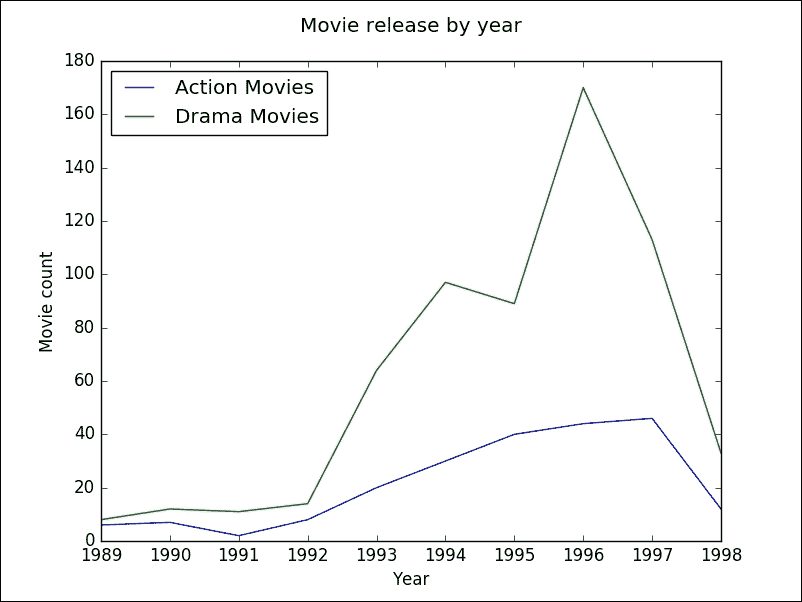

图 13

在前一部分中，创建了 Spark DataFrames 以获取过去 10 年中动作电影和剧情电影的发行数据集。数据被收集到 Python 集合对象中，并在同一图像中绘制了折线图。

Python 结合 matplotlib 库，在生成出版质量的图表和图形方面非常丰富。Spark 可以作为处理来自异构数据源的数据的工具，并且结果也可以保存为多种数据格式。

那些熟悉 Python 数据分析库**pandas**的人会发现本章内容易于理解，因为 Spark DataFrames 的设计灵感来源于 R DataFrame 以及**pandas**。

本章仅涵盖了使用**matplotlib**库可以创建的几种示例图表和图形。本章的主要目的是帮助读者理解将此库与 Spark 结合使用的能力，其中 Spark 负责数据处理，而**matplotlib**负责图表和图形的绘制。

本章使用的数据文件是从本地文件系统读取的。除此之外，它也可以从 HDFS 或任何其他 Spark 支持的数据源读取。

当使用 Spark 作为数据处理的主要框架时，最重要的是要记住，任何可能的数据处理都应该由 Spark 完成，主要是因为 Spark 能以最佳方式进行数据处理。只有经过处理的数据才会返回给 Spark 驱动程序，用于绘制图表和图形。

# 参考文献

如需更多信息，请参考以下链接：

+   [`www.numpy.org/`](http://www.numpy.org/)

+   [`www.scipy.org/`](http://www.scipy.org/)

+   [`matplotlib.org/`](http://matplotlib.org/)

+   [`movielens.org/`](https://movielens.org/)

+   [`grouplens.org/datasets/movielens/`](http://grouplens.org/datasets/movielens/)

+   [`pandas.pydata.org/`](http://pandas.pydata.org/)

# 总结

处理后的数据用于数据分析。数据分析需要对处理后的数据有深入的理解。图表和绘图增强了理解底层数据特征的能力。本质上，对于一个数据分析应用来说，数据处理、制图和绘图是必不可少的。本章涵盖了使用 Python 与 Spark 结合，以及 Python 制图和绘图库，来开发数据分析应用的内容。

在大多数组织中，业务需求推动了构建涉及实时数据摄取的数据处理应用的需求，这些数据以各种形式和形态，以极高的速度涌入。这要求对流入组织数据池的数据流进行处理。下一章将讨论 Spark Streaming，这是一个建立在 Spark 之上的库，能够处理各种类型的数据流。
