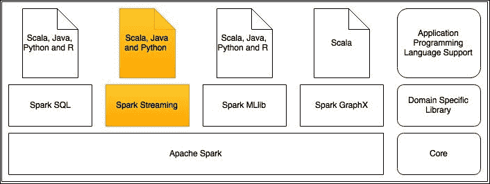
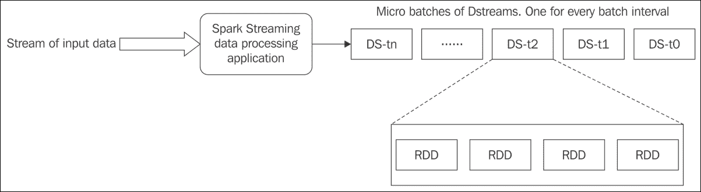
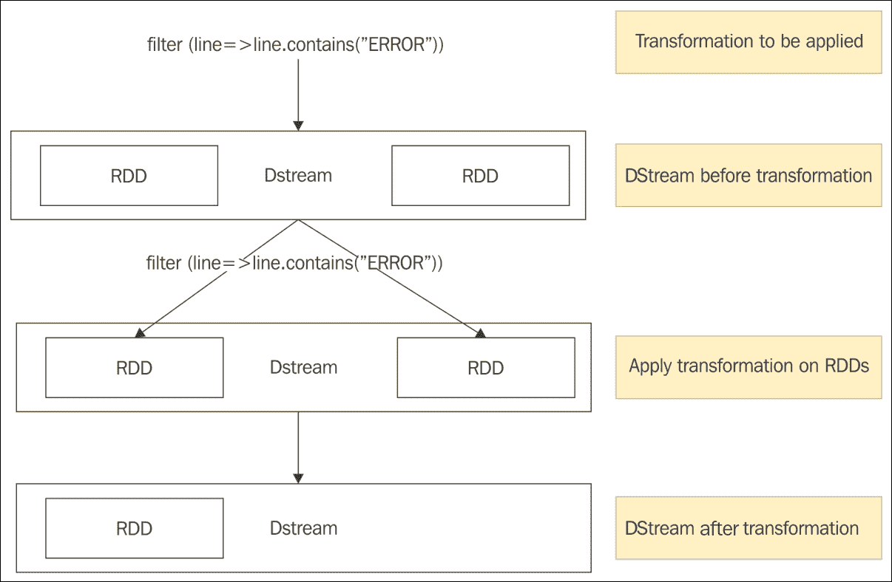
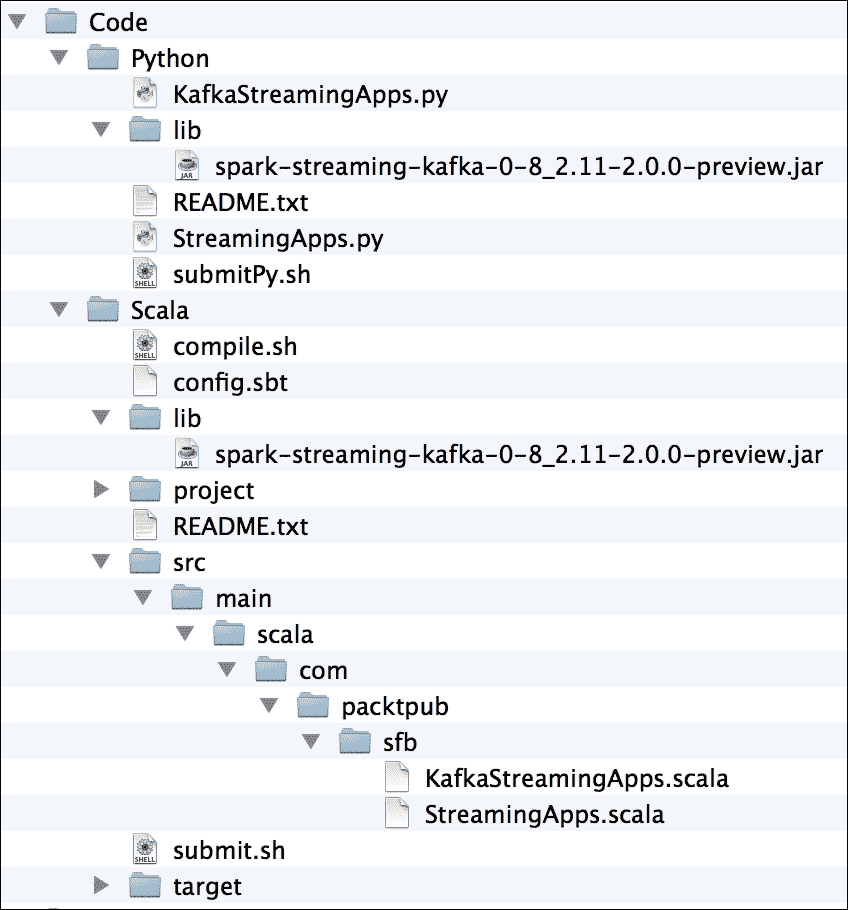
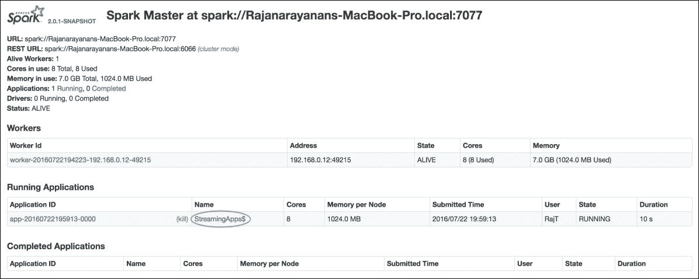
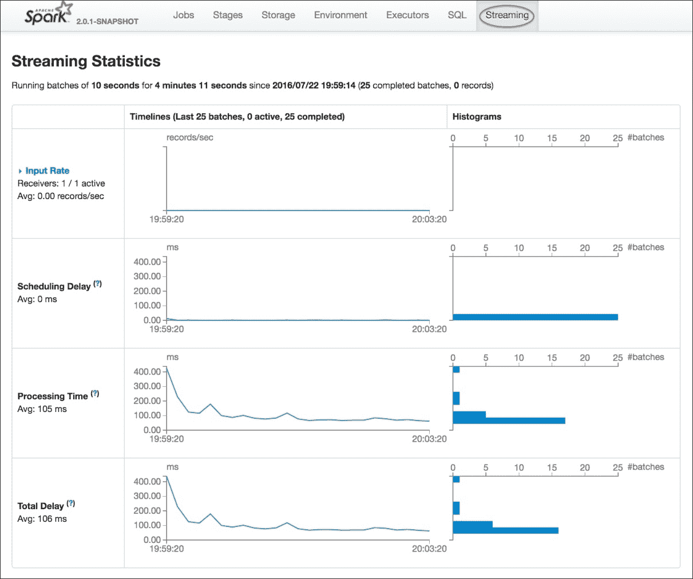
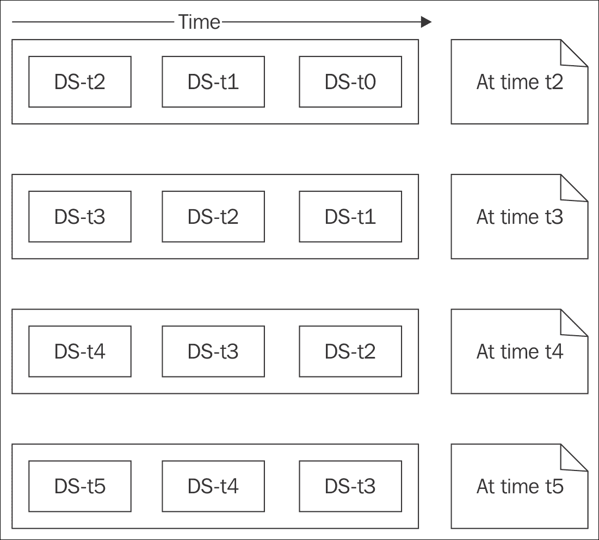
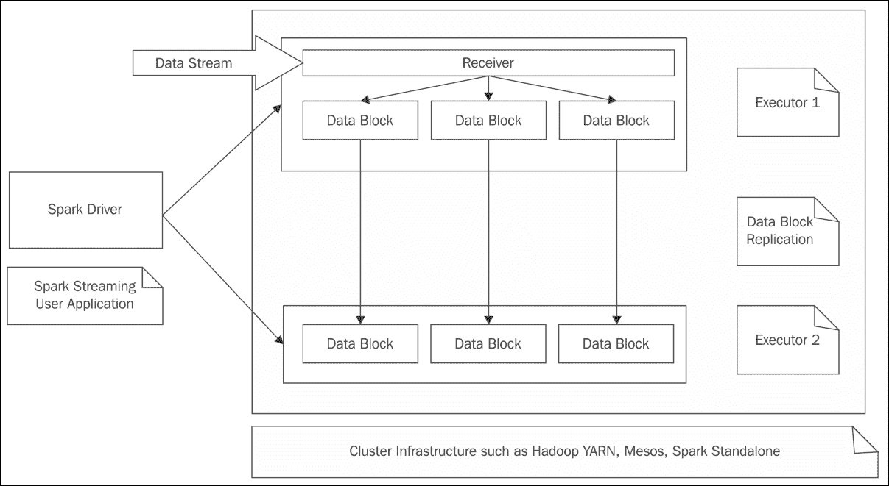

# 第六章：Spark 流处理

数据处理用例主要可以分为两种类型。第一种类型是数据静态，处理作为一个工作单元或分成更小的批次进行。在数据处理过程中，底层数据集不会改变，也不会有新的数据集添加到处理单元中。这是批处理。

第二种类型是数据像流水一样生成，处理随着数据生成而进行。这就是流处理。在本书的前几章中，所有数据处理用例都属于前一种类型。本章将关注后者。

本章我们将涵盖以下主题：

+   数据流处理

+   微批数据处理

+   日志事件处理器

+   窗口数据处理及其他选项

+   Kafka 流处理

+   使用 Spark 进行流作业

# 数据流处理

数据源生成数据如同流水，许多现实世界的用例要求它们实时处理。*实时*的含义因用例而异。定义特定用例中实时含义的主要参数是，从上次间隔以来摄取的数据或频繁间隔需要多快处理。例如，当重大体育赛事进行时，消费比分事件并将其发送给订阅用户的应用程序应尽可能快地处理数据。发送得越快，效果越好。

但这里的*快*是什么定义呢？在比分事件发生后一小时内处理比分数据是否可以？可能不行。在比分事件发生后一分钟内处理数据是否可以？这肯定比一小时内处理要好。在比分事件发生后一秒内处理数据是否可以？可能可以，并且比之前的数据处理时间间隔要好得多。

在任何数据流处理用例中，这个时间间隔都非常重要。数据处理框架应具备在自选的适当时间间隔内处理数据流的能力，以提供良好的商业价值。

当以自选的常规间隔处理流数据时，数据从时间间隔的开始收集到结束，分组为微批，并对该批数据进行数据处理。在较长时间内，数据处理应用程序将处理许多这样的微批数据。在这种类型的处理中，数据处理应用程序在给定时间点只能看到正在处理的特定微批。换句话说，应用程序对已经处理的微批数据没有任何可见性或访问权限。

现在，这种处理类型还有另一个维度。假设给定的用例要求每分钟处理数据，但在处理给定的微批数据时，需要查看过去 15 分钟内已处理的数据。零售银行交易处理应用程序的欺诈检测模块是这种特定业务需求的良好示例。毫无疑问，零售银行交易应在发生后的毫秒内进行处理。在处理 ATM 现金提取交易时，查看是否有人试图连续提取现金，如果发现，发送适当的警报是一个好主意。为此，在处理给定的现金提取交易时，应用程序检查在过去 15 分钟内是否从同一 ATM 使用同一张卡进行了任何其他现金提取。业务规则是在过去 15 分钟内此类交易超过两次时发送警报。在此用例中，欺诈检测应用程序应该能够查看过去 15 分钟内发生的所有交易。

一个好的流数据处理框架应该具有在任何给定时间间隔内处理数据的能力，以及在滑动时间窗口内查看已摄取数据的能力。在 Spark 之上工作的 Spark Streaming 库是具有这两种能力的最佳数据流处理框架之一。

再次查看*图 1*中给出的 Spark 库堆栈的全貌，以设置上下文并了解正在讨论的内容，然后再深入探讨和处理用例。



图 1

# 微批处理数据处理

每个 Spark Streaming 数据处理应用程序将持续运行，直到被终止。该应用程序将不断*监听*数据源以接收传入的数据流。Spark Streaming 数据处理应用程序将有一个配置的批处理间隔。在每个批处理间隔结束时，它将产生一个名为**离散流**（**DStream**）的数据抽象，该抽象与 Spark 的 RDD 非常相似。与 RDD 一样，DStream 支持常用 Spark 转换和 Spark 操作的等效方法。

### 提示

正如 RDD 一样，DStream 也是不可变的和分布式的。

*图 2*展示了在 Spark Streaming 数据处理应用程序中 DStreams 是如何产生的。



图 2

*图 2*描绘了 Spark Streaming 应用程序最重要的元素。对于配置的批处理间隔，应用程序产生一个 DStream。每个 DStream 是一个由该批处理间隔内收集的数据组成的 RDD 集合。对于给定的批处理间隔，DStream 中的 RDD 数量会有所不同。

### 提示

由于 Spark Streaming 应用程序是持续运行的应用程序，用于收集数据，本章中，我们不再通过 REPL 运行代码，而是讨论完整的应用程序，包括编译、打包和运行的指令。

Spark 编程模型已在第二章，*Spark 编程模型*中讨论。

## 使用 DStreams 进行编程

在 Spark Streaming 数据处理应用程序中使用 DStreams 也遵循非常相似的模式，因为 DStreams 由一个或多个 RDD 组成。当对 DStream 调用诸如 Spark 转换或 Spark 操作等方法时，相应的操作将应用于构成 DStream 的所有 RDD。

### 注意

这里需要注意的是，并非所有适用于 RDD 的 Spark 转换和 Spark 操作都适用于 DStreams。另一个显著的变化是不同编程语言之间的能力差异。

Spark Streaming 的 Scala 和 Java API 在支持 Spark Streaming 数据处理应用程序开发的特性数量上领先于 Python API。

*图 3*展示了应用于 DStream 的方法如何应用于底层 RDDs。在使用 DStreams 上的任何方法之前，应查阅 Spark Streaming 编程指南。Spark Streaming 编程指南在 Python API 与其 Scala 或 Java 对应部分存在差异的地方，用特殊标注包含文本*Python API*。

假设在 Spark Streaming 数据处理应用程序的给定批次间隔内，生成一个包含多个 RDD 的 DStream。当对该 DStream 应用过滤方法时，以下是其如何转换为底层 RDDs 的过程。*图 3*显示了对包含两个 RDD 的 DStream 应用过滤转换，由于过滤条件，结果生成仅包含一个 RDD 的另一个 DStream。



图 3

# 日志事件处理器

如今，许多企业普遍拥有一个中央应用程序日志事件存储库。此外，这些日志事件被实时流式传输到数据处理应用程序，以便实时监控运行应用程序的性能，从而及时采取补救措施。本节将讨论这样一个用例，以展示使用 Spark Streaming 数据处理应用程序对日志事件进行实时处理。在此用例中，实时应用程序日志事件被写入 TCP 套接字。Spark Streaming 数据处理应用程序持续监听给定主机上的特定端口，以收集日志事件流。

## 准备 Netcat 服务器

这里使用大多数 UNIX 安装附带的 Netcat 实用程序作为数据服务器。为了确保系统中安装了 Netcat，请按照以下脚本中的手动命令操作，退出后运行它，并确保没有错误消息。一旦服务器启动并运行，在 Netcat 服务器控制台的标准输入中输入的内容将被视为应用程序日志事件，以简化演示目的。从终端提示符运行的以下命令将在 localhost 端口`9999`上启动 Netcat 数据服务器：

```scala
$ man nc
 NC(1)          BSD General Commands Manual
NC(1) 
NAME
     nc -- arbitrary TCP and UDP connections and listens 
SYNOPSIS
     nc [-46AcDCdhklnrtUuvz] [-b boundif] [-i interval] [-p source_port] [-s source_ip_address] [-w timeout] [-X proxy_protocol] [-x proxy_address[:port]]
        [hostname] [port[s]]
 DESCRIPTION
     The nc (or netcat) utility is used for just about anything under the sun involving TCP or UDP.  It can open TCP connections, send UDP packets, listen on
     arbitrary TCP and UDP ports, do port scanning, and deal with both IPv4 and IPv6.  Unlike telnet(1), nc scripts nicely, and separates error messages onto
     standard error instead of sending them to standard output, as telnet(1) does with some. 
     Common uses include: 
           o   simple TCP proxies
           o   shell-script based HTTP clients and servers
           o   network daemon testing
           o   a SOCKS or HTTP ProxyCommand for ssh(1)
           o   and much, much more
$ nc -lk 9999

```

完成上述步骤后，Netcat 服务器就绪，Spark Streaming 数据处理应用程序将处理在前一个控制台窗口中输入的所有行。不要关闭此控制台窗口；所有后续的 shell 命令将在另一个终端窗口中运行。

由于不同编程语言之间 Spark Streaming 特性的不一致，使用 Scala 代码来解释所有 Spark Streaming 概念和用例。之后，给出 Python 代码，如果 Python 中讨论的任何特性缺乏支持，也会记录下来。

如*图 4*所示，Scala 和 Python 代码的组织方式。为了编译、打包和运行代码，使用了 Bash 脚本，以便读者可以轻松运行它们以产生一致的结果。这些脚本文件的内容在此讨论。

## 文件组织

在下面的文件夹树中，`project`和`target`文件夹在运行时创建。本书附带的源代码可以直接复制到系统中方便的文件夹中：



*图 4*

编译和打包使用**Scala 构建工具**(**sbt**)。为了确保 sbt 正常工作，请从*图 4*中树的`Scala`文件夹中在终端窗口中运行以下命令。这是为了确保 sbt 运行正常，代码编译无误：

```scala
$ cd Scala
$ sbt
> compile
 [success] Total time: 1 s, completed 24 Jul, 2016 8:39:04 AM 
 > exit
	  $

```

下表概述了正在讨论的 Spark Streaming 数据处理应用程序中文件的代表性样本列表及其各自用途。

| **文件名** | **用途** |
| --- | --- |
| `README.txt` | 运行应用程序的说明。一份针对 Scala 应用程序，另一份针对 Python 应用程序。 |
| `submitPy.sh` | 向 Spark 集群提交 Python 作业的 Bash 脚本。 |
| `compile.sh` | 编译 Scala 代码的 Bash 脚本。 |
| `submit.sh` | 向 Spark 集群提交 Scala 作业的 Bash 脚本。 |
| `config.sbt` | sbt 配置文件。 |
| `*.scala` | Scala 中的 Spark Streaming 数据处理应用程序代码。 |
| `*.py` | Python 中的 Spark Streaming 数据处理应用程序代码。 |
| `*.jar` | 需要下载并放置在`lib`目录下的 Spark Streaming 和 Kafka 集成 JAR 文件，以确保应用程序正常运行。这在`submit.sh`和`submitPy.sh`中用于向集群提交作业。 |

## 向 Spark 集群提交作业

为了正确运行应用程序，其中一些配置取决于它运行的系统。它们需要在`submit.sh`文件和`submitPy.sh`文件中进行编辑。无论何处需要此类编辑，都会使用`[FILLUP]`标签给出注释。其中最重要的是设置 Spark 安装目录和 Spark 主配置，这可能因系统而异。前面脚本`submit.sh`文件的源代码如下：

```scala
#!/bin/bash
	  #-----------
	  # submit.sh
	  #-----------
	  # IMPORTANT - Assumption is that the $SPARK_HOME and $KAFKA_HOME environment variables are already set in the system that is running the application
	  # [FILLUP] Which is your Spark master. If monitoring is needed, use the desired Spark master or use local
	  # When using the local mode. It is important to give more than one cores in square brackets
	  #SPARK_MASTER=spark://Rajanarayanans-MacBook-Pro.local:7077
	  SPARK_MASTER=local[4]
	  # [OPTIONAL] Your Scala version
	  SCALA_VERSION="2.11"
	  # [OPTIONAL] Name of the application jar file. You should be OK to leave it like that
	  APP_JAR="spark-for-beginners_$SCALA_VERSION-1.0.jar"
	  # [OPTIONAL] Absolute path to the application jar file
	  PATH_TO_APP_JAR="target/scala-$SCALA_VERSION/$APP_JAR"
	  # [OPTIONAL] Spark submit commandSPARK_SUBMIT="$SPARK_HOME/bin/spark-submit"
	  # [OPTIONAL] Pass the application name to run as the parameter to this script
	  APP_TO_RUN=$1
	  sbt package
	  if [ $2 -eq 1 ]
	  then
	  $SPARK_SUBMIT --class $APP_TO_RUN --master $SPARK_MASTER --jars $KAFKA_HOME/libs/kafka-clients-0.8.2.2.jar,$KAFKA_HOME/libs/kafka_2.11-0.8.2.2.jar,$KAFKA_HOME/libs/metrics-core-2.2.0.jar,$KAFKA_HOME/libs/zkclient-0.3.jar,./lib/spark-streaming-kafka-0-8_2.11-2.0.0-preview.jar $PATH_TO_APP_JAR
	  else
	  $SPARK_SUBMIT --class $APP_TO_RUN --master $SPARK_MASTER --jars $PATH_TO_APP_JAR $PATH_TO_APP_JAR
	  fi

```

前面脚本文件`submitPy.sh`的源代码如下：

```scala
 #!/usr/bin/env bash
	  #------------
	  # submitPy.sh
	  #------------
	  # IMPORTANT - Assumption is that the $SPARK_HOME and $KAFKA_HOME environment variables are already set in the system that is running the application
	  # Disable randomized hash in Python 3.3+ (for string) Otherwise the following exception will occur
	  # raise Exception("Randomness of hash of string should be disabled via PYTHONHASHSEED")
	  # Exception: Randomness of hash of string should be disabled via PYTHONHASHSEED
	  export PYTHONHASHSEED=0
	  # [FILLUP] Which is your Spark master. If monitoring is needed, use the desired Spark master or use local
	  # When using the local mode. It is important to give more than one cores in square brackets
	  #SPARK_MASTER=spark://Rajanarayanans-MacBook-Pro.local:7077
	  SPARK_MASTER=local[4]
	  # [OPTIONAL] Pass the application name to run as the parameter to this script
	  APP_TO_RUN=$1
	  # [OPTIONAL] Spark submit command
	  SPARK_SUBMIT="$SPARK_HOME/bin/spark-submit"
	  if [ $2 -eq 1 ]
	  then
	  $SPARK_SUBMIT --master $SPARK_MASTER --jars $KAFKA_HOME/libs/kafka-clients-0.8.2.2.jar,$KAFKA_HOME/libs/kafka_2.11-0.8.2.2.jar,$KAFKA_HOME/libs/metrics-core-2.2.0.jar,$KAFKA_HOME/libs/zkclient-0.3.jar,./lib/spark-streaming-kafka-0-8_2.11-2.0.0-preview.jar $APP_TO_RUN
	  else
	  $SPARK_SUBMIT --master $SPARK_MASTER $APP_TO_RUN
	  fi

```

## 监控正在运行的应用程序

如第二章所述，*Spark 编程模型*，Spark 安装自带一个强大的 Spark Web UI，用于监控正在运行的 Spark 应用程序。

对于正在运行的 Spark Streaming 作业，还有额外的可视化工具可用。

以下脚本启动 Spark 主节点和工作者，并启用监控。这里的假设是读者已经按照第二章，*Spark 编程模型*中的建议进行了所有配置更改，以启用 Spark 应用程序监控。如果没有这样做，应用程序仍然可以运行。唯一需要做的更改是将`submit.sh`文件和`submitPy.sh`文件中的情况更改为确保使用`local[4]`之类的内容，而不是 Spark 主 URL。在终端窗口中运行以下命令：

```scala
 $ cd $SPARK_HOME
	  $ ./sbin/start-all.sh
       starting org.apache.spark.deploy.master.Master, logging to /Users/RajT/source-code/spark-source/spark-2.0/logs/spark-RajT-org.apache.spark.deploy.master.Master-1-Rajanarayanans-MacBook-Pro.local.out 
 localhost: starting org.apache.spark.deploy.worker.Worker, logging to /Users/RajT/source-code/spark-source/spark-2.0/logs/spark-RajT-org.apache.spark.deploy.worker.Worker-1-Rajanarayanans-MacBook-Pro.local.out

```

通过访问`http://localhost:8080/`确保 Spark Web UI 已启动并运行。

## 在 Scala 中实现应用程序

以下代码片段是用于日志事件处理应用程序的 Scala 代码：

```scala
 /**
	  The following program can be compiled and run using SBT
	  Wrapper scripts have been provided with this
	  The following script can be run to compile the code
	  ./compile.sh
	  The following script can be used to run this application in Spark
	  ./submit.sh com.packtpub.sfb.StreamingApps
	  **/
	  package com.packtpub.sfb
	  import org.apache.spark.sql.{Row, SparkSession}
	  import org.apache.spark.streaming.{Seconds, StreamingContext}
	  import org.apache.spark.storage.StorageLevel
	  import org.apache.log4j.{Level, Logger}
	  object StreamingApps{
	  def main(args: Array[String]) 
	  {
	  // Log level settings
	  	  LogSettings.setLogLevels()
	  	  // Create the Spark Session and the spark context	  
	  	  val spark = SparkSession
	  	  .builder
	  	  .appName(getClass.getSimpleName)
	  	  .getOrCreate()
	     // Get the Spark context from the Spark session for creating the streaming context
	  	  val sc = spark.sparkContext   
	      // Create the streaming context
	      val ssc = new StreamingContext(sc, Seconds(10))
	      // Set the check point directory for saving the data to recover when 
       there is a crash   ssc.checkpoint("/tmp")
	      println("Stream processing logic start")
	      // Create a DStream that connects to localhost on port 9999
	      // The StorageLevel.MEMORY_AND_DISK_SER indicates that the data will be 
       stored in memory and if it overflows, in disk as well
	      val appLogLines = ssc.socketTextStream("localhost", 9999, 
       StorageLevel.MEMORY_AND_DISK_SER)
	      // Count each log message line containing the word ERROR
	      val errorLines = appLogLines.filter(line => line.contains("ERROR"))
	      // Print the elements of each RDD generated in this DStream to the 
        console   errorLines.print()
		   // Count the number of messages by the windows and print them
		   errorLines.countByWindow(Seconds(30), Seconds(10)).print()
		   println("Stream processing logic end")
		   // Start the streaming   ssc.start()   
		   // Wait till the application is terminated             
		   ssc.awaitTermination()    }
		}object LogSettings{
		  /** 
		   Necessary log4j logging level settings are done 
		  */  def setLogLevels() {
		    val log4jInitialized = 
         Logger.getRootLogger.getAllAppenders.hasMoreElements
		     if (!log4jInitialized) {
		        // This is to make sure that the console is clean from other INFO 
            messages printed by Spark
			       Logger.getRootLogger.setLevel(Level.WARN)
			    }
			  }
			}

```

在前面的代码片段中，有两个 Scala 对象。一个是设置适当的日志级别，以确保控制台上不显示不需要的消息。`StreamingApps` Scala 对象包含流处理的逻辑。以下列表捕捉了功能的本质：

+   使用应用程序名称创建 Spark 配置。

+   创建了一个 Spark `StreamingContext`对象，这是流处理的中心。`StreamingContext`构造函数的第二个参数是批处理间隔，这里是 10 秒。包含`ssc.socketTextStream`的行在每个批处理间隔（此处为 10 秒）创建 DStreams，其中包含在 Netcat 控制台中输入的行。

+   接下来对 DStream 应用过滤转换，只包含包含单词`ERROR`的行。过滤转换创建仅包含过滤行的新 DStreams。

+   下一行将 DStream 内容打印到控制台。换句话说，对于每个批处理间隔，如果存在包含单词`ERROR`的行，则会在控制台上显示。

+   在此数据处理逻辑结束时，给定的`StreamingContext`启动并运行，直到被终止。

在前面的代码片段中，没有循环结构告诉应用程序重复直到运行应用程序被终止。这是由 Spark Streaming 库本身实现的。从数据处理应用程序开始到终止，所有语句都运行一次。对 DStreams 的所有操作都会重复（内部）每个批次。如果仔细检查前一个应用程序的输出，尽管这些语句位于`StreamingContext`的初始化和终止之间，但只能在控制台上看到 println()语句的输出一次。这是因为*魔法循环*仅对包含原始和派生 DStreams 的语句重复。

由于 Spark Streaming 应用程序中实现的循环的特殊性，在应用程序代码的流逻辑中给出打印语句和日志语句是徒劳的，就像代码片段中给出的那样。如果必须这样做，那么这些日志语句应该在传递给 DStreams 进行转换和操作的函数中进行设置。

### 提示

如果需要对处理后的数据进行持久化，DStreams 提供了多种输出操作，就像 RDDs 一样。

## 编译和运行应用程序

以下命令在终端窗口中运行以编译和运行应用程序。可以使用简单的 sbt 编译命令，而不是使用`./compile.sh`。

### 注意

请注意，如前所述，在执行这些命令之前，Netcat 服务器必须正在运行。

```scala
 $ cd Scala
			$ ./compile.sh

      [success] Total time: 1 s, completed 24 Jan, 2016 2:34:48 PM

	$ ./submit.sh com.packtpub.sfb.StreamingApps

      Stream processing logic start    

      Stream processing logic end  

      -------------------------------------------                                     

      Time: 1469282910000 ms

      -------------------------------------------

      -------------------------------------------

      Time: 1469282920000 ms

      ------------------------------------------- 

```

如果没有显示错误消息，并且结果与之前的输出一致，则 Spark Streaming 数据处理应用程序已正确启动。

## 处理输出

请注意，打印语句的输出在 DStream 输出打印之前。到目前为止，还没有在 Netcat 控制台中输入任何内容，因此没有要处理的内容。

现在转到之前启动的 Netcat 控制台，输入以下几行日志事件消息，间隔几秒钟，以确保输出到多个批次，其中批处理大小为 10 秒：

```scala
 [Fri Dec 20 01:46:23 2015] [ERROR] [client 1.2.3.4.5.6] Directory index forbidden by rule: /home/raj/
	  [Fri Dec 20 01:46:23 2015] [WARN] [client 1.2.3.4.5.6] Directory index forbidden by rule: /home/raj/
	  [Fri Dec 20 01:54:34 2015] [ERROR] [client 1.2.3.4.5.6] Directory index forbidden by rule: /apache/web/test
	  [Fri Dec 20 01:54:34 2015] [WARN] [client 1.2.3.4.5.6] Directory index forbidden by rule: /apache/web/test
	  [Fri Dec 20 02:25:55 2015] [ERROR] [client 1.2.3.4.5.6] Client sent malformed Host header
	  [Fri Dec 20 02:25:55 2015] [WARN] [client 1.2.3.4.5.6] Client sent malformed Host header
	  [Mon Dec 20 23:02:01 2015] [ERROR] [client 1.2.3.4.5.6] user test: authentication failure for "/~raj/test": Password Mismatch
	  [Mon Dec 20 23:02:01 2015] [WARN] [client 1.2.3.4.5.6] user test: authentication failure for "/~raj/test": Password Mismatch 

```

一旦日志事件消息输入到 Netcat 控制台窗口，以下结果将开始显示在 Spark Streaming 数据处理应用程序中，仅过滤包含关键字 ERROR 的日志事件消息。

```scala
	  -------------------------------------------
	  Time: 1469283110000 ms
	  -------------------------------------------
	  [Fri Dec 20 01:46:23 2015] [ERROR] [client 1.2.3.4.5.6] Directory index
      forbidden by rule: /home/raj/
	  -------------------------------------------
	  Time: 1469283190000 ms
	  -------------------------------------------
	  -------------------------------------------
	  Time: 1469283200000 ms
	  -------------------------------------------
	  [Fri Dec 20 01:54:34 2015] [ERROR] [client 1.2.3.4.5.6] Directory index
      forbidden by rule: /apache/web/test
	  -------------------------------------------
	  Time: 1469283250000 ms
	  -------------------------------------------
	  -------------------------------------------
	  Time: 1469283260000 ms
	  -------------------------------------------
	  [Fri Dec 20 02:25:55 2015] [ERROR] [client 1.2.3.4.5.6] Client sent 
      malformed Host header
	  -------------------------------------------
	  Time: 1469283310000 ms
	  -------------------------------------------
	  [Mon Dec 20 23:02:01 2015] [ERROR] [client 1.2.3.4.5.6] user test:
      authentication failure for "/~raj/test": Password Mismatch
	  -------------------------------------------
	  Time: 1453646710000 ms
	  -------------------------------------------

```

Spark Web UI（`http://localhost:8080/`）已启用，图 5 和图 6 显示了 Spark 应用程序和统计信息。

从主页（访问 URL `http://localhost:8080/`后），点击正在运行的 Spark Streaming 数据处理应用程序的名称链接，以调出常规监控页面。从该页面，点击**Streaming**标签，以显示包含流统计信息的页面。

需要点击的链接和标签以红色圆圈标出：



图 5

从*图 5*所示页面中，点击圆圈内的应用程序链接；这将带您到相关页面。从该页面，一旦点击**Streaming**标签，将显示包含流统计信息的页面，如*图 6*所示：



图 6

这些 Spark 网页界面提供了大量的应用程序统计信息，深入探索它们有助于更深入地理解提交的 Spark Streaming 数据处理应用程序的行为。

### 提示

在启用流应用程序监控时必须小心，以确保不影响应用程序本身的性能。

## 在 Python 中实现应用程序

相同的用例在 Python 中实现，以下代码片段保存在`StreamingApps.py`中用于执行此操作：

```scala
 # The following script can be used to run this application in Spark
	  # ./submitPy.sh StreamingApps.py
	  from __future__ import print_function
	  import sys
	  from pyspark import SparkContext
	  from pyspark.streaming import StreamingContext
	  if __name__ == "__main__":
	      # Create the Spark context
	      sc = SparkContext(appName="PythonStreamingApp")
	      # Necessary log4j logging level settings are done 
	      log4j = sc._jvm.org.apache.log4j
	      log4j.LogManager.getRootLogger().setLevel(log4j.Level.WARN)
	      # Create the Spark Streaming Context with 10 seconds batch interval
	      ssc = StreamingContext(sc, 10)
	      # Set the check point directory for saving the data to recover when
        there is a crash
		    ssc.checkpoint("\tmp")
		    # Create a DStream that connects to localhost on port 9999
		    appLogLines = ssc.socketTextStream("localhost", 9999)
		    # Count each log messge line containing the word ERROR
		    errorLines = appLogLines.filter(lambda appLogLine: "ERROR" in appLogLine)
		    # // Print the elements of each RDD generated in this DStream to the console 
		    errorLines.pprint()
		    # Count the number of messages by the windows and print them
		    errorLines.countByWindow(30,10).pprint()
		    # Start the streaming
		    ssc.start()
		    # Wait till the application is terminated   
		    ssc.awaitTermination()
```

以下命令在终端窗口中运行 Python Spark Streaming 数据处理应用程序，该目录是代码下载的位置。在运行应用程序之前，如同对用于运行 Scala 应用程序的脚本进行修改一样，`submitPy.sh`文件也需要更改，以指向正确的 Spark 安装目录并配置 Spark 主节点。如果启用了监控，并且提交指向了正确的 Spark 主节点，则相同的 Spark 网页界面也将捕获 Python Spark Streaming 数据处理应用程序的统计信息。

以下命令在终端窗口中运行 Python 应用程序：

```scala
 $ cd Python
		$ ./submitPy.sh StreamingApps.py 

```

一旦将用于 Scala 实现中的相同日志事件消息输入到 Netcat 控制台窗口中，以下结果将开始显示在流应用程序中，仅过滤包含关键字`ERROR`的日志事件消息：

```scala
		-------------------------------------------
		Time: 2016-07-23 15:21:50
		-------------------------------------------
		-------------------------------------------
		Time: 2016-07-23 15:22:00
		-------------------------------------------
		[Fri Dec 20 01:46:23 2015] [ERROR] [client 1.2.3.4.5.6] 
		Directory index forbidden by rule: /home/raj/
		-------------------------------------------
		Time: 2016-07-23 15:23:50
		-------------------------------------------
		[Fri Dec 20 01:54:34 2015] [ERROR] [client 1.2.3.4.5.6] 
		Directory index forbidden by rule: /apache/web/test
		-------------------------------------------
		Time: 2016-07-23 15:25:10
		-------------------------------------------
		-------------------------------------------
		Time: 2016-07-23 15:25:20
		-------------------------------------------
		[Fri Dec 20 02:25:55 2015] [ERROR] [client 1.2.3.4.5.6] 
		Client sent malformed Host header
		-------------------------------------------
		Time: 2016-07-23 15:26:50
		-------------------------------------------
		[Mon Dec 20 23:02:01 2015] [ERROR] [client 1.2.3.4.5.6] 
		user test: authentication failure for "/~raj/test": Password Mismatch
		-------------------------------------------
		Time: 2016-07-23 15:26:50
		-------------------------------------------

```

如果您查看 Scala 和 Python 程序的输出，可以清楚地看到在给定的批次间隔内是否存在包含单词`ERROR`的日志事件消息。一旦数据被处理，应用程序会丢弃已处理的数据，不保留它们以供将来使用。

换言之，该应用程序不会保留或记忆任何来自先前批次间隔的日志事件消息。如果需要捕获错误消息的数量，例如在过去 5 分钟左右，那么先前的方法将不适用。我们将在下一节讨论这一点。

# 窗口化数据处理

在前一节讨论的 Spark Streaming 数据处理应用程序中，假设需要统计前三个批次中包含关键字 ERROR 的日志事件消息的数量。换句话说，应该能够跨三个批次的窗口统计此类事件消息的数量。在任何给定时间点，随着新数据批次的可用，窗口应随时间滑动。这里讨论了三个重要术语，*图 7*解释了它们。它们是：

+   批处理间隔：生成 DStream 的时间间隔

+   窗口长度：需要查看在那些批处理间隔中生成的所有 DStreams 的批处理间隔的持续时间

+   滑动间隔：执行窗口操作（如统计事件消息）的时间间隔



图 7

在*图 7*中，在某一特定时间点，用于执行操作的 DStreams 被包含在一个矩形内。

在每个批处理间隔中，都会生成一个新的 DStream。这里，窗口长度为三，窗口内要执行的操作是统计该窗口内的事件消息数量。滑动间隔保持与批处理间隔相同，以便在新 DStream 生成时执行计数操作，从而始终确保计数的准确性。

在时间**t2**，计数操作针对在时间**t0**、**t1**和**t2**生成的 DStreams 执行。在时间**t3**，由于滑动窗口保持与批处理间隔相同，计数操作再次执行，这次针对在时间**t1**、**t2**和**t3**生成的 DStreams 进行事件计数。在时间**t4**，计数操作再次执行，针对在时间**t2**、**t3**和**t4**生成的 DStreams 进行事件计数。操作以此类推，直到应用程序终止。

## 在 Scala 中统计已处理的日志事件消息数量

在前述部分，讨论了日志事件消息的处理。在同一应用程序代码中，在打印包含单词`ERROR`的日志事件消息之后，在 Scala 应用程序中包含以下代码行：

```scala
errorLines.print()errorLines.countByWindow(Seconds(30), Seconds(10)).print()
```

第一个参数是窗口长度，第二个参数是滑动窗口间隔。这条神奇的代码行将在 Netcat 控制台输入以下行后，打印出已处理的日志事件消息的计数：

```scala
[Fri Dec 20 01:46:23 2015] [ERROR] [client 1.2.3.4.5.6] Directory index forbidden by rule: /home/raj/[Fri Dec 20 01:46:23 2015] [WARN] [client 1.2.3.4.5.6] Directory index forbidden by rule: /home/raj/[Fri Dec 20 01:54:34 2015] [ERROR] [client 1.2.3.4.5.6] Directory index forbidden by rule: /apache/web/test

```

在 Scala 中运行的相同的 Spark Streaming 数据处理应用程序，加上额外的代码行，会产生以下输出：

```scala
-------------------------------------------
Time: 1469284630000 ms
-------------------------------------------
[Fri Dec 20 01:46:23 2015] [ERROR] [client 1.2.3.4.5.6] Directory index 
      forbidden by rule: /home/raj/
-------------------------------------------
Time: 1469284630000 ms
      -------------------------------------------
1
-------------------------------------------
Time: 1469284640000 ms
-------------------------------------------
[Fri Dec 20 01:54:34 2015] [ERROR] [client 1.2.3.4.5.6] Directory index 
      forbidden by rule: /apache/web/test
-------------------------------------------
Time: 1469284640000 ms
-------------------------------------------
2
-------------------------------------------
Time: 1469284650000 ms
-------------------------------------------
2
-------------------------------------------
Time: 1469284660000 ms
-------------------------------------------
1
-------------------------------------------
Time: 1469284670000 ms
-------------------------------------------
0

```

如果仔细研究输出，可以注意到，在第一个批处理间隔中，处理了一个日志事件消息。显然，该批处理间隔显示的计数为`1`。在下一个批处理间隔中，又处理了一个日志事件消息。该批处理间隔显示的计数为`2`。在下一个批处理间隔中，没有处理日志事件消息。但该窗口的计数仍然是`2`。对于另一个窗口，计数显示为`2`。然后它减少到`1`，然后是 0。

这里需要注意的是，在 Scala 和 Python 的应用程序代码中，在创建 StreamingContext 之后，需要立即插入以下代码行来指定检查点目录：

```scala
ssc.checkpoint("/tmp") 

```

## 在 Python 中统计处理日志事件消息的数量

在 Python 应用程序代码中，在打印包含单词 ERROR 的日志事件消息之后，在 Scala 应用程序中包含以下代码行：

```scala
errorLines.pprint()
errorLines.countByWindow(30,10).pprint()
```

第一个参数是窗口长度，第二个参数是滑动窗口间隔。这条神奇的代码行将在 Netcat 控制台输入以下行后，打印出处理的日志事件消息的计数：

```scala
[Fri Dec 20 01:46:23 2015] [ERROR] [client 1.2.3.4.5.6] 
Directory index forbidden by rule: /home/raj/
[Fri Dec 20 01:46:23 2015] [WARN] [client 1.2.3.4.5.6] 
Directory index forbidden by rule: /home/raj/
[Fri Dec 20 01:54:34 2015] [ERROR] [client 1.2.3.4.5.6] 
Directory index forbidden by rule: /apache/web/test

```

在 Python 中使用相同的 Spark Streaming 数据处理应用程序，添加额外的代码行，产生以下输出：

```scala
------------------------------------------- 
Time: 2016-07-23 15:29:40 
------------------------------------------- 
[Fri Dec 20 01:46:23 2015] [ERROR] [client 1.2.3.4.5.6] Directory index forbidden by rule: /home/raj/ 
------------------------------------------- 
Time: 2016-07-23 15:29:40 
------------------------------------------- 
1 
------------------------------------------- 
Time: 2016-07-23 15:29:50 
------------------------------------------- 
[Fri Dec 20 01:54:34 2015] [ERROR] [client 1.2.3.4.5.6] Directory index forbidden by rule: /apache/web/test 
------------------------------------------- 
Time: 2016-07-23 15:29:50 
------------------------------------------- 
2 
------------------------------------------- 
Time: 2016-07-23 15:30:00 
------------------------------------------- 
------------------------------------------- 
Time: 2016-07-23 15:30:00 
------------------------------------------- 
2 
------------------------------------------- 
Time: 2016-07-23 15:30:10 
------------------------------------------- 
------------------------------------------- 
Time: 2016-07-23 15:30:10 
------------------------------------------- 
1 
------------------------------------------- 
Time: 2016-07-23 15:30:20 
------------------------------------------- 
------------------------------------------- 
Time: 2016-07-23 15:30:20 
-------------------------------------------

```

Python 应用程序的输出模式与 Scala 应用程序也非常相似。

# 更多处理选项

除了窗口中的计数操作外，还可以在 DStreams 上进行更多操作，并与窗口化结合。下表捕捉了重要的转换。所有这些转换都作用于选定的窗口并返回一个 DStream。

| **转换** | **描述** |
| --- | --- |
| `window(windowLength, slideInterval)` | 返回在窗口中计算的 DStreams |
| `countByWindow(windowLength, slideInterval)` | 返回元素的计数 |
| `reduceByWindow(func, windowLength, slideInterval)` | 通过应用聚合函数返回一个元素 |
| `reduceByKeyAndWindow(func, windowLength, slideInterval, [numTasks])` | 对每个键应用多个值的聚合函数后，返回每个键的一对键/值 |
| `countByValueAndWindow(windowLength, slideInterval, [numTasks])` | 对每个键应用多个值的计数后，返回每个键的一对键/计数 |

流处理中最关键的步骤之一是将流数据持久化到辅助存储中。由于 Spark Streaming 数据处理应用程序中的数据速度将非常高，任何引入额外延迟的持久化机制都不是一个可取的解决方案。

在批处理场景中，向 HDFS 和其他基于文件系统的存储写入数据是可行的。但涉及到流输出存储时，应根据用例选择理想的流数据存储机制。

NoSQL 数据存储如 Cassandra 支持快速写入时间序列数据。它也非常适合读取存储的数据以供进一步分析。Spark Streaming 库支持 DStreams 上的多种输出方法。它们包括将流数据保存为文本文件、对象文件、Hadoop 文件等的选项。此外，还有许多第三方驱动程序可用于将数据保存到各种数据存储中。

# Kafka 流处理

本章介绍的日志事件处理器示例正在监听 TCP 套接字，以接收 Spark Streaming 数据处理应用程序将要处理的消息流。但在现实世界的用例中，情况并非如此。

具有发布-订阅功能的消息队列系统通常用于处理消息。传统的消息队列系统因每秒需要处理大量消息以满足大规模数据处理应用的需求而表现不佳。

Kafka 是一种发布-订阅消息系统，被许多物联网应用用于处理大量消息。以下 Kafka 的功能使其成为最广泛使用的消息系统之一：

+   极速处理：Kafka 能够通过在短时间内处理来自许多应用程序客户端的读写操作来处理大量数据

+   高度可扩展：Kafka 设计用于通过使用商品硬件向上和向外扩展以形成集群

+   持久化大量消息：到达 Kafka 主题的消息被持久化到辅助存储中，同时处理大量流经的消息

### 注意

Kafka 的详细介绍超出了本书的范围。假设读者熟悉并具有 Kafka 的实际操作知识。从 Spark Streaming 数据处理应用程序的角度来看，无论是使用 TCP 套接字还是 Kafka 作为消息源，实际上并没有什么区别。但是，通过使用 Kafka 作为消息生产者的预告用例，可以很好地了解企业广泛使用的工具集。*《学习 Apache Kafka》第二版*由*Nishant Garg*编写（[`www.packtpub.com/big-data-and-business-intelligence/learning-apache-kafka-second-edition`](https://www.packtpub.com/big-data-and-business-intelligence/learning-apache-kafka-second-edition)）是学习 Kafka 的优秀参考书。

以下是 Kafka 的一些重要元素，也是进一步了解之前需要理解的术语：

+   生产者：消息的实际来源，如气象传感器或移动电话网络

+   代理：Kafka 集群，接收并持久化由各种生产者发布到其主题的消息

+   消费者：数据处理应用程序订阅了 Kafka 主题，这些主题消费了发布到主题的消息

在前一节中讨论的相同日志事件处理应用程序用例再次用于阐明 Kafka 与 Spark Streaming 的使用。这里，Spark Streaming 数据处理应用程序将作为 Kafka 主题的消费者，而发布到该主题的消息将被消费。

Spark Streaming 数据处理应用程序使用 Kafka 作为消息代理的 0.8.2.2 版本，假设读者已经至少在独立模式下安装了 Kafka。以下活动是为了确保 Kafka 准备好处理生产者产生的消息，并且 Spark Streaming 数据处理应用程序可以消费这些消息：

1.  启动随 Kafka 安装一起提供的 Zookeeper。

1.  启动 Kafka 服务器。

1.  为生产者创建一个主题以发送消息。

1.  选择一个 Kafka 生产者，开始向新创建的主题发布日志事件消息。

1.  使用 Spark Streaming 数据处理应用程序处理发布到新创建主题的日志事件。

## 启动 Zookeeper 和 Kafka

以下脚本在单独的终端窗口中运行，以启动 Zookeeper 和 Kafka 代理，并创建所需的 Kafka 主题：

```scala
$ cd $KAFKA_HOME 
$ $KAFKA_HOME/bin/zookeeper-server-start.sh 
$KAFKA_HOME/config/zookeeper.properties  
[2016-07-24 09:01:30,196] INFO binding to port 0.0.0.0/0.0.0.0:2181 (org.apache.zookeeper.server.NIOServerCnxnFactory) 
$ $KAFKA_HOME/bin/kafka-server-start.sh $KAFKA_HOME/config/server.properties  

[2016-07-24 09:05:06,381] INFO 0 successfully elected as leader 
(kafka.server.ZookeeperLeaderElector) 
[2016-07-24 09:05:06,455] INFO [Kafka Server 0], started 
(kafka.server.KafkaServer) 
$ $KAFKA_HOME/bin/kafka-topics.sh --create --zookeeper localhost:2181 
--replication-factor 1 --partitions 1 --topic sfb 
Created topic "sfb". 
$ $KAFKA_HOME/bin/kafka-console-producer.sh --broker-list 
localhost:9092 --topic sfb

```

### 提示

确保环境变量`$KAFKA_HOME`指向 Kafka 安装的目录。同时，在单独的终端窗口中启动 Zookeeper、Kafka 服务器、Kafka 生产者和 Spark Streaming 日志事件数据处理应用程序非常重要。

Kafka 消息生产者可以是任何能够向 Kafka 主题发布消息的应用程序。这里，使用随 Kafka 一起提供的`kafka-console-producer`作为首选生产者。一旦生产者开始运行，在其控制台窗口中输入的任何内容都将被视为发布到所选 Kafka 主题的消息。启动`kafka-console-producer`时，Kafka 主题作为命令行参数给出。

提交消费由 Kafka 生产者产生的日志事件消息的 Spark Streaming 数据处理应用程序与前一节中介绍的应用程序略有不同。这里，数据处理需要许多 Kafka jar 文件。由于它们不是 Spark 基础设施的一部分，因此必须提交给 Spark 集群。以下 jar 文件是成功运行此应用程序所必需的：

+   `$KAFKA_HOME/libs/kafka-clients-0.8.2.2.jar`

+   `$KAFKA_HOME/libs/kafka_2.11-0.8.2.2.jar`

+   `$KAFKA_HOME/libs/metrics-core-2.2.0.jar`

+   `$KAFKA_HOME/libs/zkclient-0.3.jar`

+   `Code/Scala/lib/spark-streaming-kafka-0-8_2.11-2.0.0-preview.jar`

+   `Code/Python/lib/spark-streaming-kafka-0-8_2.11-2.0.0-preview.jar`

在前述的 jar 文件列表中，`spark-streaming-kafka-0-8_2.11-2.0.0-preview.jar`的 Maven 仓库坐标是`"org.apache.spark" %% "spark-streaming-kafka-0-8" % "2.0.0-preview"`。这个特定的 jar 文件必须下载并放置在图 4 所示的目录结构的 lib 文件夹中。它被用于`submit.sh`和`submitPy.sh`脚本中，这些脚本将应用程序提交给 Spark 集群。该 jar 文件的下载 URL 在本章的参考部分给出。

在`submit.sh`和`submitPy.sh`文件中，最后几行包含一个条件语句，查找第二个参数值为 1 以识别此应用程序，并将所需的 jar 文件发送到 Spark 集群。

### 提示

与其在提交作业时单独将这些 jar 文件发送到 Spark 集群，不如使用 sbt 创建的程序集 jar。

## 在 Scala 中实现应用程序

以下代码片段是用于处理由 Kafka 生产者产生的消息的日志事件处理应用程序的 Scala 代码。该应用程序的使用案例与前一节讨论的关于窗口操作的使用案例相同：

```scala
/** 
The following program can be compiled and run using SBT 
Wrapper scripts have been provided with this 
The following script can be run to compile the code 
./compile.sh 

The following script can be used to run this application in Spark. The second command line argument of value 1 is very important. This is to flag the shipping of the kafka jar files to the Spark cluster 
./submit.sh com.packtpub.sfb.KafkaStreamingApps 1 
**/ 
package com.packtpub.sfb 

import java.util.HashMap 
import org.apache.spark.streaming._ 
import org.apache.spark.sql.{Row, SparkSession} 
import org.apache.spark.streaming.kafka._ 
import org.apache.kafka.clients.producer.{ProducerConfig, KafkaProducer, ProducerRecord} 

object KafkaStreamingApps { 
  def main(args: Array[String]) { 
   // Log level settings 
   LogSettings.setLogLevels() 
   // Variables used for creating the Kafka stream 
   //The quorum of Zookeeper hosts 
    val zooKeeperQuorum = "localhost" 
   // Message group name 
   val messageGroup = "sfb-consumer-group" 
   //Kafka topics list separated by coma if there are multiple topics to be listened on 
   val topics = "sfb" 
   //Number of threads per topic 
   val numThreads = 1 
   // Create the Spark Session and the spark context            
   val spark = SparkSession 
         .builder 
         .appName(getClass.getSimpleName) 
         .getOrCreate() 
   // Get the Spark context from the Spark session for creating the streaming context 
   val sc = spark.sparkContext    
   // Create the streaming context 
   val ssc = new StreamingContext(sc, Seconds(10)) 
    // Set the check point directory for saving the data to recover when there is a crash 
   ssc.checkpoint("/tmp") 
   // Create the map of topic names 
    val topicMap = topics.split(",").map((_, numThreads.toInt)).toMap 
   // Create the Kafka stream 
    val appLogLines = KafkaUtils.createStream(ssc, zooKeeperQuorum, messageGroup, topicMap).map(_._2) 
   // Count each log messge line containing the word ERROR 
    val errorLines = appLogLines.filter(line => line.contains("ERROR")) 
   // Print the line containing the error 
   errorLines.print() 
   // Count the number of messages by the windows and print them 
   errorLines.countByWindow(Seconds(30), Seconds(10)).print() 
   // Start the streaming 
    ssc.start()    
   // Wait till the application is terminated             
    ssc.awaitTermination()  
  } 
} 

```

与前一节中的 Scala 代码相比，主要区别在于流创建的方式。

## 在 Python 中实现应用程序

以下代码片段是用于处理由 Kafka 生产者产生的消息的日志事件处理应用程序的 Python 代码。该应用程序的使用案例与前一节讨论的关于窗口操作的使用案例相同：

```scala
 # The following script can be used to run this application in Spark 
# ./submitPy.sh KafkaStreamingApps.py 1 

from __future__ import print_function 
import sys 
from pyspark import SparkContext 
from pyspark.streaming import StreamingContext 
from pyspark.streaming.kafka import KafkaUtils 

if __name__ == "__main__": 
    # Create the Spark context 
    sc = SparkContext(appName="PythonStreamingApp") 
    # Necessary log4j logging level settings are done  
    log4j = sc._jvm.org.apache.log4j 
    log4j.LogManager.getRootLogger().setLevel(log4j.Level.WARN) 
    # Create the Spark Streaming Context with 10 seconds batch interval 
    ssc = StreamingContext(sc, 10) 
    # Set the check point directory for saving the data to recover when there is a crash 
    ssc.checkpoint("\tmp") 
    # The quorum of Zookeeper hosts 
    zooKeeperQuorum="localhost" 
    # Message group name 
    messageGroup="sfb-consumer-group" 
    # Kafka topics list separated by coma if there are multiple topics to be listened on 
    topics = "sfb" 
    # Number of threads per topic 
    numThreads = 1     
    # Create a Kafka DStream 
    kafkaStream = KafkaUtils.createStream(ssc, zooKeeperQuorum, messageGroup, {topics: numThreads}) 
    # Create the Kafka stream 
    appLogLines = kafkaStream.map(lambda x: x[1]) 
    # Count each log messge line containing the word ERROR 
    errorLines = appLogLines.filter(lambda appLogLine: "ERROR" in appLogLine) 
    # Print the first ten elements of each RDD generated in this DStream to the console 
    errorLines.pprint() 
    errorLines.countByWindow(30,10).pprint() 
    # Start the streaming 
    ssc.start() 
    # Wait till the application is terminated    
    ssc.awaitTermination()

```

以下命令是在终端窗口中运行 Scala 应用程序的命令：

```scala
 $ cd Scala
	$ ./submit.sh com.packtpub.sfb.KafkaStreamingApps 1

```

以下命令是在终端窗口中运行 Python 应用程序的命令：

```scala
 $ cd Python
	$ 
	./submitPy.sh KafkaStreamingApps.py 1

```

当上述两个程序都在运行时，无论在 Kafka 控制台生产者的控制台窗口中输入什么日志事件消息，并通过以下命令和输入调用，都将由应用程序处理。该程序的输出将与前一节给出的输出非常相似：

```scala
	$ $KAFKA_HOME/bin/kafka-console-producer.sh --broker-list localhost:9092 
	--topic sfb 
	[Fri Dec 20 01:46:23 2015] [ERROR] [client 1.2.3.4.5.6] Directory index forbidden by rule: /home/raj/ 
	[Fri Dec 20 01:46:23 2015] [WARN] [client 1.2.3.4.5.6] Directory index forbidden by rule: /home/raj/ 
	[Fri Dec 20 01:54:34 2015] [ERROR] [client 1.2.3.4.5.6] Directory index forbidden by rule: 
	/apache/web/test 

```

Spark 提供两种处理 Kafka 流的方法。第一种是之前讨论过的基于接收器的方法，第二种是直接方法。

这种直接处理 Kafka 消息的方法是一种简化方式，其中 Spark Streaming 利用 Kafka 的所有可能功能，就像任何 Kafka 主题消费者一样，通过偏移量号在特定主题和分区中轮询消息。根据 Spark Streaming 数据处理应用程序的批处理间隔，它从 Kafka 集群中选择一定数量的偏移量，并将此范围内的偏移量作为一批处理。这种方法高效且非常适合需要精确一次处理的消息。此方法还减少了 Spark Streaming 库实现消息处理精确一次语义的需求，并将该责任委托给 Kafka。此方法的编程构造在用于数据处理的 API 中略有不同。请查阅相关参考资料以获取详细信息。

前述章节介绍了 Spark Streaming 库的概念，并讨论了一些实际应用案例。从部署角度来看，开发用于处理静态批处理数据的 Spark 数据处理应用程序与开发用于处理动态流数据的应用程序之间存在很大差异。处理数据流的数据处理应用程序的可用性必须持续不断。换句话说，此类应用程序不应具有单点故障组件。下一节将讨论此主题。

# Spark Streaming 作业在生产环境中

当 Spark Streaming 应用程序处理传入数据时，确保数据处理不间断至关重要，以便所有正在摄取的数据都能得到处理。在关键业务流应用程序中，大多数情况下，即使遗漏一条数据也可能产生巨大的业务影响。为应对这种情况，避免应用程序基础设施中的单点故障至关重要。

从 Spark Streaming 应用程序的角度来看，了解生态系统中底层组件的布局是有益的，以便采取适当措施避免单点故障。

部署在 Hadoop YARN、Mesos 或 Spark 独立模式等集群中的 Spark Streaming 应用程序，与其他类型的 Spark 应用程序一样，主要包含两个相似的组件：

+   **Spark 驱动程序**：包含用户编写的应用程序代码

+   **执行器**：执行由 Spark 驱动程序提交的作业的执行器

但执行器有一个额外的组件，称为接收器，它接收作为流输入的数据并将其保存为内存中的数据块。当一个接收器正在接收数据并形成数据块时，它们会被复制到另一个执行器以实现容错。换句话说，数据块的内存复制是在不同的执行器上完成的。在每个批处理间隔结束时，这些数据块被合并以形成 DStream，并发送出去进行下游进一步处理。

*图 8*描绘了在集群中部署的 Spark Streaming 应用基础设施中协同工作的组件：



图 8

*图 8*中展示了两个执行器。为了表明第二个执行器并未使用接收器，而是直接从另一个执行器收集复制的块数据，故意未显示其接收器组件。但在需要时，例如第一个执行器发生故障时，第二个执行器的接收器可以开始工作。

## 在 Spark Streaming 数据处理应用中实现容错机制

Spark Streaming 数据处理应用的基础设施包含多个动态部分。任何一部分都可能发生故障，导致数据处理中断。通常，故障可能发生在 Spark 驱动程序或执行器上。

### 注意

本节并非旨在详细介绍在生产环境中运行具有容错能力的 Spark Streaming 应用。其目的是让读者了解在生产环境中部署 Spark Streaming 数据处理应用时应采取的预防措施。

当某个执行器发生故障时，由于数据复制是定期进行的，接收数据流的任务将由数据正在被复制的执行器接管。存在一种情况，即当执行器失败时，所有未处理的数据都将丢失。为规避此问题，可将数据块以预写日志的形式持久化到 HDFS 或 Amazon S3 中。

### 提示

无需在同一基础设施中同时保留数据块的内存复制和预写日志。根据需求，只保留其中之一即可。

当 Spark 驱动程序失败时，驱动程序停止运行，所有执行器失去连接并停止工作。这是最危险的情况。为应对这种情况，需要进行一些配置和代码更改。

Spark 驱动程序必须配置为支持集群管理器的自动驱动程序重启。这包括更改 Spark 作业提交方法，以在任何集群管理器中具有集群模式。当驱动程序重新启动时，为了从崩溃的地方开始，必须在驱动程序程序中实现检查点机制。这在使用的代码示例中已经完成。以下代码行完成了这项工作：

```scala
 ssc = StreamingContext(sc, 10) 
    ssc.checkpoint("\tmp")

```

### 提示

在示例应用中，使用本地系统目录作为检查点目录是可以的。但在生产环境中，最好将此检查点目录保持为 Hadoop 情况下的 HDFS 位置，或亚马逊云情况下的 S3 位置。

从应用编码的角度来看，创建`StreamingContext`的方式略有不同。不应每次都创建新的`StreamingContext`，而应使用函数与`StreamingContext`的工厂方法`getOrCreate`一起使用，如下面的代码段所示。如果这样做，当驱动程序重新启动时，工厂方法将检查检查点目录，以查看是否正在使用早期的`StreamingContext`，如果检查点数据中找到，则创建它。否则，将创建一个新的`StreamingContext`。

以下代码片段给出了一个函数的定义，该函数可与`StreamingContext`的`getOrCreate`工厂方法一起使用。如前所述，这些方面的详细讨论超出了本书的范围：

```scala
	 /** 
  * The following function has to be used when the code is being restructured to have checkpointing and driver recovery 
  * The way it should be used is to use the StreamingContext.getOrCreate with this function and do a start of that 
  */ 
  def sscCreateFn(): StreamingContext = { 
   // Variables used for creating the Kafka stream 
   // The quorum of Zookeeper hosts 
    val zooKeeperQuorum = "localhost" 
   // Message group name 
   val messageGroup = "sfb-consumer-group" 
   //Kafka topics list separated by coma if there are multiple topics to be listened on 
   val topics = "sfb" 
   //Number of threads per topic 
   val numThreads = 1      
   // Create the Spark Session and the spark context            
   val spark = SparkSession 
         .builder 
         .appName(getClass.getSimpleName) 
         .getOrCreate() 
   // Get the Spark context from the Spark session for creating the streaming context 
   val sc = spark.sparkContext    
   // Create the streaming context 
   val ssc = new StreamingContext(sc, Seconds(10)) 
   // Create the map of topic names 
    val topicMap = topics.split(",").map((_, numThreads.toInt)).toMap 
   // Create the Kafka stream 
    val appLogLines = KafkaUtils.createStream(ssc, zooKeeperQuorum, messageGroup, topicMap).map(_._2) 
   // Count each log messge line containing the word ERROR 
    val errorLines = appLogLines.filter(line => line.contains("ERROR")) 
   // Print the line containing the error 
   errorLines.print() 
   // Count the number of messages by the windows and print them 
   errorLines.countByWindow(Seconds(30), Seconds(10)).print() 
   // Set the check point directory for saving the data to recover when there is a crash 
   ssc.checkpoint("/tmp") 
   // Return the streaming context 
   ssc 
  } 

```

在数据源级别，构建并行性以加快数据处理是一个好主意，并且根据数据源的不同，这可以通过不同的方式实现。Kafka 本身支持主题级别的分区，这种扩展机制支持大量的并行性。作为 Kafka 主题的消费者，Spark Streaming 数据处理应用可以通过创建多个流来拥有多个接收器，并且这些流生成的数据可以通过对 Kafka 流的联合操作来合并。

Spark Streaming 数据处理应用的生产部署应完全基于所使用的应用类型。之前给出的一些指导原则仅具有介绍性和概念性。解决生产部署问题没有一劳永逸的方法，它们必须随着应用开发而发展。

## 结构化流

截至目前所讨论的数据流应用案例中，涉及众多开发者任务，包括构建结构化数据以及为应用程序实现容错机制。迄今为止在数据流应用中处理的数据均为非结构化数据。正如批量数据处理案例一样，即便在流式处理案例中，若能处理结构化数据，亦是一大优势，可避免大量预处理工作。数据流处理应用是持续运行的应用，必然会遭遇故障或中断。在此类情况下，构建数据流应用的容错机制至关重要。

在任何数据流应用中，数据持续被导入，若需在任意时间点查询接收到的数据，应用开发者必须将已处理的数据持久化至支持查询的数据存储中。在 Spark 2.0 中，结构化流处理概念围绕这些方面构建，全新特性自底层打造旨在减轻应用开发者在这些问题上的困扰。撰写本章时，一项编号为 SPARK-8360 的特性正在开发中，其进展可通过访问相应页面进行监控。

结构化流处理概念可通过实际案例加以阐述，例如我们之前探讨的银行业务交易案例。假设以逗号分隔的交易记录（包含账号及交易金额）正以流的形式传入。在结构化流处理方法中，所有这些数据项均被导入至一个支持使用 Spark SQL 进行查询的无界表或 DataFrame。换言之，由于数据累积于 DataFrame 中，任何可通过 DataFrame 实现的数据处理同样适用于流数据，从而减轻了应用开发者的负担，使其能够专注于业务逻辑而非基础设施相关方面。

# 参考资料

如需更多信息，请访问以下链接：

+   [`spark.apache.org/docs/latest/streaming-programming-guide.html`](https://spark.apache.org/docs/latest/streaming-programming-guide.html)

+   [`kafka.apache.org/`](http://kafka.apache.org/)

+   [`spark.apache.org/docs/latest/streaming-kafka-integration.html`](http://spark.apache.org/docs/latest/streaming-kafka-integration.html)

+   [`www.packtpub.com/big-data-and-business-intelligence/learning-apache-kafka-second-edition`](https://www.packtpub.com/big-data-and-business-intelligence/learning-apache-kafka-second-edition)

+   [`search.maven.org/remotecontent?filepath=org/apache/spark/spark-streaming-kafka-0-8_2.11/2.0.0-preview/spark-streaming-kafka-0-8_2.11-2.0.0-preview.jar`](http://search.maven.org/remotecontent?filepath=org/apache/spark/spark-streaming-kafka-0-8_2.11/2.0.0-preview/spark-streaming-kafka-0-8_2.11-2.0.0-preview.jar)

+   [`issues.apache.org/jira/browse/SPARK-836`](https://issues.apache.org/jira/browse/SPARK-836)

# 概述

Spark 在其核心之上提供了一个非常强大的库，用于处理高速摄取的数据流。本章介绍了 Spark Streaming 库的基础知识，并开发了一个简单的日志事件消息处理系统，该系统使用了两种类型的数据源：一种使用 TCP 数据服务器，另一种使用 Kafka。在本章末尾，简要介绍了 Spark Streaming 数据处理应用程序的生产部署，并讨论了在 Spark Streaming 数据处理应用程序中实现容错的可能方法。

Spark 2.0 引入了在流式应用程序中处理和查询结构化数据的能力，这一概念的引入减轻了应用程序开发人员对非结构化数据进行预处理、构建容错性和近乎实时地查询正在摄取的数据的负担。

应用数学家和统计学家已经提出了各种方法来回答与新数据片段相关的问题，这些问题基于对现有数据集的*学习*。通常，这些问题包括但不限于：这个数据片段是否符合给定模型，这个数据片段是否可以以某种方式分类，以及这个数据片段是否属于任何组或集群？

有许多算法可用于*训练*数据模型，并向该*模型*询问有关新数据片段的问题。这一快速发展的数据科学分支在数据处理中具有巨大的适用性，并被广泛称为机器学习。下一章将讨论 Spark 的机器学习库。
