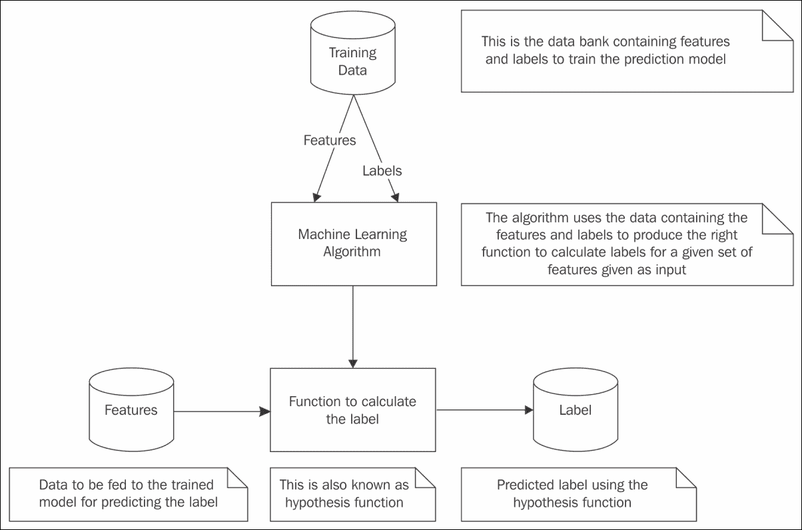

# 第七章：Spark 机器学习

自古以来，基于公式或算法的计算就被广泛用于根据给定输入求得输出。然而，在不了解这些公式或算法的情况下，计算机科学家和数学家设计了方法，通过现有的输入/输出数据集来生成公式或算法，并基于这些生成的公式或算法预测新输入数据的输出。通常，这种从数据集中学习并基于学习进行预测的过程被称为机器学习。机器学习起源于计算机科学中的人工智能研究。

实际的机器学习有众多应用，这些应用正被普通民众日常消费。YouTube 用户现在根据他们当前观看的视频获得播放列表中下一个项目的推荐。流行的电影评级网站根据用户对电影类型的偏好给出评级和推荐。社交媒体网站如 Facebook 会提供用户好友的名单，以便于图片标记。Facebook 在这里所做的是通过现有相册中已有的名称对图片进行分类，并检查新添加的图片是否与现有图片有任何相似之处。如果发现相似之处，它会推荐该名称。这种图片识别的应用是多方面的。所有这些应用的工作方式都是基于已经收集的大量输入/输出数据集以及基于这些数据集所进行的学习。当一个新的输入数据集到来时，通过利用计算机或机器已经完成的学习来进行预测。

本章我们将涵盖以下主题：

+   使用 Spark 进行机器学习

+   模型持久化

+   垃圾邮件过滤

+   特征算法

+   寻找同义词

# 理解机器学习

在传统计算中，输入数据被输入程序以生成输出。但在机器学习中，输入数据和输出数据被输入机器学习算法，以生成一个函数或程序，该函数或程序可以根据输入/输出数据集对机器学习算法的学习来预测输入的输出。

野外可用的数据可能被分类成组，可能形成集群，或者可能符合某些关系。这些都是不同类型的机器学习问题。例如，如果有一个二手汽车销售价格及其相关属性或特征的数据库，只需了解相关属性或特征，就有可能预测汽车的价格。回归算法用于解决这类问题。如果有一个垃圾邮件和非垃圾邮件的电子邮件数据库，那么当一封新电子邮件到来时，就有可能预测该新电子邮件是垃圾邮件还是非垃圾邮件。分类算法用于解决这类问题。

这些只是机器学习算法的几种类型。但一般来说，在使用数据集时，如果需要应用机器学习算法并使用该模型进行预测，则应将数据分为特征和输出。例如，在汽车价格预测问题中，价格是输出，以下是数据可能的一些特征：

+   汽车品牌

+   汽车型号

+   生产年份

+   里程

+   燃料类型

+   变速箱类型

因此，无论使用哪种机器学习算法，都会有一组特征和一个或多个输出。

### 注意

许多书籍和出版物使用*标签*一词来指代输出。换句话说，*特征*是输入，而*标签*是输出。

*图 1*展示了机器学习算法如何处理底层数据以实现预测。



图 1

数据以各种形式呈现。根据所使用的机器学习算法，训练数据必须经过预处理，以确保特征和标签以正确的格式输入到机器学习算法中。这反过来又生成了适当的假设函数，该函数以特征作为输入并产生预测标签。

### 提示

假设一词的词典定义是一种基于有限证据的假设或提议解释，作为进一步调查的起点。在这里，由机器学习算法生成的函数或程序基于有限的证据，即输入到机器学习算法的训练数据，因此它被广泛称为假设函数。

换句话说，这个假设函数并不是一个能始终对所有类型的输入数据产生一致结果的确定性函数。它更多是基于训练数据的函数。当新的数据添加到训练数据集中时，需要重新学习，届时生成的假设函数也会相应改变。

实际上，*图 1*所示流程并不像看起来那么简单。模型训练完成后，需要对模型进行大量测试，以使用已知标签测试预测。训练和测试过程的链条是一个迭代过程，每次迭代都会调整算法的参数以提高预测质量。一旦模型产生了可接受的测试结果，就可以将其部署到生产环境中以满足实时预测需求。Spark 自带的机器学习库功能丰富，使得实际应用机器学习成为可能。

# 为什么选择 Spark 进行机器学习？

前几章详细介绍了 Spark 的各种数据处理功能。Spark 的机器学习库不仅使用了 Spark 核心的许多功能，还使用了 Spark SQL 等 Spark 库。Spark 机器学习库通过在统一的框架中结合数据处理和机器学习算法实现，使得机器学习应用开发变得简单，该框架能够在集群节点上进行数据处理，并能够读写各种数据格式。

Spark 提供了两种机器学习库：`spark.mllib`和`spark.ml`。前者基于 Spark 的 RDD 抽象开发，后者基于 Spark 的 DataFrame 抽象开发。建议在未来的机器学习应用开发中使用 spark.ml 库。

本章将专注于 spark.ml 机器学习库。以下列表解释了本章中反复使用的术语和概念：

+   **估计器**：这是一种算法，它作用于包含特征和标签的 Spark DataFrame 之上。它对 Spark DataFrame 中提供的数据进行训练，并创建一个模型。该模型用于未来的预测。

+   **转换器**：它将包含特征的 Spark DataFrame 转换为包含预测的另一个 Spark DataFrame。由 Estimator 创建的模型就是一个 Transformer。

+   **参数**：这是供 Estimators 和 Transformers 使用的。通常，它特定于机器学习算法。Spark 机器学习库提供了一个统一的 API，用于为算法指定正确的参数。

+   **流水线**：这是一系列 Estimators 和 Transformers 协同工作，形成机器学习工作流程。

从理论角度看，这些新术语略显晦涩，但若辅以实例，概念便会清晰许多。

# 葡萄酒质量预测

加州大学欧文分校机器学习资料库（[`archive.ics.uci.edu/ml/index.html`](http://archive.ics.uci.edu/ml/index.html)）为对机器学习感兴趣的人提供了大量数据集。葡萄酒质量数据集（[`archive.ics.uci.edu/ml/datasets/Wine+Quality`](http://archive.ics.uci.edu/ml/datasets/Wine+Quality)）在此用于展示一些机器学习应用。它包含两个数据集，分别描述了葡萄牙白葡萄酒和红葡萄酒的各种特征。

### 注意

葡萄酒质量数据集下载链接允许您下载红葡萄酒和白葡萄酒的两个单独 CSV 文件。下载这些文件后，编辑两个数据集以删除包含列名的第一行标题。这是为了让程序无误地解析数值数据。为了专注于机器学习功能，故意避免了详细的错误处理和排除标题记录。

本案例中用于葡萄酒质量预测的数据集包含了红葡萄酒的各种特征。以下是数据集的特征：

+   固定酸度

+   挥发性酸度

+   柠檬酸

+   残余糖分

+   氯化物

+   游离二氧化硫

+   总二氧化硫

+   密度

+   pH

+   硫酸盐

+   酒精

基于这些特征，确定质量（分数介于 0 和 10 之间）。在这里，质量是此数据集的标签。使用此数据集，将训练一个模型，然后使用训练好的模型进行测试并做出预测。这是一个回归问题。使用线性回归算法来训练模型。线性回归算法生成一个线性假设函数。在数学术语中，线性函数是一次或更低次的多项式。在这个机器学习应用案例中，它涉及建模因变量（葡萄酒质量）和一组自变量（葡萄酒的特征）之间的关系。

在 Scala REPL 提示符下，尝试以下语句：

```scala
scala> import org.apache.spark.ml.regression.LinearRegression
      import org.apache.spark.ml.regression.LinearRegression

	scala> import org.apache.spark.ml.param.ParamMap

      import org.apache.spark.ml.param.ParamMap

	scala> import org.apache.spark.ml.linalg.{Vector, Vectors}

      import org.apache.spark.ml.linalg.{Vector, Vectors}

	scala> import org.apache.spark.sql.Row

      import org.apache.spark.sql.Row

	scala> // TODO - Change this directory to the right location where the data
    is stored
	scala> val dataDir = "/Users/RajT/Downloads/wine-quality/"

      dataDir: String = /Users/RajT/Downloads/wine-quality/

	scala> // Define the case class that holds the wine data
	scala> case class Wine(FixedAcidity: Double, VolatileAcidity: Double, CitricAcid: Double, ResidualSugar: Double, Chlorides: Double, FreeSulfurDioxide: Double, TotalSulfurDioxide: Double, Density: Double, PH: Double, Sulphates: Double, Alcohol: Double, Quality: Double)

      defined class Wine

	scala> // Create the the RDD by reading the wine data from the disk 
	scala> //TODO - The wine data has to be downloaded to the appropriate working directory in the system where this is being run and the following line of code should use that path
	scala> val wineDataRDD = sc.textFile(dataDir + "winequality-red.csv").map(_.split(";")).map(w => Wine(w(0).toDouble, w(1).toDouble, w(2).toDouble, w(3).toDouble, w(4).toDouble, w(5).toDouble, w(6).toDouble, w(7).toDouble, w(8).toDouble, w(9).toDouble, w(10).toDouble, w(11).toDouble))

      wineDataRDD: org.apache.spark.rdd.RDD[Wine] = MapPartitionsRDD[3] at map at <console>:32

	scala> // Create the data frame containing the training data having two columns. 1) The actual output or label of the data 2) The vector containing the features
	scala> //Vector is a data type with 0 based indices and double-typed values. In that there are two types namely dense and sparse.
	scala> //A dense vector is backed by a double array representing its entry values 
	scala> //A sparse vector is backed by two parallel arrays: indices and values
	scala> val trainingDF = wineDataRDD.map(w => (w.Quality, Vectors.dense(w.FixedAcidity, w.VolatileAcidity, w.CitricAcid, w.ResidualSugar, w.Chlorides, w.FreeSulfurDioxide, w.TotalSulfurDioxide, w.Density, w.PH, w.Sulphates, w.Alcohol))).toDF("label", "features")

      trainingDF: org.apache.spark.sql.DataFrame = [label: double, features: vector]
    scala> trainingDF.show()

      +-----+--------------------+

      |label|            features|

      +-----+--------------------+

      |  5.0|[7.4,0.7,0.0,1.9,...|

      |  5.0|[7.8,0.88,0.0,2.6...|

      |  5.0|[7.8,0.76,0.04,2....|

      |  6.0|[11.2,0.28,0.56,1...|

      |  5.0|[7.4,0.7,0.0,1.9,...|

      |  5.0|[7.4,0.66,0.0,1.8...|

      |  5.0|[7.9,0.6,0.06,1.6...|

      |  7.0|[7.3,0.65,0.0,1.2...|

      |  7.0|[7.8,0.58,0.02,2....|

      |  5.0|[7.5,0.5,0.36,6.1...|

      |  5.0|[6.7,0.58,0.08,1....|

      |  5.0|[7.5,0.5,0.36,6.1...|

      |  5.0|[5.6,0.615,0.0,1....|

      |  5.0|[7.8,0.61,0.29,1....|

      |  5.0|[8.9,0.62,0.18,3....|

      |  5.0|[8.9,0.62,0.19,3....|

      |  7.0|[8.5,0.28,0.56,1....|

      |  5.0|[8.1,0.56,0.28,1....|

      |  4.0|[7.4,0.59,0.08,4....|

      |  6.0|[7.9,0.32,0.51,1....|

      +-----+--------------------+

      only showing top 20 rows
    scala> // Create the object of the algorithm which is the Linear Regression
	scala> val lr = new LinearRegression()
      lr: org.apache.spark.ml.regression.LinearRegression = linReg_f810f0c1617b
    scala> // Linear regression parameter to make lr.fit() use at most 10 iterations
	scala> lr.setMaxIter(10)
      res1: lr.type = linReg_f810f0c1617b
    scala> // Create a trained model by fitting the parameters using the training data
	scala> val model = lr.fit(trainingDF)
      model: org.apache.spark.ml.regression.LinearRegressionModel = linReg_f810f0c1617b
    scala> // Once the model is prepared, to test the model, prepare the test data containing the labels and feature vectors
	scala> val testDF = spark.createDataFrame(Seq((5.0, Vectors.dense(7.4, 0.7, 0.0, 1.9, 0.076, 25.0, 67.0, 0.9968, 3.2, 0.68,9.8)),(5.0, Vectors.dense(7.8, 0.88, 0.0, 2.6, 0.098, 11.0, 34.0, 0.9978, 3.51, 0.56, 9.4)),(7.0, Vectors.dense(7.3, 0.65, 0.0, 1.2, 0.065, 15.0, 18.0, 0.9968, 3.36, 0.57, 9.5)))).toDF("label", "features")
      testDF: org.apache.spark.sql.DataFrame = [label: double, features: vector]
    scala> testDF.show()
      +-----+--------------------+

      |label|            features|

      +-----+--------------------+

      |  5.0|[7.4,0.7,0.0,1.9,...|

      |  5.0|[7.8,0.88,0.0,2.6...|

      |  7.0|[7.3,0.65,0.0,1.2...|

      +-----+--------------------+
    scala> testDF.createOrReplaceTempView("test")scala> // Do the transformation of the test data using the model and predict the output values or lables. This is to compare the predicted value and the actual label value
	scala> val tested = model.transform(testDF).select("features", "label", "prediction")
      tested: org.apache.spark.sql.DataFrame = [features: vector, label: double ... 1 more field]
    scala> tested.show()
      +--------------------+-----+-----------------+

      |            features|label|       prediction|

      +--------------------+-----+-----------------+

      |[7.4,0.7,0.0,1.9,...|  5.0|5.352730835898477|

      |[7.8,0.88,0.0,2.6...|  5.0|4.817999362011964|

      |[7.3,0.65,0.0,1.2...|  7.0|5.280106355653388|

      +--------------------+-----+-----------------+
    scala> // Prepare a dataset without the output/lables to predict the output using the trained model
	scala> val predictDF = spark.sql("SELECT features FROM test")predictDF: org.apache.spark.sql.DataFrame = [features: vector]
	scala> predictDF.show()
      +--------------------+

      |            features|

      +--------------------+

      |[7.4,0.7,0.0,1.9,...|

      |[7.8,0.88,0.0,2.6...|

      |[7.3,0.65,0.0,1.2...|

      +--------------------+
    scala> // Do the transformation with the predict dataset and display the predictions
	scala> val predicted = model.transform(predictDF).select("features", "prediction")
      predicted: org.apache.spark.sql.DataFrame = [features: vector, prediction: double]
    scala> predicted.show()
      +--------------------+-----------------+

      |            features|       prediction|

      +--------------------+-----------------+

      |7.4,0.7,0.0,1.9,...|5.352730835898477|

      |[7.8,0.88,0.0,2.6...|4.817999362011964|

      |[7.3,0.65,0.0,1.2...|5.280106355653388|

      +--------------------+-----------------+
    scala> //IMPORTANT - To continue with the model persistence coming in the next section, keep this session on.

```

上述代码做了很多事情。它在管道中执行以下一系列活动：

1.  它从数据文件读取葡萄酒数据以形成训练 DataFrame。

1.  然后创建一个`LinearRegression`对象并设置参数。

1.  它使用训练数据拟合模型，从而完成了估计器管道。

1.  它创建了一个包含测试数据的 DataFrame。通常，测试数据将同时包含特征和标签。这是为了确保模型的正确性，并用于比较预测标签和实际标签。

1.  使用创建的模型，它对测试数据进行转换，并从生成的 DataFrame 中提取特征、输入标签和预测结果。注意，在使用模型进行转换时，不需要标签。换句话说，标签将完全不被使用。

1.  使用创建的模型，它对预测数据进行转换，并从生成的 DataFrame 中提取特征和预测结果。注意，在使用模型进行转换时，不使用标签。换句话说，在进行预测时，不使用标签。这完成了转换器管道。

### 提示

上述代码片段中的管道是单阶段管道，因此无需使用 Pipeline 对象。多阶段管道将在后续部分讨论。

在实际应用中，拟合/测试阶段会迭代重复，直到模型在进行预测时给出期望的结果。图 2 通过代码阐明了演示的管道概念：

![葡萄酒质量预测

图 2

以下代码使用 Python 演示了相同的用例。在 Python REPL 提示符下，尝试以下语句：

```scala
 >>> from pyspark.ml.linalg import Vectors
	>>> from pyspark.ml.regression import LinearRegression
	>>> from pyspark.ml.param import Param, Params
	>>> from pyspark.sql import Row
	>>> # TODO - Change this directory to the right location where the data is stored
	>>> dataDir = "/Users/RajT/Downloads/wine-quality/"
	>>> # Create the the RDD by reading the wine data from the disk 
	>>> lines = sc.textFile(dataDir + "winequality-red.csv")
	>>> splitLines = lines.map(lambda l: l.split(";"))
	>>> # Vector is a data type with 0 based indices and double-typed values. In that there are two types namely dense and sparse.
	>>> # A dense vector is backed by a double array representing its entry values
	>>> # A sparse vector is backed by two parallel arrays: indices and values
	>>> wineDataRDD = splitLines.map(lambda p: (float(p[11]), Vectors.dense([float(p[0]), float(p[1]), float(p[2]), float(p[3]), float(p[4]), float(p[5]), float(p[6]), float(p[7]), float(p[8]), float(p[9]), float(p[10])])))
	>>> # Create the data frame containing the training data having two columns. 1) The actula output or label of the data 2) The vector containing the features
	>>> trainingDF = spark.createDataFrame(wineDataRDD, ['label', 'features'])
	>>> trainingDF.show()

      +-----+--------------------+

      |label|            features|

      +-----+--------------------+

      |  5.0|[7.4,0.7,0.0,1.9,...|

      |  5.0|[7.8,0.88,0.0,2.6...|

      |  5.0|[7.8,0.76,0.04,2....|

      |  6.0|[11.2,0.28,0.56,1...|

      |  5.0|[7.4,0.7,0.0,1.9,...|

      |  5.0|[7.4,0.66,0.0,1.8...|

      |  5.0|[7.9,0.6,0.06,1.6...|

      |  7.0|[7.3,0.65,0.0,1.2...|

      |  7.0|[7.8,0.58,0.02,2....|

      |  5.0|[7.5,0.5,0.36,6.1...|

      |  5.0|[6.7,0.58,0.08,1....|

      |  5.0|[7.5,0.5,0.36,6.1...|

      |  5.0|[5.6,0.615,0.0,1....|

      |  5.0|[7.8,0.61,0.29,1....|

      |  5.0|[8.9,0.62,0.18,3....|

      |  5.0|[8.9,0.62,0.19,3....|

      |  7.0|[8.5,0.28,0.56,1....|

      |  5.0|[8.1,0.56,0.28,1....|

      |  4.0|[7.4,0.59,0.08,4....|

      |  6.0|[7.9,0.32,0.51,1....|

      +-----+--------------------+

      only showing top 20 rows

	>>> # Create the object of the algorithm which is the Linear Regression with the parameters
	>>> # Linear regression parameter to make lr.fit() use at most 10 iterations
	>>> lr = LinearRegression(maxIter=10)
	>>> # Create a trained model by fitting the parameters using the training data
	>>> model = lr.fit(trainingDF)
	>>> # Once the model is prepared, to test the model, prepare the test data containing the labels and feature vectors 
	>>> testDF = spark.createDataFrame([(5.0, Vectors.dense([7.4, 0.7, 0.0, 1.9, 0.076, 25.0, 67.0, 0.9968, 3.2, 0.68,9.8])),(5.0,Vectors.dense([7.8, 0.88, 0.0, 2.6, 0.098, 11.0, 34.0, 0.9978, 3.51, 0.56, 9.4])),(7.0, Vectors.dense([7.3, 0.65, 0.0, 1.2, 0.065, 15.0, 18.0, 0.9968, 3.36, 0.57, 9.5]))], ["label", "features"])
	>>> testDF.createOrReplaceTempView("test")
	>>> testDF.show()

      +-----+--------------------+

      |label|            features|

      +-----+--------------------+

      |  5.0|[7.4,0.7,0.0,1.9,...|

      |  5.0|[7.8,0.88,0.0,2.6...|

      |  7.0|[7.3,0.65,0.0,1.2...|

      +-----+--------------------+
    >>> # Do the transformation of the test data using the model and predict the output values or lables. This is to compare the predicted value and the actual label value
	>>> testTransform = model.transform(testDF)
	>>> tested = testTransform.select("features", "label", "prediction")
	>>> tested.show()

      +--------------------+-----+-----------------+

      |            features|label|       prediction|

      +--------------------+-----+-----------------+

      |[7.4,0.7,0.0,1.9,...|  5.0|5.352730835898477|

      |[7.8,0.88,0.0,2.6...|  5.0|4.817999362011964|

      |[7.3,0.65,0.0,1.2...|  7.0|5.280106355653388|

      +--------------------+-----+-----------------+

	>>> # Prepare a dataset without the output/lables to predict the output using the trained model
	>>> predictDF = spark.sql("SELECT features FROM test")
	>>> predictDF.show()

      +--------------------+

      |            features|

      +--------------------+

      |[7.4,0.7,0.0,1.9,...|

      |[7.8,0.88,0.0,2.6...|

      |[7.3,0.65,0.0,1.2...|

      +--------------------+

	>>> # Do the transformation with the predict dataset and display the predictions
	>>> predictTransform = model.transform(predictDF)
	>>> predicted = predictTransform.select("features", "prediction")
	>>> predicted.show()

      +--------------------+-----------------+

      |            features|       prediction|

      +--------------------+-----------------+

      |[7.4,0.7,0.0,1.9,...|5.352730835898477|

      |[7.8,0.88,0.0,2.6...|4.817999362011964|

      |[7.3,0.65,0.0,1.2...|5.280106355653388|

      +--------------------+-----------------+

	>>> #IMPORTANT - To continue with the model persistence coming in the next section, keep this session on.

```

如前所述，线性回归是一种统计模型，用于模拟两种变量之间的关系。一种是自变量，另一种是因变量。因变量由自变量计算得出。在许多情况下，如果只有一个自变量，那么回归将是简单线性回归。但在现实世界的实际应用中，通常会有多个自变量，正如葡萄酒数据集所示。这属于多元线性回归的情况。不应将其与多元线性回归混淆。在多元回归中，预测的是多个且相关的因变量。

在讨论的用例中，预测仅针对一个变量，即葡萄酒的质量，因此这是一个多元线性回归问题，而不是多元线性回归问题。一些学校甚至将多元线性回归称为单变量线性回归。换句话说，无论自变量的数量如何，如果只有一个因变量，则称为单变量线性回归。

# 模型持久性

Spark 2.0 具有跨编程语言轻松保存和加载机器学习模型的能力。换句话说，您可以在 Scala 中创建一个机器学习模型，并在 Python 中加载它。这使我们能够在一个系统中创建模型，保存它，复制它，并在其他系统中使用它。继续使用相同的 Scala REPL 提示符，尝试以下语句：

```scala
 scala> // Assuming that the model definition line "val model = 
    lr.fit(trainingDF)" is still in context
	scala> import org.apache.spark.ml.regression.LinearRegressionModel

      import org.apache.spark.ml.regression.LinearRegressionModel

	scala> model.save("wineLRModelPath")
	scala> val newModel = LinearRegressionModel.load("wineLRModelPath")

      newModel: org.apache.spark.ml.regression.LinearRegressionModel = 
      linReg_6a880215ab96 

```

现在加载的模型可以用于测试或预测，就像原始模型一样。继续使用相同的 Python REPL 提示符，尝试以下语句以加载使用 Scala 程序保存的模型：

```scala
 >>> from pyspark.ml.regression import LinearRegressionModel
	>>> newModel = LinearRegressionModel.load("wineLRModelPath")
	>>> newPredictTransform = newModel.transform(predictDF) 
	>>> newPredicted = newPredictTransform.select("features", "prediction")
	>>> newPredicted.show()

      +--------------------+-----------------+

      |            features|       prediction|

      +--------------------+-----------------+

      |[7.4,0.7,0.0,1.9,...|5.352730835898477|

      |[7.8,0.88,0.0,2.6...|4.817999362011964|

      |[7.3,0.65,0.0,1.2...|5.280106355653388|

      +--------------------+-----------------+ 

```

# 葡萄酒分类

在此葡萄酒质量分类用例中，使用了包含白葡萄酒各种特征的数据集。以下是数据集的特征：

+   固定酸度

+   挥发性酸度

+   柠檬酸

+   残糖

+   氯化物

+   游离二氧化硫

+   总二氧化硫

+   密度

+   pH 值

+   硫酸盐

+   酒精

基于这些特征，确定质量（分数介于 0 和 10 之间）。如果质量低于 7，则将其归类为差，并将标签赋值为 0。如果质量为 7 或以上，则将其归类为好，并将标签赋值为 1。换句话说，分类值是此数据集的标签。使用此数据集，将训练一个模型，然后使用训练好的模型进行测试并做出预测。这是一个分类问题。使用逻辑回归算法来训练模型。在这个机器学习应用案例中，它涉及建模因变量（葡萄酒质量）与一组自变量（葡萄酒的特征）之间的关系。在 Scala REPL 提示符下，尝试以下语句：

```scala
	 scala> import org.apache.spark.ml.classification.LogisticRegression

      import org.apache.spark.ml.classification.LogisticRegression

	scala> import org.apache.spark.ml.param.ParamMap

      import org.apache.spark.ml.param.ParamMap

	scala> import org.apache.spark.ml.linalg.{Vector, Vectors}

      import org.apache.spark.ml.linalg.{Vector, Vectors}
    scala> import org.apache.spark.sql.Row

      import org.apache.spark.sql.Row

	scala> // TODO - Change this directory to the right location where the data is stored
	scala> val dataDir = "/Users/RajT/Downloads/wine-quality/"

      dataDir: String = /Users/RajT/Downloads/wine-quality/

	scala> // Define the case class that holds the wine data
	scala> case class Wine(FixedAcidity: Double, VolatileAcidity: Double, CitricAcid: Double, ResidualSugar: Double, Chlorides: Double, FreeSulfurDioxide: Double, TotalSulfurDioxide: Double, Density: Double, PH: Double, Sulphates: Double, Alcohol: Double, Quality: Double)

      defined class Wine

	scala> // Create the the RDD by reading the wine data from the disk 
	scala> val wineDataRDD = sc.textFile(dataDir + "winequality-white.csv").map(_.split(";")).map(w => Wine(w(0).toDouble, w(1).toDouble, w(2).toDouble, w(3).toDouble, w(4).toDouble, w(5).toDouble, w(6).toDouble, w(7).toDouble, w(8).toDouble, w(9).toDouble, w(10).toDouble, w(11).toDouble))

      wineDataRDD: org.apache.spark.rdd.RDD[Wine] = MapPartitionsRDD[35] at map at <console>:36

	scala> // Create the data frame containing the training data having two columns. 1) The actula output or label of the data 2) The vector containing the features
	scala> val trainingDF = wineDataRDD.map(w => (if(w.Quality < 7) 0D else 1D, Vectors.dense(w.FixedAcidity, w.VolatileAcidity, w.CitricAcid, w.ResidualSugar, w.Chlorides, w.FreeSulfurDioxide, w.TotalSulfurDioxide, w.Density, w.PH, w.Sulphates, w.Alcohol))).toDF("label", "features")

      trainingDF: org.apache.spark.sql.DataFrame = [label: double, features: vector]

	scala> trainingDF.show()

      +-----+--------------------+

      |label|            features|

      +-----+--------------------+

      |  0.0|[7.0,0.27,0.36,20...|

      |  0.0|[6.3,0.3,0.34,1.6...|

      |  0.0|[8.1,0.28,0.4,6.9...|

      |  0.0|[7.2,0.23,0.32,8....|

      |  0.0|[7.2,0.23,0.32,8....|

      |  0.0|[8.1,0.28,0.4,6.9...|

      |  0.0|[6.2,0.32,0.16,7....|

      |  0.0|[7.0,0.27,0.36,20...|

      |  0.0|[6.3,0.3,0.34,1.6...|

      |  0.0|[8.1,0.22,0.43,1....|

      |  0.0|[8.1,0.27,0.41,1....|

      |  0.0|[8.6,0.23,0.4,4.2...|

      |  0.0|[7.9,0.18,0.37,1....|

      |  1.0|[6.6,0.16,0.4,1.5...|

      |  0.0|[8.3,0.42,0.62,19...|

      |  1.0|[6.6,0.17,0.38,1....|

      |  0.0|[6.3,0.48,0.04,1....|

      |  1.0|[6.2,0.66,0.48,1....|

      |  0.0|[7.4,0.34,0.42,1....|

      |  0.0|[6.5,0.31,0.14,7....|

      +-----+--------------------+

      only showing top 20 rows

	scala> // Create the object of the algorithm which is the Logistic Regression
	scala> val lr = new LogisticRegression()

      lr: org.apache.spark.ml.classification.LogisticRegression = logreg_a7e219daf3e1

	scala> // LogisticRegression parameter to make lr.fit() use at most 10 iterations and the regularization parameter.
	scala> // When a higher degree polynomial used by the algorithm to fit a set of points in a linear regression model, to prevent overfitting, regularization is used and this parameter is just for that
	scala> lr.setMaxIter(10).setRegParam(0.01)

      res8: lr.type = logreg_a7e219daf3e1

	scala> // Create a trained model by fitting the parameters using the training data
	scala> val model = lr.fit(trainingDF)

      model: org.apache.spark.ml.classification.LogisticRegressionModel = logreg_a7e219daf3e1

	scala> // Once the model is prepared, to test the model, prepare the test data containing the labels and feature vectors
	scala> val testDF = spark.createDataFrame(Seq((1.0, Vectors.dense(6.1,0.32,0.24,1.5,0.036,43,140,0.9894,3.36,0.64,10.7)),(0.0, Vectors.dense(5.2,0.44,0.04,1.4,0.036,38,124,0.9898,3.29,0.42,12.4)),(0.0, Vectors.dense(7.2,0.32,0.47,5.1,0.044,19,65,0.9951,3.38,0.36,9)),(0.0,Vectors.dense(6.4,0.595,0.14,5.2,0.058,15,97,0.991,3.03,0.41,12.6)))).toDF("label", "features")

      testDF: org.apache.spark.sql.DataFrame = [label: double, features: vector]

	scala> testDF.show()

      +-----+--------------------+

      |label|            features|

      +-----+--------------------+

      |  1.0|[6.1,0.32,0.24,1....|

      |  0.0|[5.2,0.44,0.04,1....|

      |  0.0|[7.2,0.32,0.47,5....|

      |  0.0|[6.4,0.595,0.14,5...|

      +-----+--------------------+
    scala> testDF.createOrReplaceTempView("test")
	scala> // Do the transformation of the test data using the model and predict the output values or labels. This is to compare the predicted value and the actual label value
	scala> val tested = model.transform(testDF).select("features", "label", "prediction")
      tested: org.apache.spark.sql.DataFrame = [features: vector, label: double ... 1 more field]

	scala> tested.show()
      +--------------------+-----+----------+

      |            features|label|prediction|

      +--------------------+-----+----------+

      |[6.1,0.32,0.24,1....|  1.0|       0.0|

      |[5.2,0.44,0.04,1....|  0.0|       0.0|

      |[7.2,0.32,0.47,5....|  0.0|       0.0|

      |[6.4,0.595,0.14,5...|  0.0|       0.0|

      +--------------------+-----+----------+

	scala> // Prepare a dataset without the output/lables to predict the output using the trained model
	scala> val predictDF = spark.sql("SELECT features FROM test")

      predictDF: org.apache.spark.sql.DataFrame = [features: vector]

	scala> predictDF.show()

      +--------------------+

      |            features|

      +--------------------+

      |[6.1,0.32,0.24,1....|

      |[5.2,0.44,0.04,1....|

      |[7.2,0.32,0.47,5....|

      |[6.4,0.595,0.14,5...|

      +--------------------+

	scala> // Do the transformation with the predict dataset and display the predictions
	scala> val predicted = model.transform(predictDF).select("features", "prediction")

      predicted: org.apache.spark.sql.DataFrame = [features: vector, prediction: double]

	scala> predicted.show()

      +--------------------+----------+

      |            features|prediction|

      +--------------------+----------+

      |[6.1,0.32,0.24,1....|       0.0|

      |[5.2,0.44,0.04,1....|       0.0|

      |[7.2,0.32,0.47,5....|       0.0|

      |[6.4,0.595,0.14,5...|       0.0|

      +--------------------+----------+ 

```

上述代码片段的工作原理与线性回归用例完全相同，只是所用的模型不同。此处使用的模型是逻辑回归，其标签仅取两个值，0 和 1。创建模型、测试模型以及进行预测的过程在此都非常相似。换句话说，流程看起来非常相似。

以下代码使用 Python 演示了相同的用例。在 Python REPL 提示符下，尝试以下语句：

```scala
 >>> from pyspark.ml.linalg import Vectors
	  >>> from pyspark.ml.classification import LogisticRegression
	  >>> from pyspark.ml.param import Param, Params
	  >>> from pyspark.sql import Row
	  >>> # TODO - Change this directory to the right location where the data is stored
	  >>> dataDir = "/Users/RajT/Downloads/wine-quality/"
	  >>> # Create the the RDD by reading the wine data from the disk 
	  >>> lines = sc.textFile(dataDir + "winequality-white.csv")
	  >>> splitLines = lines.map(lambda l: l.split(";"))
	  >>> wineDataRDD = splitLines.map(lambda p: (float(0) if (float(p[11]) < 7) else float(1), Vectors.dense([float(p[0]), float(p[1]), float(p[2]), float(p[3]), float(p[4]), float(p[5]), float(p[6]), float(p[7]), float(p[8]), float(p[9]), float(p[10])])))
	  >>> # Create the data frame containing the training data having two columns. 1) The actula output or label of the data 2) The vector containing the features
	  >>> trainingDF = spark.createDataFrame(wineDataRDD, ['label', 'features'])
	  >>> trainingDF.show()
	  +-----+--------------------+
	  |label|            features|

      +-----+--------------------+

      |  0.0|[7.0,0.27,0.36,20...|

      |  0.0|[6.3,0.3,0.34,1.6...|

      |  0.0|[8.1,0.28,0.4,6.9...|

      |  0.0|[7.2,0.23,0.32,8....|

      |  0.0|[7.2,0.23,0.32,8....|

      |  0.0|[8.1,0.28,0.4,6.9...|

      |  0.0|[6.2,0.32,0.16,7....|

      |  0.0|[7.0,0.27,0.36,20...|

      |  0.0|[6.3,0.3,0.34,1.6...|

      |  0.0|[8.1,0.22,0.43,1....|

      |  0.0|[8.1,0.27,0.41,1....|

      |  0.0|[8.6,0.23,0.4,4.2...|

      |  0.0|[7.9,0.18,0.37,1....|

      |  1.0|[6.6,0.16,0.4,1.5...|

      |  0.0|[8.3,0.42,0.62,19...|

      |  1.0|[6.6,0.17,0.38,1....|

      |  0.0|[6.3,0.48,0.04,1....|

      |  1.0|[6.2,0.66,0.48,1....|

      |  0.0|[7.4,0.34,0.42,1....|

      |  0.0|[6.5,0.31,0.14,7....|

      +-----+--------------------+

      only showing top 20 rows

	>>> # Create the object of the algorithm which is the Logistic Regression with the parameters
	>>> # LogisticRegression parameter to make lr.fit() use at most 10 iterations and the regularization parameter.
	>>> # When a higher degree polynomial used by the algorithm to fit a set of points in a linear regression model, to prevent overfitting, regularization is used and this parameter is just for that
	>>> lr = LogisticRegression(maxIter=10, regParam=0.01)
	>>> # Create a trained model by fitting the parameters using the training data>>> model = lr.fit(trainingDF)
	>>> # Once the model is prepared, to test the model, prepare the test data containing the labels and feature vectors
	>>> testDF = spark.createDataFrame([(1.0, Vectors.dense([6.1,0.32,0.24,1.5,0.036,43,140,0.9894,3.36,0.64,10.7])),(0.0, Vectors.dense([5.2,0.44,0.04,1.4,0.036,38,124,0.9898,3.29,0.42,12.4])),(0.0, Vectors.dense([7.2,0.32,0.47,5.1,0.044,19,65,0.9951,3.38,0.36,9])),(0.0, Vectors.dense([6.4,0.595,0.14,5.2,0.058,15,97,0.991,3.03,0.41,12.6]))], ["label", "features"])
	>>> testDF.createOrReplaceTempView("test")
	>>> testDF.show()

      +-----+--------------------+

      |label|            features|

      +-----+--------------------+

      |  1.0|[6.1,0.32,0.24,1....|

      |  0.0|[5.2,0.44,0.04,1....|

      |  0.0|[7.2,0.32,0.47,5....|

      |  0.0|[6.4,0.595,0.14,5...|

      +-----+--------------------+

	>>> # Do the transformation of the test data using the model and predict the output values or lables. This is to compare the predicted value and the actual label value
	>>> testTransform = model.transform(testDF)
	>>> tested = testTransform.select("features", "label", "prediction")
	>>> tested.show()

      +--------------------+-----+----------+

      |            features|label|prediction|

      +--------------------+-----+----------+

      |[6.1,0.32,0.24,1....|  1.0|       0.0|

      |[5.2,0.44,0.04,1....|  0.0|       0.0|

      |[7.2,0.32,0.47,5....|  0.0|       0.0|

      |[6.4,0.595,0.14,5...|  0.0|       0.0|

      +--------------------+-----+----------+

	>>> # Prepare a dataset without the output/lables to predict the output using the trained model
	>>> predictDF = spark.sql("SELECT features FROM test")
	>>> predictDF.show()

      +--------------------+

      |            features|

      +--------------------+

      |[6.1,0.32,0.24,1....|

      |[5.2,0.44,0.04,1....|

      |[7.2,0.32,0.47,5....|

      |[6.4,0.595,0.14,5...|

      +--------------------+

	>>> # Do the transformation with the predict dataset and display the predictions
	>>> predictTransform = model.transform(predictDF)
	>>> predicted = testTransform.select("features", "prediction")
	>>> predicted.show()
      +--------------------+----------+

      |            features|prediction|

      +--------------------+----------+

      |[6.1,0.32,0.24,1....|       0.0|

      |[5.2,0.44,0.04,1....|       0.0|

      |[7.2,0.32,0.47,5....|       0.0|

      |[6.4,0.595,0.14,5...|       0.0|

      +--------------------+----------+

```

逻辑回归与线性回归非常相似。逻辑回归的主要区别在于其因变量是分类变量。换句话说，因变量仅取一组选定值。在本用例中，这些值为 0 或 1。值 0 表示葡萄酒质量差，值 1 表示葡萄酒质量好。更准确地说，此处使用的因变量是二元因变量。

到目前为止所涵盖的用例仅涉及少量特征。但在现实世界的用例中，特征数量将非常庞大，尤其是在涉及大量文本处理的机器学习用例中。下一节将讨论这样一个用例。

# 垃圾邮件过滤

垃圾邮件过滤是一个极为常见的用例，广泛应用于多种应用中，尤其在电子邮件应用中无处不在。它是使用最广泛的分类问题之一。在典型的邮件服务器中，会处理大量的电子邮件。垃圾邮件过滤在邮件送达收件人邮箱之前进行。对于任何机器学习算法，在做出预测之前必须先训练模型。训练模型需要训练数据。训练数据是如何收集的呢？一个简单的方法是用户自行将收到的部分邮件标记为垃圾邮件。使用邮件服务器中的所有邮件作为训练数据，并定期更新模型。这包括垃圾邮件和非垃圾邮件。当模型拥有两类邮件的良好样本时，预测效果将会很好。

此处介绍的垃圾邮件过滤用例并非一个完全成熟的生产就绪应用程序，但它提供了构建此类应用的良好洞见。在此，为了简化，我们仅使用电子邮件中的一行文本，而非整封邮件内容。若要扩展至处理真实邮件，则需将整封邮件内容读取为一个字符串，并按照本应用中的逻辑进行处理。

与本章前面用例中涉及的数值特征不同，这里的输入是纯文本，选择特征并不像那些用例那样简单。文本被分割成单词以形成词袋，单词被选作特征。由于处理数值特征较为容易，这些单词被转换为哈希词频向量。换句话说，文本行中的单词或术语序列通过哈希方法转换为其词频。因此，即使在小型文本处理用例中，也会有数千个特征。这就是为什么需要对它们进行哈希处理以便于比较。

如前所述，在典型的机器学习应用程序中，输入数据需要经过大量预处理才能将其转换为正确的特征和标签形式，以便构建模型。这通常形成一个转换和估计的管道。在这个用例中，传入的文本行被分割成单词，这些单词使用 HashingTF 算法进行转换，然后训练一个 LogisticRegression 模型进行预测。这是使用 Spark 机器学习库中的 Pipeline 抽象完成的。在 Scala REPL 提示符下，尝试以下语句：

```scala
 scala> import org.apache.spark.ml.classification.LogisticRegression

      import org.apache.spark.ml.classification.LogisticRegression

	scala> import org.apache.spark.ml.param.ParamMap

      import org.apache.spark.ml.param.ParamMap

	scala> import org.apache.spark.ml.linalg.{Vector, Vectors}

      import org.apache.spark.ml.linalg.{Vector, Vectors}

	scala> import org.apache.spark.sql.Row

      import org.apache.spark.sql.Row

	scala> import org.apache.spark.ml.Pipeline

      import org.apache.spark.ml.Pipeline

	scala> import org.apache.spark.ml.feature.{HashingTF, Tokenizer, RegexTokenizer, Word2Vec, StopWordsRemover}

      import org.apache.spark.ml.feature.{HashingTF, Tokenizer, RegexTokenizer, Word2Vec, StopWordsRemover}

	scala> // Prepare training documents from a list of messages from emails used to filter them as spam or not spam
	scala> // If the original message is a spam then the label is 1 and if the message is genuine then the label is 0
	scala> val training = spark.createDataFrame(Seq(("you@example.com", "hope you are well", 0.0),("raj@example.com", "nice to hear from you", 0.0),("thomas@example.com", "happy holidays", 0.0),("mark@example.com", "see you tomorrow", 0.0),("xyz@example.com", "save money", 1.0),("top10@example.com", "low interest rate", 1.0),("marketing@example.com", "cheap loan", 1.0))).toDF("email", "message", "label")

      training: org.apache.spark.sql.DataFrame = [email: string, message: string ... 1 more field]

	scala> training.show()

      +--------------------+--------------------+-----+

      |               email|             message|label|

      +--------------------+--------------------+-----+

      |     you@example.com|   hope you are well|  0.0|

      |     raj@example.com|nice to hear from...|  0.0|

      |  thomas@example.com|      happy holidays|  0.0|

      |    mark@example.com|    see you tomorrow|  0.0|

      |     xyz@example.com|          save money|  1.0|

      |   top10@example.com|   low interest rate|  1.0|

      |marketing@example...|          cheap loan|  1.0|

      +--------------------+--------------------+-----+

	scala>  // Configure an Spark machine learning pipeline, consisting of three stages: tokenizer, hashingTF, and lr.
	scala> val tokenizer = new Tokenizer().setInputCol("message").setOutputCol("words")

      tokenizer: org.apache.spark.ml.feature.Tokenizer = tok_166809bf629c

	scala> val hashingTF = new HashingTF().setNumFeatures(1000).setInputCol("words").setOutputCol("features")

      hashingTF: org.apache.spark.ml.feature.HashingTF = hashingTF_e43616e13d19

	scala> // LogisticRegression parameter to make lr.fit() use at most 10 iterations and the regularization parameter.
	scala> // When a higher degree polynomial used by the algorithm to fit a set of points in a linear regression model, to prevent overfitting, regularization is used and this parameter is just for that
	scala> val lr = new LogisticRegression().setMaxIter(10).setRegParam(0.01)

      lr: org.apache.spark.ml.classification.LogisticRegression = logreg_ef3042fc75a3

	scala> val pipeline = new Pipeline().setStages(Array(tokenizer, hashingTF, lr))

      pipeline: org.apache.spark.ml.Pipeline = pipeline_658b5edef0f2

	scala> // Fit the pipeline to train the model to study the messages
	scala> val model = pipeline.fit(training)

      model: org.apache.spark.ml.PipelineModel = pipeline_658b5edef0f2

	scala> // Prepare messages for prediction, which are not categorized and leaving upto the algorithm to predict
	scala> val test = spark.createDataFrame(Seq(("you@example.com", "how are you"),("jain@example.com", "hope doing well"),("caren@example.com", "want some money"),("zhou@example.com", "secure loan"),("ted@example.com","need loan"))).toDF("email", "message")

      test: org.apache.spark.sql.DataFrame = [email: string, message: string]

	scala> test.show()

      +-----------------+---------------+

      |            email|        message|

      +-----------------+---------------+

      |  you@example.com|    how are you|

      | jain@example.com|hope doing well|

      |caren@example.com|want some money|

      | zhou@example.com|    secure loan|

      |  ted@example.com|      need loan|

      +-----------------+---------------+

	scala> // Make predictions on the new messages
	scala> val prediction = model.transform(test).select("email", "message", "prediction")

      prediction: org.apache.spark.sql.DataFrame = [email: string, message: string ... 1 more field]

	scala> prediction.show()

      +-----------------+---------------+----------+

      |            email|        message|prediction|

      +-----------------+---------------+----------+

      |  you@example.com|    how are you|       0.0|

      | jain@example.com|hope doing well|       0.0|

      |caren@example.com|want some money|       1.0|

      | zhou@example.com|    secure loan|       1.0|

      |  ted@example.com|      need loan|       1.0|

      +-----------------+---------------+----------+ 

```

前面的代码片段执行了典型的活动链：准备训练数据，使用 Pipeline 抽象创建模型，然后使用测试数据进行预测。它没有揭示特征是如何创建和处理的。从应用程序开发的角度来看，Spark 机器学习库承担了繁重的工作，并使用 Pipeline 抽象在幕后完成所有工作。如果不使用 Pipeline 方法，则需要将分词和哈希作为单独的 DataFrame 转换来完成。以下代码片段作为前面命令的延续执行，将提供一个洞察，了解如何通过简单的转换来直观地查看特征：

```scala
 scala> val wordsDF = tokenizer.transform(training)

      wordsDF: org.apache.spark.sql.DataFrame = [email: string, message: string ... 2 more fields]

	scala> wordsDF.createOrReplaceTempView("word")
	scala> val selectedFieldstDF = spark.sql("SELECT message, words FROM word")

      selectedFieldstDF: org.apache.spark.sql.DataFrame = [message: string, words: array<string>]

	scala> selectedFieldstDF.show()

      +--------------------+--------------------+

      |             message|               words|

      +--------------------+--------------------+

      |   hope you are well|[hope, you, are, ...|

      |nice to hear from...|[nice, to, hear, ...|

      |      happy holidays|   [happy, holidays]|

      |    see you tomorrow|[see, you, tomorrow]|

      |          save money|       [save, money]|

      |   low interest rate|[low, interest, r...|

      |          cheap loan|       [cheap, loan]|

      +--------------------+--------------------+
    scala> val featurizedDF = hashingTF.transform(wordsDF)

      featurizedDF: org.apache.spark.sql.DataFrame = [email: string, message: string ... 3 more fields]

	scala> featurizedDF.createOrReplaceTempView("featurized")
	scala> val selectedFeaturizedFieldstDF = spark.sql("SELECT words, features FROM featurized")

      selectedFeaturizedFieldstDF: org.apache.spark.sql.DataFrame = [words: array<string>, features: vector]

	scala> selectedFeaturizedFieldstDF.show()

      +--------------------+--------------------+

      |               words|            features|

      +--------------------+--------------------+

      |[hope, you, are, ...|(1000,[0,138,157,...|

      |[nice, to, hear, ...|(1000,[370,388,42...|

      |   [happy, holidays]|(1000,[141,457],[...|

      |[see, you, tomorrow]|(1000,[25,425,515...|

      |       [save, money]|(1000,[242,520],[...|

      |[low, interest, r...|(1000,[70,253,618...|

      |       [cheap, loan]|(1000,[410,666],[...| 
	 +--------------------+--------------------+ 

```

在 Python 中实现的相同用例如下。在 Python REPL 提示符下，尝试以下语句：

```scala
	  >>> from pyspark.ml import Pipeline
	  >>> from pyspark.ml.classification import LogisticRegression
	  >>> from pyspark.ml.feature import HashingTF, Tokenizer
	  >>> from pyspark.sql import Row
	  >>> # Prepare training documents from a list of messages from emails used to filter them as spam or not spam
	  >>> # If the original message is a spam then the label is 1 and if the message is genuine then the label is 0
	  >>> LabeledDocument = Row("email", "message", "label")
	  >>> training = spark.createDataFrame([("you@example.com", "hope you are well", 0.0),("raj@example.com", "nice to hear from you", 0.0),("thomas@example.com", "happy holidays", 0.0),("mark@example.com", "see you tomorrow", 0.0),("xyz@example.com", "save money", 1.0),("top10@example.com", "low interest rate", 1.0),("marketing@example.com", "cheap loan", 1.0)], ["email", "message", "label"])
	  >>> training.show()

      +--------------------+--------------------+-----+

      |               email|             message|label|

      +--------------------+--------------------+-----+

      |     you@example.com|   hope you are well|  0.0|

      |     raj@example.com|nice to hear from...|  0.0|

      |  thomas@example.com|      happy holidays|  0.0|

      |    mark@example.com|    see you tomorrow|  0.0|

      |     xyz@example.com|          save money|  1.0|

      |   top10@example.com|   low interest rate|  1.0|

      |marketing@example...|          cheap loan|  1.0|

      +--------------------+--------------------+-----+

	>>> # Configure an Spark machin learning pipeline, consisting of three stages: tokenizer, hashingTF, and lr.
	>>> tokenizer = Tokenizer(inputCol="message", outputCol="words")
	>>> hashingTF = HashingTF(inputCol="words", outputCol="features")
	>>> # LogisticRegression parameter to make lr.fit() use at most 10 iterations and the regularization parameter.
	>>> # When a higher degree polynomial used by the algorithm to fit a set of points in a linear regression model, to prevent overfitting, regularization is used and this parameter is just for that
	>>> lr = LogisticRegression(maxIter=10, regParam=0.01)
	>>> pipeline = Pipeline(stages=[tokenizer, hashingTF, lr])
	>>> # Fit the pipeline to train the model to study the messages
	>>> model = pipeline.fit(training)
	>>> # Prepare messages for prediction, which are not categorized and leaving upto the algorithm to predict
	>>> test = spark.createDataFrame([("you@example.com", "how are you"),("jain@example.com", "hope doing well"),("caren@example.com", "want some money"),("zhou@example.com", "secure loan"),("ted@example.com","need loan")], ["email", "message"])
	>>> test.show()

      +-----------------+---------------+

      |            email|        message|

      +-----------------+---------------+

      |  you@example.com|    how are you|

      | jain@example.com|hope doing well|

      |caren@example.com|want some money|

      | zhou@example.com|    secure loan|

      |  ted@example.com|      need loan|

      +-----------------+---------------+

	>>> # Make predictions on the new messages
	>>> prediction = model.transform(test).select("email", "message", "prediction")
	>>> prediction.show()

      +-----------------+---------------+----------+

      |            email|        message|prediction|

      +-----------------+---------------+----------+

      |  you@example.com|    how are you|       0.0|

      | jain@example.com|hope doing well|       0.0|

      |caren@example.com|want some money|       1.0|

      | zhou@example.com|    secure loan|       1.0|

      |  ted@example.com|      need loan|       1.0|    

      +-----------------+---------------+----------+ 

```

如前所述，Pipeline 抽象的转换在 Python 中明确阐述如下。以下代码片段作为前面命令的延续执行，将提供一个洞察，了解如何通过简单的转换来直观地查看特征：

```scala
	  >>> wordsDF = tokenizer.transform(training)
	  >>> wordsDF.createOrReplaceTempView("word")
	  >>> selectedFieldstDF = spark.sql("SELECT message, words FROM word")
	  >>> selectedFieldstDF.show()

      +--------------------+--------------------+

      |             message|               words|

      +--------------------+--------------------+

      |   hope you are well|[hope, you, are, ...|

      |nice to hear from...|[nice, to, hear, ...|

      |      happy holidays|   [happy, holidays]|

      |    see you tomorrow|[see, you, tomorrow]|

      |          save money|       [save, money]|

      |   low interest rate|[low, interest, r...|

      |          cheap loan|       [cheap, loan]|

      +--------------------+--------------------+

	>>> featurizedDF = hashingTF.transform(wordsDF)
	>>> featurizedDF.createOrReplaceTempView("featurized")
	>>> selectedFeaturizedFieldstDF = spark.sql("SELECT words, features FROM featurized")
	>>> selectedFeaturizedFieldstDF.show()

      +--------------------+--------------------+

      |               words|            features|

      +--------------------+--------------------+

      |[hope, you, are, ...|(262144,[128160,1...|

      |[nice, to, hear, ...|(262144,[22346,10...|

      |   [happy, holidays]|(262144,[86293,23...|

      |[see, you, tomorrow]|(262144,[29129,21...|

      |       [save, money]|(262144,[199496,2...|

      |[low, interest, r...|(262144,[68685,13...|

      |       [cheap, loan]|(262144,[12946,16...|

      +--------------------+--------------------+

```

基于前面用例中提供的洞察，可以通过抽象掉许多转换来使用 Spark 机器学习库 Pipelines 开发大量的文本处理机器学习应用程序。

### 提示

正如机器学习模型可以持久化到介质一样，所有 Spark 机器学习库 Pipelines 也可以持久化到介质，并由其他程序重新加载。

# 特征算法

在现实世界的用例中，要获得适合特征和标签形式的原始数据以训练模型并不容易。进行大量预处理是很常见的。与其他数据处理范式不同，Spark 与 Spark 机器学习库结合提供了一套全面的工具和算法来实现这一目的。这些预处理算法可以分为三类：

+   特征提取

+   特征转换

+   特征选择

从原始数据中提取特征的过程称为特征提取。在前述用例中使用的 HashingTF 就是一个很好的例子，它是一种将文本数据的术语转换为特征向量的算法。将特征转换为不同格式的过程称为特征转换。从超集中选择特征子集的过程称为特征选择。涵盖所有这些内容超出了本章的范围，但下一节将讨论一个 Estimator，它是一种用于提取特征的算法，用于在文档中查找单词的同义词。这些并不是单词的实际同义词，而是在给定上下文中与某个单词相关的单词。

# 查找同义词

同义词是指与另一个单词具有完全相同或非常接近意义的单词或短语。从纯粹的文学角度来看，这个解释是正确的，但从更广泛的角度来看，在给定的上下文中，一些单词之间会有非常密切的关系，这种关系在这个上下文中也被称为同义词。例如，罗杰·费德勒与网球*同义*。在上下文中找到这种同义词是实体识别、机器翻译等领域非常常见的需求。**Word2Vec**算法从给定文档或单词集合的单词中计算出单词的分布式向量表示。如果采用这个向量空间，具有相似性或同义性的单词将彼此接近。

加州大学欧文分校机器学习库([`archive.ics.uci.edu/ml/index.html`](http://archive.ics.uci.edu/ml/index.html))为那些对机器学习感兴趣的人提供了大量数据集。Twenty Newsgroups 数据集([`archive.ics.uci.edu/ml/datasets/Twenty+Newsgroups`](http://archive.ics.uci.edu/ml/datasets/Twenty+Newsgroups))被用于在上下文中查找单词的同义词。它包含一个由 20 个新闻组中的 20,000 条消息组成的数据集。

### 注意

二十个新闻组数据集下载链接允许您下载此处讨论的数据集。文件 `20_newsgroups.tar.gz` 需要下载并解压缩。以下代码片段中使用的数据目录应指向数据以解压缩形式可用的目录。如果 Spark 驱动程序因数据量巨大而出现内存不足错误，请删除一些不感兴趣的新闻组数据，并对数据子集进行实验。在这里，为了训练模型，仅使用了以下新闻组数据：talk.politics.guns、talk.politics.mideast、talk.politics.misc 和 talk.religion.misc。

在 Scala REPL 提示符下，尝试以下语句：

```scala

	  scala> import org.apache.spark.ml.feature.{HashingTF, Tokenizer, RegexTokenizer, Word2Vec, StopWordsRemover}

      import org.apache.spark.ml.feature.{HashingTF, Tokenizer, RegexTokenizer, Word2Vec, StopWordsRemover}

	scala> // TODO - Change this directory to the right location where the data is stored
	scala> val dataDir = "/Users/RajT/Downloads/20_newsgroups/*"

      dataDir: String = /Users/RajT/Downloads/20_newsgroups/*

	scala> //Read the entire text into a DataFrame
	scala> // Only the following directories under the data directory has benn considered for running this program talk.politics.guns, talk.politics.mideast, talk.politics.misc, talk.religion.misc. All other directories have been removed before running this program. There is no harm in retaining all the data. The only difference will be in the output.
	scala>  val textDF = sc.wholeTextFiles(dataDir).map{case(file, text) => text}.map(Tuple1.apply).toDF("sentence")

      textDF: org.apache.spark.sql.DataFrame = [sentence: string]

	scala>  // Tokenize the sentences to words
	scala>  val regexTokenizer = new RegexTokenizer().setInputCol("sentence").setOutputCol("words").setPattern("\\w+").setGaps(false)

      regexTokenizer: org.apache.spark.ml.feature.RegexTokenizer = regexTok_ba7ce8ec2333

	scala> val tokenizedDF = regexTokenizer.transform(textDF)

      tokenizedDF: org.apache.spark.sql.DataFrame = [sentence: string, words: array<string>]

	scala>  // Remove the stop words such as a, an the, I etc which doesn't have any specific relevance to the synonyms
	scala> val remover = new StopWordsRemover().setInputCol("words").setOutputCol("filtered")

      remover: org.apache.spark.ml.feature.StopWordsRemover = stopWords_775db995b8e8

	scala> //Remove the stop words from the text
	scala> val filteredDF = remover.transform(tokenizedDF)

      filteredDF: org.apache.spark.sql.DataFrame = [sentence: string, words: array<string> ... 1 more field]

	scala> //Prepare the Estimator
	scala> //It sets the vector size, and the method setMinCount sets the minimum number of times a token must appear to be included in the word2vec model's vocabulary.
	scala> val word2Vec = new Word2Vec().setInputCol("filtered").setOutputCol("result").setVectorSize(3).setMinCount(0)

      word2Vec: org.apache.spark.ml.feature.Word2Vec = w2v_bb03091c4439

	scala> //Train the model
	scala> val model = word2Vec.fit(filteredDF)

      model: org.apache.spark.ml.feature.Word2VecModel = w2v_bb03091c4439   

	scala> //Find 10 synonyms of a given word
	scala> val synonyms1 = model.findSynonyms("gun", 10)

      synonyms1: org.apache.spark.sql.DataFrame = [word: string, similarity: double]

	scala> synonyms1.show()

      +---------+------------------+

      |     word|        similarity|

      +---------+------------------+

      |      twa|0.9999976163843671|

      |cigarette|0.9999943935045497|

      |    sorts|0.9999885527530025|

      |       jj|0.9999827967650881|

      |presently|0.9999792188771406|

      |    laden|0.9999775888361028|

      |   notion|0.9999775296680583|

      | settlers|0.9999746245431419|

      |motivated|0.9999694932468436|

      |qualified|0.9999678135106314|

      +---------+------------------+

	scala> //Find 10 synonyms of a different word
	scala> val synonyms2 = model.findSynonyms("crime", 10)

      synonyms2: org.apache.spark.sql.DataFrame = [word: string, similarity: double]

	scala> synonyms2.show()

      +-----------+------------------+

      |       word|        similarity|

      +-----------+------------------+

      | abominable|0.9999997331058447|

      |authorities|0.9999946968941679|

      |cooperation|0.9999892536435327|

      |  mortazavi| 0.999986396931714|

      |herzegovina|0.9999861828226779|

      |  important|0.9999853354260315|

      |      1950s|0.9999832312575262|

      |    analogy|0.9999828272311249|

      |       bits|0.9999820987679822|

      |technically|0.9999808208936487|

      +-----------+------------------+

```

上述代码片段包含了许多功能。数据集从文件系统读入 DataFrame，作为给定文件中的一句文本。接着进行分词处理，使用正则表达式将句子转换为单词并去除空格。然后，从这些单词中移除停用词，以便我们只保留相关词汇。最后，使用**Word2Vec**估计器，利用准备好的数据训练模型。从训练好的模型中，确定同义词。

以下代码使用 Python 演示了相同的用例。在 Python REPL 提示符下，尝试以下语句：

```scala
 >>> from pyspark.ml.feature import Word2Vec
	  >>> from pyspark.ml.feature import RegexTokenizer
	  >>> from pyspark.sql import Row
	  >>> # TODO - Change this directory to the right location where the data is stored
	  >>> dataDir = "/Users/RajT/Downloads/20_newsgroups/*"
	  >>> # Read the entire text into a DataFrame. Only the following directories under the data directory has benn considered for running this program talk.politics.guns, talk.politics.mideast, talk.politics.misc, talk.religion.misc. All other directories have been removed before running this program. There is no harm in retaining all the data. The only difference will be in the output.
	  >>> textRDD = sc.wholeTextFiles(dataDir).map(lambda recs: Row(sentence=recs[1]))
	  >>> textDF = spark.createDataFrame(textRDD)
	  >>> # Tokenize the sentences to words
	  >>> regexTokenizer = RegexTokenizer(inputCol="sentence", outputCol="words", gaps=False, pattern="\\w+")
	  >>> tokenizedDF = regexTokenizer.transform(textDF)
	  >>> # Prepare the Estimator
	  >>> # It sets the vector size, and the parameter minCount sets the minimum number of times a token must appear to be included in the word2vec model's vocabulary.
	  >>> word2Vec = Word2Vec(vectorSize=3, minCount=0, inputCol="words", outputCol="result")
	  >>> # Train the model
	  >>> model = word2Vec.fit(tokenizedDF)
	  >>> # Find 10 synonyms of a given word
	  >>> synonyms1 = model.findSynonyms("gun", 10)
	  >>> synonyms1.show()

      +---------+------------------+

      |     word|        similarity|

      +---------+------------------+

      | strapped|0.9999918504219028|

      |    bingo|0.9999909957939888|

      |collected|0.9999907658056393|

      |  kingdom|0.9999896797527402|

      | presumed|0.9999806586578037|

      | patients|0.9999778970248504|

      |    azats|0.9999718388241235|

      |  opening| 0.999969723774294|

      |  holdout|0.9999685636131942|

      | contrast|0.9999677676714386|

      +---------+------------------+

	>>> # Find 10 synonyms of a different word
	>>> synonyms2 = model.findSynonyms("crime", 10)
	>>> synonyms2.show()

      +-----------+------------------+

      |       word|        similarity|

      +-----------+------------------+

      |   peaceful|0.9999983523475047|

      |  democracy|0.9999964568156694|

      |      areas| 0.999994036518118|

      |  miniscule|0.9999920828755365|

      |       lame|0.9999877327660102|

      |    strikes|0.9999877253180771|

      |terminology|0.9999839393584438|

      |      wrath|0.9999829348358952|

      |    divided| 0.999982619125983|

      |    hillary|0.9999795817857984|

      +-----------+------------------+ 

```

Scala 实现与 Python 实现的主要区别在于，在 Python 实现中，停用词未被移除。这是因为 Spark 机器学习库的 Python API 中没有提供此功能。因此，Scala 程序和 Python 程序生成的同义词列表会有所不同。

# 参考资料

更多信息请参考以下链接：

+   [UCI 机器学习仓库](http://archive.ics.uci.edu/ml/index.html)

+   [葡萄酒质量数据集](http://archive.ics.uci.edu/ml/datasets/Wine+Quality)

+   [二十个新闻组数据集](http://archive.ics.uci.edu/ml/datasets/Twenty+Newsgroups)

# 总结

Spark 提供了一个非常强大的核心数据处理框架，而 Spark 机器学习库则利用了 Spark 及其库（如 Spark SQL）的所有核心特性，并拥有丰富的机器学习算法集合。本章涵盖了一些常见的预测和分类用例，使用 Scala 和 Python 通过 Spark 机器学习库实现，仅用几行代码。这些葡萄酒质量预测、葡萄酒分类、垃圾邮件过滤器和同义词查找器等机器学习用例具有巨大的潜力，可以发展成为完整的现实世界应用。Spark 2.0 通过启用模型和管道持久化，为模型创建、管道创建及其在不同语言编写的不同程序中的使用带来了灵活性。

成对关系在现实世界的用例中非常普遍。基于强大的数学理论基础，计算机科学家们开发了多种数据结构及其配套算法，这些都属于图论的研究范畴。这些数据结构和算法在社交网络网站、调度问题以及许多其他应用中具有广泛的应用价值。图处理计算量巨大，而分布式数据处理范式如 Spark 非常适合进行此类计算。建立在 Spark 之上的 Spark GraphX 库是一套图处理 API 集合。下一章将探讨 Spark GraphX。
