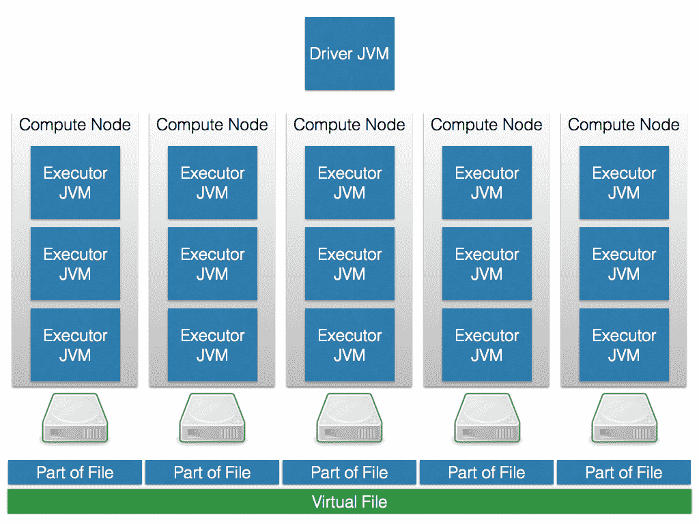
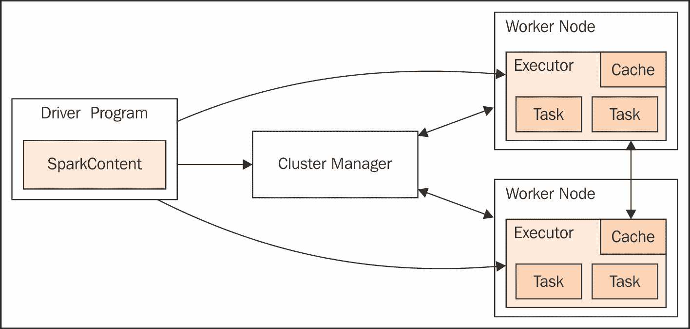

# 第一章：初探 Apache Spark V2 的新特性

**Apache Spark**是一个分布式且高度可扩展的内存数据分析系统，为你提供了使用 Java、Scala、Python 以及 R 等语言开发应用程序的能力。它是当前 Apache 顶级项目中贡献/参与度最高的项目之一。Apache 系统，如 Mahout，现在将其作为处理引擎，而非 MapReduce。还可以使用 Hive 上下文让 Spark 应用程序直接处理 Apache Hive 中的数据。

最初，Apache Spark 提供了四个主要子模块——SQL、MLlib、GraphX 和 Streaming。它们将在各自的章节中进行解释，但在此之前，一个简单的概述将是有益的。...

# Spark 机器学习

机器学习是 Apache Spark 的真正原因，因为归根结底，你不仅仅希望将数据从 A 地运送到 B 地（这一过程称为**ETL**（**提取、转换、加载**））。你希望在你的数据上运行高级数据分析算法，并且希望这些算法能够扩展。这正是 Apache Spark 发挥作用的地方。

Apache Spark 的核心提供了大规模并行数据处理的运行时环境，不同的并行机器学习库在其上运行。这是因为流行的编程语言如 R 和 Python 有大量机器学习算法，但它们不具备可扩展性。一旦你向系统可用主内存加载更多数据，它们就会崩溃。

相比之下，Apache Spark 可以利用多个计算机节点形成集群，并且即使在单个节点上，也能透明地将数据溢出到磁盘，从而避免主内存瓶颈。Apache Spark 自带了两个有趣的机器学习库，但本工作还将涵盖第三方机器学习库。

Spark MLlib 模块，即经典 MLlib，提供了一个不断增长但尚不完整的机器学习算法列表。自从基于**DataFrame**的机器学习 API——**SparkML**推出以来，MLlib 的命运已定。它仅因向后兼容的原因而被保留。

在 SparkML 中，我们已有一个机器学习库，该库开箱即用，可利用这些改进作为底层架构。

SparkML 最终将取代 MLlib。Apache SystemML 推出了首个运行在 Apache Spark 之上的库，该库并非随 Apache Spark 发行版一同提供。SystemML 为你提供了一个具有内置成本优化器的 R 风格语法执行环境。大规模并行机器学习是一个不断变化的高频领域。很难预测这一旅程将走向何方，但这是首次，使用开源和云计算的每个人都能获得大规模的高级机器学习。

Apache Spark 上的深度学习使用**H2O**、**Deeplearning4j**和**Apache SystemML**，这些都是非常有趣的第三方机器学习库的例子，它们并未随 Apache Spark 分发。

尽管 H2O 在某种程度上与 MLlib 互补，但 Deeplearning4j 仅专注于深度学习算法。两者都使用 Apache Spark 作为数据处理并行化的手段。您可能会好奇为什么我们要研究不同的机器学习库。

实际上，每个库在实现不同算法时都有其优缺点。因此，通常取决于您的数据和数据集大小，您会选择哪种实现以获得最佳性能。

然而，令人高兴的是，使用 Apache Spark 时有如此多的选择，您不会被锁定在一个单一的库中。开源意味着开放性，这只是我们如何从与单一供应商、单一产品锁定相反的方法中受益的一个例子。尽管最近 Apache Spark 将另一个库 GraphX 集成到其分发中，但我们不期望这种情况会很快发生。因此，最有可能的是，Apache Spark 作为一个中央数据处理平台和额外的第三方库将共存，就像 Apache Spark 是大数据操作系统，而第三方库是您在其上安装和运行的软件一样。

# Spark Streaming

**流处理**是 Apache Spark 的另一个重大且流行的话题。它涉及在 Spark 中以流的形式处理数据，并涵盖了输入和输出操作、转换、持久性和检查点等主题。

Apache Spark Streaming 将涵盖处理领域，我们还将看到不同类型流处理的实际示例。这讨论了批处理和窗口流配置，并提供了一个检查点设置的实际示例。它还涵盖了包括 Kafka 和 Flume 在内的不同流处理示例。

流数据有许多用途。其他 Spark 模块功能（例如，SQL、MLlib 和 GraphX）可用于处理流。您...

# Spark SQL

从 Spark 版本 1.3 开始，Apache Spark 引入了数据帧，使得 Spark 数据可以以表格形式处理，并可以使用表格函数（如`select`、`filter`和`groupBy`）来处理数据。Spark SQL 模块与 Parquet 和 JSON 格式集成，允许数据以更好地表示数据的格式存储。这也提供了更多与外部系统集成的选项。

将 Apache Spark 集成到 Hadoop Hive 大数据数据库的想法也可以引入。基于 Hive 上下文的 Spark 应用程序可用于操作基于 Hive 的表数据。这使得 Hive 能够利用 Spark 的快速内存分布式处理能力，有效地让 Hive 使用 Spark 作为处理引擎。

此外，还有大量额外的连接器，可以直接从 Apache Spark 访问 Hadoop 生态系统之外的 NoSQL 数据库。

# Spark 图处理

图处理是数据分析中另一个非常重要的主题。事实上，大多数问题都可以表示为图。

**图**基本上是一个项目及其相互关系的网络。项目称为**节点**，关系称为**边**。关系可以是定向的或非定向的。关系以及项目可以具有属性。因此，例如，地图也可以表示为图。每个城市是一个节点，城市之间的街道是边。城市之间的距离可以作为边上的属性分配。

**Apache Spark GraphX**模块使 Apache Spark 能够提供快速的大数据内存图处理。这使您能够运行图算法...

# 扩展生态系统

在审视大数据处理系统时，我们认为不仅要关注系统本身，还要关注它如何扩展以及如何与外部系统集成，以便提供更高级别的功能。在这本书的篇幅中，我们无法涵盖每一种选择，但通过引入一个主题，我们希望能够激发读者的兴趣，使他们能够进一步研究。

# 在 Apache Spark V2 中有哪些新变化？

自 Apache Spark V2 以来，许多事情都发生了变化。这并不意味着 API 已被破坏。相反，大多数 V1.6 的 Apache Spark 应用程序将在 Apache Spark V2 上运行，无论是否需要很少的更改，但在幕后，已经发生了很多变化。

尽管**Java 虚拟机**（**JVM**）本身是一件杰作，但它是一个通用的字节码执行引擎。因此，存在大量的 JVM 对象管理和**垃圾回收**（**GC**）开销。例如，存储一个 4 字节的字符串，在 JVM 上需要 48 字节。GC 基于对象生命周期估计进行优化，但 Apache Spark 通常比 JVM 更了解这一点。因此，Tungsten 对私有子集禁用了 JVM GC...

# 集群设计

正如我们已经提到的，Apache Spark 是一个分布式、内存内并行处理系统，需要一个关联的存储系统。因此，当您构建大数据集群时，您可能会使用分布式存储系统，如 Hadoop，以及用于移动数据的工具，如 Sqoop、Flume 和 Kafka。

我们希望在大数据集群中引入边缘节点的概念。这些集群中的节点将面向客户端，上面驻留着如 Hadoop NameNode 或可能是 Spark master 等客户端面向组件。大多数大数据集群可能位于防火墙后面。边缘节点将减少由防火墙引起的复杂性，因为它们将是外部可访问的唯一接触点。下图展示了一个简化的大数据集群：

它展示了五个简化的集群节点，每个 CPU 核心有一个执行器 JVM，以及位于集群外部的 Spark 驱动程序 JVM。此外，您可以看到直接连接到节点的磁盘。这被称为**JBOD**（**只是一堆磁盘**）方法。非常大的文件在磁盘上分区，虚拟文件系统（如 HDFS）将这些块作为一个大虚拟文件提供。当然，这是风格化和简化的，但您可以理解这个概念。

下面的简化组件模型展示了驱动程序 JVM 位于集群外部。它与集群管理器通信，以获得在 worker 节点上调度任务的许可，因为集群管理器负责跟踪集群上运行的所有进程的资源分配。

正如我们稍后将看到的，存在多种不同的集群管理器，其中一些还能够管理其他 Hadoop 工作负载，甚至与 Spark 执行器并行运行的非 Hadoop 应用程序。请注意，执行器和驱动程序之间始终保持双向通信，因此从网络角度来看，它们也应该彼此靠近：

图源：https://spark.apache.org/docs/2.0.2/cluster-overview.html

通常，虽然防火墙为集群增加了安全性，但也增加了复杂性。系统组件之间的端口需要打开，以便它们可以相互通信。例如，Zookeeper 被许多组件用于配置。Apache Kafka，发布/订阅消息系统，使用 Zookeeper 来配置其主题、组、消费者和生产者。因此，需要打开到 Zookeeper 的客户端端口，可能跨越防火墙。

最后，需要考虑将系统分配给集群节点的方案。例如，如果 Apache Spark 使用 Flume 或 Kafka，则会使用内存通道。这些通道的大小以及数据流导致的内存使用量需要考虑。Apache Spark 不应与其他 Apache 组件竞争内存使用。根据您的数据流和内存使用情况，可能需要在不同的集群节点上部署 Spark、Hadoop、Zookeeper、Flume 和其他工具。或者，可以使用 YARN、Mesos 或 Docker 等资源管理器来解决此问题。在标准的 Hadoop 环境中，YARN 最有可能被采用。

通常，作为集群 NameNode 服务器或 Spark 主服务器的边缘节点将需要比防火墙内的集群处理节点更多的资源。当许多 Hadoop 生态系统组件部署在集群上时，它们都需要在主服务器上额外内存。您应该监控边缘节点的资源使用情况，并根据需要调整资源和/或应用程序位置。例如，YARN 正在处理这个问题。

本节简要介绍了大数据集群中的 Apache Spark、Hadoop 及其他工具。但是，大数据集群内部，Apache Spark 集群本身可能如何配置呢？例如，可以有多种类型的 Spark 集群管理器。下一节将探讨这一点，并描述每种 Apache Spark 集群管理器的类型。

# 集群管理

Spark 上下文，正如你在本书的许多示例中看到的，可以通过 Spark 配置对象和 Spark URL 来定义。Spark 上下文连接到 Spark 集群管理器，后者随后在集群的工作节点之间分配资源给应用程序。集群管理器在集群的工作节点上分配执行器。它将应用程序 JAR 文件复制到工作节点，并最终分配任务。

以下小节描述了目前可用的 Apache Spark 集群管理器的各种选项。

# 本地

通过指定一个本地 Spark 配置 URL，可以使应用程序在本地运行。通过指定 `local[n]`，可以使 Spark 使用 *n* 个线程在本地运行应用程序。这是一个有用的开发和测试选项，因为你还可以测试某种并行化场景，但将所有日志文件保留在单个机器上。

# Standalone

Standalone 模式使用 Apache Spark 自带的基本集群管理器。Spark 主节点的 URL 将如下所示：

`Spark://<hostname>:7077`

在此，`<hostname>` 表示运行 Spark 主节点的宿主机的名称。我们已将端口指定为 `7077`，这是默认值，但可配置。当前这种简单的集群管理器仅支持 **FIFO**（**先进先出**）调度策略。你可以通过为每个应用程序设置资源配置选项来设法实现并发应用调度；例如，使用 `spark.core.max` 在应用程序之间共享核心。

# Apache YARN

在更大规模上，当与 Hadoop YARN 集成时，Apache Spark 集群管理器可以是 YARN，应用程序可以运行在两种模式之一。如果将 Spark 主节点值设置为 `yarn-cluster`，则可以将应用程序提交到集群并随后终止。集群将负责分配资源和运行任务。然而，如果应用程序主节点以 `yarn-client` 方式提交，则应用程序在处理周期内保持活动状态，并向 YARN 请求资源。

# Apache Mesos

**Apache Mesos** 是一个开源系统，用于集群间的资源共享。它允许多个框架通过管理和调度资源来共享集群。作为一个集群管理器，它利用 Linux 容器提供隔离，并允许 Hadoop、Spark、Kafka、Storm 等多种系统安全地共享集群。它高度可扩展至数千个节点。它是一个基于主/从的系统，并具有故障容忍性，使用 Zookeeper 进行配置管理。

对于单个主节点的 Mesos 集群，Spark 主 URL 将采用以下形式：

`mesos://<hostname>:5050`.

在此，`<hostname>`是 Mesos 主服务器的 hostname；端口定义为`5050`，这是默认的 Mesos 主端口（...）

# 基于云的部署

云系统有三种不同的抽象层次——**基础设施即服务**（**IaaS**）、**平台即服务**（**PaaS**）和**软件即服务**（**SaaS**）。我们将探讨如何在所有这些层面上使用和安装 Apache Spark。

新的 IaaS 方式是 Docker 和 Kubernetes，与虚拟机相对，基本上提供了一种在几分钟内自动设置 Apache Spark 集群的方法。Kubernetes 的优势在于，由于它是开放标准且基于开源，因此可以在多个不同的云提供商之间使用。

你甚至可以使用 Kubernetes，在本地数据中心内透明且动态地移动工作负载，跨越本地、专用和公共云数据中心。相比之下，PaaS 为你减轻了安装和操作 Apache Spark 集群的负担，因为这作为一项服务提供。

关于 Docker 是 IaaS 还是 PaaS 的讨论仍在进行中，但在我们看来，它只是一种轻量级预装虚拟机形式。这一点特别有趣，因为其完全基于开源技术，使得你能够在任何其他数据中心复制该系统。

我们将介绍的开源组件之一是 Jupyter 笔记本；一种在基于云的协作环境中进行数据科学的现代方式。

# 性能

在进入涵盖 Apache Spark 功能区域和扩展的其余章节之前，我们将审视性能领域。需要考虑哪些问题和领域？从集群级别到实际 Scala 代码，哪些因素可能影响 Spark 应用程序性能？我们不想仅仅重复 Spark 网站上的内容，因此请查看此 URL：`http://spark.apache.org/docs/<version>/tuning.html`。

在此，`<version>`对应于你正在使用的 Spark 版本；即，最新版本或类似`1.6.1`的特定版本。因此，浏览此页面后，我们将简要提及一些主题领域。本节中，我们将列出一些一般性要点，但不暗示...

# 集群结构

大数据集群的规模和结构将影响性能。如果你拥有一个基于云的集群，相比非共享硬件集群，你的 IO 和延迟将会受到影响。你将与多个客户共享底层硬件，且集群硬件可能位于远程。当然，也有例外。例如，IBM 云提供按小时租赁的专用裸金属高性能集群节点，配备 InfiniBand 网络连接。

此外，集群组件在服务器上的位置可能导致资源争用。例如，在大规模集群中仔细考虑 Hadoop NameNodes、Spark 服务器、Zookeeper、Flume 和 Kafka 服务器的布局。在高负载情况下，您可能需要将服务器隔离到单独的系统中。您还可以考虑使用 Apache Mesos 等系统，它为各个进程提供更好的资源分配和分配。

同时考虑潜在的并行性。对于大型数据集，您的 Spark 集群中的工作者数量越多，实现并行处理的机会就越大。一个经验法则是每个超线程或虚拟核心分别对应一个工作者。

# Hadoop 分布式文件系统

根据您的集群需求，您可能考虑使用 HDFS 的替代方案。例如，IBM 提供了**GPFS**（**通用目的文件系统**）以提高性能。

GPFS 可能是更好选择的原因在于，它源自高性能计算背景，这种文件系统具有完整的读写能力，而 HDFS 设计为一次写入、多次读取的文件系统。它在性能上优于 HDFS，因为它在核心级别运行，而 HDFS 在**Java 虚拟机**（**JVM**）中运行，后者又作为操作系统进程运行。它还与 Hadoop 和 Spark 集群工具集成。IBM 使用 GPFS 配置了数百 PB 的系统。...

# 数据局部性

良好数据处理性能的关键是避免网络传输。这在几年前是非常正确的，但对于 CPU 需求高、I/O 需求低的任务来说，这不太相关，但对于 CPU 需求低、I/O 需求高的数据处理算法，这仍然适用。

由此我们可以得出结论，HDFS 是实现数据局部性的最佳方式之一，因为文件块分布在集群节点上，在大多数情况下，使用直接连接到服务器系统的硬盘。这意味着可以在包含个别数据块的机器上使用 CPU 并行处理这些块，以避免网络传输。

另一种实现数据局部性的方法是使用`ApacheSparkSQL`。根据连接器实现的不同，SparkSQL 可以利用源引擎的数据处理能力。例如，当结合使用 MongoDB 和 SparkSQL 时，SQL 语句的部分内容在数据发送到 Apache Spark 之前由 MongoDB 预处理。

# 内存

为了避免 Apache Spark 集群上的任务出现**内存不足**（**OOM**）消息，请考虑以下调优问题：

+   考虑您的 Spark 工作节点上可用的物理内存级别。是否可以增加？在高负载期间检查操作系统进程的内存消耗，以了解可用内存的情况。确保工作者有足够的内存。

+   考虑数据分区。你能增加分区数量吗？一般而言，分区的数量应至少与集群中可用的 CPU 核心数相等。可使用 RDD API 中的`repartition`函数。

+   你能调整用于存储和缓存 RDD 的 JVM 内存比例吗？...

# 编码

尝试优化你的代码，以提升 Spark 应用程序的性能。例如，在你的 ETL 周期早期基于应用程序数据进行过滤。一个例子是，当使用原始 HTML 文件时，在早期阶段去除标签并裁剪掉不需要的部分。调整并行度，尝试找出代码中资源消耗大的部分，并寻找替代方案。

**ETL**是分析项目中首先要做的事情之一。因此，你正在从第三方系统抓取数据，要么直接访问关系型或 NoSQL 数据库，要么通过读取各种文件格式的导出，如 CSV、TSV、JSON，甚至是来自本地或远程文件系统或 HDFS 中暂存区的更奇特的格式：在对文件进行一些检查和合理性检查后，Apache Spark 中的 ETL 过程基本上读取这些文件并从中创建 RDD 或 DataFrames/Datasets。

它们被转换以适应下游的分析应用程序，这些应用程序运行在 Apache Spark 或其他应用程序之上，然后存储回文件系统，格式可以是 JSON、CSV 或 PARQUET 文件，甚至返回到关系型或 NoSQL 数据库。

最后，对于任何与 Apache Spark 性能相关的问题，我推荐以下资源：[`spark.apache.org/docs/latest/tuning.html`](https://spark.apache.org/docs/latest/tuning.html)。

# 云

尽管本书的部分内容将专注于 Apache Spark 在物理服务器集群上安装的示例，但我们想强调，市面上存在多种基于云的选项，它们带来了许多好处。有些云系统将 Apache Spark 作为集成组件，而有些则提供 Spark 作为服务。

# 错误与恢复

通常，对于你的应用程序，需要问的问题是：是否必须接收并处理所有数据？如果不是，那么在失败时，你可能只需重启应用程序并丢弃缺失或丢失的数据。如果情况并非如此，那么你需要使用将在下一节中描述的检查点机制。

同样值得注意的是，你的应用程序的错误管理应该是健壮且自给自足的。我们的意思是，如果异常不是关键性的，那么管理该异常，可能记录它，并继续处理。例如，当任务达到最大失败次数（由`spark.task.maxFailures`指定）时，它将终止处理。

这一属性及其他属性，可以在创建`SparkContext`对象时设置，或者在调用`spark-shell`或`spark-submit`时作为额外的命令行参数。

# 总结

在结束本章之际，我们邀请你逐步学习后续章节中基于 Scala 代码的示例。Apache Spark 的发展速度令人印象深刻，值得注意的是其发布的频繁程度。因此，尽管在撰写本文时 Spark 已达到 2.2 版本，但我们确信你将使用更新的版本。

如果你遇到问题，请在[www.stackoverflow.com](http://www.stackoverflow.com)上报并相应地标记它们；你将在几分钟内收到反馈——用户社区非常活跃。获取信息和帮助的另一种方式是订阅 Apache Spark 邮件列表：`user@apachespark.org`。

本章结束时，你应该对本书中等待你的内容有了一个清晰的认识。我们专门...
