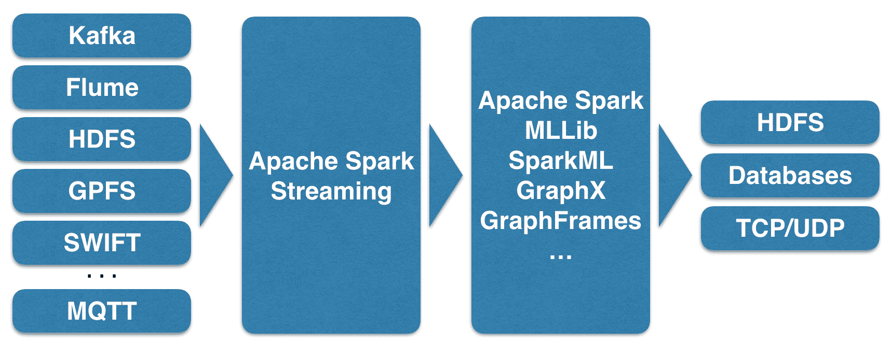
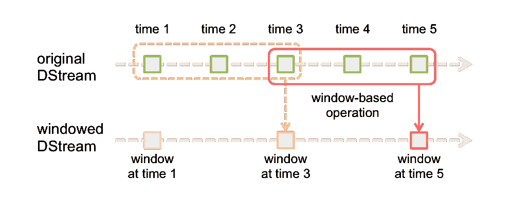
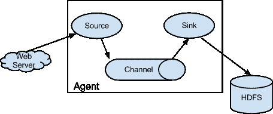
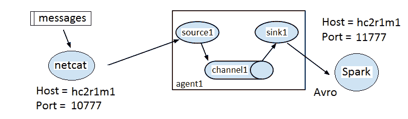

# 第二章：Apache Spark 流处理

Apache 流处理模块是 Apache Spark 中的一个基于流处理的模块。它使用 Spark 集群，提供高度扩展的能力。基于 Spark，它也具有高度容错性，能够通过检查点正在处理的数据流来重新运行失败的任务。在本章的介绍部分之后，将涵盖以下主题，该部分将提供 Apache Spark 如何处理基于流的数据的实际概述：

+   错误恢复与检查点

+   TCP 基础的流处理

+   文件流

+   Kafka 流源

对于每个主题，我们将提供一个在 Scala 中实现的工作示例，并展示如何设置和测试基于流的架构。

# 概览

以下图表展示了 Apache 流处理的潜在数据源，如 Kafka、Flume 和 HDFS：



这些输入被送入 Spark 流处理模块，并作为离散流进行处理。该图还显示了其他 Spark 模块功能，如机器学习，也可以用于处理基于流的数。

完全处理后的数据可以作为输出到 HDFS、数据库或仪表板。此图基于 Spark 流处理网站上的图，但我们希望扩展它以表达 Spark 模块功能：



# 检查点

在批处理中，我们习惯于具备容错性。这意味着，如果某个节点崩溃，作业不会丢失其状态，丢失的任务会在其他工作节点上重新调度。中间结果被写入持久存储（当然，这种存储也必须具备容错性，如 HDFS、GPFS 或云对象存储）。现在我们希望在流处理中也实现同样的保证，因为确保我们正在处理的数据流不丢失可能至关重要。

可以设置一个基于 HDFS 的检查点目录来存储基于 Apache Spark 的流处理信息。在这个 Scala 示例中，数据将存储在 HDFS 下的`/data/spark/checkpoint`。以下 HDFS 文件系统`ls`命令显示，在开始之前，该目录不存在：

```scala
[hadoop@hc2nn stream]$ hdfs dfs -ls /data/spark/checkpoint
 ls: `/data/spark/checkpoint': No such file or directory
```

为了复制以下示例，我们使用 Twitter API 凭证来连接到 Twitter API 并获取推文流。以下链接解释了如何在 Twitter UI 中创建此类凭证：[`dev.twitter.com/oauth/overview/application-owner-access-tokens`](https://dev.twitter.com/oauth/overview/application-owner-access-tokens)。

以下 Scala 代码示例首先导入 Spark 流处理上下文和基于 Twitter 的功能。然后定义了一个名为`stream1`的应用程序对象：

```scala
import org.apache.spark._
import org.apache.spark.SparkContext._
import org.apache.spark.streaming._
import org.apache.spark.streaming.twitter._
import org.apache.spark.streaming.StreamingContext._

object stream1 {
```

接下来，定义了一个名为 `createContext` 的方法，该方法将用于创建 Spark 和 Streaming 上下文。它还将使用流上下文检查点方法将流检查点到基于 HDFS 的目录，该方法接受目录路径作为参数。目录路径是传递给 `createContext` 方法的值 `(cpDir)`：

```scala
def createContext( cpDir : String ) : StreamingContext = {
  val appName = "Stream example 1"
  val conf    = new SparkConf()
  conf.setAppName(appName)
  val sc = new SparkContext(conf)
  val ssc    = new StreamingContext(sc, Seconds(5) )
  ssc.checkpoint( cpDir )
  ssc
}
```

现在，定义了主方法以及 HDFS 目录、Twitter 访问权限和参数。Spark Streaming 上下文 `ssc` 通过 `StreamingContext` 方法的 `checkpoint` 使用 HDFS 检查点目录检索或创建。如果目录不存在，则调用之前的方法 `createContext`，该方法将创建上下文和 `checkpoint`。显然，出于安全原因，我们在这个例子中截断了自己的 Twitter `auth.keys`：

```scala
def main(args: Array[String]) {
  val hdfsDir = "/data/spark/checkpoint"
  val consumerKey       = "QQpxx"
  val consumerSecret    = "0HFzxx"
  val accessToken       = "323xx"
  val accessTokenSecret = "IlQxx"

  System.setProperty("twitter4j.oauth.consumerKey", consumerKey)
  System.setProperty("twitter4j.oauth.consumerSecret", consumerSecret)
  System.setProperty("twitter4j.oauth.accessToken", accessToken)
  System.setProperty("twitter4j.oauth.accessTokenSecret", accessTokenSecret)
  val ssc = StreamingContext.getOrCreate(hdfsDir,
        () => { createContext( hdfsDir ) })
  val stream = TwitterUtils.createStream(ssc,None).window( 
Seconds(60) )
  // do some processing
  ssc.start()
  ssc.awaitTermination()
} // end main
```

运行此代码后，由于没有实际处理，可以再次检查 HDFS `checkpoint` 目录。这次，很明显 `checkpoint` 目录已被创建，数据已被存储：

```scala
 [hadoop@hc2nn stream]$ hdfs dfs -ls /data/spark/checkpoint
 Found 1 items
 drwxr-xr-x   - hadoop supergroup          0 2015-07-02 13:41 
/data/spark/checkpoint/0fc3d94e-6f53-40fb-910d-1eef044b12e9
```

本例取自 Apache Spark 官网，展示了如何设置和使用检查点存储。检查点执行的频率是多少？元数据在每个流批次期间存储。实际数据存储在一个周期内，该周期是批次间隔或十秒的最大值。这可能不适合您，因此您可以使用以下方法重置该值：

```scala
 DStream.checkpoint( newRequiredInterval )
```

这里，`newRequiredInterval` 是您需要的新检查点间隔值；通常，您应该瞄准一个值，该值是您的批次间隔的五到十倍。检查点保存了流批次和元数据（关于数据的数据）。

如果应用程序失败，那么当它重新启动时，在处理开始时使用检查点数据。在失败时正在处理的数据批次与自失败以来的批处理数据一起重新处理。请记住监控用于检查点的 HDFS 磁盘空间。

在下一节中，我们将检查流源并提供每种类型的示例。

# 流源

在本节中，我们无法涵盖所有流类型的实际示例，但当本章太小而无法包含代码时，我们将至少提供描述。在本章中，我们将介绍 TCP 和文件流以及 Flume、Kafka 和 Twitter 流。Apache Spark 通常只支持这个有限的集合开箱即用，但这不是问题，因为第三方开发者也提供了连接到其他源的连接器。我们将从一个基于 TCP 的实际示例开始。本章检查流处理架构。

例如，在流数据交付速率超过潜在数据处理速率的情况下会发生什么？像 Kafka 这样的系统提供了可能解决这个问题的可能性...

# TCP 流

有可能使用 Spark Streaming Context 的`socketTextStream`方法通过 TCP/IP 流式传输数据，只需指定主机名和端口号。本节中的基于 Scala 的代码示例将在端口`10777`接收数据，这些数据是通过`netcat`Linux 命令提供的。

`netcat`命令是一个 Linux/Unix 命令，它允许你使用 TCP 或 UDP 向本地或远程 IP 目的地发送和接收数据。这样，每个 shell 脚本都可以充当完整的网络客户端或服务器。以下是一个关于如何使用`netcat`的良好教程：[`www.binarytides.com/netcat-tutorial-for-beginners/`](http://www.binarytides.com/netcat-tutorial-for-beginners/)。

代码示例首先导入了 Spark、上下文以及流处理类。定义了一个名为`stream2`的对象类，它是带有参数的主方法。

```scala
import org.apache.spark._
import org.apache.spark.SparkContext._
import org.apache.spark.streaming._
import org.apache.spark.streaming.StreamingContext._

object stream2 {
  def main(args: Array[String]) {
```

检查传递给类的参数数量，以确保它是主机名和端口号。创建了一个带有定义的应用程序名称的 Spark 配置对象。然后创建了 Spark 和流处理上下文。接着，设置了`10`秒的流处理批次时间：

```scala
if ( args.length < 2 ) {
 System.err.println("Usage: stream2 <host> <port>")
 System.exit(1)
}

val hostname = args(0).trim
val portnum  = args(1).toInt
val appName  = "Stream example 2"
val conf     = new SparkConf()
conf.setAppName(appName)
val sc  = new SparkContext(conf)
val ssc = new StreamingContext(sc, Seconds(10) )
```

通过使用`hostname`和端口名参数调用流处理上下文的`socketTextStream`方法，创建了一个名为`rawDstream`的 DStream：

```scala
val rawDstream = ssc.socketTextStream( hostname, portnum )
```

通过用空格分割单词，从原始流数据中创建了一个前十单词计数。然后，创建了一个(key, value)对，即(word,1)，它按键值，即单词进行缩减。现在，有一个单词列表及其关联的计数。键和值被交换，使得列表变为(计数和单词)。然后，对键（现在是计数）进行排序。最后，从 DStream 中的 RDD 中取出前 10 项并打印出来：

```scala
val wordCount = rawDstream
  .flatMap(line => line.split(" "))
  .map(word => (word,1))
  .reduceByKey(_+_)
  .map(item => item.swap)
  .transform(rdd => rdd.sortByKey(false))
  .foreachRDD( rdd =>
    { rdd.take(10).foreach(x=>println("List : " + x)) }
  )
```

代码以调用 Spark Streaming 的`start`和`awaitTermination`方法结束，以启动流处理并等待进程终止：

```scala
    ssc.start()
      ssc.awaitTermination()
  } // end main
} // end stream2
```

正如我们之前所述，此应用程序的数据由 Linux Netcat (`nc`)命令提供。Linux `cat`命令转储日志文件的内容，该内容被管道传输到`nc`。`lk`选项强制 Netcat 监听连接，并在连接丢失时保持监听。此示例显示正在使用的端口是`10777`：

```scala
 [root@hc2nn log]# pwd
 /var/log
 [root@hc2nn log]# cat ./anaconda.storage.log | nc -lk 10777
```

这里展示了基于 TCP 的流处理的输出。实际输出不如所展示的方法重要。然而，数据显示，正如预期的那样，是一份按降序计数的 10 个日志文件单词列表。请注意，顶部单词为空，因为流未被过滤以排除空单词：

```scala
 List : (17104,)
 List : (2333,=)
 List : (1656,:)
 List : (1603,;)
 List : (1557,DEBUG)
 List : (564,True)
 List : (495,False)
 List : (411,None)
 List : (356,at)
 List : (335,object)
```

如果你想基于 TCP/IP 从主机和端口使用 Apache Spark Streaming 进行数据流处理，这会很有趣。但是，更奇特的方法呢？如果你想从消息系统或通过基于内存的通道流式传输数据怎么办？如果你想使用当今可用的一些大数据工具，如 Flume 和 Kafka，该怎么办？接下来的部分将探讨这些选项，但首先，我们将展示如何基于文件构建流。

# 文件流

我们已修改上一节中的基于 Scala 的代码示例，通过调用 Spark Streaming 上下文的`textFileStream`方法来监控基于 HDFS 的目录。鉴于这一小改动，我们将不展示所有代码。应用程序类现在称为`stream3`，它接受一个参数——HDFS 目录。目录路径也可以位于另一个存储系统上（所有代码示例都将随本书提供）：

```scala
val rawDstream = ssc.textFileStream( directory )
```

流处理与之前相同。流被分割成单词，并打印出前十个单词列表。这次唯一的区别是，数据必须在应用程序运行时放入 HDFS 目录。这是通过...实现的

# Flume

**Flume** 是一个 Apache 开源项目及产品，旨在以大数据规模移动大量数据。它具有高度可扩展性、分布式和可靠性，基于数据源、数据接收器和数据通道运作，如下图所示，取自[`flume.apache.org/`](http://flume.apache.org/)：



Flume 使用代理处理数据流。如前图所示，一个代理具有数据源、数据处理通道和数据接收器。更清晰地描述此流程的方法是通过我们刚才看到的图。通道充当源数据的队列，接收器将数据传递到链中的下一个环节。

Flume 代理可以构成 Flume 架构；一个代理的接收器输出可以作为第二个代理的输入。Apache Spark 支持两种使用 Apache Flume 的方法。第一种是基于 Avro 的内存推送方法，而第二种方法，同样基于 Avro，是使用自定义 Spark 接收器库的拉取系统。本例中我们使用 Flume 版本 1.5：

```scala
[root@hc2nn ~]# flume-ng version
Flume 1.5.0-cdh5.3.3
Source code repository: https://git-wip-us.apache.org/repos/asf/flume.git
Revision: b88ce1fd016bc873d817343779dfff6aeea07706
Compiled by jenkins on Wed Apr  8 14:57:43 PDT 2015
From source with checksum 389d91c718e03341a2367bf4ef12428e
```

我们在此初步实现的基于 Flume 的 Spark 示例是基于 Flume 的推送方法，其中 Spark 充当接收器，Flume 将数据推送到 Spark。下图表示我们将在单个节点上实现的结构：



消息数据将被发送到名为`hc2r1m1`的主机的`10777`端口，使用 Linux 的`netcat`（`nc`）命令。这将作为 Flume 代理（`agent1`）的一个源（`source1`），该代理将有一个名为`channel1`的内存通道。`agent1`使用的接收器将是基于 Apache Avro 的，同样在名为`hc2r1m1`的主机上，但这次端口号将是`11777`。Apache Spark Flume 应用程序`stream4`（我们稍后将描述）将监听此端口上的 Flume 流数据。

我们通过向`10777`端口执行`nc`命令来启动流处理。现在，当我们在该窗口中输入文本时，它将作为 Flume 源，数据将被发送到 Spark 应用程序：

```scala
[hadoop@hc2nn ~]$ nc  hc2r1m1.semtech-solutions.co.nz  10777
```

为了运行 Flume 代理`agent1`，我们创建了一个名为`agent1.flume.cfg`的 Flume 配置文件，该文件描述了代理的源、通道和接收器。文件内容如下。第一部分定义了`agent1`的源、通道和接收器名称。

```scala
agent1.sources  = source1
agent1.channels = channel1
agent1.sinks    = sink1
```

下一部分定义`source1`为基于 netcat，运行在名为`hc2r1m1`的主机上和`10777`端口：

```scala
agent1.sources.source1.channels=channel1
agent1.sources.source1.type=netcat
agent1.sources.source1.bind=hc2r1m1.semtech-solutions.co.nz
agent1.sources.source1.port=10777
```

`agent1`通道`channel1`被定义为具有最大事件容量`1000`事件的内存通道：

```scala
agent1.channels.channel1.type=memory
agent1.channels.channel1.capacity=1000
```

最后，`agent1`接收器`sink1`被定义为在名为`hc2r1m1`的主机上和`11777`端口的 Apache Avro 接收器：

```scala
agent1.sinks.sink1.type=avro
agent1.sinks.sink1.hostname=hc2r1m1.semtech-solutions.co.nz
agent1.sinks.sink1.port=11777 agent1.sinks.sink1.channel=channel1
```

我们创建了一个名为`flume.bash`的 Bash 脚本来运行 Flume 代理`agent1`。它如下所示：

```scala
[hadoop@hc2r1m1 stream]$ more flume.bash #!/bin/bash # run the bash agent flume-ng agent \
 --conf /etc/flume-ng/conf \
 --conf-file ./agent1.flume.cfg \
 -Dflume.root.logger=DEBUG,INFO,console  \
 -name agent1
```

该脚本调用 Flume 可执行文件`flume-ng`，传递`agent1`配置文件。调用指定了名为`agent1`的代理。它还指定了 Flume 配置目录为`/etc/flume-ng/conf/`，这是默认值。最初，我们将使用一个基于 Scala 的示例，该示例使用`netcat` Flume 源来展示如何将数据发送到 Apache Spark 应用程序。然后，我们将展示如何以类似方式处理基于 RSS 的数据源。因此，最初接收`netcat`数据的 Scala 代码看起来是这样的。应用程序类名被定义。导入 Spark 和 Flume 所需的类。最后，定义了主方法：

```scala
import org.apache.spark._
import org.apache.spark.SparkContext._
import org.apache.spark.streaming._
import org.apache.spark.streaming.StreamingContext._
import org.apache.spark.streaming.flume._

object stream4 {
  def main(args: Array[String]) {
  //The host and port name arguments for the data stream are checked and extracted:
      if ( args.length < 2 ) {
        System.err.println("Usage: stream4 <host> <port>")
        System.exit(1)
      }
      val hostname = args(0).trim
      val portnum  = args(1).toInt
      println("hostname : " + hostname)
      println("portnum  : " + portnum)
```

Spark 和 Streaming 上下文被创建。然后，使用流上下文主机和端口号创建基于 Flume 的数据流。为此，使用了基于 Flume 的类`FlumeUtils`，通过调用其`createStream`方法来实现：

```scala
val appName = "Stream example 4"
val conf    = new SparkConf()
conf.setAppName(appName)
val sc  = new SparkContext(conf)
val ssc = new StreamingContext(sc, Seconds(10) )
val rawDstream = FlumeUtils.createStream(ssc,hostname,portnum)
```

最终，会打印出流事件计数，并且在测试流时（出于调试目的）会转储流内容。之后，流上下文被启动并配置为运行，直到通过应用程序终止：

```scala
    rawDstream.count()
           .map(cnt => ">>>> Received events : " + cnt )
           .print()
    rawDstream.map(e => new String(e.event.getBody.array() ))
           .print
    ssc.start()
    ssc.awaitTermination()
  } // end main
} // end stream4
```

编译完成后，我们将使用`spark-submit`运行此应用程序。在本书的其他一些章节中，我们将使用一个名为`run_stream.bash`的基于 Bash 的脚本来执行任务。该脚本如下所示：

```scala
[hadoop@hc2r1m1 stream]$ more run_stream.bash #!/bin/bash SPARK_HOME=/usr/local/spark
SPARK_BIN=$SPARK_HOME/bin
SPARK_SBIN=$SPARK_HOME/sbin JAR_PATH=/home/hadoop/spark/stream/target/scala-2.10/streaming_2.10-1.0.jar
CLASS_VAL=$1
CLASS_PARAMS="${*:2}" STREAM_JAR=/usr/local/spark/lib/spark-examples-1.3.1-hadoop2.3.0.jar cd $SPARK_BIN ./spark-submit \
 --class $CLASS_VAL \
 --master spark://hc2nn.semtech-solutions.co.nz:7077  \
 --executor-memory 100M \
 --total-executor-cores 50 \
 --jars $STREAM_JAR \
 $JAR_PATH \
 $CLASS_PARAMS
```

因此，此脚本设置了一些基于 Spark 的变量和一个 JAR 库路径用于此作业。它将 Spark 类作为第一个参数运行。它将所有其他变量作为参数传递给 Spark 应用程序类作业。因此，应用程序的执行如下所示：

```scala
[hadoop@hc2r1m1 stream]$ ./run_stream.bash stream4 hc2r1m1 11777
```

这意味着 Spark 应用程序已准备好，并在端口`11777`上作为 Flume 接收器运行。Flume 输入已准备好，作为端口`10777`上的`netcat`任务运行。现在，Flume 代理`agent1`可以使用名为`flume.bash`的 Flume 脚本启动，以将基于`netcat`源的数据发送到 Apache Spark 基于 Flume 的接收器：

```scala
 [hadoop@hc2r1m1 stream]$ ./flume.bash
```

现在，当文本传递给`netcat`会话时，它应该通过 Flume 流动，并由 Spark 作为流处理。让我们试试：

```scala
[hadoop@hc2nn ~]$ nc  hc2r1m1.semtech-solutions.co.nz 10777
 I hope that Apache Spark will print this
 OK
 I hope that Apache Spark will print this
 OK
 I hope that Apache Spark will print this
 OK
```

已向`netcat`会话添加了三个简单的文本片段，并使用`OK`进行了确认，以便它们可以传递给 Flume。Flume 会话中的调试输出显示已收到并处理了事件（每行一个）：

```scala
2015-07-06 18:13:18,699 (netcat-handler-0) [DEBUG - org.apache.flume.source.NetcatSource$NetcatSocketHandler.run(NetcatSource.java:318)] Chars read = 41
 2015-07-06 18:13:18,700 (netcat-handler-0) [DEBUG - org.apache.flume.source.NetcatSource$NetcatSocketHandler.run(NetcatSource.java:322)] Events processed = 1
 2015-07-06 18:13:18,990 (netcat-handler-0) [DEBUG - org.apache.flume.source.NetcatSource$NetcatSocketHandler.run(NetcatSource.java:318)] Chars read = 41
 2015-07-06 18:13:18,991 (netcat-handler-0) [DEBUG - org.apache.flume.source.NetcatSource$NetcatSocketHandler.run(NetcatSource.java:322)] Events processed = 1
 2015-07-06 18:13:19,270 (netcat-handler-0) [DEBUG - org.apache.flume.source.NetcatSource$NetcatSocketHandler.run(NetcatSource.java:318)] Chars read = 41
 2015-07-06 18:13:19,271 (netcat-handler-0) [DEBUG - org.apache.flume.source.NetcatSource$NetcatSocketHandler.run(NetcatSource.java:322)] Events processed = 1
```

最后，在 Spark `stream4`应用程序会话中，已收到并处理了三个事件；在这种情况下，它们已被转储到会话中，以证明数据已到达。当然，这不是您通常会做的，但我们想证明数据通过此配置传输：

```scala
-------------------------------------------
 Time: 1436163210000 ms
 -------------------------------------------
 >>> Received events : 3
 -------------------------------------------
 Time: 1436163210000 ms
 -------------------------------------------
 I hope that Apache Spark will print this
 I hope that Apache Spark will print this
 I hope that Apache Spark will print this
```

这很有趣，但它并不是真正值得生产的 Spark Flume 数据处理示例。因此，为了演示一种可能的实际数据处理方法，我们将更改 Flume 配置文件源详细信息，使其使用一个 Perl 脚本，该脚本可执行如下：

```scala
agent1.sources.source1.type=exec
agent1.sources.source.command=./rss.perl
```

先前引用的 Perl 脚本`rss.perl`仅作为路透社科学新闻的来源。它接收 XML 格式的消息并将其转换为 JSON 格式。它还清理了数据中的不必要噪音。首先，它导入 LWP 和`XML::XPath`等包以启用 XML 处理。然后，它指定基于科学的 Reuters 新闻数据源，并创建一个新的 LWP 代理来处理数据，如下所示：

```scala
#!/usr/bin/perl
use strict;
use LWP::UserAgent;
use XML::XPath;
my $urlsource="http://feeds.reuters.com/reuters/scienceNews" ;
my  $agent = LWP::UserAgent->new;
#Then an infinite while loop is opened, and an HTTP GET request is carried out against  the URL. The request is configured, and the agent makes the request via 
a call to the request method:
while()
{
  my  $req = HTTP::Request->new(GET => ($urlsource));
  $req->header('content-type' => 'application/json');
  $req->header('Accept'       => 'application/json');
  my $resp = $agent->request($req);
```

如果请求成功，则返回的 XML 数据定义为请求的解码内容。通过使用路径`/rss/channel/item/title`的 XPath 调用从 XML 中提取标题信息：

```scala
    if ( $resp->is_success )
    {
      my $xmlpage = $resp -> decoded_content;
      my $xp = XML::XPath->new( xml => $xmlpage );
      my $nodeset = $xp->find( '/rss/channel/item/title' );
      my @titles = () ;
      my $index = 0 ;
```

对于提取的标题数据`XML`字符串中的每个节点，都会提取数据。它清除了不需要的`XML`标签，并添加到名为 titles 的基于 Perl 的数组中：

```scala
     foreach my $node ($nodeset->get_nodelist) {
        my $xmlstring = XML::XPath::XMLParser::as_string($node) ;
        $xmlstring =~ s/<title>//g;
        $xmlstring =~ s/<\/title>//g;
        $xmlstring =~ s/"//g;
        $xmlstring =~ s/,//g;
        $titles[$index] = $xmlstring ;
        $index = $index + 1 ;
      } # foreach find node
```

对于请求响应 XML 中的基于描述的数据，执行相同的处理。这次使用的 XPath 值是`/rss/channel/item/description/`。描述数据中有许多更多的标签需要清理，因此有许多更多的 Perl 搜索和行替换作用于该数据（`s///g`）：

```scala
    my $nodeset = $xp->find( '/rss/channel/item/description' );
    my @desc = () ;
    $index = 0 ;
    foreach my $node ($nodeset->get_nodelist) {
       my $xmlstring = XML::XPath::XMLParser::as_string($node) ;
       $xmlstring =~ s///g;
       $xmlstring =~ s/href=".+"//g;
       $xmlstring =~ s/src="img/.+"//g;
       $xmlstring =~ s/src='.+'//g;
       $xmlstring =~ s/<br.+\/>//g;
       $xmlstring =~ s/<\/div>//g;
       $xmlstring =~ s/<\/a>//g;
       $xmlstring =~ s/<a >\n//g;
       $xmlstring =~ s///g;
       $xmlstring =~ s///g;
       $xmlstring =~ s/<div.+>//g;
       $xmlstring =~ s/<title>//g;
       $xmlstring =~ s/<\/title>//g;
       $xmlstring =~ s/<description>//g;
       $xmlstring =~ s/<\/description>//g;
       $xmlstring =~ s/&lt;.+>//g;
       $xmlstring =~ s/"//g;
       $xmlstring =~ s/,//g;
       $xmlstring =~ s/\r|\n//g;
       $desc[$index] = $xmlstring ;
       $index = $index + 1 ;
    } # foreach find node
```

最后，基于 XML 的标题和描述数据使用`print`命令以 RSS JSON 格式输出。然后脚本休眠 30 秒，并请求更多 RSS 新闻信息进行处理：

```scala
   my $newsitems = $index ;
   $index = 0 ;
   for ($index=0; $index < $newsitems; $index++) {
      print "{"category": "science","
              . " "title": "" .  $titles[$index] . "","
              . " "summary": "" .  $desc[$index] . """
               . "}\n";
      } # for rss items
    } # success ?
    sleep(30) ;
 } # while
```

我们创建了第二个基于 Scala 的流处理代码示例，名为 `stream5`。它类似于 `stream4` 示例，但现在它处理来自流中的 `rss` 项数据。接下来，定义 `case class` 以处理来自 XML RSS 信息的类别、标题和摘要。定义了一个 HTML 位置来存储从 Flume 通道传来的结果数据。

```scala
case class RSSItem(category : String, title : String, summary : String) {
  val now: Long = System.currentTimeMillis
  val hdfsdir = "hdfs://hc2nn:8020/data/spark/flume/rss/"
```

来自基于 Flume 事件的 RSS 流数据被转换为字符串，然后使用名为 `RSSItem` 的 case 类进行格式化。如果有事件数据，则使用之前的 `hdfsdir` 路径将其写入 HDFS 目录。

```scala
         rawDstream.map(record => {
         implicit val formats = DefaultFormats
         readRSSItem.array()))
      }).foreachRDD(rdd => {
              if (rdd.count() > 0) {
                rdd.map(item => {
                  implicit val formats = DefaultFormats
                  write(item)
                 }).saveAsTextFile(hdfsdir+"file_"+now.toString())
               }
      })
```

运行此代码示例，可以观察到 Perl RSS 脚本正在生成数据，因为 Flume 脚本的输出表明已接受并接收了 80 个事件。

```scala
2015-07-07 14:14:24,017 (agent-shutdown-hook) [DEBUG - org.apache.flume.source.ExecSource.stop(ExecSource.java:219)] Exec source with command:./news_rss_collector.py stopped. Metrics:SOURCE:source1{src.events.accepted=80, src.events.received=80, src.append.accepted=0, src.append-batch.accepted=0, src.open-connection.count=0, src.append-batch.received=0, src.append.received=0}
The Scala Spark application stream5 has processed 80 events in two batches:
>>>> Received events : 73
>>>> Received events : 7
```

事件已存储在 HDFS 下的预期目录中，正如 Hadoop 文件系统 `ls` 命令所示：

```scala
[hadoop@hc2r1m1 stream]$ hdfs dfs -ls /data/spark/flume/rss/
 Found 2 items
 drwxr-xr-x   - hadoop supergroup          0 2015-07-07 14:09 /data/spark/flume/rss/file_1436234439794
 drwxr-xr-x   - hadoop supergroup          0 2015-07-07 14:14 /data/spark/flume/rss/file_1436235208370
```

此外，使用 Hadoop 文件系统 `cat` 命令，可以证明 HDFS 上的文件包含基于 `rss` 订阅源的新闻数据，如下所示：

```scala
[hadoop@hc2r1m1 stream]$  hdfs dfs -cat /data/spark/flume/rss/file_1436235208370/part-00000 | head -1 {"category":"healthcare","title":"BRIEF-Aetna CEO says has not had specific conversations with DOJ on Humana - CNBC","summary":"* Aetna CEO Says Has Not Had Specific Conversations With Doj About Humana Acquisition - CNBC"}
```

此基于 Spark 流的示例使用了 Apache Flume 将数据从 `rss` 源传输，经过 Flume，通过 Spark 消费者到达 HDFS。这是一个很好的示例，但如果你想向一组消费者发布数据呢？在下一节中，我们将探讨 Apache Kafka——一个发布/订阅消息系统——并确定如何将其与 Spark 结合使用。

# Kafka

Apache Kafka ([`kafka.apache.org/`](http://kafka.apache.org/)) 是 Apache 基金会下的一个顶级开源项目。它是一个快速且高度可扩展的大数据发布/订阅消息系统，利用消息代理进行数据管理，并通过 ZooKeeper 进行配置，以便数据可以组织成消费者组和主题。

Kafka 中的数据被分割成多个分区。在本例中，我们将展示一个基于 Spark 的无接收器 Kafka 消费者，这样我们就不需要在比较 Kafka 数据时担心配置 Spark 数据分区。为了演示基于 Kafka 的消息生产和消费，我们将使用上一节中的 Perl RSS 脚本作为数据源。传递到 Kafka 并到 Spark 的数据将是路透社 RSS 新闻...

# 总结

我们本可以为其他系统提供流式示例，但本章没有空间。Twitter 流式传输已在 *检查点* 部分通过示例进行了探讨。本章提供了通过 Spark Streaming 中的检查点进行数据恢复的实用示例。它还触及了检查点的性能限制，并表明检查点间隔应设置为 Spark 流批处理间隔的五到十倍。

检查点提供了一种基于流的恢复机制，用于在 Spark 应用程序失败时进行恢复。本章提供了一些基于 TCP、文件、Flume 和 Kafka 的 Spark 流编码的流式工作示例。这里所有的示例都是基于 Scala 并用`sbt`编译的。如果你更熟悉**Maven**，以下教程将解释如何设置基于 Maven 的 Scala 项目：[`www.scala-lang.org/old/node/345`](http://www.scala-lang.org/old/node/345)。
