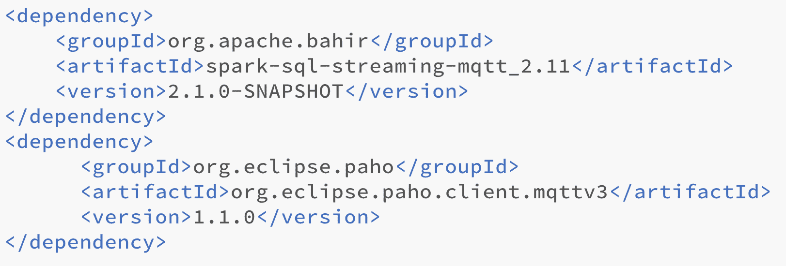
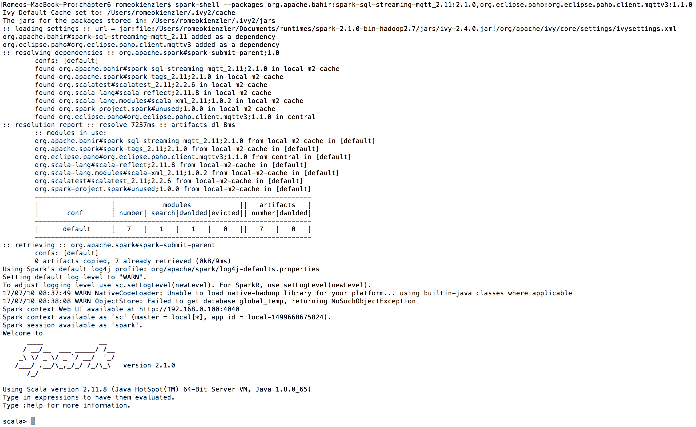
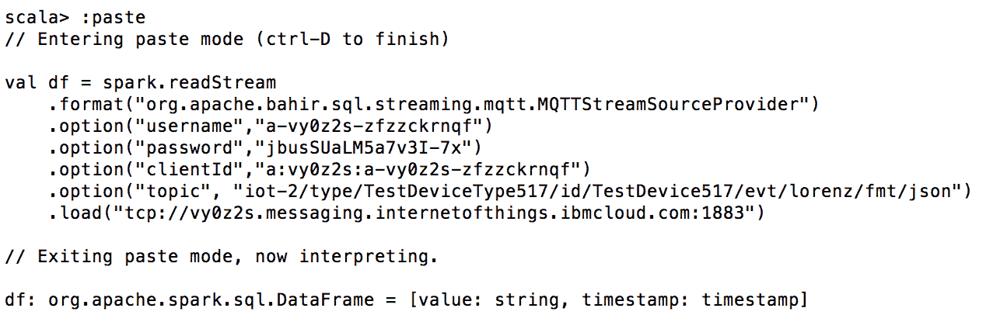
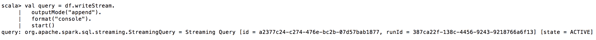
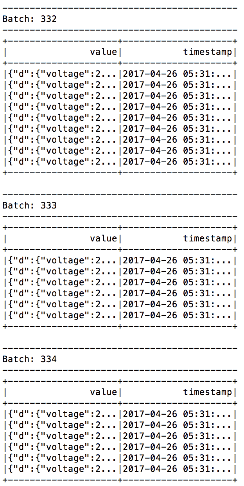

# 第三章：结构化流处理

正如你可能已经从前几章理解的那样，Apache Spark 目前正从基于 RDD 的数据处理过渡到更结构化的处理，背后有 DataFrames 和 Datasets 支持，以便让 Catalyst 和 Tungsten 发挥作用，进行性能优化。这意味着社区目前采用双轨制。虽然非结构化 API 仍然得到支持——它们甚至还没有被标记为已弃用，而且它们是否会这样做也值得怀疑——但在 Apache Spark V 2.0 中为各种组件引入了一套新的结构化 API，这也适用于 Spark Streaming。Structured Steaming 在 Apache Spark V 2.2 中被标记为稳定。请注意，截至 Apache Spark V 2.1 时...

# 连续应用的概念

流应用程序往往变得复杂。流计算不是孤立运行的；它们与存储系统、批处理应用程序和机器学习库交互。因此，与批处理相对的连续应用的概念应运而生，基本上意味着批处理和实时流处理的组合，其中流处理部分是应用程序的主要驱动力，并且仅访问由批处理过程创建或处理的数据以进行进一步增强。连续应用程序永不停止，并且随着新数据的到达而持续产生数据。

# 真正的统一 - 相同的代码，相同的引擎

因此，一个连续的应用程序也可以基于 RDD 和 DStreams 实现，但需要使用两种不同的 API。在 Apache Spark Structured Streaming 中，API 得到了统一。这种统一是通过将结构化流视为一张无边界的关系表来实现的，其中新数据不断追加到表的底部。在批处理中使用关系 API 或 SQL 处理 DataFrames 时，会创建中间 DataFrames。由于流和批处理在 Apache SparkSQL 引擎上得到了统一，当处理结构化流时，会创建无边界的中间关系表。

重要的是要注意，可以混合（连接）静态和增量...

# 窗口化

开源和商业流处理引擎，如 IBM Streams、Apache Storm 或 Apache Flink，都在使用窗口的概念。

Windows 指定了粒度或后续记录的数量，这些记录在执行流上的聚合函数时会被考虑。

# 流处理引擎如何使用窗口化

存在五个不同的属性，分为两个维度，这就是窗口如何被定义的方式，其中每个窗口定义都需要使用每个维度的一个属性。

第一个属性是连续流中元组的后续窗口可以创建的模式：滑动和翻滚。

第二个是必须指定落入窗口的元组数量：基于计数、基于时间或基于会话。

让我们来看看它们的含义：

+   **滑动窗口**：每当有新元组符合条件被纳入时，滑动窗口就会移除一个元组。

+   **翻滚窗口**：每当有足够多的元组到达以创建新窗口时，翻滚窗口就会移除所有元组。

+   **基于计数的...**

# Apache Spark 如何优化窗口操作

Apache Spark 结构化流在窗口处理模型中展现出显著的灵活性。由于流被视为持续追加的表，且表中每行都带有时间戳，窗口操作可以在查询中直接指定，每个查询可以定义不同的窗口。此外，如果静态数据中存在时间戳，窗口操作也可以定义，从而形成一个非常灵活的流处理模型。

换言之，Apache Spark 的窗口操作本质上是对时间戳列的一种特殊分组。这使得处理迟到数据变得非常简单，因为 Apache Spark 可以将迟到数据纳入适当的窗口，并在特定数据项迟到时重新计算该窗口。此功能高度可配置。

**事件时间与处理时间对比**：在时间序列分析中，尤其是在流计算中，每个记录都会被分配一个特定的时戳。一种创建这种时戳的方法是记录到达流处理引擎的时间。然而，这往往并非所需。通常，我们希望为每个记录分配一个事件时间，即该记录创建时的特定时间点，例如，当物联网设备进行测量时。这有助于处理事件创建与处理之间的延迟，例如，当物联网传感器离线一段时间，或网络拥堵导致数据交付延迟时。

在使用事件时间而非处理时间为每个元组分配唯一时戳时，迟到数据的概念颇具趣味。事件时间是指特定测量发生的时间戳。Apache Spark 结构化流能够自动透明地处理在稍后时间点到达的数据子集。

**迟到数据**：无论记录何时到达任何流引擎，都会立即处理。在此方面，Apache Spark 流处理与其他引擎并无二致。然而，Apache Spark 具备在任何时间确定特定元组所属窗口的能力。如果由于任何原因元组迟到，所有受影响的窗口将被更新，基于这些更新窗口的所有受影响聚合操作将重新运行。这意味着，如果迟到数据到达，结果允许随时间变化，而无需程序员为此担忧。最后，自 Apache Spark V2.1 起，可以使用`withWatermark`方法指定系统接受迟到数据的时间量。

水印基本上是阈值，用于定义延迟到达的数据点允许有多旧，以便仍能被包含在相应的窗口中。再次考虑 HTTP 服务器日志文件在超过一分钟长度的窗口上工作。如果，由于任何原因，一个数据元组到达，它超过 4 小时旧，如果这个应用程序用于创建基于小时的时间序列预测模型来为集群提供或取消提供额外的 HTTP 服务器，那么它可能没有意义将其包含在窗口中。一个四小时前的数据点就没有意义处理，即使它可能改变决策，因为决策已经做出。

# 与老朋友一起提升性能

正如在 Apache SparkSQL 中用于批处理，以及作为 Apache Spark 结构化流的一部分，Catalyst Planner 也为微批创建增量执行计划。这意味着整个流模型基于批处理。这也是为什么能够实现流处理和批处理的统一 API 的原因。我们付出的代价是，Apache Spark 流处理在面对极低延迟要求（亚秒级，在几十毫秒范围内）时有时会有缺点。正如结构化流和使用 DataFrame 及 Dataset 所暗示的，我们也因 Tungsten 项目带来的性能提升而受益，该项目在之前的...

# 如何实现透明的容错和精确一次投递保证

Apache Spark 结构化流支持完全崩溃容错和精确一次投递保证，而无需用户处理任何特定的错误处理例程。这不是很神奇吗？那么这是如何实现的呢？

完全崩溃容错和精确一次投递保证是系统理论中的术语。完全崩溃容错意味着你可以在任何时间点拔掉整个数据中心的电源，而不会丢失任何数据或留下不一致的状态。精确一次投递保证意味着，即使拔掉同一个电源插头，也能确保每个元组——从数据源到数据汇——仅且仅一次被投递。既不是零次，也不会超过一次。当然，这些概念也必须在一个节点失败或行为异常（例如开始限流）的情况下成立。

首先，各个批次和偏移量范围（源流中的位置）之间的状态保持在内存中，但由**预写日志**（**WAL**）在如 HDFS 这样的容错文件系统中支持。WAL 基本上是一个日志文件，以主动的方式反映整个流处理状态。这意味着在数据通过操作符转换之前，它首先以一种可以在崩溃后恢复的方式持久存储在 WAL 中。因此，换句话说，在处理单个迷你批次期间，工作者内存的区域以及流源的偏移位置都被持久化到磁盘。如果系统失败并需要恢复，它可以重新请求源中的数据块。当然，这只在源支持这种语义的情况下才可能。

# 可重放源可以从给定的偏移量重放流

端到端的一次性交付保证要求流源支持在请求位置进行某种流重放。这对于文件源和 Apache Kafka 等是正确的，例如，以及本章中示例将基于的 IBM Watson 物联网平台。

# 幂等接收器防止数据重复

端到端一次性交付保证的另一个关键是幂等接收器。这基本上意味着接收器知道过去哪些特定的写操作已经成功。这意味着这样的智能接收器可以在失败时重新请求数据，并在相同数据被发送多次时丢弃数据。

# 状态版本化确保重跑后结果一致

那么状态呢？设想一个机器学习算法在所有工作者上维护一个计数变量。如果你将完全相同的数据重放两次，你最终会多次计数这些数据。因此，查询计划器也在工作者内部维护一个版本化的键值映射，这些工作者依次将其状态持久化到 HDFS——这是设计上的容错机制。

因此，在发生故障时，如果数据需要被替换，计划器确保工作者使用正确的键值映射版本。

# 示例 - 连接到 MQTT 消息代理

那么，让我们从一个示例用例开始。让我们连接到一个**物联网**（**IoT**）传感器数据流。由于我们到目前为止还没有涉及机器学习，我们不分析数据，我们只是展示概念。

我们使用 IBM Watson 物联网平台作为流数据源。在其核心，Watson 物联网平台由**MQTT**（**消息队列遥测传输**）消息代理支持。MQTT 是 IBM 于 1999 年发明的一种轻量级遥测协议，并于 2013 年成为**OASIS**（**结构化信息标准促进组织**，一个全球非营利性联盟，致力于安全、物联网、能源、内容技术、应急管理等领域的标准开发、融合和采纳）的标准——物联网数据集成的实际标准。

应用程序间的消息传递可以由消息队列支持，这是一种支持各种交付模式的异步点对点通道的中间件系统，如**先进先出**（**FIFO**）、**后进先出**（**LIFO**）或**优先级队列**（其中每条消息可以根据特定标准重新排序）。

这已经是一个非常棒的功能，但仍然以某种方式耦合了应用程序，因为一旦消息被读取，它就对其他应用程序不可用了。

这种 N 对 N 通信实现起来较为困难（但并非不可能）。在发布/订阅模型中，应用程序完全解耦。不再存在任何队列，而是引入了主题的概念。数据提供者在特定主题上发布消息，而数据消费者则订阅这些主题。这样一来，N 对 N 通信的实现就变得非常直接，因为它反映了底层的消息传递模型。这种中间件被称为消息代理，与消息队列相对。

由于云服务不断变化，且本书稍后才会介绍云，以下教程解释了如何在云中设置测试数据生成器并连接到远程 MQTT 消息代理。在本例中，我们将使用 IBM Watson IoT 平台，这是一个在云中可用的 MQTT 消息代理。或者，也可以安装开源消息代理如 MOSQUITTO，它还提供了一个公开可用的测试安装，网址如下：[`test.mosquitto.org/`](http://test.mosquitto.org/)。

为了复现示例，以下步骤（1）和（2）是必要的，如以下教程所述：[`www.ibm.com/developerworks/library/iot-cognitive-iot-app-machine-learning/index.html`](https://www.ibm.com/developerworks/library/iot-cognitive-iot-app-machine-learning/index.html)。请确保在执行教程时记下`http_host`、`org`、`apiKey`和`apiToken`。这些信息稍后用于通过 Apache Spark 结构化流订阅数据。

由于 IBM Watson 物联网平台采用开放的 MQTT 标准，因此无需特殊的 IBM 组件即可连接到该平台。相反，我们使用 MQTT 和 Apache Bahir 作为 MQTT 与 Apache Spark 结构化流之间的连接器。

Apache Bahir 项目的目标是为包括 Apache Spark 和 Apache Flink 在内的各种数据处理引擎提供一组源和汇连接器，因为它们缺乏这些连接器。在这种情况下，我们将使用 Apache Bahir MQTT 数据源进行 MQTT 通信。

为了使用 Apache Bahir，我们需要向本地 maven 仓库添加两个依赖项。本章下载部分提供了一个完整的`pom.xml`文件。让我们看一下`pom.xml`的依赖部分：



我们基本上是在获取 Apache Bahir 的 MQTT Apache 结构化流适配器以及一个用于低级 MQTT 处理的依赖包。在`pom.xml`文件所在的目录中执行简单的`mvn dependency:resolve`命令，会将所需的依赖项拉取到我们的本地 maven 仓库，在那里它们可以被 Apache Spark 驱动程序访问并自动传输到 Apache Spark 工作节点。

另一种解决依赖关系的方法是在启动 spark-shell（spark-submit 同样适用）时使用以下命令；必要的依赖项会自动分发给工作节点：



现在我们需要之前获取的 MQTT 凭证。让我们在这里设置值：

```scala
val mqtt_host = "pcoyha.messaging.internetofthings.ibmcloud.com"
val org = "pcoyha"
val apiKey = "a-pcoyha-oaigc1k8ub"
val apiToken = "&wuypVX2yNgVLAcLr8"
var randomSessionId = scala.util.Random.nextInt(10000)
```

现在我们可以开始创建一个连接到 MQTT 消息代理的流。我们告诉 Apache Spark 使用 Apache Bahir MQTT 流源：

```scala
val df = spark.readStream.format("org.apache.bahir.sql.streaming.mqtt.MQTTStreamSourceProvider")
```

为了从 MQTT 消息代理拉取数据，我们需要指定凭证，如`username`、`password`和`clientId`；前面提到的教程链接解释了如何获取这些凭证：

```scala
    .option("username",apiKey)
    .option("password",apiToken)
    .option("clientId","a:"+org+":"+apiKey)
```

由于我们使用的是发布/订阅消息模型，我们必须提供我们正在订阅的主题——这个主题由您之前部署到云端的测试数据生成器使用：

```scala
.option("topic", "iot-2/type/WashingMachine/id/Washer01/evt/voltage/fmt/json")
```

一旦配置方面一切就绪，我们就必须提供端点主机和端口以创建流：

```scala
   .load("tcp://"+mqtt_host+":1883")
```

有趣的是，正如以下截图所示，这导致了 DataFrame 的创建：



请注意，模式固定为`[String, Timestamp]`，并且在流创建过程中无法更改——这是 Apache Bahir 库的一个限制。然而，使用丰富的 DataFrame API，您可以解析值（例如，JSON 字符串）并创建新列。

如前所述，这是 Apache Spark 结构化流的一个强大功能，因为相同的 DataFrame（和 Dataset）API 现在可以用于处理历史和实时数据。因此，让我们通过将其写入控制台来查看此流的

```scala
val query = df.writeStream.
outputMode("append").
format("console").
start()
```

作为输出模式，我们选择`append`以强制增量显示，并避免历史流的内容被反复写入控制台。作为`格式`，我们指定`console`，因为我们只想调试流上发生的情况：



最后，`start` 方法启动查询处理，如这里所示：



# 控制连续应用程序

一旦连续应用程序（即使是简单的，不考虑历史数据）启动并运行，它就必须以某种方式进行控制，因为调用 `start` 方法立即开始处理，但也不会阻塞返回。如果您希望程序在此阶段阻塞，直到应用程序完成，可以使用 `awaitTermination` 方法，如下所示：

```scala
query.awaitTermination()
```

这在预编译代码并使用 `spark-submit` 命令时尤为重要。当使用 `spark-shell` 时，应用程序无论如何都不会终止。

# 更多关于流生命周期管理

流式传输通常用于创建连续应用程序。这意味着该过程在后台运行，与批处理不同，它没有明确的停止时间；因此，由流式源支持的 DataFrames 和 Datasets 支持各种流生命周期管理方法，如下所述：

+   `start`：这启动了连续应用程序。此方法不会阻塞。如果这不是您想要的，请使用 `awaitTermination`。

+   `stop`：这终止了连续应用程序。

+   `awaitTermination`：如前所述，使用 `start` 方法启动流立即返回，这意味着调用不会阻塞。有时您希望等待直到流被终止，无论是由其他人调用 `stop` 还是由于错误。

+   `exception`：如果流因错误而停止，可以使用此方法读取原因。

+   `sourceStatus`：这是为了获取流式源的实时元信息。

+   `sinkStatus`：这是为了获取流式接收器的实时元信息。

Apache Spark 流式传输中的接收器很智能，因为它们支持故障恢复和端到端的一次性交付保证，如前所述。此外，Apache Spark 需要它们支持不同的输出方法。目前，以下三种输出方法 `append`、`update` 和 `complete` 显著改变了底层语义。以下段落包含有关不同输出方法的更多详细信息。

不同的输出模式在接收器上：接收器可以指定以不同方式处理输出。这称为 `outputMode`。最简单的选择是使用增量方法，因为我们无论如何都在处理增量数据流。此模式称为 `append`。然而，存在一些需求，其中已经由接收器处理的数据必须更改。一个例子是特定时间窗口中缺失数据的延迟到达问题，一旦为该特定时间窗口重新计算，就可能导致结果改变。此模式称为 `complete`。

自 Apache Spark 2.1 版本起，引入了`update`模式，其行为类似于`complete`模式，但仅更改已修改的行，从而节省处理资源并提高速度。某些模式不支持所有查询类型。由于这不断变化，最好参考[`spark.apache.org/docs/latest/streaming-programming-guide.html`](http://spark.apache.org/docs/latest/streaming-programming-guide.html)上的最新文档。

# 总结

那么为什么在同一个数据处理框架内会有两种不同的流处理引擎呢？我们希望在阅读本章后，您会认同经典 DStream 引擎的主要痛点已得到解决。以前，基于事件时间的处理是不可能的，只考虑了数据的到达时间。随后，延迟数据仅以错误的时戳进行处理，因为只能使用处理时间。此外，批处理和流处理需要使用两种不同的 API：RDD 和 DStreams。尽管 API 相似，但并不完全相同；因此，在两种范式之间来回切换时重写代码是必要的。最后，端到端的交付保证难以实现...
