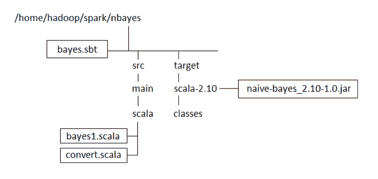
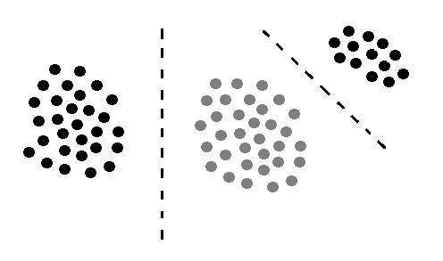
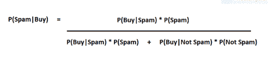
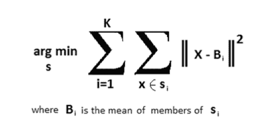
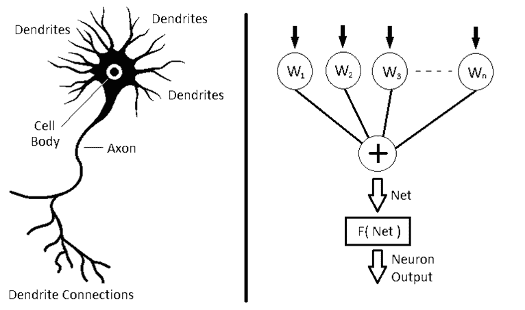
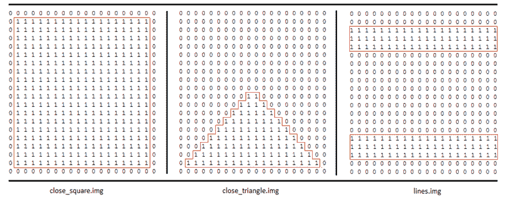
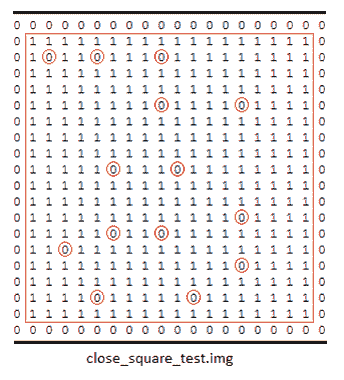
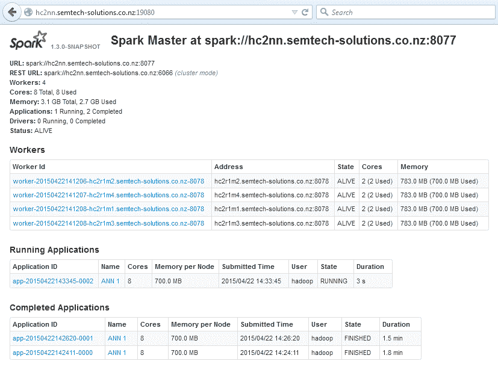
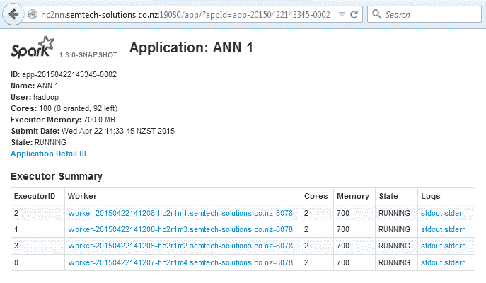
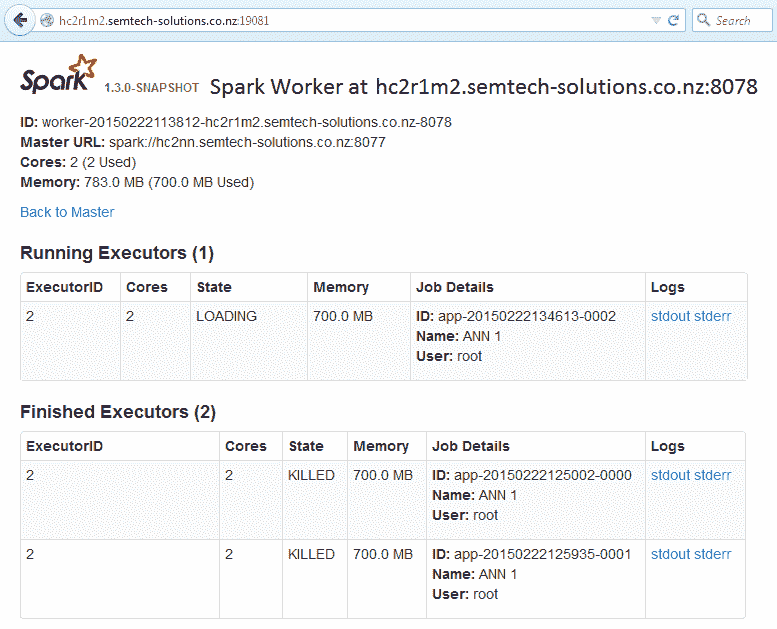

# 第四章：Apache Spark MLlib

MLlib 是 Apache Spark 附带的原始机器学习库，Apache Spark 是一个基于内存的集群式开源数据处理系统。该库仍然基于 RDD API。在本章中，我们将从回归、分类和神经网络处理等领域来探讨 MLlib 库提供的功能。在提供解决实际问题的示例之前，我们将先探讨每种算法的理论基础。网络上的示例代码和文档可能稀少且令人困惑。

我们将采取逐步的方式来描述以下算法的使用方法及其功能：

+   架构

+   使用朴素贝叶斯进行分类

+   K-Means 聚类

+   使用**人工神经网络**进行图像分类

# 架构

请记住，尽管 Spark 因其内存中的分布式处理速度而被使用，但它并不提供存储。您可以使用主机（本地）文件系统来读写数据，但如果您的数据量足够大，可以称之为大数据，那么使用基于云的分布式存储系统（如 OpenStack Swift 对象存储）是有意义的，该系统可以在许多云环境中找到，也可以安装在私有数据中心中。

如果需要极高的 I/O 性能，HDFS 也是一个选项。更多关于 HDFS 的信息可以在这里找到：[`hadoop.apache.org/docs/current/hadoop-project-dist/hadoop-hdfs/HdfsDesign.html`](http://hadoop.apache.org/docs/current/hadoop-project-dist/hadoop-hdfs/HdfsDesign.html)。

# 开发环境

本书中的代码示例将使用 Scala 语言编写。这是因为作为一种脚本语言，它产生的代码比 Java 少。它也可以在 Spark shell 中使用，以及与 Apache Spark 应用程序一起编译。我们将使用**sbt 工具**来编译 Scala 代码，我们已经按照以下方式将其安装到 Hortonworks HDP 2.6 Sandbox 中：

```scala
[hadoop@hc2nn ~]# sudo su -
[root@hc2nn ~]# cd /tmp
[root@hc2nn ~]#wget http://repo.scala-sbt.org/scalasbt/sbt-native-packages/org/scala-sbt/sbt/0.13.1/sbt.rpm
[root@hc2nn ~]# rpm -ivh sbt.rpm
```

以下 URL 提供了在包括 Windows、Linux 和 macOS 在内的其他操作系统上安装 sbt 的说明：[`www.scala-sbt.org/0.13/docs/Setup.html`](http://www.scala-sbt.org/0.13/docs/Setup.html)。

我们使用了一个名为**Hadoop**的通用 Linux 账户。如前述命令所示，我们需要以 root 账户安装`sbt`，我们通过`sudo su -l`（切换用户）访问了该账户。然后，我们使用`wget`从名为`repo.scala-sbt.org`的基于网络的服务器下载了`sbt.rpm`文件到`/tmp`目录。最后，我们使用带有`i`（安装）、`v`（验证）和`h`（打印哈希标记）选项的`rpm`命令安装了`rpm`文件。

本章中，我们在 Linux 服务器上使用 Linux Hadoop 账户开发了 Apache Spark 的所有 Scala 代码。我们将每组代码放置在`/home/hadoop/spark`下的一个子目录中。例如，以下`sbt`结构图显示 MLlib 朴素贝叶斯代码存储在 Spark 目录下的名为`nbayes`的子目录中。该图还显示，Scala 代码是在`nbayes`目录下的`src/main/scala`子目录结构中开发的。名为`bayes1.scala`和`convert.scala`的文件包含将在下一节中使用的朴素贝叶斯代码：



`bayes.sbt`文件是`sbt`工具使用的配置文件，描述了如何编译 Scala 目录内的 Scala 文件。（注意，如果你使用 Java 开发，你将使用`nbayes/src/main/java`这样的路径。）接下来展示`bayes.sbt`文件的内容。`pwd`和`cat`Linux 命令提醒你文件位置，并提示你查看文件内容。

`name`、`version`和`scalaVersion`选项设置项目详细信息及使用的 Scala 版本。`libraryDependencies`选项定义 Hadoop 和 Spark 库的位置。

```scala
[hadoop@hc2nn nbayes]$ pwd
/home/hadoop/spark/nbayes
[hadoop@hc2nn nbayes]$ cat bayes.sbt 
name := "Naive Bayes"
version := "1.0"
scalaVersion := "2.11.2"
libraryDependencies += "org.apache.hadoop" % "hadoop-client" % "2.8.1"
libraryDependencies += "org.apache.spark" %% "spark-core" % "2.6.0"
libraryDependencies += "org.apache.spark" %% "spark-mllib" % "2.1.1"
```

可以使用以下命令从`nbayes`子目录编译 Scala `nbayes`项目代码：

```scala
[hadoop@hc2nn nbayes]$ sbt compile
```

`sbt compile`命令用于将代码编译成类。这些类随后被放置在`nbayes/target/scala-2.10/classes`目录下。使用此命令可将编译后的类打包成 JAR 文件：

```scala
[hadoop@hc2nn nbayes]$ sbt package
```

`sbt package`命令将在`nbayes/target/scala-2.10`目录下创建一个 JAR 文件。如**sbt 结构图**所示例中，编译打包成功后，名为`naive-bayes_2.10-1.0.jar`的 JAR 文件已被创建。此 JAR 文件及其包含的类可通过`spark-submit`命令使用。随着对 Apache Spark MLlib 模块功能的探索，这将在后面描述。

# 使用朴素贝叶斯进行分类

本节将提供一个 Apache Spark MLlib 朴素贝叶斯算法的实际示例。它将阐述该算法的理论基础，并提供一个逐步的 Scala 示例，展示如何使用该算法。

# 分类理论

要使用朴素贝叶斯算法对数据集进行分类，数据必须是线性可分的；即数据中的类别必须能通过类别边界线性分割。下图通过三条数据集和两条虚线表示的类别边界直观解释了这一点：



朴素贝叶斯假设数据集内的特征（或维度）彼此独立；即它们互不影响。以下示例考虑将电子邮件分类为垃圾邮件。如果你有 100 封电子邮件，则执行以下操作：

```scala
60% of emails are spam
80% of spam emails contain the word buy
20% of spam emails don't contain the word buy
40% of emails are not spam
10% of non spam emails contain the word buy
90% of non spam emails don't contain the word buy
```

让我们将此示例转换为条件概率，以便朴素贝叶斯分类器可以识别：

```scala
P(Spam) = the probability that an email is spam = 0.6
P(Not Spam) = the probability that an email is not spam = 0.4
P(Buy|Spam) = the probability that an email that is spam has the word buy = 0.8
P(Buy|Not Spam) = the probability that an email that is not spam has the word buy = 0.1
```

包含单词“buy”的电子邮件是垃圾邮件的概率是多少？这可以写为*P(Spam|Buy)*。朴素贝叶斯表示，它由以下等式描述：



因此，使用之前的百分比数据，我们得到以下结果：

*P(Spam|Buy) = ( 0.8 * 0.6 ) / (( 0.8 * 0.6 ) + ( 0.1 * 0.4 ) ) = ( .48 ) / ( .48 + .04 )*

*= .48 / .52 = .923*

这意味着包含单词“buy”的电子邮件是垃圾邮件的可能性*92%*更高。以上是理论部分；现在是时候尝试一个使用 Apache Spark MLlib 朴素贝叶斯算法的真实示例了。

# 朴素贝叶斯实践

第一步是选择一些用于分类的数据。我们选择了英国政府数据网站上的一些数据，网址为[`data.gov.uk/dataset/road-accidents-safety-data`](http://data.gov.uk/dataset/road-accidents-safety-data)。

数据集名为**道路安全 - 数字呼吸测试数据 2013**，下载一个名为`DigitalBreathTestData2013.txt`的压缩文本文件。该文件包含大约五十万行。数据如下所示：

```scala
Reason,Month,Year,WeekType,TimeBand,BreathAlcohol,AgeBand,GenderSuspicion of Alcohol,Jan,2013,Weekday,12am-4am,75,30-39,MaleMoving Traffic Violation,Jan,2013,Weekday,12am-4am,0,20-24,MaleRoad Traffic Collision,Jan,2013,Weekend,12pm-4pm,0,20-24,Female
```

为了对数据进行分类，我们对列进行了修改...

# 使用 K-Means 进行聚类

本例将使用与前例相同的测试数据，但我们尝试使用 MLlib 的 K-Means 算法在数据中寻找簇。

# 聚类理论

K-Means 算法通过迭代尝试，通过最小化簇中心向量的均值与新候选簇成员向量之间的距离，来确定测试数据中的簇。以下等式假设数据集成员范围从*X1*到*Xn*；同时也假设*K*个簇集合，范围从*S1*到*Sk*，其中*K <= n*。



# K-Means 实践

MLlib 的 K-Means 功能使用`LabeledPoint`结构处理数据，因此需要数值输入数据。由于正在重复使用上一节的数据，我们将不再解释数据转换。本节中数据方面的唯一变化是，处理将在 HDFS 下的`/data/spark/kmeans/`目录进行。此外，K-Means 示例的转换 Scala 脚本生成的记录全部以逗号分隔。

为了将工作与其他开发分开，K-Means 示例的开发和处理已在`/home/hadoop/spark/kmeans`目录下进行。`sbt`配置文件现在称为`kmeans.sbt`，与上一个示例相同，只是项目名称不同：

```scala
name := "K-Means"
```

本节代码可在软件包的`chapter7\K-Means`目录下找到。因此，查看存储在`kmeans/src/main/scala`下的`kmeans1.scala`代码，会发现一些类似的操作。导入语句引用了 Spark 上下文和配置。然而，这一次，K-Means 功能是从 MLlib 导入的。此外，为了这个例子，应用程序类名已更改为`kmeans1`：

```scala
import org.apache.spark.SparkContext
import org.apache.spark.SparkContext._
import org.apache.spark.SparkConf
import org.apache.spark.mllib.linalg.Vectors
import org.apache.spark.mllib.clustering.{KMeans,KMeansModel}

object kmeans1 extends App {
```

与上例相同，正在采取行动定义数据文件——定义 Spark 配置并创建 Spark 上下文：

```scala
 val hdfsServer = "hdfs://localhost:8020"
 val hdfsPath   = "/data/spark/kmeans/" 
 val dataFile   = hdfsServer + hdfsPath + "DigitalBreathTestData2013-MALE2a.csv"
 val sparkMaster = "spark://localhost:7077"
 val appName = "K-Means 1"
 val conf = new SparkConf()
 conf.setMaster(sparkMaster)
 conf.setAppName(appName)
 val sparkCxt = new SparkContext(conf)
```

接下来，从数据文件加载 CSV 数据，并通过逗号字符分割到`VectorData`变量中：

```scala
 val csvData = sparkCxt.textFile(dataFile)
 val VectorData = csvData.map {
   csvLine =>
     Vectors.dense( csvLine.split(',').map(_.toDouble))
 }
```

`KMeans`对象被初始化，并设置参数以定义簇的数量和确定它们的最大迭代次数：

```scala
 val kMeans = new KMeans
 val numClusters         = 3
 val maxIterations       = 50
```

为初始化模式、运行次数和 Epsilon 定义了一些默认值，这些值是我们进行 K-Means 调用所需的，但在处理过程中并未改变。最后，这些参数被设置到`KMeans`对象上：

```scala
 val initializationMode = KMeans.K_MEANS_PARALLEL
 val numRuns            = 1
 val numEpsilon         = 1e-4 
 kMeans.setK( numClusters )
 kMeans.setMaxIterations( maxIterations )
 kMeans.setInitializationMode( initializationMode )
 kMeans.setRuns( numRuns )
 kMeans.setEpsilon( numEpsilon )
```

我们缓存了训练向量数据以提高性能，并使用向量数据训练了`KMeans`对象，创建了一个经过训练的 K-Means 模型：

```scala
 VectorData.cache
 val kMeansModel = kMeans.run( VectorData )
```

我们计算了 K-Means 成本和输入数据行数，并通过`println`语句输出了结果。成本值表示簇的紧密程度以及簇之间的分离程度：

```scala
 val kMeansCost = kMeansModel.computeCost( VectorData ) 
 println( "Input data rows : " + VectorData.count() )
 println( "K-Means Cost   : " + kMeansCost )
```

接下来，我们使用 K-Means 模型打印出计算出的三个簇中每个簇的中心作为向量：

```scala
 kMeansModel.clusterCenters.foreach{ println }
```

最后，我们使用 K-Means 模型的预测函数来创建一个簇成员资格预测列表。然后，我们按值计数这些预测，以给出每个簇中数据点的计数。这显示了哪些簇更大，以及是否真的存在三个簇：

```scala
 val clusterRddInt = kMeansModel.predict( VectorData ) 
 val clusterCount = clusterRddInt.countByValue
  clusterCount.toList.foreach{ println }
} // end object kmeans1
```

因此，为了运行此应用程序，必须从`kmeans`子目录进行编译和打包，正如 Linux 的`pwd`命令所示：

```scala
[hadoop@hc2nn kmeans]$ pwd
/home/hadoop/spark/kmeans
[hadoop@hc2nn kmeans]$ sbt package
Loading /usr/share/sbt/bin/sbt-launch-lib.bash
[info] Set current project to K-Means (in build file:/home/hadoop/spark/kmeans/)
[info] Compiling 2 Scala sources to /home/hadoop/spark/kmeans/target/scala-2.10/classes...
[info] Packaging /home/hadoop/spark/kmeans/target/scala-2.10/k-means_2.10-1.0.jar ...
[info] Done packaging.
[success] Total time: 20 s, completed Feb 19, 2015 5:02:07 PM
```

一旦打包成功，我们检查 HDFS 以确保测试数据已就绪。如前例所示，我们使用软件包中提供的`convert.scala`文件将数据转换为数值形式。我们将处理 HDFS 目录`/data/spark/kmeans`中的`DigitalBreathTestData2013-MALE2a.csv`数据文件，如下所示：

```scala
[hadoop@hc2nn nbayes]$ hdfs dfs -ls /data/spark/kmeans
Found 3 items
-rw-r--r--   3 hadoop supergroup   24645166 2015-02-05 21:11 /data/spark/kmeans/DigitalBreathTestData2013-MALE2.csv
-rw-r--r--   3 hadoop supergroup   5694226 2015-02-05 21:48 /data/spark/kmeans/DigitalBreathTestData2013-MALE2a.csv
drwxr-xr-x   - hadoop supergroup         0 2015-02-05 21:46 /data/spark/kmeans/result
```

使用`spark-submit`工具运行 K-Means 应用程序。此命令中唯一的更改是类名现在是`kmeans1`：

```scala
spark-submit \
 --class kmeans1 \
 --master spark://localhost:7077 \
 --executor-memory 700M \
 --total-executor-cores 100 \
 /home/hadoop/spark/kmeans/target/scala-2.10/k-means_2.10-1.0.jar
```

来自 Spark 集群运行的输出显示如下：

```scala
Input data rows : 467054
K-Means Cost   : 5.40312223450789E7
```

先前的输出显示了输入数据量，看起来是正确的；它还显示了`K-Means 成本`值。该成本基于**内部总和平方误差（WSSSE）**，基本上给出了找到的簇质心与数据点分布匹配程度的度量。匹配得越好，成本越低。以下链接[`datasciencelab.wordpress.com/2013/12/27/finding-the-k-in-k-means-clustering/`](https://datasciencelab.wordpress.com/2013/12/27/finding-the-k-in-k-means-clustering/)更详细地解释了 WSSSE 以及如何找到一个好的**k**值。

接下来是三个向量，它们描述了具有正确维数的数据簇中心。请记住，这些簇质心向量将具有与原始向量数据相同的列数：

```scala
[0.24698249738061878,1.3015883142472253,0.005830116872250263,2.9173747788555207,1.156645130895448,3.4400290524342454] 
[0.3321793984152627,1.784137241326256,0.007615970459266097,2.5831987075928917,119.58366028156011,3.8379106085083468] 
[0.25247226760684494,1.702510963969387,0.006384899819416975,2.231404248000688,52.202897927594805,3.551509158139135]
```

最后，给出了 1 至 3 簇的簇成员资格，其中簇 1（索引 0）拥有最大的成员资格，有`407539`个成员向量：

```scala
(0,407539)
(1,12999)
(2,46516)
```

因此，这两个示例展示了如何使用朴素贝叶斯和 K-Means 对数据进行分类和聚类。如果我想对图像或更复杂的模式进行分类，并使用黑盒方法进行分类呢？下一节将探讨基于 Spark 的分类，使用**ANNs**，即**人工神经网络**。

# 人工神经网络

下图左侧展示了一个简单的生物神经元。该神经元具有接收其他神经元信号的树突。细胞体控制激活，轴突将电脉冲传递到其他神经元的树突。右侧的人工神经元有一系列加权输入：一个汇总函数，将输入分组，以及一个**触发机制**（**F(Net)**），该机制决定输入是否达到阈值，如果是，则神经元将触发：



神经网络对噪声图像和失真具有容忍度，因此在需要潜在的...黑盒分类方法时非常有用。

# ANN 实践

为了开始 ANN 训练，需要测试数据。鉴于这种分类方法应该擅长分类扭曲或噪声图像，我们决定在这里尝试对图像进行分类：



它们是手工制作的文本文件，包含由 1 和 0 组成的形状块。当存储在 HDFS 上时，回车符会被移除，使得图像呈现为单行向量。因此，ANN 将对一系列形状图像进行分类，然后与添加了噪声的相同图像进行测试，以确定分类是否仍然有效。有六张训练图像，每张图像将被赋予一个从 0.1 到 0.6 的任意训练标签。因此，如果 ANN 呈现一个闭合的正方形，它应该返回标签 0.1。下图展示了一个带有噪声的测试图像示例。

通过在图像内添加额外的零（0）字符创建的噪声已被突出显示：



与之前一样，ANN 代码是在 Linux Hadoop 账户下的`spark/ann`子目录中开发的。`ann.sbt`文件位于`ann`目录中：

```scala
[hadoop@hc2nn ann]$ pwd
/home/hadoop/spark/ann

[hadoop@hc2nn ann]$ ls
ann.sbt   project src target
```

`ann.sbt`文件的内容已更改，以使用 Spark 依赖项 JAR 库文件的完整路径：

```scala
name := "A N N"
version := "1.0"
scalaVersion := "2.11.2"
libraryDependencies += "org.apache.hadoop" % "hadoop-client" % "2.8.1"
libraryDependencies += "org.apache.spark" % "spark-core" % "2.6.0"
libraryDependencies += "org.apache.spark" % "spark-mllib" % "2.1.1"
libraryDependencies += "org.apache.spark" % "akka" % "2.5.3"
```

如前例所示，实际要编译的 Scala 代码存放在名为`src/main/scala`的子目录中。我们创建了两个 Scala 程序。第一个程序使用输入数据进行训练，然后用同一输入数据测试 ANN 模型。第二个程序则用噪声数据测试已训练模型的扭曲数据分类能力：

```scala
[hadoop@hc2nn scala]$ pwd
/home/hadoop/spark/ann/src/main/scala 
[hadoop@hc2nn scala]$ ls
test_ann1.scala test_ann2.scala
```

我们将检查第一个 Scala 文件，然后仅展示第二个文件的额外特性，因为两个示例在训练 ANN 之前非常相似。此处展示的代码示例可在本书提供的软件包中的路径`chapter2\ANN`下找到。因此，要检查第一个 Scala 示例，导入语句与前例类似。正在导入 Spark 上下文、配置、向量和`LabeledPoint`。这次还导入了用于 RDD 处理的`RDD`类以及新的 ANN 类`ANNClassifier`。请注意，MLlib/分类例程广泛使用`LabeledPoint`结构作为输入数据，该结构将包含要训练的特征和标签：

```scala
import org.apache.spark.SparkContext
import org.apache.spark.SparkContext._
import org.apache.spark.SparkConf 
import org.apache.spark.mllib.classification.ANNClassifier
import org.apache.spark.mllib.regression.LabeledPoint
import org.apache.spark.mllib.linalg.Vectors
import org.apache.spark.mllib.linalg._
import org.apache.spark.rdd.RDD 

object testann1 extends App {
```

本例中的应用程序类名为`testann1`。要处理的 HDFS 文件已根据 HDFS 的`server`、`path`和文件名定义：

```scala
 val server = "hdfs://localhost:8020"
 val path   = "/data/spark/ann/"

 val data1 = server + path + "close_square.img"
 val data2 = server + path + "close_triangle.img"
 val data3 = server + path + "lines.img"
 val data4 = server + path + "open_square.img"
 val data5 = server + path + "open_triangle.img"
 val data6 = server + path + "plus.img"
```

Spark 上下文已使用 Spark 实例的 URL 创建，现在端口号不同——`8077`。应用程序名称为`ANN 1`。当应用程序运行时，这将在 Spark Web UI 上显示：

```scala
 val sparkMaster = "spark://localhost:8077"
 val appName = "ANN 1"
 val conf = new SparkConf()

 conf.setMaster(sparkMaster)
 conf.setAppName(appName)

 val sparkCxt = new SparkContext(conf)
```

基于 HDFS 的输入训练和测试数据文件被加载。每行上的值通过空格字符分割，数值已转换为双精度数。包含此数据的变量随后存储在一个名为**inputs**的数组中。同时，创建了一个名为 outputs 的数组，包含从`0.1`到`0.6`的标签。这些值将用于对输入模式进行分类：

```scala
 val rData1 = sparkCxt.textFile(data1).map(_.split(" ").map(_.toDouble)).collect
 val rData2 = sparkCxt.textFile(data2).map(_.split(" ").map(_.toDouble)).collect
 val rData3 = sparkCxt.textFile(data3).map(_.split(" ").map(_.toDouble)).collect
 val rData4 = sparkCxt.textFile(data4).map(_.split(" ").map(_.toDouble)).collect
 val rData5 = sparkCxt.textFile(data5).map(_.split(" ").map(_.toDouble)).collect
 val rData6 = sparkCxt.textFile(data6).map(_.split(" ").map(_.toDouble)).collect 
 val inputs = Array[Array[Double]] (
     rData1(0), rData2(0), rData3(0), rData4(0), rData5(0), rData6(0) ) 
 val outputs = ArrayDouble
```

代表输入数据特征和标签的输入和输出数据随后被合并并转换为`LabeledPoint`结构。最后，数据被并行化，以便为最佳并行处理进行分区：

```scala
 val ioData = inputs.zip( outputs )
 val lpData = ioData.map{ case(features,label) =>

   LabeledPoint( label, Vectors.dense(features) )
 }
 val rddData = sparkCxt.parallelize( lpData )
```

变量用于定义人工神经网络（ANN）的隐藏层拓扑结构。在此例中，我们选择了两个隐藏层，每层各有 100 个神经元。同时定义了最大迭代次数、批次大小（六个模式）以及收敛容差。容差指的是训练误差达到多大时，我们可以认为训练已经成功。接着，根据这些配置参数和输入数据创建了一个 ANN 模型：

```scala
 val hiddenTopology : Array[Int] = Array( 100, 100 )
 val maxNumIterations = 1000
 val convTolerance   = 1e-4
 val batchSize       = 6
 val annModel = ANNClassifier.train(rddData,
                                    batchSize,
                                    hiddenTopology,
                                    maxNumIterations,
                                    convTolerance)
```

为了测试已训练的 ANN 模型，使用相同的输入训练数据作为测试数据以获取预测标签。首先，创建一个名为`rPredictData`的输入数据变量。然后，数据被分区，并最终使用已训练的 ANN 模型获取预测结果。为了使该模型工作，它必须输出标签，即`0.1`到`0.6`：

```scala
 val rPredictData = inputs.map{ case(features) => 
   ( Vectors.dense(features) )
 }
 val rddPredictData = sparkCxt.parallelize( rPredictData )
 val predictions = annModel.predict( rddPredictData )
```

打印标签预测结果，脚本以闭合括号结束：

```scala
 predictions.toArray().foreach( value => println( "prediction > " + value ) )
} // end ann1
```

因此，要运行此代码示例，首先必须对其进行编译和打包。至此，您应该已经熟悉了从`ann`子目录执行的`sbt`命令：

```scala
[hadoop@hc2nn ann]$ pwd
/home/hadoop/spark/ann
[hadoop@hc2nn ann]$ sbt package
```

然后，在新`spark/spark`路径内使用新的基于 Spark 的 URL（端口`8077`）运行应用程序`testann1`，使用`spark-submit`命令：

```scala
/home/hadoop/spark/spark/bin/spark-submit \
 --class testann1 \
 --master spark://localhost:8077 \
 --executor-memory 700M \
 --total-executor-cores 100 \
 /home/hadoop/spark/ann/target/scala-2.10/a-n-n_2.10-1.0.jar
```

通过访问 Apache Spark 网页 URL `http://localhost:19080/`，现在可以看到应用程序正在运行。下图显示了`ANN 1`应用程序的运行情况以及先前完成的执行：



通过选择其中一个集群主机工作实例，可以看到实际执行集群处理的工作实例的执行程序列表：



最后，通过选择其中一个执行程序，可以看到其历史和配置，以及到日志文件和错误信息的链接。在这一级别，借助提供的日志信息，可以进行调试。可以检查这些日志文件以处理错误消息：



`ANN 1`应用程序提供了以下输出，以显示它已正确地对相同输入数据进行了重新分类。重新分类成功，因为每个输入模式都被赋予了与其训练时相同的标签：

```scala
prediction > 0.1
prediction > 0.2
prediction > 0.3
prediction > 0.4
prediction > 0.5
prediction > 0.6
```

这表明 ANN 训练和测试预测将适用于相同的数据。现在，我们将使用相同的数据进行训练，但测试时使用扭曲或含噪声的数据，我们已展示了一个示例。该示例可在软件包中的`test_ann2.scala`文件中找到。它与第一个示例非常相似，因此我们将仅展示更改的代码。该应用程序现在称为`testann2`：

```scala
object testann2 extends App
```

在 ANN 模型使用训练数据创建后，会生成一组额外的测试数据。此测试数据包含噪声：

```scala
 val tData1 = server + path + "close_square_test.img"
 val tData2 = server + path + "close_triangle_test.img"
 val tData3 = server + path + "lines_test.img"
 val tData4 = server + path + "open_square_test.img"
 val tData5 = server + path + "open_triangle_test.img"
 val tData6 = server + path + "plus_test.img"
```

此数据被处理成输入数组并分区以供集群处理：

```scala
 val rtData1 = sparkCxt.textFile(tData1).map(_.split(" ").map(_.toDouble)).collect
 val rtData2 = sparkCxt.textFile(tData2).map(_.split(" ").map(_.toDouble)).collect
 val rtData3 = sparkCxt.textFile(tData3).map(_.split(" ").map(_.toDouble)).collect
 val rtData4 = sparkCxt.textFile(tData4).map(_.split(" ").map(_.toDouble)).collect
 val rtData5 = sparkCxt.textFile(tData5).map(_.split(" ").map(_.toDouble)).collect
 val rtData6 = sparkCxt.textFile(tData6).map(_.split(" ").map(_.toDouble)).collect 
 val tInputs = Array[Array[Double]] (
     rtData1(0), rtData2(0), rtData3(0), rtData4(0), rtData5(0), rtData6(0) )

 val rTestPredictData = tInputs.map{ case(features) => ( Vectors.dense(features) ) }
 val rddTestPredictData = sparkCxt.parallelize( rTestPredictData )
```

它随后以与第一个示例相同的方式生成标签预测。如果模型正确分类数据，则应从`0.1`到`0.6`打印相同的标签值：

```scala
 val testPredictions = annModel.predict( rddTestPredictData )
 testPredictions.toArray().foreach( value => println( "test prediction > " + value ) )
```

代码已经编译完成，因此可以使用`spark-submit`命令运行：

```scala
/home/hadoop/spark/spark/bin/spark-submit \
 --class testann2 \
 --master spark://localhost:8077 \
 --executor-memory 700M \
 --total-executor-cores 100 \
 /home/hadoop/spark/ann/target/scala-2.10/a-n-n_2.10-1.0.jar
```

本脚本的集群输出显示了使用训练好的 ANN 模型对一些噪声测试数据进行成功分类的情况。噪声数据已被正确分类。例如，如果训练模型出现混淆，它可能会对位置一的噪声`close_square_test.img`测试图像给出 0.15 的值，而不是像实际那样返回`0.1`：

```scala
test prediction > 0.1
test prediction > 0.2
test prediction > 0.3
test prediction > 0.4
test prediction > 0.5
test prediction > 0.6
```

# 总结

本章试图为你概述 Apache Spark MLlib 模块中可用的一些功能。它还展示了即将在 ANNs 或人工神经网络方面可用的功能。你可能会对 ANNs 的工作效果印象深刻。由于时间和篇幅限制，本章无法涵盖 MLlib 的所有领域。此外，我们现在希望在下一章中更多地关注 SparkML 库，该库通过支持 DataFrames 以及底层 Catalyst 和 Tungsten 优化来加速机器学习。

我们学习了如何开发基于 Scala 的示例，用于朴素贝叶斯分类、K-Means 聚类和 ANNs。你了解了如何准备测试...
