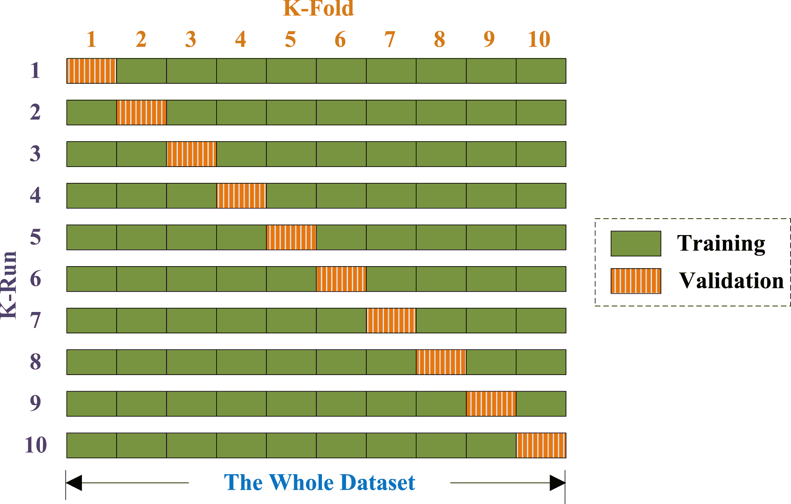
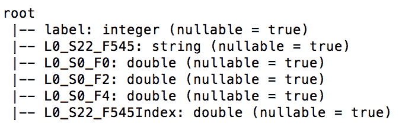
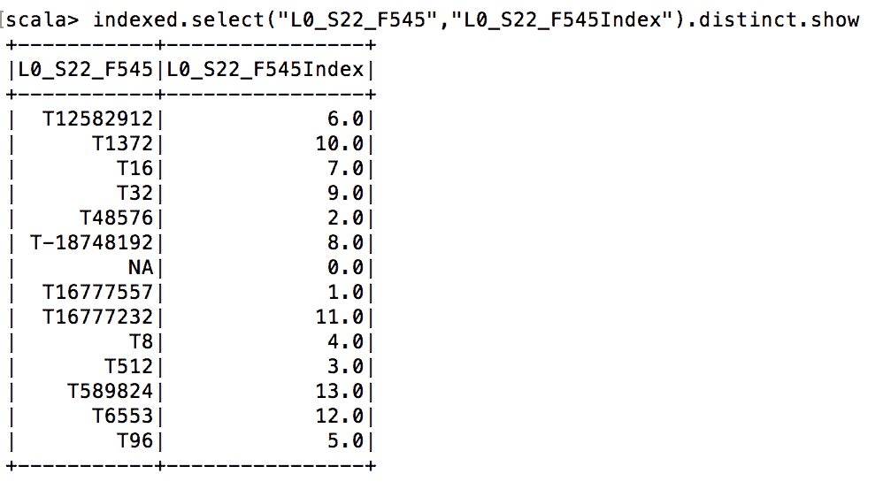
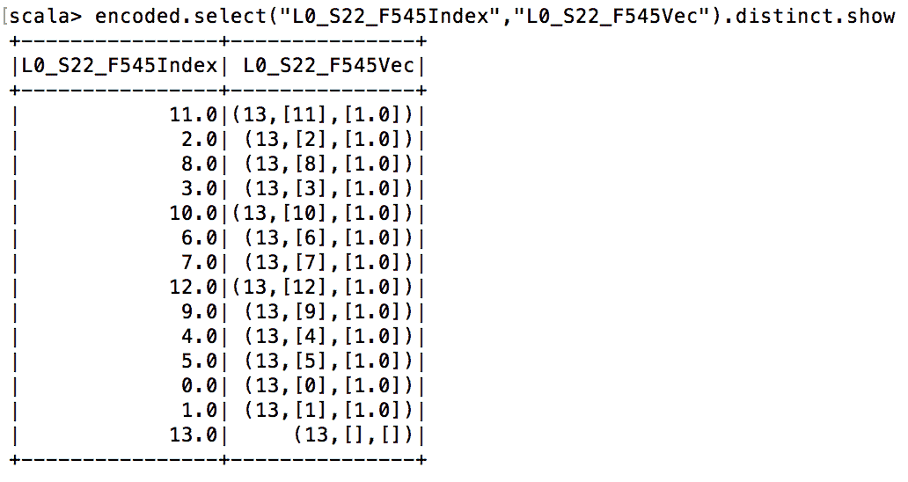
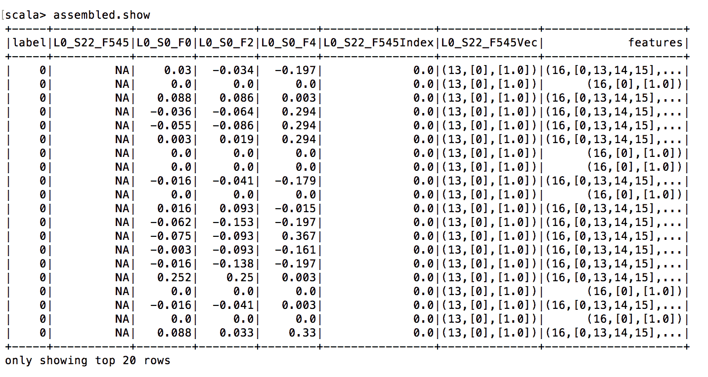
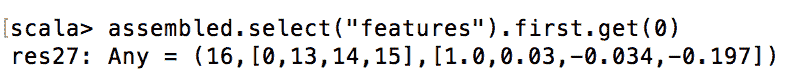
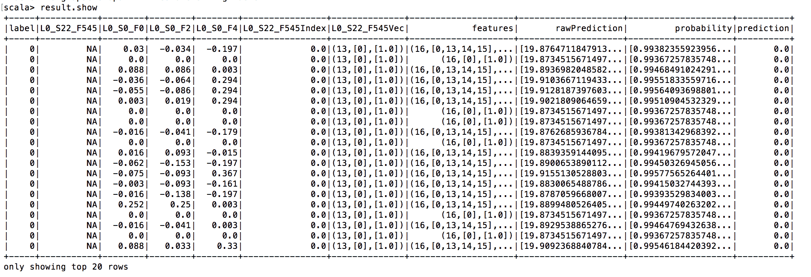

# 第五章：Apache SparkML

既然你已经学了很多关于 MLlib 的知识，为什么还需要另一个 ML API 呢？首先，在数据科学中，与多个框架和 ML 库合作是一项常见任务，因为它们各有优劣；大多数情况下，这是性能和功能之间的权衡。例如，R 在功能方面是王者——存在超过 6000 个 R 附加包。然而，R 也是数据科学执行环境中最慢的之一。另一方面，SparkML 目前功能相对有限，但却是速度最快的库之一。为什么会这样呢？这引出了 SparkML 存在的第二个原因。

RDD 与 DataFrames 和 Datasets 之间的二元性就像本书中的一条红线，并且不断影响着机器学习章节。由于 MLlib 设计为在 RDD 之上工作，SparkML 在 DataFrames 和 Datasets 之上工作，因此利用了 Catalyst 和 Tungsten 带来的所有新性能优势。

本章我们将涵盖以下主题：

+   SparkML API 简介

+   管道概念

+   转换器和估计器

+   一个工作示例

# 新 API 是什么样的？

在 Apache Spark 上进行机器学习时，我们习惯于在将数据实际输入算法之前将其转换为适当的格式和数据类型。全球的机器学习实践者发现，机器学习项目中的预处理任务通常遵循相同的模式：

+   数据准备

+   训练

+   评估

+   超参数调整

因此，新的 ApacheSparkML API 原生支持这一过程。它被称为 **管道**，灵感来源于 scikit-learn [`scikit-learn.org`](http://scikit-learn.org)，一个非常流行的 Python 编程语言机器学习库。中央数据结构是 DataFrame，所有操作都在其上运行。

# 管道概念

ApacheSparkML 管道包含以下组件：

+   **DataFrame**：这是中央数据存储，所有原始数据和中间结果都存储于此。

+   **转换器**：顾名思义，转换器通过在大多数情况下添加额外的（特征）列将一个 DataFrame 转换为另一个。转换器是无状态的，这意味着它们没有任何内部内存，每次使用时行为完全相同；这个概念在使用 RDD 的 map 函数时你可能已经熟悉。

+   **估计器**：在大多数情况下，估计器是一种机器学习模型。与转换器不同，估计器包含内部状态表示，并且高度依赖于它已经见过的数据历史。

+   **管道**：这是将前面提到的组件——DataFrame、Transformer 和 Estimator——粘合在一起的胶水。

+   **参数**：机器学习算法有许多可调整的旋钮。这些被称为**超参数**，而机器学习算法为了拟合数据所学习的值被称为参数。通过标准化超参数的表达方式，ApacheSparkML 为任务自动化打开了大门，正如我们稍后将看到的。

# 变压器

让我们从简单的事情开始。机器学习数据准备中最常见的任务之一是对分类值进行字符串索引和独热编码。让我们看看这是如何完成的。

# 字符串索引器

假设我们有一个名为`df`的 DataFrame，其中包含一个名为 color 的分类标签列——红色、绿色和蓝色。我们希望将它们编码为整数或浮点值。这时`org.apache.spark.ml.feature.StringIndexer`就派上用场了。它会自动确定类别集的基数，并为每个类别分配一个唯一值。所以在我们的例子中，一个类别列表，如红色、红色、绿色、红色、蓝色、绿色，应该被转换为 1、1、2、1、3、2：

```scala
import org.apache.spark.ml.feature.StringIndexer
var indexer = new StringIndexer()
  .setInputCol("colors")
  .setOutputCol("colorsIndexed")

var indexed = indexer.fit(df).transform(df)
```

此转换的结果是一个名为 indexed 的 DataFrame，除了字符串类型的颜色列外，现在还包含一个名为`colorsIndexed`的 double 类型列。

# 独热编码器

我们仅进行了一半。尽管机器学习算法能够利用`colorsIndexed`列，但如果我们对其进行独热编码，它们的表现会更好。这意味着，与其拥有一个包含 1 到 3 之间标签索引的`colorsIndexed`列，不如我们拥有三个列——每种颜色一个——并规定每行只允许将其中一个列设置为 1，其余为 0。让我们这样做：

```scala
var encoder = new OneHotEncoder()  .setInputCol("colorIndexed")  .setOutputCol("colorVec")var encoded = encoder.transform(indexed)
```

直观上，我们期望在编码后的 DataFrame 中得到三个额外的列，例如，`colorIndexedRed`、`colorIndexedGreen`和`colorIndexedBlue`...

# 向量汇编器

在我们开始实际的机器学习算法之前，我们需要应用最后一个转换。我们必须创建一个额外的`特征`列，其中包含我们希望机器学习算法考虑的所有列的信息。这是通过`org.apache.spark.ml.feature.VectorAssembler`如下完成的：

```scala
import org.apache.spark.ml.feature.VectorAssembler
vectorAssembler = new VectorAssembler()
        .setInputCols(Array("colorVec", "field2", "field3","field4"))
        .setOutputCol("features")
```

这个转换器只为结果 DataFrame 添加了一个名为**features**的列，该列的类型为`org.apache.spark.ml.linalg.Vector`。换句话说，这个由`VectorAssembler`创建的新列 features 包含了我们定义的所有列（在这种情况下，`colorVec`、`field2`、`field3`和`field4`），每行编码在一个向量对象中。这是 Apache SparkML 算法所喜欢的格式。

# 管道

在我们深入了解估计器之前——我们已经在`StringIndexer`中使用过一个——让我们首先理解管道的概念。你可能已经注意到，转换器只向 DataFrame 添加一个单一列，并且基本上省略了所有未明确指定为输入列的其他列；它们只能与`org.apache.spark.ml.Pipeline`一起使用，后者将单个转换器（和估计器）粘合在一起，形成一个完整的数据分析过程。因此，让我们为我们的两个`Pipeline`阶段执行此操作：

```scala
var transformers = indexer :: encoder :: vectorAssembler :: Nilvar pipeline = new Pipeline().setStages(transformers).fit(df)var transformed = pipeline.transform(df)
```

现在得到的 DataFrame 称为**transformed**，包含所有...

# 估计器

我们在`StringIndexer`中已经使用过估计器。我们已经说过，估计器在查看数据时会改变其状态，而转换器则不会。那么为什么`StringIndexer`是估计器呢？这是因为它需要记住所有先前见过的字符串，并维护字符串和标签索引之间的映射表。

在机器学习中，通常至少使用可用的训练数据的一个训练和测试子集。在管道中的估计器（如`StringIndexer`）在查看训练数据集时可能没有看到所有的字符串标签。因此，当你使用测试数据集评估模型时，`StringIndexer`现在遇到了它以前未见过的标签，你会得到一个异常。实际上，这是一个非常罕见的情况，基本上可能意味着你用来分离训练和测试数据集的样本函数不起作用；然而，有一个名为`setHandleInvalid("skip")`的选项，你的问题就解决了。

区分估计器和转换器的另一种简单方法是查看估计器上是否有额外的`fit`方法。实际上，fit 方法会根据给定数据集填充估计器的内部数据管理结构，在`StringIndexer`的情况下，这是标签字符串和标签索引之间的映射表。现在让我们来看另一个估计器，一个实际的机器学习算法。

# RandomForestClassifier

假设我们处于二分类问题设置中，并希望使用`RandomForestClassifier`。所有 SparkML 算法都有一个兼容的 API，因此它们可以互换使用。所以使用哪个并不重要，但`RandomForestClassifier`比更简单的模型如逻辑回归有更多的（超）参数。在稍后的阶段，我们将使用（超）参数调整，这也是 Apache SparkML 内置的。因此，使用一个可以调整更多参数的算法是有意义的。将这种二分类器添加到我们的`Pipeline`中非常简单：

```scala
import org.apache.spark.ml.classification.RandomForestClassifiervar rf = new RandomForestClassifier()   .setLabelCol("label") .setFeaturesCol("features") ...
```

# 模型评估

如前所述，模型评估是 ApacheSparkML 内置的，你会在`org.apache.spark.ml.evaluation`包中找到所需的一切。让我们继续进行二分类。这意味着我们将不得不使用`org.apache.spark.ml.evaluation.BinaryClassificationEvaluator`：

```scala
import org.apache.spark.ml.evaluation.BinaryClassificationEvaluator
val evaluator = new BinaryClassificationEvaluator()

import org.apache.spark.ml.param.ParamMap
var evaluatorParamMap = ParamMap(evaluator.metricName -> "areaUnderROC")
var aucTraining = evaluator.evaluate(result, evaluatorParamMap)
```

为了编码，之前初始化了一个`二元分类评估器`函数，并告诉它计算`ROC 曲线下面积`，这是评估机器学习算法预测性能的众多可能指标之一。

由于我们在名为`结果`的数据框中同时拥有实际标签和预测，因此计算此分数很简单，使用以下代码行完成：

```scala
var aucTraining = evaluator.evaluate(result, evaluatorParamMap)
```

# 交叉验证和超参数调整

我们将分别看一个`交叉验证`和超参数调整的例子。让我们来看看`交叉验证`。

# 交叉验证

如前所述，我们使用了机器学习算法的默认参数，我们不知道它们是否是好的选择。此外，与其简单地将数据分为训练集和测试集，或训练集、测试集和验证集，`交叉验证`可能是一个更好的选择，因为它确保最终所有数据都被机器学习算法看到。

`交叉验证`基本上将你全部可用的训练数据分成若干个**k**折。这个参数**k**可以指定。然后，整个`流水线`对每一折运行一次，并为每一折训练一个机器学习模型。最后，通过分类器的投票方案或回归的平均方法将得到的各种机器学习模型合并。

下图说明了十折`交叉验证`：



# 超参数调整

`交叉验证`通常与所谓的（超）参数调整结合使用。什么是超参数？这些是你可以在你的机器学习算法上调整的各种旋钮。例如，以下是随机森林分类器的一些参数：

+   树的数量

+   特征子集策略

+   不纯度

+   最大箱数

+   最大树深度

设置这些参数可能会对训练出的分类器的性能产生重大影响。通常，没有明确的方案来选择它们——当然，经验有帮助——但超参数调整被视为黑魔法。我们不能只选择许多不同的参数并测试预测性能吗？当然可以。这个功能...

# 使用 Apache SparkML 赢得 Kaggle 竞赛

赢得 Kaggle 竞赛本身就是一门艺术，但我们只是想展示如何有效地使用 Apache SparkML 工具来做到这一点。

我们将使用博世公司提供的一个存档竞赛来进行这个操作，博世是一家德国跨国工程和电子公司，关于生产线性能数据。竞赛数据的详细信息可以在[`www.kaggle.com/c/bosch-production-line-performance/data`](https://www.kaggle.com/c/bosch-production-line-performance/data)找到。

# 数据准备

挑战数据以三个 ZIP 包的形式提供，但我们只使用其中两个。一个包含分类数据，一个包含连续数据，最后一个包含测量时间戳，我们暂时忽略它。

如果你提取数据，你会得到三个大型 CSV 文件。因此，我们首先要做的是将它们重新编码为 parquet，以便更节省空间：

```scala
def convert(filePrefix : String) = {   val basePath = "yourBasePath"   var df = spark              .read              .option("header",true)              .option("inferSchema", "true")              .csv("basePath+filePrefix+".csv")    df = df.repartition(1)    df.write.parquet(basePath+filePrefix+".parquet")}convert("train_numeric")convert("train_date")convert("train_categorical")
```

首先，我们定义一个函数...

# 特征工程

现在，是时候运行第一个转换器（实际上是估计器）了。它是`StringIndexer`，需要跟踪字符串和索引之间的内部映射表。因此，它不是转换器，而是估计器：

```scala
import org.apache.spark.ml.feature.{OneHotEncoder, StringIndexer}

var indexer = new StringIndexer()
  .setHandleInvalid("skip")
  .setInputCol("L0_S22_F545")
  .setOutputCol("L0_S22_F545Index")

var indexed = indexer.fit(df_notnull).transform(df_notnull)
indexed.printSchema
```

如图所示，已创建一个名为`L0_S22_F545Index`的附加列：



最后，让我们检查新创建列的一些内容，并与源列进行比较。

我们可以清楚地看到类别字符串是如何转换为浮点索引的：



现在，我们想要应用`OneHotEncoder`，这是一个转换器，以便为我们的机器学习模型生成更好的特征：

```scala
var encoder = new OneHotEncoder()
  .setInputCol("L0_S22_F545Index")
  .setOutputCol("L0_S22_F545Vec")

var encoded = encoder.transform(indexed)
```

如图所示，新创建的列`L0_S22_F545Vec`包含`org.apache.spark.ml.linalg.SparseVector`对象，这是一种稀疏向量的压缩表示：

**稀疏向量表示**：`OneHotEncoder`与其他许多算法一样，返回一个`org.apache.spark.ml.linalg.SparseVector`类型的稀疏向量，根据定义，向量中只有一个元素可以为 1，其余必须保持为 0。这为压缩提供了大量机会，因为只需知道非零元素的位置即可。Apache Spark 使用以下格式的稀疏向量表示：*(l,[p],[v])*，其中*l*代表向量长度，*p*代表位置（这也可以是位置数组），*v*代表实际值（这可以是值数组）。因此，如果我们得到(13,[10],[1.0])，如我们之前的例子所示，实际的稀疏向量看起来是这样的：(0.0,0.0,0.0,0.0,0.0,0.0,0.0,0.0,0.0,1.0,0.0,0.0,0.0)。

现在，我们的特征工程已完成，我们想要创建一个包含机器学习器所需所有必要列的总体稀疏向量。这是通过使用`VectorAssembler`完成的：

```scala
import org.apache.spark.ml.feature.VectorAssembler
import org.apache.spark.ml.linalg.Vectors

var vectorAssembler = new VectorAssembler()
        .setInputCols(Array("L0_S22_F545Vec", "L0_S0_F0", "L0_S0_F2","L0_S0_F4"))
        .setOutputCol("features")

var assembled = vectorAssembler.transform(encoded)
```

我们基本上只需定义列名列表和目标列，其余工作将自动完成：



由于`features`列的视图有些压缩，让我们更详细地检查特征字段的一个实例：



我们可以清楚地看到，我们处理的是一个长度为 16 的稀疏向量，其中位置 0、13、14 和 15 是非零的，并包含以下值：`1.0`、`0.03`、`-0.034`和`-0.197`。完成！让我们用这些组件创建一个`Pipeline`。

# 测试特征工程管道

让我们用我们的转换器和估计器创建一个`Pipeline`：

```scala
import org.apache.spark.ml.Pipelineimport org.apache.spark.ml.PipelineModel//Create an array out of individual pipeline stagesvar transformers = Array(indexer,encoder,assembled)var pipeline = new Pipeline().setStages(transformers).fit(df_notnull)var transformed = pipeline.transform(df_notnull)
```

请注意，`Pipeline`的`setStages`方法仅期望一个由`transformers`和`estimators`组成的数组，这些我们之前已经创建。由于`Pipeline`的部分包含估计器，我们必须先对我们的`DataFrame`运行`fit`。得到的`Pipeline`对象在`transform`方法中接受一个`DataFrame`，并返回转换的结果：

正如预期的，...

# 训练机器学习模型

现在是时候向`Pipeline`添加另一个组件了：实际的机器学习算法——随机森林：

```scala
import org.apache.spark.ml.classification.RandomForestClassifier
var rf = new RandomForestClassifier() 
  .setLabelCol("label")
  .setFeaturesCol("features")

var model = new Pipeline().setStages(transformers :+ rf).fit(df_notnull)

var result = model.transform(df_notnull)
```

这段代码非常直接。首先，我们必须实例化我们的算法，并将其作为引用获取到`rf`中。我们可以为模型设置额外的参数，但我们将稍后在`CrossValidation`步骤中以自动化方式进行。然后，我们只需将阶段添加到我们的`Pipeline`，拟合它，并最终转换。`fit`方法，除了运行所有上游阶段外，还调用`RandomForestClassifier`上的拟合以训练它。训练好的模型现在包含在`Pipeline`中，`transform`方法实际上创建了我们的预测列：



正如我们所见，我们现在获得了一个名为 prediction 的额外列，其中包含`RandomForestClassifier`模型的输出。当然，我们仅使用了可用特征/列的一个非常有限的子集，并且尚未调整模型，因此我们不期望表现很好；但是，让我们看看如何使用 Apache SparkML 轻松评估我们的模型。

# 模型评估

没有评估，模型一文不值，因为我们不知道它的准确性如何。因此，我们现在将使用内置的`BinaryClassificationEvaluator`来评估预测性能，并使用一个广泛使用的度量标准，称为`areaUnderROC`（深入探讨这一点超出了本书的范围）：

```scala
import org.apache.spark.ml.evaluation.BinaryClassificationEvaluatorval evaluator = new BinaryClassificationEvaluator()import org.apache.spark.ml.param.ParamMapvar evaluatorParamMap = ParamMap(evaluator.metricName -> "areaUnderROC")var aucTraining = evaluator.evaluate(result, evaluatorParamMap)
```

正如我们所见，有一个内置类名为`org.apache.spark.ml.evaluation.BinaryClassificationEvaluator`，还有其他一些...

# 交叉验证与超参数调整

如前所述，机器学习中的一个常见步骤是使用测试数据对训练数据进行交叉验证，并调整机器学习算法的旋钮。让我们使用 Apache SparkML 来自动完成这一过程！

首先，我们必须配置参数映射和`CrossValidator`：

```scala
import org.apache.spark.ml.tuning.{CrossValidator, ParamGridBuilder}
var paramGrid = new ParamGridBuilder()
    .addGrid(rf.numTrees, 3 :: 5 :: 10 :: 30 :: 50 :: 70 :: 100 :: 150 :: Nil)
    .addGrid(rf.featureSubsetStrategy, "auto" :: "all" :: "sqrt" :: "log2" :: "onethird" :: Nil)
    .addGrid(rf.impurity, "gini" :: "entropy" :: Nil)    
    .addGrid(rf.maxBins, 2 :: 5 :: 10 :: 15 :: 20 :: 25 :: 30 :: Nil)
    .addGrid(rf.maxDepth, 3 :: 5 :: 10 :: 15 :: 20 :: 25 :: 30 :: Nil)
    .build()

var crossValidator = new CrossValidator()
      .setEstimator(new Pipeline().setStages(transformers :+ rf))
      .setEstimatorParamMaps(paramGrid)
      .setNumFolds(5)
.setEvaluator(evaluator)
var crossValidatorModel = crossValidator.fit(df_notnull)
var newPredictions = crossValidatorModel.transform(df_notnull)
```

`org.apache.spark.ml.tuning.ParamGridBuilder`用于定义`CrossValidator`需要在其中搜索的超参数空间，而`org.apache.spark.ml.tuning.CrossValidator`则接收我们的`Pipeline`、随机森林分类器的超参数空间以及`CrossValidation`的折数作为参数。现在，按照惯例，我们只需对`CrossValidator`调用 fit 和 transform 方法，它就会基本运行我们的`Pipeline`多次，并返回一个表现最佳的模型。你知道训练了多少个不同的模型吗？我们有 5 折的`CrossValidation`和 5 维超参数空间基数在 2 到 8 之间，所以让我们计算一下：5 * 8 * 5 * 2 * 7 * 7 = 19600 次！

# 使用评估器来评估经过交叉验证和调优的模型的质量

既然我们已经以全自动方式优化了`Pipeline`，接下来让我们看看如何获得最佳模型：

```scala
var bestPipelineModel = crossValidatorModel.bestModel.asInstanceOf[PipelineModel]    var stages = bestPipelineModel.stagesimport org.apache.spark.ml.classification.RandomForestClassificationModel    val rfStage = stages(stages.length-1).asInstanceOf[RandomForestClassificationModel]rfStage.getNumTreesrfStage.getFeatureSubsetStrategyrfStage.getImpurityrfStage.getMaxBinsrfStage.getMaxDepth
```

`crossValidatorModel.bestModel`代码基本上返回了最佳`Pipeline`。现在我们使用`bestPipelineModel.stages`来获取各个阶段，并获得经过调优的`RandomForestClassificationModel ...`

# 总结

你已经了解到，正如在许多其他领域一样，引入`DataFrames`促进了互补框架的发展，这些框架不再直接使用 RDDs。机器学习领域亦是如此，但还有更多内容。`Pipeline`实际上将 Apache Spark 中的机器学习提升到了一个新的水平，极大地提高了数据科学家的生产力。

所有中间对象之间的兼容性以及精心设计的概念简直令人惊叹。太棒了！最后，我们将讨论的概念应用于来自 Kaggle 竞赛的真实数据集，这对于你自己的 Apache SparkML 机器学习项目来说是一个非常好的起点。下一章将介绍 Apache SystemML，这是一个第三方机器学习库，用于 Apache Spark。让我们看看它为何有用以及与 SparkML 的区别。
