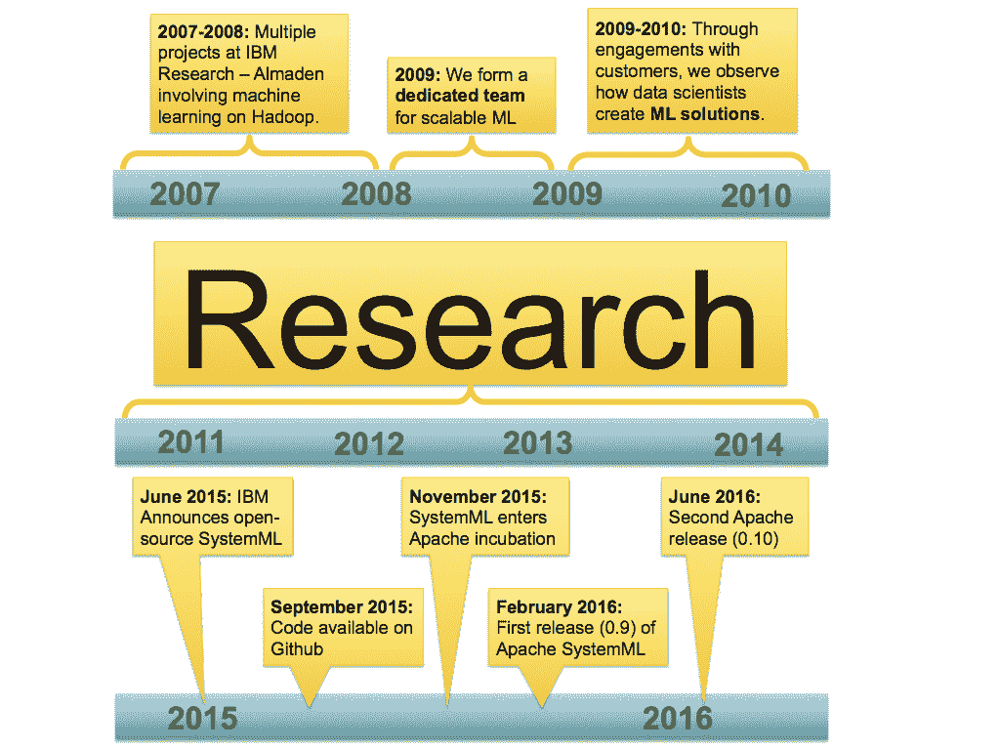
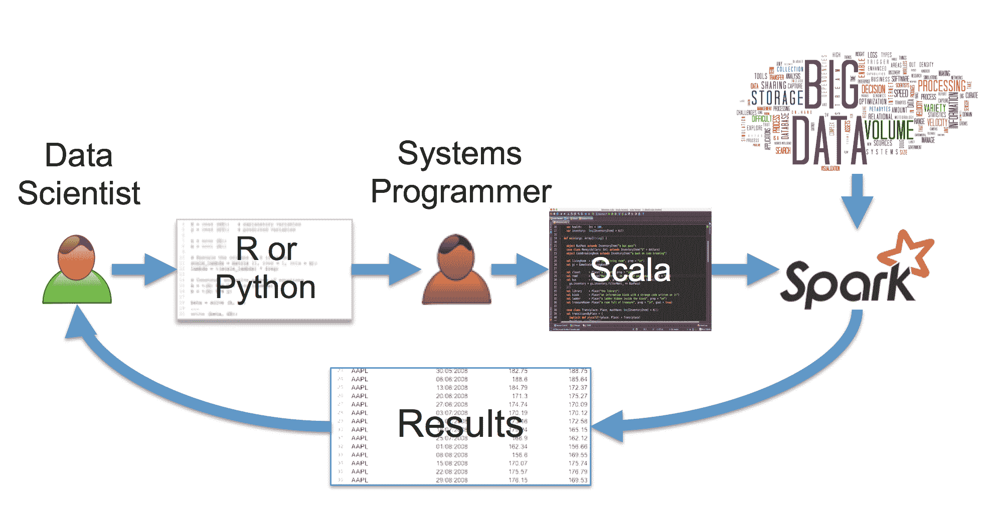
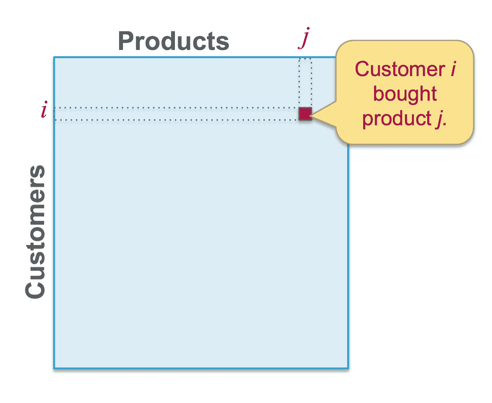
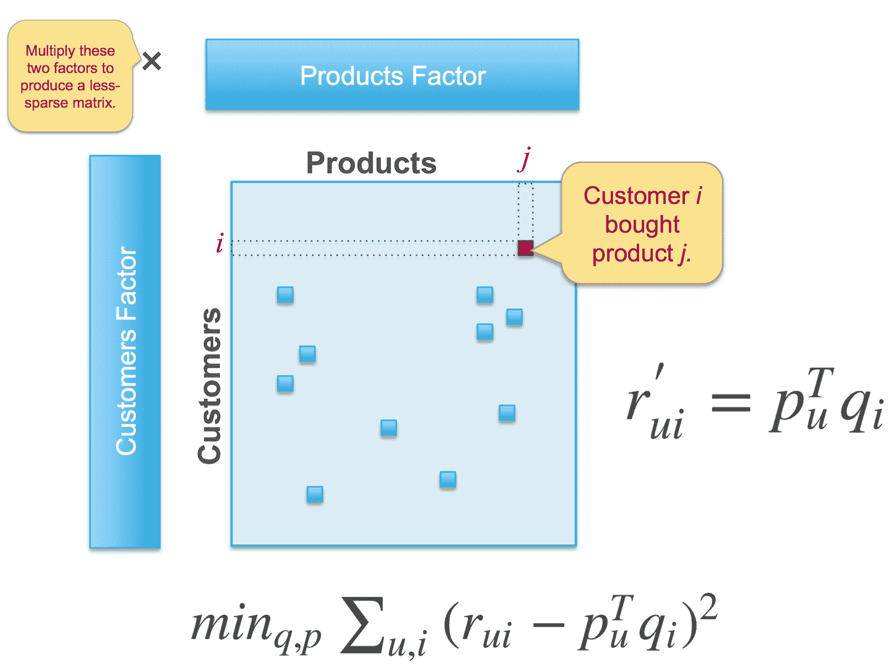
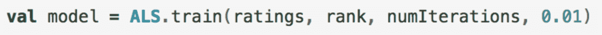
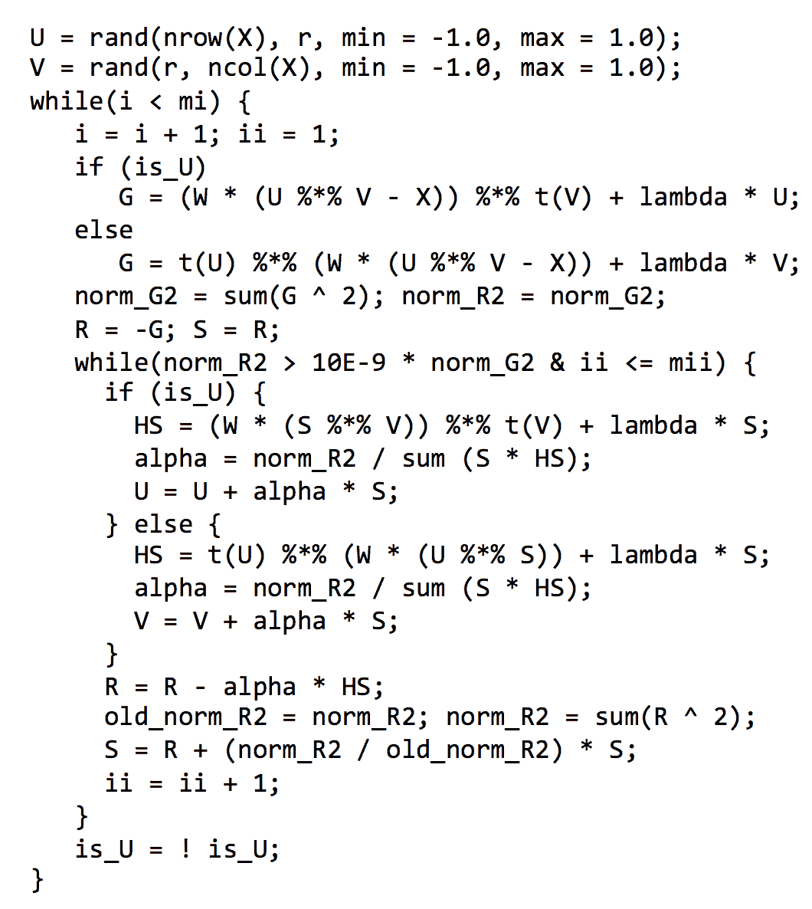
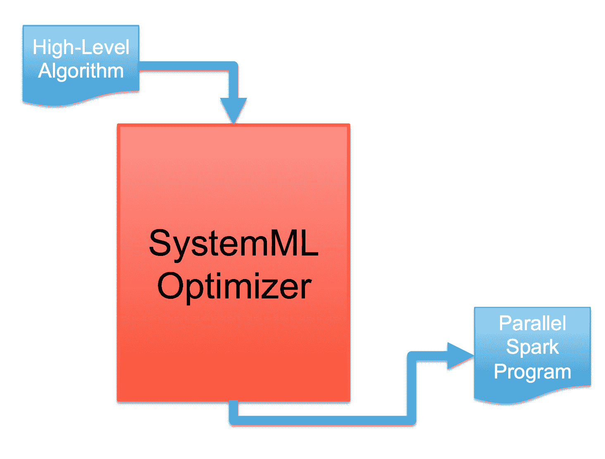
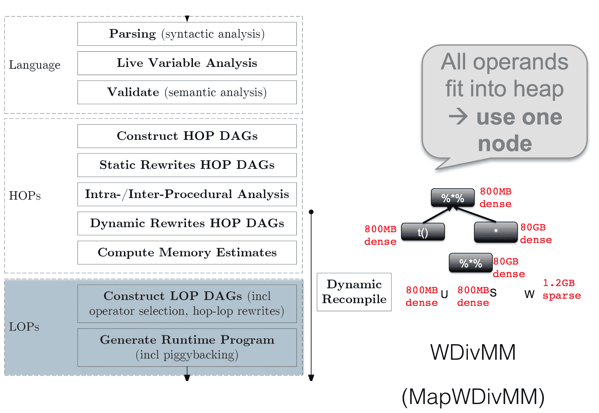
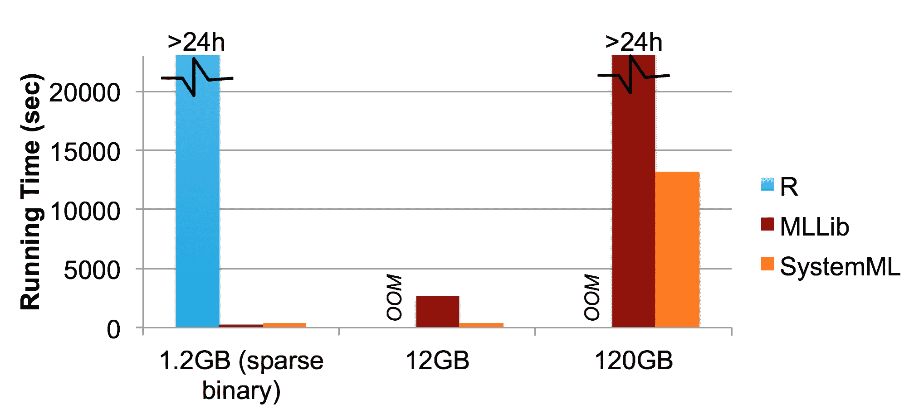

# 第六章：Apache SystemML

到目前为止，我们只涵盖了 Apache Spark 标准发行版附带的组件（当然，除了 HDFS、Kafka 和 Flume）。然而，Apache Spark 也可以作为第三方组件的运行时，使其成为某种大数据应用的操作系统。在本章中，我们将介绍最初由*IBM Almaden Research Lab*在加利福尼亚开发的 Apache SystemML，这是一项令人惊叹的技术。Apache SystemML 经历了许多转变阶段，现在已成为 Apache 顶级项目。

在本章中，我们将探讨以下主题，以深入了解该主题：

+   在 Apache Spark 之上使用 SystemML 开发您自己的机器学习应用

+   学习...

# 为什么我们需要另一个库？

为了回答这个问题，我们需要了解 SystemML 的历史，该历史始于 2007 年，作为*IBM Almaden Research Lab*在加利福尼亚的一个研究项目。该项目旨在改善数据科学家的工作流程，特别是那些希望改进和增强现有机器学习算法功能的人。

因此，**SystemML**是一种声明性标记语言，能够透明地在 Apache Spark 上分发工作。它支持通过多线程和 CPU 上的 SIMD 指令以及 GPU 进行 Scale-up，以及通过集群进行 Scale-out，当然，两者可以同时进行。

最后，有一个基于成本的优化器，它生成考虑数据集大小统计信息的低级执行计划。换句话说，**Apache SystemML**之于机器学习，正如 Catalyst 和 Tungsten 之于 DataFrames。

# 为何基于 Apache Spark？

Apache Spark 解决了数据处理和机器学习中的许多常见问题，因此 Apache SystemML 可以利用这些功能。例如，Apache Spark 支持在通用 RDD 结构之上统一 SQL、图形、流和机器学习数据处理。

换言之，它是一个支持惰性求值和分布式内存缓存的通用**DAG**（**有向无环图**）执行引擎。

# Apache SystemML 的历史

Apache SystemML 已有十年历史。当然，它经历了多次重构，现已成为世界上最先进、最快的机器学习库之一。



如前图所示，针对 Apache SystemML 进行了大量研究。它比 Apache Spark 早两年，并在 2017 年成为 Apache 顶级项目，脱离**孵化器**状态。甚至在 SystemML 启动之初，*IBM Research Almaden*的研究人员就意识到，通常情况下，开箱即用的机器学习算法在大数据集上表现非常糟糕。

因此，数据分析管道在经过小规模原型调整后必须进行优化。下图说明了这一点：



这意味着数据科学家将在他选择的编程语言中设计他的应用程序，最可能是 Matlab、R 或 Python，最终，系统程序员将接手这个工作，并将其重新实现为 JVM 语言，如 Java 或 Scala，这通常会提供更好的性能，并且也能在数据并行框架如 Apache Spark 上进行线性扩展。

原型的缩放版本将在整个数据集上返回结果，数据科学家再次负责修改原型，整个循环再次开始。不仅 IBM Almaden 研究中心的员工经历过这种情况，我们的团队也见证了这一点。因此，让我们使系统程序员变得多余（或者至少只需要他来处理我们的 Apache Spark 作业），使用 Apache SystemML。

# 机器学习算法的成本优化器

让我们从一个例子开始，来说明 Apache SystemML 内部是如何工作的。考虑一个推荐系统。

# 一个例子 - 交替最小二乘法

推荐系统试图根据其他用户的历史记录预测用户可能感兴趣的潜在商品。

因此，让我们考虑一个所谓的商品-用户或产品-客户矩阵，如图所示：



这是一个所谓的**稀疏**矩阵，因为只有少数单元格填充了非零值，表示客户*i*和产品*j*之间的匹配。要么在单元格中放置一个**一**，要么放置任何其他数值，例如，表示购买的产品数量或客户*i*对特定产品*j*的评分。我们称这个矩阵为*r[ui]*，其中*u*代表用户，*i*代表商品。

熟悉线性代数的你可能知道，任何矩阵都可以通过两个较小的矩阵进行因式分解。这意味着你需要找到两个矩阵*p[u]*和*q[i]*，当它们相乘时，能够重构原始矩阵*r[ui]*；我们称这个重构为*r[ui]'*。目标是找到*p[u]*和*q[i]*以重构*r[ui]'*，使其与*r[ui]*的差异不过大。这通过求和平方误差目标函数来实现。

下图说明了这一点以及矩阵的稀疏性特性：



一旦我们找到了良好的因子*p[u]*和*q[i]*，我们就能构建*r[ui]'*，最终，新的非零单元格将出现，这些将成为新的预测产品推荐。如果你还没有完全理解所有细节，不用担心，因为理解本章其余部分并不需要太多这个例子。

寻找*p[u]*和*q[i]*的常用算法称为**交替最小二乘法**（**ALS**）——交替是因为在每次迭代中，优化目标从*p[u]*切换到*q[i]*，反之亦然。对此不必过于纠结，但实际运作即是如此，而在 Apache Spark MLlib 中，这仅是一行 Scala 代码：



那么问题何在？在我们解释之前，先来看看 ALS 如何在统计编程语言如 R 中实现：



同样，若你未能理解每一行代码也不必担心，此图旨在展示在 R 中，该算法仅需 27 行代码即可表达。若我们再查看 MLlib 中的 ALS 实现，会发现它有超过 800 行代码。你可在[`github.com/apache/spark/tree/master/mllib/src/main/scala/org/apache/spark/mllib/recommendation`](https://github.com/apache/spark/tree/master/mllib/src/main/scala/org/apache/spark/mllib/recommendation)找到此实现。

那么为何在 Spark 上需要超过 800 行的 Scala 代码，而在 R 中仅需 27 行呢？这是因为性能优化。MLlib 中的 ALS 实现包含了超过 50%的性能优化代码。如果我们能做到以下这些呢？

+   去除我们算法实现中的所有性能优化

+   将我们的 R 代码 1:1 移植到某个并行框架

+   如有变动，只需修改我们的 R 实现

这正是 Apache SystemML 发挥作用的地方，它支持这一切。Apache SystemML 的**DSL**（**特定领域语言**）是 R 语法的一个子集，因此你可以直接将之前的示例原封不动地运行在 Apache SystemML 之上，无需任何修改。此外，基于成本的性能优化器会在 Apache Spark 之上生成物理执行计划，以根据数据规模属性最小化执行时间。那么，让我们探究其工作原理。

# Apache SystemML 架构

在 Apache SystemML 中，关键在于优化器。该组件将算法的高级描述在特定领域语言中转化为 Apache Spark 上高度优化的物理执行，如图所示：



# 语言解析

让我们稍稍揭开 Apache SystemML 优化器的神秘面纱，以便理解其中究竟发生了什么。引擎首先进行的是 DSL 的编译步骤。首先是语法检查，然后进行活跃变量分析以确定哪些中间结果仍需保留，最后进行语义检查。

# 生成高级操作符

一旦通过前述步骤，便生成使用所谓**高级操作符**（**HOPs**）的执行计划。这些操作符构建自 DSL 的**抽象语法树**（**AST**）。在此阶段，以下重要优化步骤正在进行：

+   **静态重写**：DSL 提供了一套丰富的语法和语义特性，使得实现易于理解，但可能导致非最优执行。Apache SystemML 检测到这些 AST 分支，并静态地将其重写为更好的版本，保持语义等价。

+   **动态重写**：动态重写与静态重写非常相似，但它们是由基于成本的统计数据驱动的，考虑了数据集的大小...

# 低级操作符如何被优化

让我们看看，低级操作符是如何被选择和优化的。我们将坚持使用加权除法矩阵乘法的例子——一个在 HOP 优化过程之前被选中的 HOP，而不是一系列普通的矩阵乘法。现在问题来了，例如，是否应该使用在 Apache Spark 工作节点上并行运行的 LOP 的并行版本，或者是否应该优先考虑本地执行。在这个例子中，Apache SystemML 确定所有中间结果都适合驱动节点的主内存，并选择本地操作符**WDivMM**，而不是并行操作符**MapWDivMM**。下图说明了这一过程：



# 性能测量

所有这些努力值得吗？让我们来看一些本地 R 脚本、MLlib 和 Apache SystemML 之间的性能比较：



在不同大小的数据集（1.2GB、12GB 和 120GB）上运行 ALS 算法，使用 R、MLlib 和 ApacheSystemML。我们可以清楚地看到，即使在最小的数据集上，R 也不是一个可行的解决方案，因为它花费了超过 24 小时，我们不确定它是否能完成。在 12GB 的数据集上，我们注意到 ApacheSystemML 比 MLlib 运行得快得多，最后，在 120GB 的数据集上，MLlib 的 ALS 实现一天内没有完成，我们...

# Apache SystemML 的实际应用

让我们来看一个非常简单的例子。让我们在 Apache SystemML DSL 中创建一个脚本——一种类似 R 的语法——以便乘以两个矩阵：

```scala
import org.apache.sysml.api.MLOutput
import org.apache.spark.sql.SQLContext
import org.apache.spark.mllib.util.LinearDataGenerator
import org.apache.sysml.api.MLContext
import org.apache.sysml.runtime.instructions.spark.utils.{RDDConverterUtilsExt => RDDConverterUtils}
import org.apache.sysml.runtime.matrix.MatrixCharacteristics;

val sqlContext = new SQLContext(sc)

val simpleScript =
"""
fileX = "";
fileY = "";
fileZ = "";

X = read (fileX);
Y = read (fileY);

Z = X %*% Y

write (Z,fileZ);
"""
```

然后，我们生成一些测试数据：

```scala
// Generate data
val rawDataX = sqlContext.createDataFrame(LinearDataGenerator.generateLinearRDD(sc, 100, 10, 1))
val rawDataY = sqlContext.createDataFrame(LinearDataGenerator.generateLinearRDD(sc, 10, 100, 1))

// Repartition into a more parallelism-friendly number of partitions
val dataX = rawDataX.repartition(64).cache()
val dataY = rawDataY.repartition(64).cache()
```

为了使用 Apache SystemML，我们必须创建一个`MLContext`对象：

```scala
// Create SystemML context
val ml = new MLContext(sc)
```

现在我们需要将数据转换成 Apache SystemML 能理解的格式：

```scala
// Convert data to proper format
val mcX = new MatrixCharacteristics()
val mcY = new MatrixCharacteristics()
val X = RDDConverterUtils.vectorDataFrameToBinaryBlock(sc, dataX, mcX, false, "features")
val Y = RDDConverterUtils.vectorDataFrameToBinaryBlock(sc, dataY, mcY, false, "features")
```

现在，我们将数据`X`和`Y`传递给 Apache SystemML 运行时，并预先注册一个名为`Z`的变量，以便从运行时获取结果：

```scala
// Register inputs & outputs
ml.reset()  
ml.registerInput("X", X, mcX)
ml.registerInput("Y", Y, mcY)
ml.registerOutput("Z")
```

最后，我们实际执行了存储在`simpleScript`中的脚本，并使用`executeScript`方法从运行时获取结果：

```scala
val outputs = ml.executeScript(simpleScript)

// Get outputs
val Z = outputs.getDF(sqlContext, "Z")
```

现在`Z`包含了一个带有矩阵乘法结果的`DataFrame`。完成！

# 概要

你已了解到，在 Apache Spark 之上还有额外的机器学习框架和库的空间，并且，一个类似于我们在 Catalyst 中已使用的基于成本的优化器可以极大地加速处理。此外，将性能优化代码与算法代码分离，有助于在不考虑性能的情况下进一步改进算法方面。

另外，这些执行计划高度适应数据量的大小，并根据主内存大小和可能的加速器（如 GPU）等可用硬件配置进行调整。Apache SystemML 显著提升了机器学习应用的生命周期，尤其是在机器学习方面...
