# 第八章：火花调优

在本章中，我们将深入探讨 Apache Spark 的内部机制，并看到尽管 Spark 让我们感觉像是在使用另一个 Scala 集合，但我们不应忘记 Spark 实际上运行在一个分布式系统中。因此，需要格外小心。简而言之，本章将涵盖以下主题：

+   监控火花作业

+   Spark 配置

+   火花应用开发中的常见错误

+   优化技术

# 监控火花作业

Spark 提供 Web UI 来监控计算节点（驱动程序或执行程序）上运行或完成的全部作业。在本节中，我们将简要讨论如何使用适当的示例通过 Spark Web UI 监控 Spark 作业。我们将看到如何监控作业的进度（包括已提交、排队和运行中的作业）。我们将简要讨论 Spark Web UI 中的所有标签页。最后，我们将讨论 Spark 中的日志记录过程以进行更好的调优。

# Spark Web 界面

Web UI（也称为 Spark UI）是运行 Spark 应用程序的 Web 界面，用于在 Firefox 或 Google Chrome 等 Web 浏览器上监控作业的执行。当 SparkContext 启动时，在独立模式下，一个显示应用程序有用信息的 Web UI 会在端口 4040 上启动。根据应用程序是否仍在运行或已完成执行，Spark Web UI 有不同的访问方式。

此外，您可以在应用程序执行完毕后通过使用`EventLoggingListener`持久化所有事件来使用 Web UI。然而，`EventLoggingListener`不能单独工作，需要结合 Spark 历史服务器。结合这两个功能，...

# 作业

根据 SparkContext，Jobs 标签页显示 Spark 应用程序中所有 Spark 作业的状态。当您通过 Web 浏览器在`http://localhost:4040`（独立模式）访问 Spark UI 的 Jobs 标签页时，您应该会看到以下选项：

+   显示提交 Spark 作业的活跃用户

+   总运行时间：显示作业的总运行时间

+   调度模式：大多数情况下，它是先进先出（FIFO）

+   活跃作业：显示活跃作业的数量

+   已完成作业：显示已完成作业的数量

+   事件时间线：显示已完成执行的作业的时间线

内部，Jobs 标签页由`JobsTab`类表示，这是一个带有 jobs 前缀的自定义 SparkUI 标签页。Jobs 标签页使用`JobProgressListener`来访问 Spark 作业的统计信息，以在页面上显示上述信息。请看以下截图：

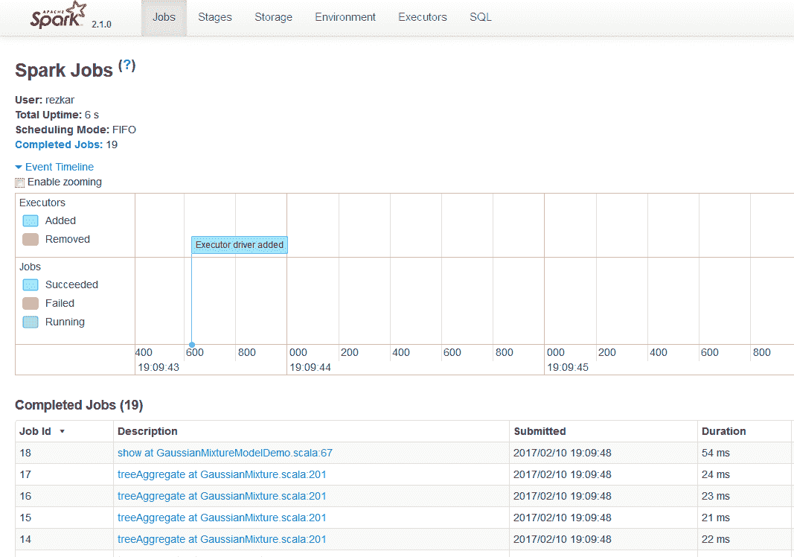**图 2：**Spark Web UI 中的 Jobs 标签页

如果您在 Jobs 标签页中进一步展开 Active Jobs 选项，您将能够看到该特定作业的执行计划、状态、已完成阶段数和作业 ID，如 DAG 可视化所示：

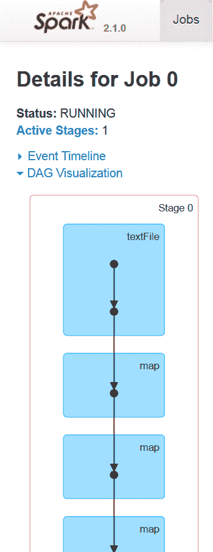**图 3：** Spark Web UI 中任务的 DAG 可视化（简略版）

当用户在 Spark 控制台中输入代码时（例如，Spark shell 或使用 Spark submit），Spark Core 会创建一个操作符图。这基本上是用户在特定节点上对 RDD（不可变对象）执行操作（例如，reduce、collect、count、first、take、countByKey、saveAsTextFile）或转换（例如，map、flatMap、filter、mapPartitions、sample、union、intersection、distinct）时发生的情况。

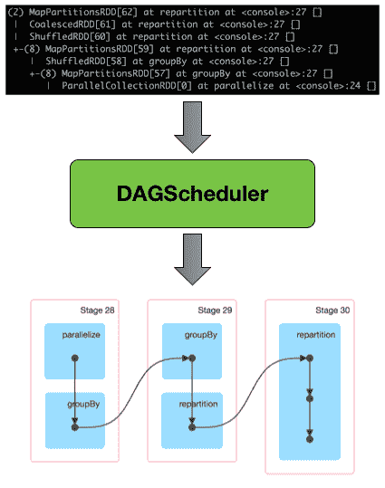**图 4：** DAG 调度器将 RDD 血统转换为阶段 DAG

在转换或操作期间，使用**有向无环图**（**DAG**）信息来恢复到最后一个转换和操作的节点（参见*图 4*和*图 5*以获得更清晰的图像），以保持数据弹性。最后，图形被提交给 DAG 调度器。

如何从 RDD 计算 DAG，然后执行任务？

从高层次来看，当对 RDD 调用任何操作时，Spark 会创建 DAG 并将其提交给 DAG 调度器。DAG 调度器将操作符划分为任务阶段。一个阶段根据输入数据的分区包含任务。DAG 调度器将操作符流水线化。例如，可以在一个阶段中调度多个映射操作符。DAG 调度器的最终结果是一组阶段。这些阶段被传递给任务调度器。任务调度器通过集群管理器（Spark Standalone/YARN/Mesos）启动任务。任务调度器不知道阶段的依赖关系。工作节点在阶段上执行任务。

有向无环图（DAG）调度器随后跟踪哪些阶段输出的 RDD 被物化。接着，它找到一个最小调度来运行作业，并将相关操作符划分为任务阶段。根据输入数据的分区，一个阶段包含多个任务。然后，操作符与 DAG 调度器一起流水线化。实际上，一个阶段中可以调度多个映射或归约操作符（例如）。

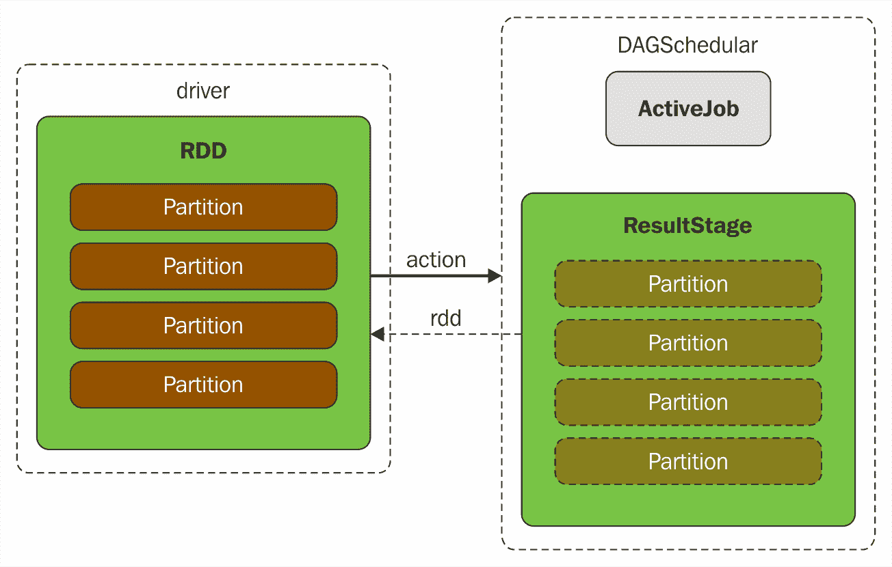**图 5：** 执行操作导致 DAG 调度器中新的 ResultStage 和 ActiveJob

DAG 调度器中的两个基本概念是作业和阶段。因此，它必须通过内部注册表和计数器来跟踪它们。从技术上讲，DAG 调度器是 SparkContext 初始化的一部分，它专门在驱动程序上工作（在任务调度器和调度器后端准备好之后立即）。DAG 调度器负责 Spark 执行中的三个主要任务。它为作业计算执行 DAG，即阶段的 DAG。它确定运行每个任务的首选节点，并处理由于洗牌输出文件丢失而导致的故障。

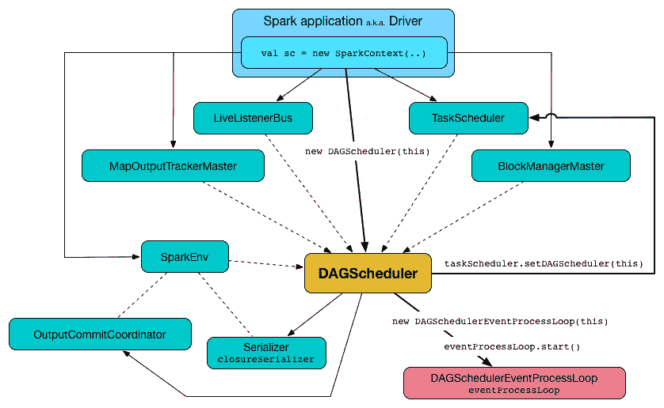**图 6：** SparkContext 创建的 DAGScheduler 与其他服务

DAG 调度器的最终结果是一组阶段。因此，大多数统计数据和作业状态可以通过这种可视化查看，例如执行计划、状态、已完成阶段的数量以及该特定作业的作业 ID。

# 阶段

Spark UI 中的阶段选项卡显示了 Spark 应用程序中所有作业的所有阶段的当前状态，包括一个阶段的任务和统计数据的两个可选页面以及池详细信息。请注意，此信息仅在应用程序以公平调度模式工作时可用。你应该能够通过`http://localhost:4040/stages`访问阶段选项卡。请注意，当没有提交作业时，该选项卡仅显示标题。阶段选项卡显示了 Spark 应用程序中的阶段。以下阶段可以在该选项卡中看到：

+   活跃阶段

+   待处理阶段

+   已完成阶段

例如，当你在本地提交一个 Spark 作业时，你应该能看到以下状态：

**图 7：**Spark 中所有作业的阶段...

# 存储

存储选项卡显示了每个 RDD、DataFrame 或 Dataset 的大小和内存使用情况。你应该能够看到 RDDs、DataFrames 或 Datasets 的存储相关信息。下图显示了存储元数据，如 RDD 名称、存储级别、缓存分区数量、缓存数据的比例以及 RDD 在主内存中的大小：

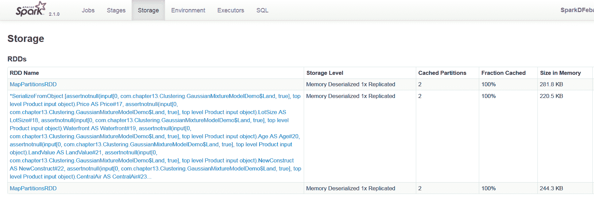**图 9：**存储选项卡显示了磁盘上 RDD 所占用的空间。

请注意，如果 RDD 无法缓存在主内存中，将使用磁盘空间。本章后面将对此进行更详细的讨论。

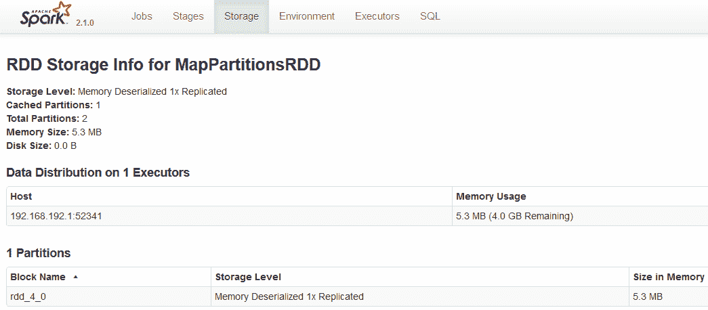**图 10：**数据分布以及磁盘上 RDD 使用的存储空间。

# 环境

环境选项卡展示了当前机器（即驱动程序）上设置的环境变量。更具体地说，运行时信息如 Java Home、Java 版本和 Scala 版本可以在运行时信息下查看。Spark 属性如 Spark 应用 ID、应用名称、驱动程序主机信息、驱动程序端口、执行器 ID、主 URL 和调度模式也可以看到。此外，其他与系统相关的属性和作业属性，如 AWT 工具包版本、文件编码类型（例如，UTF-8）和文件编码包信息（例如，sun.io）可以在系统属性下查看。

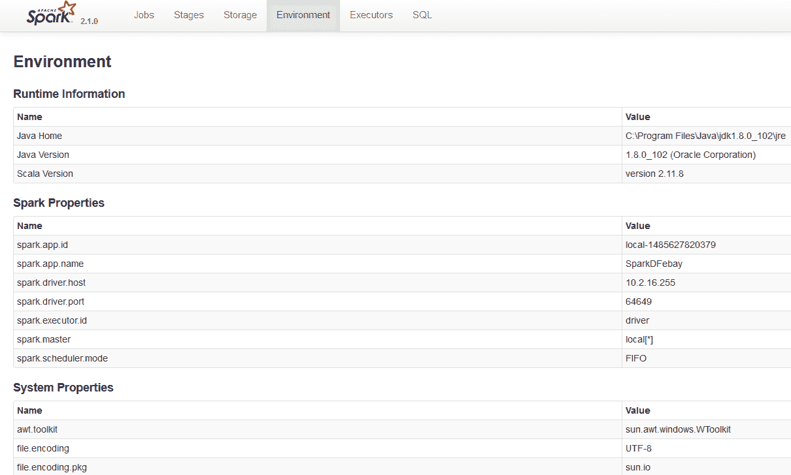**图...**

# 执行器

执行器选项卡使用`ExecutorsListener`收集有关 Spark 应用程序执行器的信息。执行器是一种分布式代理，负责执行任务。执行器以不同方式实例化。例如，当`CoarseGrainedExecutorBackend`收到 Spark Standalone 和 YARN 的`RegisteredExecutor`消息时，执行器被实例化。第二种情况是当 Spark 作业提交给 Mesos 时，Mesos 的`MesosExecutorBackend`被注册。第三种情况是当你在本地运行 Spark 作业时，即创建了`LocalEndpoint`。执行器通常在整个 Spark 应用程序生命周期内运行，这称为执行器的静态分配，尽管你也可以选择动态分配。执行器后端专门管理计算节点或集群中的所有执行器。执行器定期向驱动程序上的**HeartbeatReceiver** RPC 端点报告心跳和活动任务的部分指标，并将结果发送给驱动程序。它们还通过块管理器为用户程序缓存的 RDD 提供内存存储。请参考下图以更清晰地了解这一点：

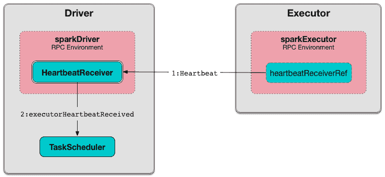**图 12**：Spark 驱动程序实例化一个负责处理 HeartbeatReceiver 心跳消息的执行器。

当执行器启动时，它首先向驱动程序注册，并直接通信以执行任务，如下所示：

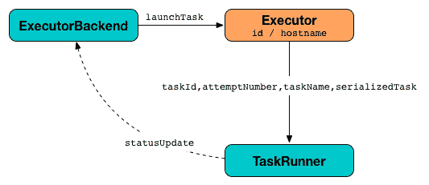**图 13**：使用 TaskRunners 在执行器上启动任务。

你应该能够访问`http://localhost:4040/executors`上的执行器选项卡。

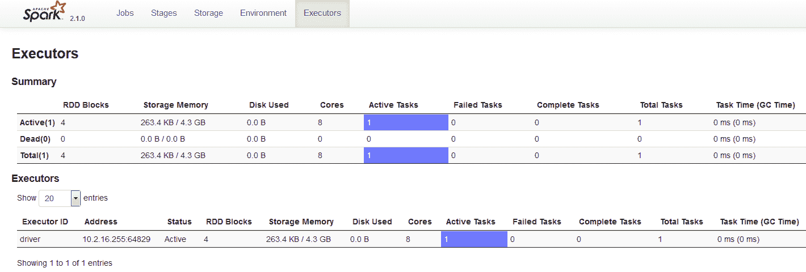**图 14**：Spark Web UI 上的执行器选项卡。

如前图所示，可以查看执行器 ID、地址、状态、RDD 块、存储内存、磁盘使用、核心、活动任务、失败任务、完成任务、总任务、任务时间（GC 时间）、输入、洗牌读取、洗牌写入和关于执行器的线程转储。

# SQL

Spark UI 中的 SQL 选项卡显示每个操作符的所有累加器值。你应该能够访问`http://localhost:4040/SQL/`上的 SQL 选项卡。它默认显示所有 SQL 查询执行及其底层信息。但是，SQL 选项卡仅在选择查询后显示 SQL 查询执行的详细信息。

本章不涉及对 SQL 的详细讨论。感兴趣的读者可参考[Spark SQL 编程指南](http://spark.apache.org/docs/latest/sql-programming-guide.html#sql)，了解如何提交 SQL 查询并查看其结果输出。

# 使用 Web UI 可视化 Spark 应用程序

当提交 Spark 作业执行时，会启动一个 Web 应用程序 UI，显示有关该应用程序的有用信息。事件时间线展示了应用程序事件的相对顺序和交错情况。时间线视图有三个级别：跨所有作业、单个作业和单个阶段。时间线还显示了执行器的分配和解除分配。

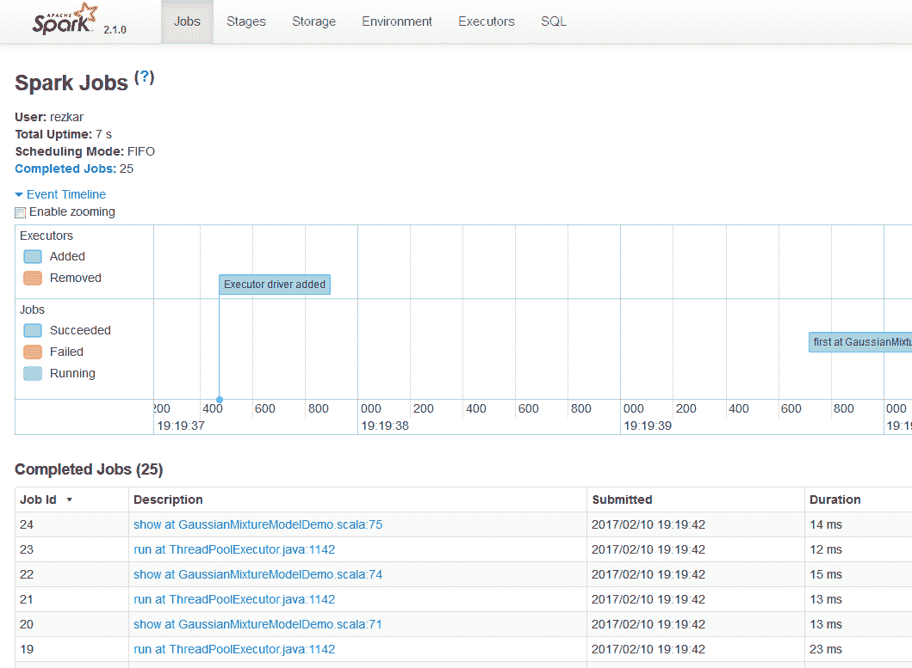**图 15**：在 Spark Web UI 上以 DAG 形式执行的 Spark 作业

# 观察正在运行和已完成的 Spark 作业

要访问和观察正在运行和已完成的 Spark 作业，请在 Web 浏览器中打开`http://spark_driver_host:4040`。请注意，您需要将`spark_driver_host`替换为相应的 IP 地址或主机名。

请注意，如果同一主机上运行了多个 SparkContext，它们将绑定到从 4040 开始的连续端口，如 4041、4042 等。默认情况下，此信息仅在您的 Spark 应用程序运行期间可用。这意味着当您的 Spark 作业执行完毕后，绑定将不再有效或可访问。

现在，要访问仍在执行的活动作业，请点击“Active Jobs”链接，您将看到与这些作业相关的信息...

# 使用日志调试 Spark 应用程序

查看所有正在运行的 Spark 应用程序的信息取决于您使用的集群管理器。在调试 Spark 应用程序时，应遵循以下说明：

+   **Spark Standalone**：访问`http://master:18080`上的 Spark master UI。master 和每个 worker 都会显示集群和相关作业统计信息。此外，每个作业的详细日志输出也会写入每个 worker 的工作目录。我们将讨论如何使用`log4j`手动启用 Spark 的日志记录。

+   **YARN**：如果您的集群管理器是 YARN，并且假设您在 Cloudera（或其他基于 YARN 的平台）上运行 Spark 作业，则请转到 Cloudera Manager Admin Console 中的 YARN 应用程序页面。现在，要调试在 YARN 上运行的 Spark 应用程序，请查看 Node Manager 角色的日志。为此，打开日志事件查看器，然后过滤事件流以选择时间窗口、日志级别并显示 Node Manager 源。您也可以通过命令访问日志。命令格式如下：

```scala
 yarn logs -applicationId <application ID> [OPTIONS]
```

例如，以下是针对这些 ID 的有效命令：

```scala
 yarn logs -applicationId application_561453090098_0005 
 yarn logs -applicationId application_561453090070_0005 userid
```

请注意，用户 ID 可能不同。但是，仅当`yarn-site.xml`中的`yarn.log-aggregation-enable`为 true 且应用程序已完成执行时，此情况才成立。

# Spark 使用 log4j 进行日志记录

Spark 使用`log4j`进行自身日志记录。所有后端发生的操作都会被记录到 Spark shell 控制台（该控制台已配置到基础存储）。Spark 提供了一个`log4j`的属性文件模板，我们可以扩展和修改该文件以在 Spark 中进行日志记录。转到`SPARK_HOME/conf`目录，您应该会看到`log4j.properties.template`文件。这可以作为我们自己日志系统的起点。

现在，让我们在运行 Spark 作业时创建自己的自定义日志系统。完成后，将文件重命名为`log4j.properties`并将其放在同一目录下（即项目树）。文件的示例快照如下所示：

**图 17:** 快照...

# Spark 配置

有多种方法可以配置您的 Spark 作业。在本节中，我们将讨论这些方法。更具体地说，根据 Spark 2.x 版本，有三个位置可以配置系统：

+   Spark 属性

+   环境变量

+   日志记录

# Spark 属性

如前所述，Spark 属性控制大多数应用程序特定参数，并可以使用`SparkConf`对象设置。或者，这些参数可以通过 Java 系统属性设置。`SparkConf`允许您配置一些常见属性，如下所示：

```scala
setAppName() // App name setMaster() // Master URL setSparkHome() // Set the location where Spark is installed on worker nodes. setExecutorEnv() // Set single or multiple environment variables to be used when launching executors. setJars() // Set JAR files to distribute to the cluster. setAll() // Set multiple parameters together.
```

应用程序可以配置为使用机器上可用的多个核心。例如，我们...

# 环境变量

环境变量可用于设置计算节点或机器设置。例如，IP 地址可以通过每个计算节点上的`conf/spark-env.sh`脚本设置。下表列出了需要设置的环境变量的名称和功能：

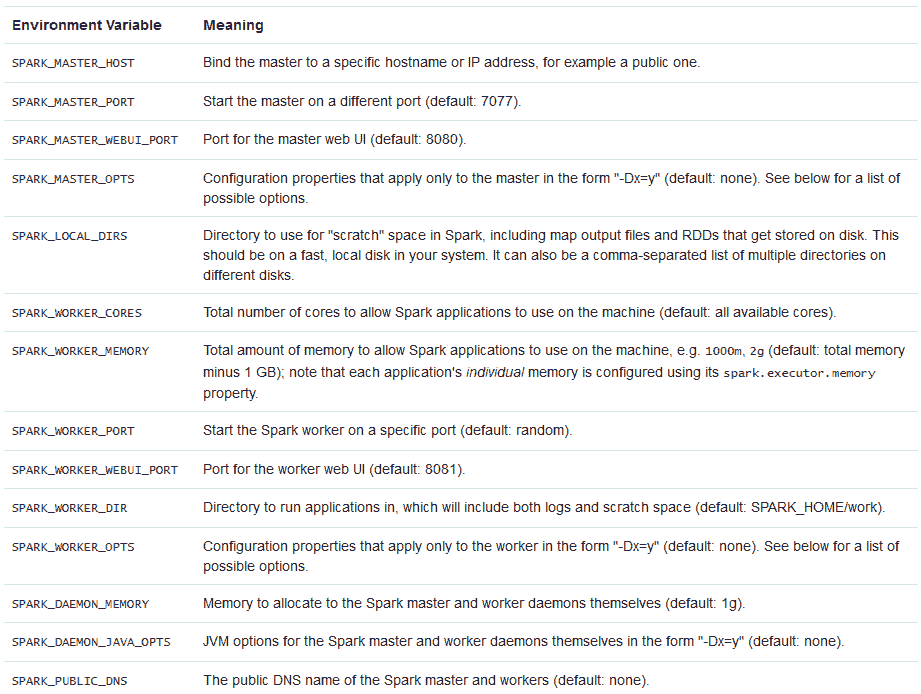**图 18:** 环境变量及其含义

# 日志记录

最后，日志可以通过位于 Spark 应用程序树下的`log4j.properties`文件进行配置，如前一节所述。Spark 使用 log4j 进行日志记录。log4j 支持的几个有效日志级别如下：

| **日志级别** | **用途** |
| --- | --- |
| OFF | 这是最具体的，不允许任何日志记录 |
| FATAL | 这是最具体的，显示致命错误，数据量较少 |
| ERROR | 这仅显示一般错误 |
| WARN | 这显示了建议修复但非强制性的警告 |
| INFO | 这显示了 Spark 作业所需的信息 |
| DEBUG | 调试时，这些日志将被打印 |
| TRACE | 这提供了最不具体的错误跟踪，包含大量数据 |
| ALL ... |

# 常见的 Spark 应用程序开发错误

常见且经常发生的错误包括应用程序失败、由于多种因素导致的工作缓慢且卡住、聚合、操作或转换中的错误、主线程中的异常，当然还有**内存溢出**（**OOM**）。

# 应用程序失败

大多数情况下，应用程序失败是因为一个或多个阶段最终失败。如本章前面所述，Spark 作业包含多个阶段。阶段并非独立执行：例如，处理阶段不能在相关输入读取阶段之前进行。因此，假设阶段 1 成功执行，但阶段 2 未能执行，整个应用程序最终会失败。这可以表示如下：

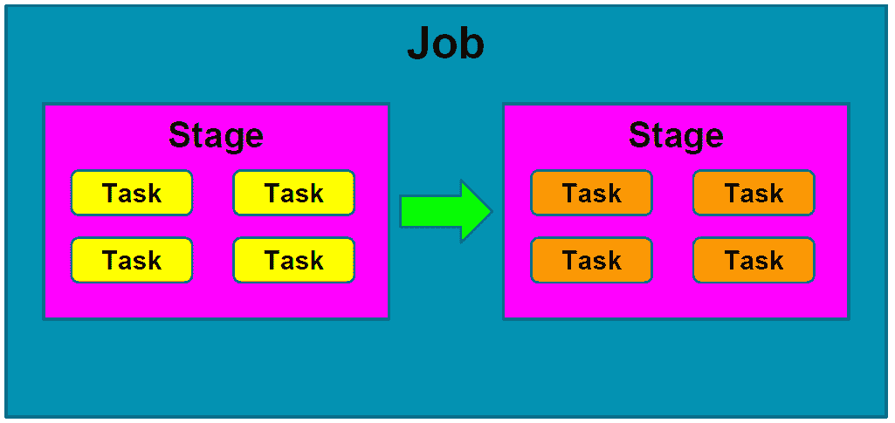**图 19：**典型 Spark 作业中的两个阶段

为了举例说明，假设您有以下三个 RDD 操作作为阶段。同样可以如图*20*、*21*等所示：

# 慢作业或无响应

有时，如果 SparkContext 无法连接到 Spark 独立主节点，驱动程序可能会显示以下错误：

```scala
02/05/17 12:44:45 ERROR AppClient$ClientActor: All masters are unresponsive! Giving up. 
02/05/17 12:45:31 ERROR SparkDeploySchedulerBackend: Application has been killed. Reason: All masters are unresponsive! Giving up. 
02/05/17 12:45:35 ERROR TaskSchedulerImpl: Exiting due to error from cluster scheduler: Spark cluster looks down
```

在其他时候，驱动程序能够连接到主节点，但主节点无法与驱动程序通信。然后，尽管驱动程序会报告无法连接到 Master 的日志目录，但仍会进行多次连接尝试。

此外，您可能会经常遇到 Spark 作业性能和进度非常缓慢的情况。这是因为您的驱动程序计算作业的速度不够快。如前所述，有时某个特定阶段可能比平常花费更长时间，因为可能涉及洗牌、映射、连接或聚合操作。即使计算机磁盘存储或主内存耗尽，您也可能会遇到这些问题。例如，如果主节点没有响应，或者在一段时间内计算节点没有响应，您可能会认为 Spark 作业已停止，并在某个阶段停滞不前：

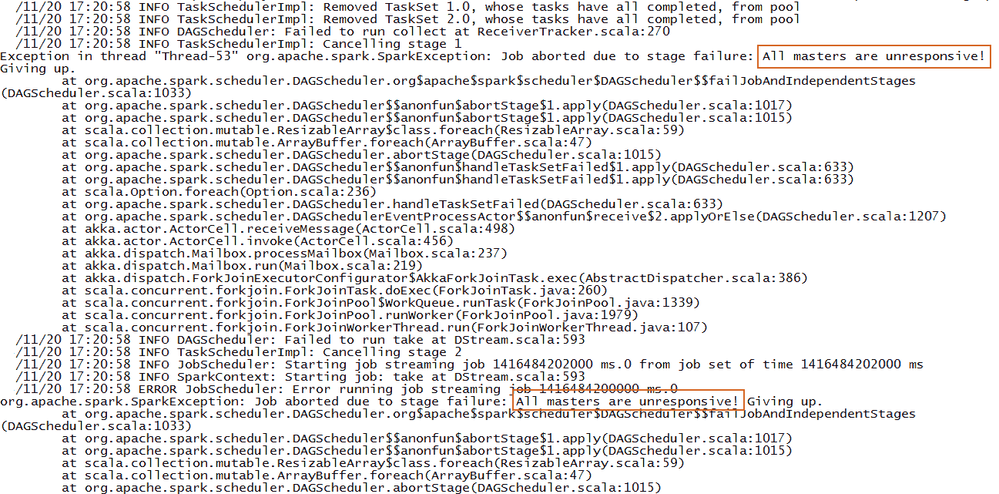**图 24：**执行器/驱动程序无响应的示例日志

可能的解决方案有多种，包括以下内容：

1.  请确保工作者和驱动程序正确配置以连接到 Spark 主节点上列出的确切地址，并在启动 Spark shell 时明确提供 Spark 集群的主 URL：

```scala
 $ bin/spark-shell --master spark://master-ip:7077
```

1.  将`SPARK_LOCAL_IP`设置为驱动程序、主节点和工作进程的集群可访问主机名。

有时，我们因硬件故障而遇到一些问题。例如，如果计算节点上的文件系统意外关闭，即发生 I/O 异常，您的 Spark 作业最终也会失败。这是显而易见的，因为您的 Spark 作业无法将结果 RDD 或数据写入本地文件系统或 HDFS。这也意味着由于阶段失败，DAG 操作无法执行。

有时，由于底层磁盘故障或其他硬件故障，会发生此 I/O 异常。这通常会提供以下日志：

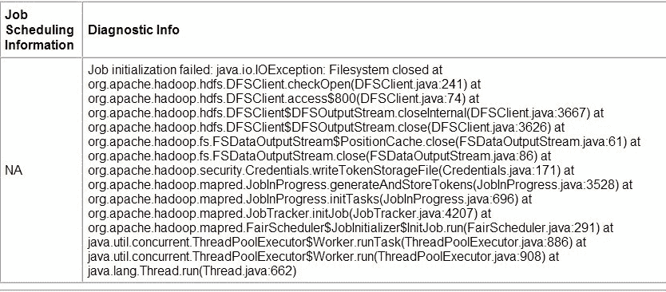**图 25：**文件系统关闭示例

尽管如此，您经常遇到作业计算性能缓慢，因为 Java GC 在处理 GC 时有些繁忙，或者无法快速完成 GC。例如，下图显示任务 0 完成 GC 耗时 10 小时！我在 2014 年刚接触 Spark 时遇到过这个问题。然而，控制这类问题并不在我们手中。因此，我们的建议是您应该让 JVM 空闲，并尝试重新提交作业。

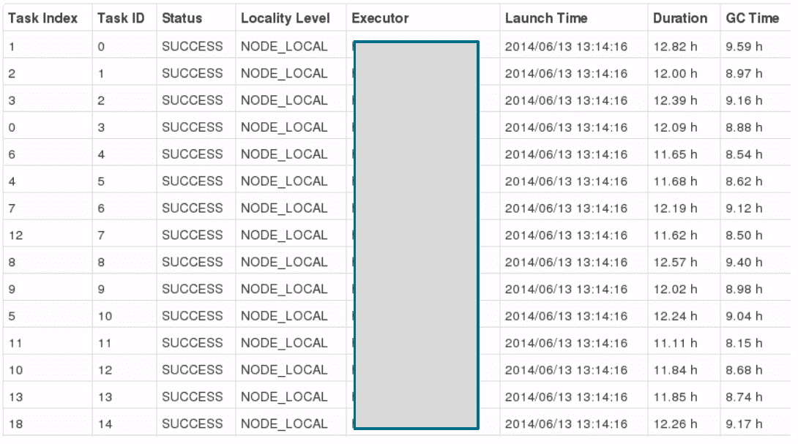**图 26：**GC 在中间卡顿的一个示例

第四个因素可能是由于缺乏数据序列化导致的响应缓慢或作业性能低下。这一点将在下一节讨论。第五个因素可能是代码中的内存泄漏，这将导致应用程序消耗更多内存，并保持文件或逻辑设备打开状态。因此，务必确保没有可能导致内存泄漏的选项。例如，通过调用`sc.stop()`或`spark.stop()`来结束 Spark 应用程序是一个好习惯。这将确保只有一个 SparkContext 保持打开和活跃状态。否则，您可能会遇到意外的异常或问题。第六个问题是，我们经常保持过多的打开文件，这有时会在洗牌或合并阶段引发`FileNotFoundException`。

# 优化技术

有多种方法可以针对更好的优化技术调整 Spark 应用程序。在本节中，我们将讨论如何通过调整主内存与更好的内存管理相结合，应用数据序列化来进一步优化我们的 Spark 应用程序。我们还可以通过在开发 Spark 应用程序时调整 Scala 代码中的数据结构来优化性能。另一方面，通过利用序列化的 RDD 存储，可以很好地维护存储。

垃圾回收及其调整是 Spark 应用程序使用 Java 或 Scala 编写时最重要的方面之一。我们将探讨如何针对优化性能进行调整。对于分布式环境和基于集群的...

# 数据序列化

序列化是任何分布式计算环境中性能改进和优化的重要调整。Spark 也不例外，但 Spark 作业通常数据和计算密集。因此，如果您的数据对象格式不佳，那么您首先需要将它们转换为序列化数据对象。这需要大量内存字节。最终，整个过程将大大减慢整个处理和计算速度。

因此，您经常遇到计算节点响应缓慢的问题。这意味着我们有时未能充分利用计算资源。确实，Spark 试图在便利性和性能之间保持平衡。这也意味着数据序列化应该是 Spark 调优以提高性能的第一步。

Spark 提供了两种数据序列化选项：Java 序列化和 Kryo 序列化库：

+   **Java 序列化**：Spark 使用 Java 的`ObjectOutputStream`框架来序列化对象。你通过创建任何实现`java.io.Serializable`的类来处理序列化。Java 序列化非常灵活，但通常速度很慢，不适合大型数据对象的序列化。

+   **Kryo 序列化**：你还可以使用 Kryo 库更快地序列化你的数据对象。与 Java 序列化相比，Kryo 序列化快 10 倍，且比 Java 序列化更紧凑。然而，它有一个问题，即不支持所有可序列化类型，但你需要要求你的类被注册。

你可以通过初始化你的 Spark 作业并调用`conf.set(spark.serializer, org.apache.spark.serializer.KryoSerializer)`来开始使用 Kryo。要向 Kryo 注册你自己的自定义类，请使用`registerKryoClasses`方法，如下所示：

```scala
val conf = new SparkConf()
               .setMaster(“local[*]”)
               .setAppName(“MyApp”)
conf.registerKryoClasses(Array(classOf[MyOwnClass1], classOf[MyOwnClass2]))
val sc = new SparkContext(conf)
```

如果你的对象很大，你可能还需要增加`spark.kryoserializer.buffer`配置。这个值需要足够大，以容纳你序列化的最大对象。最后，如果你没有注册你的自定义类，Kryo 仍然可以工作；但是，每个对象都需要存储完整的类名，这确实是浪费的。

例如，在监控 Spark 作业部分的日志记录子部分中，可以使用`Kryo`序列化优化日志记录和计算。首先，只需将`MyMapper`类创建为普通类（即没有任何序列化），如下所示：

```scala
class MyMapper(n: Int) { // without any serialization
  @transient lazy val log = org.apache.log4j.LogManager.getLogger("myLogger")
  def MyMapperDosomething(rdd: RDD[Int]): RDD[String] = rdd.map { i =>
    log.warn("mapping: " + i)
    (i + n).toString
  }
}
```

现在，让我们将这个类注册为`Kyro`序列化类，然后按照以下方式设置`Kyro`序列化：

```scala
conf.registerKryoClasses(Array(classOf[MyMapper])) // register the class with Kyro
conf.set("spark.serializer", "org.apache.spark.serializer.KryoSerializer") // set Kayro serialization
```

这就是你所需要的。以下给出了这个示例的完整源代码。你应该能够运行并观察到相同的输出，但与前一个示例相比，这是一个优化版本：

```scala
package com.chapter14.Serilazition
import org.apache.spark._
import org.apache.spark.rdd.RDD
class MyMapper(n: Int) { // without any serilization
  @transient lazy val log = org.apache.log4j.LogManager.getLogger
                                ("myLogger")
  def MyMapperDosomething(rdd: RDD[Int]): RDD[String] = rdd.map { i =>
    log.warn("mapping: " + i)
    (i + n).toString
  }
}
//Companion object
object MyMapper {
  def apply(n: Int): MyMapper = new MyMapper(n)
}
//Main object
object KyroRegistrationDemo {
  def main(args: Array[String]) {
    val log = LogManager.getRootLogger
    log.setLevel(Level.WARN)
    val conf = new SparkConf()
      .setAppName("My App")
      .setMaster("local[*]")
    conf.registerKryoClasses(Array(classOf[MyMapper2]))
     // register the class with Kyro
    conf.set("spark.serializer", "org.apache.spark.serializer
             .KryoSerializer") // set Kayro serilazation
    val sc = new SparkContext(conf)
    log.warn("Started")
    val data = sc.parallelize(1 to 100000)
    val mapper = MyMapper(1)
    val other = mapper.MyMapperDosomething(data)
    other.collect()
    log.warn("Finished")
  }
}
```

输出如下：

```scala
17/04/29 15:33:43 WARN root: Started 
.
.
17/04/29 15:31:51 WARN myLogger: mapping: 1 
17/04/29 15:31:51 WARN myLogger: mapping: 49992
17/04/29 15:31:51 WARN myLogger: mapping: 49999
17/04/29 15:31:51 WARN myLogger: mapping: 50000 
.
.                                                                                
17/04/29 15:31:51 WARN root: Finished
```

做得好！现在让我们快速了解一下如何调整内存。在下一节中，我们将探讨一些高级策略，以确保主内存的高效使用。

# 内存调优

在本节中，我们将讨论一些高级策略，这些策略可以被像你这样的用户用来确保在执行 Spark 作业时进行高效的内存使用。更具体地说，我们将展示如何计算你的对象的内存使用量。我们将建议一些高级方法来通过优化你的数据结构或通过使用 Kryo 或 Java 序列化器将你的数据对象转换为序列化格式来改进它。最后，我们将探讨如何调整 Spark 的 Java 堆大小、缓存大小和 Java 垃圾收集器。

调整内存使用时有三个考虑因素：

+   你的对象使用的内存量：你可能甚至希望你的整个数据集都能适应内存

+   访问那些...

# 内存使用和管理

你的 Spark 应用程序及其底层计算节点的内存使用可分为执行和存储两类。执行内存用于合并、洗牌、连接、排序和聚合等计算过程中的使用。另一方面，存储内存用于缓存和在集群间传播内部数据。简而言之，这是由于网络间的大量 I/O 造成的。

从技术上讲，Spark 会将网络数据缓存在本地。在迭代或交互式地使用 Spark 时，缓存或持久化是 Spark 中的优化技巧。这两者有助于保存中间部分结果，以便在后续阶段重用。然后，这些中间结果（作为 RDD）可以保存在内存中（默认），或更稳定的存储介质，如磁盘，以及/或进行复制。此外，RDD 也可以通过缓存操作进行缓存。它们还可以使用持久化操作进行持久化。缓存和持久化操作之间的区别纯粹是语法上的。缓存是持久化或持久（`MEMORY_ONLY`）的同义词，即缓存仅以默认存储级别 `MEMORY_ONLY` 进行持久化。

如果你在 Spark 网页界面的存储标签下查看，你应该能看到 RDD、DataFrame 或 Dataset 对象使用的内存/存储，如图 *10* 所示。尽管 Spark 中有两个与内存调优相关的配置，但用户无需调整它们。原因在于配置文件中设置的默认值足以满足你的需求和负载。

spark.memory.fraction 表示统一区域大小占（JVM 堆空间 - 300 MB）的比例（默认值为 0.6）。剩余空间（40%）用于用户数据结构、Spark 内部元数据，以及防范因稀疏和异常大的记录导致的 OOM 错误。另一方面，`spark.memory.storageFraction` 表示 R 存储空间占统一区域的比例（默认值为 0.5）。此参数的默认值为 Java 堆空间的 50%，即 300 MB。

现在，你心中可能浮现一个问题：应该选择哪种存储级别？针对这个问题，Spark 存储级别提供了不同内存使用与 CPU 效率之间的权衡。如果你的 RDD 能舒适地适应默认存储级别（MEMORY_ONLY），就让 Spark 驱动器或主节点采用它。这是最节省内存的选项，能让 RDD 上的操作尽可能快地运行。你应该选择这个，因为它是最节省内存的选项。这也使得 RDD 上的众多操作能以最快速度完成。

如果您的 RDD 不适合主内存，即`MEMORY_ONLY`不起作用，您应该尝试使用`MEMORY_ONLY_SER`。强烈建议不要将 RDD 溢出到磁盘，除非您的**UDF**（即您为处理数据集定义的**用户定义函数**）成本过高。如果您的 UDF 在执行阶段过滤掉大量数据，这也适用。在其他情况下，重新计算分区，即重新分区，可能比从磁盘读取数据对象更快。最后，如果您需要快速故障恢复，请使用复制存储级别。

总之，Spark 2.x 支持以下 StorageLevels：（名称中的数字 _2 表示 2 个副本）：

+   `DISK_ONLY`：这是为 RDD 进行磁盘操作

+   `DISK_ONLY_2`：这是为 RDD 进行磁盘操作，有 2 个副本

+   `MEMORY_ONLY`：这是 RDD 在内存中进行缓存操作的默认设置

+   `MEMORY_ONLY_2`：这是 RDD 在内存中进行缓存操作的默认设置，有 2 个副本

+   `MEMORY_ONLY_SER`：如果您的 RDD 不适合主内存，即`MEMORY_ONLY`不起作用，此选项特别有助于以序列化形式存储数据对象

+   `MEMORY_ONLY_SER_2`：如果您的 RDD 不适合主内存，即`MEMORY_ONLY`在 2 个副本下不起作用，此选项也有助于以序列化形式存储数据对象

+   `MEMORY_AND_DISK`：基于内存和磁盘（即组合）的 RDD 持久化

+   `MEMORY_AND_DISK_2`：基于内存和磁盘（即组合）的 RDD 持久化，有 2 个副本

+   `MEMORY_AND_DISK_SER`：如果`MEMORY_AND_DISK`不起作用，可以使用它

+   `MEMORY_AND_DISK_SER_2`：如果`MEMORY_AND_DISK`在 2 个副本下不起作用，可以使用此选项

+   `OFF_HEAP`：不允许写入 Java 堆空间

请注意，缓存是持久化（`MEMORY_ONLY`）的同义词。这意味着缓存仅以默认存储级别持久化，即`MEMORY_ONLY`。详细信息请参见[`jaceklaskowski.gitbooks.io/mastering-apache-spark/content/spark-rdd-StorageLevel.html`](https://jaceklaskowski.gitbooks.io/mastering-apache-spark/content/spark-rdd-StorageLevel.html)。

# 调整数据结构

减少额外内存使用的第一种方法是避免 Java 数据结构中的一些特性，这些特性会带来额外的开销。例如，基于指针的数据结构和包装对象会导致非平凡的开销。为了使用更好的数据结构调整您的源代码，我们在这里提供了一些建议，这些建议可能会有所帮助。

首先，设计您的数据结构，以便更多地使用对象和基本类型的数组。因此，这也建议更频繁地使用标准 Java 或 Scala 集合类，如`Set`、`List`、`Queue`、`ArrayList`、`Vector`、`LinkedList`、`PriorityQueue`、`HashSet`、`LinkedHashSet`和`TreeSet`。

其次，在可能的情况下，避免使用包含大量小对象和指针的嵌套结构，以便...

# 序列化 RDD 存储

如前所述，尽管有其他类型的内存调整，但当你的对象太大而无法有效地放入主内存或磁盘时，减少内存使用的一个更简单、更好的方法是将其存储在序列化形式中。

这可以通过 RDD 持久化 API 中的序列化存储级别来实现，例如`MEMORY_ONLY_SER`。有关更多信息，请参阅上一节关于内存管理的介绍，并开始探索可用的选项。

如果你指定使用`MEMORY_ONLY_SER`，Spark 将把每个 RDD 分区存储为一个大的字节数组。然而，这种方法的唯一缺点是可能会减慢数据访问时间。这是合理的，也是显而易见的；公平地说，由于每个对象在重用时都需要在回弹时进行反序列化，因此无法避免这一点。

如前所述，我们强烈建议使用 Kryo 序列化而不是 Java 序列化，以使数据访问更快一些。

# 垃圾收集调优

尽管在你的 Java 或 Scala 程序中，只是顺序或随机地读取一次 RDD，然后对其执行大量操作，这并不是一个主要问题，但如果你在驱动程序中存储了大量与 RDD 相关的数据对象，**Java 虚拟机**（**JVM**）GC 可能会成为一个问题且复杂。当 JVM 需要从旧对象中删除过时和未使用的对象，为新对象腾出空间时，必须识别它们并最终从内存中删除它们。然而，这在处理时间和存储方面是一个代价高昂的操作。你可能会想知道，GC 的成本与存储在主内存中的 Java 对象数量成正比。因此，我们强烈建议...

# 并行度级别

虽然你可以通过`SparkContext.text`文件的可选参数来控制要执行的映射任务数量，但 Spark 会根据文件大小自动为每个文件设置相同的数量。此外，对于`groupByKey`和`reduceByKey`等分布式`reduce`操作，Spark 使用最大父 RDD 的分区数。然而，有时我们会犯一个错误，即没有充分利用计算集群中节点的全部计算资源。因此，除非你明确设置并指定 Spark 作业的并行度级别，否则无法充分利用全部计算资源。因此，你应该将并行度级别设置为第二个参数。

关于此选项的更多信息，请参考[`spark.apache.org/docs/latest/api/scala/index.html#org.apache.spark.rdd.PairRDDFunctions`](https://spark.apache.org/docs/latest/api/scala/index.html#org.apache.spark.rdd.PairRDDFunctions)。

或者，您可以通过设置配置属性 spark.default.parallelism 来更改默认值。对于没有父 RDD 的并行化等操作，并行度取决于集群管理器，即独立、Mesos 或 YARN。对于本地模式，将并行度设置为本地机器上的核心数。对于 Mesos 或 YARN，将细粒度模式设置为 8。在其他情况下，将所有执行器节点上的核心总数或 2 中较大的一个设置为并行度，并建议在集群中每个 CPU 核心上运行 2-3 个任务。

# 广播

广播变量使 Spark 开发者能够在每个驱动程序上缓存一个只读副本的实例或类变量，而不是将副本与其依赖任务一起传输。然而，仅当多个阶段中的任务需要以反序列化形式使用相同数据时，显式创建广播变量才有用。

在 Spark 应用程序开发中，使用 SparkContext 的广播选项可以大幅减少每个序列化任务的大小。这也有助于降低在集群中启动 Spark 作业的成本。如果在 Spark 作业中有一个任务使用了来自驱动程序的大对象，应将其转换为广播变量。

在 Spark 中使用广播变量...

# 数据局部性

数据局部性意味着数据与待处理代码的接近程度。从技术上讲，数据局部性可以对本地或集群模式下执行的 Spark 作业的性能产生显著影响。因此，如果数据和待处理代码紧密相连，计算速度应该会快得多。通常，从驱动程序向执行器发送序列化代码要快得多，因为代码大小远小于数据大小。

在 Spark 应用程序开发和作业执行中，存在多个级别的局部性。从最近到最远，级别取决于您需要处理的数据的当前位置：

| **数据局部性** | **含义** | **特别说明** |
| --- | --- | --- |
| `PROCESS_LOCAL` | 数据和代码位于同一位置 | 最佳局部性 |
| `NODE_LOCAL` | 数据和代码位于同一节点，例如存储在 HDFS 上的数据 | 比 `PROCESS_LOCAL` 稍慢，因为数据需要在进程和网络之间传播 |
| `NO_PREF` | 数据从其他地方等同访问 | 没有局部性偏好 |
| `RACK_LOCAL` | 数据位于同一机架的服务器上 | 适用于大规模数据处理 |
| `ANY` | 数据位于网络上的其他地方，不在同一机架内 | 除非没有其他选择，否则不推荐使用 |

**表 2：** 数据局部性与 Spark

Spark 被设计成倾向于在最佳局部性级别调度所有任务，但这并不能保证，也不总是可能的。因此，根据计算节点的实际情况，如果可用计算资源过于繁忙，Spark 会切换到较低的局部性级别。此外，如果你想获得最佳的数据局部性，你有两个选择：

+   等待繁忙的 CPU 空闲下来，以便在同一服务器或同一节点上启动处理你的数据的任务

+   立即开始一个新的，这需要将数据迁移过去

# 总结

在本章中，我们讨论了使 Spark 作业性能更优的一些高级主题。我们讨论了一些基本技术来调整你的 Spark 作业。我们讨论了如何通过访问 Spark Web UI 来监控你的作业。我们讨论了如何设置 Spark 配置参数。我们还讨论了一些 Spark 用户常犯的错误，并提供了一些建议。最后，我们讨论了一些有助于调整 Spark 应用程序的优化技术。
