# 第九章：测试和调试 Spark

在理想世界中，我们编写的 Spark 代码完美无缺，一切总是运行得完美无瑕，对吧？开个玩笑；实际上，我们知道处理大规模数据集几乎从未那么简单，总会有一些数据点暴露出你代码中的边缘情况。

考虑到上述挑战，因此，在本章中，我们将探讨如果应用程序是分布式的，测试它会有多困难；然后，我们将探讨一些应对方法。简而言之，本章将涵盖以下主题：

+   分布式环境下的测试

+   测试 Spark 应用程序

+   调试 Spark 应用程序

# 分布式环境下的测试

Leslie Lamport 将分布式系统定义如下：

"分布式系统是指由于某些我从未听说过的机器崩溃，导致我无法完成任何工作的系统。"

通过**万维网**（又称**WWW**），一个连接的计算机网络（又称集群）共享资源，是分布式系统的一个好例子。这些分布式环境通常很复杂，经常出现大量异质性。在这些异质环境中进行测试也是具有挑战性的。在本节中，首先，我们将观察在处理此类系统时经常出现的一些常见问题。

# 分布式环境

分布式系统有众多定义。让我们看一些定义，然后我们将尝试将上述类别与之关联。Coulouris 将分布式系统定义为*一个系统，其中位于网络计算机上的硬件或软件组件仅通过消息传递进行通信和协调其动作*。另一方面，Tanenbaum 以几种方式定义了这个术语：

+   *一组独立的计算机，对系统用户而言，它们表现为一台单一的计算机。*

+   *由两个或多个独立计算机组成的系统，它们通过同步或异步消息传递协调其处理。*

+   *分布式系统是一组通过网络连接的自主计算机，其软件设计旨在提供一个集成的计算设施。*

现在，基于前面的定义，分布式系统可以分类如下：

+   只有硬件和软件是分布式的：通过 LAN 连接的本地分布式系统。

+   用户是分布式的，但存在运行后端的计算和硬件资源，例如 WWW。

+   用户和硬件/软件都是分布式的：通过 WAN 连接的分布式计算集群。例如，在使用 Amazon AWS、Microsoft Azure、Google Cloud 或 Digital Ocean 的 droplets 时，你可以获得这类计算设施。

# 分布式系统中的问题

我们将在此讨论软件和硬件测试期间需要注意的一些主要问题，以确保 Spark 作业在集群计算中顺畅运行，集群计算本质上是一种分布式计算环境。

请注意，所有这些问题都是不可避免的，但我们可以至少对其进行优化。您应遵循上一章节中给出的指导和建议。根据*卡马尔·希尔·米什拉*和*阿尼尔·库马尔·特里帕蒂*在《国际计算机科学与信息技术杂志》第 5 卷（4），2014 年，4922-4925 页中的《分布式软件系统的某些问题、挑战和问题》，网址为[`pdfs.semanticscholar.org/4c6d/c4d739bad13bcd0398e5180c1513f18275d8.pdf`](https://pdfs.semanticscholar.org/4c6d/c4d739bad13bcd0398e5180c1513f18275d8.pdf)，其中...

# 分布式环境中的软件测试挑战

在敏捷软件开发中，与任务相关的一些常见挑战，在最终部署前在分布式环境中测试软件时变得更加复杂。团队成员经常需要在错误激增后并行合并软件组件。然而，根据紧急程度，合并往往发生在测试阶段之前。有时，许多利益相关者分布在不同的团队中。因此，存在巨大的误解潜力，团队往往在其中迷失。

例如，Cloud Foundry（[`www.cloudfoundry.org/`](https://www.cloudfoundry.org/)）是一个开源的、高度分布式的 PaaS 软件系统，用于管理云中应用程序的部署和可扩展性。它承诺提供诸如可扩展性、可靠性和弹性等特性，这些特性在 Cloud Foundry 上的部署中是固有的，需要底层分布式系统实施措施以确保鲁棒性、弹性和故障转移。

软件测试的过程早已被熟知包括*单元测试*、*集成测试*、*冒烟测试*、*验收测试*、*可扩展性测试*、*性能测试*和*服务质量测试*。在 Cloud Foundry 中，分布式系统的测试过程如下图所示：

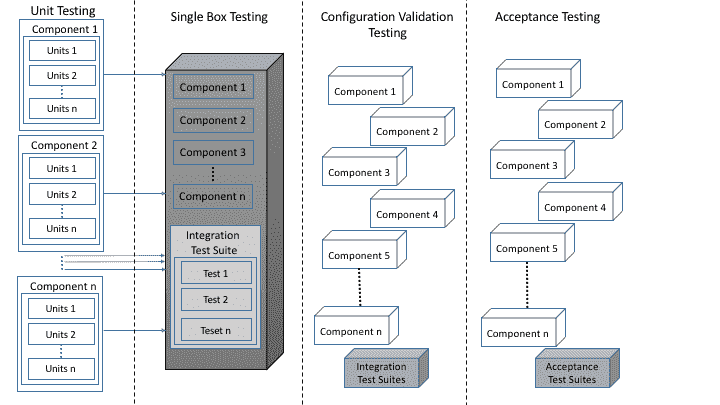**图 1：** 类似 Cloud 的分布式环境中软件测试的一个示例

如前图（第一列）所示，在云这样的分布式环境中进行测试的过程始于对系统中最小的接触点运行单元测试。在所有单元测试成功执行后，运行集成测试以验证作为单个连贯软件系统（第二列）一部分的交互组件的行为，该系统在单个盒子（例如，**虚拟机**（**VM**）或裸机）上运行。然而，虽然这些测试验证了系统作为单体的整体行为，但它们并不能保证系统在分布式部署中的有效性。一旦集成测试通过，下一步（第三列）就是验证系统的分布式部署并运行冒烟测试。

如你所知，软件的成功配置和单元测试的执行使我们能够验证系统行为的可接受性。这种验证是通过运行验收测试（第四列）来完成的。现在，为了克服分布式环境中上述问题和挑战，还有其他隐藏的挑战需要由研究人员和大数据工程师解决，但这些实际上超出了本书的范围。

既然我们知道在分布式环境中软件测试面临的真正挑战是什么，现在让我们开始测试我们的 Spark 代码。下一节专门介绍测试 Spark 应用程序。

# 测试 Spark 应用程序

尝试测试 Spark 代码的方法有很多，取决于它是 Java（你可以进行基本的 JUnit 测试来测试非 Spark 部分）还是 ScalaTest 用于你的 Scala 代码。你还可以通过在本地或小型测试集群上运行 Spark 来进行完整的集成测试。Holden Karau 提供的另一个很棒的选择是使用 Spark-testing base。你可能知道，到目前为止，Spark 还没有原生的单元测试库。尽管如此，我们可以使用以下两个库作为替代方案：

+   ScalaTest

+   Spark-testing base

然而，在开始测试用 Scala 编写的 Spark 应用程序之前，了解单元测试和测试 Scala 方法的一些背景知识是必要的。

# 测试 Scala 方法

在这里，我们将看到一些测试 Scala 方法的简单技巧。对于 Scala 用户来说，这是最熟悉的单元测试框架（你也可以用它来测试 Java 代码，很快也可以用于 JavaScript）。ScalaTest 支持多种不同的测试风格，每种风格都是为了支持特定类型的测试需求而设计的。详情请参阅 ScalaTest 用户指南，网址为[`www.scalatest.org/user_guide/selecting_a_style`](http://www.scalatest.org/user_guide/selecting_a_style)。尽管 ScalaTest 支持多种风格，但最快上手的方法之一是使用以下 ScalaTest 特性，并以**TDD**（**测试驱动开发**）风格编写测试：

1.  `FunSuite`

1.  `Assertions`

1.  `BeforeAndAfter`

欢迎浏览上述 URL 以了解更多关于这些特性的信息，这将使本教程的其余部分顺利进行。

需要注意的是，TDD 是一种开发软件的编程技术，它指出您应该从测试开始开发。因此，它不影响测试的编写方式，而是影响测试的编写时机。在`ScalaTest.FunSuite`、`Assertions`和`BeforeAndAfter`中没有特质或测试风格来强制或鼓励 TDD，它们仅与 xUnit 测试框架更为相似。

在 ScalaTest 的任何风格特质中，有三种断言可用：

+   `assert`：这在您的 Scala 程序中用于通用断言。

+   `assertResult`：这有助于区分预期值与实际值。

+   `assertThrows`：这用于确保一段代码抛出预期的异常。

ScalaTest 的断言定义在特质`Assertions`中，该特质进一步被`Suite`扩展。简而言之，`Suite`特质是所有风格特质的超特质。根据 ScalaTest 文档（[`www.scalatest.org/user_guide/using_assertions`](http://www.scalatest.org/user_guide/using_assertions)），`Assertions`特质还提供了以下功能：

+   `assume` 用于条件性地取消测试

+   `fail` 无条件地使测试失败

+   `cancel` 无条件取消测试

+   `succeed` 使测试无条件成功

+   `intercept` 确保一段代码抛出预期的异常，然后对异常进行断言

+   `assertDoesNotCompile` 确保一段代码无法编译

+   `assertCompiles` 确保一段代码能够编译

+   `assertTypeError` 确保一段代码因类型（非解析）错误而无法编译

+   `withClue` 用于添加有关失败的更多信息

从上述列表中，我们将展示其中几个。在您的 Scala 程序中，您可以通过调用`assert`并传递一个`Boolean`表达式来编写断言。您可以简单地开始编写您的简单单元测试用例，使用`Assertions`。`Predef`是一个对象，其中定义了 assert 的这种行为。请注意，`Predef`的所有成员都会被导入到您的每个 Scala 源文件中。以下源代码将针对以下情况打印`Assertion success`：

```scala
package com.chapter16.SparkTesting
object SimpleScalaTest {
  def main(args: Array[String]):Unit= {
    val a = 5
    val b = 5
    assert(a == b)
      println("Assertion success")       
  }
}
```

然而，如果您设置`a = 2`和`b = 1`，例如，断言将失败，您将看到以下输出：

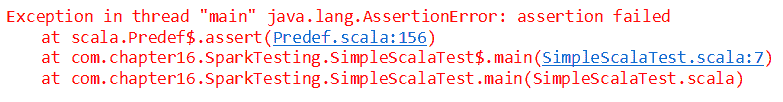**图 2：**断言失败的示例

如果您传递一个真表达式，assert 将正常返回。然而，如果提供的表达式为假，assert 将以 AssertionError 异常突然终止。与`AssertionError`和`TestFailedException`形式不同，ScalaTest 的 assert 提供了更多信息，它会告诉您确切在哪一行测试用例失败或对于哪个表达式。因此，ScalaTest 的 assert 提供的错误信息比 Scala 的 assert 更优。

例如，对于以下源代码，您应该会遇到`TestFailedException`，它会告诉您 5 不等于 4：

```scala
package com.chapter16.SparkTesting
import org.scalatest.Assertions._
object SimpleScalaTest {
  def main(args: Array[String]):Unit= {
    val a = 5
    val b = 4
    assert(a == b)
      println("Assertion success")       
  }
}
```

下图显示了前述 Scala 测试的输出：

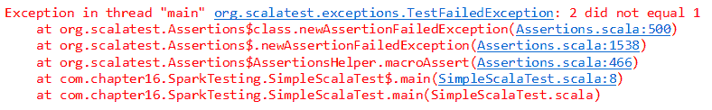**图 3：**TestFailedException 的一个示例

以下源代码说明了使用`assertResult`单元测试来测试您方法结果的用法：

```scala
package com.chapter16.SparkTesting
import org.scalatest.Assertions._
object AssertResult {
  def main(args: Array[String]):Unit= {
    val x = 10
    val y = 6
    assertResult(3) {
      x - y
    }
  }
}
```

上述断言将会失败，Scala 将抛出异常`TestFailedException`并打印出`Expected 3 but got 4`（*图 4*）：

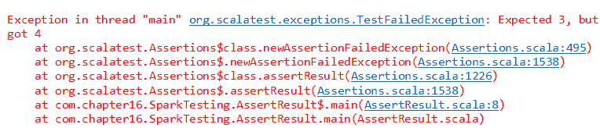**图 4：**TestFailedException 的另一个示例

现在，让我们看一个单元测试，展示预期的异常：

```scala
package com.chapter16.SparkTesting
import org.scalatest.Assertions._
object ExpectedException {
  def main(args: Array[String]):Unit= {
    val s = "Hello world!"
    try {
      s.charAt(0)
      fail()
    } catch {
      case _: IndexOutOfBoundsException => // Expected, so continue
    }
  }
}
```

如果您尝试访问超出索引范围的数组元素，上述代码将告诉您是否允许访问前述字符串`Hello world!`的第一个字符。如果您的 Scala 程序能够访问索引中的值，断言将会失败。这也意味着测试案例失败了。因此，由于第一个索引包含字符`H`，上述测试案例自然会失败，您应该会遇到以下错误信息（*图 5*）：

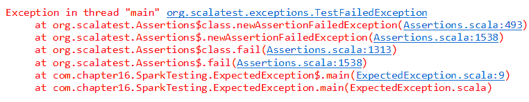**图 5：**TestFailedException 的第三个示例

然而，现在让我们尝试访问位于`-1`位置的索引，如下所示：

```scala
package com.chapter16.SparkTesting
import org.scalatest.Assertions._
object ExpectedException {
  def main(args: Array[String]):Unit= {
    val s = "Hello world!"
    try {
      s.charAt(-1)
      fail()
    } catch {
      case _: IndexOutOfBoundsException => // Expected, so continue
    }
  }
}
```

现在断言应为真，因此测试案例将会通过。最后，代码将正常终止。现在，让我们检查我们的代码片段是否能编译。很多时候，您可能希望确保代表潜在“用户错误”的特定代码顺序根本不编译。目的是检查库对错误的抵抗力，以防止不希望的结果和行为。ScalaTest 的`Assertions`特质为此目的包括了以下语法：

```scala
assertDoesNotCompile("val a: String = 1")
```

如果您想确保由于类型错误（而非语法错误）某段代码不编译，请使用以下方法：

```scala
assertTypeError("val a: String = 1")
```

语法错误仍会导致抛出`TestFailedException`。最后，如果您想声明某段代码确实编译通过，您可以通过以下方式使其更加明显：

```scala
assertCompiles("val a: Int = 1")
```

完整示例如下所示：

```scala
package com.chapter16.SparkTesting
import org.scalatest.Assertions._ 
object CompileOrNot {
  def main(args: Array[String]):Unit= {
    assertDoesNotCompile("val a: String = 1")
    println("assertDoesNotCompile True")

    assertTypeError("val a: String = 1")
    println("assertTypeError True")

    assertCompiles("val a: Int = 1")
    println("assertCompiles True")

    assertDoesNotCompile("val a: Int = 1")
    println("assertDoesNotCompile True")
  }
}
```

上述代码的输出显示在以下图中：

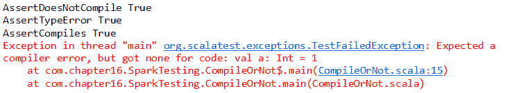**图 6：**多个测试合并进行

由于篇幅限制，我们希望结束基于 Scala 的单元测试。但对于其他单元测试案例，您可以参考[Scala 测试指南](http://www.scalatest.org/user_guide)。

# 单元测试

在软件工程中，通常会对源代码的各个单元进行测试，以确定它们是否适合使用。这种软件测试方法也称为单元测试。这种测试确保软件工程师或开发者编写的源代码符合设计规范并按预期工作。

另一方面，单元测试的目标是将程序的每个部分（即以模块化的方式）分开。然后尝试观察所有单独的部分是否正常工作。单元测试在任何软件系统中都有几个好处：

+   **早期发现问题：** 它在开发周期的早期发现错误或规范中缺失的部分。

+   **便于变更：** 它有助于重构...

# 测试 Spark 应用程序

我们已经看到了如何使用 Scala 内置的`ScalaTest`包测试 Scala 代码。然而，在本小节中，我们将看到如何测试我们用 Scala 编写的 Spark 应用程序。以下三种方法将被讨论：

+   **方法 1：** 使用 JUnit 测试 Spark 应用程序

+   **方法 2：** 使用`ScalaTest`包测试 Spark 应用程序

+   **方法 3：** 使用 Spark 测试基进行 Spark 应用程序测试

方法 1 和 2 将在这里讨论，并附带一些实际代码。然而，方法 3 的详细讨论将在下一小节中提供。为了保持理解简单明了，我们将使用著名的单词计数应用程序来演示方法 1 和 2。

# 方法 1：使用 Scala JUnit 测试

假设你已经编写了一个 Scala 应用程序，它可以告诉你文档或文本文件中有多少单词，如下所示：

```scala
package com.chapter16.SparkTestingimport org.apache.spark._import org.apache.spark.sql.SparkSessionclass wordCounterTestDemo {  val spark = SparkSession    .builder    .master("local[*]")    .config("spark.sql.warehouse.dir", "E:/Exp/")    .appName(s"OneVsRestExample")    .getOrCreate()  def myWordCounter(fileName: String): Long = {    val input = spark.sparkContext.textFile(fileName)    val counts = input.flatMap(_.split(" ")).distinct()    val counter = counts.count()    counter  }}
```

前面的代码简单地解析一个文本文件，并通过简单地分割单词执行`flatMap`操作。然后，它执行...

# 方法 2：使用 FunSuite 测试 Scala 代码

现在，让我们通过仅返回文档中文本的 RDD 来重新设计前面的测试案例，如下所示：

```scala
package com.chapter16.SparkTesting
import org.apache.spark._
import org.apache.spark.rdd.RDD
import org.apache.spark.sql.SparkSession
class wordCountRDD {
  def prepareWordCountRDD(file: String, spark: SparkSession): RDD[(String, Int)] = {
    val lines = spark.sparkContext.textFile(file)
    lines.flatMap(_.split(" ")).map((_, 1)).reduceByKey(_ + _)
  }
}
```

因此，前面类中的`prepareWordCountRDD()`方法返回一个字符串和整数值的 RDD。现在，如果我们想要测试`prepareWordCountRDD()`方法的功能，我们可以通过扩展测试类与`FunSuite`和`BeforeAndAfterAll`从 Scala 的`ScalaTest`包来更明确地进行。测试工作的方式如下：

+   通过扩展`FunSuite`和`BeforeAndAfterAll`从 Scala 的`ScalaTest`包来扩展测试类

+   覆盖`beforeAll()`方法以创建 Spark 上下文

+   使用`test()`方法执行测试，并在`test()`方法内部使用`assert()`方法

+   覆盖`afterAll()`方法以停止 Spark 上下文

基于前面的步骤，让我们看一个用于测试前面`prepareWordCountRDD()`方法的类：

```scala
package com.chapter16.SparkTesting
import org.scalatest.{ BeforeAndAfterAll, FunSuite }
import org.scalatest.Assertions._
import org.apache.spark.sql.SparkSession
import org.apache.spark.rdd.RDD
class wordCountTest2 extends FunSuite with BeforeAndAfterAll {
  var spark: SparkSession = null
  def tokenize(line: RDD[String]) = {
    line.map(x => x.split(' ')).collect()
  }
  override def beforeAll() {
    spark = SparkSession
      .builder
      .master("local[*]")
      .config("spark.sql.warehouse.dir", "E:/Exp/")
      .appName(s"OneVsRestExample")
      .getOrCreate()
  }  
  test("Test if two RDDs are equal") {
    val input = List("To be,", "or not to be:", "that is the question-", "William Shakespeare")
    val expected = Array(Array("To", "be,"), Array("or", "not", "to", "be:"), Array("that", "is", "the", "question-"), Array("William", "Shakespeare"))
    val transformed = tokenize(spark.sparkContext.parallelize(input))
    assert(transformed === expected)
  }  
  test("Test for word count RDD") {
    val fileName = "C:/Users/rezkar/Downloads/words.txt"
    val obj = new wordCountRDD
    val result = obj.prepareWordCountRDD(fileName, spark)    
    assert(result.count() === 214)
  }
  override def afterAll() {
    spark.stop()
  }
}
```

第一个测试表明，如果两个 RDD 以两种不同的方式实现，内容应该相同。因此，第一个测试应该通过。我们将在下面的例子中看到这一点。现在，对于第二个测试，正如我们之前所见，RDD 的单词计数为 214，但让我们暂时假设它是未知的。如果它恰好是 214，测试案例应该通过，这是其预期行为。

因此，我们期望两个测试都通过。现在，在 Eclipse 中，运行测试套件为`ScalaTest-File`，如下所示：

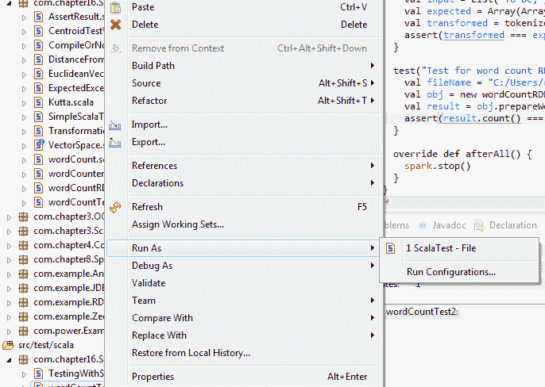 **图 10:** 以 ScalaTest-File 形式运行测试套件

现在您应该观察到以下输出（*图 11*）。输出显示了我们执行了多少测试案例，以及其中有多少通过了、失败了、被取消了、被忽略了或处于待定状态。它还显示了执行整个测试所需的时间。

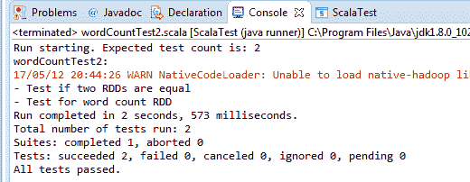**图 11:** 运行两个测试套件作为 ScalaTest-file 时的测试结果

太棒了！测试案例通过了。现在，让我们尝试在两个单独的测试中通过使用`test()`方法改变断言中的比较值：

```scala
test("Test for word count RDD") { 
  val fileName = "data/words.txt"
  val obj = new wordCountRDD
  val result = obj.prepareWordCountRDD(fileName, spark)    
  assert(result.count() === 210)
}
test("Test if two RDDs are equal") {
  val input = List("To be", "or not to be:", "that is the question-", "William Shakespeare")
  val expected = Array(Array("To", "be,"), Array("or", "not", "to", "be:"), Array("that", "is", "the", "question-"), Array("William", "Shakespeare"))
  val transformed = tokenize(spark.sparkContext.parallelize(input))
  assert(transformed === expected)
}
```

现在，您应该预料到测试案例会失败。现在运行之前的类作为`ScalaTest-File`（*图 12*）：

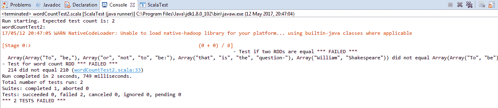**图 12:** 运行前两个测试套件作为 ScalaTest-File 时的测试结果

做得好！我们已经学会了如何使用 Scala 的 FunSuite 进行单元测试。然而，如果您仔细评估前面的方法，您应该同意存在一些缺点。例如，您需要确保`SparkContext`的创建和销毁有明确的管理。作为开发者或程序员，您需要为测试一个示例方法编写更多行代码。有时，代码重复发生，因为*Before*和*After*步骤必须在所有测试套件中重复。然而，这一点有争议，因为公共代码可以放在一个公共特质中。

现在的问题是我们如何能改善我们的体验？我的建议是使用 Spark 测试基底来使生活更轻松、更直接。我们将讨论如何使用 Spark 测试基底进行单元测试。

# 方法 3：利用 Spark 测试基底简化生活

Spark 测试基底助您轻松测试大部分 Spark 代码。那么，这种方法的优势何在？实际上，优势颇多。例如，使用此方法，代码不会冗长，却能得到非常简洁的代码。其 API 本身比 ScalaTest 或 JUnit 更为丰富。支持多种语言，如 Scala、Java 和 Python。内置 RDD 比较器。还可用于测试流应用程序。最后且最重要的是，它支持本地和集群模式测试。这对于分布式环境中的测试至关重要。

GitHub 仓库位于[`github.com/holdenk/spark-testing-base`](https://github.com/holdenk/spark-testing-base)。

开始之前...

# 在 Windows 上配置 Hadoop 运行时

我们已经看到如何在 Eclipse 或 IntelliJ 上测试用 Scala 编写的 Spark 应用程序，但还有一个潜在问题不容忽视。虽然 Spark 可以在 Windows 上运行，但 Spark 设计为在类 UNIX 操作系统上运行。因此，如果您在 Windows 环境中工作，则需要格外小心。

在使用 Eclipse 或 IntelliJ 为 Windows 上的数据分析、机器学习、数据科学或深度学习应用程序开发 Spark 应用程序时，您可能会遇到 I/O 异常错误，您的应用程序可能无法成功编译或可能被中断。实际上，Spark 期望 Windows 上也有 Hadoop 的运行时环境。例如，如果您第一次在 Eclipse 上运行 Spark 应用程序，比如`KMeansDemo.scala`，您将遇到一个 I/O 异常，如下所示：

```scala
17/02/26 13:22:00 ERROR Shell: Failed to locate the winutils binary in the hadoop binary path java.io.IOException: Could not locate executable null\bin\winutils.exe in the Hadoop binaries.
```

原因是默认情况下，Hadoop 是为 Linux 环境开发的，如果您在 Windows 平台上开发 Spark 应用程序，则需要一个桥梁，为 Spark 提供一个 Hadoop 运行时环境，以便正确执行。I/O 异常的详细信息可以在下图看到：

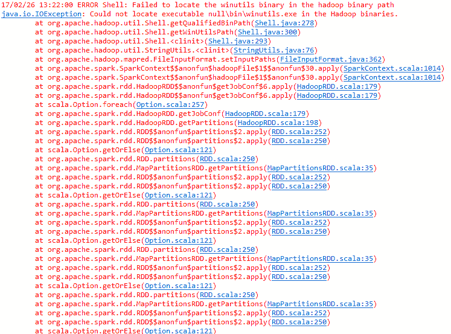**图 14：**由于未能在 Hadoop 二进制路径中定位 winutils 二进制文件，导致发生了 I/O 异常

那么，如何解决这个问题呢？解决方案很简单。正如错误信息所说，我们需要一个可执行文件，即`winutils.exe`。现在从[`github.com/steveloughran/winutils/tree/master/hadoop-2.7.1/bin`](https://github.com/steveloughran/winutils/tree/master/hadoop-2.7.1/bin)下载`winutils.exe`文件，将其粘贴到 Spark 分发目录中，并配置 Eclipse。更具体地说，假设包含 Hadoop 的 Spark 分发位于`C:/Users/spark-2.1.0-bin-hadoop2.7`。在 Spark 分发中，有一个名为 bin 的目录。现在，将可执行文件粘贴到那里（即`path = C:/Users/spark-2.1.0-binhadoop2.7/bin/`）。

解决方案的第二阶段是前往 Eclipse，然后选择主类（即本例中的`KMeansDemo.scala`），接着进入运行菜单。从运行菜单中，选择运行配置选项，并从那里选择环境标签，如图所示：

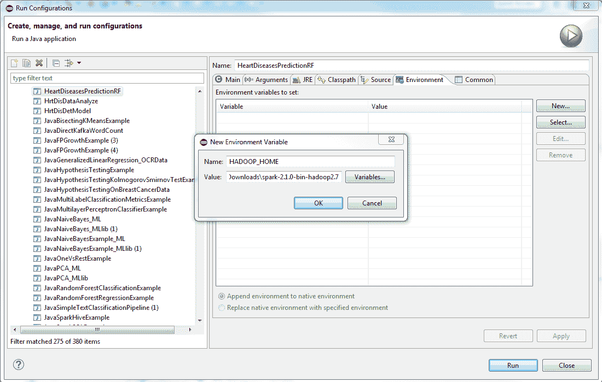**图 15：**解决因 Hadoop 二进制路径中缺少 winutils 二进制文件而发生的 I/O 异常

如果您选择了该标签，您将有机会使用 JVM 为 Eclipse 创建一个新的环境变量。现在创建一个名为`HADOOP_HOME`的新环境变量，并将其值设置为`C:/Users/spark-2.1.0-bin-hadoop2.7/`。现在点击应用按钮并重新运行您的应用程序，您的问题应该得到解决。

需要注意的是，在使用 PySpark 在 Windows 上运行 Spark 时，也需要`winutils.exe`文件。

请注意，上述解决方案也适用于调试您的应用程序。有时，即使出现上述错误，您的 Spark 应用程序仍能正常运行。然而，如果数据集规模较大，很可能会出现上述错误。

# 调试 Spark 应用程序

在本节中，我们将了解如何调试在本地（在 Eclipse 或 IntelliJ 上）、独立模式或 YARN 或 Mesos 集群模式下运行的 Spark 应用程序。然而，在深入之前，有必要了解 Spark 应用程序中的日志记录。

# Spark 使用 log4j 进行日志记录的回顾

如前所述，Spark 使用 log4j 进行自己的日志记录。如果正确配置了 Spark，所有操作都会记录到 shell 控制台。可以从以下图表中看到文件的示例快照：

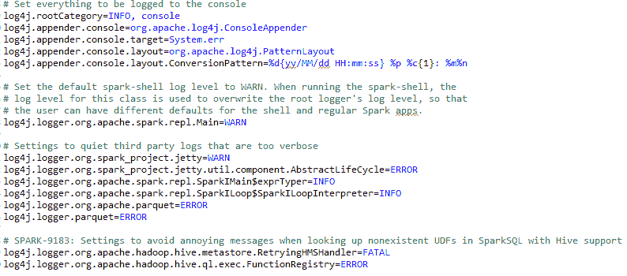**图 16：**log4j.properties 文件的快照

将默认的 spark-shell 日志级别设置为 WARN。运行 spark-shell 时，此类的日志级别用于覆盖根日志记录器的日志级别，以便用户可以为 shell 和常规 Spark 应用设置不同的默认值。我们还需要在启动由执行器执行并由驱动程序管理的作业时附加 JVM 参数。为此，您应该编辑`conf/spark-defaults.conf`。简而言之，可以添加以下选项：

```scala
spark.executor.extraJavaOptions=-Dlog4j.configuration=file:/usr/local/spark-2.1.1/conf/log4j.properties spark.driver.extraJavaOptions=-Dlog4j.configuration=file:/usr/local/spark-2.1.1/conf/log4j.properties
```

为了使讨论更清晰，我们需要隐藏所有由 Spark 生成的日志。然后我们可以将它们重定向到文件系统中进行记录。另一方面，我们希望自己的日志记录在 shell 和单独的文件中，以免与 Spark 的日志混淆。从这里开始，我们将指示 Spark 指向存放我们自己日志的文件，在本例中为`/var/log/sparkU.log`。当应用程序启动时，Spark 会拾取这个`log4j.properties`文件，因此我们除了将其放置在提及的位置外，无需做其他事情：

```scala
package com.chapter14.Serilazition
import org.apache.log4j.LogManager
import org.apache.log4j.Level
import org.apache.spark.sql.SparkSession
object myCustomLog {
  def main(args: Array[String]): Unit = {   
    val log = LogManager.getRootLogger    
    //Everything is printed as INFO once the log level is set to INFO untill you set the level to new level for example WARN. 
    log.setLevel(Level.INFO)
    log.info("Let's get started!")    
    // Setting logger level as WARN: after that nothing prints other than WARN
    log.setLevel(Level.WARN)    
    // Creating Spark Session
    val spark = SparkSession
      .builder
      .master("local[*]")
      .config("spark.sql.warehouse.dir", "E:/Exp/")
      .appName("Logging")
      .getOrCreate()
    // These will note be printed!
    log.info("Get prepared!")
    log.trace("Show if there is any ERROR!")
    //Started the computation and printing the logging information
    log.warn("Started")
    spark.sparkContext.parallelize(1 to 20).foreach(println)
    log.warn("Finished")
  }
}
```

在前面的代码中，一旦将日志级别设置为`INFO`，所有内容都会作为 INFO 打印，直到您将级别设置为新的级别，例如`WARN`。然而，在那之后，不会有任何信息、跟踪等被打印出来。此外，log4j 支持 Spark 的几个有效日志级别。成功执行前面的代码应该会产生以下输出：

```scala
17/05/13 16:39:14 INFO root: Let's get started!
17/05/13 16:39:15 WARN root: Started
4 
1 
2 
5 
3 
17/05/13 16:39:16 WARN root: Finished
```

您还可以在`conf/log4j.properties`中设置 Spark shell 的默认日志记录。Spark 提供了一个 log4j 的属性文件模板，我们可以扩展和修改该文件以在 Spark 中进行日志记录。转到`SPARK_HOME/conf`目录，您应该会看到`log4j.properties.template`文件。在重命名后，您应该使用以下`conf/log4j.properties.template`作为`log4j.properties`。在基于 IDE 的环境（如 Eclipse）中开发 Spark 应用程序时，您可以将`log4j.properties`文件放在项目目录下。但是，要完全禁用日志记录，只需将`log4j.logger.org`标志设置为`OFF`，如下所示：

```scala
log4j.logger.org=OFF
```

到目前为止，一切都很容易。然而，我们还没有注意到前述代码段中的一个问题。`org.apache.log4j.Logger`类的一个缺点是它不是可序列化的，这意味着我们在使用 Spark API 的某些部分进行操作时，不能在闭包内部使用它。例如，假设我们在 Spark 代码中执行以下操作：

```scala
object myCustomLogger {
  def main(args: Array[String]):Unit= {
    // Setting logger level as WARN
    val log = LogManager.getRootLogger
    log.setLevel(Level.WARN)
    // Creating Spark Context
    val conf = new SparkConf().setAppName("My App").setMaster("local[*]")
    val sc = new SparkContext(conf)
    //Started the computation and printing the logging information
    //log.warn("Started")
    val i = 0
    val data = sc.parallelize(i to 100000)
    data.map{number =>
      log.info(“My number”+ i)
      number.toString
    }
    //log.warn("Finished")
  }
}
```

你应该会遇到一个异常，它会说`Task`不可序列化，如下所示：

```scala
org.apache.spark.SparkException: Job aborted due to stage failure: Task not serializable: java.io.NotSerializableException: ...
Exception in thread "main" org.apache.spark.SparkException: Task not serializable 
Caused by: java.io.NotSerializableException: org.apache.log4j.spi.RootLogger
Serialization stack: object not serializable
```

首先，我们可以尝试用一种简单的方法来解决这个问题。你可以做的就是让执行实际操作的 Scala 类`Serializable`，使用`extends Serializable`。例如，代码如下所示：

```scala
class MyMapper(n: Int) extends Serializable {
  @transient lazy val log = org.apache.log4j.LogManager.getLogger("myLogger")
  def logMapper(rdd: RDD[Int]): RDD[String] =
    rdd.map { i =>
      log.warn("mapping: " + i)
      (i + n).toString
    }
  }
```

本节旨在进行关于日志记录的讨论。然而，我们借此机会使其更适用于通用 Spark 编程和问题。为了更有效地克服`task not serializable`错误，编译器将尝试发送整个对象（不仅仅是 lambda），使其可序列化，并强制 Spark 接受它。然而，这会显著增加数据混洗，尤其是对于大型对象！其他方法是将整个类设为`Serializable`，或者仅在传递给 map 操作的 lambda 函数中声明实例。有时，在节点之间保留不可`Serializable`的对象可能有效。最后，使用`forEachPartition()`或`mapPartitions()`而不是仅使用`map()`，并创建不可`Serializable`的对象。总之，这些是解决问题的方法：

+   序列化该类

+   仅在传递给 map 的 lambda 函数中声明实例

+   将不可序列化对象设为静态，并在每台机器上创建一次

+   调用`forEachPartition ()`或`mapPartitions()`而不是`map()`，并创建不可序列化对象

在前述代码中，我们使用了注解`@transient lazy`，它标记`Logger`类为非持久性的。另一方面，包含应用方法（即`MyMapperObject`）的对象，用于实例化`MyMapper`类的对象，如下所示：

```scala
//Companion object 
object MyMapper {
  def apply(n: Int): MyMapper = new MyMapper(n)
}
```

最后，包含`main()`方法的对象如下：

```scala
//Main object
object myCustomLogwithClosureSerializable {
  def main(args: Array[String]) {
    val log = LogManager.getRootLogger
    log.setLevel(Level.WARN)
    val spark = SparkSession
      .builder
      .master("local[*]")
      .config("spark.sql.warehouse.dir", "E:/Exp/")
      .appName("Testing")
      .getOrCreate()
    log.warn("Started")
    val data = spark.sparkContext.parallelize(1 to 100000)
    val mapper = MyMapper(1)
    val other = mapper.logMapper(data)
    other.collect()
    log.warn("Finished")
  }
```

现在，让我们看另一个例子，它提供了更好的洞察力，以继续解决我们正在讨论的问题。假设我们有以下类，用于计算两个整数的乘法：

```scala
class MultiplicaitonOfTwoNumber {
  def multiply(a: Int, b: Int): Int = {
    val product = a * b
    product
  }
}
```

现在，本质上，如果你尝试使用这个类来计算 lambda 闭包中的乘法，使用`map()`，你将会遇到我们之前描述的`Task Not Serializable`错误。现在我们只需简单地使用`foreachPartition()`和内部的 lambda，如下所示：

```scala
val myRDD = spark.sparkContext.parallelize(0 to 1000)
    myRDD.foreachPartition(s => {
      val notSerializable = new MultiplicaitonOfTwoNumber
      println(notSerializable.multiply(s.next(), s.next()))
    })
```

现在，如果你编译它，它应该返回期望的结果。为了方便，包含`main()`方法的完整代码如下：

```scala
package com.chapter16.SparkTesting
import org.apache.spark.sql.SparkSession
class MultiplicaitonOfTwoNumber {
  def multiply(a: Int, b: Int): Int = {
    val product = a * b
    product
  }
}
```

```scala

object MakingTaskSerilazible {
  def main(args: Array[String]): Unit = {
    val spark = SparkSession
      .builder
      .master("local[*]")
      .config("spark.sql.warehouse.dir", "E:/Exp/")
      .appName("MakingTaskSerilazible")
      .getOrCreate()
 val myRDD = spark.sparkContext.parallelize(0 to 1000)
    myRDD.foreachPartition(s => {
      val notSerializable = new MultiplicaitonOfTwoNumber
      println(notSerializable.multiply(s.next(), s.next()))
    })
  }
}
```

输出如下：

```scala
0
5700
1406
156
4032
7832
2550
650
```

# 调试 Spark 应用程序

在本节中，我们将讨论如何在本地 Eclipse 或 IntelliJ 上调试运行在独立模式或集群模式（在 YARN 或 Mesos 上）的 Spark 应用程序。在开始之前，您还可以阅读调试文档：[`hortonworks.com/hadoop-tutorial/setting-spark-development-environment-scala/`](https://hortonworks.com/hadoop-tutorial/setting-spark-development-environment-scala/)。

# 在 Eclipse 上以 Scala 调试方式调试 Spark 应用程序

要实现这一目标，只需将您的 Eclipse 配置为将 Spark 应用程序作为常规 Scala 代码进行调试。配置方法为选择运行 | 调试配置 | Scala 应用程序，如图所示：

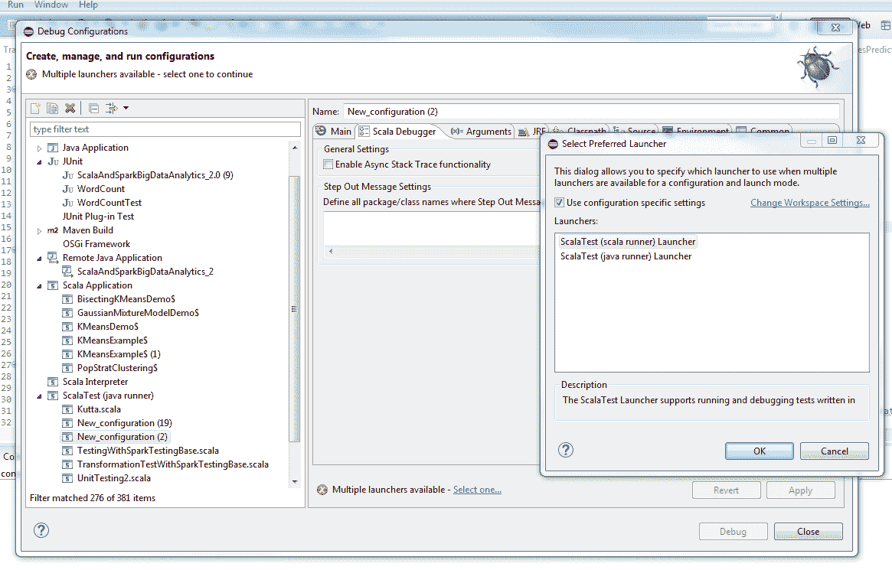**图 17：**配置 Eclipse 以将 Spark 应用程序作为常规 Scala 代码进行调试

假设我们想要调试我们的`KMeansDemo.scala`，并要求 Eclipse（您可以在 InteliJ IDE 中拥有类似选项）从第 56 行开始执行并在第 95 行设置断点。为此，请以调试模式运行您的 Scala 代码，您应该在 Eclipse 上观察到以下场景：

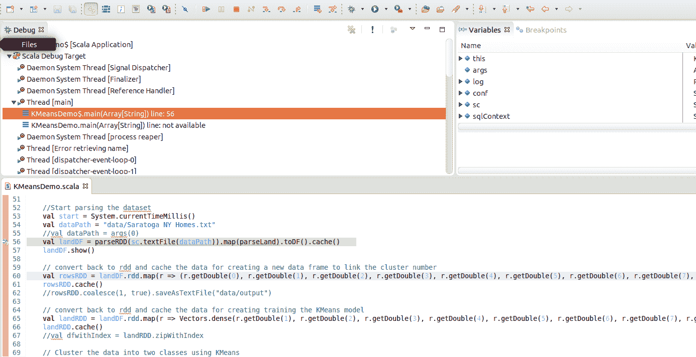**图 18：**在 Eclipse 上调试 Spark 应用程序

然后，Eclipse 将在您要求它停止执行的第 95 行暂停，如下面的截图所示：

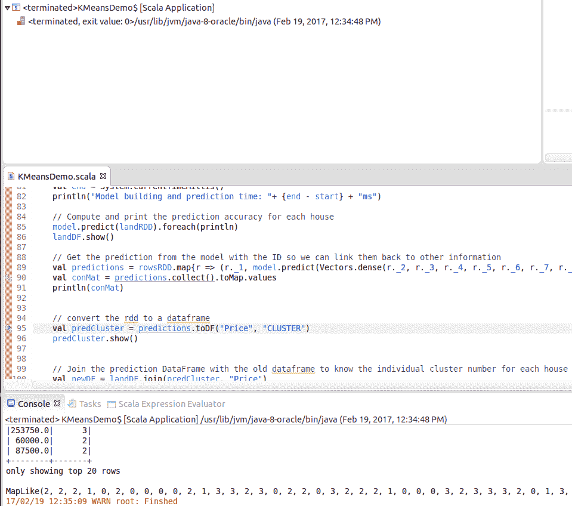**图 19：**在 Eclipse 上调试 Spark 应用程序（断点）

总之，为了简化上述示例，如果在第 56 行和第 95 行之间出现任何错误，Eclipse 将显示错误实际发生的位置。否则，如果没有中断，它将遵循正常的工作流程。

# 调试作为本地和独立模式运行的 Spark 作业

在本地或独立模式下调试您的 Spark 应用程序时，您应该知道调试驱动程序程序和调试其中一个执行程序是不同的，因为使用这两种节点需要向`spark-submit`传递不同的提交参数。在本节中，我将使用端口 4000 作为地址。例如，如果您想调试驱动程序程序，您可以在您的`spark-submit`命令中添加以下内容：

```scala
--driver-java-options -agentlib:jdwp=transport=dt_socket,server=y,suspend=y,address=4000
```

之后，您应将远程调试器设置为连接到您提交驱动程序程序的节点。对于上述情况，端口号 4000 是...

# 在 YARN 或 Mesos 集群上调试 Spark 应用程序

当您在 YARN 上运行 Spark 应用程序时，有一个选项可以通过修改`yarn-env.sh`来启用：

```scala
YARN_OPTS="-agentlib:jdwp=transport=dt_socket,server=y,suspend=n,address=4000 $YARN_OPTS"
```

现在，远程调试将通过 Eclipse 或 IntelliJ IDE 上的 4000 端口可用。第二种方法是设置`SPARK_SUBMIT_OPTS`。您可以使用 Eclipse 或 IntelliJ 开发可以提交到远程多节点 YARN 集群执行的 Spark 应用程序。我所做的是在 Eclipse 或 IntelliJ 上创建一个 Maven 项目，将我的 Java 或 Scala 应用程序打包成 jar 文件，然后作为 Spark 作业提交。然而，为了将 IDE（如 Eclipse 或 IntelliJ）调试器附加到您的 Spark 应用程序，您可以使用`SPARK_SUBMIT_OPTS`环境变量定义所有提交参数，如下所示：

```scala
$ export SPARK_SUBMIT_OPTS=-agentlib:jdwp=transport=dt_socket,server=y,suspend=y,address=4000
```

然后如下提交您的 Spark 作业（请根据您的需求和设置相应地更改值）：

```scala
$ SPARK_HOME/bin/spark-submit \
--class "com.chapter13.Clustering.KMeansDemo" \
--master yarn \
--deploy-mode cluster \
--driver-memory 16g \
--executor-memory 4g \
--executor-cores 4 \
--queue the_queue \
--num-executors 1\
--executor-cores 1 \
--conf "spark.executor.extraJavaOptions=-agentlib:jdwp=transport=dt_socket,server=n,address= host_name_to_your_computer.org:4000,suspend=n" \
--driver-java-options -agentlib:jdwp=transport=dt_socket,server=y,suspend=y,address=4000 \
 KMeans-0.0.1-SNAPSHOT-jar-with-dependencies.jar \
Saratoga_NY_Homes.txt
```

执行上述命令后，它将等待您连接调试器，如下所示：`Listening for transport dt_socket at address: 4000`。现在，您可以在 IntelliJ 调试器中配置 Java 远程应用程序（Scala 应用程序也可以），如下面的截图所示：

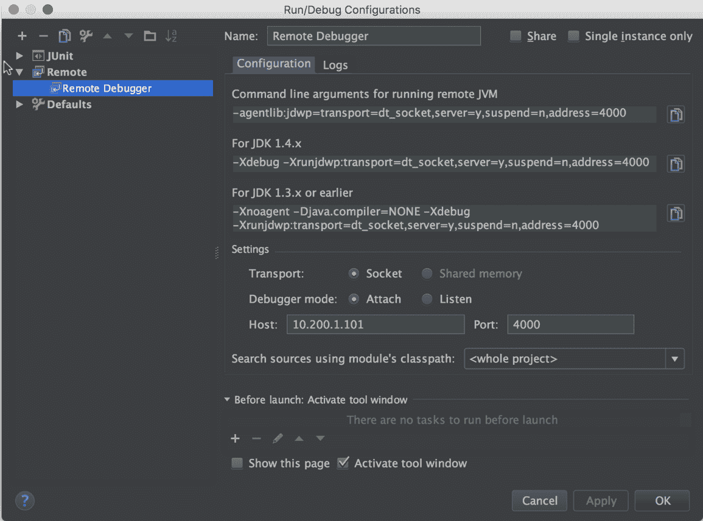**图 20：**在 IntelliJ 上配置远程调试器

对于上述情况，10.200.1.101 是远程计算节点上运行 Spark 作业的基本 IP 地址。最后，您需要通过点击 IntelliJ 的运行菜单下的调试来启动调试器。然后，如果调试器连接到您的远程 Spark 应用程序，您将在 IntelliJ 的应用程序控制台中看到日志信息。现在，如果您可以设置断点，其余的调试就是正常的了。

下图展示了在 IntelliJ 中暂停带有断点的 Spark 作业时的示例视图：

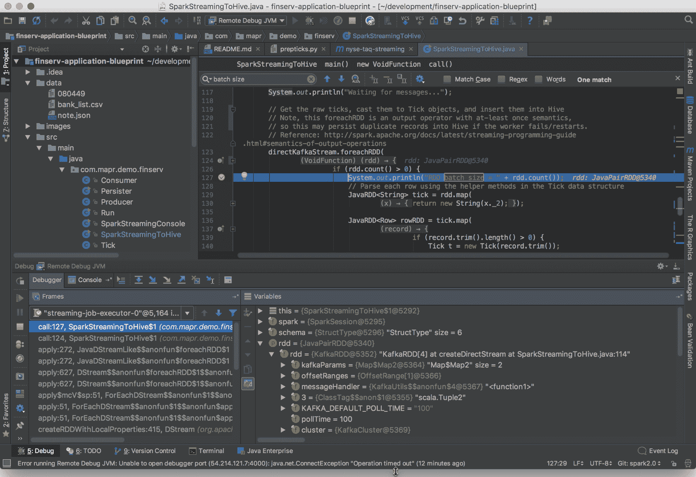**图 21：**在 IntelliJ 中暂停带有断点的 Spark 作业时的示例视图

尽管效果良好，但有时我发现使用`SPARK_JAVA_OPTS`在 Eclipse 甚至 IntelliJ 的调试过程中帮助不大。相反，在运行 Spark 作业的真实集群（YARN、Mesos 或 AWS）上，使用并导出`SPARK_WORKER_OPTS`和`SPARK_MASTER_OPTS`，如下所示：

```scala
$ export SPARK_WORKER_OPTS="-Xdebug -Xrunjdwp:server=y,transport=dt_socket,address=4000,suspend=n"
$ export SPARK_MASTER_OPTS="-Xdebug -Xrunjdwp:server=y,transport=dt_socket,address=4000,suspend=n"
```

然后如下启动 Master 节点：

```scala
$ SPARKH_HOME/sbin/start-master.sh
```

现在打开一个 SSH 连接到运行 Spark 作业的远程机器，并将本地主机映射到 4000（即`localhost:4000`）到`host_name_to_your_computer.org:5000`，假设集群位于`host_name_to_your_computer.org:5000`并监听端口 5000。现在，您的 Eclipse 将认为您只是在调试本地 Spark 应用程序或进程。然而，要实现这一点，您需要在 Eclipse 上配置远程调试器，如下所示：

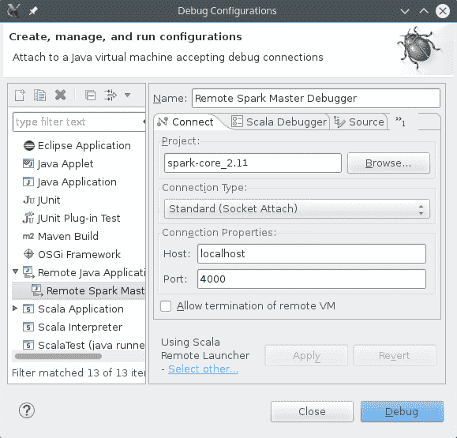**图 22：**在 Eclipse 上连接远程主机以调试 Spark 应用程序

就这样！现在你可以在实时集群上调试，就像在桌面一样。前面的示例是在 Spark Master 设置为 YARN-client 的情况下运行的。然而，在 Mesos 集群上运行时也应该有效。如果你使用的是 YARN-cluster 模式，你可能需要将驱动程序设置为附加到调试器，而不是将调试器附加到驱动程序，因为你事先不一定知道驱动程序将执行的模式。

# 使用 SBT 调试 Spark 应用程序

上述设置主要适用于使用 Maven 项目的 Eclipse 或 IntelliJ。假设你已经完成了应用程序，并正在你喜欢的 IDE（如 IntelliJ 或 Eclipse）中工作，如下所示：

```scala
object DebugTestSBT {  def main(args: Array[String]): Unit = {    val spark = SparkSession      .builder      .master("local[*]")      .config("spark.sql.warehouse.dir", "C:/Exp/")      .appName("Logging")      .getOrCreate()          spark.sparkContext.setCheckpointDir("C:/Exp/")    println("-------------Attach debugger now!--------------")    Thread.sleep(8000)    // code goes here, with breakpoints set on the lines you want to pause  }}
```

现在，如果你想将这项工作部署到本地集群（独立模式），第一步是打包...

# 总结

在本章中，你看到了测试和调试 Spark 应用程序的难度。在分布式环境中，这些甚至可能更为关键。我们还讨论了一些高级方法来全面应对这些问题。总之，你学习了在分布式环境中的测试方法。然后你学习了测试 Spark 应用程序的更好方法。最后，我们讨论了一些调试 Spark 应用程序的高级方法。

这基本上是我们关于 Spark 高级主题的小旅程的结束。现在，我们给读者的一般建议是，如果你是数据科学、数据分析、机器学习、Scala 或 Spark 的相对新手，你应该首先尝试了解你想执行哪种类型的分析。更具体地说，例如，如果你的问题是机器学习问题，尝试猜测哪种学习算法最适合，即分类、聚类、回归、推荐或频繁模式挖掘。然后定义和制定问题，之后你应该根据我们之前讨论的 Spark 特征工程概念生成或下载适当的数据。另一方面，如果你认为你可以使用深度学习算法或 API 解决问题，你应该使用其他第三方算法并与 Spark 集成，直接工作。

我们给读者的最终建议是定期浏览 Spark 官网（位于[`spark.apache.org/`](http://spark.apache.org/)）以获取更新，并尝试将常规的 Spark 提供的 API 与其他第三方应用程序或工具结合使用，以实现最佳的协同效果。
