# 第十章：使用 Spark 和 Scala 进行实用机器学习

在本章中，我们将涵盖：

+   配置 IntelliJ 以与 Spark 配合工作并运行 Spark ML 示例代码

+   运行 Spark 中的示例 ML 代码

+   识别实用机器学习的数据源

+   使用 IntelliJ IDE 运行您的第一个 Apache Spark 2.0 程序

+   如何向您的 Spark 程序添加图形

# 简介

随着集群计算的最新进展，以及大数据的兴起，机器学习领域已被推到了计算的前沿。长期以来，人们一直梦想有一个能够实现大规模数据科学的交互式平台，现在这个梦想已成为现实。

以下三个领域的结合使得大规模交互式数据科学得以实现并加速发展：

+   **Apache Spark**：一个统一的数据科学技术平台，它将快速计算引擎和容错数据结构结合成一个设计精良且集成的解决方案

+   **机器学习**：人工智能的一个领域，使机器能够模仿原本专属于人脑的一些任务

+   **Scala**：一种基于现代 JVM 的语言，它建立在传统语言之上，但将函数式和面向对象的概念结合在一起，而不会像其他语言那样冗长

首先，我们需要设置开发环境，它将包括以下组件：

+   Spark

+   IntelliJ 社区版 IDE

+   Scala

本章中的配方将为您提供详细的安装和配置 IntelliJ IDE、Scala 插件和 Spark 的说明。开发环境设置完成后，我们将继续运行一个 Spark ML 示例代码来测试设置。

# Apache Spark

Apache Spark 正成为大数据分析的事实标准平台和行业语言，并作为**Hadoop**范式的补充。Spark 使数据科学家能够以最有利于其工作流程的方式直接开始工作。Spark 的方法是在完全分布式的方式下处理工作负载，无需**MapReduce**（**MR**）或重复将中间结果写入磁盘。

Spark 提供了一个易于使用的统一技术栈中的分布式框架，这使其成为数据科学项目的首选平台，这些项目往往需要一个最终合并到解决方案的迭代算法。由于这些算法的内部工作原理，它们会产生大量的...

# 机器学习

机器学习的目的是制造能够模仿人类智能并自动化一些传统上由人脑完成的任务的机器和设备。机器学习算法旨在在相对较短的时间内处理大量数据集，并近似出人类需要更长时间才能处理出的答案。

（机器学习领域可以分为多种形式，从高层次上可以分为监督学习和无监督学习。监督学习算法是一类使用训练集（即标记数据）来计算概率分布或图形模型的 ML 算法，进而使它们能够在没有进一步人工干预的情况下对新数据点进行分类。无监督学习是一种机器学习算法，用于从没有标签响应的输入数据集中提取推断。）

（Spark 开箱即提供丰富的 ML 算法集合，无需进一步编码即可部署在大型数据集上。下图展示了 Spark 的 MLlib 算法作为思维导图。Spark 的 MLlib 旨在利用并行性，同时拥有容错分布式数据结构。Spark 将此类数据结构称为 **弹性分布式数据集** 或 **RDD**。）

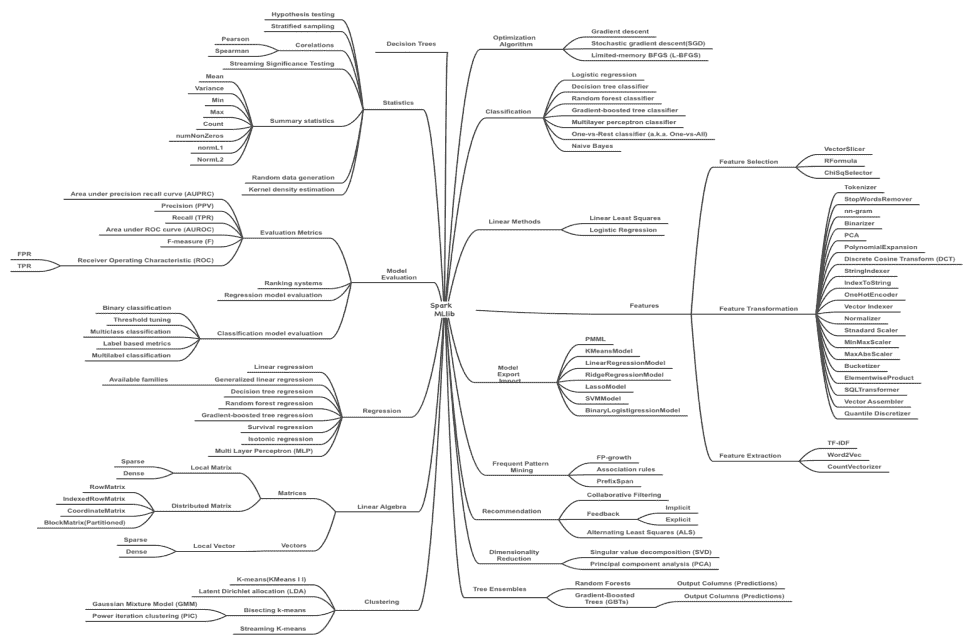

# Scala

**Scala** 是一种新兴的现代编程语言，作为传统编程语言如 **Java** 和 **C++** 的替代品而崭露头角。Scala 是一种基于 JVM 的语言，不仅提供简洁的语法，避免了传统的样板代码，还将面向对象和函数式编程融合到一个极其精炼且功能强大的类型安全语言中。

Scala 采用灵活且富有表现力的方法，使其非常适合与 Spark 的 MLlib 交互。Spark 本身是用 Scala 编写的，这一事实有力地证明了 Scala 语言是一种全功能编程语言，可用于创建具有高性能需求的复杂系统代码。

Scala 基于 Java 的传统...

# Software versions and libraries used in this book

The following table provides a detailed list of software versions and libraries used in this book. If you follow the installation instructions covered in this chapter, it will include most of the items listed here. Any other JAR or library files that may be required for specific recipes are covered via additional installation instructions in the respective recipes:

| **Core systems** | **Version** |
| --- | --- |
| Spark | 2.0.0 |
| Java | 1.8 |
| IntelliJ IDEA | 2016.2.4 |
| Scala-sdk | 2.11.8 |

Miscellaneous JARs that will be required are as follows:

| **Miscellaneous JARs** | **Version** |
| --- | --- |
| `bliki-core` | 3.0.19 |
| `breeze-viz` | 0.12 |
| `Cloud9` | 1.5.0 |
| `Hadoop-streaming` | 2.2.0 |
| `JCommon` | 1.0.23 |
| `JFreeChart` | 1.0.19 |
| `lucene-analyzers-common` | 6.0.0 |
| `Lucene-Core` | 6.0.0 |
| `scopt` | 3.3.0 |
| `spark-streaming-flume-assembly` | 2.0.0 |
| `spark-streaming-kafka-0-8-assembly` | 2.0.0 |

We have additionally tested all the recipes in this book on Spark 2.1.1 and found that the programs executed as expected. It is recommended for learning purposes you use the software versions and libraries listed in these tables.

为了跟上快速变化的 Spark 环境和文档，本书中提到的 Spark 文档的 API 链接指向最新的 Spark 2.x.x 版本，但食谱中的 API 参考明确针对 Spark 2.0.0。

本书提供的所有 Spark 文档链接将指向 Spark 网站上的最新文档。如果您希望查找特定版本的 Spark（例如，Spark 2.0.0）的文档，请使用以下 URL 在 Spark 网站上查找相关文档：

[`spark.apache.org/documentation.html`](https://spark.apache.org/documentation.html)

为了清晰起见，我们已尽可能简化代码，而不是展示 Scala 的高级特性。

# 配置 IntelliJ 以配合 Spark 运行 Spark ML 示例代码

在运行 Spark 或本书列出的任何程序提供的示例之前，我们需要进行一些配置以确保项目设置正确。

# 准备就绪

在配置项目结构和全局库时，我们需要特别小心。设置完成后，我们运行 Spark 团队提供的示例 ML 代码以验证安装。示例代码可在 Spark 目录下找到，或通过下载包含示例的 Spark 源代码获取。

# 如何操作...

以下是配置 IntelliJ 以配合 Spark MLlib 工作以及在示例目录中运行 Spark 提供的示例 ML 代码的步骤。示例目录可在您的 Spark 主目录中找到。使用 Scala 示例继续：

1.  点击“项目结构...”选项，如以下截图所示，以配置项目设置：

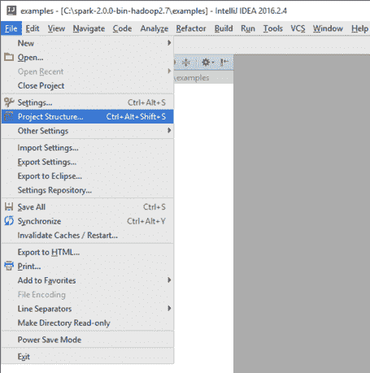

1.  验证设置：

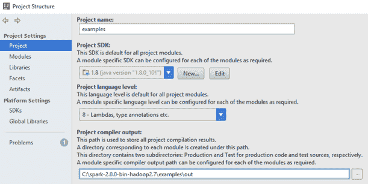

1.  配置全局库。选择 Scala SDK 作为您的全局库：

1.  选择新的 Scala SDK 的 JAR 文件并允许下载...

# 还有更多...

在 Spark 2.0 之前，我们需要 Google 的另一个库**Guava**来促进 I/O 并提供定义表的一组丰富方法，然后让 Spark 在集群中广播它们。由于难以解决的依赖问题，Spark 2.0 不再使用 Guava 库。如果您使用的是 2.0 之前的 Spark 版本（在 1.5.2 版本中需要），请确保使用 Guava 库。Guava 库可从此 URL 访问：

[`github.com/google/guava/wiki`](https://github.com/google/guava/wiki)

您可能希望使用 Guava 版本 15.0，该版本可在此处找到：

[`mvnrepository.com/artifact/com.google.guava/guava/15.0`](https://mvnrepository.com/artifact/com.google.guava/guava/15.0)

如果您使用的是之前博客中的安装说明，请确保从安装集中排除 Guava 库。

# 另请参见

如果完成 Spark 安装还需要其他第三方库或 JAR，您可以在以下 Maven 仓库中找到它们：

[`repo1.maven.org/maven2/org/apache/spark/`](https://repo1.maven.org/maven2/org/apache/spark/)

# 从 Spark 运行样本 ML 代码

我们可以通过简单地下载 Spark 源树中的样本代码并将其导入 IntelliJ 以确保其运行来验证设置。

# 准备就绪

我们首先运行样本中的逻辑回归代码以验证安装。在下一节中，我们将编写自己的版本并检查输出，以便理解其工作原理。

# 如何操作...

1.  转到源目录并选择一个 ML 样本代码文件运行。我们选择了逻辑回归示例。

如果您在目录中找不到源代码，您可以随时下载 Spark 源码，解压缩，然后相应地提取示例目录。

1.  选择示例后，选择“编辑配置...”，如下面的截图所示：

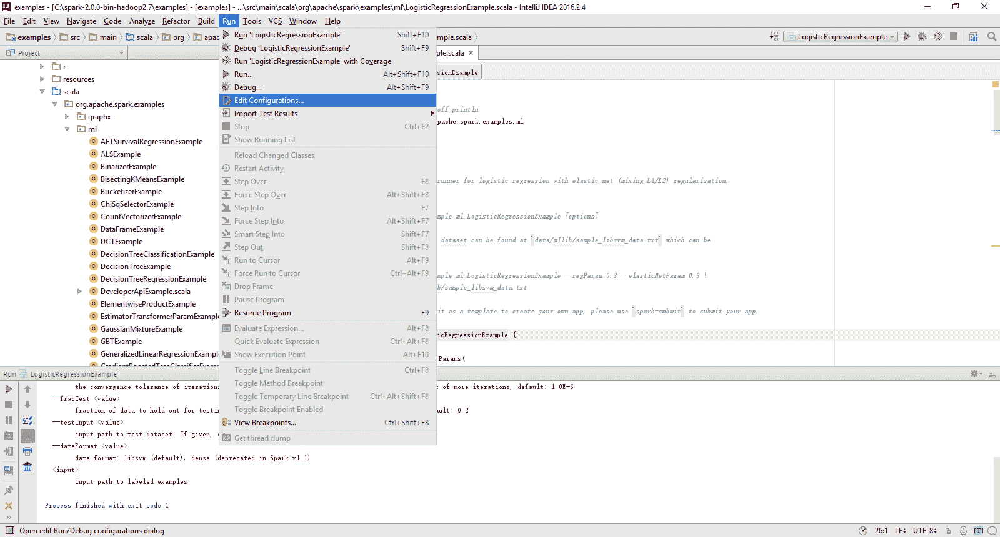

1.  在配置选项卡中，定义以下选项：

    +   VM 选项：所示选项允许您运行独立 Spark 集群

    +   程序参数：我们需要传递给程序的内容

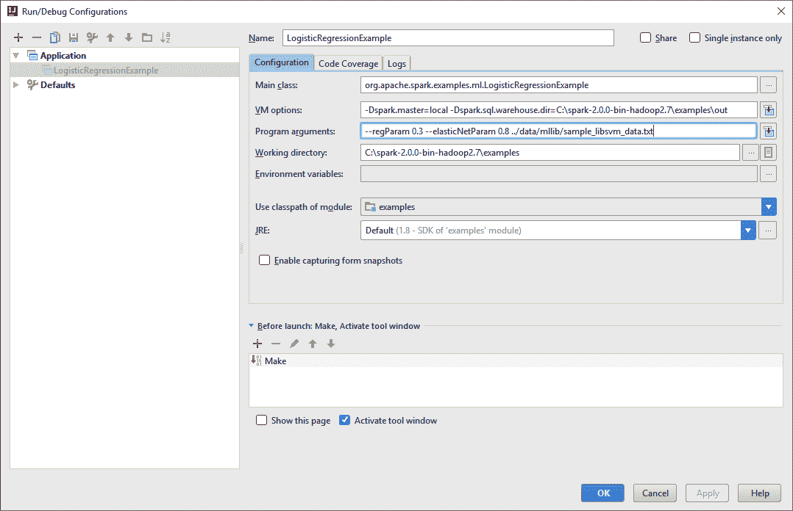

1.  通过转到运行'LogisticRegressionExample'来运行逻辑回归，如下面的截图所示：

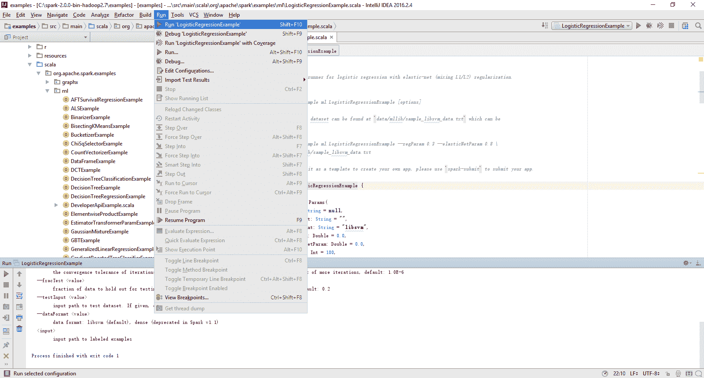

1.  验证退出代码，并确保它与下面的截图所示相同：

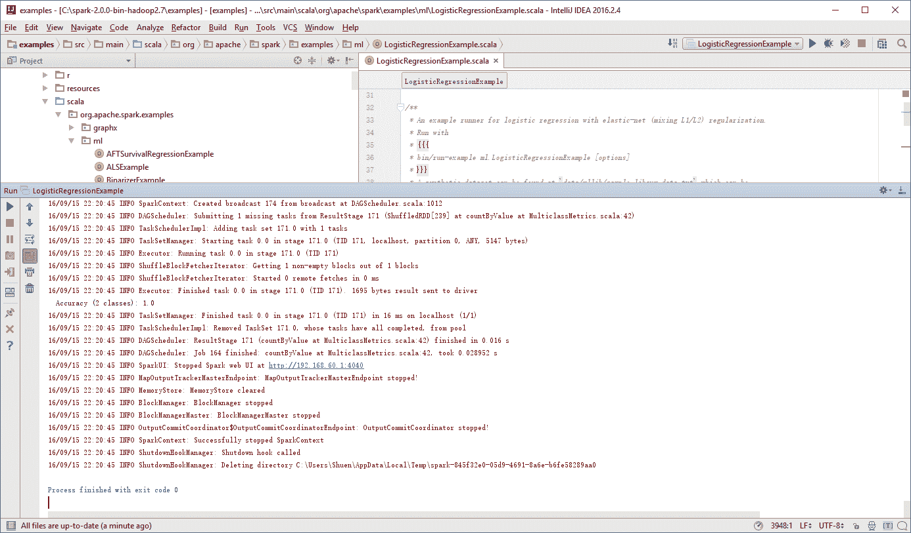

# 识别实用机器学习的数据源

过去为机器学习项目获取数据是一个挑战。然而，现在有一系列特别适合机器学习的公共数据源。

# 准备就绪

除了大学和政府来源外，还有许多其他开放数据源可用于学习和编写自己的示例和项目。我们将列出数据源，并向您展示如何最好地获取和下载每章的数据。

# 如何操作...

以下是一些值得探索的开源数据列表，如果您想在此领域开发应用程序：

+   *UCI 机器学习库*：这是一个具有搜索功能的广泛库。在撰写本文时，已有超过 350 个数据集。您可以点击[`archive.ics.uci.edu/ml/index.html`](https://archive.ics.uci.edu/ml/index.html)链接查看所有数据集，或使用简单搜索（*Ctrl* + *F*）查找特定数据集。

+   *Kaggle 数据集*：你需要创建一个账户，但你可以下载任何用于学习和参加机器学习竞赛的数据集。[`www.kaggle.com/competitions`](https://www.kaggle.com/competitions)链接提供了探索和了解更多关于 Kaggle 以及机器学习竞赛内部运作的详细信息。...

# 另请参阅

机器学习数据的其它来源：

+   SMS 垃圾邮件数据：[`www.dt.fee.unicamp.br/~tiago/smsspamcollection/`](http://www.dt.fee.unicamp.br/~tiago/smsspamcollection/)

+   来自 Lending Club 的金融数据集 [`www.lendingclub.com/info/download-data.action`](https://www.lendingclub.com/info/download-data.action)

+   雅虎的研究数据 [`webscope.sandbox.yahoo.com/index.php`](http://webscope.sandbox.yahoo.com/index.php)

+   亚马逊 AWS 公共数据集 [`aws.amazon.com/public-data-sets/`](http://aws.amazon.com/public-data-sets/)

+   来自 ImageNet 的标记视觉数据 [`www.image-net.org`](http://www.image-net.org)

+   人口普查数据集 [`www.census.gov`](http://www.census.gov)

+   编译的 YouTube 数据集 [`netsg.cs.sfu.ca/youtubedata/`](http://netsg.cs.sfu.ca/youtubedata/)

+   来自 MovieLens 网站的收集评分数据 [`grouplens.org/datasets/movielens/`](http://grouplens.org/datasets/movielens/)

+   公开的安然数据集 [`www.cs.cmu.edu/~enron/`](http://www.cs.cmu.edu/~enron/)

+   经典书籍《统计学习要素》的数据集 [`statweb.stanford.edu/~tibs/ElemStatLearn/data.htmlIMDB`](http://statweb.stanford.edu/~tibs/ElemStatLearn/data.htmlIMDB)

+   电影数据集 [`www.imdb.com/interfaces`](http://www.imdb.com/interfaces)

+   百万歌曲数据集 [`labrosa.ee.columbia.edu/millionsong/`](http://labrosa.ee.columbia.edu/millionsong/)

+   语音和音频数据集 [`labrosa.ee.columbia.edu/projects/`](http://labrosa.ee.columbia.edu/projects/)

+   人脸识别数据 [`www.face-rec.org/databases/`](http://www.face-rec.org/databases/)

+   社会科学数据 [`www.icpsr.umich.edu/icpsrweb/ICPSR/studies`](http://www.icpsr.umich.edu/icpsrweb/ICPSR/studies)

+   康奈尔大学的大量数据集 [`arxiv.org/help/bulk_data_s3`](http://arxiv.org/help/bulk_data_s3)

+   古腾堡项目数据集 [`www.gutenberg.org/wiki/Gutenberg:Offline_Catalogs`](http://www.gutenberg.org/wiki/Gutenberg:Offline_Catalogs)

+   世界银行数据集 [`data.worldbank.org`](http://data.worldbank.org)

+   世界词网词汇数据库 [`wordnet.princeton.edu`](http://wordnet.princeton.edu)

+   纽约警察局的碰撞数据 [`nypd.openscrape.com/#/`](http://nypd.openscrape.com/#/)

+   国会唱名表决等数据集 [`voteview.com/dwnl.htm`](http://voteview.com/dwnl.htm)

+   斯坦福大学的大型图数据集 [`snap.stanford.edu/data/index.html`](http://snap.stanford.edu/data/index.html)

+   来自 datahub 的丰富数据集 [`datahub.io/dataset`](https://datahub.io/dataset)

+   Yelp 的学术数据集 [`www.yelp.com/academic_dataset`](https://www.yelp.com/academic_dataset)

+   GitHub 上的数据源 [`github.com/caesar0301/awesome-public-datasets`](https://github.com/caesar0301/awesome-public-datasets)

+   来自 Reddit 的数据集存档 [`www.reddit.com/r/datasets/`](https://www.reddit.com/r/datasets/)

有一些专业数据集（例如，西班牙语文本分析数据集，以及基因和 IMF 数据）可能对您有所帮助：

+   来自哥伦比亚的数据集（西班牙语）：[`www.datos.gov.co/frm/buscador/frmBuscador.aspx`](http://www.datos.gov.co/frm/buscador/frmBuscador.aspx)

+   来自癌症研究的数据集 [`www.broadinstitute.org/cgi-bin/cancer/datasets.cgi`](http://www.broadinstitute.org/cgi-bin/cancer/datasets.cgi)

+   来自皮尤研究中心的研究数据 [`www.pewinternet.org/datasets/`](http://www.pewinternet.org/datasets/)

+   来自美国伊利诺伊州的数据 [`data.illinois.gov`](https://data.illinois.gov)

+   来自 freebase.com 的数据 [`www.freebase.com`](http://www.freebase.com)

+   联合国及其附属机构的数据集 [`data.un.org`](http://data.un.org)

+   国际货币基金组织数据集 [`www.imf.org/external/data.htm`](http://www.imf.org/external/data.htm)

+   英国政府数据 [`data.gov.uk`](https://data.gov.uk)

+   来自爱沙尼亚的开放数据 [`pub.stat.ee/px-web.2001/Dialog/statfile1.asp`](http://pub.stat.ee/px-web.2001/Dialog/statfile1.asp)

+   R 语言中许多包含数据并可导出为 CSV 的 ML 库 [`www.r-project.org`](https://www.r-project.org)

+   基因表达数据集 [`www.ncbi.nlm.nih.gov/geo/`](http://www.ncbi.nlm.nih.gov/geo/)

# 使用 IntelliJ IDE 运行您的第一个 Apache Spark 2.0 程序

本程序的目的是让您熟悉使用刚设置的 Spark 2.0 开发环境编译和运行示例。我们将在后续章节中探讨组件和步骤。

我们将编写自己的 Spark 2.0.0 程序版本，并检查输出，以便理解其工作原理。需要强调的是，这个简短的示例仅是一个简单的 RDD 程序，使用了 Scala 的糖语法，以确保在开始处理更复杂的示例之前，您已正确设置了环境。

# 如何操作...

1.  在 IntelliJ 或您选择的 IDE 中启动一个新项目。确保包含了必要的 JAR 文件。

1.  下载本书的示例代码，找到`myFirstSpark20.scala`文件，并将代码放置在以下目录中。

我们在 Windows 机器上的`C:\spark-2.0.0-bin-hadoop2.7\`目录下安装了 Spark 2.0。

1.  将`myFirstSpark20.scala`文件放置在`C:\spark-2.0.0-bin-hadoop2.7\examples\src\main\scala\spark\ml\cookbook\chapter1`目录下：

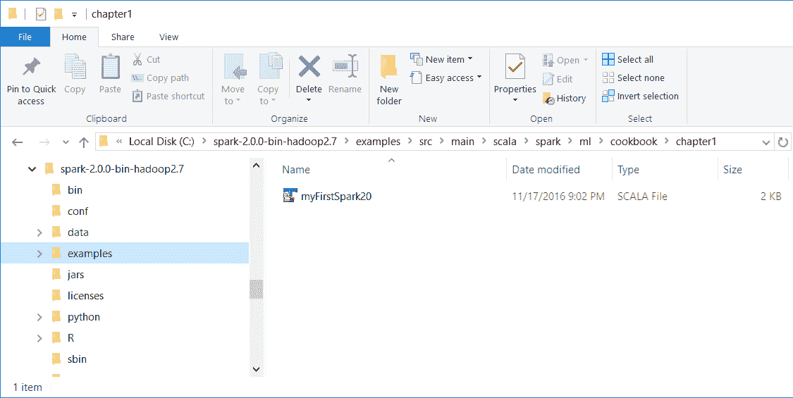

Mac 用户请注意，我们在 Mac 机器上的`/Users/USERNAME/spark/spark-2.0.0-bin-hadoop2.7/`目录下安装了 Spark 2.0。

将`myFirstSpark20.scala`文件放置在`/Users/USERNAME/spark/spark-2.0.0-bin-hadoop2.7/examples/src/main/scala/spark/ml/cookbook/chapter1`目录下。

1.  设置程序将驻留的包位置：

```scala
package spark.ml.cookbook.chapter1 
```

1.  为了使 Spark 会话能够访问集群并使用`log4j.Logger`减少 Spark 产生的输出量，导入必要的包：

```scala
import org.apache.spark.sql.SparkSession 
import org.apache.log4j.Logger 
import org.apache.log4j.Level 
```

1.  将输出级别设置为`ERROR`以减少 Spark 的日志输出：

```scala
Logger.getLogger("org").setLevel(Level.ERROR) 
```

1.  通过使用构建器模式指定配置来初始化 Spark 会话，从而为 Spark 集群提供一个入口点：

```scala
val spark = SparkSession 
.builder 
.master("local[*]")
 .appName("myFirstSpark20") 
.config("spark.sql.warehouse.dir", ".") 
.getOrCreate() 
```

`myFirstSpark20`对象将在本地模式下运行。前面的代码块是创建`SparkSession`对象的典型方式。

1.  然后我们创建两个数组变量：

```scala
val x = Array(1.0,5.0,8.0,10.0,15.0,21.0,27.0,30.0,38.0,45.0,50.0,64.0) 
val y = Array(5.0,1.0,4.0,11.0,25.0,18.0,33.0,20.0,30.0,43.0,55.0,57.0) 
```

1.  然后让 Spark 基于之前创建的数组创建两个 RDD：

```scala
val xRDD = spark.sparkContext.parallelize(x) 
val yRDD = spark.sparkContext.parallelize(y) 
```

1.  接下来，我们让 Spark 对`RDD`进行操作；`zip()`函数将从之前提到的两个 RDD 创建一个新的`RDD`：

```scala
val zipedRDD = xRDD.zip(yRDD) 
zipedRDD.collect().foreach(println) 
```

在运行时控制台输出（关于如何在 IntelliJ IDE 中运行程序的更多详细信息将在后续步骤中介绍），您将看到这个：

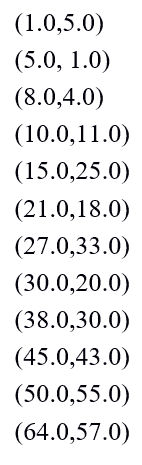

1.  现在，我们汇总`xRDD`和`yRDD`的值，并计算新的`zipedRDD`总和值。我们还计算了`zipedRDD`的项目计数：

```scala
val xSum = zipedRDD.map(_._1).sum() 
val ySum = zipedRDD.map(_._2).sum() 
val xySum= zipedRDD.map(c => c._1 * c._2).sum() 
val n= zipedRDD.count() 
```

1.  我们在控制台上打印出之前计算的值：

```scala
println("RDD X Sum: " +xSum) 
println("RDD Y Sum: " +ySum) 
println("RDD X*Y Sum: "+xySum) 
println("Total count: "+n) 
```

这里是控制台输出：

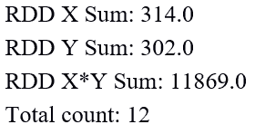

1.  我们通过停止 Spark 会话来关闭程序：

```scala
spark.stop() 
```

1.  程序完成后，`myFirstSpark20.scala`在 IntelliJ 项目资源管理器中的布局将如下所示：

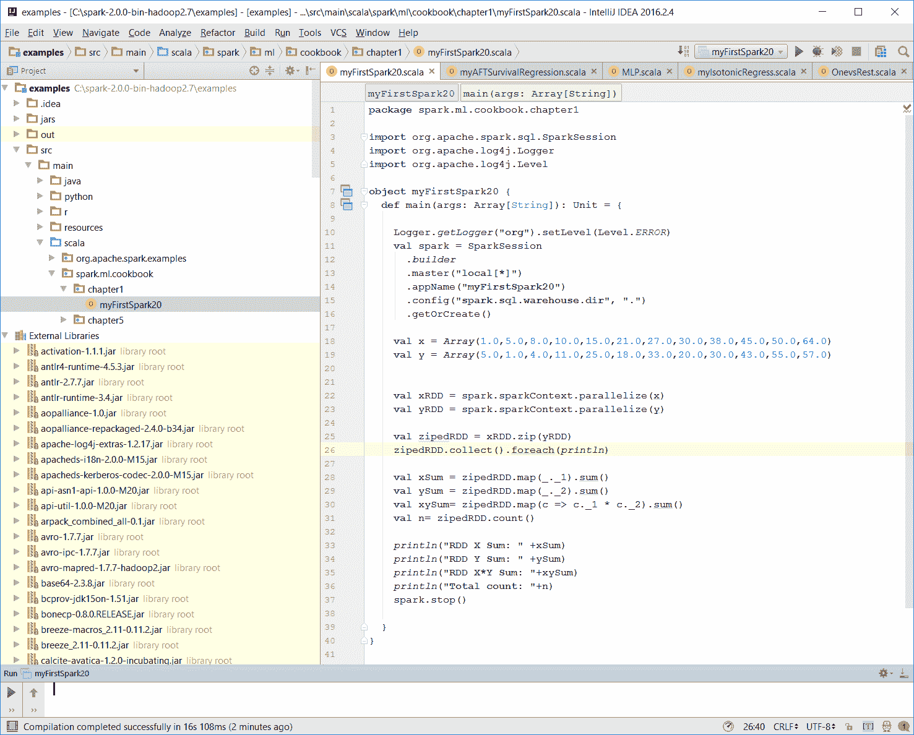

1.  确保没有编译错误。您可以通过重建项目来测试这一点：

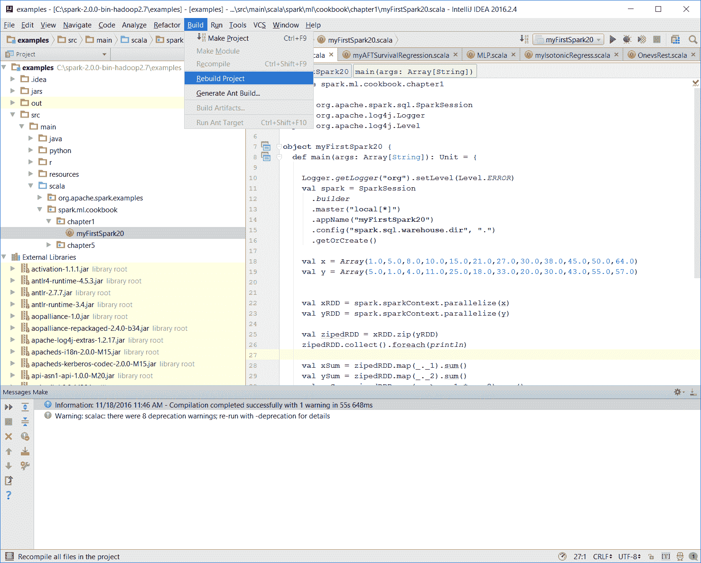

一旦重建完成，控制台上应该会出现构建完成的消息：

```scala
Information: November 18, 2016, 11:46 AM - Compilation completed successfully with 1 warning in 55s 648ms
```

1.  您可以通过在项目资源管理器中右键点击`myFirstSpark20`对象并选择上下文菜单选项（如下一张截图所示）`运行 myFirstSpark20`来运行前面的程序。

您也可以从菜单栏的“运行”菜单执行相同的操作。

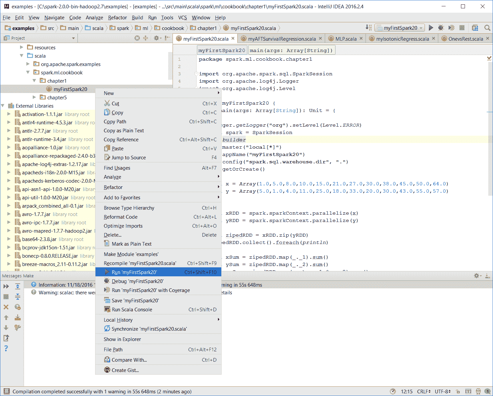

1.  一旦程序成功执行，您将看到以下消息：

```scala
Process finished with exit code 0
```

这也显示在下面的截图中：

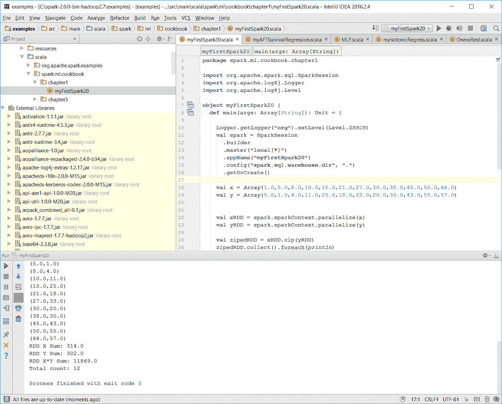

1.  IntelliJ 的 Mac 用户可以使用相同的上下文菜单执行此操作。

将代码放置在正确的路径上。

# 工作原理...

在本例中，我们编写了第一个 Scala 程序`myFirstSpark20.scala`，并在 IntelliJ 中展示了执行该程序的步骤。我们按照步骤中描述的路径，在 Windows 和 Mac 上都放置了代码。

在`myFirstSpark20`代码中，我们看到了创建`SparkSession`对象的典型方式，以及如何使用`master()`函数配置它以在本地模式下运行。我们从数组对象创建了两个 RDD，并使用简单的`zip()`函数创建了一个新的 RDD。

我们还对创建的 RDD 进行了简单的求和计算，并在控制台中显示了结果。最后，我们通过调用`spark.stop()`退出并释放资源。

# 还有更多...

Spark 可以从[`spark.apache.org/downloads.html`](http://spark.apache.org/downloads.html)下载。

Spark 2.0 关于 RDD 的文档可以在[`spark.apache.org/docs/latest/programming-guide.html#rdd-operations`](http://spark.apache.org/docs/latest/programming-guide.html#rdd-operations)找到。

# 另请参见

+   关于 JetBrain IntelliJ 的更多信息，请访问[`www.jetbrains.com/idea/`](https://www.jetbrains.com/idea/)。

# 如何向你的 Spark 程序添加图形

在本食谱中，我们讨论了如何使用 JFreeChart 向你的 Spark 2.0.0 程序添加图形图表。

# 如何操作...

1.  设置 JFreeChart 库。JFreeChart 的 JAR 文件可以从[`sourceforge.net/projects/jfreechart/files/`](https://sourceforge.net/projects/jfreechart/files/)网站下载。

1.  本书中介绍的 JFreeChart 版本为 JFreeChart 1.0.19，如以下截图所示。它可以从[`sourceforge.net/projects/jfreechart/files/1.%20JFreeChart/1.0.19/jfreechart-1.0.19.zip/download`](https://sourceforge.net/projects/jfreechart/files/1.%20JFreeChart/1.0.19/jfreechart-1.0.19.zip/download)网站下载：

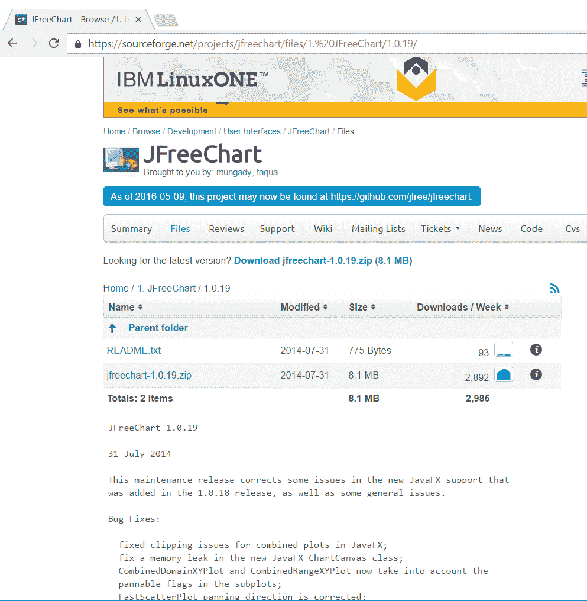

1.  下载 ZIP 文件后，将其解压。我们在 Windows 机器上的`C:\`下解压了 ZIP 文件，然后继续在解压的目标目录下找到`lib`目录。

1.  接着，我们找到了所需的两个库（JFreeChart...

# 工作原理...

在本例中，我们编写了`MyChart.scala`，并看到了在 IntelliJ 中执行程序的步骤。我们按照步骤中描述的路径在 Windows 和 Mac 上放置了代码。

在代码中，我们看到了创建`SparkSession`对象的典型方法以及如何使用`master()`函数。我们创建了一个 RDD，其元素为 1 到 15 范围内的随机整数数组，并将其与索引进行了压缩。

然后，我们使用 JFreeChart 制作了一个包含简单*x*和*y*轴的基本图表，并提供了我们从前几步中的原始 RDD 生成的数据集。

我们为图表设置了架构，并在 JFreeChart 中调用`show()`函数，以显示一个带有*x*和*y*轴的线性图形图表的框架。

最后，我们通过调用`spark.stop()`退出并释放资源。

# 还有更多...

更多关于 JFreeChart 的信息，请访问：

+   [`www.jfree.org/jfreechart/`](http://www.jfree.org/jfreechart/)

+   [`www.jfree.org/jfreechart/api/javadoc/index.html`](http://www.jfree.org/jfreechart/api/javadoc/index.html)

# 另请参见

关于 JFreeChart 功能和能力的更多示例，请访问以下网站：

[`www.jfree.org/jfreechart/samples.html`](http://www.jfree.org/jfreechart/samples.html)
