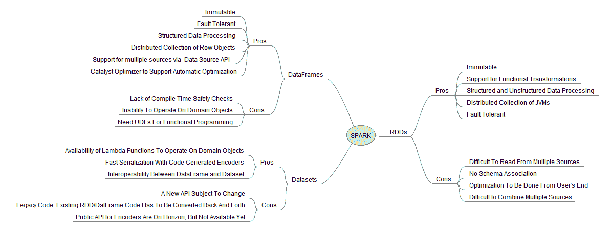
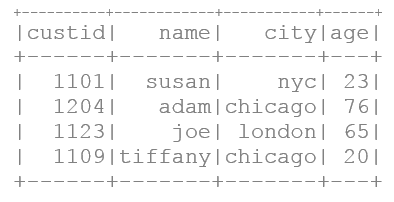
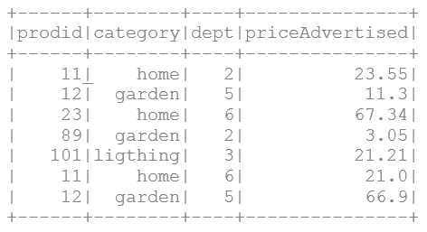
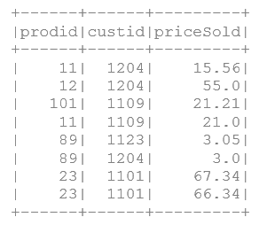
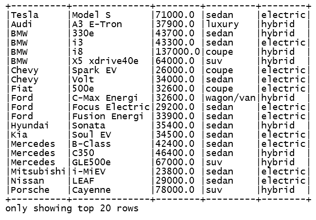
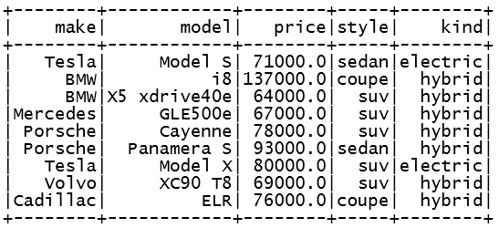
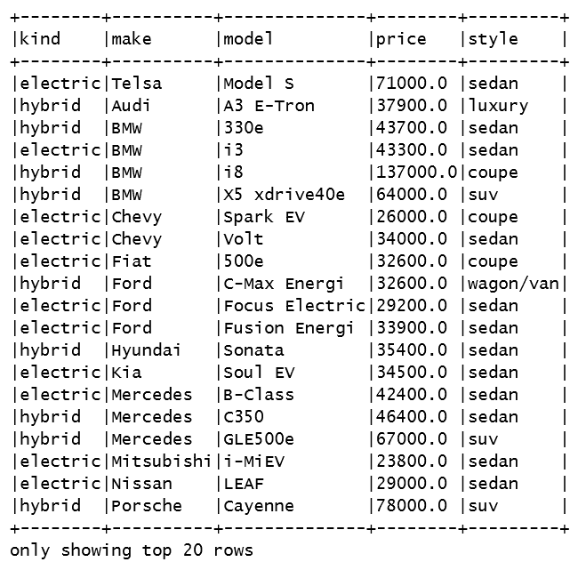
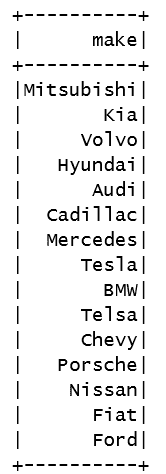
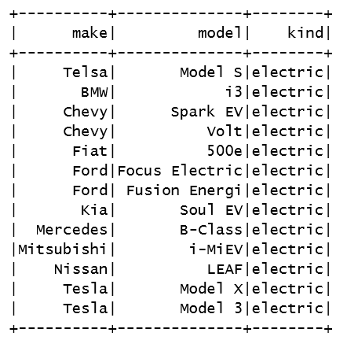

# 第十一章：Spark 的机器学习三剑客 - 完美结合

本章我们将涵盖以下内容：

+   使用 Spark 2.0 的内部数据源创建 RDD

+   使用 Spark 2.0 的外部数据源创建 RDD

+   使用 Spark 2.0 的 filter() API 转换 RDD

+   使用非常有用的 flatMap() API 转换 RDD

+   使用集合操作 API 转换 RDD

+   使用 groupBy() 和 reduceByKey() 进行 RDD 转换/聚合

+   使用 zip() API 转换 RDD

+   使用配对键值 RDD 进行连接转换

+   使用配对键值 RDD 进行归约和分组转换

+   从 Scala 数据结构创建 DataFrame

+   以编程方式操作 DataFrame 而不使用 SQL

+   从外部源加载 DataFrame 并进行设置...

# 引言

Spark 高效处理大规模数据的三驾马车是 RDD、DataFrames 和 Dataset API。虽然每个都有其独立的价值，但新的范式转变倾向于将 Dataset 作为统一的数据 API，以满足单一接口中的所有数据处理需求。

Spark 2.0 的新 Dataset API 是一种类型安全的领域对象集合，可以通过转换（类似于 RDD 的过滤、`map`、`flatMap()` 等）并行使用函数或关系操作。为了向后兼容，Dataset 有一个名为 **DataFrame** 的视图，它是一个无类型的行集合。在本章中，我们展示了所有三种 API 集。前面的图总结了 Spark 数据处理关键组件的优缺点：



机器学习的高级开发者必须理解并能够无障碍地使用所有三种 API 集，无论是为了算法增强还是遗留原因。虽然我们建议每位开发者都应向高级 Dataset API 迁移，但你仍需了解 RDD，以便针对 Spark 核心系统编程。例如，投资银行和对冲基金经常阅读机器学习、数学规划、金融、统计学或人工智能领域的领先期刊，然后使用低级 API 编码研究以获得竞争优势。

# RDDs - 一切的起点...

RDD API 是 Spark 开发者的重要工具，因为它在函数式编程范式中提供了对数据底层控制的偏好。RDD 的强大之处同时也使得新程序员更难以使用。虽然理解 RDD API 和手动优化技术（例如，在 `groupBy()` 操作之前使用 `filter()`）可能很容易，但编写高级代码需要持续的练习和熟练度。

当数据文件、块或数据结构转换为 RDD 时，数据被分解为称为 **分区**（类似于 Hadoop 中的拆分）的较小单元，并分布在节点之间，以便它们可以同时并行操作。Spark 直接提供了这种功能...

# 数据帧——通过高级 API 统一 API 和 SQL 的自然演进

Spark 开发者社区始终致力于从伯克利的 AMPlab 时代开始为社区提供易于使用的高级 API。数据 API 的下一个演进是在 Michael Armbrust 向社区提供 SparkSQL 和 Catalyst 优化器时实现的，这使得使用简单且易于理解的 SQL 接口进行数据虚拟化成为可能。数据帧 API 是利用 SparkSQL 的自然演进，通过将数据组织成关系表那样的命名列来实现。

数据帧 API 通过 SQL 使数据整理对众多熟悉 R（data.frame）或 Python/Pandas（pandas.DataFrame）中的数据帧的数据科学家和开发者可用。

# 数据集——一个高级的统一数据 API

数据集是一个不可变的对象集合，这些对象被建模/映射到传统的关系模式。有四个属性使其成为未来首选的方法。我们特别发现数据集 API 具有吸引力，因为它与 RDD 相似，具有常规的转换操作符（例如，`filter()`、`map()`、`flatMap()`等）。数据集将遵循与 RDD 类似的惰性执行范式。尝试调和数据帧和数据集的最佳方式是将数据帧视为可以被认为是`Dataset[Row]`的别名。

+   **强类型安全**：我们现在在统一的数据 API 中既有编译时（语法错误）也有运行时安全，这有助于 ML 开发者...

# 使用 Spark 2.0 通过内部数据源创建 RDD

在 Spark 中创建 RDD 有四种方式，从用于客户端驱动程序中简单测试和调试的`parallelize()`方法，到用于近实时响应的流式 RDD。在本节中，我们将提供多个示例，展示如何使用内部数据源创建 RDD。

# 如何操作...

1.  在 IntelliJ 或您选择的 IDE 中启动一个新项目。确保包含必要的 JAR 文件。

1.  设置程序将驻留的包位置：

```scala
package spark.ml.cookbook.chapter3
```

1.  导入必要的包：

```scala
import breeze.numerics.pow 
import org.apache.spark.sql.SparkSession 
import Array._
```

1.  导入用于设置`log4j`日志级别的包。此步骤是可选的，但我们强烈建议这样做（根据开发周期适当更改级别）。

```scala
import org.apache.log4j.Logger 
import org.apache.log4j.Level 
```

1.  将日志级别设置为警告和错误以减少输出。参见上一步骤了解包要求。

```scala
Logger.getLogger("org").setLevel(Level.ERROR) ...
```

# 工作原理...

客户端驱动程序中的数据通过分区 RDD 的数量（第二个参数）作为指导进行并行化和分布。生成的 RDD 是 Spark 的魔力，它开启了这一切（参阅 Matei Zaharia 的原始白皮书）。

生成的 RDD 现在是具有容错性和血统的完全分布式数据结构，可以使用 Spark 框架并行操作。

我们从[`www.gutenberg.org/`](http://www.gutenberg.org/)读取文本文件`查尔斯·狄更斯的《双城记》`到 Spark RDDs 中。然后我们继续分割和标记化数据，并使用 Spark 的操作符（例如，`map`，`flatMap()`等）打印出总单词数。

# 使用外部数据源创建 Spark 2.0 的 RDDs

在本配方中，我们为您提供了几个示例，以展示使用外部源创建 RDD。

# 如何操作...

1.  在 IntelliJ 或您选择的 IDE 中启动一个新项目。确保包含必要的 JAR 文件。

1.  设置程序将驻留的包位置：

```scala
package spark.ml.cookbook.chapter3 
```

1.  导入必要的包：

```scala
import breeze.numerics.pow 
import org.apache.spark.sql.SparkSession 
import Array._
```

1.  导入用于设置`log4j`日志级别的包。这一步是可选的，但我们强烈建议这样做（根据开发周期适当更改级别）。

```scala
import org.apache.log4j.Logger 
import org.apache.log4j.Level 
```

1.  将日志级别设置为警告和错误，以减少输出。请参阅上一步骤了解包要求。

```scala
Logger.getLogger("org").setLevel(Level.ERROR) 
Logger.getLogger("akka").setLevel(Level.ERROR) 
```

1.  设置 Spark 上下文和应用程序参数，以便 Spark 可以运行。

```scala
val spark = SparkSession 
  .builder 
  .master("local[*]") 
  .appName("myRDD") 
  .config("Spark.sql.warehouse.dir", ".") 
  .getOrCreate()
```

1.  我们从古腾堡项目获取数据。这是一个获取实际文本的绝佳来源，涵盖了从*莎士比亚*全集到*查尔斯·狄更斯*的作品。

1.  从以下来源下载文本并将其存储在本地目录中：

    +   来源：[`www.gutenberg.org`](http://www.gutenberg.org)

    +   选定书籍：*查尔斯·狄更斯的《双城记》*

    +   URL: [`www.gutenberg.org/cache/epub/98/pg98.txt`](http://www.gutenberg.org/cache/epub/98/pg98.txt)

1.  再次，我们使用`SparkContext`，通过`SparkSession`可用，并使用其`textFile()`函数读取外部数据源并在集群上并行化它。值得注意的是，所有工作都是由 Spark 在幕后为开发者完成的，只需一次调用即可加载多种格式（例如，文本、S3 和 HDFS），并使用`protocol:filepath`组合在集群上并行化数据。

1.  为了演示，我们加载了这本书，它以 ASCII 文本形式存储，使用`SparkContext`通过`SparkSession`的`textFile()`方法，后者在幕后工作，并在集群上创建分区 RDDs。

```scala
val book1 = spark.sparkContext.textFile("../data/sparkml2/chapter3/a.txt") 
```

输出将如下所示：

```scala
Number of lines = 16271
```

1.  尽管我们尚未涉及 Spark 转换操作符，我们将查看一小段代码，该代码使用空格作为分隔符将文件分解成单词。在实际情况下，需要一个正则表达式来处理所有边缘情况以及所有空白变化（请参考本章中的*使用 filter() API 的 Spark 中转换 RDDs*配方）。

    +   我们使用 lambda 函数接收每行读取的内容，并使用空格作为分隔符将其分解成单词。

    +   我们使用 flatMap 来分解单词列表的数组（即，每行的一组单词对应于该行的不同数组/列表）。简而言之，我们想要的是每行的单词列表，而不是单词列表的列表。

```scala
val book2 = book1.flatMap(l => l.split(" ")) 
println(book1.count())
```

输出将如下所示：

```scala
Number of words = 143228  
```

# 它是如何工作的...

我们从[`www.gutenberg.org/`](http://www.gutenberg.org/)读取查尔斯·狄更斯的《双城记》文本文件到一个 RDD 中，然后通过使用空格作为分隔符在 lambda 表达式中使用`.split()`和`.flatmap()`方法对 RDD 本身进行单词分词。然后，我们使用 RDD 的`.count()`方法输出单词总数。虽然这很简单，但您必须记住，该操作是在 Spark 的分布式并行框架中进行的，仅用了几行代码。

# 还有更多...

使用外部数据源创建 RDD，无论是文本文件、Hadoop HDFS、序列文件、Casandra 还是 Parquet 文件，都异常简单。再次，我们使用`SparkSession`（Spark 2.0 之前的`SparkContext`）来获取集群的句柄。一旦执行了函数（例如，textFile 协议：文件路径），数据就会被分解成更小的部分（分区），并自动流向集群，这些数据作为可以在并行操作中使用的容错分布式集合变得可用。

1.  在处理实际场景时，必须考虑多种变体。根据我们的经验，最好的建议是在编写自己的函数或连接器之前查阅文档。Spark 要么直接支持您的数据源，要么供应商有一个可下载的连接器来实现相同功能。

1.  我们经常遇到的另一种情况是，许多小文件（通常在`HDFS`目录中生成）需要并行化为 RDD 以供消费。`SparkContext`有一个名为`wholeTextFiles()`的方法，它允许您读取包含多个文件的目录，并将每个文件作为(文件名, 内容)键值对返回。我们发现这在使用 lambda 架构的多阶段机器学习场景中非常有用，其中模型参数作为批处理计算，然后每天在 Spark 中更新。

在此示例中，我们读取多个文件，然后打印第一个文件以供检查。

`spark.sparkContext.wholeTextFiles()`函数用于读取大量小文件，并将它们呈现为(K,V)，即键值对：

```scala
val dirKVrdd = spark.sparkContext.wholeTextFiles("../data/sparkml2/chapter3/*.txt") // place a large number of small files for demo 
println ("files in the directory as RDD ", dirKVrdd) 
println("total number of files ", dirKVrdd.count()) 
println("Keys ", dirKVrdd.keys.count()) 
println("Values ", dirKVrdd.values.count()) 
dirKVrdd.collect() 
println("Values ", dirKVrdd.first()) 
```

运行前面的代码后，您将得到以下输出：

```scala
    files in the directory as RDD ,../data/sparkml2/chapter3/*.txt
    WholeTextFileRDD[10] at wholeTextFiles at myRDD.scala:88)
    total number of files 2
    Keys ,2
    Values ,2
    Values ,(file:/C:/spark-2.0.0-bin-hadoop2.7/data/sparkml2/chapter3/a.txt,
    The Project Gutenberg EBook of A Tale of Two Cities, 
    by Charles Dickens

```

# 参见

Spark 文档中关于`textFile()`和`wholeTextFiles()`函数的说明：

[`spark.apache.org/docs/latest/api/scala/index.html#org.apache.spark.SparkContext`](http://spark.apache.org/docs/latest/api/scala/index.html#org.apache.spark.SparkContext)

`textFile()`API 是与外部数据源接口的单一抽象。协议/路径的制定足以调用正确的解码器。我们将演示从 ASCII 文本文件、Amazon AWS S3 和 HDFS 读取，用户可以利用这些代码片段来构建自己的系统。

+   路径可以表示为简单路径（例如，本地文本文件）到完整的 URI，包含所需协议（例如，s3n 用于 AWS 存储桶），直至具有服务器和端口配置的完整资源路径（例如，从 Hadoop 集群读取 HDFS 文件）。...

# 使用 Spark 2.0 的 filter() API 转换 RDD

在本食谱中，我们探讨了 RDD 的`filter()`方法，该方法用于选择基础 RDD 的子集并返回新的过滤 RDD。格式类似于`map()`，但 lambda 函数决定哪些成员应包含在结果 RDD 中。

# 如何操作...

1.  在 IntelliJ 或您选择的 IDE 中启动新项目。确保包含必要的 JAR 文件。

1.  设置程序将驻留的包位置：

```scala
package spark.ml.cookbook.chapter3
```

1.  导入必要的包：

```scala
import breeze.numerics.pow 
import org.apache.spark.sql.SparkSession 
import Array._
```

1.  导入用于设置`log4j`日志级别的包。此步骤可选，但我们强烈建议执行（根据开发周期调整级别）。

```scala
import org.apache.log4j.Logger 
import org.apache.log4j.Level 
```

1.  将日志级别设置为警告和错误，以减少输出。请参阅上一步骤了解包要求。

```scala
Logger.getLogger("org").setLevel(Level.ERROR) ...
```

# 工作原理...

`filter()` API 通过几个示例进行了演示。在第一个示例中，我们遍历了一个 RDD，并通过使用 lambda 表达式`.filter(i => (i%2) == 1)`输出了奇数，该表达式利用了模（取模）函数。

在第二个示例中，我们通过使用 lambda 表达式`num.map(pow(_,2)).filter(_ %2 == 1)`将结果映射到平方函数，使其变得更有趣。

在第三个示例中，我们遍历文本并使用 lambda 表达式`.filter(_.length < 30).filter(_.length > 0)`过滤掉短行（例如，长度小于 30 个字符的行），以打印短行与总行数的对比（`.count()`）作为输出。

# 还有更多...

`filter()` API 遍历并行分布式集合（即 RDD），并应用作为 lambda 提供给`filter()`的选择标准，以便将元素包含或排除在结果 RDD 中。结合使用`map()`（转换每个元素）和`filter()`（选择子集），在 Spark ML 编程中形成强大组合。

稍后我们将通过`DataFrame` API 看到，如何使用类似`Filter()` API 在 R 和 Python（pandas）中使用的高级框架实现相同效果。

# 另请参阅

+   `.filter()`方法的文档，作为 RDD 的方法调用，可访问[`spark.apache.org/docs/latest/api/scala/index.html#org.apache.spark.api.java.JavaRDD`](http://spark.apache.org/docs/2.0.0/api/scala/index.html#org.apache.spark.api.java.JavaRDD)。

+   关于`BloomFilter()`的文档——为了完整性，请注意已存在一个布隆过滤器函数，建议您避免自行编码。相关链接为[`spark.apache.org/docs/latest/api/scala/index.html#org.apache.spark.util.sketch.BloomFilter`](http://spark.apache.org/docs/latest/api/scala/index.html#org.apache.spark.util.sketch.BloomFilter)。

# 使用极其有用的 flatMap() API 转换 RDD

在本节中，我们探讨了常令初学者困惑的`flatMap()`方法；然而，通过深入分析，我们展示了它是一个清晰的概念，它像 map 一样将 lambda 函数应用于每个元素，然后将结果 RDD 扁平化为单一结构（不再是列表的列表，而是由所有子列表元素构成的单一列表）。

# 如何操作...

1.  在 IntelliJ 或您选择的 IDE 中启动一个新项目。确保包含了必要的 JAR 文件。

1.  设置程序将驻留的包位置

```scala
package spark.ml.cookbook.chapter3 
```

1.  导入必要的包

```scala
import breeze.numerics.pow 
import org.apache.spark.sql.SparkSession 
import Array._
```

1.  导入设置`log4j`日志级别的包。此步骤可选，但我们强烈建议执行（根据开发周期调整级别）。

```scala
import org.apache.log4j.Logger 
import org.apache.log4j.Level 
```

1.  将日志级别设置为警告和错误，以减少输出。请参阅上一步骤了解包需求。

```scala
Logger.getLogger("org").setLevel(Level.ERROR) 
Logger.getLogger("akka").setLevel(Level.ERROR) 
```

1.  设置 Spark 上下文和应用程序参数，以便 Spark 能够运行。

```scala
val spark = SparkSession 
  .builder 
  .master("local[*]") 
  .appName("myRDD") 
  .config("Spark.sql.warehouse.dir", ".") 
  .getOrCreate() 
```

1.  我们使用`textFile()`函数从之前下载的文本文件创建初始（即基础 RDD）：[`www.gutenberg.org/cache/epub/98/pg98.txt`](http://www.gutenberg.org/cache/epub/98/pg98.txt)。

```scala
val book1 = spark.sparkContext.textFile("../data/sparkml2/chapter3/a.txt")
```

1.  我们对 RDD 应用 map 函数以展示`map()`函数的转换。首先，我们错误地尝试仅使用`map()`根据正则表达式*[\s\W]+]*分离所有单词，以说明结果 RDD 是列表的列表，其中每个列表对应一行及其内的分词单词。此例展示了初学者在使用`flatMap()`时可能遇到的困惑。

1.  以下代码行修剪每行并将其分割成单词。结果 RDD（即 wordRDD2）将是单词列表的列表，而不是整个文件的单一单词列表。

```scala
val wordRDD2 = book1.map(_.trim.split("""[\s\W]+""") ).filter(_.length > 0) 
wordRDD2.take(3)foreach(println(_)) 
```

运行上述代码后，您将得到以下输出。

```scala
[Ljava.lang.String;@1e60b459
[Ljava.lang.String;@717d7587
[Ljava.lang.String;@3e906375
```

1.  我们使用`flatMap()`方法不仅进行映射，还扁平化列表的列表，最终得到由单词本身构成的 RDD。我们修剪并分割单词（即分词），然后筛选出长度大于零的单词，并将其映射为大写。

```scala
val wordRDD3 = book1.flatMap(_.trim.split("""[\s\W]+""") ).filter(_.length > 0).map(_.toUpperCase()) 
println("Total number of lines = ", book1.count()) 
println("Number of words = ", wordRDD3.count()) 
```

在此情况下，使用`flatMap()`扁平化列表后，我们能如预期般取回单词列表。

```scala
wordRDD3.take(5)foreach(println(_)) 
```

输出如下：

```scala
Total number of lines = 16271
Number of words = 141603
THE
PROJECT
GUTENBERG
EBOOK
OF  
```

# 它是如何工作的...

在这个简短的示例中，我们读取了一个文本文件，然后使用`flatMap(_.trim.split("""[\s\W]+""")` lambda 表达式对单词进行分割（即，令牌化），以获得一个包含令牌化内容的单一 RDD。此外，我们使用`filter()` API `filter(_.length > 0)`来排除空行，并在输出结果之前使用`.map()` API 中的 lambda 表达式`.map(_.toUpperCase())`映射为大写。

在某些情况下，我们不希望为基 RDD 的每个元素返回一个列表（例如，为对应于一行的单词获取一个列表）。有时我们更倾向于拥有一个单一的扁平列表，该列表对应于文档中的每个单词。简而言之，我们不想要一个列表的列表，而是想要一个包含...的单一列表。

# 还有更多...

`glom()`函数允许你将 RDD 中的每个分区建模为数组，而不是行列表。虽然在大多数情况下可以产生结果，但`glom()`允许你减少分区之间的数据移动。

尽管在表面上，文本中提到的第一种和第二种方法在计算 RDD 中的最小数时看起来相似，但`glom()`函数将通过首先对所有分区应用`min()`，然后发送结果数据，从而在网络上引起更少的数据移动。要看到差异的最佳方式是在 10M+ RDD 上使用此方法，并相应地观察 IO 和 CPU 使用情况。

+   第一种方法是在不使用`glom()`的情况下找到最小值：

```scala
val minValue1= numRDD.reduce(_ min _) 
println("minValue1 = ", minValue1)
```

运行上述代码后，你将得到以下输出：

```scala
minValue1 = 1.0
```

+   第二种方法是通过使用`glom()`来找到最小值，这会导致对一个分区进行本地应用的最小函数，然后通过 shuffle 发送结果。

```scala
val minValue2 = numRDD.glom().map(_.min).reduce(_ min _) 
println("minValue2 = ", minValue2) 
```

运行上述代码后，你将得到以下输出：

```scala
minValue1 = 1.0  
```

# 另请参见

+   `flatMap()`、`PairFlatMap()`及其他 RDD 下的变体的文档可在[`spark.apache.org/docs/latest/api/scala/index.html#org.apache.spark.api.java.JavaRDD`](http://spark.apache.org/docs/latest/api/scala/index.html#org.apache.spark.api.java.JavaRDD)找到。

+   RDD 下`FlatMap()`函数的文档可在[`spark.apache.org/docs/latest/api/scala/index.html#org.apache.spark.api.java.function.FlatMapFunction`](http://spark.apache.org/docs/2.0.0/api/scala/index.html#org.apache.spark.api.java.function.FlatMapFunction)找到。

+   `PairFlatMap()`函数的文档——针对成对数据元素的非常便捷的变体，可在[`spark.apache.org/docs/latest/api/scala/index.html#org.apache.spark.api.java.function.PairFlatMapFunction`](http://spark.apache.org/docs/2.0.0/api/scala/index.html#org.apache.spark.api.java.function.PairFlatMapFunction)找到。

+   `flatMap()`方法将提供的函数（lambda 表达式或通过 def 定义的命名函数）应用于每个元素，展平结构，并生成一个新的 RDD。

# 使用集合操作 API 转换 RDD

在本食谱中，我们探索了 RDD 上的集合操作，如`intersection()`、`union()`、`subtract()`、`distinct()`和`Cartesian()`。让我们以分布式方式实现常规集合操作。

# 如何操作...

1.  在 IntelliJ 或您选择的 IDE 中启动一个新项目。确保包含必要的 JAR 文件。

1.  设置程序将驻留的包位置

```scala
package spark.ml.cookbook.chapter3
```

1.  导入必要的包

```scala
import breeze.numerics.pow 
import org.apache.spark.sql.SparkSession 
import Array._
```

1.  导入用于设置`log4j`日志级别的包。此步骤是可选的，但我们强烈建议您（根据开发周期适当更改级别）。

```scala
import org.apache.log4j.Logger 
import org.apache.log4j.Level 
```

1.  将日志级别设置为警告和错误，以减少输出。请参阅上一步骤了解包要求。

```scala
Logger.getLogger("org").setLevel(Level.ERROR) ...
```

# 它是如何工作的...

在本例中，我们以三组数字数组（奇数、偶数及其组合）开始，然后将它们作为参数传递给集合操作 API。我们介绍了如何使用`intersection()`、`union()`、`subtract()`、`distinct()`和`cartesian()` RDD 操作符。

# 另请参见

虽然 RDD 集合操作符易于使用，但必须注意 Spark 在后台为完成某些操作（例如，交集）而必须进行的数据洗牌。

值得注意的是，union 操作符不会从结果 RDD 集合中删除重复项。

# RDD 转换/聚合与`groupBy()`和`reduceByKey()`

在本食谱中，我们探讨了`groupBy()`和`reduceBy()`方法，这些方法允许我们根据键对值进行分组。由于内部洗牌，这是一个昂贵的操作。我们首先更详细地演示`groupby()`，然后介绍`reduceBy()`，以展示编写这些代码时的相似性，同时强调`reduceBy()`操作符的优势。

# 如何操作...

1.  在 IntelliJ 或您选择的 IDE 中启动一个新项目。确保包含必要的 JAR 文件。

1.  设置程序将驻留的包位置：

```scala
package spark.ml.cookbook.chapter3 
```

1.  导入必要的包：

```scala
import breeze.numerics.pow 
import org.apache.spark.sql.SparkSession 
import Array._
```

1.  导入用于设置`log4j`日志级别的包。此步骤是可选的，但我们强烈建议您（根据开发周期适当更改级别）：

```scala
import org.apache.log4j.Logger 
import org.apache.log4j.Level 
```

1.  将日志级别设置为警告和错误，以减少输出。请参阅上一步骤了解包要求。

```scala
Logger.getLogger("org").setLevel(Level.ERROR) ...
```

# 它是如何工作的...

在本例中，我们创建了数字一到十二，并将它们放置在三个分区中。然后，我们继续使用简单的模运算将它们分解为奇数/偶数。`groupBy()`用于将它们聚合为两个奇数/偶数组。这是一个典型的聚合问题，对于 SQL 用户来说应该很熟悉。在本章后面，我们将使用`DataFrame`重新审视此操作，`DataFrame`也利用了 SparkSQL 引擎提供的更好的优化技术。在后面的部分，我们展示了`groupBy()`和`reduceByKey()`的相似性。我们设置了一个字母数组（即，`a`和`b`），然后将它们转换为 RDD。然后，我们根据键（即，唯一的字母 - 在本例中只有两个）进行聚合，并打印每个组的总数。

# 还有更多...

鉴于 Spark 的发展方向，它更倾向于 Dataset/DataFrame 范式而不是低级 RDD 编码，因此必须认真考虑在 RDD 上执行`groupBy()`的原因。虽然有些情况下确实需要此操作，但建议读者重新制定解决方案，以利用 SparkSQL 子系统和称为**Catalyst**的优化器。

Catalyst 优化器在构建优化查询计划时考虑了 Scala 的强大功能，如**模式匹配**和**准引用**。

+   有关 Scala 模式匹配的文档可在[`docs.scala-lang.org/tutorials/tour/pattern-matching.html`](http://docs.scala-lang.org/tutorials/tour/pattern-matching.html)找到

+   有关 Scala 准引用的文档可在[`docs.scala-lang.org/overviews/quasiquotes/intro.html`](http://docs.scala-lang.org/overviews/quasiquotes/intro.html)找到

# 另请参见

RDD 下的`groupBy()`和`reduceByKey()`操作文档：

[`spark.apache.org/docs/latest/api/scala/index.html#org.apache.spark.api.java.JavaRDD`](http://spark.apache.org/docs/latest/api/scala/index.html#org.apache.spark.api.java.JavaRDD)

# 使用 zip() API 转换 RDD

在本配方中，我们探讨了`zip()`函数。对于我们这些在 Python 或 Scala 中工作的人来说，`zip()`是一个熟悉的方法，它允许你在应用内联函数之前配对项目。使用 Spark，它可以用来促进成对 RDD 之间的算术运算。从概念上讲，它以这样的方式组合两个 RDD，即一个 RDD 的每个成员与第二个 RDD 中占据相同位置的成员配对（即，它对齐两个 RDD 并从成员中制作配对）。

# 如何操作...

1.  在 IntelliJ 或您选择的 IDE 中启动一个新项目。确保包含必要的 JAR 文件。

1.  设置程序将驻留的包位置

```scala
package spark.ml.cookbook.chapter3 
```

1.  导入必要的包

```scala
    import org.apache.spark.sql.SparkSession 
```

1.  导入用于设置`log4j`日志级别的包。此步骤是可选的，但我们强烈建议这样做（根据开发周期适当更改级别）。

```scala
import org.apache.log4j.Logger 
import org.apache.log4j.Level 
```

1.  将日志级别设置为警告和错误，以减少输出。请参阅上一步骤了解包要求。

```scala
Logger.getLogger("org").setLevel(Level.ERROR) 
Logger.getLogger("akka").setLevel(Level.ERROR) 
```

1.  设置 Spark 上下文和应用程序参数，以便 Spark 能够运行。

```scala
val spark = SparkSession 
.builder 
.master("local[*]") 
.appName("myRDD") 
.config("Spark.sql.warehouse.dir", ".") 
.getOrCreate() 
```

1.  设置示例的数据结构和 RDD。在本例中，我们创建了两个从`Array[]`生成的 RDD，并让 Spark 决定分区数量（即，`parallize()`方法中的第二个参数未设置）。

```scala
val SignalNoise: Array[Double] = Array(0.2,1.2,0.1,0.4,0.3,0.3,0.1,0.3,0.3,0.9,1.8,0.2,3.5,0.5,0.3,0.3,0.2,0.4,0.5,0.9,0.1) 
val SignalStrength: Array[Double] = Array(6.2,1.2,1.2,6.4,5.5,5.3,4.7,2.4,3.2,9.4,1.8,1.2,3.5,5.5,7.7,9.3,1.1,3.1,2.1,4.1,5.1) 
val parSN=spark.sparkContext.parallelize(SignalNoise) // parallelized signal noise RDD 
val parSS=spark.sparkContext.parallelize(SignalStrength)  // parallelized signal strength 
```

1.  我们对 RDD 应用`zip()`函数以演示转换。在示例中，我们取分区 RDD 的范围，并使用模函数将其标记为奇数/偶数。我们使用`zip()`函数将来自两个 RDD（SignalNoiseRDD 和 SignalStrengthRDD）的元素配对，以便我们可以应用`map()`函数并计算它们的比率（噪声与信号比率）。我们可以使用此技术执行几乎所有类型的算术或非算术操作，涉及两个 RDD 的单个成员。

1.  两个 RDD 成员的配对行为类似于元组或行。通过`zip()`创建的配对中的单个成员可以通过其位置访问（例如，`._1`和`._2`）

```scala
val zipRDD= parSN.zip(parSS).map(r => r._1 / r._2).collect() 
println("zipRDD=") 
zipRDD.foreach(println) 
```

运行前面的代码后，您将得到以下输出：

```scala
zipRDD=
0.03225806451612903
1.0
0.08333333333333334
0.0625
0.05454545454545454  
```

# 工作原理...

在本例中，我们首先设置两个数组，分别代表信号噪声和信号强度。它们只是一系列测量数字，我们可以从物联网平台接收这些数字。然后，我们将两个独立的数组配对，使得每个成员看起来像是原始输入的一对（x, y）。接着，我们通过以下代码片段将配对分割并计算噪声与信号的比率：

```scala
val zipRDD= parSN.zip(parSS).map(r => r._1 / r._2) 
```

`zip()`方法有许多涉及分区的变体。开发者应熟悉带有分区的`zip()`方法的变体（例如，`zipPartitions`）。

# 另请参阅

+   RDD 下的`zip()`和`zipPartitions()`操作的文档可在[`spark.apache.org/docs/latest/api/scala/index.html#org.apache.spark.api.java.JavaRDD`](http://spark.apache.org/docs/latest/api/scala/index.html#org.apache.spark.api.java.JavaRDD)找到。

# 使用配对键值 RDD 的连接转换

在本配方中，我们介绍了`KeyValueRDD`对 RDD 及其支持的连接操作，如`join()`、`leftOuterJoin`、`rightOuterJoin()`和`fullOuterJoin()`，作为通过集合操作 API 提供的更传统且更昂贵的集合操作（如`intersection()`、`union()`、`subtraction()`、`distinct()`、`cartesian()`等）的替代方案。

我们将演示`join()`、`leftOuterJoin`、`rightOuterJoin()`和`fullOuterJoin()`，以解释键值对 RDD 的强大功能和灵活性。

```scala
println("Full Joined RDD = ") 
val fullJoinedRDD = keyValueRDD.fullOuterJoin(keyValueCity2RDD) 
fullJoinedRDD.collect().foreach(println(_)) 
```

# 如何操作...

1.  设置示例的数据结构和 RDD：

```scala
val keyValuePairs = List(("north",1),("south",2),("east",3),("west",4)) 
val keyValueCity1 = List(("north","Madison"),("south","Miami"),("east","NYC"),("west","SanJose")) 
val keyValueCity2 = List(("north","Madison"),("west","SanJose"))
```

1.  将列表转换为 RDD：

```scala
val keyValueRDD = spark.sparkContext.parallelize(keyValuePairs) 
val keyValueCity1RDD = spark.sparkContext.parallelize(keyValueCity1) 
val keyValueCity2RDD = spark.sparkContext.parallelize(keyValueCity2) 
```

1.  我们可以访问配对 RDD 中的`键`和`值`。

```scala
val keys=keyValueRDD.keys 
val values=keyValueRDD.values 
```

1.  我们对配对 RDD 应用`mapValues()`函数来演示这一转换。在此示例中，我们使用 map 函数将值提升，为每个元素增加 100。这是一种向数据引入噪声（即抖动）的流行技术。

```scala
val kvMappedRDD = keyValueRDD.mapValues(_+100) 
kvMappedRDD.collect().foreach(println(_)) 
```

运行上述代码后，您将得到以下输出：

```scala
(north,101)
(south,102)
(east,103)
(west,104)

```

1.  我们对 RDD 应用`join()`函数来演示这一转换。我们使用`join()`来连接两个 RDD。我们基于键（即北、南等）连接两个 RDD。

```scala
println("Joined RDD = ") 
val joinedRDD = keyValueRDD.join(keyValueCity1RDD) 
joinedRDD.collect().foreach(println(_)) 
```

运行上述代码后，您将得到以下输出：

```scala
(south,(2,Miami))
(north,(1,Madison))
(west,(4,SanJose))
(east,(3,NYC))
```

1.  我们对 RDD 应用`leftOuterJoin()`函数来演示这一转换。`leftOuterjoin`的作用类似于关系左外连接。Spark 用`None`替换成员资格的缺失，而不是`NULL`，这在关系系统中很常见。

```scala
println("Left Joined RDD = ") 
val leftJoinedRDD = keyValueRDD.leftOuterJoin(keyValueCity2RDD) 
leftJoinedRDD.collect().foreach(println(_)) 
```

运行上述代码后，您将得到以下输出：

```scala
(south,(2,None))
(north,(1,Some(Madison)))
(west,(4,Some(SanJose)))
(east,(3,None))

```

1.  我们将对 RDD 应用`rightOuterJoin()`来演示这一转换。这与关系系统中的右外连接类似。

```scala
println("Right Joined RDD = ") 
val rightJoinedRDD = keyValueRDD.rightOuterJoin(keyValueCity2RDD) 
rightJoinedRDD.collect().foreach(println(_)) 
```

运行上述代码后，您将得到以下输出：

```scala
(north,(Some(1),Madison))
(west,(Some(4),SanJose))  
```

1.  然后，我们对 RDD 应用`fullOuterJoin()`函数来演示这一转换。这与关系系统中的全外连接类似。

```scala
val fullJoinedRDD = keyValueRDD.fullOuterJoin(keyValueCity2RDD) 
fullJoinedRDD.collect().foreach(println(_)) 
```

运行上述代码后，您将得到以下输出：

```scala
Full Joined RDD = 
(south,(Some(2),None))
(north,(Some(1),Some(Madison)))
(west,(Some(4),Some(SanJose)))
(east,(Some(3),None))
```

# 工作原理...

在本食谱中，我们声明了三个列表，代表关系表中可用的典型数据，这些数据可通过连接器导入 Casandra 或 RedShift（为简化本食谱，此处未展示）。我们使用了三个列表中的两个来表示城市名称（即数据表），并将它们与第一个列表连接，该列表代表方向（例如，定义表）。第一步是定义三个配对值的列表。然后我们将它们并行化为键值 RDD，以便我们可以在第一个 RDD（即方向）和其他两个代表城市名称的 RDD 之间执行连接操作。我们对 RDD 应用了 join 函数来演示这一转换。

我们演示了`join()`、`leftOuterJoin`和`rightOuterJoin()`...

# 还有更多...

RDD 下`join()`及其变体的文档可在[`spark.apache.org/docs/latest/api/scala/index.html#org.apache.spark.api.java.JavaRDD`](http://spark.apache.org/docs/latest/api/scala/index.html#org.apache.spark.api.java.JavaRDD)找到。

# 配对键值 RDD 的 reduce 和分组转换

在本食谱中，我们探讨了 reduce 和按 key 分组。`reduceByKey()`和`groupbyKey()`操作在大多数情况下比`reduce()`和`groupBy()`更高效且更受青睐。这些函数提供了便捷的设施，通过减少洗牌来聚合值并按 key 组合它们，这在大型数据集上是一个问题。

# 如何操作...

1.  在 IntelliJ 或您选择的 IDE 中启动一个新项目。确保包含了必要的 JAR 文件。

1.  设置程序将驻留的包位置

```scala
package spark.ml.cookbook.chapter3
```

1.  导入必要的包

```scala
import org.apache.spark.sql.SparkSession 
```

1.  导入用于设置`log4j`日志级别的包。此步骤可选，但我们强烈建议执行（根据开发周期调整级别）。

```scala
import org.apache.log4j.Logger 
import org.apache.log4j.Level 
```

1.  将日志级别设置为警告和错误以减少输出。请参阅前一步骤了解包要求：

```scala
Logger.getLogger("org").setLevel(Level.ERROR) 
Logger.getLogger("akka").setLevel(Level.ERROR)
```

1.  设置 Spark 上下文和应用程序参数，以便 Spark 能够运行。

```scala
val spark = SparkSession 
  .builder 
  .master("local[*]") 
  .appName("myRDD") 
  .config("Spark.sql.warehouse.dir", ".") 
  .getOrCreate() 
```

1.  设置示例所需的数据结构和 RDD：

```scala
val signaltypeRDD = spark.sparkContext.parallelize(List(("Buy",1000),("Sell",500),("Buy",600),("Sell",800))) 
```

1.  我们应用`groupByKey()`以演示转换。在此示例中，我们在分布式环境中将所有买卖信号分组在一起。

```scala
val signaltypeRDD = spark.sparkContext.parallelize(List(("Buy",1000),("Sell",500),("Buy",600),("Sell",800))) 
val groupedRDD = signaltypeRDD.groupByKey() 
groupedRDD.collect().foreach(println(_)) 
```

运行前面的代码，您将得到以下输出：

```scala
Group By Key RDD = 
(Sell, CompactBuffer(500, 800))
(Buy, CompactBuffer(1000, 600))
```

1.  我们对 RDD 对应用`reduceByKey()`函数以演示转换。在此示例中，该函数用于计算买卖信号的总成交量。Scala 符号`(_+_)`简单表示每次添加两个成员并从中产生单个结果。就像`reduce()`一样，我们可以应用任何函数（即简单函数的内联和更复杂情况下的命名函数）。

```scala
println("Reduce By Key RDD = ") 
val reducedRDD = signaltypeRDD.reduceByKey(_+_) 
reducedRDD.collect().foreach(println(_))   
```

运行前面的代码，您将得到以下输出：

```scala
Reduce By Key RDD = 
(Sell,1300)
(Buy,1600)  
```

# 它是如何工作的...

在此示例中，我们声明了一个商品买卖清单及其对应价格（即典型的商业交易）。然后，我们使用 Scala 简写符号`(_+_)`计算总和。最后一步，我们为每个键组（即`Buy`或`Sell`）提供了总计。键值 RDD 是一个强大的结构，可以在减少代码量的同时提供所需的聚合功能，将配对值分组到聚合桶中。`groupByKey()`和`reduceByKey()`函数模拟了相同的聚合功能，而`reduceByKey()`由于在组装最终结果时数据移动较少，因此更高效。

# 另请参阅

有关 RDD 下的`groupByKey()`和`reduceByKey()`操作的文档，请访问[`spark.apache.org/docs/latest/api/scala/index.html#org.apache.spark.api.java.JavaRDD`](http://spark.apache.org/docs/latest/api/scala/index.html#org.apache.spark.api.java.JavaRDD)。

# 从 Scala 数据结构创建 DataFrames

在本节中，我们探讨了`DataFrame` API，它为处理数据提供了比 RDD 更高的抽象层次。该 API 类似于 R 和 Python 数据帧工具（pandas）。

`DataFrame`简化了编码，并允许您使用标准 SQL 检索和操作数据。Spark 保留了关于 DataFrames 的额外信息，这有助于 API 轻松操作框架。每个`DataFrame`都将有一个模式（从数据推断或显式定义），允许我们像查看 SQL 表一样查看框架。SparkSQL 和 DataFrame 的秘诀在于催化优化器将在幕后工作，通过重新排列管道中的调用来优化访问。

# 如何操作...

1.  在 IntelliJ 或您选择的 IDE 中启动新项目。确保包含必要的 JAR 文件。

1.  设置程序所在包的位置：

```scala
package spark.ml.cookbook.chapter3 
```

1.  设置与 DataFrames 相关的导入以及所需的数据结构，并根据示例需要创建 RDD：

```scala
import org.apache.spark.sql._
```

1.  为`log4j`设置日志级别导入所需的包。此步骤可选，但我们强烈建议执行（根据开发周期调整级别）。

```scala
import org.apache.log4j.Logger 
import org.apache.log4j.Level 
```

1.  将日志级别设置为警告和错误，以减少输出。有关包要求的详细信息，请参阅前一步骤。

```scala
Logger.getLogger("org").setLevel(Level.ERROR) 
Logger.getLogger("akka").setLevel(Level.ERROR)
```

1.  设置 Spark 上下文和应用程序参数，以便 Spark 可以运行。

```scala
val spark = SparkSession 
  .builder 
  .master("local[*]") 
  .appName("myDataFrame") 
  .config("Spark.sql.warehouse.dir", ".") 
  .getOrCreate() 
```

1.  我们设置了两个`List()`对象和一个序列（即`Seq()`）的 Scala 数据结构。然后，我们将`List`结构转换为 RDD，以便转换为`DataFrames`进行后续步骤：

```scala
val signaltypeRDD = spark.sparkContext.parallelize(List(("Buy",1000),("Sell",500),("Buy",600),("Sell",800))) 
val numList = List(1,2,3,4,5,6,7,8,9) 
val numRDD = spark.sparkContext.parallelize(numList) 
val myseq = Seq( ("Sammy","North",113,46.0),("Sumi","South",110,41.0), ("Sunny","East",111,51.0),("Safron","West",113,2.0 )) 
```

1.  我们取一个列表，使用`parallelize()`方法将其转换为 RDD，并使用 RDD 的`toDF()`方法将其转换为 DataFrame。`show()`方法允许我们查看类似于 SQL 表的 DataFrame。

```scala
val numDF = numRDD.toDF("mylist") 
numDF.show 
```

运行上述代码后，您将获得以下输出：

```scala
+------+
|mylist|
+------+
|     1|
|     2|
|     3|
|     4|
|     5|
|     6|
|     7|
|     8|
|     9|
+------+
```

1.  在以下代码片段中，我们取一个通用的 Scala **Seq**（**序列**）数据结构，并使用`createDataFrame()`显式创建一个 DataFrame，同时命名列。

```scala
val df1 = spark.createDataFrame(myseq).toDF("Name","Region","dept","Hours") 
```

1.  在接下来的两个步骤中，我们使用`show()`方法查看内容，然后使用`printSchema()`方法显示基于类型的推断方案。在此示例中，DataFrame 正确识别了 Seq 中的整数和双精度数作为两个数字列的有效类型。

```scala
df1.show() 
df1.printSchema() 
```

运行上述代码后，您将获得以下输出：

```scala
+------+------+----+-----+
|  Name|Region|dept|Hours|
+------+------+----+-----+
| Sammy| North| 113| 46.0|
|  Sumi| South| 110| 41.0|
| Sunny|  East| 111| 51.0|
|Safron|  West| 113|  2.0|
+------+------+----+-----+

root
|-- Name: string (nullable = true)
|-- Region: string (nullable = true)
|-- dept: integer (nullable = false)
|-- Hours: double (nullable = false) 

```

# 工作原理...

在本示例中，我们取两个列表和一个 Seq 数据结构，将它们转换为 DataFrame，并使用`df1.show()`和`df1.printSchema()`显示表的内容和模式。

DataFrames 可以从内部和外部源创建。与 SQL 表类似，DataFrames 具有与之关联的模式，这些模式可以被推断或使用 Scala case 类或`map()`函数显式转换，同时摄取数据。

# 还有更多...

为确保完整性，我们包含了在 Spark 2.0.0 之前使用的`import`语句以运行代码（即，Spark 1.5.2）：

```scala
import org.apache.spark._
import org.apache.spark.rdd.RDD 
import org.apache.spark.sql.SQLContext 
import org.apache.spark.mllib.linalg 
import org.apache.spark.util 
import Array._
import org.apache.spark.sql._
import org.apache.spark.sql.types 
import org.apache.spark.sql.DataFrame 
import org.apache.spark.sql.Row; 
import org.apache.spark.sql.types.{ StructType, StructField, StringType}; 
```

# 另请参阅

DataFrame 文档可在此处找到：[`spark.apache.org/docs/latest/sql-programming-guide.html`](https://spark.apache.org/docs/latest/sql-programming-guide.html)。

如果遇到隐式转换问题，请确保已包含隐式导入语句。

示例代码适用于 Spark 2.0：

```scala
import sqlContext.implicits 
```

# 以编程方式操作 DataFrames，无需 SQL

在本教程中，我们探索如何仅通过代码和方法调用（不使用 SQL）来操作数据框。数据框拥有自己的方法，允许您使用编程方式执行类似 SQL 的操作。我们展示了一些命令，如`select()`、`show()`和`explain()`，以说明数据框本身能够不使用 SQL 进行数据整理和操作。

# 如何操作...

1.  在 IntelliJ 或您选择的 IDE 中启动一个新项目。确保包含必要的 JAR 文件。

1.  设置程序将驻留的包位置。

```scala
package spark.ml.cookbook.chapter3 
```

1.  设置与数据框相关的导入以及所需的数据结构，并根据示例需要创建 RDD。

```scala
import org.apache.spark.sql._
```

1.  导入设置`log4j`日志级别的包。此步骤可选，但我们强烈建议执行（根据开发周期调整级别）。

```scala
import org.apache.log4j.Logger 
import org.apache.log4j.Level 
```

1.  将日志级别设置为警告和错误，以减少输出。请参阅上一步骤了解包要求。

```scala
Logger.getLogger("org").setLevel(Level.ERROR) ...
```

# 工作原理...

在本例中，我们从文本文件加载数据到 RDD，然后使用`.toDF()`API 将其转换为数据框结构。接着，我们使用内置方法如`select()`、`filter()`、`show()`和`explain()`来模拟 SQL 查询，以编程方式探索数据（无需 SQL）。`explain()`命令显示查询计划，这对于消除瓶颈非常有用。

数据框提供了多种数据整理方法。

对于熟悉数据框 API 和 R 语言包（如[`cran.r-project.org`](https://cran.r-project.org)的 dplyr 或旧版本）的用户，我们提供了一个具有丰富方法集的编程 API，让您可以通过 API 进行所有数据整理。

对于更熟悉 SQL 的用户，您可以简单地使用 SQL 来检索和操作数据，就像使用 Squirrel 或 Toad 查询数据库一样。

# 还有更多...

为确保完整性，我们包含了在 Spark 2.0.0 之前运行代码（即 Spark 1.5.2）所需的`import`语句。

```scala
import org.apache.spark._  import org.apache.spark.rdd.RDD import org.apache.spark.sql.SQLContext import org.apache.spark.mllib.linalg._ import org.apache.spark.util._ import Array._ import org.apache.spark.sql._ import org.apache.spark.sql.types._ import org.apache.spark.sql.DataFrame import org.apache.spark.sql.Row; import org.apache.spark.sql.types.{ StructType, StructField, StringType};
```

# 另请参阅

数据框的文档可在[`spark.apache.org/docs/latest/sql-programming-guide.html`](https://spark.apache.org/docs/latest/sql-programming-guide.html)获取。

如果遇到隐式转换问题，请再次检查以确保您已包含隐式`import`语句。

Spark 2.0 的示例`import`语句：

```scala
import sqlContext.implicits._
```

# 从外部源加载数据框并进行设置

在本教程中，我们探讨使用 SQL 进行数据操作。Spark 提供实用且兼容 SQL 的接口，在生产环境中表现出色，我们不仅需要机器学习，还需要使用 SQL 访问现有数据源，以确保与现有 SQL 系统的兼容性和熟悉度。使用 SQL 的数据框在实际环境中实现集成是一个优雅的过程。

# 如何操作...

1.  在 IntelliJ 或您选择的 IDE 中启动一个新项目。确保包含必要的 JAR 文件。

1.  设置程序将驻留的包位置：

```scala
package spark.ml.cookbook.chapter3
```

1.  设置与 DataFrame 相关的导入和所需的数据结构，并根据示例需要创建 RDD：

```scala
import org.apache.spark.sql._
```

1.  导入设置`log4j`日志级别的包。此步骤是可选的，但我们强烈建议这样做（根据开发周期适当更改级别）。

```scala
import org.apache.log4j.Logger
import org.apache.log4j.Level
```

1.  将日志级别设置为警告和`Error`以减少输出。请参阅前面的步骤了解包要求：

```scala
Logger.getLogger("org").setLevel(Level.ERROR)
Logger.getLogger("akka").setLevel(Level.ERROR)
```

1.  设置 Spark 上下文和应用程序参数，以便 Spark 可以运行。

```scala
val spark = SparkSession
 .builder
 .master("local[*]")
 .appName("myDataFrame")
 .config("Spark.sql.warehouse.dir", ".")
 .getOrCreate()
```

1.  我们创建对应于`customer`文件的 DataFrame。在此步骤中，我们首先创建一个 RDD，然后使用`toDF()`将 RDD 转换为 DataFrame 并命名列。

```scala
val customersRDD = spark.sparkContext.textFile("../data/sparkml2/chapter3/customers13.txt") //Customer file 

val custRDD = customersRDD.map {
   line => val cols = line.trim.split(",")
     (cols(0).toInt, cols(1), cols(2), cols(3).toInt) 
} 
val custDF = custRDD.toDF("custid","name","city","age")   
```

客户数据内容参考：

```scala
custDF.show()
```

运行前面的代码，您将得到以下输出：



1.  我们创建对应于`product`文件的 DataFrame。在此步骤中，我们首先创建一个 RDD，然后使用`toDF()`将 RDD 转换为 DataFrame 并命名列。

```scala
val productsRDD = spark.sparkContext.textFile("../data/sparkml2/chapter3/products13.txt") //Product file
 val prodRDD = productsRDD.map {
     line => val cols = line.trim.split(",")
       (cols(0).toInt, cols(1), cols(2), cols(3).toDouble) 
}  
```

1.  我们将`prodRDD`转换为 DataFrame：

```scala
val prodDF = prodRDD.toDF("prodid","category","dept","priceAdvertised")
```

1.  使用 SQL select，我们显示表格内容。

产品数据内容：

```scala
prodDF.show()
```

运行前面的代码，您将得到以下输出：



1.  我们创建对应于`sales`文件的 DataFrame。在此步骤中，我们首先创建一个 RDD，然后使用`toDF()`将 RDD 转换为 DataFrame 并命名列。

```scala
val salesRDD = spark.sparkContext.textFile("../data/sparkml2/chapter3/sales13.txt") *//Sales file* val saleRDD = salesRDD.map {
     line => val cols = line.trim.split(",")
       (cols(0).toInt, cols(1).toInt, cols(2).toDouble)
}
```

1.  我们将`saleRDD`转换为 DataFrame：

```scala
val saleDF = saleRDD.toDF("prodid", "custid", "priceSold")  
```

1.  我们使用 SQL select 来显示表格。

销售数据内容：

```scala
saleDF.show()
```

运行前面的代码，您将得到以下输出：



1.  我们打印客户、产品和销售 DataFrame 的架构，以验证列定义和类型转换后的架构：

```scala
custDF.printSchema()
productDF.printSchema()
salesDF. printSchema()
```

运行前面的代码，您将得到以下输出：

```scala
root
 |-- custid: integer (nullable = false)
 |-- name: string (nullable = true)
 |-- city: string (nullable = true)
 |-- age: integer (nullable = false)
root
 |-- prodid: integer (nullable = false)
 |-- category: string (nullable = true)
 |-- dept: string (nullable = true)
 |-- priceAdvertised: double (nullable = false)
root
 |-- prodid: integer (nullable = false)
 |-- custid: integer (nullable = false)
 |-- priceSold: double (nullable = false)
```

# 它是如何工作的...

在此示例中，我们首先将数据加载到 RDD 中，然后使用`toDF()`方法将其转换为 DataFrame。DataFrame 非常擅长推断类型，但有时需要手动干预。我们在创建 RDD 后使用`map()`函数（应用惰性初始化范式）来处理数据，无论是通过类型转换还是调用更复杂的用户定义函数（在`map()`方法中引用）来进行转换或数据整理。最后，我们继续使用`show()`和`printSchema()`检查三个 DataFrame 的架构。

# 还有更多...

为了确保完整性，我们包含了在 Spark 2.0.0 之前用于运行代码的`import`语句（即，Spark 1.5.2）：

```scala
import org.apache.spark._
 import org.apache.spark.rdd.RDD
 import org.apache.spark.sql.SQLContext
 import org.apache.spark.mllib.linalg._
 import org.apache.spark.util._
 import Array._
 import org.apache.spark.sql._
 import org.apache.spark.sql.types._
 import org.apache.spark.sql.DataFrame
 import org.apache.spark.sql.Row;
 import org.apache.spark.sql.types.{ StructType, StructField, StringType};
```

# 另请参阅

DataFrame 的文档可在[`spark.apache.org/docs/latest/sql-programming-guide.html`](https://spark.apache.org/docs/latest/sql-programming-guide.html)找到。

如果遇到隐式转换问题，请再次检查以确保您已包含 implicits `import`语句。

Spark 1.5.2 的示例`import`语句：

```scala
 import sqlContext.implicits._
```

# 使用标准 SQL 语言与 DataFrames - SparkSQL

在本食谱中，我们展示了如何使用 DataFrame 的 SQL 功能执行基本的 CRUD 操作，但没有任何限制您使用 Spark 提供的 SQL 接口达到所需的任何复杂程度（即 DML）。

# 如何操作...

1.  在 IntelliJ 或您选择的 IDE 中启动新项目。确保包含必要的 JAR 文件。

1.  设置程序将驻留的包位置

```scala
package spark.ml.cookbook.chapter3
```

1.  设置与 DataFrames 相关的导入以及所需的数据结构，并根据示例需要创建 RDDs

```scala
import org.apache.spark.sql._
```

1.  导入用于设置`log4j`日志级别的包。此步骤是可选的，但我们强烈建议您根据开发周期的不同阶段适当调整级别。

```scala
import org.apache.log4j.Logger import org.apache.log4j.Level
```

1.  将日志级别设置为警告和`ERROR`以减少输出。请参阅上一步骤了解包要求。

```scala
Logger.getLogger( ...
```

# 工作原理...

使用 SQL 的基本 DataFrame 工作流程是首先通过内部 Scala 数据结构或外部数据源填充 DataFrame，然后使用`createOrReplaceTempView()`调用将 DataFrame 注册为类似 SQL 的工件。

使用 DataFrames 时，您可以利用 Spark 存储的额外元数据（无论是 API 还是 SQL 方法），这可以在编码和执行期间为您带来好处。

虽然 RDD 仍然是核心 Spark 的主力，但趋势是向 DataFrame 方法发展，该方法已成功展示了其在 Python/Pandas 或 R 等语言中的能力。

# 还有更多...

将 DataFrame 注册为表的方式已发生变化。请参考此内容：

+   对于 Spark 2.0.0 之前的版本：`registerTempTable()`

+   对于 Spark 2.0.0 及更早版本：`createOrReplaceTempView()`

在 Spark 2.0.0 之前，将 DataFrame 注册为类似 SQL 表的工件：

在我们能够使用 DataFrame 通过 SQL 进行查询之前，我们必须将 DataFrame 注册为临时表，以便 SQL 语句可以引用它而无需任何 Scala/Spark 语法。这一步骤可能会让许多初学者感到困惑，因为我们并没有创建任何表（临时或永久），但调用`registerTempTable()`在 SQL 领域创建了一个名称，SQL 语句可以引用它而无需额外的 UDF 或无需任何特定领域的查询语言。

+   注册...

# 另请参阅

数据框（DataFrame）的文档可在[此处](https://spark.apache.org/docs/latest/sql-programming-guide.html)获取。

如果遇到隐式转换问题，请再次检查以确保您已包含 implicits `import`语句。

Spark 1.5.2 的示例`import`语句

```scala
 import sqlContext.implicits._
```

DataFrame 是一个广泛的子系统，值得用一整本书来介绍。它使 SQL 程序员能够大规模地进行复杂的数据操作。

# 使用 Scala 序列与数据集 API 协同工作

在本示例中，我们探讨了新的数据集以及它如何与 Scala 数据结构*seq*协同工作。我们经常看到 LabelPoint 数据结构与 ML 库一起使用，以及与数据集配合良好的 Scala 序列（即 seq 数据结构）之间的关系。

数据集正被定位为未来统一的 API。值得注意的是，DataFrame 仍然可用，作为`Dataset[Row]`的别名。我们已经通过 DataFrame 的示例广泛地介绍了 SQL 示例，因此我们将重点放在数据集的其他变体上。

# 如何操作...

1.  在 IntelliJ 或您选择的 IDE 中启动一个新项目。确保包含必要的 JAR 文件。

1.  设置程序将驻留的包位置

```scala
package spark.ml.cookbook.chapter3
```

1.  导入必要的包以获取 Spark 会话访问集群，并导入`Log4j.Logger`以减少 Spark 产生的输出量。

```scala
import org.apache.log4j.{Level, Logger}
import org.apache.spark.sql.SparkSession
```

1.  定义一个 Scala `case class`来建模处理数据，`Car`类将代表电动和混合动力汽车。

```scala
case class Car(make: String, model: String, price: Double,
style: String, kind: String)
```

1.  让我们创建一个 Scala 序列，并用电动和混合动力汽车填充它。

```scala
val *carData* =
*Seq*(
*Car*("Tesla", "Model S", 71000.0, "sedan","electric"),
*Car*("Audi", "A3 E-Tron", 37900.0, "luxury","hybrid"),
*Car*("BMW", "330e", 43700.0, "sedan","hybrid"),
*Car*("BMW", "i3", 43300.0, "sedan","electric"),
*Car*("BMW", "i8", 137000.0, "coupe","hybrid"),
*Car*("BMW", "X5 xdrive40e", 64000.0, "suv","hybrid"),
*Car*("Chevy", "Spark EV", 26000.0, "coupe","electric"),
*Car*("Chevy", "Volt", 34000.0, "sedan","electric"),
*Car*("Fiat", "500e", 32600.0, "coupe","electric"),
*Car*("Ford", "C-Max Energi", 32600.0, "wagon/van","hybrid"),
*Car*("Ford", "Focus Electric", 29200.0, "sedan","electric"),
*Car*("Ford", "Fusion Energi", 33900.0, "sedan","electric"),
*Car*("Hyundai", "Sonata", 35400.0, "sedan","hybrid"),
*Car*("Kia", "Soul EV", 34500.0, "sedan","electric"),
*Car*("Mercedes", "B-Class", 42400.0, "sedan","electric"),
*Car*("Mercedes", "C350", 46400.0, "sedan","hybrid"),
*Car*("Mercedes", "GLE500e", 67000.0, "suv","hybrid"),
*Car*("Mitsubishi", "i-MiEV", 23800.0, "sedan","electric"),
*Car*("Nissan", "LEAF", 29000.0, "sedan","electric"),
*Car*("Porsche", "Cayenne", 78000.0, "suv","hybrid"),
*Car*("Porsche", "Panamera S", 93000.0, "sedan","hybrid"),
*Car*("Tesla", "Model X", 80000.0, "suv","electric"),
*Car*("Tesla", "Model 3", 35000.0, "sedan","electric"),
*Car*("Volvo", "XC90 T8", 69000.0, "suv","hybrid"),
*Car*("Cadillac", "ELR", 76000.0, "coupe","hybrid")
)

```

1.  将输出级别配置为`ERROR`以减少 Spark 的日志输出。

```scala
   Logger.getLogger("org").setLevel(Level.ERROR)
   Logger.getLogger("akka").setLevel(Level.ERROR)
```

1.  创建一个 SparkSession，以访问 Spark 集群，包括底层会话对象属性和功能。

```scala
val spark = SparkSession
.builder
.master("local[*]")
.appName("mydatasetseq")
.config("Spark.sql.warehouse.dir", ".")
.getOrCreate()

```

1.  导入 Spark 隐式，从而仅通过导入添加行为。

```scala
import spark.implicits._
```

1.  接下来，我们将利用 Spark 会话的`createDataset()`方法从汽车数据序列创建一个数据集。

```scala
val cars = spark.createDataset(MyDatasetData.carData) 
// carData is put in a separate scala object MyDatasetData
```

1.  让我们打印出结果，以确认我们的方法调用通过调用 show 方法将序列转换为 Spark 数据集。

```scala
infecars.show(false)
+----------+--------------+--------+---------+--------+
|make |model |price |style |kind |
```



1.  打印出数据集的隐含列名。我们现在可以使用类属性名称作为列名。

```scala
cars.columns.foreach(println)
make
model
price
style
kind
```

1.  让我们展示自动生成的模式，并验证推断的数据类型。

```scala
println(cars.schema)
StructType(StructField(make,StringType,true), StructField(model,StringType,true), StructField(price,DoubleType,false), StructField(style,StringType,true), StructField(kind,StringType,true))
```

1.  最后，我们将根据价格对数据集进行过滤，参考`Car`类属性价格作为列，并展示结果。

```scala
cars.filter(cars("price") > 50000.00).show()
```



1.  我们通过停止 Spark 会话来关闭程序。

```scala
spark.stop()
```

# 工作原理...

在本示例中，我们介绍了 Spark 的数据集功能，该功能首次出现在 Spark 1.6 中，并在后续版本中得到进一步完善。首先，我们借助 Spark 会话的`createDataset()`方法从 Scala 序列创建了一个数据集实例。接下来，我们打印出有关生成数据集的元信息，以确认创建过程如预期进行。最后，我们使用 Spark SQL 片段根据价格列过滤数据集，筛选出价格大于$50,000.00 的记录，并展示最终执行结果。

# 还有更多...

数据集有一个名为[DataFrame](https://spark.apache.org/docs/2.0.0/api/scala/org/apache/spark/sql/package.html#DataFrame=org.apache.spark.sql.Dataset%5Borg.apache.spark.sql.Row%5D)的视图，它是[行](https://spark.apache.org/docs/2.0.0/api/scala/org/apache/spark/sql/Row.html)的未类型化数据集。数据集仍然保留了 RDD 的所有转换能力，如`filter()`、`map()`、`flatMap()`等。这就是为什么如果我们使用 RDD 编程 Spark，我们会发现数据集易于使用的原因之一。

# 另请参阅

+   数据集文档可在[此处](http://spark.apache.org/docs/latest/api/scala/index.html#org.apache.spark.sql.Dataset)找到。

+   KeyValue 分组数据集文档可在[此处](http://spark.apache.org/docs/latest/api/scala/index.html#org.apache.spark.sql.KeyValueGroupedDataset)找到。

+   关系分组数据集文档可在[此处](http://spark.apache.org/docs/latest/api/scala/index.html#org.apache.spark.sql.RelationalGroupedDataset)找到。

# 从 RDD 创建和使用数据集，以及反向操作

在本食谱中，我们探讨了如何使用 RDD 与 Dataset 交互，以构建多阶段机器学习管道。尽管 Dataset（概念上被认为是具有强类型安全的 RDD）是未来的方向，但您仍然需要能够与其他机器学习算法或返回/操作 RDD 的代码进行交互，无论是出于遗留还是编码原因。在本食谱中，我们还探讨了如何创建和从 Dataset 转换为 RDD 以及反向操作。

# 如何操作...

1.  在 IntelliJ 或您选择的 IDE 中启动一个新项目。确保包含必要的 JAR 文件。

1.  设置程序将驻留的包位置：

```scala
package spark.ml.cookbook.chapter3
```

1.  为 Spark 会话导入必要的包以访问集群，并使用`Log4j.Logger`来减少 Spark 产生的输出量。

```scala
import org.apache.log4j.{Level, Logger}import org.apache.spark.sql.SparkSession
```

1.  定义一个 Scala 样例类来模拟处理数据。

```scala
case class Car(make: String, model: String, price: Double,style: String, kind: String)
```

1.  让我们创建一个 Scala 序列，并用电动和混合动力汽车填充它。

```scala
val carData =Seq(Car("Tesla", "Model S", 71000.0, "sedan","electric"), ...
```

# 工作原理...

在本节中，我们将 RDD 转换为 Dataset，最终又转换回 RDD。我们从一个 Scala 序列开始，将其转换为 RDD。创建 RDD 后，调用 Spark 会话的`createDataset()`方法，将 RDD 作为参数传递，并接收作为结果的 Dataset。

接下来，数据集按制造商列分组，统计各种汽车制造商的存在情况。下一步涉及对特斯拉制造商的数据集进行过滤，并将结果转换回 RDD。最后，我们通过 RDD 的`foreach()`方法显示了最终的 RDD。

# 还有更多...

Spark 中的数据集源文件仅包含约 2500+行 Scala 代码。这是一段非常优秀的代码，可以在 Apache 许可证下进行专业化利用。我们列出了以下 URL，并鼓励您至少浏览该文件，了解在使用数据集时缓冲是如何发挥作用的。

数据集的源代码托管在 GitHub 上，地址为[`github.com/apache/spark/blob/master/sql/core/src/main/scala/org/apache/spark/sql/Dataset.scala`](https://github.com/apache/spark/blob/master/sql/core/src/main/scala/org/apache/spark/sql/Dataset.scala)。

# 参见

+   数据集的文档可以在[`spark.apache.org/docs/latest/api/scala/index.html#org.apache.spark.sql.Dataset`](http://spark.apache.org/docs/latest/api/scala/index.html#org.apache.spark.sql.Dataset)找到

+   键值分组的数据集可以在[`spark.apache.org/docs/latest/api/scala/index.html#org.apache.spark.sql.KeyValueGroupedDataset`](http://spark.apache.org/docs/latest/api/scala/index.html#org.apache.spark.sql.KeyValueGroupedDataset)找到

+   关系分组的数据集可以在[`spark.apache.org/docs/latest/api/scala/index.html#org.apache.spark.sql.RelationalGroupedDataset`](http://spark.apache.org/docs/latest/api/scala/index.html#org.apache.spark.sql.RelationalGroupedDataset)找到

# 结合使用数据集 API 和 SQL 处理 JSON

在本节中，我们探讨如何使用 JSON 与数据集。在过去的 5 年中，JSON 格式迅速成为数据互操作性的实际标准。

我们探讨数据集如何使用 JSON 并执行 API 命令，如`select()`。然后，我们通过创建一个视图（即`createOrReplaceTempView()`）并执行 SQL 查询来演示如何使用 API 和 SQL 轻松查询 JSON 文件。

# 如何操作...

1.  在 IntelliJ 或您选择的 IDE 中启动一个新项目。确保包含必要的 JAR 文件。

1.  我们将使用一个名为`cars.json`的 JSON 数据文件，该文件是为这个示例创建的：

```scala
{"make": "Telsa", "model": "Model S", "price": 71000.00, "style": "sedan", "kind": "electric"}
{"make": "Audi", "model": "A3 E-Tron", "price": 37900.00, "style": "luxury", "kind": "hybrid"}
{"make": "BMW", "model": "330e", "price": 43700.00, "style": "sedan", "kind": "hybrid"}
```

1.  设置程序将驻留的包位置

```scala
package spark.ml.cookbook.chapter3
```

1.  为 Spark 会话导入必要的包以访问集群，并使用`Log4j.Logger`来减少 Spark 产生的输出量。

```scala
import org.apache.log4j.{Level, Logger}
import org.apache.spark.sql.SparkSession
```

1.  定义一个 Scala`case class`来建模处理数据。

```scala
case class Car(make: String, model: String, price: Double,
style: String, kind: String)
```

1.  将输出级别设置为`ERROR`，以减少 Spark 的日志输出。

```scala
Logger.getLogger("org").setLevel(Level.ERROR)
Logger.getLogger("akka").setLevel(Level.ERROR)
```

1.  初始化一个 Spark 会话，创建访问 Spark 集群的入口点。

```scala
val spark = SparkSession
.builder
.master("local[*]")
.appName("mydatasmydatasetjsonetrdd")
.config("Spark.sql.warehouse.dir", ".")
.getOrCreate()
```

1.  导入 Spark 隐式，从而仅通过导入添加行为。

```scala
import spark.implicits._
```

1.  现在，我们将 JSON 数据文件加载到内存中，并指定类类型为`Car`。

```scala
val cars = spark.read.json("../data/sparkml2/chapter3/cars.json").as[Car]
```

1.  让我们打印出我们生成的`Car`类型数据集中的数据。

```scala
cars.show(false)
```



1.  接下来，我们将显示数据集的列名，以验证汽车的 JSON 属性名称是否已正确处理。

```scala
cars.columns.foreach(println)
make
model
price
style
kind
```

1.  让我们查看自动生成的模式并验证推断的数据类型。

```scala
println(cars.schema)
StructType(StructField(make,StringType,true), StructField(model,StringType,true), StructField(price,DoubleType,false), StructField(style,StringType,true), StructField(kind,StringType,true))
```

1.  在这一步中，我们将选择数据集的`make`列，通过应用`distinct`方法去除重复项，并展示结果。

```scala
cars.select("make").distinct().show()
```



1.  接下来，在 cars 数据集上创建一个视图，以便我们可以对数据集执行一个字面上的 Spark SQL 查询字符串。

```scala
cars.createOrReplaceTempView("cars")
```

1.  最后，我们执行一个 Spark SQL 查询，筛选数据集中的电动汽车，并仅返回定义的三个列。

```scala
spark.sql("select make, model, kind from cars where kind = 'electric'").show()
```



1.  我们通过停止 Spark 会话来结束程序。

```scala
spark.stop() 
```

# 工作原理...

使用 Spark 读取**JavaScript 对象表示法**(**JSON**)数据文件并将其转换为数据集非常简单。JSON 在过去几年中已成为广泛使用的数据格式，Spark 对这种格式的支持非常充分。

在第一部分中，我们展示了通过 Spark 会话内置的 JSON 解析功能将 JSON 加载到数据集的方法。您应该注意 Spark 的内置功能，它将 JSON 数据转换为 car 案例类。

在第二部分中，我们展示了如何将 Spark SQL 应用于数据集，以将所述数据整理成理想状态。我们利用数据集的 select 方法检索`make`列，并应用`distinct`方法去除...

# 还有更多...

要全面理解和掌握数据集 API，务必理解`Row`和`Encoder`的概念。

数据集遵循*惰性执行*范式，意味着执行仅在 Spark 中调用操作时发生。当我们执行一个操作时，Catalyst 查询优化器生成一个逻辑计划，并为并行分布式环境中的优化执行生成物理计划。请参阅引言中的图表了解所有详细步骤。

`Row`的文档可在[`spark.apache.org/docs/latest/api/scala/index.html#org.apache.spark.sql.Dataset`](http://spark.apache.org/docs/latest/api/scala/index.html#org.apache.spark.sql.Dataset)找到。

`Encoder`的文档可在[`spark.apache.org/docs/latest/api/scala/index.html#org.apache.spark.sql.Encoder`](http://spark.apache.org/docs/latest/api/scala/index.html#org.apache.spark.sql.Encoder)找到。

# 参见

+   数据集的文档可在[`spark.apache.org/docs/latest/api/scala/index.html#org.apache.spark.sql.Dataset`](http://spark.apache.org/docs/latest/api/scala/index.html#org.apache.spark.sql.Dataset)找到。

+   KeyValue 分组数据集的文档可在[`spark.apache.org/docs/latest/api/scala/index.html#org.apache.spark.sql.KeyValueGroupedDataset`](http://spark.apache.org/docs/latest/api/scala/index.html#org.apache.spark.sql.KeyValueGroupedDataset)找到。

+   关系分组数据集的文档可在[`spark.apache.org/docs/latest/api/scala/index.html#org.apache.spark.sql.RelationalGroupedDataset`](http://spark.apache.org/docs/latest/api/scala/index.html#org.apache.spark.sql.RelationalGroupedDataset)找到。

再次确保下载并探索来自 GitHub 的 Dataset 源文件，该文件约有 2500+行。探索 Spark 源代码是学习 Scala、Scala 注解以及 Spark 2.0 本身高级编程的最佳方式。

对于 Spark 2.0 之前的用户值得注意：

+   SparkSession 是单一入口...

# 使用 Dataset API 进行领域对象的函数式编程

在本教程中，我们探讨了如何使用 Dataset 进行函数式编程。我们利用 Dataset 和函数式编程将汽车（领域对象）按其车型进行分类。

# 如何操作...

1.  在 IntelliJ 或您选择的 IDE 中启动一个新项目。确保包含必要的 JAR 文件。

1.  使用包指令提供正确的路径

```scala
package spark.ml.cookbook.chapter3
```

1.  导入必要的包以获取 Spark 上下文对集群的访问权限，并使用`Log4j.Logger`减少 Spark 产生的输出量。

```scala
import org.apache.log4j.{Level, Logger}import org.apache.spark.sql.{Dataset, SparkSession}import spark.ml.cookbook.{Car, mydatasetdata}import scala.collection.mutableimport scala.collection.mutable.ListBufferimport org.apache.log4j.{Level, Logger}import org.apache.spark.sql.SparkSession
```

1.  定义一个 Scala 案例类来包含我们处理的数据，我们的汽车类将代表电动和...

# 工作原理...

在此示例中，我们使用 Scala 序列数据结构来存储原始数据，即一系列汽车及其属性。通过调用`createDataset()`，我们创建了一个 DataSet 并填充了它。接着，我们使用'make'属性配合`groupBy`和`mapGroups()`，以函数式范式列出按车型分类的汽车。在 DataSet 出现之前，使用领域对象进行这种形式的函数式编程并非不可能（例如，使用 RDD 的案例类或 DataFrame 的 UDF），但 DataSet 结构使得这一过程变得简单且自然。

# 还有更多...

确保在所有 DataSet 编码中包含`implicits`声明：

```scala
import spark.implicits._
```

# 参见

Dataset 的文档可在[`spark.apache.org/docs/latest/api/scala/index.html#org.apache.spark.sql.Dataset`](http://spark.apache.org/docs/latest/api/scala/index.html#org.apache.spark.sql.Dataset)访问。
