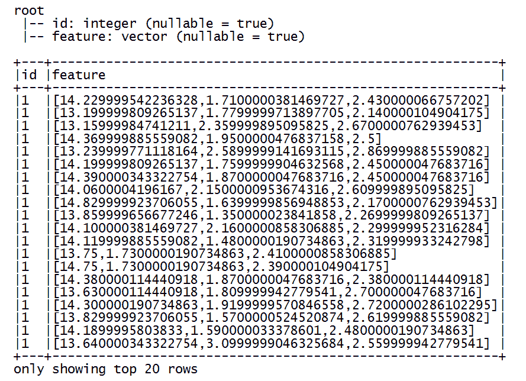
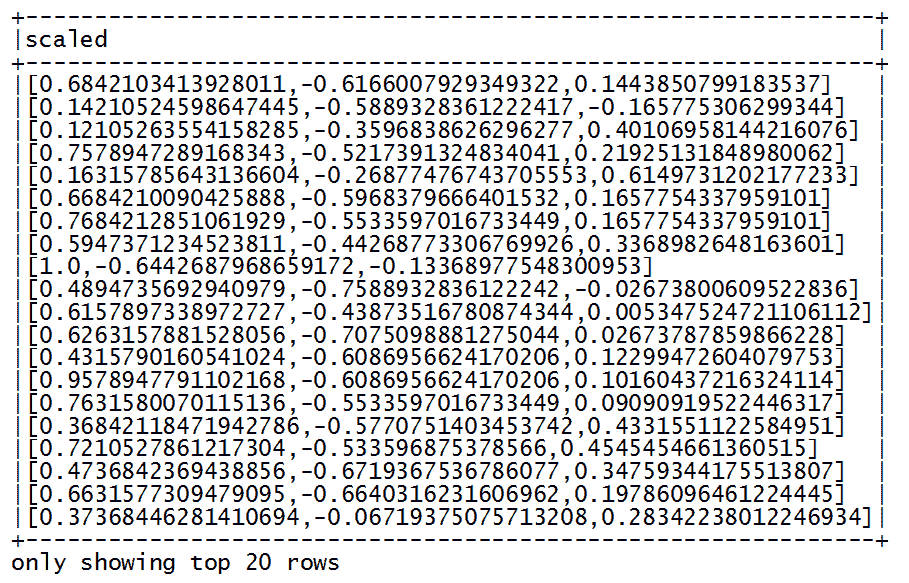
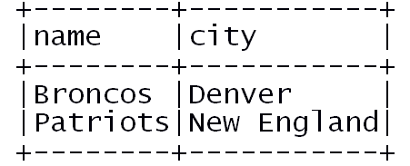
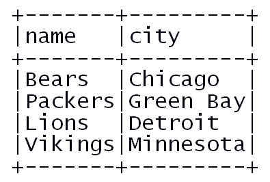
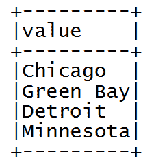
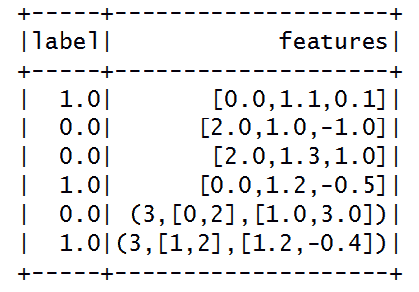
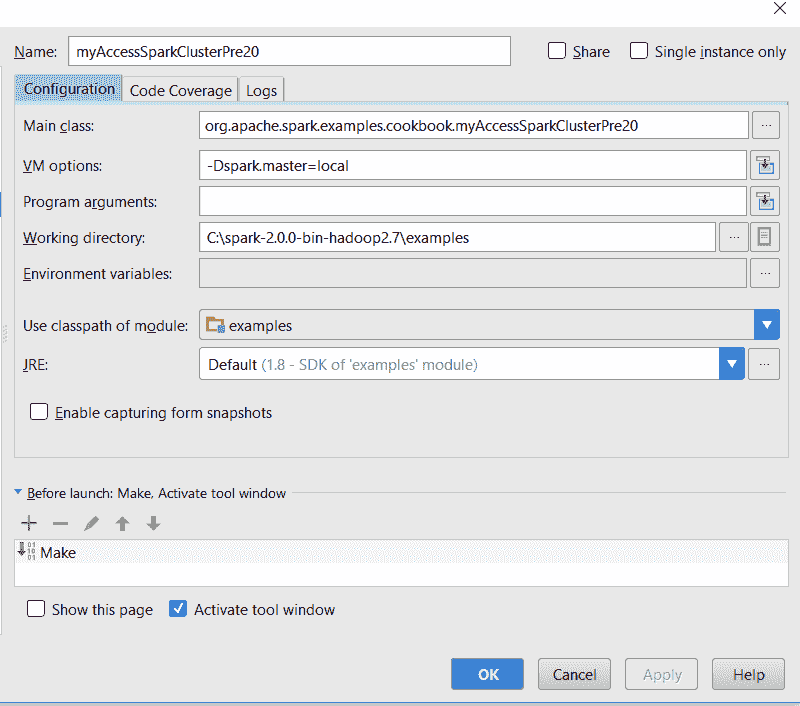
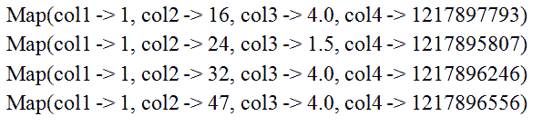
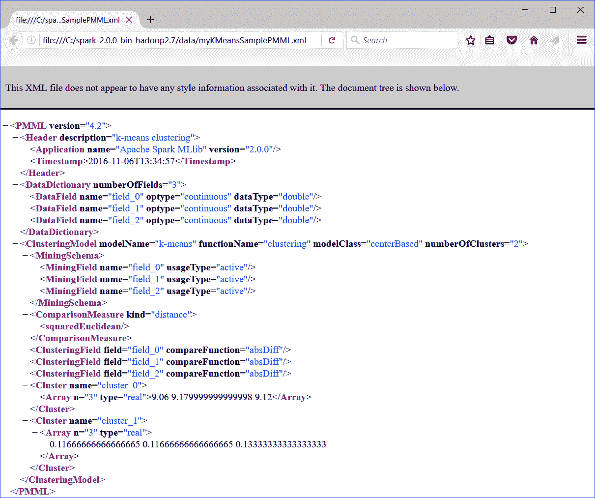
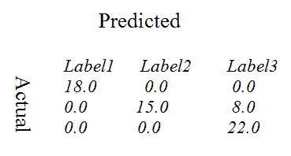

# 第十二章：实施稳健机器学习系统的常见配方

本章我们将涵盖：

+   Spark 的基本统计 API，助你构建自己的算法

+   现实生活中的机器学习应用的 ML 管道

+   使用 Spark 进行数据标准化

+   数据分割以进行训练和测试

+   使用新的 Dataset API 进行常见操作

+   在 Spark 2.0 中从文本文件创建和使用 RDD、DataFrame 与 Dataset

+   Spark ML 中的 LabeledPoint 数据结构

+   在 Spark 2.0+中访问 Spark 集群

+   在 Spark 2.0 之前访问 Spark 集群

+   在 Spark 2.0 中通过 SparkSession 对象访问 SparkContext

+   Spark 2.0 中的新模型导出和 PMML 标记

+   使用 Spark 2.0 进行回归模型评估

+   二元分类模型评估...

# 引言

在各行各业中，无论是经营一家小企业还是开发和维护关键任务应用程序，都有一系列常见的任务需要在执行功能过程中几乎每个工作流程中包含。即使在构建强大的机器学习系统时也是如此。在 Spark 机器学习中，这些任务包括从数据分割以进行模型开发（训练、测试、验证）到标准化输入特征向量数据，再到通过 Spark API 创建 ML 管道。本章提供了一系列配方，旨在帮助读者思考实施端到端机器学习系统实际需要的内容。

本章试图展示在任何稳健的 Spark 机器学习系统实现中存在的多种常见任务。为了避免在本书中每个配方中重复提及这些常见任务，我们将这些常见任务作为本章中的简短配方提取出来，读者在阅读其他章节时可根据需要加以利用。这些配方既可以独立使用，也可以作为大型系统中的管道子任务。请注意，这些常见配方在后续章节中关于机器学习算法的更大背景下得到强调，同时为了完整性，本章也包含了它们作为独立配方。

# Spark 的基本统计 API，助你构建自己的算法

在本配方中，我们涵盖了 Spark 的多变量统计摘要（即*Statistics.colStats*），如相关性、分层抽样、假设检验、随机数据生成、核密度估计器等，这些可以在处理极大数据集时利用 RDD 的并行性和弹性。

# 如何操作...

1.  在 IntelliJ 或您选择的 IDE 中启动新项目。确保包含必要的 JAR 文件。

1.  设置程序将驻留的包位置：

```scala
package spark.ml.cookbook.chapter4
```

1.  为 Spark 会话导入必要的包以访问集群，并使用`log4j.Logger`减少 Spark 产生的输出量：

```scala
import org.apache.spark.mllib.linalg.Vectors
import org.apache.spark.mllib.stat.Statistics
import org.apache.spark.sql.SparkSession
import org.apache.log4j.Logger
import org.apache.log4j.Level
```

1.  将输出级别设置为`ERROR`以减少 Spark 的日志输出：

```scala
Logger.getLogger("org").setLevel(Level.ERROR)
Logger.getLogger("akka").setLevel(Level.ERROR)
```

1.  通过构建器模式初始化 Spark 会话并指定配置，从而为 Spark 集群提供入口点：

```scala
val spark = SparkSession
.builder
.master("local[*]")
.appName("Summary Statistics")
.config("spark.sql.warehouse.dir", ".")
.getOrCreate()
```

1.  让我们检索底层 SparkContext 的 Spark 会话，以便在生成 RDD 时使用：

```scala
val sc = spark.sparkContext
```

1.  现在我们使用手工数据创建一个 RDD，以说明摘要统计的使用：

```scala
val rdd = sc.parallelize(
  Seq(
    Vectors.dense(0, 1, 0),
    Vectors.dense(1.0, 10.0, 100.0),
    Vectors.dense(3.0, 30.0, 300.0),
    Vectors.dense(5.0, 50.0, 500.0),
    Vectors.dense(7.0, 70.0, 700.0),
    Vectors.dense(9.0, 90.0, 900.0),
    Vectors.dense(11.0, 110.0, 1100.0)
  )
)
```

1.  我们通过调用 `colStats()` 方法并传递 RDD 作为参数来使用 Spark 的统计对象：

```scala
val summary = Statistics.colStats(rdd)
```

`colStats()` 方法将返回一个 `MultivariateStatisticalSummary`，其中包含计算出的摘要统计信息：

```scala
println("mean:" + summary.mean)
println("variance:" +summary.variance)
println("none zero" + summary.numNonzeros)
println("min:" + summary.min)
println("max:" + summary.max)
println("count:" + summary.count)
mean:[5.142857142857142,51.57142857142857,514.2857142857142]
variance:[16.80952380952381,1663.952380952381,168095.2380952381]
none zero[6.0,7.0,6.0]
min:[0.0,1.0,0.0]
max:[11.0,110.0,1100.0]
count:7
```

1.  我们通过停止 Spark 会话来关闭程序：

```scala
spark.stop()
```

# 工作原理...

我们创建了一个从密集向量数据生成的 RDD，然后使用统计对象在其上生成摘要统计信息。一旦调用 `colStats()` 方法返回，我们便获取了诸如均值、方差、最小值、最大值等摘要统计信息。

# 还有更多...

在大数据集上，统计 API 的高效性怎么强调都不为过。这些 API 将为您提供实现任何统计学习算法的基本元素。基于我们的研究和经验，我们鼓励您在实现自己的算法之前，先阅读源代码，确保 Spark 中没有实现相应功能。

虽然我们在此仅演示了基本的统计摘要，但 Spark 自带了以下功能：

+   相关性：`Statistics.corr(seriesX, seriesY, "相关性类型")`：

    +   皮尔逊（默认）

    +   斯皮尔曼

+   分层抽样 - RDD API：

    +   有替换的 RDD

    +   无替换 - 需要额外遍历

+   假设检验：

    +   向量 - `Statistics.chiSqTest( 向量 )`

    +   矩阵 - `Statistics.chiSqTest( 密集矩阵 )`

+   **柯尔莫哥洛夫-斯米尔诺夫**（**KS**）等同性检验 - 单侧或双侧：

    +   `Statistics.kolmogorovSmirnovTest(RDD, "norm", 0, 1)`

+   随机数据生成器 - `normalRDD()`：

    +   正态 - 可以指定参数

    +   众多选项加上 `map()` 以生成任何分布

+   核密度估计器 - `KernelDensity().estimate( data )`

统计学中*拟合优度*概念的快速参考可在[`en.wikipedia.org/wiki/Goodness_of_fit`](https://en.wikipedia.org/wiki/Goodness_of_fit)链接找到。

# 另请参阅

更多多元统计摘要的文档：

+   [`spark.apache.org/docs/latest/api/scala/index.html#org.apache.spark.mllib.stat.MultivariateStatisticalSummary`](https://spark.apache.org/docs/latest/api/scala/index.html#org.apache.spark.mllib.stat.MultivariateStatisticalSummary)

# ML 管道，适用于实际机器学习应用

这是涵盖 Spark 2.0 中 ML 管道的两个配方中的第一个。有关 ML 管道的更高级处理，包括 API 调用和参数提取等详细信息，请参阅本书后面的章节。

在本例中，我们尝试构建一个单一管道，该管道能够对文本进行分词，使用 HashingTF（一种老技巧）映射词频，运行回归以拟合模型，并预测新词属于哪个组（例如，新闻过滤、手势分类等）。

# 如何操作...

1.  在 IntelliJ 或您选择的 IDE 中启动一个新项目。确保包含了必要的 JAR 文件。

1.  设置程序将驻留的包位置：

```scala
package spark.ml.cookbook.chapter4
```

1.  为 Spark 会话导入必要的包以访问集群，并使用`log4j.Logger`来减少 Spark 产生的输出量：

```scala
import org.apache.spark.ml.Pipelineimport org.apache.spark.ml.classification.LogisticRegressionimport org.apache.spark.ml.feature.{HashingTF, Tokenizer}import org.apache.spark.sql.SparkSessionimport org.apache.log4j.{Level, Logger}
```

1.  将输出级别设置为`ERROR`以减少 Spark 的日志输出：

```scala
Logger.getLogger("org").setLevel(Level.ERROR)Logger.getLogger("akka" ...
```

# 工作原理...

本节中，我们探讨了使用 Spark 构建简单机器学习管道的过程。我们首先创建了一个包含两组文本文档的 DataFrame，随后设置了管道。

首先，我们创建了一个分词器来将文本文档解析为词项，随后创建了 HashingTF 来将这些词项转换为特征。接着，我们创建了一个逻辑回归对象来预测新文本文档属于哪个组。

其次，我们通过传递一个参数数组来构建管道，指定了三个执行阶段。您会注意到，每个后续阶段都使用前一阶段的输出列作为输入，并提供一个指定的结果列。

最后，我们通过在管道对象上调用`fit()`并定义一组测试数据进行验证来训练模型。接下来，我们使用模型转换测试集，确定测试集中的文本文档属于定义的两个组中的哪一个。

# 还有更多...

Spark ML 中的管道灵感来源于 Python 中的 scikit-learn，此处为完整性引用：

[`scikit-learn.org/stable/`](http://scikit-learn.org/stable/)

机器学习管道使得在 Spark 中结合多个用于实现生产任务的算法变得容易。在实际应用中，通常不会只使用单一算法。往往需要多个协作的机器学习算法共同工作以实现复杂的用例。例如，在基于 LDA 的系统（如新闻简报）或人类情感检测中，在核心系统前后都有多个步骤需要实现为一个单一管道，以产生有意义且适用于生产的系统。请参阅以下链接了解一个实际应用案例，该案例需要...

# 另请参见

更多多元统计摘要的文档：

+   管道文档可在[`spark.apache.org/docs/latest/api/scala/index.html#org.apache.spark.ml.Pipeline`](https://spark.apache.org/docs/latest/api/scala/index.html#org.apache.spark.ml.Pipeline)找到

+   当我们加载和保存`.load()`, `.save()`方法时，有用的流水线模型：[此处](https://spark.apache.org/docs/latest/api/scala/index.html#org.apache.spark.ml.PipelineModel)

+   流水线阶段信息可在[此处](https://spark.apache.org/docs/latest/api/scala/index.html#org.apache.spark.ml.PipelineStage)找到。

+   HashingTF，文本分析中将序列映射到其词频的一个不错老技巧，可在[此处](https://spark.apache.org/docs/latest/api/scala/index.html#org.apache.spark.mllib.feature.HashingTF)找到。

# 使用 Spark 进行数据归一化

在本食谱中，我们展示了在将数据导入 ML 算法之前进行归一化（缩放）。有许多 ML 算法（如**支持向量机**（**SVM**））在缩放输入向量上比在原始值上工作得更好。

# 如何操作...

1.  前往 UCI 机器学习库并下载[此文件](http://archive.ics.uci.edu/ml/machine-learning-databases/wine/wine.data)。

1.  在 IntelliJ 或您选择的 IDE 中启动一个新项目。确保包含必要的 JAR 文件。

1.  设置程序将驻留的包位置：

```scala
package spark.ml.cookbook.chapter4
```

1.  导入必要的包，以便 Spark 会话能够访问集群并使用`log4j.Logger`减少 Spark 产生的输出量：

```scala
import org.apache.spark.sql.SparkSession
import org.apache.spark.ml.linalg.{Vector, Vectors}
import org.apache.spark.ml.feature.MinMaxScaler
```

1.  定义一个方法，将葡萄酒数据解析为元组：

```scala
def parseWine(str: String): (Int, Vector) = {
val columns = str.split(",")
(columns(0).toInt, Vectors.dense(columns(1).toFloat, columns(2).toFloat, columns(3).toFloat))
 }
```

1.  将输出级别设置为`ERROR`以减少 Spark 的日志输出：

```scala
Logger.getLogger("org").setLevel(Level.ERROR)
Logger.getLogger("akka").setLevel(Level.ERROR)
```

1.  使用构建器模式初始化 Spark 会话，指定配置，从而为 Spark 集群提供入口点：

```scala
val spark = SparkSession
.builder
.master("local[*]")
.appName("My Normalize")
.getOrCreate()
```

1.  导入`spark.implicits`，从而仅通过`import`添加行为：

```scala
import spark.implicits._
```

1.  让我们将葡萄酒数据加载到内存中，只取前四列，并将后三列转换为一个新的特征向量：

```scala
val data = Spark.read.text("../data/sparkml2/chapter4/wine.data").as[String].map(parseWine)
```

1.  接下来，我们生成一个包含两列的 DataFrame：

```scala
val df = data.toDF("id", "feature")
```

1.  现在，我们将打印出 DataFrame 模式并展示 DataFrame 中包含的数据：

```scala
df.printSchema()
df.show(false)
```



1.  最后，我们生成缩放模型并将特征转换为介于负一和正一之间的公共范围，展示结果：

```scala
val scale = new MinMaxScaler()
      .setInputCol("feature")
      .setOutputCol("scaled")
      .setMax(1)
      .setMin(-1)
scale.fit(df).transform(df).select("scaled").show(false)
```



1.  通过停止 Spark 会话来关闭程序：

```scala
spark.stop()
```

# 工作原理...

在本例中，我们探讨了特征缩放，这是大多数机器学习算法（如**分类器**）中的关键步骤。我们首先加载葡萄酒数据文件，提取标识符，并使用接下来的三列创建特征向量。

接着，我们创建了一个`MinMaxScaler`对象，配置了一个最小和最大范围，以便将我们的值进行缩放。通过在缩放器类上调用`fit()`方法来执行缩放模型，然后使用该模型对 DataFrame 中的值进行缩放。

最后，我们展示了结果的 DataFrame，并注意到特征向量值的范围在负 1 到正 1 之间。

# 还有更多...

通过检查线性代数入门中的**单位向量**概念，可以更好地理解归一化和缩放的根源。以下是一些关于单位向量的常见参考链接：

+   你可以在[`en.wikipedia.org/wiki/Unit_vector`](https://en.wikipedia.org/wiki/Unit_vector)参考单位向量

+   对于标量，你可以参考[`en.wikipedia.org/wiki/Scalar_(mathematics)`](https://en.wikipedia.org/wiki/Scalar_(mathematics))

对于输入敏感的算法，如 SVM，建议在特征的缩放值（例如，范围从 0 到 1）上训练算法，而不是原始向量表示的绝对值。

# 另请参阅

`MinMaxScaler`的文档可在[`spark.apache.org/docs/latest/api/scala/index.html#org.apache.spark.ml.feature.MinMaxScaler`](https://spark.apache.org/docs/latest/api/scala/index.html#org.apache.spark.ml.feature.MinMaxScaler)获取。

我们想强调`MinMaxScaler`是一个广泛的 API，它扩展了`Estimator`（来自 ML 管道的概念），正确使用时可以实现编码效率和高精度结果。

# 分割数据用于训练和测试

在本食谱中，你将学习使用 Spark 的 API 将可用的输入数据分割成不同的数据集，这些数据集可用于训练和验证阶段。通常使用 80/20 的分割比例，但也可以根据你的偏好考虑其他数据分割方式。

# 如何操作...

1.  前往 UCI 机器学习库并下载[`archive.ics.uci.edu/ml/machine-learning-databases/00359/NewsAggregatorDataset.zip`](http://archive.ics.uci.edu/ml/machine-learning-databases/00359/NewsAggregatorDataset.zip)文件。

1.  在 IntelliJ 或你选择的 IDE 中启动一个新项目。确保包含必要的 JAR 文件。

1.  设置程序将驻留的包位置：

```scala
package spark.ml.cookbook.chapter4
```

1.  为 Spark 会话导入必要的包以访问集群，并导入`log4j.Logger`以减少 Spark 产生的输出量：

```scala
import org.apache.spark.sql.SparkSessionimport org.apache.log4j.{ Level, Logger}
```

1.  将输出级别设置为`ERROR`以减少 Spark 的日志输出：

```scala
Logger.getLogger("org").setLevel(Level.ERROR)Logger.getLogger("akka" ...
```

# 工作原理...

我们首先加载`newsCorpora.csv`数据文件，然后通过数据集对象上的`randomSplit()`方法，我们分割了数据集。

# 还有更多...

为了验证结果，我们必须设置一个德尔菲技术，其中测试数据对模型来说是完全未知的。详情请参见 Kaggle 竞赛，网址为[`www.kaggle.com/competitions`](https://www.kaggle.com/competitions)。

一个健壮的机器学习系统需要三种类型的数据集。

+   **训练数据集**：用于拟合模型以进行采样。

+   **验证数据集**：用于估计拟合模型（由训练集训练）的预测误差或增量。

+   **测试数据集**：一旦选定最终模型，用于评估模型的泛化误差。

# 另请参见

关于`randomSplit()`的文档可在[`spark.apache.org/docs/latest/api/scala/index.html#org.apache.spark.api.java.JavaRDD@randomSplit(weights:Array%5BDouble%5D):Array%5Borg.apache.spark.api.java.JavaRDD%5BT%5D%5D`](https://spark.apache.org/docs/latest/api/scala/index.html#org.apache.spark.api.java.JavaRDD@randomSplit(weights:Array%5BDouble%5D):Array%5Borg.apache.spark.api.java.JavaRDD%5BT%5D%5D)找到。

`randomSplit()`是在 RDD 内部调用的方法。尽管 RDD 方法调用的数量可能令人不知所措，但掌握这个 Spark 概念和 API 是必须的。

API 签名如下：

```scala
def randomSplit(weights: Array[Double]): Array[JavaRDD[T]]
```

使用提供的权重随机分割此 RDD。

# 使用新 Dataset API 的常见操作

在本菜谱中，我们介绍了 Dataset API，这是 Spark 2.0 及以后版本进行数据整理的前进方式。本章中，我们涵盖了一些处理这些新 API 集合所需的常见、重复操作。此外，我们还展示了由 Spark SQL Catalyst 优化器生成的查询计划。

# 如何操作...

1.  在 IntelliJ 或您选择的 IDE 中启动一个新项目。确保包含必要的 JAR 文件。

1.  我们将使用一个名为`cars.json`的 JSON 数据文件，该文件是为这个示例创建的：

```scala
name,city
Bears,Chicago
Packers,Green Bay
Lions,Detroit
Vikings,Minnesota
```

1.  设置程序将驻留的包位置。

```scala
package spark.ml.cookbook.chapter4
```

1.  为 Spark 会话导入必要的包以访问集群，并导入`log4j.Logger`以减少 Spark 产生的输出量。

```scala
import org.apache.spark.ml.Pipeline
import org.apache.spark.ml.classification.LogisticRegression
import org.apache.spark.ml.feature.{HashingTF, Tokenizer}
import org.apache.spark.sql.SparkSession
import org.apache.log4j.{Level, Logger}
```

1.  定义一个 Scala `case class`来建模数据：

```scala
case class Team(name: String, city: String)
```

1.  将输出级别设置为`ERROR`以减少 Spark 的日志输出。

```scala
Logger.getLogger("org").setLevel(Level.ERROR)
Logger.getLogger("akka").setLevel(Level.ERROR)
```

1.  使用构建器模式初始化 Spark 会话并指定配置，从而为 Spark 集群提供入口点。

```scala
val spark = SparkSession
.builder
.master("local[*]")
.appName("My Dataset")
.config("spark.sql.warehouse.dir", ".")
.getOrCreate()
```

1.  导入`spark.implicits`，从而通过仅一个`导入`操作添加行为。

```scala
import spark.implicits._
```

1.  让我们从一个 Scala 列表创建数据集并打印结果：

```scala
val champs = spark.createDataset(List(Team("Broncos", "Denver"), Team("Patriots", "New England")))
champs.show(false)
```



1.  接下来，我们将加载一个 CSV 文件到内存中，并将其转换为类型为`Team`的数据集。

```scala
val teams = spark.read
 .option("Header", "true")
 .csv("../data/sparkml2/chapter4/teams.csv")
 .as[Team]

 teams.show(false)
```



1.  现在我们通过使用`map`函数遍历 teams 数据集，生成一个新的城市名称数据集。

```scala
val cities = teams.map(t => t.city)
cities.show(false)
```



1.  显示检索城市名称的执行计划：

```scala
cities.explain()
== Physical Plan ==
*SerializeFromObject [staticinvoke(class org.apache.spark.unsafe.types.UTF8String, StringType, fromString, input[0, java.lang.String, true], true) AS value#26]
+- *MapElements <function1>, obj#25: java.lang.String
+- *DeserializeToObject newInstance(class Team), obj#24: Team
+- *Scan csv [name#9,city#10] Format: CSV, InputPaths: file:teams.csv, PartitionFilters: [], PushedFilters: [], ReadSchema: struct<name:string,city:string>
```

1.  最后，我们将`teams`数据集保存到 JSON 文件中。

```scala
teams.write
.mode(SaveMode.Overwrite)
.json("../data/sparkml2/chapter4/teams.json"){"name":"Bears","city":"Chicago"}
{"name":"Packers","city":"Green Bay"}
{"name":"Lions","city":"Detroit"}
{"name":"Vikings","city":"Minnesota"}
```

1.  我们通过停止 Spark 会话来关闭程序。

```scala
spark.stop()
```

# 工作原理...

首先，我们从 Scala 列表创建了一个数据集，并显示输出以验证数据集的创建是否符合预期。其次，我们将一个 **逗号分隔值**（**CSV**）文件加载到内存中，将其转换为类型为 `Team` 的数据集。第三，我们对数据集执行了 `map()` 函数，以构建一个团队城市名称列表，并打印出用于生成数据集的执行计划。最后，我们将之前加载的 `teams` 数据集持久化为 JSON 格式的文件，以备将来使用。

# 还有更多...

请注意关于数据集的一些有趣点：

+   数据集采用 *惰性* 评估

+   数据集利用了 Spark SQL Catalyst 优化器

+   数据集利用了 tungsten 的堆外内存管理

+   未来两年内，许多系统仍将停留在 Spark 2.0 之前，因此出于实际考虑，您必须学习并掌握 RDD 和 DataFrame。

# 参见

Dataset 的文档可在 [`spark.apache.org/docs/latest/api/scala/index.html#org.apache.spark.sql.Dataset`](https://spark.apache.org/docs/latest/api/scala/index.html#org.apache.spark.sql.Dataset) 获取。

# Spark 2.0 中从文本文件创建和使用 RDD 与 DataFrame 与 Dataset

在本示例中，我们通过一段简短的代码探索了从文本文件创建 RDD、DataFrame 和 Dataset 的细微差别以及它们之间的关系：

```scala
Dataset: spark.read.textFile()
RDD: spark.sparkContext.textFile()
DataFrame: spark.read.text()
```

假设 `spark` 是会话名称

# 如何操作...

1.  在 IntelliJ 或您选择的 IDE 中启动一个新项目。确保包含了必要的 JAR 文件。

1.  设置程序将驻留的包位置：

```scala
package spark.ml.cookbook.chapter4
```

1.  为 Spark 会话导入必要的包以访问集群，并导入 `log4j.Logger` 以减少 Spark 产生的输出量：

```scala
import org.apache.log4j.{Level, Logger}import org.apache.spark.sql.SparkSession
```

1.  我们还定义了一个 `case class` 来承载所使用的数据：

```scala
case class Beatle(id: Long, name: String)
```

1.  将输出级别设置为 `ERROR` 以减少 Spark 的日志输出：

```scala
Logger.getLogger("org").setLevel(Level.ERROR)
```

1.  通过构建器模式初始化 Spark 会话并指定配置，从而...

# 工作原理...

我们使用相同文本文件的类似方法创建了 RDD、DataFrame 和 Dataset 对象，并使用 `getClass` 方法确认了类型：

```scala
Dataset: spark.read.textFile
RDD: spark.sparkContext.textFile
DataFrame: spark.read.text
```

请注意，它们非常相似，有时会令人困惑。Spark 2.0 已将 DataFrame 转变为 `Dataset[Row]` 的别名，使其真正成为一个数据集。我们展示了前面的方法，以便用户选择示例来创建自己的数据类型风格。

# 还有更多...

数据类型的文档可在 [`spark.apache.org/docs/latest/sql-programming-guide.html`](http://spark.apache.org/docs/latest/sql-programming-guide.html) 获取。

如果您不确定手头有什么样的数据结构（有时差异并不明显），请使用 `getClass` 方法进行验证。

Spark 2.0 已将 DataFrame 转变为 `Dataset[Row]` 的别名。虽然 RDD 和 Dataram 在不久的将来仍然完全可行，但最好学习和使用数据集编写新项目。

# 参见

RDD 和 Dataset 的文档可在以下网站获取：

+   [`spark.apache.org/docs/latest/api/scala/index.html#org.apache.spark.rdd.RDD`](http://spark.apache.org/docs/latest/api/scala/index.html#org.apache.spark.rdd.RDD)

+   [`spark.apache.org/docs/latest/api/scala/index.html#org.apache.spark.sql.Dataset`](http://spark.apache.org/docs/latest/api/scala/index.html#org.apache.spark.sql.Dataset)

# Spark ML 中的 LabeledPoint 数据结构

**LabeledPoint**是一种自早期以来就存在的数据结构，用于打包特征向量及其标签，以便用于无监督学习算法。我们展示了一个简短的示例，使用 LabeledPoint、**Seq**数据结构和 DataFrame 来运行二元分类数据的逻辑回归。

# 如何操作...

1.  在 IntelliJ 或您选择的 IDE 中启动一个新项目。确保包含必要的 JAR 文件。

1.  设置程序将驻留的包位置：

```scala
package spark.ml.cookbook.chapter4
```

1.  导入必要的包以使 SparkContext 能够访问集群：

```scala
import org.apache.spark.ml.feature.LabeledPoint
import org.apache.spark.ml.linalg.Vectors
import org.apache.spark.ml.classification.LogisticRegression
import org.apache.spark.sql._

```

1.  创建 Spark 配置和 SparkContext，以便我们能够访问集群：

```scala
val spark = SparkSession
.builder
.master("local[*]")
.appName("myLabeledPoint")
.config("spark.sql.warehouse.dir", ".")
.getOrCreate()
```

1.  我们创建 LabeledPoint，使用`SparseVector`和`DenseVector`。在以下代码块中，前四个 LabeledPoint 通过`DenseVector`创建，最后两个 LabeledPoint 通过`SparseVector`创建：

```scala
val myLabeledPoints = spark.createDataFrame(Seq(
 LabeledPoint(1.0, Vectors.dense(0.0, 1.1, 0.1)),
 LabeledPoint(0.0, Vectors.dense(2.0, 1.0, -1.0)),
 LabeledPoint(0.0, Vectors.dense(2.0, 1.3, 1.0)),
 LabeledPoint(1.0, Vectors.dense(0.0, 1.2, -0.5)),

 LabeledPoint(0.0, Vectors.sparse(3, Array(0,2), Array(1.0,3.0))),
 LabeledPoint(1.0, Vectors.sparse(3, Array(1,2), Array(1.2,-0.4)))

 ))
```

DataFrame 对象从前述 LabeledPoint 创建。

1.  我们验证原始数据计数和处理数据计数。

1.  您可以对创建的 DataFrame 调用`show()`函数：

```scala
myLabeledPoints.show()
```

1.  您将在控制台看到以下内容：

1.  我们基于刚创建的数据结构创建了一个简单的 LogisticRegression 模型：

```scala
val lr = new LogisticRegression()

 lr.setMaxIter(5)
 .setRegParam(0.01)
 val model = lr.fit(myLabeledPoints)

 println("Model was fit using parameters: " + model.parent.extractParamMap())
```

在控制台中，将显示以下`model`参数：

```scala
Model was fit using parameters: {
 logreg_6aebbb683272-elasticNetParam: 0.0,
 logreg_6aebbb683272-featuresCol: features,
 logreg_6aebbb683272-fitIntercept: true,
 logreg_6aebbb683272-labelCol: label,
 logreg_6aebbb683272-maxIter: 5,
 logreg_6aebbb683272-predictionCol: prediction,
 logreg_6aebbb683272-probabilityCol: probability,
 logreg_6aebbb683272-rawPredictionCol: rawPrediction,
 logreg_6aebbb683272-regParam: 0.01,
 logreg_6aebbb683272-standardization: true,
 logreg_6aebbb683272-threshold: 0.5,
 logreg_6aebbb683272-tol: 1.0E-6
}
```

1.  随后通过停止 Spark 会话来关闭程序：

```scala
spark.stop()
```

# 工作原理...

我们使用 LabeledPoint 数据结构来建模特征并驱动逻辑回归模型的训练。首先定义了一组 LabeledPoints，用于创建 DataFrame 以进行进一步处理。接着，我们创建了一个逻辑回归对象，并将 LabeledPoint DataFrame 作为参数传递给它，以便训练我们的模型。Spark ML API 设计得与 LabeledPoint 格式兼容良好，且几乎无需干预。

# 还有更多内容...

LabeledPoint 是一种常用结构，用于将数据打包为`Vector` + `Label`，适用于监督机器学习算法。LabeledPoint 的典型布局如下所示：

```scala
Seq( 
LabeledPoint (Label, Vector(data, data, data)) 
...... 
LabeledPoint (Label, Vector(data, data, data)) 
) 
```

请注意，不仅密集向量，稀疏向量也可以与 LabeledPoint 配合使用，这在测试和开发期间，如果驱动程序中驻留了大型且稀疏的数据集，将会在效率上产生巨大差异。

# 另请参阅

+   LabeledPoint API 文档可在此处查阅：[`spark.apache.org/docs/latest/api/scala/index.html#org.apache.spark.ml.feature.LabeledPoint`](https://spark.apache.org/docs/latest/api/scala/index.html#org.apache.spark.ml.feature.LabeledPoint)

+   DenseVector API 文档可在 [`spark.apache.org/docs/latest/api/scala/index.html#org.apache.spark.ml.linalg.DenseVector`](https://spark.apache.org/docs/latest/api/scala/index.html#org.apache.spark.ml.linalg.DenseVector) 获取

+   SparseVector API 文档可在 [`spark.apache.org/docs/latest/api/scala/index.html#org.apache.spark.ml.linalg.SparseVector`](https://spark.apache.org/docs/latest/api/scala/index.html#org.apache.spark.ml.linalg.SparseVector) 获取

# 获取 Spark 2.0 中 Spark 集群的访问权限

在本示例中，我们演示了如何通过名为 `SparkSession` 的单点访问来获取 Spark 集群的访问权限。Spark 2.0 将多个上下文（如 SQLContext、HiveContext）抽象为一个入口点 `SparkSession`，允许您以统一的方式访问所有 Spark 子系统。

# 操作方法...

1.  在 IntelliJ 或您选择的 IDE 中启动一个新项目。确保包含必要的 JAR 文件。

1.  设置程序所在包的位置：

```scala
package spark.ml.cookbook.chapter4
```

1.  导入必要的包以通过 SparkContext 访问集群。

1.  Spark 2.x 中，`SparkSession` 更常用。

```scala
import org.apache.spark.sql.SparkSession
```

1.  创建 Spark 配置和 `SparkSession`，以便我们能够访问集群：

```scala
val spark = SparkSession.builder.master("local[*]") // if use cluster master("spark://master:7077").appName("myAccesSparkCluster20").config("spark.sql.warehouse.dir", ".").getOrCreate()
```

上述代码利用 `master()` 函数来设置集群类型...

# 工作原理...

在本例中，我们展示了如何使用本地和远程选项连接到 Spark 集群。首先，我们创建一个 `SparkSession` 对象，通过 `master()` 函数指定集群是本地还是远程，从而授予我们访问 Spark 集群的权限。您还可以通过在启动客户端程序时传递 JVM 参数来指定主节点位置。此外，您可以配置应用程序名称和工作数据目录。接下来，调用 `getOrCreate()` 方法创建新的 `SparkSession` 或为您提供现有会话的引用。最后，我们执行一个小型示例程序以验证 `SparkSession` 对象创建的有效性。

# 还有更多...

Spark 会话拥有众多可设置和使用的参数及 API，但建议查阅 Spark 文档，因为其中一些方法/参数被标记为实验性或留空 - 对于非实验性状态（我们上次检查时至少有 15 个）。

另一个需要注意的变化是使用 `spark.sql.warehouse.dir` 来指定表的位置。Spark 2.0 使用 `spark.sql.warehouse.dir` 设置仓库位置以存储表，而不是 `hive.metastore.warehouse.dir`。`spark.sql.warehouse.dir` 的默认值为 `System.getProperty("user.dir")`。

更多详情请参阅 `spark-defaults.conf`。

同样值得注意的是以下几点：

+   我们最喜欢的 Spark 中一些有趣且有用的 API...

# 另请参阅

`SparkSession` API 文档可在[此处](https://spark.apache.org/docs/latest/api/scala/index.html#org.apache.spark.sql.SparkSession)获取。

# 在 Spark 2.0 之前访问 Spark 集群

这是一份*Spark 2.0 之前的指南*，但对于希望快速比较和对比集群访问方式，以便将 Spark 2.0 之前程序迁移至 Spark 2.0 新范式的开发者来说，将大有裨益。

# 操作方法...

1.  在 IntelliJ 或您选择的 IDE 中新建项目。确保包含必要的 JAR 文件。

1.  设置程序所在包的位置：

```scala
package spark.ml.cookbook.chapter4
```

1.  为 SparkContext 导入必要包以访问集群：

```scala
import org.apache.spark.{SparkConf, SparkContext}
```

1.  创建 Spark 配置及 SparkContext 以便访问集群：

```scala
val conf = new SparkConf()
.setAppName("MyAccessSparkClusterPre20")
.setMaster("local[4]") // if cluster setMaster("spark://MasterHostIP:7077")
.set("spark.sql.warehouse.dir", ".")

val sc = new SparkContext(conf)
```

上述代码利用`setMaster()`函数设置集群主节点位置。如您所见，我们正运行于`本地`模式。

若两者同时存在，代码中集群主参数设置将覆盖`-D`选项值。

以下是三种不同模式下连接集群的示例方法：

1.  运行于本地模式：

```scala
setMaster("local")
```

1.  运行于集群模式：

```scala
setMaster("spark://yourmasterhostIP:port")
```

1.  传递主节点值：

```scala
-Dspark.master=local
```



1.  我们使用上述 SparkContext 读取 CSV 文件，并将其解析为 Spark 中的数据，代码如下：

```scala
val file = sc.textFile("../data/sparkml2/chapter4/mySampleCSV.csv")
val headerAndData = file.map(line => line.split(",").map(_.trim))
val header = headerAndData.first
val data = headerAndData.filter(_(0) != header(0))
val maps = data.map(splits => header.zip(splits).toMap)
```

1.  我们将示例结果打印至控制台：

```scala
val result = maps.take(4)
result.foreach(println)
```

1.  控制台将显示如下内容：

1.  随后，我们通过停止 SparkContext 来关闭程序：

```scala
sc.stop()
```

# 工作原理...

本例展示如何在 Spark 2.0 之前通过本地和远程模式连接至 Spark 集群。首先，我们创建一个`SparkConf`对象并配置所有必需参数。我们将指定主节点位置、应用名称及工作数据目录。接着，我们创建 SparkContext，将`SparkConf`作为参数传递以访问 Spark 集群。此外，启动客户端程序时，您可通过传递 JVM 参数指定主节点位置。最后，我们执行一个小型示例程序以验证 SparkContext 运行正常。

# 更多内容...

Spark 2.0 之前，访问 Spark 集群通过**SparkContext**实现。

对子系统（如 SQL）的访问需通过特定名称上下文（例如，SQLContext**）。

Spark 2.0 通过创建单一统一访问点（即`SparkSession`）改变了我们访问集群的方式。

# 相关内容

SparkContext 文档可在此[查阅](https://spark.apache.org/docs/latest/api/scala/index.html#org.apache.spark.SparkContext)。

# Spark 2.0 中通过 SparkSession 对象访问 SparkContext

在本教程中，我们展示了如何在 Spark 2.0 中通过 SparkSession 对象获取 SparkContext。本教程将演示 RDD 到 Dataset 的创建、使用以及来回转换。这样做的重要性在于，尽管我们倾向于使用 Dataset，但我们仍需能够使用和增强主要利用 RDD 的遗留（预 Spark 2.0）代码。

# 如何操作...

1.  在 IntelliJ 或您选择的 IDE 中启动一个新项目。确保包含必要的 JAR 文件。

1.  设置程序所在包的位置：

```scala
package spark.ml.cookbook.chapter4
```

1.  为 Spark 会话导入必要的包以访问集群，并使用`log4j.Logger`减少 Spark 产生的输出量：

```scala
import org.apache.log4j.{Level, Logger}import org.apache.spark.sql.SparkSessionimport scala.util.Random
```

1.  将输出级别设置为`ERROR`以减少 Spark 的日志输出：

```scala
Logger.getLogger("org").setLevel(Level.ERROR)
```

1.  通过构建器模式初始化 Spark 会话并指定配置，从而为 Spark 集群提供入口点：

```scala
val session = SparkSession ...
```

# 工作原理...

我们使用 SparkContext 创建了 RDD；这在 Spark 1.x 中广泛使用。我们还展示了在 Spark 2.0 中使用 Session 对象创建 Dataset 的方法。为了处理生产环境中的预 Spark 2.0 代码，这种来回转换是必要的。

本教程的技术要点是，尽管 Dataset 是未来数据处理的首选方法，我们始终可以使用 API 在 RDD 和 Dataset 之间来回转换。

# 还有更多...

关于数据类型的更多信息，请访问[`spark.apache.org/docs/latest/sql-programming-guide.html`](http://spark.apache.org/docs/latest/sql-programming-guide.html)。

# 另请参阅

SparkContext 和 SparkSession 的文档可在以下网站找到：

+   [`spark.apache.org/docs/latest/api/scala/index.html#org.apache.spark.SparkContext`](http://spark.apache.org/docs/latest/api/scala/index.html#org.apache.spark.SparkContext)

+   [`spark.apache.org/docs/latest/api/scala/index.html#org.apache.spark.sql.SparkSession`](http://spark.apache.org/docs/latest/api/scala/index.html#org.apache.spark.sql.SparkSession)

# Spark 2.0 中的新模型导出和 PMML 标记

在本教程中，我们探讨了 Spark 2.0 中的模型导出功能，以使用**预测模型标记语言**（**PMML**）。这种基于 XML 的标准语言允许您在其他系统上导出和运行模型（存在一些限制）。更多信息，请参阅*还有更多...*部分。

# 如何操作...

1.  在 IntelliJ 或您选择的 IDE 中启动一个新项目。确保包含必要的 JAR 文件。

1.  设置程序所在包的位置：

```scala
package spark.ml.cookbook.chapter4
```

1.  为 SparkContext 导入必要的包以访问集群：

```scala
import org.apache.spark.mllib.linalg.Vectors
import org.apache.spark.sql.SparkSession
import org.apache.spark.mllib.clustering.KMeans
```

1.  创建 Spark 的配置和 SparkContext：

```scala
val spark = SparkSession
.builder
.master("local[*]")   // if use cluster master("spark://master:7077")
.appName("myPMMLExport")
.config("spark.sql.warehouse.dir", ".")
.getOrCreate()
```

1.  我们从文本文件中读取数据；数据文件包含一个用于 KMeans 模型的示例数据集：

```scala
val data = spark.sparkContext.textFile("../data/sparkml2/chapter4/my_kmeans_data_sample.txt")

val parsedData = data.map(s => Vectors.dense(s.split(' ').map(_.toDouble))).cache()
```

1.  我们设置了 KMeans 模型的参数，并使用前面提到的数据集和参数来训练模型：

```scala
val numClusters = 2
val numIterations = 10
val model = KMeans.train(parsedData, numClusters, numIterations)
```

1.  我们有效地从刚刚创建的数据结构中创建了一个简单的 KMeans 模型（通过将集群数量设置为 2）。

```scala
println("MyKMeans PMML Model:\n" + model.toPMML)
```

在控制台中，将显示以下模型：

```scala
MyKMeans PMML Model:
<?xml version="1.0" encoding="UTF-8" standalone="yes"?>
<PMML version="4.2" >
    <Header description="k-means clustering">
        <Application name="Apache Spark MLlib" version="2.0.0"/>
        <Timestamp>2016-11-06T13:34:57</Timestamp>
    </Header>
    <DataDictionary numberOfFields="3">
        <DataField name="field_0" optype="continuous" dataType="double"/>
        <DataField name="field_1" optype="continuous" dataType="double"/>
        <DataField name="field_2" optype="continuous" dataType="double"/>
    </DataDictionary>
    <ClusteringModel modelName="k-means" functionName="clustering" modelClass="centerBased" numberOfClusters="2">
        <MiningSchema>
            <MiningField name="field_0" usageType="active"/>
            <MiningField name="field_1" usageType="active"/>
            <MiningField name="field_2" usageType="active"/>
        </MiningSchema>
        <ComparisonMeasure kind="distance">
            <squaredEuclidean/>
        </ComparisonMeasure>
        <ClusteringField field="field_0" compareFunction="absDiff"/>
        <ClusteringField field="field_1" compareFunction="absDiff"/>
        <ClusteringField field="field_2" compareFunction="absDiff"/>
        <Cluster name="cluster_0">
            <Array n="3" type="real">9.06 9.179999999999998 9.12</Array>
        </Cluster>
        <Cluster name="cluster_1">
            <Array n="3" type="real">0.11666666666666665 0.11666666666666665 0.13333333333333333</Array>
        </Cluster>
    </ClusteringModel>
</PMML>
```

1.  然后我们将 PMML 导出到数据目录中的 XML 文件：

```scala
model.toPMML("../data/sparkml2/chapter4/myKMeansSamplePMML.xml")
```



1.  然后我们通过停止 Spark 会话来关闭程序：

```scala
spark.stop()
```

# 它是如何工作的...

在花费时间训练模型后，下一步将是持久化模型以供将来使用。在本教程中，我们首先训练了一个 KMeans 模型，以生成后续步骤中用于持久化的模型信息。一旦我们有了训练好的模型，我们就调用模型的`toPMML()`方法将其转换为 PMML 格式以便存储。该方法的调用会生成一个 XML 文档，然后该 XML 文档文本可以轻松地持久化到文件中。

# 还有更多...

PMML 是由**数据挖掘组**（**DMG**）开发的标准。该标准通过允许您在一个系统上构建，然后部署到生产中的另一个系统，实现了跨平台的互操作性。PMML 标准已经获得了动力，并已被大多数供应商采用。其核心是基于一个 XML 文档，包含以下内容：

+   包含一般信息的头部

+   字典描述了第三组件（模型）使用的字段级定义。

+   模型结构和参数

截至本文撰写时，Spark 2.0 机器学习库对 PMML 导出的支持目前仅限于：

+   线性回归

+   逻辑回归

+   岭回归

+   Lasso

+   SVM

+   KMeans

您可以将模型导出到 Spark 支持的以下文件类型：

+   本地文件系统：

```scala
Model_a.toPMML("/xyz/model-name.xml")
```

+   分布式文件系统：

```scala
Model_a.toPMML(SparkContext, "/xyz/model-name")
```

+   输出流——充当管道：

```scala
Model_a.toPMML(System.out)
```

# 另请参见

关于`PMMLExportable` API 的文档可以在[`spark.apache.org/docs/latest/api/scala/index.html#org.apache.spark.mllib.pmml.PMMLExportable`](http://spark.apache.org/docs/latest/api/scala/index.html#org.apache.spark.mllib.pmml.PMMLExportable)找到。

# 使用 Spark 2.0 进行回归模型评估

在本教程中，我们探讨了如何评估回归模型（本例中为回归决策树）。Spark 提供了**回归度量**工具，该工具具有基本的统计功能，如**均方误差**（**MSE**）、R 平方等，开箱即用。

本教程的目标是理解 Spark 原生提供的评估指标。

# 如何操作...

1.  在 IntelliJ 或您选择的 IDE 中启动一个新项目。确保包含了必要的 JAR 文件。

1.  设置程序将驻留的包位置：

```scala
package spark.ml.cookbook.chapter4
```

1.  导入必要的 SparkContext 包以访问集群：

```scala
import org.apache.spark.mllib.evaluation.RegressionMetricsimport org.apache.spark.mllib.linalg.Vectorsimport org.apache.spark.mllib.regression.LabeledPointimport org.apache.spark.mllib.tree.DecisionTreeimport org.apache.spark.sql.SparkSession
```

1.  创建 Spark 的配置和 SparkContext：

```scala
val spark = SparkSession.builder.master("local[*]").appName("myRegressionMetrics").config("spark.sql.warehouse.dir", ".").getOrCreate()
```

1.  我们利用了...

# 它是如何工作的...

在本教程中，我们探讨了生成回归度量以帮助评估我们的回归模型。我们首先加载了一个乳腺癌数据文件，然后以 70/30 的比例将其分割，创建了训练和测试数据集。接下来，我们训练了一个`决策树`回归模型，并利用它对测试集进行预测。最后，我们获取了这些预测结果，并生成了回归度量，这些度量为我们提供了平方误差、R 平方、平均绝对误差和解释方差。

# 还有更多...

我们可以使用`RegressionMetrics()`来生成以下统计量：

+   均方误差(MSE)

+   均方根误差(RMSE)

+   R 平方

+   平均绝对误差(MAE)

+   解释方差

关于回归验证的文档可在[`en.wikipedia.org/wiki/Regression_validation`](https://en.wikipedia.org/wiki/Regression_validation)找到。

R 平方/决定系数可在[`en.wikipedia.org/wiki/Coefficient_of_determination`](https://en.wikipedia.org/wiki/Coefficient_of_determination)找到。

# 另请参阅

+   威斯康星乳腺癌数据集可在 ftp://ftp.cs.wisc.edu/math-prog/cpo-dataset/machine-learn/cancer/cancer1/datacum 下载

+   回归度量文档可在[`spark.apache.org/docs/latest/api/scala/index.html#org.apache.spark.mllib.evaluation.RegressionMetrics`](http://spark.apache.org/docs/latest/api/scala/index.html#org.apache.spark.mllib.evaluation.RegressionMetrics)获取

# 使用 Spark 2.0 进行二分类模型评估

在本教程中，我们展示了在 Spark 2.0 中使用`BinaryClassificationMetrics`工具及其应用于评估具有二元结果（例如，逻辑回归）的模型。

这里的重点不是展示回归本身，而是演示如何使用常见的度量标准（如**接收者操作特征**(**ROC**)、ROC 曲线下的面积、阈值等）来评估它。

# 如何操作...

1.  在 IntelliJ 或您选择的 IDE 中启动一个新项目。确保包含了必要的 JAR 文件。

1.  设置程序将驻留的包位置：

```scala
package spark.ml.cookbook.chapter4
```

1.  为 SparkContext 导入必要的包以访问集群：

```scala
import org.apache.spark.sql.SparkSession
import org.apache.spark.mllib.classification.LogisticRegressionWithLBFGS
import org.apache.spark.mllib.evaluation.BinaryClassificationMetrics
import org.apache.spark.mllib.regression.LabeledPoint
import org.apache.spark.mllib.util.MLUtils
```

1.  创建 Spark 配置和 SparkContext：

```scala
val spark = SparkSession
.builder
.master("local[*]")
.appName("myBinaryClassification")
.config("spark.sql.warehouse.dir", ".")
.getOrCreate()
```

1.  我们从 UCI 下载原始数据集，并对其进行修改以适应代码需求：

```scala
// Load training data in LIBSVM format
//https://www.csie.ntu.edu.tw/~cjlin/libsvmtools/datasets/binary.html
val data = MLUtils.loadLibSVMFile(spark.sparkContext, "../data/sparkml2/chapter4/myBinaryClassificationData.txt")
```

该数据集是一个修改过的数据集。原始的成人数据集有 14 个特征，其中 6 个是连续的，8 个是分类的。在这个数据集中，连续特征被离散化为分位数，每个分位数由一个二进制特征表示。我们修改了数据以适应代码的目的。数据集特征的详细信息可在[`archive.ics.uci.edu/ml/index.php`](http://archive.ics.uci.edu/ml/index.php) UCI 网站上找到。

1.  我们将数据集以 60:40 的随机比例分割为训练和测试部分，然后获取模型：

```scala
val Array(training, test) = data.randomSplit(Array(0.6, 0.4), seed = 11L)
 training.cache()

 // Run training algorithm to build the model
val model = new LogisticRegressionWithLBFGS()
 .setNumClasses(2)
 .run(training)
```

1.  我们使用训练数据集创建的模型来进行预测：

```scala
val predictionAndLabels = test.map { case LabeledPoint(label, features) =>
 val prediction = model.predict(features)
 (prediction, label)
 }
```

1.  我们从预测结果创建了`BinaryClassificationMetrics`对象，并开始对度量进行评估：

```scala
val metrics = new BinaryClassificationMetrics(predictionAndLabels)
```

1.  我们在控制台输出了按`阈值`的精确度：

```scala
val precision = metrics.precisionByThreshold
 precision.foreach { case (t, p) =>
 println(s"Threshold: $t, Precision: $p")
 }
```

从控制台输出中：

```scala
Threshold: 2.9751613212299755E-210, Precision: 0.5405405405405406
Threshold: 1.0, Precision: 0.4838709677419355
Threshold: 1.5283665404870175E-268, Precision: 0.5263157894736842
Threshold: 4.889258814400478E-95, Precision: 0.5
```

1.  我们在控制台输出了`recallByThreshold`：

```scala
val recall = metrics.recallByThreshold
 recall.foreach { case (t, r) =>
 println(s"Threshold: $t, Recall: $r")
 }
```

从控制台输出中：

```scala
Threshold: 1.0779893231660571E-300, Recall: 0.6363636363636364
Threshold: 6.830452412352692E-181, Recall: 0.5151515151515151
Threshold: 0.0, Recall: 1.0
Threshold: 1.1547199216963482E-194, Recall: 0.5757575757575758
```

1.  我们在控制台输出了`fmeasureByThreshold`：

```scala
val f1Score = metrics.fMeasureByThreshold
 f1Score.foreach { case (t, f) =>
 println(s"Threshold: $t, F-score: $f, Beta = 1")
 }
```

从控制台输出中：

```scala
Threshold: 1.0, F-score: 0.46874999999999994, Beta = 1
Threshold: 4.889258814400478E-95, F-score: 0.49230769230769234, Beta = 1
Threshold: 2.2097791212639423E-117, F-score: 0.48484848484848486, Beta = 1

val beta = 0.5
val fScore = metrics.fMeasureByThreshold(beta)
f1Score.foreach { case (t, f) =>
  println(s"Threshold: $t, F-score: $f, Beta = 0.5")
}
```

从控制台输出中：

```scala
Threshold: 2.9751613212299755E-210, F-score: 0.5714285714285714, Beta = 0.5
Threshold: 1.0, F-score: 0.46874999999999994, Beta = 0.5
Threshold: 1.5283665404870175E-268, F-score: 0.5633802816901409, Beta = 0.5
Threshold: 4.889258814400478E-95, F-score: 0.49230769230769234, Beta = 0.5
```

1.  我们在控制台输出了`Precision Recall 曲线下的面积`：

```scala
val auPRC = metrics.areaUnderPR
println("Area under precision-recall curve = " + auPRC)
```

从控制台输出中：

```scala
Area under precision-recall curve = 0.5768388996048239
```

1.  我们在控制台输出了 ROC 曲线下的面积：

```scala
val thresholds = precision.map(_._1)

val roc = metrics.roc

val auROC = metrics.areaUnderROC
println("Area under ROC = " + auROC)
```

从控制台输出中：

```scala
Area under ROC = 0.6983957219251337
```

1.  然后我们通过停止 Spark 会话来关闭程序：

```scala
spark.stop()
```

# 工作原理...

在本示例中，我们研究了二分类度量的评估。首先，我们加载了`libsvm`格式的数据，并按 60:40 的比例分割，生成了训练集和测试集。接着，我们训练了一个逻辑回归模型，并从测试集中生成预测。

在我们得到预测结果后，我们创建了一个二分类度量对象。最后，我们获取了真阳性率、阳性预测值、接收者操作特征曲线、接收者操作特征曲线下的面积、精确召回曲线下的面积和 F 度量，以评估模型的适应性。

# 还有更多...

Spark 提供了以下度量以方便评估：

+   TPR - 真阳性率

+   PPV - 阳性预测值

+   F - F 度量

+   ROC - 接收者操作特征曲线

+   AUROC - 接收者操作特征曲线下的面积

+   AUORC - 精确召回曲线下的面积

以下链接提供了度量的良好入门材料：

+   [接收者操作特征曲线](https://en.wikipedia.org/wiki/Receiver_operating_characteristic)

+   [灵敏度和特异性](https://en.wikipedia.org/wiki/Sensitivity_and_specificity)

+   [F1 分数](https://en.wikipedia.org/wiki/F1_score)

# 另请参见

原始数据集信息的文档可在以下链接获得：

+   [libsvm 工具数据集](https://www.csie.ntu.edu.tw/~cjlin/libsvmtools/datasets/binary.html)

+   [UCI 机器学习数据集](http://archive.ics.uci.edu/ml/datasets.html)

二分类度量的文档可在[此处](http://spark.apache.org/docs/latest/api/scala/index.html#org.apache.spark.mllib.evaluation.BinaryClassificationMetrics)获得。

# 使用 Spark 2.0 进行多类别分类模型评估

在本示例中，我们探讨了`MulticlassMetrics`，它允许你评估一个将输出分类为两个以上标签（例如，红色、蓝色、绿色、紫色、未知）的模型。它突出了混淆矩阵（`confusionMatrix`）和模型准确性的使用。

# 如何操作...

1.  在 IntelliJ 或您选择的 IDE 中启动一个新项目。确保包含必要的 JAR 文件。

1.  设置程序将驻留的包位置：

```scala
package spark.ml.cookbook.chapter4
```

1.  为 SparkContext 导入必要的包以访问集群：

```scala
import org.apache.spark.sql.SparkSessionimport org.apache.spark.mllib.classification.LogisticRegressionWithLBFGSimport org.apache.spark.mllib.evaluation.MulticlassMetricsimport org.apache.spark.mllib.regression.LabeledPointimport org.apache.spark.mllib.util.MLUtils
```

1.  创建 Spark 的配置和 SparkContext：

```scala
val spark = SparkSession.builder.master("local[*]").appName("myMulticlass").config("spark.sql.warehouse.dir", ".").getOrCreate() ...
```

# 工作原理...

在本节中，我们探讨了为多分类模型生成评估指标。首先，我们将鸢尾花数据加载到内存中，并按 60:40 的比例分割。其次，我们使用三个分类训练了一个逻辑回归模型。第三，我们使用测试数据集进行预测，并利用`MultiClassMetric`生成评估测量。最后，我们评估了诸如模型准确性、加权精度、加权召回率、加权 F1 分数、加权假阳性率等指标。

# 还有更多...

尽管本书的范围不允许对混淆矩阵进行全面处理，但提供了一个简短的解释和一个链接作为快速参考。

混淆矩阵只是一个错误矩阵的华丽名称。它主要用于无监督学习中以可视化性能。它是一种布局，捕捉实际与预测结果，使用两维中相同的标签集：

**混淆矩阵**



要快速了解无监督和监督统计学习系统中的混淆矩阵，请参见[`en.wikipedia.org/wiki/Confusion_matrix`](https://en.wikipedia.org/wiki/Confusion_matrix)。

# 另请参见

原始数据集信息的文档可在以下网站获得：

+   [`www.csie.ntu.edu.tw/~cjlin/libsvmtools/datasets/multiclass.html`](https://www.csie.ntu.edu.tw/~cjlin/libsvmtools/datasets/multiclass.html)

+   [`archive.ics.uci.edu/ml/datasets/Iris`](http://archive.ics.uci.edu/ml/datasets/Iris)

多类分类度量文档可在此处获得：

+   [`spark.apache.org/docs/latest/api/scala/index.html#org.apache.spark.mllib.evaluation.MulticlassMetrics`](http://spark.apache.org/docs/latest/api/scala/index.html#org.apache.spark.mllib.evaluation.MulticlassMetrics)

# 使用 Spark 2.0 进行多标签分类模型评估

在本节中，我们探讨了 Spark 2.0 中的多标签分类`MultilabelMetrics`，这不应与前一节中涉及多类分类`MulticlassMetrics`的内容混淆。探索此节的关键是专注于评估指标，如汉明损失、准确性、F1 度量等，以及它们所衡量的内容。

# 如何操作...

1.  在 IntelliJ 或您选择的 IDE 中启动一个新项目。确保包含必要的 JAR 文件。

1.  设置程序将驻留的包位置：

```scala
package spark.ml.cookbook.chapter4
```

1.  为 SparkContext 导入必要的包以访问集群：

```scala
import org.apache.spark.sql.SparkSession
import org.apache.spark.mllib.evaluation.MultilabelMetrics
import org.apache.spark.rdd.RDD
```

1.  创建 Spark 的配置和 SparkContext：

```scala
val spark = SparkSession
.builder
.master("local[*]")
.appName("myMultilabel")
.config("spark.sql.warehouse.dir", ".")
.getOrCreate()
```

1.  我们为评估模型创建数据集：

```scala
val data: RDD[(Array[Double], Array[Double])] = spark.sparkContext.parallelize(
Seq((Array(0.0, 1.0), Array(0.1, 2.0)),
     (Array(0.0, 2.0), Array(0.1, 1.0)),
     (Array.empty[Double], Array(0.0)),
     (Array(2.0), Array(2.0)),
     (Array(2.0, 0.0), Array(2.0, 0.0)),
     (Array(0.0, 1.0, 2.0), Array(0.0, 1.0)),
     (Array(1.0), Array(1.0, 2.0))), 2)
```

1.  我们从预测结果创建`MultilabelMetrics`对象，并开始对指标进行评估：

```scala
val metrics = new MultilabelMetrics(data)
```

1.  我们在控制台打印出总体统计摘要：

```scala
println(s"Recall = ${metrics.recall}")
println(s"Precision = ${metrics.precision}")
println(s"F1 measure = ${metrics.f1Measure}")
println(s"Accuracy = ${metrics.accuracy}")
```

从控制台输出中：

```scala
Recall = 0.5
Precision = 0.5238095238095238
F1 measure = 0.4952380952380952
Accuracy = 0.4523809523809524
```

1.  我们在控制台打印出各个标签的值：

```scala
metrics.labels.foreach(label =>
 println(s"Class $label precision = ${metrics.precision(label)}"))
 metrics.labels.foreach(label => println(s"Class $label recall = ${metrics.recall(label)}"))
 metrics.labels.foreach(label => println(s"Class $label F1-score = ${metrics.f1Measure(label)}"))
```

从控制台输出中：

```scala
Class 0.0 precision = 0.5
Class 1.0 precision = 0.6666666666666666
Class 2.0 precision = 0.5
Class 0.0 recall = 0.6666666666666666
Class 1.0 recall = 0.6666666666666666
Class 2.0 recall = 0.5
Class 0.0 F1-score = 0.5714285714285715
Class 1.0 F1-score = 0.6666666666666666
Class 2.0 F1-score = 0.5
```

1.  我们在控制台打印出微观统计值：

```scala
println(s"Micro recall = ${metrics.microRecall}")
println(s"Micro precision = ${metrics.microPrecision}")
println(s"Micro F1 measure = ${metrics.microF1Measure}")
From the console output:
Micro recall = 0.5
Micro precision = 0.5454545454545454
Micro F1 measure = 0.5217391304347826
```

1.  我们在控制台从度量中打印出汉明损失和子集准确性：

```scala
println(s"Hamming loss = ${metrics.hammingLoss}")
println(s"Subset accuracy = ${metrics.subsetAccuracy}")
From the console output:
Hamming loss = 0.39285714285714285
Subset accuracy = 0.2857142857142857
```

1.  然后我们通过停止 Spark 会话来关闭程序。

```scala
spark.stop()
```

# 工作原理...

在本节中，我们探讨了为多标签分类模型生成评估指标的过程。我们首先手动创建了一个用于模型评估的数据集。接着，我们将数据集作为参数传递给`MultilabelMetrics`，并生成了评估指标。最后，我们打印出了各种指标，如微观召回率、微观精确度、微观 F1 度量、汉明损失、子集准确性等。

# 还有更多...

注意，多标签分类和多类别分类听起来相似，但实际上是两种不同的概念。

所有多标签的`MultilabelMetrics()`方法试图实现的是将多个输入（x）映射到一个二进制向量（y），而不是典型分类系统中的数值。

与多标签分类相关的重要度量包括（参见前面的代码）：

+   准确性

+   汉明损失

+   精确度

+   召回率

+   F1 分数

每个参数的完整解释超出了范围，但以下链接提供了对多标签度量的简要说明：

[多标签分类](https://en.wikipedia.org/wiki/Multi-label_classification)

# 另请参见

多标签分类度量文档：

+   [Spark 最新文档中的 MultilabelMetrics](http://spark.apache.org/docs/latest/api/scala/index.html#org.apache.spark.mllib.evaluation.MultilabelMetrics)

# 使用 Scala Breeze 库在 Spark 2.0 中进行图形绘制

在本节中，我们将使用 Scala Breeze 线性代数库（的一部分）中的`scatter()`和`plot()`函数来绘制二维数据的散点图。一旦在 Spark 集群上计算出结果，要么可以在驱动程序中使用可操作数据进行绘图，要么可以在后端生成 JPEG 或 GIF 图像，并推送以提高效率和速度（这在基于 GPU 的分析数据库如 MapD 中很流行）

# 如何操作...

1.  首先，我们需要下载必要的 ScalaNLP 库。从 Maven 仓库下载 JAR 文件，地址为[`repo1.maven.org/maven2/org/scalanlp/breeze-viz_2.11/0.12/breeze-viz_2.11-0.12.jar`](https://repo1.maven.org/maven2/org/scalanlp/breeze-viz_2.11/0.12/breeze-viz_2.11-0.12.jar)。

1.  将 JAR 文件放置在 Windows 机器上的`C:\spark-2.0.0-bin-hadoop2.7\examples\jars`目录中：

1.  在 macOS 上，请将 JAR 文件放置在其正确的路径中。对于我们的设置示例，路径是`/Users/USERNAME/spark/spark-2.0.0-bin-hadoop2.7/examples/jars/`。

1.  以下是显示 JAR 文件的示例截图：

1.  在 IntelliJ 或你选择的 IDE 中启动一个新项目。确保包含必要的 JAR 文件。

1.  设置程序将驻留的包位置：

```scala
package spark.ml.cookbook.chapter4
```

1.  导入...

# 工作原理...

在本教程中，我们通过随机数在 Spark 中创建了一个数据集。随后，我们创建了一个 Breeze 图形并设置了基本参数。我们从创建的数据集中导出了*x*, *y*数据。

我们使用 Breeze 的`scatter()`和`plot()`函数，通过 Breeze 库进行图形绘制。

# 还有更多...

在前一章中，我们展示了可以使用 Breeze 作为 JFreeChart 等更复杂、功能更强大的图表库的替代方案。ScalaNLP 项目倾向于利用 Scala 的特性，如隐式转换，使得编码相对容易。

Breeze 图形 JAR 文件可在[`central.maven.org/maven2/org/scalanlp/breeze-viz_2.11/0.12/breeze-viz_2.11-0.12.jar`](http://central.maven.org/maven2/org/scalanlp/breeze-viz_2.11/0.12/breeze-viz_2.11-0.12.jar)下载。

更多关于 Breeze 图形的信息可在[`github.com/scalanlp/breeze/wiki/Quickstart`](https://github.com/scalanlp/breeze/wiki/Quickstart)找到。

API 文档（请注意，API 文档可能不是最新的）可在[`www.scalanlp.org/api/breeze/#package`](http://www.scalanlp.org/api/breeze/#package)找到。

注意，一旦进入根包，你需要点击 Breeze 以...

# 参见

关于 Breeze 的更多信息，请参阅 GitHub 上的原始资料[`github.com/scalanlp/breeze`](https://github.com/scalanlp/breeze)。

注意，一旦进入根包，你需要点击 Breeze 以查看详细信息。

关于 Breeze API 文档的更多信息，请下载[`repo1.maven.org/maven2/org/scalanlp/breeze-viz_2.11/0.12/breeze-viz_2.11-0.12-javadoc.jar`](https://repo1.maven.org/maven2/org/scalanlp/breeze-viz_2.11/0.12/breeze-viz_2.11-0.12-javadoc.jar) JAR。
