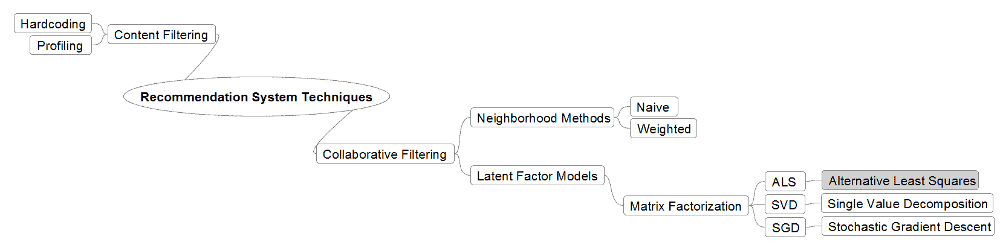
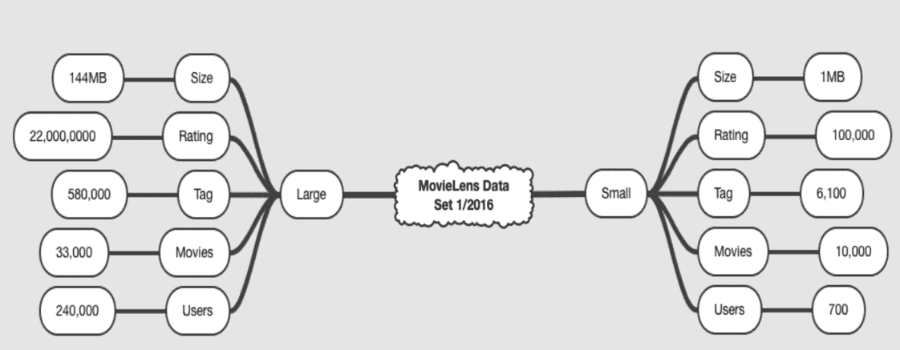
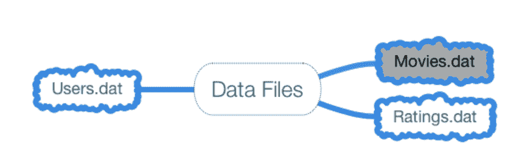
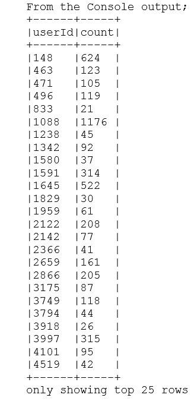
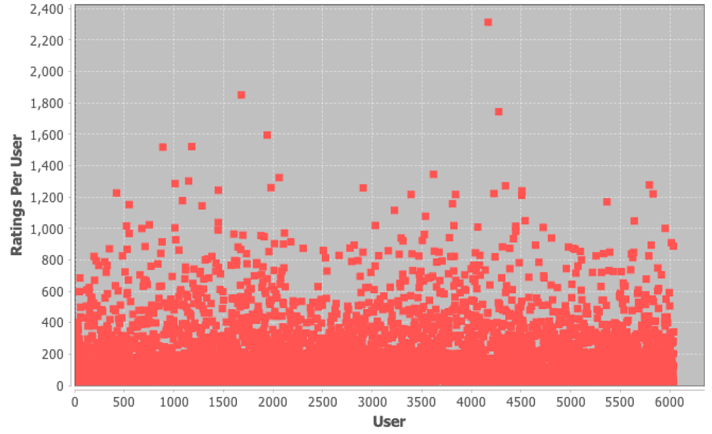
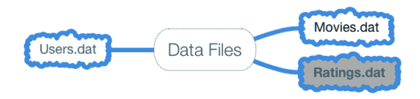
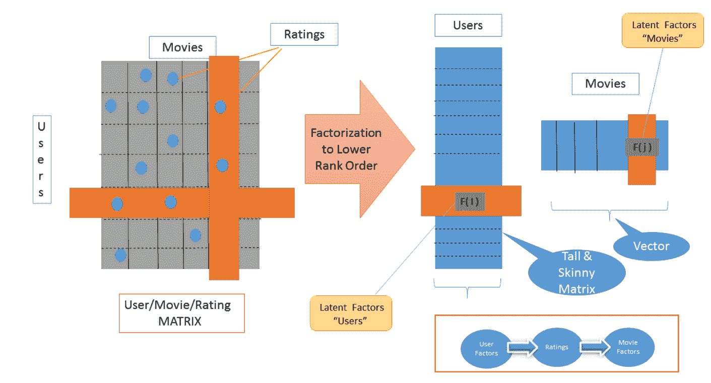
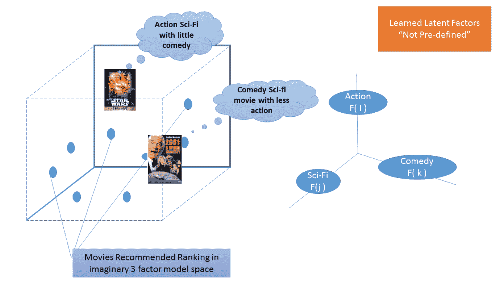
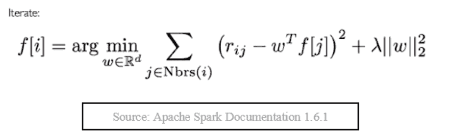

# 第十三章：使用 Spark 实现可扩展的推荐引擎

在本章中，我们将涵盖：

+   为 Spark 2.0 中的可扩展推荐引擎准备所需数据

+   探索 Spark 2.0 中推荐系统的电影数据细节

+   探索 Spark 2.0 中推荐系统的评分数据细节

+   构建可扩展的推荐引擎：使用 Spark 2.0 中的协同过滤

# 引言

在前几章中，我们使用简短的方法和极其简化的代码来演示 Spark 机器学习库的基本构建块和概念。在本章中，我们展示了一个更成熟的应用，它使用 Spark 的 API 和功能来解决特定的机器学习库领域。本章中的方法较少；然而，我们进入了一个更 ML 应用设置。

在本章中，我们将探讨推荐系统及其使用称为**交替最小二乘**（**ALS**）的潜在因子模型矩阵分解技术的实现。简而言之，当我们尝试将用户-物品评分的大矩阵分解为两个低秩、更瘦的矩阵时，我们通常会面临一个非常难以解决的非线性或非凸优化问题。我们非常擅长通过固定一个变量并部分解决另一个变量，然后来回切换（因此交替）来解决凸优化问题；我们可以使用已知的优化技术在并行中更好地解决这种分解（从而发现一组潜在因素）。

我们使用一个流行的数据集（电影数据集）来实现推荐引擎，但与其他章节不同，我们使用两个方法来探索数据，并展示如何引入图形元素，如流行的 JFreeChart 库到您的 Spark 机器学习工具包。

下图展示了本章中概念和方法的流程，以演示一个 ALS 推荐应用：


推荐引擎已经存在很长时间，并在 20 世纪 90 年代早期的电子商务系统中使用，从硬编码的产品关联到基于用户画像的内容推荐。现代系统使用**协同过滤**（**CF**）来解决早期系统的不足，并解决在现代商业系统（如亚马逊、Netflix、eBay、新闻等）中竞争所需的规模和延迟（例如，最大 100 毫秒及以下）。

现代系统采用基于历史互动和记录（页面浏览、购买、评分等）的 CF。这些系统解决了两个主要问题，即规模化和稀疏性（即我们没有所有电影或歌曲的所有评分）。大多数系统采用基于交替最小二乘法与加权 Lambda 正则化的变体，这些可以在大多数主要平台上并行化（例如，Spark）。尽管如此，为商业目的实施的实用系统会采用多种增强措施来处理偏差（即并非所有电影和用户都是平等的）和时间问题（即用户的选择会变化，物品库存也会变化），这些问题在当今生态系统中普遍存在。在开发智能且领先的电子商务系统时，构建一个有竞争力的推荐器并非纯粹主义方法，而是一种实用方法，它采用多种技术，至少利用所有三种技术（协同过滤、基于内容的过滤和相似性）来构建亲和矩阵/热图。

鼓励读者查阅有关推荐系统冷启动问题的白皮书和资料。

为了设定背景，下图提供了一个构建推荐系统可用方法的高级分类。我们简要讨论了每种系统的优缺点，但重点是 Spark 中可用的矩阵分解（潜在因子模型）。

尽管**单值分解**（**SVD**）和**交替最小二乘法**（**ALS**）都可用，但由于 SVD 在处理缺失数据等方面的不足，我们专注于使用 MovieLens 数据的 ALS 实现。



以下部分将解释当前使用的推荐引擎技术。

# 内容过滤

内容过滤是推荐引擎的原始技术之一，它依赖用户档案来提供推荐。这种方法主要依赖于用户（类型、人口统计、收入、地理位置、邮政编码）和库存（产品、电影或歌曲的特性）的预先设定档案来推断属性，然后可以进行过滤和处理。主要问题在于，预先获取的知识往往不完整且成本高昂。这项技术已有十多年历史，至今仍在使用。

# 协同过滤

协同过滤是现代推荐系统的核心，它依赖于生态系统中的用户互动而非档案来提供推荐。

该技术依赖于用户过去的行为和产品评分，并不假设任何预先存在的知识。简而言之，用户对库存项目进行评分，并假设客户口味在一段时间内将保持相对稳定，这可以用来提供推荐。话虽如此，一个智能系统将根据任何可用上下文（例如，用户是来自中国的女性）来增强和重新排序推荐。

这类技术的主要问题是冷启动，但其不受领域限制、更高的准确性和易于扩展的优势，使其在大数据时代成为赢家。

# 邻域方法

这项技术主要以**加权局部邻域**的形式实现。其核心是一种相似性技术，严重依赖于对物品和用户的假设。尽管该技术易于理解和实施，但算法在可扩展性和准确性方面存在缺陷。

# 潜在因子模型技术

该技术试图通过推断一组次级潜在因素来解释用户对库存项目（例如，亚马逊上的产品）的评分，这些潜在因素是从评分中推断出来的。其优势在于，你无需事先了解这些因素（类似于 PCA 技术），而是直接从评分本身推断出来。我们采用矩阵分解技术来推导这些潜在因素，这些技术因其极高的可扩展性、预测准确性和灵活性（允许偏差和用户及库存的时间特性）而广受欢迎。

+   **奇异值分解**（**SVD**）：SVD 自 Spark 早期就已可用，但我们建议不要将其作为核心技术，因为其在处理现实数据稀疏性（例如，用户通常不会对所有内容进行评分）、过拟合和排序（我们真的需要生成最底部的 1000 条推荐吗？）方面存在问题。

+   **随机梯度下降**（**SGD**）：SGD 易于实现，且由于其逐个电影和逐个用户/物品向量的处理方式（选择一部电影并针对该用户微调其配置文件，而非批量处理），运行速度更快。我们可以根据需要使用 Spark 中的矩阵设施和 SGD 来实现这一点。

+   **交替最小二乘法**（**ALS**）：在开始这段旅程之前，请先了解 ALS。Spark 中的 ALS 从一开始就能利用并行化。与普遍认为 Spark 使用半因子分解相反，Spark 实际上在内部实现了完整的矩阵分解。我们鼓励读者参考源代码自行验证。Spark 提供了针对**显式**（有评分）和**隐式**（需要间接推断，例如，播放曲目的时长而非评分）的 API。我们在食谱中通过引入数学和直觉来讨论偏差和时间问题，以阐明我们的观点。

# 为 Spark 2.0 中的可扩展推荐引擎设置所需数据

在本节中，我们探讨下载 MovieLens 公共数据集并初步探索数据。我们将使用基于 MovieLens 数据集中客户评级的显式数据。MovieLens 数据集包含来自 6,000 名用户的 4,000 部电影的 1,000,000 个评分。

你需要以下命令行工具之一来检索指定数据：`curl`（Mac 推荐）或`wget`（Windows 或 Linux 推荐）。

# 如何操作...

1.  你可以通过以下任一命令开始下载数据集：

```scala
wget http://files.grouplens.org/datasets/movielens/ml-1m.zip
```

你也可以使用以下命令：

```scala
curl http://files.grouplens.org/datasets/movielens/ml-1m.zip -o ml-1m.zip
```

1.  现在你需要解压 ZIP 文件：

```scala
unzip ml-1m.zip
creating: ml-1m/
inflating: ml-1m/movies.dat
inflating: ml-1m/ratings.dat
inflating: ml-1m/README
inflating: ml-1m/users.dat
```

该命令将创建一个名为`ml-1m`的目录，其中包含解压后的数据文件。

1.  切换到`m1-1m`目录：

```scala
cd m1-1m
```

1.  现在我们通过验证`movies.dat`中的数据格式开始数据探索的第一步：

```scala
head -5 movies.dat
1::Toy Story (1995)::Animation|Children's|Comedy
2::Jumanji (1995)::Adventure|Children's|Fantasy
3::Grumpier Old Men (1995)::Comedy|Romance
4::Waiting to Exhale (1995)::Comedy|Drama
5::Father of the Bride Part II (1995)::Comedy
```

1.  现在我们来看看评分数据的格式：

```scala
head -5 ratings.dat
1::1193::5::978300760
1::661::3::978302109
1::914::3::978301968
1::3408::4::978300275
1::2355::5::978824291
```

# 工作原理...

MovieLens 数据集是原始 Netflix KDD 杯数据集的绝佳替代品。此数据集有多个版本，从小型（100 K 数据集）到大型（1 M 和 20 M 数据集）。对于那些希望调整源代码以添加自己的增强功能（例如，更改正则化技术）的用户，数据集的范围使其易于研究缩放效果并查看执行者每秒 Spark 利用率与数据从 100 K 到 20 M 的性能曲线。

下载 URL 为[`grouplens.org/datasets/movielens/`](http://grouplens.org/datasets/movielens/)。

# 还有更多...

仔细查看我们下载数据的位置，因为更多数据集可在[`files.grouplens.org/datasets/`](http://files.grouplens.org/datasets/)上使用。

下图展示了数据的规模和范围。本章我们使用小数据集，以便在资源有限的小型笔记本电脑上轻松运行。



来源：MovieLens

# 另请参阅

请阅读解压数据后所在目录中的 README 文件。README 文件包含有关数据文件格式和数据描述的信息。

还有一个 MovieLens 基因组标签集可供参考。

+   计算的标签-电影 1100 万

+   从 1,100 个标签池中得出的相关性评分

+   应用于 10,000 部电影

对于那些有兴趣探索原始 Netflix 数据集的人，请参阅[`academictorrents.com/details/9b13183dc4d60676b773c9e2cd6de5e5542cee9a`](http://academictorrents.com/details/9b13183dc4d60676b773c9e2cd6de5e5542cee9a)的 URL。

# 在 Spark 2.0 中为推荐系统探索电影数据详情

在本教程中，我们将开始通过将数据解析到 Scala `case`类中并生成一个简单指标来探索电影数据文件。关键在于获取对数据的了解，以便在后续阶段，如果出现模糊的结果，我们将有一些见解来做出关于我们结果正确性的明智结论。

这是探索电影数据集的两个教程中的第一个。数据探索是统计分析和机器学习的重要第一步。

快速理解数据的最佳方法之一是生成其数据可视化，我们将使用 JFreeChart 来实现这一点。确保您对数据感到舒适并直接了解每个文件中的内容以及它试图讲述的故事非常重要。

在我们做任何其他事情之前，我们必须始终探索、理解和可视化数据。大多数 ML 和其他系统的性能和失误都可以追溯到对数据布局及其随时间变化的社会缺乏了解。如果我们在本教程的第 14 步中查看给出的图表，我们立即意识到电影在年份上的分布不均匀，而是具有高偏度的。虽然我们不会在这本书中探讨这个属性以进行优化和采样，但它强调了电影数据性质的重要观点。

# 如何实现它...

1.  在 IntelliJ 或您选择的 IDE 中启动一个新项目。确保包含必要的 JAR 文件。

1.  JFreeChart JAR 可以从[`sourceforge.net/projects/jfreechart/files/`](https://sourceforge.net/projects/jfreechart/files/)网站下载。

1.  请确保 JFreeChart 库及其依赖项（JCommon）位于本章的类路径上。

1.  我们为 Scala 程序定义包信息：

```scala
package spark.ml.cookbook.chapter7
```

1.  导入必要的包：

```scala
import java.text.DecimalFormat import org.apache.log4j.{Level, Logger} import org.apache.spark.sql.SparkSession import org.jfree.chart.{ChartFactory, ChartFrame, JFreeChart} import org.jfree.chart.axis.NumberAxis import org.jfree.chart.plot.PlotOrientation import org.jfree.data.xy.{XYSeries, ...
```

# 它是如何工作的...

当程序开始执行时，我们在驱动程序中初始化了一个 SparkContext，以启动处理数据任务。这意味着数据必须适合驱动程序的内存（用户的工作站），在这种情况下这不是服务器的要求。必须设计其他分治方法来处理极端数据集（部分检索和目的地组装）。

我们继续通过将数据文件加载并解析到具有电影数据类型的数据集中。然后，电影数据集按年份分组，产生一个按年份键入的电影地图，并附有相关电影的存储桶。



接下来，我们提取特定年份及其相关电影数量的计数，以生成我们的直方图。然后，我们收集数据，导致整个结果数据集合在驱动程序上具体化，并将其传递给 JFreeChart 以构建数据可视化。

# 还有更多...

由于 Spark SQL 的灵活性，你需要了解我们对它的使用。更多信息可访问[`spark.apache.org/docs/latest/sql-programming-guide.html#running-sql-queries-programmatically`](http://spark.apache.org/docs/latest/sql-programming-guide.html#running-sql-queries-programmatically)。

# 另请参阅

更多关于使用 JFreeChart 的信息，请参考 JFreeChart API 文档[`www.jfree.org/jfreechart/api.html`](http://www.jfree.org/jfreechart/api.html)。

你可以在[`www.tutorialspoint.com/jfreechart/`](http://www.tutorialspoint.com/jfreechart/)链接找到关于 JFreeChart 的优质教程。

JFreeChart 本身的链接是[`www.jfree.org/index.html`](http://www.jfree.org/index.html)。

# 探索 Spark 2.0 中推荐系统的评分数据细节

在本食谱中，我们从用户/评分的角度探索数据，以了解我们数据文件的性质和属性。我们将开始通过将数据解析为 Scala case class 并生成可视化来探索评分数据文件以获取洞察。评分数据稍后将用于为我们的推荐引擎生成特征。我们再次强调，任何数据科学/机器学习实践的第一步都应该是数据的可视化和探索。

再次强调，快速理解数据的最佳方式是生成其数据可视化，我们将使用 JFreeChart 散点图来实现这一点。快速查看图表...

# 如何做到这一点...

1.  在 IntelliJ 或你选择的 IDE 中启动一个新项目。确保包含必要的 JAR 文件。

1.  我们为 Scala 程序定义包信息：

```scala
package spark.ml.cookbook.chapter7
```

1.  导入必要的包：

```scala
import java.text.DecimalFormat
 import org.apache.log4j.{Level, Logger}
 import org.apache.spark.sql.SparkSession
 import org.jfree.chart.{ChartFactory, ChartFrame, JFreeChart}
 import org.jfree.chart.axis.NumberAxis
 import org.jfree.chart.plot.PlotOrientation
 import org.jfree.data.xy.{XYSeries, XYSeriesCollection}
```

1.  我们现在定义一个 Scala `case class`来模拟评分数据：

```scala
case class Rating(userId: Int, movieId: Int, rating: Float, timestamp: Long)
```

1.  让我们定义一个在窗口中显示 JFreeChart 的函数：

```scala
def show(chart: JFreeChart) {
 val frame = new ChartFrame("plot", chart)
 frame.pack()
 frame.setVisible(true)
 }
```

1.  在这一步中，我们定义了一个函数，用于将`ratings.dat`文件中的一行数据解析为评分`case class`：

```scala
def parseRating(str: String): Rating = {
 val columns = str.split("::")
 assert(columns.size == 4)
 Rating(columns(0).toInt, columns(1).toInt, columns(2).toFloat, columns(3).toLong)
 }
```

1.  我们准备好开始构建我们的`main`函数，所以让我们从`ratings.dat`文件的位置开始：

```scala
val ratingsFile = "../data/sparkml2/chapter7/ratings.dat"
```

1.  创建 Spark 的配置，SparkSession。在本例中，我们首次展示了如何在小笔记本上设置 Spark executor 内存（例如，2GB）。如果你想使用大型数据集（144MB 的数据集），你必须增加这个分配：

```scala
val spark = SparkSession
 .*builder* .master("local[*]")
 .appName("MovieRating App")
 .config("spark.sql.warehouse.dir", ".")
 .config("spark.executor.memory", "2g")
 .getOrCreate()
```

1.  日志消息的交错导致输出难以阅读；因此，将日志级别设置为`ERROR`：

```scala
Logger.getLogger("org").setLevel(Level.ERROR)
```

1.  从数据文件创建所有评分的数据集：

```scala
import spark.implicits._
 val ratings = spark.read.textFile(ratingsFile).map(*parseRating*)
```

1.  现在我们将评分数据集转换为内存表视图，我们可以在其中执行 Spark SQL 查询：

```scala
ratings.createOrReplaceTempView("ratings")
```

1.  我们现在生成一个按用户分组的所有用户评分的列表，以及他们的总数：

```scala
val resultDF = spark.sql("select ratings.userId, count(*) as count from ratings group by ratings.userId")
resultDF.show(25, false);
```

从控制台输出：



1.  展示每个用户的评分散点图。我们选择散点图以展示与前一节不同的数据查看方式。鼓励读者探索标准化技术（例如移除均值）或波动性变化机制（例如 GARCH），以探索此数据集的自回归条件异方差特性（这超出了本书的范围）。建议读者查阅任何高级时间序列书籍，以理解时间序列的时间变化。

```scala
val scatterPlotDataset = new XYSeriesCollection()
 val xy = new XYSeries("")

 resultDF.collect().foreach({r => xy.add( r.getAsInteger, r.getAsInteger) })

 scatterPlotDataset.addSeries(xy)

 val chart = ChartFactory.*createScatterPlot*(
 "", "User", "Ratings Per User", scatterPlotDataset, PlotOrientation.*VERTICAL*, false, false, false)
 val chartPlot = chart.getXYPlot()

 val xAxis = chartPlot.getDomainAxis().asInstanceOf[NumberAxis]
 xAxis.setNumberFormatOverride(new DecimalFormat("####"))
```

1.  显示图表：

```scala
*show*(chart)
```



1.  我们通过停止 Spark 会话来关闭程序：

```scala
spark.stop()
```

# 其工作原理...

我们首先将数据文件加载并解析为具有评分数据类型的数据集，最终将其转换为 DataFrame。然后，使用 DataFrame 执行 Spark SQL 查询，该查询按用户及其总数对所有评分进行分组。

全面理解 API 及其概念（延迟实例化、阶段划分、流水线和缓存）对每位 Spark 开发者至关重要。



最后，我们将数据集的结果传递给 JFreeChart 散点图组件以显示我们的图表。

# 还有更多...

Spark DataFrame 是一个分布式数据集合，按命名列组织。所有 DataFrame 操作也会自动在集群上并行化和分布。此外，DataFrames 像 RDD 一样是惰性评估的。

# 参见

DataFrame 的文档可在[`spark.apache.org/docs/latest/sql-programming-guide.html`](http://spark.apache.org/docs/latest/sql-programming-guide.html)找到。

关于 JFreeChart 的优秀教程可在[`www.tutorialspoint.com/jfreechart/`](http://www.tutorialspoint.com/jfreechart/)链接中找到。

JFreeChart 可从[`www.jfree.org/index.html`](http://www.jfree.org/index.html)网址下载。

# 使用 Spark 2.0 中的协同过滤构建可扩展的推荐引擎

本节中，我们将演示一个利用协同过滤技术的推荐系统。协同过滤的核心在于分析用户之间的关系以及库存（例如电影、书籍、新闻文章或歌曲）之间的依赖性，基于一组称为**潜在因素**的次要因素（例如女性/男性、快乐/悲伤、活跃/被动）来识别用户与物品之间的关系。关键在于，您无需预先了解这些潜在因素。

推荐将通过 ALS 算法生成，这是一种协同过滤技术。从高层次上看，协同过滤涉及基于收集的先前已知偏好以及许多其他用户的偏好，对用户可能感兴趣的内容进行预测。我们将使用 MovieLens 数据集中的评分数据，并将其转换为推荐算法的输入特征。

# 如何操作...

1.  在 IntelliJ 或您选择的 IDE 中启动一个新项目。确保包含必要的 JAR 文件。

1.  我们为 Scala 程序定义包信息：

```scala
package spark.ml.cookbook.chapter7
```

1.  导入必要的包：

```scala
import org.apache.log4j.{Level, Logger} import org.apache.spark.sql.SparkSession import org.apache.spark.ml.recommendation.ALS
```

1.  我们现在定义两个 Scala case 类，以模拟电影和评分数据：

```scala
case class Movie(movieId: Int, title: String, year: Int, genre: Seq[String]) case class FullRating(userId: Int, movieId: Int, rating: Float, timestamp: Long)
```

1.  在此步骤中，我们定义函数，用于将`ratings.dat`文件中的一行数据解析为评分`case class`，以及用于解析...

# 它是如何工作的...

由于程序的复杂性，我们首先提供概念性解释，然后逐步详细说明程序内容。

下图描绘了 ALS 的概念视图及其如何将用户/电影/评分矩阵分解为低阶的瘦长矩阵和潜在因子向量：f(用户)和 f(电影)。



另一种思考方式是，这些因子可用于将电影置于*n*维空间中，该空间将与给定用户的推荐相匹配。始终希望将机器学习视为在维度变量空间中的搜索查询。需要记住的是，潜在因子（学习的几何空间）并非预先定义，其数量可以从 10 到 100 或 1000 不等，具体取决于所搜索或分解的内容。因此，我们的推荐可以看作是在 n 维空间内放置概率质量。下图提供了一个可能的双因子模型（二维）的极其简化的视图，以阐明这一点：



尽管 ALS 的实现可能因系统而异，但其核心是一种迭代的全因子分解方法（在 Spark 中），带有加权正则化。Spark 的文档和教程提供了对该算法实际数学和性质的洞察。它将算法描述如下：



理解这个公式/算法的最佳方式是将其视为一个迭代装置，试图通过交替输入（即，固定一个输入，然后近似/优化另一个——如此往复）来发现潜在因子，同时试图最小化与加权 lambda 正则化惩罚相关的最小二乘误差（MSE）。下一节将提供更详细的解释。

程序流程如下：

+   示例首先从 MovieLens 数据集中加载评分和电影数据。加载的数据随后被转换为 Scala case 类以便进一步处理。接下来，将评分数据划分为训练集和测试集。训练集数据用于训练机器学习算法。训练是机器学习中用于构建模型以便提供所需结果的过程。测试数据将用于最终步骤中验证结果。

+   虚构用户，即用户 ID 零，通过配置一个未包含在原始数据集中的单一用户，帮助通过即时创建包含随机信息的数据显示结果，并最终将其附加到训练集中。通过将包含用户 ID、电影 ID 和评分的训练集数据传递给 ALS 算法来调用它，随后从 Spark 中产生一个矩阵分解模型。为测试数据集和用户 ID 零生成预测。

+   最终结果通过结合评分信息与电影数据展示，以便结果能被理解并在原始评分旁显示估计评分。最后一步是计算生成评分的均方根误差，该评分包含在测试数据集中。RMSE 将告诉我们训练模型的准确性。

# 还有更多...

尽管 ALS 本质上是一个带有正则化惩罚的简单线性代数运算，但人们常常难以掌握。ALS 的强大之处在于其能够并行化处理以及应对规模（例如 Spotify）。

ALS 用通俗语言来说涉及以下内容：

+   使用 ALS，你基本上想要将一个大型评分矩阵 X（拥有超过 1 亿用户并非夸张）和用户产品评分分解为两个低秩矩阵 A 和 B（参见任何入门线性代数书籍）。问题在于，这通常成为一个非常难以解决的非线性优化问题。为了解决这个问题，ALS 引入了一个简单方案（**交替**），其中你固定一个矩阵并部分...

# 另请参见

Spark 2.0 ML 文档以探索 ALS API：

+   [`spark.apache.org/docs/latest/mllib-collaborative-filtering.html`](https://spark.apache.org/docs/latest/mllib-collaborative-filtering.html)

+   [`spark.apache.org/docs/latest/api/scala/index.html#org.apache.spark.ml.recommendation.ALS`](https://spark.apache.org/docs/latest/api/scala/index.html#org.apache.spark.ml.recommendation.ALS)

+   [`spark.apache.org/docs/latest/api/scala/index.html#org.apache.spark.ml.recommendation.ALSModel`](https://spark.apache.org/docs/latest/api/scala/index.html#org.apache.spark.ml.recommendation.ALSModel)

Spark 2.0 MLlib 文档可于[`spark.apache.org/docs/latest/api/scala/index.html#org.apache.spark.mllib.recommendation.ALS`](https://spark.apache.org/docs/latest/api/scala/index.html#org.apache.spark.mllib.recommendation.ALS)获取。

ALS 参数及其默认构造，以默认参数创建 ALS 实例如下：

```scala
{numBlocks: -1, rank: 10, iterations: 10, lambda: 0.
numBlocks: -1,
rank: 10,
iterations: 10,
lambda: 0.01,
implicitPrefs: false,
alpha: 1.0
```

# 处理训练中的隐式输入

有时实际观察（评分）数据不可得，此时需处理隐含反馈参数。这可能简单到记录用户在互动期间听取了哪个音轨，或是观看了多久的电影，亦或是上下文（预先索引）以及导致切换的原因（如 Netflix 电影在开头、中间或特定场景附近被放弃观看）。第三个示例中通过使用`ALS.train()`处理了显式反馈。

针对隐式数据，Spark ML 库提供了另一种方法`ALS.trainImplicit()`，该方法有四个超参数来控制算法。若你对测试此方法感兴趣（它与显式反馈非常相似...
