# 第十四章：使用 Apache Spark 2.0 进行无监督聚类

在本章中，我们将涵盖：

+   在 Spark 2.0 中构建 KMeans 分类系统

+   在 Spark 2.0 中，二分 KMeans 作为新星登场

+   在 Spark 2.0 中使用高斯混合模型和期望最大化（EM）算法进行数据分类

+   在 Spark 2.0 中使用幂迭代聚类（PIC）对图的顶点进行分类

+   使用潜在狄利克雷分配（LDA）将文档和文本分类为主题

+   使用流式 KMeans 在接近实时的情况下对数据进行分类

# 引言

无监督机器学习是一种学习技术，我们试图直接或间接（通过潜在因素）从一组未标记的观察中得出推断。简而言之，我们试图在未对训练数据进行初始标记的情况下，从一组数据中发现隐藏的知识或结构。

尽管大多数机器学习库的实现在大数据集上应用时会崩溃（迭代、多次遍历、大量中间写入），但 Apache Spark 机器学习库通过提供为并行性和极大数据集设计的算法，并默认使用内存进行中间写入，从而取得了成功。

在最抽象的层面上，我们可以将无监督学习视为：

# 在 Spark 2.0 中构建 KMeans 分类系统

在本教程中，我们将使用 LIBSVM 文件加载一组特征（例如，x，y，z 坐标），然后使用`KMeans()`实例化一个对象。接着，我们将设置期望的簇数为三个，并使用`kmeans.fit()`执行算法。最后，我们将打印出我们找到的三个簇的中心。

值得注意的是，Spark*并未*实现 KMeans++，这与流行文献相反，而是实现了 KMeans ||（发音为 KMeans Parallel）。请参阅以下教程以及代码之后的部分，以获得对 Spark 中实现的算法的完整解释。

# 如何操作...

1.  在 IntelliJ 或您选择的 IDE 中启动一个新项目。确保包含必要的 JAR 文件。

1.  设置程序将驻留的包位置：

```scala
package spark.ml.cookbook.chapter8
```

1.  为了获取集群访问权限并使用`Log4j.Logger`减少 Spark 产生的输出量，需要导入必要的 Spark 上下文包：

```scala
import org.apache.log4j.{Level, Logger}import org.apache.spark.ml.clustering.KMeansimport org.apache.spark.sql.SparkSession
```

1.  将输出级别设置为`ERROR`以减少 Spark 的日志输出：

```scala
Logger.getLogger("org").setLevel(Level.ERROR)
```

1.  创建 Spark 的 Session 对象：

```scala
val spark = SparkSession .builder.master("local[*]") .appName("myKMeansCluster") .config("spark.sql.warehouse.dir" ...
```

# 工作原理...

我们读取了一个 LIBSVM 文件，其中包含一组坐标（可以解释为三个数字的元组），然后创建了一个 `KMean()` 对象，但将默认簇数从 2（开箱即用）更改为 3，以便演示。我们使用 `.fit()` 创建模型，然后使用 `model.summary.predictions.show()` 显示哪个元组属于哪个簇。在最后一步中，我们打印了成本和三个簇的中心。从概念上讲，可以将其视为拥有一组 3D 坐标数据，然后使用 KMeans 算法将每个单独的坐标分配给三个簇之一。

KMeans 是一种无监督机器学习算法，其根源在于信号处理（矢量量化）和压缩（将相似的物品矢量分组以实现更高的压缩率）。一般来说，KMeans 算法试图将一系列观察值 {X[1,] X[2], .... , X[n]} 分组到一系列簇 {C[1,] C[2 .....] C[n]} 中，使用一种距离度量（局部优化），该度量以迭代方式进行优化。

目前使用的 KMeans 算法主要有三种类型。在一项简单的调查中，我们发现了 12 种 KMeans 算法的专门变体。值得注意的是，Spark 实现了一个名为 KMeans ||（KMeans 并行）的版本，而不是文献或视频中提到的 KMeans++ 或标准 KMeans。

下图简要描绘了 KMeans 算法：

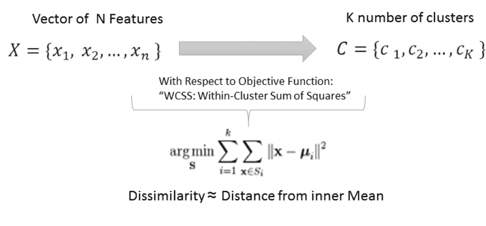

来源：Spark 文档

# KMeans（Lloyd 算法）

基本 KMeans 实现（Lloyd 算法）的步骤如下：

1.  从观察结果中随机选择 K 个数据中心作为初始中心。

1.  持续迭代直至满足收敛条件：

    +   测量一个点到每个中心的距离

    +   将每个数据点包含在与其最接近的中心对应的簇中

    +   根据距离公式（作为不相似性的代理）计算新的簇中心

    +   使用新的中心点更新算法

下图描绘了三代算法：

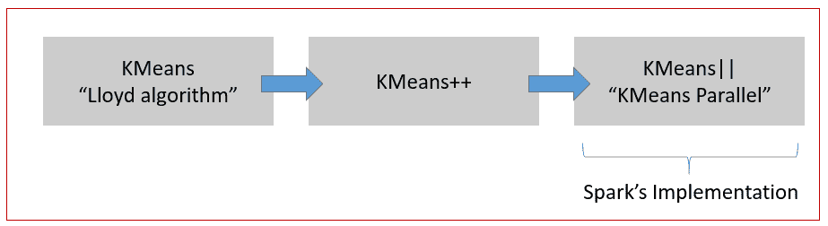

# KMeans++（亚瑟算法）

对标准 KMeans 的下一个改进是 David Arthur 和 Sergei Vassilvitskii 于 2007 年提出的 KMeans++。亚瑟算法通过在种子过程（初始步骤）中更加挑剔来改进初始的 Lloyd 的 KMeans。

KMeans++并非随机选择初始中心（随机质心），而是随机选取第一个质心，然后逐个选取数据点并计算`D(x)`。接着，它随机选择另一个数据点，并使用比例概率分布`D(x)2`，重复最后两个步骤，直到选出所有*K*个数。初始播种完成后，我们最终运行 KMeans 或其变体，使用新播种的质心。KMeans++算法保证在*Omega= O(log k)*复杂度内找到解决方案。尽管初始播种步骤较多，但准确性提升显著。

# KMeans||（发音为 KMeans Parallel）

KMeans || 经过优化，可并行运行，相较于 Lloyd 的原始算法，性能提升可达一到两个数量级。KMeans++的局限性在于它需要对数据集进行 K 次遍历，这在大规模或极端数据集上运行 KMeans 时会严重限制其性能和实用性。Spark 的 KMeans||并行实现运行更快，因为它通过采样 m 个点并在过程中进行过采样，减少了数据遍历次数（大幅减少）。

算法的核心及数学原理在下图中展示：

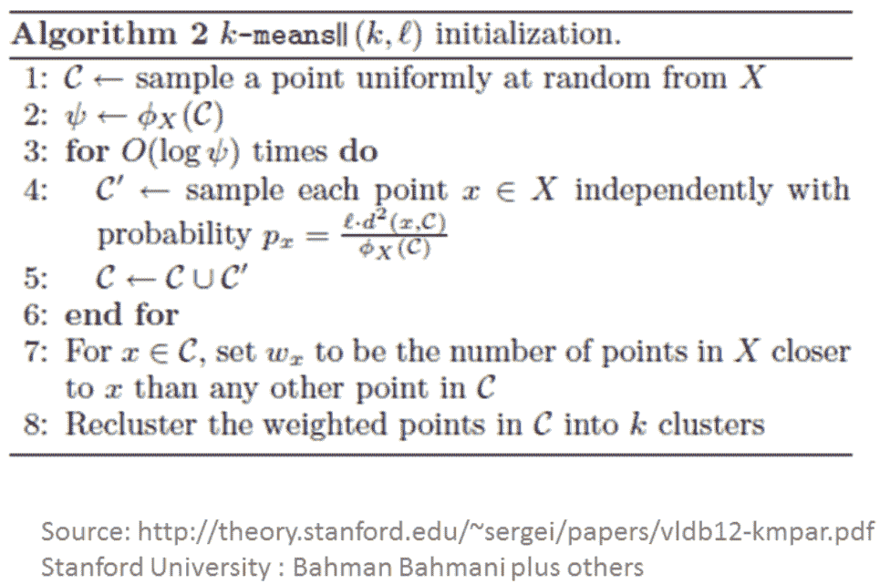

简而言之，KMeans ||（并行...）的亮点在于...

# 还有更多...

在 Spark 中还有一个流式 KMeans 实现，允许您实时对特征进行分类。

还有一个类帮助您生成 KMeans 的 RDD 数据。我们在应用程序开发过程中发现这非常有用：

```scala
def generateKMeansRDD(sc: SparkContext, numPoints: Int, k: Int, d: Int, r: Double, numPartitions: Int = 2): RDD[Array[Double]] 
```

此调用使用 Spark 上下文创建 RDD，同时允许您指定点数、簇数、维度和分区数。

一个相关的实用 API 是：`generateKMeansRDD()`。关于`generateKMeansRDD`的文档可以在[`spark.apache.org/docs/latest/api/scala/index.html#org.apache.spark.mllib.util.KMeansDataGenerator$`](http://spark.apache.org/docs/latest/api/scala/index.html#org.apache.spark.mllib.util.KMeansDataGenerator%24)找到，用于生成供 KMeans 使用的测试数据 RDD。

# 另请参阅

我们需要两个对象来编写、测量和操作 Spark 中 KMeans ||算法的参数。这两个对象的详细信息可以在以下网站找到：

+   `KMeans()`：[`spark.apache.org/docs/latest/api/scala/index.html#org.apache.spark.ml.clustering.KMeans`](http://spark.apache.org/docs/latest/api/scala/index.html#org.apache.spark.ml.clustering.KMeans)

+   `KMeansModel()`：[`spark.apache.org/docs/latest/api/scala/index.html#org.apache.spark.ml.clustering.KMeansModel`](http://spark.apache.org/docs/latest/api/scala/index.html#org.apache.spark.ml.clustering.KMeansModel)

# Bisecting KMeans，Spark 2.0 中的新秀

在本节中，我们将下载玻璃数据集，并尝试使用 Bisecting KMeans 算法来识别和标记每种玻璃。Bisecting KMeans 是 K-Mean 算法的层次化版本，在 Spark 中通过`BisectingKMeans()`API 实现。虽然该算法在概念上类似于 KMeans，但在存在层次路径的情况下，它可以为某些用例提供显著的速度优势。

本节中使用的数据集是玻璃识别数据库。对玻璃类型分类的研究源于犯罪学研究。如果玻璃能被正确识别，它可能被视为证据。数据可在台湾大学（NTU）找到，已采用 LIBSVM 格式。

# 如何操作...

1.  我们从以下链接下载了 LIBSVM 格式的预处理数据文件：[`www.csie.ntu.edu.tw/~cjlin/libsvmtools/datasets/multiclass/glass.scale`](https://www.csie.ntu.edu.tw/~cjlin/libsvmtools/datasets/multiclass/glass.scale)

该数据集包含 11 个特征和 214 行数据。

1.  原始数据集及数据字典亦可在 UCI 网站上获取：[`archive.ics.uci.edu/ml/datasets/Glass+Identification`](http://archive.ics.uci.edu/ml/datasets/Glass+Identification)

    +   ID 号：1 至 214

    +   RI: 折射率

    +   Na: 钠（单位测量：相应氧化物中的重量百分比，属性 4-10 也是如此）

    +   Mg: 镁

    +   Al: 铝

    +   Si: 硅

    +   K: 钾

    +   Ca: 钙

    +   Ba: 钡

    +   Fe: 铁

玻璃类型：我们将使用`BisectingKMeans()`来寻找我们的类别属性或簇：

+   `building_windows_float_processed`

+   `building_windows_non-_float_processed`

+   `vehicle_windows_float_processed`

# 工作原理...

在本节中，我们探讨了 Spark 2.0 中新引入的 Bisecting KMeans 模型。我们利用了玻璃数据集，并尝试使用`BisectingKMeans()`来指定玻璃类型，但将 k 值调整为 6，以便拥有足够的簇。按照惯例，我们使用 Spark 的 libsvm 加载机制将数据加载到数据集中。我们将数据集随机分为 80%和 20%，其中 80%用于训练模型，20%用于测试模型。

我们创建了`BiSectingKmeans()`对象，并使用`fit(x)`函数来构建模型。随后，我们使用`transform(x)`函数对测试数据集进行模型预测，并在控制台输出结果。我们还输出了计算簇的成本（误差平方和），并展示了簇中心。最后，我们打印了特征及其分配的簇编号，并停止操作。

层次聚类的方法包括：

+   **分割型**：自上而下的方法（Apache Spark 实现）

+   **聚合型**：自下而上的方法

# 还有更多...

关于 Bisecting KMeans 的更多信息，请访问：

+   [`spark.apache.org/docs/latest/api/scala/index.html#org.apache.spark.ml.clustering.BisectingKMeans`](http://spark.apache.org/docs/latest/api/scala/index.html#org.apache.spark.ml.clustering.BisectingKMeans)

+   [`spark.apache.org/docs/latest/api/scala/index.html#org.apache.spark.ml.clustering.BisectingKMeansModel`](http://spark.apache.org/docs/latest/api/scala/index.html#org.apache.spark.ml.clustering.BisectingKMeansModel)

我们使用聚类来探索数据，并对聚类结果的外观有所了解。二分 K 均值是层次分析与 K 均值聚类的一个有趣案例。

最佳的理解方式是将二分 K 均值视为递归层次的 K 均值。二分 K 均值算法通过类似 K 均值的相似度测量技术分割数据，但采用层次结构以提高准确性。它在...中尤为普遍...

# 参见

实现层次聚类有两种方法——Spark 采用递归自顶向下的方法，在其中选择一个簇，然后在算法向下移动层次时执行分割：

+   关于层次聚类方法的详细信息可在[`en.wikipedia.org/wiki/Hierarchical_clustering`](https://en.wikipedia.org/wiki/Hierarchical_clustering)找到

+   Spark 2.0 关于二分 K-均值的文档可在[`spark.apache.org/docs/latest/ml-clustering.html#bisecting-k-means`](http://spark.apache.org/docs/latest/ml-clustering.html#bisecting-k-means)找到

+   一篇描述如何使用二分 K 均值对网络日志进行分类的论文可在[`research.ijcaonline.org/volume116/number19/pxc3902799.pdf`](http://research.ijcaonline.org/volume116/number19/pxc3902799.pdf)找到

# 在 Spark 中使用高斯混合和期望最大化（EM）进行数据分类

在本食谱中，我们将探讨 Spark 对**期望最大化**（**EM**）的实现`GaussianMixture()`，它计算给定一组特征输入的最大似然。它假设每个点可以从 K 个子分布（簇成员）中采样的高斯混合。

# 操作方法...

1.  在 IntelliJ 或您选择的 IDE 中启动一个新项目。确保包含必要的 JAR 文件。

1.  设置程序将驻留的包位置：

```scala
package spark.ml.cookbook.chapter8.
```

1.  导入用于向量和矩阵操作的必要包：

```scala
 import org.apache.log4j.{Level, Logger}
 import org.apache.spark.mllib.clustering.GaussianMixture
 import org.apache.spark.mllib.linalg.Vectors
 import org.apache.spark.sql.SparkSession
```

1.  创建 Spark 的会话对象：

```scala
val spark = SparkSession
 .builder.master("local[*]")
 .appName("myGaussianMixture")
 .config("spark.sql.warehouse.dir", ".")
 .getOrCreate()
```

1.  让我们查看数据集并检查输入文件。模拟的 SOCR 膝痛质心位置数据代表了 1000 名受试者假设的膝痛位置的质心位置。数据包括质心的 X 和 Y 坐标。

此数据集可用于说明高斯混合和期望最大化。数据可在[`wiki.stat.ucla.edu/socr/index.php/SOCR_Data_KneePainData_041409`](http://wiki.stat.ucla.edu/socr/index.php/SOCR_Data_KneePainData_041409)获取

样本数据如下所示：

+   **X**：一个受试者和一个视图的质心位置的*x*坐标。

+   **Y**：一个受试者和一个视图的质心位置的*y*坐标。

X, Y

11 73

20 88

19 73

15 65

21 57

26 101

24 117

35 106

37 96

35 147

41 151

42 137

43 127

41 206

47 213

49 238

40 229

下图基于`wiki.stat.ucla`的 SOCR 数据集描绘了一个膝痛地图：

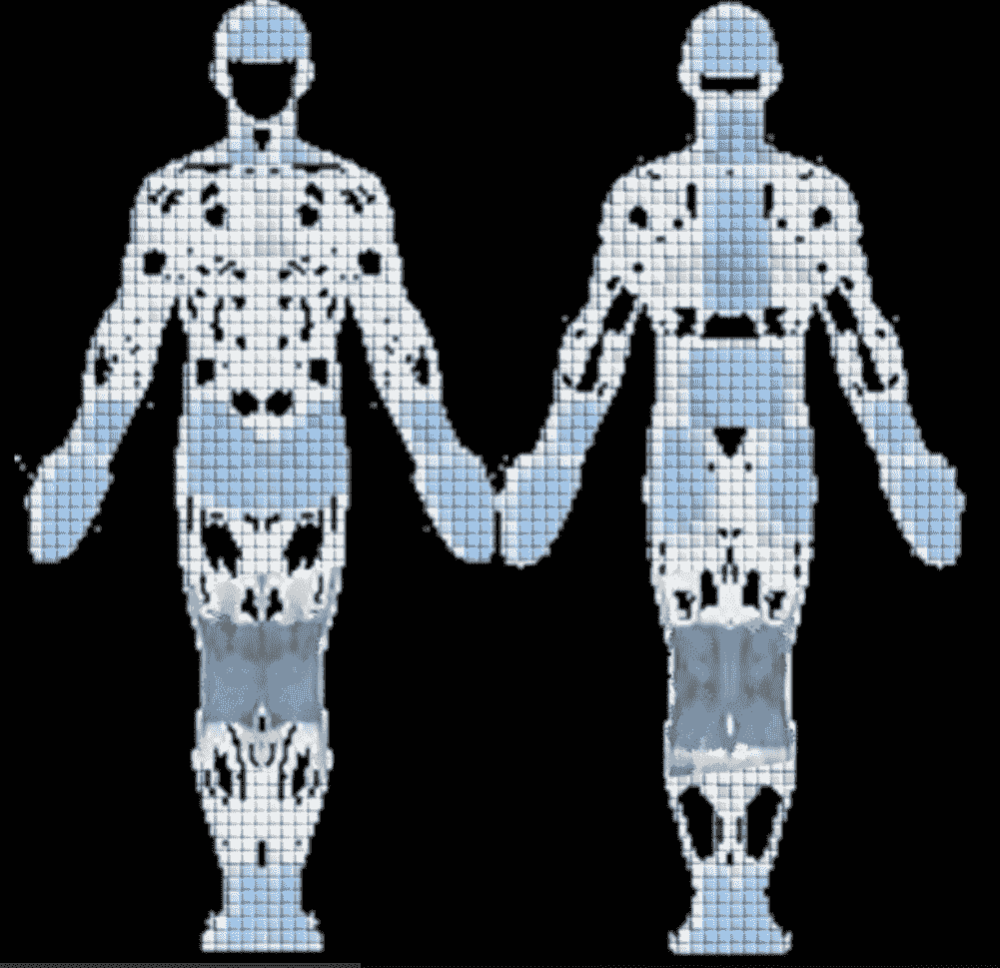

1.  我们将数据文件放置在一个数据目录中（您可以将数据文件复制到您喜欢的任何位置）。

数据文件包含 8,666 条记录：

```scala
val dataFile ="../data/sparkml2/chapter8/socr_data.txt"
```

1.  接着，我们将数据文件加载到 RDD 中：

```scala
val trainingData = spark.sparkContext.textFile(dataFile).map { line =>
 Vectors.dense(line.trim.split(' ').map(_.toDouble))
 }.cache()
```

1.  现在，我们创建一个高斯混合模型并设置模型参数。我们将 K 值设为 4，因为数据是通过四个视角收集的：**左前**（**LF**）、**左后**（**LB**）、**右前**（**RF**）和**右后**（**RB**）。我们将收敛值设为默认值 0.01，最大迭代次数设为 100：

```scala
val myGM = new GaussianMixture()
 .setK(4 ) // default value is 2, LF, LB, RF, RB
 .setConvergenceTol(0.01) // using the default value
 .setMaxIterations(100) // max 100 iteration
```

1.  我们运行模型算法：

```scala
val model = myGM.run(trainingData)
```

1.  训练后，我们打印出高斯混合模型的关键值：

```scala
println("Model ConvergenceTol: "+ myGM.getConvergenceTol)
 println("Model k:"+myGM.getK)
 println("maxIteration:"+myGM.getMaxIterations)

 for (i <- 0 until model.k) {
 println("weight=%f\nmu=%s\nsigma=\n%s\n" format
 (model.weights(i), model.gaussians(i).mu, model.gaussians(i).sigma))
 }
```

1.  由于我们将 K 值设为 4，因此控制台记录器将打印出四组值：

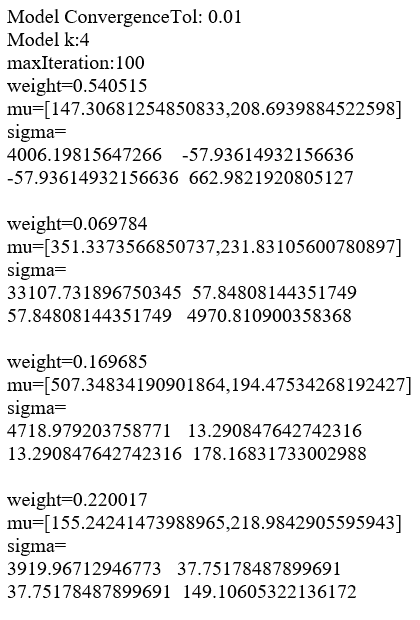

1.  我们还根据高斯混合模型预测打印出前 50 个聚类标签：

```scala
println("Cluster labels (first <= 50):")
 val clusterLabels = model.predict(trainingData)
 clusterLabels.take(50).foreach { x =>
 *print*(" " + x)
 }
```

1.  控制台中的样本输出将显示以下内容：

```scala
Cluster labels (first <= 50):
 1 1 1 1 1 1 1 1 1 0 0 0 0 0 0 0 0 0 0 0 0 0 0 0 0 0 0 0 0 0 0 0 0 0 0 0 0 0 0 0 0 0 0 0 0 0 0 0 0 0
```

1.  然后通过停止 Spark 上下文来关闭程序：

```scala
spark.stop()
```

# 工作原理...

在前一个示例中，我们观察到 KMeans 能够发现并基于迭代方法（如欧几里得距离等）将成员分配到一个且仅一个集群。可以将 KMeans 视为高斯混合模型中 EM 模型的专用版本，其中强制执行离散（硬）成员资格。

但存在重叠情况，这在医学或信号处理中很常见，如下图所示：

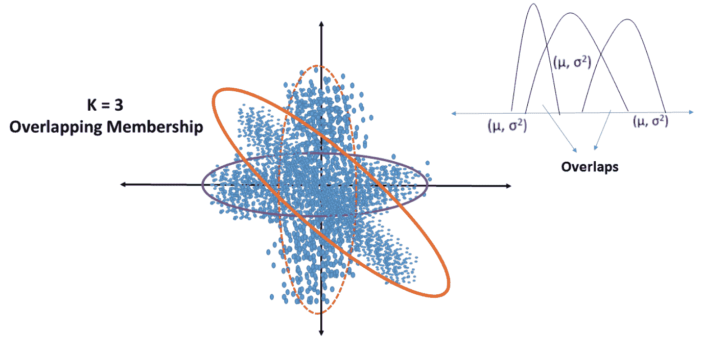

在这种情况下，我们需要一个能够表达每个子分布中成员资格的概率密度函数。采用**期望最大化**算法的高斯混合模型

# 新建 GaussianMixture()

这构建了一个默认实例。控制模型行为的默认参数如下：

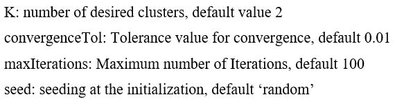

采用期望最大化算法的**高斯混合模型**是一种软聚类形式，其中可以通过对数最大似然函数推断出成员资格。在此情况下，使用具有均值和协方差的概率密度函数来定义属于 K 个集群的成员资格或似然性。其灵活性在于，成员资格未量化，这允许基于概率（索引到多个子分布）的成员资格重叠。

下图是 EM 算法的一个快照：

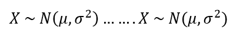

以下是 EM 算法的步骤：

1.  假设有*N*个高斯分布。

1.  迭代直至达到收敛：

    1.  对于每个点 Z，其条件概率为从分布 Xi 中抽取，记作*P(Z | Xi)*

    1.  调整参数的均值和方差，使其适合分配给子分布的点

有关更数学化的解释，包括关于最大似然的详细工作，请参阅以下链接：[`www.ee.iisc.ernet.in/new/people/faculty/prasantg/downloads/GMM_Tutorial_Reynolds.pdf`](http://www.ee.iisc.ernet.in/new/people/faculty/prasantg/downloads/GMM_Tutorial_Reynolds.pdf)

# 还有更多...

下图提供了一个快速参考点，以突出硬聚类与软聚类之间的一些差异：

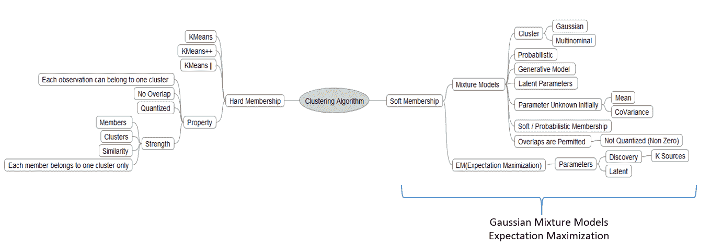

# 另请参阅

+   构造器 GaussianMixture 的文档可在[`spark.apache.org/docs/latest/api/scala/index.html#org.apache.spark.mllib.clustering.GaussianMixture`](http://spark.apache.org/docs/latest/api/scala/index.html#org.apache.spark.mllib.clustering.GaussianMixture)找到

+   构造器 GaussianMixtureModel 的文档可在[`spark.apache.org/docs/latest/api/scala/index.html#org.apache.spark.mllib.clustering.GaussianMixtureModel`](http://spark.apache.org/docs/latest/api/scala/index.html#org.apache.spark.mllib.clustering.GaussianMixtureModel)找到

# 在 Spark 2.0 中使用幂迭代聚类（PIC）对图的顶点进行分类

这是一种基于顶点相似性（由边定义）对图的顶点进行分类的方法。它使用随 Spark 一起提供的 GraphX 库来实现算法。幂迭代聚类类似于其他特征向量/特征值分解算法，但没有矩阵分解的开销。当您有一个大型稀疏矩阵（例如，以稀疏矩阵表示的图）时，它很适用。

未来，GraphFrames 将成为 GraphX 库的替代/接口（[`databricks.com/blog/2016/03/03/introducing-graphframes.html`](https://databricks.com/blog/2016/03/03/introducing-graphframes.html)）。

# 如何操作...

1.  在 IntelliJ 或您选择的 IDE 中启动一个新项目。确保包含必要的 JAR 文件。

1.  设置程序将驻留的包位置：

```scala
package spark.ml.cookbook.chapter8
```

1.  为 Spark 上下文导入必要的包以访问集群，并导入`Log4j.Logger`以减少 Spark 产生的输出量：

```scala
 import org.apache.log4j.{Level, Logger}
 import org.apache.spark.mllib.clustering.PowerIterationClustering
 import org.apache.spark.sql.SparkSession
```

1.  将日志级别设置为 ERROR，仅以减少输出：

```scala
Logger.getLogger("org").setLevel(Level.*ERROR*)
```

1.  创建 Spark 配置和 SQL 上下文，以便我们可以访问集群并能够根据需要创建和使用 DataFrame：

```scala
// setup SparkSession to use for interactions with Sparkval spark = SparkSession
 .builder.master("local[*]")
 .appName("myPowerIterationClustering")
 .config("spark.sql.warehouse.dir", ".")
 .getOrCreate()
```

1.  我们使用 Spark 的`sparkContext.parallelize()`函数创建包含一系列数据集的训练数据集，并创建 Spark RDD：

```scala
val trainingData =spark.sparkContext.parallelize(*List*(
 (0L, 1L, 1.0),
 (0L, 2L, 1.0),
 (0L, 3L, 1.0),
 (1L, 2L, 1.0),
 (1L, 3L, 1.0),
 (2L, 3L, 1.0),
 (3L, 4L, 0.1),
 (4L, 5L, 1.0),
 (4L, 15L, 1.0),
 (5L, 6L, 1.0),
 (6L, 7L, 1.0),
 (7L, 8L, 1.0),
 (8L, 9L, 1.0),
 (9L, 10L, 1.0),
 (10L,11L, 1.0),
 (11L, 12L, 1.0),
 (12L, 13L, 1.0),
 (13L,14L, 1.0),
 (14L,15L, 1.0)
 ))
```

1.  我们创建一个`PowerIterationClustering`对象并设置参数。我们将`K`值设置为`3`，最大迭代次数设置为`15`：

```scala
val pic = new PowerIterationClustering()
 .setK(3)
 .setMaxIterations(15)
```

1.  然后让模型运行：

```scala
val model = pic.run(trainingData)
```

1.  我们根据模型打印出训练数据的集群分配情况：

```scala
model.assignments.foreach { a =>
 println(s"${a.id} -> ${a.cluster}")
 }
```

1.  控制台输出将显示以下信息：

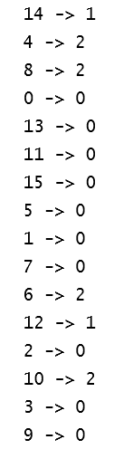

1.  我们还为每个聚类在集合中打印出模型分配数据：

```scala
val clusters = model.assignments.collect().groupBy(_.cluster).mapValues(_.map(_.id))
 val assignments = clusters.toList.sortBy { case (k, v) => v.length }
 val assignmentsStr = assignments
 .map { case (k, v) =>
 s"$k -> ${v.sorted.mkString("[", ",", "]")}" }.mkString(", ")
 val sizesStr = assignments.map {
 _._2.length
 }.sorted.mkString("(", ",", ")")
 println(s"Cluster assignments: $assignmentsStr\ncluster sizes: $sizesStr")
```

1.  控制台输出将显示以下信息（总共，我们在前面的参数中设置了三个聚类）：

```scala
Cluster assignments: 1 -> [12,14], 2 -> [4,6,8,10], 0 -> [0,1,2,3,5,7,9,11,13,15]
 cluster sizes: (2,4,10)
```

1.  然后我们通过停止 Spark 上下文来关闭程序：

```scala
spark.stop()
```

# 其工作原理...

我们创建了一个图的边和顶点列表，然后继续创建对象并设置参数：

```scala
new PowerIterationClustering().setK(3).setMaxIterations(15)
```

下一步是训练数据模型：

```scala
val model = pic.run(trainingData)
```

然后输出聚类以供检查。代码末尾附近的代码使用 Spark 转换运算符在集合中为每个聚类打印出模型分配数据。

**PIC**（**幂迭代聚类**）的核心是一种避免矩阵分解的特征值类算法，它通过生成一个特征值加上一个特征向量来满足*Av* = λ*v*。由于 PIC 避免了矩阵 A 的分解，因此它适用于输入矩阵 A（描述图...

# 还有更多...

如需对主题（幂迭代）进行更详细的数学处理，请参阅卡内基梅隆大学提供的以下白皮书：[`www.cs.cmu.edu/~wcohen/postscript/icml2010-pic-final.pdf`](http://www.cs.cmu.edu/~wcohen/postscript/icml2010-pic-final.pdf)

# 另请参阅

+   构造函数`PowerIterationClustering()`的文档可以在以下位置找到：[`spark.apache.org/docs/latest/api/scala/index.html#org.apache.spark.mllib.clustering.PowerIterationClustering`](http://spark.apache.org/docs/latest/api/scala/index.html#org.apache.spark.mllib.clustering.PowerIterationClustering)

+   构造函数`PowerIterationClusteringModel()`的文档可以在以下位置找到：[`spark.apache.org/docs/latest/api/scala/index.html#org.apache.spark.mllib.clustering.PowerIterationClusteringModel`](http://spark.apache.org/docs/latest/api/scala/index.html#org.apache.spark.mllib.clustering.PowerIterationClusteringModel)

# 使用潜在狄利克雷分配（LDA）对文档和文本进行主题分类

在本食谱中，我们将探讨 Spark 2.0 中的**潜在狄利克雷分配**（**LDA**）算法。本食谱中使用的 LDA 与线性判别分析完全不同。潜在狄利克雷分配和线性判别分析都称为 LDA，但它们是截然不同的技术。在本食谱中，当我们使用 LDA 时，我们指的是潜在狄利克雷分配。关于文本分析的章节也与理解 LDA 相关。

LDA 常用于自然语言处理，试图将大量文档（例如安然欺诈案中的电子邮件）分类为有限数量的主题或主题，以便于理解。LDA 也是根据个人兴趣选择文章的良好候选方法（例如，当你翻页并花时间在特定主题上时），在给定的杂志文章或页面上。

# 如何操作...

1.  在 IntelliJ 或您选择的 IDE 中启动一个新项目。确保包含必要的 JAR 文件。

1.  设置程序将驻留的包位置：

```scala
package spark.ml.cookbook.chapter8
```

1.  导入必要的包：

```scala
import org.apache.log4j.{Level, Logger}import org.apache.spark.sql.SparkSessionimport org.apache.spark.ml.clustering.LDA
```

1.  我们设置必要的 Spark 会话以访问集群：

```scala
val spark = SparkSession .builder.master("local[*]") .appName("MyLDA") .config("spark.sql.warehouse.dir", ".") .getOrCreate()
```

1.  我们有一个 LDA 样本数据集，位于以下相对路径（您也可以使用绝对路径）。该样本文件随任何 Spark 发行版提供，并且...

# 工作原理...

LDA 假设文档是具有 Dirichlet 先验分布的不同主题的混合体。文档中的单词被认为对特定主题有亲和力，这使得 LDA 能够对整体文档（构成并分配分布）进行分类，以最佳匹配主题。

主题模型是一种生成潜在模型，用于发现文档主体中出现的抽象主题（主题）（通常对于人类来说太大而无法处理）。这些模型是总结、搜索和浏览大量未标记文档及其内容的先驱。一般来说，我们试图找到一起出现的特征（单词、子图像等）的集群。

下图描绘了 LDA 的整体方案：

为了完整性，请务必参考此处引用的白皮书：[`ai.stanford.edu/~ang/papers/nips01-lda.pdf`](http://ai.stanford.edu/~ang/papers/nips01-lda.pdf)

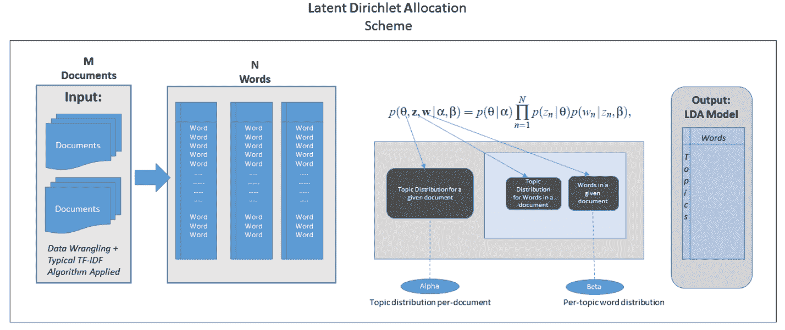

LDA 算法的步骤如下：

1.  初始化以下参数（控制集中度和平滑度）：

    1.  Alpha 参数（高 alpha 值使得文档间更为相似，且包含相似的主题）

    1.  Beta 参数（高 beta 值意味着每个主题最可能包含大多数单词的混合）

1.  随机初始化主题分配。

1.  迭代：

    1.  对于每个文档。

        1.  对于文档中的每个单词。

        1.  为每个单词重新采样主题。

            1.  相对于所有其他单词及其当前分配（对于当前迭代）。

1.  获取结果。

1.  模型评估

在统计学中，Dirichlet 分布 Dir(alpha)是一族由正实数向量α参数化的连续多元概率分布。关于 LDA 的更深入探讨，请参阅原始论文：

机器学习杂志上的原论文链接：[`www.jmlr.org/papers/volume3/blei03a/blei03a.pdf`](http://www.jmlr.org/papers/volume3/blei03a/blei03a.pdf)

LDA 不对主题赋予任何语义，也不关心主题的名称。它只是一个生成模型，使用细粒度项（例如，关于猫、狗、鱼、汽车的单词）的分布来分配总体主题，该主题得分最高。它不知道、不关心，也不理解被称为狗或猫的主题。

我们通常需要通过 TF-IDF 对文档进行分词和向量化，然后才能输入到 LDA 算法中。

# 还有更多...

下图简要描绘了 LDA：

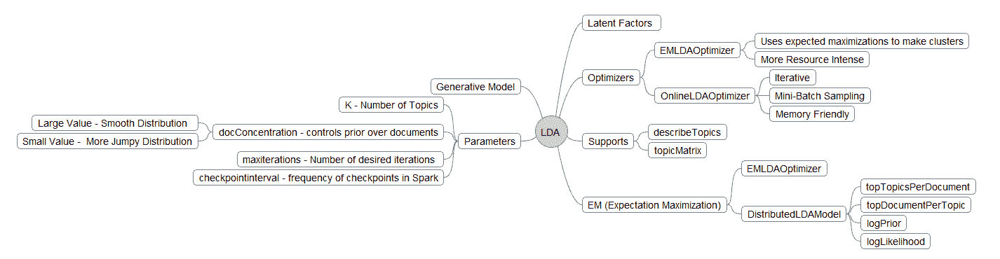

文档分析有两种方法。我们可以简单地使用矩阵分解将大型数据集矩阵分解为较小的矩阵（主题分配）乘以向量（主题本身）：

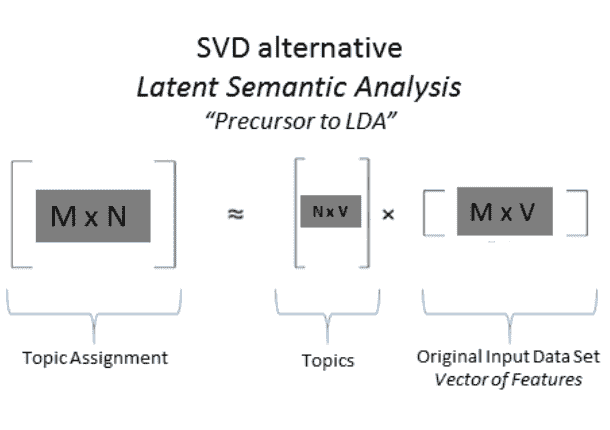

# 另请参阅

+   **LDA**：构造函数的文档可在 [`spark.apache.org/docs/latest/api/scala/index.html#org.apache.spark.ml.clustering.LDA`](http://spark.apache.org/docs/latest/api/scala/index.html#org.apache.spark.ml.clustering.LDA)

+   [**LDAModel**：构造函数的文档可在 ](http://spark.apache.org/docs/latest/api/scala/index.html#org.apache.spark.ml.clustering.LDA)[`spark.apache.org/docs/latest/api/scala/index.html#org.apache.spark.ml.clustering.LDAModel`](http://spark.apache.org/docs/latest/api/scala/index.html#org.apache.spark.ml.clustering.LDAModel)

另请参阅，通过 Spark 的 Scala API，以下文档链接：

+   DistributedLDAModel

+   EMLDAOptimizer

+   LDAOptimizer

+   LocalLDAModel

+   OnlineLDAOptimizer

# 流式 KMeans 用于近实时分类数据

Spark 流式处理是一个强大的功能，它允许您在同一范式中结合近实时和批处理。流式 KMeans 接口位于 ML 聚类和 Spark 流式处理的交叉点，充分利用了 Spark 流式处理本身提供的核心功能（例如，容错、精确一次交付语义等）。

# 如何操作...

1.  在 IntelliJ 或您选择的 IDE 中启动一个新项目。确保包含必要的 JAR 文件。

1.  导入流式 KMeans 所需的包：

`package spark.ml.cookbook.chapter14`.

1.  导入流式 KMeans 所需的包：

```scala
import org.apache.log4j.{Level, Logger}
 import org.apache.spark.mllib.clustering.StreamingKMeans
 import org.apache.spark.mllib.linalg.Vectors
 import org.apache.spark.mllib.regression.LabeledPoint
 import org.apache.spark.sql.SparkSession
 import org.apache.spark.streaming.{Seconds, StreamingContext}
```

1.  我们为流式 KMeans 程序设置了以下参数。训练目录将是发送训练数据文件的目录。KMeans 聚类模型利用训练数据运行算法和计算。`testDirectory`将用于预测的测试数据。`batchDuration`是以秒为单位的批处理运行时间。在以下情况下，程序将每 10 秒检查一次是否有新的数据文件用于重新计算。

1.  集群设置为`2`，数据维度将为`3`：

```scala
val trainingDir = "../data/sparkml2/chapter8/trainingDir" val testDir = "../data/sparkml2/chapter8/testDir" val batchDuration = 10
 val numClusters = 2
 val numDimensions = 3
```

1.  使用上述设置，示例训练数据将包含以下格式的数据（以[*X[1], X[2], ...X[n]*]格式，其中*n*是`numDimensions`）：

[0.0,0.0,0.0]

[0.1,0.1,0.1]

[0.2,0.2,0.2]

[9.0,9.0,9.0]

[9.1,9.1,9.1]

[9.2,9.2,9.2]

[0.1,0.0,0.0]

[0.2,0.1,0.1]

....

测试数据文件将包含以下格式的数据（以（*y, [X1, X2, .. Xn]*）格式，其中*n*是`numDimensions`，`y`是标识符）：

(7,[0.4,0.4,0.4])

(8,[0.1,0.1,0.1])

(9,[0.2,0.2,0.2])

(10,[1.1,1.0,1.0])

(11,[9.2,9.1,9.2])

(12,[9.3,9.2,9.3])

1.  我们设置必要的 Spark 上下文以访问集群：

```scala
val spark = SparkSession
 .builder.master("local[*]")
 .appName("myStreamingKMeans")
 .config("spark.sql.warehouse.dir", ".")
 .getOrCreate()
```

1.  定义流式上下文和微批处理窗口：

```scala
val ssc = new StreamingContext(spark.sparkContext, Seconds(batchDuration.toLong))
```

1.  以下代码将通过解析上述两个目录中的数据文件创建`trainingData`和`testData RDDs`：

```scala
val trainingData = ssc.textFileStream(trainingDir).map(Vectors.parse)
 val testData = ssc.textFileStream(testDir).map(LabeledPoint.parse)
```

1.  我们创建`StreamingKMeans`模型并设置参数：

```scala
val model = new StreamingKMeans()
 .setK(numClusters)
 .setDecayFactor(1.0)
 .setRandomCenters(numDimensions, 0.0)
```

1.  程序将使用训练数据集训练模型，并使用测试数据集进行预测：

```scala
model.trainOn(trainingData)
 model.predictOnValues(testData.map(lp => (lp.label, lp.features))).print()
```

1.  我们启动流式上下文，程序将每 10 秒运行一次批处理，以检查是否有新的训练数据集可用，以及是否有新的测试数据集用于预测。如果收到终止信号（退出批处理运行），程序将退出。

```scala
ssc.start()
 ssc.awaitTermination()
```

1.  我们将`testKStreaming1.txt`数据文件复制到上述`testDir`设置中，并在控制台日志中看到以下打印输出：

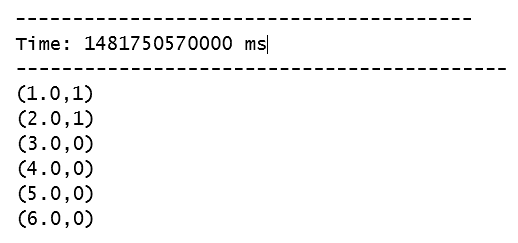

1.  对于 Windows 机器，我们将`testKStreaming1.txt`文件复制到了目录：`C:\spark-2.0.0-bin-hadoop2.7\data\sparkml2\chapter8\testDir\`。

1.  我们还可以通过访问`http://localhost:4040/`来检查 SparkUI 以获取更多信息。

作业面板将显示流式作业，如图所示：

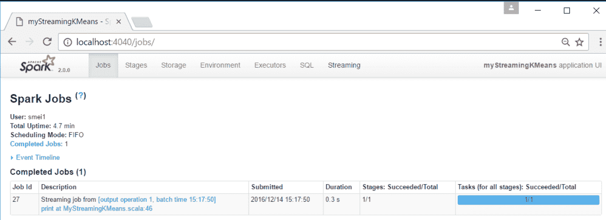

如图所示，流式面板将显示上述流式 KMeans 矩阵，显示批处理作业每 10 秒运行一次：

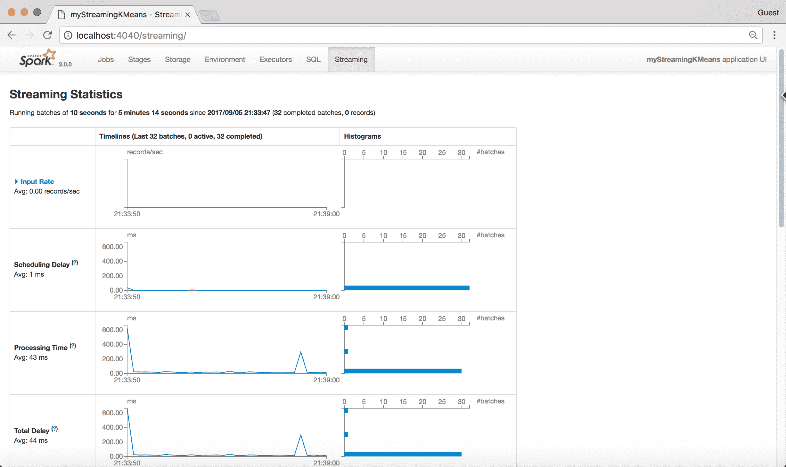

您可以通过点击任何批处理，如图所示，获取有关流式批处理的更多详细信息：

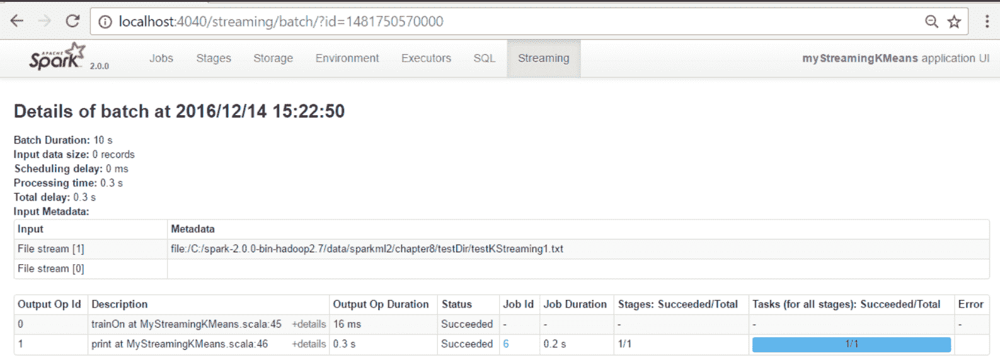

# 工作原理...

在某些情况下，我们不能使用批处理方法来加载和捕获事件，然后对其做出反应。我们可以使用在内存或着陆数据库中捕获事件的创造性方法，然后快速将其转移到另一个系统进行处理，但大多数这些系统无法作为流式系统运行，并且通常构建成本非常高。

Spark 提供了一种近乎实时的（也称为主观实时）方式，可以接收来自 Twitter feeds、信号等的传入源，通过连接器（例如 Kafka 连接器）进行处理，并以 RDD 接口的形式呈现。

这些是构建和构造 Spark 中流式 KMeans 所需的元素：

1.  使用流式上下文而不是...

# 还有更多...

流式 KMeans 是 KMeans 实现的一种特殊情况，其中数据可以近乎实时地到达，并根据需要被分类到集群（硬分类）中。关于 Voronoi 图的参考，请参见以下 URL：[`en.wikipedia.org/wiki/Voronoi_diagram`](https://en.wikipedia.org/wiki/Voronoi_diagram)

目前，Spark 机器学习库中除了流式 KMeans 外还有其他算法，如图所示：

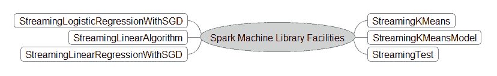

# 另请参阅

+   流式 KMeans 文档可在[`spark.apache.org/docs/latest/api/scala/index.html#org.apache.spark.mllib.clustering.StreamingKMeans`](http://spark.apache.org/docs/latest/api/scala/index.html#org.apache.spark.mllib.clustering.StreamingKMeans)找到。

+   流式 KMeans 模型文档可在[`spark.apache.org/docs/latest/api/scala/index.html#org.apache.spark.mllib.stat.test.StreamingTest`](http://spark.apache.org/docs/latest/api/scala/index.html#org.apache.spark.mllib.stat.test.StreamingTest)找到。

+   流式测试文档——对数据生成非常有用——可在[`spark.apache.org/docs/latest/api/scala/index.html#org.apache.spark.mllib.clustering.StreamingKMeansModel`](http://spark.apache.org/docs/latest/api/scala/index.html#org.apache.spark.mllib.clustering.StreamingKMeansModel)找到。
