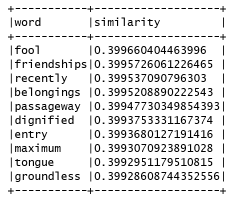
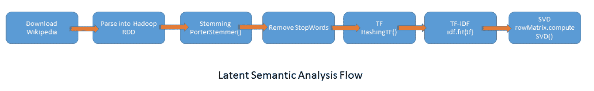
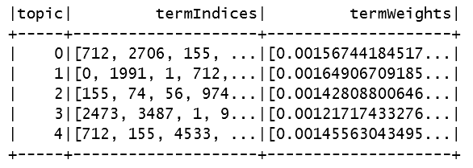
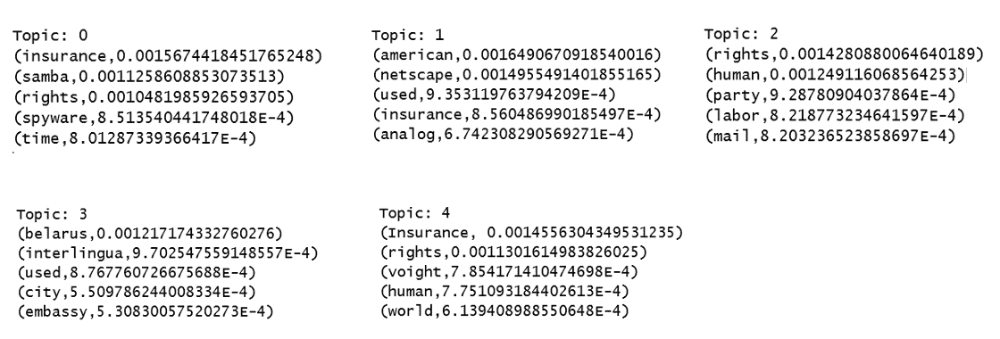

# 第十五章：使用 Spark 2.0 ML 库实现文本分析

本章中，我们将涵盖以下内容：

+   使用 Spark 进行词频统计 - 一切计数

+   使用 Spark 通过 Word2Vec 显示相似词

+   为实际的 Spark ML 项目下载维基百科的完整数据集

+   使用 Spark 2.0 进行文本分析的潜在语义分析

+   Spark 2.0 中的主题建模与潜在狄利克雷分配

# 引言

文本分析处于机器学习、数学、语言学和自然语言处理的交叉点。文本分析，在较早的文献中称为文本挖掘，试图从未结构化和半结构化数据中提取信息并推断更高级别的概念、情感和语义细节。值得注意的是，传统的关键词搜索不足以处理需要根据实际上下文过滤掉的噪声、模糊和无关的词条和概念。

最终，我们试图做的是对于一组给定的文档（文本、推文、网页和社交媒体），确定沟通的要点以及它试图传达的概念（主题和...

# 使用 Spark 进行词频统计 - 一切计数

对于此示例，我们将从古腾堡项目下载一本文本格式的书籍，网址为[`www.gutenberg.org/cache/epub/62/pg62.txt`](http://www.gutenberg.org/cache/epub/62/pg62.txt)。

古腾堡项目提供超过 50,000 种格式的免费电子书供人类消费。请阅读他们的使用条款；让我们不要使用命令行工具下载任何书籍。

当你查看文件内容时，会注意到该书的标题和作者是*《火星公主》项目古腾堡电子书》*，作者是埃德加·赖斯·巴勒斯。

这本电子书可供任何人免费使用，几乎没有任何限制。你可以复制它、赠送它，或根据古腾堡项目许可证中包含的条款重新使用它，该许可证可在[`www.gutenberg.org/`](http://www.gutenberg.org/)在线获取。

然后，我们使用下载的书籍来演示使用 Scala 和 Spark 的经典词频统计程序。这个例子起初可能看起来有些简单，但我们正在开始文本处理的特征提取过程。此外，对文档中词频计数的一般理解将大大有助于我们理解 TF-IDF 的概念。

# 如何操作...

1.  在 IntelliJ 或您选择的 IDE 中启动一个新项目。确保包含必要的 JAR 文件。

1.  该示例的`包`声明如下：

```scala
package spark.ml.cookbook.chapter12
```

1.  导入 Scala、Spark 和 JFreeChart 所需的必要包：

```scala
import org.apache.log4j.{Level, Logger}import org.apache.spark.sql.SQLContextimport org.apache.spark.{SparkConf, SparkContext}import org.jfree.chart.axis.{CategoryAxis, CategoryLabelPositions}import org.jfree.chart.{ChartFactory, ChartFrame, JFreeChart}import org.jfree.chart.plot.{CategoryPlot, PlotOrientation}import org.jfree.data.category.DefaultCategoryDataset
```

1.  我们将定义一个函数，在窗口中显示我们的 JFreeChart：

```scala
def show(chart: JFreeChart) ...
```

# 其工作原理...

我们首先加载下载的书籍，并通过正则表达式对其进行分词。接下来的步骤是将所有词条转换为小写，并从词条列表中排除停用词，然后过滤掉任何长度小于两个字符的词。

去除停用词和特定长度的词减少了我们需要处理的特征数量。这可能不明显，但根据各种处理标准去除特定单词会减少机器学习算法后续处理的维度数量。

最后，我们对结果的词频进行了降序排序，取前 25 个，并为其展示了一个条形图。

# 还有更多...

在本菜谱中，我们有了关键词搜索的基础。理解主题建模和关键词搜索之间的区别很重要。在关键词搜索中，我们试图根据出现次数将短语与给定文档关联。在这种情况下，我们将向用户指向出现次数最多的文档集。

# 另请参见

该算法的下一步演化，开发者可以尝试作为扩展，将是添加权重并计算加权平均值，但 Spark 提供了我们将在接下来的菜谱中探讨的设施。

# 使用 Spark 的 Word2Vec 展示相似词

在本菜谱中，我们将探讨 Word2Vec，这是 Spark 评估词相似性的工具。Word2Vec 算法受到普通语言学中*分布假设*的启发。其核心思想是，出现在相同上下文（即与目标的距离）中的词倾向于支持相同的原始概念/意义。

谷歌的一组研究人员发明了 Word2Vec 算法。请参考本菜谱中*还有更多...*部分提到的白皮书，该白皮书对 Word2Vec 进行了更详细的描述。

# 如何操作...

1.  在 IntelliJ 或您选择的 IDE 中启动一个新项目。确保包含必要的 JAR 文件。

1.  本菜谱的`package`语句如下：

```scala
package spark.ml.cookbook.chapter12
```

1.  导入 Scala 和 Spark 所需的必要包：

```scala
import org.apache.log4j.{Level, Logger}
import org.apache.spark.ml.feature.{RegexTokenizer, StopWordsRemover, Word2Vec}
import org.apache.spark.sql.{SQLContext, SparkSession}
import org.apache.spark.{SparkConf, SparkContext}
```

1.  让我们定义书籍文件的位置：

```scala
val input = "../data/sparkml2/chapter12/pg62.txt"
```

1.  使用工厂构建器模式创建具有配置的 Spark 会话：

```scala
val spark = SparkSession
         .builder
.master("local[*]")
         .appName("Word2Vec App")
         .config("spark.sql.warehouse.dir", ".")
         .getOrCreate()
import spark.implicits._
```

1.  我们应该将日志级别设置为警告，否则输出将难以跟踪：

```scala
Logger.getRootLogger.setLevel(Level.WARN)
```

1.  我们加载书籍并将其转换为 DataFrame：

```scala
val df = spark.read.text(input).toDF("text")
```

1.  我们现在利用 Spark 的正则表达式分词器将每行转换为词袋，将每个词转换为小写，并过滤掉任何字符长度小于四的词：

```scala
val tokenizer = new RegexTokenizer()
 .setPattern("\\W+")
 .setToLowercase(true)
 .setMinTokenLength(4)
 .setInputCol("text")
 .setOutputCol("raw")
 val rawWords = tokenizer.transform(df)
```

1.  我们使用 Spark 的`StopWordRemover`类去除停用词：

```scala
val stopWords = new StopWordsRemover()
 .setInputCol("raw")
 .setOutputCol("terms")
 .setCaseSensitive(false)
 val wordTerms = stopWords.transform(rawWords)
```

1.  我们应用 Word2Vec 机器学习算法提取特征：

```scala
val word2Vec = new Word2Vec()
 .setInputCol("terms")
 .setOutputCol("result")
 .setVectorSize(3)
 .setMinCount(0)
val model = word2Vec.fit(wordTerms)
```

1.  我们从书中找出*martian*的十个同义词：

```scala
val synonyms = model.findSynonyms("martian", 10)
```

1.  展示模型找到的十个同义词的结果：

```scala
synonyms.show(false)
```



1.  我们通过停止 SparkContext 来关闭程序：

```scala
spark.stop()
```

# 它是如何工作的...

在 Spark 中，Word2Vec 使用的是跳字模型而非**连续词袋模型**（**CBOW**），后者更适合**神经网络**（**NN**）。其核心在于尝试计算词的表示。强烈建议用户理解局部表示与分布式表示之间的差异，这与词本身的表面意义截然不同。

如果使用分布式向量表示词，自然地，相似的词在向量空间中会彼此靠近，这是一种理想的模式抽象和操作泛化技术（即，我们将问题简化为向量运算）。

对于给定的一组词*{Word[1,] Word[2, .... ...]*，我们想要做的是

# 还有更多...

无论如何，你如何找到相似的词？有多少算法能解决这个问题，它们之间有何不同？Word2Vec 算法已经存在一段时间，并且有一个对应的模型称为 CBOW。请记住，Spark 提供的实现技术是跳字模型。

Word2Vec 算法的变化如下：

+   **连续词袋模型（CBOW）**：给定一个中心词，周围的词是什么？

+   **跳字模型**：如果我们知道周围的词，能否猜出缺失的词？

有一种算法变体称为**带负采样的跳字模型**（**SGNS**），它似乎优于其他变体。

共现是 CBOW 和跳字模型背后的基本概念。尽管跳字模型并不直接使用共现矩阵，但它间接地使用了它。

在本方法中，我们使用了 NLP 中的*停用词*技术，在运行算法前对语料库进行净化。停用词如英语中的"*the*"需要被移除，因为它们对结果的改进没有贡献。

另一个重要概念是*词干提取*，这里未涉及，但将在后续方法中展示。词干提取去除额外的语言特征，将词还原为其词根（例如，*Engineering*、*Engineer*和*Engineers*变为*Engin*，即词根）。

以下 URL 的白皮书应提供对 Word2Vec 更深入的解释：

[`arxiv.org/pdf/1301.3781.pdf`](http://arxiv.org/pdf/1301.3781.pdf)

# 参见

Word2Vec 方法的文档：

+   `Word2Vec()`：[`spark.apache.org/docs/latest/api/scala/index.html#org.apache.spark.ml.feature.Word2Vec`](http://spark.apache.org/docs/latest/api/scala/index.html#org.apache.spark.ml.feature.Word2Vec)

+   `Word2VecModel()`：[`spark.apache.org/docs/latest/api/scala/index.html#org.apache.spark.ml.feature.Word2VecModel`](http://spark.apache.org/docs/latest/api/scala/index.html#org.apache.spark.ml.feature.Word2VecModel)

+   `StopWordsRemover()`：[`spark.apache.org/docs/latest/api/scala/index.html#org.apache.spark.ml.feature.StopWordsRemover`](http://spark.apache.org/docs/latest/api/scala/index.html#org.apache.spark.ml.feature.StopWordsRemover)

# 为实际的 Spark ML 项目下载完整的维基百科转储

在本示例中，我们将下载并探索维基百科的转储，以便我们有一个实际的示例。本示例中我们将下载的数据集是维基百科文章的转储。您将需要命令行工具**curl**或浏览器来检索压缩文件，目前该文件大小约为 13.6 GB。由于文件较大，我们建议使用 curl 命令行工具。

# 如何操作...

1.  您可以使用以下命令开始下载数据集：

```scala
curl -L -O http://dumps.wikimedia.org/enwiki/latest/enwiki-latest-pages-articles-multistream.xml.bz2
```

1.  现在您想要解压缩 ZIP 文件：

```scala
bunzip2 enwiki-latest-pages-articles-multistream.xml.bz2
```

这将创建一个未压缩的文件，名为`enwiki-latest-pages-articles-multistream.xml`，大小约为 56 GB。

1.  让我们来看看维基百科 XML 文件：

```scala
head -n50 enwiki-latest-pages-articles-multistream.xml<mediawiki xmlns=http://www.mediawiki.org/xml/export-0.10/  xsi:schemaLocation="http://www.mediawiki.org/xml/export-0.10/ http://www.mediawiki.org/xml/export-0.10.xsd" version="0.10" ...
```

# 还有更多...

我们建议将 XML 文件分块处理，并在准备好提交最终作业之前使用抽样进行实验。这将节省大量时间和精力。

# 另请参阅

维基下载文档可在[`en.wikipedia.org/wiki/Wikipedia:Database_download`](https://en.wikipedia.org/wiki/Wikipedia:Database_download)找到。

# 使用 Spark 2.0 进行文本分析的潜在语义分析

在本示例中，我们将利用维基百科文章的数据转储来探索 LSA。LSA 意味着分析文档集合以发现这些文档中的隐藏含义或概念。

本章第一个示例中，我们介绍了 TF（即词频）技术的基本概念。在本示例中，我们使用 HashingTF 计算 TF，并使用 IDF 将模型拟合到计算出的 TF 上。LSA 的核心在于对词频文档进行**奇异值分解**（**SVD**），以降低维度并提取最重要的概念。我们还需要进行其他清理步骤（例如，停用词和词干提取），以在开始分析之前清理词袋。

# 如何操作...

1.  在 IntelliJ 或您选择的 IDE 中启动一个新项目。确保包含必要的 JAR 文件。

1.  本示例的包声明如下：

```scala
package spark.ml.cookbook.chapter12
```

1.  为 Scala 和 Spark 导入必要的包：

```scala
import edu.umd.cloud9.collection.wikipedia.WikipediaPage import edu.umd.cloud9.collection.wikipedia.language.EnglishWikipediaPage import org.apache.hadoop.fs.Path import org.apache.hadoop.io.Text import org.apache.hadoop.mapred.{FileInputFormat, JobConf} import org.apache.log4j.{Level, Logger} import org.apache.spark.mllib.feature.{HashingTF, IDF} import org.apache.spark.mllib.linalg.distributed.RowMatrix import org.apache.spark.sql.SparkSession import org.tartarus.snowball.ext.PorterStemmer ...
```

# 它是如何工作的...

示例首先通过使用 Cloud9 Hadoop XML 流工具加载维基百科 XML 转储来处理庞大的 XML 文档。一旦我们解析出页面文本，分词阶段就会将我们的维基百科页面文本流转换为令牌。在分词阶段，我们使用了 Porter 词干提取器来帮助将单词简化为共同的基本形式。

关于词干提取的更多详细信息，请访问[`en.wikipedia.org/wiki/Stemming`](https://en.wikipedia.org/wiki/Stemming)。

下一步是使用 Spark 的 HashingTF 对每个页面令牌计算词频。在此阶段完成后，我们利用 Spark 的 IDF 生成逆文档频率。

最后，我们采用了 TF-IDF API，并应用奇异值分解来处理因式分解和降维。

以下截图展示了该方法的步骤和流程：

图片：

可在以下链接找到 Cloud9 Hadoop XML 工具及其他所需依赖：

+   `bliki-core-3.0.19.jar`：[`central.maven.org/maven2/info/bliki/wiki/bliki-core/3.0.19/bliki-core-3.0.19.jar`](http://central.maven.org/maven2/info/bliki/wiki/bliki-core/3.0.19/bliki-core-3.0.19.jar)

+   `cloud9-2.0.1.jar`：[`central.maven.org/maven2/edu/umd/cloud9/2.0.1/cloud9-2.0.1.jar`](http://central.maven.org/maven2/edu/umd/cloud9/2.0.1/cloud9-2.0.1.jar)

+   `hadoop-streaming-2.7.4.jar`：[`central.maven.org/maven2/org/apache/hadoop/hadoop-streaming/2.7.4/hadoop-streaming-2.7.4.jar`](http://central.maven.org/maven2/org/apache/hadoop/hadoop-streaming/2.7.4/hadoop-streaming-2.7.4.jar)

+   `lucene-snowball-3.0.3.jar`：[`central.maven.org/maven2/org/apache/lucene/lucene-snowball/3.0.3/lucene-snowball-3.0.3.jar`](http://central.maven.org/maven2/org/apache/lucene/lucene-snowball/3.0.3/lucene-snowball-3.0.3.jar)

# 还有更多...

现在应该很明显，尽管 Spark 没有直接提供 LSA 实现，但 TF-IDF 与 SVD 的结合将使我们能够构建并分解大型语料库矩阵为三个矩阵，这有助于我们通过 SVD 进行降维来解释结果。我们可以专注于最有意义的集群（类似于推荐算法）。

SVD 将词频文档（即按属性划分的文档）分解为三个不同的矩阵，这些矩阵更便于从难以处理且成本高昂的大型矩阵中提取*N*个概念（例如，在我们的例子中*N=27*）。在机器学习中，我们总是偏好高瘦矩阵（即本例中的*U*矩阵）...

# 另请参阅

关于`SingularValueDecomposition()`的更多详情，请参阅[`spark.apache.org/docs/latest/api/scala/index.html#org.apache.spark.mllib.linalg.SingularValueDecomposition`](http://spark.apache.org/docs/latest/api/scala/index.html#org.apache.spark.mllib.linalg.SingularValueDecomposition)。

关于`RowMatrix()`的更多详情，请参考[`spark.apache.org/docs/latest/api/scala/index.html#org.apache.spark.mllib.linalg.distributed.RowMatrix`](http://spark.apache.org/docs/latest/api/scala/index.html#org.apache.spark.mllib.linalg.distributed.RowMatrix)。

# 使用 Spark 2.0 进行主题建模与潜在狄利克雷分配

在本方法中，我们将展示如何利用潜在狄利克雷分配（Latent Dirichlet Allocation）从文档集合中推断主题模型。

我们在前面的章节中已经介绍了 LDA，因为它适用于聚类和主题建模，但在本章中，我们展示了一个更复杂的示例，以展示它如何应用于使用更真实和复杂数据集的文本分析。

我们还应用了诸如词干提取和停用词等 NLP 技术，以提供更真实的 LDA 问题解决方法。我们试图做的是发现一组潜在因素（即与原始因素不同），这些因素可以在减少的...中以更高效的方式解决问题并描述解决方案。

# 如何操作...

1.  在 IntelliJ 或您选择的 IDE 中启动一个新项目。确保包含必要的 JAR 文件。

1.  该配方中的`package`声明如下：

```scala
package spark.ml.cookbook.chapter12
```

1.  导入 Scala 和 Spark 所需的包：

```scala
import edu.umd.cloud9.collection.wikipedia.WikipediaPage
import edu.umd.cloud9.collection.wikipedia.language.EnglishWikipediaPage
import org.apache.hadoop.fs.Path
import org.apache.hadoop.io.Text
import org.apache.hadoop.mapred.{FileInputFormat, JobConf}
import org.apache.log4j.{Level, Logger}
import org.apache.spark.ml.clustering.LDA
import org.apache.spark.ml.feature._
import org.apache.spark.sql.SparkSession
```

1.  我们定义了一个函数来解析 Wikipedia 页面并返回页面的标题和内容文本：

```scala
def parseWikiPage(rawPage: String): Option[(String, String)] = {
 val wikiPage = new EnglishWikipediaPage()
 WikipediaPage.*readPage*(wikiPage, rawPage)

 if (wikiPage.isEmpty
 || wikiPage.isDisambiguation
 || wikiPage.isRedirect
 || !wikiPage.isArticle) {
 None
 } else {
 *Some*(wikiPage.getTitle, wikiPage.getContent)
 }
 }
```

1.  让我们定义 Wikipedia 数据转储的位置：

```scala
val input = "../data/sparkml2/chapter12/enwiki_dump.xml" 
```

1.  我们为 Hadoop XML 流创建作业配置：

```scala
val jobConf = new JobConf()
 jobConf.set("stream.recordreader.class", "org.apache.hadoop.streaming.StreamXmlRecordReader")
 jobConf.set("stream.recordreader.begin", "<page>")
 jobConf.set("stream.recordreader.end", "</page>")
```

1.  我们为 Hadoop XML 流处理设置数据路径：

```scala
FileInputFormat.addInputPath(jobConf, new Path(input))
```

1.  使用工厂构建器模式创建具有配置的`SparkSession`：

```scala
val spark = SparkSession
    .builder
.master("local[*]")
    .appName("ProcessLDA App")
    .config("spark.serializer",   "org.apache.spark.serializer.KryoSerializer")
    .config("spark.sql.warehouse.dir", ".")
    .getOrCreate()
```

1.  我们应该将日志级别设置为警告，否则输出将难以跟踪：

```scala
Logger.getRootLogger.setLevel(Level.WARN)
```

1.  我们开始处理巨大的 Wikipedia 数据转储成文章页面，从文件中抽取样本：

```scala
val wikiData = spark.sparkContext.hadoopRDD(
 jobConf,
 classOf[org.apache.hadoop.streaming.StreamInputFormat],
 classOf[Text],
 classOf[Text]).sample(false, .1)
```

1.  接下来，我们将示例数据处理成包含标题和页面上下文文本的元组的 RDD，最终生成一个 DataFrame：

```scala
val df = wiki.map(_._1.toString)
 .flatMap(parseWikiPage)
 .toDF("title", "text")
```

1.  我们现在使用 Spark 的`RegexTokenizer`将 DataFrame 的文本列转换为每个 Wikipedia 页面的原始单词：

```scala
val tokenizer = new RegexTokenizer()
 .setPattern("\\W+")
 .setToLowercase(true)
 .setMinTokenLength(4)
 .setInputCol("text")
 .setOutputCol("raw")
 val rawWords = tokenizer.transform(df)
```

1.  下一步是过滤原始单词，通过去除令牌中的所有停用词：

```scala
val stopWords = new StopWordsRemover()
 .setInputCol("raw")
 .setOutputCol("words")
 .setCaseSensitive(false)

 val wordData = stopWords.transform(rawWords)
```

1.  我们使用 Spark 的`CountVectorizer`类为过滤后的令牌生成词频，从而产生包含列特征的新 DataFrame：

```scala
val cvModel = new CountVectorizer()
 .setInputCol("words")
 .setOutputCol("features")
 .setMinDF(2)
 .fit(wordData)
 val cv = cvModel.transform(wordData)
 cv.cache()
```

"MinDF"指定必须出现在词汇表中的不同文档术语的最小数量。

1.  我们现在调用 Spark 的 LDA 类来生成主题以及令牌到主题的分布：

```scala
val lda = new LDA()
 .setK(5)
 .setMaxIter(10)
 .setFeaturesCol("features")
 val model = lda.fit(tf)
 val transformed = model.transform(tf)
```

"K"指的是主题数量，"MaxIter"是执行的最大迭代次数。

1.  我们最终描述了生成的五个顶级主题并显示：

```scala
val topics = model.describeTopics(5)
 topics.show(false)
```



1.  现在显示与主题相关联的主题和术语：

```scala
val vocaList = cvModel.vocabulary
topics.collect().foreach { r => {
 println("\nTopic: " + r.get(r.fieldIndex("topic")))
 val y = r.getSeqInt).map(vocaList(_))
 .zip(r.getSeqDouble))
 y.foreach(println)

 }
}
```

控制台输出将如下所示：



1.  我们通过停止 SparkContext 来关闭程序：

```scala
spark.stop()
```

# 它是如何工作的...

我们首先加载 Wikipedia 文章的转储，并使用 Hadoop XML 利用流 API 将页面文本解析为令牌。特征提取过程利用了几个类来设置最终由 LDA 类处理的流程，让令牌从 Spark 的`RegexTokenize`、`StopwordsRemover`和`HashingTF`流过。一旦我们有了词频，数据就被传递给 LDA 类，以便在几个主题下将文章聚类在一起。

Hadoop XML 工具和其他几个必需的依赖项可以在以下位置找到：

+   `bliki-core-3.0.19.jar`：[`central.maven.org/maven2/info/bliki/wiki/bliki-core/3.0.19/bliki-core-3.0.19.jar`](http://central.maven.org/maven2/info/bliki/wiki/bliki-core/3.0.19/bliki-core-3.0.19.jar)

+   `cloud9-2.0.1.jar`：[`central.maven.org/maven2/edu/umd/cloud9/2.0.1/cloud9-2.0.1.jar ...`](http://central.maven.org/maven2/edu/umd/cloud9/2.0.1/cloud9-2.0.1.jar)

# 还有更多...

请参阅第八章《Apache Spark 2.0 无监督聚类》中的*LDA 食谱*，以获取有关 LDA 算法本身的更详细解释，该章节介绍了如何将文档和文本分类为主题。

《机器学习研究杂志》(JMLR) 的以下白皮书为希望进行深入分析的人提供了全面的论述。这是一篇写得很好的论文，具有统计和数学基础的人应该能够毫无困难地理解它。

欲了解更多关于 JMLR 的详情，请参考[`www.jmlr.org/papers/volume3/blei03a/blei03a.pdf`](http://www.jmlr.org/papers/volume3/blei03a/blei03a.pdf)链接；另有一替代链接为[`www.cs.colorado.edu/~mozer/Teaching/syllabi/ProbabilisticModels/readings/BleiNgJordan2003.pdf`](https://www.cs.colorado.edu/~mozer/Teaching/syllabi/ProbabilisticModels/readings/BleiNgJordan2003.pdf)。

# 另请参阅

+   构造函数的文档可在[`spark.apache.org/docs/latest/api/scala/index.html#org.apache.spark.ml.clustering.LDA`](http://spark.apache.org/docs/latest/api/scala/index.html#org.apache.spark.ml.clustering.LDA)找到。

+   LDAModel 的文档可在[`spark.apache.org/docs/latest/api/scala/index.html#org.apache.spark.ml.clustering.LDAModel`](http://spark.apache.org/docs/latest/api/scala/index.html#org.apache.spark.ml.clustering.LDAModel)找到。

亦可参阅 Spark 的 Scala API 文档，了解以下内容：

+   DistributedLDAModel

+   EMLDAOptimizer

+   LDAOptimizer

+   LocalLDAModel

+   OnlineLDAOptimizer
