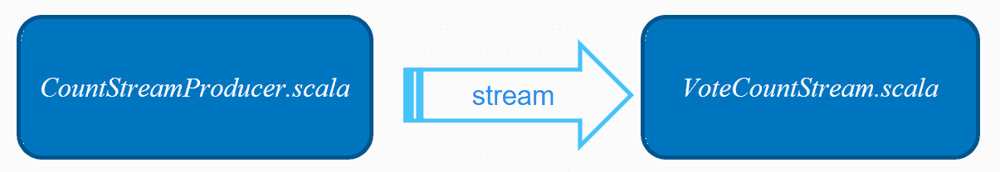
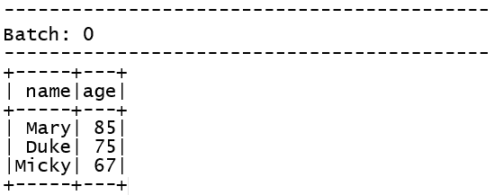
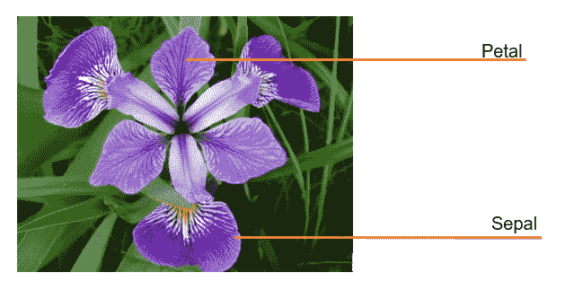
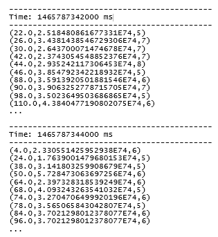

# 第十六章：Spark 流处理与机器学习库

在本章中，我们将介绍以下内容：

+   结构化流处理，用于近实时机器学习

+   使用流式 DataFrames 进行实时机器学习

+   使用流式数据集进行实时机器学习

+   使用 queueStream 进行流数据和调试

+   下载并理解著名的鸢尾花数据集，用于无监督分类

+   为实时在线分类器实现流式 KMeans

+   下载葡萄酒质量数据，用于流式回归

+   为实时回归实现流式线性回归

+   下载 Pima 糖尿病数据集，用于监督分类

+   为在线分类器实现流式逻辑回归

# 引言

Spark 流处理是一个不断发展的过程，旨在统一和结构化 API，以解决批处理与流处理的关切。自 Spark 1.3 起，Spark 流处理就已提供**离散流**（**DStream**）。新的方向是使用无界表模型抽象底层框架，用户可以使用 SQL 或函数式编程查询表，并将输出写入到另一个输出表中，支持多种模式（完整、增量和追加输出）。Spark SQL Catalyst 优化器和 Tungsten（堆外内存管理器）现已成为 Spark 流处理的核心部分，从而实现更高效的执行。

在本章中，我们不仅涵盖了 Spark 中可用的流处理功能...

# 结构化流处理，用于近实时机器学习

在本节中，我们将探讨 Spark 2.0 引入的新结构化流处理范式。我们通过使用套接字和结构化流 API 进行实时流处理，并相应地投票和统计票数。

我们还通过模拟一系列随机生成的投票来探索新引入的子系统，以选出最不受欢迎的漫画书反派角色。

本节包含两个不同的程序（`VoteCountStream.scala`和`CountStreamproducer.scala`）。

# 如何操作...

1.  在 IntelliJ 或您选择的 IDE 中启动一个新项目。确保包含必要的 JAR 文件。

1.  设置程序所在的包位置：

```scala
package spark.ml.cookbook.chapter13
```

1.  导入必要的包，以便 Spark 上下文可以访问集群，并使用`log4j.Logger`减少 Spark 产生的输出量：

```scala
import org.apache.log4j.{Level, Logger}import org.apache.spark.sql.SparkSessionimport java.io.{BufferedOutputStream, PrintWriter}import java.net.Socketimport java.net.ServerSocketimport java.util.concurrent.TimeUnitimport scala.util.Randomimport org.apache.spark.sql.streaming.ProcessingTime
```

1.  定义一个 Scala 类，用于将投票数据生成到客户端套接字：

```scala
class CountSreamThread(socket: ...
```

# 工作原理...

在本节中，我们创建了一个简单的数据生成服务器，用于模拟投票数据流，并对投票进行计数。下图提供了这一概念的高层次描述：



首先，我们启动了数据生成服务器。其次，我们定义了一个套接字数据源，以便连接到数据生成服务器。接着，我们构建了一个简单的 Spark 表达式，按反派（即坏超级英雄）分组并统计当前收到的所有投票。最后，我们设置了一个 10 秒的阈值触发器来执行我们的流查询，该查询将累积结果输出到控制台。

本方案涉及两个简短的程序：

+   `CountStreamproducer.scala`：

    +   生产者 - 数据生成服务器

    +   模拟投票过程并进行广播

+   `VoteCountStream.scala`：

    +   消费者 - 消费并聚合/制表数据

    +   接收并统计我们反派超级英雄的投票

# 还有更多...

本书不涉及使用 Spark 流处理和结构化流处理的编程主题，但我们认为有必要分享一些程序以引入概念，然后再深入探讨 Spark 的 ML 流处理功能。

如需对流处理进行全面介绍，请参阅 Spark 相关文档：

+   有关 Spark 2.0+结构化流的信息，请访问[`spark.apache.org/docs/latest/structured-streaming-programming-guide.html#api-using-datasets-and-dataframes`](https://spark.apache.org/docs/latest/structured-streaming-programming-guide.html#api-using-datasets-and-dataframes)

+   Spark 1.6 流处理信息可在[`spark.apache.org/docs/latest/streaming-programming-guide.html`](https://spark.apache.org/docs/latest/streaming-programming-guide.html)获取

# 另请参阅

+   结构化流文档可在[`spark.apache.org/docs/latest/api/scala/index.html#org.apache.spark.sql.streaming.package`](https://spark.apache.org/docs/latest/api/scala/index.html#org.apache.spark.sql.streaming.package)获取

+   DStream（Spark 2.0 之前）文档可在[`spark.apache.org/docs/latest/api/scala/index.html#org.apache.spark.streaming.dstream.DStream`](https://spark.apache.org/docs/latest/api/scala/index.html#org.apache.spark.streaming.dstream.DStream)获取

+   `DataStreamReader`文档可在[`spark.apache.org/docs/latest/api/scala/index.html#org.apache.spark.sql.streaming.DataStreamReader`](https://spark.apache.org/docs/latest/api/scala/index.html#org.apache.spark.sql.streaming.DataStreamReader)获取

+   `DataStreamWriter`文档可在[`spark.apache.org/docs/latest/api/scala/index.html#org.apache.spark.sql.streaming.DataStreamWriter`](https://spark.apache.org/docs/latest/api/scala/index.html#org.apache.spark.sql.streaming.DataStreamWriter)获取

+   `StreamingQuery`文档可在[`spark.apache.org/docs/latest/api/scala/index.html#org.apache.spark.sql.streaming.StreamingQuery`](https://spark.apache.org/docs/latest/api/scala/index.html#org.apache.spark.sql.streaming.StreamingQuery)获取

# 实时机器学习的流数据帧

在本例中，我们探讨了流式 DataFrame 的概念。我们创建了一个包含个人姓名和年龄的 DataFrame，该数据将通过网络流式传输。流式 DataFrame 是与 Spark ML 配合使用的一种流行技术，因为在撰写本文时，Spark 结构化 ML 尚未完全集成。

本例仅限于演示流式 DataFrame，并留给读者将其适配到自己的自定义 ML 管道中。虽然流式 DataFrame 在 Spark 2.1.0 中并非开箱即用，但它将是 Spark 后续版本的自然演进。

# 如何操作...

1.  在 IntelliJ 或您选择的 IDE 中启动一个新项目。确保包含必要的 JAR 文件。

1.  设置程序将驻留的包位置：

```scala
package spark.ml.cookbook.chapter13
```

1.  导入必要的包：

```scala
import java.util.concurrent.TimeUnit
import org.apache.log4j.{Level, Logger}
import org.apache.spark.sql.SparkSession
import org.apache.spark.sql.streaming.ProcessingTime
```

1.  创建一个`SparkSession`作为访问 Spark 集群的入口点：

```scala
val spark = SparkSession
.builder.master("local[*]")
.appName("DataFrame Stream")
.config("spark.sql.warehouse.dir", ".")
.getOrCreate()

```

1.  日志消息的交错导致输出难以阅读，因此将日志级别设置为警告：

```scala
Logger.getLogger("org").setLevel(Level.ERROR)
Logger.getLogger("akka").setLevel(Level.ERROR)
```

1.  接下来，加载人员数据文件以推断数据模式，无需手动编码结构类型：

```scala
val df = spark.read .format("json")
.option("inferSchema", "true")
.load("../data/sparkml2/chapter13/person.json")
df.printSchema()
```

从控制台，您将看到以下输出：

```scala
root
|-- age: long (nullable = true)
|-- name: string (nullable = true)
```

1.  现在配置一个流式 DataFrame 以接收数据：

```scala
val stream = spark.readStream
.schema(df.schema)
.json("../data/sparkml2/chapter13/people/")
```

1.  让我们执行一个简单的数据转换，通过筛选年龄大于`60`的记录：

```scala
val people = stream.select("name", "age").where("age > 60")
```

1.  现在我们将转换后的流数据输出到控制台，该操作将每秒触发一次：

```scala
val query = people.writeStream
.outputMode("append")
.trigger(ProcessingTime(1, TimeUnit.SECONDS))
.format("console")
```

1.  我们启动定义的流查询，并等待数据出现在流中：

```scala
query.start().awaitTermination()
```

1.  最终，我们的流查询结果将显示在控制台上：



# 它是如何工作的...

在本例中，我们首先使用快速方法（使用 JSON 对象）发现人员对象的底层模式，如步骤 6 所述。生成的 DataFrame 将了解我们随后对流输入（通过流式传输文件模拟）施加的模式，并作为流式 DataFrame 处理，如步骤 7 所示。

将流视为 DataFrame 并使用函数式或 SQL 范式对其进行操作的能力是一个强大的概念，如步骤 8 所示。然后，我们继续使用`writestream()`以`append`模式和 1 秒批处理间隔触发器输出结果。

# 还有更多...

DataFrames 与结构化编程的结合是一个强大的概念，有助于我们将数据层与流分离，从而使编程变得更加简单。DStream（Spark 2.0 之前）最大的缺点之一是其无法将用户与流/RDD 实现的底层细节隔离。

关于 DataFrames 的文档：

+   `DataFrameReader`：[`spark.apache.org/docs/latest/api/scala/index.html#org.apache.spark.sql.DataFrameReader`](https://spark.apache.org/docs/latest/api/scala/index.html#org.apache.spark.sql.DataFrameReader)

+   DataFrameWriter: [`spark.apache.org/docs/latest/api/scala/index.html#org.apache.spark.sql.DataFrameWriter`](https://spark.apache.org/docs/latest/api/scala/index.html#org.apache.spark.sql.DataFrameWriter)

# 另请参阅

Spark 数据流读写器文档：

+   DataStreamReader: [`spark.apache.org/docs/latest/api/scala/index.html#org.apache.spark.sql.streaming.DataStreamReader`](https://spark.apache.org/docs/latest/api/scala/index.html#org.apache.spark.sql.streaming.DataStreamReader)

+   DataStreamWriter: [`spark.apache.org/docs/latest/api/scala/index.html#org.apache.spark.sql.streaming.DataStreamWriter`](https://spark.apache.org/docs/latest/api/scala/index.html#org.apache.spark.sql.streaming.DataStreamWriter)

# 实时机器学习的流式数据集

在本示例中，我们创建了一个流式数据集，以展示在 Spark 2.0 结构化编程范式中使用数据集的方法。我们通过数据集从文件中流式传输股票价格，并应用过滤器选择当日收盘价高于$100 的股票。

本示例展示了如何使用简单的结构化流编程模型来过滤和处理传入数据。虽然它类似于 DataFrame，但在语法上存在一些差异。本示例以通用方式编写，以便用户可以根据自己的 Spark ML 编程项目进行定制。

# 如何操作...

1.  在 IntelliJ 或您选择的 IDE 中启动一个新项目。确保包含必要的 JAR 文件。

1.  设置程序将驻留的包位置：

```scala
package spark.ml.cookbook.chapter13
```

1.  导入必要的包：

```scala
import java.util.concurrent.TimeUnitimport org.apache.log4j.{Level, Logger}import org.apache.spark.sql.SparkSessionimport org.apache.spark.sql.streaming.ProcessingTime
```

1.  定义一个 Scala `case class`来模拟流数据：

```scala
case class StockPrice(date: String, open: Double, high: Double, low: Double, close: Double, volume: Integer, adjclose: Double)
```

1.  创建`SparkSession`作为访问 Spark 集群的入口点：

```scala
val spark = SparkSession.builder.master("local[*]").appName("Dataset ...
```

# 工作原理...

在本示例中，我们将利用**通用电气**（**GE**）自 1972 年以来的收盘价市场数据。为了简化数据，我们已为本次示例预处理了数据。我们采用了上一示例《实时机器学习的流式数据帧》中的方法，通过查看 JSON 对象来发现模式（步骤 7），并在步骤 8 中将其应用于流。

以下代码展示了如何使用模式使流看起来像一个简单的表格，以便实时从中读取数据。这是一个强大的概念，使得流编程对更多程序员来说变得易于访问。以下代码片段中的`schema(s.schema)`和`as[StockPrice]`是创建具有关联模式的流式数据集所必需的：

```scala
val streamDataset = spark.readStream
            .schema(s.schema)
            .option("sep", ",")
            .option("header", "true")
            .csv("../data/sparkml2/chapter13/ge").as[StockPrice]
```

# 还有更多...

所有数据集下可用的 API 文档位于：[`spark.apache.org/docs/latest/api/scala/index.html#org.apache.spark.sql.Dataset`](https://spark.apache.org/docs/latest/api/scala/index.html#org.apache.spark.sql.Dataset)

# 另请参阅

以下文档在探索流式数据集概念时很有帮助：

+   `StreamReader`：[`spark.apache.org/docs/latest/api/scala/index.html#org.apache.spark.sql.streaming.DataStreamReader`](https://spark.apache.org/docs/latest/api/scala/index.html#org.apache.spark.sql.streaming.DataStreamReader)

+   `StreamWriter`：[`spark.apache.org/docs/latest/api/scala/index.html#org.apache.spark.sql.streaming.DataStreamWriter`](https://spark.apache.org/docs/latest/api/scala/index.html#org.apache.spark.sql.streaming.DataStreamWriter)

+   `StreamQuery`：[`spark.apache.org/docs/latest/api/scala/index.html#org.apache.spark.sql.streaming.StreamingQuery`](https://spark.apache.org/docs/latest/api/scala/index.html#org.apache.spark.sql.streaming.StreamingQuery)

# 使用 queueStream 进行流数据和调试

在本食谱中，我们探讨了`queueStream()`的概念，这是在开发周期中尝试使流式程序工作时的宝贵工具。我们发现`queueStream()` API 非常有用，并认为其他开发人员可以从完全展示其用法的食谱中受益。

我们首先使用`ClickGenerator.scala`程序模拟用户浏览与不同网页关联的各种 URL，然后使用`ClickStream.scala`程序消费和汇总数据（用户行为/访问）：


我们使用 Spark 的流式 API，`Dstream()`，这将需要使用...

# 如何操作...

1.  在 IntelliJ 或您选择的 IDE 中启动一个新项目。确保包含必要的 JAR 文件。

1.  设置程序将驻留的包位置：

```scala
package spark.ml.cookbook.chapter13
```

1.  导入必要的包：

```scala
import java.time.LocalDateTime
import scala.util.Random._
```

1.  定义一个 Scala `case class`来模拟用户点击事件，包含用户标识符、IP 地址、事件时间、URL 和 HTTP 状态码：

```scala
case class ClickEvent(userId: String, ipAddress: String, time: String, url: String, statusCode: String)
```

1.  定义生成的状态码：

```scala
val statusCodeData = Seq(200, 404, 500)
```

1.  定义生成的 URL：

```scala
val urlData = Seq("http://www.fakefoo.com",
 "http://www.fakefoo.com/downloads",
 "http://www.fakefoo.com/search",
 "http://www.fakefoo.com/login",
 "http://www.fakefoo.com/settings",
 "http://www.fakefoo.com/news",
 "http://www.fakefoo.com/reports",
 "http://www.fakefoo.com/images",
 "http://www.fakefoo.com/css",
 "http://www.fakefoo.com/sounds",
 "http://www.fakefoo.com/admin",
 "http://www.fakefoo.com/accounts" )
```

1.  定义生成的 IP 地址范围：

```scala
val ipAddressData = generateIpAddress()
def generateIpAddress(): Seq[String] = {
 for (n <- 1 to 255) yield s"127.0.0.$n" }
```

1.  定义生成的时间戳范围：

```scala
val timeStampData = generateTimeStamp()

 def generateTimeStamp(): Seq[String] = {
 val now = LocalDateTime.now()
 for (n <- 1 to 1000) yield LocalDateTime.*of*(now.toLocalDate,
 now.toLocalTime.plusSeconds(n)).toString
 }
```

1.  定义生成的用户标识符范围：

```scala
val userIdData = generateUserId()

 def generateUserId(): Seq[Int] = {
 for (id <- 1 to 1000) yield id
 }
```

1.  定义一个函数来生成一个或多个伪随机事件：

```scala
def generateClicks(clicks: Int = 1): Seq[String] = {
 0.until(clicks).map(i => {
 val statusCode = statusCodeData(nextInt(statusCodeData.size))
 val ipAddress = ipAddressData(nextInt(ipAddressData.size))
 val timeStamp = timeStampData(nextInt(timeStampData.size))
 val url = urlData(nextInt(urlData.size))
 val userId = userIdData(nextInt(userIdData.size))

 s"$userId,$ipAddress,$timeStamp,$url,$statusCode" })
 }
```

1.  定义一个函数，从字符串解析伪随机`ClickEvent`：

```scala
def parseClicks(data: String): ClickEvent = {
val fields = data.split(",")
new ClickEvent(fields(0), fields(1), fields(2), fields(3), fields(4))
 }
```

1.  创建 Spark 配置和 Spark 流式上下文，持续时间为 1 秒：

```scala
val spark = SparkSession
.builder.master("local[*]")
 .appName("Streaming App")
 .config("spark.sql.warehouse.dir", ".")
 .config("spark.executor.memory", "2g")
 .getOrCreate()
val ssc = new StreamingContext(spark.sparkContext, Seconds(1))
```

1.  日志消息的交错导致输出难以阅读，因此将日志级别设置为警告：

```scala
Logger.getRootLogger.setLevel(Level.WARN)
```

1.  创建一个可变队列，将我们生成的数据附加到其上：

```scala
val rddQueue = new Queue[RDD[String]]()
```

1.  从流式上下文中创建一个 Spark 队列流，传递我们的数据队列的引用：

```scala
val inputStream = ssc.queueStream(rddQueue)
```

1.  处理队列流接收到的任何数据，并计算用户点击每个特定链接的总次数：

```scala
val clicks = inputStream.map(data => ClickGenerator.parseClicks(data))
 val clickCounts = clicks.map(c => c.url).countByValue()
```

1.  打印出`12`个 URL 及其总数：

```scala
clickCounts.print(12)
```

1.  启动我们的流式上下文以接收微批量：

```scala
ssc.start()
```

1.  循环 10 次，每次迭代生成 100 个伪随机事件，并将它们附加到我们的可变队列，以便它们在流式队列抽象中实现：

```scala
for (i <- 1 to 10) {
 rddQueue += ssc.sparkContext.parallelize(ClickGenerator.*generateClicks*(100))
 Thread.sleep(1000)
 }
```

1.  我们通过停止 Spark 流式上下文来关闭程序：

```scala
ssc.stop()
```

# 工作原理...

通过本教程，我们介绍了使用许多人忽视的技术来引入 Spark Streaming，即利用 Spark 的`QueueInputDStream`类构建流式应用程序。`QueueInputDStream`类不仅有助于理解 Spark 流处理，而且在开发周期中调试也非常有用。在初始步骤中，我们设置了一些数据结构，以便稍后生成用于流处理的伪随机`clickstream`事件数据。

需要注意的是，在第 12 步中，我们创建的是流式上下文而非 SparkContext。流式上下文用于 Spark 流处理应用。接下来，创建队列和队列流以接收流数据。现在步骤...

# 另请参见

本质上，`queueStream()`只是一个 RDD 队列，在 Spark 流处理（2.0 版本之前）转换为 RDD 后形成：

+   结构化流处理文档（Spark 2.0+）：[`spark.apache.org/docs/2.1.0/structured-streaming-programming-guide.html`](https://spark.apache.org/docs/2.1.0/structured-streaming-programming-guide.html)

+   流处理文档（Spark 2.0 之前）：[`spark.apache.org/docs/latest/streaming-programming-guide.html`](https://spark.apache.org/docs/latest/streaming-programming-guide.html)

# 下载并理解著名的鸢尾花数据，用于无监督分类

在本教程中，我们下载并检查了著名的鸢尾花数据集，为即将到来的流式 KMeans 教程做准备，该教程让您实时看到分类/聚类过程。

数据存储在 UCI 机器学习库中，这是一个用于算法原型设计的数据宝库。你会发现 R 语言博客作者们往往钟爱这个数据集。

# 如何操作...

1.  您可以通过以下任一命令开始下载数据集：

```scala
wget https://archive.ics.uci.edu/ml/machine-learning-databases/iris/iris.data
```

您也可以使用以下命令：

```scala
curl https://archive.ics.uci.edu/ml/machine-learning-databases/iris/iris.data -o iris.data
```

您也可以使用以下命令：

```scala
https://archive.ics.uci.edu/ml/machine-learning-databases/iris/iris.data
```

1.  现在我们通过检查`iris.data`中的数据格式开始数据探索的第一步：

```scala
head -5 iris.data
5.1,3.5,1.4,0.2,Iris-setosa
4.9,3.0,1.4,0.2,Iris-setosa
4.7,3.2,1.3,0.2,Iris-setosa
4.6,3.1,1.5,0.2,Iris-setosa
5.0,3.6,1.4,0.2,Iris-setosa
```

1.  现在我们来看看鸢尾花数据的格式：

```scala
tail -5 iris.data
6.3,2.5,5.0,1.9,Iris-virginica
6.5,3.0,5.2,2.0,Iris-virginica
6.2,3.4,5.4,2.3,Iris-virginica
5.9,3.0,5.1,1.8,Iris-virginica
```

# 工作原理...

数据包含 150 个观测值。每个观测值由四个数值特征（以厘米为单位）和一个标签组成，该标签指示每朵鸢尾花所属的类别：

**特征/属性**：

+   萼片长度（厘米）

+   萼片宽度（厘米）

+   花瓣长度（厘米）

+   花瓣宽度（厘米）

**标签/类别**：

+   山鸢尾

+   变色鸢尾

+   维吉尼亚鸢尾

# 更多内容...

下图清晰地标示了一朵鸢尾花的花瓣和萼片：



# 另请参见

以下链接更详细地探讨了鸢尾花数据集：

[`en.wikipedia.org/wiki/Iris_flower_data_set`](https://en.wikipedia.org/wiki/Iris_flower_data_set)

# 实时在线分类器的流式 KMeans

在本教程中，我们探索了 Spark 中用于无监督学习方案的流式 KMeans。流式 KMeans 算法的目的在于根据数据点的相似性因子将其分类或分组到多个簇中。

KMeans 分类方法有两种实现，一种用于静态/离线数据，另一种版本用于持续到达的实时更新数据。

我们将对鸢尾花数据集进行流式聚类，因为新数据流入了我们的流式上下文。

# 如何操作...

1.  在 IntelliJ 或您选择的 IDE 中启动一个新项目。确保包含必要的 JAR 文件。

1.  设置程序将驻留的包位置：

```scala
package spark.ml.cookbook.chapter13
```

1.  导入必要的包：

```scala
import org.apache.spark.mllib.linalg.Vectorsimport org.apache.spark.mllib.regression.LabeledPointimport org.apache.spark.rdd.RDDimport org.apache.spark.SparkContextimport scala.collection.mutable.Queue
```

1.  我们首先定义一个函数，将鸢尾花数据加载到内存中，过滤掉空白行，为每个元素附加一个标识符，最后返回一个字符串和长整型的元组：

```scala
def readFromFile(sc: SparkContext) = { sc.textFile("../data/sparkml2/chapter13/iris.data") .filter(s ...
```

# 它是如何工作的...

在本教程中，我们首先加载鸢尾花数据集，并使用`zip()` API 将数据与唯一标识符配对，以生成用于 KMeans 算法的*标记点*数据结构。

接下来，我们创建了可变队列和`QueueInputDStream`，用于追加数据以模拟流式处理。一旦`QueueInputDStream`开始接收数据，流式 k 均值聚类就会开始动态地聚类数据并输出结果。您会注意到的一个有趣之处是，我们正在一个队列流上对训练数据集进行流式处理，而在另一个队列流上对测试数据进行流式处理。当我们向队列追加数据时，KMeans 聚类算法正在处理我们的传入数据，并动态生成簇。

# 还有更多...

关于*StreamingKMeans()*的文档：

+   `StreamingKMeans`：[`spark.apache.org/docs/latest/api/scala/index.html#org.apache.spark.mllib.clustering.StreamingKMeans`](https://spark.apache.org/docs/latest/api/scala/index.html#org.apache.spark.mllib.clustering.StreamingKMeans)

+   `StreamingKMeansModel`：[`spark.apache.org/docs/latest/api/scala/index.html#org.apache.spark.mllib.clustering.StreamingKMeansModel`](https://spark.apache.org/docs/latest/api/scala/index.html#org.apache.spark.mllib.clustering.StreamingKMeansModel)

# 另请参阅

通过构建器模式或`streamingKMeans`定义的超参数为：

```scala
setDecayFactor()
setK()
setRandomCenters(,)
```

# 下载葡萄酒质量数据以进行流式回归

在本教程中，我们从 UCI 机器学习存储库下载并检查葡萄酒质量数据集，为 Spark 的流式线性回归算法准备数据。

# 如何操作...

您需要以下命令行工具之一`curl`或`wget`来检索指定数据：

1.  您可以从以下三个命令中任选其一下载数据集。第一个命令如下：

```scala
wget http://archive.ics.uci.edu/ml/machine-learning-databases/wine-quality/winequality-white.csv
```

您也可以使用以下命令：

```scala
curl http://archive.ics.uci.edu/ml/machine-learning-databases/wine-quality/winequality-white.csv -o winequality-white.csv
```

此命令是执行相同操作的第三种方式：

```scala
http://archive.ics.uci.edu/ml/machine-learning-databases/wine-quality/winequality-white.csv
```

1.  现在我们开始通过查看`winequality-white.csv`中的数据格式来进行数据探索的第一步：

```scala
head -5 winequality-white.csv

"fixed acidity";"volatile acidity";"citric acid";"residual sugar";"chlorides";"free sulfur dioxide";"total sulfur dioxide";"density";"pH";"sulphates";"alcohol";"quality"
7;0.27;0.36;20.7;0.045;45;170;1.001;3;0.45;8.8;6
6.3;0.3;0.34;1.6;0.049;14;132;0.994;3.3;0.49;9.5;6
8.1;0.28;0.4;6.9;0.05;30;97;0.9951;3.26;0.44;10.1;6
7.2;0.23;0.32;8.5;0.058;47;186;0.9956;3.19;0.4;9.9;6
```

1.  现在我们来看看葡萄酒质量数据，了解其格式：

```scala
tail -5 winequality-white.csv
6.2;0.21;0.29;1.6;0.039;24;92;0.99114;3.27;0.5;11.2;6
6.6;0.32;0.36;8;0.047;57;168;0.9949;3.15;0.46;9.6;5
6.5;0.24;0.19;1.2;0.041;30;111;0.99254;2.99;0.46;9.4;6
5.5;0.29;0.3;1.1;0.022;20;110;0.98869;3.34;0.38;12.8;7
6;0.21;0.38;0.8;0.02;22;98;0.98941;3.26;0.32;11.8;6
```

# 其工作原理...

数据由 1,599 种红葡萄酒和 4,898 种白葡萄酒组成，具有 11 个特征和一个可用于训练的输出标签。

以下是特征/属性的列表：

+   固定酸度

+   挥发性酸度

+   柠檬酸

+   残余糖分

+   氯化物

+   游离二氧化硫

+   总二氧化硫

+   密度

+   pH

+   硫酸盐

+   酒精

以下是输出标签：

+   质量（介于 0 到 10 之间的数值）

# 还有更多...

以下链接列出了流行的机器学习算法的数据集。根据需要可以选择新数据集进行实验。

其他数据集可在[`en.wikipedia.org/wiki/List_of_datasets_for_machine_learning_research`](https://en.wikipedia.org/wiki/List_of_datasets_for_machine_learning_research)获取。

我们选择了鸢尾花数据集，以便我们可以使用连续数值特征进行线性回归模型。

# 实时回归的流式线性回归

在本配方中，我们将使用 UCI 的葡萄酒质量数据集和 MLlib 的 Spark 流式线性回归算法来基于一组葡萄酒特征预测葡萄酒质量。

此配方与之前看到的传统回归配方之间的区别在于使用 Spark ML 流式传输来实时使用线性回归模型评估葡萄酒质量。

# 如何操作...

1.  在 IntelliJ 或您选择的 IDE 中启动一个新项目。确保包含必要的 JAR 文件。

1.  设置程序将驻留的包位置：

```scala
package spark.ml.cookbook.chapter13
```

1.  导入必要的包：

```scala
import org.apache.log4j.{Level, Logger}
 import org.apache.spark.mllib.linalg.Vectors
 import org.apache.spark.mllib.regression.LabeledPoint
 import org.apache.spark.mllib.regression.StreamingLinearRegressionWithSGD
 import org.apache.spark.rdd.RDD
 import org.apache.spark.sql.{Row, SparkSession}
 import org.apache.spark.streaming.{Seconds, StreamingContext}
 import scala.collection.mutable.Queue
```

1.  创建 Spark 的配置和流式上下文：

```scala
val spark = SparkSession
 .builder.master("local[*]")
 .appName("Regression Streaming App")
 .config("spark.sql.warehouse.dir", ".")
 .config("spark.executor.memory", "2g")
 .getOrCreate()

 import spark.implicits._

 val ssc = new StreamingContext(spark.sparkContext, *Seconds*(2))
```

1.  日志消息的交错导致难以阅读的输出，因此将日志级别设置为警告：

```scala
Logger.getRootLogger.setLevel(Level.WARN)
```

1.  使用 Databricks CSV API 将葡萄酒质量 CSV 加载到 DataFrame 中：

```scala
val rawDF = spark.read
 .format("com.databricks.spark.csv")
 .option("inferSchema", "true")
 .option("header", "true")
 .option("delimiter", ";")
 .load("../data/sparkml2/chapter13/winequality-white.csv")
```

1.  将 DataFrame 转换为`rdd`，并将唯一标识符`zip`到其上：

```scala
val rdd = rawDF.rdd.zipWithUniqueId()
```

1.  构建查找映射以稍后比较预测质量与实际质量值：

```scala
val lookupQuality = rdd.map{ case (r: Row, id: Long)=> (id, r.getInt(11))}.collect().toMap
```

1.  将葡萄酒质量转换为标签点，以便与机器学习库一起使用：

```scala
val labelPoints = rdd.map{ case (r: Row, id: Long)=> LabeledPoint(id,
 Vectors.dense(r.getDouble(0), r.getDouble(1), r.getDouble(2), r.getDouble(3), r.getDouble(4),
 r.getDouble(5), r.getDouble(6), r.getDouble(7), r.getDouble(8), r.getDouble(9), r.getDouble(10))
 )}
```

1.  创建一个可变队列以追加数据：

```scala
val trainQueue = new Queue[RDD[LabeledPoint]]()
val testQueue = new Queue[RDD[LabeledPoint]]()
```

1.  创建 Spark 流式队列以接收流式数据：

```scala
val trainingStream = ssc.queueStream(trainQueue)
val testStream = ssc.queueStream(testQueue)
```

1.  配置流式线性回归模型：

```scala
val numFeatures = 11
 val model = new StreamingLinearRegressionWithSGD()
 .setInitialWeights(Vectors.zeros(numFeatures))
 .setNumIterations(25)
 .setStepSize(0.1)
 .setMiniBatchFraction(0.25)
```

1.  训练回归模型并预测最终值：

```scala
model.trainOn(trainingStream)
val result = model.predictOnValues(testStream.map(lp => (lp.label, lp.features)))
result.map{ case (id: Double, prediction: Double) => (id, prediction, lookupQuality(id.asInstanceOf[Long])) }.print()

```

1.  启动 Spark 流式上下文：

```scala
ssc.start()
```

1.  将标签点数据拆分为训练集和测试集：

```scala
val Array(trainData, test) = labelPoints.randomSplit(Array(.80, .20))
```

1.  将数据追加到训练数据队列以进行处理：

```scala
trainQueue += trainData
 Thread.sleep(4000)
```

1.  现在将测试数据分成两半并追加到队列以进行处理：

```scala
val testGroups = test.randomSplit(*Array*(.50, .50))
 testGroups.foreach(group => {
 testQueue += group
 Thread.sleep(2000)
 })
```

1.  一旦数据被队列流接收，您将看到以下输出：



1.  通过停止 Spark 流式上下文来关闭程序：

```scala
ssc.stop()
```

# 其工作原理...

我们首先通过 Databrick 的`spark-csv`库将葡萄酒质量数据集加载到 DataFrame 中。下一步是为我们数据集中的每一行附加一个唯一标识符，以便稍后将预测质量与实际质量匹配。原始数据被转换为带标签的点，以便它可以作为流式线性回归算法的输入。在步骤 9 和 10 中，我们创建了可变队列和 Spark 的`QueueInputDStream`类的实例，用作进入回归算法的通道。

然后我们创建了流式线性回归模型，该模型将预测我们的最终结果——葡萄酒质量。我们通常从原始数据中创建训练和测试数据集，并将它们附加到适当的队列以开始...

# 还有更多...

`StreamingLinearRegressionWithSGD()`的文档：[`spark.apache.org/docs/latest/api/scala/index.html#org.apache.spark.mllib.regression.StreamingLinearRegressionWithSGD`](https://spark.apache.org/docs/latest/api/scala/index.html#org.apache.spark.mllib.regression.StreamingLinearRegressionWithSGD)。

# 另请参阅

`StreamingLinearRegressionWithSGD()`的超参数*：*

+   `setInitialWeights(Vectors.*zeros*())`

+   `setNumIterations()`

+   `setStepSize()`

+   `setMiniBatchFraction()`

还有一个不使用**随机梯度下降**（**SGD**）版本的`StreamingLinearRegression()` API：

[`spark.apache.org/docs/latest/api/scala/index.html#org.apache.spark.mllib.regression.StreamingLinearAlgorithm`](https://spark.apache.org/docs/latest/api/scala/index.html#org.apache.spark.mllib.regression.StreamingLinearAlgorithm)

以下链接提供了线性回归的快速参考：

[`en.wikipedia.org/wiki/Linear_regression`](https://en.wikipedia.org/wiki/Linear_regression)

# 下载 Pima 糖尿病数据用于监督分类

在本教程中，我们从 UCI 机器学习仓库下载并检查了 Pima 糖尿病数据集。稍后我们将使用该数据集与 Spark 的流式逻辑回归算法。

# 如何操作...

你需要以下命令行工具之一`curl`或`wget`来检索指定数据：

1.  你可以通过以下两个命令之一开始下载数据集。第一个命令如下：

```scala
http://archive.ics.uci.edu/ml/machine-learning-databases/pima-indians-diabetes/pima-indians-diabetes.data
```

这是一个你可以使用的替代方案：

```scala
wget http://archive.ics.uci.edu/ml/machine-learning-databases/pima-indians-diabetes/pima-indians-diabetes.data -o pima-indians-diabetes.data
```

1.  现在我们开始通过查看`pima-indians-diabetes.data`中的数据格式来进行数据探索的第一步（从 Mac 或 Linux 终端）：

```scala
head -5 pima-indians-diabetes.data6,148,72,35,0,33.6,0.627,50,11,85,66,29,0,26.6,0.351,31,0 ...
```

# 它是如何工作的...

该数据集有 768 个观测值。每行/记录包含 10 个特征和一个标签值，可用于监督学习模型（即逻辑回归）。标签/类别为`1`表示检测出糖尿病阳性，`0`表示检测结果为阴性。

**特征/属性：**

+   怀孕次数

+   口服葡萄糖耐量试验 2 小时血浆葡萄糖浓度

+   舒张压（mm Hg）

+   三头肌皮肤褶皱厚度（mm）

+   2 小时血清胰岛素（mu U/ml）

+   身体质量指数（体重（kg）/（身高（m）²））

+   糖尿病遗传函数

+   年龄（岁）

+   类别变量（0 或 1）

```scala
    Label/Class:
               1 - tested positive
               0 - tested negative
```

# 还有更多...

我们发现普林斯顿大学提供的以下替代数据集非常有帮助：

[`data.princeton.edu/wws509/datasets`](http://data.princeton.edu/wws509/datasets)

# 另请参见

您可以用来探索此配方的数据集必须以这样的方式结构化：标签（预测类别）必须是二元的（检测为糖尿病阳性/阴性）。

# 流式逻辑回归用于在线分类器

在本配方中，我们将使用之前配方中下载的 Pima 糖尿病数据集和 Spark 的流式逻辑回归算法与 SGD 来预测具有各种特征的 Pima 是否会检测为糖尿病阳性。它是一个在线分类器，根据流数据进行学习和预测。

# 如何做到这一点...

1.  在 IntelliJ 或您选择的 IDE 中启动一个新项目。确保包含必要的 JAR 文件。

1.  设置程序将驻留的包位置：

```scala
package spark.ml.cookbook.chapter13
```

1.  导入必要的包：

```scala
import org.apache.log4j.{Level, Logger}
import org.apache.spark.mllib.classification.StreamingLogisticRegressionWithSGD
import org.apache.spark.mllib.linalg.Vectors
import org.apache.spark.mllib.regression.LabeledPoint
import org.apache.spark.rdd.RDD
import org.apache.spark.sql.{Row, SparkSession}
import org.apache.spark.streaming.{Seconds, StreamingContext}
import scala.collection.mutable.Queue

```

1.  创建一个`SparkSession`对象作为集群的入口点和一个`StreamingContext`：

```scala
val spark = SparkSession
 .builder.master("local[*]")
 .appName("Logistic Regression Streaming App")
 .config("spark.sql.warehouse.dir", ".")
 .getOrCreate()

 import spark.implicits._

 val ssc = new StreamingContext(spark.sparkContext, *Seconds*(2))
```

1.  日志消息的交错导致难以阅读的输出，因此将日志级别设置为警告：

```scala
Logger.getLogger("org").setLevel(Level.ERROR)
```

1.  将 Pima 数据文件加载到字符串类型的数据集中：

```scala
val rawDS = spark.read
.text("../data/sparkml2/chapter13/pima-indians- diabetes.data").as[String]
```

1.  通过生成一个元组，将最后一个项目作为标签，其余所有内容作为序列，从我们的原始数据集构建 RDD：

```scala
val buffer = rawDS.rdd.map(value => {
val data = value.split(",")
(data.init.toSeq, data.last)
})
```

1.  将预处理的数据转换为标签点，以便与机器学习库一起使用：

```scala
val lps = buffer.map{ case (feature: Seq[String], label: String) =>
val featureVector = feature.map(_.toDouble).toArray[Double]
LabeledPoint(label.toDouble, Vectors.dense(featureVector))
}

```

1.  为追加数据创建可变队列：

```scala
val trainQueue = new Queue[RDD[LabeledPoint]]()
val testQueue = new Queue[RDD[LabeledPoint]]()
```

1.  创建 Spark 流队列以接收流数据：

```scala
val trainingStream = ssc.queueStream(trainQueue)
val testStream = ssc.queueStream(testQueue)
```

1.  配置流式逻辑回归模型：

```scala
val numFeatures = 8
val model = new StreamingLogisticRegressionWithSGD()
.setInitialWeights(Vectors.*zeros*(numFeatures))
.setNumIterations(15)
.setStepSize(0.5)
.setMiniBatchFraction(0.25)
```

1.  训练回归模型并预测最终值：

```scala
model.trainOn(trainingStream)
val result = model.predictOnValues(testStream.map(lp => (lp.label,
lp.features)))
 result.map{ case (label: Double, prediction: Double) => (label, prediction) }.print()
```

1.  启动 Spark 流上下文：

```scala
ssc.start()
```

1.  将标签点数据拆分为训练集和测试集：

```scala
val Array(trainData, test) = lps.randomSplit(*Array*(.80, .20))
```

1.  将数据追加到训练数据队列以进行处理：

```scala
trainQueue += trainData
 Thread.sleep(4000)
```

1.  现在将测试数据对半拆分并追加到队列以进行处理：

```scala
val testGroups = test.randomSplit(*Array*(.50, .50))
 testGroups.foreach(group => {
 testQueue += group
 Thread.sleep(2000)
 })
```

1.  一旦数据被队列流接收，您将看到以下输出：

```scala
-------------------------------------------
Time: 1488571098000 ms
-------------------------------------------
(1.0,1.0)
(1.0,1.0)
(1.0,0.0)
(0.0,1.0)
(1.0,0.0)
(1.0,1.0)
(0.0,0.0)
(1.0,1.0)
(0.0,1.0)
(0.0,1.0)
...
-------------------------------------------
Time: 1488571100000 ms
-------------------------------------------
(1.0,1.0)
(0.0,0.0)
(1.0,1.0)
(1.0,0.0)
(0.0,1.0)
(0.0,1.0)
(0.0,1.0)
(1.0,0.0)
(0.0,0.0)
(1.0,1.0)
...
```

1.  通过停止 Spark 流上下文来关闭程序：

```scala
ssc.stop()
```

# 它是如何工作的...

首先，我们将 Pima 糖尿病数据集加载到数据集中，并将其解析为元组，除了最后一个元素外，我们将每个元素作为特征，最后一个元素作为标签。其次，我们将元组 RDD 转换为标记点，以便它可以作为流式逻辑回归算法的输入。第三，我们创建了可变队列和 Spark 的`QueueInputDStream`类的实例，用作逻辑算法的通道。

第四，我们创建了流式逻辑回归模型，该模型将预测我们的最终结果的葡萄酒质量。最后，我们通常从原始数据创建训练和测试数据集，并将其追加到适当的队列以触发模型处理流数据。最终...

# 还有更多...

`StreamingLogisticRegressionWithSGD()`的文档可在[`spark.apache.org/docs/latest/api/scala/index.html#org.apache.spark.mllib.classification.StreamingLogisticRegressionWithSGD`](https://spark.apache.org/docs/latest/api/scala/index.html#org.apache.spark.mllib.classification.StreamingLogisticRegressionWithSGD)查阅

# 另请参阅

模型的超参数：

+   `setInitialWeights()`

+   `setNumIterations()`

+   `setStepSize()`

+   `setMiniBatchFraction()`
