# 第三章. 外部数据源

Spark 的一项优势是它提供了一个单一的运行时，可以连接到各种底层数据源。

在本章中，我们将连接到不同的数据源。本章分为以下食谱：

+   从本地文件系统加载数据

+   从 HDFS 加载数据

+   使用自定义 InputFormat 从 HDFS 加载数据

+   从 Amazon S3 加载数据

+   从 Apache Cassandra 加载数据

+   从关系型数据库加载数据

# 简介

Spark 提供了一个统一的大数据运行时。HDFS，即 Hadoop 的文件系统，是 Spark 最常用的存储平台，因为它为通用硬件上的非结构化和半结构化数据提供了成本效益的存储。Spark 不限于 HDFS，并且可以与任何 Hadoop 支持的存储一起工作。

Hadoop 支持的存储意味着一种可以与 Hadoop 的 `InputFormat` 和 `OutputFormat` 接口一起工作的存储格式。"InputFormat" 负责从输入数据创建 `InputSplits` 并将其进一步分割成记录。"OutputFormat" 负责写入存储。

我们将从写入本地文件系统开始，然后过渡到从 HDFS 加载数据。在 *从 HDFS 加载数据* 食谱中，我们将介绍最常用的文件格式：常规文本文件。在下一个食谱中，我们将介绍如何在 Spark 中使用任何 `InputFormat` 接口加载数据。我们还将探索从 Amazon S3 加载数据，这是一个领先的云存储平台。

我们将探索从 Apache Cassandra 加载数据，这是一个 NoSQL 数据库。最后，我们将探索从关系型数据库加载数据。

# 从本地文件系统加载数据

虽然由于磁盘大小限制和缺乏分布式特性，本地文件系统不适合存储大数据，但从技术上讲，您可以使用本地文件系统在分布式系统中加载数据。但此时您访问的文件/目录必须在每个节点上可用。

请注意，如果您计划使用此功能来加载旁路数据，这不是一个好主意。要加载旁路数据，Spark 有广播变量功能，将在后续章节中讨论。

在这个食谱中，我们将探讨如何在 Spark 中从本地文件系统加载数据。

## 如何做到这一点...

让我们从莎士比亚的 "to be or not to be" 的例子开始：

1.  使用以下命令创建 `words` 目录：

    ```py
    $ mkdir words

    ```

1.  进入 `words` 目录：

    ```py
    $ cd words

    ```

1.  创建 `sh.txt` 文本文件，并在其中输入 `"to be or not to be"`：

    ```py
    $ echo "to be or not to be" > sh.txt

    ```

1.  启动 Spark shell：

    ```py
    $ spark-shell

    ```

1.  将 `words` 目录作为 RDD 加载：

    ```py
    scala> val words = sc.textFile("file:///home/hduser/words")

    ```

1.  计算行数：

    ```py
    scala> words.count

    ```

1.  将行（或行）分割成多个单词：

    ```py
    scala> val wordsFlatMap = words.flatMap(_.split("\\W+"))

    ```

1.  将 `word` 转换为 (word,1)—即，将 `1` 作为 `word` 作为键的每个出现的值：

    ```py
    scala> val wordsMap = wordsFlatMap.map( w => (w,1))

    ```

1.  使用 `reduceByKey` 方法将每个键的单词出现次数相加（此函数一次处理两个连续的值，分别用 `a` 和 `b` 表示）：

    ```py
    scala> val wordCount = wordsMap.reduceByKey( (a,b) => (a+b))

    ```

1.  打印 RDD：

    ```py
    scala> wordCount.collect.foreach(println)

    ```

1.  将所有前面的操作合并为一步如下：

    ```py
    scala> sc.textFile("file:///home/hduser/ words"). flatMap(_.split("\\W+")).map( w => (w,1)). reduceByKey( (a,b) => (a+b)).foreach(println)

    ```

这将产生以下输出：

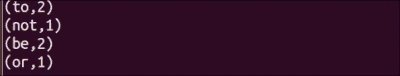

# 从 HDFS 加载数据

HDFS 是最广泛使用的海量数据存储系统。HDFS 得到广泛采用的一个原因是它支持在读取时进行模式定义。这意味着 HDFS 在数据写入时不对数据进行任何限制。任何类型的数据都受欢迎，并且可以以原始格式存储。这一特性使其成为原始非结构化数据和半结构化数据的理想存储。

当涉及到读取数据时，即使是非结构化数据也需要一些结构才能有意义。Hadoop 使用 `InputFormat` 来确定如何读取数据。Spark 为 Hadoop 的 `InputFormat` 提供了完全支持，因此任何可以被 Hadoop 读取的数据也可以被 Spark 读取。

默认的 `InputFormat` 是 `TextInputFormat`。`TextInputFormat` 以行的字节偏移量作为键，以行的内容作为值。Spark 使用 `sc.textFile` 方法通过 `TextInputFormat` 读取。它忽略字节偏移量，并创建一个字符串 RDD。

有时文件名本身就包含有用的信息，例如时间序列数据。在这种情况下，您可能希望单独读取每个文件。`sc.wholeTextFiles` 方法允许您这样做。它使用文件名和路径（例如，`hdfs://localhost:9000/user/hduser/words`）作为键，并将整个文件的内容作为值。

Spark 还支持使用 DataFrames 读取各种序列化和压缩友好的格式，如 Avro、Parquet 和 JSON。这些格式将在后续章节中介绍。

在这个菜谱中，我们将探讨如何在 Spark shell 中从 HDFS 加载数据。

## 如何做这件事...

让我们进行词频统计，即统计每个单词出现的次数。在这个菜谱中，我们将从 HDFS 加载数据：

1.  使用以下命令创建 `words` 目录：

    ```py
    $ mkdir words

    ```

1.  将目录更改为 `words`：

    ```py
    $ cd words

    ```

1.  创建 `sh.txt text` 文件，并在其中输入 `"to be or not to be"`：

    ```py
    $ echo "to be or not to be" > sh.txt

    ```

1.  启动 Spark shell：

    ```py
    $ spark-shell

    ```

1.  将 `words` 目录作为 RDD 加载：

    ```py
    scala> val words = sc.textFile("hdfs://localhost:9000/user/hduser/words")

    ```

    ### 注意

    `sc.textFile` 方法也支持传递一个额外的参数来指定分区数。默认情况下，Spark 为每个 `InputSplit` 类创建一个分区，这大致对应于一个块。

    您可以请求更高的分区数。这对于计算密集型作业，如机器学习，效果非常好。由于一个分区不能包含多个块，因此不允许分区数少于块数。

1.  计算行数（结果将是 `1`）：

    ```py
    scala> words.count

    ```

1.  将行（或行）分割成多个单词：

    ```py
    scala> val wordsFlatMap = words.flatMap(_.split("\\W+"))

    ```

1.  将单词转换为（单词，1）——即对于每个作为键的 `word` 的出现，输出 `1` 作为值：

    ```py
    scala> val wordsMap = wordsFlatMap.map( w => (w,1))

    ```

1.  使用 `reduceByKey` 方法将每个单词出现的次数作为键（此函数一次处理两个连续的值，分别表示为 `a` 和 `b`）：

    ```py
    scala> val wordCount = wordsMap.reduceByKey( (a,b) => (a+b))

    ```

1.  打印 RDD：

    ```py
    scala> wordCount.collect.foreach(println)

    ```

1.  将所有前面的操作合并为一步如下：

    ```py
    scala> sc.textFile("hdfs://localhost:9000/user/hduser/words"). flatMap(_.split("\\W+")).map( w => (w,1)). reduceByKey( (a,b) => (a+b)).foreach(println)

    ```

这将给出以下输出：


## 更多内容...

有时我们需要一次性访问整个文件。有时文件名包含有用的数据，例如在时间序列的情况下。有时需要将多行作为一个记录来处理。`sparkContext.wholeTextFiles`在这里提供了帮助。我们将查看来自 ftp://ftp.ncdc.noaa.gov/pub/data/noaa/的天气数据集。

这是一个顶级目录的外观：

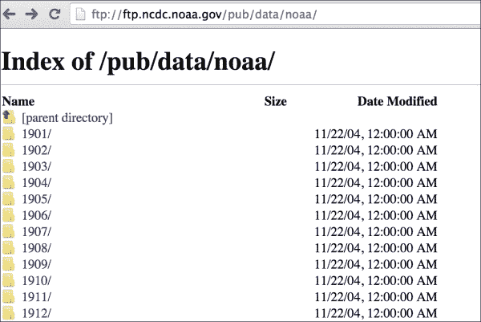

查看特定年份的目录，例如，1901 看起来如下截图所示：

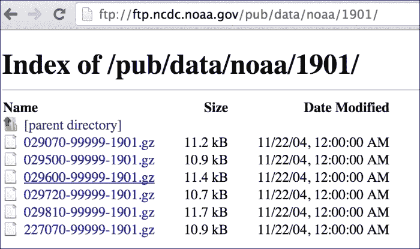

数据以这种方式划分，每个文件名都包含有用的信息，即 USAF-WBAN-year，其中 USAF 是美国空军站编号，WBAN 是气象局陆军海军位置编号。

你还会注意到所有文件都压缩为 gzip 格式，带有`.gz`扩展名。压缩是自动处理的，所以你只需要将数据上传到 HDFS。我们将在接下来的章节中回到这个数据集。

由于整个数据集不大，也可以在伪分布式模式下上传到 HDFS：

1.  下载数据：

    ```py
    $ wget -r ftp://ftp.ncdc.noaa.gov/pub/data/noaa/

    ```

1.  在 HDFS 中加载天气数据：

    ```py
    $ hdfs dfs -put ftp.ncdc.noaa.gov/pub/data/noaa weather/

    ```

1.  启动 Spark shell：

    ```py
    $ spark-shell

    ```

1.  在 RDD 中加载 1901 年的天气数据：

    ```py
    scala> val weatherFileRDD = sc.wholeTextFiles("hdfs://localhost:9000/user/hduser/weather/1901")

    ```

1.  将天气缓存到 RDD 中，以便每次访问时不需要重新计算：

    ```py
    scala> val weatherRDD = weatherFileRDD.cache

    ```

    ### 注意

    在 Spark 中，RDD 可以持久化到各种 StorageLevels。`rdd.cache`是`rdd.persist(MEMORY_ONLY)` StorageLevel 的简写。

1.  计算元素数量：

    ```py
    scala> weatherRDD.count

    ```

1.  由于整个文件内容被作为一个元素加载，我们需要手动解释数据，所以让我们加载第一个元素：

    ```py
    scala> val firstElement = weatherRDD.first

    ```

1.  读取第一个 RDD 的值：

    ```py
    scala> val firstValue = firstElement._2

    ```

    `firstElement`包含形式为（字符串，字符串）的元组。元组可以通过两种方式访问：

    +   使用以`_1`开始的定位函数。

    +   使用`productElement`方法，例如，`tuple.productElement(0)`。这里的索引从`0`开始，就像大多数其他方法一样。

1.  按行拆分`firstValue`：

    ```py
    scala> val firstVals = firstValue.split("\\n")

    ```

1.  计算`firstVals`中的元素数量：

    ```py
    scala> firstVals.size

    ```

1.  天气数据的模式非常丰富，文本的位置作为分隔符。你可以在国家气象服务网站上获取更多关于模式的信息。让我们获取风速，它位于第 66-69 节（以米/秒为单位）：

    ```py
    scala> val windSpeed = firstVals.map(line => line.substring(65,69)

    ```

# 使用自定义 InputFormat 从 HDFS 加载数据

有时你需要以特定格式加载数据，而`TextInputFormat`并不适合这种情况。Spark 为此提供了两种方法：

+   `sparkContext.hadoopFile`：这支持旧的 MapReduce API

+   `sparkContext.newAPIHadoopFile`：这支持新的 MapReduce API

这两种方法为 Hadoop 的所有内置 InputFormats 接口以及任何自定义`InputFormat`提供了支持。

## 如何做到这一点...

我们将使用`KeyValueTextInputFormat`加载键值格式的文本数据并将其加载到 Spark 中：

1.  使用以下命令创建`currency`目录：

    ```py
    $ mkdir currency
    ```

1.  将当前目录更改为`currency`：

    ```py
    $ cd currency
    ```

1.  创建`na.txt`文本文件，并以制表符分隔键值格式输入货币值（键：国家，值：货币）：

    ```py
    $ vi na.txt
    United States of America        US Dollar
    Canada  Canadian Dollar
    Mexico  Peso

    ```

    您可以为每个大洲创建更多文件。

1.  将`currency`文件夹上传到 HDFS：

    ```py
    $ hdfs dfs -put currency /user/hduser/currency

    ```

1.  启动 Spark shell：

    ```py
    $ spark-shell

    ```

1.  导入语句：

    ```py
    scala> import org.apache.hadoop.io.Text
    scala> import org.apache.hadoop.mapreduce.lib.input.KeyValueTextInputFormat

    ```

1.  将`currency`目录作为 RDD 加载：

    ```py
    val currencyFile = sc.newAPIHadoopFile("hdfs://localhost:9000/user/hduser/currency",classOf[KeyValueTextInputFormat],classOf[Text],classOf[Text])

    ```

1.  将其从（Text,Text）元组转换为（String,String）元组：

    ```py
    val currencyRDD = currencyFile.map( t => (t._1.toString,t._2.toString))

    ```

1.  计算 RDD 中元素的数量：

    ```py
    scala> currencyRDD.count

    ```

1.  打印值：

    ```py
    scala> currencyRDD.collect.foreach(println)

    ```

    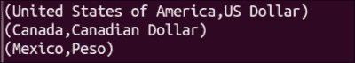

### 注意

您可以使用这种方法加载任何 Hadoop 支持的`InputFormat`接口的数据。

# 从 Amazon S3 加载数据

亚马逊**简单存储服务**（**S3**）为开发人员和 IT 团队提供了一个安全、持久和可扩展的存储平台。亚马逊 S3 的最大优势是无需前期 IT 投资，公司可以根据需要构建容量（只需点击一下按钮即可）。

虽然 Amazon S3 可以与任何计算平台一起使用，但它与亚马逊的云服务（如亚马逊**弹性计算云**（**EC2**）和亚马逊**弹性块存储**（**EBS**））集成得非常好。因此，使用**亚马逊网络服务**（**AWS**）的公司很可能已经在 Amazon S3 上存储了大量的数据。

这正是从 Amazon S3 加载数据到 Spark 的好案例，这正是本菜谱的内容。

## 如何操作...

让我们从 AWS 门户开始：

1.  前往[`aws.amazon.com`](http://aws.amazon.com)，使用您的用户名和密码登录。

1.  登录后，导航到**存储与内容分发** | **S3** | **创建存储桶**：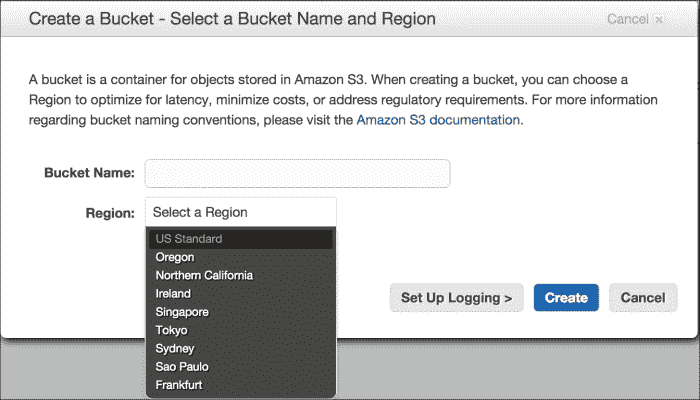

1.  输入存储桶名称——例如，`com.infoobjects.wordcount`。请确保您输入了一个唯一的存储桶名称（全球范围内没有两个 S3 存储桶可以具有相同的名称）。

1.  选择**区域**，点击**创建**，然后点击您创建的存储桶名称，您将看到以下屏幕：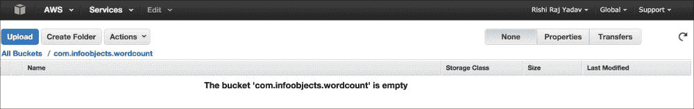

1.  点击**创建文件夹**，并将文件夹名称输入为`words`。

1.  在本地文件系统上创建`sh.txt`文本文件：

    ```py
    $ echo "to be or not to be" > sh.txt

    ```

1.  导航到**单词** | **上传** | **添加文件**，并在对话框中选择`sh.txt`，如图所示：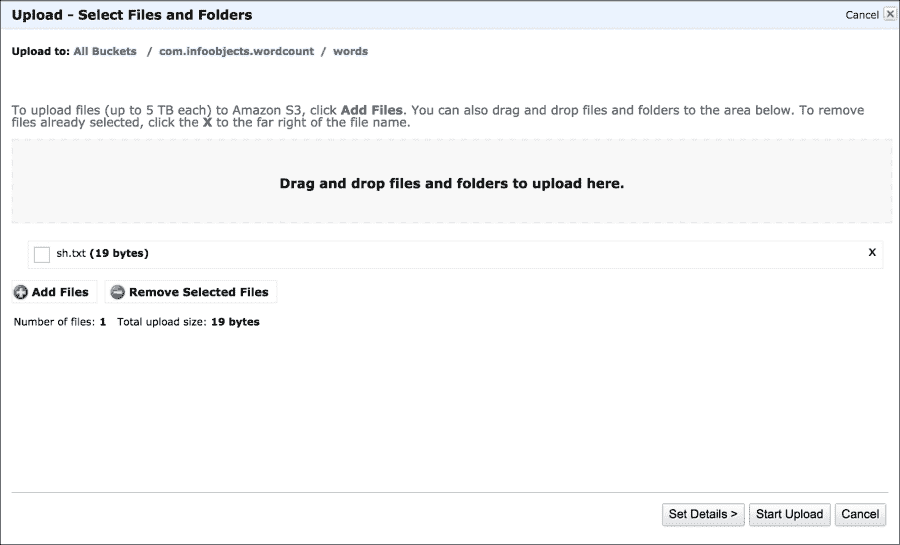

1.  点击**开始上传**。

1.  选择**sh.txt**并点击**属性**，它将显示文件的详细信息：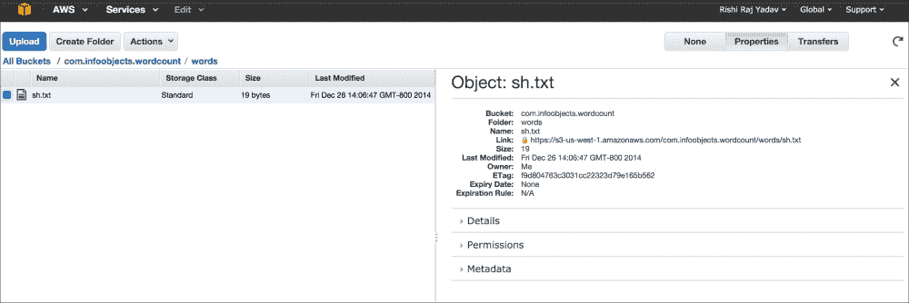

1.  将`AWS_ACCESS_KEY`和`AWS_SECRET_ACCESS_KEY`设置为环境变量。

1.  打开 Spark shell，并将`words`目录从`s3`加载到`words` RDD 中：

    ```py
    scala>  val words = sc.textFile("s3n://com.infoobjects.wordcount/words")

    ```

现在 RDD 已加载，您可以在 RDD 上继续进行常规转换和操作。

### 注意

有时会在`s3://`和`s3n://`之间产生混淆。`s3n://`表示位于 S3 存储桶中的常规文件，但对外部世界来说是可读和可写的。这个文件系统对文件大小设置了 5GB 的限制。

`s3://`表示位于 S3 桶中的 HDFS 文件。它是一个基于块的文件系统。该文件系统要求你为这个文件系统指定一个桶。在这个系统中，文件大小没有限制。

# 从 Apache Cassandra 加载数据

Apache Cassandra 是一个无主环集群结构的 NoSQL 数据库。虽然 HDFS 适合流式数据访问，但它不适合随机访问。例如，当你的平均文件大小为 100 MB 且你想读取整个文件时，HDFS 会工作得很好。如果你经常访问文件中的*n*行或其他部分作为记录，HDFS 会太慢。

关系型数据库传统上提供了解决方案，提供了低延迟和随机访问，但它们不适合大数据。例如，Cassandra 这样的 NoSQL 数据库通过提供关系型数据库类型的访问来填补这一空白，但是在分布式架构和商用服务器上。

在这个菜谱中，我们将从 Cassandra 加载数据作为 Spark RDD。为此，Cassandra 背后的公司 Datastax 贡献了`spark-cassandra-connector`。这个连接器允许你将 Cassandra 表加载为 Spark RDD，将 Spark RDD 写回 Cassandra，并执行 CQL 查询。

## 如何做到这一点...

执行以下步骤从 Cassandra 加载数据:

1.  使用 CQL shell 在 Cassandra 中创建一个名为`people`的键空间：

    ```py
    cqlsh> CREATE KEYSPACE people WITH replication = {'class': 'SimpleStrategy', 'replication_factor': 1 };

    ```

1.  在 Cassandra 的新版本中创建一个名为`person`的列族（从 CQL 3.0 开始，也可以称为**表**）:

    ```py
    cqlsh> create columnfamily person(id int primary key,first_name varchar,last_name varchar);

    ```

1.  在列族中插入一些记录：

    ```py
    cqlsh> insert into person(id,first_name,last_name) values(1,'Barack','Obama');
    cqlsh> insert into person(id,first_name,last_name) values(2,'Joe','Smith');

    ```

1.  将 Cassandra 连接器依赖项添加到 SBT:

    ```py
    "com.datastax.spark" %% "spark-cassandra-connector" % 1.2.0

    ```

1.  你也可以将 Cassandra 依赖项添加到 Maven 中:

    ```py
    <dependency>
      <groupId>com.datastax.spark</groupId>
      <artifactId>spark-cassandra-connector_2.10</artifactId>
      <version>1.2.0</version>
    </dependency>
    ```

    或者，你也可以下载`spark-cassandra-connector` JAR，直接与 Spark shell 一起使用：

    ```py
    $ wget http://central.maven.org/maven2/com/datastax/spark/spark-cassandra-connector_2.10/1.1.0/spark-cassandra-connector_2.10-1.2.0.jar

    ```

    ### 注意

    如果你想要构建包含所有依赖项的`uber` JAR，请参阅*还有更多…*部分。

1.  现在启动 Spark shell。

1.  在 Spark shell 中设置`spark.cassandra.connection.host`属性：

    ```py
    scala> sc.getConf.set("spark.cassandra.connection.host", "localhost")

    ```

1.  导入 Cassandra 特定的库:

    ```py
    scala> import com.datastax.spark.connector._

    ```

1.  将`person`列族加载为 RDD：

    ```py
    scala> val personRDD = sc.cassandraTable("people","person")

    ```

1.  计算 RDD 中的记录数:

    ```py
    scala> personRDD.count

    ```

1.  在 RDD 中打印数据:

    ```py
    scala> personRDD.collect.foreach(println)

    ```

1.  检索第一行:

    ```py
    scala> val firstRow = personRDD.first

    ```

1.  获取列名:

    ```py
    scala> firstRow.columnNames

    ```

1.  Cassandra 也可以通过 Spark SQL 访问。它有一个围绕`SQLContext`的包装器，称为`CassandraSQLContext`；让我们加载它：

    ```py
    scala> val cc = new org.apache.spark.sql.cassandra.CassandraSQLContext(sc)

    ```

1.  将`person`数据加载为`SchemaRDD`:

    ```py
    scala> val p = cc.sql("select * from people.person")

    ```

1.  检索`person`数据:

    ```py
    scala> p.collect.foreach(println)

    ```

## 还有更多...

Spark Cassandra 的连接器库有很多依赖项。连接器本身及其一些依赖项是 Spark 的第三方组件，并且不是 Spark 安装的一部分。

这些依赖项需要在运行时对驱动程序和执行器都可用。一种方法是将所有传递依赖项捆绑在一起，但这是一个费时且容易出错的过程。推荐的方法是将所有依赖项以及连接器库捆绑在一起。这将导致一个胖 JAR，通常称为`uber` JAR。

SBT 提供了 `sbt-assembly` 插件，这使得创建 `uber` JAR 非常容易。以下是为 `spark-cassandra-connector` 创建 `uber` JAR 的步骤。这些步骤足够通用，你可以使用它们来创建任何 `uber` JAR：

1.  创建一个名为 `uber` 的文件夹：

    ```py
    $ mkdir uber

    ```

1.  将目录更改为 `uber`：

    ```py
    $ cd uber

    ```

1.  打开 SBT 提示符：

    ```py
    $ sbt

    ```

1.  给这个项目命名为 `sc-uber`：

    ```py
    > set name := "sc-uber"

    ```

1.  保存会话：

    ```py
    > session save

    ```

1.  退出会话：

    ```py
    > exit

    ```

    这将在 `uber` 文件夹中创建 `build.sbt`、`project` 和 `target` 文件夹，如下截图所示：

    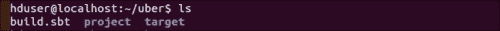

1.  在 `build.sbt` 文件的末尾添加 `spark-cassandra-driver` 依赖项，并在下面留一个空行，如下截图所示：

    ```py
    $ vi buid.sbt

    ```

    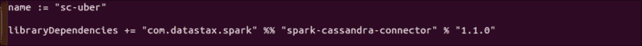

1.  我们将使用 `MergeStrategy.first` 作为默认策略。除此之外，还有一些文件，例如 `manifest.mf`，每个 JAR 都会打包用于元数据，我们可以简单地丢弃它们。我们将使用 `MergeStrategy.discard` 来处理这些文件。以下是在 `build.sbt` 中添加了 `assemblyMergeStrategy` 的截图：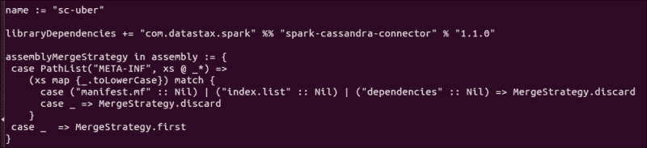

1.  现在在 `project` 文件夹中创建 `plugins.sbt` 并为 `sbt-assembly` 插件输入以下内容：

    ```py
    addSbtPlugin("com.eed3si9n" % "sbt-assembly" % "0.12.0")

    ```

1.  我们现在准备好构建（`assembly`）一个 JAR：

    ```py
    $ sbt assembly

    ```

    `uber` JAR 已在 `target/scala-2.10/sc-uber-assembly-0.1-SNAPSHOT.jar` 中创建。

1.  将其复制到保存所有第三方 JAR 的合适位置，例如 `/home/hduser/thirdparty`，并将其重命名为一个更容易的名字（除非你喜欢更长的名字）：

    ```py
    $ mv thirdparty/sc-uber-assembly-0.1-SNAPSHOT.jar  thirdparty/sc-uber.jar

    ```

1.  使用 `--jars` 选项加载带有 `uber` JAR 的 Spark shell：

    ```py
    $ spark-shell --jars thirdparty/sc-uber.jar

    ```

1.  要将 Scala 代码提交到集群，你可以使用相同的 JARS 选项调用 `spark-submit`：

    ```py
    $ spark-submit --jars thirdparty/sc-uber.jar

    ```

### sbt-assembly 中的合并策略

如果多个 JAR 有相同名称和相同相对路径的文件，`sbt-assembly` 插件的默认合并策略是验证所有文件的内容是否相同，如果不相同则报错。这种策略称为 `MergeStrategy.deduplicate`。

以下是在 `sbt-assembly 插件` 中可用的合并策略：

| 策略名称 | 描述 |
| --- | --- |
| `MergeStrategy.deduplicate` | 默认策略 |
| `MergeStrategy.first` | 根据类路径选择第一个文件 |
| `MergeStrategy.last` | 根据类路径选择最后一个文件 |
| `MergeStrategy.singleOrError` | 报错（预期不会出现合并冲突） |
| `MergeStrategy.concat` | 将所有匹配的文件连接在一起 |
| `MergeStrategy.filterDistinctLines` | 连接，忽略重复项 |
| `MergeStrategy.rename` | 重命名文件 |

# 从关系型数据库加载数据

许多重要数据都存储在 Spark 需要查询的关系型数据库中。JdbcRDD 是 Spark 的一个功能，允许关系型表被加载为 RDD。本食谱将解释如何使用 JdbcRDD。

在下一章中将要介绍的 Spark SQL 包含了一个 JDBC 数据源。这应该比当前的配方更受欢迎，因为结果以 DataFrames（将在下一章介绍）的形式返回，这些数据帧可以很容易地由 Spark SQL 处理，并且还可以与其他数据源联合。

## 准备工作

请确保 JDBC 驱动程序 JAR 在客户端节点上可见，以及在所有将运行执行器的从节点上。

## 如何操作…

执行以下步骤从关系型数据库加载数据：

1.  使用以下 DDL 在 MySQL 中创建一个名为 `person` 的表：

    ```py
    CREATE TABLE 'person' (
      'person_id' int(11) NOT NULL AUTO_INCREMENT,
      'first_name' varchar(30) DEFAULT NULL,
      'last_name' varchar(30) DEFAULT NULL,
      'gender' char(1) DEFAULT NULL,
      PRIMARY KEY ('person_id');
    )
    ```

1.  插入一些数据：

    ```py
    Insert into person values('Barack','Obama','M');
    Insert into person values('Bill','Clinton','M');
    Insert into person values('Hillary','Clinton','F');
    ```

1.  从 [`dev.mysql.com/downloads/connector/j/`](http://dev.mysql.com/downloads/connector/j/) 下载 `mysql-connector-java-x.x.xx-bin.jar`。

1.  使 MySQL 驱动程序对 Spark shell 可用并启动它：

    ```py
    $ spark-shell --jars /path-to-mysql-jar/mysql-connector-java-5.1.29-bin.jar

    ```

    ### 注意

    请注意，`path-to-mysql-jar` 不是实际的路径名称。您应该使用实际的路径名称。

1.  为用户名、密码和 JDBC URL 创建变量：

    ```py
    scala> val url="jdbc:mysql://localhost:3306/hadoopdb"
    scala> val username = "hduser"
    scala> val password = "******"

    ```

1.  导入 JdbcRDD：

    ```py
    scala> import org.apache.spark.rdd.JdbcRDD

    ```

1.  导入 JDBC 相关类：

    ```py
    scala> import java.sql.{Connection, DriverManager, ResultSet}

    ```

1.  创建 JDBC 驱动程序的实例：

    ```py
    scala> Class.forName("com.mysql.jdbc.Driver").newInstance

    ```

1.  加载 JdbcRDD：

    ```py
    scala> val myRDD = new JdbcRDD( sc, () =>
    DriverManager.getConnection(url,username,password) ,
    "select first_name,last_name,gender from person limit ?, ?",
    1, 5, 2, r => r.getString("last_name") + ", " + r.getString("first_name"))

    ```

1.  现在查询结果：

    ```py
    scala> myRDD.count
    scala> myRDD.foreach(println)

    ```

1.  将 RDD 保存到 HDFS：

    ```py
    scala> myRDD.saveAsTextFile("hdfs://localhost:9000/user/hduser/person")

    ```

## 它是如何工作的…

JdbcRDD 是一个在 JDBC 连接上执行 SQL 查询并检索结果的 RDD。以下是一个 JdbcRDD 构造函数：

```py
JdbcRDD( SparkContext, getConnection: () => Connection,
sql: String, lowerBound: Long, upperBound: Long,
numPartitions: Int,  mapRow: (ResultSet) => T =
 JdbcRDD.resultSetToObjectArray)

```

两个 ? 是 JdbcRDD 内部预处理语句的绑定变量。第一个 ? 是偏移量（下限），即我们应该从哪一行开始计算，第二个 ? 是限制（上限），即我们应该读取多少行。

JdbcRDD 是一种在 Spark 中直接从关系型数据库加载数据的便捷方式。如果您想从 RDBMS 批量加载数据，还有其他更有效的方法，例如，Apache Sqoop 是一个强大的工具，可以从关系型数据库导入和导出到 HDFS。
