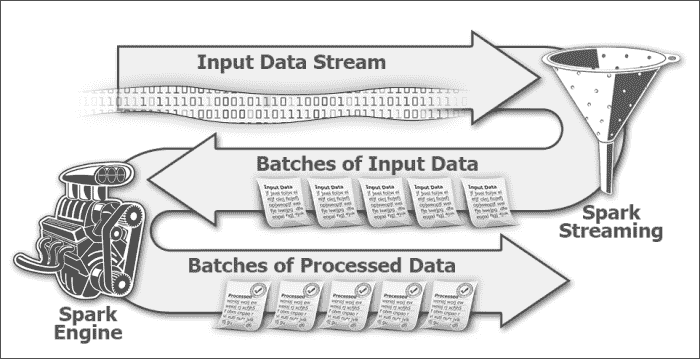
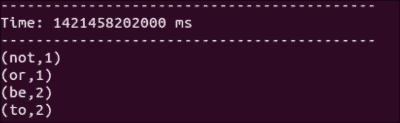
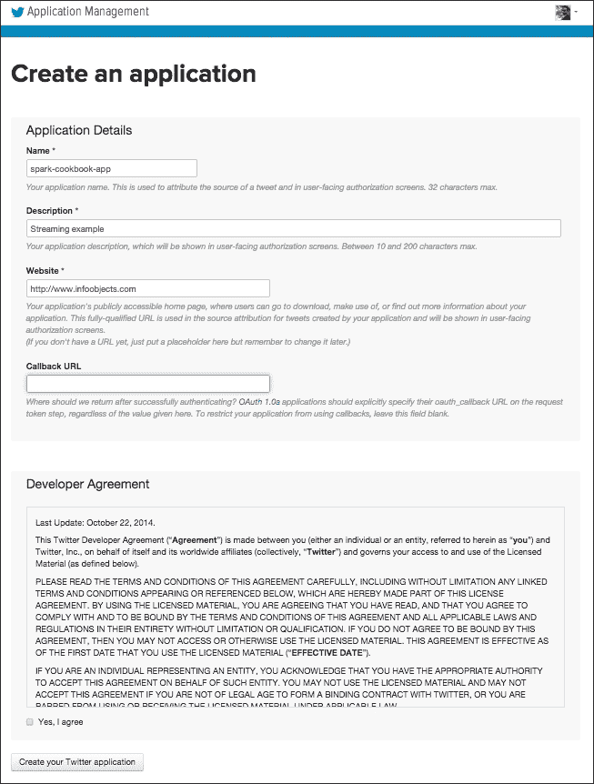
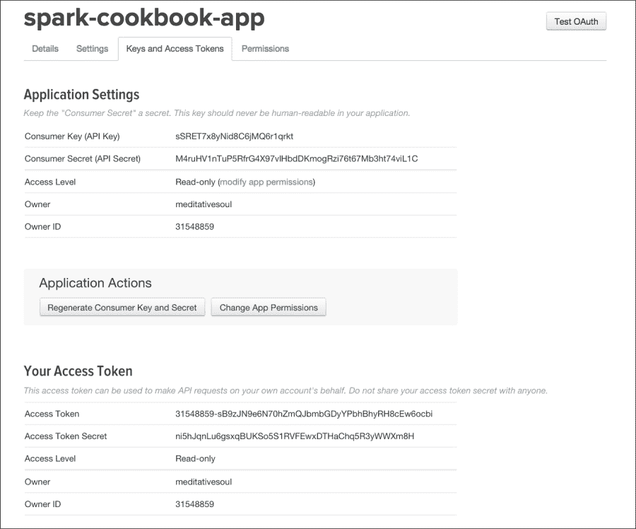
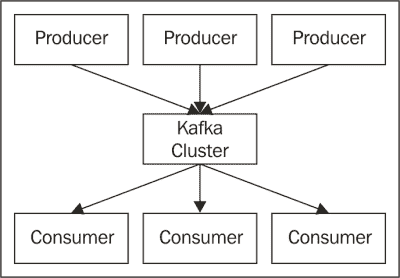
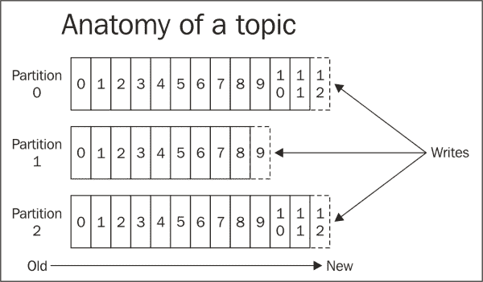
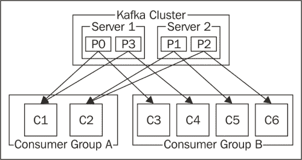
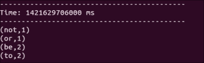

# 第五章：Spark Streaming

Spark Streaming 为 Apache Spark 添加了大数据处理的圣杯——即实时分析。它使 Spark 能够摄取实时数据流，并在几秒钟的低延迟下提供实时智能。

在本章中，我们将介绍以下食谱：

+   使用流式处理进行词频统计

+   流式处理 Twitter 数据

+   使用 Kafka 进行流式处理

# 简介

流式处理是将持续流动的输入数据划分为离散单元的过程，以便可以轻松处理。现实生活中的熟悉例子是流式视频和音频内容（尽管用户可以在观看之前下载完整电影，但更快的解决方案是流式传输数据的小块，这些小块开始播放给用户，而其余的数据则在后台下载）。

除了多媒体之外，流式处理的现实世界例子还包括处理市场数据、天气数据、电子股票交易数据等。所有这些应用都以非常快的速度产生大量数据，并需要特殊处理数据，以便可以从数据中实时提取见解。

在我们专注于 Spark Streaming 之前，了解一些基本概念会更好。流式应用程序接收数据的速率称为**数据速率**，并以**千字节每秒**（**kbps**）或**兆字节每秒**（**mbps**）的形式表示。

流式处理的一个重要用例是**复杂事件处理**（**CEP**）。在 CEP 中，控制正在处理的数据范围非常重要。这个范围被称为窗口，可以是基于时间或大小的。一个基于时间的窗口示例是分析最后一分钟内到达的数据。一个基于大小的窗口示例可以是给定股票最后 100 笔交易的平均询问价格。

Spark Streaming 是 Spark 的库，它提供了处理实时数据的支持。这个流可以从任何来源获取，例如 Twitter、Kafka 或 Flume。

Spark Streaming 有几个基本构建块，在深入到食谱之前，我们需要很好地理解它们。

Spark Streaming 有一个名为`StreamingContext`的上下文包装器，它围绕`SparkContext`包装，是 Spark Streaming 功能的入口点。根据定义，流式数据是连续的，需要被时间切片以进行处理。这个时间切片被称为**批处理间隔**，在创建`StreamingContext`时指定。RDD 和批处理之间存在一对一的映射，即每个批次产生一个 RDD。正如您在以下图像中可以看到的，Spark Streaming 获取连续数据，将其划分为批次，并馈送到 Spark。



批处理间隔对于优化你的流式应用程序非常重要。理想情况下，你希望以至少与数据摄入相同的速度处理数据；否则，你的应用程序将产生积压。Spark Streaming 在批处理间隔期间收集数据，例如，2 秒。当这个 2 秒间隔结束时，该间隔收集的数据将被交给 Spark 进行处理，而 Streaming 将专注于收集下一个批处理间隔的数据。现在，这个 2 秒的批处理间隔是 Spark 处理数据的时间，因为它应该有自由接收下一个批处理数据的空间。如果 Spark 可以更快地处理数据，你可以将批处理间隔减少到，例如，1 秒。如果 Spark 无法跟上这个速度，你必须增加批处理间隔。

Spark Streaming 中 RDD 的连续流需要通过一个抽象来表示，这样它就可以被处理。这个抽象被称为**离散流**（**DStream**）。对 DStream 应用的任何操作都会导致对底层 RDD 的操作。

每个输入 DStream 都与一个接收器相关联（除了文件流）。接收器从输入源接收数据并将其存储在 Spark 的内存中。有两种类型的流式源：

+   基本源，例如文件和套接字连接

+   高级源，例如 Kafka 和 Flume

Spark Streaming 还提供了窗口计算，你可以对数据的滑动窗口应用转换。滑动窗口操作基于两个参数：

+   **窗口长度**：这是窗口的持续时间。例如，如果你想获取最后 1 分钟数据的分析，窗口长度将是 1 分钟。

+   **滑动间隔**：这描述了你希望多久执行一次操作。比如说，你想每 10 秒执行一次操作；这意味着每 10 秒，1 分钟的窗口将有 50 秒的数据与上一个窗口相同，并且有 10 秒的新数据。

这两个参数都作用于底层的 RDDs，显然，它们不能被拆分；因此，这两个都应该是最小批处理间隔的倍数。窗口长度也必须是滑动间隔的倍数。

DStream 也有输出操作，允许数据被推送到外部系统。它们类似于 RDD 上的操作（在 DStream 中发生的事情实际上是 RDD 的一个更高层次的抽象）。

除了打印 DStream 的内容外，还支持标准 RDD 操作，如`saveAsTextFile`、`saveAsObjectFile`和`saveAsHadoopFile`，分别有类似的对应操作，如`saveAsTextFiles`、`saveAsObjectFiles`和`saveAsHadoopFiles`。

一个非常有用的输出操作是`foreachRDD(func)`，它将任何任意函数应用于所有 RDDs。

# 使用 Streaming 进行词频统计

让我们从 Streaming 的一个简单例子开始，在这个例子中，我们将在一个终端中输入一些文本，而 Streaming 应用程序将在另一个窗口中捕获它。

## 如何做到这一点...

1.  启动 Spark shell 并给它一些额外的内存：

    ```py
    $ spark-shell --driver-memory 1G

    ```

1.  流特定导入：

    ```py
    scala> import org.apache.spark.SparkConf
    scala> import org.apache.spark.streaming.{Seconds, StreamingContext}
    scala> import org.apache.spark.storage.StorageLevel
    scala> import StorageLevel._

    ```

1.  导入隐式转换：

    ```py
    scala> import org.apache.spark._
    scala> import org.apache.spark.streaming._
    scala> import org.apache.spark.streaming.StreamingContext._

    ```

1.  创建具有 2 秒批处理间隔的`StreamingContext`：

    ```py
    scala> val ssc = new StreamingContext(sc, Seconds(2))

    ```

1.  在本地主机上创建具有`8585`端口的`SocketTextStream` Dstream，并使用`MEMORY_ONLY`缓存：

    ```py
    scala> val lines = ssc.socketTextStream("localhost",8585,MEMORY_ONLY)

    ```

1.  将行分割成多个单词：

    ```py
    scala> val wordsFlatMap = lines.flatMap(_.split(" "))

    ```

1.  将单词转换为（单词，1），即输出`1`作为每个单词出现的键的值：

    ```py
    scala> val wordsMap = wordsFlatMap.map( w => (w,1))

    ```

1.  使用`reduceByKey`方法将每个单词的出现次数作为键（该函数一次处理两个连续的值，分别表示为`a`和`b`）：

    ```py
    scala> val wordCount = wordsMap.reduceByKey( (a,b) => (a+b))

    ```

1.  打印`wordCount`：

    ```py
    scala> wordCount.print

    ```

1.  启动`StreamingContext`；记住，直到`StreamingContext`启动之前，没有任何事情发生：

    ```py
    scala> ssc.start

    ```

1.  现在，在另一个窗口中，启动 netcat 服务器：

    ```py
    $ nc -lk 8585

    ```

1.  输入不同的行，例如`to be or not to be`：

    ```py
    to be or not to be

    ```

1.  检查 Spark shell，您将看到如下截图所示的单词计数结果：

# 流式传输 Twitter 数据

Twitter 是一个著名的微博平台。它每天产生约 5 亿条推文，产生了大量数据。Twitter 允许通过 API 访问其数据，这使得它成为测试任何大数据流式应用的最佳示例。

在这个菜谱中，我们将看到如何使用 Twitter 流式库在 Spark 中实时流式传输数据。Twitter 只是向 Spark 提供流式数据的一个来源，并没有特殊地位。因此，没有为 Twitter 提供内置库。尽管如此，Spark 确实提供了一些 API 来简化与 Twitter 库的集成。

一个使用实时 Twitter 数据流的示例用途是找到过去 5 分钟内的热门推文。

## 如何操作...

1.  如果您还没有，请创建一个 Twitter 账户。

1.  前往[`apps.twitter.com`](http://apps.twitter.com)。

1.  点击**创建新应用**。

1.  输入**名称**、**描述**、**网站**，然后点击**创建您的 Twitter 应用**。

1.  您将到达**应用程序管理**屏幕。

1.  导航到**密钥和访问令牌** | **创建我的访问令牌**。

1.  在此屏幕上记下我们将用于第 14 步的四个值：

    **消费者密钥（API 密钥**）

    **消费者密钥（API 密钥**）

    **访问令牌**

    **访问令牌密钥**

1.  我们将需要在一段时间内提供此屏幕上的值，但现在，让我们从 Maven central 下载所需的第三方库：

    ```py
    $ wget http://central.maven.org/maven2/org/apache/spark/spark-streaming-twitter_2.10/1.2.0/spark-streaming-twitter_2.10-1.2.0.jar
    $ wget http://central.maven.org/maven2/org/twitter4j/twitter4j-stream/4.0.2/twitter4j-stream-4.0.2.jar
    $ wget http://central.maven.org/maven2/org/twitter4j/twitter4j-core/4.0.2/twitter4j-core-4.0.2.jar

    ```

1.  打开 Spark shell，提供前面的三个 JARS 作为依赖项：

    ```py
    $ spark-shell --jars spark-streaming-twitter_2.10-1.2.0.jar, twitter4j-stream-4.0.2.jar,twitter4j-core-4.0.2.jar

    ```

1.  执行特定的 Twitter 导入：

    ```py
    scala> import org.apache.spark.streaming.twitter._
    scala> import twitter4j.auth._
    scala> import twitter4j.conf._

    ```

1.  流特定导入：

    ```py
    scala> import org.apache.spark.streaming.{Seconds, StreamingContext}

    ```

1.  导入隐式转换：

    ```py
    scala> import org.apache.spark._
    scala> import org.apache.spark.streaming._
    scala> import org.apache.spark.streaming.StreamingContext._

    ```

1.  创建具有 10 秒批处理间隔的`StreamingContext`：

    ```py
    scala> val ssc = new StreamingContext(sc, Seconds(10))

    ```

1.  创建具有 2 秒批处理间隔的`StreamingContext`：

    ```py
    scala> val cb = new ConfigurationBuilder
    scala> cb.setDebugEnabled(true)
    .setOAuthConsumerKey("FKNryYEKeCrKzGV7zuZW4EKeN")
    .setOAuthConsumerSecret("x6Y0zcTBOwVxpvekSCnGzbi3NYNrM5b8ZMZRIPI1XRC3pDyOs1")
     .setOAuthAccessToken("31548859-DHbESdk6YoghCLcfhMF88QEFDvEjxbM6Q90eoZTGl")
    .setOAuthAccessTokenSecret("wjcWPvtejZSbp9cgLejUdd6W1MJqFzm5lByUFZl1NYgrV")
    val auth = new OAuthAuthorization(cb.build)

    ```

    ### 注意事项

    这些是示例值，您应该使用自己的值。

1.  创建 Twitter DStream：

    ```py
    scala> val tweets = TwitterUtils.createStream(ssc,auth)

    ```

1.  过滤掉英文推文：

    ```py
    scala> val englishTweets = tweets.filter(_.getLang()=="en")

    ```

1.  从推文中获取文本：

    ```py
    scala> val status = englishTweets.map(status => status.getText)

    ```

1.  设置检查点目录：

    ```py
    scala> ssc.checkpoint("hdfs://localhost:9000/user/hduser/checkpoint")

    ```

1.  启动`StreamingContext`：

    ```py
    scala> ssc.start
    scala> ssc.awaitTermination

    ```

1.  您可以使用`:paste`将这些命令组合在一起：

    ```py
    scala> :paste
    import org.apache.spark.streaming.twitter._
    import twitter4j.auth._
    import twitter4j.conf._
    import org.apache.spark.streaming.{Seconds, StreamingContext}
    import org.apache.spark._
    import org.apache.spark.streaming._
    import org.apache.spark.streaming.StreamingContext._
    val ssc = new StreamingContext(sc, Seconds(10))
    val cb = new ConfigurationBuilder
    cb.setDebugEnabled(true).setOAuthConsumerKey("FKNryYEKeCrKzGV7zuZW4EKeN")
     .setOAuthConsumerSecret("x6Y0zcTBOwVxpvekSCnGzbi3NYNrM5b8ZMZRIPI1XRC3pDyOs1")
     .setOAuthAccessToken("31548859-DHbESdk6YoghCLcfhMF88QEFDvEjxbM6Q90eoZTGl")
     .setOAuthAccessTokenSecret("wjcWPvtejZSbp9cgLejUdd6W1MJqFzm5lByUFZl1NYgrV")
    val auth = new OAuthAuthorization(cb.build)
    val tweets = TwitterUtils.createStream(ssc,Some(auth))
    val englishTweets = tweets.filter(_.getLang()=="en")
    val status = englishTweets.map(status => status.getText)
    status.print
    ssc.checkpoint("hdfs://localhost:9000/checkpoint")
    ssc.start
    ssc.awaitTermination

    ```

# 使用 Kafka 进行流式传输：

Kafka 是一个分布式、分区和复制的提交日志服务。简单来说，它是一个分布式消息服务器。Kafka 在称为**主题**的分类中维护消息源。主题的一个例子是你想获取新闻的公司的股票代码，例如，Cisco 的 CSCO。

产生消息的过程称为**生产者**，而消费消息的过程称为**消费者**。在传统消息传递中，消息传递服务有一个中央消息服务器，也称为**代理**。由于 Kafka 是一个分布式消息传递服务，它有一个由代理组成的集群，这些代理在功能上充当一个 Kafka 代理，如图所示：



对于每个主题，Kafka 维护一个分区的日志。这个分区日志由一个或多个跨集群的分区组成，如下图所示：



Kafka 借鉴了 Hadoop 和其他大数据框架的许多概念。分区概念与 Hadoop 中的`InputSplit`概念非常相似。在最简单的形式中，当使用`TextInputFormat`时，`InputSplit`与一个块相同。块以键值对的形式读取，在`TextInputFormat`中，键是行的字节偏移量，值是行的内容本身。以类似的方式，在 Kafka 分区中，记录以键值对的形式存储和检索，其中键是一个称为偏移量的顺序 ID，值是实际的消息。

在 Kafka 中，消息保留不依赖于消费者的消费。消息保留一个可配置的时间段。每个消费者都可以自由地以任何顺序读取消息。它只需要保留一个偏移量。另一个类比是阅读一本书，其中页码类似于偏移量，而页面内容类似于消息。读者可以自由地以任何方式阅读，只要他们记得书签（当前偏移量）。

为了提供类似于传统消息系统中 pub/sub 和 PTP（队列）的功能，Kafka 有消费者组的概念。消费者组是一组消费者，Kafka 集群将其视为一个单一单元。在消费者组中，只需要一个消费者接收消息。如果以下图中的消费者 C1 接收了主题 T1 的第一个消息，那么该主题的所有后续消息也将发送给这个消费者。使用这种策略，Kafka 保证了给定主题的消息传递顺序。

在极端情况下，当所有消费者都在一个消费者组中时，Kafka 集群表现得像 PTP/队列。在另一个极端情况下，如果每个消费者都属于不同的组，它表现得像 pub/sub。在实践中，每个消费者组都有一定数量的消费者。



这个菜谱将向您展示如何使用来自 Kafka 的数据执行单词计数。

## 准备工作

此配方假设 Kafka 已经安装。Kafka 与 ZooKeeper 一起打包。我们假设 Kafka 的家目录在 `/opt/infoobjects/kafka`：

1.  启动 ZooKeeper：

    ```py
    $ /opt/infoobjects/kafka/bin/zookeeper-server-start.sh /opt/infoobjects/kafka/config/zookeeper.properties

    ```

1.  启动 Kafka 服务器:

    ```py
    $ /opt/infoobjects/kafka/bin/kafka-server-start.sh /opt/infoobjects/kafka/config/server.properties

    ```

1.  创建一个 `test` 主题：

    ```py
    $ /opt/infoobjects/kafka/bin/kafka-topics.sh --create --zookeeper localhost:2181 --replication-factor 1 --partitions 1 --topic test

    ```

## 如何操作...

1.  下载 `spark-streaming-kafka` 库及其依赖项:

    ```py
    $ wget http://central.maven.org/maven2/org/apache/spark/spark-streaming-kafka_2.10/1.2.0/spark-streaming-kafka_2.10-1.2.0.jar
    $ wget http://central.maven.org/maven2/org/apache/kafka/kafka_2.10/0.8.1/kafka_2.10-0.8.1.jar
    $ wget http://central.maven.org/maven2/com/yammer/metrics/metrics-core/2.2.0/metrics-core-2.2.0.jar
    $ wget http://central.maven.org/maven2/com/101tec/zkclient/0.4/zkclient-0.4.jar

    ```

1.  启动 Spark shell 并提供 `spark-streaming-kafka` 库:

    ```py
    $ spark-shell --jars spark-streaming-kafka_2.10-1.2.0.jar, kafka_2.10-0.8.1.jar,metrics-core-2.2.0.jar,zkclient-0.4.jar

    ```

1.  流特定导入:

    ```py
    scala> import org.apache.spark.streaming.{Seconds, StreamingContext}

    ```

1.  导入以进行隐式转换:

    ```py
    scala> import org.apache.spark._
    scala> import org.apache.spark.streaming._
    scala> import org.apache.spark.streaming.StreamingContext._
    scala> import org.apache.spark.streaming.kafka.KafkaUtils

    ```

1.  使用 2 秒批处理间隔创建 `StreamingContext`:

    ```py
    scala> val ssc = new StreamingContext(sc, Seconds(2))

    ```

1.  设置 Kafka 特定变量:

    ```py
    scala> val zkQuorum = "localhost:2181"
    scala> val group = "test-group"
    scala> val topics = "test"
    scala> val numThreads = 1

    ```

1.  创建 `topicMap`:

    ```py
    scala> val topicMap = topics.split(",").map((_,numThreads.toInt)).toMap

    ```

1.  创建 Kafka DStream:

    ```py
    scala> val lineMap = KafkaUtils.createStream(ssc, zkQuorum, group, topicMap)

    ```

1.  从 lineMap 中提取值:

    ```py
    scala> val lines = lineMap.map(_._2)

    ```

1.  创建值的 `flatMap`:

    ```py
    scala> val words = lines.flatMap(_.split(" "))

    ```

1.  创建 (word,occurrence) 的键值对：

    ```py
    scala> val pair = words.map( x => (x,1))

    ```

1.  对滑动窗口进行单词计数：

    ```py
    scala> val wordCounts = pair.reduceByKeyAndWindow(_ + _, _ - _, Minutes(10), Seconds(2), 2)
    scala> wordCounts.print

    ```

1.  设置 `checkpoint` 目录:

    ```py
    scala> ssc.checkpoint("hdfs://localhost:9000/user/hduser/checkpoint")

    ```

1.  启动 `StreamingContext`:

    ```py
    scala> ssc.start
    scala> ssc.awaitTermination

    ```

1.  在另一个窗口中发布 Kafka 的 `test` 主题消息：

    ```py
    $ /opt/infoobjects/kafka/bin/kafka-console-producer.sh --broker-list localhost:9092 --topic test

    ```

1.  现在，通过在步骤 15 按 *Enter* 键并在每条消息后发布消息。

1.  现在，当你向 Kafka 发布消息时，你将在 Spark shell 中看到它们：

## 更多...

假设你想维护每个单词出现的运行计数。Spark Streaming 有一个名为 `updateStateByKey` 操作的功能。`updateStateByKey` 操作允许你在更新时维护任何任意状态。

这个任意状态可以是聚合值，也可以是状态的变化（如推特上用户的情绪）。执行以下步骤：

1.  在 pairs RDD 上调用 `updateStateByKey`：

    ```py
    scala> val runningCounts = wordCounts.updateStateByKey( (values: Seq[Int], state: Option[Int]) => Some(state.sum + values.sum))

    ```

    ### 注意

    `updateStateByKey` 操作返回一个新的 "状态" DStream，其中每个键的状态通过在键的先前状态和新值上应用给定的函数来更新。这可以用来为每个键维护任意状态数据。

    实现此操作涉及两个步骤：

    +   定义状态

    +   定义状态 `update` 函数

    `updateStateByKey` 操作对每个键调用一次，值表示与该键关联的值的序列，非常类似于 MapReduce，状态可以是任何任意状态，我们选择将其设置为 `Option[Int]`。在步骤 18 的每次调用中，通过将当前值的总和添加到它来更新先前状态。

1.  打印结果:

    ```py
    scala> runningCounts.print

    ```

1.  以下是将任意状态维护使用 `updateStateByKey` 操作的所有步骤的组合：

    ```py
    Scala> :paste
    import org.apache.spark.streaming.{Seconds, StreamingContext}
     import org.apache.spark._
     import org.apache.spark.streaming._
     import org.apache.spark.streaming.kafka._
     import org.apache.spark.streaming.StreamingContext._
     val ssc = new StreamingContext(sc, Seconds(2))
     val zkQuorum = "localhost:2181"
     val group = "test-group"
     val topics = "test"
     val numThreads = 1
     val topicMap = topics.split(",").map((_,numThreads.toInt)).toMap
     val lineMap = KafkaUtils.createStream(ssc, zkQuorum, group, topicMap)
     val lines = lineMap.map(_._2)
     val words = lines.flatMap(_.split(" "))
     val pairs = words.map(x => (x,1))
     val runningCounts = pairs.updateStateByKey( (values: Seq[Int], state: Option[Int]) => Some(state.sum + values.sum))
     runningCounts.print
    ssc.checkpoint("hdfs://localhost:9000/user/hduser/checkpoint")
     ssc.start
     ssc.awaitTermination

    ```

1.  通过按 *Ctrl* + *D* 运行它（这将执行使用 `:paste` 粘贴的代码）。
