# 第八章. 使用 MLlib 进行监督学习 – 分类

本章分为以下食谱：

+   使用逻辑回归进行分类

+   使用支持向量机进行二分类

+   使用决策树进行分类

+   使用随机森林进行分类

+   使用梯度提升树进行分类

+   使用朴素贝叶斯进行分类

# 简介

分类问题类似于上一章讨论的回归问题，除了结果变量 *y* 只取几个离散值。在二分类中，*y* 只取两个值：0 或 1。你也可以将响应变量在分类中可以取的值视为代表类别。

# 使用逻辑回归进行分类

在分类中，响应变量 *y* 有离散值，而不是连续值。一些例子包括电子邮件（垃圾邮件/非垃圾邮件）、交易（安全/欺诈）等等。

在以下方程中的 *y* 变量可以取两个值，0 或 1：

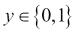

在这里，0 被称为负类，1 表示正类。尽管我们称它们为正类或负类，但这只是为了方便。算法对此分配是中立的。

线性回归虽然对于回归任务效果很好，但在分类任务中存在一些限制。这些包括：

+   调整过程非常容易受到异常值的影响

+   无法保证假设函数 *h(x)* 将会适应范围 0（负类）到 1（正类）

逻辑回归保证 *h(x)* 将会适应在 0 和 1 之间。尽管逻辑回归中包含回归这个词，但它更多的是一个误称，它是一个非常典型的分类算法：

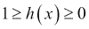

在线性回归中，假设函数如下所示：


在逻辑回归中，我们稍微修改了假设方程，如下所示：

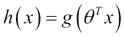

*g* 函数被称为 **Sigmoid 函数** 或 **逻辑函数**，对于实数 *t* 定义如下：

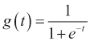

这是 Sigmoid 函数作为图形的样子：

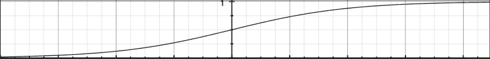

如你所见，当 *t* 接近负无穷大时，*g(t)* 接近 0，而当 *t* 接近无穷大时，*g(t)* 接近 1。因此，这保证了假设函数的输出永远不会超出 0 到 1 的范围。

现在，假设函数可以重写为：

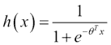

*h(x)* 是给定预测变量 *x* 时 *y = 1* 的估计概率，因此 *h(x)* 也可以重写为：

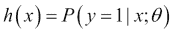

换句话说，假设函数显示了在特征矩阵 *x* 和参数 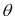 下 *y* 为 1 的概率。这个概率可以是 0 到 1 之间的任何实数，但我们的分类目标不允许我们拥有连续值；我们只能有两个值 0 或 1，表示负类或正类。

假设我们预测 *y = 1* 如果

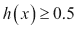

否则预测 *y = 0*。如果我们再次查看 sigmoid 函数图，我们会意识到，当  sigmoid 函数是 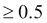，即对于 *t* 的正值，它将预测正类：

由于 ，这意味着对于 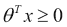，将预测正类。为了更好地说明这一点，让我们将其扩展到二元情况的非矩阵形式：

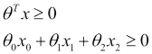

由方程 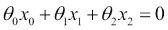 表示的平面将决定给定向量属于正类还是负类。这条线被称为决策边界。

这个边界不一定要根据训练集线性。如果训练数据不能通过线性边界分开，可以添加更高阶的多项式特征来帮助实现。一个例子是通过平方 x1 和 x2 来添加两个新特征，如下所示：

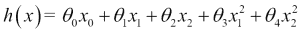

请注意，对于学习算法来说，这种增强与以下方程式完全相同：

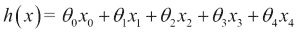

学习算法会将多项式的引入视为另一个特征。这在拟合过程中赋予你巨大的力量。这意味着可以通过正确选择多项式和参数来创建任何复杂的决策边界。

让我们花些时间来理解我们如何选择像线性回归案例中那样的参数值。线性回归中的成本函数 *J* 是：

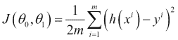

如你所知，我们在成本函数中平均成本。让我们用成本项来表示这一点：

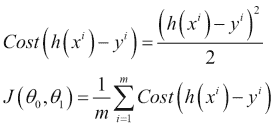

换句话说，成本项是算法在预测真实响应变量值 *y* 的 *h(x)* 时必须付出的代价：

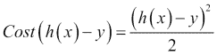

这种成本对于线性回归来说效果很好，但对于逻辑回归来说，这种成本函数是非凸的（即，它导致多个局部最小值），我们需要找到一种更好的凸方法来估计成本。

对于逻辑回归来说效果良好的成本函数如下：

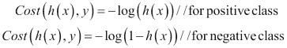

让我们将这两个成本函数合并为一个，通过结合两个：


让我们将这个成本函数放回 *J* 中：

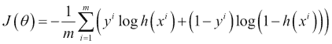

目标是使成本最小化，即最小化 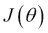 的值。这通过梯度下降算法来完成。Spark 有两个支持逻辑回归的类：

+   `LogisticRegressionWithSGD`

+   `LogisticRegressionWithLBFGS`

`LogisticRegressionWithLBFGS` 类更受欢迎，因为它消除了优化步长步骤。

## 准备工作

在 2006 年，铃木、鶴崎和冈田在日本不同海滩上对一种濒危穴居蜘蛛的分布进行了研究 ([`www.jstage.jst.go.jp/article/asjaa/55/2/55_2_79/_pdf`](https://www.jstage.jst.go.jp/article/asjaa/55/2/55_2_79/_pdf))。

让我们看看一些关于粒度大小和蜘蛛存在情况的数据：

| 粒度大小（mm） | 蜘蛛存在 |
| --- | --- |
| 0.245 | 不存在 |
| 0.247 | 不存在 |
| 0.285 | 当前 |
| 0.299 | 当前 |
| 0.327 | 当前 |
| 0.347 | 当前 |
| 0.356 | 不存在 |
| 0.36 | 当前 |
| 0.363 | 不存在 |
| 0.364 | 当前 |
| 0.398 | 不存在 |
| 0.4 | 当前 |
| 0.409 | 不存在 |
| 0.421 | 当前 |
| 0.432 | 不存在 |
| 0.473 | 当前 |
| 0.509 | 当前 |
| 0.529 | 当前 |
| 0.561 | 不存在 |
| 0.569 | 不存在 |
| 0.594 | 当前 |
| 0.638 | 当前 |
| 0.656 | 当前 |
| 0.816 | 当前 |
| 0.853 | 当前 |
| 0.938 | 当前 |
| 1.036 | 当前 |
| 1.045 | 当前 |

我们将使用这些数据来训练算法。不存在将表示为 0，存在将表示为 1。

## 如何做到这一点…

1.  启动 Spark shell：

    ```py
    $ spark-shell

    ```

1.  导入统计和相关类：

    ```py
    scala> import org.apache.spark.mllib.linalg.Vectors
    scala> import org.apache.spark.mllib.regression.LabeledPoint
    scala> import org.apache.spark.mllib.classification.LogisticRegressionWithLBFGS

    ```

1.  创建一个带有蜘蛛存在或不存在作为标签的 `LabeledPoint` 数组：

    ```py
    scala> val points = Array(
    LabeledPoint(0.0,Vectors.dense(0.245)),
    LabeledPoint(0.0,Vectors.dense(0.247)),
    LabeledPoint(1.0,Vectors.dense(0.285)),
    LabeledPoint(1.0,Vectors.dense(0.299)),
    LabeledPoint(1.0,Vectors.dense(0.327)),
    LabeledPoint(1.0,Vectors.dense(0.347)),
    LabeledPoint(0.0,Vectors.dense(0.356)),
    LabeledPoint(1.0,Vectors.dense(0.36)),
    LabeledPoint(0.0,Vectors.dense(0.363)),
    LabeledPoint(1.0,Vectors.dense(0.364)),
    LabeledPoint(0.0,Vectors.dense(0.398)),
    LabeledPoint(1.0,Vectors.dense(0.4)),
    LabeledPoint(0.0,Vectors.dense(0.409)),
    LabeledPoint(1.0,Vectors.dense(0.421)),
    LabeledPoint(0.0,Vectors.dense(0.432)),
    LabeledPoint(1.0,Vectors.dense(0.473)),
    LabeledPoint(1.0,Vectors.dense(0.509)),
    LabeledPoint(1.0,Vectors.dense(0.529)),
    LabeledPoint(0.0,Vectors.dense(0.561)),
    LabeledPoint(0.0,Vectors.dense(0.569)),
    LabeledPoint(1.0,Vectors.dense(0.594)),
    LabeledPoint(1.0,Vectors.dense(0.638)),
    LabeledPoint(1.0,Vectors.dense(0.656)),
    LabeledPoint(1.0,Vectors.dense(0.816)),
    LabeledPoint(1.0,Vectors.dense(0.853)),
    LabeledPoint(1.0,Vectors.dense(0.938)),
    LabeledPoint(1.0,Vectors.dense(1.036)),
    LabeledPoint(1.0,Vectors.dense(1.045)))

    ```

1.  创建一个包含前面数据的 RDD：

    ```py
    scala> val spiderRDD = sc.parallelize(points)

    ```

1.  使用这些数据训练一个模型（截距是所有预测变量为零时的值）：

    ```py
    scala> val lr = new LogisticRegressionWithLBFGS().setIntercept(true)
    scala> val model = lr.run(spiderRDD)

    ```

1.  预测粒度大小为 `0.938` 的蜘蛛存在情况：

    ```py
    scala> val predict = model.predict(Vectors.dense(0.938))

    ```

# 使用 SVM 进行二元分类

分类是一种根据其效用将数据放入不同类别的技术。例如，一家电子商务公司可以将“会购买”或“不会购买”这两个标签应用于潜在访客。

这种分类是通过向机器学习算法提供一些已标记的数据来完成的，这些算法被称为**训练数据**。挑战是如何标记两个类别之间的边界。让我们以以下图示中的简单例子为例：

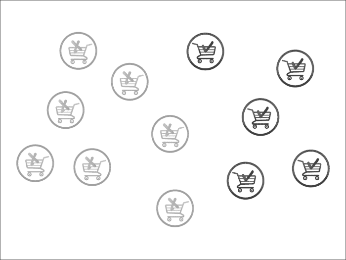

在前一个案例中，我们将灰色和黑色指定为“不购买”和“购买”标签。在这里，在两个类别之间画一条线就像以下这样简单：

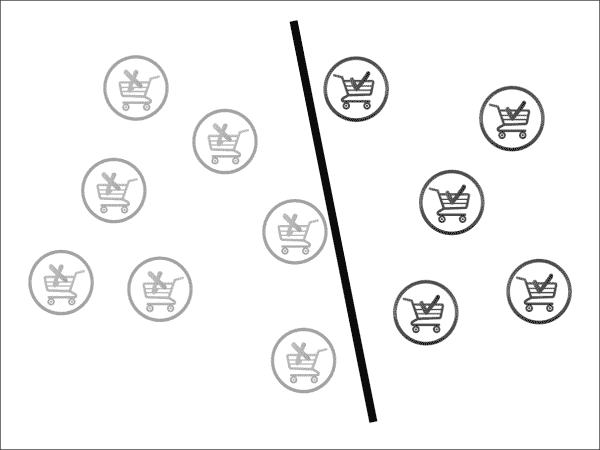

这是不是我们能做的最好？其实不是，让我们尝试做得更好。黑色分类器并不真正与“购买”和“不购买”的车等距。让我们尝试以下更好的方法：


现在看起来不错。这实际上就是 SVM 算法所做的事情。你可以在前面的图表中看到，实际上只有三个车决定了线的斜率：两条在直线上的黑色车，以及一条在直线下的灰色车。这些车被称为**支持向量**，其余的车，即向量，是不相关的。

有时候很难画一条线，可能需要曲线来分离两个类别，如下所示：

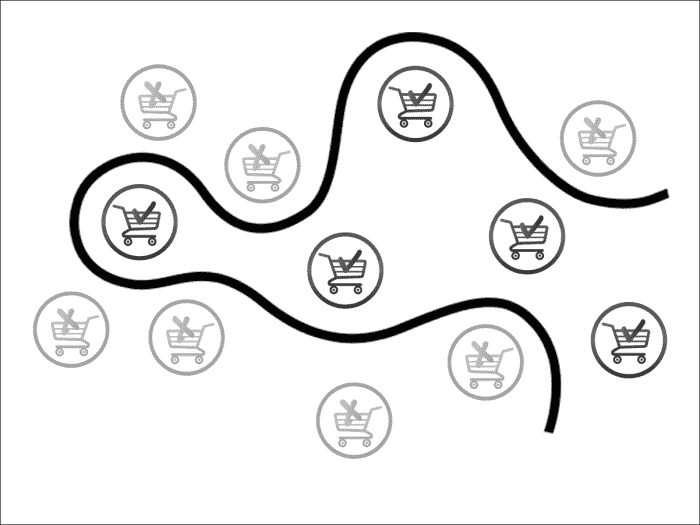

有时候即使这样也不够。在这种情况下，我们需要超过两个维度来解决问题。而不是一个分类线，我们需要的是一个超平面。事实上，当数据过于杂乱时，添加额外的维度有助于找到分离类别的超平面。以下图表说明了这一点：

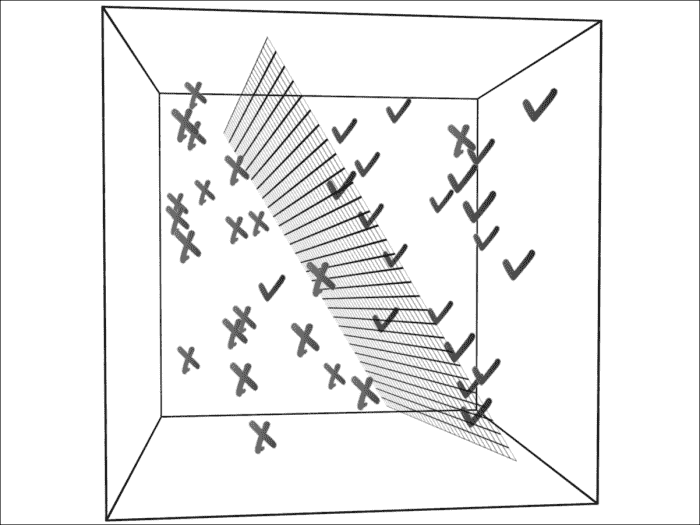

这并不意味着添加额外的维度总是一个好主意。大多数时候，我们的目标是减少维度，只保留相关的维度/特征。有一整套算法致力于降维；我们将在后面的章节中介绍这些算法。

## 如何做到这一点...

1.  Spark 库自带了样本`libsvm`数据。我们将使用这个数据并将数据加载到 HDFS 中：

    ```py
    $ hdfs dfs -put /opt/infoobjects/spark/data/mllib/sample_libsvm_data.txt /user/hduser/sample_libsvm_data.txt

    ```

1.  启动 Spark shell：

    ```py
    $ spark-shell

    ```

1.  执行所需的导入：

    ```py
    scala> import org.apache.spark.mllib.classification.SVMWithSGD
    scala> import org.apache.spark.mllib.evaluation.BinaryClassificationMetrics
    scala> import org.apache.spark.mllib.regression.LabeledPoint
    scala> import org.apache.spark.mllib.linalg.Vectors
    scala> import org.apache.spark.mllib.util.MLUtils

    ```

1.  将数据作为 RDD 加载：

    ```py
    scala> val svmData = MLUtils.loadLibSVMFile(sc,"sample_libsvm_data.txt")

    ```

1.  计算记录数：

    ```py
    scala> svmData.count

    ```

1.  现在让我们将数据集分成一半的训练数据和一半的测试数据：

    ```py
    scala> val trainingAndTest = svmData.randomSplit(Array(0.5,0.5))

    ```

1.  指定`训练`和`测试`数据：

    ```py
    scala> val trainingData = trainingAndTest(0)
    scala> val testData = trainingAndTest(1)

    ```

1.  训练算法并构建 100 次迭代的模型（你可以尝试不同的迭代次数，但你将看到，在某个点上，结果开始收敛，这是一个不错的选择）：

    ```py
    scala> val model = SVMWithSGD.train(trainingData,100)

    ```

1.  现在我们可以使用这个模型来预测任何数据集的标签。让我们预测测试数据中的第一个点的标签：

    ```py
    scala> val label = model.predict(testData.first.features)

    ```

1.  让我们创建一个元组，第一个值是对测试数据的预测，第二个值是实际标签，这将帮助我们计算算法的准确率：

    ```py
    scala> val predictionsAndLabels = testData.map( r => (model.predict(r.features),r.label))

    ```

1.  你可以计算有多少记录的预测和实际标签不匹配：

    ```py
    scala> predictionsAndLabels.filter(p => p._1 != p._2).count

    ```

# 使用决策树进行分类

决策树是机器学习算法中最直观的。我们在日常生活中经常使用决策树。

决策树算法有很多有用的特性：

+   容易理解和解释

+   可以处理分类和连续特征

+   可以处理缺失特征

+   不需要特征缩放

决策树算法以倒序工作，其中每个级别的特征表达式都会被评估，并将数据集分为两个类别。我们将通过一个简单的哑剧例子来帮助你理解，这是我们大多数人上大学时都玩过的。我猜了一个动物，然后让我的同事问我问题来猜出我的选择。她的提问如下：

Q1: 它是一个大动物吗？

A: 是的

Q2: 这个动物活过 40 年吗？

A: 是的

Q3: 这个动物是象吗？

A: 是的

这是一个显然过于简化的例子，她知道我假设了一个象（在大数据世界中你还能猜到什么？）。让我们扩展这个例子，包括一些更多的动物，如下面的图所示（灰色框是类别）：

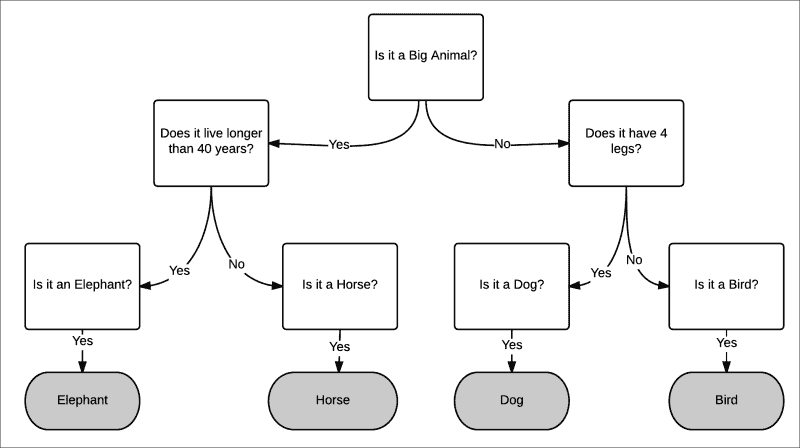

上述例子是一个多类分类的例子。在这个菜谱中，我们将专注于二元分类。

## 准备中

每当我们的儿子早上要上网球课时，前一天晚上教练会检查天气报告，并决定第二天早上是否适合打网球。这个菜谱将使用这个例子来构建决策树。

让我们决定影响早上是否打网球的决定的天气特征：

+   雨

+   风速

+   温度

让我们构建一个不同组合的表格：

| 雨 | 多风 | 温度 | 打网球？ |
| --- | --- | --- | --- |
| 是 | 是 | 热 | 否 |
| 是 | 是 | 正常 | 否 |
| 是 | 是 | 酷 | 否 |
| 否 | 是 | 热 | 否 |
| 否 | 是 | 热 | 是 |
| 否 | 否 | 热 | 是 |
| 否 | 否 | 正常 | 是 |
| 否 | 否 | 酷 | 否 |

现在我们如何构建决策树？我们可以从三个特征之一开始：雨、多风或温度。规则是开始于一个特征，以便尽可能实现最大信息增益。

在雨天，正如你在表中看到的，其他特征都不重要，没有游戏。高风速也是如此。

决策树，像大多数其他算法一样，只将特征值作为双精度值。所以，让我们进行映射：

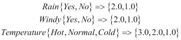

正类是 1.0，负类是 0.0。让我们使用 CSV 格式加载数据，使用第一个值作为标签：

```py
$vi tennis.csv
0.0,1.0,1.0,2.0
0.0,1.0,1.0,1.0
0.0,1.0,1.0,0.0
0.0,0.0,1.0,2.0
0.0,0.0,1.0,0.0
1.0,0.0,0.0,2.0
1.0,0.0,0.0,1.0
0.0,0.0,0.0,0.0

```

## 如何做这件事...

1.  启动 Spark shell：

    ```py
    $ spark-shell

    ```

1.  执行所需的导入：

    ```py
    scala> import org.apache.spark.mllib.tree.DecisionTree
    scala> import org.apache.spark.mllib.regression.LabeledPoint
    scala> import org.apache.spark.mllib.linalg.Vectors
    scala> import org.apache.spark.mllib.tree.configuration.Algo._
    scala> import org.apache.spark.mllib.tree.impurity.Entropy

    ```

1.  加载文件：

    ```py
    scala> val data = sc.textFile("tennis.csv")
    ```

1.  解析数据并将其加载到 `LabeledPoint`：

    ```py
    scala> val parsedData = data.map {
    line =>  val parts = line.split(',').map(_.toDouble)
     LabeledPoint(parts(0), Vectors.dense(parts.tail)) }

    ```

1.  使用这些数据训练算法：

    ```py
    scala> val model = DecisionTree.train(parsedData, Classification, Entropy, 3)

    ```

1.  为无雨、高风和凉爽的温度创建一个向量：

    ```py
    scala> val v=Vectors.dense(0.0,1.0,0.0)

    ```

1.  预测是否应该打网球：

    ```py
    scala> model.predict(v)

    ```

## 它是如何工作的…

让我们绘制这个菜谱中创建的网球决策树：

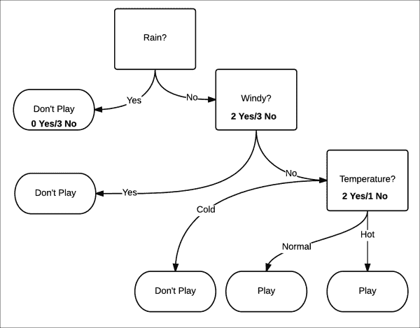

这个模型有三个级别的深度。选择哪个属性取决于我们如何最大化信息增益。它是通过测量分割的纯度来衡量的。纯度意味着，无论确定性是否增加，给定的数据集将被视为正面或负面。在这个例子中，这相当于打网球的机会是增加还是不打网球的机会增加。

纯度是通过熵来衡量的。熵是系统中无序程度的度量。在这个上下文中，它更容易理解为不确定性的度量：

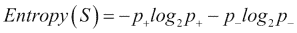

纯度最高为 0，最低为 1。让我们尝试使用公式来确定纯度。

当雨为是时，打网球的概率 *p+* 是 0/3 = 0。不打网球的概率 *p_* 是 3/3 = 1：

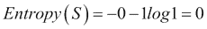

这是一个纯集合。

当雨为无时，打网球的概率 *p+* 是 2/5 = 0.4。不打网球的概率 *p_* 是 3/5 = 0.6：

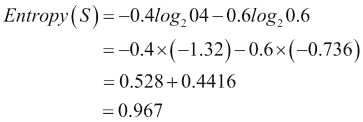

这几乎是一个不纯的集合。最不纯的情况是概率为 0.5。

Spark 使用三个指标来确定不纯度：

+   吉尼不纯度（分类）

+   熵（分类）

+   方差（回归）

信息增益是父节点不纯度与两个子节点不纯度加权的平均值之间的差异。让我们看看第一个分割，它将大小为八的数据分割成两个大小为三（左侧）和五个（右侧）的数据集。让我们称第一个分割为 *s1*，父节点为 *rain*，左侧子节点为 *no rain*，右侧子节点为 *wind*。因此，信息增益将是：

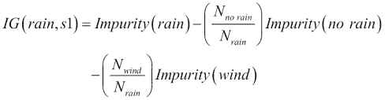

由于我们已经为熵计算了 *no rain* 和 *wind* 的不纯度，让我们计算 *rain* 的熵：

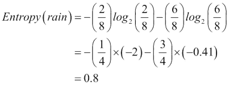

现在我们来计算信息增益：

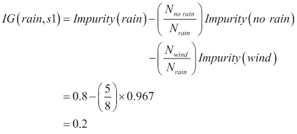

因此，在第一个分割中，信息增益是 0.2。这是我们能达到的最好效果吗？让我们看看我们的算法能提出什么。首先，让我们找出树的深度：

```py
scala> model.depth
Int = 2

```

在这里，深度是 `2`，与我们直观构建的 `3` 相比，所以这个模型似乎优化得更好。让我们看看树的结构：

```py
scala> model.toDebugString
String =  "DecisionTreeModel classifier of depth 2 with 5 nodes
If (feature 1 <= 0.0)
 If (feature 2 <= 0.0)
 Predict: 0.0
 Else (feature 2 > 0.0)
 Predict: 1.0
Else (feature 1 > 0.0)
 Predict: 0.0

```

让我们通过视觉方式构建它，以获得更好的理解：


我们不会在这里详细说明，因为我们已经用前面的模型做了这个。我们将直接计算信息增益：0.44

正如你所见，在这个案例中，信息增益是 0.44，这是第一个模型的超过两倍。

如果你看看第二级节点，不纯度为零。在这种情况下，这是很好的，因为我们已经在深度 2 时得到了它。想象一下深度为 50 的情况。在这种情况下，决策树对于训练数据工作得很好，但对于测试数据工作得不好。这种情况被称为 **过拟合**。

避免过拟合的一个解决方案是剪枝。你将训练数据分成两个集合：训练集和验证集。你使用训练集来训练模型。现在，通过逐渐移除左侧节点，你用模型对验证集进行测试。如果移除叶节点（这通常是单例——也就是说，它只包含一个数据点）可以提高模型的性能，那么这个叶节点就会被从模型中剪除。

# 使用随机森林进行分类

有时候一个决策树是不够的，所以会使用一组决策树来产生更强大的模型。这些被称为**集成学习算法**。集成学习算法不仅限于使用决策树作为基础模型。

在集成学习算法中最受欢迎的是随机森林。在随机森林中，而不是生长一棵单独的树，会生长*K*棵树。每棵树都得到一个随机子集*S*的训练数据。为了增加一点变化，每棵树只使用特征的一个子集。在做出预测时，对树进行多数投票，这成为预测。

让我们用一个例子来解释这一点。目标是针对给定的人预测他/她是否有良好信用或不良信用。

为了做到这一点，我们将提供标记的训练数据——也就是说，在这种情况下，一个人具有特征以及他/她是否有良好信用或不良信用的标签。现在我们不想创建特征偏差，因此我们将提供随机选择的特征集。提供随机选择的特征子集的另一个原因是，大多数现实世界数据有数百个甚至数千个特征。例如，文本分类算法通常有 50k-100k 个特征。

在这种情况下，为了给故事增添趣味，我们不会提供特征，但我们会询问不同的人为什么他们认为一个人有良好或不良的信用。根据定义，不同的人会接触到一个人（有时重叠）的不同特征，这给我们带来了与随机选择特征相同的功能。

我们的第一个例子是杰克，他有一个“不良信用”的标签。我们将从杰克最喜欢的酒吧，大象酒吧工作的乔伊开始。一个人能够推断出为什么给出了特定的标签的唯一方法是通过提出是/否问题。让我们看看乔伊怎么说：

Q1: 杰克给小费给得好吗？（特征：慷慨）

A: 不是

Q2: 杰克每次访问至少花费 60 美元吗？（特征：挥霍）

A: 是的

Q3: 他是否即使在最小的挑衅下也倾向于卷入酒吧斗殴？（特征：易怒）

A: 是的

这解释了为什么杰克信用不良。

我们现在询问杰克的女友，斯泰西：

Q1: 当我们出去玩时，杰克总是付账吗？（特征：慷慨）

A: 不是

Q2: 杰克还了我欠他的 500 美元了吗？（特征：责任感）

A: 不是

Q3: 他有时是不是为了炫耀而过度消费？（特征：挥霍）

A: 是的

这解释了为什么杰克信用不良。

我们现在询问杰克最好的朋友乔治：

Q1：当我们在我公寓里闲逛时，他是否自己打扫？（特征：有组织）

A: 否

Q2：在我超级碗聚餐期间，杰克空手而来吗？（特征：关心）

A: 是的

Q3：他是否用“我忘记带钱包了”的借口让我在餐厅付账？（特征：责任感）

A: 是的

这解释了为什么杰克有不良信用。

现在我们来谈谈信用良好的杰西卡。让我们问问斯泰西，她恰好是杰西卡的女 sibling：

Q1：当我缺钱时，杰西卡是否提出帮忙？（特征：慷慨）

A: 是的

Q2：杰西卡是否按时支付账单？（特征：责任感）

A: 是的

Q3：杰西卡是否愿意帮我照看孩子？（特征：关心）

A: 是的

这解释了为什么杰西卡有良好的信用。

现在我们来问乔治，他恰好是她的丈夫：

Q1：杰西卡是否保持房子整洁？（特征：有组织）

A: 是的

Q2：她期望收到昂贵的礼物吗？（特征：挥霍）

A: 否

Q3：你忘记修剪草坪时，她会生气吗？（特征：易怒）

A: 否

这解释了为什么杰西卡有良好的信用。

现在我们来问大象酒吧的酒保乔伊：

Q1：每次她和朋友来酒吧时，她是否大多是指定司机？（特征：负责任）

A: 是的

Q2：她总是带剩菜回家吗？（特征：挥霍）

A: 是的

Q3：她是否给小费？（特征：慷慨）

A: 是的

随机森林的工作方式是在两个层面上进行随机选择：

+   数据的一个子集

+   用于分割数据的特征子集

这两个子集可以重叠。

在我们的例子中，我们有六个特征，我们打算将三个特征分配给每棵树。这样，我们有很大的机会会有重叠。

让我们在训练数据集中添加八个人：

| Names | Label | Generosity | Responsibility | Care | Organization | Spendthrift | Volatile |
| --- | --- | --- | --- | --- | --- | --- | --- |
| Jack | 0 | 0 | 0 | 0 | 0 | 1 | 1 |
| Jessica | 1 | 1 | 1 | 1 | 1 | 0 | 0 |
| Jenny | 0 | 0 | 0 | 1 | 0 | 1 | 1 |
| Rick | 1 | 1 | 1 | 0 | 1 | 0 | 0 |
| Pat | 0 | 0 | 0 | 0 | 0 | 1 | 1 |
| Jeb | 1 | 1 | 1 | 1 | 0 | 0 | 0 |
| Jay | 1 | 0 | 1 | 1 | 1 | 0 | 0 |
| Nat | 0 | 1 | 0 | 0 | 0 | 1 | 1 |
| Ron | 1 | 0 | 1 | 1 | 1 | 0 | 0 |
| Mat | 0 | 1 | 0 | 0 | 0 | 1 | 1 |

## 准备中

让我们把创建的数据放入以下文件中的`libsvm`格式：

```py
rf_libsvm_data.txt
0 5:1 6:1
1 1:1 2:1 3:1 4:1
0 3:1 5:1 6:1
1 1:1 2:1 4:1
0 5:1 6:1
1 1:1 2:1 3:1 4:1
0 1:1 5:1 6:1
1 2:1 3:1 4:1
0 1:1 5:1 6:1

```

现在将其上传到 HDFS：

```py
$ hdfs dfs -put rf_libsvm_data.txt

```

## 如何做到这一点…

1.  启动 Spark shell：

    ```py
    $ spark-shell

    ```

1.  执行所需的导入：

    ```py
    scala> import org.apache.spark.mllib.tree.RandomForest
    scala> import org.apache.spark.mllib.tree.configuration.Strategy
    scala> import org.apache.spark.mllib.util.MLUtils

    ```

1.  加载数据并解析：

    ```py
    scala> val data =
     MLUtils.loadLibSVMFile(sc, "rf_libsvm_data.txt")

    ```

1.  将数据分为`训练`和`测试`数据集：

    ```py
    scala> val splits = data.randomSplit(Array(0.7, 0.3))
    scala> val (trainingData, testData) = (splits(0), splits(1))

    ```

1.  将分类作为一个树策略（随机森林也支持回归）：

    ```py
    scala> val treeStrategy = Strategy.defaultStrategy("Classification")

    ```

1.  训练模型：

    ```py
    scala> val model = RandomForest.trainClassifier(trainingData,
     treeStrategy, numTrees=3, featureSubsetStrategy="auto", seed = 12345)

    ```

1.  在测试实例上评估模型并计算测试错误：

    ```py
    scala> val testErr = testData.map { point =>
     val prediction = model.predict(point.features)
     if (point.label == prediction) 1.0 else 0.0
    }.mean()
    scala> println("Test Error = " + testErr)

    ```

1.  检查模型：

    ```py
    scala> println("Learned Random Forest:n" + model.toDebugString)
    Learned Random Forest:nTreeEnsembleModel classifier with 3 trees
     Tree 0:
     If (feature 5 <= 0.0)
     Predict: 1.0
     Else (feature 5 > 0.0)
     Predict: 0.0
     Tree 1:
     If (feature 3 <= 0.0)
     Predict: 0.0
     Else (feature 3 > 0.0)
     Predict: 1.0
     Tree 2:
     If (feature 0 <= 0.0)
     Predict: 0.0
     Else (feature 0 > 0.0)
     Predict: 1.0

    ```

## 它是如何工作的…

如您在这样一个小型示例中可以看到，三棵树正在使用不同的特征。在具有数千个特征和训练数据的实际用例中，这种情况不会发生，但大多数树在观察特征和投票时会有所不同，多数票将获胜。请记住，在回归的情况下，是通过树的平均值来得到最终值的。

# 使用梯度提升树进行分类

另一种集成学习算法是**梯度提升树**（**GBTs**）。GBTs 一次训练一棵树，其中每棵新树都改进先前训练的树的不足之处。

由于梯度提升树（GBTs）一次训练一棵树，它们可能比随机森林（Random Forest）花费更长的时间。

## 准备工作

我们将使用之前配方中使用的相同数据。

## 如何做…

1.  启动 Spark shell：

    ```py
    $ spark-shell

    ```

1.  执行所需的导入：

    ```py
    scala> import org.apache.spark.mllib.tree.GradientBoostedTrees
    scala> import org.apache.spark.mllib.tree.configuration.BoostingStrategy
    scala> import org.apache.spark.mllib.util.MLUtils

    ```

1.  加载数据并解析：

    ```py
    scala> val data =
     MLUtils.loadLibSVMFile(sc, "rf_libsvm_data.txt")

    ```

1.  将数据分为`训练`和`测试`数据集：

    ```py
    scala> val splits = data.randomSplit(Array(0.7, 0.3))
    scala> val (trainingData, testData) = (splits(0), splits(1))

    ```

1.  创建一个分类作为提升策略，并将迭代次数设置为`3`：

    ```py
    scala> val boostingStrategy =
     BoostingStrategy.defaultParams("Classification")
    scala> boostingStrategy.numIterations = 3

    ```

1.  训练模型：

    ```py
    scala> val model = GradientBoostedTrees.train(trainingData, boostingStrategy)

    ```

1.  在测试实例上评估模型并计算测试错误：

    ```py
    scala> val testErr = testData.map { point =>
     val prediction = model.predict(point.features)
     if (point.label == prediction) 1.0 else 0.0
    }.mean()
    scala> println("Test Error = " + testErr)

    ```

1.  检查模型：

    ```py
    scala> println("Learned Random Forest:n" + model.toDebugString)

    ```

在这种情况下，模型的准确率为 0.9，这低于我们在随机森林的情况中得到的准确率。

# 使用朴素贝叶斯进行分类

让我们考虑使用机器学习构建一个电子邮件垃圾邮件过滤器。我们感兴趣的两个类别是：垃圾邮件用于未经请求的消息，非垃圾邮件用于常规电子邮件：

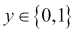

第一个挑战是，当给定一封电子邮件时，我们如何将其表示为特征向量*x*。一封电子邮件只是一堆文本或一组单词（因此，这个问题域属于一个更广泛的类别，称为**文本分类**）。让我们用一个长度等于字典大小的特征向量来表示电子邮件。如果字典中的一个单词出现在电子邮件中，则其值将为 1；否则为 0。让我们构建一个表示内容为*online pharmacy sale*的电子邮件的向量：

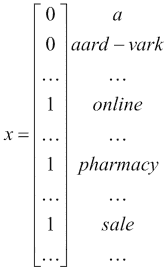

这个特征向量中的单词字典称为*词汇表*，向量的维度与词汇表的大小相同。如果词汇表大小为 10,000，则特征向量中的可能值将是 210,000。

我们的目标是建模给定*y*的*x*的概率。为了建模*P(x|y)*，我们将做出一个强烈的假设，这个假设是*x*的条件独立。这个假设被称为**朴素贝叶斯假设**，基于这个假设的算法被称为**朴素贝叶斯分类器**。

例如，对于*y =1*，表示垃圾邮件，"online"出现和"pharmacy"出现的概率是独立的。这是一个与现实无关的强烈假设，但在获得良好的预测时效果非常好。

## 准备工作

Spark 附带了一个用于与朴素贝叶斯一起使用的示例数据集。让我们将此数据集加载到 HDFS 中：

```py
$ hdfs dfs -put /opt/infoobjects/spark/data/mllib/sample_naive_bayes_data.txt
 sample_naive_bayes_data.txt

```

## 如何做到这一点...

1.  启动 Spark shell：

    ```py
    $ spark-shell

    ```

1.  执行所需的导入：

    ```py
    scala> import org.apache.spark.mllib.classification.NaiveBayes
    scala> import org.apache.spark.mllib.linalg.Vectors
    scala> import org.apache.spark.mllib.regression.LabeledPoint

    ```

1.  将数据加载到 RDD 中：

    ```py
    scala> val data = sc.textFile("sample_naive_bayes_data.txt")

    ```

1.  将数据解析为`LabeledPoint`：

    ```py
    scala> val parsedData = data.map { line =>
     val parts = line.split(',')
     LabeledPoint(parts(0).toDouble, Vectors.dense(parts(1).split(' ').map(_.toDouble)))
    }

    ```

1.  将数据平均分成`训练`和`测试`数据集：

    ```py
    scala> val splits = parsedData.randomSplit(Array(0.5, 0.5), seed = 11L)
    scala> val training = splits(0)
    scala> val test = splits(1)

    ```

1.  使用`训练`数据集训练模型：

    ```py
    val model = NaiveBayes.train(training, lambda = 1.0)

    ```

1.  预测`测试`数据集的标签：

    ```py
    val predictionAndLabel = test.map(p => (model.predict(p.features), p.label))

    ```
