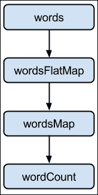
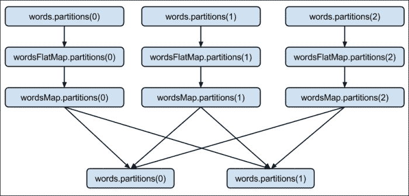
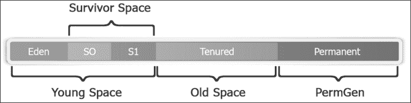
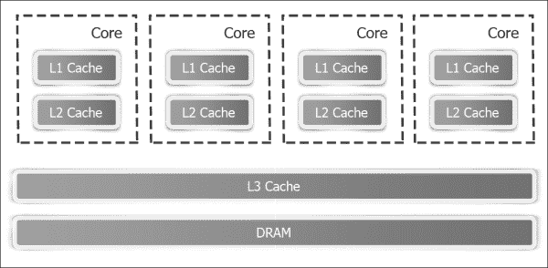

# 第十二章. 优化和性能调整

本章涵盖了与 Spark 一起工作时各种优化和性能调整的最佳实践。

本章分为以下食谱：

+   优化内存

+   使用压缩来提高性能

+   使用序列化来提高性能

+   优化垃圾回收

+   优化并行级别

+   理解优化的未来——Tungsten 项目

# 介绍

在探讨优化 Spark 的各种方法之前，了解 Spark 的内部结构是一个好主意。到目前为止，我们已经在较高层次上了解了 Spark，重点是各种库提供的功能。

让我们从重新定义一个 RDD 开始。从外部来看，RDD 是一个分布式的不可变对象集合。从内部来看，它由以下五个部分组成：

+   分区集合(`rdd.getPartitions`)

+   父 RDD 的依赖关系列表(`rdd.dependencies`)

+   根据其父 RDD 计算分区的函数

+   分区器（可选）(`rdd.partitioner`)

+   每个分区的首选位置（可选）(`rdd.preferredLocations`)

前三项是 RDD 重新计算所需的，以防数据丢失。当结合在一起时，它被称为**血缘**。最后两部分是优化。

一组分区是将数据划分到节点的方式。在 HDFS 的情况下，这意味着`InputSplits`，它们基本上与块相同（除非记录跨越块边界；在这种情况下，它将略大于块）。

让我们回顾一下`wordCount`示例，以了解这五个部分。这是在数据集级别视图下`wordCount`的 RDD 图：



基本上，流程是这样的：

1.  将`words`文件夹加载为 RDD：

    ```py
    scala> val words = sc.textFile("hdfs://localhost:9000/user/hduser/words")

    ```

    以下为`words` RDD 的五个部分：

    | **分区** | 每个 hdfs 输入 split/block 有一个分区(`org.apache.spark.rdd.HadoopPartition`) |
    | --- | --- |
    | **依赖关系** | 无 |
    | **计算函数** | 读取块 |
    | **首选位置** | HDFS 块位置 |
    | **分区器** | 无 |

1.  将`words` RDD 中的单词分词，每个单词占一行：

    ```py
    scala> val wordsFlatMap = words.flatMap(_.split("\\W+"))

    ```

    以下为`wordsFlatMap` RDD 的五个部分：

    | **分区** | 与父 RDD 相同，即`words` (`org.apache.spark.rdd.HadoopPartition`) |
    | --- | --- |
    | **依赖关系** | 与父 RDD 相同，即`words` (`org.apache.spark.OneToOneDependency`) |
    | **计算函数** | 计算父 RDD 并分割每个元素，然后将结果展平 |
    | **首选位置** | 询问父 RDD |
    | **分区器** | 无 |

1.  将`wordsFlatMap` RDD 中的每个单词转换为(word,1)元组：

    ```py
    scala> val wordsMap = wordsFlatMap.map( w => (w,1))

    ```

    以下为`wordsMap` RDD 的五个部分：

    | **分区** | 与父 RDD 相同，即 wordsFlatMap (org.apache.spark.rdd.HadoopPartition) |
    | --- | --- |
    | **依赖关系** | 与父 RDD 相同，即 wordsFlatMap (org.apache.spark.OneToOneDependency) |
    | **计算函数** | 计算父 RDD 并将其映射到 PairRDD |
    | **首选位置** | 询问父 RDD |
    | **分区器** | 无 |

1.  对给定键的所有值进行归约并求和：

    ```py
    scala> val wordCount = wordsMap.reduceByKey(_+_)

    ```

    以下为`wordCount` RDD 的五个部分：

    | **分区** | 每个 reduce 任务一个（`org.apache.spark.rdd.ShuffledRDDPartition`） |
    | --- | --- |
    | **依赖关系** | 对每个父 RDD 的 shuffle 依赖（`org.apache.spark.ShuffleDependency`） |
    | **计算函数** | 对 shuffle 数据进行加法运算 |
    | **首选位置** | 无 |
    | **分区器** | HashPartitioner（`org.apache.spark.HashPartitioner`） |

这是在分区级别视图下`wordCount` RDD 图的样子：



# 优化内存

Spark 是一个复杂的分布式计算框架，有许多组成部分。各种集群资源，如内存、CPU 和网络带宽，在各个点上可能会成为瓶颈。由于 Spark 是一个内存计算框架，内存的影响最大。

另一个问题是在 Spark 应用程序中，使用大量内存是很常见的，有时甚至超过 100 GB。这种内存使用量在传统的 Java 应用程序中并不常见。

在 Spark 中，有两个地方需要进行内存优化，那就是在驱动程序和执行器级别。

您可以使用以下命令设置驱动程序内存：

+   Spark shell：

    ```py
    $ spark-shell --drive-memory 4g

    ```

+   Spark 提交：

    ```py
    $ spark-submit --drive-memory 4g

    ```

您可以使用以下命令设置执行器内存：

+   Spark shell：

    ```py
    $ spark-shell --executor-memory 4g

    ```

+   Spark 提交：

    ```py
    $ spark-submit --executor-memory 4g

    ```

要理解内存优化，了解 Java 中的内存管理机制是很有帮助的。在 Java 中，对象位于堆中。堆在 JVM 启动时创建，并在需要时可以调整大小（基于最小和最大大小，即配置中分别指定的`-Xms`和`-Xmx`）。

堆被分为两个空间或代：年轻代和老年代。年轻代是为新对象分配预留的。年轻代包括一个称为**伊甸园**的区域和两个较小的幸存者空间。当 nursery 填满时，通过运行一个称为**年轻收集**的特殊过程进行垃圾回收，其中所有存活时间足够长的对象被提升到老年代。当老年代填满时，通过运行一个称为**老年代收集**的过程在那里进行垃圾回收。



幼儿园背后的逻辑是，大多数对象的生命周期非常短。年轻收集被设计成快速找到新分配的对象并将它们移动到老年代。

JVM 使用标记-清除算法进行垃圾回收。标记-清除收集包括两个阶段。

在标记阶段，所有具有活动引用的对象都被标记为存活，其余的被认为是垃圾回收的候选者。在清除阶段，垃圾收集的候选者所占用的空间被添加到空闲列表中，即它们可以被分配给新的对象。

标记和清除有两个改进。一个是**并发标记和清除**（**CMS**），另一个是并行标记和清除。CMS 侧重于降低延迟，而后者侧重于提高吞吐量。两种策略都有性能权衡。CMS 不执行压缩，而并行**垃圾回收器**（**GC**）仅执行整个堆的压缩，这导致了暂停时间。作为一个经验法则，对于实时流，应使用 CMS，否则使用并行 GC。

如果你希望同时拥有低延迟和高吞吐量，从 Java 1.7 更新 4 开始，还有一个名为**垃圾回收优先级 GC**（**G1**）的选项。G1 是一种服务器风格的垃圾回收器，主要用于具有大内存的多核机器。它计划作为 CMS 的长期替代品。因此，为了修改我们的经验法则，如果你使用的是 Java 7 及以上版本，只需简单地使用 G1。

G1 将堆划分为一组等大小的区域，其中每个集合是一个连续的虚拟内存范围。每个区域被分配一个角色，如 Eden、Survivor 和 Old。G1 执行一个并发全局标记阶段，以确定整个堆中对象的存活引用。在标记阶段完成后，G1 知道哪些区域大部分是空的。它首先在这些区域进行收集，从而释放出更多的内存。


G1 选定的垃圾回收候选区域使用 evacuation 进行垃圾回收。G1 将堆中的一个或多个区域的对象复制到堆上的一个单独区域，并且同时压缩和释放内存。这种 evacuation 在多个核心上并行执行以减少暂停时间并提高吞吐量。因此，每次垃圾回收周期都会在用户定义的暂停时间内减少碎片。

Java 内存优化有三个方面的内容：

+   内存占用

+   访问内存中对象的成本

+   垃圾回收的成本

通常，Java 对象访问速度快，但比它们内部实际数据消耗的空间要多得多。

# 使用压缩来提高性能

数据压缩涉及使用比原始表示更少的位来编码信息。压缩在大数据技术中扮演着重要的角色。它使得数据的存储和传输更加高效。

当数据被压缩时，它变得更小，因此磁盘 I/O 和网络 I/O 都变得更快。它还节省了存储空间。每个优化都有成本，压缩的成本是以压缩和解压缩数据时增加的 CPU 周期形式出现的。

Hadoop 需要分割数据以将它们放入块中，无论数据是否被压缩。只有少数压缩格式是可分割的。

大数据负载中最流行的两种压缩格式是 LZO 和 Snappy。Snappy 是不可分割的，而 LZO 是可分割的。另一方面，Snappy 是一种格式速度更快的格式。

如果压缩格式可分割，如 LZO，则首先将输入文件分割成块，然后压缩。由于压缩发生在块级别，解压缩也可以在块级别以及节点级别发生。

如果压缩格式不可分割，压缩将在文件级别发生，然后将其分割成块。在这种情况下，必须在解压缩之前将块合并回文件，因此解压缩不能在节点级别发生。

对于支持的压缩格式，Spark 将自动部署编解码器来自动解压缩，用户不需要采取任何操作。

# 使用序列化来提高性能

序列化在分布式计算中扮演着重要的角色。有两种持久化（存储）级别，支持序列化 RDD：

+   `MEMORY_ONLY_SER`：这以序列化对象的形式存储 RDD。它将为每个分区创建一个字节数组

+   `MEMORY_AND_DISK_SER`：这与`MEMORY_ONLY_SER`类似，但它将无法适应内存的分区溢出到磁盘

以下是将适当的持久化级别添加的步骤：

1.  启动 Spark shell：

    ```py
    $ spark-shell

    ```

1.  导入与`StorageLevel`相关的`StorageLevel`和隐式转换：

    ```py
    scala> import org.apache.spark.storage.StorageLevel._

    ```

1.  创建一个 RDD：

    ```py
    scala> val words = sc.textFile("words")

    ```

1.  持久化 RDD：

    ```py
    scala> words.persist(MEMORY_ONLY_SER)

    ```

虽然序列化大大减少了内存占用，但它由于反序列化而增加了额外的 CPU 周期。

默认情况下，Spark 使用 Java 的序列化。由于 Java 序列化速度慢，更好的方法是使用`Kryo`库。`Kryo`要快得多，有时甚至比默认的快 10 倍。

## 如何操作...

你可以通过在`SparkConf`中进行以下设置来使用`Kryo`：

1.  通过设置`Kryo`作为序列化器来启动 Spark shell：

    ```py
    $ spark-shell --conf spark.serializer=org.apache.spark.serializer.KryoSerializer

    ```

1.  `Kryo`自动注册大多数核心 Scala 类，但如果你想要注册自己的类，可以使用以下命令：

    ```py
    scala> sc.getConf.registerKryoClasses(Array(classOf[com.infoobjects.CustomClass1],classOf[com.infoobjects.CustomClass2])

    ```

# 优化垃圾回收

如果你有很多生命周期短的 RDD，JVM 垃圾回收可能是一个挑战。JVM 需要遍历所有对象以找到需要垃圾回收的对象。垃圾回收的成本与 GC 需要遍历的对象数量成正比。因此，使用较少的对象和使用较少对象的数据结构（如数组）的数据结构有助于。

序列化在这里也表现出色，因为只需要一个对象进行垃圾回收。

默认情况下，Spark 使用执行器内存的 60%来缓存 RDD，其余 40%用于常规对象。有时，你可能不需要为 RDD 分配 60%，可以降低这个限制，以便为对象创建提供更多空间（减少对 GC 的需求）。

## 如何操作...

你可以通过启动 Spark shell 并设置内存分数来将分配给 RDD 缓存的内存设置为 40%：

```py
$ spark-shell --conf spark.storage.memoryFraction=0.4

```

# 优化并行级别

优化并行级别对于充分利用集群容量非常重要。在 HDFS 的情况下，这意味着分区数与`InputSplits`数相同，这通常与块数相同。

在这个菜谱中，我们将介绍不同的方法来优化分区数量。

## 如何做到这一点…

在将文件加载到 RDD 时指定分区数，按照以下步骤：

1.  启动 Spark shell：

    ```py
    $ spark-shell

    ```

1.  将 RDD 加载为自定义分区数作为第二个参数：

    ```py
    scala> sc.textFile("hdfs://localhost:9000/user/hduser/words",10)

    ```

另一种方法是按照以下步骤更改默认的并行度：

1.  使用新的默认并行度值启动 Spark shell：

    ```py
    $ spark-shell --conf spark.default.parallelism=10

    ```

1.  检查并行度的默认值：

    ```py
    scala> sc.defaultParallelism

    ```

### 注意

您还可以使用名为`coalesce(numPartitions)`的 RDD 方法来减少分区数量，其中`numPartitions`是您希望得到的最终分区数。如果您希望数据在网络中重新洗牌，可以调用名为`repartition(numPartitions)`的 RDD 方法，其中`numPartitions`是您希望得到的最终分区数。

# 理解优化的未来——项目钨丝

项目钨丝，从 Spark 版本 1.4 开始，旨在将 Spark 与裸金属更紧密地结合。该项目的目标是显著提高 Spark 应用程序的内存和 CPU 效率，并推动底层硬件的极限。

在分布式系统中，传统的做法是始终优化网络 I/O，因为那一直是稀缺和瓶颈资源。这种趋势在最近几年发生了变化。在过去 5 年里，网络带宽从每秒 1 千兆比特增加到每秒 10 千兆比特。

类似地，磁盘带宽也从 50 MB/s 增加到 500 MB/s，SSD 的使用也越来越广泛。另一方面，CPU 时钟速度在 5 年前大约是 3 GHz，现在仍然是这个速度。这已经取代了网络，使 CPU 成为分布式处理中的新瓶颈。

### 注意

另一种对 CPU 性能造成更大负担的趋势是新的压缩数据格式，如 Parquet。正如我们在本章前面的菜谱中看到的，压缩和序列化都需要更多的 CPU 周期。这种趋势也推动了 CPU 优化的需求，以减少 CPU 周期成本。

在类似的方向上，让我们看看内存占用。在 Java 中，GC 负责内存管理。GC 在将内存管理从程序员手中拿走并使其透明化方面做得非常出色。为此，Java 必须投入大量的开销，这大大增加了内存占用。例如，一个简单的字符串"abcd"，理想情况下应该占用 4 字节，但在 Java 中却占用了 48 字节。

如果我们放弃 GC 并像在 C 等低级编程语言中那样手动管理内存会怎样？从 1.7 版本开始，Java 提供了一种方法来做这件事，它被称为`sun.misc.Unsafe`。Unsafe 基本上意味着您可以在没有任何安全检查的情况下构建长内存区域。这是项目钨丝的第一个特性。

## 通过利用应用语义进行手动内存管理

通过利用应用语义进行手动内存管理，如果你不知道自己在做什么，这可能会非常危险，但在 Spark 中却是一种祝福。我们利用对数据模式（DataFrames）的了解来直接布局内存。这不仅消除了 GC 开销，还让你最小化内存占用。

第二点是存储数据在 CPU 缓存与内存之间。众所周知，CPU 缓存非常出色，因为它从主内存获取数据需要三个周期，而缓存中只需要一个周期。这是 Tungsten 项目的第二个特性。

## 使用算法和数据结构

算法和数据结构被用来利用内存层次结构并实现更缓存感知的计算。

CPU 缓存是存储 CPU 即将需要的数据的小型内存池。CPU 有两种类型的缓存：指令缓存和数据缓存。数据缓存按 L1、L2 和 L3 的层次结构排列：

+   L1 缓存是计算机中最快且最昂贵的缓存。它存储最关键的数据，是 CPU 寻找信息的第一个地方。

+   L2 缓存比 L1 缓存略慢，但仍然位于同一处理器芯片上。这是 CPU 寻找信息的第二个地方。

+   L3 缓存仍然较慢，但由所有核心共享，例如 DRAM（内存）。

这些可以在以下图中看到：



第三点是 Java 在生成诸如表达式评估之类的字节码方面并不十分出色。如果这种代码生成是手动完成的，它将更加高效。代码生成是 Tungsten 项目的第三个特性。

### 代码生成

这涉及到利用现代编译器和 CPU 来允许直接在二进制数据上高效操作。Tungsten 项目目前还处于起步阶段，将在 1.5 版本中提供更广泛的支持。
