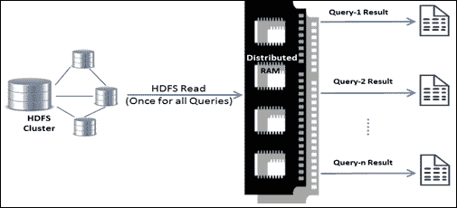

# 第一章 大数据与数据科学——简介

*大数据绝对是一个大问题！* 它承诺通过在巨大的数据孤岛中提取隐藏的洞察力，并开辟新的商业发展途径，带来丰富的机会。通过先进的分析技术利用**大数据**，已经成为组织创造和保持竞争优势的一种理所当然的选择。

本章介绍了大数据的概念、大数据分析面临的各种挑战，以及**Apache Spark**如何作为事实标准来应对计算挑战，并作为一个数据科学平台。

本章涵盖的主题如下：

+   大数据概述——到底有什么大惊小怪的？

+   大数据分析的挑战——为什么它如此困难？

+   大数据分析的演变——数据分析趋势

+   Spark 数据分析——解决大数据挑战的方案

+   Spark 堆栈——构成完整大数据解决方案的所有组件

# 大数据概述

关于大数据是什么，已经有很多讨论和书面材料，但实际上并没有一个明确的标准来清晰定义它。它在某种程度上是一个相对的术语。无论数据是大还是小，只有在能够正确分析数据的情况下，才能有效利用它。为了从数据中提取一些有意义的内容，需要正确的分析技术，而选择合适的工具和技术在数据分析中至关重要。然而，当数据本身成为问题的一部分，且需要在进行数据分析之前解决计算挑战时，这就成了一个大数据问题。

在万维网（也称为 Web 2.0）发生了一场革命，改变了人们使用互联网的方式。静态网页变成了互动网站，开始收集越来越多的数据。云计算、社交媒体和移动计算的技术进步引发了数据的爆炸。每个数字设备都开始生成数据，许多其他来源也推动了数据洪流。来自每个角落的数据流以惊人的速度生成各种海量数据！大数据以这种方式的形成是一种自然现象，因为这正是万维网的演变方式，具体细节并没有刻意推动。这是关于过去的！如果考虑现在正在发生并将在未来发生的变化，数据生成的体量和速度超出了任何人的预期。我之所以做出这样的陈述，是因为每个设备现在都变得更加智能，这要归功于**物联网**（**IoT**）。

信息技术的趋势是，技术进步也促进了数据的爆炸。随着更便宜的在线存储池集群的出现以及基本硬件的低价可用性，数据存储经历了范式转变。将来自不同来源的数据以原始形式存储在单一数据湖中，迅速取代了精心设计的数据集市和数据仓库。使用模式也从严格的模式驱动的基于 RDBMS 的方法转向了无模式、持续可用的**NoSQL**数据存储驱动的解决方案。因此，无论是结构化数据、半结构化数据，还是非结构化数据，其创建速度都前所未有地加快。

组织非常确信，利用大数据不仅可以回答特定的业务问题，还能带来覆盖尚未探索的业务可能性并解决相关的不确定性。因此，除了自然的数据涌入，组织开始制定战略，以生成越来越多的数据来维持其竞争优势，并为未来做好准备。在这里，一个例子有助于更好地理解这一点。假设在一个制造工厂的机器上安装了传感器，传感器不断发送数据，从而实时了解机器部件的状态，而公司能够预测机器何时会发生故障。这使得公司能够防止故障或损坏，避免计划外停机，节省大量资金。

# 大数据分析的挑战

在大数据分析中，通常有两类主要挑战。第一个挑战是需要一个庞大的计算平台，一旦平台建立，第二个挑战就是如何在大规模上分析并理解海量数据。

## 计算挑战

随着数据的增加，大数据的存储需求也不断增长。数据管理变得愈加繁琐。由于磁盘存储的寻址时间，访问数据时的延迟成为了主要瓶颈，尽管处理器的处理速度和内存的频率已经达到了标准。

从各种业务应用程序和数据孤岛中获取结构化和非结构化数据，将其整合并处理以发现有用的业务洞察是一项挑战。只有少数应用程序能够解决任何一个领域或仅几个多样化业务需求的领域。然而，将这些应用程序整合以统一方式解决大多数业务需求，只会增加复杂性。

为了应对这些挑战，人们转向了分布式计算框架和分布式文件系统，例如 Hadoop 和**Hadoop 分布式文件系统**（**HDFS**）。这可以消除磁盘 I/O 带来的延迟，因为数据可以在机器集群中并行读取。

分布式计算技术在此之前已经存在了几十年，但直到行业认识到大数据的重要性后，它们才逐渐变得更加突出。因此，像 Hadoop、HDFS 和 Amazon S3 这样的技术平台成为了行业标准。在 Hadoop 之上，开发了许多其他解决方案，如 Pig、Hive、Sqoop 等，以应对不同的行业需求，如存储、**提取、转换和加载**（**ETL**）和数据集成，旨在使 Hadoop 成为一个统一的平台。

## 分析挑战

分析数据以发现隐藏的洞察力一直以来都是一项挑战，尤其是在处理庞大数据集时所涉及的额外复杂性。传统的 BI 和 OLAP 解决方案无法解决由于大数据带来的大多数挑战。例如，如果数据集有多个维度，比如 100 个，就很难将这些变量彼此进行比较以得出结论，因为这样会有大约 100C2 种组合。此类情况需要使用统计学技术，如*相关性*等，来发现隐藏的模式。

尽管存在许多统计学解决方案来解决这些问题，但数据科学家或分析专业人员要切分数据并挖掘有价值的洞察力变得异常困难，除非他们将整个数据集加载到内存中的**DataFrame**中。主要的障碍是，大多数通用的统计分析和机器学习算法都是单线程的，并且是在数据集通常不那么庞大、可以适应单台计算机的 RAM 时编写的。这些用 R 或 Python 编写的算法，在分布式计算环境中部署时已经不再非常有用，因为存在内存计算的限制。

为了应对这一挑战，统计学家和计算机科学家不得不共同合作，重写大多数能够在分布式计算环境中良好运行的算法。因此，开发了一个名为**Mahout**的机器学习算法库，用于在 Hadoop 上进行并行处理。它包含了行业中最常用的多数算法。类似的举措也在其他分布式计算框架中进行。

# 大数据分析的发展

前一节概述了如何应对大数据需求的计算和数据分析挑战。这得以实现，是因为若干相关趋势的融合，如低成本的商品硬件、大数据的可获取性以及改进的数据分析技术。Hadoop 成为了许多大型分布式数据处理基础设施的基石。

然而，人们很快意识到 Hadoop 的局限性。Hadoop 解决方案仅适用于特定类型的大数据需求，如 ETL；因此，它只因应这些需求而获得了广泛的应用。

有些情况下，数据工程师或分析师需要对数据集执行临时查询以进行交互式数据分析。每次他们在 Hadoop 上运行查询时，数据都会从磁盘（HDFS 读取）中读取并加载到内存中——这是一项代价高昂的操作。实际上，作业运行的速度受限于网络和磁盘集群的 I/O 传输速度，而不是 CPU 和 RAM 的速度。

以下是该场景的图示表示：

Hadoop 的 MapReduce 模型无法很好适应的另一个场景是迭代性机器学习算法。Hadoop MapReduce 的性能不佳，迭代计算存在巨大延迟。由于 MapReduce 有一个受限的编程模型，并且不允许 Map 和 Reduce 工作节点之间进行通信，所需的中间结果必须存储在持久化存储中。因此，这些结果被推送到 HDFS 中，而不是保存在 RAM 中，然后在后续的迭代中重新加载到内存。磁盘 I/O 的数量依赖于算法中的迭代次数，而每次保存和加载数据时都会有序列化和反序列化的开销。总体而言，这在计算上是昂贵的，且未能达到预期的流行程度。

以下是该场景的图示表示：

为了解决这个问题，开发了定制的解决方案，例如 Google 的 Pregel，这是一种迭代图处理算法，优化了进程间通信和中间结果的内存存储，以加快运行速度。类似地，许多其他解决方案被开发或重新设计，以更好地满足某些算法的特定需求。

与其重新设计所有算法，不如需要一个通用引擎，能够被大多数算法用来在分布式计算平台上进行内存计算。预计这种设计将导致迭代计算和临时数据分析的执行速度更快。这也是 Spark 项目在 UC 伯克利 AMPLab 中崭露头角的原因。

# 数据分析的 Spark

在 Spark 项目在 AMP 实验室成功之后，它于 2010 年开源，并于 2013 年转交给了 Apache 软件基金会。目前，它由 Databricks 主导。

Spark 相较于其他分布式计算平台，具有许多显著优势，例如：

+   用于迭代性机器学习和交互式数据分析的更快执行平台

+   单一堆栈用于批处理、SQL 查询、实时流处理、图形处理和复杂数据分析

+   提供高层次的 API，开发多种分布式应用程序，隐藏分布式编程的复杂性

+   无缝支持各种数据源，如 RDBMS、HBase、Cassandra、Parquet、MongoDB、HDFS、Amazon S3 等

以下是迭代算法的内存数据共享示意图：

Spark 隐藏了编写核心 MapReduce 作业的复杂性，并通过简单的函数调用提供大多数功能。由于其简单性，Spark 能够满足更广泛的受众群体，如数据科学家、数据工程师、统计学家以及 R/Python/Scala/Java 开发者。

Spark 架构大体上包括一个数据存储层、管理框架和 API。它被设计为运行在 HDFS 文件系统之上，因此可以利用现有的生态系统。部署方式可以是独立服务器，也可以是在分布式计算框架上，如 Apache Mesos 或 YARN。提供了 Scala 语言的 API，Spark 就是用这种语言编写的，同时还支持 Java、R 和 Python。

# Spark 技术栈

Spark 是一个通用的集群计算系统，它赋能其他更高层次的组件利用其核心引擎。它与 Apache Hadoop 兼容，意味着它可以从 HDFS 读取和写入数据，并且还可以与 Hadoop API 支持的其他存储系统集成。

尽管它允许在其基础上构建其他更高层次的应用程序，但它已经有几个紧密集成的组件，这些组件与其核心引擎高度结合，以利用未来的核心增强功能。这些应用程序与 Spark 一起捆绑，旨在满足行业中更广泛的需求。大多数现实世界的应用程序需要跨项目进行集成，以解决通常有一组特定需求的业务问题。Apache Spark 使这一过程变得更加轻松，因为它允许其更高层次的组件无缝集成，例如在开发项目中的库。

此外，得益于 Spark 内置对 Scala、Java、R 和 Python 的支持，更广泛的开发者和数据工程师能够利用整个 Spark 技术栈：

## Spark 核心

Spark 核心在某种程度上类似于操作系统的内核。它是通用的执行引擎，既快速又容错。整个 Spark 生态系统都建立在这个核心引擎之上。它主要负责作业调度、任务分配和在工作节点之间监控作业。它还负责内存管理、与各种异构存储系统的交互，以及其他各种操作。

Spark 核心的主要构建模块是**弹性分布式数据集**（**RDD**），它是一个不可变的、容错的元素集合。Spark 可以从多种数据源创建 RDD，例如 HDFS、本地文件系统、Amazon S3、其他 RDD、Cassandra 等 NoSQL 数据存储。它们是具有弹性的，意味着在失败时会自动重建。RDD 通过惰性并行转换构建。它们可以被缓存和分区，并且可能是或不是物化的。

整个 Spark 核心引擎可以视为对分布式数据集进行的一组简单操作。在 Spark 中，所有作业的调度和执行都基于与每个 RDD 关联的方法。此外，和每个 RDD 关联的方法定义了它们自己的分布式内存计算方式。

## Spark SQL

该模块设计用于查询、分析和对结构化数据进行操作。这个组件在整个 Spark 堆栈中非常重要，因为大多数组织数据是结构化的，尽管非结构化数据正在快速增长。作为一个分布式查询引擎，它使得 Hadoop Hive 查询在不做任何修改的情况下能够提升最多 100 倍的速度。除了 Hive，它还支持高效的列式存储 Apache Parquet、JSON 以及其他结构化数据格式。Spark SQL 使得可以运行 SQL 查询并与用 Python、Scala 和 Java 编写的复杂程序一起使用。

Spark SQL 提供了一种分布式编程抽象，称为**数据框**，之前被称为 SchemaRDD，它具有较少的相关功能。数据框是命名列的分布式集合，类似于 SQL 表或 Python 的 Pandas 数据框。它们可以通过多种具有模式的数据源构建，例如 Hive、Parquet、JSON、其他关系型数据库源以及 Spark RDD。

Spark SQL 可用于跨不同格式进行 ETL 处理，并进行临时分析。Spark SQL 配备了一个名为 Catalyst 的优化框架，它可以将 SQL 查询转换为更高效的形式。

## Spark 流处理

企业数据的处理窗口正在比以往任何时候都要短。为了解决行业的实时处理需求，Spark 设计了这一组件，它具有容错性和可扩展性。Spark 支持对实时数据流进行数据分析、机器学习和图处理，从而实现实时数据分析。

它提供了一个名为**离散化流**（**DStream**）的 API，用于操作实时数据流。实时数据流被切分成小批次，比如每 *x* 秒。Spark 将每个批次当作 RDD 进行处理，执行基本的 RDD 操作。DStream 可以通过来自 HDFS、Kafka、Flume 或任何其他可以通过 TCP 套接字传输数据的源创建。通过对 DStream 应用一些更高级的操作，可以生成其他 DStream。

Spark 流处理的最终结果可以写回 Spark 支持的各种数据存储，或者可以推送到任何仪表盘进行可视化。

## MLlib

MLlib 是 Spark 堆栈中的内置机器学习库。它在 Spark 0.8 中被引入。其目标是使机器学习具有可扩展性且易于使用。开发人员可以无缝地在其选择的编程语言中使用 Spark SQL、Spark Streaming 和 GraphX，无论是 Java、Python 还是 Scala。MLlib 提供了执行各种统计分析所需的功能，如相关性、抽样、假设检验等。该组件还涵盖了分类、回归、协同过滤、聚类和分解等领域的广泛应用和算法。

机器学习工作流程涉及收集和预处理数据、构建和部署模型、评估结果以及优化模型。在现实中，预处理步骤需要大量的工作。通常这些是多阶段工作流程，涉及昂贵的中间读/写操作。通常，这些处理步骤可能会在一段时间内多次执行。为了简化这些预处理步骤，提出了一个新概念——**ML 管道**。管道是一个变换序列，其中一个阶段的输出是另一个阶段的输入，形成一个链条。ML 管道利用 Spark 和 MLlib，允许开发人员定义可重用的变换序列。

## GraphX

GraphX 是 Spark 上的一个薄层统一图分析框架。它被设计为一个通用的分布式数据流框架，替代了专门的图处理框架。它是容错的，并且利用了内存计算。

**GraphX** 是一个嵌入式图处理 API，用于操作图（例如社交网络）并进行图并行计算（例如 Google 的 Pregel）。它结合了图并行和数据并行系统在 Spark 堆栈中的优势，统一了探索性数据分析、迭代图计算和 ETL 处理。它扩展了 RDD 抽象，介绍了 **弹性分布式图**（**RDG**），这是一个有向图，每个顶点和边都有相关的属性。

GraphX 包含了一组相当大的图算法，例如 PageRank、K-Core、Triangle Count、LDA 等等。

## SparkR

SparkR 项目的启动是为了将 R 的统计分析和机器学习功能与 Spark 的可扩展性相结合。它解决了 R 的局限性——即只能处理适合单台机器内存的数据。现在，R 程序可以通过 SparkR 在分布式环境中扩展。

SparkR 实际上是一个 R 包，它提供了一个 R shell 来利用 Spark 的分布式计算引擎。借助 R 丰富的内置数据分析包，数据科学家可以在大规模上交互式地分析大型数据集。

# 摘要

在本章中，我们简要介绍了大数据的概念。然后，我们讨论了大数据分析中涉及的计算和分析挑战。接着，我们回顾了大数据分析领域在一段时间内如何发展以及趋势如何。我们还介绍了 Spark 如何解决大多数大数据分析挑战，并成为一个通用的统一分析平台，适用于数据科学以及并行计算。本章的最后，我们只是简要介绍了 Spark 堆栈及其组件。

在下一章中，我们将学习 Spark 编程模型。我们将深入了解 Spark 的基本构建块——RDD。此外，我们还将学习如何在 Scala 和 Python 上使用 RDD API 进行编程。

# 参考文献

Apache Spark 概述：

+   [`spark.apache.org/docs/latest/`](http://spark.apache.org/docs/latest/)

+   [`databricks.com/spark/about`](https://databricks.com/spark/about)

Apache Spark 架构：

+   [`lintool.github.io/SparkTutorial/slides/day1_context.pdf`](http://lintool.github.io/SparkTutorial/slides/day1_context.pdf)
