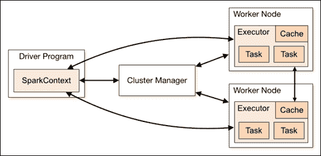
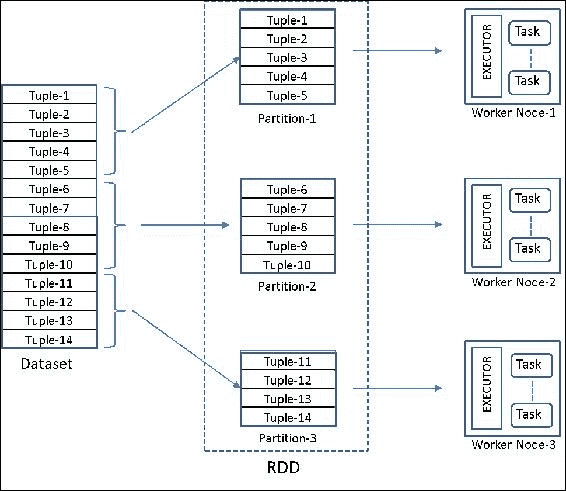
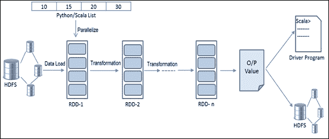

# 第二章。Spark 编程模型

由于开源框架的普及，大规模数据处理已成为常见做法，借助成千上万节点和内建的容错能力，Hadoop 成为了一个流行的选择。这些框架在执行特定任务（如 **提取、转换和加载**（**ETL**）以及处理 Web 规模数据的存储应用）上非常成功。然而，开发人员需要面对大量工具的选择，以及已经建立完善的 Hadoop 生态系统。业界急需一个单一的、通用的开发平台，能满足批处理、流处理、交互式和迭代式的需求。这正是 Spark 的动机所在。

上一章概述了大数据分析面临的挑战，以及 Spark 如何在高层次上解决其中的大部分问题。本章将深入探讨 Spark 的设计目标与选择，以更清晰地了解其作为大数据数据科学平台的适用性。我们还将深入讲解核心抽象 **弹性分布式数据集**（**RDD**）并通过示例进行说明。

本章的前提是需要具备基本的 Python 或 Scala 知识，以及对 Spark 的初步理解。本章涵盖的主题如下：

+   编程范式 - 语言支持与设计优势

    +   支持的编程语言

    +   选择合适的语言

+   Spark 引擎 - Spark 核心组件及其含义

    +   驱动程序

    +   Spark Shell

    +   SparkContext

    +   工作节点

    +   执行器

    +   共享变量

    +   执行流程

+   RDD API - 理解 RDD 基础

    +   RDD 基础

    +   持久化

+   RDD 操作 - 让我们动手试试

    +   开始使用 Shell

    +   创建 RDD

    +   对普通 RDD 的转换

    +   对配对 RDD 的转换

    +   操作

# 编程范式

为了解决大数据挑战并作为数据科学及其他可扩展应用的平台，Spark 在设计时考虑了周密的设计因素和语言支持。

Spark 提供了适用于各种应用开发者的 API，以便开发者使用标准的 API 接口创建基于 Spark 的应用程序。Spark 提供了适用于 Scala、Java、R 和 Python 编程语言的 API，详细内容在以下章节中讲解。

## 支持的编程语言

Spark 内建支持多种语言，可以通过 Shell 进行交互式使用，这种方式称为 **读取-评估-打印-循环**（**REPL**），对任何语言的开发者来说都非常熟悉。开发者可以选择自己熟悉的语言，利用现有的库，轻松与 Spark 及其生态系统进行交互。接下来，我们将介绍 Spark 支持的语言以及它们如何融入 Spark 生态系统。

### Scala

Spark 本身是用 Scala 编写的，Scala 是一种基于 **Java 虚拟机** (**JVM**) 的函数式编程语言。Scala 编译器生成的字节码在 JVM 上执行。因此，它可以与其他基于 JVM 的系统（如 HDFS、Cassandra、HBase 等）无缝集成。选择 Scala 作为编程语言，是因为它简洁的编程接口、交互式命令行以及能够捕获函数并高效地将其传输到集群中的各个节点。Scala 是一种可扩展的（因此得名）、静态类型、有效率的多范式语言，支持函数式和面向对象的语言特性。

除了完全成熟的应用程序，Scala 还支持 Shell（Spark shell）用于在 Spark 上进行交互式数据分析。

### Java

由于 Spark 是基于 JVM 的，它自然支持 Java。这有助于现有的 Java 开发者开发数据科学应用程序以及其他可扩展的应用程序。几乎所有内置的库函数都可以通过 Java 访问。在 Spark 中用 Java 编写数据科学任务相对较难，但如果非常熟悉 Java 的人，可能会觉得很容易。

这个 Java API 唯一缺少的是用于 Spark 上交互式数据分析的基于 Shell 的接口。

### Python

Python 通过 PySpark 在 Spark 上得到支持，PySpark 是构建在 Spark 的 Java API 之上的（使用 Py4J）。从现在起，我们将使用 **PySpark** 这个术语来指代 Spark 上的 Python 环境。Python 已经在开发者中因数据处理、数据清洗和其他数据科学相关任务而广受欢迎。随着 Spark 可以解决可扩展计算的挑战，Python 在 Spark 上的支持变得更加流行。

通过 Python 在 Spark 上的交互式命令行（PySpark），可以在大规模数据上进行交互式数据分析。

### R

R 通过 SparkR 在 Spark 上得到支持，SparkR 是一个 R 包，借此包 Spark 的可扩展性可以通过 R 来访问。SparkR 使得 R 克服了单线程运行时的局限性，这也是计算仅限于单个节点的原因。

由于 R 最初仅为统计分析和机器学习设计，因此它已经包含了大多数包。数据科学家现在可以在极大数据量下工作，并且几乎不需要学习曲线。R 仍然是许多数据科学家的首选。

## 选择正确的语言

除了开发者的语言偏好之外，有时还有其他一些约束条件可能会引起关注。以下几点可能会在选择语言时，补充你的开发体验：

+   在开发复杂逻辑时，交互式命令行非常有用。Spark 支持的所有语言中，除了 Java 外，其他都提供了交互式命令行。

+   R 是数据科学家的通用语言。由于其拥有更丰富的库集，它显然更适合纯数据分析。Spark 1.4.0 中加入了对 R 的支持，这使得 Spark 可以覆盖在 R 上工作的数据科学家。

+   Java 拥有更广泛的开发者基础。Java 8 引入了 Lambda 表达式，从而支持了函数式编程。然而，Java 往往显得冗长。

+   Python 在数据科学领域的受欢迎程度逐渐上升。Pandas 等数据处理库的可用性以及 Python 简单而富有表现力的特性，使其成为一个强有力的候选语言。在数据聚合、数据清理、自然语言处理等场景中，Python 比 R 更具灵活性。

+   Scala 可能是进行实时分析的最佳选择，因为它与 Spark 最为接近。对于来自其他语言的开发者而言，初期的学习曲线不应成为开发生产系统的障碍。Spark 的最新功能通常会首先在 Scala 中发布。Scala 的静态类型和复杂的类型推断提高了效率，并且增强了编译时的检查。Scala 可以利用 Java 的库，因为 Scala 自身的库基础仍处于早期阶段，但正在逐步追赶。

# Spark 引擎

要使用 Spark 编程，首先需要对 Spark 组件有基本的理解。在本节中，我们将解释一些重要的 Spark 组件及其执行机制，以帮助开发者和数据科学家编写程序并构建应用程序。

在深入了解细节之前，我们建议你先查看以下图表，以便在进一步阅读时能够更好地理解 Spark 各部分的描述：



## 驱动程序

Spark Shell 是驱动程序的一个示例。驱动程序是一个在 JVM 中执行并运行用户 *main* 函数的进程。它拥有一个 SparkContext 对象，该对象是与底层集群管理器的连接。当驱动程序启动时，Spark 应用程序开始；当驱动程序停止时，Spark 应用程序完成。驱动程序通过 SparkContext 实例来协调 Spark 应用程序中的所有进程。

首先，一个 RDD 的谱系 **有向无环图**（**DAG**）在驱动程序端构建，包含数据源（可能是 RDD）和转换操作。当遇到 *action* 方法时，这个 DAG 会被提交给 DAG 调度器。DAG 调度器随后将 DAG 分割成逻辑工作单元（例如 map 或 reduce），称为阶段（stages）。每个阶段又由一组任务组成，每个任务由任务调度器分配给一个执行器（worker）。任务可以按 FIFO 顺序或轮询顺序执行，具体取决于配置。

### 提示

在单个 Spark 应用程序中，如果多个任务是从不同的线程提交的，它们可以并行执行。

## Spark Shell

Spark shell 其实就是由 Scala 和 Python 提供的接口。它看起来与其他任何交互式 shell 非常相似。它有一个 SparkContext 对象（默认为你创建）让你能够利用分布式集群。交互式 shell 对于探索性或临时分析非常有用。你可以通过 shell 一步步地开发复杂的脚本，而不需要经历编译-构建-执行的循环过程。

## SparkContext

SparkContext 是进入 Spark 核心引擎的入口点。此对象用于创建和操作 RDD，以及在集群上创建共享变量。SparkContext 对象连接到集群管理器，集群管理器负责资源分配。Spark 自带独立的集群管理器。由于集群管理器是 Spark 中的可插拔组件，因此可以通过外部集群管理器（如 Apache Mesos 或 YARN）来管理它。

当你启动 Spark shell 时，默认会为你创建一个 SparkContext 对象。你也可以通过传递一个 SparkConf 对象来创建它，该对象用于设置各种 Spark 配置参数，以键值对的形式传递。请注意，JVM 中只能有一个 SparkContext 对象。

## 工作节点

工作节点是集群中运行应用程序代码的节点，听从驱动程序的指令。实际的工作是由工作节点执行的。集群中的每台机器可能有一个或多个工作实例（默认为一个）。一个工作节点执行一个或多个属于一个或多个 Spark 应用程序的执行进程。它由一个 *块管理器* 组件组成，负责管理数据块。数据块可以是缓存的 RDD 数据、中间的洗牌数据或广播数据。当可用的 RAM 不足时，它会自动将一些数据块移到磁盘。数据在节点之间的复制是块管理器的另一项职责。

## 执行进程

每个应用程序都有一组执行进程。执行进程驻留在工作节点上，并在集群管理器建立连接后与驱动程序直接通信。所有执行进程都由 SparkContext 管理。执行进程是一个独立的 JVM 实例，服务于一个 Spark 应用程序。执行进程负责通过任务在每个工作节点上管理计算、存储和缓存。它可以并行运行多个任务。

## 共享变量

通常，代码会随着变量的独立副本一起发送到各个分区。这些变量不能用于将结果（例如中间工作计数）传递回驱动程序。共享变量用于这个目的。有两种共享变量，**广播变量** 和 **累加器**。

广播变量使程序员能够在每个节点上保留只读副本，而不是将其与任务一起传输。如果在多个操作中使用大型的只读数据，可以将其指定为广播变量，并只将其传输一次到所有工作节点。以这种方式广播的数据是以序列化形式缓存的，在运行每个任务之前会被反序列化。后续操作可以访问这些变量以及与代码一起传输的本地变量。并非所有情况都需要创建广播变量，只有在跨多个阶段的任务需要相同的只读数据副本时，才需要使用广播变量。

累加器是始终递增的变量，例如计数器或累计和。Spark 本地支持数值类型的累加器，但允许程序员为新类型添加支持。请注意，工作节点不能读取累加器的值；它们只能修改其值。

## 执行流程

一个 Spark 应用程序由一组进程组成，其中有一个*驱动程序*程序和多个*工作程序*（*执行器*）程序。驱动程序包含应用程序的*main*函数和一个 SparkContext 对象，后者表示与 Spark 集群的连接。驱动程序和其他进程之间的协调是通过 SparkContext 对象完成的。

一个典型的 Spark 客户端程序执行以下步骤：

1.  当程序在 Spark shell 上运行时，它被称为驱动程序，包含用户的`main`方法。它在运行驱动程序的系统的 JVM 中执行。

1.  第一步是使用所需的配置参数创建一个 SparkContext 对象。当你运行 PySpark 或 Spark shell 时，它会默认实例化，但对于其他应用程序，你需要显式地创建它。SparkContext 实际上是访问 Spark 的入口。

1.  下一步是定义一个或多个 RDD，方法是加载文件或通过传递项的数组（称为并行集合）以编程方式定义。

1.  然后可以通过一系列转换定义更多的 RDD，这些转换通过**祖先图**进行追踪和管理。这些 RDD 转换可以看作是 UNIX 命令管道，其中一个命令的输出作为下一个命令的输入，以此类推。每个*转换*步骤的结果 RDD 都有指向其父 RDD 的指针，并且有一个用于计算其数据的函数。RDD 只有在遇到*动作*语句后才会被操作。所以，*转换*是懒操作，用于定义新的 RDD，而*动作*启动计算并返回值给程序或将数据写入外部存储。我们将在以下部分进一步讨论这一方面。

1.  在这个阶段，Spark 创建一个执行图，其中节点表示 RDD，边表示转换步骤。Spark 将作业分解为多个任务，在不同的机器上运行。这是 Spark 如何将计算发送到集群中的节点上的一种方法，而不是将所有数据一起获取并进行计算。

# RDD API

RDD 是一个只读、分区的、容错的记录集合。从设计的角度来看，需要一个单一的数据结构抽象，隐藏处理各种数据源（如 HDFS、文件系统、RDBMS、NOSQL 数据结构或任何其他数据源）的复杂性。用户应能够从这些源中定义 RDD。目标是支持广泛的操作，并允许用户以任何顺序组合它们。

## RDD 基础知识

每个数据集在 Spark 编程接口中表示为一个名为 RDD 的对象。Spark 提供了两种创建 RDD 的方式。一种方式是并行化现有集合。另一种方式是引用外部存储系统（如文件系统）中的数据集。

RDD 由一个或多个数据源组成，可能在执行一系列包括多个运算符的转换后。每个 RDD 或 RDD 分区都知道如何在失败时重新创建自己。它具有转换的日志或*血统*，从稳定存储或另一个 RDD 中重新创建自己所需。因此，使用 Spark 的任何程序都可以确保具有内置的容错性，无论底层数据源和 RDD 的类型如何。

RDD 上有两种方法可用：转换和操作。转换是用于创建 RDD 的方法。操作是利用 RDD 的方法。RDD 通常被分区。用户可以选择持久化 RDD，以便在其程序中重复使用。

RDDs 是不可变（只读）数据结构，因此任何转换都会导致新的 RDD 的创建。这些转换是惰性应用的，只有在应用任何操作时才会应用它们，而不是在定义 RDD 时。每次在操作中使用 RDD 时，RDD 都会重新计算，除非用户显式将 RDD 持久化到内存中。将数据保存在内存中可以节省大量时间。如果内存不足以完全容纳 RDD，则该 RDD 的剩余部分将自动存储（溢写）到硬盘上。惰性转换的一个优点是可以优化转换步骤。例如，如果操作是返回第一行，则 Spark 只计算单个分区并跳过其余部分。

一个 RDD 可以视为一组分区（拆分），它具有一份父 RDD 的依赖列表，以及一个给定父 RDD 的函数，用于计算该分区。有时，每个父 RDD 的分区只会被一个子 RDD 使用。这叫做 *窄依赖*。窄依赖是理想的，因为当父 RDD 分区丢失时，只需要重新计算单个子分区。另一方面，计算一个包含诸如 *按键分组* 等操作的单个子 RDD 分区时，依赖于多个父 RDD 分区。每个父 RDD 分区中的数据在生成多个子 RDD 分区数据时都需要用到。这样的依赖叫做 *宽依赖*。在窄依赖的情况下，父 RDD 和子 RDD 分区可以保持在同一个节点上（共同分区）。但在宽依赖的情况下，由于父数据分散在多个分区中，这是不可能的。在这种情况下，数据应该在分区间进行 *洗牌*。数据洗牌是一个资源密集型操作，应尽可能避免。宽依赖的另一个问题是，即使只有一个父 RDD 分区丢失，所有子 RDD 分区也需要重新计算。

## 持久化

每当 RDD 被操作时，它都会即时计算。开发者可以覆盖这个默认行为，指示要在分区之间 *持久化* 或 *缓存* 数据集。如果该数据集需要参与多个操作，那么持久化可以节省大量时间、CPU 周期、磁盘 I/O 和网络带宽。容错机制同样适用于缓存的分区。当任何分区由于节点故障丢失时，会通过谱系图重新计算该分区。如果可用内存不足，Spark 会优雅地将持久化的分区溢出到磁盘。开发者可以使用 *unpersist* 移除不需要的 RDD。然而，Spark 会自动监控缓存，并使用 **最近最少使用**（**LRU**）算法移除旧的分区。

### 提示

`Cache()` 与 `persist()` 或 `persist (MEMORY_ONLY)` 相同。虽然 `persist()` 方法可以接受许多其他参数来指定不同的持久化级别，例如仅内存、内存和磁盘、仅磁盘等，但 `cache()` 方法仅用于内存中的持久化。

# RDD 操作

Spark 编程通常从选择一个你熟悉的界面开始。如果你打算进行交互式数据分析，那么 shell 提示符显然是一个不错的选择。然而，选择 Python shell（PySpark）或 Scala shell（Spark-Shell）在一定程度上取决于你对这些语言的熟练程度。如果你正在构建一个完整的可扩展应用程序，那么熟练度就显得尤为重要，因此你应该根据自己擅长的语言（Scala、Java 或 Python）来开发应用，并提交到 Spark。我们将在本书后面详细讨论这一方面。

## 创建 RDD

在本节中，我们将使用 Python shell（PySpark）和 Scala shell（Spark-Shell）来创建 RDD。两个 shell 都具有预定义的、能够感知解释器的 SparkContext，并将其分配给变量 `sc`。

让我们通过一些简单的代码示例开始。请注意，代码假定当前工作目录是 Spark 的主目录。以下代码片段启动 Spark 交互式 shell，从本地文件系统读取文件，并打印该文件的第一行：

**Python**：

```py
> bin/pyspark  // Start pyspark shell  
>>> _         // For simplicity sake, no Log messages are shown here 

>>> type(sc)    //Check the type of Predefined SparkContext object 
<class 'pyspark.context.SparkContext'> 

//Pass the file path to create an RDD from the local file system 
>>> fileRDD = sc.textFile('RELEASE') 

>>> type(fileRDD)  //Check the type of fileRDD object  
<class 'pyspark.rdd.RDD'> 

>>>fileRDD.first()   //action method. Evaluates RDD DAG and also returns the first item in the RDD along with the time taken 
took 0.279229 s 
u'Spark Change Log' 

```

**Scala**：

```py
> bin/Spark-Shell  // Start Spark-shell  
Scala> _      // For simplicity sake, no Log messages are shown here 

Scala> sc   //Check the type of Predefined SparkContext object 
res1: org.apache.spark.SparkContext = org.apache.spark.SparkContext@70884875 

//Pass the file path to create an RDD from the local file system 

Scala> val fileRDD = sc.textFile("RELEASE") 

Scala> fileRDD  //Check the type of fileRDD object  
res2: org.apache.spark.rdd.RDD[String] = ../ RELEASE
MapPartitionsRDD[1] at textFile at <console>:21 

Scala>fileRDD.first()   //action method. Evaluates RDD DAG and also returns the first item in the RDD along with the time taken 
0.040965 s 
res6: String = Spark Change Log 

```

在前面的示例中，第一行已经调用了交互式 shell。SparkContext 变量 `sc` 已按预期定义。我们创建了一个名为 `fileRDD` 的 RDD，指向文件 `RELEASE`。此语句只是一个转换，直到遇到操作时才会执行。你可以尝试给一个不存在的文件名，但在执行下一个语句之前不会报错，而该语句恰好是一个 *action* 操作。

我们已经完成了启动 Spark 应用程序（shell）、创建 RDD 并消费它的整个过程。由于 RDD 每次执行操作时都会重新计算，`fileRDD` 并不会持久化到内存或硬盘中。这使得 Spark 可以优化步骤顺序并智能地执行。事实上，在之前的示例中，优化器只会读取输入文件的一个分区，因为 `first()` 不需要进行完整的文件扫描。

回顾一下，创建 RDD 有两种方式：一种是创建指向数据源的指针，另一种是并行化现有的集合。之前的示例展示了第一种方式，即从存储系统加载文件。接下来我们将看到第二种方式，即并行化现有的集合。通过传递内存中的集合来创建 RDD 非常简单，但对于大型集合可能效果不佳，因为输入集合必须完全适应驱动节点的内存。

以下示例通过使用 `parallelize` 函数将 Python/Scala 列表传递来创建 RDD：

**Python**：

```py
// Pass a Python collection to create an RDD 
>>> numRDD = sc.parallelize([1,2,3,4],2) 
>>> type(numRDD) 
<class 'pyspark.rdd.RDD'> 
>>> numRDD 
ParallelCollectionRDD[1] at parallelize at PythonRDD.scala:396 
>>> numRDD.first() 
1 
>>> numRDD.map(lambda(x) : x*x).collect() 
[1,4,9,16] 
>>> numRDD.map(lambda(x) : x * x).reduce(lambda a,b: a+b) 
30 

```

### 提示

lambda 函数是一个没有名称的函数，通常作为其他函数的参数传递给函数。Python 中的 lambda 函数只能是一个单一的表达式。如果你的逻辑需要多个步骤，可以创建一个独立的函数，并在 lambda 表达式中使用它。

**Scala**：

```py
// Pass a Scala collection to create an RDD 
Scala> val numRDD = sc.parallelize(List(1,2,3,4),2) 
numRDD: org.apache.spark.rdd.RDD[Int] = ParallelCollectionRDD[8] at parallelize at <console>:21 

Scala> numRDD 
res15: org.apache.spark.rdd.RDD[Int] = ParallelCollectionRDD[8] at parallelize at <console>:21 

Scala> numRDD.first() 
res16: Int = 1 

Scala> numRDD.map(x => x*x).collect() 
res2: Array[Int] = Array(1, 4, 9, 16) 

Scala> numRDD.map(x => x * x).reduce(_+_) 
res20: Int = 30 

```

正如我们在前面的示例中所看到的，我们能够传递一个 Scala/Python 集合来创建一个 RDD，同时我们也可以自由指定将这些集合切分成多少个分区。Spark 为集群中的每个分区运行一个任务，因此必须仔细决定如何优化计算工作量。虽然 Spark 会根据集群自动设置分区数，但我们可以通过将其作为第二个参数传递给 `parallelize` 函数来手动设置分区数（例如，`sc.parallelize(data, 3)`）。以下是一个 RDD 的示意图，该 RDD 是通过一个包含 14 条记录（或元组）的数据集创建的，并被分成 3 个分区，分布在 3 个节点上：



编写 Spark 程序通常包括转换和操作。转换是延迟操作，用于定义如何构建 RDD。大多数转换接受一个函数作为参数。所有这些方法将一种数据源转换为另一种数据源。每次对任何 RDD 执行转换时，即使只是一个小的改变，也会生成一个新的 RDD，如下图所示：



这是因为 RDD 是不可变（只读）抽象设计的。操作的结果可以写回存储系统，或者在需要生成最终输出时返回给驱动程序进行本地计算。

到目前为止，我们已经看到了一些简单的转换操作，它们定义了 RDD 以及一些操作来处理它们并生成输出。接下来，让我们快速浏览一些常用的转换和操作，随后再看看对成对 RDD 的转换操作。

## 普通 RDD 的转换操作

Spark API 包含一套丰富的转换操作符，开发人员可以将它们以任意方式组合。请在交互式 shell 中尝试以下示例，以更好地理解这些操作。

### filter 操作

`filter` 操作返回一个 RDD，其中只包含满足 `filter` 条件的元素，类似于 SQL 中的 `WHERE` 条件。

**Python**:

```py
a = sc.parallelize([1,2,3,4,5,6], 3) 
b = a.filter(lambda x: x % 3 == 0) 
b.collect() 
[3,6] 

```

**Scala**:

```py
val a = sc.parallelize(1 to 10, 3) 
val b = a.filter(_ % 3 == 0) 
b.collect 

res0: Array[Int] = Array(3, 6, 9) 

```

### distinct 操作

distinct (`[numTasks]`) 操作返回一个经过去重的新数据集的 RDD：

**Python**:

```py
c = sc.parallelize(["John", "Jack", "Mike", "Jack"], 2) 
c.distinct().collect() 

['Mike', 'John', 'Jack'] 

```

**Scala**:

```py
val c = sc.parallelize(List("John", "Jack", "Mike", "Jack"), 2) 
c.distinct.collect 
res6: Array[String] = Array(Mike, John, Jack) 

val a = sc.parallelize(List(11,12,13,14,15,16,17,18,19,20)) 
a.distinct(2).partitions.length      //create 2 tasks on two partitions of the same RDD for parallel execution 

res16: Int = 2 

```

### 交集操作

交集操作接受另一个数据集作为输入。它返回一个包含共同元素的数据集：

**Python**:

```py
x = sc.parallelize([1,2,3,4,5,6,7,8,9,10]) 
y = sc.parallelize([5,6,7,8,9,10,11,12,13,14,15]) 
z = x.intersection(y) 
z.collect() 

[8, 9, 10, 5, 6, 7] 

```

**Scala**:

```py
val x = sc.parallelize(1 to 10) 
val y = sc.parallelize(5 to 15) 
val z = x.intersection(y) 
z.collect 

res74: Array[Int] = Array(8, 9, 5, 6, 10, 7) 

```

### union 操作

union 操作接受另一个数据集作为输入。它返回一个包含自身和输入数据集元素的数据集。如果两个集合中有共同的值，则它们会在联合后的结果集中作为重复值出现：

**Python**:

```py
a = sc.parallelize([3,4,5,6,7], 1) 
b = sc.parallelize([7,8,9], 1) 
c = a.union(b) 
c.collect() 

[3, 4, 5, 6, 7, 7, 8, 9] 

```

**Scala**:

```py
val a = sc.parallelize(3 to 7, 1) 
val b = sc.parallelize(7 to 9, 1) 
val c = a.union(b)     // An alternative way is (a ++ b).collect 

res0: Array[Int] = Array(3, 4, 5, 6, 7, 7, 8, 9) 

```

### map 操作

map 操作通过在输入数据集的每个元素上执行一个输入函数，返回一个分布式数据集：

**Python**:

```py
a = sc.parallelize(["animal", "human", "bird", "rat"], 3) 
b = a.map(lambda x: len(x)) 
c = a.zip(b) 
c.collect() 

[('animal', 6), ('human', 5), ('bird', 4), ('rat', 3)] 

```

**Scala**:

```py
val a = sc.parallelize(List("animal", "human", "bird", "rat"), 3) 
val b = a.map(_.length) 
val c = a.zip(b) 
c.collect 

res0: Array[(String, Int)] = Array((animal,6), (human,5), (bird,4), (rat,3)) 

```

### flatMap 操作

flatMap 操作类似于 `map` 操作。虽然 `map` 对每个输入元素返回一个元素，`flatMap` 对每个输入元素返回一个零个或多个元素的列表：

**Python**:

```py
a = sc.parallelize([1,2,3,4,5], 4) 
a.flatMap(lambda x: range(1,x+1)).collect() 
   // Range(1,3) returns 1,2 (excludes the higher boundary element) 
[1, 1, 2, 1, 2, 3, 1, 2, 3, 4, 1, 2, 3, 4, 5] 

sc.parallelize([5, 10, 20], 2).flatMap(lambda x:[x, x, x]).collect() 
[5, 5, 5, 10, 10, 10, 20, 20, 20] 

```

**Scala**:

```py
val a = sc.parallelize(1 to 5, 4) 
a.flatMap(1 to _).collect 
res47: Array[Int] = Array(1, 1, 2, 1, 2, 3, 1, 2, 3, 4, 1, 2, 3, 4, 5) 

//One more example 
sc.parallelize(List(5, 10, 20), 2).flatMap(x => List(x, x, x)).collect 
res85: Array[Int] = Array(5, 5, 5, 10, 10, 10, 20, 20, 20) 

```

### keys 操作

keys 操作返回一个 RDD，其中包含每个元组的键：

**Python**:

```py
a = sc.parallelize(["black", "blue", "white", "green", "grey"], 2) 
b = a.map(lambda x:(len(x), x)) 
c = b.keys() 
c.collect() 

[5, 4, 5, 5, 4] 

```

**Scala**:

```py
val a = sc.parallelize(List("black", "blue", "white", "green", "grey"), 2) 
val b = a.map(x => (x.length, x)) 
b.keys.collect 

res2: Array[Int] = Array(5, 4, 5, 5, 4) 

```

### 笛卡尔积操作

`cartesian` 操作接受另一个数据集作为参数，返回两个数据集的笛卡尔积。这是一个可能比较昂贵的操作，会返回一个大小为 `m` x `n` 的数据集，其中 `m` 和 `n` 是输入数据集的大小：

**Python**:

```py
x = sc.parallelize([1,2,3]) 
y = sc.parallelize([10,11,12]) 
x.cartesian(y).collect() 

[(1, 10), (1, 11), (1, 12), (2, 10), (2, 11), (2, 12), (3, 10), (3, 11), (3, 12)] 

```

**Scala**:

```py
val x = sc.parallelize(List(1,2,3)) 
val y = sc.parallelize(List(10,11,12)) 
x.cartesian(y).collect 

res0: Array[(Int, Int)] = Array((1,10), (1,11), (1,12), (2,10), (2,11), (2,12), (3,10), (3,11), (3,12))  

```

## 对配对 RDD 的变换

一些 Spark 操作仅适用于键值对类型的 RDD。请注意，除了计数操作之外，这些操作通常涉及洗牌，因为与某个键相关的数据可能并不总是驻留在同一个分区中。

### groupByKey 操作

类似于 SQL 中的 `groupBy` 操作，它根据键将输入数据分组，你可以使用 `aggregateKey` 或 `reduceByKey` 来执行聚合操作：

**Python**:

```py
a = sc.parallelize(["black", "blue", "white", "green", "grey"], 2) 
b = a.groupBy(lambda x: len(x)).collect() 
sorted([(x,sorted(y)) for (x,y) in b]) 

[(4, ['blue', 'grey']), (5, ['black', 'white', 'green'])] 

```

**Scala**:

```py
val a = sc.parallelize(List("black", "blue", "white", "green", "grey"), 2) 
val b = a.keyBy(_.length) 
b.groupByKey.collect 

res11: Array[(Int, Iterable[String])] = Array((4,CompactBuffer(blue, grey)), (5,CompactBuffer(black, white, green))) 

```

### join 操作

join 操作接受另一个数据集作为输入。两个数据集应该是键值对类型。结果数据集是另一个键值对数据集，包含两个数据集的键和值：

**Python**:

```py
a = sc.parallelize(["blue", "green", "orange"], 3) 
b = a.keyBy(lambda x: len(x)) 
c = sc.parallelize(["black", "white", "grey"], 3) 
d = c.keyBy(lambda x: len(x)) 
b.join(d).collect() 
[(4, ('blue', 'grey')), (5, ('green', 'black')), (5, ('green', 'white'))] 

//leftOuterJoin 
b.leftOuterJoin(d).collect() 
[(6, ('orange', None)), (4, ('blue', 'grey')), (5, ('green', 'black')), (5, ('green', 'white'))] 

//rightOuterJoin 
b.rightOuterJoin(d).collect() 
[(4, ('blue', 'grey')), (5, ('green', 'black')), (5, ('green', 'white'))] 

//fullOuterJoin 
b.fullOuterJoin(d).collect() 
[(6, ('orange', None)), (4, ('blue', 'grey')), (5, ('green', 'black')), (5, ('green', 'white'))] 

```

**Scala**:

```py
val a = sc.parallelize(List("blue", "green", "orange"), 3) 
val b = a.keyBy(_.length) 
val c = sc.parallelize(List("black", "white", "grey"), 3) 
val d = c.keyBy(_.length) 
b.join(d).collect 
res38: Array[(Int, (String, String))] = Array((4,(blue,grey)), (5,(green,black)), (5,(green,white))) 

//leftOuterJoin 
b.leftOuterJoin(d).collect 
res1: Array[(Int, (String, Option[String]))] = Array((6,(orange,None)), (4,(blue,Some(grey))), (5,(green,Some(black))), (5,(green,Some(white)))) 

//rightOuterJoin 
b.rightOuterJoin(d).collect 
res1: Array[(Int, (Option[String], String))] = Array((4,(Some(blue),grey)), (5,(Some(green),black)), (5,(Some(green),white))) 

//fullOuterJoin 
b.fullOuterJoin(d).collect 
res1: Array[(Int, (Option[String], Option[String]))] = Array((6,(Some(orange),None)), (4,(Some(blue),Some(grey))), (5,(Some(green),Some(black))), (5,(Some(green),Some(white))))  

```

### reduceByKey 操作

reduceByKey 操作使用一个结合性减少函数来合并每个键的值。这也将在每个映射器上本地执行合并，然后将结果发送到减少器并生成哈希分区输出：

**Python**:

```py
a = sc.parallelize(["black", "blue", "white", "green", "grey"], 2) 
b = a.map(lambda x: (len(x), x)) 
b.reduceByKey(lambda x,y: x + y).collect() 
[(4, 'bluegrey'), (5, 'blackwhitegreen')] 

a = sc.parallelize(["black", "blue", "white", "orange"], 2) 
b = a.map(lambda x: (len(x), x)) 
b.reduceByKey(lambda x,y: x + y).collect() 
[(4, 'blue'), (6, 'orange'), (5, 'blackwhite')] 

```

**Scala**:

```py
val a = sc.parallelize(List("black", "blue", "white", "green", "grey"), 2) 
val b = a.map(x => (x.length, x)) 
b.reduceByKey(_ + _).collect 
res86: Array[(Int, String)] = Array((4,bluegrey), (5,blackwhitegreen)) 

val a = sc.parallelize(List("black", "blue", "white", "orange"), 2) 
val b = a.map(x => (x.length, x)) 
b.reduceByKey(_ + _).collect 
res87: Array[(Int, String)] = Array((4,blue), (6,orange), (5,blackwhite))  

```

### 聚合操作

aggregrate 操作返回一个 RDD，其中包含每个元组的键：

**Python**:

```py
z = sc.parallelize([1,2,7,4,30,6], 2) 
z.aggregate(0,(lambda x, y: max(x, y)),(lambda x, y: x + y)) 
37 
z = sc.parallelize(["a","b","c","d"],2) 
z.aggregate("",(lambda x, y: x + y),(lambda x, y: x + y)) 
'abcd' 
z.aggregate("s",(lambda x, y: x + y),(lambda x, y: x + y)) 
'ssabsscds' 
z = sc.parallelize(["12","234","345","56789"],2) 
z.aggregate("",(lambda x, y: str(max(len(str(x)), len(str(y))))),(lambda x, y: str(y) + str(x))) 
'53' 
z.aggregate("",(lambda x, y: str(min(len(str(x)), len(str(y))))),(lambda x, y: str(y) + str(x))) 
'11' 
z = sc.parallelize(["12","234","345",""],2) 
z.aggregate("",(lambda x, y: str(min(len(str(x)), len(str(y))))),(lambda x, y: str(y) + str(x))) 
'01' 

```

**Scala**:

```py
val z = sc.parallelize(List(1,2,7,4,30,6), 2) 
z.aggregate(0)(math.max(_, _), _ + _) 
res40: Int = 37 

val z = sc.parallelize(List("a","b","c","d"),2) 
z.aggregate("")(_ + _, _+_) 
res115: String = abcd 

z.aggregate("x")(_ + _, _+_) 
res116: String = xxabxcd 

val z = sc.parallelize(List("12","234","345","56789"),2) 
z.aggregate("")((x,y) => math.max(x.length, y.length).toString, (x,y) => x + y) 
res141: String = 53 

z.aggregate("")((x,y) => math.min(x.length, y.length).toString, (x,y) => x + y) 
res142: String = 11 

val z = sc.parallelize(List("12","234","345",""),2) 
z.aggregate("")((x,y) => math.min(x.length, y.length).toString, (x,y) => x + y) 
res143: String = 01 

```

### 注意

请注意，在前面的聚合示例中，结果字符串（例如，`abcd`，`xxabxcd`，`53`，`01`）不需要与这里显示的输出完全匹配。它取决于各个任务返回其输出的顺序。

## Actions

一旦创建了 RDD，各种变换只有在对其执行 *action* 操作时才会被执行。一个 action 操作的结果可以是写回存储系统的数据，或者返回给发起该操作的驱动程序，以便进一步在本地计算产生最终结果。

我们已经在前面的变换示例中涵盖了一些 action 函数。下面是更多的示例，但还有很多你需要探索的。

### collect() 函数

`collect()` 函数将 RDD 操作的所有结果作为数组返回给驱动程序。通常，针对生成足够小的数据集的操作，这个函数非常有用。理想情况下，结果应该能够轻松适应承载驱动程序的系统的内存。

### count() 函数

该操作返回数据集中的元素数量或 RDD 操作的结果输出。

### take(n) 函数

`take(n)`函数返回数据集的前`n`个元素或 RDD 操作的结果输出。

### first()函数

`first()`函数返回数据集的第一个元素或 RDD 操作的结果输出。它的工作方式与`take(1)`函数类似。

### takeSample()函数

`takeSample(withReplacement, num, [seed])`函数返回一个包含数据集随机样本元素的数组。它有三个参数，如下所示：

+   `withReplacement`/`withoutReplacement`：表示是否进行有放回或无放回的抽样（在多次抽样时，表示是否将旧样本放回集合中再抽取新的样本，或者是直接不放回）。对于`withReplacement`，参数应为`True`，否则为`False`。

+   `num`：表示样本中的元素数量。

+   `Seed`：这是一个随机数生成器种子（可选）。

### countByKey()函数

`countByKey()`函数仅在键值类型的 RDD 上可用。它返回一个包含（`K`，`Int`）对的表，表中记录了每个键的计数。

以下是一些 Python 和 Scala 的示例代码：

**Python**：

```py
>>> sc.parallelize([2, 3, 4]).count() 
3 

>>> sc.parallelize([2, 3, 4]).collect() 
[2, 3, 4] 

>>> sc.parallelize([2, 3, 4]).first() 
2 

>>> sc.parallelize([2, 3, 4]).take(2) 
[2, 3] 

```

**Scala**：

```py
Scala> sc.parallelize(List(2, 3, 4)).count() 
res0: Long = 3 

Scala> sc.parallelize(List(2, 3, 4)).collect() 
res1: Array[Int] = Array(2, 3, 4) 

Scala> sc.parallelize(List(2, 3, 4)).first() 
res2: Int = 2 

Scala> sc.parallelize(List(2, 3, 4)).take(2) 
res3: Array[Int] = Array(2, 3)  

```

# 总结

在本章中，我们涉及了支持的编程语言、它们的优缺点以及何时选择一种语言而不是另一种语言。我们讨论了 Spark 引擎的设计以及它的核心组件和执行机制。我们了解了 Spark 如何将待处理的数据发送到多个集群节点。接着我们讨论了一些 RDD 概念，学习了如何通过 Scala 和 Python 创建 RDD 并对其进行转换和操作。我们还讨论了一些 RDD 的高级操作。

在下一章中，我们将详细学习 DataFrame 及其如何证明适用于各种数据科学需求。

# 参考文献

Scala 语言：

+   [`www.scala-lang.org`](http://www.scala-lang.org)

Apache Spark 架构：

+   [`lintool.github.io/SparkTutorial/slides/day1_context.pdf`](http://lintool.github.io/SparkTutorial/slides/day1_context.pdf)

Spark 编程指南是学习概念的主要资源；有关可用操作的完整列表，请参阅语言特定的 API 文档：

+   [`spark.apache.org/docs/latest/programming-guide.html`](http://spark.apache.org/docs/latest/programming-guide.html)

《Resilient Distributed Datasets: A Fault-Tolerant Abstraction for In-Memory Cluster Computing》由 Matei Zaharia 等人编写，是 RDD 基础的原始来源：

+   [`people.csail.mit.edu/matei/papers/2012/nsdi_spark.pdf`](https://people.csail.mit.edu/matei/papers/2012/nsdi_spark.pdf)

+   [`www.eecs.berkeley.edu/Pubs/TechRpts/2014/EECS-2014-12.pdf`](http://www.eecs.berkeley.edu/Pubs/TechRpts/2014/EECS-2014-12.pdf)

Spark Summit，Apache Spark 的官方活动系列，提供了丰富的最新信息。查看过去活动的演示文稿和视频：

+   [`spark-summit.org/2016/`](https://spark-summit.org/2016/)
