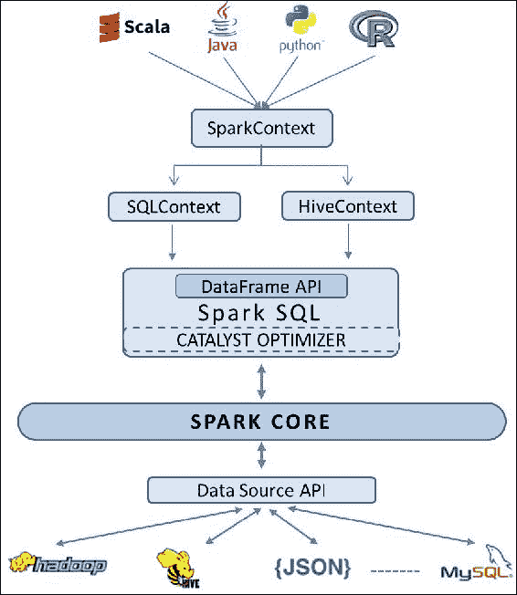

# 第三章：DataFrame 介绍

要解决任何实际的“大数据分析”问题，访问一个高效且可扩展的计算系统是绝对必要的。然而，如果计算能力对目标用户而言不易获取且不熟悉，那它几乎毫无意义。当数据集可以表示为命名列时，交互式数据分析会变得更简单，而这在普通的 RDD 中并不适用。因此，采用基于架构的方式来标准化数据表示的需求，正是 DataFrame 的灵感来源。

上一章概述了 Spark 的一些设计方面。我们了解了 Spark 如何通过内存计算在分布式数据集合（RDD）上实现分布式数据处理。它涵盖了大部分揭示 Spark 作为一个快速、高效和可扩展计算平台的要点。在本章中，我们将看到 Spark 如何引入 DataFrame API，使数据科学家能够轻松地进行他们日常的数据分析工作。

本章内容将作为接下来许多章节的基础，我们强烈建议你充分理解这里涵盖的概念。作为本章的前提，需具备 SQL 和 Spark 的基本理解。本章涵盖的主题如下：

+   为什么选择 DataFrame？

+   Spark SQL

    +   Catalyst 优化器

+   DataFrame API

    +   DataFrame 基础

    +   RDD 与 DataFrame

+   创建 DataFrame

    +   来自 RDD

    +   来自 JSON

    +   来自 JDBC 数据源

    +   来自其他数据源

+   操作 DataFrame

# 为什么选择 DataFrame？

除了强大的、可扩展的计算能力外，大数据应用还需要结合一些额外的特性，例如支持交互式数据分析的关系系统（简单的 SQL 风格）、异构数据源以及不同的存储格式和处理技术。

尽管 Spark 提供了一个函数式编程 API 来操作分布式数据集合，但最终结果还是元组（_1、_2、...）。在元组上编写代码稍显复杂且凌乱，且有时速度较慢。因此，迫切需要一个标准化的层，具备以下特点：

+   使用带有架构的命名列（比元组更高层次的抽象），使得对它们进行操作和追踪变得容易

+   提供将来自不同数据源的数据（如 Hive、Parquet、SQL Server、PostgreSQL、JSON，以及 Spark 原生的 RDD）整合并统一为一个公共格式的功能

+   能够利用 Avro、CSV、JSON 等特殊文件格式中的内置架构。

+   支持简单的关系运算以及复杂的逻辑操作

+   消除了基于领域特定任务为机器学习算法定义列对象的需求，作为机器学习库（MLlib）中所有算法的公共数据层

+   一个语言无关的实体，可以在不同语言的函数之间传递

为了满足上述需求，DataFrame API 被构建为在 Spark SQL 之上的又一抽象层。

# Spark SQL

执行 SQL 查询以满足基本业务需求是非常常见的，几乎每个企业都通过某种数据库进行此操作。所以 Spark SQL 也支持执行使用基本 SQL 语法或 HiveQL 编写的 SQL 查询。Spark SQL 还可以用来从现有的 Hive 安装中读取数据。除了这些简单的 SQL 操作外，Spark SQL 还解决了一些棘手的问题。通过关系查询设计复杂逻辑曾经是繁琐的，甚至在某些时候几乎是不可能的。因此，Spark SQL 旨在将关系处理和函数式编程的能力结合起来，从而实现、优化和在分布式计算环境中扩展复杂逻辑。基本上有三种方式与 Spark SQL 交互，包括 SQL、DataFrame API 和 Dataset API。Dataset API 是在写本书时 Spark 1.6 中加入的实验性层，因此我们将仅限于讨论 DataFrame。

Spark SQL 将 DataFrame 显示为更高级的 API，处理所有涉及的复杂性并执行所有后台任务。通过声明式语法，用户可以专注于程序应该完成什么，而不必担心控制流，因为这将由内置于 Spark SQL 中的 Catalyst 优化器处理。

## Catalyst 优化器

Catalyst 优化器是 Spark SQL 和 DataFrame 的支点。它通过 Scala 的函数式编程构造构建，具有以下特点：

+   从各种数据格式中推断模式：

    +   Spark 内置支持 JSON 模式推断。用户只需将任何 JSON 文件注册为表，并通过 SQL 语法进行查询，即可创建该表。

    +   RDD 是 Scala 对象；类型信息通过 Scala 的类型系统提取，也就是**案例类**，如果它们包含案例类的话。

    +   RDD 是 Python 对象；类型信息通过不同的方式提取。由于 Python 不是静态类型的，遵循动态类型系统，因此 RDD 可以包含多种类型。因此，Spark SQL 会对数据集进行采样，并使用类似于 JSON 模式推断的算法推断模式。

    +   未来将提供对 CSV、XML 和其他格式的内置支持。

+   内置支持多种数据源和查询联合，以高效导入数据：

    +   Spark 具有内置机制，可以通过查询联合从某些外部数据源（例如 JSON、JDBC、Parquet、MySQL、Hive、PostgreSQL、HDFS、S3 等）获取数据。它可以通过使用开箱即用的 SQL 数据类型和其他复杂数据类型，如 Struct、Union、Array 等，精确建模源数据。

    +   它还允许用户使用**数据源 API**从 Spark 原生不支持的数据源中获取数据（例如 CSV、Avro、HBase、Cassandra 等）。

    +   Spark 使用谓词下推（将过滤或聚合操作推送到外部存储系统）来优化从外部系统获取数据，并将它们结合形成数据管道。

+   代码生成的控制与优化：

    +   优化实际上发生在整个执行管道的最后阶段。

    +   Catalyst 被设计用来优化查询执行的所有阶段：分析、逻辑优化、物理规划和代码生成，将查询的部分内容编译为 Java 字节码。

# DataFrame API

类似于 Excel 表格的数据表示，或来自数据库投影（select 语句的输出），数据表示最接近人类理解的始终是由多个行和统一列组成的集合。这样的二维数据结构，通常具有带标签的行和列，在一些领域被称为 DataFrame，例如 R 的 DataFrame 和 Python 的 Pandas DataFrame。在 DataFrame 中，通常单列包含相同类型的数据，行描述与该列相关的数据点，这些数据点一起表达某些含义，无论是关于一个人的信息、一次购买，还是一场棒球比赛的结果。你可以将它视为矩阵、电子表格或关系型数据库表。

在 R 和 Pandas 中，DataFrame 在切片、重塑和分析数据方面非常方便——这些是任何数据清洗和数据分析工作流中的基本操作。这启发了在 Spark 中开发类似的概念，称为 DataFrame。

## DataFrame 基础

DataFrame API 首次在 Spark 1.3.0 版本中引入，发布于 2015 年 3 月。它是 Spark SQL 对结构化和半结构化数据处理的编程抽象。它使开发人员能够通过 Python、Java、Scala 和 R 等语言利用 DataFrame 数据结构的强大功能。与 RDD 相似，Spark DataFrame 是一组分布式记录，按命名列组织，类似于关系型数据库管理系统（RDBMS）中的表或 R 或 Pandas 中的 DataFrame。与 RDD 不同的是，DataFrame 会跟踪模式（schema），并促进关系型操作以及程序化操作，如 `map`。在内部，DataFrame 以列式格式存储数据，但在需要程序化函数时，会动态构建行对象。

DataFrame API 带来了两个特点：

+   内置对多种数据格式的支持，如 Parquet、Hive 和 JSON。然而，通过 Spark SQL 的外部数据源 API，DataFrame 可以访问各种第三方数据源，如数据库和 NoSQL 存储。

+   一个更强大、功能丰富的 DSL，内置了许多用于常见任务的函数，如：

    +   元数据

    +   抽样

    +   关系型数据处理 - 投影、过滤、聚合、连接

    +   用户定义函数（UDFs）

DataFrame API 基于 Spark SQL 查询优化器，自动在集群的机器上高效执行代码。

## RDDs 与 DataFrames 的区别

RDD 和 DataFrame 是 Spark 提供的两种不同类型的容错分布式数据抽象。它们在某些方面相似，但在实现上有很大区别。开发者需要清楚理解它们之间的差异，以便能够将需求与合适的抽象匹配。

### 相似性

以下是 RDD 和 DataFrame 之间的相似性：

+   两者都是 Spark 中容错的、分区的数据抽象

+   两者都能处理不同的数据源

+   两者都是惰性求值的（执行发生在对它们进行输出操作时），从而能够采用最优化的执行计划。

+   这两个 API 在四种语言中都可用：Scala、Python、Java 和 R。

### 区别

以下是 RDD 和 DataFrame 之间的区别：

+   DataFrame 是比 RDD 更高级的抽象。

+   定义 RDD 意味着定义一个 **有向无环图** (**DAG**)，而定义 DataFrame 则会创建一个 **抽象语法树** (**AST**)。AST 将由 Spark SQL catalyst 引擎使用并优化。

+   RDD 是一种通用的数据结构抽象，而 DataFrame 是专门用于处理二维表格数据的结构。

DataFrame API 实际上是 SchemaRDD 的重命名。重命名的目的是为了表明它不再继承自 RDD，并且为了让数据科学家对这个熟悉的名称和概念感到安心。

# 创建 DataFrame

Spark DataFrame 的创建方式类似于 RDD 的创建方式。要访问 DataFrame API，你需要 SQLContext 或 HiveContext 作为入口点。在本节中，我们将演示如何从各种数据源创建 DataFrame，从基本的内存集合代码示例开始：



## 从 RDD 创建 DataFrame

以下代码从一个包含颜色的列表创建一个 RDD，然后是包含颜色名称及其长度的元组集合。它使用 `toDF` 方法将 RDD 转换为 DataFrame。`toDF` 方法接受一个可选的列标签列表作为参数：

**Python**：

```py
   //Create a list of colours 
>>> colors = ['white','green','yellow','red','brown','pink'] 
//Distribute a local collection to form an RDD 
//Apply map function on that RDD to get another RDD containing colour, length tuples 
>>> color_df = sc.parallelize(colors) 
        .map(lambda x:(x,len(x))).toDF(["color","length"]) 

>>> color_df 
DataFrame[color: string, length: bigint] 

>>> color_df.dtypes        //Note the implicit type inference 
[('color', 'string'), ('length', 'bigint')] 

>>> color_df.show()  //Final output as expected. Order need not be the same as shown 
+------+------+ 
| color|length| 
+------+------+ 
| white|     5| 
| green|     5| 
|yellow|     6| 
|   red|     3| 
| brown|     5| 
|  pink|     4| 
+------+------+ 

```

**Scala**：

```py
//Create a list of colours 
Scala> val colors = List("white","green","yellow","red","brown","pink") 
//Distribute a local collection to form an RDD 
//Apply map function on that RDD to get another RDD containing colour, length tuples 
Scala> val color_df = sc.parallelize(colors) 
         .map(x => (x,x.length)).toDF("color","length") 

Scala> color_df 
res0: org.apache.spark.sql.DataFrame = [color: string, length: int] 

Scala> color_df.dtypes  //Note the implicit type inference   
res1: Array[(String, String)] = Array((color,StringType), (length,IntegerType)) 

Scala> color_df.show()//Final output as expected. Order need not be the same as shown 
+------+------+ 
| color|length| 
+------+------+ 
| white|     5| 
| green|     5| 
|yellow|     6| 
|   red|     3| 
| brown|     5| 
|  pink|     4| 
+------+------+ 

```

从前面的例子可以看出，从开发者的角度来看，创建 DataFrame 与创建 RDD 类似。我们在这里创建了一个 RDD，然后将其转换为元组，这些元组接着被传递到 `toDF` 方法中。请注意，`toDF` 接受的是元组列表，而不是标量元素。即使是创建单列的 DataFrame，你也需要传递元组。每个元组类似于一行。你可以选择为列命名，否则 Spark 会创建一些模糊的名称，如 `_1`、`_2`。列的类型推断是隐式进行的。

如果你已经拥有作为 RDD 的数据，Spark SQL 支持两种不同的方法将现有的 RDD 转换为 DataFrame：

+   第一种方法通过反射推断 RDD 的模式，这些 RDD 包含特定类型的对象，意味着你已经知道该模式。

+   第二种方法是通过编程接口，它让你可以构建一个模式，并将其应用到现有的 RDD 上。虽然这种方法更加冗长，但它允许在运行时列类型未知时构建 DataFrame。

## 从 JSON 创建 DataFrame

JavaScript 对象表示法（JSON）是一种独立于语言的、自描述的、轻量级的数据交换格式。JSON 已经成为一种流行的数据交换格式，并且无处不在。除了 JavaScript 和 RESTful 接口之外，像 MySQL 这样的数据库已经接受 JSON 作为数据类型，MongoDB 将所有数据作为二进制格式的 JSON 文档存储。数据与 JSON 之间的转换对于任何现代数据分析工作流来说都是至关重要的。Spark 的 DataFrame API 让开发人员可以将 JSON 对象转换为 DataFrame，反之亦然。让我们通过以下示例深入了解，帮助更好地理解：

**Python**：

```py
//Pass the source json data file path 
>>> df = sqlContext.read.json("./authors.json") 
>>> df.show() //json parsed; Column names and data    types inferred implicitly 
+----------+---------+ 
|first_name|last_name| 
+----------+---------+ 
|      Mark|    Twain| 
|   Charles|  Dickens| 
|    Thomas|    Hardy| 
+----------+---------+ 

```

**Scala**：

```py
//Pass the source json data file path 
Scala> val df = sqlContext.read.json("./authors.json") 
Scala> df.show()  //json parsed; Column names and    data types inferred implicitly 
+----------+---------+ 
|first_name|last_name| 
+----------+---------+ 
|      Mark|    Twain| 
|   Charles|  Dickens| 
|    Thomas|    Hardy| 
+----------+---------+ 

```

Spark 会自动推断模式并根据键创建相应的 DataFrame。

## 使用 JDBC 从数据库创建 DataFrame

Spark 允许开发人员通过 JDBC 从其他数据库创建 DataFrame，前提是你确保目标数据库的 JDBC 驱动程序可以访问。JDBC 驱动程序是一个软件组件，它允许 Java 应用程序与数据库进行交互。不同的数据库需要不同的驱动程序。通常，像 MySQL 这样的数据库提供商会提供这些驱动程序组件来访问他们的数据库。你必须确保你拥有适用于目标数据库的正确驱动程序。

以下示例假设你已经在给定的 URL 上运行了 MySQL 数据库，并且数据库 `test` 中有一个名为 `people` 的表，并且其中有一些数据，此外，你也有有效的凭证用于登录。还有一个额外的步骤是使用适当的 JAR 文件重新启动 REPL shell：

### 注意

如果你系统中尚未拥有 JAR 文件，可以从 MySQL 网站通过以下链接下载：[`dev.mysql.com/downloads/connector/j/`](https://dev.mysql.com/downloads/connector/j/)。

**Python**：

```py
//Launch shell with driver-class-path as a command line argument 
pyspark --driver-class-path /usr/share/   java/mysql-connector-java.jar 
   //Pass the connection parameters 
>>> peopleDF = sqlContext.read.format('jdbc').options( 
                        url = 'jdbc:mysql://localhost', 
                        dbtable = 'test.people', 
                        user = 'root', 
                        password = 'mysql').load() 
   //Retrieve table data as a DataFrame 
>>> peopleDF.show() 
+----------+---------+------+----------+----------+---------+ 
|first_name|last_name|gender|       dob|occupation|person_id| 
+----------+---------+------+----------+----------+---------+ 
|    Thomas|    Hardy|     M|1840-06-02|    Writer|      101| 
|     Emily|   Bronte|     F|1818-07-30|    Writer|      102| 
| Charlotte|   Bronte|     F|1816-04-21|    Writer|      103| 
|   Charles|  Dickens|     M|1812-02-07|    Writer|      104| 
+----------+---------+------+----------+----------+---------+ 

```

**Scala**：

```py
//Launch shell with driver-class-path as a command line argument 
spark-shell --driver-class-path /usr/share/   java/mysql-connector-java.jar 
   //Pass the connection parameters 
scala> val peopleDF = sqlContext.read.format("jdbc").options( 
           Map("url" -> "jdbc:mysql://localhost", 
               "dbtable" -> "test.people", 
               "user" -> "root", 
               "password" -> "mysql")).load() 
peopleDF: org.apache.spark.sql.DataFrame = [first_name: string, last_name: string, gender: string, dob: date, occupation: string, person_id: int] 
//Retrieve table data as a DataFrame 
scala> peopleDF.show() 
+----------+---------+------+----------+----------+---------+ 
|first_name|last_name|gender|       dob|occupation|person_id| 
+----------+---------+------+----------+----------+---------+ 
|    Thomas|    Hardy|     M|1840-06-02|    Writer|      101| 
|     Emily|   Bronte|     F|1818-07-30|    Writer|      102| 
| Charlotte|   Bronte|     F|1816-04-21|    Writer|      103| 
|   Charles|  Dickens|     M|1812-02-07|    Writer|      104| 
+----------+---------+------+----------+----------+---------+ 

```

## 从 Apache Parquet 创建 DataFrame

Apache Parquet 是一种高效的、压缩的列式数据表示方式，任何 Hadoop 生态系统中的项目都可以使用它。列式数据表示通过列来存储数据，而不是传统的按行存储数据。需要频繁查询多列（通常是两三列）的使用场景特别适合这种存储方式，因为列在磁盘上是连续存储的，而不像行存储那样需要读取不需要的列。另一个优点是在压缩方面。单列中的数据属于同一类型，值通常相似，有时甚至完全相同。这些特性极大地提高了压缩和编码的效率。Parquet 允许在列级别指定压缩方案，并允许随着新压缩编码的发明与实现而添加更多的编码方式。

Apache Spark 提供对 Parquet 文件的读取和写入支持，这些操作会自动保留原始数据的模式。以下示例将前面例子中加载到 DataFrame 中的人员数据写入 Parquet 格式，然后重新读取到 RDD 中：

**Python**：

```py
//Write DataFrame contents into Parquet format 
>>> peopleDF.write.parquet('writers.parquet') 
//Read Parquet data into another DataFrame 
>>> writersDF = sqlContext.read.parquet('writers.parquet')  
writersDF: org.apache.spark.sql.DataFrame = [first_name:    string, last_name: string, gender: string, dob:    date, occupation: string, person_id: int]
```

**Scala**：

```py
//Write DataFrame contents into Parquet format 
scala> peopleDF.write.parquet("writers.parquet") 
//Read Parquet data into another DataFrame 
scala> val writersDF = sqlContext.read.parquet("writers.parquet")  
writersDF: org.apache.spark.sql.DataFrame = [first_name:    string, last_name: string, gender: string, dob:    date, occupation: string, person_id: int]
```

## 从其他数据源创建 DataFrame

Spark 为多个数据源（如 JSON、JDBC、HDFS、Parquet、MYSQL、Amazon S3 等）提供内建支持。此外，它还提供了一个数据源 API，提供了一种可插拔的机制，通过 Spark SQL 访问结构化数据。基于这个可插拔组件，构建了多个库，例如 CSV、Avro、Cassandra 和 MongoDB 等。这些库不属于 Spark 代码库，它们是为特定数据源构建的，并托管在社区网站 Spark Packages 上。

# DataFrame 操作

在本章的上一节中，我们学习了许多不同的方法来创建 DataFrame。在本节中，我们将重点介绍可以在 DataFrame 上执行的各种操作。开发者通过链式调用多个操作来过滤、转换、聚合和排序 DataFrame 中的数据。底层的 Catalyst 优化器确保这些操作的高效执行。这些函数类似于你在 SQL 操作中对表常见的操作：

**Python**：

```py
//Create a local collection of colors first 
>>> colors = ['white','green','yellow','red','brown','pink'] 
//Distribute the local collection to form an RDD 
//Apply map function on that RDD to get another RDD containing colour, length tuples and convert that RDD to a DataFrame 
>>> color_df = sc.parallelize(colors) 
        .map(lambda x:(x,len(x))).toDF(['color','length']) 
//Check the object type 
>>> color_df 
DataFrame[color: string, length: bigint] 
//Check the schema 
>>> color_df.dtypes 
[('color', 'string'), ('length', 'bigint')] 

//Check row count 
>>> color_df.count() 
6 
//Look at the table contents. You can limit displayed rows by passing parameter to show 
color_df.show() 
+------+------+ 
| color|length| 
+------+------+ 
| white|     5| 
| green|     5| 
|yellow|     6| 
|   red|     3| 
| brown|     5| 
|  pink|     4| 
+------+------+ 

//List out column names 
>>> color_df.columns 
[u'color', u'length'] 

//Drop a column. The source DataFrame color_df remains the same. //Spark returns a new DataFrame which is being passed to show 
>>> color_df.drop('length').show() 
+------+ 
| color| 
+------+ 
| white| 
| green| 
|yellow| 
|   red| 
| brown| 
|  pink| 
+------+ 
//Convert to JSON format 
>>> color_df.toJSON().first() 
u'{"color":"white","length":5}' 
//filter operation is similar to WHERE clause in SQL 
//You specify conditions to select only desired columns and rows 
//Output of filter operation is another DataFrame object that is usually passed on to some more operations 
//The following example selects the colors having a length of four or five only and label the column as "mid_length" 
filter 
------ 
>>> color_df.filter(color_df.length.between(4,5)) 
      .select(color_df.color.alias("mid_length")).show() 
+----------+ 
|mid_length| 
+----------+ 
|     white| 
|     green| 
|     brown| 
|      pink| 
+----------+ 

//This example uses multiple filter criteria 
>>> color_df.filter(color_df.length > 4) 
     .filter(color_df[0]!="white").show() 
+------+------+ 
| color|length| 
+------+------+ 
| green|     5| 
|yellow|     6| 
| brown|     5| 
+------+------+ 

//Sort the data on one or more columns 
sort 
---- 
//A simple single column sorting in default (ascending) order 
>>> color_df.sort("color").show() 
+------+------+ 
| color|length| 
+------+------+ 
| brown|     5| 
| green|     5| 
|  pink|     4| 
|   red|     3| 
| white|     5| 
|yellow|     6| 
+------+------+ 
//First filter colors of length more than 4 and then sort on multiple columns 
//The Filtered rows are sorted first on the column length in default ascending order. Rows with same length are sorted on color in descending order   
>>> color_df.filter(color_df['length']>=4).sort("length", 'color',ascending=False).show()
+------+------+ 
| color|length| 
+------+------+ 
|yellow|     6| 
| white|     5| 
| green|     5| 
| brown|     5| 
|  pink|     4| 
+------+------+ 

//You can use orderBy instead, which is an alias to sort 
>>> color_df.orderBy('length','color').take(4)
[Row(color=u'red', length=3), Row(color=u'pink', length=4), Row(color=u'brown', length=5), Row(color=u'green', length=5)]

//Alternative syntax, for single or multiple columns.  
>>> color_df.sort(color_df.length.desc(),   color_df.color.asc()).show() 
+------+------+ 
| color|length| 
+------+------+ 
|yellow|     6| 
| brown|     5| 
| green|     5| 
| white|     5| 
|  pink|     4| 
|   red|     3| 
+------+------+ 
//All the examples until now have been acting on one row at a time, filtering or transforming or reordering.  
//The following example deals with regrouping the data 
//These operations require "wide dependency" and often involve shuffling.  
groupBy 
------- 
>>> color_df.groupBy('length').count().show() 
+------+-----+ 
|length|count| 
+------+-----+ 
|     3|    1| 
|     4|    1| 
|     5|    3| 
|     6|    1| 
+------+-----+ 
//Data often contains missing information or null values. We may want to drop such rows or replace with some filler information. dropna is provided for dropping such rows 
//The following json file has names of famous authors. Firstname data is missing in one row. 
dropna 
------ 
>>> df1 = sqlContext.read.json('./authors_missing.json')
>>> df1.show() 
+----------+---------+ 
|first_name|last_name| 
+----------+---------+ 
|      Mark|    Twain| 
|   Charles|  Dickens| 
|      null|    Hardy| 
+----------+---------+ 

//Let us drop the row with incomplete information 
>>> df2 = df1.dropna() 
>>> df2.show()  //Unwanted row is dropped 
+----------+---------+ 
|first_name|last_name| 
+----------+---------+ 
|      Mark|    Twain| 
|   Charles|  Dickens| 
+----------+---------+ 

```

**Scala**：

```py
//Create a local collection of colors first 
Scala> val colors = List("white","green","yellow","red","brown","pink") 
//Distribute a local collection to form an RDD 
//Apply map function on that RDD to get another RDD containing color, length tuples and convert that RDD to a DataFrame 
Scala> val color_df = sc.parallelize(colors) 
        .map(x => (x,x.length)).toDF("color","length") 
//Check the object type 
Scala> color_df 
res0: org.apache.spark.sql.DataFrame = [color: string, length: int] 
//Check the schema 
Scala> color_df.dtypes 
res1: Array[(String, String)] = Array((color,StringType), (length,IntegerType)) 
//Check row count 
Scala> color_df.count() 
res4: Long = 6 
//Look at the table contents. You can limit displayed rows by passing parameter to show 
color_df.show() 
+------+------+ 
| color|length| 
+------+------+ 
| white|     5| 
| green|     5| 
|yellow|     6| 
|   red|     3| 
| brown|     5| 
|  pink|     4| 
+------+------+ 
//List out column names 
Scala> color_df.columns 
res5: Array[String] = Array(color, length) 
//Drop a column. The source DataFrame color_df remains the same. 
//Spark returns a new DataFrame which is being passed to show 
Scala> color_df.drop("length").show() 
+------+ 
| color| 
+------+ 
| white| 
| green| 
|yellow| 
|   red| 
| brown| 
|  pink| 
+------+ 
//Convert to JSON format 
color_df.toJSON.first() 
res9: String = {"color":"white","length":5} 

//filter operation is similar to WHERE clause in SQL 
//You specify conditions to select only desired columns and rows 
//Output of filter operation is another DataFrame object that is usually passed on to some more operations 
//The following example selects the colors having a length of four or five only and label the column as "mid_length" 
filter 
------ 
Scala> color_df.filter(color_df("length").between(4,5)) 
       .select(color_df("color").alias("mid_length")).show() 
+----------+ 
|mid_length| 
+----------+ 
|     white| 
|     green| 
|     brown| 
|      pink| 
+----------+ 

//This example uses multiple filter criteria. Notice the not equal to operator having double equal to symbols  
Scala> color_df.filter(color_df("length") > 4).filter(color_df( "color")!=="white").show() 
+------+------+ 
| color|length| 
+------+------+ 
| green|     5| 
|yellow|     6| 
| brown|     5| 
+------+------+ 
//Sort the data on one or more columns 
sort 
---- 
//A simple single column sorting in default (ascending) order 
Scala> color_df..sort("color").show() 
+------+------+                                                                  
| color|length| 
+------+------+ 
| brown|     5| 
| green|     5| 
|  pink|     4| 
|   red|     3| 
| white|     5| 
|yellow|     6| 
+------+------+ 
//First filter colors of length more than 4 and then sort on multiple columns 
//The filtered rows are sorted first on the column length in default ascending order. Rows with same length are sorted on color in descending order  
Scala> color_df.filter(color_df("length")>=4).sort($"length", $"color".desc).show() 
+------+------+ 
| color|length| 
+------+------+ 
|  pink|     4| 
| white|     5| 
| green|     5| 
| brown|     5| 
|yellow|     6| 
+------+------+ 
//You can use orderBy instead, which is an alias to sort. 
scala> color_df.orderBy("length","color").take(4) 
res19: Array[org.apache.spark.sql.Row] = Array([red,3], [pink,4], [brown,5], [green,5]) 
//Alternative syntax, for single or multiple columns 
scala> color_df.sort(color_df("length").desc, color_df("color").asc).show() 
+------+------+ 
| color|length| 
+------+------+ 
|yellow|     6| 
| brown|     5| 
| green|     5| 
| white|     5| 
|  pink|     4| 
|   red|     3| 
+------+------+ 
//All the examples until now have been acting on one row at a time, filtering or transforming or reordering. 
//The following example deals with regrouping the data.  
//These operations require "wide dependency" and often involve shuffling. 
groupBy 
------- 
Scala> color_df.groupBy("length").count().show() 
+------+-----+ 
|length|count| 
+------+-----+ 
|     3|    1| 
|     4|    1| 
|     5|    3| 
|     6|    1| 
+------+-----+ 
//Data often contains missing information or null values.  
//The following json file has names of famous authors. Firstname data is missing in one row. 
dropna 
------ 
Scala> val df1 = sqlContext.read.json("./authors_missing.json") 
Scala> df1.show() 
+----------+---------+ 
|first_name|last_name| 
+----------+---------+ 
|      Mark|    Twain| 
|   Charles|  Dickens| 
|      null|    Hardy| 
+----------+---------+ 
//Let us drop the row with incomplete information 
Scala> val df2 = df1.na.drop() 
Scala> df2.show()  //Unwanted row is dropped 
+----------+---------+ 
|first_name|last_name| 
+----------+---------+ 
|      Mark|    Twain| 
|   Charles|  Dickens| 
+----------+---------+ 

```

## 底层原理

你现在已经知道，DataFrame API 由 Spark SQL 赋能，而 Spark SQL 的 Catalyst 优化器在优化性能中起着至关重要的作用。

尽管查询是惰性执行的，但它使用了 Catalyst 的*catalog*组件来识别程序或表达式中使用的列名是否存在于正在使用的表中，且数据类型是否正确，并采取了许多其他预防性措施。采用这种方法的优点是，用户一输入无效表达式，错误就会立刻弹出，而不是等到程序执行时才发现。

# 总结

在本章中，我们解释了开发 Spark DataFrame API 的动机，以及开发 Spark 使得编程变得比以往更加容易。我们简要介绍了 DataFrame API 的设计理念，以及它如何建立在 Spark SQL 之上。我们讨论了从不同数据源（如 RDD、JSON、Parquet 和 JDBC）创建 DataFrame 的多种方式。在本章结束时，我们简单提到了如何在 DataFrame 上执行操作。我们将在接下来的章节中，结合数据科学和机器学习，更详细地讨论 DataFrame 操作。

在下一章中，我们将学习 Spark 如何支持统一的数据访问，并详细讨论 Dataset 和 Structured Stream 组件。

# 参考文献

Apache Spark 官方文档中的 DataFrame 参考：

+   [`spark.apache.org/docs/latest/sql-programming-guide.html#creating-dataframes`](https://spark.apache.org/docs/latest/sql-programming-guide.html#creating-dataframes)

Databricks：在 Apache Spark 中引入 DataFrames，用于大规模数据科学：

+   [`databricks.com/blog/2015/02/17/introducing-dataframes-in-spark-for-large-scale-data-science.html`](https://databricks.com/blog/2015/02/17/introducing-dataframes-in-spark-for-large-scale-data-science.html)

Databricks：从 Pandas 到 Apache Spark 的 DataFrame：

+   [`databricks.com/blog/2015/08/12/from-pandas-to-apache-sparks-dataframe.html`](https://databricks.com/blog/2015/08/12/from-pandas-to-apache-sparks-dataframe.html)

Scala API 参考指南，适用于 Spark DataFrames：

+   [`spark.apache.org/docs/1.5.1/api/java/org/apache/spark/sql/DataFrame.html`](https://spark.apache.org/docs/1.5.1/api/java/org/apache/spark/sql/DataFrame.html)

Cloudera 博客文章：Parquet——一种高效的通用列式存储格式，适用于 Apache Hadoop：

+   [`blog.cloudera.com/blog/2013/03/introducing-parquet-columnar-storage-for-apache-hadoop/`](http://blog.cloudera.com/blog/2013/03/introducing-parquet-columnar-storage-for-apache-hadoop/)
