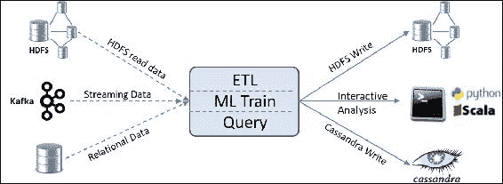
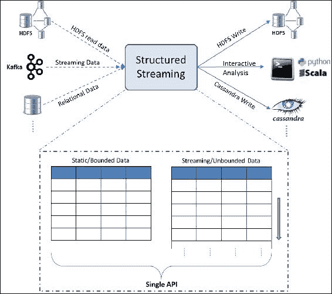
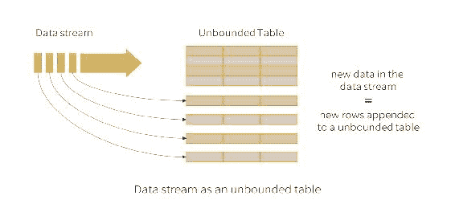
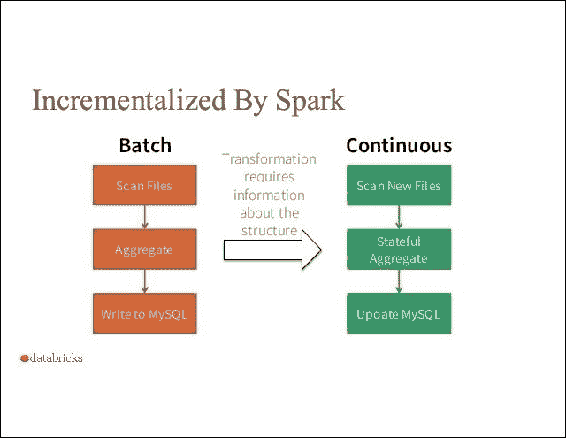
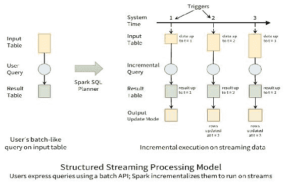
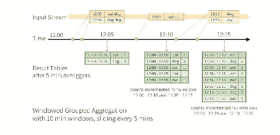
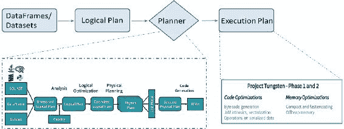
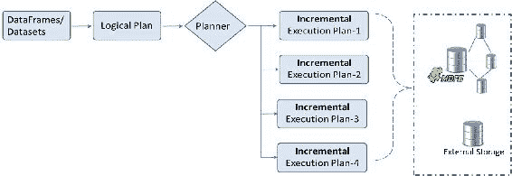
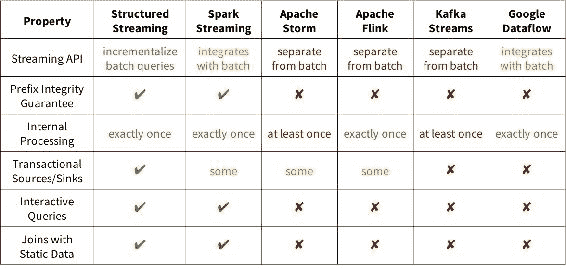
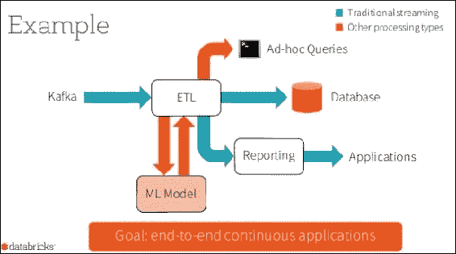

# 第四章：统一数据访问

来自不同数据源的数据集成一直是一个艰巨的任务。大数据的三大特征（量、速度、种类）和不断缩短的处理时间框架使得这一任务更加具有挑战性。以接近实时的方式提供清晰且精心整理的数据视图对于企业至关重要。然而，实时整理的数据以及以统一方式执行不同操作（如 ETL、临时查询和机器学习）的能力，正在成为企业的关键差异化因素。

Apache Spark 的创建旨在提供一个通用引擎，能够处理来自各种数据源的数据，并支持大规模的数据处理，适用于各种不同的操作。Spark 使得开发人员能够将 SQL、流处理、图计算和机器学习算法结合到一个工作流中！

在前几章中，我们讨论了**弹性分布式数据集**（**RDD**）以及数据框（DataFrames）。在第三章，*数据框简介*中，我们介绍了 Spark SQL 和 Catalyst 优化器。本章在此基础上进行扩展，深入探讨这些主题，帮助你理解统一数据访问的真正本质。我们将介绍新概念，如数据集（Datasets）和结构化流处理（Structured Streaming）。具体来说，我们将讨论以下内容：

+   Apache Spark 中的数据抽象

+   数据集

    +   使用数据集

    +   数据集 API 限制

+   Spark SQL

    +   SQL 操作

    +   底层实现

+   结构化流处理

    +   Spark 流处理编程模型

    +   底层实现

    +   与其他流处理引擎的比较

+   持续应用

+   总结

# Apache Spark 中的数据抽象

MapReduce 框架及其流行的开源实现 Hadoop 在过去十年中得到了广泛的应用。然而，迭代算法和交互式临时查询并不被很好地支持。在算法中的作业或阶段之间，任何数据共享总是通过磁盘读写实现，而不是内存数据共享。因此，逻辑上的下一步应该是拥有一种机制，能够在多个作业之间复用中间结果。RDD 是一种通用数据抽象，旨在解决这一需求。

RDD 是 Apache Spark 中的核心抽象。它是一个不可变的、容错的、分布式的静态类型对象集合，通常存储在内存中。RDD API 提供了简单的操作，如 map、reduce 和 filter，这些操作可以按任意方式组合。

DataFrame 抽象是在 RDD 之上构建的，并增加了“命名”列。因此，Spark DataFrame 具有类似于关系型数据库表格和 R、Python（pandas）中的 DataFrame 的命名列行。这种熟悉的高级抽象大大简化了开发工作，因为它让你可以像对待 SQL 表或 Excel 文件一样处理数据。此外，Catalyst 优化器在背后会编译操作并生成 JVM 字节码，以实现高效执行。然而，命名列的方法带来了一个新问题。静态类型信息不再对编译器可用，因此我们失去了编译时类型安全的优势。

Dataset API 的引入结合了 RDD 和 DataFrame 的优点，并增加了一些独特的功能。Datasets 提供了类似于 DataFrame 的行列数据抽象，但在其之上定义了结构。这个结构可以通过 Scala 中的 case class 或 Java 中的类来定义。它们提供了类型安全和类似 RDD 的 Lambda 函数。因此，它们支持类型化方法，如`map`和`groupByKey`，也支持非类型化方法，如`select`和`groupBy`。除了 Catalyst 优化器外，Datasets 还利用了 Tungsten 执行引擎提供的内存编码，这进一步提升了性能。

到目前为止，介绍的数据抽象构成了核心抽象。在这些抽象之上，还有一些更为专门化的数据抽象。Streaming API 被引入用于处理来自 Flume 和 Kafka 等各种来源的实时流数据。这些 API 协同工作，为数据工程师提供了一个统一的、连续的 DataFrame 抽象，可以用于交互式和批量查询。另一种专门化的数据抽象是 GraphFrame，它使开发者能够分析社交网络和其他图形数据，同时处理类似 Excel 的二维数据。

现在，了解了可用数据抽象的基本概念后，让我们来理解“统一数据访问平台”到底意味着什么：



这个统一平台的目的是不仅可以将静态数据和流式数据结合在一起，还可以以统一的方式对数据进行各种不同类型的操作！从开发者的角度来看，Dataset 是核心抽象，Spark SQL 是与 Spark 功能交互的主要接口。结合 SQL 声明式编程接口的二维数据结构已成为处理数据的常见方式，从而缩短了数据工程师的学习曲线。因此，理解统一平台就意味着理解 Datasets 和 Spark SQL。

# Datasets

Apache Spark **数据集**是 DataFrame API 的扩展，提供了一种类型安全的面向对象编程接口。这个 API 最早在 1.6 版本中引入。Spark 2.0 版本实现了 DataFrame 和 Dataset API 的统一。DataFrame 变成了一个通用的、无类型的数据集；或者说，数据集是一个添加了结构的 DataFrame。这里的“结构”一词指的是底层数据的模式或组织，类似于关系型数据库中的表模式。结构对底层数据中可以表达或包含的内容施加了限制。这反过来能够在内存组织和物理执行上实现更好的优化。编译时的类型检查可以比运行时更早地捕获错误。例如，SQL 比较中的类型不匹配直到运行时才会被发现，而如果它是作为数据集操作序列表达的，则会在编译时被捕获。然而，Python 和 R 的固有动态特性意味着这些语言没有编译时类型安全，因此数据集的概念不适用于这些语言。数据集和 DataFrame 的统一仅适用于 Scala 和 Java API。

数据集抽象的核心是 **编码器**。这些编码器用于在 JVM 对象和 Spark 内部的 Tungsten 二进制格式之间进行转换。此内部表示绕过了 JVM 的内存管理和垃圾回收。Spark 有自己专门为其支持的工作流编写的 C 风格内存访问方式。最终的内部表示占用更少的内存，并且具有高效的内存管理。紧凑的内存表示在 Shuffle 操作中减少了网络负载。编码器生成的紧凑字节码直接在序列化对象上操作，而无需反序列化，从而提高了性能。提前了解模式能够在缓存数据集时实现更优化的内存布局。

## 使用数据集

在本节中，我们将创建数据集，并执行转换和操作，类似于 DataFrame 和 RDD。

示例 1 - 从简单集合创建数据集：

**Scala：**

```py
//Create a Dataset from a simple collection 
scala> val ds1 = List.range(1,5).toDS() 
ds1: org.apache.spark.sql.Dataset[Int] = [value: int] 
//Perform an action 
scala> ds1.collect() 
res3: Array[Int] = Array(1, 2, 3, 4) 

//Create from an RDD 
scala> val colors = List("red","orange","blue","green","yellow") 
scala> val color_ds = sc.parallelize(colors).map(x => 
     (x,x.length)).toDS() 
//Add a case class 
case class Color(var color: String, var len: Int) 
val color_ds = sc.parallelize(colors).map(x => 
     Color(x,x.length)).toDS() 

```

如前面代码中的最后一个示例所示，`case class` 添加了结构信息。Spark 使用此结构来创建最佳的数据布局和编码。以下代码展示了我们要查看的结构和执行计划：

**Scala：**

```py
//Examine the structure 
scala> color_ds.dtypes 
res26: Array[(String, String)] = Array((color,StringType), (len,IntegerType)) 
scala> color_ds.schema 
res25: org.apache.spark.sql.types.StructType = StructType(StructField(color,StringType,true), 
StructField(len,IntegerType,false)) 
//Examine the execution plan 
scala> color_ds.explain() 
== Physical Plan == 
Scan ExistingRDD[color#57,len#58] 

```

上面的示例展示了预期的结构和物理执行计划。如果你想查看更详细的执行计划，必须传入 explain（true），这会打印扩展信息，包括逻辑计划。

我们已经检查了如何从简单集合和 RDD 创建数据集。我们已经讨论过，DataFrame 只是无类型的数据集。以下示例展示了数据集和 DataFrame 之间的转换。

示例 2 - 将数据集转换为 DataFrame

**Scala：**

```py
//Convert the dataset to a DataFrame 
scala> val color_df = color_ds.toDF() 
color_df: org.apache.spark.sql.DataFrame = [color: string, len: int] 

scala> color_df.show() 
+------+---+ 
| color|len| 
+------+---+ 
|   red|  3| 
|orange|  6| 
|  blue|  4| 
| green|  5| 
|yellow|  6| 
+------+---+ 

```

这个示例与我们在第三章，*数据框介绍*中看到的示例非常相似。这些转换在现实世界中非常实用。考虑为不完美的数据添加一个结构（也叫案例类）。您可以先将这些数据读取到 DataFrame 中，进行清洗，然后转换成 Dataset。另一个应用场景是，您可能希望根据某些运行时信息（如 `user_id`）仅暴露数据的子集（行和列）。您可以将数据读取到 DataFrame 中，将其注册为临时表，应用条件，然后将子集暴露为 Dataset。以下示例首先创建一个 `DataFrame`，然后将其转换为 `Dataset`。请注意，DataFrame 的列名必须与案例类匹配。

示例 3 - 将 DataFrame 转换为 Dataset

```py
//Construct a DataFrame first 
scala> val color_df = sc.parallelize(colors).map(x => 
           (x,x.length)).toDF("color","len") 
color_df: org.apache.spark.sql.DataFrame = [color: string, len: int] 
//Convert the DataFrame to a Dataset with a given structure 
scala> val ds_from_df = color_df.as[Color] 
ds_from_df: org.apache.spark.sql.Dataset[Color] = [color: string, len: int] 
//Check the execution plan 
scala> ds_from_df.explain 
== Physical Plan == 
WholeStageCodegen 
:  +- Project [_1#102 AS color#105,_2#103 AS len#106] 
:     +- INPUT 
+- Scan ExistingRDD[_1#102,_2#103] 

```

`explain` 命令的响应显示 `WholeStageCodegen`，它将多个操作融合成一个 Java 函数调用。由于减少了多个虚拟函数调用，这增强了性能。代码生成自 Spark 1.1 以来就存在，但当时仅限于表达式评估和少量操作，如过滤。而与此不同，Tungsten 的整个阶段代码生成会为整个查询计划生成代码。

### 从 JSON 创建 Datasets

数据集可以通过 JSON 文件创建，类似于 DataFrame。请注意，一个 JSON 文件可以包含多个记录，但每条记录必须在一行内。如果源 JSON 文件中有换行符，您需要通过编程手段去除它们。JSON 记录可能包含数组，并且可能是嵌套的。它们不需要具有统一的模式。以下示例文件包含 JSON 记录，其中一条记录具有额外的标签和数据数组。

示例 4 - 从 JSON 创建 Dataset

**Scala:**

```py
//Set filepath 
scala> val file_path = <Your path> 
file_path: String = ./authors.json 
//Create case class to match schema 
scala> case class Auth(first_name: String, last_name: String,books: Array[String]) 
defined class Auth 

//Create dataset from json using case class 
//Note that the json document should have one record per line 
scala> val auth = spark.read.json(file_path).as[Auth] 
auth: org.apache.spark.sql.Dataset[Auth] = [books: array<string>, firstName: string ... 1 more field] 

//Look at the data 
scala> auth.show() 
+--------------------+----------+---------+ 
|               books|first_name|last_name| 
+--------------------+----------+---------+ 
|                null|      Mark|    Twain| 
|                null|   Charles|  Dickens| 
|[Jude the Obscure...|    Thomas|    Hardy| 
+--------------------+----------+---------+ 

//Try explode to see array contents on separate lines 

scala> auth.select(explode($"books") as "book", 
            $"first_name",$"last_name").show(2,false) 
+------------------------+----------+---------+ 
|book                    |first_name|last_name| 
+------------------------+----------+---------+ 
|Jude the Obscure        |Thomas    |Hardy    | 
|The Return of the Native|Thomas    |Hardy    | 
+------------------------+----------+---------+ 

```

## Datasets API 的限制

即使 Datasets API 已经结合了 RDD 和 DataFrame 的优势，但它仍然存在一些局限性，特别是在当前的开发阶段：

+   在查询数据集时，选定的字段应赋予与案例类相同的特定数据类型，否则输出将变成 DataFrame。例如，`auth.select(col("first_name").as[String])`。

+   Python 和 R 本质上是动态的，因此类型化的 Datasets 并不适用。

# Spark SQL

**Spark SQL** 是 Spark 1.0 引入的一个用于结构化数据处理的 Spark 模块。这个模块是一个紧密集成的关系引擎，与核心 Spark API 协同工作。它使得数据工程师可以编写应用程序，从不同的来源加载结构化数据并将它们连接成统一的，可能是连续的，类似 Excel 的数据框；然后他们可以实施复杂的 ETL 工作流和高级分析。

Spark 2.0 版本带来了 API 的重要统一，并扩展了 SQL 功能，包括支持子查询。现在，数据集 API 和数据框架 API 已经统一，数据框架是数据集的一种“形式”。这些统一的 API 为 Spark 的未来奠定了基础，涵盖了所有库。开发者可以为他们的数据施加“结构”，并可以使用高级声明式 API，从而提高性能和生产力。性能的提升来源于底层的优化层。数据框架、数据集和 SQL 共享相同的优化和执行管道。

## SQL 操作

SQL 操作是最广泛使用的数据处理构造。常见的操作包括选择所有或部分列、根据一个或多个条件进行过滤、排序和分组操作，以及计算诸如`average`等汇总函数在分组数据上的应用。`JOIN`操作用于多个数据源之间的操作，`set`操作如`union`、`intersect`和`minus`也是常见的操作。此外，数据框架作为临时表注册，并通过传统的 SQL 语句执行上述操作。**用户定义函数**（**UDF**）可以在注册与未注册的情况下定义和使用。我们将重点关注窗口操作，这些操作在 Spark 2.0 中刚刚引入，主要用于滑动窗口操作。例如，如果你想报告过去七天内每天的平均峰值温度，那么你就是在一个滑动的七天窗口上操作，直到今天为止。以下是一个示例，计算过去三个月的每月平均销售额。数据文件包含 24 个观测值，显示了 P1 和 P2 两个产品的每月销售数据。

示例 5-窗口示例与移动平均计算

**Scala：**

```py
scala> import org.apache.spark.sql.expressions.Window 
import org.apache.spark.sql.expressions.Window 
//Create a DataFrame containing monthly sales data for two products 
scala> val monthlySales = spark.read.options(Map({"header"->"true"},{"inferSchema" -> "true"})). 
                            csv("<Your Path>/MonthlySales.csv") 
monthlySales: org.apache.spark.sql.DataFrame = [Product: string, Month: int ... 1 more field] 

//Prepare WindowSpec to create a 3 month sliding window for a product 
//Negative subscript denotes rows above current row 
scala> val w = Window.partitionBy(monthlySales("Product")).orderBy(monthlySales("Month")).rangeBetween(-2,0) 
w: org.apache.spark.sql.expressions.WindowSpec = org.apache.spark.sql.expressions.WindowSpec@3cc2f15 

//Define compute on the sliding window, a moving average in this case 
scala> val f = avg(monthlySales("Sales")).over(w) 
f: org.apache.spark.sql.Column = avg(Sales) OVER (PARTITION BY Product ORDER BY Month ASC RANGE BETWEEN 2 PRECEDING AND CURRENT ROW) 
//Apply the sliding window and compute. Examine the results 
scala> monthlySales.select($"Product",$"Sales",$"Month", bround(f,2).alias("MovingAvg")). 
                    orderBy($"Product",$"Month").show(6) 
+-------+-----+-----+---------+                                                  
|Product|Sales|Month|MovingAvg| 
+-------+-----+-----+---------+ 
|     P1|   66|    1|     66.0| 
|     P1|   24|    2|     45.0| 
|     P1|   54|    3|     48.0| 
|     P1|    0|    4|     26.0| 
|     P1|   56|    5|    36.67| 
|     P1|   34|    6|     30.0| 
+-------+-----+-----+---------+ 

```

**Python：**

```py
    >>> from pyspark.sql import Window
    >>> import pyspark.sql.functions as func
    //Create a DataFrame containing monthly sales data for two products
    >> file_path = <Your path>/MonthlySales.csv"
    >>> monthlySales = spark.read.csv(file_path,header=True, inferSchema=True)

    //Prepare WindowSpec to create a 3 month sliding window for a product
    //Negative subscript denotes rows above current row
    >>> w = Window.partitionBy(monthlySales["Product"]).orderBy(monthlySales["Month"]).rangeBetween(-2,0)
    >>> w
    <pyspark.sql.window.WindowSpec object at 0x7fdc33774a50>
    >>>
    //Define compute on the sliding window, a moving average in this case
    >>> f = func.avg(monthlySales["Sales"]).over(w)
    >>> f
    Column<avg(Sales) OVER (PARTITION BY Product ORDER BY Month ASC RANGE BETWEEN 2 PRECEDING AND CURRENT ROW)>
    >>>
    //Apply the sliding window and compute. Examine the results
    >>> monthlySales.select(monthlySales.Product,monthlySales.Sales,monthlySales.Month,
                          func.bround(f,2).alias("MovingAvg")).orderBy(
                          monthlySales.Product,monthlySales.Month).show(6)
    +-------+-----+-----+---------+                                                 
    |Product|Sales|Month|MovingAvg|
    +-------+-----+-----+---------+
    |     P1|   66|    1|     66.0|
    |     P1|   24|    2|     45.0|
    |     P1|   54|    3|     48.0|
    |     P1|    0|    4|     26.0|
    |     P1|   56|    5|    36.67|
    |     P1|   34|    6|     30.0|
    +-------+-----+-----+---------+

```

## 底层原理

当开发者使用 RDD API 编写程序时，工作负载的高效执行是开发者的责任。Spark 并不提供数据类型和计算的支持。而当开发者使用数据框架和 Spark SQL 时，底层引擎已经了解模式和操作信息。在这种情况下，开发者可以写更少的代码，同时优化器负责处理所有复杂工作。

Catalyst 优化器包含用于表示树并应用规则进行转换的库。这些树的转换应用于创建最优化的逻辑和物理执行计划。在最终阶段，它使用 Scala 语言的特殊特性 **quasiquotes** 生成 Java 字节码。优化器还允许外部开发者通过添加特定于数据源的规则来扩展优化器，这些规则会将操作推送到外部系统，或者支持新的数据类型。

Catalyst 优化器会生成最优化的计划来执行当前操作。实际执行和相关改进由 Tungsten 引擎提供。Tungsten 的目标是提高 Spark 后端执行的内存和 CPU 效率。以下是该引擎的一些显著特点：

+   通过绕过（堆外）Java 内存管理来减少内存占用并消除垃圾回收的开销。

+   代码生成跨多个操作符融合，并避免了过多的虚拟函数调用。生成的代码看起来像手动优化过的代码。

+   内存布局采用列式存储的内存中 Parquet 格式，因为这能够支持矢量化处理，且更贴近常见的数据访问操作。

+   使用编码器进行内存中的编码。编码器通过运行时代码生成构建自定义字节码，实现更快速且紧凑的序列化与反序列化。许多操作可以在内存中就地执行，无需反序列化，因为它们已经是 Tungsten 二进制格式。

# 结构化流处理

流处理是一个看似广泛的话题！如果深入观察实际问题，企业不仅希望有一个流处理引擎来实时做出决策。一直以来，都有需求将批处理和流处理栈结合，并与外部存储系统和应用程序集成。此外，解决方案应能适应业务逻辑的动态变化，以应对新的和不断变化的业务需求。

Apache Spark 2.0 引入了首个高层次的流处理 API，称为 **结构化流处理（Structured Streaming）** 引擎。这个可扩展且容错的引擎依赖于 Spark SQL API，简化了实时、连续大数据应用的开发。这可能是统一批处理和流处理计算的首次成功尝试。

从技术角度讲，结构化流处理依赖于 Spark SQL API，该 API 扩展了我们之前讨论的 DataFrames/Datasets。Spark 2.0 让你以统一的方式执行完全不同的活动，例如：

+   构建机器学习模型并将其应用于流式数据

+   将流式数据与其他静态数据结合

+   执行临时查询、交互式查询和批处理查询

+   运行时改变查询

+   聚合数据流并通过 Spark SQL JDBC 提供服务

与其他流处理引擎不同，Spark 允许你将实时 **流式数据（Streaming Data）** 与 **静态数据（Static data）** 结合，并执行前述操作。



从本质上讲，结构化流处理（Structured Streaming）得益于 Spark SQL 的 Catalyst 优化器。因此，它让开发者无需担心底层的查询优化问题，能够更高效地处理静态或实时数据流。

截至本文撰写时，Spark 2.0 的结构化流处理专注于 ETL，后续版本将引入更多操作符和库。

让我们看一个简单的例子。以下示例在本地机器上监听 Linux 上的 **系统活动报告** (**sar**) 并计算平均空闲内存。系统活动报告提供系统活动统计信息，当前示例收集内存使用情况，每隔 2 秒报告 20 次。Spark 流读取这个流式输出并计算平均内存。我们使用一个方便的网络工具 **netcat** (**nc**) 将 `sar` 输出重定向到指定的端口。选项 `l` 和 `k` 指定 `nc` 应该监听传入连接，并且即使当前连接完成后，它也必须继续监听另一个连接。

**Scala:**

示例 6 - 流式示例

```py
//Run the following command from one terminal window 
sar -r 2 20 | nc -lk 9999 

//In spark-shell window, do the following 
//Read stream 
scala> val myStream = spark.readStream.format("socket"). 
                       option("host","localhost"). 
                       option("port",9999).load() 
myStream: org.apache.spark.sql.DataFrame = [value: string] 

//Filter out unwanted lines and then extract free memory part as a float 
//Drop missing values, if any 
scala> val myDF = myStream.filter($"value".contains("IST")). 
               select(substring($"value",15,9).cast("float").as("memFree")). 
               na.drop().select($"memFree") 
myDF: org.apache.spark.sql.DataFrame = [memFree: float] 

//Define an aggregate function 
scala> val avgMemFree = myDF.select(avg("memFree")) 
avgMemFree: org.apache.spark.sql.DataFrame = [avg(memFree): double] 

//Create StreamingQuery handle that writes on to the console 
scala> val query = avgMemFree.writeStream. 
          outputMode("complete"). 
          format("console"). 
          start() 
query: org.apache.spark.sql.streaming.StreamingQuery = Streaming Query - query-0 [state = ACTIVE] 

Batch: 0 
------------------------------------------- 
+-----------------+ 
|     avg(memFree)| 
+-----------------+ 
|4116531.380952381| 
+-----------------+ 
.... 

```

**Python:**

```py
    //Run the following command from one terminal window
     sar -r 2 20 | nc -lk 9999

    //In another window, open pyspark shell and do the following
    >>> import pyspark.sql.functions as func
    //Read stream
    >>> myStream = spark.readStream.format("socket"). \
                           option("host","localhost"). \
                           option("port",9999).load()
    myStream: org.apache.spark.sql.DataFrame = [value: string]

    //Filter out unwanted lines and then extract free memory part as a float
    //Drop missing values, if any
    >>> myDF = myStream.filter("value rlike 'IST'"). \
               select(func.substring("value",15,9).cast("float"). \
               alias("memFree")).na.drop().select("memFree")

    //Define an aggregate function
    >>> avgMemFree = myDF.select(func.avg("memFree"))

    //Create StreamingQuery handle that writes on to the console
    >>> query = avgMemFree.writeStream. \
              outputMode("complete"). \
              format("console"). \
              start()
    Batch: 0
    -------------------------------------------
    +------------+
    |avg(memFree)|
    +------------+
    |   4042749.2|
    +------------+
    .....

```

前面的示例定义了一个连续数据框（也称为流），用于监听特定端口，执行一些转换和聚合操作，并显示连续输出。

## Spark 流式编程模型

正如本章前面所展示的，只有一个 API 可以同时处理静态数据和流式数据。其思想是将实时数据流视为一个不断追加的表，如下图所示：



因此，无论是静态数据还是流式数据，你都可以像对待静态数据表一样启动批处理查询，Spark 会将其作为增量查询在无界输入表上执行，如下图所示：



因此，开发人员以相同的方式在输入表上定义查询，适用于静态有界表和动态无界表。为了理解它是如何工作的，我们来了解一下这个过程中的各种技术术语：

+   **输入：** 作为追加式表格的数据源

+   **触发器：** 何时检查输入数据以获取新数据

+   **查询：** 对数据执行的操作，如过滤、分组等

+   **结果：** 每次触发间隔后的结果表

+   **输出：** 每次触发后，选择要写入数据接收器的结果部分

现在让我们看看 Spark SQL 计划器是如何处理整个过程的：



特别感谢：Databricks

前面的截图在官方 Apache Spark 网站的结构化编程指南中有非常简单的解释，如 *参考文献* 部分所示。



在这一点上，我们需要了解支持的输出模型。每次结果表更新时，必须将更改写入外部系统，如 HDFS、S3 或其他数据库。我们通常更倾向于增量写入输出。为此，结构化流提供了三种输出模式：

+   **追加模式：** 在外部存储中，只有自上次触发以来追加到结果表的新行会被写入。此模式仅适用于查询中结果表中的现有行不能更改的情况（例如，对输入流的映射）。

+   **完整模式：** 在外部存储中，整个更新后的结果表将被完整写入。

+   **更新模式：** 在外部存储中，只有自上次触发以来更新过的行会被更改。此模式适用于可以就地更新的输出接收器，例如 MySQL 表。

在我们的示例中，我们使用了完整模式，这直接将结果写入控制台。你可能希望将数据写入某些外部文件（例如 Parquet），以便更好地理解。

## 幕后机制

如果你查看在 **DataFrames/Datasets** 上执行操作的“幕后”执行机制，它将呈现如下图所示：



请注意，**Planner** 已知如何将流处理的**逻辑计划**转换为一系列连续的**增量执行计划**。这可以通过以下图示表示：



**Planner** 可以轮询数据源中的新数据，以便能够以优化的方式规划执行。

## 与其他流处理引擎的比较

我们已经讨论了结构化流处理的许多独特功能。现在让我们与其他流处理引擎做一个比较：



由此提供：Databricks

# 连续应用程序

我们讨论了 Spark 如何使统一数据访问成为可能。它让你可以以多种方式处理数据，构建端到端的连续应用程序，通过启用各种分析工作负载，如 ETL 处理、临时查询、在线机器学习建模，或生成必要的报告……这一切都通过高层次的类似 SQL 的 API 实现统一方式，让你同时处理静态和流式数据。通过这种方式，结构化流处理大大简化了实时连续应用程序的开发和维护。



由此提供：Databricks

# 总结

在本章中，我们讨论了统一数据访问的真正含义以及 Spark 如何实现这一目标。我们详细介绍了 Datasets API 以及如何通过它支持实时流处理。我们学习了 Datasets 的优点，也了解了它们的局限性。我们还研究了连续应用程序背后的基本原理。

在下一章中，我们将探讨如何利用 Spark 平台进行大规模数据分析操作。

# 参考资料

+   [`people.csail.mit.edu/matei/papers/2015/sigmod_spark_sql.pdf`](http://people.csail.mit.edu/matei/papers/2015/sigmod_spark_sql.pdf) : Spark SQL：Spark 中的关系数据处理

+   [`databricks.com/blog/2016/07/14/a-tale-of-three-apache-spark-apis-rdds-dataframes-and-datasets.html`](https://databricks.com/blog/2016/07/14/a-tale-of-three-apache-spark-apis-rdds-dataframes-and-datasets.html) : 三种 Apache Spark API 的故事：RDDs、DataFrames 和 Datasets - 何时以及为何使用它们

+   [`databricks.com/blog/2016/01/04/introducing-apache-spark-datasets.html`](https://databricks.com/blog/2016/01/04/introducing-apache-spark-datasets.html) : 介绍 Apache Spark Datasets

+   [`databricks.com/blog/2015/04/13/deep-dive-into-spark-sqls-catalyst-optimizer.html`](https://databricks.com/blog/2015/04/13/deep-dive-into-spark-sqls-catalyst-optimizer.html) : 深入探讨 Spark SQL 的 Catalyst 优化器

+   [`databricks.com/blog/2016/05/23/apache-spark-as-a-compiler-joining-a-billion-rows-per-second-on-a-laptop.html`](https://databricks.com/blog/2016/05/23/apache-spark-as-a-compiler-joining-a-billion-rows-per-second-on-a-laptop.html) : Apache Spark 作为编译器：在笔记本电脑上每秒连接十亿行

+   [`databricks.com/blog/2015/04/28/project-tungsten-bringing-spark-closer-to-bare-metal.html`](https://databricks.com/blog/2015/04/28/project-tungsten-bringing-spark-closer-to-bare-metal.html) : 将 Spark 接近裸机的项目钨

+   [`databricks.com/blog/2016/07/28/structured-streaming-in-apache-spark.html`](https://databricks.com/blog/2016/07/28/structured-streaming-in-apache-spark.html) : Apache Spark 中的结构化流处理 API 详解

+   [`spark.apache.org/docs/latest/structured-streaming-programming-guide.html`](https://spark.apache.org/docs/latest/structured-streaming-programming-guide.html) : Spark 结构化流处理编程指南

+   [`spark-summit.org/east-2016/events/structuring-spark-dataframes-datasets-and-streaming/`](https://spark-summit.org/east-2016/events/structuring-spark-dataframes-datasets-and-streaming/) : Michael Armbrust 主讲的结构化 Apache Spark SQL、DataFrames、Datasets 和流处理

+   [`databricks.com/blog/2016/06/22/apache-spark-key-terms-explained.html`](https://databricks.com/blog/2016/06/22/apache-spark-key-terms-explained.html) : Apache Spark 关键术语解释
