# 第五章：Spark 上的数据分析

数据分析领域的规模化发展前所未有。为数据分析开发了各种库和工具，拥有丰富的算法集。同时，分布式计算技术随着时间的推移也在不断发展，以便在大规模处理庞大数据集。这两个特性必须结合起来，这就是 Spark 开发的主要目的。

前两章概述了数据科学的技术方面，涵盖了 DataFrame API、数据集、流数据的基础知识，以及它如何通过 DataFrame 促进数据表示，这是 R 和 Python 用户熟悉的方式。在介绍了这个 API 后，我们看到操作数据集变得比以往更加简单。我们还看到了 Spark SQL 如何通过其强大的功能和优化技术在后台支持 DataFrame API。在本章中，我们将介绍大数据分析的科学方面，并学习可以在 Spark 上执行的各种数据分析技术。

本章的前提是对 DataFrame API 和统计学基础有基本了解。然而，我们已尽力将内容简化，并详细涵盖了一些重要的基础知识，以便任何人都能在 Spark 上开始进行统计分析。本章将涵盖以下主题：

+   数据分析生命周期

+   数据采集

+   数据准备

    +   数据整合

    +   数据清理

    +   数据转换

+   统计学基础

    +   抽样

    +   数据分布

+   描述性统计

    +   位置度量

    +   离散度量

    +   汇总统计

    +   图形技术

+   推断统计

    +   离散概率分布

    +   连续概率分布

    +   标准误差

    +   置信度水平

    +   错误边际和置信区间

    +   人群中的变异性

    +   样本量估算

    +   假设检验

    +   卡方检验

    +   F 检验

    +   相关性

# 数据分析生命周期

对于大多数现实世界的项目，都有一套定义好的步骤顺序需要遵循。然而，数据分析和数据科学并没有普遍认同的定义或边界。通常，“数据分析”一词涵盖了检查数据、发现有用洞察并传达这些洞察的技术和过程。而“数据科学”一词最好被视为一个跨学科的领域，涉及*统计学*、*计算机科学*和*数学*。这两个术语都涉及对原始数据的处理，以得出知识或洞察，通常是迭代进行的，有些人会交替使用这两个术语。

根据不同的业务需求，解决问题的方式有很多种，但并没有一个适用于所有可能场景的标准流程。一个典型的流程可以概括为：提出问题、探索、假设、验证假设、分析结果，然后重新开始。这一点通过下图中的粗箭头进行了展示。从数据的角度来看，工作流程包括数据获取、预处理、数据探索、建模和结果传达。这些通过图中的圆圈来表示。分析和可视化在每个阶段都会发生，从数据收集到结果传达都贯穿其中。数据分析工作流程涵盖了两个视图中展示的所有活动：

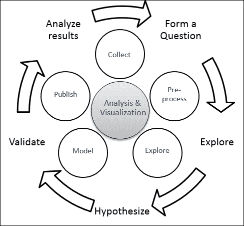

在整个生命周期中，最重要的事情是当前的问题。接下来是可能包含答案（相关数据！）的数据。根据问题的不同，第一项任务是根据需要从一个或多个数据源收集正确的数据。组织通常维护**数据湖**，这是存储原始格式数据的庞大库。

下一步是清洗/转换数据到所需的格式。数据清洗也称为数据处理、数据整理或数据挖掘。这包括在评估手头数据质量时进行缺失值处理和异常值处理等活动。你可能还需要对数据进行汇总/绘制图表，以便更好地理解数据。这个制定最终数据矩阵的过程被认为是最耗时的步骤。这也是一个被低估的部分，通常与特征提取和数据转换等其他活动一起被视为预处理的一部分。

数据科学的核心，训练模型和提取模式，紧接其后，这需要大量使用统计学和机器学习。最后一步是发布结果。

本章剩余部分将深入探讨这些步骤，并讲解如何使用 Spark 实现这些步骤。章节中还包括了一些基础的统计知识，以便让读者更轻松地理解代码片段。

# 数据获取

数据获取，或数据收集，是任何数据科学项目中的第一步。通常，你不会在一个地方找到完整的所需数据，因为数据分布在**业务线**（**LOB**）应用程序和系统中。

本节的大部分内容已经在上一章中讨论过，上一章概述了如何从不同的数据源获取数据并将其存储在 DataFrame 中，以便于分析。Spark 内置了从一些常见数据源获取数据的机制，对于不支持的源，则提供了*数据源 API*。

为了更好地理解数据采集和准备阶段，让我们假设一个场景，并尝试通过示例代码片段来解决所有涉及的步骤。场景假设员工数据分布在本地 RDD、JSON 文件和 SQL 服务器中。那么，让我们看看如何将这些数据导入到 Spark DataFrame 中：

**Python**

```py
// From RDD: Create an RDD and convert to DataFrame
>>> employees = sc.parallelize([(1, "John", 25), (2, "Ray", 35), (3, "Mike", 24), (4, "Jane", 28), (5, "Kevin", 26), (6, "Vincent", 35), (7, "James", 38), (8, "Shane", 32), (9, "Larry", 29), (10, "Kimberly", 29), (11, "Alex", 28), (12, "Garry", 25), (13, "Max", 31)]).toDF(["emp_id","name","age"])
>>>

// From JSON: reading a JSON file
>>> salary = sqlContext.read.json("./salary.json")
>>> designation = sqlContext.read.json("./designation.json")
```

**Scala**

```py
// From RDD: Create an RDD and convert to DataFrame
scala> val employees = sc.parallelize(List((1, "John", 25), (2, "Ray", 35), (3, "Mike", 24), (4, "Jane", 28), (5, "Kevin", 26), (6, "Vincent", 35), (7, "James", 38), (8, "Shane", 32), (9, "Larry", 29), (10, "Kimberly", 29), (11, "Alex", 28), (12, "Garry", 25), (13, "Max", 31))).toDF("emp_id","name","age")
employees: org.apache.spark.sql.DataFrame = [emp_id: int, name: string ... 1 more field]
scala> // From JSON: reading a JSON file
scala> val salary = spark.read.json("./salary.json")
salary: org.apache.spark.sql.DataFrame = [e_id: bigint, salary: bigint]
scala> val designation = spark.read.json("./designation.json")
designation: org.apache.spark.sql.DataFrame = [id: bigint, role: string]
```

# 数据准备

数据质量一直是行业中的一个普遍问题。错误或不一致的数据可能会导致分析结果的误导。如果数据没有按照要求进行清理和准备，实施更好的算法或构建更好的模型也无法取得显著效果。有一个行业术语叫做**数据工程**，它指的是数据的来源和准备工作。这通常由数据科学家完成，在一些组织中，会有专门的团队负责这项工作。然而，在准备数据时，通常需要一种科学的视角来确保正确处理。例如，处理缺失值时，你可能不仅仅采用*均值替代*，而是需要查看数据分布，找到更合适的值进行替代。另一个例子是，你可能不仅仅看箱型图或散点图来查找异常值，因为可能存在多变量异常值，这些异常值在单变量图中可能不可见。有不同的方法，比如**高斯混合模型**（**GMMs**）和**期望最大化**（**EM**）算法，使用**马氏距离**来寻找多变量异常值。

数据准备阶段是一个极为重要的阶段，不仅仅是为了让算法正确工作，还能帮助你更好地理解数据，从而在实施算法时采取正确的处理方法。

一旦从不同的数据源获取到数据，下一步就是将它们整合起来，以便可以对整个数据进行清理、格式化和转换，以适应分析所需的格式。请注意，根据场景的不同，您可能需要从数据源中抽取样本，然后准备数据以进行进一步分析。本章后续将讨论可以使用的各种抽样技术。

## 数据整合

在这一部分，我们将了解如何将来自各种数据源的数据结合起来：

**Python**

```py
// Creating the final data matrix using the join operation
>>> final_data = employees.join(salary, employees.emp_id == salary.e_id).join(designation, employees.emp_id == designation.id).select("emp_id", "name", "age", "role", "salary")
>>> final_data.show(5)
+------+-----+---+---------+------+
|emp_id| name|age|     role|salary|
+------+-----+---+---------+------+
|     1| John| 25|Associate| 10000|
|     2|  Ray| 35|  Manager| 12000|
|     3| Mike| 24|  Manager| 12000|
|     4| Jane| 28|Associate|  null|
|     5|Kevin| 26|  Manager|   120|
+------+-----+---+---------+------+
only showing top 5 rows
```

**Scala**

```py
// Creating the final data matrix using the join operation
scala> val final_data = employees.join(salary, $"emp_id" === $"e_id").join(designation, $"emp_id" === $"id").select("emp_id", "name", "age", "role", "salary")
final_data: org.apache.spark.sql.DataFrame = [emp_id: int, name: string ... 3 more fields]
```

在将来自这些数据源的数据整合后，最终的数据集（在本例中为`final_data`）应具有如下格式（示例数据）：

| **emp_id** | **name** | **age** | **role** | **salary** |
| --- | --- | --- | --- | --- |
| 1 | John | 25 | 助理 | 10,000 $ |
| 2 | Ray | 35 | 经理 | 12,000 $ |
| 3 | Mike | 24 | 经理 | 12,000 $ |
| 4 | Jane | 28 | 助理 | null |
| 5 | Kevin | 26 | 经理 | 12,000 $ |
| 6 | Vincent | 35 | 高级经理 | 22,000 $ |
| 7 | James | 38 | 高级经理 | 20,000 $ |
| 8 | Shane | 32 | 经理 | 12,000 $ |
| 9 | Larry | 29 | 经理 | 10,000 $ |
| 10 | Kimberly | 29 | 助理 | 8,000 $ |
| 11 | Alex | 28 | 经理 | 12,000 $ |
| 12 | Garry | 25 | 经理 | 12,000 $ |
| 13 | Max | 31 | 经理 | 12,000 $ |

## 数据清洗

一旦将数据集中到一个地方，非常重要的一点是，在进行分析之前，要花费足够的时间和精力清洗数据。这是一个迭代过程，因为你必须验证你对数据所做的操作，并持续进行直到对数据质量感到满意。建议你花时间分析数据中发现的异常的原因。

数据中通常存在一定程度的杂质。在任何数据集中都可能存在各种问题，但我们将讨论一些常见的情况，如缺失值、重复值、数据转换或格式化（例如，给数字添加或删除数字，拆分一列成两列，或者将两列合并为一列）。

### 缺失值处理

处理缺失值的方式有很多种。一个方法是删除包含缺失值的行。即使只有某一列有缺失值，我们也可能希望删除这一行，或者对于不同的列采用不同的策略。我们还可以设定一个阈值，只要该行缺失值的总数低于阈值，就保留该行。另一种方法是用常数值替换空值，例如在数值型变量中使用均值替代。

在本节中，我们将提供一些 Scala 和 Python 中的示例，并尝试涵盖各种场景，以帮助你从更广泛的角度理解。

**Python**

```py
// Dropping rows with missing value(s)
>>> clean_data = final_data.na.drop()
>>> 
// Replacing missing value by mean
>>> import math
>>> from pyspark.sql import functions as F
>>> mean_salary = math.floor(salary.select(F.mean('salary')).collect()[0][0])
>>> clean_data = final_data.na.fill({'salary' : mean_salary})
>>> 
//Another example for missing value treatment
>>> authors = [['Thomas','Hardy','June 2, 1840'],
       ['Charles','Dickens','7 February 1812'],
        ['Mark','Twain',None],
        ['Jane','Austen','16 December 1775'],
      ['Emily',None,None]]
>>> df1 = sc.parallelize(authors).toDF(
       ["FirstName","LastName","Dob"])
>>> df1.show()
+---------+--------+----------------+
|FirstName|LastName|             Dob|
+---------+--------+----------------+
|   Thomas|   Hardy|    June 2, 1840|
|  Charles| Dickens| 7 February 1812|
|     Mark|   Twain|            null|
|     Jane|  Austen|16 December 1775|
|    Emily|    null|            null|
+---------+--------+----------------+

// Drop rows with missing values
>>> df1.na.drop().show()
+---------+--------+----------------+
|FirstName|LastName|             Dob|
+---------+--------+----------------+
|   Thomas|   Hardy|    June 2, 1840|
|  Charles| Dickens| 7 February 1812|
|     Jane|  Austen|16 December 1775|
+---------+--------+----------------+

// Drop rows with at least 2 missing values
>>> df1.na.drop(thresh=2).show()
+---------+--------+----------------+
|FirstName|LastName|             Dob|
+---------+--------+----------------+
|   Thomas|   Hardy|    June 2, 1840|
|  Charles| Dickens| 7 February 1812|
|     Mark|   Twain|            null|
|     Jane|  Austen|16 December 1775|
+---------+--------+----------------+

// Fill all missing values with a given string
>>> df1.na.fill('Unknown').show()
+---------+--------+----------------+
|FirstName|LastName|             Dob|
+---------+--------+----------------+
|   Thomas|   Hardy|    June 2, 1840|
|  Charles| Dickens| 7 February 1812|
|     Mark|   Twain|         Unknown|
|     Jane|  Austen|16 December 1775|
|    Emily| Unknown|         Unknown|
+---------+--------+----------------+

// Fill missing values in each column with a given string
>>> df1.na.fill({'LastName':'--','Dob':'Unknown'}).show()
+---------+--------+----------------+
|FirstName|LastName|             Dob|
+---------+--------+----------------+
|   Thomas|   Hardy|    June 2, 1840|
|  Charles| Dickens| 7 February 1812|
|     Mark|   Twain|         Unknown|
|     Jane|  Austen|16 December 1775|
|    Emily|      --|         Unknown|
+---------+--------+----------------+
```

**Scala**

```py
//Missing value treatment
// Dropping rows with missing value(s)
scala> var clean_data = final_data.na.drop() //Note the var declaration instead of val
clean_data: org.apache.spark.sql.DataFrame = [emp_id: int, name: string ... 3 more fields]
scala>

// Replacing missing value by mean
scal> val mean_salary = final_data.select(floor(avg("salary"))).
            first()(0).toString.toDouble
mean_salary: Double = 20843.0
scal> clean_data = final_data.na.fill(Map("salary" -> mean_salary)) 

//Reassigning clean_data
clean_data: org.apache.spark.sql.DataFrame = [emp_id: int, name: string ... 3 more fields]
scala>

//Another example for missing value treatment
scala> case class Author (FirstName: String, LastName: String, Dob: String)
defined class Author
scala> val authors = Seq(
        Author("Thomas","Hardy","June 2, 1840"),
        Author("Charles","Dickens","7 February 1812"),
        Author("Mark","Twain",null),
        Author("Emily",null,null))
authors: Seq[Author] = List(Author(Thomas,Hardy,June 2, 1840),
   Author(Charles,Dickens,7 February 1812), Author(Mark,Twain,null),
   Author(Emily,null,null))
scala> val ds1 = sc.parallelize(authors).toDS()
ds1: org.apache.spark.sql.Dataset[Author] = [FirstName: string, LastName: string ... 1 more field]
scala> ds1.show()
+---------+--------+---------------+
|FirstName|LastName|            Dob|
+---------+--------+---------------+
|   Thomas|   Hardy|   June 2, 1840|
|  Charles| Dickens|7 February 1812|
|     Mark|   Twain|           null|
|    Emily|    null|           null|
+---------+--------+---------------+
scala>

// Drop rows with missing values
scala> ds1.na.drop().show()
+---------+--------+---------------+
|FirstName|LastName|            Dob|
+---------+--------+---------------+
|   Thomas|   Hardy|   June 2, 1840|
|  Charles| Dickens|7 February 1812|
+---------+--------+---------------+
scala>

//Drop rows with at least 2 missing values
//Note that there is no direct scala function to drop rows with at least n missing values
//However, you can drop rows containing under specified non nulls
//Use that function to achieve the same result
scala> ds1.na.drop(minNonNulls = df1.columns.length - 1).show()
//Fill all missing values with a given string
scala> ds1.na.fill("Unknown").show()
+---------+--------+---------------+
|FirstName|LastName|            Dob|
+---------+--------+---------------+
|   Thomas|   Hardy|   June 2, 1840|
|  Charles| Dickens|7 February 1812|
|     Mark|   Twain|        Unknown|
|    Emily| Unknown|        Unknown|
+---------+--------+---------------+
scala>

//Fill missing values in each column with a given string
scala> ds1.na.fill(Map("LastName"->"--",
                    "Dob"->"Unknown")).show()
+---------+--------+---------------+
|FirstName|LastName|            Dob|
+---------+--------+---------------+
|   Thomas|   Hardy|   June 2, 1840|
|  Charles| Dickens|7 February 1812|
|     Mark|   Twain|        Unknown|
|    Emily|      --|        Unknown|
+---------+--------+---------------+
```

### 异常值处理

了解什么是异常值也很重要，这样才能正确处理它。简单来说，异常值是与其余数据点特征不一致的数据点。例如：如果你有一个学生的年龄数据集，而其中有几个年龄值在 30-40 岁范围内，那么它们可能是异常值。现在让我们看一个不同的例子：如果你有一个数据集，其中某个变量的值只能在两个范围内，如 10-20 岁或 80-90 岁，那么介于这两个范围之间的数据点（例如，40 或 55 岁）也可能是异常值。在这个例子中，40 或 55 既不属于 10-20 岁范围，也不属于 80-90 岁范围，因此它们是异常值。

另外，数据中可以存在单变量异常值，也可以存在多变量异常值。为了简化起见，本书将重点讨论单变量异常值，因为在本书写作时，Spark MLlib 可能没有所有需要的算法。

为了处理异常值，你首先需要判断是否存在异常值。可以通过不同的方式来发现异常值，例如使用汇总统计和绘图技术。你可以使用 Python 的内置库函数，如`matplotlib`，来可视化数据。通过连接到 Spark（例如，通过 Jupyter 笔记本），你可以生成这些可视化，这在命令行中可能是无法实现的。

一旦发现异常值，你可以选择删除包含异常值的行，或者用均值替换异常值，或者根据具体情况做出更相关的处理。让我们来看看均值替代方法：

**Python**

```py
// Identify outliers and replace them with mean
//The following example reuses the clean_data dataset and mean_salary computed in previous examples
>>> mean_salary
20843.0
>>> 
//Compute deviation for each row
>>> devs = final_data.select(((final_data.salary - mean_salary) ** 2).alias("deviation"))

//Compute standard deviation
>>> stddev = math.floor(math.sqrt(devs.groupBy().
          avg("deviation").first()[0]))

//check standard deviation value
>>> round(stddev,2)
30351.0
>>> 
//Replace outliers beyond 2 standard deviations with the mean salary
>>> no_outlier = final_data.select(final_data.emp_id, final_data.name, final_data.age, final_data.salary, final_data.role, F.when(final_data.salary.between(mean_salary-(2*stddev), mean_salary+(2*stddev)), final_data.salary).otherwise(mean_salary).alias("updated_salary"))
>>> 
//Observe modified values
>>> no_outlier.filter(no_outlier.salary != no_outlier.updated_salary).show()
+------+----+---+------+-------+--------------+
|emp_id|name|age|salary|   role|updated_salary|
+------+----+---+------+-------+--------------+
|    13| Max| 31|120000|Manager|       20843.0|
+------+----+---+------+-------+--------------+
>>>

```

**Scala**

```py
// Identify outliers and replace them with mean
//The following example reuses the clean_data dataset and mean_salary computed in previous examples
//Compute deviation for each row
scala> val devs = clean_data.select(((clean_data("salary") - mean_salary) *
        (clean_data("salary") - mean_salary)).alias("deviation"))
devs: org.apache.spark.sql.DataFrame = [deviation: double]

//Compute standard deviation
scala> val stddev = devs.select(sqrt(avg("deviation"))).
            first().getDouble(0)
stddev: Double = 29160.932595617614

//If you want to round the stddev value, use BigDecimal as shown
scala> scala.math.BigDecimal(stddev).setScale(2,
             BigDecimal.RoundingMode.HALF_UP)
res14: scala.math.BigDecimal = 29160.93
scala>

//Replace outliers beyond 2 standard deviations with the mean salary
scala> val outlierfunc = udf((value: Long, mean: Double) => {if (value > mean+(2*stddev)
            || value < mean-(2*stddev)) mean else value})

//Use the UDF to compute updated_salary
//Note the usage of lit() to wrap a literal as a column
scala> val no_outlier = clean_data.withColumn("updated_salary",
            outlierfunc(col("salary"),lit(mean_salary)))

//Observe modified values
scala> no_outlier.filter(no_outlier("salary") =!=  //Not !=
             no_outlier("updated_salary")).show()
+------+----+---+-------+------+--------------+
|emp_id|name|age|   role|salary|updated_salary|
+------+----+---+-------+------+--------------+
|    13| Max| 31|Manager|120000|       20843.0|
+------+----+---+-------+------+--------------+
```

### 处理重复值

处理数据集中重复记录的方式有多种。我们将在以下代码片段中演示这些方法：

**Python**

```py
// Deleting the duplicate rows
>>> authors = [['Thomas','Hardy','June 2,1840'],
    ['Thomas','Hardy','June 2,1840'],
    ['Thomas','H',None],
    ['Jane','Austen','16 December 1775'],
    ['Emily',None,None]]
>>> df1 = sc.parallelize(authors).toDF(
      ["FirstName","LastName","Dob"])
>>> df1.show()
+---------+--------+----------------+
|FirstName|LastName|             Dob|
+---------+--------+----------------+
|   Thomas|   Hardy|    June 2, 1840|
|   Thomas|   Hardy|    June 2, 1840|
|   Thomas|       H|            null|
|     Jane|  Austen|16 December 1775|
|    Emily|    null|            null|
+---------+--------+----------------+

// Drop duplicated rows
>>> df1.dropDuplicates().show()
+---------+--------+----------------+
|FirstName|LastName|             Dob|
+---------+--------+----------------+
|    Emily|    null|            null|
|     Jane|  Austen|16 December 1775|
|   Thomas|       H|            null|
|   Thomas|   Hardy|    June 2, 1840|
+---------+--------+----------------+

// Drop duplicates based on a sub set of columns
>>> df1.dropDuplicates(subset=["FirstName"]).show()
+---------+--------+----------------+
|FirstName|LastName|             Dob|
+---------+--------+----------------+
|    Emily|    null|            null|
|   Thomas|   Hardy|    June 2, 1840|
|     Jane|  Austen|16 December 1775|
+---------+--------+----------------+
>>> 
```

**Scala:**

```py
//Duplicate values treatment
// Reusing the Author case class
// Deleting the duplicate rows
scala> val authors = Seq(
            Author("Thomas","Hardy","June 2,1840"),
            Author("Thomas","Hardy","June 2,1840"),
            Author("Thomas","H",null),
            Author("Jane","Austen","16 December 1775"),
            Author("Emily",null,null))
authors: Seq[Author] = List(Author(Thomas,Hardy,June 2,1840), Author(Thomas,Hardy,June 2,1840), Author(Thomas,H,null), Author(Jane,Austen,16 December 1775), Author(Emily,null,null))
scala> val ds1 = sc.parallelize(authors).toDS()
ds1: org.apache.spark.sql.Dataset[Author] = [FirstName: string, LastName: string ... 1 more field]
scala> ds1.show()
+---------+--------+----------------+
|FirstName|LastName|             Dob|
+---------+--------+----------------+
|   Thomas|   Hardy|     June 2,1840|
|   Thomas|   Hardy|     June 2,1840|
|   Thomas|       H|            null|
|     Jane|  Austen|16 December 1775|
|    Emily|    null|            null|
+---------+--------+----------------+
scala>

// Drop duplicated rows
scala> ds1.dropDuplicates().show()
+---------+--------+----------------+                                          
|FirstName|LastName|             Dob|
+---------+--------+----------------+
|     Jane|  Austen|16 December 1775|
|    Emily|    null|            null|
|   Thomas|   Hardy|     June 2,1840|
|   Thomas|       H|            null|
+---------+--------+----------------+
scala>

// Drop duplicates based on a sub set of columns
scala> ds1.dropDuplicates("FirstName").show()
+---------+--------+----------------+                                           
|FirstName|LastName|             Dob|
+---------+--------+----------------+
|    Emily|    null|            null|
|     Jane|  Austen|16 December 1775|
|   Thomas|   Hardy|     June 2,1840|
+---------+--------+----------------+
```

## 数据转换

数据转换的需求可能有多种，而且每个案例大多是独特的。我们将覆盖以下一些基本的转换类型：

+   将两列合并为一列

+   向现有数据添加字符/数字

+   删除或替换现有字符/数字

+   更改日期格式

**Python**

```py
// Merging columns
//Create a udf to concatenate two column values
>>> import pyspark.sql.functions
>>> concat_func = pyspark.sql.functions.udf(lambda name, age: name + "_" + str(age))

//Apply the udf to create merged column
>>> concat_df = final_data.withColumn("name_age", concat_func(final_data.name, final_data.age))
>>> concat_df.show(4)
+------+----+---+---------+------+--------+
|emp_id|name|age|     role|salary|name_age|
+------+----+---+---------+------+--------+
|     1|John| 25|Associate| 10000| John_25|
|     2| Ray| 35|  Manager| 12000|  Ray_35|
|     3|Mike| 24|  Manager| 12000| Mike_24|
|     4|Jane| 28|Associate|  null| Jane_28|
+------+----+---+---------+------+--------+
only showing top 4 rows
// Adding constant to data
>>> data_new = concat_df.withColumn("age_incremented",concat_df.age + 10)
>>> data_new.show(4)
+------+----+---+---------+------+--------+---------------+
|emp_id|name|age|     role|salary|name_age|age_incremented|
+------+----+---+---------+------+--------+---------------+
|     1|John| 25|Associate| 10000| John_25|             35|
|     2| Ray| 35|  Manager| 12000|  Ray_35|             45|
|     3|Mike| 24|  Manager| 12000| Mike_24|             34|
|     4|Jane| 28|Associate|  null| Jane_28|             38|
+------+----+---+---------+------+--------+---------------+
only showing top 4 rows
>>> 

//Replace values in a column
>>> df1.replace('Emily','Charlotte','FirstName').show()
+---------+--------+----------------+
|FirstName|LastName|             Dob|
+---------+--------+----------------+
|   Thomas|   Hardy|    June 2, 1840|
|  Charles| Dickens| 7 February 1812|
|     Mark|   Twain|            null|
|     Jane|  Austen|16 December 1775|
|Charlotte|    null|            null|
+---------+--------+----------------+

// If the column name argument is omitted in replace, then replacement is applicable to all columns
//Append new columns based on existing values in a column
//Give 'LastName' instead of 'Initial' if you want to overwrite
>>> df1.withColumn('Initial',df1.LastName.substr(1,1)).show()
+---------+--------+----------------+-------+
|FirstName|LastName|             Dob|Initial|
+---------+--------+----------------+-------+
|   Thomas|   Hardy|    June 2, 1840|      H|
|  Charles| Dickens| 7 February 1812|      D|
|     Mark|   Twain|            null|      T|
|     Jane|  Austen|16 December 1775|      A|
|    Emily|    null|            null|   null|
+---------+--------+----------------+-------+
```

**Scala:**

```py
// Merging columns
//Create a udf to concatenate two column values
scala> val concatfunc = udf((name: String, age: Integer) =>
                           {name + "_" + age})
concatfunc: org.apache.spark.sql.expressions.UserDefinedFunction = UserDefinedFunction(<function2>,StringType,Some(List(StringType, IntegerType)))
scala>

//Apply the udf to create merged column
scala> val concat_df = final_data.withColumn("name_age",
                         concatfunc($"name", $"age"))
concat_df: org.apache.spark.sql.DataFrame =
         [emp_id: int, name: string ... 4 more fields]
scala> concat_df.show(4)
+------+----+---+---------+------+--------+
|emp_id|name|age|     role|salary|name_age|
+------+----+---+---------+------+--------+
|     1|John| 25|Associate| 10000| John_25|
|     2| Ray| 35|  Manager| 12000|  Ray_35|
|     3|Mike| 24|  Manager| 12000| Mike_24|
|     4|Jane| 28|Associate|  null| Jane_28|
+------+----+---+---------+------+--------+
only showing top 4 rows
scala>

// Adding constant to data
scala> val addconst = udf((age: Integer) => {age + 10})
addconst: org.apache.spark.sql.expressions.UserDefinedFunction =
      UserDefinedFunction(<function1>,IntegerType,Some(List(IntegerType)))
scala> val data_new = concat_df.withColumn("age_incremented",
                 addconst(col("age")))
data_new: org.apache.spark.sql.DataFrame =
     [emp_id: int, name: string ... 5 more fields]
scala> data_new.show(4)
+------+----+---+---------+------+--------+---------------+
|emp_id|name|age|     role|salary|name_age|age_incremented|
+------+----+---+---------+------+--------+---------------+
|     1|John| 25|Associate| 10000| John_25|             35|
|     2| Ray| 35|  Manager| 12000|  Ray_35|             45|
|     3|Mike| 24|  Manager| 12000| Mike_24|             34|
|     4|Jane| 28|Associate|  null| Jane_28|             38|
+------+----+---+---------+------+--------+---------------+
only showing top 4 rows

// Replace values in a column
//Note: As of Spark 2.0.0, there is no replace on DataFrame/ Dataset does not work so .na. is a work around
scala> ds1.na.replace("FirstName",Map("Emily" -> "Charlotte")).show()
+---------+--------+---------------+
|FirstName|LastName|            Dob|
+---------+--------+---------------+
|   Thomas|   Hardy|   June 2, 1840|
|  Charles| Dickens|7 February 1812|
|     Mark|   Twain|           null|
|Charlotte|    null|           null|
+---------+--------+---------------+
scala>

// If the column name argument is "*" in replace, then replacement is applicable to all columns
//Append new columns based on existing values in a column
//Give "LastName" instead of "Initial" if you want to overwrite
scala> ds1.withColumn("Initial",ds1("LastName").substr(1,1)).show()
+---------+--------+---------------+-------+
|FirstName|LastName|            Dob|Initial|
+---------+--------+---------------+-------+
|   Thomas|   Hardy|   June 2, 1840|      H|
|  Charles| Dickens|7 February 1812|      D|
|     Mark|   Twain|           null|      T|
|    Emily|    null|           null|   null|
+---------+--------+---------------+-------+
```

现在我们已经了解了基本的示例，让我们来处理一个稍微复杂一点的例子。你可能已经注意到，作者数据中的日期列有不同的日期格式。在某些情况下，月份在前，日期在后；而在其他情况下则相反。这种异常在现实世界中很常见，因为数据可能来自不同的来源。在这里，我们看到的情况是日期列中有多个不同的日期格式数据点。我们需要将所有不同的日期格式标准化为一个统一的格式。为此，我们首先需要创建一个**用户定义函数**（**udf**），它可以处理不同的格式并将它们转换为统一的格式。

```py
// Date conversions
//Create udf for date conversion that converts incoming string to YYYY-MM-DD format
// The function assumes month is full month name and year is always 4 digits
// Separator is always a space or comma
// Month, date and year may come in any order
//Reusing authors data
>>> authors = [['Thomas','Hardy','June 2, 1840'],
        ['Charles','Dickens','7 February 1812'],
        ['Mark','Twain',None],
        ['Jane','Austen','16 December 1775'],
        ['Emily',None,None]]
>>> df1 = sc.parallelize(authors).toDF(
      ["FirstName","LastName","Dob"])
>>> 

// Define udf
//Note: You may create this in a script file and execute with execfile(filename.py)
>>> def toDate(s):
 import re
 year = month = day = ""
 if not s:
  return None
 mn = [0,'January','February','March','April','May',
  'June','July','August','September',
  'October','November','December']

 //Split the string and remove empty tokens
 l = [tok for tok in re.split(",| ",s) if tok]

//Assign token to year, month or day
 for a in l:
  if a in mn:
   month = "{:0>2d}".format(mn.index(a))
  elif len(a) == 4:
   year = a
  elif len(a) == 1:
   day = '0' + a
  else:
   day = a
 return year + '-' + month + '-' + day
>>> 

//Register the udf
>>> from pyspark.sql.functions import udf
>>> from pyspark.sql.types import StringType
>>> toDateUDF = udf(toDate, StringType())

//Apply udf
>>> df1.withColumn("Dob",toDateUDF("Dob")).show()
+---------+--------+----------+
|FirstName|LastName|       Dob|
+---------+--------+----------+
|   Thomas|   Hardy|1840-06-02|
|  Charles| Dickens|1812-02-07|
|     Mark|   Twain|      null|
|     Jane|  Austen|1775-12-16|
|    Emily|    null|      null|
+---------+--------+----------+
>>> 
```

**Scala**

```py
//Date conversions
//Create udf for date conversion that converts incoming string to YYYY-MM-DD format
// The function assumes month is full month name and year is always 4 digits
// Separator is always a space or comma
// Month, date and year may come in any order
//Reusing authors case class and data
>>> val authors = Seq(
        Author("Thomas","Hardy","June 2, 1840"),
        Author("Charles","Dickens","7 February 1812"),
        Author("Mark","Twain",null),
        Author("Jane","Austen","16 December 1775"),
        Author("Emily",null,null))
authors: Seq[Author] = List(Author(Thomas,Hardy,June 2, 1840), Author(Charles,Dickens,7 February 1812), Author(Mark,Twain,null), Author(Jane,Austen,16 December 1775), Author(Emily,null,null))
scala> val ds1 = sc.parallelize(authors).toDS()
ds1: org.apache.spark.sql.Dataset[Author] = [FirstName: string, LastName: string ... 1 more field]
scala>

// Define udf
//Note: You can type :paste on REPL to paste  multiline code. CTRL + D signals end of paste mode
def toDateUDF = udf((s: String) => {
    var (year, month, day) = ("","","")
    val mn = List("","January","February","March","April","May",
        "June","July","August","September",
        "October","November","December")
    //Tokenize the date string and remove trailing comma, if any
    if(s != null) {
      for (x <- s.split(" ")) {
        val token = x.stripSuffix(",")
        token match {
        case "" =>
        case x if (mn.contains(token)) =>
            month = "%02d".format(mn.indexOf(token))
        case x if (token.length() == 4) =>
            year = token
        case x =>
            day = token
        }
     }   //End of token processing for
     year + "-" + month + "-" + day=
   } else {
       null
   }
})
toDateUDF: org.apache.spark.sql.expressions.UserDefinedFunction
scala>

//Apply udf and convert date strings to standard form YYYY-MM-DD
scala> ds1.withColumn("Dob",toDateUDF(ds1("Dob"))).show()
+---------+--------+----------+
|FirstName|LastName|       Dob|
+---------+--------+----------+
|   Thomas|   Hardy| 1840-06-2|
|  Charles| Dickens| 1812-02-7|
|     Mark|   Twain|      null|
|     Jane|  Austen|1775-12-16|
|    Emily|    null|      null|
+---------+--------+----------+
```

这会整齐地排列出生日期字符串。当我们遇到更多不同的日期格式时，可以继续调整这个用户定义函数（udf）。

在这一阶段，在开始进行数据分析之前，非常重要的一点是你应该暂停片刻，重新评估从数据采集到数据清理和转换过程中所采取的所有步骤。有很多情况下，涉及大量时间和精力的工作最后失败，因为分析和建模的数据是不正确的。这些情况成了著名计算机谚语的完美例证——**垃圾进，垃圾出**（**GIGO**）。

# 统计学基础

统计学领域主要是通过数学方法将数据集中的原始事实和数字以某种有意义的方式进行总结，使其对你有意义。这包括但不限于：收集数据、分析数据、解释数据和展示数据。

统计学的存在主要是因为通常无法收集整个总体的数据。因此，通过使用统计技术，我们利用样本统计量来估计总体参数，并应对不确定性。

在这一部分，我们将介绍一些基础的统计学和分析技术，在这些基础上，我们将逐步建立对本书中所涵盖概念的全面理解。

统计学的研究可以大致分为两个主要分支：

+   描述性统计

+   推断统计

以下图表展示了这两个术语，并说明了我们如何从样本中估计总体参数：

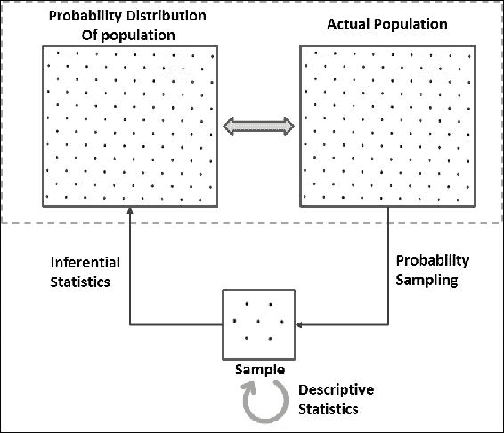

在开始之前，了解抽样和分布是很重要的。

## 抽样

通过抽样技术，我们只需从总体数据集中取出一部分并进行处理：

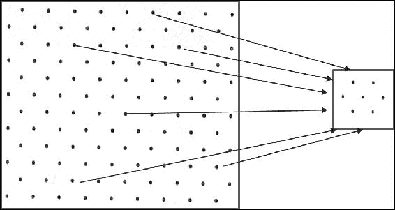

但为什么我们要进行抽样？以下是进行抽样的各种原因：

+   很难获得整个总体的数据；例如，某个国家公民的身高。

+   处理整个数据集是很困难的。当我们谈论大数据计算平台（如 Spark）时，这个挑战几乎消失了。然而，也有可能遇到需要将手头的整个数据视为样本，并将分析结果推断到未来时间或更大总体的情况。

+   难以绘制大量数据以便可视化。技术上可能存在限制。

+   为了验证你的分析或验证预测模型——特别是在处理小数据集时，你需要依赖交叉验证。

为了有效的抽样，有两个重要的约束：一是确定样本大小，二是选择抽样技术。样本大小对总体参数的估计有很大的影响。我们将在本章后面讨论这一方面，首先会介绍一些先决的基础知识。在这一节中，我们将重点讨论抽样技术。

有多种基于概率（每个样本被选择的概率已知）和非概率（每个样本被选择的概率未知）抽样技术可供选择，但我们将仅讨论基于概率的技术。

### 简单随机抽样

**简单随机抽样**（**SRS**）是最基本的概率抽样方法，其中每个元素被选择的概率相同。这意味着每个可能的*n*元素样本都有相等的选择机会。

### 系统抽样

系统抽样可能是所有基于概率的抽样技术中最简单的一种，在这种方法中，总体的每个*第 k*个元素都会被抽取。因此，这也叫做间隔抽样。它从一个随机选择的固定起点开始，然后估算一个间隔（即*第 k*个元素，其中*k = (总体大小)/(样本大小)*）。这里，元素的选择会循环进行，直到达到样本大小，即从开始重新选择直到结束。

### 分层抽样

当种群内的子群体或子群体差异较大时，这种抽样技术是首选，因为其他抽样技术可能无法提取出一个能够良好代表整个种群的样本。通过分层抽样，将种群划分为同质的子群体，称为**层**，并通过按照种群比例从这些层中随机选择样本来进行抽样。因此，样本中的层大小与种群大小的比例保持一致：

**Python**

```py
/* ”Sample” function is defined for DataFrames (not RDDs) which takes three parameters:
withReplacement - Sample with replacement or not (input: True/False)
fraction - Fraction of rows to generate (input: any number between 0 and 1 as per your requirement of sample size)
seed - Seed for sampling (input: Any random seed)
*/
>>> sample1 = data_new.sample(False, 0.6) //With random seed as no seed value specified
>>> sample2 = data_new.sample(False, 0.6, 10000) //With specific seed value of 10000
```

**Scala**:

```py
scala> val sample1 = data_new.sample(false, 0.6) //With random seed as no seed value specified
sample1: org.apache.spark.sql.Dataset[org.apache.spark.sql.Row] = [emp_id: int, name: string ... 5 more fields]
scala> val sample2 = data_new.sample(false, 0.6, 10000) //With specific seed value of 10000
sample2: org.apache.spark.sql.Dataset[org.apache.spark.sql.Row] = [emp_id: int, name: string ... 5 more fields]
```

### 注意

我们只看了 DataFrame 上的抽样；在 MLlib 库中也有如`sampleByKey`和`sampleByKeyExact`等函数，可以在键值对的 RDD 上进行分层抽样。可以查看`spark.util.random`包，了解 Bernoulli、Poisson 或随机抽样器。

## 数据分布

了解数据的分布情况是将数据转化为信息的主要任务之一。分析变量的分布有助于发现异常值、可视化数据的趋势，并且有助于你对数据的理解。这有助于正确思考并采取正确的方式解决业务问题。绘制分布图使得直观性更强，我们将在*描述性统计*部分讨论这一方面。

### 频率分布

频率分布解释了一个变量可以取哪些值，以及它取这些值的频率。通常用一个表格来表示每个可能值及其对应的出现次数。

假设我们掷一颗六面骰子 100 次，并观察到以下频率：

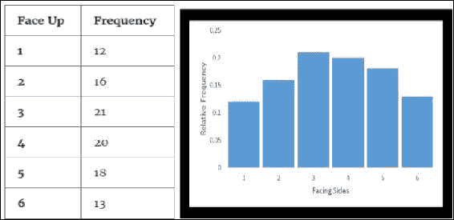

频率表

同样地，你可能会在每一组 100 次掷骰子中观察到不同的分布，因为这将取决于运气。

有时，你可能对出现次数的比例感兴趣，而不仅仅是出现的次数。在前面的掷骰子例子中，我们总共掷了 100 次骰子，因此比例分布或**相对频率分布**将呈现如下：

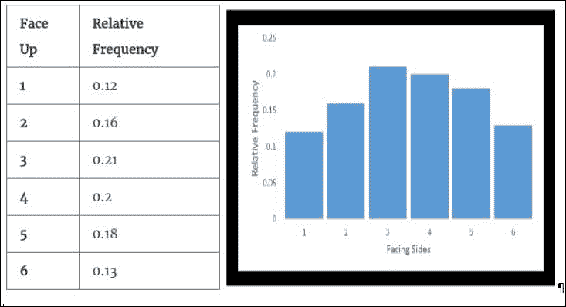

相对频率表

### 概率分布

在同一个掷骰子的例子中，我们知道一个总概率为 1 的值是分布在骰子的所有面上的。这意味着每一面（从 1 到 6）上都与概率 1/6（约为 0.167）相关联。无论你掷骰子的次数是多少（假设是公平的骰子！），1/6 的概率都会均匀地分布在骰子的所有面上。所以，如果你绘制这个分布图，它将呈现如下：

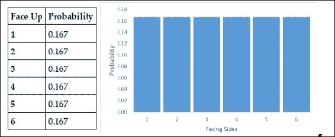

概率分布

我们在这里查看了三种分布——频率分布、相对频率分布和概率分布。

这个概率分布实际上是总体的分布。在实际情况中，有时我们已经知道总体分布（在我们的例子中，它是公平骰子六个面的概率为 0.167），而有时我们不知道。在没有总体分布的情况下，找出总体分布本身就成为推断统计的一部分。而且，与公平骰子的例子不同，所有面上的概率相同，在其他情况下，变量可能的值可以与不同的概率相关联，并且这些值也可以遵循某种特定类型的分布。

现在是揭开秘密的时候了！相对频率分布与概率分布之间的关系是统计推断的基础。相对频率分布也叫做经验分布，它是基于我们在样本中观察到的内容（这里是 100 次的样本）。如前所述，每 100 次掷骰子的经验分布会根据机会而有所不同。现在，掷骰子的次数越多，相对频率分布与概率分布的差异就越小。因此，无限次掷骰子的相对频率分布即为概率分布，而概率分布反过来就是总体分布。

概率分布有多种类型，这些分布根据变量类型（分类变量或连续变量）再次分类。我们将在本章的后续部分详细讨论这些分布。不过，我们应该了解这些分类所代表的含义！分类变量只能取几个类别。例如，及格/不及格、零/一、癌症/恶性是具有两个类别的分类变量的例子。同样，分类变量也可以有更多的类别，比如红/绿/蓝、类型 1/类型 2/类型 3/类型 4，等等。连续变量可以在给定的范围内取任意值，并且是以连续的尺度进行度量的，例如年龄、身高、工资等。理论上，在连续变量的任意两个值之间可以有无限多个可能值。例如，在身高范围 5'6"到 6'4"（英尺和英寸尺度）之间，可能有许多分数值。同样，在厘米尺度下也是如此。

# 描述性统计

在前一节中，我们学习了分布是如何形成的。在本节中，我们将学习如何通过描述性统计来描述这些分布。描述分布的两个重要组成部分是其位置和分布的扩展。

## 位置度量

位置度量是一个描述数据中心位置的单一值。三种最常见的定位度量是均值、中位数和众数。

### 均值

到目前为止，最常见且广泛使用的集中趋势度量是**均值**，也称为平均数。无论是样本还是总体，均值或平均数是所有元素的总和除以元素的总数。

### 中位数

**中位数**是当数据按任意顺序排序时位于中间的数值，使得一半数据大于中位数，另一半小于中位数。当有两个中位数值（数据项数目为偶数）时，中位数是这两个中间值的平均值。中位数是处理数据集中的异常值（极端值）时更好的位置度量。

### 众数

**众数**是出现频率最高的数据项。它可以用于定性数据和定量数据的确定。

**Python**

//重用在重复值处理中创建的 data_new

```py
>>> mean_age = data_new.agg({'age': 'mean'}).first()[0]
>>> age_counts = data_new.groupBy("age").agg({"age": "count"}).alias("freq")
>>> mode_age = age_counts.sort(age_counts["COUNT(age)"].desc(), age_counts.age.asc()).first()[0]
>>> print(mean_age, mode_age)
(29.615384615384617, 25)
>>> age_counts.sort("count(age)",ascending=False).show(2)
+---+----------+                                                               
|age|count(age)|
+---+----------+
| 28|         3|
| 29|         2|
+---+----------+
only showing top 2 rows
```

**Scala**

```py
//Reusing data_new created 
scala> val mean_age = data_new.select(floor(avg("age"))).first().getLong(0)
mean_age: Long = 29
scala> val mode_age = data_new.groupBy($"age").agg(count($"age")).
                 sort($"count(age)".desc, $"age").first().getInt(0)
mode_age: Int = 28
scala> val age_counts = data_new.groupBy("age").agg(count($"age") as "freq")
age_counts: org.apache.spark.sql.DataFrame = [age: int, freq: bigint]
scala> age_counts.sort($"freq".desc).show(2)
+---+----+                                                                     
|age|freq|
+---+----+
| 35|   2|
| 28|   2|
+---+----+
```

## 离散度度量

离散度度量描述了某一特定变量或数据项的数据的集中程度或分散程度。

### 范围

范围是变量最小值和最大值之间的差异。它的一个缺点是没有考虑到数据中的每一个值。

### 方差

为了找出数据集中的变异性，我们可以将每个值与均值相减，平方它们以去除负号（同时放大数值），然后将所有结果相加，并除以总的值个数：

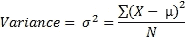

如果数据分布较广，方差会是一个较大的数字。它的一个缺点是对异常值赋予了过多的权重。

### 标准差

与方差类似，标准差也是衡量数据离散程度的指标。方差的一个局限性是数据的单位也被平方，因此很难将方差与数据集中的数值相关联。因此，标准差是通过方差的平方根计算出来的：

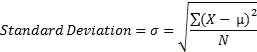

**Python**

```py
//Reusing data_new created before
import math
>>> range_salary = data_new.agg({'salary': 'max'}).first()[0] - data_new.agg({'salary': 'min'}).first()[0]
>>> mean_salary = data_new.agg({'salary': 'mean'}).first()[0]
>>> salary_deviations = data_new.select(((data_new.salary - mean_salary) *
       (data_new.salary - mean_salary)).alias("deviation"))
>>> stddev_salary = math.sqrt(salary_deviations.agg({'deviation' : 
'avg'}).first()[0])
>>> variance_salary = salary_deviations.groupBy().avg("deviation").first()[0]
>>> print(round(range_salary,2), round(mean_salary,2),
      round(variance_salary,2), round(stddev_salary,2))
(119880.0, 20843.33, 921223322.22, 30351.66)
>>> 
```

**Scala**

```py
//Reusing data_new created before
scala> val range_salary = data_new.select(max("salary")).first().
          getLong(0) - data_new.select(min("salary")).first().getLong(0)
range_salary: Long = 119880
scala> val mean_salary = data_new.select(floor(avg("salary"))).first().getLong(0)
mean_salary: Long = 20843
scala> val salary_deviations = data_new.select(((data_new("salary") - mean_salary)
                     * (data_new("salary") - mean_salary)).alias("deviation"))
salary_deviations: org.apache.spark.sql.DataFrame = [deviation: bigint]
scala> val variance_salary = { salary_deviations.select(avg("deviation"))
                                       .first().getDouble(0) }
variance_salary: Double = 9.212233223333334E8
scala> val stddev_salary = { salary_deviations
                    .select(sqrt(avg("deviation")))
                    .first().getDouble(0) }
stddev_salary: Double = 30351.660948510435
```

## 汇总统计

数据集的汇总统计信息是非常有用的信息，可以帮助我们快速了解当前的数据。通过使用统计学中提供的`colStats`函数，我们可以获得`RDD[Vector]`的多变量统计汇总，其中包含按列计算的最大值、最小值、均值、方差、非零值的数量和总计数。让我们通过一些代码示例来探索这个：

**Python**

```py
>>> import numpy
>>> from pyspark.mllib.stat import Statistics
// Create an RDD of number vectors
//This example creates an RDD with 5 rows with 5 elements each
>>> observations = sc.parallelize(numpy.random.random_integers(0,100,(5,5)))
// Compute column summary statistics.
//Note that the results may vary because of random numbers
>>> summary = Statistics.colStats(observations)
>>> print(summary.mean())       // mean value for each column
>>> print(summary.variance())  // column-wise variance
>>> print(summary.numNonzeros())// number of nonzeros in each column
```

**Scala**

```py
scala> import org.apache.spark.mllib.linalg.Vectors
import org.apache.spark.mllib.linalg.Vectors
scala> import org.apache.spark.mllib.stat.{
          MultivariateStatisticalSummary, Statistics}
import org.apache.spark.mllib.stat.{MultivariateStatisticalSummary, Statistics}
// Create an RDD of number vectors
//This example creates an RDD with 5 rows with 5 elements each
scala> val observations = sc.parallelize(Seq.fill(5)(Vectors.dense(Array.fill(5)(
                    scala.util.Random.nextDouble))))
observations: org.apache.spark.rdd.RDD[org.apache.spark.mllib.linalg.Vector] = ParallelCollectionRDD[43] at parallelize at <console>:27
scala>
// Compute column summary statistics.
//Note that the results may vary because of random numbers
scala> val summary = Statistics.colStats(observations)
summary: org.apache.spark.mllib.stat.MultivariateStatisticalSummary = org.apache.spark.mllib.stat.MultivariateOnlineSummarizer@36836161
scala> println(summary.mean)  // mean value for each column
[0.5782406967737089,0.5903954680966121,0.4892908815930067,0.45680701799234835,0.6611492334819364]
scala> println(summary.variance)    // column-wise variance
[0.11893608153330748,0.07673977181967367,0.023169197889513014,0.08882605965192601,0.08360159585590332]
scala> println(summary.numNonzeros) // number of nonzeros in each column
[5.0,5.0,5.0,5.0,5.0]
```

### 提示

Apache Spark MLlib 基于 RDD 的 API 从 Spark 2.0 开始进入维护模式。预计在 2.2+ 中将被弃用，并在 Spark 3.0 中移除。

## 图形化技术

要了解数据点的行为，您可能需要绘制它们并查看。但是，您需要一个平台来将您的数据可视化，例如*箱线图*、*散点图*或*直方图*等。 iPython/Jupyter 笔记本或任何由 Spark 支持的第三方笔记本都可以在浏览器中用于数据可视化。 Databricks 提供他们自己的笔记本。可视化在自己的章节中进行讨论，本章专注于完整的生命周期。但是，Spark 提供了直方图数据准备，使得桶范围和频率可以与客户端机器传输，而不是完整数据集。以下示例显示了相同。

**Python**

```py
//Histogram
>>>from random import randint
>>> numRDD = sc.parallelize([randint(0,9) for x in xrange(1,1001)])
// Generate histogram data for given bucket count
>>> numRDD.histogram(5)
([0.0, 1.8, 3.6, 5.4, 7.2, 9], [202, 213, 215, 188, 182])
//Alternatively, specify ranges
>>> numRDD.histogram([0,3,6,10])
([0, 3, 6, 10], [319, 311, 370])
```

**Scala:**

```py
//Histogram
scala> val numRDD = sc.parallelize(Seq.fill(1000)(
                    scala.util.Random.nextInt(10)))
numRDD: org.apache.spark.rdd.RDD[Int] =
     ParallelCollectionRDD[0] at parallelize at <console>:24
// Generate histogram data for given bucket count
scala> numRDD.histogram(5)
res10: (Array[Double], Array[Long]) = (Array(0.0, 1.8, 3.6, 5.4, 7.2, 9.0),Array(194, 209, 215, 195, 187))
scala>
//Alternatively, specify ranges
scala> numRDD.histogram(Array(0,3.0,6,10))
res13: Array[Long] = Array(293, 325, 382)
```

# 推断统计学

我们看到描述统计学在描述和展示数据方面非常有用，但它们并没有提供一种使用样本统计量来推断总体参数或验证我们可能提出的任何假设的方法。因此，推断统计学的技术出现以满足这些需求。推断统计学的一些重要用途包括：

+   估计总体参数

+   假设检验

请注意，样本永远无法完美地代表总体，因为每次抽样都会自然产生抽样误差，因此需要推断统计学！让我们花些时间了解可以帮助推断总体参数的各种概率分布类型。

## 离散概率分布

离散概率分布用于建模本质上是离散的数据，这意味着数据只能取特定的值，如整数。与分类变量不同，离散变量可以仅取数值数据，特别是一组不同整数值的计数数据。此外，随机变量所有可能值的概率之和为一。离散概率分布以概率质量函数描述。可以有各种类型的离散概率分布。以下是一些示例。

### 伯努利分布

伯努利分布是一种描述只有两种可能结果的试验的分布，例如成功/失败，正面/反面，六面骰子的面值为 4 或不为 4，发送的消息是否被接收等。伯努利分布可以推广为任何具有两个或更多可能结果的分类变量。

让我们以“学生通过考试的概率”为例，其中 0.6（60%）是学生通过考试的概率**P**，而 0.4（40%）是学生未能通过考试的概率（**1-P**）。让我们将失败表示为**0**，通过表示为**1**：

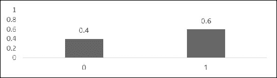

这样的分布无法回答诸如学生的预期通过率的问题，因为预期值（μ）将是一个分数，而该分布不能取这个值。它只能意味着，如果你对 1000 名学生进行抽样，那么 600 名会通过，400 名会失败。

### 二项分布

该分布可以描述一系列伯努利试验（每个试验只有两种可能结果）。此外，它假设一个试验的结果不会影响后续的试验，并且每次试验中事件发生的概率是相同的。一个二项分布的例子是抛掷硬币五次。在这里，第一个投掷的结果不会影响第二次投掷的结果，每次投掷的概率是相同的。

如果*n*是试验次数，*p*是每次试验中成功的概率，那么该二项分布的均值（μ）可以表示为：

*μ = n * p*

方差（σ2x）可以表示为：

*σ2x = n*p*(1-p)。*

一般来说，遵循二项分布的随机变量*X*，其参数为*n*和*p*，可以表示为*X ~ B(n, p)*。对于这样的分布，获得在*n*次试验中恰好* k *次成功的概率可以通过概率质量函数来描述，如下所示：

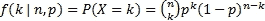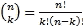

这里，k = 0, 1, 2, ..., n

#### 示例问题

假设一个假设场景。假设某城市的 24%公司宣布将向受到海啸影响的地区提供支持，作为其社会责任活动的一部分。在一个随机选择的 20 家公司样本中，求出有多少公司宣布将帮助海啸受灾地区的概率：

+   恰好三次

+   少于三次

+   三次或更多

**解答**：

样本大小 = *n* = 20。

随机选择的公司宣布将提供帮助的概率 = *P = 0.24*。

a) P(x = 3) = ²⁰C[3] (0.24)³ (0.76) ¹⁷ = 0.15

b) P(x < 3) = P(0) + P(1) + P(2)

= (0.76) ²⁰ + ²⁰C[1] (0.24) (0.76)¹⁹ + ²⁰C[2] (0.24)² (0.76)¹⁸

= 0.0041 + 0.0261 + 0.0783 = 0.11

c) P(x >= 3) = 1 - P(x <= 2) = 1 - 0.11 = 0.89

请注意，二项分布广泛应用于你想要模拟从一个规模为*N*的总体中抽取大小为*n*的样本成功率的场景，且在抽样过程中允许重复。如果没有替换，那么抽样将不再独立，因此不能正确遵循二项分布。然而，确实存在这样的场景，可以通过不同类型的分布进行建模，如超几何分布。

### 泊松分布

泊松分布可以描述在固定时间或空间区间内，以已知平均速率发生的一定数量的独立事件的概率。请注意，事件应该只有二元结果，例如：你每天接到的电话次数，或者每小时通过某个信号的汽车数量。你需要仔细观察这些例子。请注意，这里没有提供信息的另一半，比如：你每天没有接到多少个电话，或者每小时没有通过多少辆车。这样的数据点没有另一半的信息。相反，如果我说 50 个学生中有 30 个通过了考试，你可以很容易地推断出有 20 个学生没有通过！你有了这另一半的信息。

如果*µ*是发生事件的平均次数（在固定时间或空间区间内的已知平均速率），那么在同一时间区间内发生*k*次事件的概率可以通过概率质量函数来描述：

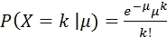

其中， *k* = 0, 1, 2, 3...

前面的公式描述了泊松分布。

对于泊松分布，均值和方差是相同的。同时，随着均值或方差的增加，泊松分布趋向于更加对称。

#### 示例问题

假设你知道在一个工作日，消防站接到的电话平均次数是八次。那么，在某个工作日接到 11 个电话的概率是多少呢？这个问题可以通过以下基于泊松分布的公式来解决：

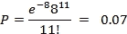

## 连续概率分布

连续概率分布用于对连续性质的数据进行建模，这意味着数据只能取特定范围内的任何值。因此，我们处理的是与区间相关的概率，而不是与某个特定值相关的概率，因为它的概率为零。连续概率分布是实验的理论模型；它是通过无限次观测建立的相对频率分布。这意味着当你缩小区间时，观测次数会增加，而随着观测次数越来越多并接近无穷大时，它就形成了一个连续概率分布。曲线下的总面积为 1，若要找到与某个特定范围相关的概率，我们必须找到曲线下的面积。因此，连续分布通常通过**概率密度函数**（**PDF**）来描述，其形式如下：

P(a ≤ X ≤ b) = a∫^b f(x) dx

连续概率分布有多种类型。以下章节展示了几个例子。

### 正态分布

正态分布是一种简单、直观，但非常重要的连续概率分布。因其绘制时的外观而被称为高斯分布或**钟形曲线**。此外，对于完美的正态分布，均值、中位数和众数都是相同的。

许多自然现象遵循正态分布（它们也可能遵循不同的分布！），例如人的身高、测量误差等。但是，正态分布不适合模拟高度倾斜或固有为正值的变量（例如股票价格或学生的测试成绩，其中难度水平很低）。这些变量可能更适合用不同的分布描述，或者在数据转换（如对数转换）后再用正态分布描述。

正态分布可以用两个描述符来描述：均值代表中心位置，标准差代表扩展（高度和宽度）。表示正态分布的概率密度函数如下：

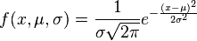

正态分布之所以在流行度榜首，其中一个原因是**中心极限定理**（**CLT**）。它指出，无论是什么种群分布，从同一种群分布独立抽取的样本的均值几乎服从正态分布，这种正态性随着样本量的增加而增强。这种行为实际上是统计假设检验的基础。

此外，每个正态分布，无论其均值和标准差如何，都遵循经验法则（68-95-99.7 法则），即约 68%的面积位于均值的一个标准差内，约 95%的面积位于均值的两个标准差内，约 99.7%的面积位于均值的三个标准差内。

现在，为了找到事件的概率，您可以使用积分微积分，或者按照下一节中的说明将分布转换为标准正态分布。

### 标准正态分布

标准正态分布是一种均值为*0*，标准差为*1*的正态分布类型。这种分布在自然界中很少见。它主要设计用于找出正态分布曲线下的面积（而不是使用微积分积分）或者标准化数据点。

假设随机变量*X*服从均值（*μ*）和标准差（*σ*）的正态分布，则随机变量*Z*将服从均值*0*和标准差*1*的标准正态分布。可以通过以下方式找到*Z*的值：

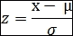

由于数据可以通过这种方式标准化，因此数据点可以表示为*离均值有多少个标准差*，并可以在分布中进行解读。这有助于比较两个具有不同尺度的分布。

你可以在那些想要找到落入特定范围的百分比的场景中使用正态分布——前提是分布大致正态。

考虑以下示例：

如果商店老板在某一天经营商店的时间遵循正态分布，且*μ* = *8*小时，*σ* = *0.5*小时，那么他在商店待少于 7.5 小时的概率是多少？

概率分布将如下所示：

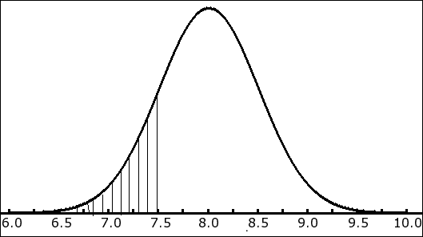

数据分布

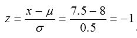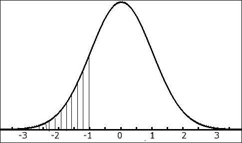

标准正态分布

所以，商店老板待在商店少于 7.5 小时的概率由以下公式给出：

*P(z = -1) = 0.1587 = 15.87*

### 注意

这是通过 Z 表计算出来的。

请注意，数据集的正态性通常是一个近似值。你首先需要检查数据的正态性，如果你的分析假设数据为正态分布，则可以继续进行。检查正态性的方法有很多种：你可以选择直方图（并且拟合一条与数据均值和标准差相符的曲线）、正态概率图或 QQ 图等技术。

### 卡方分布

卡方分布是统计推断中最广泛使用的分布之一。它是伽玛分布的一个特例，适用于建模非负变量的偏斜分布。它表示，如果随机变量*X*是正态分布的，且*Z*是其标准正态变量之一，那么*Z[2]*将具有*X[²]*分布，且自由度为 1。类似地，如果我们从相同分布中抽取多个这样的独立标准正态变量，将它们平方并相加，那么它们也将遵循*X[²]*分布，如下所示：

*Z[12] + Z[22] + ... + Z[k2]*将具有*X[2]*分布，且自由度为*k*。

卡方分布主要用于基于样本方差或标准差推断总体方差或总体标准差。这是因为*X[2]*分布是通过另一种方式定义的，涉及样本方差与总体方差的比率。

为了证明这一点，让我们从一个正态分布中随机抽取样本（*x[1]*, *x[2]*,...,*xn*），其方差为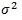

样本均值由以下公式给出：

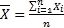

然而，样本方差由以下公式给出：

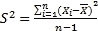

考虑到上述事实，我们可以将卡方统计量定义如下：

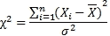

（记住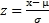 和 *Z[2]* 将会有 X[2] 分布。）

因此，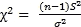

因此，卡方统计量的抽样分布将遵循自由度为*(n-1)*的卡方分布。

具有*n*自由度和伽马函数*Г*的卡方分布的概率密度函数如下：

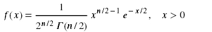

对于具有*k*自由度的*χ2*分布，均值（*µ*）= *k*，方差（*σ2*）= *2k*。

请注意，卡方分布是正偏的，但随着自由度增加，偏度减小，并接近正态分布。

#### 示例问题

找到成人单人电影票价格的方差和标准差的 90%置信区间。所给数据代表全国电影院的选定样本。假设变量呈正态分布。

给定样本（以$计算）：10, 08, 07, 11, 12, 06, 05, 09, 15, 12

解决方案：

*N* = *10*

样本均值：

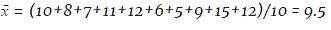

样本的方差：

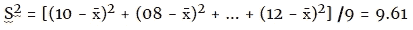

样本的标准差：

S = sqrt(9.61)

自由度：

10-1 = 9

现在我们需要找到 90%的置信区间，这意味着数据的 10%将留在尾部。

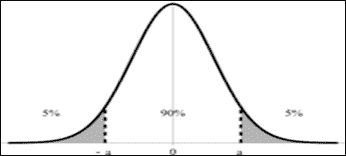

现在，让我们使用公式：

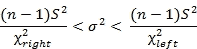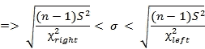

然后我们可以使用表格或计算机程序找到卡方值。

要找到中间 90%的置信区间，我们可以考虑左边 95%和右边 5%。

所以，代入数字后，我们得到：

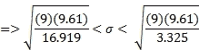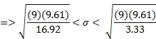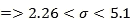

因此，我们可以得出结论，基于全国 10 家电影票价格样本，我们对整个国家的电影票价格标准差有 90%的信心区间在$2.26 和$5.10 之间。

### 学生 t 分布

学生 t 分布用于估算正态分布总体的均值，当总体标准差未知或样本量过小时。在这种情况下，只能通过样本估算总体参数*μ*和*σ*。

这个分布呈钟形，对称，类似正态分布，但尾部更重。当样本量大时，t 分布趋于正态分布。

让我们从均值为*μ*和方差为*σ2*的正态分布中随机抽取样本(*x1*, *x2*,...,*xn*)。

样本均值为  和样本方差 

考虑到上述事实，t 统计量可以定义为：

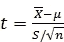

t 统计量的抽样分布将遵循具有 *(n-1)* **自由度** (**df**) 的 t 分布。自由度越高，t 分布越接近标准正态分布。

t 分布的均值 (*μ*) = *0*，方差 *(σ2) = df/df-2*

现在，为了让事情更清晰，让我们回顾一下，考虑总体 *σ* 已知的情况。当总体是正态分布时，无论样本量大小如何，样本均值 *x̄* 通常也是正态分布，且任何线性变换的 *x̄*，例如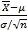，也将遵循正态分布。

如果总体不是正态分布怎么办？即使如此，根据中心极限定理，当样本量足够大时，*x̄*（即抽样分布）或的分布将趋近于正态分布！

另一种情况是总体的 *σ* 不为已知。如果总体是正态分布，那么样本均值 *x̄* 通常也是正态分布，但随机变量 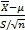 将不遵循正态分布；它遵循具有 *(n-1)* 自由度的 t 分布。原因是因为分母中的 *S* 存在随机性，不同的样本会导致不同的值。

在上述情况下，如果总体不是正态分布，按照中心极限定理（CLT），当样本量足够大时，的分布将趋近于正态分布（但小样本量时则不适用！）。因此，当样本量较大时，的分布会趋近于正态分布，可以安全地假设它符合 t 分布，因为 t 分布随着样本量增加而逐渐接近正态分布。

### F-分布

在统计推断中，F-分布用于研究两个正态分布总体的方差。它表明，来自两个独立正态分布总体的样本方差的抽样分布，如果这两个总体的方差相同，则遵循 F-分布。

如果样本 1 的样本方差是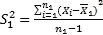，并且样本 2 的样本方差是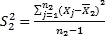，那么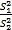将遵循 F-分布（*σ12 = σ22*）。

根据上述事实，我们还可以说，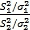也将遵循 F-分布。

在前一节的卡方分布中，我们还可以说：

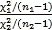也将遵循具有 *n1-1* 和 *n2-1* 自由度的 F 分布。对于这些自由度的每种组合，会有不同的 F 分布。

## 标准误差

统计量（如均值或方差）抽样分布的标准差称为**标准误差**（**SE**），它是衡量变异性的一个指标。换句话说，**均值的标准误差**（**SEM**）可以定义为样本均值对总体均值估计的标准差。

随着样本量的增加，均值的抽样分布变得越来越接近正态分布，标准差也变得越来越小。已证明：

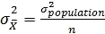

(*n* 代表样本大小)

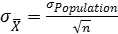

标准误差越小，样本对总体的代表性就越强。此外，样本量越大，标准误差越小。

标准误差在统计推断的其他度量中非常重要，例如误差范围和置信区间。

## 置信水平

它是衡量通过样本统计量估计总体参数时，你希望有多大的置信度（概率），从而使得期望值落在一个期望的区间或置信区间内。它是通过从 1 中减去显著性水平（*α*）来计算的（即，*置信水平 = 1 - α*）。所以，如果*α = 0.05*，则置信水平为*1-0.05 = 0.95*。

通常，置信水平越高，所需的样本量也越大。然而，通常存在一定的权衡，您需要决定希望达到的置信度，从而估算所需的样本量。

## 误差范围和置信区间

如前所述，由于样本永远不能完全代表总体，通过推断估算总体参数时，总会存在一些抽样误差，导致误差范围。通常，样本越大，误差范围越小。然而，您需要决定接受多少误差，所需的适当样本大小也会取决于这一点。

因此，基于误差范围的样本统计量上下的数值范围称为**置信区间**。换句话说，置信区间是一个数值区间，我们相信总体的真实参数会有某个百分比的时间落在这个区间内（置信水平）。

请注意，像“我有 95％的把握置信区间包含真实值”这样的说法可能会误导！正确的表述方式应该是“*如果我从相同大小的样本中抽取无限多次样本，那么在 95％的情况下，置信区间将包含真实值*”。

例如，当你将置信水平设为 95％，并且将置信区间设为 4％，对于一个样本统计量 58（这里，58 是任何样本统计量，如均值、方差或标准差），你可以说你有 95％的把握认为总体的真实百分比在 58 - 4 = 54％和 58 + 4 = 62％之间。

## 总体的变异性

总体的变异性是我们在推断统计中应该考虑的最重要因素之一。它在估算样本大小时起着重要作用。无论你选择什么抽样算法来最好地代表总体，样本大小仍然起着至关重要的作用——这一点显而易见！

如果总体的变异性较大，那么所需的样本大小也会更大。

## 估算样本大小

我们已经在前面的章节中讨论了抽样技术。在本节中，我们将讨论如何估算样本大小。假设你必须证明某个概念或评估某个行动的结果，那么你会收集一些相关数据并试图证明你的观点。然而，如何确保你拥有足够的数据呢？样本过大浪费时间和资源，样本过小可能导致误导性的结果。估算样本大小主要取决于误差范围或置信区间、置信水平以及总体的变异性等因素。

考虑以下示例：

大学校长要求统计学老师估算其学院学生的平均年龄。需要多大的样本？统计学老师希望能有 99%的置信度，使得估算值在 1 年以内是准确的。根据以往的研究，已知年龄的标准差为 3 年。

解决方案：

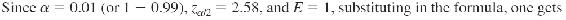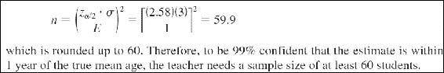

## 假设检验

假设检验是关于测试为总体参数所做假设的过程。这有助于确定一个结果是否具有统计学意义，或是否是偶然发生的。这是统计研究中最重要的工具之一。我们将讨论一些检验方法，看看变量在总体中是如何相互关联的。

### 原假设与备择假设

原假设（记作 H0）通常是关于总体参数的初始假设，通常表示*无效应*或*无关联*。在我们的假设检验中，我们的目的是否定并拒绝原假设，以便接受备择假设（记作 H1）。备择假设表示实验中存在某种效应。在实验过程中，请注意你要么拒绝原假设，要么无法拒绝原假设。如果你成功地拒绝了原假设，那么备择假设就应该被考虑；如果你未能拒绝原假设，那么原假设就被视为成立（尽管它可能不成立！）。

所以，我们通常希望得到一个非常小的 P 值（低于定义的显著性水平 alpha），以便拒绝原假设。如果 P 值大于 alpha，那么你就无法拒绝原假设。

### 卡方检验

大多数统计推断技术用于估计总体参数或使用样本统计量（如*均值*）来检验假设。然而，卡方统计量采取完全不同的方法，通过检查整个分布或两个分布之间的关系来进行分析。在推断统计学领域，许多检验统计量类似于卡方分布。使用这种分布的最常见检验是卡方拟合优度检验（单向表）和卡方独立性检验（双向表）。*拟合优度*检验是在你想要查看样本数据是否遵循总体中的相同分布时进行的，而*独立性*检验是在你想要查看两个分类变量是否在总体中相互关联时进行的。

输入数据类型决定了是否进行*拟合优度*检验或*独立性*检验，而不需要明确指定这些作为开关。因此，如果你提供一个向量作为输入，则进行*拟合优度*检验；如果你提供一个矩阵作为输入，则进行*独立性*检验。在这两种情况下，都需要先提供事件的频率向量或列联矩阵作为输入，然后进行计算。让我们通过实例来探讨这些：

**Python**

```py
 //Chi-Square test
>>> from pyspark.mllib.linalg import Vectors, Matrices
>>> from pyspark.mllib.stat import Statistics
>>> import random
>>> 
//Make a vector of frequencies of events
>>> vec = Vectors.dense( random.sample(xrange(1,101),10))
>>> vec
DenseVector([45.0, 40.0, 93.0, 66.0, 56.0, 82.0, 36.0, 30.0, 85.0, 15.0])
// Get Goodnesss of fit test results
>>> GFT_Result = Statistics.chiSqTest(vec)
// Here the ‘goodness of fit test’ is conducted because your input is a vector
//Make a contingency matrix
>>> mat = Matrices.dense(5,6,random.sample(xrange(1,101),30))\
//Get independense test results\\
>>> IT_Result = Statistics.chiSqTest(mat)
// Here the ‘independence test’ is conducted because your input is a vector
//Examine the independence test results
>>> print(IT_Result)
Chi squared test summary:
method: pearson
degrees of freedom = 20
statistic = 285.9423808343265
pValue = 0.0
Very strong presumption against null hypothesis: the occurrence of the outcomes is statistically independent..
```

**Scala**

```py
scala> import org.apache.spark.mllib.linalg.{Vectors, Matrices}
import org.apache.spark.mllib.linalg.{Vectors, Matrices} 

scala> import org.apache.spark.mllib.stat.Statistics 

scala> val vec = Vectors.dense( Array.fill(10)(               scala.util.Random.nextDouble))vec: org.apache.spark.mllib.linalg.Vector = [0.4925741159101148,....] 

scala> val GFT_Result = Statistics.chiSqTest(vec)GFT_Result: org.apache.spark.mllib.stat.test.ChiSqTestResult =Chi squared test summary:
method: pearson
degrees of freedom = 9
statistic = 1.9350768763253192
pValue = 0.9924531181394086
No presumption against null hypothesis: observed follows the same distribution as expected..
// Here the ‘goodness of fit test’ is conducted because your input is a vector
scala> val mat = Matrices.dense(5,6, Array.fill(30)(scala.util.Random.nextDouble)) // a contingency matrix
mat: org.apache.spark.mllib.linalg.Matrix =..... 
scala> val IT_Result = Statistics.chiSqTest(mat)
IT_Result: org.apache.spark.mllib.stat.test.ChiSqTestResult =Chi squared test summary:
method: pearson
degrees of freedom = 20
statistic = 2.5401190679900663
pValue = 0.9999990459111089
No presumption against null hypothesis: the occurrence of the outcomes is statistically independent..
// Here the ‘independence test’ is conducted because your input is a vector

```

### F 检验

我们已经在前面的章节中介绍了如何计算 F 统计量。现在我们将解决一个样本问题。

#### 问题：

你想要检验一个假设：硕士学位持有者的收入波动性是否大于学士学位持有者的收入波动性。随机抽取了 21 名毕业生和 30 名硕士生。毕业生样本的标准差为$180，硕士生样本的标准差为$112。

解决方案：

零假设是：*H[0] : σ[1]² =σ[2]²*

给定 *S[1] = $180*，*n[1] = 21*，*S[2] = $112*，*n[2] = 30*

假设显著性水平为*α = 0.05*

*F = S[1]² /S[2]² = 180²/112² = 2.58*

从显著性水平为 0.05 的 F 表中，df1=20 和 df2=29，我们可以看到 F 值为 1.94

由于计算出的 F 值大于表中 F 值，我们可以拒绝零假设并得出结论：*σ[1]² >σ[2]* ^(*2*)。

### 相关性

相关性提供了一种衡量两个数值型随机变量之间统计依赖关系的方法。它展示了两个变量相互变化的程度。基本上有两种类型的相关性度量：皮尔逊相关性和斯皮尔曼相关性。皮尔逊相关性更适合于区间尺度数据，如温度、身高等；斯皮尔曼相关性则更适合于有序尺度数据，如满意度调查，其中 1 表示不满意，5 表示最满意。此外，皮尔逊相关性是基于真实值计算的，适用于找到线性关系，而斯皮尔曼相关性则是基于排名顺序计算的，适用于找到单调关系。单调关系意味着变量确实会一起变化，但变化速率不一定恒定。请注意，这两种相关性度量只能衡量线性或单调关系，不能描绘其他类型的关系，如非线性关系。

在 Spark 中，这两者都得到了支持。如果输入是两个 `RDD[Double]`，输出是一个*Double*；如果输入是一个 `RDD[Vector]`，输出是一个*相关性矩阵*。在 Scala 和 Python 的实现中，如果没有提供相关性类型作为输入，则默认考虑为皮尔逊相关性。

**Python**

```py
>>> from pyspark.mllib.stat import Statistics
>>> import random 
// Define two series
//Number of partitions and cardinality of both Ser_1 and Ser_2 should be the same
>>> Ser_1 = sc.parallelize(random.sample(xrange(1,101),10))       
// Define Series_1>>> Ser_2 = sc.parallelize(random.sample(xrange(1,101),10))       
// Define Series_2 
>>> correlation = Statistics.corr(Ser_1, Ser_2, method = "pearson") 
//if you are interested in Spearman method, use “spearman” switch instead
>>> round(correlation,2)-0.14
>>> correlation = Statistics.corr(Ser_1, Ser_2, method ="spearman")
>>> round(correlation,2)-0.19//Check on matrix//The following statement creates 100 rows of 5 elements each
>>> data = sc.parallelize([random.sample(xrange(1,51),5) for x in range(100)])
>>> correlMatrix = Statistics.corr(data, method = "pearson") 
//method may be spearman as per you requirement
>>> correlMatrix
array([[ 1.        ,  0.09889342, -0.14634881,  0.00178334,  0.08389984],       [ 0.09889342,  1.        , -0.07068631, -0.02212963, -0.1058252 ],       [-0.14634881, -0.07068631,  1.        , -0.22425991,  0.11063062],       [ 0.00178334, -0.02212963, -0.22425991,  1.        , -0.04864668],       [ 0.08389984, -0.1058252 ,  0.11063062, -0.04864668,  1.        
]])
>>> 

```

**Scala**

```py
scala> val correlation = Statistics.corr(Ser_1, Ser_2, "pearson")correlation: Double = 0.43217145308272087 
//if you are interested in Spearman method, use “spearman” switch instead
scala> val correlation = Statistics.corr(Ser_1, Ser_2, "spearman")correlation: Double = 0.4181818181818179 
scala>
//Check on matrix
//The following statement creates 100 rows of 5 element Vectors
scala> val data = sc.parallelize(Seq.fill(100)(Vectors.dense(Array.fill(5)(              scala.util.Random.nextDouble))))
data: org.apache.spark.rdd.RDD[org.apache.spark.mllib.linalg.Vector] = ParallelCollectionRDD[37] at parallelize at <console>:27 
scala> val correlMatrix = Statistics.corr(data, method="pearson") 
//method may be spearman as per you requirement
correlMatrix: org.apache.spark.mllib.linalg.Matrix =1.0                    -0.05478051936343809  ... (5 total)-0.05478051936343809   1.0                   ..........
```

# 总结

在本章中，我们简要介绍了数据科学生命周期中的几个步骤，如数据获取、数据准备和通过描述性统计进行数据探索。我们还学习了如何通过一些流行的工具和技术，利用样本统计量估计总体参数。

我们从理论和实践两个方面解释了统计学的基础，通过深入研究几个领域的基本概念，能够解决业务问题。最后，我们学习了如何在 Apache Spark 上进行统计分析的几个示例，利用开箱即用的功能，这也是本章的主要目标。

我们将在下一章讨论数据科学中机器学习部分的更多细节，因为本章已经建立了统计学的基础。通过本章的学习，应该能够更有根据地连接到机器学习算法。

# 参考文献

Spark 支持的统计：

[`spark.apache.org/docs/latest/mllib-statistics.html`](http://spark.apache.org/docs/latest/mllib-statistics.html)

Databricks 的绘图功能：

[`docs.cloud.databricks.com/docs/latest/databricks_guide/04%20Visualizations/4%20Matplotlib%20and%20GGPlot.html`](https://docs.cloud.databricks.com/docs/latest/databricks_guide/04%20Visualizations/4%20Matplotlib%20and%20GGPlot.html)

MLLIB 统计的开箱即用库函数的详细信息：

[`spark.apache.org/docs/latest/api/scala/index.html#org.apache.spark.mllib.stat.Statistics$`](http://spark.apache.org/docs/latest/api/scala/index.html#org.apache.spark.mllib.stat.Statistics%24)
