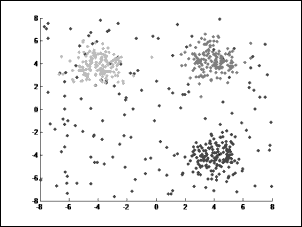
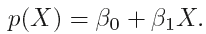

# 第六章 机器学习

我们每天都在使用机器学习，无论我们是否注意到。像 Google 这样的电子邮件服务提供商会自动将一些来信推送到`垃圾邮件`文件夹，像 Amazon 这样的在线购物网站或 Facebook 这样的社交网络网站会推荐一些意外有用的商品或信息。那么，是什么让这些软件产品能够重新连接久未联系的朋友呢？这些只是机器学习应用的几个例子。

从形式上来说，机器学习是**人工智能**（**AI**）的一部分，它涉及一类能够从数据中学习并进行预测的算法。其技术和基本概念来自统计学领域。机器学习位于计算机科学和统计学的交叉点，被认为是数据科学最重要的组成部分之一。虽然它已经存在一段时间，但随着数据量和可扩展性要求的增加，其复杂性也不断提升。机器学习算法往往是资源密集型和迭代的，这使得它们不太适合 MapReduce 范式。MapReduce 非常适合单次运行的算法，但对于多次运行的算法并不太适用。正是为了应对这一挑战，Spark 研究项目应运而生。Apache Spark 在其 MLlib 库中配备了高效的算法，旨在即使在迭代计算要求下也能表现良好。

上一章概述了数据分析的生命周期及其各种组成部分，如数据清洗、数据转换、采样技术和用于可视化数据的图形技术，以及描述性统计和推断统计的概念。我们还看了一些可以在 Spark 平台上执行的统计测试。在上一章所建立的基础上，本章将介绍大多数机器学习算法及如何在 Spark 上使用它们构建模型。

本章的前提是对机器学习算法和计算机科学基础知识有一定的了解。尽管如此，我们已经通过一些理论基础和适当的实际案例讲解了这些算法，使其更加易于理解和实现。本章涵盖的主题包括：

+   机器学习简介

    +   演化

    +   有监督学习

    +   无监督学习

+   MLlib 和管道 API

    +   MLlib

    +   机器学习管道

+   机器学习简介

    +   参数化方法

    +   非参数化方法

+   回归方法

    +   线性回归

    +   回归的正则化

+   分类方法

    +   逻辑回归

    +   线性支持向量机（SVM）

+   决策树

    +   不纯度度量

    +   停止规则

    +   分割候选

    +   决策树的优点

    +   示例

+   集成方法

    +   随机森林

    +   梯度提升树

+   多层感知机分类器

+   聚类技术

    +   K 均值聚类

+   总结

# 介绍

机器学习完全是通过示例数据来学习；这些示例为特定输入产生特定输出。机器学习在商业中有多种应用案例。让我们通过几个例子来了解它究竟是什么：

+   一个推荐引擎，向用户推荐他们可能感兴趣的购买项目

+   客户细分（将具有相似特征的客户分组）用于市场营销活动

+   癌症的疾病分类——恶性/良性

+   预测建模，例如，销售预测，天气预测

+   绘制商业推断，例如，理解改变产品价格对销售的影响

## 演变

统计学习的概念在第一个计算机系统被引入之前就已存在。在十九世纪，最小二乘法（现在称为线性回归）已经被开发出来。对于分类问题，费舍尔提出了**线性判别分析**（**LDA**）。大约在 1940 年代，一种 LDA 的替代方法——**逻辑回归**被提出，所有这些方法不仅随着时间的推移得到了改进，还激发了其他新算法的发展。

在那个时期，计算是一个大问题，因为它是通过笔和纸来完成的。因此，拟合非线性方程并不十分可行，因为它需要大量的计算。1980 年代以后，随着技术的进步和计算机系统的引入，分类/回归树被提出。随着技术和计算系统的进一步发展，统计学习在某种程度上与现在所称的机器学习融合在一起。

## 监督学习

正如上一节所讨论的，机器学习完全是通过示例数据来学习。根据算法如何理解数据并在其上进行训练，机器学习大致可以分为两类：**监督学习**和**无监督学习**。

监督统计学习涉及构建基于一个或多个输入的模型，以产生特定的输出。这意味着我们得到的输出可以根据我们提供的输入来监督我们的分析。换句话说，对于每个预测变量的观察（例如，年龄、教育和支出变量），都有一个与之相关的响应变量的测量（例如，薪水）。请参考下表了解我们尝试基于**年龄**、**教育**和**支出**变量预测**薪水**的示例数据集：


监督算法可以用于预测、估算、分类以及其他类似的需求，我们将在接下来的部分中进行介绍。

## 无监督学习

无监督统计学习是通过一个或多个输入构建模型，但没有预期产生特定的输出。这意味着没有明确需要预测的响应/输出变量；但输出通常是具有一些相似特征的数据点分组。与监督学习不同，你并不知道将数据点分类到哪些组/标签，而是将这一决策交给算法自己去决定。

在这里，并没有一个 `训练` 数据集来通过构建模型将结果变量与 `预测` 变量关联起来，并随后使用 `测试` 数据集验证模型。无监督算法的输出无法根据你提供的输入来监督你的分析。这类算法可以从数据中学习关系和结构。*聚类* 和 *关联规则学习* 是无监督学习技术的例子。

以下图片展示了如何使用聚类将具有相似特征的数据项分组：



# MLlib 和 Pipeline API

让我们首先了解一些 Spark 的基础知识，以便能够在其上执行机器学习操作。本节将讨论 MLlib 和 Pipeline API。

## MLlib

MLlib 是建立在 Apache Spark 之上的机器学习库，包含了大部分可以大规模实现的算法。MLlib 与 GraphX、SQL 和 Streaming 等其他组件的无缝集成为开发者提供了相对容易组装复杂、可扩展和高效工作流的机会。MLlib 库包含常用的学习算法和工具，包括分类、回归、聚类、协同过滤和降维等。

MLlib 与 `spark.ml` 包协同工作，后者提供了一个高级的 Pipeline API。这两个包之间的根本区别在于，MLlib（`spark.mllib`）在 RDD 之上工作，而 ML（`spark.ml`）包在 DataFrame 之上工作，并支持 ML Pipeline。目前，Spark 支持这两个包，但建议使用 `spark.ml` 包。

该库中的基本数据类型是向量和矩阵。向量是局部的，可以是密集的或稀疏的。密集向量以值数组的形式存储。稀疏向量则存储为两个数组；第一个数组存储非零值的索引，第二个数组存储实际的值。所有元素值都以双精度浮点数形式存储，索引以从零开始的整数形式存储。理解这些基本结构有助于高效使用库，并帮助从零开始编写任何新的算法。让我们看一些示例代码，帮助更好地理解这两种向量表示方式：

**Scala**

```py
//Create vectors
scala> import org.apache.spark.ml.linalg.{Vector, Vectors}
import org.apache.spark.ml.linalg.{Vector, Vectors}

//Create dense vector
scala> val dense_v: Vector = Vectors.dense(10.0,0.0,20.0,30.0,0.0)
dense_v: org.apache.spark.ml.linalg.Vector = [10.0,0.0,20.0,30.0,0.0]
scala>

//Create sparse vector: pass size, position index array and value array
scala> val sparse_v1: Vector = Vectors.sparse(5,Array(0,2,3),
       Array(10.0,20.0,30.0))
sparse_v1: org.apache.spark.ml.linalg.Vector = (5,[0,2,3],[10.0,20.0,30.0])
scala>

//Another way to create sparse vector with position, value tuples
scala> val sparse_v2: Vector = Vectors.sparse(5,
        Seq((0,10.0),(2,20.0),(3,30.0)))
sparse_v2: org.apache.spark.ml.linalg.Vector = (5,[0,2,3],[10.0,20.0,30.0])
scala>  
 Compare vectors 
--------------- cala> sparse_v1 == sparse_v2
res0: Boolean = true
scala> sparse_v1 == dense_v
res1: Boolean = true      //All three objects are equal but...
scala> dense_v.toString()
res2: String = [10.0,0.0,20.0,30.0,0.0]
scala> sparse_v2.toString()
res3: String = (5,[0,2,3],[10.0,20.0,30.0]) //..internal representation
differs
scala> sparse_v2.toArray
res4: Array[Double] = Array(10.0, 0.0, 20.0, 30.0, 0.0)

Interchangeable ---------------
scala> dense_v.toSparse
res5: org.apache.spark.mllib.linalg.SparseVector = (5,[0,2,3]
[10.0,20.0,30.0])
scala> sparse_v1.toDense
res6: org.apache.spark.mllib.linalg.DenseVector = [10.0,0.0,20.0,30.0,0.0]
scala>

A common operation ------------------
scala> Vectors.sqdist(sparse_v1,
        Vectors.dense(1.0,2.0,3.0,4.0,5.0))
res7: Double = 1075.0
```

Python:

```py
//Create vectors
>>> from pyspark.ml.linalg import Vector, Vectors
//Create vectors
>>> dense_v = Vectors.dense(10.0,0.0,20.0,30.0,0.0)
//Pass size, position index array and value array
>>> sparse_v1 = Vectors.sparse(5,[0,2,3],
                    [10.0,20.0,30.0])
>>> 

//Another way to create sparse vector with position, value tuples
>>> sparse_v2 = Vectors.sparse(5,
                  [[0,10.0],[2,20.0],[3,30.0]])
>>> 

Compare vectors 
--------------- >>> sparse_v1 == sparse_v2
True
>>> sparse_v1 == dense_v
True      //All three objects are equal but...
>>> dense_v
DenseVector([10.0, 0.0, 20.0, 30.0, 0.0])
>>> sparse_v1
SparseVector(5, {0: 10.0, 2: 20.0, 3: 30.0}) //..internal representation
differs
>>> sparse_v2
SparseVector(5, {0: 10.0, 2: 20.0, 3: 30.0})

Interchangeable 
---------------- //Note: as of Spark 2.0.0, toDense and toSparse are not available in pyspark
 A common operation 
------------------- >>> Vectors.squared_distance(sparse_v1,
        Vectors.dense(1.0,2.0,3.0,4.0,5.0))
1075.0
```

矩阵可以是局部的或分布式的，可以是稠密的或稀疏的。局部矩阵存储在单台机器上，作为一维数组。稠密的局部矩阵按照列主序存储（列成员是连续的），而稀疏矩阵的值则以**压缩稀疏列（**CSC**）**格式以列主序存储。在这种格式中，矩阵以三个数组的形式存储。第一个数组包含非零值的行索引，第二个数组包含每列第一个非零值的起始位置索引，第三个数组包含所有非零值。索引的类型是整数，从零开始。第一个数组包含从零到行数减一的值。第三个数组的元素类型为双精度。第二个数组需要一些解释。该数组中的每一项对应每一列第一个非零元素的索引。例如，假设在一个 3×3 的矩阵中，每列只有一个非零元素。那么第二个数组将包含 0、1、2 作为其元素。第一个数组包含行位置，第三个数组包含三个值。如果某一列中没有非零元素，你会注意到第二个数组中的相同索引会重复。让我们看一些示例代码：

**Scala:**

```py
scala> import org.apache.spark.ml.linalg.{Matrix,Matrices}
import org.apache.spark.ml.linalg.{Matrix, Matrices}

Create dense matrix 
------------------- //Values in column major order
Matrices.dense(3,2,Array(9.0,0,0,0,8.0,6))
res38: org.apache.spark.mllib.linalg.Matrix =
9.0  0.0
0.0  8.0
0.0  6.0
 Create sparse matrix 
-------------------- //1.0 0.0 4.0
0.0 3.0 5.0
2.0 0.0 6.0//
val sm: Matrix = Matrices.sparse(3,3,
        Array(0,2,3,6), Array(0,2,1,0,1,2),
        Array(1.0,2.0,3.0,4.0,5.0,6.0))
sm: org.apache.spark.mllib.linalg.Matrix =
3 x 3 CSCMatrix
(0,0) 1.0
(2,0) 2.0
(1,1) 3.0
(0,2) 4.0
(1,2) 5.0
(2,2) 6.0
 Sparse matrix, a column of all zeros 
------------------------------------ //third column all zeros
Matrices.sparse(3,4,Array(0,2,3,3,6),
    Array(0,2,1,0,1,2),values).toArray
res85: Array[Double] = Array(1.0, 0.0, 2.0, 0.0, 3.0, 0.0, 0.0, 0.0, 0.0,
4.0, 5.0, 6.0)

```

**Python:**

```py
//Create dense matrix
>>> from pyspark.ml.linalg import Matrix, Matrices

//Values in column major order
>>> Matrices.dense(3,2,[9.0,0,0,0,8.0,6])
DenseMatrix(3, 2, [9.0, 0.0, 0.0, 0.0, 8.0, 6.0], False)
>>> 

//Create sparse matrix
//1.0 0.0 4.0
0.0 3.0 5.0
2.0 0.0 6.0//
>>> sm = Matrices.sparse(3,3,
        [0,2,3,6], [0,2,1,0,1,2],
        [1.0,2.0,3.0,4.0,5.0,6.0])
>>> 

//Sparse matrix, a column of all zeros
//third column all zeros
>>> Matrices.sparse(3,4,[0,2,3,3,6],
        [0,2,1,0,1,2],
    values=[1.0,2.0,3.0,4.0,5.0,6.0]).toArray()
array([[ 1.,  0.,  0.,  4.],
       [ 0.,  3.,  0.,  5.],
       [ 2.,  0.,  0.,  6.]])
>>> 
```

分布式矩阵是最复杂的矩阵，选择合适的分布式矩阵类型非常重要。分布式矩阵由一个或多个 RDDs 支持。行和列的索引是`long`类型，以支持非常大的矩阵。分布式矩阵的基本类型是`RowMatrix`，它仅由其行的 RDD 支持。

每一行依次是一个局部向量。当列数非常低时，这种方式很适用。记住，我们需要传递 RDDs 来创建分布式矩阵，而不像局部矩阵那样。让我们来看一个例子：

**Scala:**

```py
scala> import org.apache.spark.mllib.linalg.{Vector,Vectors}
import org.apache.spark.mllib.linalg.{Vector, Vectors}
scala> import org.apache.spark.mllib.linalg.distributed.RowMatrix
import org.apache.spark.mllib.linalg.distributed.RowMatrix

scala>val dense_vlist: Array[Vector] = Array(
    Vectors.dense(11.0,12,13,14),
    Vectors.dense(21.0,22,23,24),
    Vectors.dense(31.0,32,33,34))
dense_vlist: Array[org.apache.spark.mllib.linalg.Vector] =
Array([11.0,12.0,13.0,14.0], [21.0,22.0,23.0,24.0], [31.0,32.0,33.0,34.0])
scala>

//Distribute the vector list
scala> val rows  = sc.parallelize(dense_vlist)
rows: org.apache.spark.rdd.RDD[org.apache.spark.mllib.linalg.Vector] =
ParallelCollectionRDD[0] at parallelize at <console>:29
scala> val m: RowMatrix = new RowMatrix(rows)
m: org.apache.spark.mllib.linalg.distributed.RowMatrix =
org.apache.spark.mllib.linalg.distributed.RowMatrix@5c5043fe
scala> print("Matrix size is " + m.numRows()+"X"+m.numCols())
Matrix size is 3X4
scala>
```

**Python:**

```py
>>> from pyspark.mllib.linalg import Vector,Vectors
>>> from pyspark.mllib.linalg.distributed import RowMatrix

>>> dense_vlist = [Vectors.dense(11.0,12,13,14),
         Vectors.dense(21.0,22,23,24), Vectors.dense(31.0,32,33,34)]
>>> rows  = sc.parallelize(dense_vlist)
>>> m = RowMatrix(rows)
>>> "Matrix size is {0} X {1}".format(m.numRows(), m.numCols())
'Matrix size is 3 X 4'
```

`IndexedRowMatrix`将行索引前缀添加到行条目。这在执行连接操作时很有用。你需要传递`IndexedRow`对象来创建一个`IndexedRowMatrix`。`IndexedRow`对象是一个包含`long`类型`Index`和行元素的`Vector`的封装器。

`CoordinatedMatrix`将数据存储为行列索引和元素值的元组。`BlockMatrix`将分布式矩阵表示为局部矩阵的块。提供了将矩阵从一种类型转换为另一种类型的方法，但这些操作非常昂贵，使用时应谨慎。

## ML 流水线

现实中的机器学习工作流程是一个迭代循环，包含数据提取、数据清洗、预处理、探索、特征提取、模型拟合和评估。Spark 上的 ML 流水线是一个简单的 API，供用户设置复杂的机器学习工作流程。它的设计旨在解决一些常见问题，如参数调整、基于不同数据划分（交叉验证）或不同参数集训练多个模型等。编写脚本来自动化整个过程不再是必需的，所有这些都可以在 Pipeline API 中处理。

Pipeline API 由一系列流水线阶段组成（作为 *转换器* 和 *估算器* 等抽象的实现），这些阶段将按预定顺序执行。

在 ML 流水线中，您可以调用上一章讨论过的数据清洗/转换函数，并调用 MLlib 中可用的机器学习算法。这可以通过迭代的方式进行，直到您获得模型的理想性能。


### 转换器

转换器是一个抽象，实现了 `transform()` 方法，将一个 DataFrame 转换成另一个 DataFrame。如果该方法是一个特征转换器，结果 DataFrame 可能包含一些基于您执行的操作的额外转换列。然而，如果该方法是一个学习模型，那么结果 DataFrame 将包含一个包含预测结果的额外列。

### 估算器

估算器是一个抽象，它可以是任何实现了 `fit()` 方法的学习算法，用来在 DataFrame 上训练以生成模型。从技术上讲，这个模型是给定 DataFrame 的转换器。

示例：逻辑回归是一种学习算法，因此是一个估算器。调用 `fit()` 会训练一个逻辑回归模型，生成的模型是一个转换器，可以生成一个包含预测列的 DataFrame。

以下示例演示了一个简单的单阶段流水线。

**Scala:**

```py
//Pipeline example with single stage to illustrate syntax
scala> import org.apache.spark.ml.Pipeline
import org.apache.spark.ml.Pipeline
scala> import org.apache.spark.ml.feature._
import org.apache.spark.ml.feature._

//Create source data frame
scala> val df = spark.createDataFrame(Seq(
         ("Oliver Twist","Charles Dickens"),
        ("Adventures of Tom Sawyer","Mark Twain"))).toDF(
        "Title","Author")

//Split the Title to tokens
scala> val tok = new Tokenizer().setInputCol("Title").
          setOutputCol("words")
tok: org.apache.spark.ml.feature.Tokenizer = tok_2b2757a3aa5f

//Define a pipeline with a single stage
scala> val p = new Pipeline().setStages(Array(tok))
p: org.apache.spark.ml.Pipeline = pipeline_f5e0de400666

//Run an Estimator (fit) using the pipeline
scala> val model = p.fit(df)
model: org.apache.spark.ml.PipelineModel = pipeline_d00989625bb2

//Examine stages
scala> p.getStages   //Returns a list of stage objects
res1: Array[org.apache.spark.ml.PipelineStage] = Array(tok_55af0061af6d)

// Examine the results
scala> val m = model.transform(df).select("Title","words")
m: org.apache.spark.sql.DataFrame = [Title: string, words: array<string>]
scala> m.select("words").collect().foreach(println)
[WrappedArray(oliver, twist)]
[WrappedArray(adventures, of, tom, sawyer)]
```

**Python:**

```py
//Pipeline example with single stage to illustrate syntax
//Create source data frame
>>> from pyspark.ml.pipeline import Pipeline
>>> from pyspark.ml.feature import Tokenizer
>>>  df = sqlContext.createDataFrame([
    ("Oliver Twist","Charles Dickens"),
    ("Adventures of Tom Sawyer","Mark Twain")]).toDF("Title","Author")
>>> 

//Split the Title to tokens
>>> tok = Tokenizer(inputCol="Title",outputCol="words")

//Define a pipeline with a single stage
>>> p = Pipeline(stages=[tok])

//Run an Estimator (fit) using the pipeline
>>> model = p.fit(df)

//Examine stages
>>> p.getStages()  //Returns a list of stage objects
[Tokenizer_4f35909c4c504637a263]

// Examine the results
>>> m = model.transform(df).select("Title","words")
>>> [x[0] for x in m.select("words").collect()]
[[u'oliver', u'twist'], [u'adventures', u'of', u'tom', u'sawyer']]
>>> 
```

上面的示例展示了流水线的创建和执行，尽管这里只有一个阶段，在此上下文中是一个 Tokenizer。Spark 提供了若干个“特征转换器”，这些特征转换器在数据清洗和数据准备阶段非常有用。

以下示例展示了将原始文本转换为特征向量的实际案例。如果您不熟悉 TF-IDF，可以阅读这个来自 [`www.tfidf.com`](http://www.tfidf.com) 的简短教程。

**Scala:**

```py
scala> import org.apache.spark.ml.Pipeline
import org.apache.spark.ml.Pipeline
scala> import org.apache.spark.ml.feature._
import org.apache.spark.ml.feature._
scala> 

//Create a dataframe
scala> val df2 = spark.createDataset(Array(
         (1,"Here is some text to illustrate pipeline"),
         (2, "and tfidf, which stands for term frequency inverse document
frequency"
         ))).toDF("LineNo","Text")

//Define feature transformations, which are the pipeline stages
// Tokenizer splits text into tokens
scala> val tok = new Tokenizer().setInputCol("Text").
             setOutputCol("Words")
tok: org.apache.spark.ml.feature.Tokenizer = tok_399dbfe012f8

// HashingTF maps a sequence of words to their term frequencies using hashing
// Larger value of numFeatures reduces hashing collision possibility
scala> val tf = new HashingTF().setInputCol("Words").setOutputCol("tf").setNumFeatures(100)
tf: org.apache.spark.ml.feature.HashingTF = hashingTF_e6ad936536ea
// IDF, Inverse Docuemnt Frequency is a statistical weight that reduces weightage of commonly occuring words
scala> val idf = new IDF().setInputCol("tf").setOutputCol("tf_idf")
idf: org.apache.spark.ml.feature.IDF = idf_8af1fecad60a
// VectorAssembler merges multiple columns into a single vector column
scala> val va = new VectorAssembler().setInputCols(Array("tf_idf")).setOutputCol("features")
va: org.apache.spark.ml.feature.VectorAssembler = vecAssembler_23205c3f92c8
//Define pipeline
scala> val tfidf_pipeline = new Pipeline().setStages(Array(tok,tf,idf,va))
val tfidf_pipeline = new Pipeline().setStages(Array(tok,tf,idf,va))
scala> tfidf_pipeline.getStages
res2: Array[org.apache.spark.ml.PipelineStage] = Array(tok_399dbfe012f8, hashingTF_e6ad936536ea, idf_8af1fecad60a, vecAssembler_23205c3f92c8)
scala>

//Now execute the pipeline
scala> val result = tfidf_pipeline.fit(df2).transform(df2).select("words","features").first()
result: org.apache.spark.sql.Row = [WrappedArray(here, is, some, text, to, illustrate, pipeline),(100,[0,3,35,37,69,81],[0.4054651081081644,0.4054651081081644,0.4054651081081644,0.4054651081081644,0.4054651081081644,0.4054651081081644])]
```

**Python:**

```py
//A realistic, multi-step pipeline that converts text to TF_ID
>>> from pyspark.ml.pipeline import Pipeline
>>> from pyspark.ml.feature import Tokenizer, HashingTF, IDF, VectorAssembler, \
               StringIndexer, VectorIndexer

//Create a dataframe
>>> df2 = sqlContext.createDataFrame([
    [1,"Here is some text to illustrate pipeline"],
    [2,"and tfidf, which stands for term frequency inverse document
frequency"
    ]]).toDF("LineNo","Text")

//Define feature transformations, which are the pipeline stages
//Tokenizer splits text into tokens
>>> tok = Tokenizer(inputCol="Text",outputCol="words")

// HashingTF maps a sequence of words to their term frequencies using
hashing

// Larger the numFeatures, lower the hashing collision possibility
>>> tf = HashingTF(inputCol="words", outputCol="tf",numFeatures=1000)

// IDF, Inverse Docuemnt Frequency is a statistical weight that reduces
weightage of commonly occuring words
>>> idf = IDF(inputCol = "tf",outputCol="tf_idf")

// VectorAssembler merges multiple columns into a single vector column
>>> va = VectorAssembler(inputCols=["tf_idf"],outputCol="features")

//Define pipeline
>>> tfidf_pipeline = Pipeline(stages=[tok,tf,idf,va])
>>> tfidf_pipeline.getStages()
[Tokenizer_4f5fbfb6c2a9cf5725d6, HashingTF_4088a47d38e72b70464f, IDF_41ddb3891541821c6613, VectorAssembler_49ae83b800679ac2fa0e]
>>>

//Now execute the pipeline
>>> result = tfidf_pipeline.fit(df2).transform(df2).select("words","features").collect()
>>> [(x[0],x[1]) for x in result]
[([u'here', u'is', u'some', u'text', u'to', u'illustrate', u'pipeline'], SparseVector(1000, {135: 0.4055, 169: 0.4055, 281: 0.4055, 388: 0.4055, 400: 0.4055, 603: 0.4055, 937: 0.4055})), ([u'and', u'tfidf,', u'which', u'stands', u'for', u'term', u'frequency', u'inverse', u'document', u'frequency'], SparseVector(1000, {36: 0.4055, 188: 0.4055, 333: 0.4055, 378: 0.4055, 538: 0.4055, 597: 0.4055, 727: 0.4055, 820: 0.4055, 960: 0.8109}))]
>>> 
```

本示例创建并执行了一个多阶段流水线，将文本转换为可以被机器学习算法处理的特征向量。在继续之前，我们再看几个其他特性。

**Scala:**

```py
scala> import org.apache.spark.ml.feature._
import org.apache.spark.ml.feature._
scala>

//Basic examples illustrating features usage
//Look at model examples for more feature examples
//Binarizer converts continuous value variable to two discrete values based on given threshold
scala> import scala.util.Random
import scala.util.Random
scala> val nums = Seq.fill(10)(Random.nextDouble*100)
...
scala> val numdf = spark.createDataFrame(nums.map(Tuple1.apply)).toDF("raw_nums")
numdf: org.apache.spark.sql.DataFrame = [raw_nums: double]
scala> val binarizer = new Binarizer().setInputCol("raw_nums").
            setOutputCol("binary_vals").setThreshold(50.0)
binarizer: org.apache.spark.ml.feature.Binarizer = binarizer_538e392f56db
scala> binarizer.transform(numdf).select("raw_nums","binary_vals").show(2)
+------------------+-----------+
|          raw_nums|binary_vals|
+------------------+-----------+
|55.209245003482884|        1.0|
| 33.46202184060426|        0.0|
+------------------+-----------+
scala>

//Bucketizer to convert continuous value variables to desired set of discrete values
scala> val split_vals:Array[Double] = Array(0,20,50,80,100) //define intervals
split_vals: Array[Double] = Array(0.0, 20.0, 50.0, 80.0, 100.0)
scala> val b = new Bucketizer().
           setInputCol("raw_nums").
           setOutputCol("binned_nums").
           setSplits(split_vals)
b: org.apache.spark.ml.feature.Bucketizer = bucketizer_a4dd599e5977
scala> b.transform(numdf).select("raw_nums","binned_nums").show(2)
+------------------+-----------+
|          raw_nums|binned_nums|
+------------------+-----------+
|55.209245003482884|        2.0|
| 33.46202184060426|        1.0|
+------------------+-----------+
scala>

//Bucketizer is effectively equal to binarizer if only two intervals are
given 
scala> new Bucketizer().setInputCol("raw_nums").
        setOutputCol("binned_nums").setSplits(Array(0,50.0,100.0)).
        transform(numdf).select("raw_nums","binned_nums").show(2)
+------------------+-----------+
|          raw_nums|binned_nums|
+------------------+-----------+
|55.209245003482884|        1.0|
| 33.46202184060426|        0.0|
+------------------+-----------+
scala>
```

**Python:**

```py
//Some more features
>>> from pyspark.ml import feature, pipeline
>>> 

//Basic examples illustrating features usage
//Look at model examples for more examples
//Binarizer converts continuous value variable to two discrete values based on given threshold
>>> import random
>>> nums = [random.random()*100 for x in range(1,11)]
>>> numdf = sqlContext.createDataFrame(
             [[x] for x in nums]).toDF("raw_nums")
>>> binarizer = feature.Binarizer(threshold= 50,
       inputCol="raw_nums", outputCol="binary_vals")
>>> binarizer.transform(numdf).select("raw_nums","binary_vals").show(2)
+------------------+-----------+
|          raw_nums|binary_vals|
+------------------+-----------+
| 95.41304359504672|        1.0|
|41.906045589243405|        0.0|
+------------------+-----------+
>>> 

//Bucketizer to convert continuous value variables to desired set of discrete values
>>> split_vals = [0,20,50,80,100] //define intervals
>>> b =
feature.Bucketizer(inputCol="raw_nums",outputCol="binned_nums",splits=split
vals)
>>> b.transform(numdf).select("raw_nums","binned_nums").show(2)
+------------------+-----------+
|          raw_nums|binned_nums|
+------------------+-----------+
| 95.41304359504672|        3.0|
|41.906045589243405|        1.0|
+------------------+-----------+

//Bucketizer is effectively equal to binarizer if only two intervals are
given 
>>> feature.Bucketizer(inputCol="raw_nums",outputCol="binned_nums",                  
                       splits=[0,50.0,100.0]).transform(numdf).select(
                       "raw_nums","binned_nums").show(2)
+------------------+-----------+
|          raw_nums|binned_nums|
+------------------+-----------+
| 95.41304359504672|        1.0|
|41.906045589243405|        0.0|
+------------------+-----------+
>>> 
```

# 机器学习简介

在本书的前几节中，我们学习了响应/结果变量如何与预测变量相关，通常是在监督学习的背景下。如今，人们通常用不同的名称来表示这两类变量。让我们看看它们的一些同义词，并在本书中交替使用：

+   **输入变量 (X)**: 特征，预测变量，解释变量，自变量

+   **输出变量 (Y)**: 响应变量，因变量

如果存在一个 *Y* 与 *X* 之间的关系，其中 *X=X[1], X[2], X[3],..., X[n]* （n 个不同的预测变量），那么可以写成如下形式：


这里  是一个函数，表示 *X* 如何描述 *Y*，并且是未知的！这就是我们利用手头的观测数据点来找出的内容。这个术语


是一个均值为零并且与 *X* 独立的随机误差项。

基本上，这样的方程式会涉及两种类型的误差——可约误差和不可约误差。顾名思义，可约误差与函数相关，并且可以通过提高精度来最小化。


通过使用更好的学习算法或调整相同的算法来提高。


, 如果与 *X* 无关，仍然会存在一些无法解决的误差。这被称为不可约误差 (


)。总是存在一些影响结果变量的因素，但在建立模型时未考虑这些因素（因为它们大多数时候是未知的），并且这些因素会贡献到不可约误差项。因此，本书中讨论的方法将专注于最小化可约误差。

我们构建的大多数机器学习模型可以用于预测、推断或两者的组合。对于某些算法，函数


可以表示为一个方程，告诉我们因变量 *Y* 如何与自变量 (*X1*, *X2*,..., *Xn*) 相关联。在这种情况下，我们可以进行推断和预测。然而，某些算法是“黑盒”算法，我们只能进行预测，无法进行推断，因为 *Y* 如何与 *X* 相关是未知的。

请注意，线性机器学习模型可能更适用于推断场景，因为它们对于业务用户来说更具可解释性。然而，在预测场景中，可能会有更好的算法提供更准确的预测，但它们的可解释性较差。当推断是目标时，我们应优先选择具有更好可解释性的限制性模型，如线性回归；而当只有预测是目标时，我们可以选择使用高度灵活的模型，如**支持向量机**（**SVM**），这些模型可解释性较差但准确性更高（然而，这在所有情况下并不成立）。您需要根据业务需求仔细选择算法，权衡可解释性和准确性之间的利弊。让我们更深入地理解这些概念背后的基本原理。

基本上，我们需要一组数据点（训练数据）来构建模型以估算


*(X)*，从而*Y =*


*(X)*。一般来说，这些学习方法可以是参数化的，也可以是非参数化的。

## 参数方法

参数方法遵循一个两步过程。在第一步中，您假设*X*的形状


*()*。例如，*X*与*Y*呈线性关系，因此*X*的函数是


*(X)，*可以用以下线性方程表示：


选择模型后，第二步是使用手头的数据点来训练模型，估算参数*β0*、*β1*、...、*βn*，从而：


这种参数化方法的一个缺点是我们假设的线性关系对于*()*可能在实际生活中并不成立。

## 非参数方法

我们不对*Y*和*X*之间的线性关系以及变量的数据分布做任何假设，因此*X*的形式是


*()*在非参数方法中。由于它不假设任何形式的


*()*，它可以通过与数据点良好拟合来产生更好的结果，这可能是一个优势。

因此，非参数方法需要比参数方法更多的数据点来估算


*()*准确。不过请注意，如果没有得到妥善处理，它可能会导致过拟合问题。我们将在进一步讨论中详细探讨这个问题。

# 回归方法

回归方法是一种监督学习方法。如果响应变量是定量/连续的（如年龄、薪水、身高等数值），那么这个问题可以被称为回归问题，而不管解释变量的类型。针对回归问题，有多种建模技术。本节的重点将是线性回归技术及其一些不同的变种。

回归方法可以用来预测任何实际数值的结果。以下是一些例子：

+   根据员工的教育水平、位置、工作类型等预测薪资

+   预测股价

+   预测客户的购买潜力

+   预测机器故障前的运行时间

## 线性回归

在我们前一节*参数方法*讨论的基础上，在线性假设成立后，


*(X)*，我们需要训练数据来拟合一个模型，该模型描述解释变量（记作 *X*）和响应变量（记作 *Y*）之间的关系。当只有一个解释变量时，称为简单线性回归；当有多个解释变量时，称为多元线性回归。简单线性回归是将一条直线拟合到二维空间中，当有两个预测变量时，它将拟合一个三维空间中的平面，依此类推，在维度更高的设置中，当变量超过两个时，也是如此。

线性回归方程的常见形式可以表示为：

Y' =


(X) +


这里 *Y'* 代表预测的结果变量。

只有一个预测变量的线性回归方程可以表示为：


具有多个预测变量的线性回归方程可以表示为：


这里  是与 *X* 无关的无法简化的误差项，且其均值为零。我们无法控制它，但可以朝着优化的方向努力。


*(X)*。由于没有任何模型能够达到 100%的准确率，因此总会有一些与之相关的误差，这些误差源自无法简化的误差成分（


）.

最常见的线性回归拟合方法叫做**最小二乘法**，也称为**普通最小二乘法**（**OLS**）方法。该方法通过最小化每个数据点到回归线的垂直偏差的平方和，找到最适合观察数据点的回归线。为了更好地理解线性回归的工作原理，让我们现在看一个简单线性回归的例子：


其中，*β0* 是回归线的 Y 截距，*β1* 定义了回归线的斜率。意思是，*β1* 是 *X* 变化一个单位时 *Y* 的平均变化。我们以 *X* 和 *Y* 为例：

| **X** | **Y** |
| --- | --- |
| **1** | 12 |
| **2** | 20 |
| **3** | 13 |
| **4** | 38 |
| **5** | 27 |

如果我们通过数据点拟合一条线性回归线，如上表所示，那么它将呈现如下：


在上图中，红色的垂直线表示预测误差，可以定义为实际的 *Y* 值和预测的 *Y'* 值之间的差异。如果你将这些差异平方并求和，就得到了 **平方误差和** (**SSE**)，这是用来找到最优拟合线的最常见度量。下表显示了如何计算 SSE：

| **X** | **Y** | **Y'** | **Y-Y'** | **(Y-Y') ²** |
| --- | --- | --- | --- | --- |
| **1** | 12 | 12.4 | 0.4 | 0.16 |
| **2** | 20 | 17.2 | 2.8 | 7.84 |
| **3** | 13 | 22 | -9 | 81 |
| **4** | 38 | 26.8 | 11.2 | 125.44 |
| **5** | 27 | 31.6 | -4.6 | 21.16 |
|  |  |  | 总和 | 235.6 |

在上述表格中，**(Y-Y')** 被称为残差。**残差平方和** (**RSS**) 可以表示为：

*RSS = residual[1]² + residual[2]² + residual[3]² + ......+ residual[n]²*

请注意，回归对异常值非常敏感，如果不在应用回归之前处理异常值，可能会引入巨大的 RSS 误差。

在回归线拟合到观察数据点之后，你应该通过将残差绘制在 Y 轴上，对应于 X 轴上的解释变量来检查残差。如果图像接近直线，那么你关于线性关系的假设是有效的，否则可能表明存在某种非线性关系。如果存在非线性关系，你可能需要考虑非线性。一个技术是通过向方程中加入高阶多项式来解决。

我们看到，RSS 是拟合回归线时的重要特征（在建立模型时）。现在，为了评估回归拟合的好坏（在模型建立后），你需要另外两个统计量——**残差标准误差** (**RSE**) 和 **R²** 统计量。

我们讨论了不可减少的误差成分 *ε*，由于这个原因，即使你的方程完全拟合数据点并且正确估计了系数，也总会存在某种程度的误差。RSE 是 *ε* 标准差的估计，可以定义如下：


这意味着实际值会平均偏离真实回归线一个 RSE 因子。

由于 RSE 实际上是以 *Y* 的单位来衡量的（参考我们在上一节如何计算 RSS），所以很难说它是模型精度的唯一最佳统计量。

因此，引入了一种替代方法，称为 R²统计量（也叫做决定系数）。计算 R²的公式如下：


**总平方和** (**TSS**) 可以通过以下方式计算：


这里需要注意的是，TSS 衡量的是*Y*中固有的总变异性，即使在进行回归预测*Y*之前也包含在内。可以观察到其中没有*Y'*。相反，RSS 表示回归后*Y*中未解释的变异性。这意味着(*TSS - RSS*)能够解释回归后响应变量中的变异性。

*R²*统计量通常介于 0 到 1 之间，但如果拟合结果比拟合一个水平线还要差，它可能为负值，但这种情况很少发生。接近 1 的值表示回归方程可以解释响应变量中大部分的变异性，并且拟合效果良好。相反，接近 0 的值表示回归方程几乎没有解释响应变量中的变异性，拟合效果不好。例如，*R²* 为 0.25 意味着*Y*的 25%变异性由*X*解释，表示需要调优模型以改善效果。

现在让我们讨论如何通过回归来处理数据集中的非线性。正如前面所讨论的，当你发现非线性关系时，需要适当处理。为了使用相同的线性回归方法建模非线性方程，必须创建高阶特征，回归方法会将其视为另一个变量。例如，如果*薪水*是一个预测*购买潜力*的特征/变量，而我们发现它们之间存在非线性关系，那么我们可能会创建一个特征叫做(*薪水³*)，具体取决于需要解决多少非线性问题。请注意，在创建这种高阶特征时，你还需要保留基础特征。在这个例子中，你必须在回归方程中同时使用(*薪水*)和(*薪水³*)。

到目前为止，我们假设所有预测变量都是连续的。如果存在类别型预测变量怎么办？在这种情况下，我们必须将这些变量进行虚拟编码（例如，将男性编码为 1，女性编码为 0），这样回归方法就会生成两个方程，一个用于性别=男性（该方程包含性别变量），另一个用于性别=女性（该方程不包含性别变量，因为它会被作为 0 值丢弃）。有时，当类别变量较少时，可以考虑根据类别变量的水平将数据集划分，并为每个部分构建单独的模型。

最小二乘线性回归的一个主要优点是它能解释结果变量如何与预测变量相关。这使得它非常易于解释，并且可以用来做推断和预测。

### 损失函数

许多机器学习问题可以被表述为凸优化问题。这个问题的目标是找到使平方损失最小的系数值。这个目标函数基本上包含两个部分——正则化项和损失函数。正则化项用于控制模型的复杂度（防止过拟合），而损失函数用于估计回归函数的系数，使得平方损失（RSS）最小。

用于最小二乘法的损失函数称为**平方损失**，如下所示：


这里的*Y*是响应变量（实值），*W*是权重向量（系数值），*X*是特征向量。所以


给出预测值，我们将其与实际值*Y*进行比较，以求得需要最小化的平方损失。

用于估计系数的算法称为**梯度下降**。不同类型的损失函数和优化算法适用于不同种类的机器学习算法，我们将在需要时介绍。

### 优化

最终，线性方法必须优化损失函数。在底层，线性方法使用凸优化方法来优化目标函数。MLlib 支持**随机梯度下降**（**SGD**）和**有限内存 - Broyden-Fletcher-Goldfarb-Shanno**（**L-BFGS**）算法。目前，大多数算法 API 支持 SGD，少数支持 L-BFGS。

SGD 是一种一阶优化技术，最适合大规模数据和分布式计算环境。目标函数（损失函数）可以写作求和形式的优化问题最适合使用 SGD 来解决。

L-BFGS 是一种优化算法，属于拟牛顿法家族，用于解决优化问题。与其他一阶优化技术如 SGD 相比，L-BFGS 通常能实现更快的收敛。

MLlib 中的一些线性方法同时支持 SGD 和 L-BFGS。你应该根据考虑的目标函数选择其中之一。一般来说，L-BFGS 相对于 SGD 更推荐，因为它收敛更快，但你需要根据需求仔细评估。

## 回归的正则化

在权重（系数值）较大的情况下，更容易导致模型过拟合。正则化是一种主要用于通过控制模型复杂度来消除过拟合问题的技术。通常当你发现训练数据和测试数据上的模型表现存在差异时，便可采用正则化。如果训练性能高于测试数据的性能，可能是过拟合的情况（高方差问题）。

为了解决这个问题，提出了一种正则化技术，通过对损失函数进行惩罚来改进模型。特别是在训练数据样本较少时，建议使用任何一种正则化技术。

在进一步讨论正则化技术之前，我们需要理解在有监督学习环境下，*偏差*和*方差*的含义，以及为什么它们总是存在某种权衡。虽然两者都与误差有关，*有偏*的模型意味着它倾向于某种错误的假设，并且可能在某种程度上忽视了预测变量与响应变量之间的关系。这是欠拟合的情况！另一方面，*高方差*模型意味着它试图拟合每一个数据点，最终却在建模数据集中的随机噪声。这就是过拟合的情况。

带 L2 惩罚的线性回归（L2 正则化）称为**岭回归**，带 L1 惩罚的线性回归（L1 正则化）称为**Lasso 回归**。当同时使用 L1 和 L2 惩罚时，称为**弹性网回归**。我们将在接下来的部分中逐一讨论它们。

相较于 L1 正则化问题，L2 正则化问题通常更容易解决，因为 L2 正则化具有平滑性，但 L1 正则化问题会导致权重的稀疏性，从而产生更小且更具可解释性的模型。因此，Lasso 有时被用来进行特征选择。

### 岭回归

当我们将 L2 惩罚（也称为**收缩惩罚**）添加到最小二乘法的损失函数中时，它变成了岭回归，如下所示：


这里的*λ*（大于 0）是一个调节参数，需要单独确定。前面公式中的第二项被称为收缩惩罚，只有当系数（*β0*、*β1*...等）较小并接近 0 时，收缩惩罚才能变得较小。当*λ = 0*时，岭回归就变成了最小二乘法。随着 lambda 趋向无穷大，回归系数趋近于零（但永远不会是零）。

岭回归为每个*λ*值生成不同的系数值集合。因此，需要通过交叉验证仔细选择 lambda 值。随着 lambda 值的增加，回归线的灵活性减少，从而降低方差并增加偏差。

注意，收缩惩罚应用于所有解释变量，除截距项*β0*外。

当训练数据较少时，或者当预测变量或特征的数量大于观察值的数量时，岭回归表现得非常好。此外，岭回归所需的计算与最小二乘法几乎相同。

由于岭回归不会将任何系数值缩减为零，所有变量都会出现在模型中，这可能使得模型在变量数目较多时变得不易解释。

### Lasso 回归

Lasso 是在岭回归之后引入的。当我们将 L1 惩罚添加到最小二乘的损失函数中时，它变成了 Lasso 回归，如下所示：


这里的区别在于，它不是取平方系数，而是取系数的模。与岭回归不同，Lasso 回归可以将一些系数强制设为零，这可能导致一些变量被消除。因此，Lasso 回归也可以用于变量选择！

Lasso 为每个 lambda 值生成不同的系数值。因此，需要通过交叉验证仔细选择 lambda 值。像岭回归一样，随着 lambda 的增加，方差减小，偏差增大。

与岭回归相比，Lasso 产生的模型更容易解释，因为它通常只有部分变量。若有许多类别型变量，建议选择 Lasso 而不是岭回归。

实际上，岭回归和 Lasso 回归并不是总是互相优劣。Lasso 通常在少量预测变量且它们的系数较大，而其余系数非常小的情况下表现较好。岭回归通常在有大量预测变量且几乎所有的变量系数都很大且相似时表现较好。

岭回归适用于分组选择，并且能解决多重共线性问题。而 Lasso 则无法进行分组选择，通常只会选择一个预测变量。如果一组预测变量之间高度相关，Lasso 倾向于只选择其中一个，并将其他变量的系数缩小为零。

### 弹性网回归

当我们将 L1 和 L2 惩罚都添加到最小二乘损失函数中时，它就变成了弹性网回归，如下所示：


以下是弹性网回归的优点：

+   强制稀疏性并有助于移除最不有效的变量

+   鼓励分组效应

+   结合了岭回归和 Lasso 回归的优点

弹性网回归的朴素版本会产生双重收缩问题，这会导致偏差增大和预测精度下降。为了解决这个问题，一种方法是通过将（*1 + λ2*）与估计的系数相乘来重新缩放它们：

**Scala**

```py
import org.apache.spark.mllib.linalg.Vectors
import org.apache.spark.mllib.regression.LabeledPoint
import org.apache.spark.mllib.regression.LinearRegressionModel
import org.apache.spark.mllib.regression.LinearRegressionWithSGD
scala> import org.apache.spark.ml.regression.{LinearRegression,LinearRegressionModel}
import org.apache.spark.ml.regression.{LinearRegression,LinearRegressionModel}
// Load the data
scala> val data = spark.read.format("libsvm").load("data/mllib/sample_linear_regression_data.txt")
data: org.apache.spark.sql.DataFrame = [label: double, features: vector]

// Build the model
scala> val lrModel = new LinearRegression().fit(data)

//Note: You can change ElasticNetParam, MaxIter and RegParam
// Defaults are 0.0, 100 and 0.0
lrModel: org.apache.spark.ml.regression.LinearRegressionModel = linReg_aa788bcebc42

//Check Root Mean Squared Error
scala> println("Root Mean Squared Error = " + lrModel.summary.rootMeanSquaredError)
Root Mean Squared Error = 10.16309157133015
```

**Python**：

```py
>>> from pyspark.ml.regression import LinearRegression, LinearRegressionModel
>>>

// Load the data
>>> data = spark.read.format("libsvm").load("data/mllib/sample_linear_regression_data.txt")
>>> 

// Build the model
>>> lrModel = LinearRegression().fit(data)

//Note: You can change ElasticNetParam, MaxIter and RegParam
// Defaults are 0.0, 100 and 0.0
//Check Root Mean Squared Error
>>> print "Root Mean Squared Error = ", lrModel.summary.rootMeanSquaredError
Root Mean Squared Error = 10.16309157133015
>>> 
```

# 分类方法

如果响应变量是定性/类别型的（例如性别、贷款违约、婚姻状况等），那么无论解释变量的类型如何，这个问题都可以称为分类问题。分类方法有很多种，但在本节中我们将重点讨论逻辑回归和支持向量机。

以下是一些分类方法的应用实例：

+   一个顾客购买某个产品或不购买

+   一个人是否患有糖尿病

+   一个申请贷款的个人会违约或不会违约

+   一个电子邮件接收者会读邮件或不读

## 逻辑回归

逻辑回归衡量解释变量与分类响应变量之间的关系。我们不会对分类响应变量使用线性回归，因为响应变量不是连续的，因此误差项不是正态分布的。

所以逻辑回归是一个分类算法。逻辑回归不是直接建模响应变量*Y*，而是建模*P(Y*|*X)*的概率分布，即*Y*属于某一特定类别的概率。条件分布（*Y*|*X*）是伯努利分布，而不是高斯分布。逻辑回归方程可以表示为：



对于二分类问题，模型的输出应该仅限于两个类别之一（例如 0 或 1）。由于逻辑回归预测的是概率而不是直接预测类别，我们使用一个逻辑函数（也称为*sigmoid 函数*）来将输出限制为一个单一的类别：


解前面的方程会得到以下结果：


它可以进一步简化为：


左边的量 *P(X)/1-P(X)* 被称为*赔率*。赔率的值范围从 0 到无穷大。接近 0 的值表示概率很小，而数值较大的则表示概率很高。在某些情况下，赔率会直接代替概率使用，这取决于具体情况。

如果我们取赔率的对数，它就变成了对数赔率或 logit，可以表示如下：


从前面的方程中可以看出，logit 与 *X* 是线性相关的。

在有两个类别 1 和 0 的情况下，我们当*p >= 0.5*时预测*Y = 1*，当*p < 0.5*时预测*Y = 0*。因此，逻辑回归实际上是一个线性分类器，决策边界为*p = 0.5*。在某些商业场景中，*p*可能默认并不设置为 0.5，您可能需要使用一些数学技巧来确定合适的值。

一种称为最大似然法的方法被用来通过计算回归系数来拟合模型，该算法可以像线性回归一样使用梯度下降。

在逻辑回归中，损失函数应关注错误分类率。因此，逻辑回归使用的损失函数称为*逻辑损失*，如下所示：


### 注意

请注意，当您使用更高阶的多项式来更好地拟合模型时，逻辑回归也容易过拟合。为了解决这个问题，您可以像在线性回归中一样使用正则化项。到目前为止，Spark 不支持正则化逻辑回归，因此我们暂时跳过这一部分。

# 线性支持向量机（SVM）

**支持向量机**（**SVM**）是一种监督学习算法，可以用于分类和回归。然而，它在解决分类问题时更为流行，且由于 Spark 将其作为 SVM 分类器提供，我们将仅限于讨论分类设置。当作为分类器使用时，与逻辑回归不同，它是一个非概率性分类器。

SVM（支持向量机）起源于一种简单的分类器，称为**最大间隔分类器**。由于最大间隔分类器要求类别通过线性边界可分，因此它无法应用于许多数据集。因此，它被扩展为一种改进版本，称为**支持向量分类器**，能够处理类别重叠且类别之间没有明显分隔的情况。支持向量分类器进一步扩展为我们所称的 SVM，以适应非线性类别边界。让我们一步步讨论 SVM 的演变，帮助我们更清楚地理解它的工作原理。

如果数据集有*p*维度（特征），那么我们将在这个 p 维空间中拟合一个超平面，其方程可以定义如下：


这个超平面被称为分隔超平面，形成决策边界。结果将根据结果进行分类；如果大于 0，则位于一侧；如果小于 0，则位于另一侧，如下图所示：


在前面的图中观察到，可以有多个超平面（它们可以是无限的）。应该有一种合理的方法来选择最优的超平面。这就是我们选择最大间隔超平面的地方。如果你计算所有数据点到分隔超平面的垂直距离，那么最小的距离被称为间隔。因此，对于最大间隔分类器，超平面应该具有最大的间隔。

与分隔超平面距离近且等距的训练观测值被称为支持向量。对于支持向量的任何轻微变化，超平面也会重新定向。这些支持向量实际上定义了间隔。那么，如果考虑的两个类别不可分怎么办？我们可能希望有一个分类器，它不完美地将两个类别分开，并且有一个较软的边界，允许一定程度的误分类。这一需求促使了支持向量分类器（也称为软间隔分类器）的引入。

从数学上讲，它是方程中的松弛变量，允许出现误分类。此外，支持向量分类器中还有一个调节参数，应该通过交叉验证来选择。这个调节参数是在偏差和方差之间进行权衡的，需要小心处理。当它较大时，边界较宽，包含许多支持向量，具有较低的方差和较高的偏差。如果它较小，边界中的支持向量较少，分类器将具有较低的偏差但较高的方差。

SVM 的损失函数可以表示如下：


截至本文写作时，Spark 只支持线性 SVM。默认情况下，线性 SVM 会使用 L2 正则化进行训练。Spark 还支持替代的 L1 正则化。

到目前为止都很好！但是，当类别之间存在非线性边界时，支持向量分类器如何工作呢？如下图所示：


任何线性分类器，例如支持向量分类器，在前述情况下都会表现得非常差。如果它通过数据点画一条直线，那么类别将无法正确分离。这就是非线性类别边界的一个例子。解决这个问题的方法是使用 SVM。换句话说，当支持向量分类器与非线性核函数结合时，它就变成了 SVM。

类似于我们在回归方程中引入高阶多项式项以处理非线性一样，SVM 中也可以做类似的处理。SVM 使用被称为核函数的东西来处理数据集中的不同类型的非线性；不同的核函数适用于不同类型的非线性。核方法将数据映射到更高维的空间中，因为如果这样做，数据可能会被很好地分离开来。此外，它还使区分不同类别变得更加容易。我们来讨论几个重要的核函数，以便能够选择正确的核函数。

## 线性核函数

这是最基本的一种核函数类型，它只允许我们挑选出直线或超平面。它相当于一个支持向量分类器。如果数据集中存在非线性，它无法处理。

## 多项式核函数

这使我们能够在多项式阶数的范围内处理一定程度的非线性。当训练数据已经规范化时，这种方法表现得很好。这个核函数通常有更多的超参数，因此会增加模型的复杂度。

## 径向基函数核

当你不确定使用哪个核函数时，**径向基函数** (**RBF**) 是一个很好的默认选择。它可以让你挑选出圆形或超球体。虽然它通常比线性核函数或多项式核函数表现得更好，但当特征数非常大时，它的表现可能不佳。

## Sigmoid 核函数

Sigmoid 核函数源自神经网络。因此，具有 Sigmoid 核的 SVM 等同于具有双层感知机的神经网络。

# 训练一个 SVM

在训练 SVM 时，建模者需要做出一些决策：

+   如何预处理数据（转换与缩放）。分类变量应通过虚拟化转换为数值型变量。同时，需要对数值进行缩放（将其归一化到 0 到 1 或 -1 到 +1）。

+   选择哪个核函数（如果你无法可视化数据或得出结论，可以通过交叉验证检查）。

+   SVM 的参数设置：惩罚参数和核函数参数（通过交叉验证或网格搜索找到）。

如有需要，您可以使用基于熵的特征选择方法，只包含模型中的重要特征。

**Scala**:

```py
scala> import org.apache.spark.mllib.classification.{SVMModel, SVMWithSGD}
import org.apache.spark.mllib.classification.{SVMModel, SVMWithSGD}
scala> import org.apache.spark.mllib.evaluation.BinaryClassificationMetrics
import org.apache.spark.mllib.evaluation.BinaryClassificationMetrics
scala> import org.apache.spark.mllib.util.MLUtils
import org.apache.spark.mllib.util.MLUtils
scala>

// Load training data in LIBSVM format.
scala> val data = MLUtils.loadLibSVMFile(sc, "data/mllib/sample_libsvm_data.txt")
data: org.apache.spark.rdd.RDD[org.apache.spark.mllib.regression.LabeledPoint] = MapPartitionsRDD[6] at map at MLUtils.scala:84
scala>

// Split data into training (60%) and test (40%).
scala> val splits = data.randomSplit(Array(0.6, 0.4), seed = 11L)
splits: Array[org.apache.spark.rdd.RDD[org.apache.spark.mllib.regression.LabeledPoint]] = Array(MapPartitionsRDD[7] at randomSplit at <console>:29, MapPartitionsRDD[8] at randomSplit at <console>:29)
scala> val training = splits(0).cache()
training: org.apache.spark.rdd.RDD[org.apache.spark.mllib.regression.LabeledPoint] = MapPartitionsRDD[7] at randomSplit at <console>:29
scala> val test = splits(1)
test: org.apache.spark.rdd.RDD[org.apache.spark.mllib.regression.LabeledPoint] = MapPartitionsRDD[8] at randomSplit at <console>:29
scala>

// Run training algorithm to build the model
scala> val model = SVMWithSGD.train(training, numIterations=100)
model: org.apache.spark.mllib.classification.SVMModel = org.apache.spark.mllib.classification.SVMModel: intercept = 0.0, numFeatures = 692, numClasses = 2, threshold = 0.0
scala>

// Clear the default threshold.
scala> model.clearThreshold()
res1: model.type = org.apache.spark.mllib.classification.SVMModel: intercept =
0.0, numFeatures = 692, numClasses = 2, threshold = None
scala>

// Compute raw scores on the test set.
scala> val scoreAndLabels = test.map { point =>
       val score = model.predict(point.features)
      (score, point.label)
      }
scoreAndLabels: org.apache.spark.rdd.RDD[(Double, Double)] =
MapPartitionsRDD[213] at map at <console>:37
scala>

// Get evaluation metrics.
scala> val metrics = new BinaryClassificationMetrics(scoreAndLabels)
metrics: org.apache.spark.mllib.evaluation.BinaryClassificationMetrics = org.apache.spark.mllib.evaluation.BinaryClassificationMetrics@3106aebb
scala> println("Area under ROC = " + metrics.areaUnderROC())
Area under ROC = 1.0
scala>
```

### 注意

`mllib` 已经进入维护模式，SVM 仍未在 ml 模块下提供，因此这里只提供了 Scala 代码示例。

# 决策树

决策树是一种非参数化的监督学习算法，既可以用于分类问题，也可以用于回归问题。决策树像倒立的树，根节点位于顶部，叶节点向下延展。存在不同的算法用于将数据集划分为分支状的段。每个叶节点被分配到一个类别，表示最合适的目标值。

决策树不需要对数据集进行任何缩放或转换，直接处理原始数据。它们既能处理分类特征，又能处理连续特征，并且能够解决数据集中的非线性问题。决策树本质上是一种贪心算法（它只考虑当前最佳分裂，而不考虑未来的情况），通过递归二元划分特征空间进行操作。划分是基于每个节点的信息增益，因为信息增益衡量了给定特征在目标类别或值上的区分效果。第一次分裂发生在产生最大信息增益的特征上，成为根节点。

节点的信息增益是父节点的不纯度与两个子节点的不纯度加权和之间的差值。为了估算信息增益，Spark 目前针对分类问题提供了两种 impurity 度量方法，针对回归问题提供了一种度量方法，具体如下。

## 不纯度度量

不纯度是衡量同质性的一种方法，也是递归划分的最佳标准。通过计算不纯度，可以决定最佳的划分候选。大多数不纯度度量方法是基于概率的：

*某一类别的概率 = 该类别的观察次数 / 总观察次数*

让我们花点时间来探讨 Spark 支持的几种重要的 impurity（不纯度）度量方法。

### 基尼指数

基尼指数主要用于数据集中连续的属性或特征。如果不是这样，它将假设所有属性和特征都是连续的。该分裂使得子节点比父节点更加*纯净*。基尼倾向于找到最大类别——即响应变量中观察数最多的类别。它可以定义如下：


如果所有响应的观察值都属于同一类别，那么该类别*P*的概率*j*，即(*Pj*)，将为 1，因为只有一个类别，而*(Pj)2*也将为 1。这使得基尼指数为零。

### 熵

熵主要用于数据集中的分类属性或特征。它可以定义如下：


如果所有响应的观察值都属于同一类别，那么该类别的概率(*Pj*)将为 1，*log(P)*将为零。这样熵将为零。

下图显示了公平掷硬币的概率：


为了说明前面的图，如果你掷一枚公平的硬币，正面或反面的概率为 0.5，因此在概率为 0.5 时将有最多的观察值。

如果数据样本完全同质，那么熵为零；如果样本可以平分为两个部分，那么熵为一。

它的计算速度比基尼指数稍慢，因为它还需要计算对数。

### 方差

与基尼指数和熵不同，方差用于计算回归问题的信息增益。方差可以定义为：


## 停止规则

当满足以下条件之一时，递归树构建将在某个节点停止：

+   节点深度等于`maxDepth`训练参数

+   没有分裂候选导致的信息增益大于`minInfoGain`

+   没有分裂候选产生的子节点，每个子节点至少有`minInstancesPerNode`个训练实例

## 分裂候选

数据集通常包含分类特征和连续特征的混合。我们需要了解特征如何进一步分裂成分裂候选，因为有时我们需要对它们进行一定程度的控制，以建立更好的模型。

### 分类特征

对于具有*M*个可能值（类别）的分类特征，可以提出*2(M-ˆ’1)-ˆ’1*个分裂候选。无论是二分类还是回归，分裂候选的数量可以通过按平均标签对分类特征值排序减少到*M-ˆ’1*。

例如，考虑一个二元分类（0/1）问题，其中有一个具有三个类别 A、B 和 C 的分类特征，它们对应的标签-1 响应变量的比例分别为 0.2、0.6 和 0.4。在这种情况下，分类特征可以按 A、C、B 排列。所以，两个分裂候选项（*M-1* = *3-1* = *2*）可以是 *A | (C, B)* 和 *A, (C | B)*，其中 '*|*' 表示分裂。

### 连续特征

对于一个连续特征变量，可能没有两个值是相同的（至少我们可以假设如此）。如果有 *n* 个观测值，那么 *n* 个分裂候选项可能不是一个好主意，尤其是在大数据环境下。

在 Spark 中，通过对数据样本进行分位数计算，并相应地对数据进行分箱来完成此操作。你仍然可以通过 `maxBins` 参数控制最大分箱数。`maxBins` 的最大默认值是 `32`。

## 决策树的优点

+   它们容易理解和解释，因此也很容易向业务用户解释

+   它们适用于分类和回归

+   在构建决策树时，定性和定量数据都可以得到处理

决策树中的信息增益偏向于具有更多层次的属性。

## 决策树的缺点

+   它们对于连续结果变量的效果不是特别好

+   当类别很多且数据集很小时，性能较差

+   轴平行切分会降低精度

+   它们容易受到高方差的影响，因为它们尝试拟合几乎所有的数据点

## 示例

在实现方面，分类树和回归树之间没有太大区别。让我们看看在 Spark 上的实际实现。

**Scala:**

```py
//Assuming ml.Pipeline and ml.features are already imported
scala> import org.apache.spark.ml.classification.{
        DecisionTreeClassifier, DecisionTreeClassificationModel}
import org.apache.spark.ml.classification.{DecisionTreeClassifier,
DecisionTreeClassificationModel}
scala>
/prepare train data
scala> val f:String = "<Your path>/simple_file1.csv"
f: String = <your path>/simple_file1.csv
scala> val trainDF = spark.read.options(Map("header"->"true",
            "inferSchema"->"true")).csv(f)
trainDF: org.apache.spark.sql.DataFrame = [Text: string, Label: int]

scala>

 //define DecisionTree pipeline
//StringIndexer maps labels(String or numeric) to label indices
//Maximum occurrence label becomes 0 and so on
scala> val lblIdx = new StringIndexer().
                setInputCol("Label").
                setOutputCol("indexedLabel")
lblIdx: org.apache.spark.ml.feature.StringIndexer = strIdx_3a7bc9c1ed0d
scala>

// Create labels list to decode predictions
scala> val labels = lblIdx.fit(trainDF).labels
labels: Array[String] = Array(2, 1, 3)
scala>

//Define Text column indexing stage
scala> val fIdx = new StringIndexer().
                setInputCol("Text").
              setOutputCol("indexedText")
fIdx: org.apache.spark.ml.feature.StringIndexer = strIdx_49253a83c717

// VectorAssembler
scala> val va = new VectorAssembler().
              setInputCols(Array("indexedText")).
              setOutputCol("features")
va: org.apache.spark.ml.feature.VectorAssembler = vecAssembler_764720c39a85

//Define Decision Tree classifier. Set label and features vector
scala> val dt = new DecisionTreeClassifier().
            setLabelCol("indexedLabel").
            setFeaturesCol("features")
dt: org.apache.spark.ml.classification.DecisionTreeClassifier = dtc_84d87d778792

//Define label converter to convert prediction index back to string
scala> val lc = new IndexToString().
                setInputCol("prediction").
                setOutputCol("predictedLabel").
                setLabels(labels)
lc: org.apache.spark.ml.feature.IndexToString = idxToStr_e2f4fa023665
scala>

//String the stages together to form a pipeline
scala> val dt_pipeline = new Pipeline().setStages(
          Array(lblIdx,fIdx,va,dt,lc))
dt_pipeline: org.apache.spark.ml.Pipeline = pipeline_d4b0e884dcbf
scala>
//Apply pipeline to the train data
scala> val resultDF = dt_pipeline.fit(trainDF).transform(trainDF)

//Check results. Watch Label and predictedLabel column values match
resultDF: org.apache.spark.sql.DataFrame = [Text: string, Label: int ... 6 more
fields]
scala>
resultDF.select("Text","Label","features","prediction","predictedLabel").show()
+----+-----+--------+----------+--------------+
|Text|Label|features|prediction|predictedLabel|
+----+-----+--------+----------+--------------+
|   A|    1|   [1.0]|       1.0|             1|
|   B|    2|   [0.0]|       0.0|             2|
|   C|    3|   [2.0]|       2.0|             3|
|   A|    1|   [1.0]|       1.0|             1|
|   B|    2|   [0.0]|       0.0|             2|
+----+-----+--------+----------+--------------+
scala>

//Prepare evaluation data
scala> val eval:String = "€œ<Your path>/simple_file2.csv"
eval: String = <Your path>/simple_file2.csv
scala> val evalDF = spark.read.options(Map("header"->"true",
            "inferSchema"->"true")).csv(eval)
evalDF: org.apache.spark.sql.DataFrame = [Text: string, Label: int]
scala>

//Apply the same pipeline to the evaluation data
scala> val eval_resultDF = dt_pipeline.fit(evalDF).transform(evalDF)
eval_resultDF: org.apache.spark.sql.DataFrame = [Text: string, Label: int ... 7
more fields]

//Check evaluation results
scala>
eval_resultDF.select("Text","Label","features","prediction","predictedLabel").sh
w()
+----+-----+--------+----------+--------------+
|Text|Label|features|prediction|predictedLabel|
+----+-----+--------+----------+--------------+
|   A|    1|   [0.0]|       1.0|             1|
|   A|    1|   [0.0]|       1.0|             1|
|   A|    2|   [0.0]|       1.0|             1|
|   B|    2|   [1.0]|       0.0|             2|
|   C|    3|   [2.0]|       2.0|             3|
+----+-----+--------+----------+--------------+
//Note that predicted label for the third row is 1 as against Label(2) as
expected

Python:

//Model training example
>>> from pyspark.ml.pipeline import Pipeline
>>> from pyspark.ml.feature import StringIndexer, VectorIndexer, VectorAssembler,
IndexToString
>>> from pyspark.ml.classification import DecisionTreeClassifier,
DecisionTreeClassificationModel
>>> 

//prepare train data
>>> file_location = "../work/simple_file1.csv"
>>> trainDF = spark.read.csv(file_location,header=True,inferSchema=True)

 //Read file
>>>

//define DecisionTree pipeline
//StringIndexer maps labels(String or numeric) to label indices
//Maximum occurrence label becomes 0 and so on
>>> lblIdx = StringIndexer(inputCol = "Label",outputCol = "indexedLabel")

// Create labels list to decode predictions
>>> labels = lblIdx.fit(trainDF).labels
>>> labels
[u'2', u'1', u'3']
>>> 

//Define Text column indexing stage
>>> fidx = StringIndexer(inputCol="Text",outputCol="indexedText")

// Vector assembler
>>> va = VectorAssembler(inputCols=["indexedText"],outputCol="features")

//Define Decision Tree classifier. Set label and features vector
>>> dt = DecisionTreeClassifier(labelCol="indexedLabel",featuresCol="features")

//Define label converter to convert prediction index back to string
>>> lc = IndexToString(inputCol="prediction",outputCol="predictedLabel",
                       labels=labels)

//String the stages together to form a pipeline
>>> dt_pipeline = Pipeline(stages=[lblIdx,fidx,va,dt,lc])
>>>
>>> 

//Apply decision tree pipeline
>>> dtModel = dt_pipeline.fit(trainDF)
>>> dtDF = dtModel.transform(trainDF)
>>> dtDF.columns
['Text', 'Label', 'indexedLabel', 'indexedText', 'features', 'rawPrediction',
'probability', 'prediction', 'predictedLabel']
>>> dtDF.select("Text","Label","indexedLabel","prediction",
"predictedLabel").show()
+----+-----+------------+----------+--------------+
|Text|Label|indexedLabel|prediction|predictedLabel|
+----+-----+------------+----------+--------------+
|   A|    1|         1.0|       1.0|             1|
|   B|    2|         0.0|       0.0|             2|
|   C|    3|         2.0|       2.0|             3|
|   A|    1|         1.0|       1.0|             1|
|   B|    2|         0.0|       0.0|             2|
+----+-----+------------+----------+--------------+

>>>

>>> //prepare evaluation dataframe
>>> eval_file_path = "../work/simple_file2.csv"
>>> evalDF = spark.read.csv(eval_file_path,header=True, inferSchema=True) 

//Read eval file
>>> eval_resultDF = dt_pipeline.fit(evalDF).transform(evalDF)
>>> eval_resultDF.columns
['Text', 'Label', 'indexedLabel', 'indexedText', 'features', 'rawPrediction', 'probability', 'prediction', 'predictedLabel']
>>> eval_resultDF.select("Text","Label","indexedLabel","prediction",
"predictedLabel").show()
+----+-----+------------+----------+--------------+
|Text|Label|indexedLabel|prediction|predictedLabel|
+----+-----+------------+----------+--------------+
|   A|    1|         1.0|       1.0|             1|
|   A|    1|         1.0|       1.0|             1|
|   A|    2|         0.0|       1.0|             1|
|   B|    2|         0.0|       0.0|             2|
|   C|    3|         2.0|       2.0|             3|
+----+-----+------------+----------+--------------+
>>> 

Accompanying data files:
simple_file1.csv Text,Label
A,1
B,2
C,3
A,1
B,2simple_file2.csv Text,Label
A,1
A,1
A,2
B,2
C,3
```

# 集成方法

顾名思义，集成方法通过使用多个学习算法来获得在预测准确性方面更精确的模型。通常，这些技术需要更多的计算能力，并使得模型更加复杂，进而增加了解释的难度。我们来讨论 Spark 上可用的各种集成技术。

## 随机森林

随机森林是决策树的一种集成技术。在介绍随机森林之前，我们先来看看它是如何发展的。我们知道，决策树通常存在较高的方差问题，容易导致过拟合。为了解决这个问题，引入了一个叫做 *袋装*（也叫做自助聚合）的概念。对于决策树来说，方法是从数据集中获取多个训练集（自助训练集），用这些训练集分别构建决策树，然后对回归树进行平均。对于分类树，我们可以取所有树的多数投票或最常见的类别。这些树生长得很深，且没有任何修剪。虽然每棵树可能会有较高的方差，但这显著降低了方差。

使用传统的袋装方法时，存在一个问题，即对于大多数自助法训练集，强预测变量位于顶部分裂位置，几乎使得袋装树看起来相似。这意味着预测结果也相似，如果你对它们进行平均，方差并没有达到预期的减少效果。为了解决这个问题，需要一种技术，它采用与袋装树类似的方法，但消除了树之间的相关性，从而形成了*随机森林*。

在这种方法中，你构建自助法训练样本来创建决策树，但唯一的区别是每次进行分裂时，会从总共的 K 个预测变量中随机选择 P 个预测变量。这就是随机森林向这种方法注入随机性的方式。作为经验法则，我们可以将 P 设置为 Q 的平方根。

和袋装方法一样，在这种方法中，如果目标是回归，则对预测结果进行平均，如果目标是分类，则进行多数投票。Spark 提供了一些调优参数来调整该模型，具体如下：

+   `numTrees`：你可以指定在随机森林中考虑的树的数量。如果树的数量较多，则预测的方差较小，但所需的时间会更长。

+   `maxDepth`：你可以指定每棵树的最大深度。增加深度可以提高树的预测准确性。尽管它们容易过拟合单棵树，但由于我们最终会对结果进行平均，因此整体输出仍然不错，从而减少了方差。

+   `subsamplingRate`：此参数主要用于加速训练。它用于设置自助法训练样本的大小。值小于 1.0 会加速性能。

+   `featureSubsetStrategy`：此参数也有助于加速执行。它用于设置每个节点用于分裂的特征数。需要谨慎设置此值，因为过低或过高的值可能会影响模型的准确性。

### 随机森林的优点

+   它们的运行速度较快，因为执行过程是并行的。

+   它们不易过拟合。

+   它们易于调优。

+   与树或袋装树相比，预测准确性更高。

+   即使预测变量是类别特征和连续特征的混合，它们也能很好地工作，并且不需要缩放。

## 梯度提升树

与随机森林类似，**梯度提升树** (**GBTs**)也是一种树的集成方法。它们既可以应用于分类问题，也可以应用于回归问题。与袋装树或随机森林不同，后者是基于独立数据集并行构建的树，彼此独立，GBT 是按顺序构建的。每棵树都是基于之前已构建的树的结果来生成的。需要注意的是，GBT 不适用于自助法样本。

在每次迭代中，GBT 会使用当前的集成模型来预测训练实例的标签，并将其与真实标签进行比较，估算误差。预测精度较差的训练实例会被重新标记，以便决策树在下一次迭代中根据上一次的误差率进行修正。

找到误差率并重新标记实例的机制是基于损失函数的。GBT 的设计旨在在每次迭代中减少这个损失函数。Spark 支持以下类型的损失函数：

+   **对数损失**：这用于分类问题。

+   **平方误差（L2 损失）**：这用于回归问题，并且是默认设置。它是所有观察值的实际输出与预测输出之间平方差的总和。对于这种损失函数，应该对异常值进行良好的处理。

+   **绝对误差（L1 损失）**：这也用于回归问题。它是所有观察值的实际输出与预测输出之间绝对差的总和。与平方误差相比，它对异常值更为稳健。

Spark 提供了一些调参参数来调整此模型，具体如下：

+   `loss`：你可以传递一个损失函数，如前节所讨论的，具体取决于你处理的数据集以及你是要进行分类还是回归。

+   `numIterations`：每次迭代只产生一棵树！如果你设置得很高，那么执行所需的时间也会很长，因为操作将是顺序进行的，这也可能导致过拟合。为了更好的性能和准确性，应该谨慎设置。

+   `learningRate`：这其实并不是一个调参参数。如果算法的行为不稳定，降低学习率可以帮助稳定模型。

+   `algo`：*分类*或*回归*，根据你需要的类型来设置。

GBT 可能会因为树的数量过多而导致过拟合，因此 Spark 提供了`runWithValidation`方法来防止过拟合。

### 提示

截至目前，Spark 上的 GBT 尚不支持多类分类。

让我们通过一个例子来说明 GBT 的实际应用。这个示例数据集包含了二十名学生的平均分数和出勤情况。数据中还包含了通过或未通过的结果，这些结果遵循一组标准。然而，几个学生（ID 为 1009 和 1020）尽管未符合标准，但却被“授予”了通过状态。现在我们的任务是检查模型是否会把这两名学生排除在外。

通过标准如下：

+   分数应该至少为 40，出勤率应该至少为“足够”。

+   如果分数在 40 到 60 之间，那么出勤率应该是“完整”才能通过。

以下示例还强调了在多个模型中重用管道阶段。因此，我们首先构建一个决策树分类器，然后构建 GBT。我们构建了两个共享阶段的不同管道。

**输入**：

```py
// Marks < 40 = Fail
// Attendence == Poor => Fail
// Marks >40 and attendence Full => Pass
// Marks > 60 and attendence Enough or Full => Pass
// Two exceptions were studentId 1009 and 1020 who were granted Pass
//This example also emphasizes the reuse of pipeline stages
// Initially the code trains a DecisionTreeClassifier
// Then, same stages are reused to train a GBT classifier
```

**Scala:**

```py
scala> import org.apache.spark.ml.feature._
scala> import org.apache.spark.ml.Pipeline
scala> import org.apache.spark.ml.classification.{DecisionTreeClassifier,
                                   DecisionTreeClassificationModel}
scala> case class StResult(StudentId:String, Avg_Marks:Double,
        Attendance:String, Result:String)
scala> val file_path = "../work/StudentsPassFail.csv"
scala> val source_ds = spark.read.options(Map("header"->"true",
            "inferSchema"->"true")).csv(file_path).as[StResult]
source_ds: org.apache.spark.sql.Dataset[StResult] = [StudentId: int, Avg_Marks:
double ... 2 more fields]
scala>
//Examine source data
scala> source_ds.show(4)
+---------+---------+----------+------+
|StudentId|Avg_Marks|Attendance|Result|
+---------+---------+----------+------+
|     1001|     48.0|      Full|  Pass|
|     1002|     21.0|    Enough|  Fail|
|     1003|     24.0|    Enough|  Fail|
|     1004|      4.0|      Poor|  Fail|
+---------+---------+----------+------+

scala>           
//Define preparation pipeline
scala> val marks_bkt = new Bucketizer().setInputCol("Avg_Marks").
        setOutputCol("Mark_bins").setSplits(Array(0,40.0,60.0,100.0))
marks_bkt: org.apache.spark.ml.feature.Bucketizer = bucketizer_5299d2fbd1b2
scala> val att_idx = new StringIndexer().setInputCol("Attendance").
        setOutputCol("Att_idx")
att_idx: org.apache.spark.ml.feature.StringIndexer = strIdx_2db54ba5200a
scala> val label_idx = new StringIndexer().setInputCol("Result").
        setOutputCol("Label")
label_idx: org.apache.spark.ml.feature.StringIndexer = strIdx_20f4316d6232
scala>

//Create labels list to decode predictions
scala> val resultLabels = label_idx.fit(source_ds).labels
resultLabels: Array[String] = Array(Fail, Pass)
scala> val va = new VectorAssembler().setInputCols(Array("Mark_bins","Att_idx")).
                  setOutputCol("features")
va: org.apache.spark.ml.feature.VectorAssembler = vecAssembler_5dc2dbbef48c
scala> val dt = new DecisionTreeClassifier().setLabelCol("Label").
         setFeaturesCol("features")
dt: org.apache.spark.ml.classification.DecisionTreeClassifier = dtc_e8343ae1a9eb
scala> val lc = new IndexToString().setInputCol("prediction").
             setOutputCol("predictedLabel").setLabels(resultLabels)
lc: org.apache.spark.ml.feature.IndexToString = idxToStr_90b6693d4313
scala>

//Define pipeline
scala>val dt_pipeline = new
Pipeline().setStages(Array(marks_bkt,att_idx,label_idx,va,dt,lc))
dt_pipeline: org.apache.spark.ml.Pipeline = pipeline_95876bb6c969
scala> val dtModel = dt_pipeline.fit(source_ds)
dtModel: org.apache.spark.ml.PipelineModel = pipeline_95876bb6c969
scala> val resultDF = dtModel.transform(source_ds)
resultDF: org.apache.spark.sql.DataFrame = [StudentId: int, Avg_Marks: double ...
10 more fields]
scala> resultDF.filter("Label != prediction").select("StudentId","Label","prediction","Result","predictedLabel").show()
+---------+-----+----------+------+--------------+
|StudentId|Label|prediction|Result|predictedLabel|
+---------+-----+----------+------+--------------+\
|     1009|  1.0|       0.0|  Pass|          Fail|
|     1020|  1.0|       0.0|  Pass|          Fail|
+---------+-----+----------+------+--------------+

//Note that the difference is in the student ids that were granted pass

//Same example using Gradient boosted tree classifier, reusing the pipeline stages
scala> import org.apache.spark.ml.classification.GBTClassifier
import org.apache.spark.ml.classification.GBTClassifier
scala> val gbt = new GBTClassifier().setLabelCol("Label").
              setFeaturesCol("features").setMaxIter(10)
gbt: org.apache.spark.ml.classification.GBTClassifier = gbtc_cb55ae2174a1
scala> val gbt_pipeline = new
Pipeline().setStages(Array(marks_bkt,att_idx,label_idx,va,gbt,lc))
gbt_pipeline: org.apache.spark.ml.Pipeline = pipeline_dfd42cd89403
scala> val gbtResultDF = gbt_pipeline.fit(source_ds).transform(source_ds)
gbtResultDF: org.apache.spark.sql.DataFrame = [StudentId: int, Avg_Marks: double ... 8 more fields]
scala> gbtResultDF.filter("Label !=
prediction").select("StudentId","Label","Result","prediction","predictedLabel").show()
+---------+-----+------+----------+--------------+
|StudentId|Label|Result|prediction|predictedLabel|
+---------+-----+------+----------+--------------+
|     1009|  1.0|  Pass|       0.0|          Fail|
|     1020|  1.0|  Pass|       0.0|          Fail|
+---------+-----+------+----------+--------------+
```

**Python**：

```py
>>> from pyspark.ml.pipeline import Pipeline
>>> from pyspark.ml.feature import Bucketizer, StringIndexer, VectorAssembler, IndexToString
>>> from pyspark.ml.classification import DecisionTreeClassifier,
DecisionTreeClassificationModel
>>> 

//Get source file
>>> file_path = "../work/StudentsPassFail.csv"
>>> source_df = spark.read.csv(file_path,header=True,inferSchema=True)
>>> 

//Examine source data
>>> source_df.show(4)
+---------+---------+----------+------+
|StudentId|Avg_Marks|Attendance|Result|
+---------+---------+----------+------+
|     1001|     48.0|      Full|  Pass|
|     1002|     21.0|    Enough|  Fail|
|     1003|     24.0|    Enough|  Fail|
|     1004|      4.0|      Poor|  Fail|
+---------+---------+----------+------+

//Define preparation pipeline
>>> marks_bkt = Bucketizer(inputCol="Avg_Marks",
        outputCol="Mark_bins", splits=[0,40.0,60.0,100.0])
>>> att_idx = StringIndexer(inputCol = "Attendance",
        outputCol="Att_idx")
>>> label_idx = StringIndexer(inputCol="Result",
                   outputCol="Label")
>>> 

//Create labels list to decode predictions
>>> resultLabels = label_idx.fit(source_df).labels
>>> resultLabels
[u'Fail', u'Pass']
>>> 
>>> va = VectorAssembler(inputCols=["Mark_bins","Att_idx"],
                         outputCol="features")
>>> dt = DecisionTreeClassifier(labelCol="Label", featuresCol="features")
>>> lc = IndexToString(inputCol="prediction",outputCol="predictedLabel",
             labels=resultLabels)
>>> dt_pipeline = Pipeline(stages=[marks_bkt, att_idx, label_idx,va,dt,lc])
>>> dtModel = dt_pipeline.fit(source_df)
>>> resultDF = dtModel.transform(source_df)
>>>

//Look for obervatiuons where prediction did not match
>>> resultDF.filter("Label != prediction").select(
         "StudentId","Label","prediction","Result","predictedLabel").show()
+---------+-----+----------+------+--------------+
|StudentId|Label|prediction|Result|predictedLabel|
+---------+-----+----------+------+--------------+
|     1009|  1.0|       0.0|  Pass|          Fail|
|     1020|  1.0|       0.0|  Pass|          Fail|
+---------+-----+----------+------+--------------+

//Note that the difference is in the student ids that were granted pass
>>> 
//Same example using Gradient boosted tree classifier, reusing the pipeline
stages
>>> from pyspark.ml.classification import GBTClassifier
>>> gbt = GBTClassifier(labelCol="Label", featuresCol="features",maxIter=10)
>>> gbt_pipeline = Pipeline(stages=[marks_bkt,att_idx,label_idx,va,gbt,lc])
>>> gbtResultDF = gbt_pipeline.fit(source_df).transform(source_df)
>>> gbtResultDF.columns
['StudentId', 'Avg_Marks', 'Attendance', 'Result', 'Mark_bins', 'Att_idx',
'Label', 'features', 'prediction', 'predictedLabel']
>>> gbtResultDF.filter("Label !=
prediction").select("StudentId","Label","Result","prediction","predictedLabel").show()
+---------+-----+------+----------+--------------+
|StudentId|Label|Result|prediction|predictedLabel|
+---------+-----+------+----------+--------------+
|     1009|  1.0|  Pass|       0.0|          Fail|
|     1020|  1.0|  Pass|       0.0|          Fail|
+---------+-----+------+----------+--------------+
```

# 多层感知机分类器

**多层感知器分类器**（**MLPC**）是一个前馈人工神经网络，具有多个层次的节点，节点之间以有向方式相互连接。它使用一种名为*反向传播*的有监督学习技术来训练网络。

中间层的节点使用 sigmoid 函数将输出限制在 0 和 1 之间，输出层的节点使用`softmax`函数，它是 sigmoid 函数的广义版本。

**Scala**：

```py
scala> import org.apache.spark.ml.classification.MultilayerPerceptronClassifier
import org.apache.spark.ml.classification.MultilayerPerceptronClassifier
scala> import org.apache.spark.ml.evaluation.MulticlassClassificationEvaluator
import org.apache.spark.ml.evaluation.MulticlassClassificationEvaluator
scala> import org.apache.spark.mllib.util.MLUtils
import org.apache.spark.mllib.util.MLUtils

// Load training data
scala> val data = MLUtils.loadLibSVMFile(sc,
"data/mllib/sample_multiclass_classification_data.txt").toDF()
data: org.apache.spark.sql.DataFrame = [label: double, features: vector]

//Convert mllib vectors to ml Vectors for spark 2.0+. Retain data for previous versions
scala> val data2 = MLUtils.convertVectorColumnsToML(data)
data2: org.apache.spark.sql.Dataset[org.apache.spark.sql.Row] = [label: double, features: vector]

// Split the data into train and test
scala> val splits = data2.randomSplit(Array(0.6, 0.4), seed = 1234L)
splits: Array[org.apache.spark.sql.Dataset[org.apache.spark.sql.Row]] = Array([label: double, features: vector], [label: double, features: vector])
scala> val train = splits(0)
train: org.apache.spark.sql.Dataset[org.apache.spark.sql.Row] = [label: double, features: vector]
scala> val test = splits(1)
test: org.apache.spark.sql.Dataset[org.apache.spark.sql.Row] = [label: double, features: vector]

// specify layers for the neural network:
// input layer of size 4 (features), two intermediate of size 5 and 4 and output of size 3 (classes)
scala> val layers = ArrayInt
layers: Array[Int] = Array(4, 5, 4, 3)

// create the trainer and set its parameters
scala> val trainer = new MultilayerPerceptronClassifier().
           setLayers(layers).setBlockSize(128).
           setSeed(1234L).setMaxIter(100)
trainer: org.apache.spark.ml.classification.MultilayerPerceptronClassifier = mlpc_edfa49fbae3c

// train the model
scala> val model = trainer.fit(train)
model: org.apache.spark.ml.classification.MultilayerPerceptronClassificationModel = mlpc_edfa49fbae3c

// compute accuracy on the test set
scala> val result = model.transform(test)
result: org.apache.spark.sql.DataFrame = [label: double, features: vector ... 1 more field]
scala> val predictionAndLabels = result.select("prediction", "label")
predictionAndLabels: org.apache.spark.sql.DataFrame = [prediction: double, label: double]
scala> val evaluator = new MulticlassClassificationEvaluator().setMetricName("accuracy")
evaluator: org.apache.spark.ml.evaluation.MulticlassClassificationEvaluator = mcEval_a4f43d85f261
scala> println("Accuracy:" + evaluator.evaluate(predictionAndLabels))
Accuracy:0.9444444444444444

Python: >>> from pyspark.ml.classification import MultilayerPerceptronClassifier
>>> from pyspark.ml.evaluation import MulticlassClassificationEvaluator
>>> from pyspark.mllib.util import MLUtils
>>>

  //Load training data
>>> data = spark.read.format("libsvm").load(      "data/mllib/sample_multiclass_classification_data.txt")

//Convert mllib vectors to ml Vectors for spark 2.0+. Retain data for previous versions
>>> data2 = MLUtils.convertVectorColumnsToML(data)
>>>

 // Split the data into train and test
>>> splits = data2.randomSplit([0.6, 0.4], seed = 1234L)
>>> train, test = splits[0], splits[1]
>>>

 // specify layers for the neural network:
 // input layer of size 4 (features), two intermediate of size 5 and 4 and output of size 3 (classes)
>>> layers = [4,5,4,3] 

// create the trainer and set its parameters
>>> trainer = MultilayerPerceptronClassifier(layers=layers, blockSize=128,
                 seed=1234L, maxIter=100)
// train the model
>>> model = trainer.fit(train)
>>>

// compute accuracy on the test set
>>> result = model.transform(test)
>>> predictionAndLabels = result.select("prediction", "label")
>>> evaluator = MulticlassClassificationEvaluator().setMetricName("accuracy")
>>> print "Accuracy:",evaluator.evaluate(predictionAndLabels)
Accuracy: 0.901960784314
>>> 
```

# 聚类技术

聚类是一种无监督学习技术，其中没有响应变量来监督模型。其思想是将具有一定相似度的数据点进行聚类。除了探索性数据分析外，它还作为有监督管道的一部分，分类器或回归器可以在不同的聚类上构建。聚类技术有很多种可用的。让我们来看看一些 Spark 支持的重要方法。

## K-means 聚类

K-means 是最常见的聚类技术之一。k-means 问题是找到聚类中心，以最小化类内方差，即每个数据点与其聚类中心（与其最近的中心）之间的平方距离之和。你必须提前指定数据集中所需的聚类数目。

由于它使用欧几里得距离度量来找到数据点之间的差异，因此在使用 k-means 之前，需要将特征缩放到一个可比单位。欧几里得距离可以通过图形的方式更好地解释如下：


给定一组数据点（*x1*，*x2*，...，*xn*），这些数据点的维度与变量的数量相同，k-means 聚类的目标是将这 n 个观测值划分为 k 个（小于*n*）集合，记作*S = {S1，S2，...，Sk}*，以最小化**类内平方和**（**WCSS**）。换句话说，它的目标是找到：


Spark 要求传递以下参数给这个算法：

+   `k`：这是所需的聚类数目。

+   `maxIterations`：这是要执行的最大迭代次数。

+   `initializationMode`：该参数指定随机初始化或通过 k-means 初始化||。

+   `runs`：这是运行 k-means 算法的次数（k-means 不保证找到全局最优解，当对给定数据集运行多次时，算法会返回最好的聚类结果）。

+   `initializationSteps`：这个参数确定 k-means||算法的步骤数。

+   `epsilon`：这个参数确定了我们认为 k-means 已收敛的距离阈值。

+   `initialModel`：这是一个可选的聚类中心集合，用于初始化。如果提供了此参数，则只执行一次运行。

### k-means 的缺点

+   它仅适用于数值特征

+   在实现算法之前，需要进行缩放

+   它容易受到局部最优解的影响（解决方法是 k-means++）

### 示例

让我们在相同的学生数据上运行 k-means 聚类。

```py
scala> import org.apache.spark.ml.clustering.{KMeans, KMeansModel}
import org.apache.spark.ml.clustering.{KMeans, KMeansModel}
scala> import org.apache.spark.ml.linalg.Vectors
import org.apache.spark.ml.linalg.Vectors
scala>

//Define pipeline for kmeans. Reuse the previous stages in ENSEMBLES
scala> val km = new KMeans()
km: org.apache.spark.ml.clustering.KMeans = kmeans_b34da02bd7c8
scala> val kmeans_pipeline = new
Pipeline().setStages(Array(marks_bkt,att_idx,label_idx,va,km,lc))
kmeans_pipeline: org.apache.spark.ml.Pipeline = pipeline_0cd64aa93a88

//Train and transform
scala> val kmeansDF = kmeans_pipeline.fit(source_ds).transform(source_ds)
kmeansDF: org.apache.spark.sql.DataFrame = [StudentId: int, Avg_Marks: double ... 8 more fields]

//Examine results
scala> kmeansDF.filter("Label != prediction").count()
res17: Long = 13

```

**Python**：

```py
>>> from pyspark.ml.clustering import KMeans, KMeansModel
>>> from pyspark.ml.linalg import Vectors
>>> 

//Define pipeline for kmeans. Reuse the previous stages in ENSEMBLES
>>> km = KMeans()
>>> kmeans_pipeline = Pipeline(stages = [marks_bkt, att_idx, label_idx,va,km,lc])

//Train and transform
>>> kmeansDF = kmeans_pipeline.fit(source_df).transform(source_df)
>>> kmeansDF.columns
['StudentId', 'Avg_Marks', 'Attendance', 'Result', 'Mark_bins', 'Att_idx', 'Label', 'features', 'prediction', 'predictedLabel']
>>> kmeansDF.filter("Label != prediction").count()
4
```

# 摘要

在本章中，我们解释了各种机器学习算法，如何在 MLlib 库中实现它们，以及如何使用 pipeline API 进行简化的执行。概念通过 Python 和 Scala 代码示例进行了讲解，方便参考。

在下一章中，我们将讨论 Spark 如何支持 R 编程语言，重点介绍一些算法及其执行方式，类似于我们在本章中讲解的内容。

# 参考文献

MLlib 中支持的算法：

+   [`spark.apache.org/docs/latest/mllib-guide.html`](http://spark.apache.org/docs/latest/mllib-guide.html)

+   [`spark.apache.org/docs/latest/mllib-decision-tree.html`](http://spark.apache.org/docs/latest/mllib-decision-tree.html)

Spark ML 编程指南：

+   [`spark.apache.org/docs/latest/ml-guide.html`](http://spark.apache.org/docs/latest/ml-guide.html)

来自 2015 年 6 月峰会幻灯片的高级数据科学文档：

+   [`databricks.com/blog/2015/07/29/new-features-in-machine-learning-pipelines-in-spark-1-4.html`](https://databricks.com/blog/2015/07/29/new-features-in-machine-learning-pipelines-in-spark-1-4.html)

+   [`databricks.com/blog/2015/06/02/statistical-and-mathematical-functions-with-dataframes-in-spark.html`](https://databricks.com/blog/2015/06/02/statistical-and-mathematical-functions-with-dataframes-in-spark.html)

+   [`databricks.com/blog/2015/01/07/ml-pipelines-a-new-high-level-api-for-mllib.html`](https://databricks.com/blog/2015/01/07/ml-pipelines-a-new-high-level-api-for-mllib.html)
