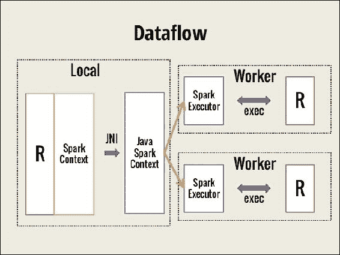

# 第七章：使用 SparkR 扩展 Spark

统计学家和数据科学家一直在使用 R 来解决几乎所有领域的挑战性问题，从生物信息学到选举活动。他们偏爱 R 是因为它强大的可视化功能、强大的社区以及丰富的统计学和机器学习包生态系统。全球许多学术机构都使用 R 语言教授数据科学和统计学。

R 最初是在 1990 年代中期，由统计学家为统计学家创建的，目的是提供一种更好、更用户友好的方式来进行数据分析。R 最初用于学术和研究领域。随着企业越来越意识到数据科学在业务增长中的作用，使用 R 进行数据分析的企业数据分析师数量也开始增长。经过二十年的发展，R 语言的用户基础已被认为超过两百万。

这一切成功背后的驱动力之一是 R 的设计目的是让分析师的工作更轻松，而不是让计算机的工作更轻松。R 本质上是单线程的，它只能处理完全适合单台机器内存的数据集。然而，现如今，R 用户正在处理越来越大的数据集。将现代分布式处理能力无缝集成到这个已经建立的 R 语言下，使数据科学家能够兼得二者的优势。这样，他们可以跟上日益增长的业务需求，同时继续享受自己喜爱的 R 语言的灵活性。

本章介绍了 SparkR，这是一个为 R 程序员设计的 Spark API，使他们能够利用 Spark 的强大功能，而无需学习新的语言。由于假设读者已具备 R、R Studio 及数据分析技能，本章不再介绍 R 基础知识。提供了一个非常简短的 Spark 计算引擎概述作为快速回顾。读者应阅读本书的前三章，以深入理解 Spark 编程模型和 DataFrame。这个知识非常重要，因为开发人员需要理解他编写的代码中哪些部分是在本地 R 环境中执行的，哪些部分是由 Spark 计算引擎处理的。本章涉及的主题如下：

+   SparkR 基础知识

+   R 与 Spark 的优势及其局限性

+   使用 SparkR 编程

+   SparkR DataFrame

+   机器学习

# SparkR 基础知识

R 是一种用于统计计算和图形的语言和环境。SparkR 是一个 R 包，它提供了一个轻量级的前端，使得可以从 R 访问 Apache Spark。SparkR 的目标是将 R 环境提供的灵活性和易用性与 Spark 计算引擎提供的可扩展性和容错性相结合。在讨论 SparkR 如何实现其目标之前，我们先回顾一下 Spark 的架构。

Apache Spark 是一个快速的、通用的、容错的框架，用于对大规模分布式数据集进行交互式和迭代计算。它支持多种数据源和存储层。它提供了统一的数据访问，能够结合不同的数据格式、流数据，并使用高级可组合操作符定义复杂的操作。你可以使用 Scala、Python 或 R shell（或者 Java，无需 shell）交互式地开发应用。你可以在家用桌面上部署它，或者将它部署在大规模集群中，处理数 PB 的数据。

### 注意

SparkR 起源于 AMPLab ([`amplab.cs.berkeley.edu/`](https://amplab.cs.berkeley.edu/))，旨在探索将 R 的可用性与 Spark 的可扩展性相结合的不同技术。它作为 Apache Spark 1.4 的一个 alpha 组件发布，该版本于 2015 年 6 月发布。Spark 1.5 版本提高了 R 的可用性，并引入了带有**广义线性模型**（**GLMs**）的 MLlib 机器学习包。2016 年 1 月发布的 Spark 1.6 版本增加了一些新特性，如模型摘要和特征交互。2016 年 7 月发布的 Spark 2.0 版本带来了多个重要特性，如 UDF、改进的模型覆盖、DataFrames 窗口函数 API 等等。

## 从 R 环境访问 SparkR

你可以从 R shell 或 R Studio 启动 SparkR。SparkR 的入口点是 SparkSession 对象，它代表了与 Spark 集群的连接。R 所运行的节点成为驱动程序。由 R 程序创建的任何对象都驻留在此驱动程序上。通过 SparkSession 创建的任何对象都在集群中的工作节点上创建。下图展示了 R 与在集群上运行的 Spark 交互的运行时视图。请注意，R 解释器存在于集群中的每个工作节点上。下图没有显示集群管理器，也没有显示存储层。你可以使用任何集群管理器（例如 Yarn 或 Mesos）和任何存储选项，如 HDFS、Cassandra 或 Amazon S3：



来源：http://www.slideshare.net/Hadoop_Summit/w-145p210-avenkataraman.

SparkSession 对象通过传递应用名称、内存、核心数和要连接的集群管理器等信息来创建。所有与 Spark 引擎的交互都通过这个 SparkSession 对象发起。如果使用 SparkR shell，则会自动为你创建一个 SparkSession 对象；否则，你需要显式创建它。这个对象取代了 Spark 1.x 版本中的 SparkContext 和 SQLContext 对象。为了向后兼容，这些对象仍然存在。即使前面的图展示的是 SparkContext，你也应当将其视为 Spark 2.0 后的 SparkSession。

现在我们已经理解了如何从 R 环境访问 Spark，接下来让我们来看看 Spark 引擎提供的核心数据抽象。

## RDD 和 DataFrame

Spark 引擎的核心是其主要的数据抽象，称为**弹性分布式数据集（Resilient Distributed Dataset，简称 RDD）**。一个 RDD 由一个或多个数据源组成，并由用户定义为一系列在一个或多个稳定（具体的）数据源上的转换（也叫血统）。每个 RDD 或 RDD 分区都知道如何使用血统图在失败时重新创建自己，从而提供容错功能。RDD 是不可变的数据结构，这意味着它可以在不需要同步开销的情况下在线程间共享，因此适合并行化。对 RDD 的操作要么是转换，要么是动作。转换是血统中的单独步骤。换句话说，转换是创建 RDD 的操作，因为每个转换都是从一个稳定的数据源获取数据或转换一个不可变的 RDD，进而创建另一个 RDD。转换只是声明；它们在对 RDD 执行*动作*操作之前不会被评估。动作是利用 RDD 的操作。

Spark 会根据当前的操作优化 RDD 的计算。例如，如果操作是读取第一行，则只计算一个分区，跳过其余部分。当内存不足时，它会自动执行内存计算，并优雅地退化（当内存不足时，溢出到磁盘），并将处理分布到所有核心。你可以缓存一个 RDD，如果它在你的程序逻辑中频繁被访问，从而避免重新计算的开销。

R 语言提供了一种二维数据结构，叫做*数据框（DataFrame）*，使得数据操作变得方便。Apache Spark 有自己的 DataFrame，这些 DataFrame 灵感来自于 R 和 Python（通过 Pandas）中的 DataFrame。Spark 的 DataFrame 是建立在 RDD 数据结构抽象之上的一种专用数据结构。它提供了分布式的 DataFrame 实现，从开发者的角度看，它与 R DataFrame 非常相似，同时还能支持非常大的数据集。Spark 数据集 API 为 DataFrame 增加了结构，而这一结构为底层优化提供了信息。

## 开始使用

现在我们已经理解了底层数据结构和运行时视图，是时候运行一些命令了。在这一部分，我们假设你已经成功安装了 R 和 Spark，并将其添加到了路径中。我们还假设已经设置了 `SPARK_HOME` 环境变量。接下来我们看看如何通过 R shell 或 R Studio 访问 SparkR：

```py
> R  // Start R shell  
> Sys.getenv("SPARK_HOME") //Confirm SPARK_HOME is set 
  <Your SPARK_HOME path> 
> library(SparkR, lib.loc = 
    c(file.path(Sys.getenv("SPARK_HOME"), "R", "lib"))) 

Attaching package: 'SparkR' 
The following objects are masked from 'package:stats': 

    cov, filter, lag, na.omit, predict, sd, var, window 

The following objects are masked from 'package:base': 

    as.data.frame, colnames, colnames<-, drop, endsWith, intersect, 
    rank, rbind, sample, startsWith, subset, summary, transform, union 
> 

> //Try help(package=SparkR) if you want to more information 
//initialize SparkSession object 
>  sparkR.session()  
Java ref type org.apache.spark.sql.SparkSession id 1  
> 
Alternatively, you may launch sparkR shell which comes with predefined SparkSession. 

> bin/sparkR  // Start SparkR shell  
>      // For simplicity sake, no Log messages are shown here 
> //Try help(package=SparkR) if you want to more information 
> 

```

这就是你在 R 环境中访问 Spark DataFrame 的所有操作。

# 优势与限制

R 语言长期以来一直是数据科学家的通用语言。其易于理解的数据框架抽象、富有表现力的 API 和充满活力的包生态系统正是分析师所需要的。主要的挑战在于可扩展性。SparkR 通过提供分布式内存中的数据框架，同时保持在 R 生态系统内，弥补了这一缺陷。这样的共生关系使得用户能够获得以下好处：

+   分析师无需学习新语言

+   SparkR 的 API 与 R 的 API 类似

+   你可以通过 R Studio 访问 SparkR，并且可以使用自动补全功能。

+   执行对非常大数据集的交互式、探索性分析不再受到内存限制或长时间等待的困扰。

+   从不同类型的数据源访问数据变得更加容易。大多数之前必须显式操作的任务，现在已经转变为声明式任务。请参阅[第四章](http://Chapter%204)，*统一数据访问*，了解更多信息。

+   你可以自由混合使用如 Spark 函数、SQL 和仍未在 Spark 中可用的 R 库等 dplyr。

尽管结合两者优点带来了许多令人兴奋的优势，但这种结合仍然存在一些局限性。这些局限性可能不会影响每个用例，但我们还是需要意识到它们：

+   R 的固有动态特性限制了 Catalyst 优化器能够获取的信息。与静态类型语言（如 Scala）相比，我们可能无法充分利用像谓词下推等优化。

+   SparkR 不支持 Scala API 等其他 API 中已经提供的所有机器学习算法。

总结来说，使用 Spark 进行数据预处理，使用 R 进行分析和可视化似乎是未来的最佳方案。

# 使用 SparkR 编程

到目前为止，我们已经理解了 SparkR 的运行时模型以及提供容错性和可扩展性的基本数据抽象。我们也了解了如何从 R shell 或 R Studio 访问 Spark API。现在是时候尝试一些基本且熟悉的操作了：

```py
> 
> //Open the shell 
> 
> //Try help(package=SparkR) if you want to more information 
> 
> df <- createDataFrame(iris) //Create a Spark DataFrame 
> df    //Check the type. Notice the column renaming using underscore 
SparkDataFrame[Sepal_Length:double, Sepal_Width:double, Petal_Length:double, Petal_Width:double, Species:string] 
> 
> showDF(df,4) //Print the contents of the Spark DataFrame 
+------------+-----------+------------+-----------+-------+ 
|Sepal_Length|Sepal_Width|Petal_Length|Petal_Width|Species| 
+------------+-----------+------------+-----------+-------+ 
|         5.1|        3.5|         1.4|        0.2| setosa| 
|         4.9|        3.0|         1.4|        0.2| setosa| 
|         4.7|        3.2|         1.3|        0.2| setosa| 
|         4.6|        3.1|         1.5|        0.2| setosa| 
+------------+-----------+------------+-----------+-------+ 
>  
> head(df,2)  //Returns an R data.frame. Default 6 rows 
  Sepal_Length Sepal_Width Petal_Length Petal_Width Species 
1          5.1         3.5          1.4         0.2  setosa 
2          4.9         3.0          1.4         0.2  setosa 
> //You can use take(df,2) to get the same results 
//Check the dimensions 
> nrow(df) [1] 150 > ncol(df) [1] 5 

```

这些操作看起来与 R DataFrame 函数非常相似，因为 Spark DataFrame 的模型是基于 R DataFrame 和 Python（Pandas）DataFrame 的。但这种相似性可能会造成混淆，如果不小心，你可能会误以为负载会被分配，从而在 R `data.frame` 上运行计算密集型函数，导致本地计算机崩溃。例如，intersect 函数在两个包中的签名相同。你需要注意对象是否是 `SparkDataFrame`（Spark DataFrame）类，还是 `data.frame`（R DataFrame）类。你还需要尽量减少本地 R `data.frame` 对象与 Spark DataFrame 对象之间的反复转换。让我们通过尝试一些例子来感受这种区别：

```py
> 
> //Open the SparkR shell 
> df <- createDataFrame(iris) //Create a Spark DataFrame 
> class(df) [1] "SparkDataFrame" attr(,"package") [1] "SparkR" 
> df2 <- head(df,2) //Create an R data frame 
> class(df2) 
 [1] "data.frame" 
> //Now try running some R command on both data frames 
> unique(df2$Species)   //Works fine as expected [1] "setosa" > unique(df$Species)    //Should fail Error in unique.default(df$Species) : unique() applies only to vectors > class(df$Species)   //Each column is a Spark's Column class [1] "Column" attr(,"package") [1] "SparkR" > class(df2$Species) [1] "character" 

```

## 函数名称遮蔽

现在我们已经尝试了一些基本操作，接下来让我们稍微跑题一下。我们必须了解当加载的库与基础包或已加载的其他包存在函数名重叠时会发生什么。这有时被称为函数名重叠、函数屏蔽或命名冲突。你可能注意到当加载 SparkR 包时，消息中提到了被屏蔽的对象。这对于任何加载到 R 环境中的包都是常见的，并不仅仅是 SparkR 特有的。如果 R 环境中已经存在一个与正在加载的包中函数同名的函数，那么随后的对该函数的调用将表现出最新加载的包中函数的行为。如果你希望访问以前的函数而不是 `SparkR` 函数，你需要显式地在该函数名前加上包名，如下所示：

```py
//First try in R environment, without loading sparkR 
//Try sampling from a column in an R data.frame 
>sample(iris$Sepal.Length,6,FALSE) //Returns any n elements [1] 5.1 4.9 4.7 4.6 5.0 5.4 >sample(head(iris),3,FALSE) //Returns any 3 columns 
//Try sampling from an R data.frame 
//The Boolean argument is for with_replacement 
> sample(head 
> head(sample(iris,3,TRUE)) //Returns any 3 columns
  Species Species.1 Petal.Width
1  setosa    setosa         0.2 
2  setosa    setosa         0.2 
3  setosa    setosa         0.2 
4  setosa    setosa         0.2 
5  setosa    setosa         0.2 
6  setosa    setosa         0.4 

//Load sparkR, initialize sparkSession and then execute this  
> df <- createDataFrame(iris) //Create a Spark DataFrame 
> sample_df <- sample(df,TRUE,0.3) //Different signature 
> dim(sample_df)  //Different behavior [1] 44  5 
> //Returned 30% of the original data frame and all columns 
> //Try with base prefix 
> head(base::sample(iris),3,FALSE)  //Call base package's sample
  Species Petal.Width Petal.Length 
1  setosa         0.2          1.4
2  setosa         0.2          1.4 
3  setosa         0.2          1.3 
4  setosa         0.2          1.5 
5  setosa         0.2          1.4 
6  setosa         0.4          1.7 

```

## 子集数据

对 R 数据框的子集操作非常灵活，SparkR 尝试保留这些操作，并提供相同或类似的等效功能。我们已经在前面的示例中看到了一些操作，但本节将这些操作按顺序呈现：

```py
//Subsetting data examples 
> b1 <- createDataFrame(beaver1) 
//Get one column 
> b1$temp 
Column temp    //Column class and not a vector 
> //Select some columns. You may use positions too 
> select(b1, c("day","temp")) 
SparkDataFrame[day:double, temp:double] 
>//Row subset based on conditions 
> head(subset(b1,b1$temp>37,select= c(2,3))) 
  time  temp 
1 1730 37.07 
2 1740 37.05 
3 1940 37.01 
4 1950 37.10 
5 2000 37.09 
6 2010 37.02 
> //Multiple conditions with AND and OR 
> head(subset(b1, between(b1$temp,c(36.0,37.0)) |  
        b1$time %in% 900 & b1$activ == 1,c(2:4)),2) 
 time  temp activ 
1  840 36.33     0 
2  850 36.34     0 

```

### 提示

在撰写本书时（Apache Spark 2.o 发布版），基于行索引的切片操作尚不可用。你将无法使用 `df[n,]` 或 `df[m:n,]` 语法获取特定的行或行范围。

```py
//For example, try on a normal R data.frame 
> beaver1[2:4,] 
  day time  temp activ 
2 346  850 36.34     0 
3 346  900 36.35     0 
4 346  910 36.42     0 
//Now, try on Spark Data frame 
> b1[2:4,] //Throws error 
Expressions other than filtering predicates are not supported in the first parameter of extract operator [ or subset() method. 
> 

```

## 列函数

你应该已经注意到在子集数据部分有列函数 `between`。这些函数作用于 `Column` 类。如其名称所示，这些函数一次处理单个列，通常用于子集化 DataFrame。还有其他一些常用的列函数，用于排序、类型转换和格式化等常见操作。除了处理列中的值外，你还可以向 DataFrame 添加列或删除一个或多个列。可以使用负的列下标来省略列，类似于 R。以下示例展示了在子集操作中使用 `Column` 类函数，随后进行添加和删除列的操作：

```py
> //subset using Column operation using airquality dataset as df 
> head(subset(df,isNull(df$Ozone)),2) 
  Ozone Solar_R Wind Temp Month Day 
1    NA      NA 14.3   56     5   5 
2    NA     194  8.6   69     5  10 
> 
> //Add column and drop column examples 
> b1 <- createDataFrame(beaver1) 

//Add new column 
> b1$inRetreat <- otherwise(when(b1$activ == 0,"No"),"Yes") 
 head(b1,2) 
  day time  temp activ inRetreat 
1 346  840 36.33     0        No 
2 346  850 36.34     0        No 
> 
//Drop a column.  
> b1$day <- NULL 
> b1  // Example assumes b1$inRetreat does not exist 
SparkDataFrame[time:double, temp:double, activ:double] 
> //Drop columns using negative subscripts 
> b2 <- b1[,-c(1,4)]  > head(b2) 
   time  temp 
1  840 36.33 
2  850 36.34 
3  900 36.35 
4  910 36.42 
5  920 36.55 
6  930 36.69 
>  

```

## 分组数据

可以使用类似 SQL 的 `group_by` 函数对 DataFrame 数据进行子分组。有多种方式可以执行这样的操作。本节介绍了一个稍微复杂的示例。此外，我们使用了由 `magrittr` 库提供的 `%>%`，即前向管道操作符，它提供了一个链式命令的机制：

```py
> //GroupedData example using iris data as df 
> //Open SparkR shell and create df using iris dataset  
> groupBy(df,"Species") 
GroupedData    //Returns GroupedData object 
> library(magrittr)  //Load the required library 
//Get group wise average sepal length 
//Report results sorted by species name 
>df2 <- df %>% groupBy("Species") %>%  
          avg("Sepal_Length") %>%  
          withColumnRenamed("avg(Sepal_Length)","avg_sepal_len") %>% 
          orderBy ("Species") 
//Format the computed double column 
df2$avg_sepal_len <- format_number(df2$avg_sepal_len,2) 
showDF(df2) 
+----------+-------------+ 
|   Species|avg_sepal_len| 
+----------+-------------+ 
|    setosa|         5.01| 
|versicolor|         5.94| 
| virginica|         6.59| 
+----------+-------------+ 

```

你可以继续使用前向管道操作符来链式调用操作。仔细观察代码中的列重命名部分。列名参数是先前操作的输出，这些操作在此操作开始之前已经完成，因此你可以放心假设 `avg(sepal_len)` 列已经存在。`format_number` 按预期工作，这又是一个便捷的 `Column` 操作。

下一节有另一个类似的示例，使用 `GroupedData` 及其等效的 `dplyr` 实现。

# SparkR DataFrame

在本节中，我们尝试了一些有用的、常用的操作。首先，我们尝试了传统的 R/`dplyr` 操作，然后展示了使用 SparkR API 的等效操作：

```py
> //Open the R shell and NOT SparkR shell  
> library(dplyr,warn.conflicts=FALSE)  //Load dplyr first 
//Perform a common, useful operation  
> iris %>%               
+   group_by(Species) %>% +   summarise(avg_length = mean(Sepal.Length),  
+             avg_width = mean(Sepal.Width)) %>% +   arrange(desc(avg_length)) 
Source: local data frame [3 x 3] 
     Species avg_length avg_width 
      (fctr)      (dbl)     (dbl) 
1  virginica      6.588     2.974 
2 versicolor      5.936     2.770 
3     setosa      5.006     3.428 

//Remove from R environment 
> detach("package:dplyr",unload=TRUE) 

```

这个操作与 SQL 中的 `GROUP BY` 很相似，后面跟着排序。它在 SparkR 中的等效实现也与 `dplyr` 示例非常相似。请看下面的示例。注意方法名称，并将它们的位置与前面的 `dplyr` 示例进行比较：

```py
> //Open SparkR shell and create df using iris dataset  
> collect(arrange(summarize(groupBy(df,df$Species),  +     avg_sepal_length = avg(df$Sepal_Length), +     avg_sepal_width = avg(df$Sepal_Width)), +     "avg_sepal_length", decreasing = TRUE))  
     Species avg_sepal_length avg_sepal_width 
1     setosa            5.006           3.428 
2 versicolor            5.936           2.770 
3  virginica            6.588           2.974 

```

SparkR 旨在尽可能接近现有的 R API。因此，方法名称与 `dplyr` 方法非常相似。例如，查看这个示例，其中使用了 `groupBy`，而 `dplyr` 使用的是 `group_by`。SparkR 支持冗余的函数名称。例如，它同时提供 `group_by` 和 `groupBy`，以适应来自不同编程环境的开发者。`dplyr` 和 SparkR 中的方法名称再次与 SQL 关键字 `GROUP BY` 非常接近。但这些方法调用的顺序并不相同。示例还展示了一个额外的步骤：使用 `collect` 将 Spark DataFrame 转换为 R 的 `data.frame`。这些方法的顺序是由内而外的，意味着首先对数据进行分组，然后进行汇总，最后进行排序。这是可以理解的，因为在 SparkR 中，最内层方法中创建的 DataFrame 成为其直接前驱方法的参数，以此类推。

## SQL 操作

如果你对前面的示例中的语法不太满意，你可以尝试如下编写 SQL 字符串，它和前面的操作完全相同，但使用了老式的 SQL 语法：

```py
> //Register the Spark DataFrame as a table/View 
> createOrReplaceTempView(df,"iris_vw")  
//Look at the table structure and some rows
> collect(sql(sqlContext, "SELECT * FROM iris_tbl LIMIT 5"))
    Sepal_Length Sepal_Width Petal_Length Petal_Width Species 
1          5.1         3.5          1.4         0.2  setosa 
2          4.9         3.0          1.4         0.2  setosa 
3          4.7         3.2          1.3         0.2  setosa 
4          4.6         3.1          1.5         0.2  setosa 
5          5.0         3.6          1.4         0.2  setosa 
> //Try out the above example using SQL syntax 
> collect(sql(sqlContext, "SELECT Species,       avg(Sepal_Length) avg_sepal_length,      avg(Sepal_Width) avg_sepal_width       FROM iris_tbl        GROUP BY Species       ORDER BY avg_sepal_length desc")) 

  Species avg_sepal_length avg_sepal_width 

1  virginica            6.588           2.974 
2 versicolor            5.936           2.770 
3     setosa            5.006           3.428 

```

前面的示例看起来是实现当前操作最自然的方式，特别是如果你习惯从 RDBMS 表中提取数据的话。但我们是怎么做的呢？第一条语句告诉 Spark 注册一个临时表（或者，顾名思义，它是一个视图，是表的逻辑抽象）。这与数据库表并不完全相同。它是临时的，因为它会在 SparkSession 对象被销毁时被销毁。你并没有显式地将数据写入任何 RDBMS 数据存储（如果要这样做，你必须使用 `SaveAsTable`）。但是，一旦你将 Spark DataFrame 注册为临时表，你就可以自由使用 SQL 语法对该 DataFrame 进行操作。接下来的语句是一个基本的 `SELECT` 语句，显示了列名，后面跟着 `LIMIT` 关键字指定的五行数据。接下来的 SQL 语句创建了一个包含 Species 列的 Spark DataFrame，后面跟着两个平均值列，并按照平均花萼长度排序。这个 DataFrame 又通过 `collect` 被收集为 R 的 `data.frame`。最终结果与前面的示例完全相同。你可以自由选择使用任何一种语法。欲了解更多信息和示例，请查看[第四章](http://chapter%204)，*统一数据访问*。

## 集合操作

SparkR 中提供了常用的集合操作，例如`union`、`intersection`和`minus`，这些操作开箱即用。事实上，当加载 SparkR 时，警告信息显示`intersect`是被屏蔽的函数之一。以下示例基于`beaver`数据集：

```py
> //Create b1 and b2 DataFrames using beaver1 and beaver2 datasets 
> b1 <- createDataFrame(beaver1) 
> b2 <- createDataFrame(beaver2) 
//Get individual and total counts 
> > c(nrow(b1), nrow(b2), nrow(b1) + nrow(b2)) 
[1] 114 100 214 
//Try adding both data frames using union operation 
> nrow(unionAll(b1,b2)) 
[1] 214     //Sum of two datsets 
> //intersect example 
//Remove the first column (day) and find intersection 
showDF(intersect(b1[,-c(1)],b2[,-c(1)])) 

+------+-----+-----+ 
|  time| temp|activ| 
+------+-----+-----+ 
|1100.0|36.89|  0.0| 
+------+-----+-----+ 
> //except (minus or A-B) is covered in machine learning examples   

```

## 合并 DataFrames

下一个示例演示了如何使用`merge`命令连接两个 DataFrame。示例的第一部分展示了 R 实现，接下来的部分展示了 SparkR 实现：

```py
> //Example illustrating data frames merging using R (Not SparkR) 
> //Create two data frames with a matching column 
//Products df with two rows and two columns 
> products_df <- data.frame(rbind(c(101,"Product 1"), 
                    c(102,"Product 2"))) 
> names(products_df) <- c("Prod_Id","Product") 
> products_df 
 Prod_Id   Product 
1     101 Product 1 
2     102 Product 2 

//Sales df with sales for each product and month 24x3 
> sales_df <- data.frame(cbind(rep(101:102,each=12), month.abb, 
                    sample(1:10,24,replace=T)*10)) 
> names(sales_df) <- c("Prod_Id","Month","Sales") 

//Look at first 2 and last 2 rows in the sales_df 
> sales_df[c(1,2,23,24),] 
   Prod_Id Month Sales 
1      101   Jan    60 
2      101   Feb    40 
23     102   Nov    20 
24     102   Dec   100 

> //merge the data frames and examine the data 
> total_df <- merge(products_df,sales_df) 
//Look at the column names 
> colnames(total_df) 
> [1] "Prod_Id" "Product" "Month"   "Sales" 

//Look at first 2 and last 2 rows in the total_df 
> total_df[c(1,2,23,24),]     
   Prod_Id   Product Month Sales 
1      101 Product 1   Jan    10 
2      101 Product 1   Feb    20 
23     102 Product 2   Nov    60 
24     102 Product 2   Dec    10 

```

上述代码完全依赖于 R 的基础包。为了简便起见，我们在两个 DataFrame 中使用了相同的连接列名称。接下来的代码演示了使用 SparkR 的相同示例。它看起来与前面的代码相似，因此需要仔细观察其中的差异：

```py
> //Example illustrating data frames merging using SparkR 
> //Create an R data frame first and then pass it on to Spark 
> //Watch out the base prefix for masked rbind function 
> products_df <- createDataFrame(data.frame( 
    base::rbind(c(101,"Product 1"), 
    c(102,"Product 2")))) 
> names(products_df) <- c("Prod_Id","Product") 
>showDF(products_df) 
+-------+---------+ 
|Prod_Id|  Product| 
+-------+---------+ 
|    101|Product 1| 
|    102|Product 2| 
+-------+---------+ 
> //Create Sales data frame 
> //Notice the as.data.frame similar to other R functions 
> //No cbind in SparkR so no need for base:: prefix 
> sales_df <- as.DataFrame(data.frame(cbind( 
             "Prod_Id" = rep(101:102,each=12), 
"Month" = month.abb, 
"Sales" = base::sample(1:10,24,replace=T)*10))) 
> //Check sales dataframe dimensions and some random rows  
> dim(sales_df) 
[1] 24  3 
> collect(sample(sales_df,FALSE,0.20)) 
  Prod_Id Month Sales 
1     101   Sep    50 
2     101   Nov    80 
3     102   Jan    90 
4     102   Jul   100 
5     102   Nov    20 
6     102   Dec    50 
> //Merge the data frames. The following merge is from SparkR library 
> total_df <- merge(products_df,sales_df) 
// You may try join function for the same purpose 
//Look at the columns in total_df 
> total_df 
SparkDataFrame[Prod_Id_x:string, Product:string, Prod_Id_y:string, Month:string, Sales:string] 
//Drop duplicate column 
> total_df$Prod_Id_y <- NULL    
> head(total_df) 
  Prod_Id_x   Product Month Sales 
1       101 Product 1   Jan    40 
2       101 Product 1   Feb    10 
3       101 Product 1   Mar    90 
4       101 Product 1   Apr    10 
5       101 Product 1   May    50 
6       101 Product 1   Jun    70 
> //Note: As of Spark 2.0 version, SparkR does not support 
    row sub-setting  

```

你可能想尝试不同类型的连接，如左外连接和右外连接，或使用不同的列名称，以更好地理解这个函数。

# 机器学习

SparkR 提供了对现有 MLLib 函数的封装。R 公式被实现为 MLLib 特征转换器。转换器是 ML 管道（`spark.ml`）的一个阶段，它接受 DataFrame 作为输入，并产生另一个 DataFrame 作为输出，通常包含一些附加列。特征转换器是一种转换器，将输入列转换为特征向量，这些特征向量会附加到源 DataFrame 上。例如，在线性回归中，字符串输入列被独热编码，数值被转换为双精度。一个标签列将会被附加（如果在数据框中尚未存在的话），作为响应变量的副本。

本节我们提供了朴素贝叶斯和高斯 GLM 模型的示例代码。我们不会详细解释模型本身或它们所产生的总结，而是直接演示如何使用 SparkR 来实现。

## 朴素贝叶斯模型

朴素贝叶斯模型是一个直观简单的模型，适用于分类数据。我们将使用朴素贝叶斯模型训练一个样本数据集。我们不会解释模型的工作原理，而是直接使用 SparkR 来训练模型。如果你想了解更多信息，请参考第六章，*机器学习*。

本示例使用一个包含二十名学生的平均成绩和出勤数据的数据集。实际上，这个数据集已经在[第六章](http://Chapter%206)中介绍过，*机器学习*，用于训练集成方法。然而，让我们重新回顾一下它的内容。

学生们根据一组明确定义的规则被授予`Pass`或`Fail`。两个学生，ID 为`1009`和`1020`，尽管本应不及格，但被授予了`Pass`。即使我们没有为模型提供实际的规则，我们仍期望模型预测这两名学生的结果为`Fail`。以下是`Pass` / `Fail`标准：

+   Marks < 40 => Fail

+   出勤不佳 => Fail

+   成绩高于 40 且出勤为全勤 => Pass

+   成绩 > 60 且出勤至少足够 => 通过。以下是训练朴素贝叶斯模型的示例：

```py
//Example to train Naïve Bayes model 

//Read file 
> myFile <- read.csv("../work/StudentsPassFail.csv") //R data.frame 
> df <- createDataFrame(myFile) //sparkDataFrame 
//Look at the data 
> showDF(df,4) 
+---------+---------+----------+------+ 
|StudentId|Avg_Marks|Attendance|Result| 
+---------+---------+----------+------+ 
|     1001|     48.0|      Full|  Pass| 
|     1002|     21.0|    Enough|  Fail| 
|     1003|     24.0|    Enough|  Fail| 
|     1004|      4.0|      Poor|  Fail| 
+---------+---------+----------+------+ 

//Make three buckets out of Avg_marks 
// A >60; 40 < B < 60; C > 60 
> df$marks_bkt <- otherwise(when(df$Avg_marks < 40, "C"), 
                           when(df$Avg_marks > 60, "A")) 
> df$marks_bkt <- otherwise(when(df$Avg_marks < 40, "C"), 
                           when(df$Avg_marks > 60, "A")) 
> df <- fillna(df,"B",cols="marks_bkt") 
//Split train and test 
> trainDF <- sample(df,TRUE,0.7) 
> testDF <- except(df, trainDF) 

//Build model by supplying RFormula, training data 
> model <- spark.naiveBayes(Result ~ Attendance + marks_bkt, data = trainDF) 
> summary(model) 
$apriori 
          Fail      Pass 
[1,] 0.6956522 0.3043478 

$tables 
     Attendance_Poor Attendance_Full marks_bkt_C marks_bkt_B 
Fail 0.5882353       0.1764706       0.5882353   0.2941176   
Pass 0.125           0.875           0.125       0.625       

//Run predictions on test data 
> predictions <- predict(model, newData= testDF) 
//Examine results 
> showDF(predictions[predictions$Result != predictions$prediction, 
     c("StudentId","Attendance","Avg_Marks","marks_bkt", "Result","prediction")]) 
+---------+----------+---------+---------+------+----------+                     
|StudentId|Attendance|Avg_Marks|marks_bkt|Result|prediction| 
+---------+----------+---------+---------+------+----------+ 
|     1010|      Full|     19.0|        C|  Fail|      Pass| 
|     1019|    Enough|     45.0|        B|  Fail|      Pass| 
|     1014|      Full|     12.0|        C|  Fail|      Pass| 
+---------+----------+---------+---------+------+----------+ 
//Note that the predictions are not exactly what we anticipate but models are usually not 100% accurate 

```

## 高斯 GLM 模型

在这个示例中，我们尝试基于臭氧、太阳辐射和风速的值预测温度：

```py
> //Example illustrating Gaussian GLM model using SparkR 
> a <- createDataFrame(airquality) 
//Remove rows with missing values 
> b <- na.omit(a) 
> //Inspect the dropped rows with missing values 
> head(except(a,b),2)    //MINUS set operation 
  Ozone Solar_R Wind Temp Month Day 
1    NA     186  9.2   84     6   4 
2    NA     291 14.9   91     7  14 

> //Prepare train data and test data 
traindata <- sample(b,FALSE,0.8) //Not base::sample 
testdata <- except(b,traindata) 

> //Build model 
> model <- glm(Temp ~ Ozone + Solar_R + Wind,  
          data = traindata, family = "gaussian") 
> // Get predictions 
> predictions <- predict(model, newData = testdata) 
> head(predictions[,c(predictions$Temp, predictions$prediction)], 
                 5) 
  Temp prediction 
1   90   81.84338 
2   79   80.99255 
3   88   85.25601 
4   87   76.99957 
5   76   71.75683 

```

# 总结

截至目前，SparkR 尚未支持 Spark 中的所有算法，但正在积极开发中以弥补这一差距。Spark 2.0 版本已经改善了算法覆盖，包括朴素贝叶斯、k-均值聚类和生存回归等。请查看最新文档了解支持的算法。更多工作正在进行，旨在推出 SparkR 的 CRAN 版本，并与 R 包和 Spark 包更好地集成，同时提供更好的 RFormula 支持。

# 参考文献

+   *SparkR：过去、现在与未来*，作者：*Shivaram Venkataraman*：[`shivaram.org/talks/sparkr-summit-2015.pdf`](http://shivaram.org/talks/sparkr-summit-2015.pdf)

+   *通过 Spark 和 R 实现探索性数据科学*，作者：*Shivaram Venkataraman* 和 *Hossein Falaki*：[`www.slideshare.net/databricks/enabling-exploratory-data-science-with-spark-and-r`](http://www.slideshare.net/databricks/enabling-exploratory-data-science-with-spark-and-r)

+   *SparkR：使用 Spark 扩展 R 程序*，作者：*Shivaram Venkataraman* 等：[`shivaram.org/publications/sparkr-sigmod.pdf`](http://shivaram.org/publications/sparkr-sigmod.pdf)

+   *SparkR 中的最新进展：面向高级分析*，作者：*Xiangrui Meng*：[`files.meetup.com/4439192/Recent%20Development%20in%20SparkR%20for%20Advanced%20Analytics.pdf`](http://files.meetup.com/4439192/Recent%20Development%20in%20SparkR%20for%20Advanced%20Analytics.pdf)

+   要理解 RFormula，请尝试以下链接：

    +   [`stat.ethz.ch/R-manual/R-devel/library/stats/html/formula.html`](https://stat.ethz.ch/R-manual/R-devel/library/stats/html/formula.html)

    +   [`spark.apache.org/docs/latest/ml-features.html#rformula`](http://spark.apache.org/docs/latest/ml-features.html#rformula)
