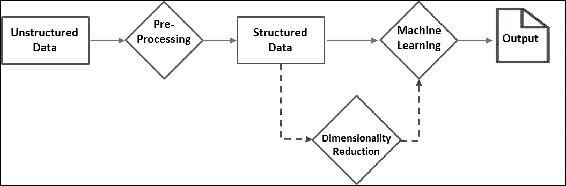

# 第八章：分析非结构化数据

在大数据时代，非结构化数据的激增让人不堪重负。存在多种方法（如数据挖掘、**自然语言处理**（**NLP**）、信息检索等）来分析非结构化数据。由于各行各业中非结构化数据的快速增长，具备可扩展性的解决方案已经成为当务之急。Apache Spark 配备了现成的文本分析算法，同时也支持自定义开发默认不提供的算法。

在上一章中，我们展示了如何通过 SparkR（一个为 R 程序员提供的 Spark R API）利用 Spark 的强大功能，而无需学习一门新语言。在这一章中，我们将进入一个全新的维度，探索利用 Spark 从非结构化数据中提取信息的算法和技术。

作为本章的前提条件，具备 Python 或 Scala 编程的基本知识，以及对文本分析和机器学习的整体理解将是非常有帮助的。不过，我们已经通过合适的实践示例覆盖了一些理论基础，使得这些内容更易于理解和实施。本章涵盖的主题包括：

+   非结构化数据的来源

+   处理非结构化数据

    +   计数向量化

    +   TF-IDF

    +   停用词去除

    +   标准化/缩放

    +   Word2Vec

    +   n-gram 建模

+   文本分类

    +   朴素贝叶斯分类器

+   文本聚类

    +   K 均值算法

+   降维

    +   奇异值分解

    +   主成分分析

+   小结

# 非结构化数据的来源

数据分析自八十年代和九十年代的电子表格和 BI 工具以来，已经取得了长足进展。计算能力的巨大提升、复杂的算法以及开源文化推动了数据分析和其他领域的前所未有的增长。这些技术进步为新的机遇和挑战铺平了道路。企业开始着眼于从以往无法处理的数据源（如内部备忘录、电子邮件、客户满意度调查等）中生成洞察。如今，数据分析不仅仅局限于传统的行列数据，还涵盖了这种非结构化的、通常以文本为基础的数据。存储在关系数据库管理系统（RDBMS）中的高度结构化数据与完全非结构化的纯文本之间，我们有半结构化数据源，如 NoSQL 数据存储、XML 或 JSON 文档，以及图形或网络数据源。据当前估计，非结构化数据约占企业数据的 80%，且正在迅速增长。卫星图像、大气数据、社交网络、博客及其他网页、病历和医生记录、公司内部通讯等——这些只是非结构化数据来源的一部分。

我们已经看到了成功的数据产品，它们将非结构化数据与结构化数据相结合。一些公司利用社交网络的力量，为客户提供可操作的见解。像**情感分析**和**多媒体分析**这样的新领域正在涌现，以从非结构化数据中提取见解。然而，分析非结构化数据仍然是一项艰巨的任务。例如，现代的文本分析工具和技术无法识别讽刺。然而，潜在的好处无疑大于这些局限性。

# 处理非结构化数据

非结构化数据不适合大多数编程任务。必须根据不同情况以多种方式处理它，才能作为任何机器学习算法的输入或进行可视化分析。大致而言，非结构化数据分析可以视为一系列步骤，如下图所示：



数据预处理是任何非结构化数据分析中最关键的步骤。幸运的是，随着时间的推移，已经积累了多种经过验证的技术，这些技术非常实用。Spark 通过`ml.features`包提供了大部分这些技术。大多数技术的目的是将文本数据转换为简洁的数值向量，这些向量可以被机器学习算法轻松处理。开发人员应该理解其组织的具体需求，从而制定最佳的预处理工作流程。请记住，更好、更相关的数据是生成更好见解的关键。

让我们探索几个处理原始文本并将其转换为数据框的示例。第一个示例将一些文本作为输入，提取所有类似日期的字符串，而第二个示例则从 Twitter 文本中提取标签。第一个示例只是一个热身，使用一个简单的正则表达式（regex）标记器特征转换器，而没有使用任何 Spark 特定的库。它还引起你对误解可能性的关注。例如，格式为 1-11-1111 的产品代码可能被解释为日期。第二个示例展示了一个非平凡的、多步骤的提取过程，最终只提取了所需的标签。**用户定义函数**（**udf**）和机器学习管道在开发这种多步骤提取过程中非常有用。本节的剩余部分介绍了 Apache Spark 中提供的一些其他方便的工具。

**示例-1:** **从文本中提取类似日期的字符串**

**Scala:**

```py
scala> import org.apache.spark.ml.feature.RegexTokenizer
import org.apache.spark.ml.feature.RegexTokenizer
scala> val date_pattern: String = "\\d{1,4}[/ -]\\d{1,4}[/ -]\\d{1,4}"
date_pattern: String = \d{1,4}[/ -]\d{1,4}[/ -]\d{1,4}
scala> val textDF  = spark.createDataFrame(Seq(
    (1, "Hello 1996-12-12 this 1-21-1111 is a 18-9-96 text "),
    (2, "string with dates in different 01/02/89 formats"))).
    toDF("LineNo","Text")
textDF: org.apache.spark.sql.DataFrame = [LineNo: int, Text: string]
scala> val date_regex = new RegexTokenizer().
        setInputCol("Text").setOutputCol("dateStr").
        setPattern(date_pattern).setGaps(false)
date_regex: org.apache.spark.ml.feature.RegexTokenizer = regexTok_acdbca6d1c4c
scala> date_regex.transform(textDF).select("dateStr").show(false)
+--------------------------------+
|dateStr                         |
+--------------------------------+
|[1996-12-12, 1-21-1111, 18-9-96]|
|[01/02/89]                      |
+--------------------------------+
```

**Python:**

```py
// Example-1: Extract date like strings from text
>>> from pyspark.ml.feature import RegexTokenizer
>>> date_pattern = "\\d{1,4}[/ -]\\d{1,4}[/ -]\\d{1,4}"
>>> textDF  = spark.createDataFrame([
        [1, "Hello 1996-12-12 this 1-21-1111 is a 18-9-96 text "],
        [2, "string with dates in different 01/02/89 formats"]]).toDF(
        "LineNo","Text")
>>> date_regex = RegexTokenizer(inputCol="Text",outputCol="dateStr",
            gaps=False, pattern=date_pattern)
>>> date_regex.transform(textDF).select("dateStr").show(5,False)
+--------------------------------+
|dateStr                         |
+--------------------------------+
|[1996-12-12, 1-21-1111, 18-9-96]|
|[01/02/89]                      |
+--------------------------------+
```

上面的示例定义了一个正则表达式模式来识别日期字符串。正则表达式模式和示例文本数据框被传递到`RegexTokenizer`中以提取匹配的类似日期的字符串。`gaps=False`选项选择匹配的字符串，`False`值会将给定的模式用作分隔符。注意，`1-21-1111`，显然不是日期，也被选中。

下一个示例从 Twitter 文本中提取标签，并识别最流行的标签。你也可以使用相同的方法收集哈希（`#`）标签。

这个示例使用了内建函数`explode`，它将一个包含数组值的单行数据转换为多行，每行包含一个数组元素的值。

**示例-2：从 Twitter 文本中提取标签**

**Scala:**

```py
//Step1: Load text containing @ from source file
scala> val path = "<Your path>/tweets.json"
path: String = <Your path>/tweets.json
scala> val raw_df = spark.read.text(path).filter($"value".contains("@"))
raw_df: org.apache.spark.sql.Dataset[org.apache.spark.sql.Row] = [value: string]
//Step2: Split the text to words and filter out non-tag words
scala> val df1 = raw_df.select(explode(split('value, " ")).as("word")).
        filter($"word".startsWith("@"))
df1: org.apache.spark.sql.Dataset[org.apache.spark.sql.Row] = [word: string]
//Step3: compute tag-wise counts and report top 5
scala> df1.groupBy($"word").agg(count($"word")).
        orderBy($"count(word)".desc).show(5)
+------------+-----------+
+                                                     
|        word|count(word)|
+------------+-----------+
|@ApacheSpark|         15|
|    @SSKapci|          9|
|@databricks:|          4|
|     @hadoop|          4|
| @ApacheApex|          4|
+------------+-----------+
```

**Python**:

```py
>> from pyspark.sql.functions import explode, split
//Step1: Load text containing @ from source file
>>> path ="<Your path>/tweets.json"
>>> raw_df1 = spark.read.text(path)
>>> raw_df = raw_df1.where("value like '%@%'")
>>> 
//Step2: Split the text to words and filter out non-tag words
>>> df = raw_df.select(explode(split("value"," ")))
>>> df1 = df.where("col like '@%'").toDF("word")
>>> 
//Step3: compute tag-wise counts and report top 5
>>> df1.groupBy("word").count().sort(
     "count",ascending=False).show(5)
+------------+-----+
+                                                        
|        word|count|
+------------+-----+
|@ApacheSpark|   15|
|    @SSKapci|    9|
|@databricks:|    4|
| @ApacheApex|    4|
|     @hadoop|    4|
+------------+-----+

```

## 计数向量化

计数向量化从文档中提取词汇（词元），并在没有预定义字典的情况下生成`CountVectorizerModel`模型。顾名思义，文本文档被转换为包含词元和计数的向量。该模型产生词汇表上文档的稀疏表示。

你可以根据业务需求精细调整行为，限制词汇表大小、最小词元计数等。

//示例 3：计数向量化示例

**Scala**

```py
scala> import org.apache.spark.ml.feature.{CountVectorizer, CountVectorizerModel}
import org.apache.spark.ml.feature.{CountVectorizer, CountVectorizerModel}
scala> import org.apache.spark.sql.DataFrame
import org.apache.spark.sql.DataFrame
scala> import org.apache.spark.ml.linalg.Vector
import org.apache.spark.ml.linalg.Vector
scala> val df: DataFrame = spark.createDataFrame(Seq(
  (0, Array("ant", "bat", "cat", "dog", "eel")),
  (1, Array("dog","bat", "ant", "bat", "cat"))
)).toDF("id", "words")
df: org.apache.spark.sql.DataFrame = [id: int, words: array<string>]
scala>
// Fit a CountVectorizerModel from the corpus 
// Minimum occurrences (DF) is 2 and pick 10 top words(vocabsize) only scala> val cvModel: CountVectorizerModel = new CountVectorizer().
        setInputCol("words").setOutputCol("features").
        setMinDF(2).setVocabSize(10).fit(df)
cvModel: org.apache.spark.ml.feature.CountVectorizerModel = cntVec_7e79157ba561
// Check vocabulary. Words are arranged as per frequency 
// eel is dropped because it is below minDF = 2 scala> cvModel.vocabulary
res6: Array[String] = Array(bat, dog, cat, ant)
//Apply the model on document
scala> val cvDF: DataFrame = cvModel.transform(df)
cvDF: org.apache.spark.sql.DataFrame = [id: int, words: array<string> ... 1 more field]
//Check the word count scala> cvDF.select("features").collect().foreach(row =>
println(row(0).asInstanceOf[Vector].toDense))

[1.0,1.0,1.0,1.0]
[2.0,1.0,1.0,1.0]
```

**Python**:

```py
>>> from pyspark.ml.feature import CountVectorizer,CountVectorizerModel
>>> from pyspark.ml.linalg import Vector
>>> 
// Define source DataFrame
>>> df = spark.createDataFrame([
    [0, ["ant", "bat", "cat", "dog", "eel"]],
    [1, ["dog","bat", "ant", "bat", "cat"]]
  ]).toDF("id", "words")
>>> 
// Fit a CountVectorizerModel from the corpus
// Minimum occorrences (DF) is 2 and pick 10 top words(vocabsize) only
>>> cvModel = CountVectorizer(inputCol="words", outputCol="features",
        minDF = 2, vocabSize = 10).fit(df)
>>> 
// Check vocabulary. Words are arranged as per frequency
// eel is dropped because it is below minDF = 2
>>> cvModel.vocabulary
[u'bat', u'ant', u'cat', u'dog']
//Apply the model on document
>>> cvDF = cvModel.transform(df)
//Check the word count
>>> cvDF.show(2,False)
+---+-------------------------+-------------------------------+
|id |words                    |features                       |
+---+-------------------------+-------------------------------+
|0  |[ant, bat, cat, dog, eel]|(4,[0,1,2,3],[1.0,1.0,1.0,1.0])|
|1  |[dog, bat, ant, bat, cat]|(4,[0,1,2,3],[2.0,1.0,1.0,1.0])|
+---+-------------------------+-------------------------------+
```

**输入**：

```py
 |id | text                  
 +---+-------------------------+-------------------------------+
 |0  | "ant", "bat", "cat", "dog", "eel"     
 |1  | "dog","bat", "ant", "bat", "cat"
```

**输出**：

```py
id| text                               | Vector 
--|------------------------------------|-------------------- 
0 | "ant", "bat", "cat", "dog", "eel" |[1.0,1.0,1.0,1.0] 
1 | "dog","bat", "ant", "bat", "cat"   |[2.0,1.0,1.0,1.0]

```

上面的示例演示了`CountVectorizer`如何作为估计器提取词汇并生成`CountVectorizerModel`模型。请注意，特征向量的顺序对应于词汇表而非输入序列。我们还可以看看如何通过预先构建字典来实现相同的功能。然而，请记住，它们各自有不同的使用场景。

示例 4：使用预先定义的词汇表定义 CountVectorizerModel

**Scala:**

```py
// Example 4: define CountVectorizerModel with a-priori vocabulary
scala> val cvm: CountVectorizerModel = new CountVectorizerModel(
        Array("ant", "bat", "cat")).
        setInputCol("words").setOutputCol("features")
cvm: org.apache.spark.ml.feature.CountVectorizerModel = cntVecModel_ecbb8e1778d5

//Apply on the same data. Feature order corresponds to a-priory vocabulary order scala> cvm.transform(df).select("features").collect().foreach(row =>
        println(row(0).asInstanceOf[Vector].toDense))
[1.0,1.0,1.0]
[1.0,2.0,1.0]
```

**Python**:

在 Spark 2.0.0 版本中不可用

## TF-IDF

**词频-逆文档频率**（**TF-IDF**）可能是文本分析中最常用的度量之一。该度量表示某一术语在一组文档中的重要性。它由两个度量组成，**词频**（**TF**）和**逆文档频率**（**IDF**）。让我们逐一讨论它们，然后看看它们的结合效果。

TF 是衡量术语在文档中相对重要性的指标，通常是该术语在文档中出现的频率除以文档中的词数。假设一个文本文档包含 100 个单词，其中词*apple*出现了 8 次。则*apple*的 TF 为*TF = (8 / 100) = 0.08*。因此，术语在文档中出现的频率越高，它的 TF 系数越大。

IDF 是衡量特定术语在整个文档集合中重要性的指标，即该词在所有文档中出现的频率。术语的重要性与其出现频率成反比。Spark 提供了两种不同的方法来执行这些任务。假设我们有 600 万个文档，词*apple*出现在其中 6000 个文档中。那么，IDF 可以计算为*IDF = Log(6,000,000 / 6,000) = 3*。仔细观察可以发现，分母越小，IDF 值越高。这意味着包含特定词汇的文档越少，它的重要性越高。

因此，TF-IDF 分数将是*TF * IDF = 0.08 * 3 = 0.24*。请注意，它会对那些在文档中出现频率较高但不太重要的单词（如 *the*、*this*、*a* 等）进行惩罚，而给那些重要的单词赋予更高的权重。

在 Spark 中，TF 实现为 HashingTF。它接受一个术语序列（通常是分词器的输出），并生成一个固定长度的特征向量。它通过特征哈希将术语转换为固定长度的索引。然后，IDF 会将该特征向量（HashingTF 的输出）作为输入，并根据文档集中的术语频率对其进行缩放。上一章有这个转换的示例。

## 停用词移除

常见的单词，如 *is*、*was* 和 *the*，被称为停用词。它们通常不会为分析增加价值，应在数据准备步骤中删除。Spark 提供了 `StopWordsRemover` 转换器，专门做这件事。它接受一系列字符串输入的标记（如分词器的输出），并移除所有停用词。Spark 默认提供一个停用词列表，你可以通过提供自己的停用词列表来覆盖它。你还可以选择启用 `caseSensitive` 匹配，默认情况下该选项为关闭状态。

示例 5：停用词移除器

**Scala：**

```py
scala> import org.apache.spark.ml.feature.StopWordsRemover
import org.apache.spark.ml.feature.StopWordsRemover
scala> import org.apache.spark.sql.DataFrame
import org.apache.spark.sql.DataFrame
scala> import org.apache.spark.ml.linalg.Vector
import org.apache.spark.ml.linalg.Vector
scala> val rawdataDF = spark.createDataFrame(Seq(
        (0, Array("I", "ate", "the", "cake")),
        (1, Array("John ", "had", "a", " tennis", "racquet")))).
        toDF("id","raw_text")
rawdataDF: org.apache.spark.sql.DataFrame = [id: int, raw_text: array<string>]
scala> val remover = new StopWordsRemover().setInputCol("raw_text").
                setOutputCol("processed_text")
remover: org.apache.spark.ml.feature.StopWordsRemover = stopWords_55edbac88edb
scala> remover.transform(rawdataDF).show(truncate=false)
+---+---------------------------------+-------------------------+
|id |raw_text                         |processed_text           |
+---+---------------------------------+-------------------------+
|0  |[I, ate, the, cake]              |[ate, cake]              |
|1  |[John , had, a,  tennis, racquet]|[John ,  tennis, racquet]|
+---+---------------------------------+-------------------------+
```

**Python：**

```py
>>> from pyspark.ml.feature import StopWordsRemover
>>> RawData = sqlContext.createDataFrame([
    (0, ["I", "ate", "the", "cake"]),
    (1, ["John ", "had", "a", " tennis", "racquet"])
    ], ["id", "raw_text"])
>>> 
>>> remover = StopWordsRemover(inputCol="raw_text",
        outputCol="processed_text")
>>> remover.transform(RawData).show(truncate=False)
+---+---------------------------------+-------------------------+
|id |raw_text                         |processed_text           |
+---+---------------------------------+-------------------------+
|0  |[I, ate, the, cake]              |[ate, cake]              |
|1  |[John , had, a,  tennis, racquet]|[John ,  tennis, racquet]|
+---+---------------------------------+-------------------------+
```

假设我们有如下的 DataFrame，其中包含 `id` 和 `raw_text` 列：

```py
 id | raw_text 
----|---------- 
 0  | [I, ate, the, cake] 
 1  | [John, had, a, tennis, racquet] 

```

在应用 `StopWordsRemover` 时，以 `raw_text` 作为输入列，`processed_text` 作为输出列，针对上述示例，我们应该得到以下输出：

```py

 id | raw_text                       | processed_text 
----|--------------------------------|-------------------- 
 0  | [I, ate, the, cake]            |  [ate, cake] 
 1  |[John, had, a, tennis, racquet] |[John, tennis, racquet] 

```

## 归一化/缩放

归一化是数据准备中的常见和初步步骤。当所有特征处于相同尺度时，大多数机器学习算法效果更好。例如，如果有两个特征，其中一个值比另一个大约高出 100 倍，将它们调整到相同的尺度可以反映这两个变量之间有意义的相对活动。任何非数值类型的值，如高、中、低，理想情况下应该转换为适当的数值量化，这是最佳实践。然而，在进行转换时需要小心，因为这可能需要领域专业知识。例如，如果你为高、中、低分别分配 3、2 和 1，那么应该检查这三个单位是否等距。

特征归一化的常见方法有*缩放*、*均值减法*和*特征标准化*，这里只列举几个。缩放中，每个数值特征向量都会被重新缩放，使其值的范围介于*-1* 到 *+1* 或 *0* 到 *1* 之间，或类似的范围。在均值减法中，你计算一个数值特征向量的均值，并从每个值中减去这个均值。我们关注的是相对于均值的偏差，而绝对值可能不重要。特征标准化指的是将数据设置为零均值和单位（1）方差。

Spark 提供了一个 `Normalizer` 特征转换器，用于将每个向量规范化为单位范数；`StandardScaler` 用于规范化为单位范数且均值为零；`MinMaxScaler` 用于将每个特征缩放到特定的值范围。默认情况下，最小值和最大值为 0 和 1，但你可以根据数据需求自行设置值参数。

## Word2Vec

Word2Vec 是一种主成分分析（PCA）（稍后你会更多了解）方法，它接收一个单词序列并生成一个映射（字符串，向量）。字符串是单词，向量是唯一的固定大小向量。生成的单词向量表示在许多机器学习和自然语言处理应用中非常有用，例如命名实体识别和标注。让我们来看一个示例。

**示例 6：Word2Vec**

**Scala**

```py
scala> import org.apache.spark.ml.feature.Word2Vec
import org.apache.spark.ml.feature.Word2Vec

//Step1: Load text file and split to words scala> val path = "<Your path>/RobertFrost.txt"
path: String = <Your path>/RobertFrost.txt
scala> val raw_text = spark.read.text(path).select(
        split('value, " ") as "words")
raw_text: org.apache.spark.sql.DataFrame = [words: array<string>]

//Step2: Prepare features vector of size 4 scala> val resultDF = new Word2Vec().setInputCol("words").
        setOutputCol("features").setVectorSize(4).
        setMinCount(2).fit(raw_text).transform(raw_text)
resultDF: org.apache.spark.sql.DataFrame = [words: array<string>, features: vector]

//Examine results scala> resultDF.show(5)
+--------------------+--------------------+
|               words|            features|
+--------------------+--------------------+
|[Whose, woods, th...|[-0.0209098898340...|
|[His, house, is, ...|[-0.0013444167044...|
|[He, will, not, s...|[-0.0058525378408...|
|[To, watch, his, ...|[-0.0189630933296...|
|[My, little, hors...|[-0.0084691265597...|
+--------------------+--------------------+
```

**Python：**

```py
>>> from pyspark.ml.feature import Word2Vec
>>> from pyspark.sql.functions import explode, split
>>>

//Step1: Load text file and split to words >>> path = "<Your path>/RobertFrost.txt"
>>> raw_text = spark.read.text(path).select(
        split("value"," ")).toDF("words")

//Step2: Prepare features vector of size 4 >>> resultDF = Word2Vec(inputCol="words",outputCol="features",
                 vectorSize=4, minCount=2).fit(
                 raw_text).transform(raw_text)

//Examine results scala> resultDF.show(5)
+--------------------+--------------------+
|               words|            features|
+--------------------+--------------------+
|[Whose, woods, th...|[-0.0209098898340...|
|[His, house, is, ...|[-0.0013444167044...|
|[He, will, not, s...|[-0.0058525378408...|
|[To, watch, his, ...|[-0.0189630933296...|
|[My, little, hors...|[-0.0084691265597...|
+--------------------+--------------------+
```

## n-gram 建模

n-gram 是一个由给定文本或语音序列中的 *n* 项连续组成的序列。大小为 *1* 的 n-gram 称为 *unigram*，大小为 *2* 的称为 *bigram*，大小为 *3* 的称为 *trigram*。或者，它们也可以按 *n* 的值进行命名，例如四元组、五元组，依此类推。让我们看一个示例，以了解该模型可能的输出：

```py

 input |1-gram sequence  | 2-gram sequence | 3-gram sequence 
-------|-----------------|-----------------|--------------- 
 apple | a,p,p,l,e       |  ap,pp,pl,le    |  app,ppl,ple 

```

这是一个将单词转换为 n-gram 字母的示例。同样的情况也适用于将句子（或分词后的单词）转换为 n-gram 单词。例如，句子 *孩子们喜欢吃巧克力* 的 2-gram 等效形式是：

'孩子们喜欢'，'喜欢'，'吃'，'吃巧克力'。

n-gram 建模在文本挖掘和自然语言处理中的应用非常广泛。一个例子是根据先前的上下文预测每个单词出现的概率（条件概率）。

在 Spark 中，`NGram` 是一个特征转换器，它将输入数组（例如，Tokenizer 的输出）中的字符串转换为一个 n-gram 数组。默认情况下，输入数组中的空值会被忽略。它返回一个由 n-gram 组成的数组，其中每个 n-gram 是由空格分隔的单词字符串表示的。

**示例 7：NGram**

**Scala**

```py
scala> import org.apache.spark.ml.feature.NGram
import org.apache.spark.ml.feature.NGram
scala> val wordDF = spark.createDataFrame(Seq(
        (0, Array("Hi", "I", "am", "a", "Scientist")),
        (1, Array("I", "am", "just", "learning", "Spark")),
        (2, Array("Coding", "in", "Scala", "is", "easy"))
        )).toDF("label", "words")

//Create an ngram model with 3 words length (default is 2) scala> val ngramModel = new NGram().setInputCol(
                "words").setOutputCol("ngrams").setN(3)
ngramModel: org.apache.spark.ml.feature.NGram = ngram_dc50209cf693

//Apply on input data frame scala> ngramModel.transform(wordDF).select("ngrams").show(false)
+--------------------------------------------------+
|ngrams                                            |
+--------------------------------------------------+
|[Hi I am, I am a, am a Scientist]                 |
|[I am just, am just learning, just learning Spark]|
|[Coding in Scala, in Scala is, Scala is easy]     |
+--------------------------------------------------+

//Apply the model on another dataframe, Word2Vec raw_text scala>ngramModel.transform(raw_text).select("ngrams").take(1).foreach(println)
[WrappedArray(Whose woods these, woods these are, these are I, are I think, I think I, think I know.)]
```

**Python：**

```py
>>> from pyspark.ml.feature import NGram
>>> wordDF = spark.createDataFrame([
         [0, ["Hi", "I", "am", "a", "Scientist"]],
         [1, ["I", "am", "just", "learning", "Spark"]],
         [2, ["Coding", "in", "Scala", "is", "easy"]]
         ]).toDF("label", "words")

//Create an ngram model with 3 words length (default is 2) >>> ngramModel = NGram(inputCol="words", outputCol= "ngrams",n=3)
>>> 

//Apply on input data frame >>> ngramModel.transform(wordDF).select("ngrams").show(4,False)
+--------------------------------------------------+
|ngrams                                            |
+--------------------------------------------------+
|[Hi I am, I am a, am a Scientist]                 |
|[I am just, am just learning, just learning Spark]|
|[Coding in Scala, in Scala is, Scala is easy]     |
+--------------------------------------------------+

//Apply the model on another dataframe from Word2Vec example >>> ngramModel.transform(resultDF).select("ngrams").take(1)
[Row(ngrams=[u'Whose woods these', u'woods these are', u'these are I', u'are I think', u'I think I', u'think I know.'])]
```

# 文本分类

文本分类是将一个主题、学科类别、类型或类似内容分配给文本块。例如，垃圾邮件过滤器会将邮件标记为垃圾邮件或非垃圾邮件。

Apache Spark 通过 MLlib 和 ML 包支持各种分类器。SVM 分类器和朴素贝叶斯分类器是常用的分类器，前者已在前一章中讲解过。现在让我们来看后者。

## 朴素贝叶斯分类器

**朴素贝叶斯** (**NB**) 分类器是一种多类别的概率分类器，是最好的分类算法之一。它假设每对特征之间具有强独立性。它计算每个特征和给定标签的条件概率分布，然后应用贝叶斯定理计算给定观察值下标签的条件概率。在文档分类中，一个观察值就是待分类的文档。尽管它对数据有较强的假设，它仍然非常流行。它适用于少量训练数据——无论是真实数据还是离散数据。它工作非常高效，因为它只需要通过训练数据进行一次遍历；唯一的限制是特征向量必须是非负的。默认情况下，机器学习包支持多项式朴素贝叶斯。然而，如果需要伯努利朴素贝叶斯，可以将参数 `modelType` 设置为 `Bernoulli`。

**拉普拉斯平滑** 技术可以通过指定平滑参数来应用，在需要为稀有词或新词分配一个小的非零概率的情况下，它非常有用，以避免后验概率突然降至零。

Spark 还提供了一些其他的超参数，如 `thresholds`，以便获得更细粒度的控制。以下是一个分类推特文本的示例。该示例包含一些手工编写的规则，用于为训练数据分配类别。如果文本中包含对应的词语，则会分配特定类别。例如，如果文本包含“survey”或“poll”，则类别为“survey”。模型基于这些训练数据进行训练，并在不同时间收集的不同文本样本上进行评估：

**示例 8：朴素贝叶斯**

**Scala：**

```py
// Step 1: Define a udf to assign a category // One or more similar words are treated as one category (eg survey, poll)
// If input list contains any of the words in a category list, it is assigned to that category
// "General" is assigned if none of the categories matched
scala> import scala.collection.mutable.WrappedArray
import scala.collection.mutable.WrappedArray
scala> val findCategory = udf ((words: WrappedArray[String]) =>
    { var idx = 0; var category : String = ""
    val categories : List[Array[String]] =  List(
     Array("Python"), Array("Hadoop","hadoop"),
     Array("survey","poll"),
      Array("event","training", "Meetup", "summit",
          "talk", "talks", "Setting","sessions", "workshop"),
     Array("resource","Guide","newsletter", "Blog"))
    while(idx < categories.length && category.isEmpty ) {
        if (!words.intersect(categories(idx)).isEmpty) {
         category = categories(idx)(0) }  //First word in the category list
     idx += 1 }
    if (category.isEmpty) {
    category = "General"  }
    category
  })
findCategory: org.apache.spark.sql.expressions.UserDefinedFunction = UserDefinedFunction(<function1>,StringType,Some(List(ArrayType(StringType,true))))

//UDF to convert category to a numerical label scala> val idxCategory = udf ((category: String) =>
        {val catgMap = Map({"General"->1},{"event"->2},{"Hadoop"->3},
                             {"Python"->4},{"resource"->5})
         catgMap(category)})
idxCategory: org.apache.spark.sql.expressions.UserDefinedFunction =
UserDefinedFunction(<function1>,IntegerType,Some(List(StringType)))
scala> val labels = Array("General","event","Hadoop","Python","resource")
 //Step 2: Prepare train data 
//Step 2a: Extract "text" data and split to words scala> val path = "<Your path>/tweets_train.txt"
path: String = <Your path>../work/tweets_train.txt
scala> val pattern = ""text":"
pattern: String = "text":
scala> val raw_text = spark.read.text(path).filter($"value".contains(pattern)).
               select(split('value, " ") as "words")
raw_text: org.apache.spark.sql.DataFrame = [words: array<string>]
scala>

//Step 2b: Assign a category to each line scala> val train_cat_df = raw_text.withColumn("category",

findCategory(raw_text("words"))).withColumn("label",idxCategory($"category"))
train_cat_df: org.apache.spark.sql.DataFrame = [words: array<string>, category:
string ... 1 more field]

//Step 2c: Examine categories scala> train_cat_df.groupBy($"category").agg(count("category")).show()
+--------+---------------+                                                     
|category|count(category)|
+--------+---------------+
| General|            146|
|resource|              1|
|  Python|              2|
|   event|             10|
|  Hadoop|              6|
+--------+---------------+ 

//Step 3: Build pipeline scala> import org.apache.spark.ml.Pipeline
import org.apache.spark.ml.Pipeline
scala> import org.apache.spark.ml.feature.{StopWordsRemover, CountVectorizer,
                  IndexToString}
import org.apache.spark.ml.feature.{StopWordsRemover, CountVectorizer,
StringIndexer, IndexToString}
scala> import org.apache.spark.ml.classification.NaiveBayes
import org.apache.spark.ml.classification.NaiveBayes
scala>

//Step 3a: Define pipeline stages 
//Stop words should be removed first scala> val stopw = new StopWordsRemover().setInputCol("words").
                setOutputCol("processed_words")
stopw: org.apache.spark.ml.feature.StopWordsRemover = stopWords_2fb707daa92e
//Terms to term frequency converter scala> val cv = new CountVectorizer().setInputCol("processed_words").
             setOutputCol("features")
cv: org.apache.spark.ml.feature.CountVectorizer = cntVec_def4911aa0bf
//Define model scala> val model = new NaiveBayes().
                setFeaturesCol("features").
                setLabelCol("label")
model: org.apache.spark.ml.classification.NaiveBayes = nb_f2b6c423f12c
//Numerical prediction label to category converter scala> val lc = new IndexToString().setInputCol("prediction").
              setOutputCol("predictedCategory").
              setLabels(labels)
lc: org.apache.spark.ml.feature.IndexToString = idxToStr_3d71be25382c
 //Step 3b: Build pipeline with desired stages scala> val p = new Pipeline().setStages(Array(stopw,cv,model,lc))
p: org.apache.spark.ml.Pipeline = pipeline_956942e70b3f
 //Step 4: Process train data and get predictions 
//Step 4a: Execute pipeline with train data scala> val resultsDF = p.fit(train_cat_df).transform(train_cat_df)
resultsDF: org.apache.spark.sql.DataFrame = [words: array<string>, category:
string ... 7 more fields]

//Step 4b: Examine results scala> resultsDF.select("category","predictedCategory").show(3)
+--------+-----------------+
|category|predictedCategory|
+--------+-----------------+
|   event|            event|
|   event|            event|
| General|          General|
+--------+-----------------+
 //Step 4c: Look for prediction mismatches scala> resultsDF.filter("category != predictedCategory").select(
         "category","predictedCategory").show(3)
+--------+-----------------+
|category|predictedCategory|
+--------+-----------------+
| General|            event|
| General|           Hadoop|
|resource|           Hadoop|
+--------+-----------------+
 //Step 5: Evaluate model using test data 
//Step5a: Prepare test data scala> val path = "<Your path> /tweets.json"
path: String = <Your path>/tweets.json
scala> val raw_test_df =
spark.read.text(path).filter($"value".contains(pattern)).
               select(split('value, " ") as "words"

raw_test_df: org.apache.spark.sql.DataFrame = [words: array<string>]
scala> val test_cat_df = raw_test_df.withColumn("category",

findCategory(raw_test_df("words")))withColumn("label",idxCategory($"category"))
test_cat_df: org.apache.spark.sql.DataFrame = [words: array<string>, category:
string ... 1 more field]
scala> test_cat_df.groupBy($"category").agg(count("category")).show()
+--------+---------------+                                                     
|category|count(category)|
+--------+---------------+
| General|              6|
|   event|             11|
+--------+---------------+
 //Step 5b: Run predictions on test data scala> val testResultsDF = p.fit(test_cat_df).transform(test_cat_df)
testResultsDF: org.apache.spark.sql.DataFrame = [words: array<string>,
category: string ... 7 more fields]
//Step 5c:: Examine results
scala> testResultsDF.select("category","predictedCategory").show(3)
+--------+-----------------+
|category|predictedCategory|
+--------+-----------------+
| General|            event|
|   event|          General|
|   event|          General|
+--------+-----------------+

//Step 5d: Look for prediction mismatches scala> testResultsDF.filter("category != predictedCategory").select(
         "category","predictedCategory").show()
+--------+-----------------+
|category|predictedCategory|
+--------+-----------------+
|   event|          General|
|   event|          General|
+--------+-----------------+
```

**Python：**

```py
// Step 1: Initialization 
//Step1a: Define a udfs to assign a category // One or more similar words are treated as one category (eg survey, poll)
// If input list contains any of the words in a category list, it is assigned to that category
// "General" is assigned if none of the categories matched
>>> def findCategory(words):
        idx = 0; category  = ""
        categories = [["Python"], ["Hadoop","hadoop"],
          ["survey","poll"],["event","training", "Meetup", "summit",
          "talk", "talks", "Setting","sessions", "workshop"],
          ["resource","Guide","newsletter", "Blog"]]
        while(not category and idx < len(categories)):
          if len(set(words).intersection(categories[idx])) > 0:
             category = categories[idx][0] #First word in the category list
          else:
             idx+=1
        if not category:   #No match found
          category = "General"
        return category
>>> 
//Step 1b: Define udf to convert string category to a numerical label >>> def idxCategory(category):
       catgDict = {"General" :1, "event" :2, "Hadoop" :2,
             "Python": 4, "resource" : 5}
       return catgDict[category]
>>> 
//Step 1c: Register UDFs >>> from pyspark.sql.functions import udf
>>> from pyspark.sql.types import StringType, IntegerType
>>> findCategoryUDF = udf(findCategory, StringType())
>>> idxCategoryUDF = udf(idxCategory, IntegerType())

//Step 1d: List categories >>> categories =["General","event","Hadoop","Python","resource"]
//Step 2: Prepare train data 
//Step 2a: Extract "text" data and split to words >>> from pyspark.sql.functions import split
>>> path = "../work/tweets_train.txt"
>>> raw_df1 = spark.read.text(path)
>>> raw_df = raw_df1.where("value like '%"text":%'").select(
             split("value", " ")).toDF("words")

//Step 2b: Assign a category to each line >>> train_cat_df = raw_df.withColumn("category",\
        findCategoryUDF("words")).withColumn(
        "label",idxCategoryUDF("category"))

//Step 2c: Examine categories scala> train_cat_df.groupBy("category").count().show()
+--------+---------------+                                                     
|category|count(category)|
+--------+---------------+
| General|            146|
|resource|              1|
|  Python|              2|
|   event|             10|
|  Hadoop|              6|
+--------+---------------+

//Step 3: Build pipeline >>> from pyspark.ml import Pipeline
>>> from pyspark.ml.feature import StopWordsRemover, CountVectorizer,
IndexToString
>>> from pyspark.ml.classification import NaiveBayes
>>>

//Step 3a: Define pipeline stages 
//Stop words should be removed first >>> stopw = StopWordsRemover(inputCol = "words",
                  outputCol = "processed_words")
//Terms to term frequency converter >>> cv = CountVectorizer(inputCol = "processed_words",
             outputCol = "features")
//Define model >>> model = NaiveBayes(featuresCol="features",
                   labelCol = "label")
//Numerical prediction label to category converter >>> lc = IndexToString(inputCol = "prediction",
           outputCol = "predictedCategory",
           labels = categories)
>>> 

//Step 3b: Build pipeline with desired stages >>> p = Pipeline(stages = [stopw,cv,model,lc])
>>> 
 //Step 4: Process train data and get predictions 
//Step 4a: Execute pipeline with train data >>> resultsDF = p.fit(train_cat_df).transform(train_cat_df)

//Step 4b: Examine results >>> resultsDF.select("category","predictedCategory").show(3)
+--------+-----------------+
|category|predictedCategory|
+--------+-----------------+
|   event|            event|
|   event|            event|
| General|          General|
+--------+-----------------+
 //Step 4c: Look for prediction mismatches >>> resultsDF.filter("category != predictedCategory").select(
         "category","predictedCategory").show(3)
+--------+-----------------+
|category|predictedCategory|
+--------+-----------------+
|  Python|           Hadoop|
|  Python|           Hadoop|
|  Hadoop|            event|
+--------+-----------------+
 //Step 5: Evaluate model using test data 
//Step5a: Prepare test data >>> path = "<Your path>/tweets.json">>> raw_df1 = spark.read.text(path)
>>> raw_test_df = raw_df1.where("va
ue like '%"text":%'").select(
               split("value", " ")).toDF("words")
>>> test_cat_df = raw_test_df.withColumn("category",
        findCategoryUDF("words")).withColumn(
        "label",idxCategoryUDF("category"))
>>> test_cat_df.groupBy("category").count().show()
+--------+---------------+                                                     
|category|count(category)|
+--------+---------------+
| General|              6|
|   event|             11|
+--------+---------------+
 //Step 5b: Run predictions on test data >>> testResultsDF = p.fit(test_cat_df).transform(test_cat_df)
//Step 5c:: Examine results >>> testResultsDF.select("category","predictedCategory").show(3)
+--------+-----------------+
|category|predictedCategory|
+--------+-----------------+
| General|          General|
|   event|            event|
|   event|            event|
+--------+-----------------+
//Step 5d: Look for prediction mismatches >>> testResultsDF.filter("category != predictedCategory").select(
         "category","predictedCategory").show()
+--------+-----------------+
|category|predictedCategory|
+--------+-----------------+
|   event|          General|
|   event|          General|
+--------+-----------------+
```

完成此步骤后，可以使用该步骤的输出训练一个模型，该模型可以对文本块或文件进行分类。

# 文本聚类

聚类是一种无监督学习技术。直观地说，聚类将对象分组到不相交的集合中。我们不知道数据中有多少组，也不知道这些组（簇）之间可能有什么共同之处。

文本聚类有多种应用。例如，一个组织实体可能希望根据某种相似性度量将其内部文档组织成相似的簇。相似性或距离的概念是聚类过程的核心。常用的度量方法有 TF-IDF 和余弦相似度。余弦相似度或余弦距离是两个文档的词频向量的余弦乘积。Spark 提供了多种聚类算法，可在文本分析中有效使用。

## K-means

也许 K-means 是所有聚类算法中最直观的一种。其思路是根据某些相似性度量方法（如余弦距离或欧几里得距离）将数据点划分为 *K* 个不同的簇。该算法从 *K* 个随机的单点簇开始，然后将每个剩余的数据点分配到最近的簇中。接着重新计算簇的中心，并再次遍历数据点。这个过程会反复进行，直到没有重新分配数据点，或达到预定义的迭代次数。

如何确定簇的数量（*K*）并不是显而易见的。确定初始簇中心也不是显而易见的。有时业务需求可能会决定簇的数量；例如，将所有现有文档划分为 10 个不同的部分。但在大多数实际场景中，我们需要通过反复试验来确定 *K*。一种方法是逐步增加 *K* 值并计算簇的质量，例如簇的方差。当 *K* 值超过某个特定值时，簇的质量不会显著提升，这个 *K* 值可能就是理想的 *K*。还有各种其他技术，如肘部法则、**赤池信息量准则**（**AIC**）和 **贝叶斯信息量准则**（**BIC**）。

同样，使用不同的起始点，直到簇的质量令人满意为止。然后你可能希望使用如轮廓系数等技术来验证结果。然而，这些活动计算量很大。

Spark 提供了来自 MLlib 和 ml 包的 K-means。你可以指定最大迭代次数或收敛容忍度来优化算法的性能。

# 降维

想象一个拥有许多行和列的大矩阵。在许多矩阵应用中，这个大矩阵可以通过一些行列较少的狭窄矩阵来表示，而这些矩阵仍能代表原始矩阵。然后，处理这个较小的矩阵可能会产生与原始矩阵相似的结果。这种方法在计算上可能更高效。

降维是关于寻找那个小矩阵的。MLlib 支持两种算法：SVD 和 PCA，用于 RowMatrix 类的降维。这两种算法都允许我们指定感兴趣的维度数量。让我们先看一个例子，然后深入探讨其中的理论。

**示例 9：降维**

**Scala：**

```py
scala> import scala.util.Random
import scala.util.Random
scala> import org.apache.spark.mllib.linalg.{Vector, Vectors}
import org.apache.spark.mllib.linalg.{Vector, Vectors}
scala> import org.apache.spark.mllib.linalg.distributed.RowMatrix
import org.apache.spark.mllib.linalg.distributed.RowMatrix

//Create a RowMatrix of 6 rows and 5 columns scala> var vlist: Array[Vector] = Array()
vlist: Array[org.apache.spark.mllib.linalg.Vector] = Array()
scala> for (i <- 1 to 6) vlist = vlist :+ Vectors.dense(
       Array.fill(5)(Random.nextInt*1.0))
scala> val rows_RDD = sc.parallelize(vlist)
rows_RDD: org.apache.spark.rdd.RDD[org.apache.spark.mllib.linalg.Vector] =
ParallelCollectionRDD[0] at parallelize at <console>:29
scala> val row_matrix = new RowMatrix(rows_RDD)
row_matrix: org.apache.spark.mllib.linalg.distributed.RowMatrix = org.apache.spark.mllib.linalg.distributed.RowMatrix@348a6639
 //SVD example for top 3 singular values scala> val SVD_result = row_matrix.computeSVD(3)
SVD_result:
org.apache.spark.mllib.linalg.SingularValueDecomposition[org.apache.spark.mlli
.linalg.distributed.RowMatrix,org.apache.spark.mllib.linalg.Matrix] =
SingularValueDecomposition(null,
[4.933482776606544E9,3.290744495921952E9,2.971558550447048E9],
-0.678871347405378    0.054158900880961904  -0.23905281217240534
0.2278187940802       -0.6393277579229861   0.078663353163388
0.48824560481341733   0.3139021297613471    -0.7800061948839081
-0.4970903877201546   2.366428606359744E-4  -0.3665502780139027
0.041829015676406664  0.6998515759330556    0.4403374382132576    )

scala> SVD_result.s   //Show the singular values (strengths)
res1: org.apache.spark.mllib.linalg.Vector =
[4.933482776606544E9,3.290744495921952E9,2.971558550447048E9]

//PCA example to compute top 2 principal components scala> val PCA_result = row_matrix.computePrincipalComponents(2)
PCA_result: org.apache.spark.mllib.linalg.Matrix =
-0.663822435334425    0.24038790854106118
0.3119085619707716    -0.30195355896094916
0.47440026368044447   0.8539858509513869
-0.48429601343640094  0.32543904517535094
-0.0495437635382354   -0.12583837216152594
```

**Python：**

在 Spark 2.0.0 版本中，Python 不支持此功能。

# 奇异值分解

**奇异值分解**（**SVD**）是线性代数的核心内容之一，广泛应用于许多实际的建模需求。它提供了一种将矩阵分解成更简单、更小的矩阵的便捷方法。这导致了高维矩阵的低维表示。它帮助我们消除矩阵中不重要的部分，从而生成一个近似的表示。此技术在降维和数据压缩中非常有用。

设 *M* 为一个大小为 m 行 n 列的矩阵。矩阵的秩是指矩阵中线性无关的行数。如果一行包含至少一个非零元素，并且它不是一行或多行的线性组合，那么该行被认为是独立的。如果我们考虑列而非行（如线性代数中的定义），则会得到相同的秩。

如果一行的元素是两行的和，那么该行不是独立的。随后，通过 SVD 分解，我们得到三个矩阵 *U*、*∑* 和 *V*，它们满足以下方程：

*M = U∑VT*

这三个矩阵具有以下特性：

+   **U**：这是一个具有 m 行和 r 列的列正交规范矩阵。正交规范矩阵意味着每一列都是单位向量，且任意两列的点积为 0。

+   **V**：这是一个具有 *n* 行和 *r* 列的列正交规范矩阵。

+   **∑**：这是一个 *r* x *r* 的对角矩阵，主对角线上的值是按降序排列的非负实数。在对角矩阵中，除了主对角线上的元素外，其它元素都为零。

*∑* 矩阵中的主对角线值称为奇异值。它们被视为连接矩阵行和列的基础*概念*或*成分*。它们的大小表示对应成分的强度。例如，假设前面提到的矩阵包含六个读者对五本书的评分。SVD 可以将其分解为三个矩阵：*∑* 包含代表基础主题强度的奇异值；*U* 连接人和概念；*V* 连接概念和书籍。

在大矩阵中，我们可以将较小的奇异值替换为零，从而减少剩余两个矩阵中相应行的维度。注意，如果我们重新计算右边的矩阵乘积并将其与左边的原矩阵进行比较，它们将几乎相同。我们可以使用这种方法来保留所需的维度数。

## 主成分分析

**主成分分析** (**PCA**) 是一种将 n 维数据点投影到一个较小（维度更少）的子空间的技术，同时尽量减少信息的丢失。高维空间中的一组数据点会找到使这些数据点排列最佳的方向。换句话说，我们需要找到一种旋转方式，使得第一个坐标具有可能的最大方差，每个后续坐标依次具有最大的方差。这个思路是将数据集作为一个矩阵 *M*，并找到 *MMT* 的特征向量。

如果* A *是一个方阵，* e *是一个列矩阵，行数与* A *相同，且* λ *是一个常数，使得* Me = λe *，那么* e *被称为* M *的特征向量，* λ *被称为* M *的特征值。在 n 维平面上，特征向量是方向，特征值是沿该方向的方差度量。我们可以丢弃特征值较低的维度，从而找到一个较小的子空间而不会丢失信息。

# 总结

在本章中，我们探讨了非结构化数据的来源以及分析非结构化数据背后的动机。我们解释了在预处理非结构化数据时需要的各种技术，以及 Spark 如何提供大部分这些工具。我们还介绍了 Spark 支持的一些可以用于文本分析的算法。

在下一章中，我们将介绍不同类型的可视化技术，这些技术在数据分析生命周期的不同阶段提供了深刻的见解。

# 参考文献：

以下是参考文献：

+   [`totoharyanto.staff.ipb.ac.id/files/2012/10/Building-Machine-Learning-Systems-with-Python-Richert-Coelho.pdf`](http://totoharyanto.staff.ipb.ac.id/files/2012/10/Building-Machine-Learning-Systems-with-Python-Richert-Coelho.pdf)

+   [`www.cs.nyu.edu/web/Research/Theses/borthwick_andrew.pdf`](https://www.cs.nyu.edu/web/Research/Theses/borthwick_andrew.pdf)

+   [`web.stanford.edu/class/cs124/lec/naivebayes.pdf`](https://web.stanford.edu/class/cs124/lec/naivebayes.pdf)

+   [`nlp.stanford.edu/IR-book/html/htmledition/naive-bayes-text-classification-1.html`](http://nlp.stanford.edu/IR-book/html/htmledition/naive-bayes-text-classification-1.html)

+   [`www.mmds.org/`](http://www.mmds.org/)

+   [`sebastianraschka.com/Articles/2014_pca_step_by_step.html`](http://sebastianraschka.com/Articles/2014_pca_step_by_step.html)

+   [`arxiv.org/pdf/1404.1100.pdf`](http://arxiv.org/pdf/1404.1100.pdf)

+   [`spark.apache.org/docs/latest/mllib-dimensionality-reduction.html`](http://spark.apache.org/docs/latest/mllib-dimensionality-reduction.html)

计数向量化：

+   [`spark.apache.org/docs/1.6.1/api/java/org/apache/spark/ml/feature/CountVectorizer.html`](https://spark.apache.org/docs/1.6.1/api/java/org/apache/spark/ml/feature/CountVectorizer.html)

n-gram 建模：

+   [`en.wikipedia.org/wiki/N-gram`](https://en.wikipedia.org/wiki/N-gram)
