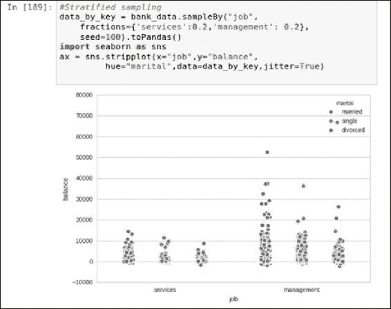
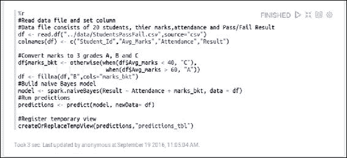

# 第九章：可视化大数据

正确的数据可视化在过去解决了许多商业问题，而无需过多依赖统计学或机器学习。即使在今天，随着技术进步、应用统计学和机器学习的发展，合适的视觉呈现依然是商业用户获取信息或分析结果的最终交付物。传递正确的信息、以正确的格式展现，这是数据科学家所追求的，而一个有效的可视化比百万个词语还要有价值。此外，以易于商业用户理解的方式呈现模型和生成的洞察至关重要。尽管如此，以可视化方式探索大数据非常繁琐且具有挑战性。由于 Spark 是为大数据处理设计的，它也支持大数据的可视化。为了这个目的，基于 Spark 构建了许多工具和技术。

前几章概述了如何对结构化和非结构化数据建模并从中生成洞察。在本章中，我们将从两个广泛的角度来看待数据可视化——一个是数据科学家的角度，数据可视化是有效探索和理解数据的基本需求；另一个是商业用户的角度，视觉呈现是交付给商业用户的最终成果，必须易于理解。我们将探索多种数据可视化工具，如*IPythonNotebook*和*Zeppelin*，这些工具可以在 Apache Spark 上使用。

本章的前提是，你应该对 SQL 以及 Python、Scala 或其他类似框架的编程有基本的了解。 本章涵盖的主题如下：

+   为什么要可视化数据？

    +   数据工程师的角度

    +   数据科学家的角度

    +   商业用户的角度

+   数据可视化工具

    +   IPython notebook

    +   Apache Zeppelin

    +   第三方工具

+   数据可视化技巧

    +   总结和可视化

    +   子集和可视化

    +   抽样和可视化

    +   建模和可视化

# 为什么要可视化数据？

数据可视化是以可视化的形式呈现数据，以帮助人们理解数据背后的模式和趋势。地理地图、十七世纪的条形图和折线图是早期数据可视化的一些例子。Excel 可能是我们最熟悉的数据可视化工具，许多人已经使用过。所有的数据分析工具都配备了复杂的、互动的数据可视化仪表盘。然而，近年来大数据、流式数据和实时分析的激增推动了这些工具的边界，似乎已经达到了极限。目标是使可视化看起来简单、准确且相关，同时隐藏所有复杂性。根据商业需求，任何可视化解决方案理想情况下应该具备以下特点：

+   交互性

+   可重复性

+   控制细节

除此之外，如果解决方案允许用户在可视化或报告上进行协作并相互共享，那么这将构成一个端到端的可视化解决方案。

特别是大数据可视化面临着自身的挑战，因为我们可能会遇到数据比屏幕上的像素还多的情况。处理大数据通常需要大量的内存和 CPU 处理，且可能存在较长的延迟。如果再加入实时或流数据，这个问题将变得更加复杂。Apache Spark 从一开始就被设计用来通过并行化 CPU 和内存使用来解决这种延迟。在探索可视化和处理大数据的工具和技术之前，我们首先要了解数据工程师、数据科学家和业务用户的可视化需求。

## 数据工程师的视角

数据工程师在几乎所有数据驱动的需求中都发挥着至关重要的作用：从不同的数据源获取数据，整合数据，清洗和预处理数据，分析数据，最终通过可视化和仪表板进行报告。其活动可以大致总结如下：

+   可视化来自不同来源的数据，以便能够整合并合并它们，形成一个单一的数据矩阵

+   可视化并发现数据中的各种异常，如缺失值、异常值等（这可能发生在抓取、数据源获取、ETL 等过程中），并进行修复

+   向数据科学家提供有关数据集的属性和特征的建议

+   探索多种可能的方式来可视化数据，并根据业务需求最终确定那些更具信息性和直观性的方式

请注意，数据工程师不仅在数据源获取和准备过程中发挥关键作用，还负责决定最适合业务用户的可视化输出。他们通常与业务部门密切合作，以便对业务需求和当前具体问题有非常清晰的理解。

## 数据科学家的视角

数据科学家在可视化数据方面的需求与数据工程师不同。请注意，在某些业务中，可能有专业人员同时承担数据工程师和数据科学家的双重角色。

数据科学家需要可视化数据，以便在进行统计分析时做出正确的决策，并确保分析项目的顺利执行。他们希望以多种方式切片和切块数据，以发现隐藏的洞察。让我们看看数据科学家在可视化数据时可能需要的一些示例需求：

+   查看各个变量的数据分布

+   可视化数据中的异常值

+   可视化数据集中所有变量的缺失数据百分比

+   绘制相关性矩阵以查找相关的变量

+   绘制回归后的残差行为

+   在数据清洗或转换活动后，重新绘制变量图，并观察其表现

请注意，刚才提到的一些内容与数据工程师的情况非常相似。然而，数据科学家可能在这些分析背后有更科学/统计的意图。例如，数据科学家可能会从不同的角度看待一个离群值并进行统计处理，而数据工程师则可能考虑导致这一现象的多种可能选项。

## 业务用户的视角

业务用户的视角与数据工程师或数据科学家的视角完全不同。业务用户通常是信息的消费者！他们希望从数据中提取更多的信息，为此，正确的可视化工具至关重要。此外，如今大多数业务问题都更加复杂且具因果关系。传统的报告已经不再足够。我们来看一些业务用户希望从报告、可视化和仪表板中提取的示例查询：

+   在某个地区，谁是高价值客户？

+   这些客户的共同特征是什么？

+   预测一个新客户是否会是高价值客户

+   在哪个媒体上做广告能获得最大的投资回报率？

+   如果我不在报纸上做广告会怎样？

+   影响客户购买行为的因素有哪些？

# 数据可视化工具

在众多可视化选项中，选择合适的可视化工具取决于特定的需求。同样，选择可视化工具也取决于目标受众和业务需求。

数据科学家或数据工程师通常会偏好一个更为互动的控制台，用于快速且粗略的分析。他们使用的可视化工具通常不面向业务用户。数据科学家或数据工程师倾向于从各个角度解构数据，以获得更有意义的洞察。因此，他们通常会更喜欢支持这些活动的笔记本类型界面。笔记本是一个互动的计算环境，用户可以在其中结合代码块并绘制数据进行探索。像**IPython**/**Jupyter**或**DataBricks**等笔记本就是可用的选项之一。

业务用户更喜欢直观且信息丰富的可视化，这样他们可以相互分享或用来生成报告。他们期望通过可视化得到最终结果。市场上有成百上千种工具，包括一些流行工具，如**Tableau**，企业都在使用；但通常，开发人员必须为一些独特的需求定制特定类型，并通过 Web 应用程序展示它们。微软的**PowerBI**和开源解决方案如**Zeppelin**就是一些例子。

## IPython 笔记本

基于 Spark 的**PySpark** API 之上的 IPython/Jupyter 笔记本是数据科学家探索和可视化数据的绝佳组合。笔记本内部启动了一个新的 PySpark 内核实例。还有其他内核可用；例如，Apache 的**Toree**内核可以用来支持 Scala。

对于许多数据科学家来说，这是默认选择，因为它能够将文本、代码、公式和图形集成在一个 JSON 文档文件中。IPython 笔记本支持`matplotlib`，它是一个可以生成生产质量视觉效果的二维可视化库。生成图表、直方图、散点图、图形等变得既简单又容易。它还支持`seaborn`库，实际上这是建立在 matplotlib 基础上的，但它易于使用，因为它提供了更高级的抽象，隐藏了底层的复杂性。

## Apache Zeppelin

Apache Zeppelin 建立在 JVM 之上，并与 Apache Spark 良好集成。它是一个基于浏览器或前端的开源工具，拥有自己的笔记本。它支持 Scala、Python、R、SQL 及其他图形模块，作为一种可视化解决方案，不仅为业务用户，也为数据科学家服务。在接下来的可视化技术部分中，我们将看看 Zeppelin 如何支持 Apache Spark 代码来生成有趣的可视化效果。你需要下载 Zeppelin（[`zeppelin.apache.org/`](https://zeppelin.apache.org/)）以尝试这些示例。

## 第三方工具

有许多产品支持 Apache Spark 作为底层数据处理引擎，并且是为了适应组织的大数据生态系统而构建的。它们利用 Spark 的处理能力，提供支持各种交互式视觉效果的可视化界面，并且支持协作。Tableau 就是一个利用 Spark 的工具示例。

# 数据可视化技术

数据可视化是数据分析生命周期每个阶段的核心。它对探索性分析和结果传达尤为重要。在这两种情况下，目标都是将数据转换成对人类处理高效的格式。将转换委托给客户端库的方法无法扩展到大数据集。转换必须在服务器端进行，只将相关数据发送到客户端进行渲染。Apache Spark 开箱即用地提供了大多数常见的转换。让我们仔细看看这些转换。

## 总结和可视化

**总结和可视化** 是许多**商业智能**（**BI**）工具使用的一种技术。由于总结无论底层数据集的大小如何，都会生成简明的数据集，因此图表看起来足够简单并且易于渲染。有多种方法可以总结数据，例如聚合、透视等。如果渲染工具支持交互性并且具备下钻功能，用户可以从完整数据中探索感兴趣的子集。我们将展示如何通过 Zeppelin 笔记本快速、互动地进行总结。

以下图片展示了 Zeppelin 笔记本，包含源代码和分组条形图。数据集包含 24 条观测数据，记录了两个产品 **P1** 和 **P2** 在 12 个月中的销售信息。第一个单元格包含用于读取文本文件并将数据注册为临时表的代码。此单元格使用默认的 Spark 解释器 Scala。第二个单元格使用 SQL 解释器，支持开箱即用的可视化选项。你可以通过点击右侧图标切换图表类型。请注意，Scala、Python 或 R 解释器的可视化效果是相似的。

汇总示例如下：

1.  用于读取数据并注册为 SQL 视图的源代码：

    **Scala（默认）**：

    

    **PySpark**：

    

    **R**：

    

    这三者都在读取数据文件并注册为临时 SQL 视图。请注意，前面的三个脚本中存在一些细微的差异。例如，我们需要为 R 移除表头行并设置列名。下一步是生成可视化，它是通过 `%sql` 解释器工作的。下图显示了生成每个产品季度销售额的脚本。它还显示了现成的图表类型，以及设置和选择。做出选择后，你可以折叠设置。你甚至可以使用 Zeppelin 内置的动态表单，例如在运行时接受产品输入。第二张图显示了实际输出。

1.  用于生成两个产品季度销售额的脚本：

1.  产生的输出：

我们在前面的示例中已经看到了 Zeppelin 的内置可视化。但我们也可以使用其他绘图库。我们的下一个示例使用 PySpark 解释器与 matplotlib 在 Zeppelin 中绘制直方图。此示例代码使用 RDD 的直方图函数计算桶间隔和桶计数，并仅将这些汇总数据传送到驱动节点。频率作为权重绘制桶，以提供与正常直方图相同的视觉效果，但数据传输非常低。

直方图示例如下：


这是生成的输出（它可能作为一个单独的窗口弹出）：


在前面的直方图准备示例中，请注意，桶计数可以通过内置的动态表单支持进行参数化。

## 子集化和可视化

有时，我们可能拥有一个大型数据集，但只对其中的一部分感兴趣。“分而治之”是一种方法，我们一次探索数据的一个小部分。Spark 允许使用类似 SQL 的过滤器和聚合对行列数据集以及图形数据进行数据子集化。让我们首先执行 SQL 子集化，然后是 GraphX 示例。

以下示例使用 Zeppelin 提供的银行数据，并提取与管理者相关的几个相关数据列。它使用`google 可视化库`绘制气泡图。数据是使用 PySpark 读取的。数据子集化和可视化是通过 R 完成的。请注意，我们可以选择任何解释器来执行这些任务，这里选择的是随意的。

使用 SQL 进行数据子集化的示例如下：

1.  读取数据并注册 SQL 视图：

1.  子集化管理者数据并显示气泡图：

下一个示例演示了一些使用 **斯坦福网络分析项目**（**SNAP**）提供的数据的 GraphX 处理。该脚本提取了一个包含给定节点集的子图。在这里，每个节点代表一个 Facebook ID，一条边代表两个节点（或人）之间的连接。此外，脚本还识别了给定节点（ID：144）的直接连接。这些是一级节点。然后，它识别这些*一级节点*的直接连接，这些形成了给定节点的*二级节点*。即使一个二级联系人可能与多个一级联系人连接，它也只显示一次，从而形成没有交叉边的连接树。由于连接树可能包含太多节点，脚本将一级和二级连接限制为最多三个连接，从而在给定的根节点下仅显示 12 个节点（一个根节点 + 三个一级节点 + 每个二级节点的三个连接）。

**Scala**

```py
//Subset and visualize 
//GraphX subset example 
//Datasource: http://snap.stanford.edu/data/egonets-Facebook.html  
import org.apache.spark.graphx._ 
import org.apache.spark.graphx.util.GraphGenerators 
//Load edge file and create base graph 
val base_dir = "../data/facebook" 
val graph = GraphLoader.edgeListFile(sc,base_dir + "/0.edges") 

//Explore subgraph of a given set of nodes 
val circle = "155  99  327  140  116  147  144  150  270".split("\t").map( 
       x=> x.toInt) 
val subgraph = graph.subgraph(vpred = (id,name) 
     => circle.contains(id)) 
println("Edges: " + subgraph.edges.count +  
       " Vertices: " + subgraph.vertices.count) 

//Create a two level contact tree for a given node  
//Step1: Get all edges for a given source id 
val subgraph_level1 = graph.subgraph(epred= (ed) =>  
    ed.srcId == 144) 

//Step2: Extract Level 1 contacts 
import scala.collection.mutable.ArrayBuffer 
val lvl1_nodes : ArrayBuffer[Long] = ArrayBuffer() 
subgraph_level1.edges.collect().foreach(x=> lvl1_nodes+= x.dstId) 

//Step3: Extract Level 2 contacts, 3 each for 3 lvl1_nodes 
import scala.collection.mutable.Map 
val linkMap:Map[Long, ArrayBuffer[Long]] = Map() //parent,[Child] 
val lvl2_nodes : ArrayBuffer[Long] = ArrayBuffer() //1D Array 
var n : ArrayBuffer[Long] = ArrayBuffer() 
for (i <- lvl1_nodes.take(3)) {    //Limit to 3 
    n = ArrayBuffer() 
    graph.subgraph(epred = (ed) => ed.srcId == i && 
        !(lvl2_nodes contains ed.dstId)).edges.collect(). 
             foreach(x=> n+=x.dstId) 
    lvl2_nodes++=n.take(3)    //Append to 1D array. Limit to 3 
  linkMap(i) = n.take(3)  //Assign child nodes to its parent 
 } 

 //Print output and examine the nodes 
 println("Level1 nodes :" + lvl1_nodes) 
 println("Level2 nodes :" + lvl2_nodes) 
 println("Link map :" + linkMap) 

 //Copy headNode to access from another cell 
 z.put("headNode",144) 
 //Make a DataFrame out of lvl2_nodes and register as a view 
 val nodeDF = sc.parallelize(linkMap.toSeq).toDF("parentNode","childNodes") 
 nodeDF.createOrReplaceTempView("node_tbl") 

```

### 注意

请注意 `z.put` 和 `z.get` 的使用。这是 Zeppelin 中用于交换单元格/解释器之间数据的一种机制。

现在我们已经创建了一个包含一级联系人及其直接联系人的数据框架，我们准备好绘制树形图了。以下脚本使用了图形可视化库 igraph 和 Spark R。

提取节点和边。绘制树形图：


上述脚本从节点表中获取父节点，这些父节点是第 2 级节点的父节点，也是与给定头节点的直接连接。创建头节点与第 1 级节点的有序对，并将其分配给 `edges1`。接下来的步骤是展开第 2 级节点数组，将每个数组元素形成一行。由此获得的数据框被转置并粘贴，形成边对。由于粘贴操作将数据转换为字符串，因此需要重新转换为数字。这些就是第 2 级边。第 1 级和第 2 级边被合并，形成一个边的单一列表。这些边接着被用来形成图形，如下所示。请注意，`headNode` 中的模糊值为 144，虽然在下图中不可见：


给定节点的连接树

## 抽样与可视化

抽样和可视化技术已被统计学家使用了很长时间。通过抽样技术，我们从数据集中提取一部分数据并进行处理。我们将展示 Spark 如何支持不同的抽样技术，如**随机抽样**、**分层抽样**和**sampleByKey**等。以下示例是在 Jupyter notebook 中创建的，使用了 PySpark 核心和 `seaborn` 库。数据文件是 Zeppelin 提供的银行数据集。第一个图展示了每个教育类别的余额，颜色表示婚姻状况。

读取数据并随机抽取 5% 的样本：


使用 `stripplot` 渲染数据：


上述示例展示了随机抽样的可用数据，这比完全绘制整体数据要好得多。但是，如果感兴趣的分类变量（在本例中是 `education`）的级别过多，那么这个图表就会变得难以阅读。例如，如果我们想绘制工作类别的余额而不是 `education`，将会有太多的条形，使得图像看起来凌乱不堪。相反，我们可以只抽取所需类别级别的样本，然后再进行数据分析。请注意，这与子集选择不同，因为在正常的 SQL `WHERE` 子集选择中我们无法指定样本比例。我们需要使用 `sampleByKey` 来实现这一点，如下所示。以下示例只取了两种工作类别，并且有特定的抽样比例：



分层抽样

## 建模与可视化

使用 Spark 的**MLLib**和**ML**模块可以进行建模与可视化。Spark 的统一编程模型和多样化的编程接口使得将这些技术结合到一个环境中，从数据中获取洞察成为可能。我们已经在前几章中涵盖了大多数建模技术。然而，以下是一些供参考的示例：

+   **聚类**：K-means、Gaussian 混合模型

+   **分类与回归**：线性模型、决策树、朴素贝叶斯、支持向量机（SVM）

+   **降维**：奇异值分解，主成分分析

+   **协同过滤**

+   **统计测试**：相关性，假设检验

以下示例选自第七章，*使用 SparkR 扩展 Spark*，该示例试图使用朴素贝叶斯模型预测学生的合格或不合格结果。其思路是利用 Zeppelin 提供的开箱即用功能，检查模型的行为。因此，我们加载数据，进行数据准备，构建模型并运行预测。然后，我们将预测结果注册为 SQL 视图，以便利用内置的可视化功能：

```py
//Model visualization example using zeppelin visualization  
 Prepare Model and predictions 

```



下一步是编写所需的 SQL 查询并定义适当的设置。请注意 SQL 中的 UNION 操作符的使用以及匹配列的定义方式。

定义 SQL 以查看模型表现：


以下图片帮助我们理解模型预测与实际数据的偏差。这样的可视化对于获取业务用户的反馈非常有用，因为它们不需要任何数据科学的先验知识就能理解：


可视化模型表现

我们通常使用误差指标来评估统计模型，但通过图形化展示而不是查看数字使其更加直观，因为通常理解图表比理解表格中的数字更容易。例如，前面的可视化可以让非数据科学领域的人也容易理解。

# 总结

在本章中，我们探讨了在大数据环境中 Spark 支持的最常用可视化工具和技术。我们通过代码片段解释了一些技术，以便更好地理解数据分析生命周期各个阶段的可视化需求。我们还展示了如何通过适当的可视化技术解决大数据的挑战，以满足业务需求。

下一章将是我们迄今为止解释的所有概念的总结。我们将通过一个示例数据集走完完整的数据分析生命周期。

# 参考文献

+   21 种必备数据可视化工具：[`www.kdnuggets.com/2015/05/21-essential-data-visualization-tools.html`](http://www.kdnuggets.com/2015/05/21-essential-data-visualization-tools.html)

+   Apache Zeppelin notebook 主页：[`zeppelin.apache.org/`](https://zeppelin.apache.org/)

+   Jupyter notebook 主页：[`jupyter.org/`](https://jupyter.org/)

+   使用 IPython Notebook 与 Apache Spark：[`hortonworks.com/hadoop-tutorial/using-ipython-notebook-with-apache-spark/`](http://hortonworks.com/hadoop-tutorial/using-ipython-notebook-with-apache-spark/)

+   Apache Toree，支持应用程序与 Spark 集群之间的交互式工作负载。可以与 jupyter 一起使用来运行 Scala 代码：[`toree.incubator.apache.org/`](https://toree.incubator.apache.org/)

+   使用 R 的 GoogleVis 包：[`cran.rproject.org/web/packages/googleVis/vignettes/googleVis_examples.html`](https://cran.rproject.org/web/packages/googleVis/vignettes/googleVis_examples.html)

+   GraphX 编程指南：[`spark.apache.org/docs/latest/graphx-programming-guide.html`](http://spark.apache.org/docs/latest/graphx-programming-guide.html)

+   使用 R 的 igraph 包进行病毒传播分析：[`www.r-bloggers.com/going-viral-with-rs-igraph-package/`](https://www.r-bloggers.com/going-viral-with-rs-igraph-package/)

+   使用分类数据绘图：[`stanford.edu/~mwaskom/software/seaborn/tutorial/categorical.html#categorical-tutorial`](https://stanford.edu/~mwaskom/software/seaborn/tutorial/categorical.html#categorical-tutorial)

## 数据来源引用

**银行数据来源（引用）**

+   [Moro et al., 2011] S. Moro, R. Laureano 和 P. Cortez. 使用数据挖掘进行银行直销营销：CRISP-DM 方法的应用

+   见 P. Novais 等人（编辑），《欧洲仿真与建模会议论文集 - ESM'2011》，第 117-121 页，葡萄牙吉马良斯，2011 年 10 月，EUROSIS

+   可通过 [pdf] [`hdl.handle.net/1822/14838`](http://hdl.handle.net/1822/14838) 获取

+   [bib] http://www3.dsi.uminho.pt/pcortez/bib/2011-esm-1.txt

**Facebook 数据来源（引用）**

+   J. McAuley 和 J. Leskovec. 学习在自我网络中发现社交圈。NIPS, 2012.
