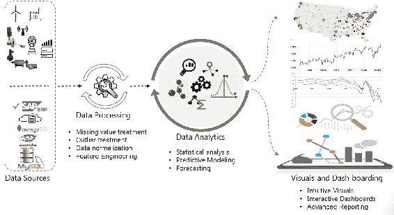
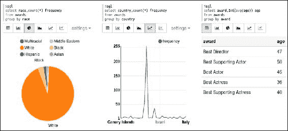

# 第十章：整合所有内容

大数据分析正在革新企业运营方式，并为许多前所未有的机会铺平道路。几乎每个企业、个人研究人员或调查记者都有大量数据需要处理。我们需要一种简洁的方法，从原始数据出发，根据当前的问题得出有意义的洞察。

在之前的章节中，我们已经讨论了使用 Apache Spark 进行数据科学的各个方面。我们从讨论大数据分析需求以及 Apache Spark 如何适应这些需求开始。逐步地，我们探讨了 Spark 编程模型、RDD 和 DataFrame 抽象，并学习了 Spark 数据集如何通过连续应用的流式处理方面实现统一数据访问。接着，我们覆盖了使用 Apache Spark 进行数据分析生命周期的全貌，随后是机器学习的内容。我们学习了在 Spark 上进行结构化和非结构化数据分析，并探索了面向数据工程师、科学家以及业务用户的可视化方面。

所有之前讨论的章节帮助我们理解了每个章节中的一个简洁方面。现在我们已经具备了穿越整个数据科学生命周期的能力。在这一章节中，我们将通过一个端到端的案例研究，应用我们迄今为止学到的所有内容。我们不会引入任何新的概念；这将帮助我们应用已获得的知识并加深理解。然而，我们会重复一些概念，避免过多细节，使这一章节能够自成一体。本章所覆盖的主题大致与数据分析生命周期中的步骤相同：

+   快速回顾

+   引入案例研究

+   构建业务问题

+   数据获取与数据清洗

+   提出假设

+   数据探索

+   数据准备

+   模型构建

+   数据可视化

+   向业务用户传达结果

+   总结

# 快速回顾

我们已经在不同章节中详细讨论了典型数据科学项目中的各个步骤。让我们快速回顾一下我们已经覆盖的内容，并简要提及一些重要方面。以下图表展示了这些步骤的高层次概述：



在前面的图示中，我们尝试从更高层次解释数据科学项目中的步骤，这些步骤通常适用于许多数据科学任务。每个阶段实际上都包含更多的子步骤，但可能因项目不同而有所差异。

对数据科学家来说，一开始找到最佳方法和步骤是非常困难的。通常，数据科学项目没有像**软件开发生命周期**（**SDLC**）那样明确的生命周期。数据科学项目通常会因为周期性步骤而导致交付延迟，而且这些步骤是反复迭代的。此外，跨团队的循环依赖也增加了复杂性并导致执行延迟。然而，在处理大数据分析项目时，数据科学家遵循一个明确的数据科学工作流程，无论业务案例如何，都显得尤为重要且有利。这不仅有助于组织执行，还能帮助我们保持专注于目标，因为数据科学项目在大多数情况下天生是敏捷的。同时，建议你为任何项目规划一些关于数据、领域和算法的研究。

在这一章中，我们可能无法将所有细节步骤放在一个流程中，但我们会涉及到一些重要的部分，为你提供一个概览。我们将尝试看一些之前章节未涉及的编码示例。

# 引入案例研究

在本章中，我们将探索奥斯卡奖的受众人口统计信息。你可以从 GitHub 仓库下载数据：[`www.crowdflower.com/wp-content/uploads/2016/03/Oscars-demographics-DFE.csv`](https://www.crowdflower.com/wp-content/uploads/2016/03/Oscars-demographics-DFE.csv)。

该数据集基于[`www.crowdflower.com/data-for-everyone`](http://www.crowdflower.com/data-for-everyone)提供的数据。它包含了种族、出生地和年龄等人口统计信息。数据行大约有 400 条，可以在简单的家庭计算机上轻松处理，因此你可以在 Spark 上执行一个**概念验证**（**POC**）来进行数据科学项目的尝试。

只需下载文件并检查数据。数据看起来可能没问题，但当你仔细查看时，你会发现它并不“干净”。例如，出生日期这一列没有统一的格式。有些年份是两位数字格式，而有些则是四位数字格式。出生地列在美国境内的地点没有包含国家信息。

同样，你会注意到数据看起来有偏差，来自美国的“白人”种族人数较多。但你可能会觉得，趋势在近几年发生了变化。到目前为止，你还没有使用任何工具或技术，只是对数据进行了快速浏览。在数据科学的实际工作中，这种看似微不足道的活动可能在整个生命周期中非常有帮助。你能够逐步对手头的数据形成感觉，并同时对数据提出假设。这将带你进入工作流程的第一步。

# 商业问题

如前所述，任何数据科学项目中最重要的方面是手头的问题。清楚地理解*我们要解决什么问题？*对项目的成功至关重要。它还决定了什么数据被视为相关，什么数据不相关。例如，在当前的案例研究中，如果我们要关注的是人口统计信息，那么电影名称和人物名称就是不相关的。有时，手头没有具体问题！*那怎么办？*即使没有具体问题，商业可能仍然有一些目标，或者数据科学家和领域专家可以合作，找到需要解决的商业领域。为了理解商业、职能、问题陈述或数据，数据科学家首先会进行“提问”。这不仅有助于定义工作流程，还能帮助寻找正确的数据来源。

举个例子，如果商业关注点是人口统计信息，那么可以定义一个正式的商业问题陈述：

*种族和原籍地对奥斯卡奖获得者的影响是什么？*

在现实场景中，这一步骤不会如此简单。提出正确的问题是数据科学家、战略团队、领域专家和项目负责人共同的责任。因为如果不服务于目的，整个过程都是徒劳的，所以数据科学家必须咨询所有相关方，并尽可能从他们那里获取信息。然而，他们最终可能会得到一些宝贵的见解或“直觉”。所有这些信息共同构成了初步假设的核心，并帮助数据科学家理解他们应该寻找什么。

在没有具体问题的情况下，商业试图找出答案的情形更为有趣，但执行起来可能更复杂！

# 数据采集与数据清洗

**数据采集**是逻辑上的下一步。它可能仅仅是从一个电子表格中选择数据，也可能是一个复杂的、持续几个月的项目。数据科学家必须尽可能多地收集相关数据。这里的“相关”是关键词。记住，更多相关的数据胜过聪明的算法。

我们已经介绍了如何从异构数据源中获取数据并将其整合成一个单一的数据矩阵，因此这里不再重复这些基础知识。相反，我们从一个单一来源获取数据，并提取其中的一个子集。

现在是时候查看数据并开始清洗它了。本章中呈现的脚本通常比之前的示例更长，但仍然不能算作生产级别的质量。实际工作中需要更多的异常检查和性能调优：

**Scala**

```py
//Load tab delimited file 
scala> val fp = "<YourPath>/Oscars.txt" 
scala> val init_data = spark.read.options(Map("header"->"true", "sep" -> "\t","inferSchema"->"true")).csv(fp) 
//Select columns of interest and ignore the rest 
>>> val awards = init_data.select("birthplace", "date_of_birth", 
        "race_ethnicity","year_of_award","award").toDF( 
         "birthplace","date_of_birth","race","award_year","award") 
awards: org.apache.spark.sql.DataFrame = [birthplace: string, date_of_birth: string ... 3 more fields] 
//register temporary view of this dataset 
scala> awards.createOrReplaceTempView("awards") 

//Explore data 
>>> awards.select("award").distinct().show(10,false) //False => do not truncate 
+-----------------------+                                                        
|award                  | 
+-----------------------+ 
|Best Supporting Actress| 
|Best Director          | 
|Best Actress           | 
|Best Actor             | 
|Best Supporting Actor  | 
+-----------------------+ 
//Check DOB quality. Note that length varies based on month name 
scala> spark.sql("SELECT distinct(length(date_of_birth)) FROM awards ").show() 
+---------------------+                                                          
|length(date_of_birth)| 
+---------------------+ 
|                   15| 
|                    9| 
|                    4| 
|                    8| 
|                   10| 
|                   11| 
+---------------------+ 

//Look at the value with unexpected length 4 Why cant we show values for each of the length type ?  
scala> spark.sql("SELECT date_of_birth FROM awards WHERE length(date_of_birth) = 4").show() 
+-------------+ 
|date_of_birth| 
+-------------+ 
|         1972| 
+-------------+ 
//This is an invalid date. We can either drop this record or give some meaningful value like 01-01-1972 

```

**Python**

```py
    //Load tab delimited file
    >>> init_data = spark.read.csv("<YOURPATH>/Oscars.txt",sep="\t",header=True)
    //Select columns of interest and ignore the rest
    >>> awards = init_data.select("birthplace", "date_of_birth",
            "race_ethnicity","year_of_award","award").toDF(
             "birthplace","date_of_birth","race","award_year","award")
    //register temporary view of this dataset
    >>> awards.createOrReplaceTempView("awards")
    scala>
    //Explore data
    >>> awards.select("award").distinct().show(10,False) //False => do not truncate
    +-----------------------+                                                       
    |award                  |
    +-----------------------+
    |Best Supporting Actress|
    |Best Director          |
    |Best Actress           |
    |Best Actor             |
    |Best Supporting Actor  |
    +-----------------------+
    //Check DOB quality
    >>> spark.sql("SELECT distinct(length(date_of_birth)) FROM awards ").show()
    +---------------------+                                                         
    |length(date_of_birth)|
    +---------------------+
    |                   15|
    |                    9|
    |                    4|
    |                    8|
    |                   10|
    |                   11|
    +---------------------+
    //Look at the value with unexpected length 4\. Note that length varies based on month name
    >>> spark.sql("SELECT date_of_birth FROM awards WHERE length(date_of_birth) = 4").show()
    +-------------+
    |date_of_birth|
    +-------------+
    |         1972|
    +-------------+
    //This is an invalid date. We can either drop this record or give some meaningful value like 01-01-1972

Most of the datasets contain a date field and unless they come from a single, controlled data source, it is highly likely that they will differ in their formats and are almost always a candidate for cleaning.
```

对于手头的数据集，你可能也注意到 `date_of_birth` 和 `birthplace` 需要大量清理。以下代码展示了两个 **用户定义函数**（**UDFs**），分别清理 `date_of_birth` 和 `birthplace`。这些 UDF 每次处理单个数据元素，它们只是普通的 Scala/Python 函数。为了能够在 SQL 语句中使用，这些用户定义的函数应该被注册。最后一步是创建一个清理后的数据框，参与进一步的分析。

注意下面的清理 `birthplace` 的逻辑。它是一个比较简单的逻辑，因为我们假设任何以两个字符结尾的字符串都是美国的一个州。我们需要将其与有效的州缩写列表进行比较。同样，假设两位数的年份总是来自二十世纪也是一个容易出错的假设。根据实际情况，数据科学家/数据工程师需要决定是否保留更多行，或者只包括质量更高的数据。所有这些决策应该清晰地记录下来，供后续参考：

**Scala:**

```py
//UDF to clean date 
//This function takes 2 digit year and makes it 4 digit 
// Any exception returns an empty string 
scala> def fncleanDate(s:String) : String = {  
  var cleanedDate = "" 
  val dateArray: Array[String] = s.split("-") 
  try{    //Adjust year 
     var yr = dateArray(2).toInt 
     if (yr < 100) {yr = yr + 1900 } //make it 4 digit 
     cleanedDate = "%02d-%s-%04d".format(dateArray(0).toInt, 
                dateArray(1),yr) 
     } catch { case e: Exception => None } 
     cleanedDate } 
fncleanDate: (s: String)String 

```

**Python:**

```py
    //This function takes 2 digit year and makes it 4 digit
    // Any exception returns an empty string
    >>> def fncleanDate(s):
          cleanedDate = ""
          dateArray = s.split("-")
          try:    //Adjust year
             yr = int(dateArray[2])
             if (yr < 100):
                  yr = yr + 1900 //make it 4 digit
             cleanedDate = "{0}-{1}-{2}".format(int(dateArray[0]),
                      dateArray[1],yr)
          except :
              None
          return cleanedDate

```

清理日期的 UDF 接受一个带有连字符的日期字符串并将其拆分。如果最后一个组件（即年份）是两位数，那么假设它是二十世纪的日期，并加上 1900 将其转换为四位数格式。

以下 UDF 会将国家设置为美国（USA），如果国家字符串是“纽约市”或者最后一个组件是两个字符长，这时假设它是美国的一个州：

```py
//UDF to clean birthplace 
// Data explorartion showed that  
// A. Country is omitted for USA 
// B. New York City does not have State code as well 
//This function appends country as USA if 
// A. the string contains New York City  (OR) 
// B. if the last component is of length 2 (eg CA, MA) 
scala> def fncleanBirthplace(s: String) : String = { 
        var cleanedBirthplace = "" 
        var strArray : Array[String] =  s.split(" ") 
        if (s == "New York City") 
           strArray = strArray ++ Array ("USA") 
        //Append country if last element length is 2 
        else if (strArray(strArray.length-1).length == 2) 
            strArray = strArray ++ Array("USA") 
        cleanedBirthplace = strArray.mkString(" ") 
        cleanedBirthplace } 

```

Python:

```py
    >>> def fncleanBirthplace(s):
            cleanedBirthplace = ""
            strArray = s.split(" ")
            if (s == "New York City"):
                strArray += ["USA"]  //Append USA
            //Append country if last element length is 2
            elif (len(strArray[len(strArray)-1]) == 2):
                strArray += ["USA"]
            cleanedBirthplace = " ".join(strArray)
            return cleanedBirthplace

```

如果想通过 SELECT 字符串访问 UDF，应该注册 UDF：

**Scala:**

```py
//Register UDFs 
scala> spark.udf.register("fncleanDate",fncleanDate(_:String)) 
res10: org.apache.spark.sql.expressions.UserDefinedFunction = UserDefinedFunction(<function1>,StringType,Some(List(StringType))) 
scala> spark.udf.register("fncleanBirthplace", fncleanBirthplace(_:String)) 
res11: org.apache.spark.sql.expressions.UserDefinedFunction = UserDefinedFunction(<function1>,StringType,Some(List(StringType))) 

```

**Python:**

```py
    >>> from pyspark.sql.types import StringType
    >>> sqlContext.registerFunction("cleanDateUDF",fncleanDate, StringType())
    >>> sqlContext.registerFunction( "cleanBirthplaceUDF",fncleanBirthplace, StringType())

```

使用 UDF 清理数据框。执行以下清理操作：

1.  调用 UDF `fncleanDate` 和 `fncleanBirthplace` 来修正出生地和国家。

1.  从 `award_year` 中减去出生年份以获取获奖时的 `age`。

1.  保留 `race` 和 `award` 原样。

**Scala:**

```py
//Create cleaned data frame 
scala> var cleaned_df = spark.sql ( 
            """SELECT fncleanDate (date_of_birth) dob, 
               fncleanBirthplace(birthplace) birthplace, 
               substring_index(fncleanBirthplace(birthplace),' ',-1)  
                               country, 
               (award_year - substring_index(fncleanDate( date_of_birth),'-',-1)) age, race, award FROM awards""") 
cleaned_df: org.apache.spark.sql.DataFrame = [dob: string, birthplace: string ... 4 more fields] 

```

**Python:**

```py
//Create cleaned data frame 
>>> from pyspark.sql.functions import substring_index>>> cleaned_df = spark.sql (            """SELECT cleanDateUDF (date_of_birth) dob,               cleanBirthplaceUDF(birthplace) birthplace,               substring_index(cleanBirthplaceUDF(birthplace),' ',-1) country,               (award_year - substring_index(cleanDateUDF( date_of_birth),               '-',-1)) age, race, award FROM awards""")
```

最后一行需要一些解释。UDF 的使用类似于 SQL 函数，且表达式被别名为有意义的名称。我们添加了一个计算列 `age`，因为我们希望验证年龄的影响。`substring_index` 函数搜索第一个参数中的第二个参数。`-1` 表示从右侧查找第一个出现的值。

# 制定假设

假设是你关于结果的最佳猜测。你根据问题、与利益相关者的对话以及查看数据来形成初步假设。你可能会为给定的问题形成一个或多个假设。这个初步假设作为一张路线图，引导你进行探索性分析。制定假设对于统计学上批准或不批准一个声明非常重要，而不仅仅是通过查看数据矩阵或视觉效果。这是因为仅凭数据可能会导致错误的认知，甚至可能具有误导性。

现在你知道，最终结果可能会证明假设是正确的，也可能证明是假设错误的。对于我们本课考虑的案例研究，我们得出了以下初步假设：

+   获奖者大多是白人

+   大多数获奖者来自美国

+   最佳演员和最佳女演员往往比最佳导演年轻

现在我们已经正式化了假设，准备好进行生命周期中的下一步。

# 数据探索

现在我们有了一个干净的数据框，其中包含相关数据和初步假设，是时候真正探索我们拥有的内容了。DataFrames 抽象提供了像`group by`这样的函数，帮助你进行探索。你也可以将清理过的数据框注册为表格，并运行经过时间验证的 SQL 语句来完成相同的操作。

这也是绘制一些图表的时机。这一可视化阶段是数据可视化章节中提到的探索性分析。这个探索的目标在很大程度上受你从业务利益相关者那里获得的初步信息和假设的影响。换句话说，你与利益相关者的讨论帮助你了解要寻找什么。

有一些通用的指南适用于几乎所有的数据科学任务，但也会根据不同的使用场景而有所不同。我们来看一些通用的指南：

+   查找缺失数据并进行处理。我们在第五章，*在 Spark 上进行数据分析*中已经讨论过各种处理方法。

+   查找数据集中的离群值并进行处理。我们也讨论过这一方面。请注意，有些情况下，我们认为的离群值和正常数据点可能会根据使用场景而变化。

+   执行单变量分析，在这个过程中，你会分别探索数据集中的每一个变量。频率分布或百分位分布是非常常见的。也许你可以绘制一些图表，以获得更清晰的理解。这还将帮助你在进行数据建模之前准备数据。

+   验证你的初步假设。

+   检查数值数据的最小值和最大值。如果某一列的变化范围过大，可能需要进行数据标准化或缩放处理。

+   检查分类数据中的不同值（如城市名等字符串值）及其频率。如果某一列的不同值（也就是层级）过多，可能需要寻找减少层级数量的方法。如果某一层级几乎总是出现，那么该列对于模型区分可能的结果没有帮助，这样的列很可能是移除的候选。在探索阶段，你只需找出这些候选列，真正的操作可以留给数据准备阶段来处理。

在我们当前的数据集中，没有缺失数据，也没有可能带来挑战的数值数据。然而，在处理无效日期时，可能会有一些缺失值出现。因此，以下代码涵盖了剩余的操作项。假设`cleaned_df`已经创建：

**Scala/Python:**

```py
cleaned_df = cleaned_df.na.drop //Drop rows with missing values 
cleaned_df.groupBy("award","country").count().sort("country","award","count").show(4,False) 
+-----------------------+---------+-----+                                        
|award                  |country  |count| 
+-----------------------+---------+-----+ 
|Best Actor             |Australia|1    | 
|Best Actress           |Australia|1    | 
|Best Supporting Actor  |Australia|1    | 
|Best Supporting Actress|Australia|1    | 
+-----------------------+---------+-----+ 
//Re-register data as table 
cleaned_df.createOrReplaceTempView("awards") 
//Find out levels (distinct values) in each categorical variable 
spark.sql("SELECT count(distinct country) country_count, count(distinct race) race_count, count(distinct award) award_count from awards").show() 
+-------------+----------+-----------+                                           
|country_count|race_count|award_count| 
+-------------+----------+-----------+ 
|           34|         6|          5| 
+-------------+----------+-----------+ 

```

以下可视化图表对应于最初的假设。请注意，我们的两个假设是正确的，但第三个假设是错误的。这些可视化图表是使用 zeppelins 创建的：



需要注意的是，并非所有假设都可以仅通过可视化来验证，因为可视化有时可能会具有误导性。因此，需要进行适当的统计检验，例如 t 检验、方差分析（ANOVA）、卡方检验、相关性检验等，根据实际情况进行。我们将在本节中不详细讨论这些内容。请参阅第五章，*Spark 上的数据分析*，了解更多详情。

# 数据准备

数据探索阶段帮助我们识别了在进入建模阶段之前需要修复的所有问题。每个问题都需要仔细思考和讨论，以选择最佳的修复方法。以下是一些常见问题和可能的解决方法。最佳修复方法取决于当前的问题和/或业务背景。

## 类别变量中的层级过多

这是我们面临的最常见问题之一。解决这个问题的方法取决于多个因素：

+   如果某列几乎总是唯一的，例如，它是一个交易 ID 或时间戳，那么除非你从中衍生出新的特征，否则它不会参与建模。你可以安全地删除该列而不会丢失任何信息内容。通常，你会在数据清理阶段就删除它。

+   如果可以用较粗粒度的层级（例如，使用州或国家代替城市）来替代当前层级，并且在当前上下文中是合理的，那么通常这是解决此问题的最佳方法。

+   你可能需要为每个不同的层级添加一个虚拟列，值为 0 或 1。例如，如果你在单个列中有 100 个层级，你可以添加 100 列。每次观察（行）中最多只有一个列会为 1。这就是**独热编码（one-hot encoding）**，Spark 通过`ml.features`包默认提供此功能。

+   另一种选择是保留最频繁的层级。你甚至可以将每个这些层级与一个“较近”的主层级进行关联。此外，你可以将其余的层级归为一个单独的桶，例如`Others`。

+   对于层级数量的绝对限制并没有硬性规定。这取决于每个特性所需的粒度以及性能限制。

当前数据集中，类别变量`country`有太多的层级。我们选择保留最频繁的层级，并将其余的层级归为`Others`：

**Scala:**

```py
//Country has too many values. Retain top ones and bundle the rest 
//Check out top 6 countries with most awards. 
scala> val top_countries_df = spark.sql("SELECT country, count(*) freq FROM awards GROUP BY country ORDER BY freq DESC LIMIT 6") 
top_countries_df: org.apache.spark.sql.DataFrame = [country: string, freq: bigint] 
scala> top_countries_df.show() 
+-------+----+                                                                   
|country|freq| 
+-------+----+ 
|    USA| 289| 
|England|  57| 
| France|   9| 
| Canada|   8| 
|  Italy|   7| 
|Austria|   7| 
+-------+----+ 
//Prepare top_countries list 
scala> val top_countries = top_countries_df.select("country").collect().map(x => x(0).toString) 
top_countries: Array[String] = Array(USA, England, New York City, France, Canada, Italy) 
//UDF to fix country. Retain top 6 and bundle the rest into "Others" 
scala> import org.apache.spark.sql.functions.udf 
import org.apache.spark.sql.functions.udf 
scala > val setCountry = udf ((s: String) => 
        { if (top_countries.contains(s)) {s} else {"Others"}}) 
setCountry: org.apache.spark.sql.expressions.UserDefinedFunction = UserDefinedFunction(<function1>,StringType,Some(List(StringType))) 
//Apply udf to overwrite country 
scala> cleaned_df = cleaned_df.withColumn("country", setCountry(cleaned_df("country"))) 
cleaned_df: org.apache.spark.sql.DataFrame = [dob: string, birthplace: string ... 4 more fields] 

```

**Python:**

```py
    //Check out top 6 countries with most awards.
    >>> top_countries_df = spark.sql("SELECT country, count(*) freq FROM awards GROUP BY country ORDER BY freq DESC LIMIT 6")
    >>> top_countries_df.show()
    +-------+----+                                                                  
    |country|freq|
    +-------+----+
    |    USA| 289|
    |England|  57|
    | France|   9|
    | Canada|   8|
    |  Italy|   7|
    |Austria|   7|
    +-------+----+
    >>> top_countries = [x[0] for x in top_countries_df.select("country").collect()]
    //UDF to fix country. Retain top 6 and bundle the rest into "Others"
    >>> from pyspark.sql.functions import udf
    >>> from pyspark.sql.types import StringType
    >>> setCountry = udf(lambda s: s if s in top_countries else "Others", StringType())
    //Apply UDF
    >>> cleaned_df = cleaned_df.withColumn("country", setCountry(cleaned_df["country"]))

```

## 数值变量的变化过大

有时数值数据的变化可能跨越几个数量级。例如，如果你查看个人的年收入，它可能会有很大差异。Z-score 标准化（标准化处理）和最小最大值缩放是两种常用的数据处理方法。Spark 在`ml.features`包中已经包含了这两种转换方法。

我们当前的数据集中没有这样的变量。我们唯一的数值型变量是年龄，其值始终为两位数。这样就少了一个需要解决的问题。

请注意，并非所有数据都需要进行标准化。如果你正在比较两个尺度不同的变量，或者使用聚类算法、SVM 分类器，或者其他真正需要标准化数据的场景时，你可以对数据进行标准化处理。

### 缺失数据

这是一个主要的关注点。任何目标值本身缺失的观测数据应该从训练数据中移除。其余的观测数据可以保留，并填补一些缺失值，或者根据需求移除。在填补缺失值时，你需要非常小心；否则可能导致误导性输出！直接在连续变量的空白单元格中填入平均值似乎很简单，但这可能不是正确的方法。

我们当前的案例研究没有缺失数据，因此没有需要处理的情况。然而，让我们看一个例子。

假设你正在处理一个学生数据集，其中包含了从 1 班到 5 班的数据。如果有一些缺失的`年龄`值，而你仅仅通过求整列的平均值来填补，那么这就会成为一个离群点，并且可能导致模糊的结果。你可以选择仅计算学生所在班级的平均值，并用该值填补。这至少是一个更好的方法，但可能不是完美的。在大多数情况下，你还需要对其他变量给予一定的权重。如果这样做，你可能最终会构建一个预测模型来寻找缺失的值，这也是一个很好的方法！

### 连续数据

数值数据通常是连续的，必须进行离散化，因为这是某些算法的前提条件。它通常被拆分成不同的区间或值范围。然而，也可能存在一些情况，你不仅仅是根据数据的范围均匀分桶，可能还需要考虑方差、标准差或任何其他适用的原因来正确地分桶。现在，决定桶的数量也是数据科学家的自由裁量权，但这也需要仔细分析。桶太少会降低粒度，桶太多则和类别级别太多差不多。在我们的案例研究中，`age`就是这种数据的一个例子，我们需要将其离散化。我们将其拆分成不同的区间。例如，看看这个管道阶段，它将`age`转换为 10 个桶：

**Scala:**

```py
scala> val splits = Array(Double.NegativeInfinity, 35.0, 45.0, 55.0, 
          Double.PositiveInfinity) 
splits: Array[Double] = Array(-Infinity, 35.0, 45.0, 55.0, Infinity) 
scala> val bucketizer = new Bucketizer().setSplits(splits). 
                 setInputCol("age").setOutputCol("age_buckets") 
bucketizer: org.apache.spark.ml.feature.Bucketizer = bucketizer_a25c5d90ac14 

```

**Python:**

```py
    >>> splits = [-float("inf"), 35.0, 45.0, 55.0,
                   float("inf")]
    >>> bucketizer = Bucketizer(splits = splits, inputCol = "age",
                        outputCol = "age_buckets")

```

### 类别数据

我们已经讨论了将连续数据离散化并转换为类别或区间的必要性。我们还讨论了引入虚拟变量，每个类别变量的不同值都有一个虚拟变量。还有一种常见的数据准备做法是将类别级别转换为数值（离散）数据。这是必要的，因为许多机器学习算法需要处理数值数据、整数或实数，或者某些其他情况可能要求这样做。因此，我们需要将类别数据转换为数值数据。

这种方法可能会有一些缺点。将固有的无序数据引入顺序有时可能不合逻辑。例如，将数字 0、1、2、3 分别赋给颜色“红色”、“绿色”、“蓝色”和“黑色”是没有意义的。因为我们不能说“红色”距离“绿色”一单位远，“绿色”距离“蓝色”也一样远！在许多此类情况下，若适用，引入虚拟变量更有意义。

### 准备数据

在讨论了常见问题和可能的解决方法之后，让我们看看如何准备我们当前的数据集。我们已经涵盖了与太多类别级别相关的代码修复。下面的示例展示了其余部分。它将所有特征转换为单个特征列。它还为测试模型预留了一些数据。这段代码重度依赖于`ml.features`包，该包旨在支持数据准备阶段。请注意，这段代码只是定义了需要做的工作。转换尚未执行，这些将在后续定义的管道中成为阶段。执行被推迟到尽可能晚，直到实际模型构建时才会执行。Catalyst 优化器会找到实现管道的最佳路径：

**Scala:**

```py
//Define pipeline to convert categorical labels to numerical labels 
scala> import org.apache.spark.ml.feature.{StringIndexer, Bucketizer, VectorAssembler} 
import org.apache.spark.ml.feature.{StringIndexer, Bucketizer, VectorAssembler} 
scala> import org.apache.spark.ml.Pipeline 
import org.apache.spark.ml.Pipeline 
//Race 
scala> val raceIdxer = new StringIndexer(). 
           setInputCol("race").setOutputCol("raceIdx") 
raceIdxer: org.apache.spark.ml.feature.StringIndexer = strIdx_80eddaa022e6 
//Award (prediction target) 
scala> val awardIdxer = new StringIndexer(). 
         setInputCol("award").setOutputCol("awardIdx") 
awardIdxer: org.apache.spark.ml.feature.StringIndexer = strIdx_256fe36d1436 
//Country 
scala> val countryIdxer = new StringIndexer(). 
         setInputCol("country").setOutputCol("countryIdx") 
countryIdxer: org.apache.spark.ml.feature.StringIndexer = strIdx_c73a073553a2 

//Convert continuous variable age to buckets 
scala> val splits = Array(Double.NegativeInfinity, 35.0, 45.0, 55.0, 
          Double.PositiveInfinity) 
splits: Array[Double] = Array(-Infinity, 35.0, 45.0, 55.0, Infinity) 

scala> val bucketizer = new Bucketizer().setSplits(splits). 
                 setInputCol("age").setOutputCol("age_buckets") 
bucketizer: org.apache.spark.ml.feature.Bucketizer = bucketizer_a25c5d90ac14 

//Prepare numerical feature vector by clubbing all individual features 
scala> val assembler = new VectorAssembler().setInputCols(Array("raceIdx", 
          "age_buckets","countryIdx")).setOutputCol("features") 
assembler: org.apache.spark.ml.feature.VectorAssembler = vecAssembler_8cf17ee0cd60 

//Define data preparation pipeline 
scala> val dp_pipeline = new Pipeline().setStages( 
          Array(raceIdxer,awardIdxer, countryIdxer, bucketizer, assembler)) 
dp_pipeline: org.apache.spark.ml.Pipeline = pipeline_06717d17140b 
//Transform dataset 
scala> cleaned_df = dp_pipeline.fit(cleaned_df).transform(cleaned_df) 
cleaned_df: org.apache.spark.sql.DataFrame = [dob: string, birthplace: string ... 9 more fields] 
//Split data into train and test datasets 
scala> val Array(trainData, testData) = 
        cleaned_df.randomSplit(Array(0.7, 0.3)) 
trainData: org.apache.spark.sql.Dataset[org.apache.spark.sql.Row] = [dob: string, birthplace: string ... 9 more fields] 
testData: org.apache.spark.sql.Dataset[org.apache.spark.sql.Row] = [dob: string, birthplace: string ... 9 more fields] 

```

**Python:**

```py
    //Define pipeline to convert categorical labels to numcerical labels
    >>> from pyspark.ml.feature import StringIndexer, Bucketizer, VectorAssembler
    >>> from pyspark.ml import Pipelin
    //Race
    >>> raceIdxer = StringIndexer(inputCol= "race", outputCol="raceIdx")
    //Award (prediction target)
    >>> awardIdxer = StringIndexer(inputCol = "award", outputCol="awardIdx")
    //Country
    >>> countryIdxer = StringIndexer(inputCol = "country", outputCol = "countryIdx")

    //Convert continuous variable age to buckets
    >>> splits = [-float("inf"), 35.0, 45.0, 55.0,
                   float("inf")]
    >>> bucketizer = Bucketizer(splits = splits, inputCol = "age",
                        outputCol = "age_buckets")
    >>>
    //Prepare numerical feature vector by clubbing all individual features
    >>> assembler = VectorAssembler(inputCols = ["raceIdx", 
              "age_buckets","countryIdx"], outputCol = "features")

    //Define data preparation pipeline
    >>> dp_pipeline = Pipeline(stages = [raceIdxer,
             awardIdxer, countryIdxer, bucketizer, assembler])
    //Transform dataset
    >>> cleaned_df = dp_pipeline.fit(cleaned_df).transform(cleaned_df)
    >>> cleaned_df.columns
    ['dob', 'birthplace', 'country', 'age', 'race', 'award', 'raceIdx', 'awardIdx', 'countryIdx', 'age_buckets', 'features']

    //Split data into train and test datasets
    >>> trainData, testData = cleaned_df.randomSplit([0.7, 0.3])

```

在完成所有数据准备工作后，你将得到一个完全由数字组成的、没有缺失值且每个属性的值都处于可管理水平的数据集。你可能已经删除了那些对当前分析贡献不大的属性。这就是我们所说的**最终数据矩阵**。现在，你已经准备好开始建模数据了。首先，你将源数据分成训练数据和测试数据。模型使用训练数据“训练”，然后使用测试数据“测试”。请注意，数据的划分是随机的，如果你重新划分，可能会得到不同的训练集和测试集。

# 模型构建

模型是事物的表现形式，是对现实的渲染或描述。就像一座物理建筑的模型一样，数据科学模型试图理解现实；在这种情况下，现实是特征与预测变量之间的潜在关系。它们可能不是 100%准确，但仍然非常有用，能够基于数据为我们的业务领域提供深刻的见解。

有多种机器学习算法帮助我们进行数据建模，Spark 提供了其中的许多算法。然而，选择构建哪个模型依然是一个价值百万美元的问题。这取决于多个因素，比如可解释性与准确度之间的权衡、手头的数据量、分类或数值型变量、时间和内存的限制等等。在下面的代码示例中，我们随机训练了几个模型，向你展示如何进行。

我们将根据种族、年龄和国家预测奖项类型。我们将使用 DecisionTreeClassifier、RandomForestClassifier 和 OneVsRest 算法。这三种算法是随意选择的，它们都能处理多类别标签，并且容易理解。我们使用了`ml`包提供的以下评估指标：

+   **准确率**：正确预测的观测值所占比例。

+   **加权精度**：精度是正确正类观测值与所有正类观测值的比率。加权精度考虑了各类的频率。

+   **加权召回率**：召回率是正类与实际正类的比率。实际正类是指真实正类和假阴性的总和。加权召回率考虑了各类的频率。

+   **F1**：默认的评估度量。它是精度和召回率的加权平均值。

**Scala:**

```py
scala> import org.apache.spark.ml.Pipeline 
import org.apache.spark.ml.Pipeline 
scala> import org.apache.spark.ml.classification.DecisionTreeClassifier 
import org.apache.spark.ml.classification.DecisionTreeClassifier 

//Use Decision tree classifier 
scala> val dtreeModel = new DecisionTreeClassifier(). 
           setLabelCol("awardIdx").setFeaturesCol("features"). 
           fit(trainData) 
dtreeModel: org.apache.spark.ml.classification.DecisionTreeClassificationModel = DecisionTreeClassificationModel (uid=dtc_76c9e80680a7) of depth 5 with 39 nodes 

//Run predictions using testData 
scala> val dtree_predictions = dtreeModel.transform(testData) 
dtree_predictions: org.apache.spark.sql.DataFrame = [dob: string, birthplace: string ... 12 more fields] 

//Examine results. Your results may vary due to randomSplit 
scala> dtree_predictions.select("award","awardIdx","prediction").show(4) 
+--------------------+--------+----------+ 
|               award|awardIdx|prediction| 
+--------------------+--------+----------+ 
|       Best Director|     1.0|       1.0| 
|        Best Actress|     0.0|       0.0| 
|        Best Actress|     0.0|       0.0| 
|Best Supporting A...|     4.0|       3.0| 
+--------------------+--------+----------+ 

//Compute prediction mismatch count 
scala> dtree_predictions.filter(dtree_predictions("awardIdx") =!= dtree_predictions("prediction")).count() 
res10: Long = 88 
scala> testData.count 
res11: Long = 126 
//Predictions match with DecisionTreeClassifier model is about 30% ((126-88)*100/126) 

//Train Random forest 
scala> import org.apache.spark.ml.classification.RandomForestClassifier 
import org.apache.spark.ml.classification.RandomForestClassifier 
scala> import org.apache.spark.ml.classification.RandomForestClassificationModel 
import org.apache.spark.ml.classification.RandomForestClassificationModel 
scala> import org.apache.spark.ml.feature.{StringIndexer, IndexToString, VectorIndexer} 
import org.apache.spark.ml.feature.{StringIndexer, IndexToString, VectorIndexer} 

//Build model 
scala> val RFmodel = new RandomForestClassifier(). 
        setLabelCol("awardIdx"). 
        setFeaturesCol("features"). 
        setNumTrees(6).fit(trainData) 
RFmodel: org.apache.spark.ml.classification.RandomForestClassificationModel = RandomForestClassificationModel (uid=rfc_c6fb8d764ade) with 6 trees 
//Run predictions on the same test data using Random Forest model 
scala> val RF_predictions = RFmodel.transform(testData) 
RF_predictions: org.apache.spark.sql.DataFrame = [dob: string, birthplace: string ... 12 more fields] 
//Check results 
scala> RF_predictions.filter(RF_predictions("awardIdx") =!= RF_predictions("prediction")).count() 
res29: Long = 87 //Roughly the same as DecisionTreeClassifier 

//Try OneVsRest Logistic regression technique 
scala> import org.apache.spark.ml.classification.{LogisticRegression, OneVsRest} 
import org.apache.spark.ml.classification.{LogisticRegression, OneVsRest} 
//This model requires a base classifier 
scala> val classifier = new LogisticRegression(). 
            setLabelCol("awardIdx"). 
            setFeaturesCol("features"). 
            setMaxIter(30). 
            setTol(1E-6). 
            setFitIntercept(true) 
classifier: org.apache.spark.ml.classification.LogisticRegression = logreg_82cd24368c87 

//Fit OneVsRest model 
scala> val ovrModel = new OneVsRest(). 
           setClassifier(classifier). 
           setLabelCol("awardIdx"). 
           setFeaturesCol("features"). 
           fit(trainData) 
ovrModel: org.apache.spark.ml.classification.OneVsRestModel = oneVsRest_e696c41c0bcf 
//Run predictions 
scala> val OVR_predictions = ovrModel.transform(testData) 
predictions: org.apache.spark.sql.DataFrame = [dob: string, birthplace: string ... 10 more fields] 
//Check results 
scala> OVR_predictions.filter(OVR_predictions("awardIdx") =!= OVR_predictions("prediction")).count()          
res32: Long = 86 //Roughly the same as other models 

```

**Python:**

```py
    >>> from pyspark.ml import Pipeline
    >>> from pyspark.ml.classification import DecisionTreeClassifier

    //Use Decision tree classifier
    >>> dtreeModel = DecisionTreeClassifier(labelCol = "awardIdx", featuresCol="features").fit(trainData)

    //Run predictions using testData
    >>> dtree_predictions = dtreeModel.transform(testData)

    //Examine results. Your results may vary due to randomSplit
    >>> dtree_predictions.select("award","awardIdx","prediction").show(4)
    +--------------------+--------+----------+
    |               award|awardIdx|prediction|
    +--------------------+--------+----------+
    |       Best Director|     1.0|       4.0|
    |       Best Director|     1.0|       1.0|
    |       Best Director|     1.0|       1.0|
    |Best Supporting A...|     4.0|       3.0|
    +--------------------+--------+----------+

    >>> dtree_predictions.filter(dtree_predictions["awardIdx"] != dtree_predictions["prediction"]).count()
    92
    >>> testData.count()
    137
    >>>
    //Predictions match with DecisionTreeClassifier model is about 31% ((133-92)*100/133)

    //Train Random forest
    >>> from pyspark.ml.classification import RandomForestClassifier, RandomForestClassificationModel
    >>> from pyspark.ml.feature import StringIndexer, IndexToString, VectorIndexer
    >>> from pyspark.ml.evaluation import MulticlassClassificationEvaluator

    //Build model
    >>> RFmodel = RandomForestClassifier(labelCol = "awardIdx", featuresCol = "features", numTrees=6).fit(trainData)

    //Run predictions on the same test data using Random Forest model
    >>> RF_predictions = RFmodel.transform(testData)
    //Check results
    >>> RF_predictions.filter(RF_predictions["awardIdx"] != RF_predictions["prediction"]).count()
    94     //Roughly the same as DecisionTreeClassifier

    //Try OneVsRest Logistic regression technique
    >>> from pyspark.ml.classification import LogisticRegression, OneVsRest

    //This model requires a base classifier
    >>> classifier = LogisticRegression(labelCol = "awardIdx", featuresCol="features",
                  maxIter = 30, tol=1E-6, fitIntercept = True)
    //Fit OneVsRest model
    >>> ovrModel = OneVsRest(classifier = classifier, labelCol = "awardIdx",
                    featuresCol = "features").fit(trainData)
    //Run predictions
    >>> OVR_predictions = ovrModel.transform(testData)
    //Check results
    >>> OVR_predictions.filter(OVR_predictions["awardIdx"] != OVR_predictions["prediction"]).count()
    90  //Roughly the same as other models

```

到目前为止，我们已经尝试了几种模型，发现它们的表现大致相同。验证模型性能有许多其他方法，这取决于你使用的算法、业务背景以及所产生的结果。我们来看一下` spark.ml.evaluation`包中提供的一些评估指标：

**Scala:**

```py
scala> import org.apache.spark.ml.evaluation.MulticlassClassificationEvaluator 
import org.apache.spark.ml.evaluation.MulticlassClassificationEvaluator 
//F1 
scala> val f1_eval = new MulticlassClassificationEvaluator(). 
                     setLabelCol("awardIdx") //Default metric is F1 
f1_eval: org.apache.spark.ml.evaluation.MulticlassClassificationEvaluator = mcEval_e855a949bb0e 

//WeightedPrecision 
scala> val wp_eval = new MulticlassClassificationEvaluator(). 
                     setMetricName("weightedPrecision").setLabelCol("awardIdx") 
wp_eval: org.apache.spark.ml.evaluation.MulticlassClassificationEvaluator = mcEval_44fd64e29d0a 

//WeightedRecall 
scala> val wr_eval = new MulticlassClassificationEvaluator(). 
                     setMetricName("weightedRecall").setLabelCol("awardIdx") 
wr_eval: org.apache.spark.ml.evaluation.MulticlassClassificationEvaluator = mcEval_aa341966305a 
//Compute measures for all models 
scala> val f1_eval_list = List (dtree_predictions, RF_predictions, OVR_predictions) map ( 
           x => f1_eval.evaluate(x)) 
f1_eval_list: List[Double] = List(0.2330854098674473, 0.2330854098674473, 0.2330854098674473) 
scala> val wp_eval_list = List (dtree_predictions, RF_predictions, OVR_predictions) map ( 
           x => wp_eval.evaluate(x)) 
wp_eval_list: List[Double] = List(0.2661599224979506, 0.2661599224979506, 0.2661599224979506) 

scala> val wr_eval_list = List (dtree_predictions, RF_predictions, OVR_predictions) map ( 
           x => wr_eval.evaluate(x)) 
wr_eval_list: List[Double] = List(0.31746031746031744, 0.31746031746031744, 0.31746031746031744) 

```

**Python:**

```py
    >>> from pyspark.ml.evaluation import MulticlassClassificationEvaluator

    //F1
    >>> f1_eval = MulticlassClassificationEvaluator(labelCol="awardIdx") //Default metric is F1
    //WeightedPrecision
    >>> wp_eval = MulticlassClassificationEvaluator(labelCol="awardIdx", metricName="weightedPrecision")
    //WeightedRecall
    >>> wr_eval = MulticlassClassificationEvaluator(labelCol="awardIdx", metricName="weightedRecall")
    //Accuracy
    >>> acc_eval = MulticlassClassificationEvaluator(labelCol="awardIdx", metricName="Accuracy")
    //Compute measures for all models
    >>> f1_eval_list = [ f1_eval.evaluate(x) for x in [dtree_predictions, RF_predictions, OVR_predictions]]
    >>> wp_eval_list = [ wp_eval.evaluate(x) for x in [dtree_predictions, RF_predictions, OVR_predictions]]
    >>> wr_eval_list = [ wr_eval.evaluate(x) for x in [dtree_predictions, RF_predictions, OVR_predictions]]
    //Print results for DecisionTree, Random Forest and OneVsRest
    >>> f1_eval_list
    [0.2957949866055487, 0.2645186821042419, 0.2564967990214734]
    >>> wp_eval_list
    [0.3265407181548341, 0.31914852065228005, 0.25295826631254753]
    >>> wr_eval_list
    [0.3082706766917293, 0.2932330827067669, 0.3233082706766917]

```

**输出:**

|  | **决策树** | **随机森林** | **OneVsRest** |
| --- | --- | --- | --- |
| F1 | 0.29579 | 0.26451 | 0.25649 |
| 加权精度 | 0.32654 | 0.26451 | 0.25295 |
| 加权召回率 | 0.30827 | 0.29323 | 0.32330 |

在验证模型性能后，你将需要尽可能地调整模型。调整可以在数据层面和算法层面进行。提供算法所期望的正确数据非常重要。问题在于，无论你输入什么数据，算法可能仍然会给出某些输出——它从不抱怨！因此，除了通过处理缺失值、处理单变量和多变量异常值等方式对数据进行清理外，你还可以创建更多相关的特征。这种特征工程通常被视为数据科学中最重要的部分。拥有一定的领域专业知识有助于更好地进行特征工程。至于算法层面的调整，总是有机会优化我们传递给算法的参数。你可以选择使用网格搜索来寻找最佳参数。此外，数据科学家应当自问，应该使用哪个损失函数及其原因，以及在 GD、SGD、L-BFGS 等算法中，应该选择哪种算法来优化损失函数及其原因。

请注意，前述方法仅用于演示如何在 Spark 上执行步骤。仅通过查看准确率选择某个算法可能不是最佳方法。选择算法取决于你所处理的数据类型、结果变量、业务问题/需求、计算挑战、可解释性等多种因素。

# 数据可视化

**数据可视化** 是从开始处理数据科学任务时就需要时常使用的工具。在构建任何模型之前，最好先对每个变量进行可视化，以查看它们的分布，了解它们的特征，并找出异常值以便处理。诸如散点图、箱形图、条形图等简单工具是此类目的的多功能且便捷的工具。此外，在大多数步骤中你还需要使用可视化工具，以确保你正在朝正确的方向前进。

每次你与业务用户或利益相关者合作时，通过可视化来传达分析结果总是一个好习惯。可视化可以以更有意义的方式容纳更多的数据，并且本质上具有直观性。

请注意，大多数数据科学任务的结果通常通过可视化和仪表板呈现给业务用户。我们已经有专门的章节讲解这一主题，因此这里就不再深入探讨。

# 向业务用户传达结果

在现实生活中，通常需要你间歇性地与业务方进行沟通。在得出最终的可投入生产的模型之前，你可能需要建立多个模型，并将结果传达给业务方。

一个可实施的模型并不总是依赖于准确性；你可能需要引入其他指标，如灵敏度、特异性，或者 ROC 曲线，还可以通过可视化图表（如增益/提升图表）或具有统计显著性的 K-S 检验输出展示结果。需要注意的是，这些技术需要业务用户的输入。这些输入通常会指导你如何构建模型或设置阈值。让我们通过几个例子更好地理解它是如何工作的：

+   如果一个回归模型预测某个事件发生的概率，那么盲目将阈值设置为 0.5，并假设大于 0.5 的是 1，小于 0.5 的是 0，可能并不是最好的方法！你可以使用 ROC 曲线并做出更科学或更有逻辑性的决策。

+   对癌症检测的假阴性预测可能是完全不可取的！这是一个极端的生命风险案例。

+   相比于发送纸质副本，电子邮件营销更便宜。因此，业务方可能决定向那些预测概率低于 0.5（例如 0.35）的收件人发送电子邮件。

注意，前述决策受到业务用户或问题所有者的强烈影响，数据科学家与他们密切合作，以决定此类案例。

再次强调，如前所述，正确的可视化是与业务沟通结果的最优方式。

# 总结

在本章中，我们进行了一个案例研究，并完成了数据分析生命周期的整个过程。在构建数据产品的过程中，我们应用了前几章中获得的知识。我们提出了一个业务问题，形成了初步假设，获取了数据，并为建模做了准备。我们尝试了多种模型，最终找到了合适的模型。

在下一章，也是最后一章，我们将讨论如何使用 Spark 构建实际应用。

# 参考文献

[`www2.sas.com/proceedings/forum2007/073-2007.pdf`](http://www2.sas.com/proceedings/forum2007/073-2007.pdf)。

[`azure.microsoft.com/en-in/documentation/articles/machine-learning-algorithm-choice/`](https://azure.microsoft.com/en-in/documentation/articles/machine-learning-algorithm-choice/)。

[`www.cs.cornell.edu/courses/cs578/2003fa/performance_measures.pdf`](http://www.cs.cornell.edu/courses/cs578/2003fa/performance_measures.pdf)。
