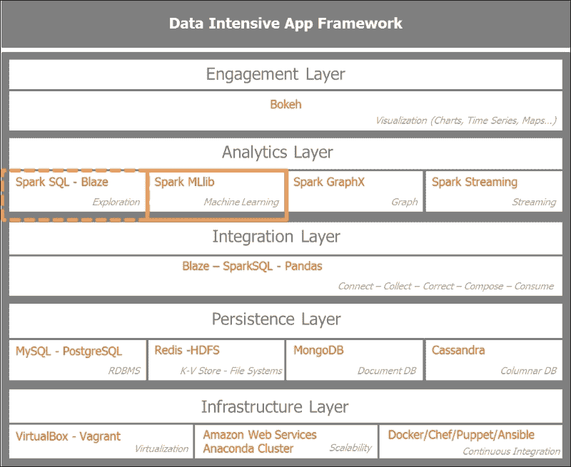
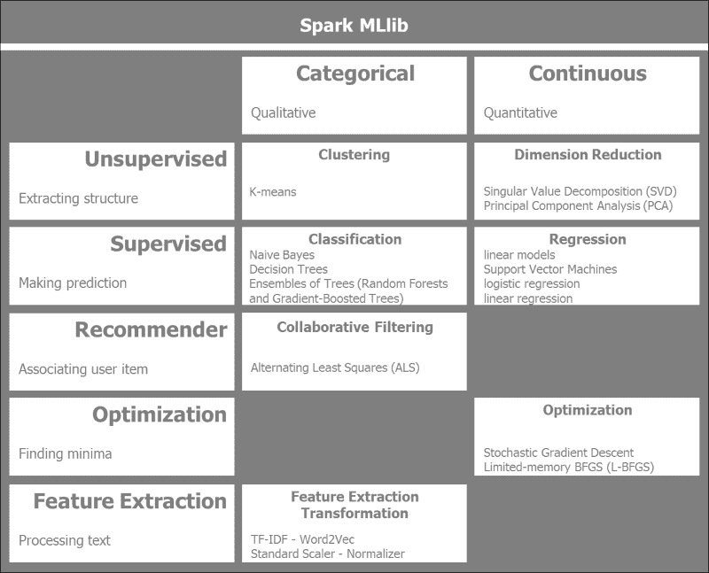
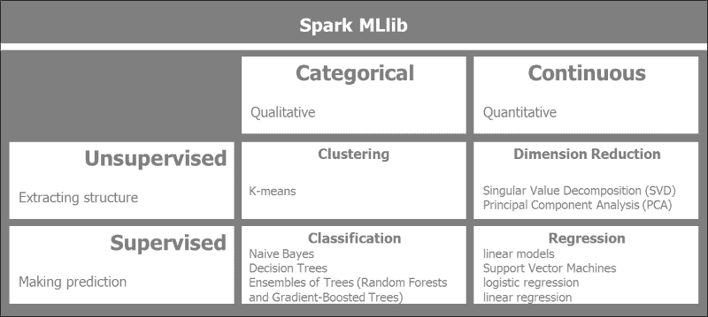
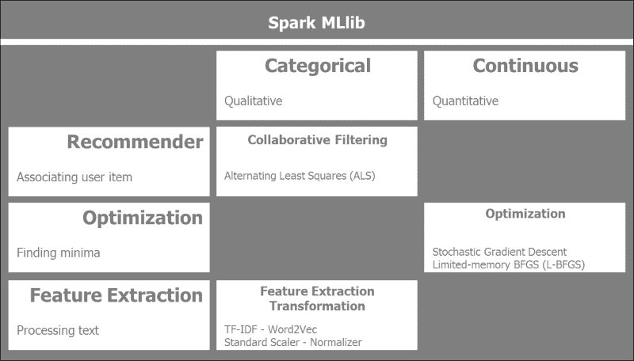
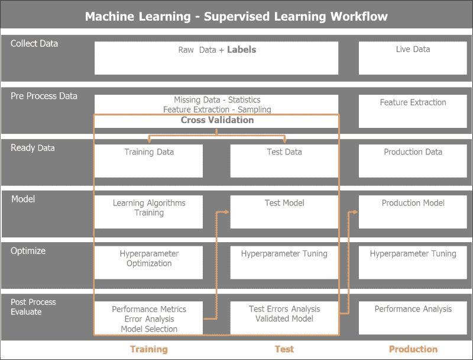
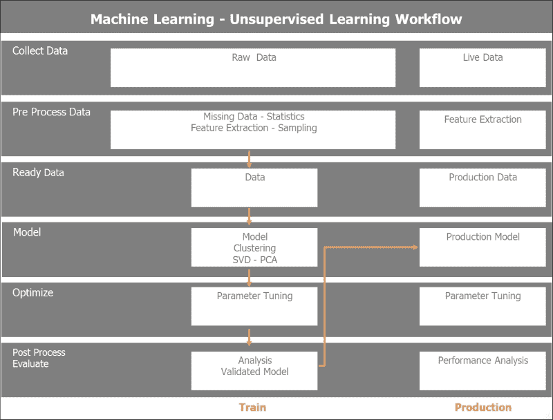
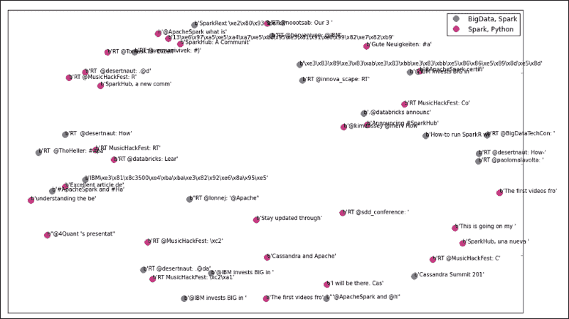
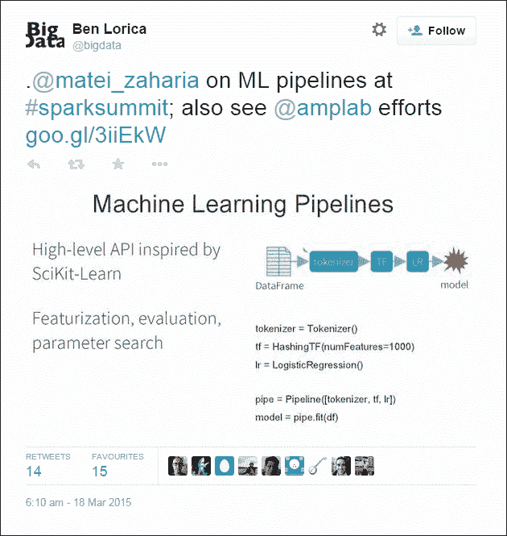

# 第四章：使用 Spark 从数据中学习

在前一章中，我们已经为数据收集奠定了基础，现在我们准备好从数据中学习。机器学习是从数据中提取洞察力。我们的目标是概述 Spark **MLlib**（简称**机器学习库**），并将适当的算法应用于我们的数据集以获得洞察力。从 Twitter 数据集中，我们将应用无监督聚类算法来区分 Apache Spark 相关的推文与其他推文。我们的初始输入是一堆混合的推文。我们首先需要预处理数据以提取相关特征，然后应用机器学习算法到我们的数据集，最后评估结果和模型的表现。

在本章中，我们将涵盖以下内容：

+   概述 Spark MLlib 模块及其算法和典型的机器学习工作流程。

+   对从 Twitter 收集的数据集进行预处理以提取相关特征，应用无监督聚类算法来识别*Apache Spark*相关的推文。然后，评估模型和获得的结果。

+   描述 Spark 机器学习管道。

# 在应用架构中定位 Spark MLlib

让我们先明确本章的重点是数据密集型应用架构。我们将集中关注分析层，更具体地说，是机器学习。这将为流式应用奠定基础，因为我们希望将数据批处理中的学习应用于流式分析的推理规则。

以下图表设置了本章重点的背景，突出了分析层中的机器学习模块，同时使用探索性数据分析、Spark SQL 和 Pandas 等工具。



# 分类 Spark MLlib 算法

Spark MLlib 是 Spark 的一个快速发展的模块，随着 Spark 的每次发布都会添加新的算法。

以下图表提供了 Spark MLlib 算法的高级概述，这些算法按照传统的广泛机器学习技术和数据的分类或连续性进行分组：



我们根据数据类型将 Spark MLlib 算法分为两列，分类或连续。我们区分数据是分类的或更具有定性性质的数据与连续数据，后者具有定量性质。定性数据的例子是预测天气；给定大气压力、温度以及云的存在和类型，天气将是晴朗、干燥、雨天或阴天。这些都是离散值。另一方面，假设我们想要预测房价，给定位置、面积和床的数量；可以使用线性回归预测房地产价值。在这种情况下，我们谈论的是连续或定量值。

水平分组反映了所使用的机器学习方法的类型。无监督与监督机器学习技术取决于训练数据是否标记。在无监督学习挑战中，不会向学习算法提供标签。目标是找到其输入中的隐藏结构。在监督学习的情况下，数据是标记的。重点是使用回归进行预测，如果数据是连续的，或者使用分类，如果数据是分类的。

机器学习的一个重要类别是推荐系统，它利用协同过滤技术。亚马逊网络商店和 Netflix 拥有非常强大的推荐系统，为他们的推荐提供支持。

**随机梯度下降**是适用于 Spark 分布式计算的一种机器学习优化技术。

对于处理大量文本，Spark 提供了关键库用于特征提取和转换，如**TF-IDF**（代表**词频-逆文档频率**），Word2Vec，标准缩放器和归一化器。

## 监督学习和无监督学习

我们在这里更深入地探讨 Spark MLlib 提供的传统机器学习算法。我们根据数据是否标记来区分监督学习和无监督学习。我们根据数据是否离散或连续来区分分类或连续。

以下图表解释了 Spark MLlib 的监督学习和无监督机器学习算法以及预处理技术：



Spark 中目前可用的以下监督学习和无监督学习算法以及预处理技术：

+   **聚类**：这是一种无监督机器学习技术，其中数据没有标记。目标是提取数据中的结构：

    +   **K-Means**：这种算法将数据划分为 K 个不同的簇

    +   **高斯混合**：簇是根据组件的最大后验概率分配的

    +   **幂迭代聚类（PIC）**：这种算法根据成对边的相似性对图的顶点进行分组

    +   **潜在狄利克雷分配**（**LDA**）：这用于将文本文档集合分组到主题中。

    +   **流 K-Means**：这意味着使用输入数据的窗口函数动态地流式传输数据的聚类。

+   **降维**：这旨在减少考虑的特征数量。本质上，这减少了数据中的噪声并关注关键特征：

    +   **奇异值分解**（**SVD**）：这将包含数据的矩阵分解成更简单、更有意义的部分。它将初始矩阵分解成三个矩阵。

    +   **主成分分析**（**PCA**）：这通过低维子空间近似高维数据集。

+   **回归和分类**：回归通过使用标记的训练数据来预测输出值，而分类将结果分组到类别中。分类的因变量是分类的或无序的，而回归的因变量是连续的且有顺序的：

    +   **线性回归模型**（线性回归、逻辑回归和支持向量机）：线性回归算法可以表示为凸优化问题，该问题旨在基于权重变量的向量最小化目标函数。目标函数通过函数的正则化部分控制模型的复杂性，通过函数的损失部分控制模型的误差。

    +   **朴素贝叶斯**：这基于给定观察的标签的条件概率分布进行预测。它假设特征之间相互独立。

    +   **决策树**：这执行特征空间的递归二分分区。为了确定最佳的分割，树节点级别的信息增益被最大化。

    +   **树集成**（随机森林和梯度提升树）：树集成算法通过组合基础决策树模型来构建一个性能良好的模型。它们直观且在分类和回归任务中非常成功。

+   **等距回归**：这最小化给定数据和观察到的响应之间的均方误差。

## 额外的学习算法

Spark MLlib 提供的算法比监督学习和无监督学习算法更多。我们广泛地有三种额外的机器学习类型：推荐系统、优化算法和特征提取。



以下是在 Spark 中当前可用的其他 MLlib 算法：

+   **协同过滤**：这是推荐系统的基础。它创建一个用户-项目关联矩阵并试图填补空白。基于其他用户和项目及其评分，它推荐一个目标用户没有评分的项目。在分布式计算中，最成功的算法之一是 **ALS**（代表 **交替最小二乘**）：

    +   **交替最小二乘法**：这种矩阵分解技术结合了隐式反馈、时间效应和置信水平。它将大的用户-项目矩阵分解为低维度的用户和项目因子。通过交替固定其因子来最小化二次损失函数。

+   **特征提取和转换**：这些是大型文本文档处理的基本技术。它包括以下技术：

    +   **词频**：搜索引擎使用 TF-IDF 对大量语料库中的文档相关性进行评分和排名。它也用于机器学习中确定文档或语料库中单词的重要性。词频统计上确定了术语相对于其在语料库中的频率的权重。仅词频本身可能会误导，因为它过分强调了如 *the*、*of* 或 *and* 这样的单词，这些单词提供的信息很少。逆文档频率提供了特异性或信息量的度量，无论术语在语料库的所有文档中是稀有还是常见。

    +   **Word2Vec**：这包括两个模型，**Skip-Gram** 和 **连续词袋模型**。Skip-Gram 根据滑动窗口中的单词预测给定单词的邻近单词，而连续词袋模型根据邻近单词预测当前单词。

    +   **标准缩放器**：作为预处理的一部分，数据集通常需要通过均值移除和方差缩放进行标准化。我们在训练数据上计算均值和标准差，并将相同的转换应用于测试数据。

    +   **归一化器**：我们将样本缩放到具有单位范数。对于二次形式，如点积或核方法，它很有用。

    +   **特征选择**：这通过选择模型中最相关的特征来降低向量空间的维度。

    +   **卡方选择器**：这是一种统计方法，用于衡量两个事件之间的独立性。

+   **优化**：这些特定的 Spark MLlib 优化算法专注于梯度下降的各种技术。Spark 在分布式机器集群上提供了非常高效的梯度下降实现。它通过迭代地沿着最陡下降方向寻找局部最小值。由于它迭代通过所有可用的数据，因此它计算密集型：

    +   **随机梯度下降**：我们最小化一个目标函数，该函数是不同可微函数的总和。随机梯度下降在特定迭代中仅使用训练数据的一个样本来更新参数。它用于大规模和稀疏机器学习问题，如文本分类。

+   **有限内存 BFGS**（**L-BFGS**）：正如其名，L-BFGS 使用有限的内存，适合 Spark MLlib 的分布式优化算法实现。

# Spark MLlib 数据类型

MLlib 支持四种基本数据类型：**本地向量**、**标记点**、**本地矩阵**和**分布式矩阵**。这些数据类型在 Spark MLlib 算法中得到了广泛的应用：

+   **本地向量**: 这位于单个机器上。它可以密集或稀疏：

    +   密集向量是一个传统的双精度数组。一个密集向量的例子是 `[5.0, 0.0, 1.0, 7.0]`。

    +   稀疏向量使用整数索引和双精度值。因此，向量 `[5.0, 0.0, 1.0, 7.0]` 的稀疏表示将是 `(4, [0, 2, 3], [5.0, 1.0, 7.0])`，其中 `4` 表示向量的维度。

        这里是 PySpark 中本地向量的示例：

        ```py
        import numpy as np
        import scipy.sparse as sps
        from pyspark.mllib.linalg import Vectors

        # NumPy array for dense vector.
        dvect1 = np.array([5.0, 0.0, 1.0, 7.0])
        # Python list for dense vector.
        dvect2 = [5.0, 0.0, 1.0, 7.0]
        # SparseVector creation
        svect1 = Vectors.sparse(4, [0, 2, 3], [5.0, 1.0, 7.0])
        # Sparse vector using a single-column SciPy csc_matrix
        svect2 = sps.csc_matrix((np.array([5.0, 1.0, 7.0]), np.array([0, 2, 3])), shape = (4, 1))
        ```

    +   **标记点**: 标记点是一个密集或稀疏向量，带有用于监督学习的标签。在二进制标签的情况下，0.0 表示负标签，而 1.0 表示正值。

        这里是 PySpark 中一个标记点的示例：

        ```py
        from pyspark.mllib.linalg import SparseVector
        from pyspark.mllib.regression import LabeledPoint

        # Labeled point with a positive label and a dense feature vector.
        lp_pos = LabeledPoint(1.0, [5.0, 0.0, 1.0, 7.0])

        # Labeled point with a negative label and a sparse feature vector.
        lp_neg = LabeledPoint(0.0, SparseVector(4, [0, 2, 3], [5.0, 1.0, 7.0]))
        ```

    +   **本地矩阵**: 这个本地矩阵位于单个机器上，具有整数类型的索引和双精度类型的值。

        这里是 PySpark 中一个本地矩阵的示例：

        ```py
        from pyspark.mllib.linalg import Matrix, Matrices

        # Dense matrix ((1.0, 2.0, 3.0), (4.0, 5.0, 6.0))
        dMatrix = Matrices.dense(2, 3, [1, 2, 3, 4, 5, 6])

        # Sparse matrix ((9.0, 0.0), (0.0, 8.0), (0.0, 6.0))
        sMatrix = Matrices.sparse(3, 2, [0, 1, 3], [0, 2, 1], [9, 6, 8])
        ```

    +   **分布式矩阵**: 利用 RDD 的分布式特性，分布式矩阵可以在机器集群中共享。我们区分四种分布式矩阵类型：`RowMatrix`、`IndexedRowMatrix`、`CoordinateMatrix`和`BlockMatrix`：

        +   `RowMatrix`: 这需要一个向量的 RDD，并从向量的 RDD 创建一个无意义的索引的行分布式矩阵，称为`RowMatrix`。

        +   `IndexedRowMatrix`: 在这种情况下，行索引是有意义的。首先，我们使用`IndexedRow`类创建一个索引行的 RDD，然后创建一个`IndexedRowMatrix`。

        +   `坐标矩阵`: 这对于表示非常大且非常稀疏的矩阵非常有用。`坐标矩阵`是由`MatrixEntry`点的 RDD 创建的，这些点由一个类型为（long，long 或 float）的元组表示。

        +   `块矩阵`: 这些矩阵是由子矩阵块 RDD 创建的，其中子矩阵块是 `((块行索引, 块列索引), 子矩阵)`。

# 机器学习工作流程和数据流

除了算法之外，机器学习还涉及过程。我们将讨论监督式和未监督式机器学习的典型工作流程和数据流。

## 监督式机器学习工作流程

在监督式机器学习中，输入训练数据集是标记的。关键数据实践之一是将输入数据分为训练集和测试集，并相应地验证模型。

在监督式学习中，我们通常经历六个步骤的过程流：

+   **收集数据**: 这一步实际上与上一章紧密相关，并确保我们收集到正确数量和粒度的数据，以便使机器学习算法能够提供可靠的答案。

+   **预处理数据**: 这一步是通过对数据进行抽样、填补缺失值（如果有）、缩放和归一化来检查数据质量。我们还定义了特征提取过程。通常，在大型基于文本的数据集的情况下，我们应用分词、去除停用词、词干提取和 TF-IDF。

    在监督学习的情况下，我们将输入数据分为训练集和测试集。我们还可以实施各种采样和分割数据集的策略，用于交叉验证。

+   **准备数据**：在这一步，我们获取算法期望的格式或数据类型的数据。在 Spark MLlib 的情况下，这包括本地向量、密集或稀疏向量、标记点、本地矩阵、带有行矩阵的分布式矩阵、索引行矩阵、坐标矩阵和块矩阵。

+   **模型**：在这一步，我们应用适合当前问题的算法，并获取评估步骤中最适合算法的结果。我们可能有多种适合问题的算法；它们各自的表现将在评估步骤中评分，以选择最佳表现者。我们可以实现集成或模型组合，以达到最佳结果。

+   **优化**：我们可能需要运行网格搜索以确定某些算法的最佳参数。这些参数在训练期间确定，并在测试和生产阶段进行微调。

+   **评估**：我们最终对模型进行评分，并选择在准确性、性能、可靠性和可扩展性方面最佳的模型。我们将最佳性能的模型移动到测试中，以测试保留的测试数据，以确定我们模型的预测准确性。一旦对微调后的模型满意，我们将将其移动到生产中处理实时数据。

监督机器学习工作流程和数据流如下图所示：



## 无监督机器学习工作流程

与监督学习不同，在无监督学习中，我们的初始数据没有标记，这在现实生活中是最常见的情况。我们将通过使用聚类或降维算法从数据中提取结构。在无监督学习的情况下，我们不会将数据分为训练集和测试集，因为我们无法进行任何预测，因为数据没有标记。我们将按照与监督学习类似的六个步骤训练数据。一旦模型训练完成，我们将评估结果并微调模型，然后将其发布到生产环境中。

无监督学习可以是监督学习的一个初步步骤。也就是说，我们在攻击学习阶段之前查看减少数据的维度。

无监督机器学习的工作流程和数据流如下所示：



# 对 Twitter 数据集进行聚类

让我们先了解一下从 Twitter 提取的数据，并了解数据结构，以便准备并运行它通过 K-Means 聚类算法。我们的攻击计划使用之前用于无监督学习的过程和数据流。步骤如下：

1.  将所有推文文件合并到一个单独的数据框中。

1.  解析推文，删除停用词，提取表情符号，提取 URL，最后规范化单词（例如，将它们映射为小写并删除标点符号和数字）。

1.  特征提取包括以下内容：

    +   **分词**：这会将解析的推文文本分解成单个单词或标记

    +   **TF-IDF**：这将对分词后的推文文本应用 TF-IDF 算法以创建特征向量

    +   **哈希 TF-IDF**：这将对标记向量应用哈希函数

1.  运行 K-Means 聚类算法。

1.  评估 K-Means 聚类结果：

    +   识别推文所属的聚类

    +   使用多维缩放或多维主成分分析算法将维度降低到二维

    +   绘制聚类

1.  管道：

    +   微调相关聚类数 K

    +   测量模型成本

    +   选择最佳模型

## 在 Twitter 数据集上应用 Scikit-Learn

Python 自带的 Scikit-Learn 机器学习库是最可靠、直观和健壮的工具之一。让我们通过 Pandas 和 Scikit-Learn 来运行预处理和无监督学习。在用 Spark MLlib 分离聚类之前，使用 Scikit-Learn 探索数据样本通常是有益的。

我们有 7,540 条推文的混合体。它包含与 Apache Spark、Python、即将到来的总统选举（希拉里·克林顿和唐纳德·特朗普为主角）相关的推文，以及一些与时尚和音乐（Lady Gaga 和贾斯汀·比伯）相关的推文。我们正在使用 Python Scikit-Learn 在收集的 Twitter 数据集上运行 K-Means 聚类算法。我们首先将样本数据加载到 Pandas 数据框中：

```py
import pandas as pd

csv_in = 'C:\\Users\\Amit\\Documents\\IPython Notebooks\\AN00_Data\\unq_tweetstxt.csv'
twts_df01 = pd.read_csv(csv_in, sep =';', encoding='utf-8')

In [24]:

twts_df01.count()
Out[24]:
Unnamed: 0    7540
id            7540
created_at    7540
user_id       7540
user_name     7538
tweet_text    7540
dtype: int64

#
# Introspecting the tweets text
#
In [82]:

twtstxt_ls01[6910:6920]
Out[82]:
['RT @deroach_Ismoke: I am NOT voting for #hilaryclinton http://t.co/jaZZpcHkkJ',
 'RT @AnimalRightsJen: #HilaryClinton What do Bernie Sanders and Donald Trump Have in Common?: He has so far been th... http://t.co/t2YRcGCh6…',
 'I understand why Bill was out banging other chicks........I mean look at what he is married to.....\n@HilaryClinton',
 '#HilaryClinton What do Bernie Sanders and Donald Trump Have in Common?: He has so far been th... http://t.co/t2YRcGCh67 #Tcot #UniteBlue']
```

我们首先从推文的文本中执行特征提取。我们使用 TF-IDF 向量化器并带有 10,000 个特征和英语停用词的稀疏向量器对数据集进行应用：

```py
In [37]:

print("Extracting features from the training dataset using a sparse vectorizer")
t0 = time()
Extracting features from the training dataset using a sparse vectorizer
In [38]:

vectorizer = TfidfVectorizer(max_df=0.5, max_features=10000,
                                 min_df=2, stop_words='english',
                                 use_idf=True)
X = vectorizer.fit_transform(twtstxt_ls01)
#
# Output of the TFIDF Feature vectorizer
#
print("done in %fs" % (time() - t0))
print("n_samples: %d, n_features: %d" % X.shape)
print()
done in 5.232165s
n_samples: 7540, n_features: 6638
```

由于数据集现在已分解为 7,540 个样本和 6,638 个特征向量，我们可以将这个稀疏矩阵输入到 K-Means 聚类算法中。我们最初将选择七个聚类和 100 次最大迭代：

```py
In [47]:

km = KMeans(n_clusters=7, init='k-means++', max_iter=100, n_init=1,
            verbose=1)

print("Clustering sparse data with %s" % km)
t0 = time()
km.fit(X)
print("done in %0.3fs" % (time() - t0))

Clustering sparse data with KMeans(copy_x=True, init='k-means++', max_iter=100, n_clusters=7, n_init=1,
    n_jobs=1, precompute_distances='auto', random_state=None, tol=0.0001,
    verbose=1)
Initialization complete
Iteration  0, inertia 13635.141
Iteration  1, inertia 6943.485
Iteration  2, inertia 6924.093
Iteration  3, inertia 6915.004
Iteration  4, inertia 6909.212
Iteration  5, inertia 6903.848
Iteration  6, inertia 6888.606
Iteration  7, inertia 6863.226
Iteration  8, inertia 6860.026
Iteration  9, inertia 6859.338
Iteration 10, inertia 6859.213
Iteration 11, inertia 6859.102
Iteration 12, inertia 6859.080
Iteration 13, inertia 6859.060
Iteration 14, inertia 6859.047
Iteration 15, inertia 6859.039
Iteration 16, inertia 6859.032
Iteration 17, inertia 6859.031
Iteration 18, inertia 6859.029
Converged at iteration 18
done in 1.701s
```

K-Means 聚类算法在 18 次迭代后收敛。在以下结果中，我们可以看到七个聚类及其相应的关键词。聚类 `0` 和 `6` 是关于音乐和时尚的，与贾斯汀·比伯和 Lady Gaga 相关的推文。聚类 `1` 和 `5` 与美国总统选举相关，与唐纳德·特朗普和希拉里·克林顿相关的推文。聚类 `2` 和 `3` 是我们感兴趣的，因为它们是关于 Apache Spark 和 Python 的。聚类 `4` 包含与泰国相关的推文：

```py
#
# Introspect top terms per cluster
#

In [49]:

print("Top terms per cluster:")
order_centroids = km.cluster_centers_.argsort()[:, ::-1]
terms = vectorizer.get_feature_names()
for i in range(7):
    print("Cluster %d:" % i, end='')
    for ind in order_centroids[i, :20]:
        print(' %s' % terms[ind], end='')
    print()
Top terms per cluster:
Cluster 0: justinbieber love mean rt follow thank hi https whatdoyoumean video wanna hear whatdoyoumeanviral rorykramer happy lol making person dream justin
Cluster 1: donaldtrump hilaryclinton rt https trump2016 realdonaldtrump trump gop amp justinbieber president clinton emails oy8ltkstze tcot like berniesanders hilary people email
Cluster 2: bigdata apachespark hadoop analytics rt spark training chennai ibm datascience apache processing cloudera mapreduce data sap https vora transforming development
Cluster 3: apachespark python https rt spark data amp databricks using new learn hadoop ibm big apache continuumio bluemix learning join open
Cluster 4: ernestsgantt simbata3 jdhm2015 elsahel12 phuketdailynews dreamintentions beyhiveinfrance almtorta18 civipartnership 9_a_6 25whu72ep0 k7erhvu7wn fdmxxxcm3h osxuh2fxnt 5o5rmb0xhp jnbgkqn0dj ovap57ujdh dtzsz3lb6x sunnysai12345 sdcvulih6g
Cluster 5: trump donald donaldtrump starbucks trumpquote trumpforpresident oy8ltkstze https zfns7pxysx silly goy stump trump2016 news jeremy coffee corbyn ok7vc8aetz rt tonight
Cluster 6: ladygaga gaga lady rt https love follow horror cd story ahshotel american japan hotel human trafficking music fashion diet queen ahs
```

我们将通过绘制聚类来可视化结果。我们有 7,540 个样本和 6,638 个特征。可视化这么多维度是不可能的。我们将使用 **多维缩放（MDS**）算法将聚类的多维特征降低到两个可处理的维度，以便能够描绘它们：

```py
import matplotlib.pyplot as plt
import matplotlib as mpl
from sklearn.manifold import MDS

MDS()

#
# Bring down the MDS to two dimensions (components) as we will plot 
# the clusters
#
mds = MDS(n_components=2, dissimilarity="precomputed", random_state=1)

pos = mds.fit_transform(dist)  # shape (n_components, n_samples)

xs, ys = pos[:, 0], pos[:, 1]

In [67]:

#
# Set up colors per clusters using a dict
#
cluster_colors = {0: '#1b9e77', 1: '#d95f02', 2: '#7570b3', 3: '#e7298a', 4: '#66a61e', 5: '#9990b3', 6: '#e8888a'}

#
#set up cluster names using a dict
#
cluster_names = {0: 'Music, Pop', 
                 1: 'USA Politics, Election', 
                 2: 'BigData, Spark', 
                 3: 'Spark, Python',
                 4: 'Thailand', 
                 5: 'USA Politics, Election', 
                 6: 'Music, Pop'}
In [115]:
#
# ipython magic to show the matplotlib plots inline
#
%matplotlib inline 

#
# Create data frame which includes MDS results, cluster numbers and tweet texts to be displayed
#
df = pd.DataFrame(dict(x=xs, y=ys, label=clusters, txt=twtstxt_ls02_utf8))
ix_start = 2000
ix_stop  = 2050
df01 = df[ix_start:ix_stop]

print(df01[['label','txt']])
print(len(df01))
print()

# Group by cluster

groups = df.groupby('label')
groups01 = df01.groupby('label')

# Set up the plot

fig, ax = plt.subplots(figsize=(17, 10)) 
ax.margins(0.05) 

#
# Build the plot object
#
for name, group in groups01:
    ax.plot(group.x, group.y, marker='o', linestyle='', ms=12, 
            label=cluster_names[name], color=cluster_colors[name], 
            mec='none')
    ax.set_aspect('auto')
    ax.tick_params(\
        axis= 'x',         # settings for x-axis
        which='both',      # 
        bottom='off',      # 
        top='off',         # 
        labelbottom='off')
    ax.tick_params(\
        axis= 'y',         # settings for y-axis
        which='both',      # 
        left='off',        # 
        top='off',         # 
        labelleft='off')

ax.legend(numpoints=1)     #
#
# Add label in x,y position with tweet text
#
for i in range(ix_start, ix_stop):
    ax.text(df01.ix[i]['x'], df01.ix[i]['y'], df01.ix[i]['txt'], size=10)  

plt.show()                 # Display the plot

      label       text
2000      2       b'RT @BigDataTechCon: '
2001      3       b"@4Quant 's presentat"
2002      2       b'Cassandra Summit 201'
```

下面是簇`2`、*大数据*和*Spark*的图表，用蓝色点表示，以及簇`3`、*Spark*和*Python*的图表，用红色点表示，还有一些与相应簇相关的样本推文：



我们通过使用 Scikit-Learn 进行探索和处理，对数据有了一些好的见解。现在，我们将把注意力转向 Spark MLlib，并在 Twitter 数据集上试驾一番。

## 预处理数据集

现在，我们将专注于特征提取和工程，以便为聚类算法运行准备数据。我们实例化 Spark 上下文，并将 Twitter 数据集读入 Spark 数据框。然后我们将依次对推文文本数据进行分词，对标记应用哈希词频算法，并最终应用逆文档频率算法并重新缩放数据。代码如下：

```py
In [3]:
#
# Read csv in a Panda DF
#
#
import pandas as pd
csv_in = '/home/an/spark/spark-1.5.0-bin-hadoop2.6/examples/AN_Spark/data/unq_tweetstxt.csv'
pddf_in = pd.read_csv(csv_in, index_col=None, header=0, sep=';', encoding='utf-8')

In [4]:

sqlContext = SQLContext(sc)

In [5]:

#
# Convert a Panda DF to a Spark DF
#
#

spdf_02 = sqlContext.createDataFrame(pddf_in[['id', 'user_id', 'user_name', 'tweet_text']])

In [8]:

spdf_02.show()

In [7]:

spdf_02.take(3)

Out[7]:

[Row(id=638830426971181057, user_id=3276255125, user_name=u'True Equality', tweet_text=u'ernestsgantt: BeyHiveInFrance: 9_A_6: dreamintentions: elsahel12: simbata3: JDHM2015: almtorta18: dreamintentions:\u2026 http://t.co/VpD7FoqMr0'),
 Row(id=638830426727911424, user_id=3276255125, user_name=u'True Equality', tweet_text=u'ernestsgantt: BeyHiveInFrance: PhuketDailyNews: dreamintentions: elsahel12: simbata3: JDHM2015: almtorta18: CiviPa\u2026 http://t.co/VpD7FoqMr0'),
 Row(id=638830425402556417, user_id=3276255125, user_name=u'True Equality', tweet_text=u'ernestsgantt: BeyHiveInFrance: 9_A_6: ernestsgantt: elsahel12: simbata3: JDHM2015: almtorta18: CiviPartnership: dr\u2026 http://t.co/EMDOn8chPK')]

In [9]:

from pyspark.ml.feature import HashingTF, IDF, Tokenizer

In [10]:

#
# Tokenize the tweet_text 
#
tokenizer = Tokenizer(inputCol="tweet_text", outputCol="tokens")
tokensData = tokenizer.transform(spdf_02)

In [11]:

tokensData.take(1)

Out[11]:

[Row(id=638830426971181057, user_id=3276255125, user_name=u'True Equality', tweet_text=u'ernestsgantt: BeyHiveInFrance: 9_A_6: dreamintentions: elsahel12: simbata3: JDHM2015: almtorta18: dreamintentions:\u2026 http://t.co/VpD7FoqMr0', tokens=[u'ernestsgantt:', u'beyhiveinfrance:', u'9_a_6:', u'dreamintentions:', u'elsahel12:', u'simbata3:', u'jdhm2015:', u'almtorta18:', u'dreamintentions:\u2026', u'http://t.co/vpd7foqmr0'])]

In [14]:

#
# Apply Hashing TF to the tokens
#
hashingTF = HashingTF(inputCol="tokens", outputCol="rawFeatures", numFeatures=2000)
featuresData = hashingTF.transform(tokensData)

In [15]:

featuresData.take(1)

Out[15]:

[Row(id=638830426971181057, user_id=3276255125, user_name=u'True Equality', tweet_text=u'ernestsgantt: BeyHiveInFrance: 9_A_6: dreamintentions: elsahel12: simbata3: JDHM2015: almtorta18: dreamintentions:\u2026 http://t.co/VpD7FoqMr0', tokens=[u'ernestsgantt:', u'beyhiveinfrance:', u'9_a_6:', u'dreamintentions:', u'elsahel12:', u'simbata3:', u'jdhm2015:', u'almtorta18:', u'dreamintentions:\u2026', u'http://t.co/vpd7foqmr0'], rawFeatures=SparseVector(2000, {74: 1.0, 97: 1.0, 100: 1.0, 160: 1.0, 185: 1.0, 742: 1.0, 856: 1.0, 991: 1.0, 1383: 1.0, 1620: 1.0}))]

In [16]:

#
# Apply IDF to the raw features and rescale the data
#
idf = IDF(inputCol="rawFeatures", outputCol="features")
idfModel = idf.fit(featuresData)
rescaledData = idfModel.transform(featuresData)

for features in rescaledData.select("features").take(3):
  print(features)

In [17]:

rescaledData.take(2)

Out[17]:

[Row(id=638830426971181057, user_id=3276255125, user_name=u'True Equality', tweet_text=u'ernestsgantt: BeyHiveInFrance: 9_A_6: dreamintentions: elsahel12: simbata3: JDHM2015: almtorta18: dreamintentions:\u2026 http://t.co/VpD7FoqMr0', tokens=[u'ernestsgantt:', u'beyhiveinfrance:', u'9_a_6:', u'dreamintentions:', u'elsahel12:', u'simbata3:', u'jdhm2015:', u'almtorta18:', u'dreamintentions:\u2026', u'http://t.co/vpd7foqmr0'], rawFeatures=SparseVector(2000, {74: 1.0, 97: 1.0, 100: 1.0, 160: 1.0, 185: 1.0, 742: 1.0, 856: 1.0, 991: 1.0, 1383: 1.0, 1620: 1.0}), features=SparseVector(2000, {74: 2.6762, 97: 1.8625, 100: 2.6384, 160: 2.9985, 185: 2.7481, 742: 5.5269, 856: 4.1406, 991: 2.9518, 1383: 4.694, 1620: 3.073})),
 Row(id=638830426727911424, user_id=3276255125, user_name=u'True Equality', tweet_text=u'ernestsgantt: BeyHiveInFrance: PhuketDailyNews: dreamintentions: elsahel12: simbata3: JDHM2015: almtorta18: CiviPa\u2026 http://t.co/VpD7FoqMr0', tokens=[u'ernestsgantt:', u'beyhiveinfrance:', u'phuketdailynews:', u'dreamintentions:', u'elsahel12:', u'simbata3:', u'jdhm2015:', u'almtorta18:', u'civipa\u2026', u'http://t.co/vpd7foqmr0'], rawFeatures=SparseVector(2000, {74: 1.0, 97: 1.0, 100: 1.0, 160: 1.0, 185: 1.0, 460: 1.0, 987: 1.0, 991: 1.0, 1383: 1.0, 1620: 1.0}), features=SparseVector(2000, {74: 2.6762, 97: 1.8625, 100: 2.6384, 160: 2.9985, 185: 2.7481, 460: 6.4432, 987: 2.9959, 991: 2.9518, 1383: 4.694, 1620: 3.073}))]

In [21]:

rs_pddf = rescaledData.toPandas()

In [22]:

rs_pddf.count()

Out[22]:

id             7540
user_id        7540
user_name      7540
tweet_text     7540
tokens         7540
rawFeatures    7540
features       7540
dtype: int64

In [27]:

feat_lst = rs_pddf.features.tolist()

In [28]:

feat_lst[:2]

Out[28]:

[SparseVector(2000, {74: 2.6762, 97: 1.8625, 100: 2.6384, 160: 2.9985, 185: 2.7481, 742: 5.5269, 856: 4.1406, 991: 2.9518, 1383: 4.694, 1620: 3.073}),
 SparseVector(2000, {74: 2.6762, 97: 1.8625, 100: 2.6384, 160: 2.9985, 185: 2.7481, 460: 6.4432, 987: 2.9959, 991: 2.9518, 1383: 4.694, 1620: 3.073})]
```

## 运行聚类算法

我们将使用 K-Means 算法对 Twitter 数据集进行处理。作为一个未标记且打乱的推文集合，我们想看看*Apache Spark*的推文是否被分在单个簇中。在前面的步骤中，特征 TF-IDF 稀疏向量被转换成一个 RDD，它将成为 Spark MLlib 程序的输入。我们用 5 个簇、10 次迭代和 10 次运行初始化 K-Means 模型：

```py
In [32]:

from pyspark.mllib.clustering import KMeans, KMeansModel
from numpy import array
from math import sqrt

In [34]:

# Load and parse the data

in_Data = sc.parallelize(feat_lst)

In [35]:

in_Data.take(3)

Out[35]:

[SparseVector(2000, {74: 2.6762, 97: 1.8625, 100: 2.6384, 160: 2.9985, 185: 2.7481, 742: 5.5269, 856: 4.1406, 991: 2.9518, 1383: 4.694, 1620: 3.073}),
 SparseVector(2000, {74: 2.6762, 97: 1.8625, 100: 2.6384, 160: 2.9985, 185: 2.7481, 460: 6.4432, 987: 2.9959, 991: 2.9518, 1383: 4.694, 1620: 3.073}),
 SparseVector(2000, {20: 4.3534, 74: 2.6762, 97: 1.8625, 100: 5.2768, 185: 2.7481, 856: 4.1406, 991: 2.9518, 1039: 3.073, 1620: 3.073, 1864: 4.6377})]

In [37]:

in_Data.count()

Out[37]:

7540

In [38]:

# Build the model (cluster the data)

clusters = KMeans.train(in_Data, 5, maxIterations=10,
        runs=10, initializationMode="random")

In [53]:

# Evaluate clustering by computing Within Set Sum of Squared Errors

def error(point):
    center = clusters.centers[clusters.predict(point)]
    return sqrt(sum([x**2 for x in (point - center)]))

WSSSE = in_Data.map(lambda point: error(point)).reduce(lambda x, y: x + y)
print("Within Set Sum of Squared Error = " + str(WSSSE))
```

## 评估模型和结果

调整聚类算法的一种方法是通过改变簇的数量并验证输出。让我们检查簇并感受一下到目前为止的聚类结果：

```py
In [43]:

cluster_membership = in_Data.map(lambda x: clusters.predict(x))

In [54]:

cluster_idx = cluster_membership.zipWithIndex()

In [55]:

type(cluster_idx)

Out[55]:

pyspark.rdd.PipelinedRDD

In [58]:

cluster_idx.take(20)

Out[58]:

[(3, 0),
 (3, 1),
 (3, 2),
 (3, 3),
 (3, 4),
 (3, 5),
 (1, 6),
 (3, 7),
 (3, 8),
 (3, 9),
 (3, 10),
 (3, 11),
 (3, 12),
 (3, 13),
 (3, 14),
 (1, 15),
 (3, 16),
 (3, 17),
 (1, 18),
 (1, 19)]

In [59]:

cluster_df = cluster_idx.toDF()

In [65]:

pddf_with_cluster = pd.concat([pddf_in, cluster_pddf],axis=1)

In [76]:

pddf_with_cluster._1.unique()

Out[76]:

array([3, 1, 4, 0, 2])

In [79]:

pddf_with_cluster[pddf_with_cluster['_1'] == 0].head(10)

Out[79]:
  Unnamed: 0   id   created_at   user_id   user_name   tweet_text   _1   _2
6227   3   642418116819988480   Fri Sep 11 19:23:09 +0000 2015   49693598   Ajinkya Kale   RT @bigdata: Distributed Matrix Computations i...   0   6227
6257   45   642391207205859328   Fri Sep 11 17:36:13 +0000 2015   937467860   Angela Bassa   [Auto] I'm reading ""Distributed Matrix Comput...   0   6257
6297   119   642348577147064320   Fri Sep 11 14:46:49 +0000 2015   18318677   Ben Lorica   Distributed Matrix Computations in @ApacheSpar...   0   6297
In [80]:

pddf_with_cluster[pddf_with_cluster['_1'] == 1].head(10)

Out[80]:
  Unnamed: 0   id   created_at   user_id   user_name   tweet_text   _1   _2
6   6   638830419090079746   Tue Sep 01 21:46:55 +0000 2015   2241040634   Massimo Carrisi   Python:Python: Removing \xa0 from string? - I ...   1   6
15   17   638830380578045953   Tue Sep 01 21:46:46 +0000 2015   57699376   Rafael Monnerat   RT @ramalhoorg: Noite de autógrafos do Fluent ...   1   15
18   41   638830280988426250   Tue Sep 01 21:46:22 +0000 2015   951081582   Jack Baldwin   RT @cloudaus: We are 3/4 full! 2-day @swcarpen...   1   18
19   42   638830276626399232   Tue Sep 01 21:46:21 +0000 2015   6525302   Masayoshi Nakamura   PynamoDB #AWS #DynamoDB #Python http://...   1   19
20   43   638830213288235008   Tue Sep 01 21:46:06 +0000 2015   3153874869   Baltimore Python   Flexx: Python UI tookit based on web technolog...   1   20
21   44   638830117645516800   Tue Sep 01 21:45:43 +0000 2015   48474625   Radio Free Denali   Hmm, emerge --depclean wants to remove somethi...   1   21
22   46   638829977014636544   Tue Sep 01 21:45:10 +0000 2015   154915461   Luciano Ramalho   Noite de autógrafos do Fluent Python no Garoa ...   1   22
23   47   638829882928070656   Tue Sep 01 21:44:47 +0000 2015   917320920   bsbafflesbrains   @DanSWright Harper channeling Monty Python. "...   1   23
24   48   638829868679954432   Tue Sep 01 21:44:44 +0000 2015   134280898   Lannick Technology   RT @SergeyKalnish: I am #hiring: Senior Back e...   1   24
25   49   638829707484508161   Tue Sep 01 21:44:05 +0000 2015   2839203454   Joshua Jones   RT @LindseyPelas: Surviving Monty Python in Fl...   1   25
In [81]:

pddf_with_cluster[pddf_with_cluster['_1'] == 2].head(10)

Out[81]:
  Unnamed: 0   id   created_at   user_id   user_name   tweet_text   _1   _2
7280   688   639056941592014848   Wed Sep 02 12:47:02 +0000 2015   2735137484   Chris   A true gay icon when will @ladygaga @Madonna @...   2   7280
In [82]:

pddf_with_cluster[pddf_with_cluster['_1'] == 3].head(10)

Out[82]:
  Unnamed: 0   id   created_at   user_id   user_name   tweet_text   _1   _2
0   0   638830426971181057   Tue Sep 01 21:46:57 +0000 2015   3276255125   True Equality   ernestsgantt: BeyHiveInFrance: 9_A_6: dreamint...   3   0
1   1   638830426727911424   Tue Sep 01 21:46:57 +0000 2015   3276255125   True Equality   ernestsgantt: BeyHiveInFrance: PhuketDailyNews...   3   1
2   2   638830425402556417   Tue Sep 01 21:46:56 +0000 2015   3276255125   True Equality   ernestsgantt: BeyHiveInFrance: 9_A_6: ernestsg...   3   2
3   3   638830424563716097   Tue Sep 01 21:46:56 +0000 2015   3276255125   True Equality   ernestsgantt: BeyHiveInFrance: PhuketDailyNews...   3   3
4   4   638830422256816132   Tue Sep 01 21:46:56 +0000 2015   3276255125   True Equality   ernestsgantt: elsahel12: 9_A_6: dreamintention...   3   4
5   5   638830420159655936   Tue Sep 01 21:46:55 +0000 2015   3276255125   True Equality   ernestsgantt: BeyHiveInFrance: PhuketDailyNews...   3   5
7   7   638830418330980352   Tue Sep 01 21:46:55 +0000 2015   3276255125   True Equality   ernestsgantt: elsahel12: 9_A_6: dreamintention...   3   7
8   8   638830397648822272   Tue Sep 01 21:46:50 +0000 2015   3276255125   True Equality   ernestsgantt: BeyHiveInFrance: PhuketDailyNews...   3   8
9   9   638830395375529984   Tue Sep 01 21:46:49 +0000 2015   3276255125   True Equality   ernestsgantt: elsahel12: 9_A_6: dreamintention...   3   9
10   10   638830392389177344   Tue Sep 01 21:46:49 +0000 2015   3276255125   True Equality   ernestsgantt: BeyHiveInFrance: PhuketDailyNews...   3   10
In [83]:

pddf_with_cluster[pddf_with_cluster['_1'] == 4].head(10)

Out[83]:
  Unnamed: 0   id   created_at   user_id   user_name   tweet_text   _1   _2
1361   882   642648214454317056   Sat Sep 12 10:37:28 +0000 2015   27415756   Raymond Enisuoh   LA Chosen For US 2024 Olympic Bid - LA2016 See...   4   1361
1363   885   642647848744583168   Sat Sep 12 10:36:01 +0000 2015   27415756   Raymond Enisuoh   Prison See: https://t.co/x3EKAExeFi … … … … … ...   4   1363
5412   11   640480770369286144   Sun Sep 06 11:04:49 +0000 2015   3242403023   Donald Trump 2016   " igiboooy! @ Starbucks https://t.co/97wdL...   4   5412
5428   27   640477140660518912   Sun Sep 06 10:50:24 +0000 2015   3242403023   Donald Trump 2016   "  @ Starbucks https://t.co/wsEYFIefk7 " - D...   4   5428
5455   61   640469542272110592   Sun Sep 06 10:20:12 +0000 2015   3242403023   Donald Trump 2016   " starbucks @ Starbucks Mam Plaza https://t.co...   4   5455
5456   62   640469541370372096   Sun Sep 06 10:20:12 +0000 2015   3242403023   Donald Trump 2016   " Aaahhh the pumpkin spice latte is back, fall...   4   5456
5457   63   640469539524898817   Sun Sep 06 10:20:12 +0000 2015   3242403023   Donald Trump 2016   " RT kayyleighferry: Oh my goddd Harry Potter ...   4   5457
5458   64   640469537176031232   Sun Sep 06 10:20:11 +0000 2015   3242403023   Donald Trump 2016   " Starbucks https://t.co/3xYYXlwNkf " - Donald...   4   5458
5459   65   640469536119070720   Sun Sep 06 10:20:11 +0000 2015   3242403023   Donald Trump 2016   " A Starbucks is under construction in my neig...   4   5459
5460   66   640469530435813376   Sun Sep 06 10:20:10 +0000 2015   3242403023   Donald Trump 2016   " Babam starbucks'tan fotogtaf atıyor bende du...   4   5460
```

我们将`5`个簇与一些样本推文进行映射。簇`0`是关于 Spark 的。簇`1`是关于 Python 的。簇`2`是关于 Lady Gaga 的。簇`3`是关于泰国普吉岛新闻的。簇`4`是关于唐纳德·特朗普的。

# 构建机器学习管道

我们希望在优化最佳调整参数以获得最佳性能模型的同时，组合特征提取、准备活动、训练、测试和预测活动。

以下推文完美地用五行代码实现了在 Spark MLlib 中实现的强大机器学习管道：



Spark ML 管道灵感来源于 Python 的 Scikit-Learn，它创建了一个简洁的、声明性的语句，用于对数据进行连续的转换，以便快速交付可调整的模型。

# 摘要

在本章中，我们概述了 Spark MLlib 不断扩大的算法库 Spark MLlib。我们讨论了监督学习和无监督学习、推荐系统、优化和特征提取算法。然后我们将从 Twitter 收集的数据放入机器学习过程、算法和评估中，以从数据中提取见解。我们将 Twitter 收集的数据集通过 Python Scikit-Learn 和 Spark MLlib K-means 聚类进行分离，以隔离与*Apache Spark*相关的推文。我们还评估了模型的性能。

这为我们准备进入下一章打下了基础，下一章将涵盖使用 Spark 的流式分析。让我们直接进入正题。
