# 第五章：使用 Spark 处理实时数据

在本章中，我们将专注于流入 Spark 的实时数据流以及对其进行处理。到目前为止，我们已经讨论了使用批量处理进行机器学习和数据挖掘。我们现在正在查看处理持续流动的数据并在飞行中检测事实和模式。我们正在从湖泊导航到河流。

我们将首先调查由此动态且不断变化的环境产生的挑战。在为流式应用程序奠定基础之后，我们将调查使用实时数据源（如 TCP 套接字到 Twitter 的 firehose）的各种实现，并建立一个低延迟、高吞吐量和可扩展的数据管道，结合 Spark、Kafka 和 Flume。

在本章中，我们将涵盖以下内容：

+   分析流式应用程序的架构挑战、约束和需求

+   使用 Spark Streaming 从 TCP 套接字处理实时数据

+   直接连接到 Twitter 的 firehose 以解析近似实时的推文

+   使用 Spark、Kafka 和 Flume 建立一个可靠、容错、可扩展、高吞吐量、低延迟的集成应用程序

+   关于 Lambda 和 Kappa 架构范式的结束语

# 建立流式架构的基础

按照惯例，我们首先回到我们原始的数据密集型应用架构蓝图，并突出显示将成为关注焦点的 Spark Streaming 模块。

下图通过突出显示 Spark Streaming 模块以及与 Spark SQL 和 Spark MLlib 在整体数据密集型应用框架中的交互，为上下文设定了背景。

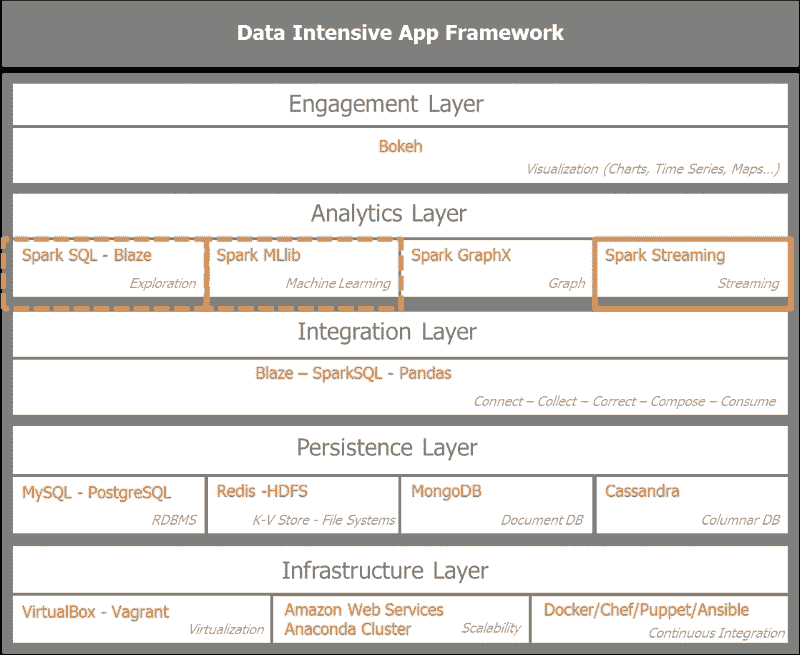

数据来自股市时间序列、企业交易、交互、事件、网络流量、点击流和传感器。所有事件都是带时间戳的数据且紧急。这是欺诈检测和预防、移动交叉销售和升级、或交通警报的情况。这些数据流需要立即处理以进行监控，例如检测异常、离群值、垃圾邮件、欺诈和入侵；同时也为提供基本统计、洞察、趋势和建议。在某些情况下，汇总的聚合信息足以存储以供以后使用。从架构范式角度来看，我们正从面向服务的架构转向事件驱动架构。

出现了两种处理数据流模型：

+   按照接收到的顺序逐条处理记录。在处理之前，我们不会在容器中缓冲传入的记录。这是 Twitter 的 Storm、Yahoo 的 S4 和 Google 的 MillWheel 的情况。

+   微批处理或 Spark Streaming 和 Storm Trident 执行的小间隔批计算。在这种情况下，我们根据微批处理设置中规定的时间窗口在容器中缓冲传入的记录。

Spark Streaming 经常被与 Storm 进行比较。它们是两种不同的流数据处理模型。Spark Streaming 基于微批处理。Storm 基于处理实时到达的记录。Storm 还提供了微批处理选项，即其 Storm Trident 选项。

流式应用程序的驱动因素是延迟。延迟从**RPC**（远程过程调用简称）的毫秒级范围到微批处理解决方案如 Spark Streaming 的几秒或几分钟不等。

RPC 允许请求程序在等待远程服务器程序的响应时进行同步操作。线程允许多个 RPC 调用到服务器的并发。

实现分布式 RPC 模型的软件示例是 Apache Storm。

Storm 通过使用拓扑或有向无环图（DAG）实现无界元组的无状态亚毫秒延迟处理，其中将 spouts 作为数据流源，bolts 用于过滤、连接、聚合和转换等操作。Storm 还实现了一个更高层次的抽象，称为**Trident**，类似于 Spark，它以微批量的方式处理数据流。

因此，从亚毫秒到秒的延迟连续体来看，Storm 是一个很好的候选者。对于秒到分钟的规模，Spark Streaming 和 Storm Trident 是极佳的匹配。对于几分钟以上的情况，Spark 和如 Cassandra 或 HBase 这样的 NoSQL 数据库是足够的解决方案。对于超过小时的范围和高数据量，Hadoop 是理想的竞争者。

虽然吞吐量与延迟相关，但它们之间不是简单的线性关系。如果处理一个消息需要 2 毫秒，这决定了延迟，那么人们会假设吞吐量限制在每秒 500 条消息。如果我们允许消息额外缓冲 8 毫秒，批处理消息可以允许更高的吞吐量。在 10 毫秒的延迟下，系统可以缓冲高达 10,000 条消息。为了在可接受的延迟增加范围内，我们显著提高了吞吐量。这是 Spark Streaming 利用的微批处理的魔力。

## Spark Streaming 的内部工作原理

Spark Streaming 架构利用了 Spark 核心架构。它通过在**SparkContext**上叠加一个**StreamingContext**作为流功能入口点。集群管理器将至少分配一个工作节点作为接收器，该节点将是一个具有*长任务*的执行器，用于处理传入的流。执行器从输入数据流创建离散流或 DStream，并默认将其复制到另一个工作节点的缓存中。一个接收器服务一个输入数据流。多个接收器提高了并行性，并生成多个 Spark 可以联合或连接的弹性分布式数据集（RDD）。

下图概述了 Spark Streaming 的内部工作原理。客户端通过集群管理器与 Spark 集群交互，而 Spark Streaming 有一个专门的工人，它有一个长期运行的任务，用于摄取输入数据流并将其转换为离散流或 DStream。数据由接收器收集、缓冲和复制，然后推送到 RDD 流。

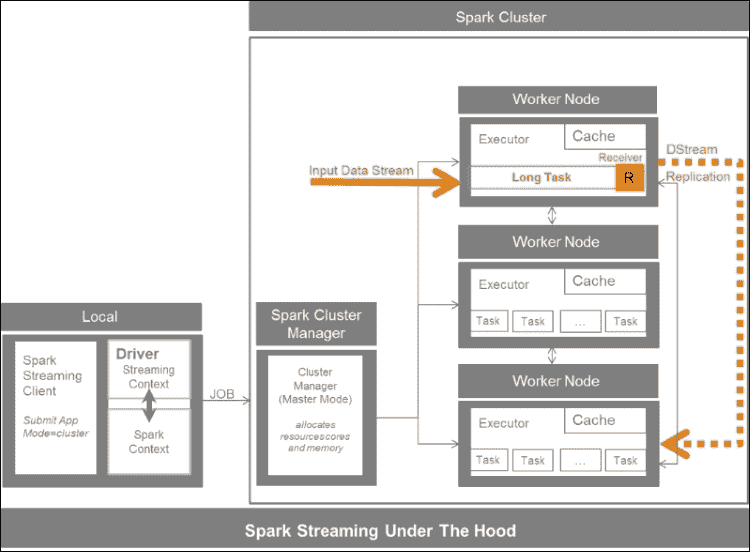

Spark 接收器可以从许多来源摄取数据。核心输入源包括 TCP 套接字和 HDFS/Amazon S3 到 Akka Actors。其他来源包括 Apache Kafka、Apache Flume、Amazon Kinesis、ZeroMQ、Twitter 以及自定义或用户定义的接收器。

我们区分了可靠资源，这些资源确认已从源接收数据，并可能进行重发以进行复制，以及不可靠的接收器，这些接收器不确认消息的接收。Spark 在工作者数量、分区和接收器方面进行扩展。

下图概述了 Spark Streaming，包括可能的来源和持久化选项：

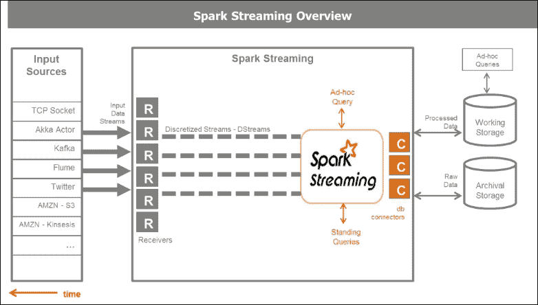

## 深入 Spark Streaming 内部

Spark Streaming 由接收器和由离散流和 Spark 连接器提供持久化的 Discretized Streams 组成。

对于 Spark Core 来说，基本的数据结构是 RDD，Spark Streaming 的基本编程抽象是离散流或 DStream。

下图说明了离散流作为 RDD 的连续序列。DStream 的批处理间隔是可配置的。

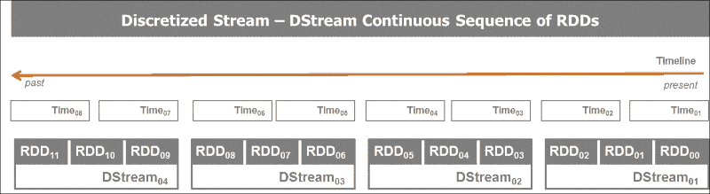

DStream 在批处理间隔内快照传入的数据。这些时间步通常从 500 毫秒到几秒不等。DStream 的底层结构是一个 RDD。

DStream 本质上是一系列连续的 RDD。这很强大，因为它允许我们利用 Spark Streaming 中所有传统的函数、转换和操作，并允许我们与 Spark SQL 对话，对传入的数据流执行 SQL 查询，以及 Spark MLlib。类似于通用和键值对 RDD 上的转换是适用的。DStreams 受益于内部 RDD 的 lineage 和容错性。存在额外的转换和输出操作用于离散流操作。大多数 DStream 上的通用操作是**转换**和**foreachRDD**。

下图概述了 DStream 的生命周期。从创建消息的微批到在 RDD 上应用`转换`函数和触发 Spark 作业的操作。分解图中展示的步骤，我们自上而下地读取图：

1.  在输入流中，根据为微批处理分配的时间窗口，传入的消息被缓冲在一个容器中。

1.  在离散流步骤中，缓冲的微批次被转换为 DStream RDDs。

1.  通过应用转换函数到原始 DStream，获得映射 DStream 步骤。这三个步骤构成了在预定义时间窗口中接收的原始数据的转换。由于底层数据结构是 RDD，我们保留了转换的数据血缘。

1.  最后一步是对 RDD 执行的操作。它触发 Spark 作业。

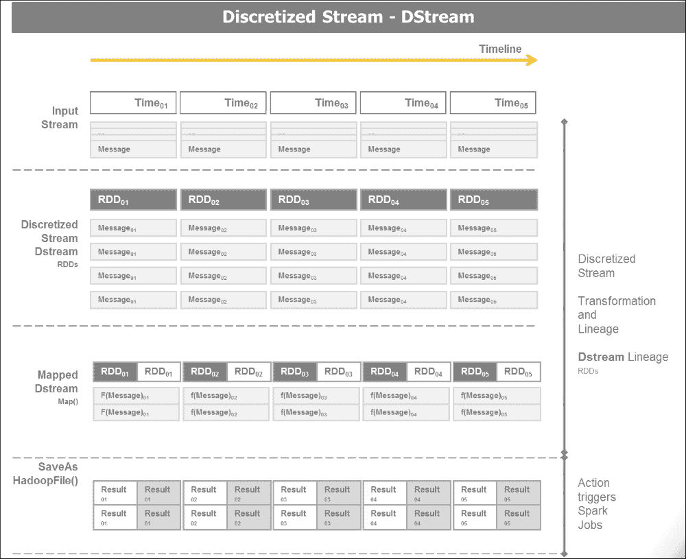

转换可以是无状态的或状态性的。*无状态*意味着程序不维护任何状态，而*状态性*意味着程序保持状态，在这种情况下，之前的交易会被记住并可能影响当前交易。状态性操作修改或需要系统的某些状态，而无状态操作则不需要。

无状态转换一次处理 DStream 中的每个批次。状态性转换处理多个批次以获得结果。状态性转换需要配置检查点目录。检查点是 Spark Streaming 中容错的主要机制，定期保存应用程序的数据和元数据。

对于 Spark Streaming，有两种状态转换类型：`updateStateByKey` 和窗口转换。

`updateStateByKey` 是维护流中每个键的 Pair RDD 状态的转换。它返回一个新的*状态* DStream，其中每个键的状态通过在键的先前状态和每个键的新值上应用给定的函数来更新。一个例子是对推文流中给定标签的运行计数。

窗口转换在滑动窗口中跨越多个批次进行。窗口具有一个定义的长度或持续时间，以时间单位指定。它必须是 DStream 批次间隔的倍数。它定义了窗口转换中包含多少个批次。

窗口具有一个以时间单位指定的滑动间隔或滑动持续时间。它必须是 DStream 批次间隔的倍数。它定义了滑动窗口的滑动次数或窗口转换计算的频率。

下面的模式图描述了在 DStreams 上执行窗口操作，以获得具有给定长度和滑动间隔的窗口 DStreams：

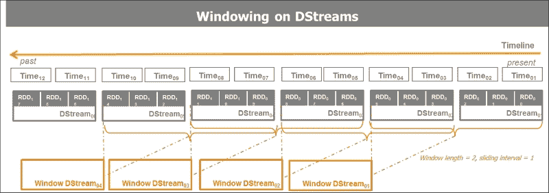

一个示例函数是 `countByWindow` (`windowLength`, `slideInterval`)。它返回一个新的 DStream，其中每个 RDD 通过在此 DStream 上对滑动窗口中的元素数量进行计数来生成一个单一元素。在这种情况下，一个例子是每 60 秒对推文流中给定标签的运行计数。窗口时间范围被指定。

分分钟级的窗口长度是合理的。小时级的窗口长度不建议使用，因为它计算和内存密集。在 Cassandra 或 HBase 等数据库中聚合数据会更方便。

窗口转换根据窗口长度和窗口滑动间隔计算结果。Spark 的性能主要受窗口长度、窗口滑动间隔和持久性的影响。

## 构建容错性

实时流处理系统必须全天候运行。它们需要能够抵御系统中的各种故障。Spark 及其 RDD 抽象设计用于无缝处理集群中任何工作节点的故障。

主 Spark Streaming 容错机制包括检查点、自动驱动程序重启和自动故障转移。Spark 通过检查点启用从驱动程序故障的恢复，从而保留应用程序状态。

写入前日志、可靠的接收器和文件流确保自 Spark 版本 1.2 起零数据丢失。写入前日志代表接收数据的容错存储。

故障需要重新计算结果。DStream 操作具有精确一次语义。转换可以多次重新计算，但将产生相同的结果。DStream 输出操作至少一次语义。输出操作可能被多次执行。

# 使用 TCP 套接字处理实时数据

作为对流操作整体理解的垫脚石，我们首先将实验 TCP 套接字。TCP 套接字在客户端和服务器之间建立双向通信，并且可以通过建立的连接交换数据。WebSocket 连接是长连接，与典型的 HTTP 连接不同。HTTP 不旨在从服务器保持一个打开的连接以连续地向网络浏览器推送数据。因此，大多数网络应用都通过频繁的 **异步 JavaScript** (**AJAX**) 和 XML 请求进行长轮询。WebSocket，标准化并在 HTML5 中实现，正超越网络浏览器，成为客户端和服务器之间实时通信的跨平台标准。

## 设置 TCP 套接字

我们通过运行 `netcat`，一个在大多数 Linux 系统中找到的小工具，作为数据服务器，使用命令 `> nc -lk 9999` 来创建一个 TCP Socket 服务器，其中 `9999` 是我们发送数据的端口：

```py
#
# Socket Server
#
an@an-VB:~$ nc -lk 9999
hello world
how are you
hello  world
cool it works
```

一旦 netcat 运行，我们将打开第二个控制台，使用我们的 Spark Streaming 客户端接收数据并处理。一旦 Spark Streaming 客户端控制台开始监听，我们就开始输入要处理的内容，即 `hello world`。

## 处理实时数据

我们将使用 Spark Streaming 中的示例程序 `network_wordcount.py`，该程序包含在 Spark 包中。它可以在 GitHub 仓库 [`github.com/apache/spark/blob/master/examples/src/main/python/streaming/network_wordcount.py`](https://github.com/apache/spark/blob/master/examples/src/main/python/streaming/network_wordcount.py) 中找到。代码如下：

```py
"""
 Counts words in UTF8 encoded, '\n' delimited text received from the network every second.
 Usage: network_wordcount.py <hostname> <port>
   <hostname> and <port> describe the TCP server that Spark Streaming would connect to receive data.
 To run this on your local machine, you need to first run a Netcat server
    `$ nc -lk 9999`
 and then run the example
    `$ bin/spark-submit examples/src/main/python/streaming/network_wordcount.py localhost 9999`
"""
from __future__ import print_function

import sys

from pyspark import SparkContext
from pyspark.streaming import StreamingContext

if __name__ == "__main__":
    if len(sys.argv) != 3:
        print("Usage: network_wordcount.py <hostname> <port>", file=sys.stderr)
        exit(-1)
    sc = SparkContext(appName="PythonStreamingNetworkWordCount")
    ssc = StreamingContext(sc, 1)

    lines = ssc.socketTextStream(sys.argv[1], int(sys.argv[2]))
    counts = lines.flatMap(lambda line: line.split(" "))\
                  .map(lambda word: (word, 1))\
                  .reduceByKey(lambda a, b: a+b)
    counts.pprint()

    ssc.start()
    ssc.awaitTermination()
```

在这里，我们解释程序的步骤：

1.  代码首先使用以下命令初始化 Spark Streaming Context：

    ```py
    ssc = StreamingContext(sc, 1)

    ```

1.  接下来，设置流计算。

1.  定义了一个或多个接收数据的 DStream 对象，以连接到`localhost`或`127.0.0.1`上的`port 9999`：

    ```py
    stream = ssc.socketTextStream("127.0.0.1", 9999)

    ```

1.  DStream 计算被定义：转换和输出操作：

    ```py
    stream.map(x: lambda (x,1))
    .reduce(a+b)
    .print()
    ```

1.  计算已经开始：

    ```py
    ssc.start()

    ```

1.  程序终止等待手动或错误处理完成：

    ```py
    ssc.awaitTermination()

    ```

1.  当已知完成条件时，手动完成是一个选项：

    ```py
    ssc.stop()

    ```

我们可以通过访问`localhost:4040`上的 Spark 监控主页来监控 Spark Streaming 应用程序。

这是运行程序并从`netcat` 4 服务器控制台输入单词的结果：

```py
#
# Socket Client
# an@an-VB:~/spark/spark-1.5.0-bin-hadoop2.6$ ./bin/spark-submit examples/src/main/python/streaming/network_wordcount.py localhost 9999
```

通过连接到`port 9999`上的本地 socket 来运行 Spark Streaming 的`network_count`程序：

```py
an@an-VB:~/spark/spark-1.5.0-bin-hadoop2.6$ ./bin/spark-submit examples/src/main/python/streaming/network_wordcount.py localhost 9999
-------------------------------------------
Time: 2015-10-18 20:06:06
-------------------------------------------
(u'world', 1)
(u'hello', 1)

-------------------------------------------
Time: 2015-10-18 20:06:07
-------------------------------------------
. . .
-------------------------------------------
Time: 2015-10-18 20:06:17
-------------------------------------------
(u'you', 1)
(u'how', 1)
(u'are', 1)

-------------------------------------------
Time: 2015-10-18 20:06:18
-------------------------------------------

. . .

-------------------------------------------
Time: 2015-10-18 20:06:26
-------------------------------------------
(u'', 1)
(u'world', 1)
(u'hello', 1)

-------------------------------------------
Time: 2015-10-18 20:06:27
-------------------------------------------
. . .
-------------------------------------------
Time: 2015-10-18 20:06:37
-------------------------------------------
(u'works', 1)
(u'it', 1)
(u'cool', 1)

-------------------------------------------
Time: 2015-10-18 20:06:38
-------------------------------------------

```

因此，我们已经通过`port 9999`上的 socket 建立了连接，流式传输了`netcat`服务器发送的数据，并对发送的消息进行了词频统计。

# 实时操作 Twitter 数据

Twitter 提供了两个 API。一个是搜索 API，它本质上允许我们根据搜索词检索过去的推文。这就是我们在本书的前几章中从 Twitter 收集数据的方式。有趣的是，为了我们当前的目的，Twitter 提供了一个实时流 API，它允许我们实时获取博客圈中发出的推文。

## 实时从 Twitter 的 firehose 处理推文

以下程序连接到 Twitter 的 firehose，处理传入的推文以排除已删除或无效的推文，并即时解析相关的推文以提取`screen name`、实际的推文或`tweet text`、`retweet`计数、`geo-location`信息。处理后的推文被 Spark Streaming 收集到 RDD 队列中，然后以一秒的间隔在控制台上显示：

```py
"""
Twitter Streaming API Spark Streaming into an RDD-Queue to process tweets live

 Create a queue of RDDs that will be mapped/reduced one at a time in
 1 second intervals.

 To run this example use
    '$ bin/spark-submit examples/AN_Spark/AN_Spark_Code/s07_twitterstreaming.py'

"""
#
import time
from pyspark import SparkContext
from pyspark.streaming import StreamingContext
import twitter
import dateutil.parser
import json

# Connecting Streaming Twitter with Streaming Spark via Queue
class Tweet(dict):
    def __init__(self, tweet_in):
        super(Tweet, self).__init__(self)
        if tweet_in and 'delete' not in tweet_in:
            self['timestamp'] = dateutil.parser.parse(tweet_in[u'created_at']
                                ).replace(tzinfo=None).isoformat()
            self['text'] = tweet_in['text'].encode('utf-8')
            #self['text'] = tweet_in['text']
            self['hashtags'] = [x['text'].encode('utf-8') for x in tweet_in['entities']['hashtags']]
            #self['hashtags'] = [x['text'] for x in tweet_in['entities']['hashtags']]
            self['geo'] = tweet_in['geo']['coordinates'] if tweet_in['geo'] else None
            self['id'] = tweet_in['id']
            self['screen_name'] = tweet_in['user']['screen_name'].encode('utf-8')
            #self['screen_name'] = tweet_in['user']['screen_name']
            self['user_id'] = tweet_in['user']['id']

def connect_twitter():
    twitter_stream = twitter.TwitterStream(auth=twitter.OAuth(
        token = "get_your_own_credentials",
        token_secret = "get_your_own_credentials",
        consumer_key = "get_your_own_credentials",
        consumer_secret = "get_your_own_credentials"))
    return twitter_stream

def get_next_tweet(twitter_stream):
    stream = twitter_stream.statuses.sample(block=True)
    tweet_in = None
    while not tweet_in or 'delete' in tweet_in:
        tweet_in = stream.next()
        tweet_parsed = Tweet(tweet_in)
    return json.dumps(tweet_parsed)

def process_rdd_queue(twitter_stream):
    # Create the queue through which RDDs can be pushed to
    # a QueueInputDStream
    rddQueue = []
    for i in range(3):
        rddQueue += [ssc.sparkContext.parallelize([get_next_tweet(twitter_stream)], 5)]

    lines = ssc.queueStream(rddQueue)
    lines.pprint()

if __name__ == "__main__":
    sc = SparkContext(appName="PythonStreamingQueueStream")
    ssc = StreamingContext(sc, 1)

    # Instantiate the twitter_stream
    twitter_stream = connect_twitter()
    # Get RDD queue of the streams json or parsed
    process_rdd_queue(twitter_stream)

    ssc.start()
    time.sleep(2)
    ssc.stop(stopSparkContext=True, stopGraceFully=True)
```

当我们运行这个程序时，它会产生以下输出：

```py
an@an-VB:~/spark/spark-1.5.0-bin-hadoop2.6$ bin/spark-submit examples/AN_Spark/AN_Spark_Code/s07_twitterstreaming.py
-------------------------------------------
Time: 2015-11-03 21:53:14
-------------------------------------------
{"user_id": 3242732207, "screen_name": "cypuqygoducu", "timestamp": "2015-11-03T20:53:04", "hashtags": [], "text": "RT @VIralBuzzNewss: Our Distinctive Edition Holiday break Challenge Is In this article! Hooray!... -  https://t.co/9d8wumrd5v https://t.co/\u2026", "geo": null, "id": 661647303678259200}

-------------------------------------------
Time: 2015-11-03 21:53:15
-------------------------------------------
{"user_id": 352673159, "screen_name": "melly_boo_orig", "timestamp": "2015-11-03T20:53:05", "hashtags": ["eminem"], "text": "#eminem https://t.co/GlEjPJnwxy", "geo": null, "id": 661647307847409668}

-------------------------------------------
Time: 2015-11-03 21:53:16
-------------------------------------------
{"user_id": 500620889, "screen_name": "NBAtheist", "timestamp": "2015-11-03T20:53:06", "hashtags": ["tehInterwebbies", "Nutters"], "text": "See? That didn't take long or any actual effort. This is #tehInterwebbies ... #Nutters Abound! https://t.co/QS8gLStYFO", "geo": null, "id": 661647312062709761}

```

因此，我们得到了一个使用 Spark 进行流推文并即时处理它们的例子。

# 构建一个可靠且可扩展的流应用程序

数据摄取是获取来自各种来源的数据并将其存储以供立即处理或稍后阶段处理的过程。数据消费系统分散，可能在物理和架构上远离来源。数据摄取通常通过脚本和基本的自动化手动实现。它实际上需要更高级别的框架，如 Flume 和 Kafka。

数据摄取的挑战源于来源在物理上分散且是瞬时的，这使得集成脆弱。数据生产对于天气、交通、社交媒体、网络活动、生产线传感器、安全和监控是持续的。数据量和速率的不断增长，以及数据结构和语义的不断变化，使得数据摄取变得临时和容易出错。

目标是变得更加敏捷、可靠和可扩展。数据摄入的敏捷性、可靠性和可扩展性决定了管道的整体健康状况。敏捷性意味着随着新来源的出现而整合新来源，并根据需要调整现有来源。为了确保安全性和可靠性，我们需要保护基础设施免受数据丢失的影响，并在入口处防止下游应用程序的静默数据损坏。可扩展性避免了摄入瓶颈，同时保持成本可控。

| 摄入模式 | 描述 | 示例 |
| --- | --- | --- |
| 手动或脚本 | 使用命令行界面或 GUI 界面进行文件复制 | HDFS 客户端，Cloudera Hue |
| 批量数据传输 | 使用工具进行大量数据传输 | DistCp, Sqoop |
| 微批处理 | 小批量数据的传输 | Sqoop, Sqoop2Storm |
| 管道化 | 事件流的流动式传输 | Flume Scribe |
| 消息队列 | 事件发布的订阅消息总线 | Kafka, Kinesis |

为了实现一个能够摄入多个数据流，在飞行中处理它，并从中快速做出决策的事件驱动型业务，关键驱动因素是统一日志。

统一日志是一个集中式企业结构化日志，可用于实时订阅。所有组织的数据都放入一个中央日志进行订阅。记录按写入顺序编号，从零开始。它也被称为提交日志或日记。*统一日志*的概念是 Kappa 架构的核心原则。

统一日志的特性如下：

+   **统一**：整个组织只有一个部署

+   **只追加**：事件是不可变的，并且是追加的

+   **有序**：每个事件在分片中都有一个唯一的偏移量

+   **分布式**：为了容错目的，统一日志在计算机集群上冗余分布

+   **快速**：系统每秒处理数千条消息

## 设置 Kafka

为了隔离下游特定数据消费的上游数据发射的不可预测性，我们需要将数据提供者与数据接收者或消费者解耦。由于它们生活在两个不同的世界，具有不同的周期和约束，Kafka 解耦了数据管道。

Apache Kafka 是一个重新思考为分布式提交日志的分布式发布/订阅消息系统。消息按主题存储。

Apache Kafka 具有以下特性。它支持：

+   高吞吐量适用于大量事件源

+   新的和派生源的新实时处理

+   大量数据积压和离线消费的持久性

+   作为企业级消息系统，具有低延迟

+   由于其分布式特性，具有容错能力

消息存储在具有唯一顺序 ID 的分区中，称为`offset`。消费者通过(`offset`，`partition`，`topic`)元组跟踪它们的指针。

让我们深入了解 Kafka 的解剖结构。

Kafka 实质上有三个组件：*生产者*、*消费者*和*代理*。生产者将数据推送到代理并写入。消费者从代理中拉取并读取数据。代理不会将消息推送到消费者。消费者从代理中拉取消息。该设置由 Apache Zookeeper 分布式和协调。

代理管理并存储主题中的数据。主题分为复制的分区。数据在代理中持久化，但在消费后不会删除，直到保留期。如果消费者失败，它总是可以回到代理去获取数据。

Kafka 需要 Apache ZooKeeper。ZooKeeper 是一个高性能的分布式应用程序协调服务。它集中管理配置、注册或命名服务、组成员资格、锁和同步，以协调服务器之间的协调。它提供了一个具有元数据、监控统计信息和集群状态的分层命名空间。ZooKeeper 可以动态引入代理和消费者，然后重新平衡集群。

Kafka 生产者不需要 ZooKeeper。Kafka 代理使用 ZooKeeper 提供通用状态信息，并在发生故障时选举领导者。Kafka 消费者使用 ZooKeeper 跟踪消息偏移量。Kafka 的较新版本将保存消费者不通过 ZooKeeper，并可以检索 Kafka 特殊主题信息。Kafka 为生产者提供自动负载均衡。

以下图表概述了 Kafka 的设置：

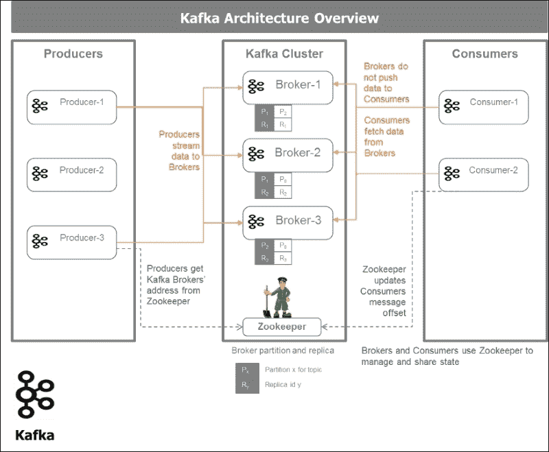

### 安装和测试 Kafka

我们将从[`kafka.apache.org/downloads.html`](http://kafka.apache.org/downloads.html)的专用网页下载 Apache Kafka 二进制文件，并按照以下步骤在我们的机器上安装软件：

1.  下载代码。

1.  下载 0.8.2.0 版本并 `un-tar` 它：

    ```py
    > tar -xzf kafka_2.10-0.8.2.0.tgz
    > cd kafka_2.10-0.8.2.0

    ```

1.  启动 `zooeper`。Kafka 使用 ZooKeeper，因此我们需要首先启动一个 ZooKeeper 服务器。我们将使用 Kafka 包含的便利脚本来获取单个节点的 ZooKeeper 实例。

    ```py
    > bin/zookeeper-server-start.sh config/zookeeper.properties
    an@an-VB:~/kafka/kafka_2.10-0.8.2.0$ bin/zookeeper-server-start.sh config/zookeeper.properties

    [2015-10-31 22:49:14,808] INFO Reading configuration from: config/zookeeper.properties (org.apache.zookeeper.server.quorum.QuorumPeerConfig)
    [2015-10-31 22:49:14,816] INFO autopurge.snapRetainCount set to 3 (org.apache.zookeeper.server.DatadirCleanupManager)...

    ```

1.  现在启动 Kafka 服务器：

    ```py
    > bin/kafka-server-start.sh config/server.properties

    an@an-VB:~/kafka/kafka_2.10-0.8.2.0$ bin/kafka-server-start.sh config/server.properties
    [2015-10-31 22:52:04,643] INFO Verifying properties (kafka.utils.VerifiableProperties)
    [2015-10-31 22:52:04,714] INFO Property broker.id is overridden to 0 (kafka.utils.VerifiableProperties)
    [2015-10-31 22:52:04,715] INFO Property log.cleaner.enable is overridden to false (kafka.utils.VerifiableProperties)
    [2015-10-31 22:52:04,715] INFO Property log.dirs is overridden to /tmp/kafka-logs (kafka.utils.VerifiableProperties) [2013-04-22 15:01:47,051] INFO Property socket.send.buffer.bytes is overridden to 1048576 (kafka.utils.VerifiableProperties)

    ```

1.  创建一个主题。让我们创建一个名为 test 的主题，它只有一个分区和一个副本：

    ```py
    > bin/kafka-topics.sh --create --zookeeper localhost:2181 --replication-factor 1 --partitions 1 --topic test

    ```

1.  如果我们运行 `list` 主题命令，现在我们可以看到该主题：

    ```py
    > bin/kafka-topics.sh --list --zookeeper localhost:2181
    Test
    an@an-VB:~/kafka/kafka_2.10-0.8.2.0$ bin/kafka-topics.sh --create --zookeeper localhost:2181 --replication-factor 1 --partitions 1 --topic test
    Created topic "test".
    an@an-VB:~/kafka/kafka_2.10-0.8.2.0$ bin/kafka-topics.sh --list --zookeeper localhost:2181
    test

    ```

1.  通过创建生产者和消费者来检查 Kafka 的安装。我们首先启动一个 `producer` 并在控制台输入一条消息：

    ```py
    an@an-VB:~/kafka/kafka_2.10-0.8.2.0$ bin/kafka-console-producer.sh --broker-list localhost:9092 --topic test
    [2015-10-31 22:54:43,698] WARN Property topic is not valid (kafka.utils.VerifiableProperties)
    This is a message
    This is another message

    ```

1.  然后我们启动一个消费者来检查我们是否接收到了消息：

    ```py
    an@an-VB:~$ cd kafka/
    an@an-VB:~/kafka$ cd kafka_2.10-0.8.2.0/
    an@an-VB:~/kafka/kafka_2.10-0.8.2.0$ bin/kafka-console-consumer.sh --zookeeper localhost:2181 --topic test --from-beginning
    This is a message
    This is another message

    ```

消费者适当地接收了消息：

1.  检查 Kafka 和 Spark Streaming 消费者。我们将使用 Spark 包中提供的 Spark Streaming Kafka 单词计数示例。提醒一下：当我们提交 Spark 作业时，我们必须绑定 Kafka 包，`--packages org.apache.spark:spark-streaming-kafka_2.10:1.5.0`。命令如下：

    ```py
    ./bin/spark-submit --packages org.apache.spark:spark-streaming-kafka_2.10:1.5.0 \ examples/src/main/python/streaming/kafka_wordcount.py \

    localhost:2181 test

    ```

1.  当我们使用 Kafka 启动 Spark Streaming 单词计数程序时，我们得到以下输出：

    ```py
    an@an-VB:~/spark/spark-1.5.0-bin-hadoop2.6$ ./bin/spark-submit --packages org.apache.spark:spark-streaming-kafka_2.10:1.5.0 examples/src/main/python/streaming/kafka_wordcount.py 
    localhost:2181 test

    -------------------------------------------
    Time: 2015-10-31 23:46:33
    -------------------------------------------
    (u'', 1)
    (u'from', 2)
    (u'Hello', 2)
    (u'Kafka', 2)

    -------------------------------------------
    Time: 2015-10-31 23:46:34
    -------------------------------------------

    -------------------------------------------
    Time: 2015-10-31 23:46:35
    -------------------------------------------

    ```

1.  为了能够以编程方式开发生产者和消费者，并与 Kafka 和 Spark 交互，请安装 Kafka Python 驱动程序。我们将使用 David Arthur（GitHub 上的 Mumrah）提供的经过实战检验的库。我们可以按照以下方式使用 pip 安装它：

    ```py
    > pip install kafka-python
    an@an-VB:~$ pip install kafka-python
    Collecting kafka-python
     Downloading kafka-python-0.9.4.tar.gz (63kB)
    ...
    Successfully installed kafka-python-0.9.4

    ```

### 开发生产者

以下程序创建了一个简单的 Kafka 生产者，该生产者将发送消息 *this is a message sent from the Kafka producer:* 五次，然后每秒跟一个时间戳：

```py
#
# kafka producer
#
#
import time
from kafka.common import LeaderNotAvailableError
from kafka.client import KafkaClient
from kafka.producer import SimpleProducer
from datetime import datetime

def print_response(response=None):
    if response:
        print('Error: {0}'.format(response[0].error))
        print('Offset: {0}'.format(response[0].offset))

def main():
    kafka = KafkaClient("localhost:9092")
    producer = SimpleProducer(kafka)
    try:
        time.sleep(5)
        topic = 'test'
        for i in range(5):
            time.sleep(1)
            msg = 'This is a message sent from the kafka producer: ' \
                  + str(datetime.now().time()) + ' -- '\
                  + str(datetime.now().strftime("%A, %d %B %Y %I:%M%p"))
            print_response(producer.send_messages(topic, msg))
    except LeaderNotAvailableError:
        # https://github.com/mumrah/kafka-python/issues/249
        time.sleep(1)
        print_response(producer.send_messages(topic, msg))

    kafka.close()

if __name__ == "__main__":
    main()
```

当我们运行此程序时，将生成以下输出：

```py
an@an-VB:~/spark/spark-1.5.0-bin-hadoop2.6/examples/AN_Spark/AN_Spark_Code$ python s08_kafka_producer_01.py
Error: 0
Offset: 13
Error: 0
Offset: 14
Error: 0
Offset: 15
Error: 0
Offset: 16
Error: 0
Offset: 17
an@an-VB:~/spark/spark-1.5.0-bin-hadoop2.6/examples/AN_Spark/AN_Spark_Code$

```

它告诉我们没有错误，并给出了 Kafka 代理提供的消息偏移量。

### 开发消费者

为了从 Kafka 代理中获取消息，我们开发了一个 Kafka 消费者：

```py
# kafka consumer
# consumes messages from "test" topic and writes them to console.
#
from kafka.client import KafkaClient
from kafka.consumer import SimpleConsumer

def main():
  kafka = KafkaClient("localhost:9092")
  print("Consumer established connection to kafka")
  consumer = SimpleConsumer(kafka, "my-group", "test")
  for message in consumer:
    # This will wait and print messages as they become available
    print(message)

if __name__ == "__main__":
    main()
```

当我们运行此程序时，我们实际上确认了消费者接收到了所有消息：

```py
an@an-VB:~$ cd ~/spark/spark-1.5.0-bin-hadoop2.6/examples/AN_Spark/AN_Spark_Code/
an@an-VB:~/spark/spark-1.5.0-bin-hadoop2.6/examples/AN_Spark/AN_Spark_Code$ python s08_kafka_consumer_01.py
Consumer established connection to kafka
OffsetAndMessage(offset=13, message=Message(magic=0, attributes=0, key=None, value='This is a message sent from the kafka producer: 11:50:17.867309Sunday, 01 November 2015 11:50AM'))
...
OffsetAndMessage(offset=17, message=Message(magic=0, attributes=0, key=None, value='This is a message sent from the kafka producer: 11:50:22.051423Sunday, 01 November 2015 11:50AM'))

```

### 开发 Kafka Spark Streaming 消费者

根据 Spark Streaming 包中提供的示例代码，我们将创建一个 Kafka 消费者用于 Spark Streaming 并对存储在代理中的消息进行词频统计：

```py
#
# Kafka Spark Streaming Consumer    
#
from __future__ import print_function

import sys

from pyspark import SparkContext
from pyspark.streaming import StreamingContext
from pyspark.streaming.kafka import KafkaUtils

if __name__ == "__main__":
    if len(sys.argv) != 3:
        print("Usage: kafka_spark_consumer_01.py <zk> <topic>", file=sys.stderr)
        exit(-1)

    sc = SparkContext(appName="PythonStreamingKafkaWordCount")
    ssc = StreamingContext(sc, 1)

    zkQuorum, topic = sys.argv[1:]
    kvs = KafkaUtils.createStream(ssc, zkQuorum, "spark-streaming-consumer", {topic: 1})
    lines = kvs.map(lambda x: x[1])
    counts = lines.flatMap(lambda line: line.split(" ")) \
        .map(lambda word: (word, 1)) \
        .reduceByKey(lambda a, b: a+b)
    counts.pprint()

    ssc.start()
    ssc.awaitTermination()
```

使用以下 Spark 提交命令运行此程序：

```py
./bin/spark-submit --packages org.apache.spark:spark-streaming-kafka_2.10:1.5.0 examples/AN_Spark/AN_Spark_Code/s08_kafka_spark_consumer_01.py localhost:2181 test
```

我们得到以下输出：

```py
an@an-VB:~$ cd spark/spark-1.5.0-bin-hadoop2.6/
an@an-VB:~/spark/spark-1.5.0-bin-hadoop2.6$ ./bin/spark-submit \
>     --packages org.apache.spark:spark-streaming-kafka_2.10:1.5.0 \
>     examples/AN_Spark/AN_Spark_Code/s08_kafka_spark_consumer_01.py localhost:2181 test
...
:: retrieving :: org.apache.spark#spark-submit-parent
  confs: [default]
  0 artifacts copied, 10 already retrieved (0kB/18ms)
-------------------------------------------
Time: 2015-11-01 12:13:16
-------------------------------------------

-------------------------------------------
Time: 2015-11-01 12:13:17
-------------------------------------------

-------------------------------------------
Time: 2015-11-01 12:13:18
-------------------------------------------

-------------------------------------------
Time: 2015-11-01 12:13:19
-------------------------------------------
(u'a', 5)
(u'the', 5)
(u'11:50AM', 5)
(u'from', 5)
(u'This', 5)
(u'11:50:21.044374Sunday,', 1)
(u'message', 5)
(u'11:50:20.036422Sunday,', 1)
(u'11:50:22.051423Sunday,', 1)
(u'11:50:17.867309Sunday,', 1)
...

-------------------------------------------
Time: 2015-11-01 12:13:20
-------------------------------------------

-------------------------------------------
Time: 2015-11-01 12:13:21
-------------------------------------------
```

## 探索 Flume

Flume 是一个持续摄取系统。它最初被设计为一个日志聚合系统，但它已经发展成可以处理任何类型的流式事件数据。

Flume 是一个分布式、可靠、可扩展和可用的管道系统，用于高效地收集、聚合和传输大量数据。它内置了对上下文路由、过滤复制和复用的支持。它具有鲁棒性和容错性，具有可调的可靠性机制和许多故障转移和恢复机制。它使用一个简单的可扩展数据模型，允许实时分析应用。

Flume 提供以下功能：

+   保证交付语义

+   低延迟可靠的数据传输

+   无需编码的声明性配置

+   可扩展和可定制的设置

+   与大多数常用端点的集成

Flume 的结构包含以下元素：

+   **Event**：事件是 Flume 从源传输到目的地的基本数据单元。它就像一个带有字节序列有效载荷的消息，对 Flume 来说是不可见的，并且可选的头部用于上下文路由。

+   **Client**：客户端产生并传输事件。客户端将 Flume 与数据消费者解耦。它是一个生成事件并将它们发送到一个或多个代理的实体。自定义客户端或 Flume log4J 追加程序或嵌入式应用程序代理可以是客户端。

+   **Agent**：代理是一个容器，它托管源、通道、接收器和其它元素，这些元素能够使事件从一个地方传输到另一个地方。它为托管组件提供配置、生命周期管理和监控。代理是一个运行 Flume 的物理 Java 虚拟机。

+   **Source**: Source 是 Flume 接收事件的实体。为了主动轮询数据或被动等待数据被传递给它们，源至少需要一个通道。各种源允许收集数据，例如 log4j 日志和 syslogs。

+   **Sink**: Sink 是从通道中提取数据并将其传递到下一个目的地的实体。各种 sink 允许数据流到各种目的地。Sinks 支持将数据序列化到用户格式。一个例子是 HDFS sink，它将事件写入 HDFS。

+   **Channel**: Channel 是源和 sink 之间的通道，它缓冲传入的事件，直到被 sink 清空。源将事件喂入通道，sink 清空通道。通道解耦了上游和下游系统的阻抗。上游的数据突发通过通道得到抑制。下游的故障被通道透明地吸收。根据这些事件调整通道容量是实现这些关键的关键。通道提供两种持久化级别：一种是内存通道，如果 JVM 崩溃则不可靠；另一种是支持写入前日志的文件通道，它将信息存储到磁盘上。通道是完全事务性的。

让我们通过以下示例说明所有这些概念：

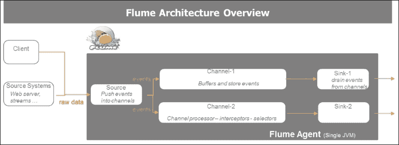

## 使用 Flume、Kafka 和 Spark 开发数据管道

构建弹性的数据管道利用了前几节中学到的知识。我们使用 Flume 进行数据摄取和传输，使用可靠且复杂的发布/订阅消息系统（如 Kafka）进行数据经纪，最后使用 Spark Streaming 在线处理计算。

以下图示说明了流式数据管道的组成，即一系列 *connect*、*collect*、*conduct*、*compose*、*consume*、*consign* 和 *control* 活动。这些活动可以根据用例进行配置：

+   Connect 建立与流式 API 的绑定。

+   Collect 创建收集线程。

+   Conduct 通过创建缓冲队列或发布/订阅机制将数据生产者与消费者解耦。

+   Compose 专注于数据处理。

+   Consume 为消费系统提供处理后的数据。Consign 负责数据持久化。

+   Control 负责系统、数据和应用的治理和监控。

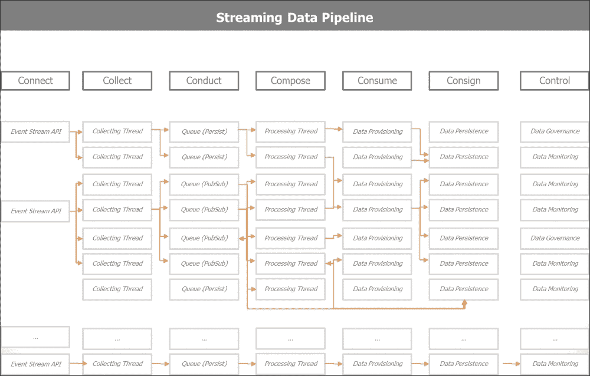

以下图示说明了流式数据管道的概念及其关键组件：Spark Streaming、Kafka、Flume 和低延迟数据库。在消费或控制应用程序中，我们实时监控我们的系统（由监控器表示）或发送实时警报（由红灯表示），以防某些阈值被跨越。

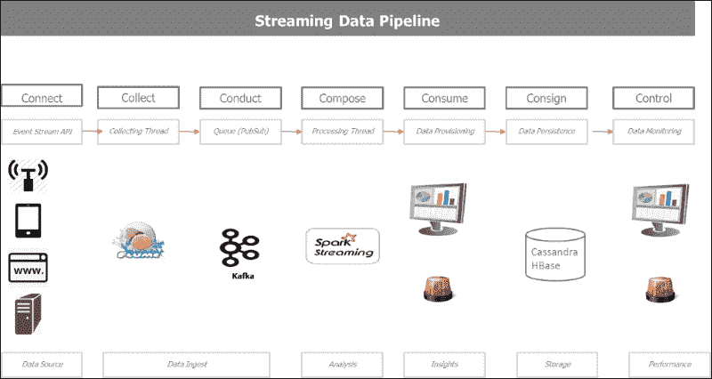

以下图表展示了 Spark 在单一平台上处理动态数据和静态数据的能力，同时根据用例需求无缝地与多个持久化数据存储进行接口交互。

此图表将到目前为止讨论的所有概念整合为一个统一整体。图表的上半部分描述了流处理管道。下半部分描述了批处理管道。它们在图表中间共享一个共同的持久化层，展示了各种持久化和序列化的模式。

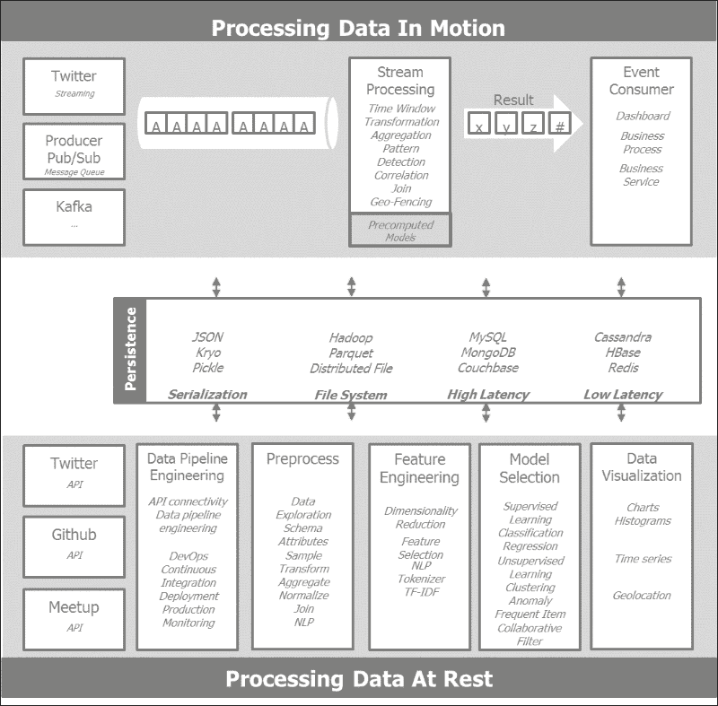

# 对 Lambda 和 Kappa 架构的总结评论

目前有两种架构范式流行：Lambda 和 Kappa 架构。

Lambda 架构是 Storm 的创造者和主要贡献者 Nathan Marz 的杰作。它本质上主张在所有数据上构建功能架构。该架构有两个分支。第一个是批处理分支，设想由 Hadoop 提供动力，用于预处理历史、高延迟、高吞吐量的数据，并使其准备好消费。实时分支设想由 Storm 提供动力，它处理增量流数据，实时提取洞察，并将汇总信息反馈到批存储。

Kappa 架构是 Kafka 的主要贡献者 Jay Kreps 及其在 Confluent（之前在 LinkedIn）的同事的杰作。它倡导全流式管道，在企业级别有效地实现了之前页面中宣布的统一日志。

## 理解 Lambda 架构

Lambda 架构结合批处理和流数据，为所有可用数据提供统一的查询机制。Lambda 架构设想了三层：一个存储预计算信息的批处理层，一个处理实时增量信息的速度层，以及最终合并批处理和实时视图以进行即席查询的服务层。以下图表给出了 Lambda 架构的概述：

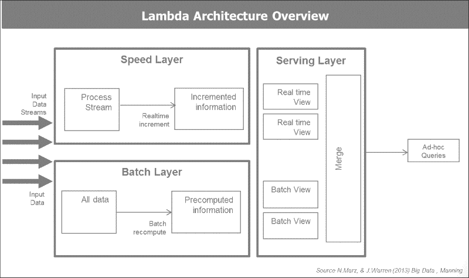

## 理解 Kappa 架构

Kappa 架构提出以流模式驱动整个企业。Kappa 架构起源于 LinkedIn 的 Jay Kreps 及其同事的批评。从那时起，他们搬到了 Confluent，并以 Apache Kafka 作为 Kappa 架构愿景的主要推动者。其基本原理是在所有流模式下移动，以统一日志作为企业信息架构的主要骨干。

统一日志是一种可供实时订阅的集中式企业结构化日志。所有组织的数据都放入一个中央日志中进行订阅。记录从零开始编号，以便写入。它也被称为提交日志或日志。统一日志的概念是 Kappa 架构的核心原则。

统一日志的特性如下：

+   **统一**: 整个组织只有一个部署

+   **只追加**: 事件是不可变的，并且是追加的

+   **有序**: 每个事件在分片中都有一个唯一的偏移量

+   **分布式**: 为了容错目的，统一的日志在计算机集群上冗余分布

+   **快速**: 系统能够每秒处理数千条消息

以下截图捕捉了 Jay Kreps 宣布他对 Lambda 架构保留意见的时刻。他对 Lambda 架构的主要保留意见是在两个不同的系统中实现相同的作业，即 Hadoop 和 Storm，每个系统都有其特定的特性，以及随之而来的所有复杂性。Kappa 架构在 Apache Kafka 驱动的相同框架中处理实时数据并重新处理历史数据。


# 摘要

在本章中，我们概述了流式架构应用的基础，并描述了它们的挑战、约束和优势。我们深入内部，检查了 Spark Streaming 的内部工作原理以及它与 Spark Core 的兼容性，并与 Spark SQL 和 Spark MLlib 进行了对话。我们使用 TCP 套接字说明了流式概念，随后直接从 Twitter 的 firehose 中实时摄取和处理推文。我们讨论了使用 Kafka 解耦上游数据发布与下游数据订阅和消费的概念，以最大限度地提高整体流式架构的弹性。我们还讨论了 Flume——一个可靠、灵活且可扩展的数据摄取和传输管道系统。Flume、Kafka 和 Spark 的组合在不断变化的环境中提供了无与伦比的鲁棒性、速度和敏捷性。我们以对两种流式架构范式——Lambda 和 Kappa 架构的一些评论和观察结束本章。

Lambda 架构在公共查询前端结合了批量和流数据。最初是考虑到 Hadoop 和 Storm 而设计的。Spark 有其自己的批量和流处理范式，并且提供了一个具有共同代码库的单个环境，有效地将这种架构范式付诸实践。

Kappa 架构推广了统一日志的概念，它创建了一个面向事件的架构，其中企业中的所有事件都通过一个集中提交日志进行通道，该日志对所有消费系统实时可用。

我们现在已准备好可视化迄今为止收集和处理的数据。
